# Opinion Poll by Ipsos for Het Laatste Nieuws, Le Soir, RTL TVi and VTM, 4–9 March 2020

<a href="#voting-intentions">Voting Intentions</a> | <a href="#seats">Seats</a> | <a href="#coalitions">Coalitions</a> | <a href="#technical-information">Technical Information</a>

## Voting Intentions

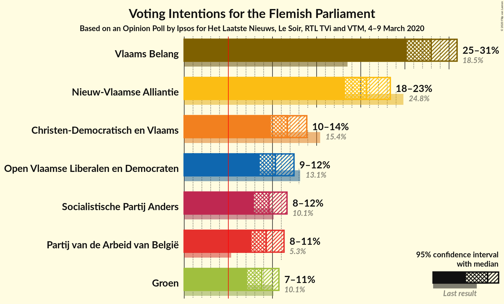

### Confidence Intervals

| Party | Last Result | Poll Result | 80% Confidence Interval | 90% Confidence Interval | 95% Confidence Interval | 99% Confidence Interval |
|:-----:|:-----------:|:-----------:|:-----------------------:|:-----------------------:|:-----------------------:|:-----------------------:|
| Vlaams Belang | 18.5% | 28.0% | 26.2–29.9% |25.7–30.4% |25.2–30.9% |24.4–31.8% |
| Nieuw-Vlaamse Alliantie | 24.8% | 20.7% | 19.1–22.4% |18.6–22.9% |18.2–23.4% |17.5–24.2% |
| Christen-Democratisch en Vlaams | 15.4% | 11.7% | 10.5–13.1% |10.1–13.5% |9.8–13.9% |9.2–14.6% |
| Open Vlaamse Liberalen en Democraten | 13.1% | 10.3% | 9.2–11.7% |8.8–12.1% |8.6–12.4% |8.0–13.1% |
| Vooruit | 10.1% | 9.6% | 8.5–10.9% |8.2–11.3% |7.9–11.6% |7.4–12.3% |
| Partij van de Arbeid van België | 5.3% | 9.3% | 8.2–10.6% |7.9–11.0% |7.6–11.3% |7.1–12.0% |
| Groen | 10.1% | 8.8% | 7.7–10.1% |7.4–10.4% |7.1–10.7% |6.6–11.4% |

*Note:* The poll result column reflects the actual value used in the calculations. Published results may vary slightly, and in addition be rounded to fewer digits.

## Seats

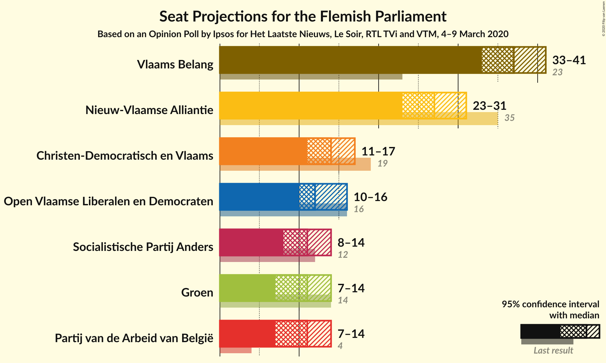

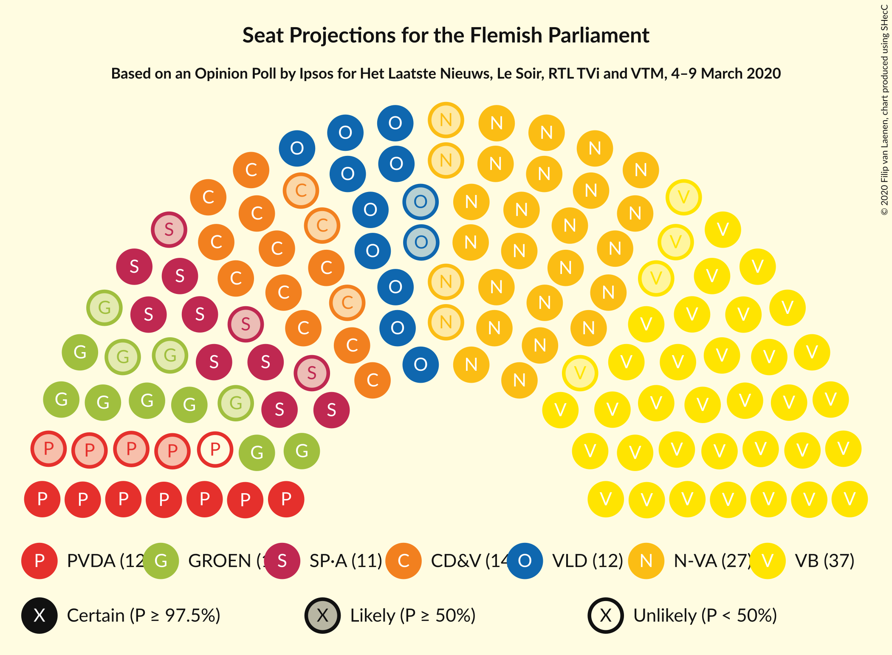

### Confidence Intervals

| Party | Last Result | Median | 80% Confidence Interval | 90% Confidence Interval | 95% Confidence Interval | 99% Confidence Interval |
|:-----:|:-----------:|:------:|:-----------------------:|:-----------------------:|:-----------------------:|:-----------------------:|
| <a href="#vlaams-belang">Vlaams Belang</a> | 23 | 37 | 34–40 |34–41 |33–41 |32–42 |
| <a href="#nieuw-vlaamse-alliantie">Nieuw-Vlaamse Alliantie</a> | 35 | 27 | 25–29 |24–30 |23–31 |22–33 |
| <a href="#christen-democratisch-en-vlaams">Christen-Democratisch en Vlaams</a> | 19 | 14 | 12–16 |12–16 |11–17 |10–18 |
| <a href="#open-vlaamse-liberalen-en-democraten">Open Vlaamse Liberalen en Democraten</a> | 16 | 12 | 11–15 |10–15 |10–16 |9–16 |
| <a href="#vooruit">Vooruit</a> | 12 | 11 | 10–14 |9–14 |8–14 |8–15 |
| <a href="#partij-van-de-arbeid-van-belgië">Partij van de Arbeid van België</a> | 4 | 11 | 8–13 |8–14 |7–14 |7–15 |
| <a href="#groen">Groen</a> | 14 | 11 | 9–14 |8–14 |7–14 |7–15 |

### Vlaams Belang

*For a full overview of the results for this party, see the [Vlaams Belang](party-vlaamsbelang.html) page.*

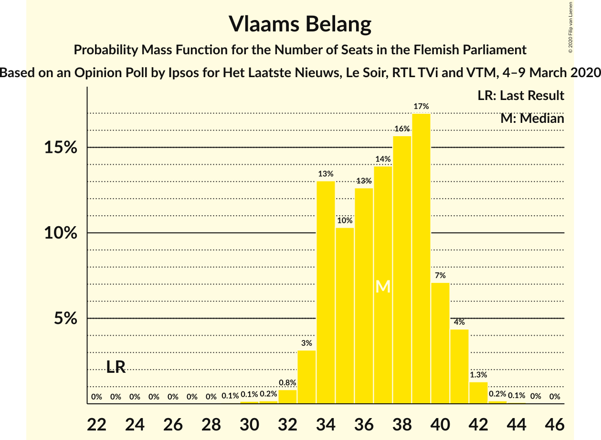

| Number of Seats | Probability | Accumulated | Special Marks |
|:---------------:|:-----------:|:-----------:|:-------------:|
| 23 | 0% | 100% | Last Result |
| 24 | 0% | 100% |  |
| 25 | 0% | 100% |  |
| 26 | 0% | 100% |  |
| 27 | 0% | 100% |  |
| 28 | 0% | 100% |  |
| 29 | 0.1% | 100% |  |
| 30 | 0.1% | 99.9% |  |
| 31 | 0.2% | 99.8% |  |
| 32 | 0.8% | 99.6% |  |
| 33 | 3% | 98.8% |  |
| 34 | 13% | 96% |  |
| 35 | 10% | 83% |  |
| 36 | 13% | 72% |  |
| 37 | 14% | 60% | Median |
| 38 | 16% | 46% |  |
| 39 | 17% | 30% |  |
| 40 | 7% | 13% |  |
| 41 | 4% | 6% |  |
| 42 | 1.3% | 2% |  |
| 43 | 0.2% | 0.3% |  |
| 44 | 0.1% | 0.1% |  |
| 45 | 0% | 0% |  |

### Nieuw-Vlaamse Alliantie

*For a full overview of the results for this party, see the [Nieuw-Vlaamse Alliantie](party-nieuw-vlaamsealliantie.html) page.*

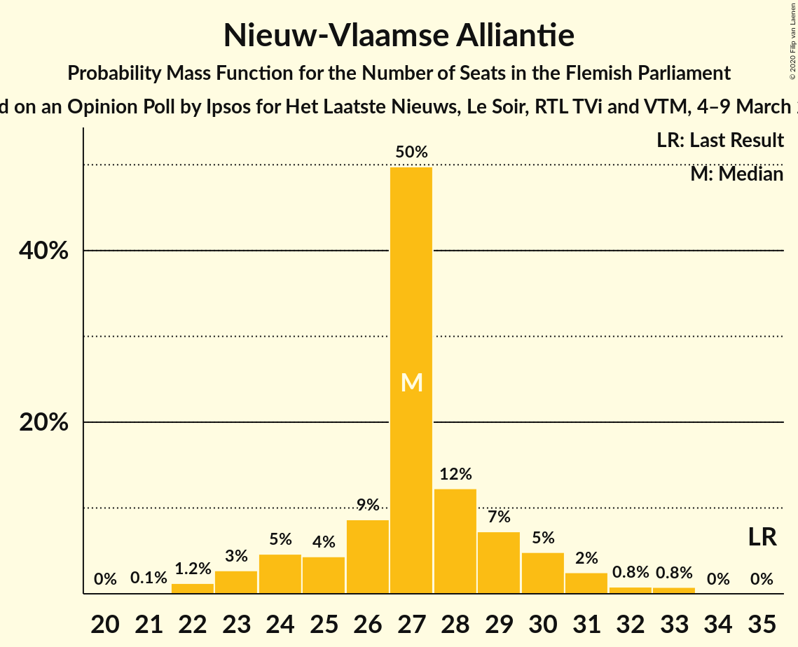

| Number of Seats | Probability | Accumulated | Special Marks |
|:---------------:|:-----------:|:-----------:|:-------------:|
| 21 | 0.1% | 100% |  |
| 22 | 1.2% | 99.8% |  |
| 23 | 3% | 98.6% |  |
| 24 | 5% | 96% |  |
| 25 | 4% | 91% |  |
| 26 | 9% | 87% |  |
| 27 | 50% | 78% | Median |
| 28 | 12% | 28% |  |
| 29 | 7% | 16% |  |
| 30 | 5% | 9% |  |
| 31 | 2% | 4% |  |
| 32 | 0.8% | 2% |  |
| 33 | 0.8% | 0.8% |  |
| 34 | 0% | 0% |  |
| 35 | 0% | 0% | Last Result |

### Christen-Democratisch en Vlaams

*For a full overview of the results for this party, see the [Christen-Democratisch en Vlaams](party-christen-democratischenvlaams.html) page.*

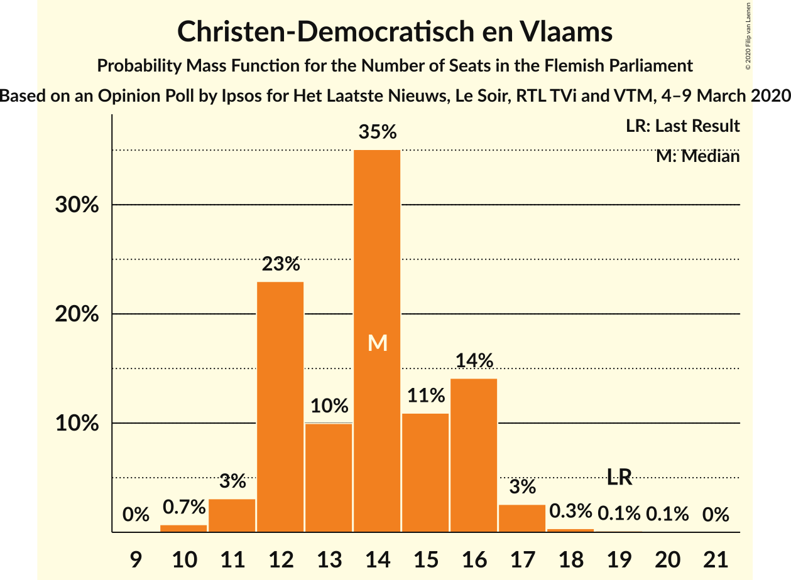

| Number of Seats | Probability | Accumulated | Special Marks |
|:---------------:|:-----------:|:-----------:|:-------------:|
| 10 | 0.7% | 100% |  |
| 11 | 3% | 99.3% |  |
| 12 | 23% | 96% |  |
| 13 | 10% | 73% |  |
| 14 | 35% | 63% | Median |
| 15 | 11% | 28% |  |
| 16 | 14% | 17% |  |
| 17 | 3% | 3% |  |
| 18 | 0.3% | 0.6% |  |
| 19 | 0.1% | 0.2% | Last Result |
| 20 | 0.1% | 0.1% |  |
| 21 | 0% | 0% |  |

### Open Vlaamse Liberalen en Democraten

*For a full overview of the results for this party, see the [Open Vlaamse Liberalen en Democraten](party-openvlaamseliberalenendemocraten.html) page.*

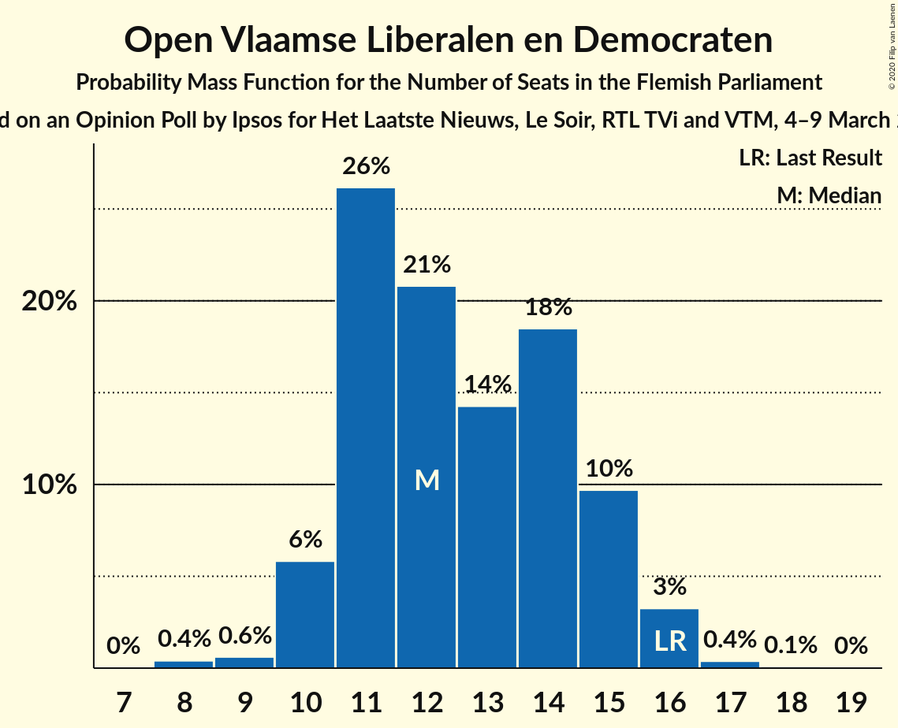

| Number of Seats | Probability | Accumulated | Special Marks |
|:---------------:|:-----------:|:-----------:|:-------------:|
| 8 | 0.4% | 100% |  |
| 9 | 0.6% | 99.6% |  |
| 10 | 6% | 99.0% |  |
| 11 | 26% | 93% |  |
| 12 | 21% | 67% | Median |
| 13 | 14% | 46% |  |
| 14 | 18% | 32% |  |
| 15 | 10% | 13% |  |
| 16 | 3% | 4% | Last Result |
| 17 | 0.4% | 0.5% |  |
| 18 | 0.1% | 0.1% |  |
| 19 | 0% | 0% |  |

### Vooruit

*For a full overview of the results for this party, see the [Vooruit](party-vooruit.html) page.*

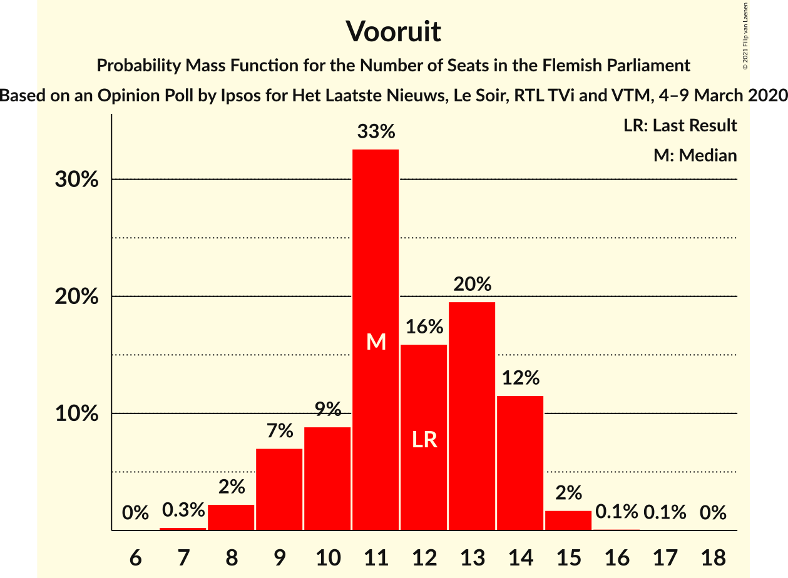

| Number of Seats | Probability | Accumulated | Special Marks |
|:---------------:|:-----------:|:-----------:|:-------------:|
| 7 | 0.3% | 100% |  |
| 8 | 2% | 99.7% |  |
| 9 | 7% | 97% |  |
| 10 | 9% | 90% |  |
| 11 | 33% | 82% | Median |
| 12 | 16% | 49% | Last Result |
| 13 | 20% | 33% |  |
| 14 | 12% | 13% |  |
| 15 | 2% | 2% |  |
| 16 | 0.1% | 0.2% |  |
| 17 | 0.1% | 0.1% |  |
| 18 | 0% | 0% |  |

### Partij van de Arbeid van België

*For a full overview of the results for this party, see the [Partij van de Arbeid van België](party-partijvandearbeidvanbelgië.html) page.*

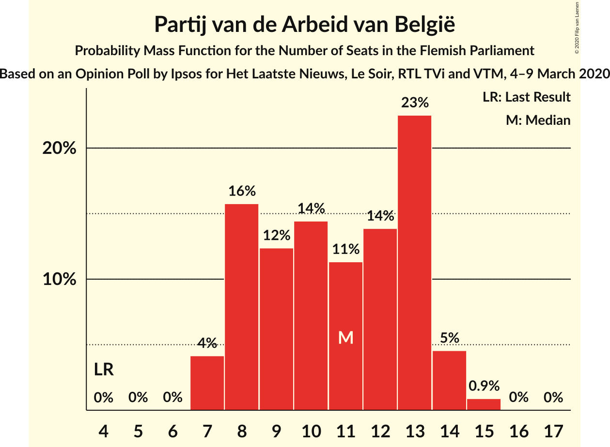

| Number of Seats | Probability | Accumulated | Special Marks |
|:---------------:|:-----------:|:-----------:|:-------------:|
| 4 | 0% | 100% | Last Result |
| 5 | 0% | 100% |  |
| 6 | 0% | 100% |  |
| 7 | 4% | 99.9% |  |
| 8 | 16% | 96% |  |
| 9 | 12% | 80% |  |
| 10 | 14% | 68% |  |
| 11 | 11% | 53% | Median |
| 12 | 14% | 42% |  |
| 13 | 23% | 28% |  |
| 14 | 5% | 5% |  |
| 15 | 0.9% | 0.9% |  |
| 16 | 0% | 0.1% |  |
| 17 | 0% | 0% |  |

### Groen

*For a full overview of the results for this party, see the [Groen](party-groen.html) page.*

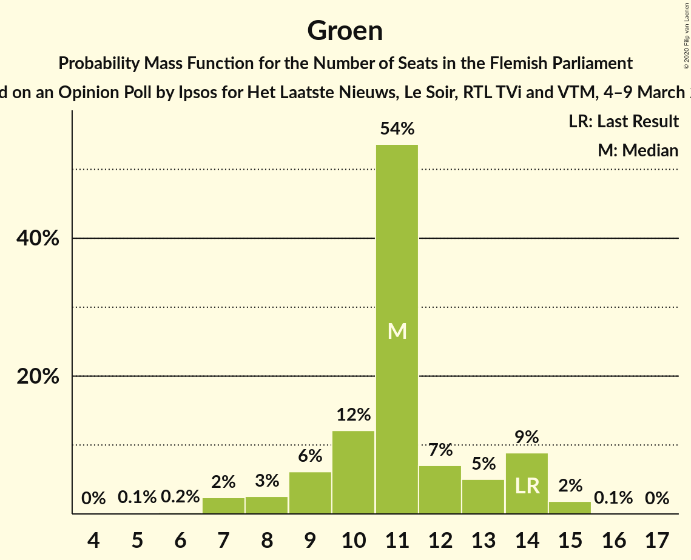

| Number of Seats | Probability | Accumulated | Special Marks |
|:---------------:|:-----------:|:-----------:|:-------------:|
| 5 | 0.1% | 100% |  |
| 6 | 0.2% | 99.9% |  |
| 7 | 2% | 99.7% |  |
| 8 | 3% | 97% |  |
| 9 | 6% | 95% |  |
| 10 | 12% | 89% |  |
| 11 | 54% | 77% | Median |
| 12 | 7% | 23% |  |
| 13 | 5% | 16% |  |
| 14 | 9% | 11% | Last Result |
| 15 | 2% | 2% |  |
| 16 | 0.1% | 0.1% |  |
| 17 | 0% | 0% |  |

## Coalitions

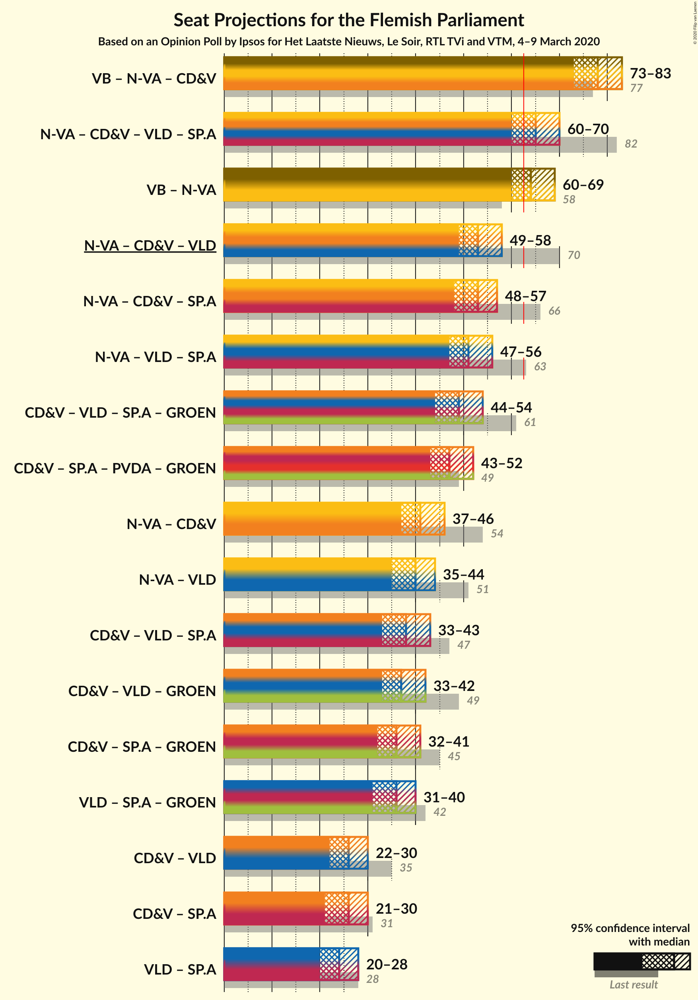

### Confidence Intervals

| Coalition | Last Result | Median | Majority? | 80% Confidence Interval | 90% Confidence Interval | 95% Confidence Interval | 99% Confidence Interval |
|:---------:|:-----------:|:------:|:---------:|:-----------------------:|:-----------------------:|:-----------------------:|:-----------------------:|
| Vlaams Belang – Nieuw-Vlaamse Alliantie – Christen-Democratisch en Vlaams | 77 | 78 | 100% | 75–81 | 74–82 | 73–83 | 72–84 |
| Nieuw-Vlaamse Alliantie – Christen-Democratisch en Vlaams – Open Vlaamse Liberalen en Democraten – Vooruit | 82 | 65 | 84% | 62–68 | 61–69 | 60–70 | 59–72 |
| Vlaams Belang – Nieuw-Vlaamse Alliantie | 58 | 64 | 74% | 61–67 | 60–68 | 60–69 | 58–70 |
| Nieuw-Vlaamse Alliantie – Christen-Democratisch en Vlaams – Open Vlaamse Liberalen en Democraten | 70 | 53 | 0% | 50–57 | 49–57 | 49–58 | 47–60 |
| Nieuw-Vlaamse Alliantie – Christen-Democratisch en Vlaams – Vooruit | 66 | 53 | 0% | 49–56 | 48–57 | 48–57 | 46–59 |
| Nieuw-Vlaamse Alliantie – Open Vlaamse Liberalen en Democraten – Vooruit | 63 | 51 | 0% | 48–54 | 48–56 | 47–56 | 45–58 |
| Christen-Democratisch en Vlaams – Open Vlaamse Liberalen en Democraten – Vooruit – Groen | 61 | 49 | 0% | 46–52 | 45–54 | 44–54 | 43–56 |
| Christen-Democratisch en Vlaams – Vooruit – Partij van de Arbeid van België – Groen | 49 | 47 | 0% | 44–51 | 44–51 | 43–52 | 41–54 |
| Nieuw-Vlaamse Alliantie – Christen-Democratisch en Vlaams | 54 | 41 | 0% | 38–44 | 37–45 | 37–46 | 35–47 |
| Nieuw-Vlaamse Alliantie – Open Vlaamse Liberalen en Democraten | 51 | 40 | 0% | 37–42 | 36–43 | 35–44 | 34–46 |
| Christen-Democratisch en Vlaams – Open Vlaamse Liberalen en Democraten – Vooruit | 47 | 38 | 0% | 35–41 | 34–42 | 33–43 | 32–44 |
| Christen-Democratisch en Vlaams – Open Vlaamse Liberalen en Democraten – Groen | 49 | 37 | 0% | 34–41 | 34–41 | 33–42 | 31–44 |
| Christen-Democratisch en Vlaams – Vooruit – Groen | 45 | 36 | 0% | 33–40 | 33–41 | 32–41 | 31–43 |
| Open Vlaamse Liberalen en Democraten – Vooruit – Groen | 42 | 36 | 0% | 32–38 | 31–39 | 31–40 | 29–42 |
| Christen-Democratisch en Vlaams – Open Vlaamse Liberalen en Democraten | 35 | 26 | 0% | 24–29 | 23–30 | 22–30 | 22–32 |
| Christen-Democratisch en Vlaams – Vooruit | 31 | 26 | 0% | 23–28 | 22–29 | 21–30 | 20–31 |
| Open Vlaamse Liberalen en Democraten – Vooruit | 28 | 24 | 0% | 21–27 | 21–28 | 20–28 | 19–30 |

### Vlaams Belang – Nieuw-Vlaamse Alliantie – Christen-Democratisch en Vlaams

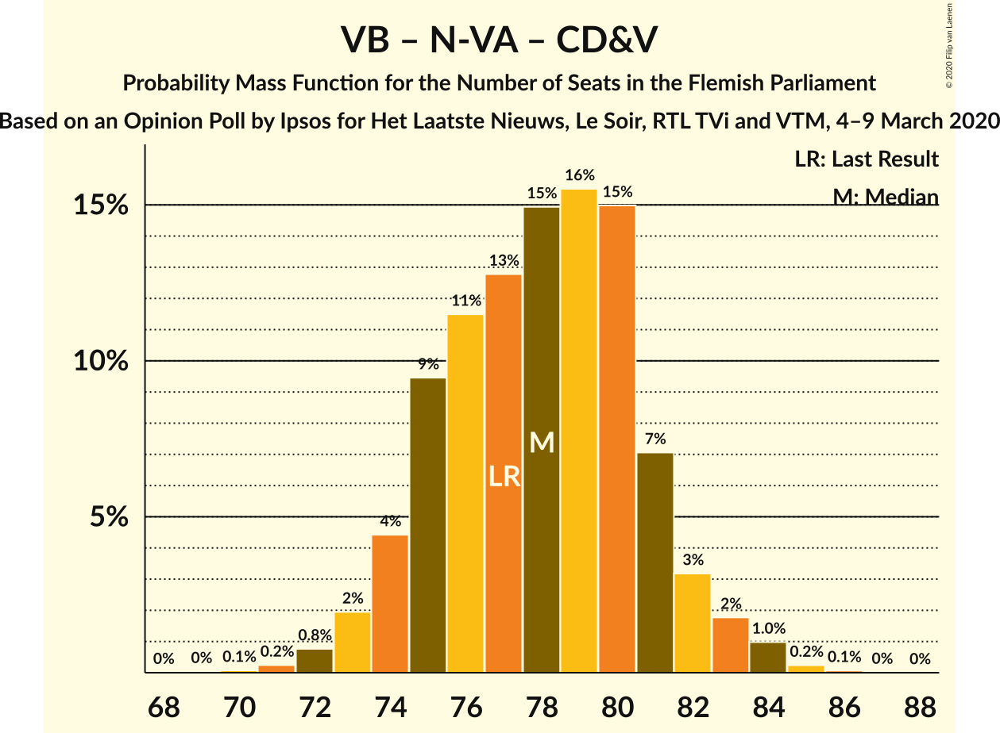

| Number of Seats | Probability | Accumulated | Special Marks |
|:---------------:|:-----------:|:-----------:|:-------------:|
| 69 | 0% | 100% |  |
| 70 | 0.1% | 99.9% |  |
| 71 | 0.2% | 99.9% |  |
| 72 | 0.8% | 99.6% |  |
| 73 | 2% | 98.9% |  |
| 74 | 4% | 97% |  |
| 75 | 9% | 92% |  |
| 76 | 11% | 83% |  |
| 77 | 13% | 72% | Last Result |
| 78 | 15% | 59% | Median |
| 79 | 16% | 44% |  |
| 80 | 15% | 28% |  |
| 81 | 7% | 13% |  |
| 82 | 3% | 6% |  |
| 83 | 2% | 3% |  |
| 84 | 1.0% | 1.3% |  |
| 85 | 0.2% | 0.3% |  |
| 86 | 0.1% | 0.1% |  |
| 87 | 0% | 0% |  |

### Nieuw-Vlaamse Alliantie – Christen-Democratisch en Vlaams – Open Vlaamse Liberalen en Democraten – Vooruit

| Number of Seats | Probability | Accumulated | Special Marks |
|:---------------:|:-----------:|:-----------:|:-------------:|
| 57 | 0.1% | 100% |  |
| 58 | 0.3% | 99.9% |  |
| 59 | 0.5% | 99.6% |  |
| 60 | 3% | 99.1% |  |
| 61 | 3% | 97% |  |
| 62 | 9% | 93% |  |
| 63 | 13% | 84% | Majority |
| 64 | 11% | 71% | Median |
| 65 | 15% | 59% |  |
| 66 | 12% | 44% |  |
| 67 | 12% | 32% |  |
| 68 | 12% | 20% |  |
| 69 | 4% | 8% |  |
| 70 | 2% | 4% |  |
| 71 | 1.1% | 2% |  |
| 72 | 0.4% | 0.6% |  |
| 73 | 0.1% | 0.2% |  |
| 74 | 0% | 0% |  |
| 75 | 0% | 0% |  |
| 76 | 0% | 0% |  |
| 77 | 0% | 0% |  |
| 78 | 0% | 0% |  |
| 79 | 0% | 0% |  |
| 80 | 0% | 0% |  |
| 81 | 0% | 0% |  |
| 82 | 0% | 0% | Last Result |

### Vlaams Belang – Nieuw-Vlaamse Alliantie

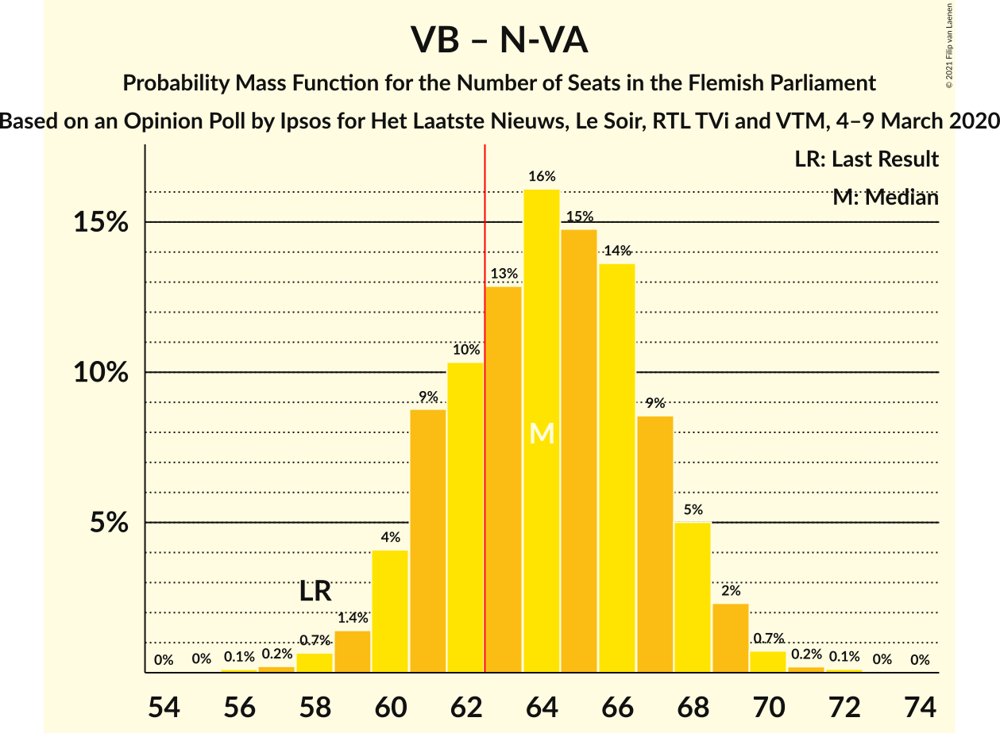

| Number of Seats | Probability | Accumulated | Special Marks |
|:---------------:|:-----------:|:-----------:|:-------------:|
| 55 | 0% | 100% |  |
| 56 | 0.1% | 99.9% |  |
| 57 | 0.2% | 99.8% |  |
| 58 | 0.7% | 99.6% | Last Result |
| 59 | 1.4% | 99.0% |  |
| 60 | 4% | 98% |  |
| 61 | 9% | 93% |  |
| 62 | 10% | 85% |  |
| 63 | 13% | 74% | Majority |
| 64 | 16% | 61% | Median |
| 65 | 15% | 45% |  |
| 66 | 14% | 31% |  |
| 67 | 9% | 17% |  |
| 68 | 5% | 8% |  |
| 69 | 2% | 3% |  |
| 70 | 0.7% | 1.1% |  |
| 71 | 0.2% | 0.4% |  |
| 72 | 0.1% | 0.2% |  |
| 73 | 0% | 0% |  |

### Nieuw-Vlaamse Alliantie – Christen-Democratisch en Vlaams – Open Vlaamse Liberalen en Democraten

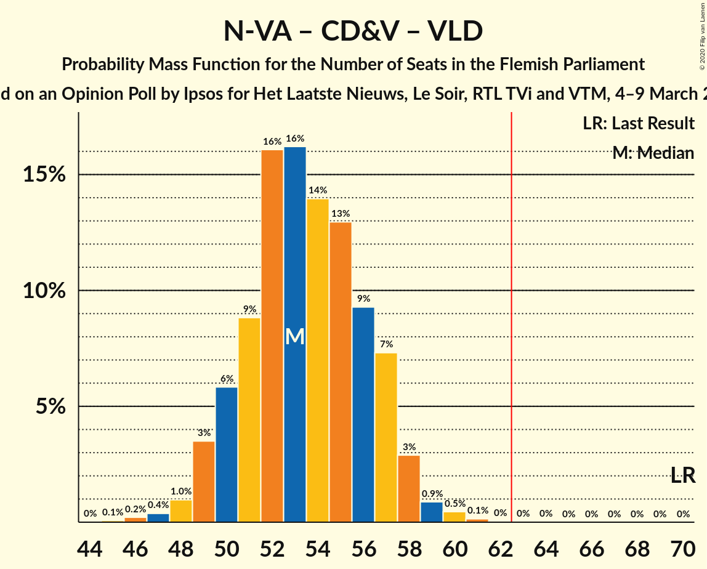

| Number of Seats | Probability | Accumulated | Special Marks |
|:---------------:|:-----------:|:-----------:|:-------------:|
| 45 | 0.1% | 100% |  |
| 46 | 0.2% | 99.9% |  |
| 47 | 0.4% | 99.7% |  |
| 48 | 1.0% | 99.3% |  |
| 49 | 3% | 98% |  |
| 50 | 6% | 95% |  |
| 51 | 9% | 89% |  |
| 52 | 16% | 80% |  |
| 53 | 16% | 64% | Median |
| 54 | 14% | 48% |  |
| 55 | 13% | 34% |  |
| 56 | 9% | 21% |  |
| 57 | 7% | 12% |  |
| 58 | 3% | 4% |  |
| 59 | 0.9% | 2% |  |
| 60 | 0.5% | 0.6% |  |
| 61 | 0.1% | 0.2% |  |
| 62 | 0% | 0% |  |
| 63 | 0% | 0% | Majority |
| 64 | 0% | 0% |  |
| 65 | 0% | 0% |  |
| 66 | 0% | 0% |  |
| 67 | 0% | 0% |  |
| 68 | 0% | 0% |  |
| 69 | 0% | 0% |  |
| 70 | 0% | 0% | Last Result |

### Nieuw-Vlaamse Alliantie – Christen-Democratisch en Vlaams – Vooruit

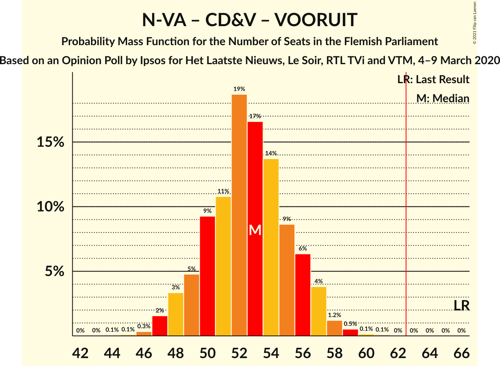

| Number of Seats | Probability | Accumulated | Special Marks |
|:---------------:|:-----------:|:-----------:|:-------------:|
| 44 | 0.1% | 100% |  |
| 45 | 0.1% | 99.9% |  |
| 46 | 0.3% | 99.8% |  |
| 47 | 2% | 99.5% |  |
| 48 | 3% | 98% |  |
| 49 | 5% | 95% |  |
| 50 | 9% | 90% |  |
| 51 | 11% | 81% |  |
| 52 | 19% | 70% | Median |
| 53 | 17% | 51% |  |
| 54 | 14% | 34% |  |
| 55 | 9% | 21% |  |
| 56 | 6% | 12% |  |
| 57 | 4% | 6% |  |
| 58 | 1.2% | 2% |  |
| 59 | 0.5% | 0.8% |  |
| 60 | 0.1% | 0.2% |  |
| 61 | 0.1% | 0.1% |  |
| 62 | 0% | 0% |  |
| 63 | 0% | 0% | Majority |
| 64 | 0% | 0% |  |
| 65 | 0% | 0% |  |
| 66 | 0% | 0% | Last Result |

### Nieuw-Vlaamse Alliantie – Open Vlaamse Liberalen en Democraten – Vooruit

| Number of Seats | Probability | Accumulated | Special Marks |
|:---------------:|:-----------:|:-----------:|:-------------:|
| 43 | 0.1% | 100% |  |
| 44 | 0.2% | 99.9% |  |
| 45 | 0.5% | 99.7% |  |
| 46 | 1.2% | 99.2% |  |
| 47 | 3% | 98% |  |
| 48 | 8% | 95% |  |
| 49 | 12% | 87% |  |
| 50 | 12% | 75% | Median |
| 51 | 13% | 62% |  |
| 52 | 17% | 49% |  |
| 53 | 13% | 32% |  |
| 54 | 10% | 19% |  |
| 55 | 4% | 9% |  |
| 56 | 4% | 5% |  |
| 57 | 1.2% | 2% |  |
| 58 | 0.5% | 0.6% |  |
| 59 | 0.1% | 0.2% |  |
| 60 | 0.1% | 0.1% |  |
| 61 | 0% | 0% |  |
| 62 | 0% | 0% |  |
| 63 | 0% | 0% | Last Result, Majority |

### Christen-Democratisch en Vlaams – Open Vlaamse Liberalen en Democraten – Vooruit – Groen

| Number of Seats | Probability | Accumulated | Special Marks |
|:---------------:|:-----------:|:-----------:|:-------------:|
| 41 | 0.1% | 100% |  |
| 42 | 0.2% | 99.9% |  |
| 43 | 0.9% | 99.7% |  |
| 44 | 2% | 98.7% |  |
| 45 | 4% | 96% |  |
| 46 | 10% | 93% |  |
| 47 | 12% | 83% |  |
| 48 | 12% | 71% | Median |
| 49 | 13% | 59% |  |
| 50 | 15% | 46% |  |
| 51 | 13% | 31% |  |
| 52 | 9% | 18% |  |
| 53 | 4% | 9% |  |
| 54 | 3% | 5% |  |
| 55 | 1.3% | 2% |  |
| 56 | 0.6% | 0.8% |  |
| 57 | 0.1% | 0.2% |  |
| 58 | 0% | 0% |  |
| 59 | 0% | 0% |  |
| 60 | 0% | 0% |  |
| 61 | 0% | 0% | Last Result |

### Christen-Democratisch en Vlaams – Vooruit – Partij van de Arbeid van België – Groen

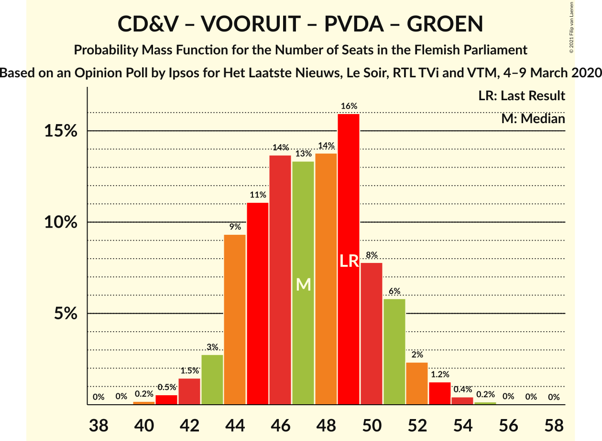

| Number of Seats | Probability | Accumulated | Special Marks |
|:---------------:|:-----------:|:-----------:|:-------------:|
| 39 | 0% | 100% |  |
| 40 | 0.2% | 99.9% |  |
| 41 | 0.5% | 99.8% |  |
| 42 | 1.5% | 99.2% |  |
| 43 | 3% | 98% |  |
| 44 | 9% | 95% |  |
| 45 | 11% | 86% |  |
| 46 | 14% | 75% |  |
| 47 | 13% | 61% | Median |
| 48 | 14% | 48% |  |
| 49 | 16% | 34% | Last Result |
| 50 | 8% | 18% |  |
| 51 | 6% | 10% |  |
| 52 | 2% | 4% |  |
| 53 | 1.2% | 2% |  |
| 54 | 0.4% | 0.7% |  |
| 55 | 0.2% | 0.2% |  |
| 56 | 0% | 0.1% |  |
| 57 | 0% | 0% |  |

### Nieuw-Vlaamse Alliantie – Christen-Democratisch en Vlaams

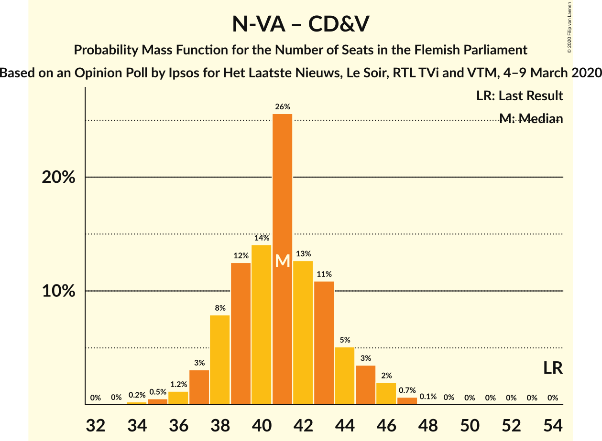

| Number of Seats | Probability | Accumulated | Special Marks |
|:---------------:|:-----------:|:-----------:|:-------------:|
| 33 | 0% | 100% |  |
| 34 | 0.2% | 99.9% |  |
| 35 | 0.5% | 99.7% |  |
| 36 | 1.2% | 99.2% |  |
| 37 | 3% | 98% |  |
| 38 | 8% | 95% |  |
| 39 | 12% | 87% |  |
| 40 | 14% | 75% |  |
| 41 | 26% | 60% | Median |
| 42 | 13% | 35% |  |
| 43 | 11% | 22% |  |
| 44 | 5% | 11% |  |
| 45 | 3% | 6% |  |
| 46 | 2% | 3% |  |
| 47 | 0.7% | 0.8% |  |
| 48 | 0.1% | 0.2% |  |
| 49 | 0% | 0.1% |  |
| 50 | 0% | 0% |  |
| 51 | 0% | 0% |  |
| 52 | 0% | 0% |  |
| 53 | 0% | 0% |  |
| 54 | 0% | 0% | Last Result |

### Nieuw-Vlaamse Alliantie – Open Vlaamse Liberalen en Democraten

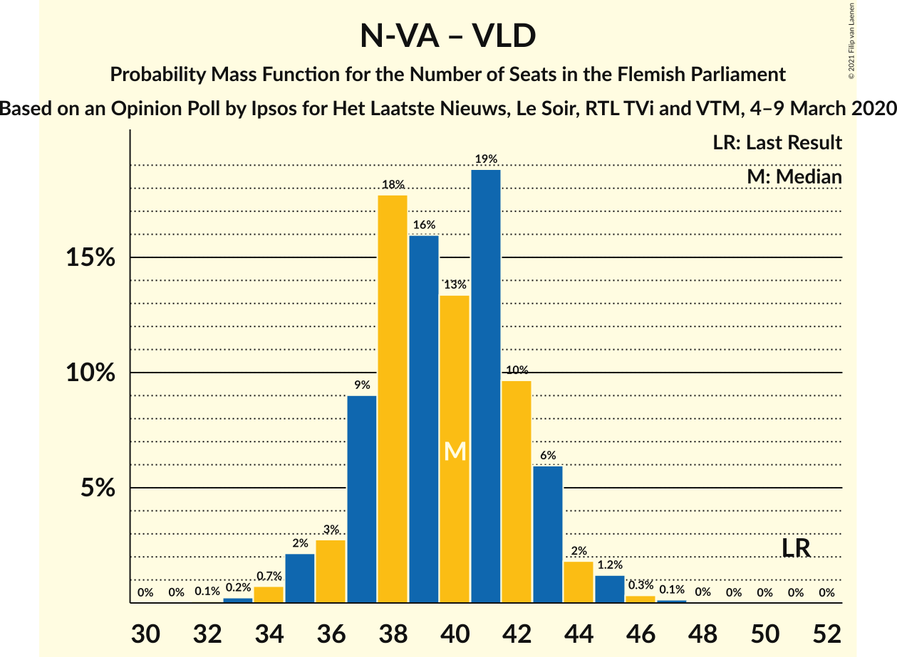

| Number of Seats | Probability | Accumulated | Special Marks |
|:---------------:|:-----------:|:-----------:|:-------------:|
| 32 | 0.1% | 100% |  |
| 33 | 0.2% | 99.9% |  |
| 34 | 0.7% | 99.7% |  |
| 35 | 2% | 99.0% |  |
| 36 | 3% | 97% |  |
| 37 | 9% | 94% |  |
| 38 | 18% | 85% |  |
| 39 | 16% | 67% | Median |
| 40 | 13% | 51% |  |
| 41 | 19% | 38% |  |
| 42 | 10% | 19% |  |
| 43 | 6% | 9% |  |
| 44 | 2% | 4% |  |
| 45 | 1.2% | 2% |  |
| 46 | 0.3% | 0.5% |  |
| 47 | 0.1% | 0.2% |  |
| 48 | 0% | 0% |  |
| 49 | 0% | 0% |  |
| 50 | 0% | 0% |  |
| 51 | 0% | 0% | Last Result |

### Christen-Democratisch en Vlaams – Open Vlaamse Liberalen en Democraten – Vooruit

| Number of Seats | Probability | Accumulated | Special Marks |
|:---------------:|:-----------:|:-----------:|:-------------:|
| 31 | 0.1% | 100% |  |
| 32 | 0.7% | 99.8% |  |
| 33 | 2% | 99.1% |  |
| 34 | 3% | 97% |  |
| 35 | 9% | 94% |  |
| 36 | 12% | 84% |  |
| 37 | 14% | 72% | Median |
| 38 | 15% | 58% |  |
| 39 | 15% | 43% |  |
| 40 | 13% | 29% |  |
| 41 | 9% | 16% |  |
| 42 | 4% | 7% |  |
| 43 | 2% | 3% |  |
| 44 | 0.6% | 0.9% |  |
| 45 | 0.3% | 0.3% |  |
| 46 | 0.1% | 0.1% |  |
| 47 | 0% | 0% | Last Result |

### Christen-Democratisch en Vlaams – Open Vlaamse Liberalen en Democraten – Groen

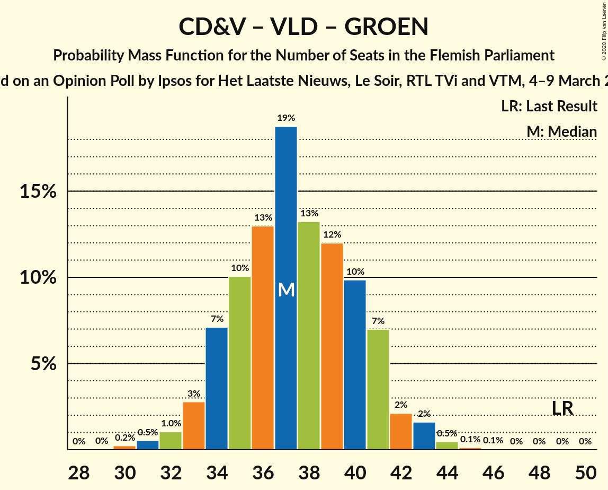

| Number of Seats | Probability | Accumulated | Special Marks |
|:---------------:|:-----------:|:-----------:|:-------------:|
| 30 | 0.2% | 100% |  |
| 31 | 0.5% | 99.7% |  |
| 32 | 1.0% | 99.2% |  |
| 33 | 3% | 98% |  |
| 34 | 7% | 95% |  |
| 35 | 10% | 88% |  |
| 36 | 13% | 78% |  |
| 37 | 19% | 65% | Median |
| 38 | 13% | 46% |  |
| 39 | 12% | 33% |  |
| 40 | 10% | 21% |  |
| 41 | 7% | 11% |  |
| 42 | 2% | 4% |  |
| 43 | 2% | 2% |  |
| 44 | 0.5% | 0.7% |  |
| 45 | 0.1% | 0.2% |  |
| 46 | 0.1% | 0.1% |  |
| 47 | 0% | 0% |  |
| 48 | 0% | 0% |  |
| 49 | 0% | 0% | Last Result |

### Christen-Democratisch en Vlaams – Vooruit – Groen

| Number of Seats | Probability | Accumulated | Special Marks |
|:---------------:|:-----------:|:-----------:|:-------------:|
| 29 | 0.1% | 100% |  |
| 30 | 0.3% | 99.9% |  |
| 31 | 1.4% | 99.6% |  |
| 32 | 3% | 98% |  |
| 33 | 5% | 95% |  |
| 34 | 9% | 90% |  |
| 35 | 11% | 81% |  |
| 36 | 22% | 70% | Median |
| 37 | 14% | 48% |  |
| 38 | 14% | 34% |  |
| 39 | 9% | 20% |  |
| 40 | 6% | 11% |  |
| 41 | 3% | 5% |  |
| 42 | 2% | 2% |  |
| 43 | 0.4% | 0.6% |  |
| 44 | 0.2% | 0.2% |  |
| 45 | 0% | 0% | Last Result |

### Open Vlaamse Liberalen en Democraten – Vooruit – Groen

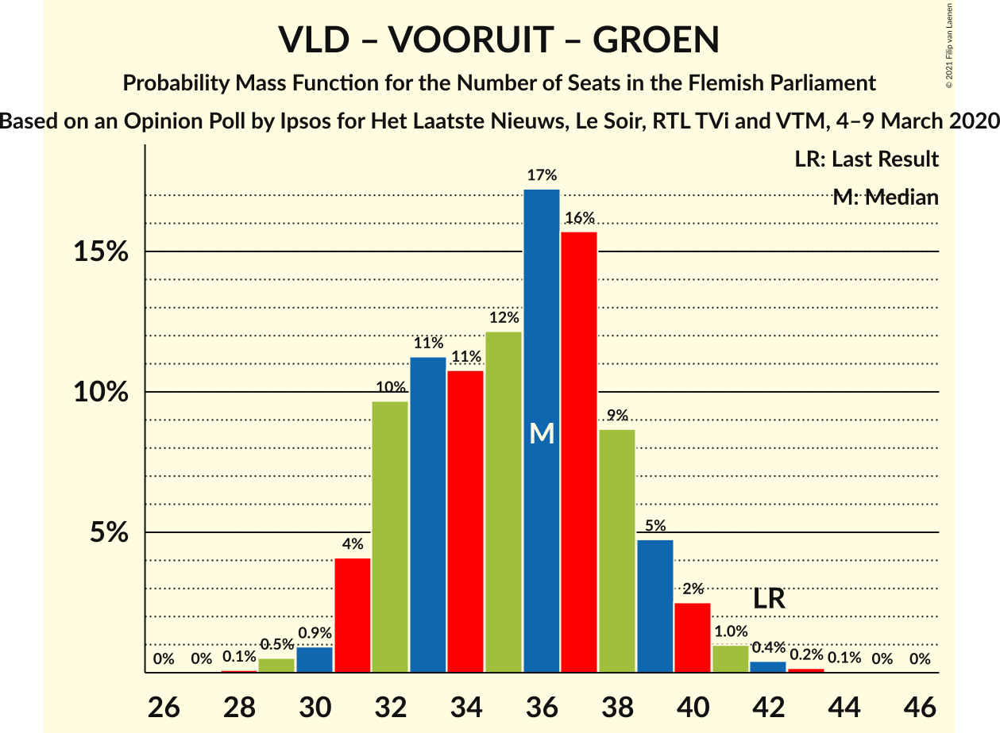

| Number of Seats | Probability | Accumulated | Special Marks |
|:---------------:|:-----------:|:-----------:|:-------------:|
| 28 | 0.1% | 100% |  |
| 29 | 0.5% | 99.9% |  |
| 30 | 0.9% | 99.4% |  |
| 31 | 4% | 98% |  |
| 32 | 10% | 94% |  |
| 33 | 11% | 85% |  |
| 34 | 11% | 73% | Median |
| 35 | 12% | 63% |  |
| 36 | 17% | 50% |  |
| 37 | 16% | 33% |  |
| 38 | 9% | 18% |  |
| 39 | 5% | 9% |  |
| 40 | 2% | 4% |  |
| 41 | 1.0% | 2% |  |
| 42 | 0.4% | 0.6% | Last Result |
| 43 | 0.2% | 0.2% |  |
| 44 | 0.1% | 0.1% |  |
| 45 | 0% | 0% |  |

### Christen-Democratisch en Vlaams – Open Vlaamse Liberalen en Democraten

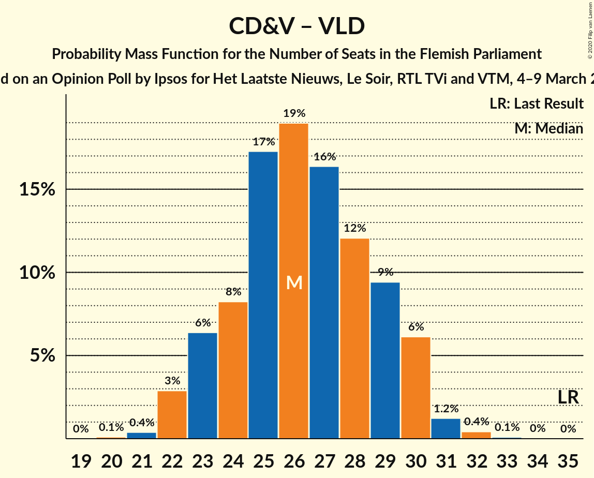

| Number of Seats | Probability | Accumulated | Special Marks |
|:---------------:|:-----------:|:-----------:|:-------------:|
| 20 | 0.1% | 100% |  |
| 21 | 0.4% | 99.9% |  |
| 22 | 3% | 99.5% |  |
| 23 | 6% | 97% |  |
| 24 | 8% | 90% |  |
| 25 | 17% | 82% |  |
| 26 | 19% | 65% | Median |
| 27 | 16% | 46% |  |
| 28 | 12% | 29% |  |
| 29 | 9% | 17% |  |
| 30 | 6% | 8% |  |
| 31 | 1.2% | 2% |  |
| 32 | 0.4% | 0.6% |  |
| 33 | 0.1% | 0.1% |  |
| 34 | 0% | 0% |  |
| 35 | 0% | 0% | Last Result |

### Christen-Democratisch en Vlaams – Vooruit

| Number of Seats | Probability | Accumulated | Special Marks |
|:---------------:|:-----------:|:-----------:|:-------------:|
| 19 | 0.1% | 100% |  |
| 20 | 0.8% | 99.9% |  |
| 21 | 2% | 99.1% |  |
| 22 | 5% | 97% |  |
| 23 | 9% | 92% |  |
| 24 | 11% | 83% |  |
| 25 | 22% | 72% | Median |
| 26 | 20% | 50% |  |
| 27 | 15% | 30% |  |
| 28 | 8% | 15% |  |
| 29 | 4% | 7% |  |
| 30 | 2% | 3% |  |
| 31 | 0.6% | 0.7% | Last Result |
| 32 | 0.1% | 0.1% |  |
| 33 | 0% | 0% |  |

### Open Vlaamse Liberalen en Democraten – Vooruit

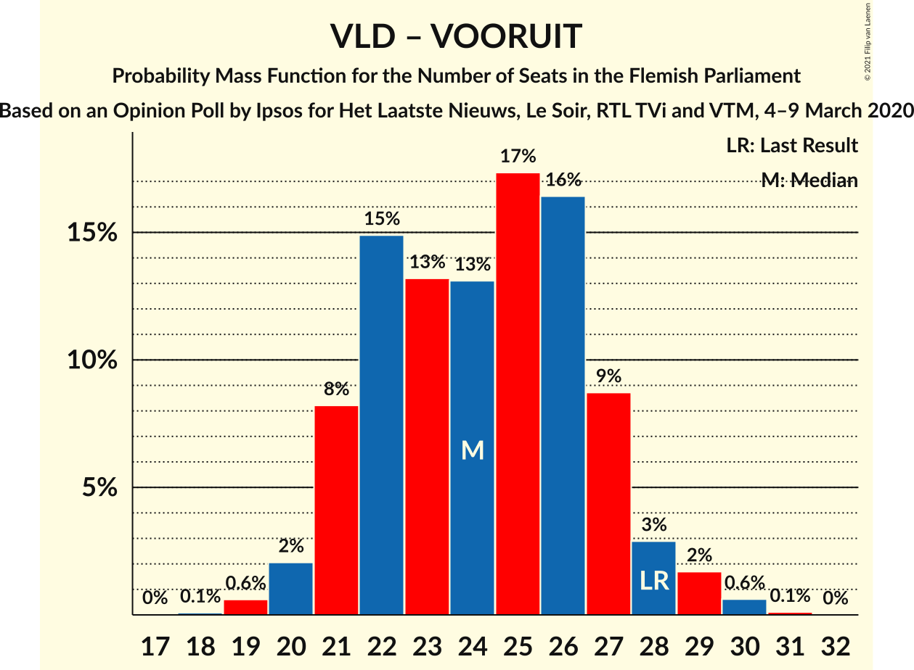

| Number of Seats | Probability | Accumulated | Special Marks |
|:---------------:|:-----------:|:-----------:|:-------------:|
| 18 | 0.1% | 100% |  |
| 19 | 0.6% | 99.9% |  |
| 20 | 2% | 99.3% |  |
| 21 | 8% | 97% |  |
| 22 | 15% | 89% |  |
| 23 | 13% | 74% | Median |
| 24 | 13% | 61% |  |
| 25 | 17% | 48% |  |
| 26 | 16% | 30% |  |
| 27 | 9% | 14% |  |
| 28 | 3% | 5% | Last Result |
| 29 | 2% | 2% |  |
| 30 | 0.6% | 0.7% |  |
| 31 | 0.1% | 0.1% |  |
| 32 | 0% | 0% |  |

## Technical Information

### Opinion Poll

+ **Polling firm:** Ipsos
+ **Commissioner(s):** Het Laatste Nieuws, Le Soir, RTL TVi and VTM
+ **Fieldwork period:** 4–9 March 2020

### Calculations

+ **Sample size:** 958
+ **Simulations done:** 1,048,576
+ **Error estimate:** 1.42%

