# Opinion Poll by TNS for De Standaard, La Libre Belgique, RTBf and VRT, 9–28 April 2020

<a href="#voting-intentions">Voting Intentions</a> | <a href="#seats">Seats</a> | <a href="#coalitions">Coalitions</a> | <a href="#technical-information">Technical Information</a>

## Voting Intentions

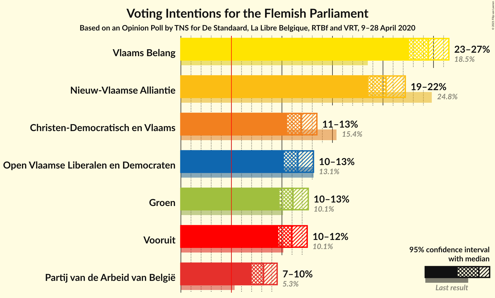

### Confidence Intervals

| Party | Last Result | Poll Result | 80% Confidence Interval | 90% Confidence Interval | 95% Confidence Interval | 99% Confidence Interval |
|:-----:|:-----------:|:-----------:|:-----------------------:|:-----------------------:|:-----------------------:|:-----------------------:|
| Vlaams Belang | 18.5% | 24.5% | 23.2–25.8% |22.9–26.2% |22.6–26.5% |22.0–27.2% |
| Nieuw-Vlaamse Alliantie | 24.8% | 20.3% | 19.1–21.5% |18.8–21.9% |18.5–22.2% |18.0–22.8% |
| Christen-Democratisch en Vlaams | 15.4% | 11.9% | 11.0–12.9% |10.7–13.2% |10.5–13.5% |10.1–14.0% |
| Open Vlaamse Liberalen en Democraten | 13.1% | 11.6% | 10.7–12.6% |10.4–12.9% |10.2–13.1% |9.8–13.6% |
| Groen | 10.1% | 11.1% | 10.2–12.1% |10.0–12.4% |9.7–12.6% |9.3–13.1% |
| Socialistische Partij Anders | 10.1% | 11.0% | 10.1–12.0% |9.8–12.3% |9.6–12.5% |9.2–13.0% |
| Partij van de Arbeid van België | 5.3% | 8.2% | 7.4–9.1% |7.2–9.3% |7.0–9.5% |6.7–10.0% |

*Note:* The poll result column reflects the actual value used in the calculations. Published results may vary slightly, and in addition be rounded to fewer digits.

## Seats

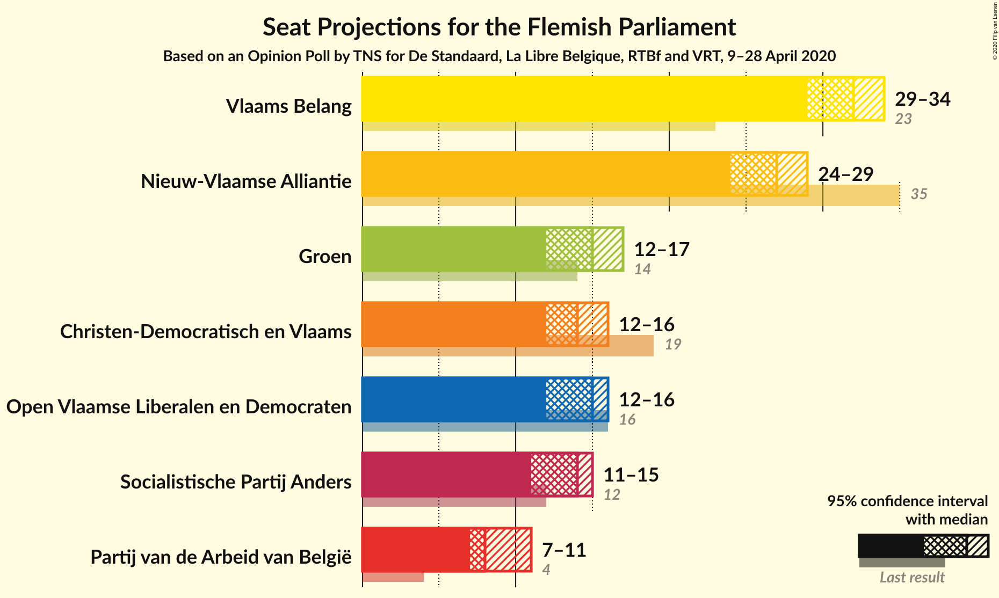

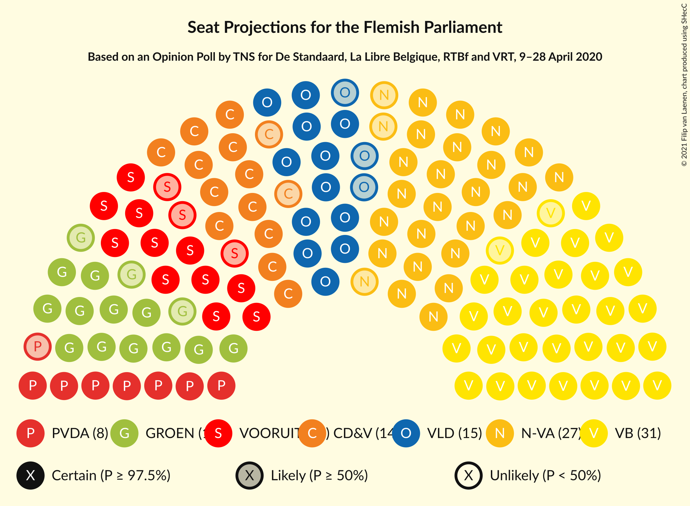

### Confidence Intervals

| Party | Last Result | Median | 80% Confidence Interval | 90% Confidence Interval | 95% Confidence Interval | 99% Confidence Interval |
|:-----:|:-----------:|:------:|:-----------------------:|:-----------------------:|:-----------------------:|:-----------------------:|
| <a href="#vlaams-belang">Vlaams Belang</a> | 23 | 32 | 30–34 |29–34 |29–34 |28–36 |
| <a href="#nieuw-vlaamse-alliantie">Nieuw-Vlaamse Alliantie</a> | 35 | 27 | 25–28 |24–28 |24–29 |23–30 |
| <a href="#christen-democratisch-en-vlaams">Christen-Democratisch en Vlaams</a> | 19 | 14 | 12–16 |12–16 |12–16 |11–16 |
| <a href="#open-vlaamse-liberalen-en-democraten">Open Vlaamse Liberalen en Democraten</a> | 16 | 15 | 13–16 |12–16 |12–16 |11–17 |
| <a href="#groen">Groen</a> | 14 | 15 | 14–16 |13–16 |12–17 |11–18 |
| <a href="#socialistische-partij-anders">Socialistische Partij Anders</a> | 12 | 14 | 12–15 |12–15 |11–15 |11–16 |
| <a href="#partij-van-de-arbeid-van-belgië">Partij van de Arbeid van België</a> | 4 | 8 | 7–9 |7–10 |7–11 |7–13 |

### Vlaams Belang

*For a full overview of the results for this party, see the [Vlaams Belang](party-vlaamsbelang.html) page.*

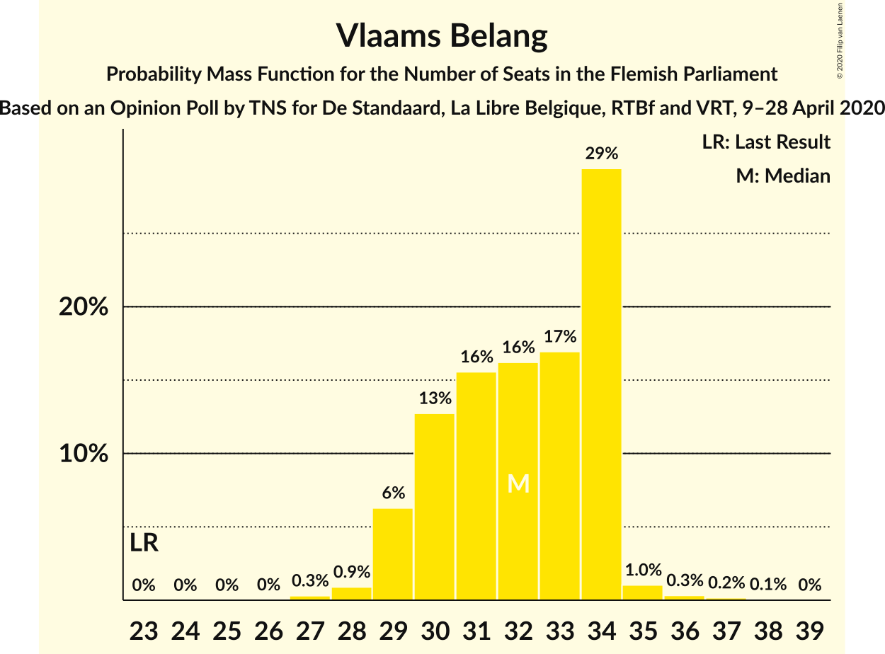

| Number of Seats | Probability | Accumulated | Special Marks |
|:---------------:|:-----------:|:-----------:|:-------------:|
| 23 | 0% | 100% | Last Result |
| 24 | 0% | 100% |  |
| 25 | 0% | 100% |  |
| 26 | 0% | 100% |  |
| 27 | 0.3% | 100% |  |
| 28 | 0.9% | 99.7% |  |
| 29 | 6% | 98.8% |  |
| 30 | 13% | 92% |  |
| 31 | 16% | 80% |  |
| 32 | 16% | 64% | Median |
| 33 | 17% | 48% |  |
| 34 | 29% | 31% |  |
| 35 | 1.0% | 2% |  |
| 36 | 0.3% | 0.6% |  |
| 37 | 0.2% | 0.2% |  |
| 38 | 0.1% | 0.1% |  |
| 39 | 0% | 0% |  |

### Nieuw-Vlaamse Alliantie

*For a full overview of the results for this party, see the [Nieuw-Vlaamse Alliantie](party-nieuw-vlaamsealliantie.html) page.*

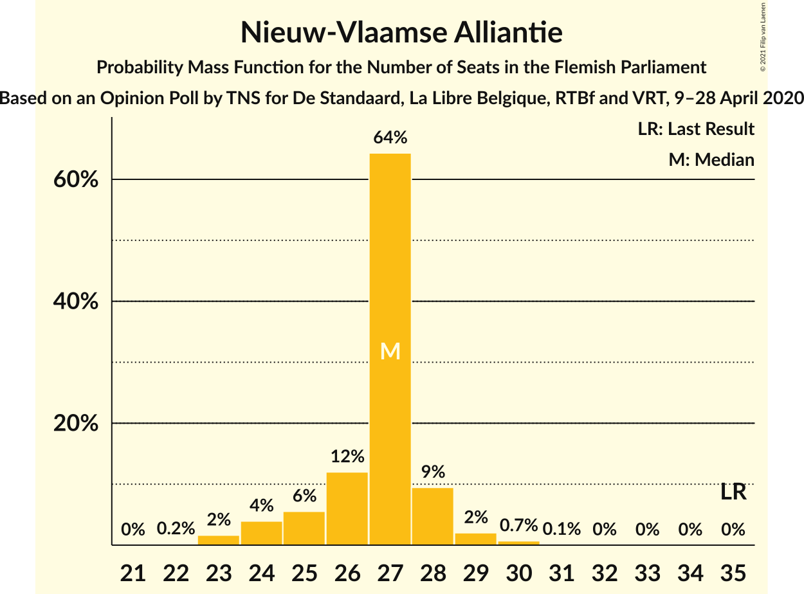

| Number of Seats | Probability | Accumulated | Special Marks |
|:---------------:|:-----------:|:-----------:|:-------------:|
| 22 | 0.2% | 100% |  |
| 23 | 2% | 99.8% |  |
| 24 | 4% | 98% |  |
| 25 | 6% | 94% |  |
| 26 | 12% | 89% |  |
| 27 | 64% | 77% | Median |
| 28 | 9% | 12% |  |
| 29 | 2% | 3% |  |
| 30 | 0.7% | 0.9% |  |
| 31 | 0.1% | 0.2% |  |
| 32 | 0% | 0% |  |
| 33 | 0% | 0% |  |
| 34 | 0% | 0% |  |
| 35 | 0% | 0% | Last Result |

### Christen-Democratisch en Vlaams

*For a full overview of the results for this party, see the [Christen-Democratisch en Vlaams](party-christen-democratischenvlaams.html) page.*

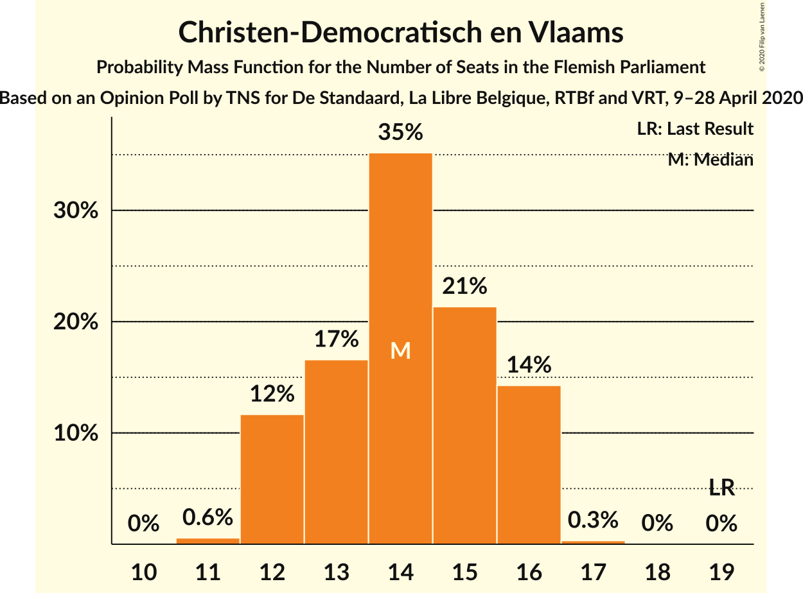

| Number of Seats | Probability | Accumulated | Special Marks |
|:---------------:|:-----------:|:-----------:|:-------------:|
| 11 | 0.6% | 100% |  |
| 12 | 12% | 99.4% |  |
| 13 | 16% | 87% |  |
| 14 | 37% | 71% | Median |
| 15 | 18% | 34% |  |
| 16 | 15% | 16% |  |
| 17 | 0.4% | 0.4% |  |
| 18 | 0% | 0% |  |
| 19 | 0% | 0% | Last Result |

### Open Vlaamse Liberalen en Democraten

*For a full overview of the results for this party, see the [Open Vlaamse Liberalen en Democraten](party-openvlaamseliberalenendemocraten.html) page.*

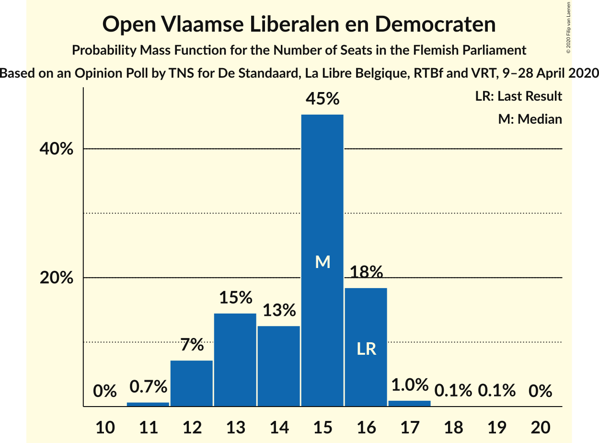

| Number of Seats | Probability | Accumulated | Special Marks |
|:---------------:|:-----------:|:-----------:|:-------------:|
| 11 | 0.7% | 100% |  |
| 12 | 7% | 99.3% |  |
| 13 | 15% | 92% |  |
| 14 | 13% | 78% |  |
| 15 | 45% | 65% | Median |
| 16 | 18% | 20% | Last Result |
| 17 | 1.0% | 1.2% |  |
| 18 | 0.1% | 0.2% |  |
| 19 | 0.1% | 0.1% |  |
| 20 | 0% | 0% |  |

### Groen

*For a full overview of the results for this party, see the [Groen](party-groen.html) page.*

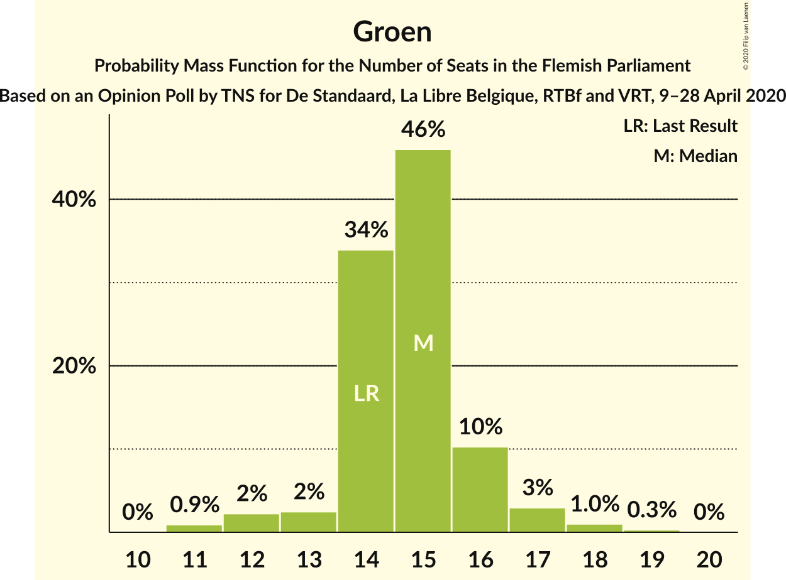

| Number of Seats | Probability | Accumulated | Special Marks |
|:---------------:|:-----------:|:-----------:|:-------------:|
| 11 | 0.9% | 100% |  |
| 12 | 2% | 99.1% |  |
| 13 | 2% | 97% |  |
| 14 | 34% | 94% | Last Result |
| 15 | 46% | 60% | Median |
| 16 | 10% | 14% |  |
| 17 | 3% | 4% |  |
| 18 | 1.0% | 1.3% |  |
| 19 | 0.3% | 0.3% |  |
| 20 | 0% | 0% |  |

### Socialistische Partij Anders

*For a full overview of the results for this party, see the [Socialistische Partij Anders](party-socialistischepartijanders.html) page.*

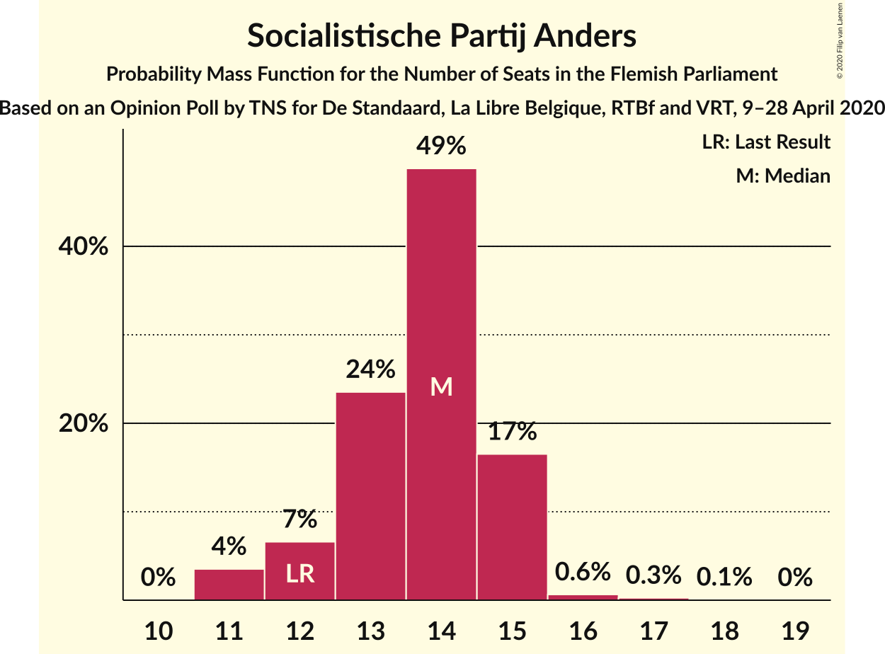

| Number of Seats | Probability | Accumulated | Special Marks |
|:---------------:|:-----------:|:-----------:|:-------------:|
| 11 | 5% | 100% |  |
| 12 | 7% | 95% | Last Result |
| 13 | 24% | 89% |  |
| 14 | 49% | 65% | Median |
| 15 | 15% | 16% |  |
| 16 | 0.7% | 1.0% |  |
| 17 | 0.3% | 0.4% |  |
| 18 | 0.1% | 0.1% |  |
| 19 | 0% | 0% |  |

### Partij van de Arbeid van België

*For a full overview of the results for this party, see the [Partij van de Arbeid van België](party-partijvandearbeidvanbelgië.html) page.*

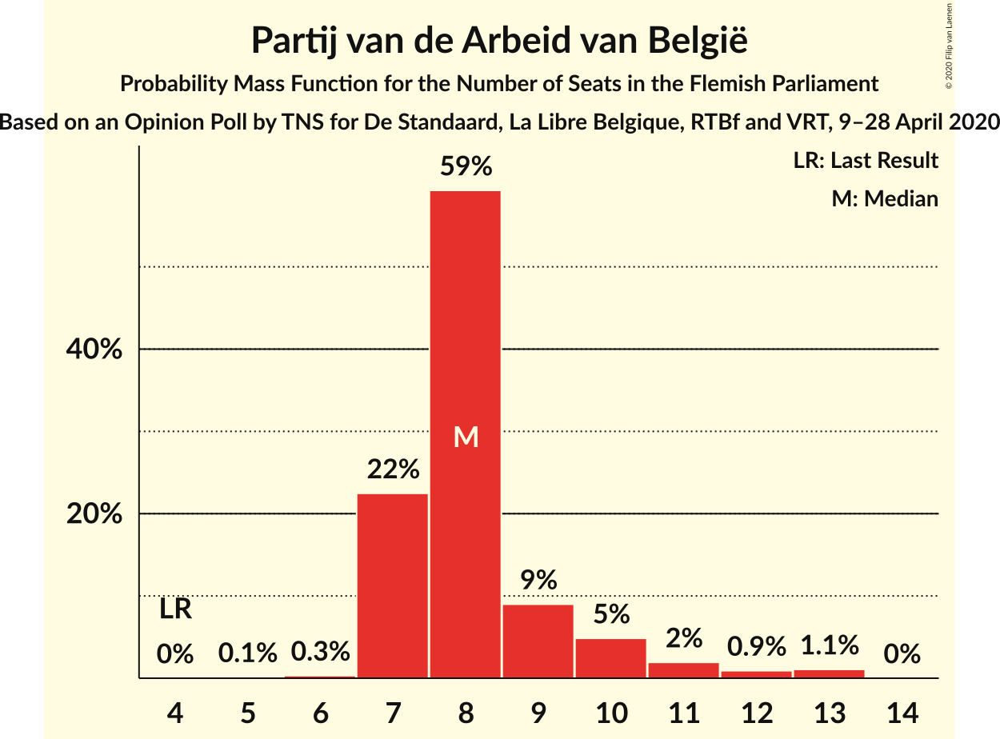

| Number of Seats | Probability | Accumulated | Special Marks |
|:---------------:|:-----------:|:-----------:|:-------------:|
| 4 | 0% | 100% | Last Result |
| 5 | 0.1% | 100% |  |
| 6 | 0.3% | 99.9% |  |
| 7 | 23% | 99.6% |  |
| 8 | 57% | 76% | Median |
| 9 | 11% | 19% |  |
| 10 | 5% | 8% |  |
| 11 | 2% | 4% |  |
| 12 | 0.9% | 2% |  |
| 13 | 1.0% | 1.0% |  |
| 14 | 0% | 0% |  |

## Coalitions

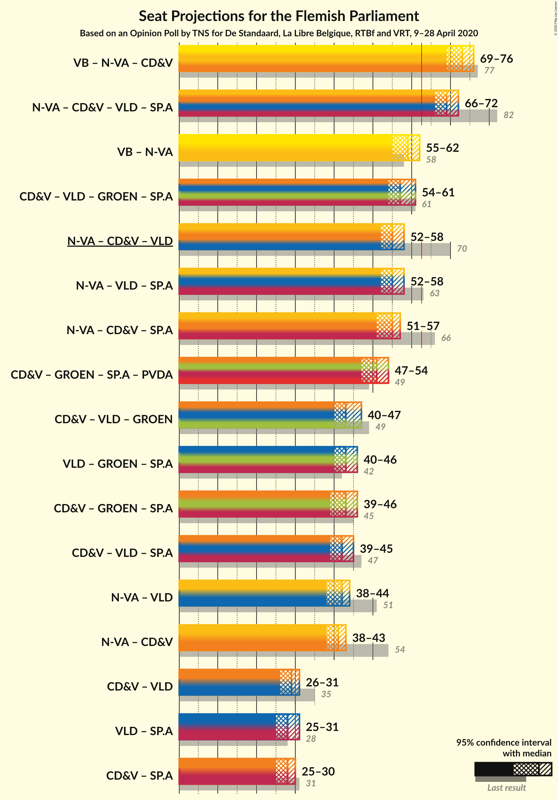

### Confidence Intervals

| Coalition | Last Result | Median | Majority? | 80% Confidence Interval | 90% Confidence Interval | 95% Confidence Interval | 99% Confidence Interval |
|:---------:|:-----------:|:------:|:---------:|:-----------------------:|:-----------------------:|:-----------------------:|:-----------------------:|
| Vlaams Belang – Nieuw-Vlaamse Alliantie – Christen-Democratisch en Vlaams | 77 | 73 | 100% | 71–75 | 70–76 | 69–76 | 68–77 |
| Nieuw-Vlaamse Alliantie – Christen-Democratisch en Vlaams – Open Vlaamse Liberalen en Democraten – Socialistische Partij Anders | 82 | 69 | 100% | 67–71 | 67–72 | 66–72 | 64–73 |
| Vlaams Belang – Nieuw-Vlaamse Alliantie | 58 | 59 | 1.0% | 56–61 | 56–61 | 55–62 | 54–63 |
| Christen-Democratisch en Vlaams – Open Vlaamse Liberalen en Democraten – Groen – Socialistische Partij Anders | 61 | 57 | 0.1% | 55–59 | 55–60 | 54–61 | 52–61 |
| Nieuw-Vlaamse Alliantie – Christen-Democratisch en Vlaams – Open Vlaamse Liberalen en Democraten | 70 | 55 | 0% | 53–57 | 53–58 | 52–58 | 51–59 |
| Nieuw-Vlaamse Alliantie – Open Vlaamse Liberalen en Democraten – Socialistische Partij Anders | 63 | 55 | 0% | 53–57 | 52–57 | 52–58 | 50–59 |
| Nieuw-Vlaamse Alliantie – Christen-Democratisch en Vlaams – Socialistische Partij Anders | 66 | 55 | 0% | 52–57 | 52–57 | 51–57 | 50–58 |
| Christen-Democratisch en Vlaams – Groen – Socialistische Partij Anders – Partij van de Arbeid van België | 49 | 51 | 0% | 48–53 | 48–54 | 47–54 | 46–56 |
| Christen-Democratisch en Vlaams – Open Vlaamse Liberalen en Democraten – Groen | 49 | 43 | 0% | 41–45 | 41–46 | 40–47 | 39–48 |
| Open Vlaamse Liberalen en Democraten – Groen – Socialistische Partij Anders | 42 | 43 | 0% | 41–45 | 40–46 | 40–46 | 39–47 |
| Christen-Democratisch en Vlaams – Groen – Socialistische Partij Anders | 45 | 43 | 0% | 40–45 | 40–45 | 39–46 | 38–47 |
| Christen-Democratisch en Vlaams – Open Vlaamse Liberalen en Democraten – Socialistische Partij Anders | 47 | 42 | 0% | 41–44 | 40–45 | 39–45 | 38–46 |
| Nieuw-Vlaamse Alliantie – Open Vlaamse Liberalen en Democraten | 51 | 42 | 0% | 39–43 | 39–43 | 38–44 | 37–45 |
| Nieuw-Vlaamse Alliantie – Christen-Democratisch en Vlaams | 54 | 41 | 0% | 39–43 | 38–43 | 38–43 | 37–45 |
| Christen-Democratisch en Vlaams – Open Vlaamse Liberalen en Democraten | 35 | 29 | 0% | 27–30 | 26–31 | 26–31 | 24–32 |
| Open Vlaamse Liberalen en Democraten – Socialistische Partij Anders | 28 | 28 | 0% | 26–30 | 26–30 | 25–31 | 24–31 |
| Christen-Democratisch en Vlaams – Socialistische Partij Anders | 31 | 28 | 0% | 26–30 | 25–30 | 25–30 | 24–31 |

### Vlaams Belang – Nieuw-Vlaamse Alliantie – Christen-Democratisch en Vlaams

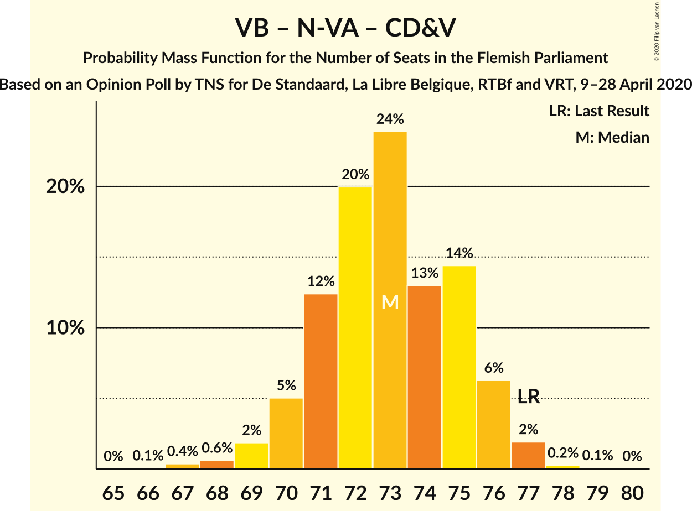

| Number of Seats | Probability | Accumulated | Special Marks |
|:---------------:|:-----------:|:-----------:|:-------------:|
| 66 | 0.1% | 100% |  |
| 67 | 0.4% | 99.9% |  |
| 68 | 0.6% | 99.6% |  |
| 69 | 2% | 99.0% |  |
| 70 | 5% | 97% |  |
| 71 | 12% | 92% |  |
| 72 | 20% | 80% |  |
| 73 | 24% | 60% | Median |
| 74 | 13% | 36% |  |
| 75 | 14% | 23% |  |
| 76 | 6% | 8% |  |
| 77 | 2% | 2% | Last Result |
| 78 | 0.2% | 0.3% |  |
| 79 | 0.1% | 0.1% |  |
| 80 | 0% | 0% |  |

### Nieuw-Vlaamse Alliantie – Christen-Democratisch en Vlaams – Open Vlaamse Liberalen en Democraten – Socialistische Partij Anders

| Number of Seats | Probability | Accumulated | Special Marks |
|:---------------:|:-----------:|:-----------:|:-------------:|
| 63 | 0.1% | 100% | Majority |
| 64 | 0.4% | 99.8% |  |
| 65 | 1.1% | 99.4% |  |
| 66 | 3% | 98% |  |
| 67 | 9% | 96% |  |
| 68 | 28% | 86% |  |
| 69 | 22% | 59% |  |
| 70 | 18% | 37% | Median |
| 71 | 12% | 19% |  |
| 72 | 6% | 7% |  |
| 73 | 1.1% | 1.2% |  |
| 74 | 0.1% | 0.2% |  |
| 75 | 0% | 0% |  |
| 76 | 0% | 0% |  |
| 77 | 0% | 0% |  |
| 78 | 0% | 0% |  |
| 79 | 0% | 0% |  |
| 80 | 0% | 0% |  |
| 81 | 0% | 0% |  |
| 82 | 0% | 0% | Last Result |

### Vlaams Belang – Nieuw-Vlaamse Alliantie

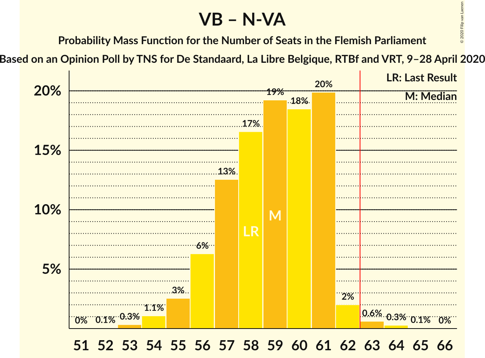

| Number of Seats | Probability | Accumulated | Special Marks |
|:---------------:|:-----------:|:-----------:|:-------------:|
| 52 | 0.1% | 100% |  |
| 53 | 0.3% | 99.9% |  |
| 54 | 1.1% | 99.6% |  |
| 55 | 3% | 98.5% |  |
| 56 | 6% | 96% |  |
| 57 | 13% | 90% |  |
| 58 | 17% | 77% | Last Result |
| 59 | 19% | 61% | Median |
| 60 | 18% | 41% |  |
| 61 | 20% | 23% |  |
| 62 | 2% | 3% |  |
| 63 | 0.6% | 1.0% | Majority |
| 64 | 0.3% | 0.3% |  |
| 65 | 0.1% | 0.1% |  |
| 66 | 0% | 0% |  |

### Christen-Democratisch en Vlaams – Open Vlaamse Liberalen en Democraten – Groen – Socialistische Partij Anders

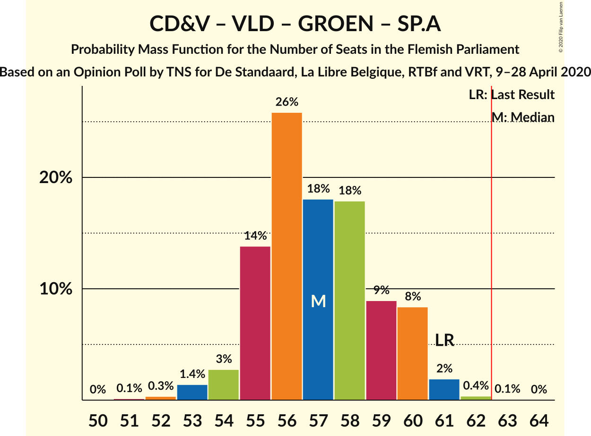

| Number of Seats | Probability | Accumulated | Special Marks |
|:---------------:|:-----------:|:-----------:|:-------------:|
| 51 | 0.1% | 100% |  |
| 52 | 0.4% | 99.8% |  |
| 53 | 1.3% | 99.4% |  |
| 54 | 3% | 98% |  |
| 55 | 15% | 95% |  |
| 56 | 24% | 80% |  |
| 57 | 18% | 56% |  |
| 58 | 19% | 39% | Median |
| 59 | 11% | 20% |  |
| 60 | 7% | 9% |  |
| 61 | 2% | 3% | Last Result |
| 62 | 0.3% | 0.5% |  |
| 63 | 0.1% | 0.1% | Majority |
| 64 | 0% | 0% |  |

### Nieuw-Vlaamse Alliantie – Christen-Democratisch en Vlaams – Open Vlaamse Liberalen en Democraten

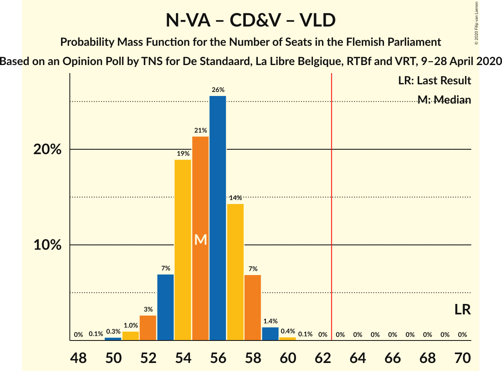

| Number of Seats | Probability | Accumulated | Special Marks |
|:---------------:|:-----------:|:-----------:|:-------------:|
| 49 | 0.1% | 100% |  |
| 50 | 0.3% | 99.9% |  |
| 51 | 1.0% | 99.6% |  |
| 52 | 3% | 98.6% |  |
| 53 | 7% | 96% |  |
| 54 | 19% | 89% |  |
| 55 | 21% | 70% |  |
| 56 | 26% | 49% | Median |
| 57 | 14% | 23% |  |
| 58 | 7% | 9% |  |
| 59 | 1.4% | 2% |  |
| 60 | 0.4% | 0.4% |  |
| 61 | 0.1% | 0.1% |  |
| 62 | 0% | 0% |  |
| 63 | 0% | 0% | Majority |
| 64 | 0% | 0% |  |
| 65 | 0% | 0% |  |
| 66 | 0% | 0% |  |
| 67 | 0% | 0% |  |
| 68 | 0% | 0% |  |
| 69 | 0% | 0% |  |
| 70 | 0% | 0% | Last Result |

### Nieuw-Vlaamse Alliantie – Open Vlaamse Liberalen en Democraten – Socialistische Partij Anders

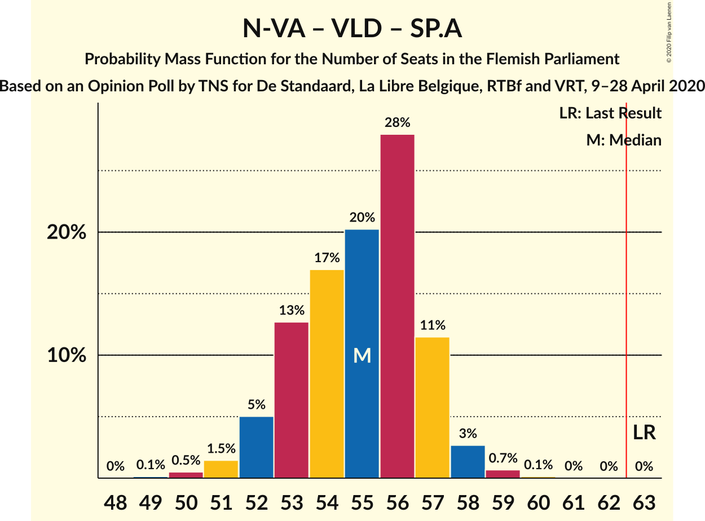

| Number of Seats | Probability | Accumulated | Special Marks |
|:---------------:|:-----------:|:-----------:|:-------------:|
| 49 | 0.1% | 100% |  |
| 50 | 0.5% | 99.8% |  |
| 51 | 1.5% | 99.3% |  |
| 52 | 5% | 98% |  |
| 53 | 13% | 93% |  |
| 54 | 17% | 80% |  |
| 55 | 20% | 63% |  |
| 56 | 28% | 43% | Median |
| 57 | 11% | 15% |  |
| 58 | 3% | 4% |  |
| 59 | 0.7% | 0.8% |  |
| 60 | 0.1% | 0.2% |  |
| 61 | 0% | 0% |  |
| 62 | 0% | 0% |  |
| 63 | 0% | 0% | Last Result, Majority |

### Nieuw-Vlaamse Alliantie – Christen-Democratisch en Vlaams – Socialistische Partij Anders

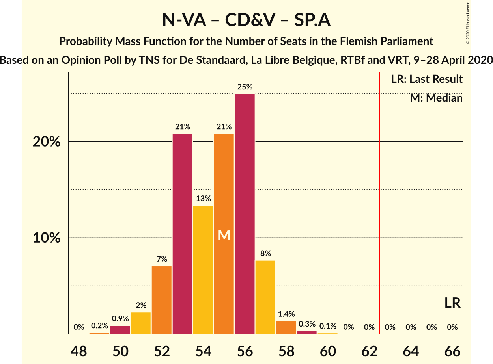

| Number of Seats | Probability | Accumulated | Special Marks |
|:---------------:|:-----------:|:-----------:|:-------------:|
| 49 | 0.2% | 100% |  |
| 50 | 1.0% | 99.8% |  |
| 51 | 2% | 98.8% |  |
| 52 | 9% | 97% |  |
| 53 | 20% | 88% |  |
| 54 | 16% | 68% |  |
| 55 | 21% | 53% | Median |
| 56 | 21% | 31% |  |
| 57 | 8% | 10% |  |
| 58 | 1.5% | 2% |  |
| 59 | 0.3% | 0.4% |  |
| 60 | 0.1% | 0.2% |  |
| 61 | 0% | 0% |  |
| 62 | 0% | 0% |  |
| 63 | 0% | 0% | Majority |
| 64 | 0% | 0% |  |
| 65 | 0% | 0% |  |
| 66 | 0% | 0% | Last Result |

### Christen-Democratisch en Vlaams – Groen – Socialistische Partij Anders – Partij van de Arbeid van België

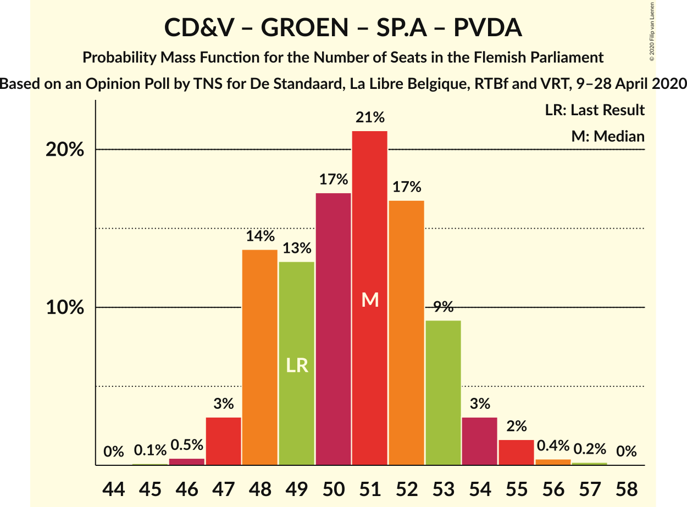

| Number of Seats | Probability | Accumulated | Special Marks |
|:---------------:|:-----------:|:-----------:|:-------------:|
| 45 | 0.1% | 100% |  |
| 46 | 0.5% | 99.9% |  |
| 47 | 3% | 99.4% |  |
| 48 | 14% | 96% |  |
| 49 | 13% | 83% | Last Result |
| 50 | 17% | 70% |  |
| 51 | 21% | 53% | Median |
| 52 | 17% | 31% |  |
| 53 | 9% | 15% |  |
| 54 | 3% | 5% |  |
| 55 | 2% | 2% |  |
| 56 | 0.4% | 0.6% |  |
| 57 | 0.2% | 0.2% |  |
| 58 | 0% | 0% |  |

### Christen-Democratisch en Vlaams – Open Vlaamse Liberalen en Democraten – Groen

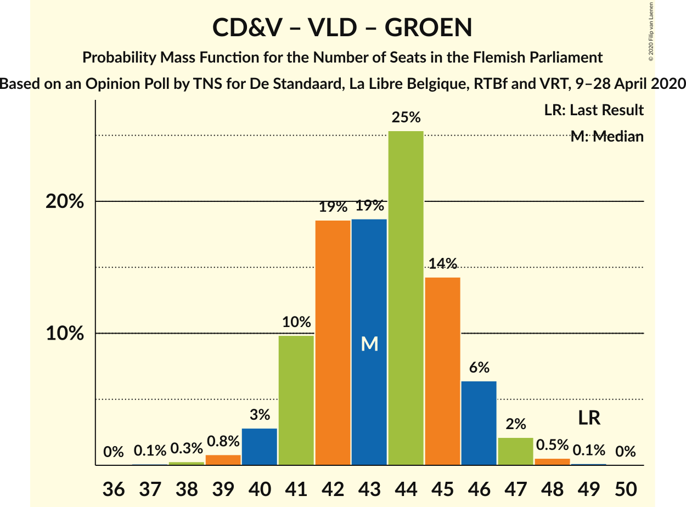

| Number of Seats | Probability | Accumulated | Special Marks |
|:---------------:|:-----------:|:-----------:|:-------------:|
| 37 | 0.1% | 100% |  |
| 38 | 0.3% | 99.9% |  |
| 39 | 0.8% | 99.6% |  |
| 40 | 3% | 98.8% |  |
| 41 | 10% | 96% |  |
| 42 | 19% | 86% |  |
| 43 | 19% | 68% |  |
| 44 | 25% | 49% | Median |
| 45 | 14% | 23% |  |
| 46 | 6% | 9% |  |
| 47 | 2% | 3% |  |
| 48 | 0.5% | 0.7% |  |
| 49 | 0.1% | 0.2% | Last Result |
| 50 | 0% | 0% |  |

### Open Vlaamse Liberalen en Democraten – Groen – Socialistische Partij Anders

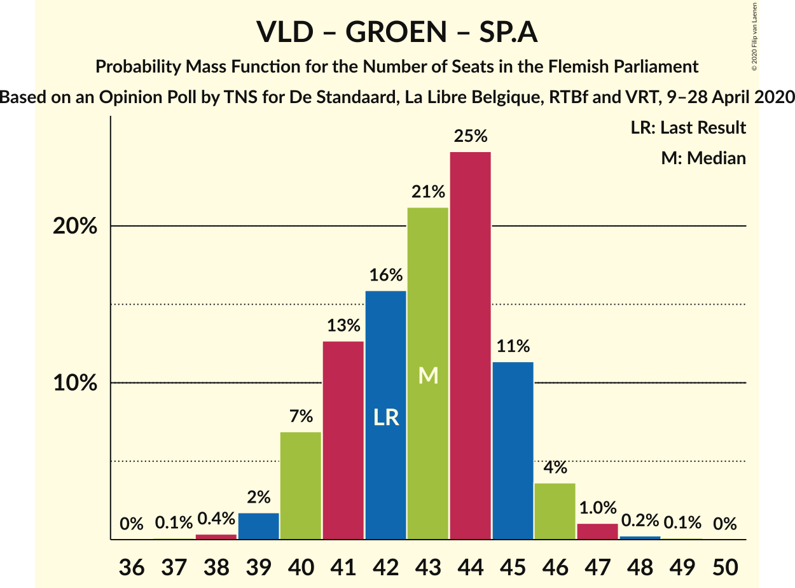

| Number of Seats | Probability | Accumulated | Special Marks |
|:---------------:|:-----------:|:-----------:|:-------------:|
| 37 | 0.1% | 100% |  |
| 38 | 0.4% | 99.9% |  |
| 39 | 2% | 99.5% |  |
| 40 | 7% | 98% |  |
| 41 | 13% | 91% |  |
| 42 | 16% | 78% | Last Result |
| 43 | 21% | 62% |  |
| 44 | 25% | 41% | Median |
| 45 | 11% | 16% |  |
| 46 | 4% | 5% |  |
| 47 | 1.0% | 1.4% |  |
| 48 | 0.2% | 0.4% |  |
| 49 | 0.1% | 0.1% |  |
| 50 | 0% | 0% |  |

### Christen-Democratisch en Vlaams – Groen – Socialistische Partij Anders

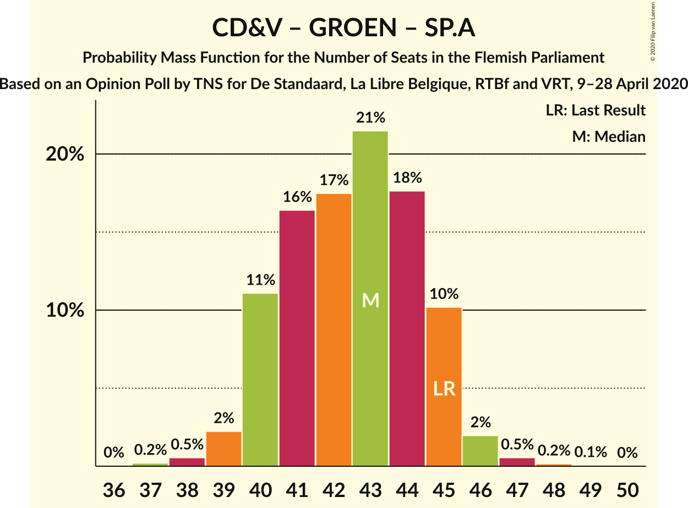

| Number of Seats | Probability | Accumulated | Special Marks |
|:---------------:|:-----------:|:-----------:|:-------------:|
| 37 | 0.2% | 100% |  |
| 38 | 0.6% | 99.8% |  |
| 39 | 2% | 99.2% |  |
| 40 | 13% | 97% |  |
| 41 | 15% | 84% |  |
| 42 | 17% | 69% |  |
| 43 | 22% | 52% | Median |
| 44 | 17% | 29% |  |
| 45 | 9% | 12% | Last Result |
| 46 | 2% | 3% |  |
| 47 | 0.5% | 0.8% |  |
| 48 | 0.1% | 0.2% |  |
| 49 | 0.1% | 0.1% |  |
| 50 | 0% | 0% |  |

### Christen-Democratisch en Vlaams – Open Vlaamse Liberalen en Democraten – Socialistische Partij Anders

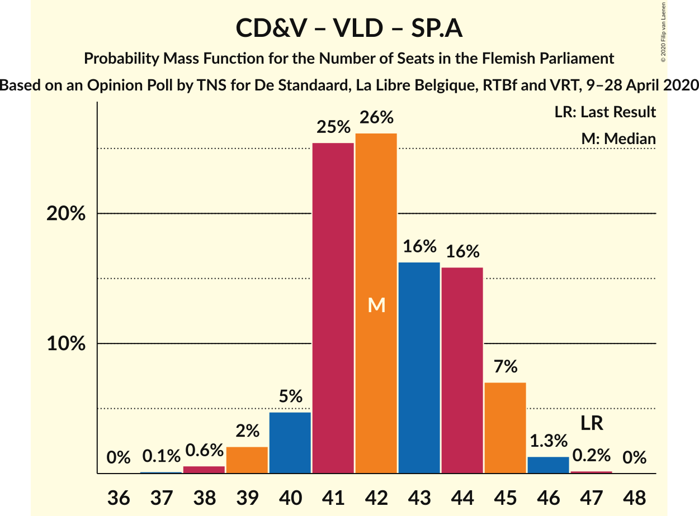

| Number of Seats | Probability | Accumulated | Special Marks |
|:---------------:|:-----------:|:-----------:|:-------------:|
| 37 | 0.2% | 100% |  |
| 38 | 0.6% | 99.8% |  |
| 39 | 2% | 99.2% |  |
| 40 | 6% | 97% |  |
| 41 | 25% | 91% |  |
| 42 | 25% | 66% |  |
| 43 | 19% | 42% | Median |
| 44 | 14% | 23% |  |
| 45 | 7% | 9% |  |
| 46 | 1.4% | 2% |  |
| 47 | 0.2% | 0.2% | Last Result |
| 48 | 0% | 0% |  |

### Nieuw-Vlaamse Alliantie – Open Vlaamse Liberalen en Democraten

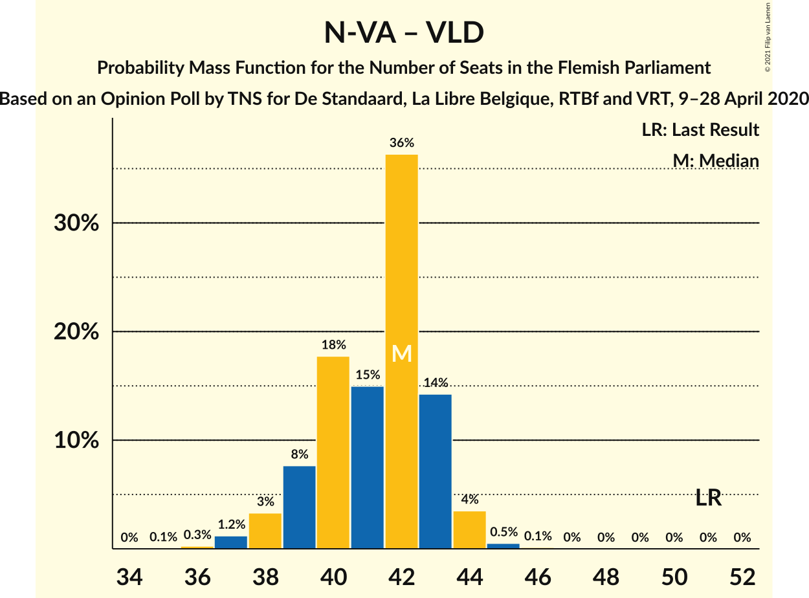

| Number of Seats | Probability | Accumulated | Special Marks |
|:---------------:|:-----------:|:-----------:|:-------------:|
| 35 | 0.1% | 100% |  |
| 36 | 0.3% | 99.9% |  |
| 37 | 1.2% | 99.7% |  |
| 38 | 3% | 98% |  |
| 39 | 8% | 95% |  |
| 40 | 18% | 88% |  |
| 41 | 15% | 70% |  |
| 42 | 36% | 55% | Median |
| 43 | 14% | 18% |  |
| 44 | 4% | 4% |  |
| 45 | 0.5% | 0.7% |  |
| 46 | 0.1% | 0.2% |  |
| 47 | 0% | 0% |  |
| 48 | 0% | 0% |  |
| 49 | 0% | 0% |  |
| 50 | 0% | 0% |  |
| 51 | 0% | 0% | Last Result |

### Nieuw-Vlaamse Alliantie – Christen-Democratisch en Vlaams

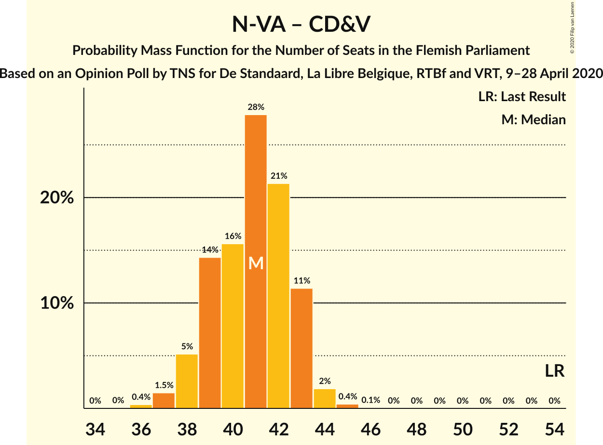

| Number of Seats | Probability | Accumulated | Special Marks |
|:---------------:|:-----------:|:-----------:|:-------------:|
| 35 | 0.1% | 100% |  |
| 36 | 0.4% | 99.9% |  |
| 37 | 1.5% | 99.6% |  |
| 38 | 5% | 98% |  |
| 39 | 14% | 93% |  |
| 40 | 17% | 79% |  |
| 41 | 29% | 62% | Median |
| 42 | 19% | 33% |  |
| 43 | 12% | 14% |  |
| 44 | 2% | 2% |  |
| 45 | 0.4% | 0.5% |  |
| 46 | 0.1% | 0.1% |  |
| 47 | 0% | 0% |  |
| 48 | 0% | 0% |  |
| 49 | 0% | 0% |  |
| 50 | 0% | 0% |  |
| 51 | 0% | 0% |  |
| 52 | 0% | 0% |  |
| 53 | 0% | 0% |  |
| 54 | 0% | 0% | Last Result |

### Christen-Democratisch en Vlaams – Open Vlaamse Liberalen en Democraten

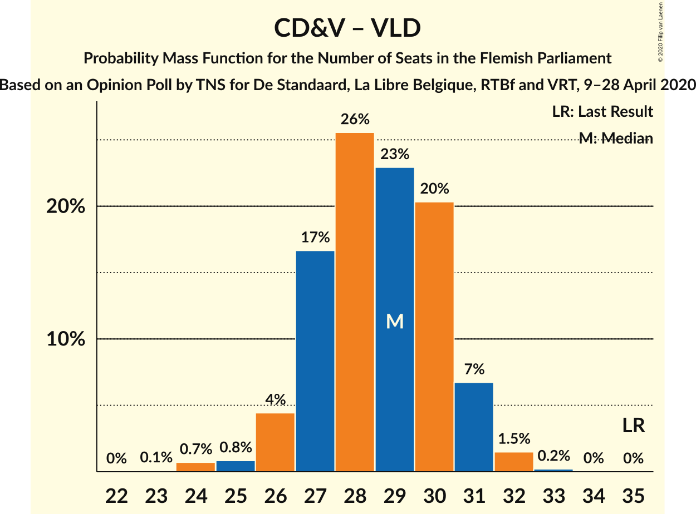

| Number of Seats | Probability | Accumulated | Special Marks |
|:---------------:|:-----------:|:-----------:|:-------------:|
| 23 | 0.1% | 100% |  |
| 24 | 0.5% | 99.9% |  |
| 25 | 0.9% | 99.4% |  |
| 26 | 5% | 98% |  |
| 27 | 16% | 94% |  |
| 28 | 23% | 78% |  |
| 29 | 27% | 55% | Median |
| 30 | 19% | 28% |  |
| 31 | 7% | 8% |  |
| 32 | 1.4% | 2% |  |
| 33 | 0.2% | 0.2% |  |
| 34 | 0% | 0% |  |
| 35 | 0% | 0% | Last Result |

### Open Vlaamse Liberalen en Democraten – Socialistische Partij Anders

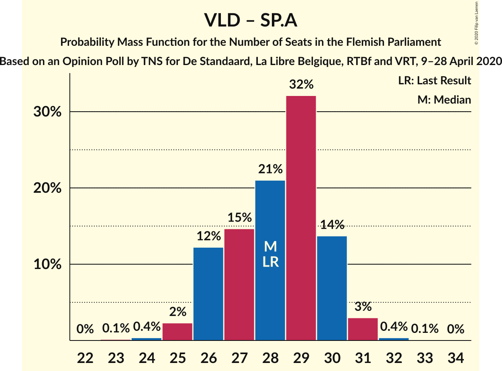

| Number of Seats | Probability | Accumulated | Special Marks |
|:---------------:|:-----------:|:-----------:|:-------------:|
| 23 | 0.1% | 100% |  |
| 24 | 0.4% | 99.8% |  |
| 25 | 2% | 99.5% |  |
| 26 | 12% | 97% |  |
| 27 | 15% | 85% |  |
| 28 | 21% | 70% | Last Result |
| 29 | 32% | 49% | Median |
| 30 | 14% | 17% |  |
| 31 | 3% | 3% |  |
| 32 | 0.4% | 0.5% |  |
| 33 | 0.1% | 0.1% |  |
| 34 | 0% | 0% |  |

### Christen-Democratisch en Vlaams – Socialistische Partij Anders

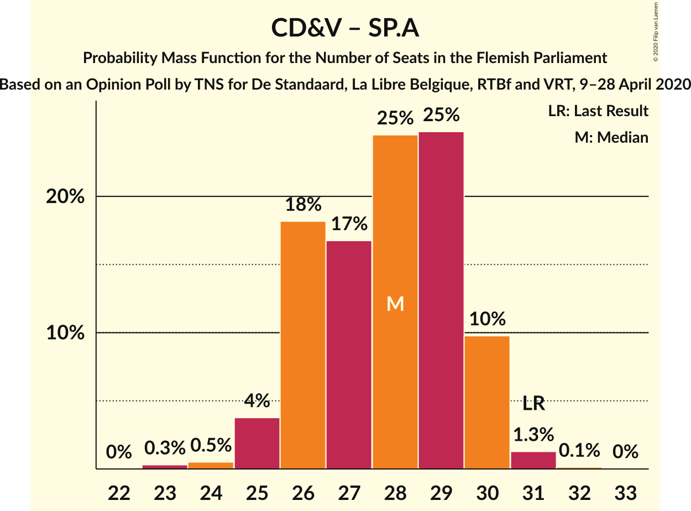

| Number of Seats | Probability | Accumulated | Special Marks |
|:---------------:|:-----------:|:-----------:|:-------------:|
| 23 | 0.2% | 100% |  |
| 24 | 0.6% | 99.8% |  |
| 25 | 5% | 99.1% |  |
| 26 | 19% | 94% |  |
| 27 | 17% | 75% |  |
| 28 | 25% | 58% | Median |
| 29 | 22% | 33% |  |
| 30 | 10% | 12% |  |
| 31 | 1.4% | 2% | Last Result |
| 32 | 0.1% | 0.2% |  |
| 33 | 0% | 0% |  |

## Technical Information

### Opinion Poll

+ **Polling firm:** TNS
+ **Commissioner(s):** De Standaard, La Libre Belgique, RTBf and VRT
+ **Fieldwork period:** 9–28 April 2020

### Calculations

+ **Sample size:** 1857
+ **Simulations done:** 1,048,576
+ **Error estimate:** 0.59%

