# Opinion Poll by Ipsos for Het Laatste Nieuws, Le Soir, RTL TVi and VTM, 10–15 June 2020

<a href="#voting-intentions">Voting Intentions</a> | <a href="#seats">Seats</a> | <a href="#coalitions">Coalitions</a> | <a href="#technical-information">Technical Information</a>

## Voting Intentions

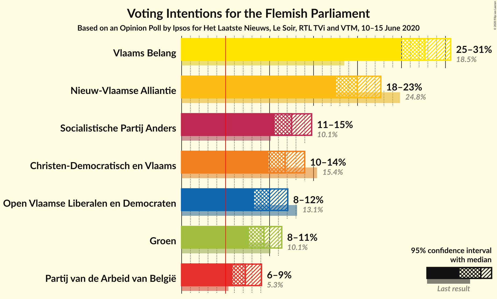

### Confidence Intervals

| Party | Last Result | Poll Result | 80% Confidence Interval | 90% Confidence Interval | 95% Confidence Interval | 99% Confidence Interval |
|:-----:|:-----------:|:-----------:|:-----------------------:|:-----------------------:|:-----------------------:|:-----------------------:|
| Vlaams Belang | 18.5% | 27.7% | 25.8–29.6% |25.3–30.1% |24.9–30.6% |24.1–31.5% |
| Nieuw-Vlaamse Alliantie | 24.8% | 20.0% | 18.4–21.7% |17.9–22.2% |17.6–22.6% |16.8–23.5% |
| Socialistische Partij Anders | 10.1% | 12.5% | 11.2–14.0% |10.9–14.4% |10.6–14.8% |10.0–15.5% |
| Christen-Democratisch en Vlaams | 15.4% | 11.8% | 10.5–13.2% |10.2–13.6% |9.9–14.0% |9.3–14.7% |
| Open Vlaamse Liberalen en Democraten | 13.1% | 10.0% | 8.8–11.3% |8.5–11.7% |8.2–12.1% |7.7–12.7% |
| Groen | 10.1% | 9.4% | 8.2–10.7% |7.9–11.1% |7.7–11.4% |7.2–12.0% |
| Partij van de Arbeid van België | 5.3% | 7.3% | 6.3–8.5% |6.0–8.8% |5.8–9.1% |5.3–9.7% |

*Note:* The poll result column reflects the actual value used in the calculations. Published results may vary slightly, and in addition be rounded to fewer digits.

## Seats

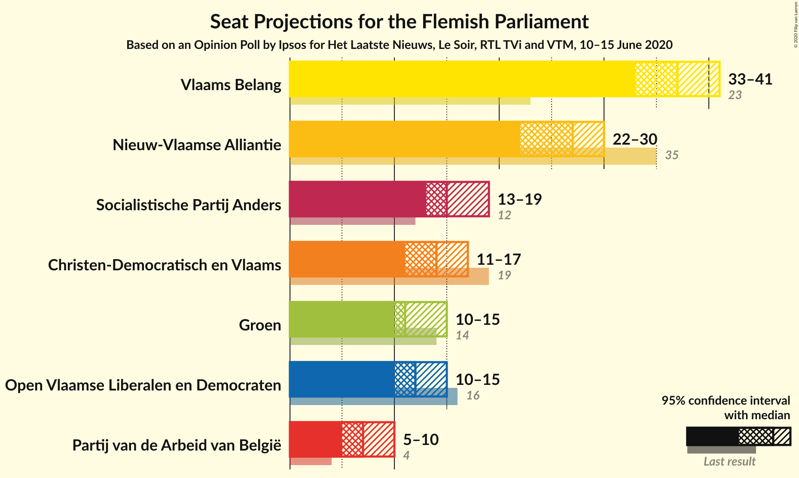

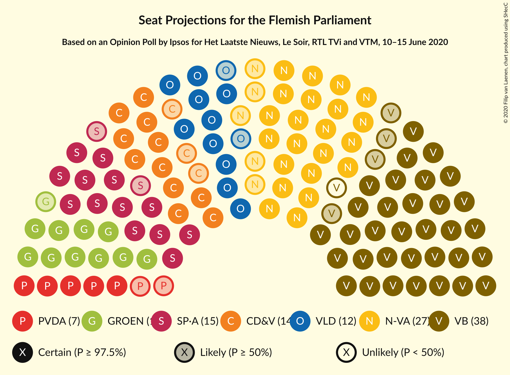

### Confidence Intervals

| Party | Last Result | Median | 80% Confidence Interval | 90% Confidence Interval | 95% Confidence Interval | 99% Confidence Interval |
|:-----:|:-----------:|:------:|:-----------------------:|:-----------------------:|:-----------------------:|:-----------------------:|
| <a href="#vlaams-belang">Vlaams Belang</a> | 23 | 37 | 34–39 |34–40 |33–41 |31–42 |
| <a href="#nieuw-vlaamse-alliantie">Nieuw-Vlaamse Alliantie</a> | 35 | 27 | 23–28 |23–29 |22–30 |21–31 |
| <a href="#socialistische-partij-anders">Socialistische Partij Anders</a> | 12 | 15 | 14–18 |14–19 |13–19 |12–19 |
| <a href="#christen-democratisch-en-vlaams">Christen-Democratisch en Vlaams</a> | 19 | 14 | 12–16 |12–16 |11–17 |10–18 |
| <a href="#open-vlaamse-liberalen-en-democraten">Open Vlaamse Liberalen en Democraten</a> | 16 | 12 | 11–14 |11–15 |10–15 |8–16 |
| <a href="#groen">Groen</a> | 14 | 11 | 11–14 |10–15 |10–15 |8–16 |
| <a href="#partij-van-de-arbeid-van-belgië">Partij van de Arbeid van België</a> | 4 | 7 | 5–8 |5–9 |5–10 |4–12 |

### Vlaams Belang

*For a full overview of the results for this party, see the [Vlaams Belang](party-vlaamsbelang.html) page.*

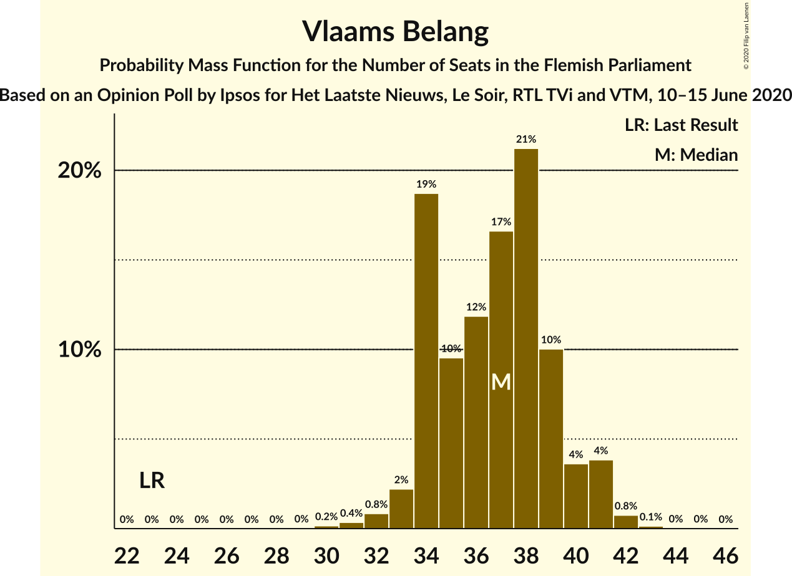

| Number of Seats | Probability | Accumulated | Special Marks |
|:---------------:|:-----------:|:-----------:|:-------------:|
| 23 | 0% | 100% | Last Result |
| 24 | 0% | 100% |  |
| 25 | 0% | 100% |  |
| 26 | 0% | 100% |  |
| 27 | 0% | 100% |  |
| 28 | 0% | 100% |  |
| 29 | 0% | 100% |  |
| 30 | 0.2% | 100% |  |
| 31 | 0.4% | 99.8% |  |
| 32 | 0.8% | 99.5% |  |
| 33 | 2% | 98.6% |  |
| 34 | 19% | 96% |  |
| 35 | 10% | 78% |  |
| 36 | 12% | 68% |  |
| 37 | 17% | 56% | Median |
| 38 | 21% | 40% |  |
| 39 | 10% | 18% |  |
| 40 | 4% | 8% |  |
| 41 | 4% | 5% |  |
| 42 | 0.8% | 1.0% |  |
| 43 | 0.1% | 0.2% |  |
| 44 | 0% | 0.1% |  |
| 45 | 0% | 0% |  |

### Nieuw-Vlaamse Alliantie

*For a full overview of the results for this party, see the [Nieuw-Vlaamse Alliantie](party-nieuw-vlaamsealliantie.html) page.*

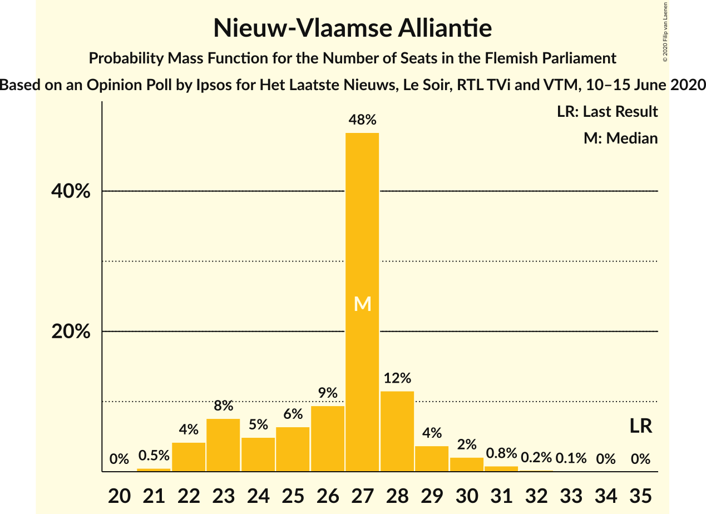

| Number of Seats | Probability | Accumulated | Special Marks |
|:---------------:|:-----------:|:-----------:|:-------------:|
| 21 | 0.5% | 100% |  |
| 22 | 4% | 99.5% |  |
| 23 | 8% | 95% |  |
| 24 | 5% | 88% |  |
| 25 | 6% | 83% |  |
| 26 | 9% | 76% |  |
| 27 | 48% | 67% | Median |
| 28 | 12% | 19% |  |
| 29 | 4% | 7% |  |
| 30 | 2% | 3% |  |
| 31 | 0.8% | 1.2% |  |
| 32 | 0.2% | 0.4% |  |
| 33 | 0.1% | 0.1% |  |
| 34 | 0% | 0% |  |
| 35 | 0% | 0% | Last Result |

### Socialistische Partij Anders

*For a full overview of the results for this party, see the [Socialistische Partij Anders](party-socialistischepartijanders.html) page.*

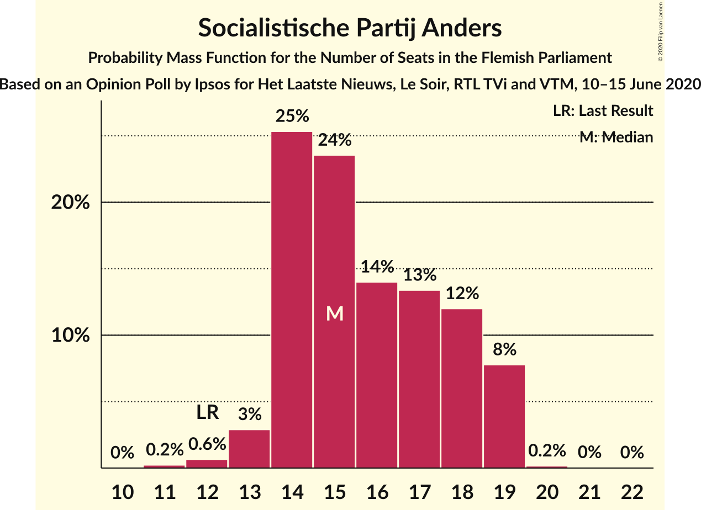

| Number of Seats | Probability | Accumulated | Special Marks |
|:---------------:|:-----------:|:-----------:|:-------------:|
| 11 | 0.2% | 100% |  |
| 12 | 0.6% | 99.8% | Last Result |
| 13 | 3% | 99.1% |  |
| 14 | 25% | 96% |  |
| 15 | 24% | 71% | Median |
| 16 | 14% | 47% |  |
| 17 | 13% | 33% |  |
| 18 | 12% | 20% |  |
| 19 | 8% | 8% |  |
| 20 | 0.2% | 0.2% |  |
| 21 | 0% | 0.1% |  |
| 22 | 0% | 0% |  |

### Christen-Democratisch en Vlaams

*For a full overview of the results for this party, see the [Christen-Democratisch en Vlaams](party-christen-democratischenvlaams.html) page.*

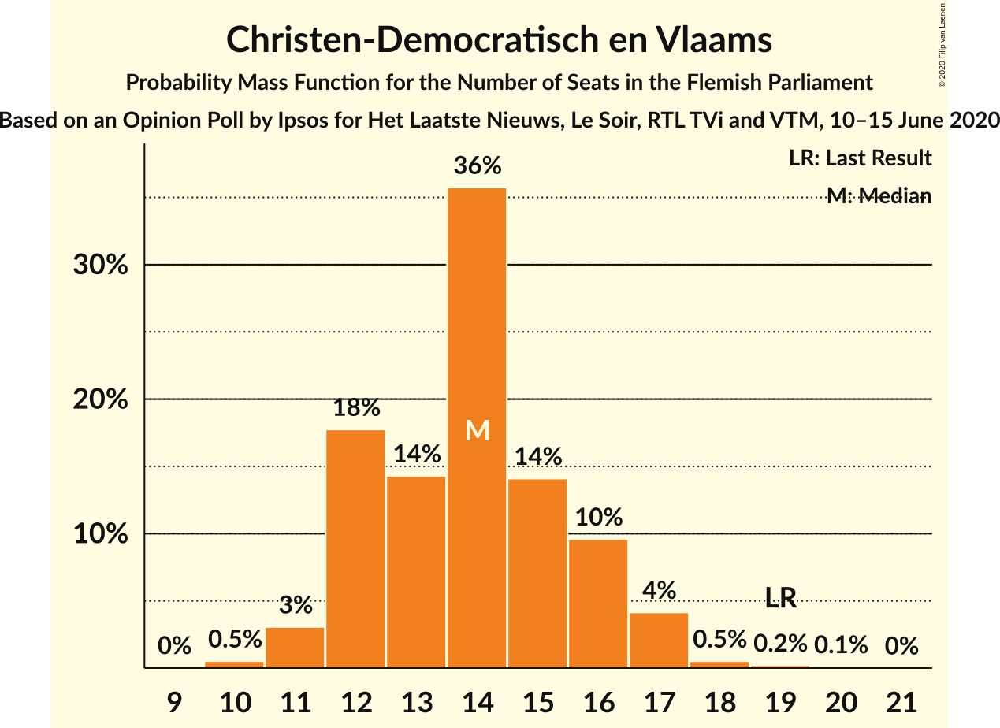

| Number of Seats | Probability | Accumulated | Special Marks |
|:---------------:|:-----------:|:-----------:|:-------------:|
| 10 | 0.5% | 100% |  |
| 11 | 3% | 99.5% |  |
| 12 | 18% | 96% |  |
| 13 | 14% | 79% |  |
| 14 | 36% | 64% | Median |
| 15 | 14% | 29% |  |
| 16 | 10% | 15% |  |
| 17 | 4% | 5% |  |
| 18 | 0.5% | 0.8% |  |
| 19 | 0.2% | 0.3% | Last Result |
| 20 | 0.1% | 0.1% |  |
| 21 | 0% | 0% |  |

### Open Vlaamse Liberalen en Democraten

*For a full overview of the results for this party, see the [Open Vlaamse Liberalen en Democraten](party-openvlaamseliberalenendemocraten.html) page.*

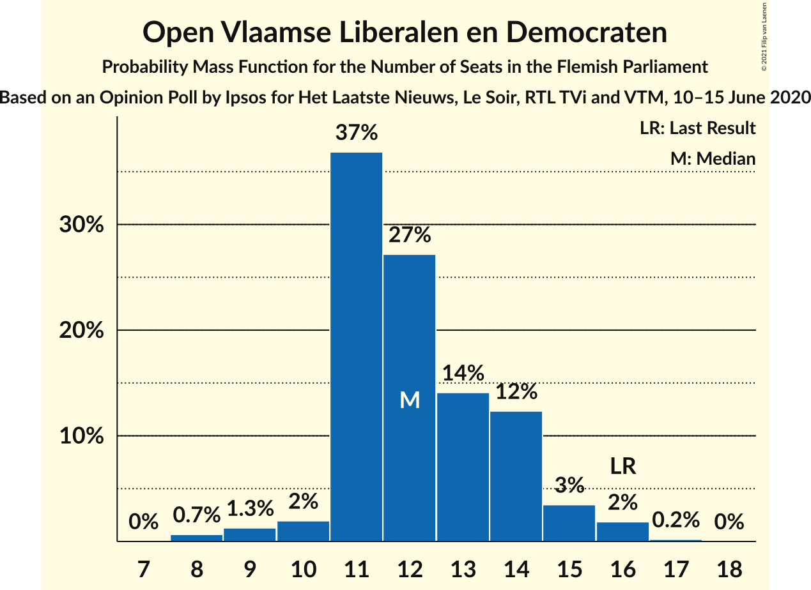

| Number of Seats | Probability | Accumulated | Special Marks |
|:---------------:|:-----------:|:-----------:|:-------------:|
| 8 | 0.7% | 100% |  |
| 9 | 1.3% | 99.3% |  |
| 10 | 2% | 98% |  |
| 11 | 37% | 96% |  |
| 12 | 27% | 59% | Median |
| 13 | 14% | 32% |  |
| 14 | 12% | 18% |  |
| 15 | 3% | 6% |  |
| 16 | 2% | 2% | Last Result |
| 17 | 0.2% | 0.2% |  |
| 18 | 0% | 0% |  |

### Groen

*For a full overview of the results for this party, see the [Groen](party-groen.html) page.*

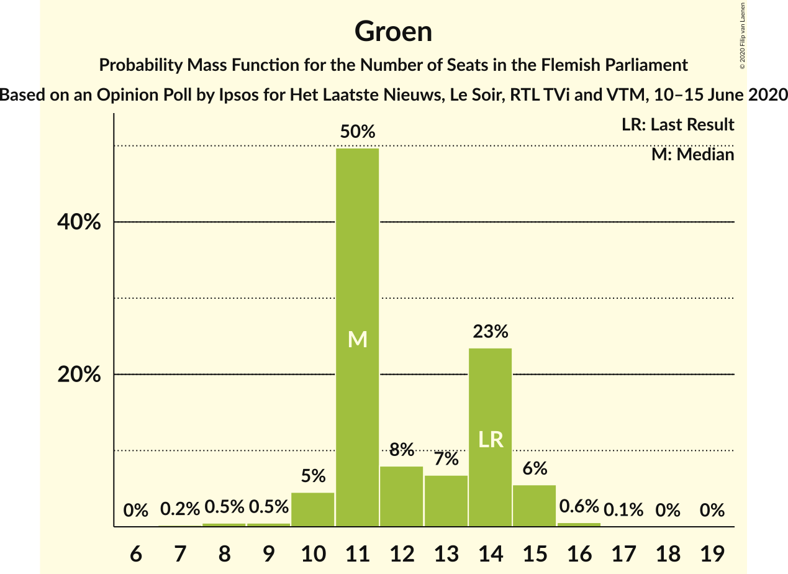

| Number of Seats | Probability | Accumulated | Special Marks |
|:---------------:|:-----------:|:-----------:|:-------------:|
| 7 | 0.2% | 100% |  |
| 8 | 0.5% | 99.8% |  |
| 9 | 0.5% | 99.3% |  |
| 10 | 5% | 98.8% |  |
| 11 | 50% | 94% | Median |
| 12 | 8% | 44% |  |
| 13 | 7% | 37% |  |
| 14 | 23% | 30% | Last Result |
| 15 | 6% | 6% |  |
| 16 | 0.6% | 0.7% |  |
| 17 | 0.1% | 0.1% |  |
| 18 | 0% | 0.1% |  |
| 19 | 0% | 0% |  |

### Partij van de Arbeid van België

*For a full overview of the results for this party, see the [Partij van de Arbeid van België](party-partijvandearbeidvanbelgië.html) page.*

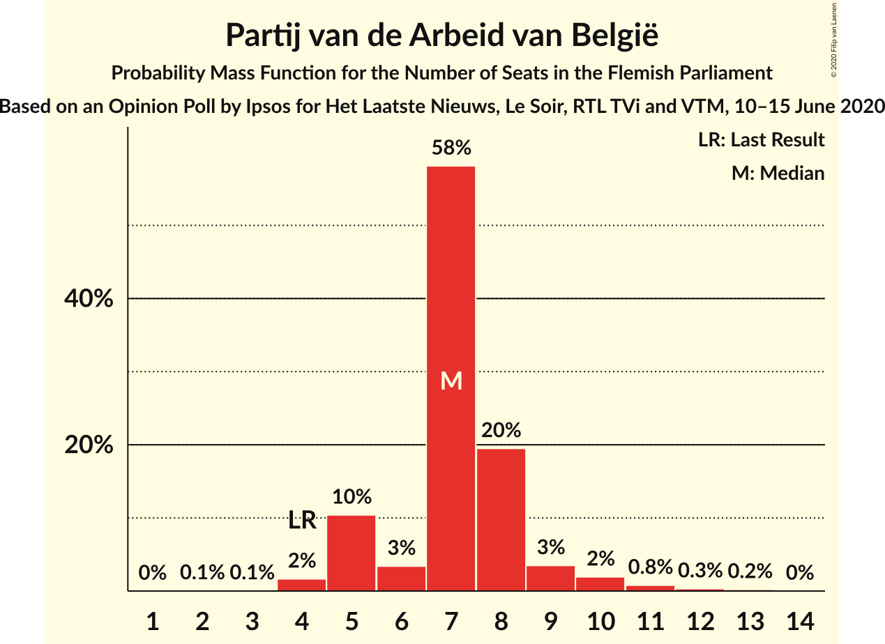

| Number of Seats | Probability | Accumulated | Special Marks |
|:---------------:|:-----------:|:-----------:|:-------------:|
| 2 | 0.1% | 100% |  |
| 3 | 0.1% | 99.9% |  |
| 4 | 2% | 99.9% | Last Result |
| 5 | 10% | 98% |  |
| 6 | 3% | 88% |  |
| 7 | 58% | 84% | Median |
| 8 | 20% | 26% |  |
| 9 | 3% | 7% |  |
| 10 | 2% | 3% |  |
| 11 | 0.8% | 1.3% |  |
| 12 | 0.3% | 0.6% |  |
| 13 | 0.2% | 0.2% |  |
| 14 | 0% | 0% |  |

## Coalitions

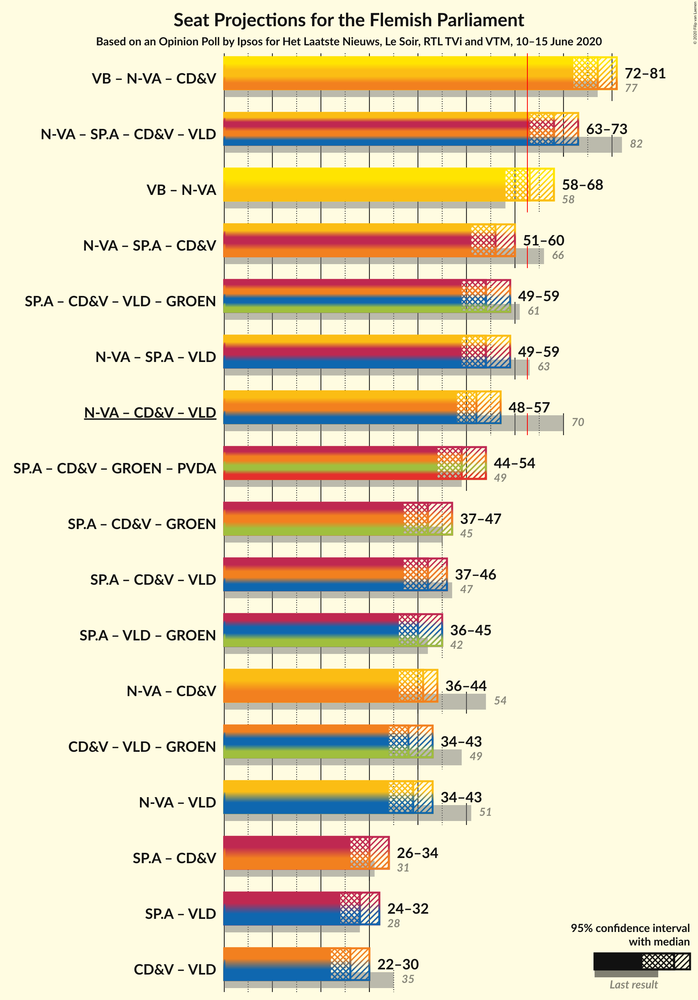

### Confidence Intervals

| Coalition | Last Result | Median | Majority? | 80% Confidence Interval | 90% Confidence Interval | 95% Confidence Interval | 99% Confidence Interval |
|:---------:|:-----------:|:------:|:---------:|:-----------------------:|:-----------------------:|:-----------------------:|:-----------------------:|
| Vlaams Belang – Nieuw-Vlaamse Alliantie – Christen-Democratisch en Vlaams | 77 | 77 | 100% | 74–80 | 73–81 | 72–81 | 71–83 |
| Nieuw-Vlaamse Alliantie – Socialistische Partij Anders – Christen-Democratisch en Vlaams – Open Vlaamse Liberalen en Democraten | 82 | 68 | 98.9% | 65–71 | 64–72 | 63–73 | 62–74 |
| Vlaams Belang – Nieuw-Vlaamse Alliantie | 58 | 63 | 60% | 60–66 | 59–67 | 58–68 | 56–69 |
| Nieuw-Vlaamse Alliantie – Socialistische Partij Anders – Christen-Democratisch en Vlaams | 66 | 56 | 0.4% | 53–59 | 52–60 | 51–60 | 49–62 |
| Socialistische Partij Anders – Christen-Democratisch en Vlaams – Open Vlaamse Liberalen en Democraten – Groen | 61 | 54 | 0% | 51–57 | 50–58 | 49–59 | 48–61 |
| Nieuw-Vlaamse Alliantie – Socialistische Partij Anders – Open Vlaamse Liberalen en Democraten | 63 | 54 | 0% | 51–57 | 50–58 | 49–59 | 48–60 |
| Nieuw-Vlaamse Alliantie – Christen-Democratisch en Vlaams – Open Vlaamse Liberalen en Democraten | 70 | 52 | 0% | 49–55 | 49–56 | 48–57 | 46–59 |
| Socialistische Partij Anders – Christen-Democratisch en Vlaams – Groen – Partij van de Arbeid van België | 49 | 49 | 0% | 46–52 | 45–53 | 44–54 | 43–55 |
| Socialistische Partij Anders – Christen-Democratisch en Vlaams – Groen | 45 | 42 | 0% | 39–45 | 38–45 | 37–47 | 36–48 |
| Socialistische Partij Anders – Christen-Democratisch en Vlaams – Open Vlaamse Liberalen en Democraten | 47 | 42 | 0% | 39–45 | 38–46 | 37–46 | 36–48 |
| Socialistische Partij Anders – Open Vlaamse Liberalen en Democraten – Groen | 42 | 40 | 0% | 37–43 | 37–44 | 36–45 | 35–46 |
| Nieuw-Vlaamse Alliantie – Christen-Democratisch en Vlaams | 54 | 41 | 0% | 37–43 | 37–44 | 36–44 | 34–46 |
| Christen-Democratisch en Vlaams – Open Vlaamse Liberalen en Democraten – Groen | 49 | 38 | 0% | 35–41 | 34–42 | 34–43 | 33–44 |
| Nieuw-Vlaamse Alliantie – Open Vlaamse Liberalen en Democraten | 51 | 39 | 0% | 36–41 | 35–42 | 34–43 | 33–44 |
| Socialistische Partij Anders – Christen-Democratisch en Vlaams | 31 | 30 | 0% | 27–32 | 26–33 | 26–34 | 25–35 |
| Socialistische Partij Anders – Open Vlaamse Liberalen en Democraten | 28 | 28 | 0% | 25–31 | 25–31 | 24–32 | 23–33 |
| Christen-Democratisch en Vlaams – Open Vlaamse Liberalen en Democraten | 35 | 26 | 0% | 23–29 | 23–30 | 22–30 | 21–31 |

### Vlaams Belang – Nieuw-Vlaamse Alliantie – Christen-Democratisch en Vlaams

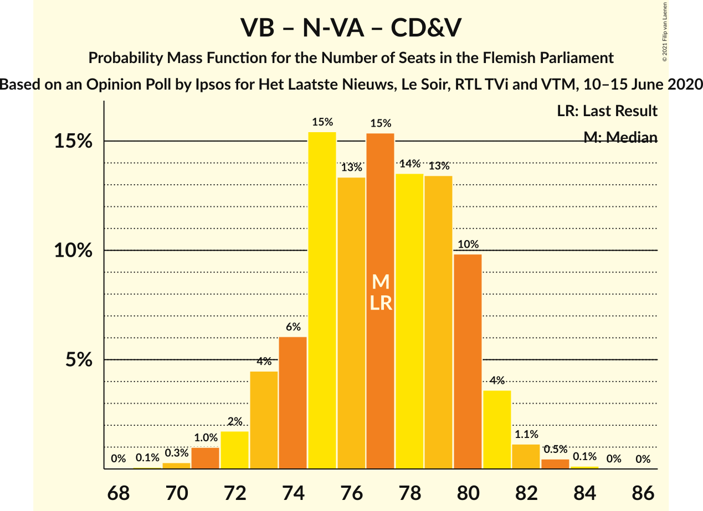

| Number of Seats | Probability | Accumulated | Special Marks |
|:---------------:|:-----------:|:-----------:|:-------------:|
| 69 | 0.1% | 100% |  |
| 70 | 0.3% | 99.9% |  |
| 71 | 1.0% | 99.6% |  |
| 72 | 2% | 98.6% |  |
| 73 | 4% | 97% |  |
| 74 | 6% | 92% |  |
| 75 | 15% | 86% |  |
| 76 | 13% | 71% |  |
| 77 | 15% | 58% | Last Result |
| 78 | 14% | 42% | Median |
| 79 | 13% | 29% |  |
| 80 | 10% | 15% |  |
| 81 | 4% | 5% |  |
| 82 | 1.1% | 2% |  |
| 83 | 0.5% | 0.6% |  |
| 84 | 0.1% | 0.2% |  |
| 85 | 0% | 0% |  |

### Nieuw-Vlaamse Alliantie – Socialistische Partij Anders – Christen-Democratisch en Vlaams – Open Vlaamse Liberalen en Democraten

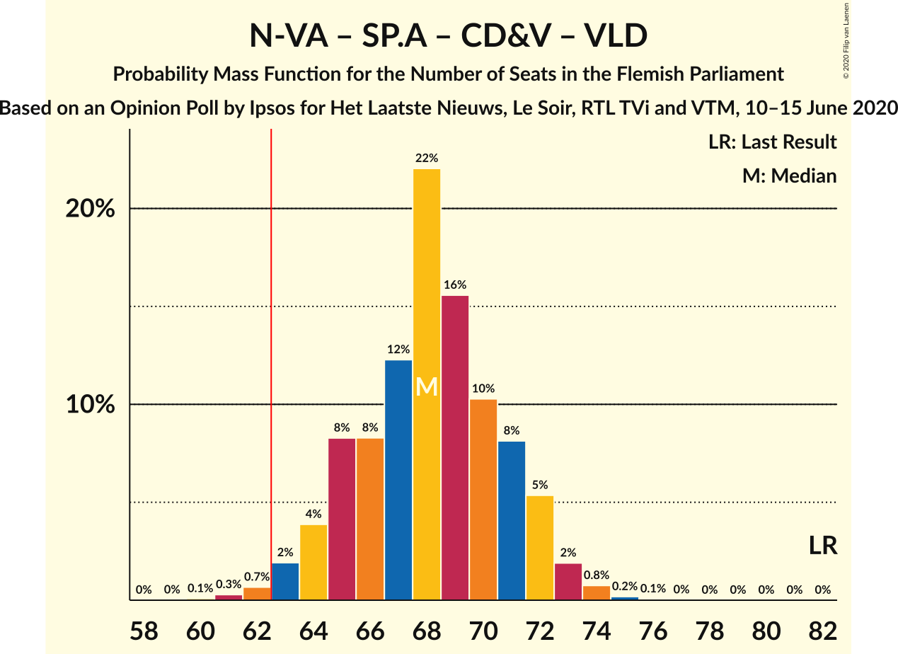

| Number of Seats | Probability | Accumulated | Special Marks |
|:---------------:|:-----------:|:-----------:|:-------------:|
| 60 | 0.1% | 100% |  |
| 61 | 0.3% | 99.9% |  |
| 62 | 0.7% | 99.6% |  |
| 63 | 2% | 98.9% | Majority |
| 64 | 4% | 97% |  |
| 65 | 8% | 93% |  |
| 66 | 8% | 85% |  |
| 67 | 12% | 77% |  |
| 68 | 22% | 64% | Median |
| 69 | 16% | 42% |  |
| 70 | 10% | 27% |  |
| 71 | 8% | 16% |  |
| 72 | 5% | 8% |  |
| 73 | 2% | 3% |  |
| 74 | 0.8% | 1.0% |  |
| 75 | 0.2% | 0.3% |  |
| 76 | 0.1% | 0.1% |  |
| 77 | 0% | 0% |  |
| 78 | 0% | 0% |  |
| 79 | 0% | 0% |  |
| 80 | 0% | 0% |  |
| 81 | 0% | 0% |  |
| 82 | 0% | 0% | Last Result |

### Vlaams Belang – Nieuw-Vlaamse Alliantie

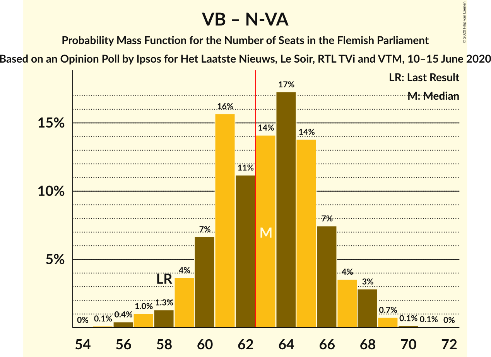

| Number of Seats | Probability | Accumulated | Special Marks |
|:---------------:|:-----------:|:-----------:|:-------------:|
| 55 | 0.1% | 100% |  |
| 56 | 0.4% | 99.9% |  |
| 57 | 1.0% | 99.4% |  |
| 58 | 1.3% | 98% | Last Result |
| 59 | 4% | 97% |  |
| 60 | 7% | 93% |  |
| 61 | 16% | 87% |  |
| 62 | 11% | 71% |  |
| 63 | 14% | 60% | Majority |
| 64 | 17% | 46% | Median |
| 65 | 14% | 29% |  |
| 66 | 7% | 15% |  |
| 67 | 4% | 7% |  |
| 68 | 3% | 4% |  |
| 69 | 0.7% | 1.0% |  |
| 70 | 0.1% | 0.2% |  |
| 71 | 0.1% | 0.1% |  |
| 72 | 0% | 0% |  |

### Nieuw-Vlaamse Alliantie – Socialistische Partij Anders – Christen-Democratisch en Vlaams

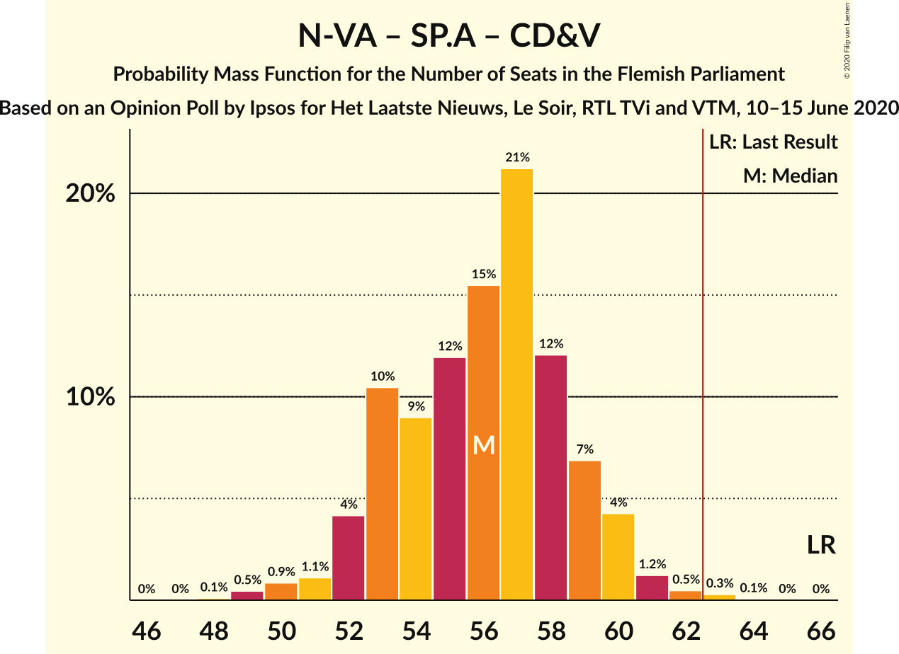

| Number of Seats | Probability | Accumulated | Special Marks |
|:---------------:|:-----------:|:-----------:|:-------------:|
| 48 | 0.1% | 100% |  |
| 49 | 0.5% | 99.9% |  |
| 50 | 0.9% | 99.4% |  |
| 51 | 1.1% | 98.6% |  |
| 52 | 4% | 97% |  |
| 53 | 10% | 93% |  |
| 54 | 9% | 83% |  |
| 55 | 12% | 74% |  |
| 56 | 15% | 62% | Median |
| 57 | 21% | 46% |  |
| 58 | 12% | 25% |  |
| 59 | 7% | 13% |  |
| 60 | 4% | 6% |  |
| 61 | 1.2% | 2% |  |
| 62 | 0.5% | 0.8% |  |
| 63 | 0.3% | 0.4% | Majority |
| 64 | 0.1% | 0.1% |  |
| 65 | 0% | 0% |  |
| 66 | 0% | 0% | Last Result |

### Socialistische Partij Anders – Christen-Democratisch en Vlaams – Open Vlaamse Liberalen en Democraten – Groen

| Number of Seats | Probability | Accumulated | Special Marks |
|:---------------:|:-----------:|:-----------:|:-------------:|
| 46 | 0% | 100% |  |
| 47 | 0.2% | 99.9% |  |
| 48 | 1.1% | 99.7% |  |
| 49 | 2% | 98.6% |  |
| 50 | 3% | 96% |  |
| 51 | 10% | 93% |  |
| 52 | 16% | 83% | Median |
| 53 | 13% | 68% |  |
| 54 | 14% | 54% |  |
| 55 | 13% | 40% |  |
| 56 | 15% | 27% |  |
| 57 | 5% | 12% |  |
| 58 | 4% | 6% |  |
| 59 | 1.2% | 3% |  |
| 60 | 1.1% | 2% |  |
| 61 | 0.4% | 0.5% | Last Result |
| 62 | 0.1% | 0.1% |  |
| 63 | 0% | 0% | Majority |

### Nieuw-Vlaamse Alliantie – Socialistische Partij Anders – Open Vlaamse Liberalen en Democraten

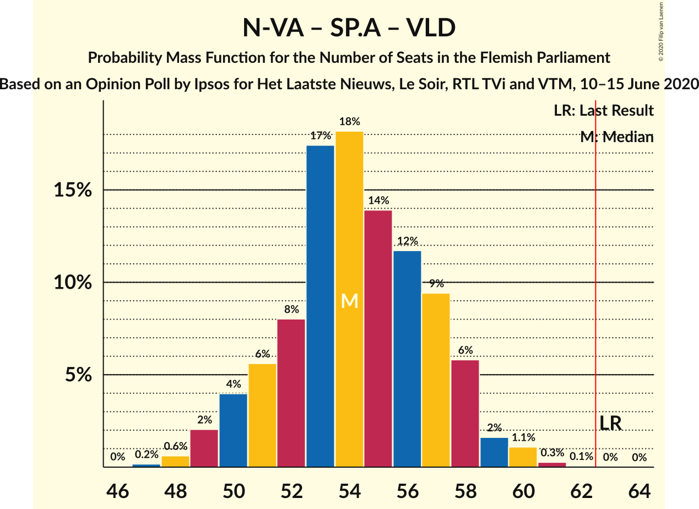

| Number of Seats | Probability | Accumulated | Special Marks |
|:---------------:|:-----------:|:-----------:|:-------------:|
| 46 | 0% | 100% |  |
| 47 | 0.2% | 99.9% |  |
| 48 | 0.6% | 99.8% |  |
| 49 | 2% | 99.2% |  |
| 50 | 4% | 97% |  |
| 51 | 6% | 93% |  |
| 52 | 8% | 88% |  |
| 53 | 17% | 80% |  |
| 54 | 18% | 62% | Median |
| 55 | 14% | 44% |  |
| 56 | 12% | 30% |  |
| 57 | 9% | 18% |  |
| 58 | 6% | 9% |  |
| 59 | 2% | 3% |  |
| 60 | 1.1% | 1.4% |  |
| 61 | 0.3% | 0.4% |  |
| 62 | 0.1% | 0.1% |  |
| 63 | 0% | 0% | Last Result, Majority |

### Nieuw-Vlaamse Alliantie – Christen-Democratisch en Vlaams – Open Vlaamse Liberalen en Democraten

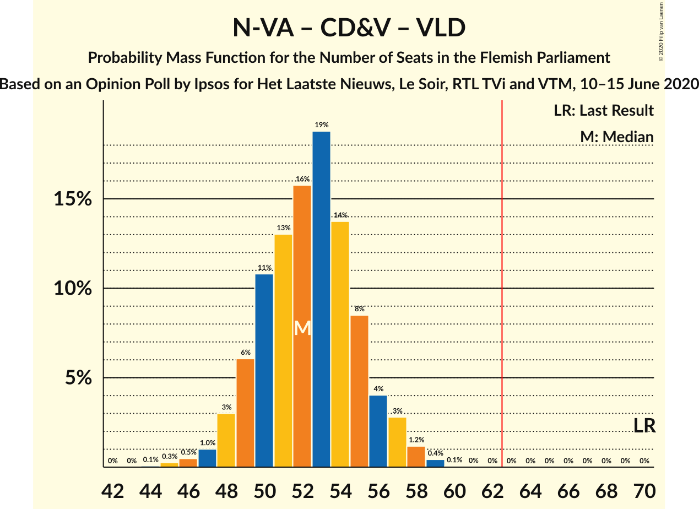

| Number of Seats | Probability | Accumulated | Special Marks |
|:---------------:|:-----------:|:-----------:|:-------------:|
| 44 | 0.1% | 100% |  |
| 45 | 0.3% | 99.9% |  |
| 46 | 0.5% | 99.7% |  |
| 47 | 1.0% | 99.2% |  |
| 48 | 3% | 98% |  |
| 49 | 6% | 95% |  |
| 50 | 11% | 89% |  |
| 51 | 13% | 78% |  |
| 52 | 16% | 65% |  |
| 53 | 19% | 50% | Median |
| 54 | 14% | 31% |  |
| 55 | 8% | 17% |  |
| 56 | 4% | 9% |  |
| 57 | 3% | 4% |  |
| 58 | 1.2% | 2% |  |
| 59 | 0.4% | 0.5% |  |
| 60 | 0.1% | 0.1% |  |
| 61 | 0% | 0% |  |
| 62 | 0% | 0% |  |
| 63 | 0% | 0% | Majority |
| 64 | 0% | 0% |  |
| 65 | 0% | 0% |  |
| 66 | 0% | 0% |  |
| 67 | 0% | 0% |  |
| 68 | 0% | 0% |  |
| 69 | 0% | 0% |  |
| 70 | 0% | 0% | Last Result |

### Socialistische Partij Anders – Christen-Democratisch en Vlaams – Groen – Partij van de Arbeid van België

| Number of Seats | Probability | Accumulated | Special Marks |
|:---------------:|:-----------:|:-----------:|:-------------:|
| 41 | 0.1% | 100% |  |
| 42 | 0.3% | 99.9% |  |
| 43 | 0.7% | 99.6% |  |
| 44 | 4% | 98.9% |  |
| 45 | 5% | 95% |  |
| 46 | 6% | 90% |  |
| 47 | 10% | 84% | Median |
| 48 | 17% | 74% |  |
| 49 | 21% | 56% | Last Result |
| 50 | 11% | 35% |  |
| 51 | 11% | 24% |  |
| 52 | 6% | 13% |  |
| 53 | 4% | 7% |  |
| 54 | 2% | 3% |  |
| 55 | 0.8% | 1.2% |  |
| 56 | 0.2% | 0.4% |  |
| 57 | 0.1% | 0.2% |  |
| 58 | 0% | 0% |  |

### Socialistische Partij Anders – Christen-Democratisch en Vlaams – Groen

| Number of Seats | Probability | Accumulated | Special Marks |
|:---------------:|:-----------:|:-----------:|:-------------:|
| 35 | 0.1% | 100% |  |
| 36 | 0.9% | 99.8% |  |
| 37 | 3% | 99.0% |  |
| 38 | 5% | 96% |  |
| 39 | 6% | 90% |  |
| 40 | 13% | 84% | Median |
| 41 | 17% | 71% |  |
| 42 | 20% | 54% |  |
| 43 | 12% | 34% |  |
| 44 | 11% | 23% |  |
| 45 | 7% | 12% | Last Result |
| 46 | 2% | 5% |  |
| 47 | 2% | 3% |  |
| 48 | 0.8% | 1.1% |  |
| 49 | 0.2% | 0.3% |  |
| 50 | 0% | 0.1% |  |
| 51 | 0% | 0% |  |

### Socialistische Partij Anders – Christen-Democratisch en Vlaams – Open Vlaamse Liberalen en Democraten

| Number of Seats | Probability | Accumulated | Special Marks |
|:---------------:|:-----------:|:-----------:|:-------------:|
| 34 | 0% | 100% |  |
| 35 | 0.1% | 99.9% |  |
| 36 | 0.7% | 99.8% |  |
| 37 | 3% | 99.1% |  |
| 38 | 4% | 97% |  |
| 39 | 9% | 92% |  |
| 40 | 12% | 84% |  |
| 41 | 20% | 72% | Median |
| 42 | 17% | 52% |  |
| 43 | 13% | 35% |  |
| 44 | 11% | 22% |  |
| 45 | 6% | 12% |  |
| 46 | 3% | 6% |  |
| 47 | 2% | 2% | Last Result |
| 48 | 0.4% | 0.7% |  |
| 49 | 0.2% | 0.3% |  |
| 50 | 0% | 0.1% |  |
| 51 | 0% | 0% |  |

### Socialistische Partij Anders – Open Vlaamse Liberalen en Democraten – Groen

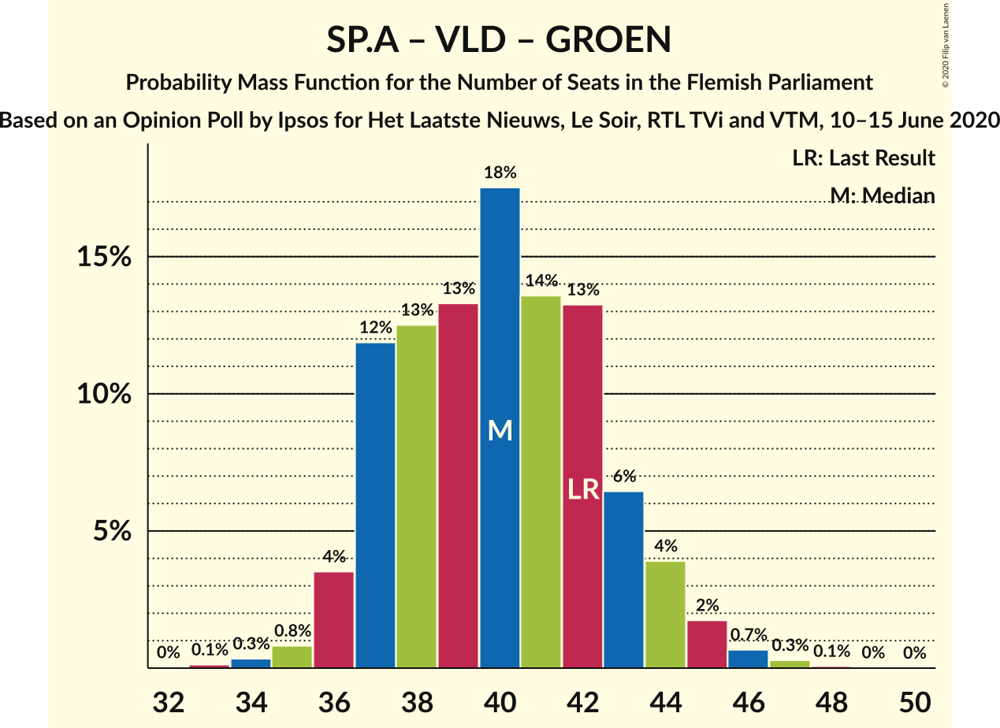

| Number of Seats | Probability | Accumulated | Special Marks |
|:---------------:|:-----------:|:-----------:|:-------------:|
| 33 | 0.1% | 100% |  |
| 34 | 0.3% | 99.8% |  |
| 35 | 0.8% | 99.5% |  |
| 36 | 4% | 98.7% |  |
| 37 | 12% | 95% |  |
| 38 | 13% | 83% | Median |
| 39 | 13% | 71% |  |
| 40 | 18% | 57% |  |
| 41 | 14% | 40% |  |
| 42 | 13% | 26% | Last Result |
| 43 | 6% | 13% |  |
| 44 | 4% | 7% |  |
| 45 | 2% | 3% |  |
| 46 | 0.7% | 1.1% |  |
| 47 | 0.3% | 0.4% |  |
| 48 | 0.1% | 0.1% |  |
| 49 | 0% | 0% |  |

### Nieuw-Vlaamse Alliantie – Christen-Democratisch en Vlaams

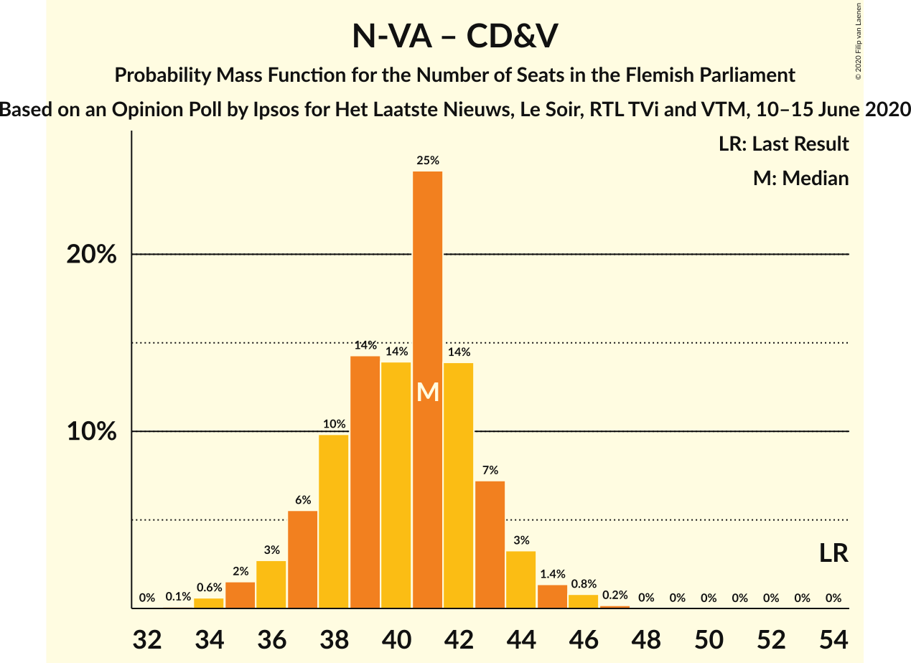

| Number of Seats | Probability | Accumulated | Special Marks |
|:---------------:|:-----------:|:-----------:|:-------------:|
| 33 | 0.1% | 100% |  |
| 34 | 0.6% | 99.9% |  |
| 35 | 2% | 99.3% |  |
| 36 | 3% | 98% |  |
| 37 | 6% | 95% |  |
| 38 | 10% | 90% |  |
| 39 | 14% | 80% |  |
| 40 | 14% | 65% |  |
| 41 | 25% | 51% | Median |
| 42 | 14% | 27% |  |
| 43 | 7% | 13% |  |
| 44 | 3% | 6% |  |
| 45 | 1.4% | 2% |  |
| 46 | 0.8% | 1.0% |  |
| 47 | 0.2% | 0.2% |  |
| 48 | 0% | 0% |  |
| 49 | 0% | 0% |  |
| 50 | 0% | 0% |  |
| 51 | 0% | 0% |  |
| 52 | 0% | 0% |  |
| 53 | 0% | 0% |  |
| 54 | 0% | 0% | Last Result |

### Christen-Democratisch en Vlaams – Open Vlaamse Liberalen en Democraten – Groen

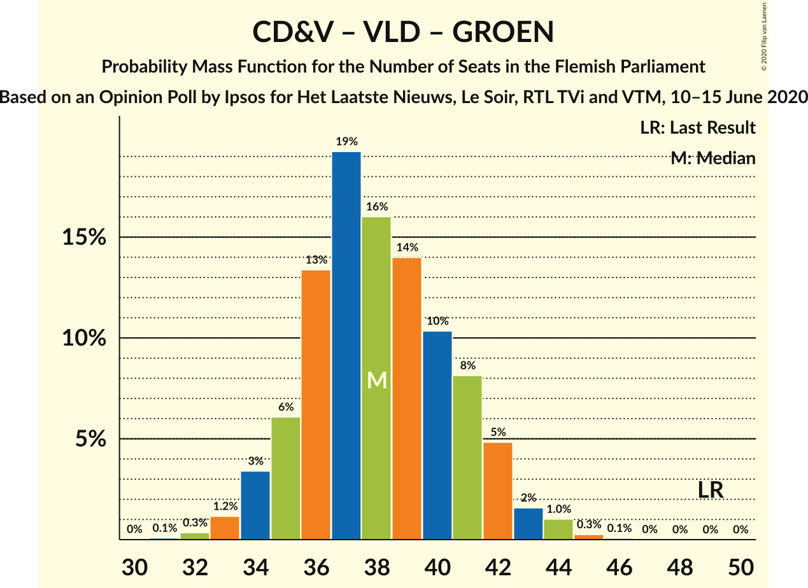

| Number of Seats | Probability | Accumulated | Special Marks |
|:---------------:|:-----------:|:-----------:|:-------------:|
| 31 | 0.1% | 100% |  |
| 32 | 0.3% | 99.9% |  |
| 33 | 1.2% | 99.5% |  |
| 34 | 3% | 98% |  |
| 35 | 6% | 95% |  |
| 36 | 13% | 89% |  |
| 37 | 19% | 76% | Median |
| 38 | 16% | 56% |  |
| 39 | 14% | 40% |  |
| 40 | 10% | 26% |  |
| 41 | 8% | 16% |  |
| 42 | 5% | 8% |  |
| 43 | 2% | 3% |  |
| 44 | 1.0% | 1.4% |  |
| 45 | 0.3% | 0.3% |  |
| 46 | 0.1% | 0.1% |  |
| 47 | 0% | 0% |  |
| 48 | 0% | 0% |  |
| 49 | 0% | 0% | Last Result |

### Nieuw-Vlaamse Alliantie – Open Vlaamse Liberalen en Democraten

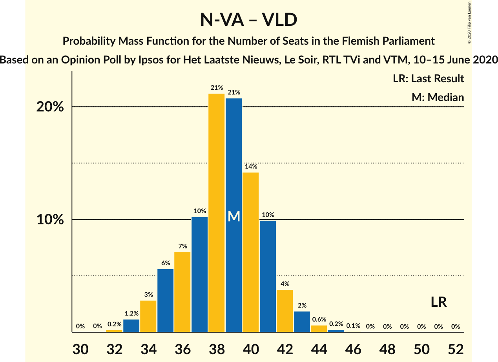

| Number of Seats | Probability | Accumulated | Special Marks |
|:---------------:|:-----------:|:-----------:|:-------------:|
| 31 | 0% | 100% |  |
| 32 | 0.2% | 99.9% |  |
| 33 | 1.2% | 99.7% |  |
| 34 | 3% | 98.5% |  |
| 35 | 6% | 96% |  |
| 36 | 7% | 90% |  |
| 37 | 10% | 83% |  |
| 38 | 21% | 73% |  |
| 39 | 21% | 52% | Median |
| 40 | 14% | 31% |  |
| 41 | 10% | 17% |  |
| 42 | 4% | 7% |  |
| 43 | 2% | 3% |  |
| 44 | 0.6% | 1.0% |  |
| 45 | 0.2% | 0.3% |  |
| 46 | 0.1% | 0.1% |  |
| 47 | 0% | 0% |  |
| 48 | 0% | 0% |  |
| 49 | 0% | 0% |  |
| 50 | 0% | 0% |  |
| 51 | 0% | 0% | Last Result |

### Socialistische Partij Anders – Christen-Democratisch en Vlaams

| Number of Seats | Probability | Accumulated | Special Marks |
|:---------------:|:-----------:|:-----------:|:-------------:|
| 24 | 0.2% | 100% |  |
| 25 | 1.3% | 99.8% |  |
| 26 | 7% | 98% |  |
| 27 | 8% | 92% |  |
| 28 | 12% | 84% |  |
| 29 | 17% | 72% | Median |
| 30 | 21% | 55% |  |
| 31 | 18% | 34% | Last Result |
| 32 | 8% | 15% |  |
| 33 | 4% | 8% |  |
| 34 | 2% | 3% |  |
| 35 | 0.9% | 1.3% |  |
| 36 | 0.4% | 0.5% |  |
| 37 | 0.1% | 0.1% |  |
| 38 | 0% | 0% |  |

### Socialistische Partij Anders – Open Vlaamse Liberalen en Democraten

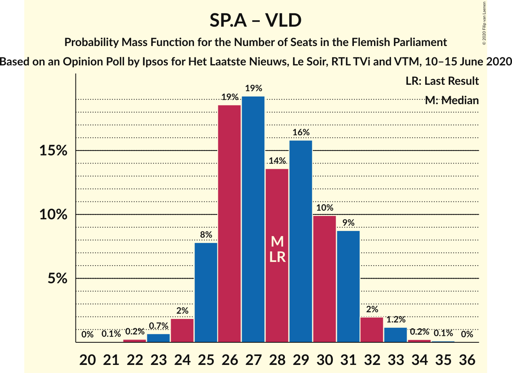

| Number of Seats | Probability | Accumulated | Special Marks |
|:---------------:|:-----------:|:-----------:|:-------------:|
| 21 | 0.1% | 100% |  |
| 22 | 0.2% | 99.9% |  |
| 23 | 0.7% | 99.7% |  |
| 24 | 2% | 99.0% |  |
| 25 | 8% | 97% |  |
| 26 | 19% | 89% |  |
| 27 | 19% | 71% | Median |
| 28 | 14% | 52% | Last Result |
| 29 | 16% | 38% |  |
| 30 | 10% | 22% |  |
| 31 | 9% | 12% |  |
| 32 | 2% | 3% |  |
| 33 | 1.2% | 2% |  |
| 34 | 0.2% | 0.3% |  |
| 35 | 0.1% | 0.1% |  |
| 36 | 0% | 0% |  |

### Christen-Democratisch en Vlaams – Open Vlaamse Liberalen en Democraten

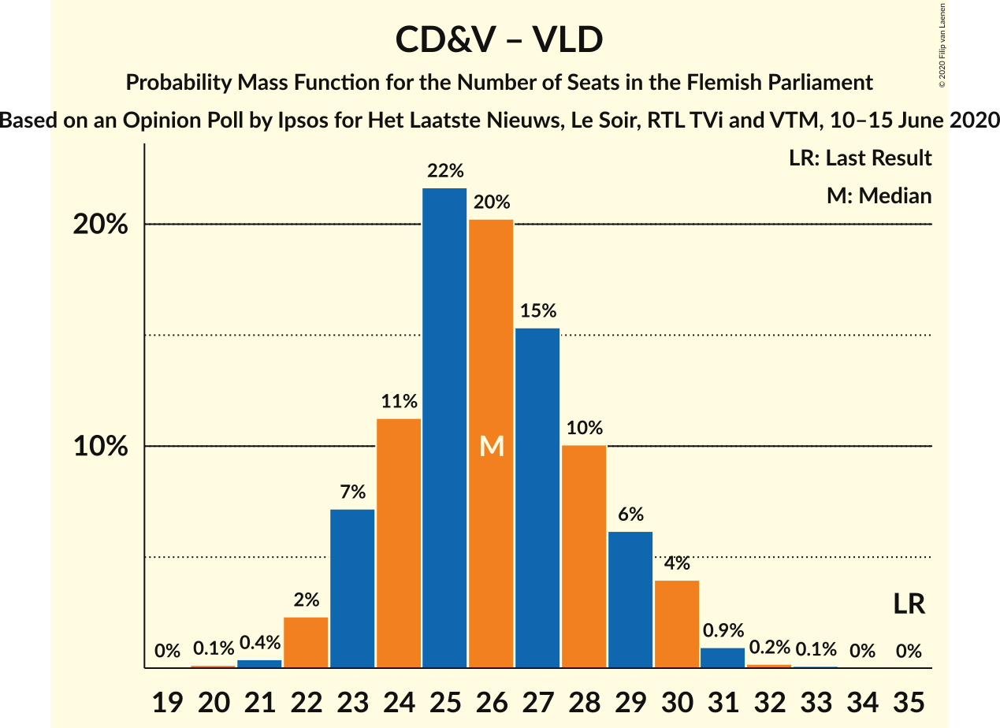

| Number of Seats | Probability | Accumulated | Special Marks |
|:---------------:|:-----------:|:-----------:|:-------------:|
| 20 | 0.1% | 100% |  |
| 21 | 0.4% | 99.8% |  |
| 22 | 2% | 99.4% |  |
| 23 | 7% | 97% |  |
| 24 | 11% | 90% |  |
| 25 | 22% | 79% |  |
| 26 | 20% | 57% | Median |
| 27 | 15% | 37% |  |
| 28 | 10% | 21% |  |
| 29 | 6% | 11% |  |
| 30 | 4% | 5% |  |
| 31 | 0.9% | 1.2% |  |
| 32 | 0.2% | 0.3% |  |
| 33 | 0.1% | 0.1% |  |
| 34 | 0% | 0% |  |
| 35 | 0% | 0% | Last Result |

## Technical Information

### Opinion Poll

+ **Polling firm:** Ipsos
+ **Commissioner(s):** Het Laatste Nieuws, Le Soir, RTL TVi and VTM
+ **Fieldwork period:** 10–15 June 2020

### Calculations

+ **Sample size:** 951
+ **Simulations done:** 1,048,576
+ **Error estimate:** 1.40%

