# Opinion Poll by Dedicated for Soirmag, 28 August–1 September 2020

<a href="#voting-intentions">Voting Intentions</a> | <a href="#seats">Seats</a> | <a href="#coalitions">Coalitions</a> | <a href="#technical-information">Technical Information</a>

## Voting Intentions

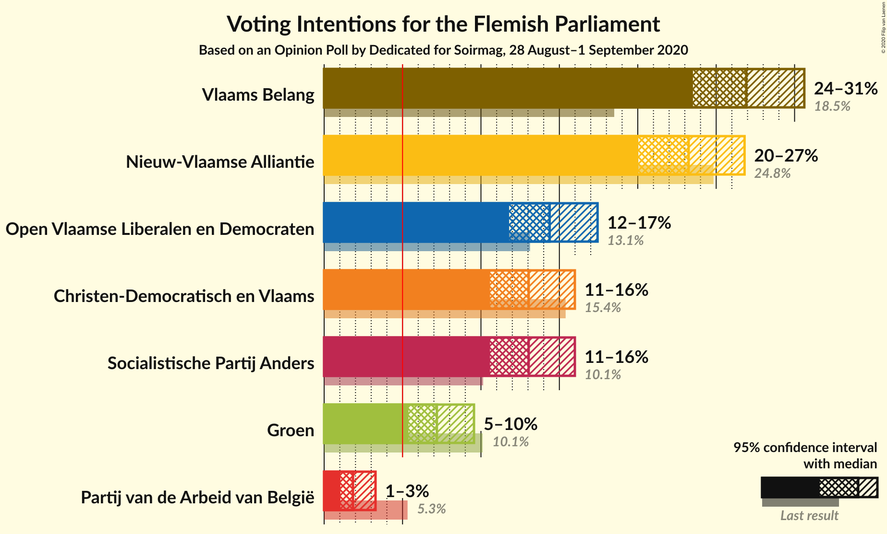

### Confidence Intervals

| Party | Last Result | Poll Result | 80% Confidence Interval | 90% Confidence Interval | 95% Confidence Interval | 99% Confidence Interval |
|:-----:|:-----------:|:-----------:|:-----------------------:|:-----------------------:|:-----------------------:|:-----------------------:|
| Vlaams Belang | 18.5% | 26.9% | 24.7–29.3% |24.1–30.0% |23.5–30.6% |22.5–31.8% |
| Nieuw-Vlaamse Alliantie | 24.8% | 23.2% | 21.1–25.6% |20.5–26.2% |20.0–26.8% |19.1–27.9% |
| Open Vlaamse Liberalen en Democraten | 13.1% | 14.4% | 12.7–16.4% |12.2–16.9% |11.8–17.4% |11.0–18.4% |
| Christen-Democratisch en Vlaams | 15.4% | 13.0% | 11.4–15.0% |11.0–15.5% |10.6–16.0% |9.8–16.9% |
| Socialistische Partij Anders | 10.1% | 13.0% | 11.4–15.0% |11.0–15.5% |10.6–16.0% |9.8–16.9% |
| Groen | 10.1% | 7.2% | 6.0–8.7% |5.7–9.2% |5.4–9.6% |4.9–10.3% |
| Partij van de Arbeid van België | 5.3% | 1.8% | 1.3–2.8% |1.2–3.0% |1.0–3.3% |0.8–3.8% |

*Note:* The poll result column reflects the actual value used in the calculations. Published results may vary slightly, and in addition be rounded to fewer digits.

## Seats

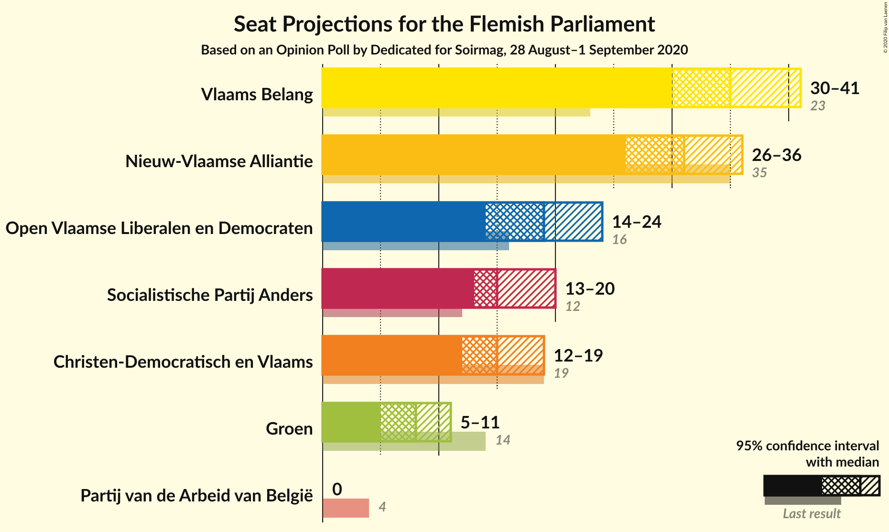

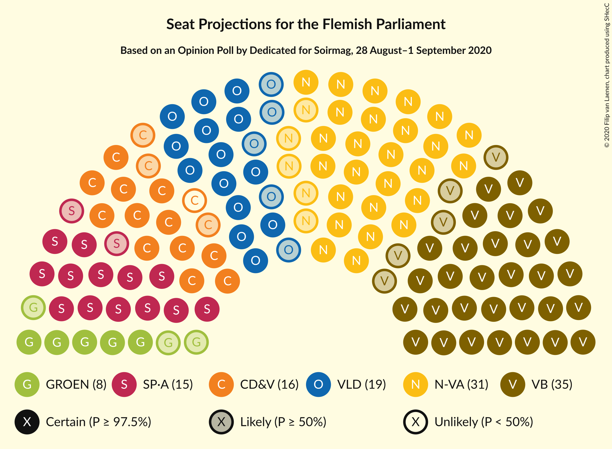

### Confidence Intervals

| Party | Last Result | Median | 80% Confidence Interval | 90% Confidence Interval | 95% Confidence Interval | 99% Confidence Interval |
|:-----:|:-----------:|:------:|:-----------------------:|:-----------------------:|:-----------------------:|:-----------------------:|
| <a href="#vlaams-belang">Vlaams Belang</a> | 23 | 35 | 33–38 |31–40 |30–40 |29–42 |
| <a href="#nieuw-vlaamse-alliantie">Nieuw-Vlaamse Alliantie</a> | 35 | 30 | 28–34 |27–35 |26–36 |25–37 |
| <a href="#open-vlaamse-liberalen-en-democraten">Open Vlaamse Liberalen en Democraten</a> | 16 | 19 | 16–20 |15–23 |15–24 |13–25 |
| <a href="#christen-democratisch-en-vlaams">Christen-Democratisch en Vlaams</a> | 19 | 15 | 13–18 |12–19 |12–19 |11–21 |
| <a href="#socialistische-partij-anders">Socialistische Partij Anders</a> | 12 | 15 | 14–19 |14–20 |14–20 |11–22 |
| <a href="#groen">Groen</a> | 14 | 9 | 5–11 |5–11 |5–12 |4–14 |
| <a href="#partij-van-de-arbeid-van-belgië">Partij van de Arbeid van België</a> | 4 | 0 | 0 |0 |0 |0 |

### Vlaams Belang

*For a full overview of the results for this party, see the [Vlaams Belang](party-vlaamsbelang.html) page.*

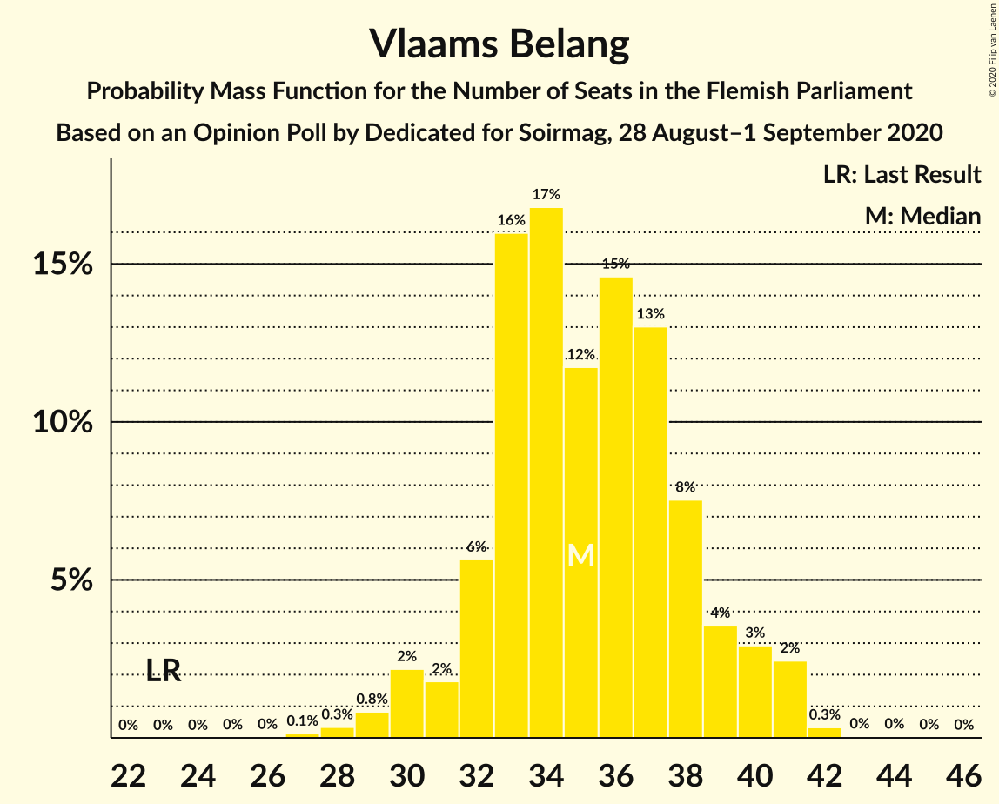

| Number of Seats | Probability | Accumulated | Special Marks |
|:---------------:|:-----------:|:-----------:|:-------------:|
| 23 | 0% | 100% | Last Result |
| 24 | 0% | 100% |  |
| 25 | 0% | 100% |  |
| 26 | 0% | 100% |  |
| 27 | 0.1% | 100% |  |
| 28 | 0.2% | 99.9% |  |
| 29 | 1.5% | 99.6% |  |
| 30 | 2% | 98% |  |
| 31 | 2% | 96% |  |
| 32 | 4% | 95% |  |
| 33 | 16% | 90% |  |
| 34 | 20% | 75% |  |
| 35 | 13% | 55% | Median |
| 36 | 15% | 42% |  |
| 37 | 12% | 27% |  |
| 38 | 8% | 15% |  |
| 39 | 0.9% | 7% |  |
| 40 | 4% | 6% |  |
| 41 | 1.3% | 2% |  |
| 42 | 0.4% | 0.6% |  |
| 43 | 0% | 0.1% |  |
| 44 | 0.1% | 0.1% |  |
| 45 | 0% | 0% |  |

### Nieuw-Vlaamse Alliantie

*For a full overview of the results for this party, see the [Nieuw-Vlaamse Alliantie](party-nieuw-vlaamsealliantie.html) page.*

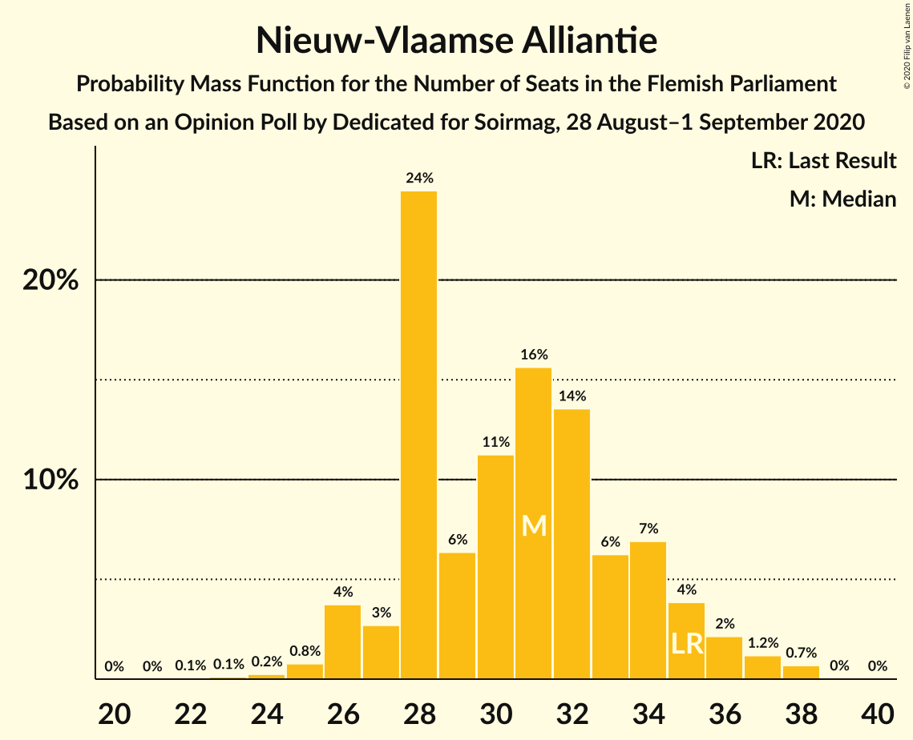

| Number of Seats | Probability | Accumulated | Special Marks |
|:---------------:|:-----------:|:-----------:|:-------------:|
| 23 | 0.1% | 100% |  |
| 24 | 0.1% | 99.9% |  |
| 25 | 0.6% | 99.8% |  |
| 26 | 3% | 99.2% |  |
| 27 | 4% | 96% |  |
| 28 | 23% | 93% |  |
| 29 | 4% | 70% |  |
| 30 | 15% | 65% | Median |
| 31 | 9% | 50% |  |
| 32 | 18% | 41% |  |
| 33 | 3% | 23% |  |
| 34 | 13% | 20% |  |
| 35 | 3% | 7% | Last Result |
| 36 | 3% | 4% |  |
| 37 | 1.0% | 2% |  |
| 38 | 0.4% | 0.5% |  |
| 39 | 0% | 0.1% |  |
| 40 | 0% | 0% |  |

### Open Vlaamse Liberalen en Democraten

*For a full overview of the results for this party, see the [Open Vlaamse Liberalen en Democraten](party-openvlaamseliberalenendemocraten.html) page.*

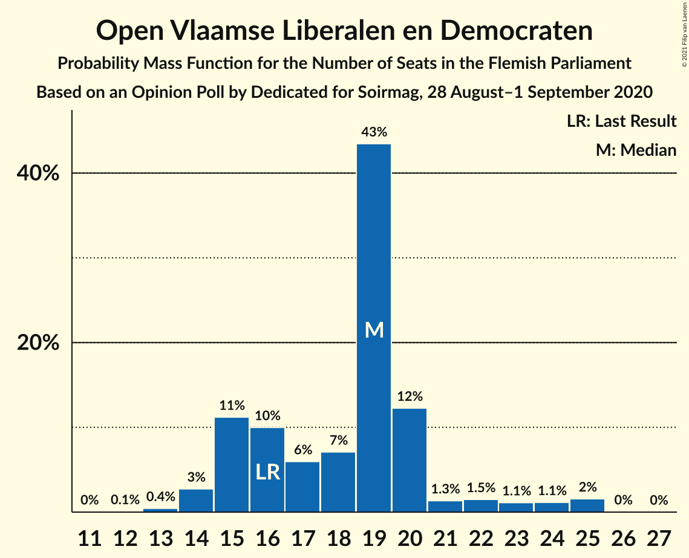

| Number of Seats | Probability | Accumulated | Special Marks |
|:---------------:|:-----------:|:-----------:|:-------------:|
| 12 | 0.1% | 100% |  |
| 13 | 0.5% | 99.9% |  |
| 14 | 1.3% | 99.4% |  |
| 15 | 8% | 98% |  |
| 16 | 5% | 90% | Last Result |
| 17 | 8% | 85% |  |
| 18 | 8% | 77% |  |
| 19 | 50% | 70% | Median |
| 20 | 12% | 19% |  |
| 21 | 0.4% | 7% |  |
| 22 | 0.9% | 6% |  |
| 23 | 0.7% | 5% |  |
| 24 | 3% | 5% |  |
| 25 | 2% | 2% |  |
| 26 | 0.1% | 0.1% |  |
| 27 | 0% | 0% |  |

### Christen-Democratisch en Vlaams

*For a full overview of the results for this party, see the [Christen-Democratisch en Vlaams](party-christen-democratischenvlaams.html) page.*

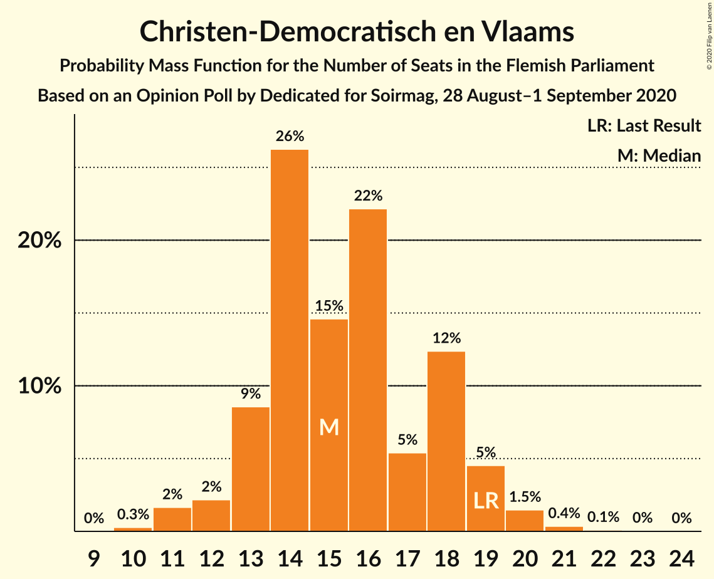

| Number of Seats | Probability | Accumulated | Special Marks |
|:---------------:|:-----------:|:-----------:|:-------------:|
| 10 | 0.2% | 100% |  |
| 11 | 2% | 99.8% |  |
| 12 | 3% | 98% |  |
| 13 | 14% | 95% |  |
| 14 | 16% | 81% |  |
| 15 | 18% | 65% | Median |
| 16 | 26% | 47% |  |
| 17 | 5% | 21% |  |
| 18 | 9% | 15% |  |
| 19 | 5% | 7% | Last Result |
| 20 | 1.1% | 2% |  |
| 21 | 0.5% | 0.8% |  |
| 22 | 0.2% | 0.3% |  |
| 23 | 0% | 0% |  |

### Socialistische Partij Anders

*For a full overview of the results for this party, see the [Socialistische Partij Anders](party-socialistischepartijanders.html) page.*

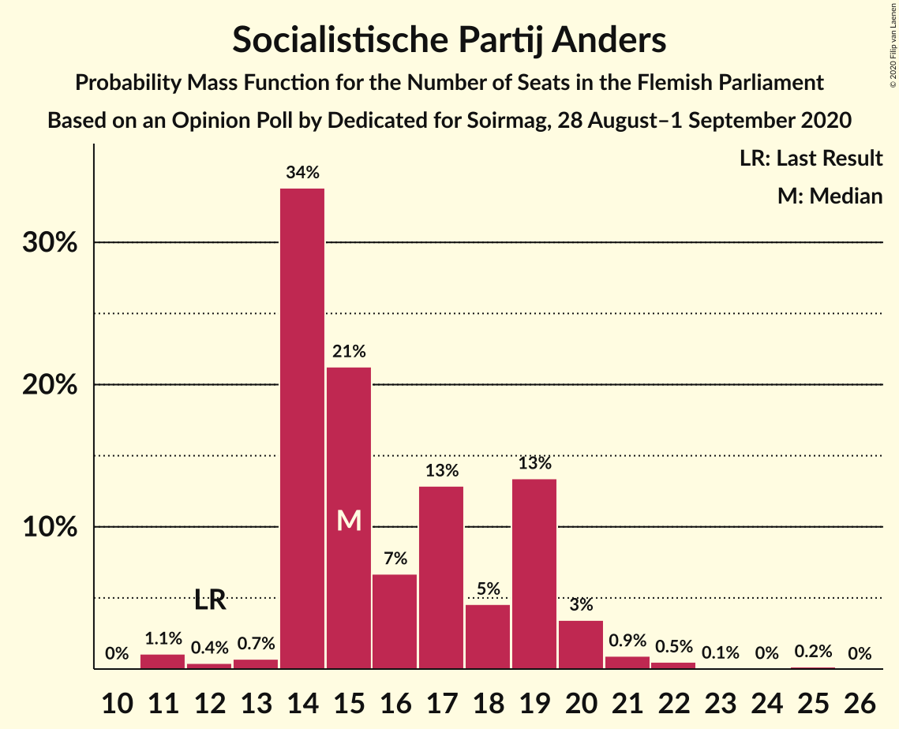

| Number of Seats | Probability | Accumulated | Special Marks |
|:---------------:|:-----------:|:-----------:|:-------------:|
| 11 | 1.1% | 100% |  |
| 12 | 0.4% | 98.9% | Last Result |
| 13 | 0.7% | 98% |  |
| 14 | 34% | 98% |  |
| 15 | 21% | 64% | Median |
| 16 | 7% | 43% |  |
| 17 | 13% | 36% |  |
| 18 | 5% | 23% |  |
| 19 | 13% | 19% |  |
| 20 | 3% | 5% |  |
| 21 | 0.9% | 2% |  |
| 22 | 0.5% | 0.8% |  |
| 23 | 0.1% | 0.3% |  |
| 24 | 0% | 0.2% |  |
| 25 | 0.2% | 0.2% |  |
| 26 | 0% | 0% |  |

### Groen

*For a full overview of the results for this party, see the [Groen](party-groen.html) page.*

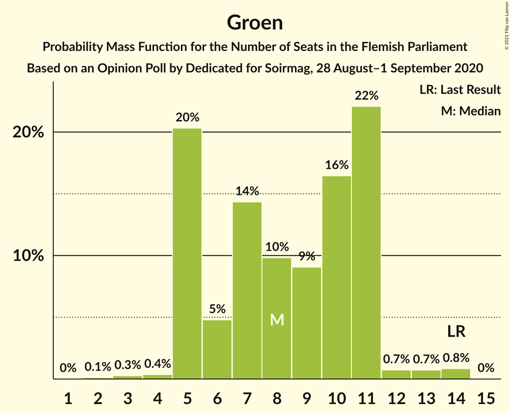

| Number of Seats | Probability | Accumulated | Special Marks |
|:---------------:|:-----------:|:-----------:|:-------------:|
| 2 | 0.1% | 100% |  |
| 3 | 0.2% | 99.9% |  |
| 4 | 0.2% | 99.6% |  |
| 5 | 17% | 99.4% |  |
| 6 | 8% | 83% |  |
| 7 | 19% | 75% |  |
| 8 | 3% | 55% |  |
| 9 | 10% | 53% | Median |
| 10 | 15% | 42% |  |
| 11 | 24% | 27% |  |
| 12 | 0.9% | 3% |  |
| 13 | 2% | 2% |  |
| 14 | 0.7% | 0.8% | Last Result |
| 15 | 0% | 0% |  |

### Partij van de Arbeid van België

*For a full overview of the results for this party, see the [Partij van de Arbeid van België](party-partijvandearbeidvanbelgië.html) page.*

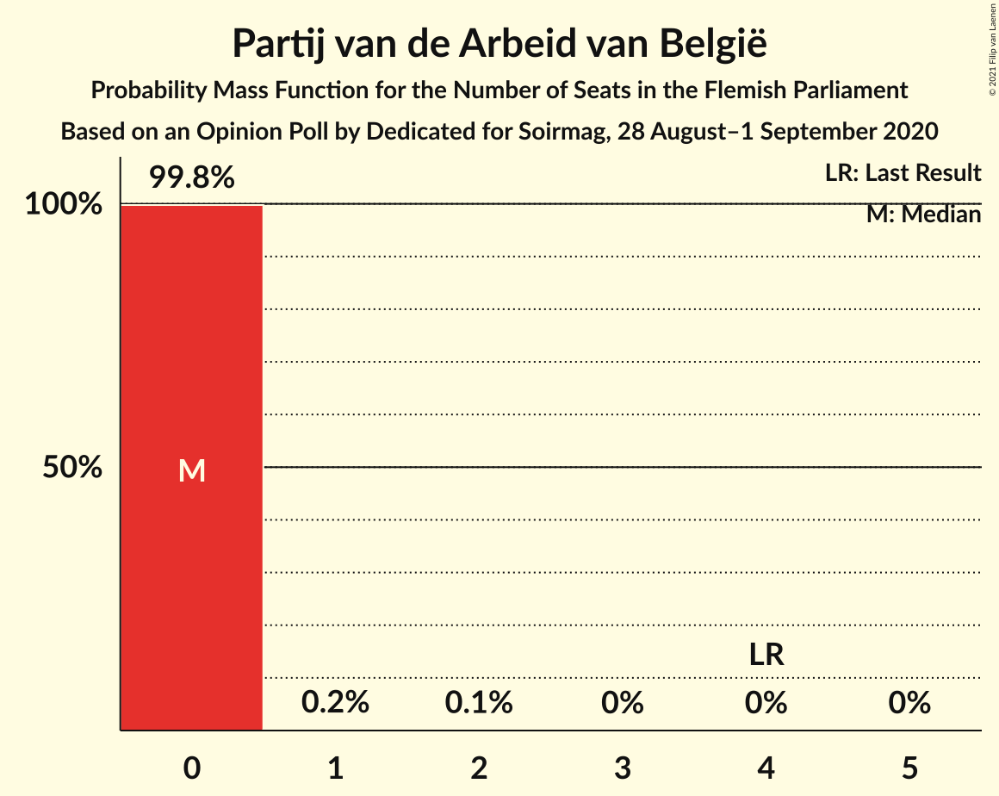

| Number of Seats | Probability | Accumulated | Special Marks |
|:---------------:|:-----------:|:-----------:|:-------------:|
| 0 | 99.8% | 100% | Median |
| 1 | 0.1% | 0.2% |  |
| 2 | 0.1% | 0.1% |  |
| 3 | 0% | 0% |  |
| 4 | 0% | 0% | Last Result |

## Coalitions

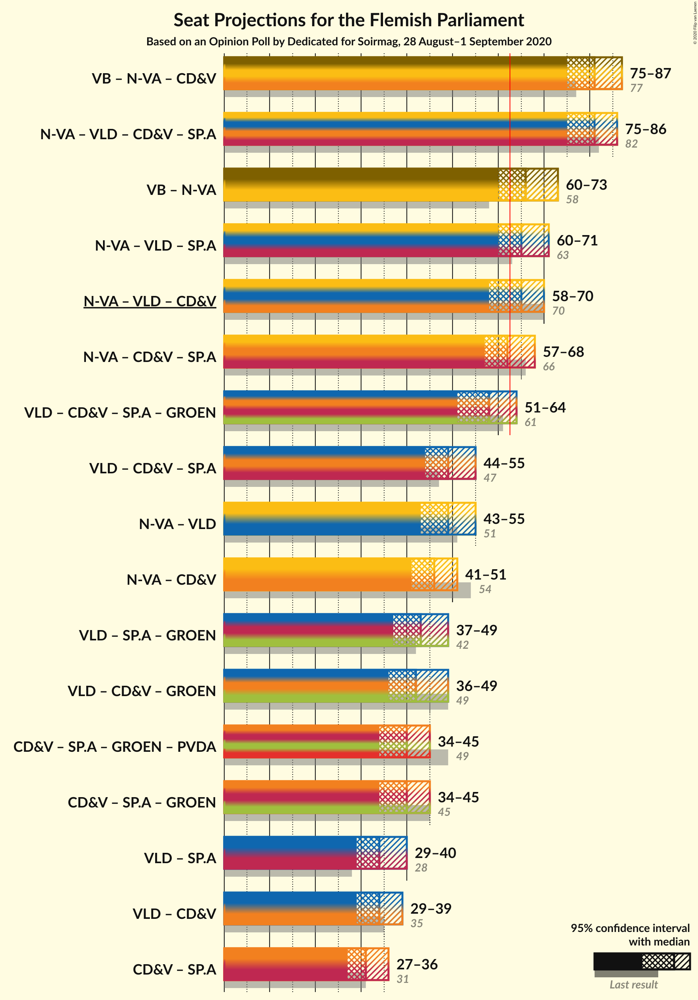

### Confidence Intervals

| Coalition | Last Result | Median | Majority? | 80% Confidence Interval | 90% Confidence Interval | 95% Confidence Interval | 99% Confidence Interval |
|:---------:|:-----------:|:------:|:---------:|:-----------------------:|:-----------------------:|:-----------------------:|:-----------------------:|
| Vlaams Belang – Nieuw-Vlaamse Alliantie – Christen-Democratisch en Vlaams | 77 | 81 | 100% | 77–84 | 76–85 | 75–87 | 74–89 |
| Nieuw-Vlaamse Alliantie – Open Vlaamse Liberalen en Democraten – Christen-Democratisch en Vlaams – Socialistische Partij Anders | 82 | 81 | 100% | 76–84 | 76–85 | 75–86 | 73–87 |
| Vlaams Belang – Nieuw-Vlaamse Alliantie | 58 | 66 | 88% | 62–69 | 61–70 | 60–73 | 58–74 |
| Nieuw-Vlaamse Alliantie – Open Vlaamse Liberalen en Democraten – Socialistische Partij Anders | 63 | 65 | 75% | 61–69 | 61–70 | 60–71 | 57–72 |
| Nieuw-Vlaamse Alliantie – Open Vlaamse Liberalen en Democraten – Christen-Democratisch en Vlaams | 70 | 65 | 68% | 61–69 | 59–69 | 58–70 | 56–72 |
| Nieuw-Vlaamse Alliantie – Christen-Democratisch en Vlaams – Socialistische Partij Anders | 66 | 62 | 43% | 58–65 | 57–67 | 57–68 | 55–71 |
| Open Vlaamse Liberalen en Democraten – Christen-Democratisch en Vlaams – Socialistische Partij Anders – Groen | 61 | 58 | 7% | 55–62 | 54–63 | 51–64 | 50–66 |
| Open Vlaamse Liberalen en Democraten – Christen-Democratisch en Vlaams – Socialistische Partij Anders | 47 | 49 | 0% | 46–54 | 46–55 | 44–55 | 42–57 |
| Nieuw-Vlaamse Alliantie – Open Vlaamse Liberalen en Democraten | 51 | 49 | 0% | 46–53 | 44–54 | 43–55 | 42–57 |
| Nieuw-Vlaamse Alliantie – Christen-Democratisch en Vlaams | 54 | 46 | 0% | 42–50 | 42–50 | 41–51 | 39–53 |
| Open Vlaamse Liberalen en Democraten – Socialistische Partij Anders – Groen | 42 | 43 | 0% | 40–47 | 39–48 | 37–49 | 35–50 |
| Open Vlaamse Liberalen en Democraten – Christen-Democratisch en Vlaams – Groen | 49 | 42 | 0% | 38–46 | 37–47 | 36–49 | 35–49 |
| Christen-Democratisch en Vlaams – Socialistische Partij Anders – Groen – Partij van de Arbeid van België | 49 | 40 | 0% | 36–44 | 35–44 | 34–45 | 32–47 |
| Christen-Democratisch en Vlaams – Socialistische Partij Anders – Groen | 45 | 40 | 0% | 36–44 | 35–44 | 34–45 | 32–47 |
| Open Vlaamse Liberalen en Democraten – Socialistische Partij Anders | 28 | 34 | 0% | 31–38 | 30–39 | 29–40 | 29–41 |
| Open Vlaamse Liberalen en Democraten – Christen-Democratisch en Vlaams | 35 | 34 | 0% | 30–38 | 29–38 | 29–39 | 27–41 |
| Christen-Democratisch en Vlaams – Socialistische Partij Anders | 31 | 31 | 0% | 28–35 | 27–36 | 27–36 | 25–39 |

### Vlaams Belang – Nieuw-Vlaamse Alliantie – Christen-Democratisch en Vlaams

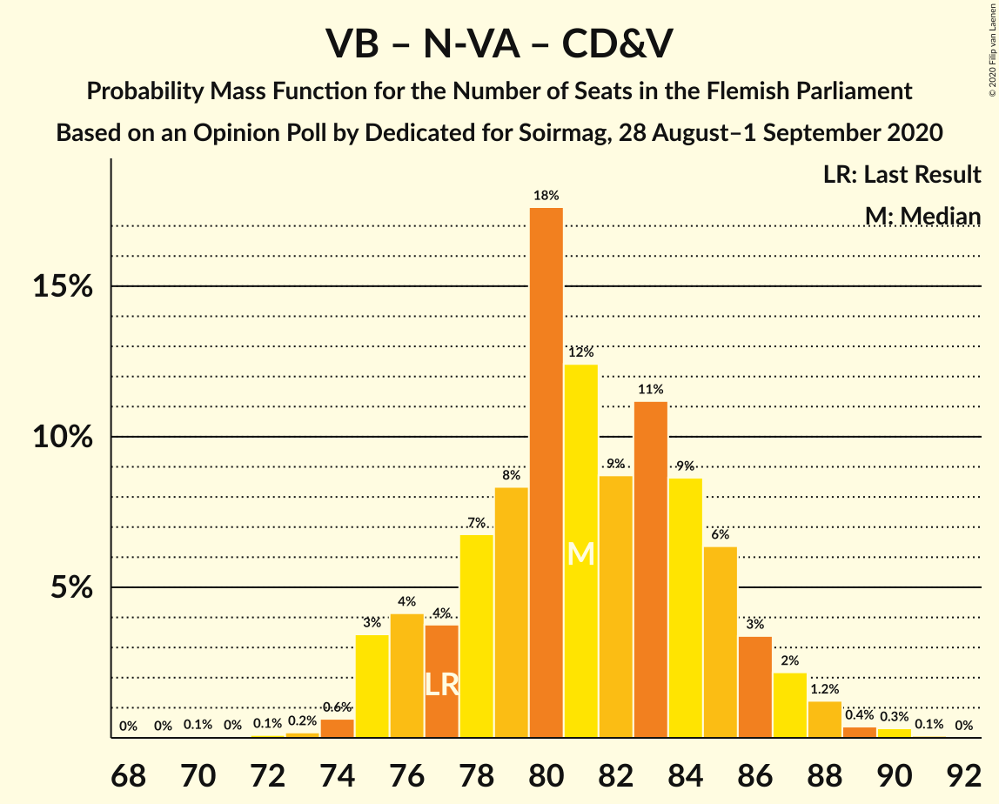

| Number of Seats | Probability | Accumulated | Special Marks |
|:---------------:|:-----------:|:-----------:|:-------------:|
| 71 | 0% | 100% |  |
| 72 | 0.1% | 99.9% |  |
| 73 | 0.2% | 99.9% |  |
| 74 | 0.2% | 99.6% |  |
| 75 | 2% | 99.5% |  |
| 76 | 6% | 97% |  |
| 77 | 5% | 92% | Last Result |
| 78 | 8% | 87% |  |
| 79 | 5% | 78% |  |
| 80 | 11% | 73% | Median |
| 81 | 22% | 62% |  |
| 82 | 3% | 40% |  |
| 83 | 10% | 37% |  |
| 84 | 19% | 27% |  |
| 85 | 3% | 8% |  |
| 86 | 2% | 5% |  |
| 87 | 2% | 3% |  |
| 88 | 0.6% | 1.2% |  |
| 89 | 0.3% | 0.6% |  |
| 90 | 0.2% | 0.3% |  |
| 91 | 0% | 0.1% |  |
| 92 | 0% | 0% |  |

### Nieuw-Vlaamse Alliantie – Open Vlaamse Liberalen en Democraten – Christen-Democratisch en Vlaams – Socialistische Partij Anders

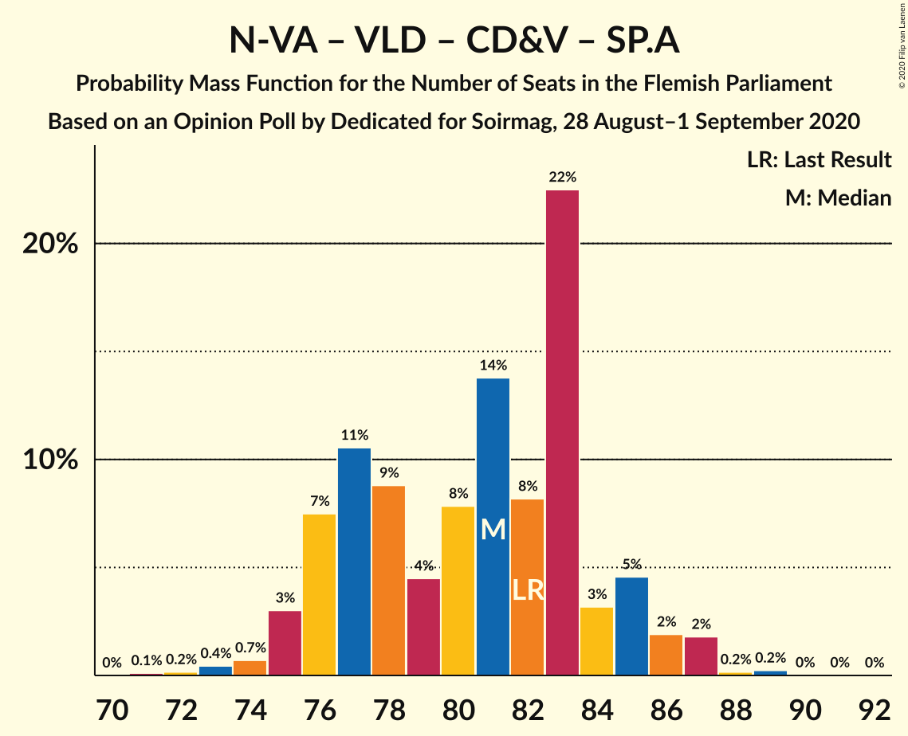

| Number of Seats | Probability | Accumulated | Special Marks |
|:---------------:|:-----------:|:-----------:|:-------------:|
| 71 | 0.1% | 100% |  |
| 72 | 0.2% | 99.9% |  |
| 73 | 0.4% | 99.7% |  |
| 74 | 0.7% | 99.3% |  |
| 75 | 3% | 98.6% |  |
| 76 | 7% | 96% |  |
| 77 | 11% | 88% |  |
| 78 | 9% | 77% |  |
| 79 | 4% | 69% | Median |
| 80 | 8% | 64% |  |
| 81 | 14% | 56% |  |
| 82 | 8% | 43% | Last Result |
| 83 | 22% | 34% |  |
| 84 | 3% | 12% |  |
| 85 | 5% | 9% |  |
| 86 | 2% | 4% |  |
| 87 | 2% | 2% |  |
| 88 | 0.2% | 0.5% |  |
| 89 | 0.2% | 0.3% |  |
| 90 | 0% | 0.1% |  |
| 91 | 0% | 0% |  |

### Vlaams Belang – Nieuw-Vlaamse Alliantie

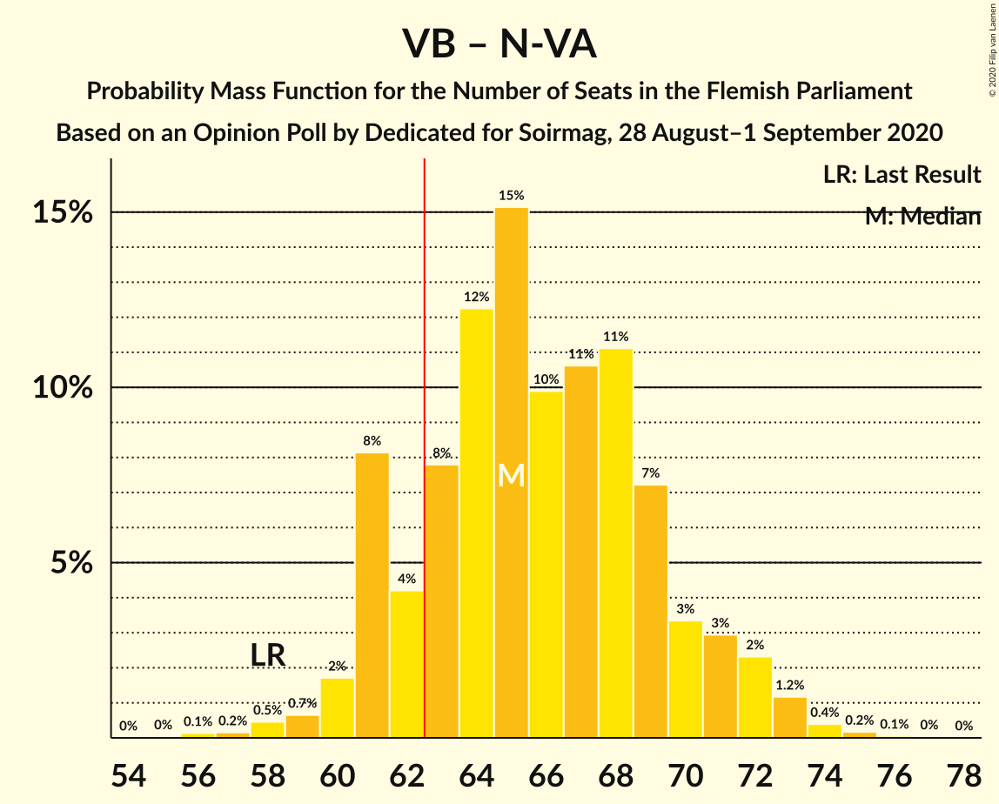

| Number of Seats | Probability | Accumulated | Special Marks |
|:---------------:|:-----------:|:-----------:|:-------------:|
| 56 | 0.2% | 100% |  |
| 57 | 0.1% | 99.8% |  |
| 58 | 0.7% | 99.7% | Last Result |
| 59 | 0.4% | 98.9% |  |
| 60 | 2% | 98.5% |  |
| 61 | 4% | 97% |  |
| 62 | 4% | 93% |  |
| 63 | 15% | 88% | Majority |
| 64 | 6% | 73% |  |
| 65 | 15% | 67% | Median |
| 66 | 10% | 53% |  |
| 67 | 8% | 43% |  |
| 68 | 24% | 35% |  |
| 69 | 4% | 11% |  |
| 70 | 2% | 7% |  |
| 71 | 1.1% | 5% |  |
| 72 | 0.9% | 4% |  |
| 73 | 2% | 3% |  |
| 74 | 0.3% | 0.6% |  |
| 75 | 0.2% | 0.3% |  |
| 76 | 0.1% | 0.1% |  |
| 77 | 0% | 0% |  |

### Nieuw-Vlaamse Alliantie – Open Vlaamse Liberalen en Democraten – Socialistische Partij Anders

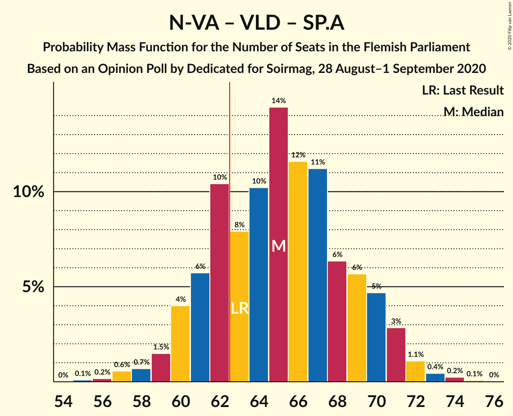

| Number of Seats | Probability | Accumulated | Special Marks |
|:---------------:|:-----------:|:-----------:|:-------------:|
| 55 | 0.3% | 100% |  |
| 56 | 0.1% | 99.7% |  |
| 57 | 0.3% | 99.6% |  |
| 58 | 0.5% | 99.3% |  |
| 59 | 0.9% | 98.8% |  |
| 60 | 2% | 98% |  |
| 61 | 8% | 96% |  |
| 62 | 13% | 88% |  |
| 63 | 9% | 75% | Last Result, Majority |
| 64 | 8% | 66% | Median |
| 65 | 12% | 58% |  |
| 66 | 5% | 47% |  |
| 67 | 18% | 42% |  |
| 68 | 9% | 23% |  |
| 69 | 6% | 14% |  |
| 70 | 3% | 8% |  |
| 71 | 3% | 5% |  |
| 72 | 1.4% | 2% |  |
| 73 | 0.3% | 0.5% |  |
| 74 | 0.1% | 0.2% |  |
| 75 | 0% | 0.1% |  |
| 76 | 0% | 0% |  |

### Nieuw-Vlaamse Alliantie – Open Vlaamse Liberalen en Democraten – Christen-Democratisch en Vlaams

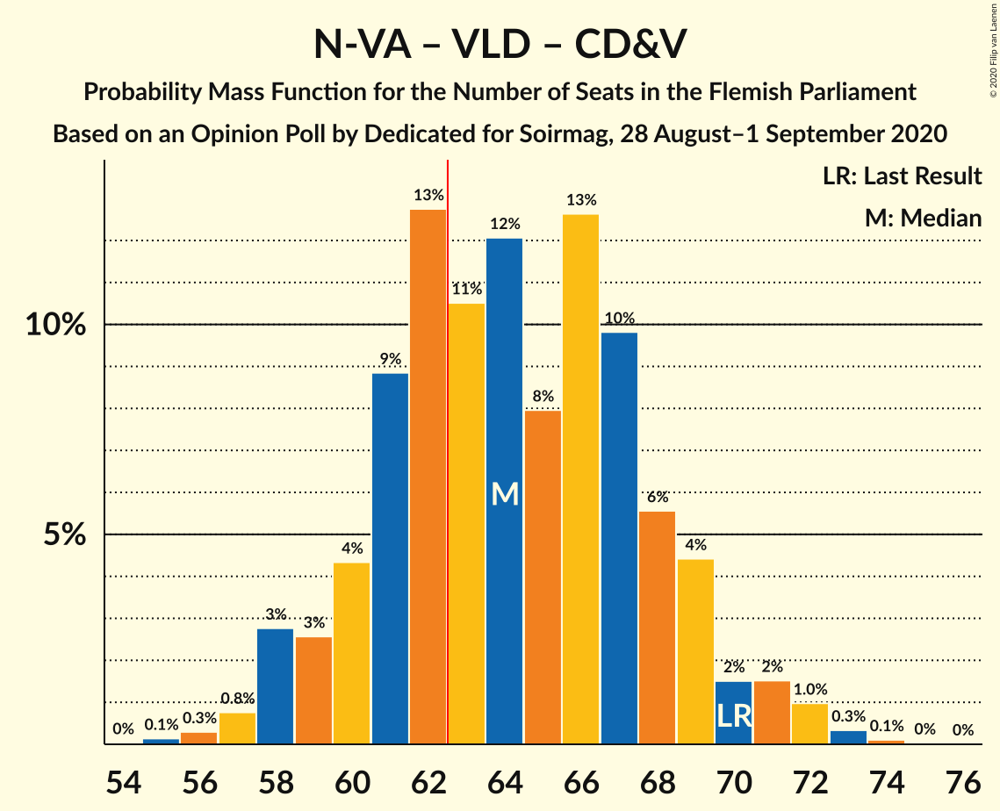

| Number of Seats | Probability | Accumulated | Special Marks |
|:---------------:|:-----------:|:-----------:|:-------------:|
| 55 | 0.1% | 100% |  |
| 56 | 0.5% | 99.9% |  |
| 57 | 0.5% | 99.4% |  |
| 58 | 2% | 98.8% |  |
| 59 | 2% | 97% |  |
| 60 | 4% | 95% |  |
| 61 | 8% | 90% |  |
| 62 | 14% | 82% |  |
| 63 | 8% | 68% | Majority |
| 64 | 9% | 61% | Median |
| 65 | 4% | 52% |  |
| 66 | 14% | 47% |  |
| 67 | 14% | 33% |  |
| 68 | 3% | 19% |  |
| 69 | 13% | 16% |  |
| 70 | 1.2% | 3% | Last Result |
| 71 | 0.5% | 2% |  |
| 72 | 1.2% | 2% |  |
| 73 | 0.2% | 0.3% |  |
| 74 | 0.1% | 0.1% |  |
| 75 | 0% | 0% |  |

### Nieuw-Vlaamse Alliantie – Christen-Democratisch en Vlaams – Socialistische Partij Anders

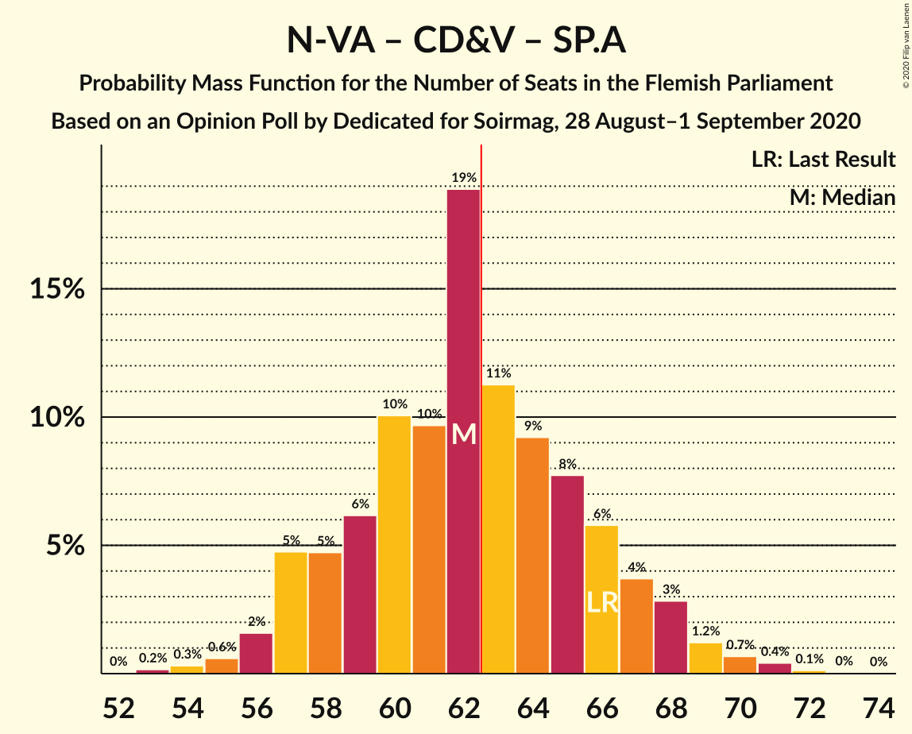

| Number of Seats | Probability | Accumulated | Special Marks |
|:---------------:|:-----------:|:-----------:|:-------------:|
| 53 | 0.1% | 100% |  |
| 54 | 0.2% | 99.9% |  |
| 55 | 0.8% | 99.7% |  |
| 56 | 0.9% | 98.9% |  |
| 57 | 7% | 98% |  |
| 58 | 9% | 91% |  |
| 59 | 6% | 82% |  |
| 60 | 4% | 76% | Median |
| 61 | 13% | 72% |  |
| 62 | 16% | 59% |  |
| 63 | 12% | 43% | Majority |
| 64 | 17% | 31% |  |
| 65 | 4% | 14% |  |
| 66 | 3% | 10% | Last Result |
| 67 | 4% | 7% |  |
| 68 | 0.6% | 3% |  |
| 69 | 0.4% | 2% |  |
| 70 | 1.0% | 2% |  |
| 71 | 0.4% | 0.6% |  |
| 72 | 0.1% | 0.2% |  |
| 73 | 0% | 0% |  |

### Open Vlaamse Liberalen en Democraten – Christen-Democratisch en Vlaams – Socialistische Partij Anders – Groen

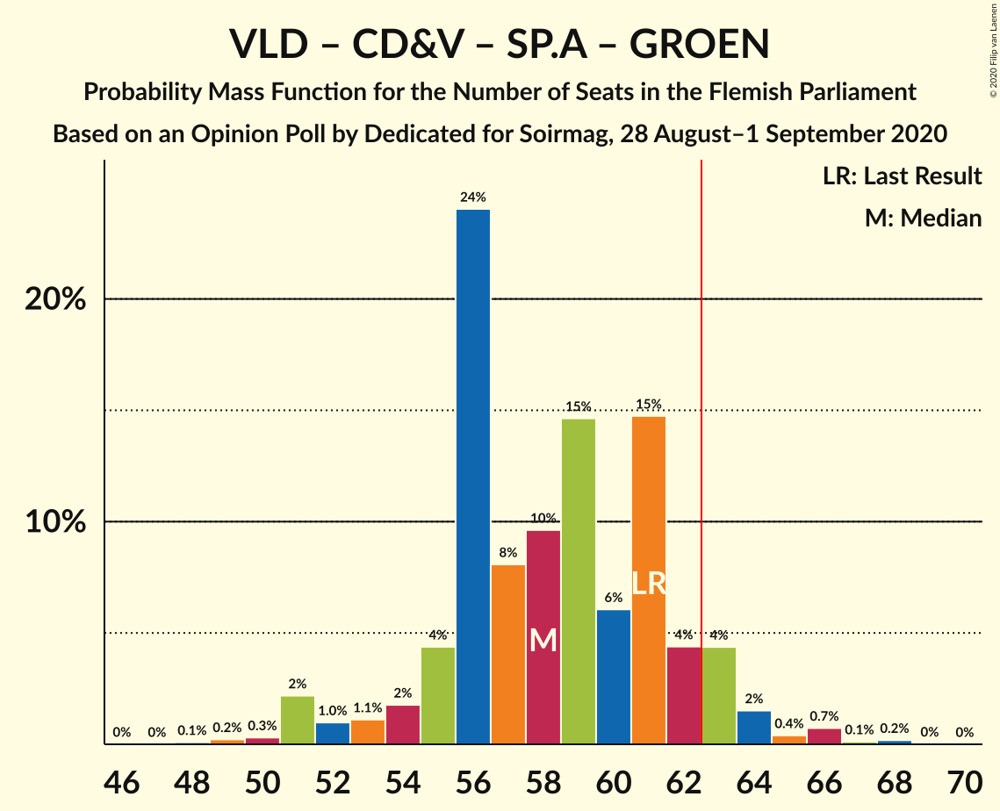

| Number of Seats | Probability | Accumulated | Special Marks |
|:---------------:|:-----------:|:-----------:|:-------------:|
| 48 | 0.1% | 100% |  |
| 49 | 0.2% | 99.9% |  |
| 50 | 0.3% | 99.7% |  |
| 51 | 2% | 99.4% |  |
| 52 | 1.0% | 97% |  |
| 53 | 1.1% | 96% |  |
| 54 | 2% | 95% |  |
| 55 | 4% | 93% |  |
| 56 | 24% | 89% |  |
| 57 | 8% | 65% |  |
| 58 | 10% | 57% | Median |
| 59 | 15% | 47% |  |
| 60 | 6% | 33% |  |
| 61 | 15% | 26% | Last Result |
| 62 | 4% | 12% |  |
| 63 | 4% | 7% | Majority |
| 64 | 2% | 3% |  |
| 65 | 0.4% | 1.5% |  |
| 66 | 0.7% | 1.1% |  |
| 67 | 0.1% | 0.3% |  |
| 68 | 0.2% | 0.2% |  |
| 69 | 0% | 0% |  |

### Open Vlaamse Liberalen en Democraten – Christen-Democratisch en Vlaams – Socialistische Partij Anders

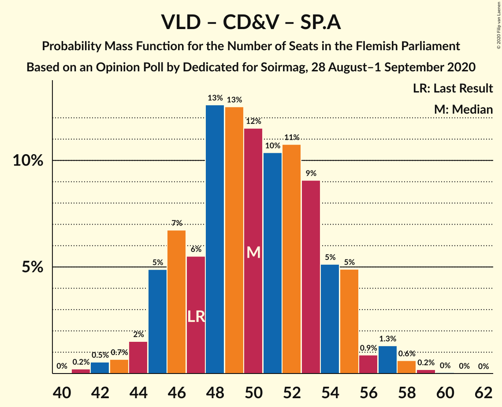

| Number of Seats | Probability | Accumulated | Special Marks |
|:---------------:|:-----------:|:-----------:|:-------------:|
| 41 | 0.1% | 100% |  |
| 42 | 0.6% | 99.9% |  |
| 43 | 0.3% | 99.2% |  |
| 44 | 2% | 98.9% |  |
| 45 | 1.2% | 97% |  |
| 46 | 12% | 95% |  |
| 47 | 4% | 83% | Last Result |
| 48 | 11% | 79% |  |
| 49 | 20% | 68% | Median |
| 50 | 8% | 48% |  |
| 51 | 13% | 40% |  |
| 52 | 5% | 27% |  |
| 53 | 8% | 22% |  |
| 54 | 4% | 14% |  |
| 55 | 8% | 10% |  |
| 56 | 0.6% | 2% |  |
| 57 | 0.6% | 1.1% |  |
| 58 | 0.2% | 0.4% |  |
| 59 | 0.2% | 0.3% |  |
| 60 | 0% | 0.1% |  |
| 61 | 0% | 0% |  |

### Nieuw-Vlaamse Alliantie – Open Vlaamse Liberalen en Democraten

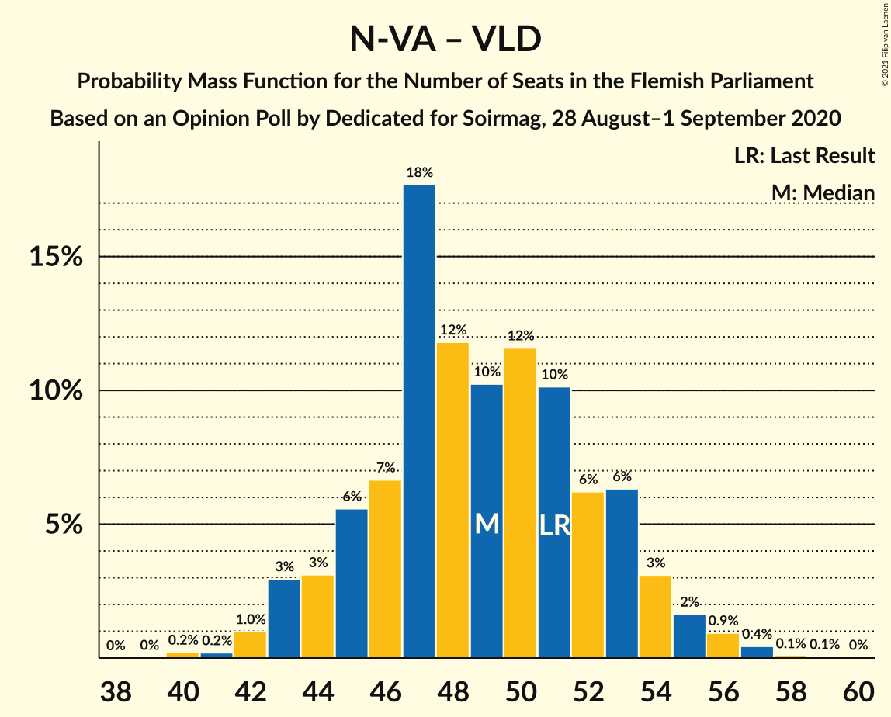

| Number of Seats | Probability | Accumulated | Special Marks |
|:---------------:|:-----------:|:-----------:|:-------------:|
| 40 | 0.2% | 100% |  |
| 41 | 0.3% | 99.8% |  |
| 42 | 0.5% | 99.5% |  |
| 43 | 2% | 99.0% |  |
| 44 | 3% | 97% |  |
| 45 | 5% | 95% |  |
| 46 | 4% | 90% |  |
| 47 | 17% | 86% |  |
| 48 | 9% | 69% |  |
| 49 | 17% | 60% | Median |
| 50 | 10% | 44% |  |
| 51 | 10% | 33% | Last Result |
| 52 | 2% | 24% |  |
| 53 | 13% | 21% |  |
| 54 | 4% | 8% |  |
| 55 | 2% | 4% |  |
| 56 | 1.1% | 2% |  |
| 57 | 0.6% | 0.8% |  |
| 58 | 0.1% | 0.2% |  |
| 59 | 0% | 0.1% |  |
| 60 | 0% | 0% |  |

### Nieuw-Vlaamse Alliantie – Christen-Democratisch en Vlaams

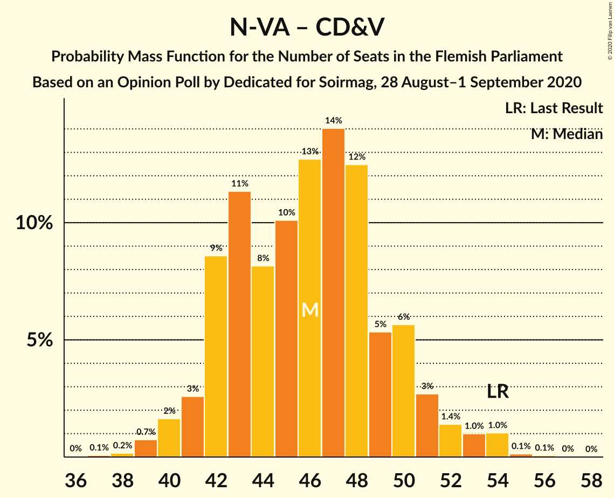

| Number of Seats | Probability | Accumulated | Special Marks |
|:---------------:|:-----------:|:-----------:|:-------------:|
| 37 | 0.1% | 100% |  |
| 38 | 0% | 99.9% |  |
| 39 | 0.7% | 99.8% |  |
| 40 | 2% | 99.1% |  |
| 41 | 2% | 98% |  |
| 42 | 7% | 95% |  |
| 43 | 20% | 88% |  |
| 44 | 6% | 68% |  |
| 45 | 3% | 63% | Median |
| 46 | 11% | 60% |  |
| 47 | 14% | 49% |  |
| 48 | 14% | 35% |  |
| 49 | 3% | 20% |  |
| 50 | 13% | 18% |  |
| 51 | 2% | 5% |  |
| 52 | 0.9% | 2% |  |
| 53 | 1.0% | 1.4% |  |
| 54 | 0.2% | 0.4% | Last Result |
| 55 | 0.1% | 0.1% |  |
| 56 | 0.1% | 0.1% |  |
| 57 | 0% | 0% |  |

### Open Vlaamse Liberalen en Democraten – Socialistische Partij Anders – Groen

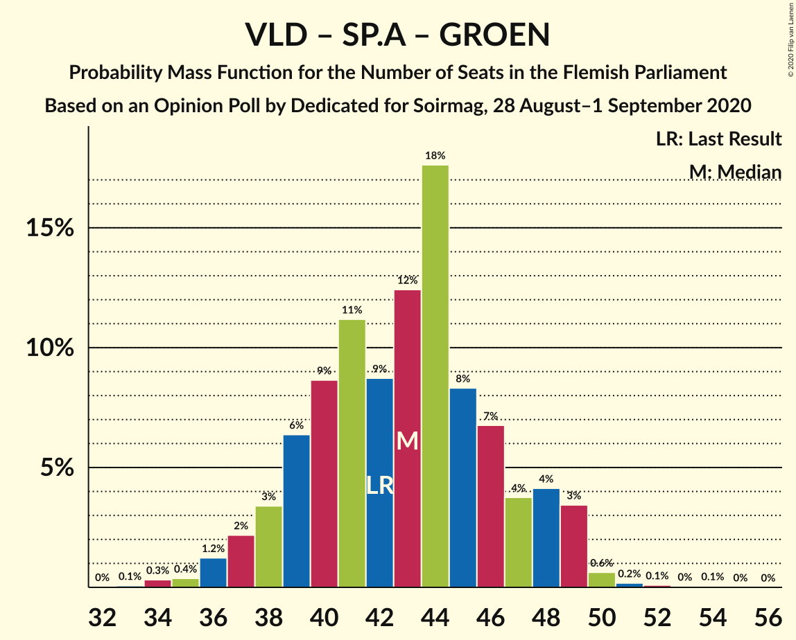

| Number of Seats | Probability | Accumulated | Special Marks |
|:---------------:|:-----------:|:-----------:|:-------------:|
| 33 | 0% | 100% |  |
| 34 | 0.2% | 99.9% |  |
| 35 | 0.3% | 99.7% |  |
| 36 | 0.6% | 99.4% |  |
| 37 | 2% | 98.8% |  |
| 38 | 2% | 97% |  |
| 39 | 3% | 95% |  |
| 40 | 19% | 92% |  |
| 41 | 10% | 73% |  |
| 42 | 3% | 63% | Last Result |
| 43 | 22% | 60% | Median |
| 44 | 11% | 38% |  |
| 45 | 5% | 27% |  |
| 46 | 8% | 22% |  |
| 47 | 5% | 13% |  |
| 48 | 6% | 8% |  |
| 49 | 2% | 3% |  |
| 50 | 0.2% | 0.5% |  |
| 51 | 0.2% | 0.4% |  |
| 52 | 0.1% | 0.1% |  |
| 53 | 0% | 0.1% |  |
| 54 | 0% | 0% |  |

### Open Vlaamse Liberalen en Democraten – Christen-Democratisch en Vlaams – Groen

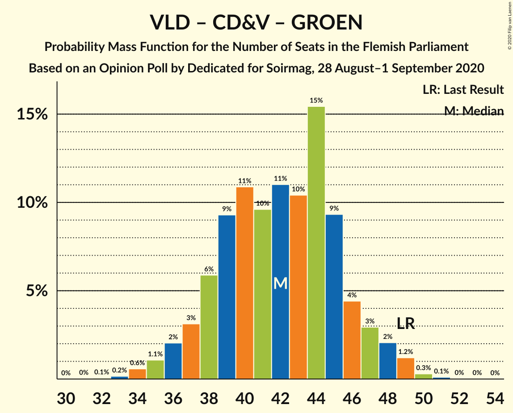

| Number of Seats | Probability | Accumulated | Special Marks |
|:---------------:|:-----------:|:-----------:|:-------------:|
| 33 | 0.1% | 100% |  |
| 34 | 0.3% | 99.8% |  |
| 35 | 0.4% | 99.6% |  |
| 36 | 2% | 99.2% |  |
| 37 | 3% | 97% |  |
| 38 | 7% | 94% |  |
| 39 | 4% | 87% |  |
| 40 | 8% | 83% |  |
| 41 | 4% | 76% |  |
| 42 | 27% | 72% |  |
| 43 | 8% | 45% | Median |
| 44 | 17% | 37% |  |
| 45 | 10% | 20% |  |
| 46 | 2% | 10% |  |
| 47 | 5% | 8% |  |
| 48 | 1.2% | 4% |  |
| 49 | 2% | 3% | Last Result |
| 50 | 0.1% | 0.3% |  |
| 51 | 0.1% | 0.2% |  |
| 52 | 0% | 0.1% |  |
| 53 | 0% | 0.1% |  |
| 54 | 0% | 0% |  |

### Christen-Democratisch en Vlaams – Socialistische Partij Anders – Groen – Partij van de Arbeid van België

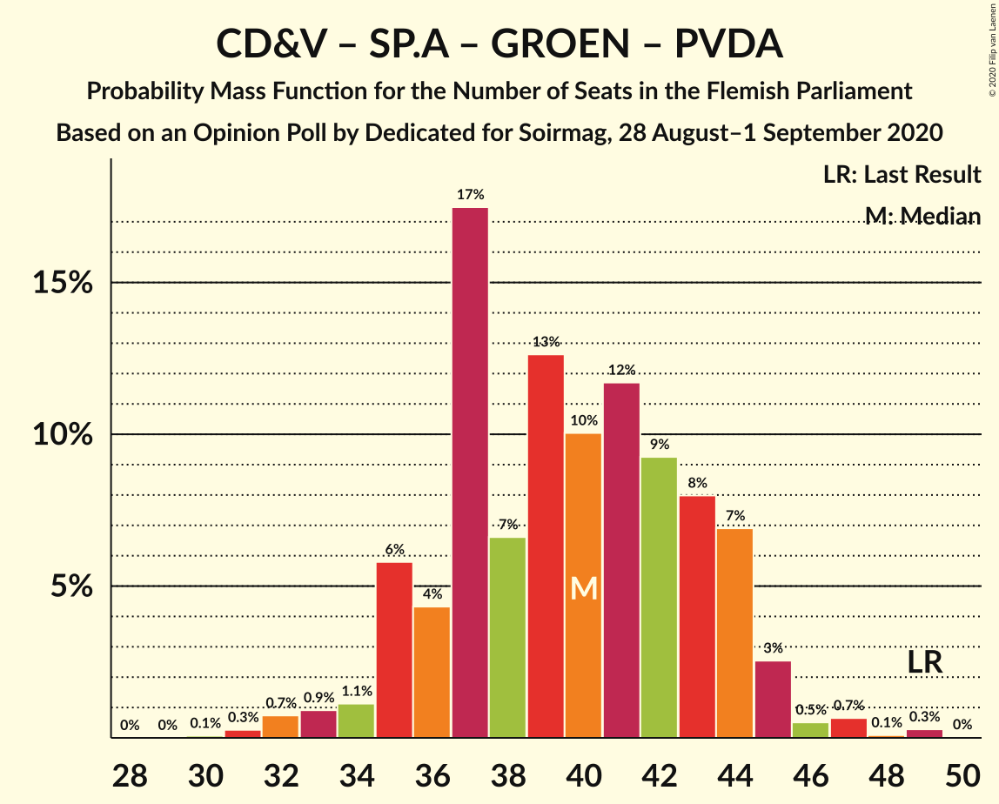

| Number of Seats | Probability | Accumulated | Special Marks |
|:---------------:|:-----------:|:-----------:|:-------------:|
| 30 | 0.1% | 100% |  |
| 31 | 0.3% | 99.9% |  |
| 32 | 0.7% | 99.7% |  |
| 33 | 0.9% | 98.9% |  |
| 34 | 1.1% | 98% |  |
| 35 | 6% | 97% |  |
| 36 | 4% | 91% |  |
| 37 | 17% | 87% |  |
| 38 | 7% | 69% |  |
| 39 | 13% | 63% | Median |
| 40 | 10% | 50% |  |
| 41 | 12% | 40% |  |
| 42 | 9% | 28% |  |
| 43 | 8% | 19% |  |
| 44 | 7% | 11% |  |
| 45 | 3% | 4% |  |
| 46 | 0.5% | 2% |  |
| 47 | 0.7% | 1.1% |  |
| 48 | 0.1% | 0.4% |  |
| 49 | 0.3% | 0.3% | Last Result |
| 50 | 0% | 0% |  |

### Christen-Democratisch en Vlaams – Socialistische Partij Anders – Groen

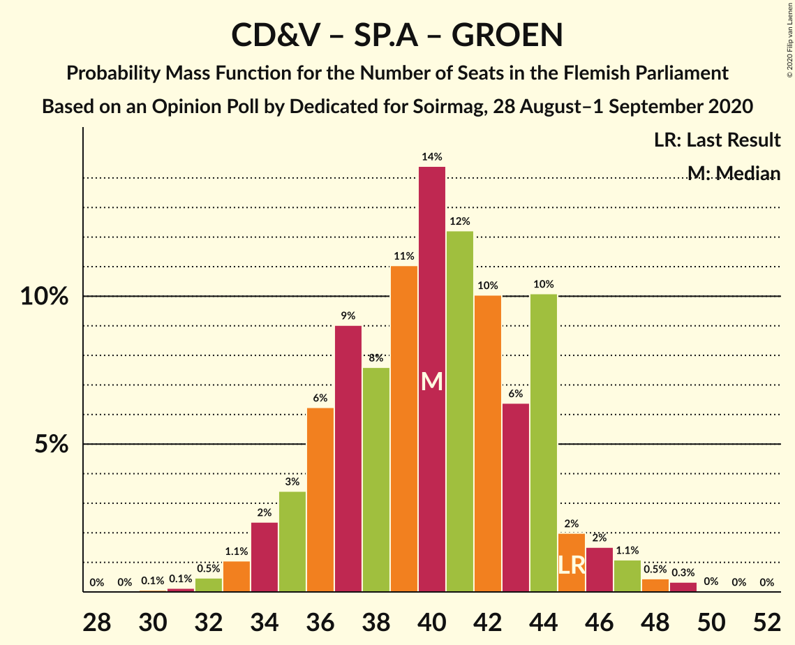

| Number of Seats | Probability | Accumulated | Special Marks |
|:---------------:|:-----------:|:-----------:|:-------------:|
| 30 | 0.1% | 100% |  |
| 31 | 0.3% | 99.9% |  |
| 32 | 0.7% | 99.7% |  |
| 33 | 0.9% | 98.9% |  |
| 34 | 1.2% | 98% |  |
| 35 | 6% | 97% |  |
| 36 | 4% | 91% |  |
| 37 | 18% | 87% |  |
| 38 | 7% | 69% |  |
| 39 | 13% | 63% | Median |
| 40 | 10% | 50% |  |
| 41 | 12% | 40% |  |
| 42 | 9% | 28% |  |
| 43 | 8% | 19% |  |
| 44 | 7% | 11% |  |
| 45 | 3% | 4% | Last Result |
| 46 | 0.5% | 2% |  |
| 47 | 0.7% | 1.1% |  |
| 48 | 0.1% | 0.4% |  |
| 49 | 0.3% | 0.3% |  |
| 50 | 0% | 0% |  |

### Open Vlaamse Liberalen en Democraten – Socialistische Partij Anders

| Number of Seats | Probability | Accumulated | Special Marks |
|:---------------:|:-----------:|:-----------:|:-------------:|
| 27 | 0.2% | 100% |  |
| 28 | 0.3% | 99.8% | Last Result |
| 29 | 3% | 99.5% |  |
| 30 | 3% | 97% |  |
| 31 | 8% | 93% |  |
| 32 | 7% | 86% |  |
| 33 | 19% | 79% |  |
| 34 | 17% | 59% | Median |
| 35 | 10% | 43% |  |
| 36 | 4% | 33% |  |
| 37 | 7% | 28% |  |
| 38 | 12% | 22% |  |
| 39 | 6% | 9% |  |
| 40 | 2% | 3% |  |
| 41 | 0.5% | 0.9% |  |
| 42 | 0.2% | 0.4% |  |
| 43 | 0.1% | 0.2% |  |
| 44 | 0.1% | 0.1% |  |
| 45 | 0% | 0% |  |

### Open Vlaamse Liberalen en Democraten – Christen-Democratisch en Vlaams

| Number of Seats | Probability | Accumulated | Special Marks |
|:---------------:|:-----------:|:-----------:|:-------------:|
| 26 | 0.3% | 100% |  |
| 27 | 0.7% | 99.7% |  |
| 28 | 0.5% | 99.0% |  |
| 29 | 4% | 98.5% |  |
| 30 | 5% | 95% |  |
| 31 | 6% | 90% |  |
| 32 | 15% | 84% |  |
| 33 | 10% | 69% |  |
| 34 | 17% | 59% | Median |
| 35 | 19% | 42% | Last Result |
| 36 | 6% | 23% |  |
| 37 | 4% | 17% |  |
| 38 | 10% | 13% |  |
| 39 | 2% | 3% |  |
| 40 | 1.0% | 2% |  |
| 41 | 0.5% | 0.8% |  |
| 42 | 0.1% | 0.3% |  |
| 43 | 0.1% | 0.2% |  |
| 44 | 0.1% | 0.1% |  |
| 45 | 0% | 0% |  |

### Christen-Democratisch en Vlaams – Socialistische Partij Anders

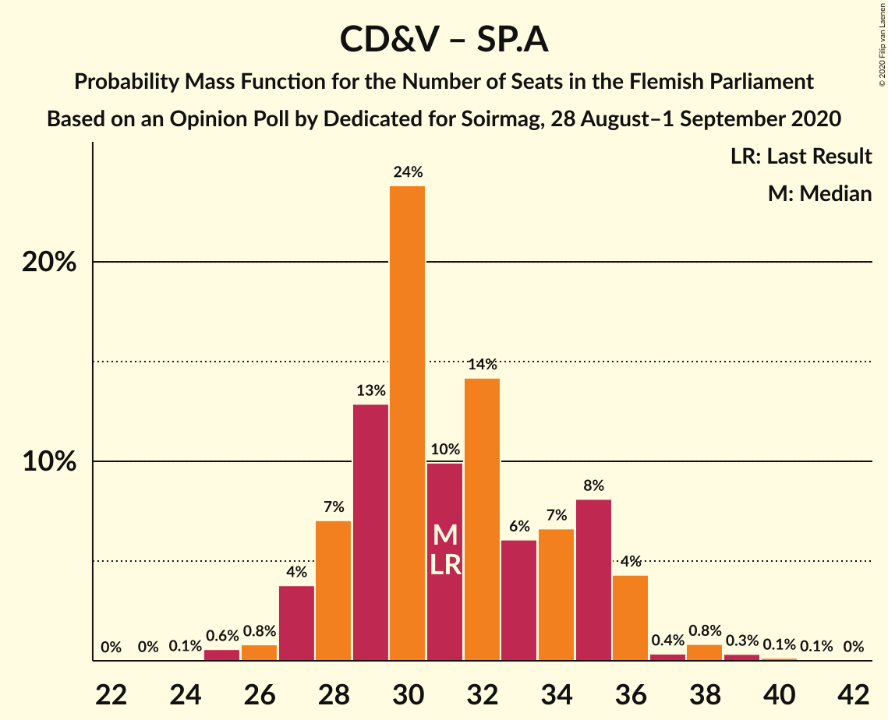

| Number of Seats | Probability | Accumulated | Special Marks |
|:---------------:|:-----------:|:-----------:|:-------------:|
| 24 | 0.1% | 100% |  |
| 25 | 0.6% | 99.9% |  |
| 26 | 0.8% | 99.3% |  |
| 27 | 4% | 98.5% |  |
| 28 | 7% | 95% |  |
| 29 | 13% | 88% |  |
| 30 | 24% | 75% | Median |
| 31 | 10% | 51% | Last Result |
| 32 | 14% | 41% |  |
| 33 | 6% | 27% |  |
| 34 | 7% | 21% |  |
| 35 | 8% | 14% |  |
| 36 | 4% | 6% |  |
| 37 | 0.4% | 2% |  |
| 38 | 0.8% | 1.4% |  |
| 39 | 0.3% | 0.6% |  |
| 40 | 0.1% | 0.2% |  |
| 41 | 0.1% | 0.1% |  |
| 42 | 0% | 0% |  |

## Technical Information

### Opinion Poll

+ **Polling firm:** Dedicated
+ **Commissioner(s):** Soirmag
+ **Fieldwork period:** 28 August–1 September 2020

### Calculations

+ **Sample size:** 598
+ **Simulations done:** 131,072
+ **Error estimate:** 2.87%

