# Opinion Poll by Ipsos for Het Laatste Nieuws, Le Soir, RTL TVi and VTM, 2–8 October 2020

<a href="#voting-intentions">Voting Intentions</a> | <a href="#seats">Seats</a> | <a href="#coalitions">Coalitions</a> | <a href="#technical-information">Technical Information</a>

## Voting Intentions

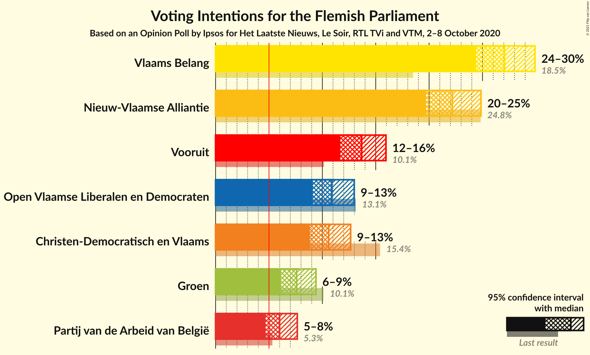

### Confidence Intervals

| Party | Last Result | Poll Result | 80% Confidence Interval | 90% Confidence Interval | 95% Confidence Interval | 99% Confidence Interval |
|:-----:|:-----------:|:-----------:|:-----------------------:|:-----------------------:|:-----------------------:|:-----------------------:|
| Vlaams Belang | 18.5% | 27.1% | 25.3–28.9% |24.8–29.5% |24.4–29.9% |23.6–30.8% |
| Nieuw-Vlaamse Alliantie | 24.8% | 22.2% | 20.6–23.9% |20.1–24.4% |19.7–24.9% |18.9–25.7% |
| Socialistische Partij Anders | 10.1% | 13.7% | 12.4–15.2% |12.0–15.6% |11.7–16.0% |11.1–16.7% |
| Open Vlaamse Liberalen en Democraten | 13.1% | 10.9% | 9.7–12.3% |9.4–12.6% |9.1–13.0% |8.6–13.7% |
| Christen-Democratisch en Vlaams | 15.4% | 10.6% | 9.4–11.9% |9.1–12.3% |8.8–12.7% |8.3–13.3% |
| Groen | 10.1% | 7.6% | 6.6–8.8% |6.3–9.1% |6.1–9.4% |5.7–10.0% |
| Partij van de Arbeid van België | 5.3% | 6.0% | 5.1–7.1% |4.9–7.4% |4.7–7.7% |4.3–8.2% |

*Note:* The poll result column reflects the actual value used in the calculations. Published results may vary slightly, and in addition be rounded to fewer digits.

## Seats

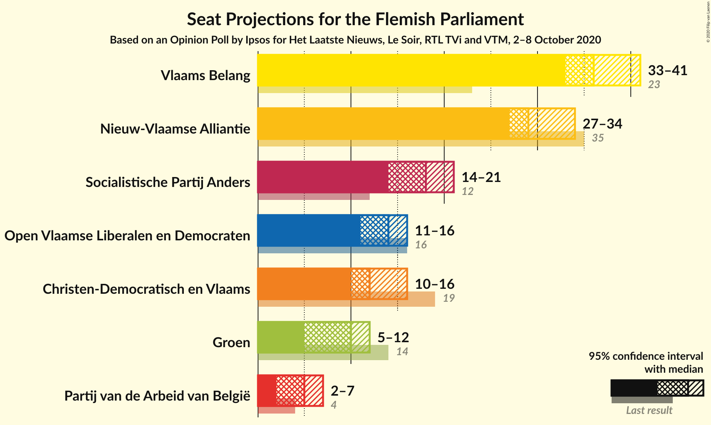

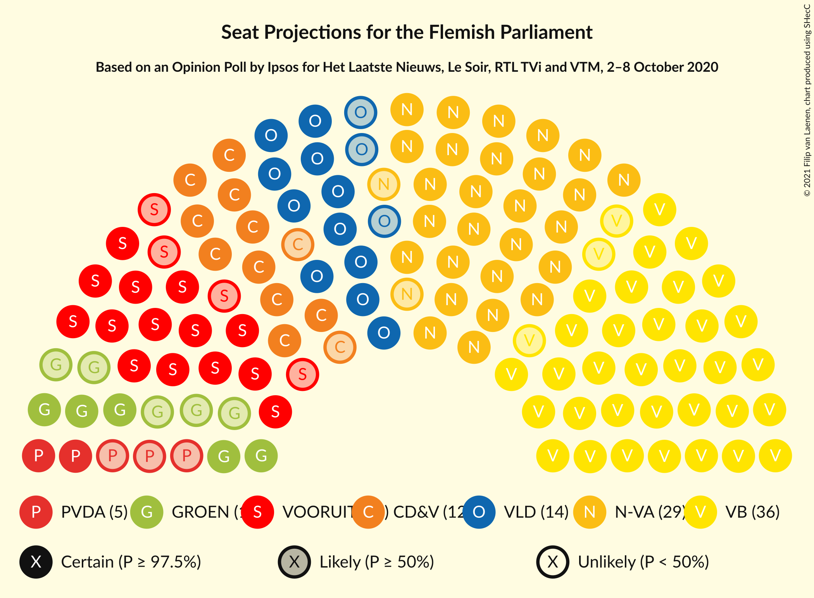

### Confidence Intervals

| Party | Last Result | Median | 80% Confidence Interval | 90% Confidence Interval | 95% Confidence Interval | 99% Confidence Interval |
|:-----:|:-----------:|:------:|:-----------------------:|:-----------------------:|:-----------------------:|:-----------------------:|
| <a href="#vlaams-belang">Vlaams Belang</a> | 23 | 36 | 34–39 |34–40 |33–41 |31–42 |
| <a href="#nieuw-vlaamse-alliantie">Nieuw-Vlaamse Alliantie</a> | 35 | 29 | 27–32 |27–33 |27–34 |25–35 |
| <a href="#socialistische-partij-anders">Socialistische Partij Anders</a> | 12 | 18 | 15–20 |15–20 |14–21 |14–23 |
| <a href="#open-vlaamse-liberalen-en-democraten">Open Vlaamse Liberalen en Democraten</a> | 16 | 14 | 11–16 |11–16 |11–16 |11–18 |
| <a href="#christen-democratisch-en-vlaams">Christen-Democratisch en Vlaams</a> | 19 | 12 | 11–14 |10–15 |10–16 |9–16 |
| <a href="#groen">Groen</a> | 14 | 10 | 7–11 |6–11 |5–12 |5–14 |
| <a href="#partij-van-de-arbeid-van-belgië">Partij van de Arbeid van België</a> | 4 | 5 | 4–7 |3–7 |2–7 |1–8 |

### Vlaams Belang

*For a full overview of the results for this party, see the [Vlaams Belang](party-vlaamsbelang.html) page.*

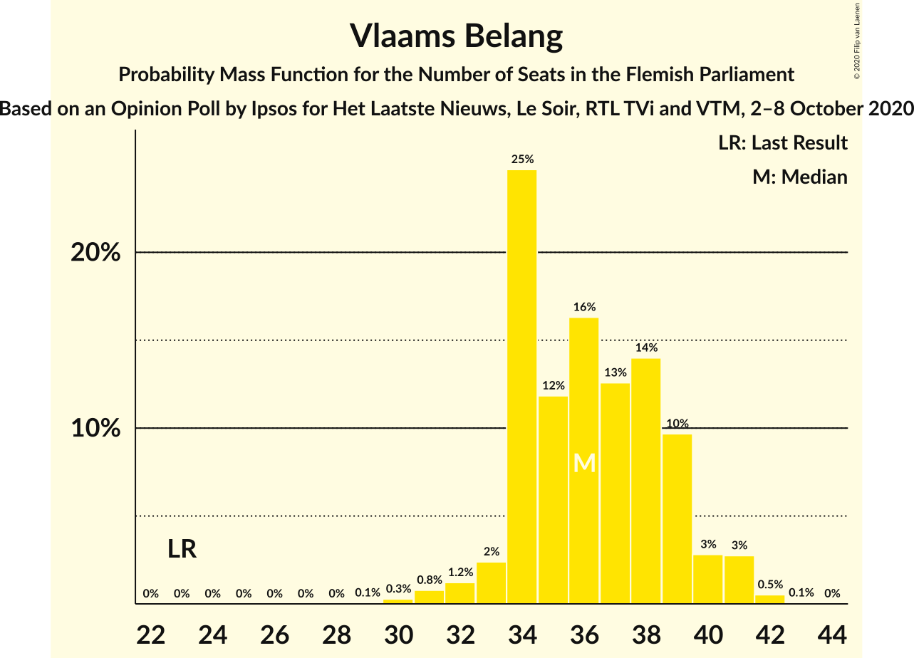

| Number of Seats | Probability | Accumulated | Special Marks |
|:---------------:|:-----------:|:-----------:|:-------------:|
| 23 | 0% | 100% | Last Result |
| 24 | 0% | 100% |  |
| 25 | 0% | 100% |  |
| 26 | 0% | 100% |  |
| 27 | 0% | 100% |  |
| 28 | 0% | 100% |  |
| 29 | 0.1% | 100% |  |
| 30 | 0.3% | 99.9% |  |
| 31 | 0.8% | 99.7% |  |
| 32 | 1.2% | 98.9% |  |
| 33 | 2% | 98% |  |
| 34 | 25% | 95% |  |
| 35 | 12% | 71% |  |
| 36 | 16% | 59% | Median |
| 37 | 13% | 42% |  |
| 38 | 14% | 30% |  |
| 39 | 10% | 16% |  |
| 40 | 3% | 6% |  |
| 41 | 3% | 3% |  |
| 42 | 0.5% | 0.6% |  |
| 43 | 0.1% | 0.1% |  |
| 44 | 0% | 0% |  |

### Nieuw-Vlaamse Alliantie

*For a full overview of the results for this party, see the [Nieuw-Vlaamse Alliantie](party-nieuw-vlaamsealliantie.html) page.*

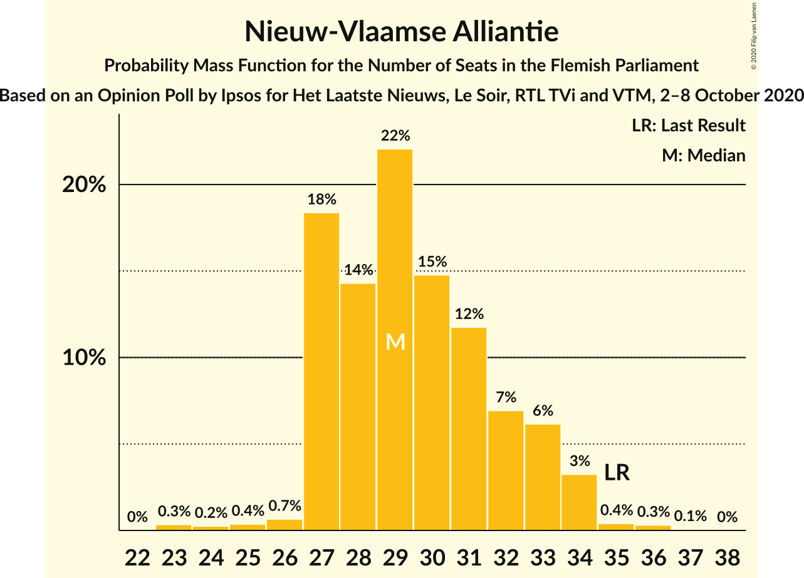

| Number of Seats | Probability | Accumulated | Special Marks |
|:---------------:|:-----------:|:-----------:|:-------------:|
| 23 | 0.1% | 100% |  |
| 24 | 0.2% | 99.8% |  |
| 25 | 0.4% | 99.7% |  |
| 26 | 1.2% | 99.3% |  |
| 27 | 17% | 98% |  |
| 28 | 24% | 81% |  |
| 29 | 17% | 56% | Median |
| 30 | 13% | 40% |  |
| 31 | 10% | 26% |  |
| 32 | 8% | 17% |  |
| 33 | 6% | 9% |  |
| 34 | 2% | 3% |  |
| 35 | 0.5% | 0.9% | Last Result |
| 36 | 0.4% | 0.5% |  |
| 37 | 0.1% | 0.1% |  |
| 38 | 0% | 0% |  |

### Socialistische Partij Anders

*For a full overview of the results for this party, see the [Socialistische Partij Anders](party-socialistischepartijanders.html) page.*

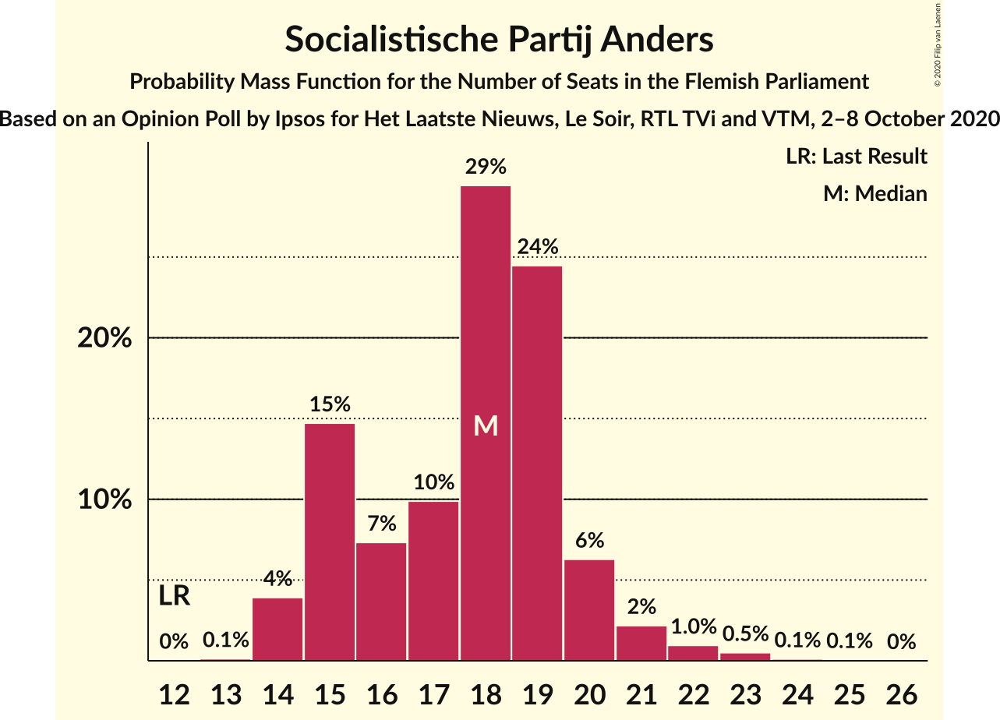

| Number of Seats | Probability | Accumulated | Special Marks |
|:---------------:|:-----------:|:-----------:|:-------------:|
| 12 | 0% | 100% | Last Result |
| 13 | 0.1% | 100% |  |
| 14 | 5% | 99.8% |  |
| 15 | 10% | 95% |  |
| 16 | 9% | 85% |  |
| 17 | 11% | 76% |  |
| 18 | 28% | 66% | Median |
| 19 | 27% | 37% |  |
| 20 | 7% | 10% |  |
| 21 | 2% | 4% |  |
| 22 | 1.2% | 2% |  |
| 23 | 0.4% | 0.6% |  |
| 24 | 0.2% | 0.2% |  |
| 25 | 0.1% | 0.1% |  |
| 26 | 0% | 0% |  |

### Open Vlaamse Liberalen en Democraten

*For a full overview of the results for this party, see the [Open Vlaamse Liberalen en Democraten](party-openvlaamseliberalenendemocraten.html) page.*

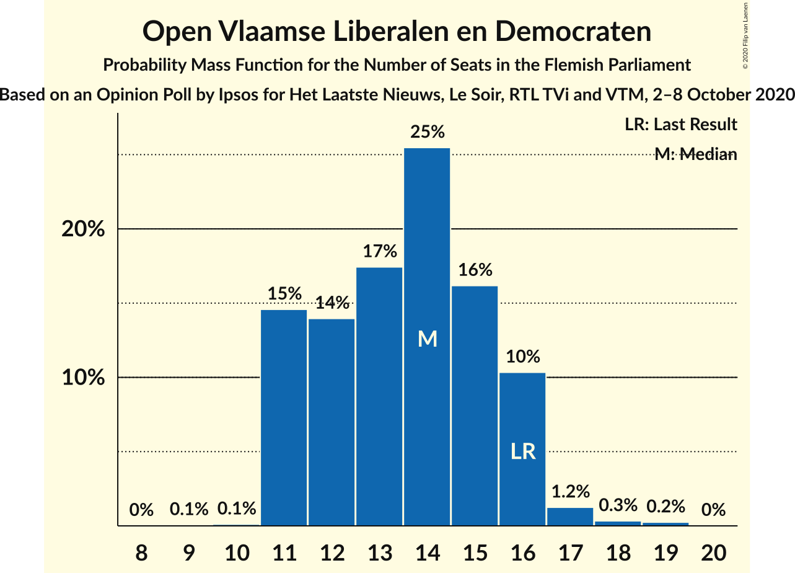

| Number of Seats | Probability | Accumulated | Special Marks |
|:---------------:|:-----------:|:-----------:|:-------------:|
| 9 | 0.1% | 100% |  |
| 10 | 0.1% | 99.9% |  |
| 11 | 15% | 99.8% |  |
| 12 | 14% | 85% |  |
| 13 | 17% | 71% |  |
| 14 | 25% | 54% | Median |
| 15 | 16% | 28% |  |
| 16 | 10% | 12% | Last Result |
| 17 | 1.2% | 2% |  |
| 18 | 0.3% | 0.6% |  |
| 19 | 0.2% | 0.3% |  |
| 20 | 0% | 0% |  |

### Christen-Democratisch en Vlaams

*For a full overview of the results for this party, see the [Christen-Democratisch en Vlaams](party-christen-democratischenvlaams.html) page.*

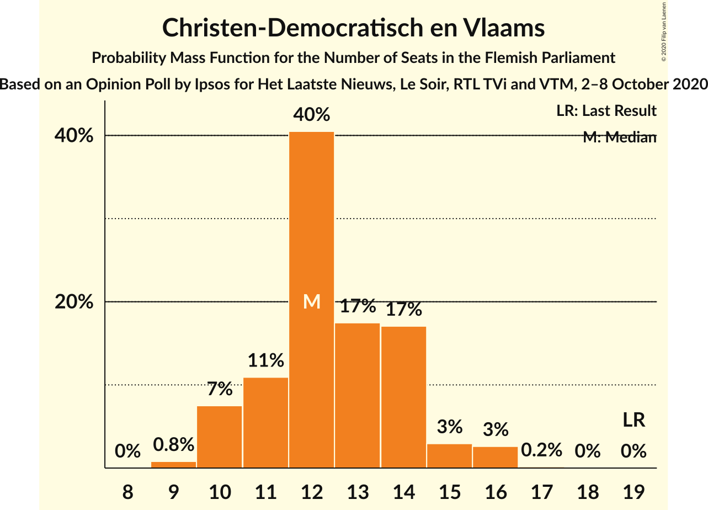

| Number of Seats | Probability | Accumulated | Special Marks |
|:---------------:|:-----------:|:-----------:|:-------------:|
| 9 | 0.8% | 100% |  |
| 10 | 7% | 99.2% |  |
| 11 | 11% | 92% |  |
| 12 | 40% | 81% | Median |
| 13 | 17% | 40% |  |
| 14 | 17% | 23% |  |
| 15 | 3% | 6% |  |
| 16 | 3% | 3% |  |
| 17 | 0.2% | 0.2% |  |
| 18 | 0% | 0% |  |
| 19 | 0% | 0% | Last Result |

### Groen

*For a full overview of the results for this party, see the [Groen](party-groen.html) page.*

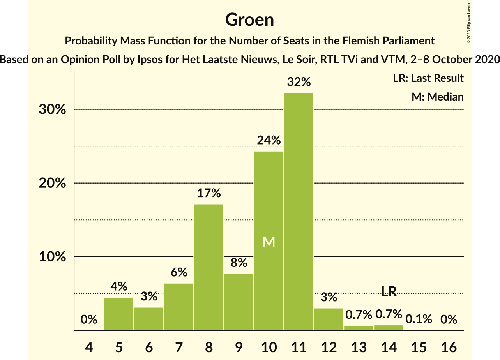

| Number of Seats | Probability | Accumulated | Special Marks |
|:---------------:|:-----------:|:-----------:|:-------------:|
| 5 | 4% | 100% |  |
| 6 | 2% | 96% |  |
| 7 | 7% | 93% |  |
| 8 | 16% | 86% |  |
| 9 | 7% | 70% |  |
| 10 | 26% | 63% | Median |
| 11 | 34% | 37% |  |
| 12 | 1.3% | 3% |  |
| 13 | 0.7% | 1.4% |  |
| 14 | 0.7% | 0.7% | Last Result |
| 15 | 0.1% | 0.1% |  |
| 16 | 0% | 0% |  |

### Partij van de Arbeid van België

*For a full overview of the results for this party, see the [Partij van de Arbeid van België](party-partijvandearbeidvanbelgië.html) page.*

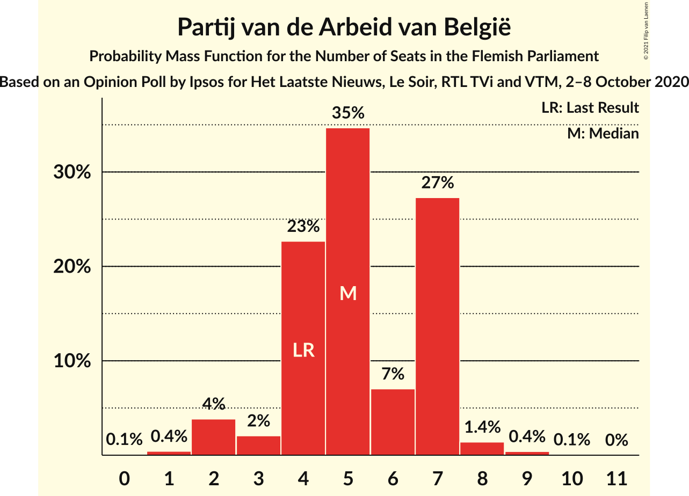

| Number of Seats | Probability | Accumulated | Special Marks |
|:---------------:|:-----------:|:-----------:|:-------------:|
| 0 | 0.1% | 100% |  |
| 1 | 0.4% | 99.9% |  |
| 2 | 4% | 99.5% |  |
| 3 | 2% | 96% |  |
| 4 | 23% | 94% | Last Result |
| 5 | 35% | 71% | Median |
| 6 | 7% | 36% |  |
| 7 | 27% | 29% |  |
| 8 | 1.4% | 2% |  |
| 9 | 0.4% | 0.5% |  |
| 10 | 0.1% | 0.1% |  |
| 11 | 0% | 0% |  |

## Coalitions

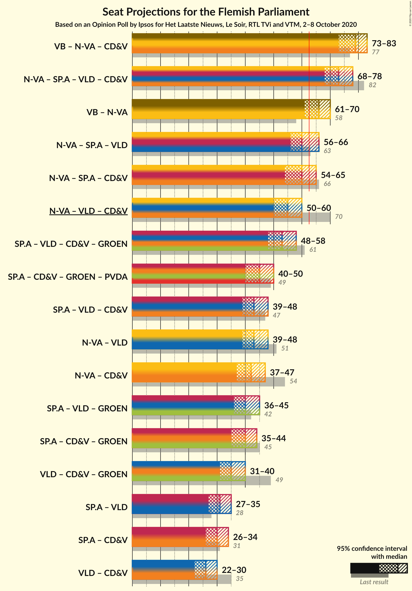

### Confidence Intervals

| Coalition | Last Result | Median | Majority? | 80% Confidence Interval | 90% Confidence Interval | 95% Confidence Interval | 99% Confidence Interval |
|:---------:|:-----------:|:------:|:---------:|:-----------------------:|:-----------------------:|:-----------------------:|:-----------------------:|
| Vlaams Belang – Nieuw-Vlaamse Alliantie – Christen-Democratisch en Vlaams | 77 | 78 | 100% | 75–81 | 74–82 | 74–83 | 72–85 |
| Nieuw-Vlaamse Alliantie – Socialistische Partij Anders – Open Vlaamse Liberalen en Democraten – Christen-Democratisch en Vlaams | 82 | 73 | 100% | 70–76 | 69–78 | 68–79 | 67–80 |
| Vlaams Belang – Nieuw-Vlaamse Alliantie | 58 | 65 | 87% | 62–69 | 62–70 | 61–71 | 60–72 |
| Nieuw-Vlaamse Alliantie – Socialistische Partij Anders – Open Vlaamse Liberalen en Democraten | 63 | 61 | 21% | 57–64 | 56–65 | 56–66 | 54–67 |
| Nieuw-Vlaamse Alliantie – Socialistische Partij Anders – Christen-Democratisch en Vlaams | 66 | 59 | 13% | 56–63 | 55–64 | 55–65 | 53–66 |
| Nieuw-Vlaamse Alliantie – Open Vlaamse Liberalen en Democraten – Christen-Democratisch en Vlaams | 70 | 55 | 0.3% | 52–59 | 51–59 | 50–60 | 49–62 |
| Socialistische Partij Anders – Open Vlaamse Liberalen en Democraten – Christen-Democratisch en Vlaams – Groen | 61 | 53 | 0% | 50–56 | 49–57 | 48–57 | 46–59 |
| Socialistische Partij Anders – Christen-Democratisch en Vlaams – Groen – Partij van de Arbeid van België | 49 | 45 | 0% | 42–48 | 41–49 | 40–49 | 38–51 |
| Socialistische Partij Anders – Open Vlaamse Liberalen en Democraten – Christen-Democratisch en Vlaams | 47 | 44 | 0% | 41–47 | 40–48 | 39–49 | 38–50 |
| Nieuw-Vlaamse Alliantie – Open Vlaamse Liberalen en Democraten | 51 | 43 | 0% | 40–46 | 39–47 | 39–48 | 37–49 |
| Nieuw-Vlaamse Alliantie – Christen-Democratisch en Vlaams | 54 | 41 | 0% | 39–45 | 38–46 | 38–47 | 37–48 |
| Socialistische Partij Anders – Open Vlaamse Liberalen en Democraten – Groen | 42 | 41 | 0% | 37–44 | 37–44 | 36–45 | 34–46 |
| Socialistische Partij Anders – Christen-Democratisch en Vlaams – Groen | 45 | 40 | 0% | 37–42 | 36–44 | 35–44 | 33–45 |
| Open Vlaamse Liberalen en Democraten – Christen-Democratisch en Vlaams – Groen | 49 | 36 | 0% | 32–38 | 31–39 | 30–40 | 29–41 |
| Socialistische Partij Anders – Open Vlaamse Liberalen en Democraten | 28 | 31 | 0% | 28–34 | 27–35 | 27–36 | 26–37 |
| Socialistische Partij Anders – Christen-Democratisch en Vlaams | 31 | 30 | 0% | 27–33 | 27–34 | 26–34 | 25–36 |
| Open Vlaamse Liberalen en Democraten – Christen-Democratisch en Vlaams | 35 | 26 | 0% | 23–28 | 23–30 | 22–30 | 21–31 |

### Vlaams Belang – Nieuw-Vlaamse Alliantie – Christen-Democratisch en Vlaams

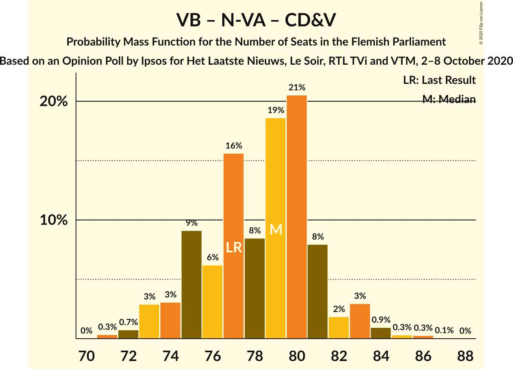

| Number of Seats | Probability | Accumulated | Special Marks |
|:---------------:|:-----------:|:-----------:|:-------------:|
| 70 | 0% | 100% |  |
| 71 | 0.2% | 99.9% |  |
| 72 | 0.8% | 99.7% |  |
| 73 | 1.4% | 98.9% |  |
| 74 | 6% | 98% |  |
| 75 | 9% | 92% |  |
| 76 | 13% | 82% |  |
| 77 | 17% | 70% | Last Result, Median |
| 78 | 13% | 53% |  |
| 79 | 12% | 40% |  |
| 80 | 12% | 28% |  |
| 81 | 8% | 16% |  |
| 82 | 3% | 8% |  |
| 83 | 3% | 5% |  |
| 84 | 2% | 2% |  |
| 85 | 0.4% | 0.7% |  |
| 86 | 0.2% | 0.2% |  |
| 87 | 0.1% | 0.1% |  |
| 88 | 0% | 0% |  |

### Nieuw-Vlaamse Alliantie – Socialistische Partij Anders – Open Vlaamse Liberalen en Democraten – Christen-Democratisch en Vlaams

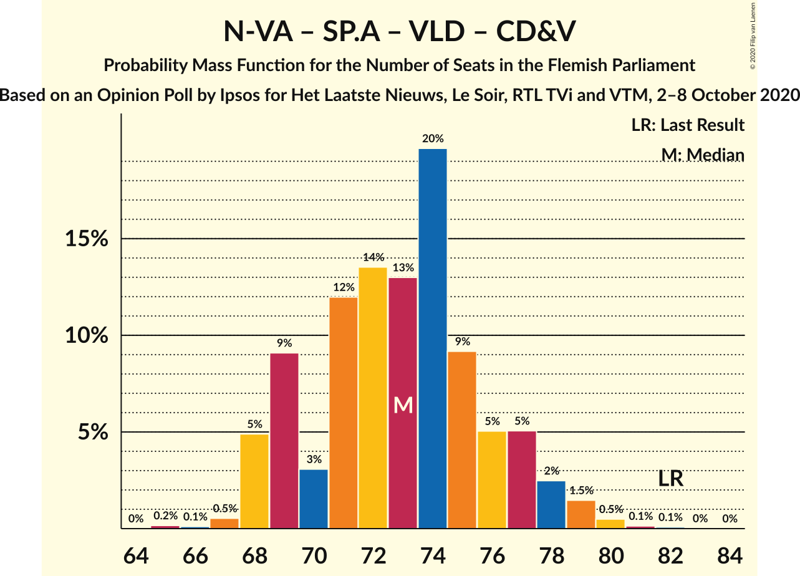

| Number of Seats | Probability | Accumulated | Special Marks |
|:---------------:|:-----------:|:-----------:|:-------------:|
| 65 | 0.1% | 100% |  |
| 66 | 0.2% | 99.9% |  |
| 67 | 0.4% | 99.7% |  |
| 68 | 4% | 99.3% |  |
| 69 | 5% | 96% |  |
| 70 | 6% | 90% |  |
| 71 | 11% | 84% |  |
| 72 | 14% | 73% |  |
| 73 | 16% | 59% | Median |
| 74 | 16% | 43% |  |
| 75 | 11% | 26% |  |
| 76 | 6% | 15% |  |
| 77 | 4% | 9% |  |
| 78 | 3% | 5% |  |
| 79 | 2% | 3% |  |
| 80 | 0.5% | 0.7% |  |
| 81 | 0.1% | 0.2% |  |
| 82 | 0.1% | 0.1% | Last Result |
| 83 | 0% | 0% |  |

### Vlaams Belang – Nieuw-Vlaamse Alliantie

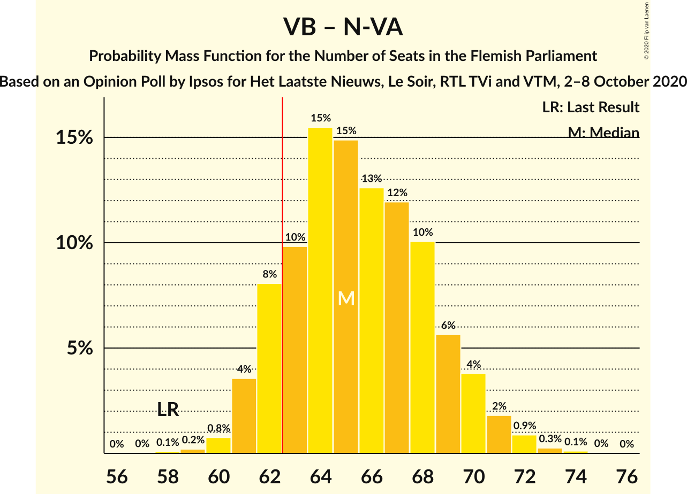

| Number of Seats | Probability | Accumulated | Special Marks |
|:---------------:|:-----------:|:-----------:|:-------------:|
| 58 | 0.1% | 100% | Last Result |
| 59 | 0.2% | 99.9% |  |
| 60 | 0.8% | 99.7% |  |
| 61 | 4% | 98.9% |  |
| 62 | 8% | 95% |  |
| 63 | 10% | 87% | Majority |
| 64 | 15% | 77% |  |
| 65 | 15% | 62% | Median |
| 66 | 13% | 47% |  |
| 67 | 12% | 35% |  |
| 68 | 10% | 23% |  |
| 69 | 6% | 13% |  |
| 70 | 4% | 7% |  |
| 71 | 2% | 3% |  |
| 72 | 0.9% | 1.3% |  |
| 73 | 0.3% | 0.4% |  |
| 74 | 0.1% | 0.2% |  |
| 75 | 0% | 0% |  |

### Nieuw-Vlaamse Alliantie – Socialistische Partij Anders – Open Vlaamse Liberalen en Democraten

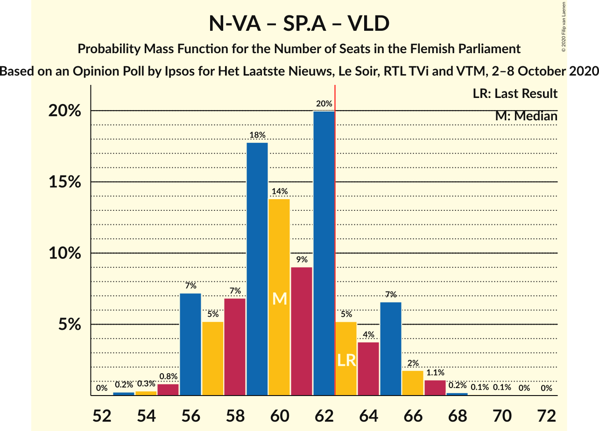

| Number of Seats | Probability | Accumulated | Special Marks |
|:---------------:|:-----------:|:-----------:|:-------------:|
| 53 | 0.2% | 100% |  |
| 54 | 0.5% | 99.8% |  |
| 55 | 1.0% | 99.3% |  |
| 56 | 4% | 98% |  |
| 57 | 5% | 94% |  |
| 58 | 11% | 89% |  |
| 59 | 15% | 79% |  |
| 60 | 13% | 64% |  |
| 61 | 14% | 51% | Median |
| 62 | 16% | 37% |  |
| 63 | 9% | 21% | Last Result, Majority |
| 64 | 5% | 13% |  |
| 65 | 4% | 8% |  |
| 66 | 2% | 3% |  |
| 67 | 1.0% | 1.5% |  |
| 68 | 0.3% | 0.5% |  |
| 69 | 0.1% | 0.2% |  |
| 70 | 0% | 0.1% |  |
| 71 | 0% | 0% |  |

### Nieuw-Vlaamse Alliantie – Socialistische Partij Anders – Christen-Democratisch en Vlaams

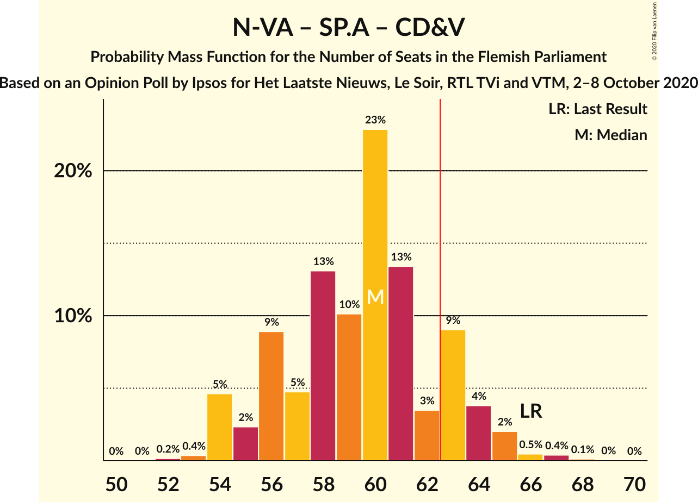

| Number of Seats | Probability | Accumulated | Special Marks |
|:---------------:|:-----------:|:-----------:|:-------------:|
| 52 | 0.1% | 100% |  |
| 53 | 0.5% | 99.9% |  |
| 54 | 2% | 99.3% |  |
| 55 | 3% | 98% |  |
| 56 | 7% | 95% |  |
| 57 | 9% | 88% |  |
| 58 | 15% | 79% |  |
| 59 | 16% | 65% | Median |
| 60 | 16% | 49% |  |
| 61 | 12% | 32% |  |
| 62 | 7% | 20% |  |
| 63 | 7% | 13% | Majority |
| 64 | 3% | 6% |  |
| 65 | 2% | 4% |  |
| 66 | 1.2% | 2% | Last Result |
| 67 | 0.4% | 0.5% |  |
| 68 | 0.1% | 0.1% |  |
| 69 | 0% | 0% |  |

### Nieuw-Vlaamse Alliantie – Open Vlaamse Liberalen en Democraten – Christen-Democratisch en Vlaams

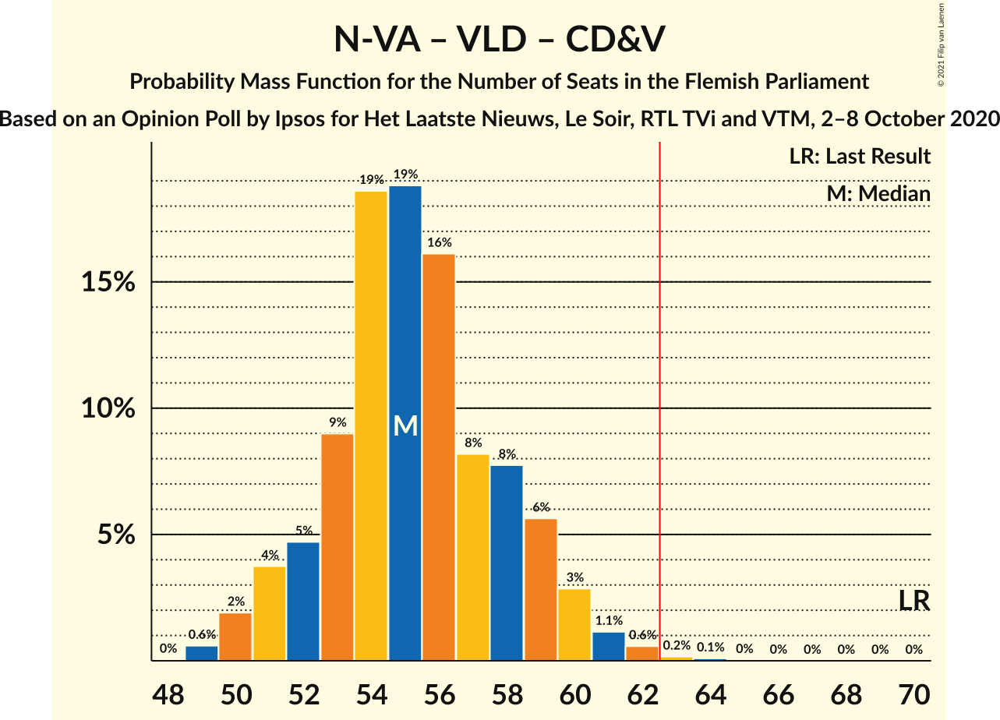

| Number of Seats | Probability | Accumulated | Special Marks |
|:---------------:|:-----------:|:-----------:|:-------------:|
| 48 | 0% | 100% |  |
| 49 | 0.6% | 99.9% |  |
| 50 | 2% | 99.3% |  |
| 51 | 4% | 97% |  |
| 52 | 5% | 94% |  |
| 53 | 9% | 89% |  |
| 54 | 19% | 80% |  |
| 55 | 19% | 61% | Median |
| 56 | 16% | 43% |  |
| 57 | 8% | 26% |  |
| 58 | 8% | 18% |  |
| 59 | 6% | 11% |  |
| 60 | 3% | 5% |  |
| 61 | 1.1% | 2% |  |
| 62 | 0.6% | 0.9% |  |
| 63 | 0.2% | 0.3% | Majority |
| 64 | 0.1% | 0.1% |  |
| 65 | 0% | 0% |  |
| 66 | 0% | 0% |  |
| 67 | 0% | 0% |  |
| 68 | 0% | 0% |  |
| 69 | 0% | 0% |  |
| 70 | 0% | 0% | Last Result |

### Socialistische Partij Anders – Open Vlaamse Liberalen en Democraten – Christen-Democratisch en Vlaams – Groen

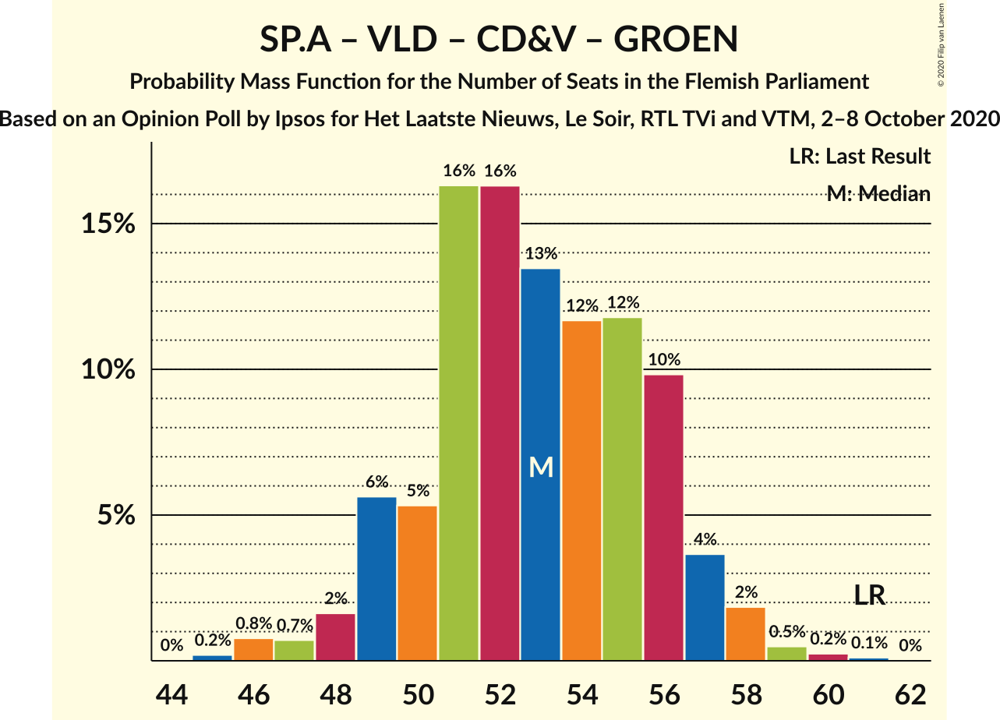

| Number of Seats | Probability | Accumulated | Special Marks |
|:---------------:|:-----------:|:-----------:|:-------------:|
| 44 | 0.1% | 100% |  |
| 45 | 0.1% | 99.9% |  |
| 46 | 0.4% | 99.8% |  |
| 47 | 0.8% | 99.4% |  |
| 48 | 2% | 98.5% |  |
| 49 | 4% | 96% |  |
| 50 | 7% | 93% |  |
| 51 | 10% | 85% |  |
| 52 | 12% | 75% |  |
| 53 | 14% | 63% |  |
| 54 | 13% | 48% | Median |
| 55 | 15% | 35% |  |
| 56 | 13% | 20% |  |
| 57 | 4% | 7% |  |
| 58 | 2% | 2% |  |
| 59 | 0.6% | 0.9% |  |
| 60 | 0.2% | 0.3% |  |
| 61 | 0.1% | 0.1% | Last Result |
| 62 | 0% | 0% |  |

### Socialistische Partij Anders – Christen-Democratisch en Vlaams – Groen – Partij van de Arbeid van België

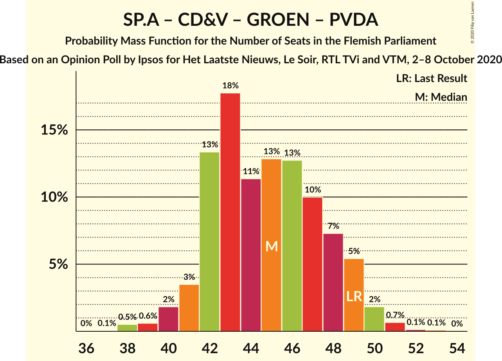

| Number of Seats | Probability | Accumulated | Special Marks |
|:---------------:|:-----------:|:-----------:|:-------------:|
| 36 | 0.1% | 100% |  |
| 37 | 0.2% | 99.9% |  |
| 38 | 0.5% | 99.7% |  |
| 39 | 1.3% | 99.3% |  |
| 40 | 2% | 98% |  |
| 41 | 4% | 96% |  |
| 42 | 8% | 92% |  |
| 43 | 11% | 84% |  |
| 44 | 14% | 73% |  |
| 45 | 17% | 59% | Median |
| 46 | 14% | 42% |  |
| 47 | 11% | 27% |  |
| 48 | 8% | 17% |  |
| 49 | 6% | 9% | Last Result |
| 50 | 2% | 2% |  |
| 51 | 0.5% | 0.7% |  |
| 52 | 0.1% | 0.2% |  |
| 53 | 0% | 0% |  |

### Socialistische Partij Anders – Open Vlaamse Liberalen en Democraten – Christen-Democratisch en Vlaams

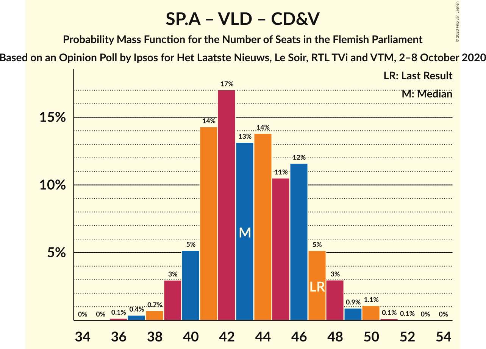

| Number of Seats | Probability | Accumulated | Special Marks |
|:---------------:|:-----------:|:-----------:|:-------------:|
| 36 | 0.1% | 100% |  |
| 37 | 0.4% | 99.9% |  |
| 38 | 0.9% | 99.6% |  |
| 39 | 4% | 98.7% |  |
| 40 | 4% | 95% |  |
| 41 | 9% | 91% |  |
| 42 | 12% | 82% |  |
| 43 | 15% | 69% |  |
| 44 | 14% | 54% | Median |
| 45 | 18% | 40% |  |
| 46 | 11% | 22% |  |
| 47 | 6% | 12% | Last Result |
| 48 | 3% | 6% |  |
| 49 | 2% | 3% |  |
| 50 | 0.7% | 0.9% |  |
| 51 | 0.2% | 0.2% |  |
| 52 | 0% | 0.1% |  |
| 53 | 0% | 0% |  |

### Nieuw-Vlaamse Alliantie – Open Vlaamse Liberalen en Democraten

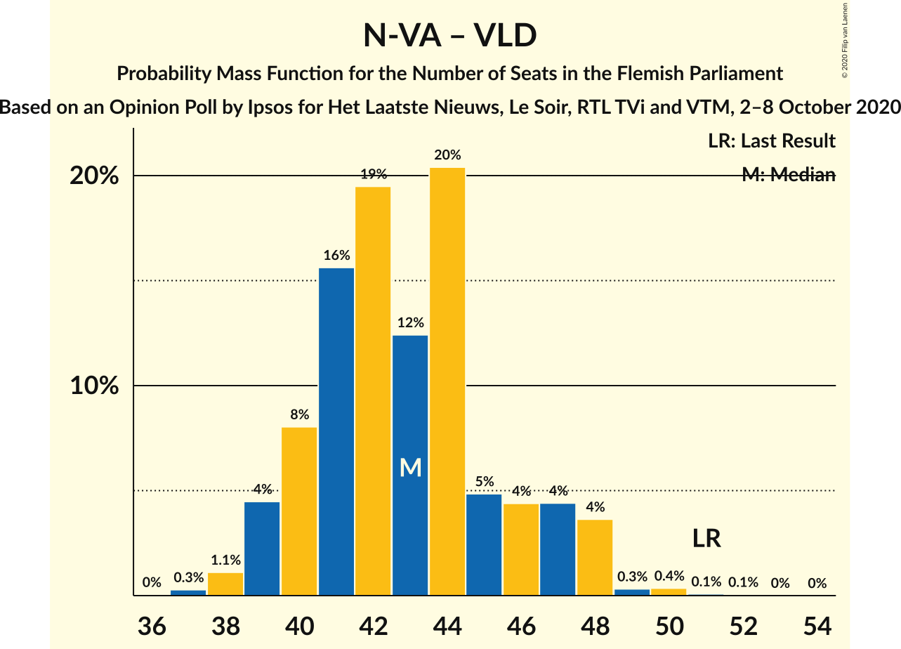

| Number of Seats | Probability | Accumulated | Special Marks |
|:---------------:|:-----------:|:-----------:|:-------------:|
| 36 | 0.1% | 100% |  |
| 37 | 0.4% | 99.9% |  |
| 38 | 2% | 99.5% |  |
| 39 | 4% | 98% |  |
| 40 | 9% | 94% |  |
| 41 | 12% | 84% |  |
| 42 | 19% | 72% |  |
| 43 | 17% | 53% | Median |
| 44 | 15% | 36% |  |
| 45 | 7% | 21% |  |
| 46 | 6% | 14% |  |
| 47 | 5% | 8% |  |
| 48 | 2% | 3% |  |
| 49 | 0.6% | 1.0% |  |
| 50 | 0.3% | 0.4% |  |
| 51 | 0.1% | 0.2% | Last Result |
| 52 | 0% | 0% |  |

### Nieuw-Vlaamse Alliantie – Christen-Democratisch en Vlaams

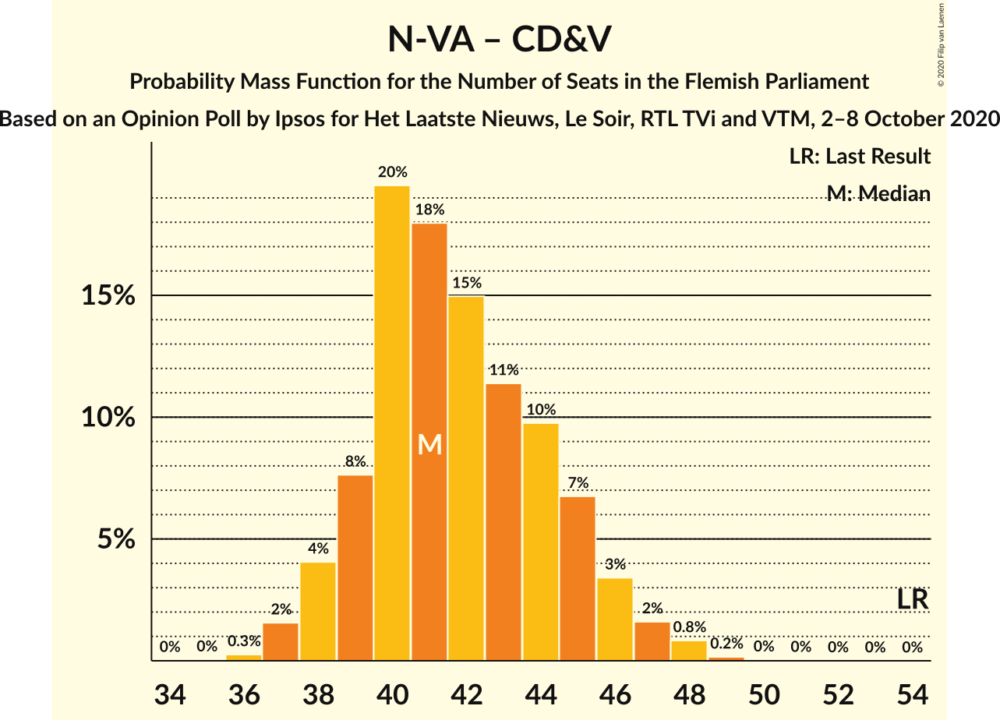

| Number of Seats | Probability | Accumulated | Special Marks |
|:---------------:|:-----------:|:-----------:|:-------------:|
| 35 | 0% | 100% |  |
| 36 | 0.3% | 99.9% |  |
| 37 | 2% | 99.7% |  |
| 38 | 4% | 98% |  |
| 39 | 8% | 94% |  |
| 40 | 20% | 86% |  |
| 41 | 18% | 67% | Median |
| 42 | 15% | 49% |  |
| 43 | 11% | 34% |  |
| 44 | 10% | 23% |  |
| 45 | 7% | 13% |  |
| 46 | 3% | 6% |  |
| 47 | 2% | 3% |  |
| 48 | 0.8% | 1.1% |  |
| 49 | 0.2% | 0.2% |  |
| 50 | 0% | 0.1% |  |
| 51 | 0% | 0% |  |
| 52 | 0% | 0% |  |
| 53 | 0% | 0% |  |
| 54 | 0% | 0% | Last Result |

### Socialistische Partij Anders – Open Vlaamse Liberalen en Democraten – Groen

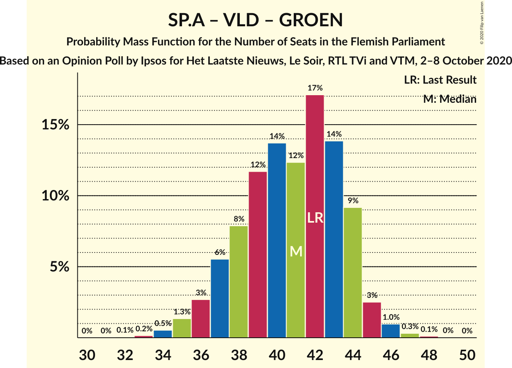

| Number of Seats | Probability | Accumulated | Special Marks |
|:---------------:|:-----------:|:-----------:|:-------------:|
| 32 | 0.1% | 100% |  |
| 33 | 0.2% | 99.9% |  |
| 34 | 0.5% | 99.8% |  |
| 35 | 1.3% | 99.2% |  |
| 36 | 3% | 98% |  |
| 37 | 6% | 95% |  |
| 38 | 8% | 90% |  |
| 39 | 12% | 82% |  |
| 40 | 14% | 70% |  |
| 41 | 12% | 56% |  |
| 42 | 17% | 44% | Last Result, Median |
| 43 | 14% | 27% |  |
| 44 | 9% | 13% |  |
| 45 | 3% | 4% |  |
| 46 | 1.0% | 1.4% |  |
| 47 | 0.3% | 0.5% |  |
| 48 | 0.1% | 0.1% |  |
| 49 | 0% | 0% |  |

### Socialistische Partij Anders – Christen-Democratisch en Vlaams – Groen

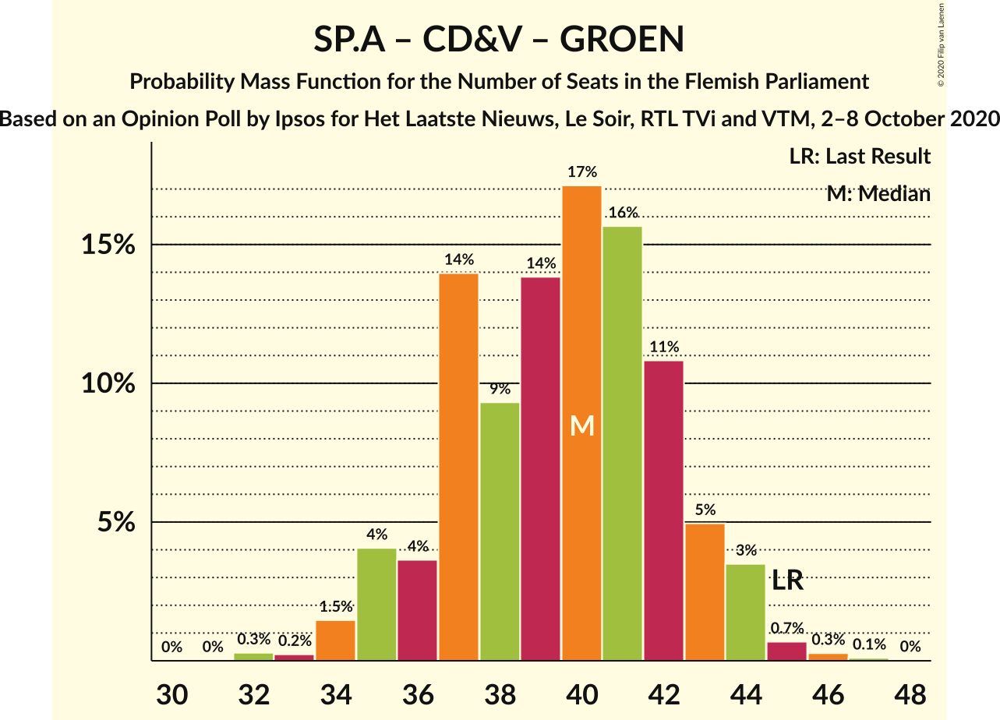

| Number of Seats | Probability | Accumulated | Special Marks |
|:---------------:|:-----------:|:-----------:|:-------------:|
| 31 | 0.1% | 100% |  |
| 32 | 0.3% | 99.9% |  |
| 33 | 0.3% | 99.6% |  |
| 34 | 1.1% | 99.3% |  |
| 35 | 3% | 98% |  |
| 36 | 4% | 95% |  |
| 37 | 9% | 91% |  |
| 38 | 11% | 83% |  |
| 39 | 14% | 72% |  |
| 40 | 21% | 57% | Median |
| 41 | 14% | 37% |  |
| 42 | 12% | 22% |  |
| 43 | 5% | 10% |  |
| 44 | 4% | 5% |  |
| 45 | 0.7% | 1.1% | Last Result |
| 46 | 0.2% | 0.4% |  |
| 47 | 0.1% | 0.1% |  |
| 48 | 0% | 0% |  |

### Open Vlaamse Liberalen en Democraten – Christen-Democratisch en Vlaams – Groen

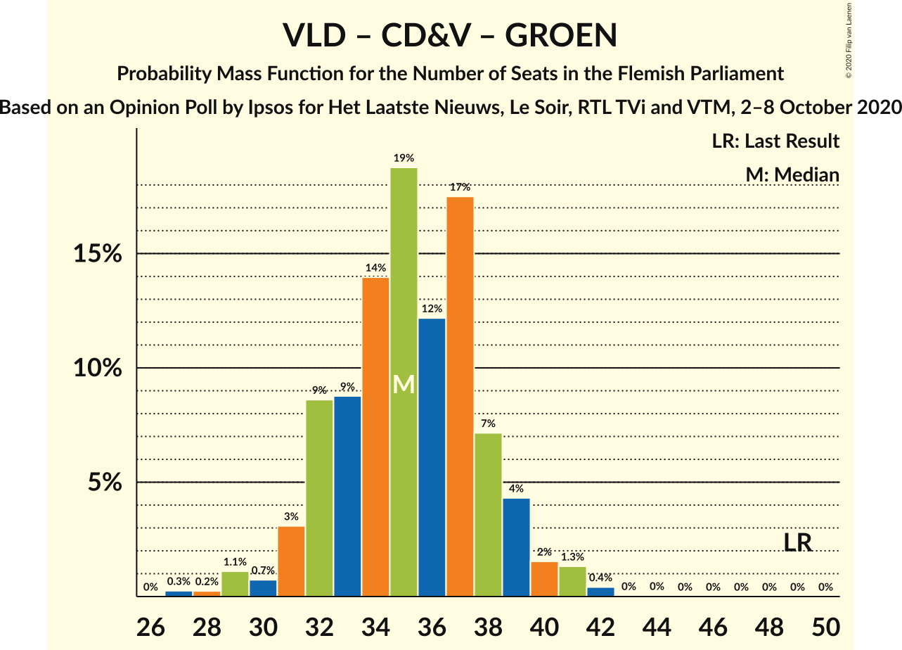

| Number of Seats | Probability | Accumulated | Special Marks |
|:---------------:|:-----------:|:-----------:|:-------------:|
| 27 | 0.1% | 100% |  |
| 28 | 0.2% | 99.9% |  |
| 29 | 0.7% | 99.7% |  |
| 30 | 1.4% | 98.9% |  |
| 31 | 4% | 97% |  |
| 32 | 6% | 94% |  |
| 33 | 8% | 88% |  |
| 34 | 12% | 79% |  |
| 35 | 14% | 67% |  |
| 36 | 15% | 54% | Median |
| 37 | 21% | 38% |  |
| 38 | 9% | 17% |  |
| 39 | 4% | 8% |  |
| 40 | 2% | 4% |  |
| 41 | 0.9% | 1.4% |  |
| 42 | 0.3% | 0.4% |  |
| 43 | 0.1% | 0.1% |  |
| 44 | 0% | 0% |  |
| 45 | 0% | 0% |  |
| 46 | 0% | 0% |  |
| 47 | 0% | 0% |  |
| 48 | 0% | 0% |  |
| 49 | 0% | 0% | Last Result |

### Socialistische Partij Anders – Open Vlaamse Liberalen en Democraten

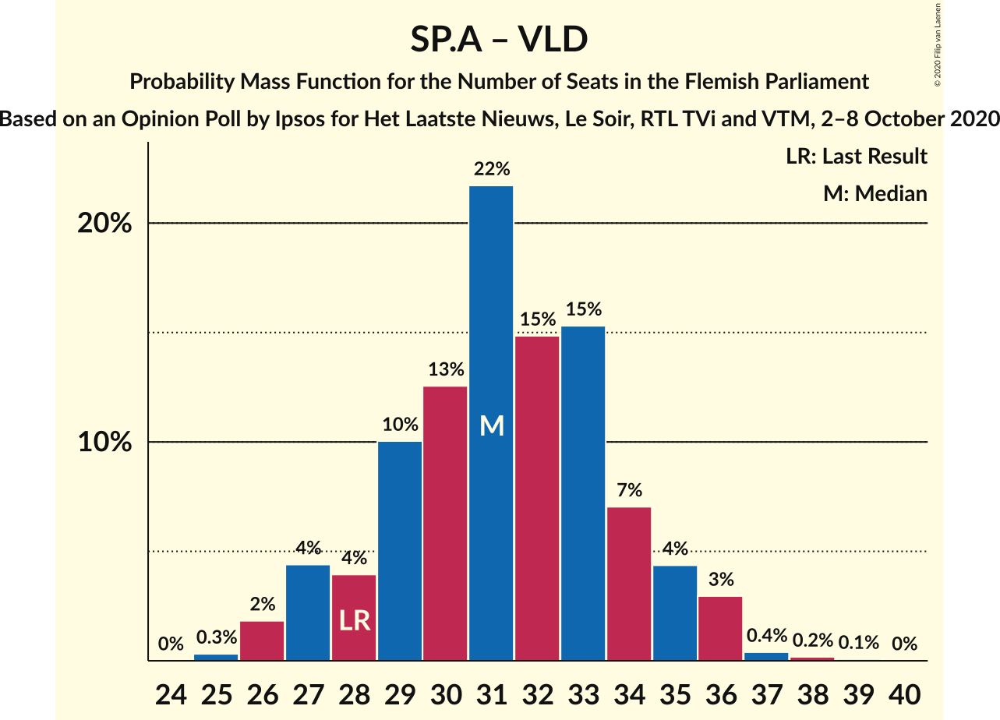

| Number of Seats | Probability | Accumulated | Special Marks |
|:---------------:|:-----------:|:-----------:|:-------------:|
| 25 | 0.3% | 100% |  |
| 26 | 2% | 99.7% |  |
| 27 | 4% | 98% |  |
| 28 | 4% | 93% | Last Result |
| 29 | 10% | 90% |  |
| 30 | 13% | 79% |  |
| 31 | 22% | 67% |  |
| 32 | 15% | 45% | Median |
| 33 | 15% | 30% |  |
| 34 | 7% | 15% |  |
| 35 | 4% | 8% |  |
| 36 | 3% | 4% |  |
| 37 | 0.4% | 0.7% |  |
| 38 | 0.2% | 0.3% |  |
| 39 | 0.1% | 0.1% |  |
| 40 | 0% | 0% |  |

### Socialistische Partij Anders – Christen-Democratisch en Vlaams

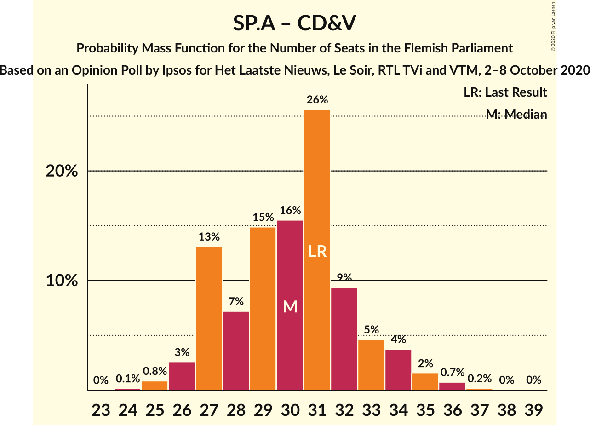

| Number of Seats | Probability | Accumulated | Special Marks |
|:---------------:|:-----------:|:-----------:|:-------------:|
| 24 | 0.2% | 100% |  |
| 25 | 0.8% | 99.8% |  |
| 26 | 4% | 99.0% |  |
| 27 | 7% | 95% |  |
| 28 | 10% | 88% |  |
| 29 | 13% | 79% |  |
| 30 | 19% | 66% | Median |
| 31 | 22% | 46% | Last Result |
| 32 | 11% | 24% |  |
| 33 | 8% | 13% |  |
| 34 | 3% | 5% |  |
| 35 | 1.2% | 2% |  |
| 36 | 0.9% | 1.1% |  |
| 37 | 0.2% | 0.2% |  |
| 38 | 0% | 0.1% |  |
| 39 | 0% | 0% |  |

### Open Vlaamse Liberalen en Democraten – Christen-Democratisch en Vlaams

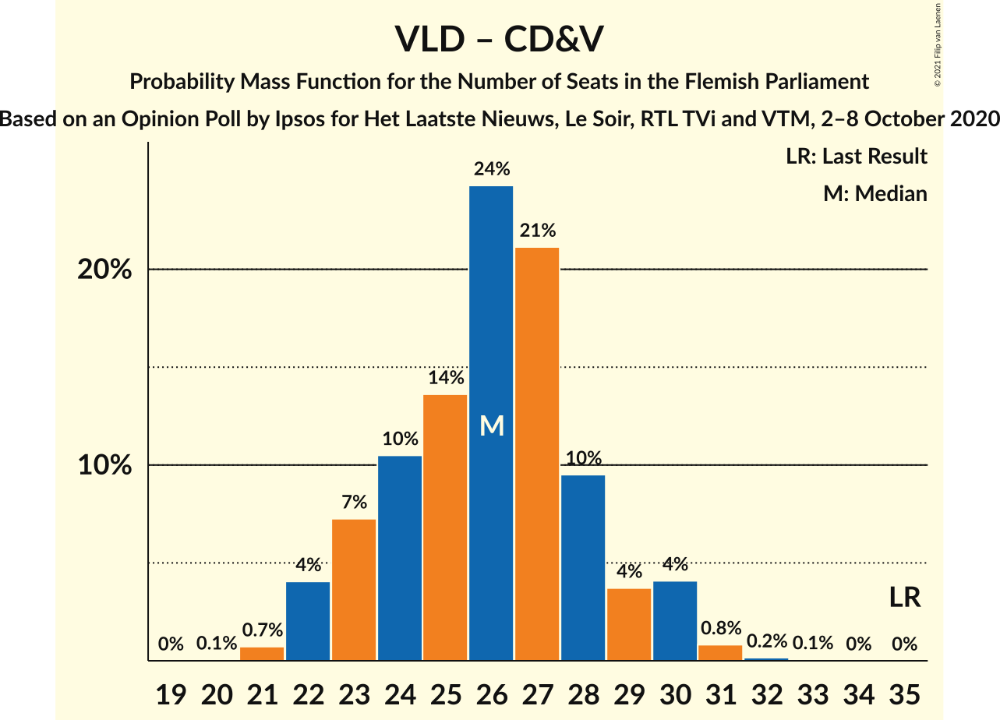

| Number of Seats | Probability | Accumulated | Special Marks |
|:---------------:|:-----------:|:-----------:|:-------------:|
| 20 | 0.1% | 100% |  |
| 21 | 0.7% | 99.9% |  |
| 22 | 4% | 99.2% |  |
| 23 | 7% | 95% |  |
| 24 | 10% | 88% |  |
| 25 | 14% | 77% |  |
| 26 | 24% | 64% | Median |
| 27 | 21% | 40% |  |
| 28 | 10% | 18% |  |
| 29 | 4% | 9% |  |
| 30 | 4% | 5% |  |
| 31 | 0.8% | 1.1% |  |
| 32 | 0.2% | 0.2% |  |
| 33 | 0.1% | 0.1% |  |
| 34 | 0% | 0% |  |
| 35 | 0% | 0% | Last Result |

## Technical Information

### Opinion Poll

+ **Polling firm:** Ipsos
+ **Commissioner(s):** Het Laatste Nieuws, Le Soir, RTL TVi and VTM
+ **Fieldwork period:** 2–8 October 2020

### Calculations

+ **Sample size:** 1001
+ **Simulations done:** 1,048,576
+ **Error estimate:** 0.88%

