# Opinion Poll by Ipsos for Het Laatste Nieuws, Le Soir, RTL TVi and VTM, 2–8 December 2020

<a href="#voting-intentions">Voting Intentions</a> | <a href="#seats">Seats</a> | <a href="#coalitions">Coalitions</a> | <a href="#technical-information">Technical Information</a>

## Voting Intentions

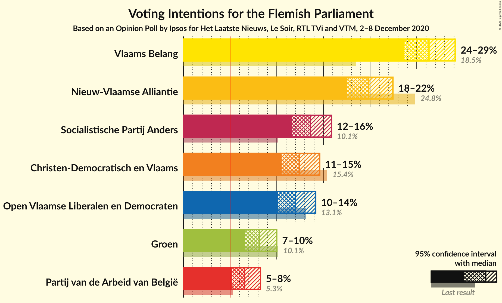

### Confidence Intervals

| Party | Last Result | Poll Result | 80% Confidence Interval | 90% Confidence Interval | 95% Confidence Interval | 99% Confidence Interval |
|:-----:|:-----------:|:-----------:|:-----------------------:|:-----------------------:|:-----------------------:|:-----------------------:|
| Vlaams Belang | 18.5% | 26.3% | 24.6–28.2% |24.1–28.7% |23.7–29.1% |22.9–30.0% |
| Nieuw-Vlaamse Alliantie | 24.8% | 19.9% | 18.3–21.6% |17.9–22.0% |17.5–22.5% |16.8–23.3% |
| Vooruit | 10.1% | 13.6% | 12.3–15.1% |11.9–15.5% |11.6–15.9% |11.0–16.6% |
| Christen-Democratisch en Vlaams | 15.4% | 12.4% | 11.2–13.8% |10.8–14.3% |10.5–14.6% |9.9–15.3% |
| Open Vlaamse Liberalen en Democraten | 13.1% | 12.0% | 10.8–13.4% |10.4–13.8% |10.2–14.2% |9.6–14.9% |
| Groen | 10.1% | 8.1% | 7.1–9.4% |6.8–9.7% |6.6–10.0% |6.1–10.6% |
| Partij van de Arbeid van België | 5.3% | 6.6% | 5.7–7.7% |5.4–8.0% |5.2–8.3% |4.8–8.8% |

*Note:* The poll result column reflects the actual value used in the calculations. Published results may vary slightly, and in addition be rounded to fewer digits.

## Seats

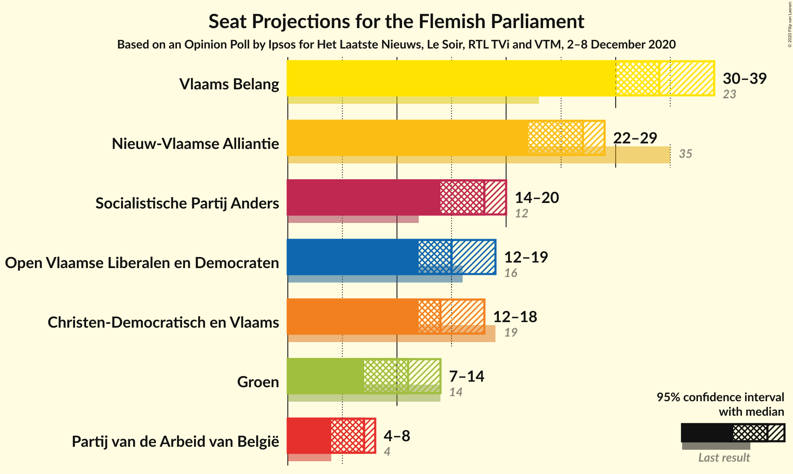

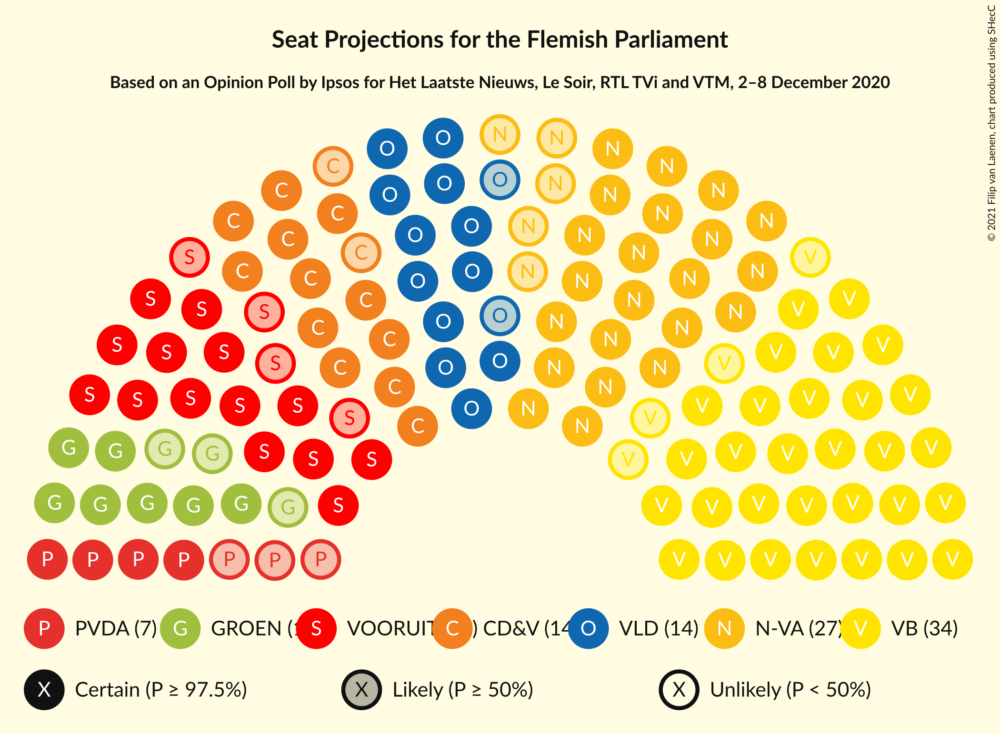

### Confidence Intervals

| Party | Last Result | Median | 80% Confidence Interval | 90% Confidence Interval | 95% Confidence Interval | 99% Confidence Interval |
|:-----:|:-----------:|:------:|:-----------------------:|:-----------------------:|:-----------------------:|:-----------------------:|
| <a href="#vlaams-belang">Vlaams Belang</a> | 23 | 34 | 32–37 |31–38 |30–39 |30–40 |
| <a href="#nieuw-vlaamse-alliantie">Nieuw-Vlaamse Alliantie</a> | 35 | 27 | 23–28 |22–29 |22–29 |22–30 |
| <a href="#vooruit">Vooruit</a> | 12 | 18 | 14–19 |14–19 |14–20 |14–22 |
| <a href="#christen-democratisch-en-vlaams">Christen-Democratisch en Vlaams</a> | 19 | 14 | 13–16 |12–17 |12–18 |11–19 |
| <a href="#open-vlaamse-liberalen-en-democraten">Open Vlaamse Liberalen en Democraten</a> | 16 | 15 | 13–17 |12–18 |12–19 |11–19 |
| <a href="#groen">Groen</a> | 14 | 11 | 8–11 |8–13 |7–14 |5–14 |
| <a href="#partij-van-de-arbeid-van-belgië">Partij van de Arbeid van België</a> | 4 | 7 | 4–7 |4–8 |4–8 |2–10 |

### Vlaams Belang

*For a full overview of the results for this party, see the [Vlaams Belang](party-vlaamsbelang.html) page.*

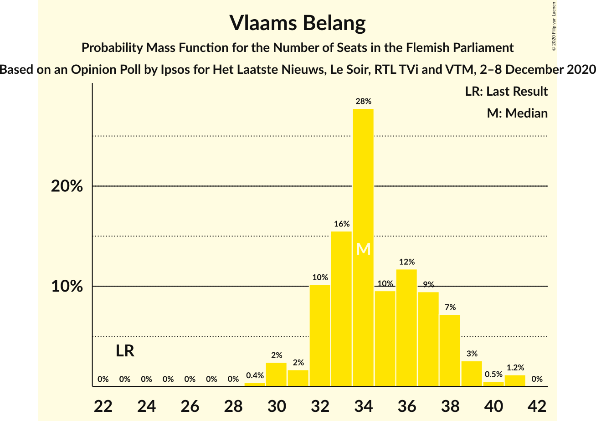

| Number of Seats | Probability | Accumulated | Special Marks |
|:---------------:|:-----------:|:-----------:|:-------------:|
| 23 | 0% | 100% | Last Result |
| 24 | 0% | 100% |  |
| 25 | 0% | 100% |  |
| 26 | 0% | 100% |  |
| 27 | 0% | 100% |  |
| 28 | 0% | 100% |  |
| 29 | 0.2% | 100% |  |
| 30 | 2% | 99.7% |  |
| 31 | 2% | 97% |  |
| 32 | 7% | 95% |  |
| 33 | 9% | 88% |  |
| 34 | 41% | 79% | Median |
| 35 | 9% | 38% |  |
| 36 | 10% | 30% |  |
| 37 | 10% | 20% |  |
| 38 | 7% | 10% |  |
| 39 | 2% | 3% |  |
| 40 | 0.6% | 1.1% |  |
| 41 | 0.4% | 0.5% |  |
| 42 | 0% | 0% |  |

### Nieuw-Vlaamse Alliantie

*For a full overview of the results for this party, see the [Nieuw-Vlaamse Alliantie](party-nieuw-vlaamsealliantie.html) page.*

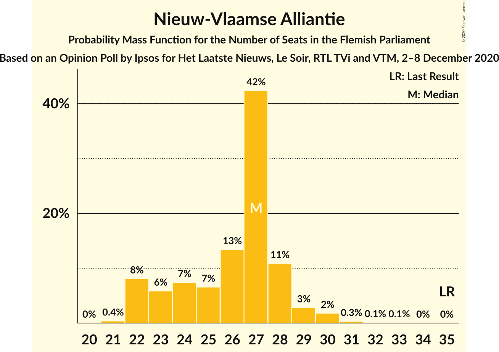

| Number of Seats | Probability | Accumulated | Special Marks |
|:---------------:|:-----------:|:-----------:|:-------------:|
| 21 | 0.4% | 100% |  |
| 22 | 8% | 99.6% |  |
| 23 | 6% | 92% |  |
| 24 | 7% | 86% |  |
| 25 | 7% | 78% |  |
| 26 | 13% | 72% |  |
| 27 | 42% | 58% | Median |
| 28 | 11% | 16% |  |
| 29 | 3% | 5% |  |
| 30 | 2% | 2% |  |
| 31 | 0.3% | 0.5% |  |
| 32 | 0.1% | 0.2% |  |
| 33 | 0.1% | 0.1% |  |
| 34 | 0% | 0% |  |
| 35 | 0% | 0% | Last Result |

### Vooruit

*For a full overview of the results for this party, see the [Vooruit](party-vooruit.html) page.*

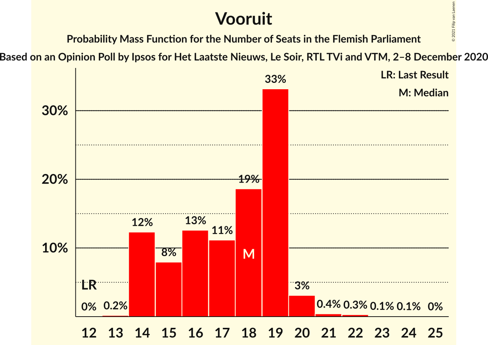

| Number of Seats | Probability | Accumulated | Special Marks |
|:---------------:|:-----------:|:-----------:|:-------------:|
| 12 | 0% | 100% | Last Result |
| 13 | 0.2% | 100% |  |
| 14 | 12% | 99.8% |  |
| 15 | 8% | 87% |  |
| 16 | 13% | 80% |  |
| 17 | 11% | 67% |  |
| 18 | 19% | 56% | Median |
| 19 | 33% | 37% |  |
| 20 | 3% | 4% |  |
| 21 | 0.4% | 0.9% |  |
| 22 | 0.3% | 0.5% |  |
| 23 | 0.1% | 0.2% |  |
| 24 | 0.1% | 0.1% |  |
| 25 | 0% | 0% |  |

### Christen-Democratisch en Vlaams

*For a full overview of the results for this party, see the [Christen-Democratisch en Vlaams](party-christen-democratischenvlaams.html) page.*

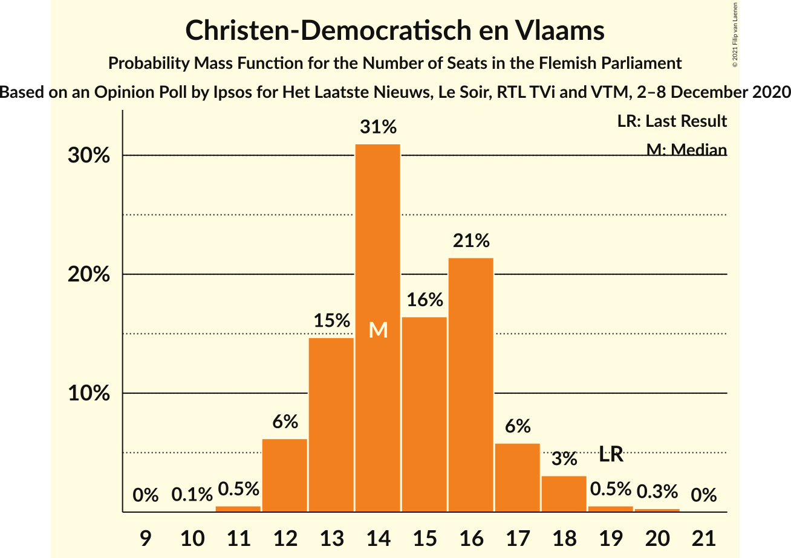

| Number of Seats | Probability | Accumulated | Special Marks |
|:---------------:|:-----------:|:-----------:|:-------------:|
| 10 | 0.1% | 100% |  |
| 11 | 0.5% | 99.9% |  |
| 12 | 6% | 99.4% |  |
| 13 | 15% | 93% |  |
| 14 | 31% | 79% | Median |
| 15 | 16% | 48% |  |
| 16 | 21% | 31% |  |
| 17 | 6% | 10% |  |
| 18 | 3% | 4% |  |
| 19 | 0.5% | 0.8% | Last Result |
| 20 | 0.3% | 0.3% |  |
| 21 | 0% | 0% |  |

### Open Vlaamse Liberalen en Democraten

*For a full overview of the results for this party, see the [Open Vlaamse Liberalen en Democraten](party-openvlaamseliberalenendemocraten.html) page.*

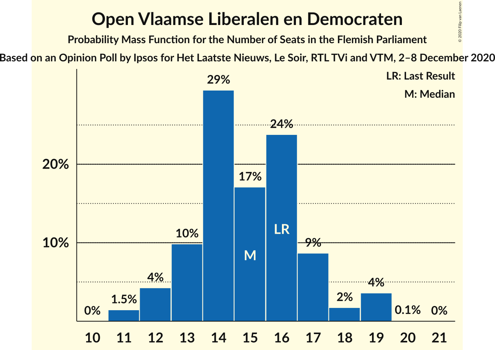

| Number of Seats | Probability | Accumulated | Special Marks |
|:---------------:|:-----------:|:-----------:|:-------------:|
| 11 | 1.5% | 100% |  |
| 12 | 4% | 98.5% |  |
| 13 | 10% | 94% |  |
| 14 | 29% | 84% |  |
| 15 | 17% | 55% | Median |
| 16 | 24% | 38% | Last Result |
| 17 | 9% | 14% |  |
| 18 | 2% | 5% |  |
| 19 | 4% | 4% |  |
| 20 | 0.1% | 0.1% |  |
| 21 | 0% | 0% |  |

### Groen

*For a full overview of the results for this party, see the [Groen](party-groen.html) page.*

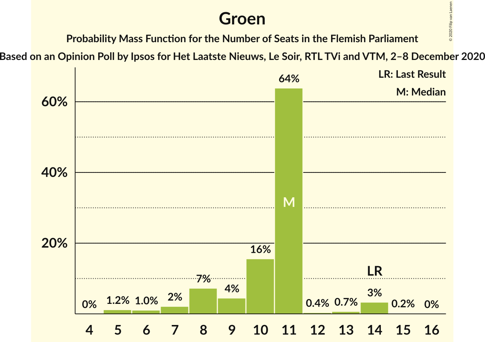

| Number of Seats | Probability | Accumulated | Special Marks |
|:---------------:|:-----------:|:-----------:|:-------------:|
| 5 | 0.9% | 100% |  |
| 6 | 1.0% | 99.1% |  |
| 7 | 3% | 98% |  |
| 8 | 9% | 95% |  |
| 9 | 3% | 86% |  |
| 10 | 30% | 82% |  |
| 11 | 45% | 52% | Median |
| 12 | 2% | 7% |  |
| 13 | 2% | 5% |  |
| 14 | 3% | 3% | Last Result |
| 15 | 0.2% | 0.2% |  |
| 16 | 0% | 0% |  |

### Partij van de Arbeid van België

*For a full overview of the results for this party, see the [Partij van de Arbeid van België](party-partijvandearbeidvanbelgië.html) page.*

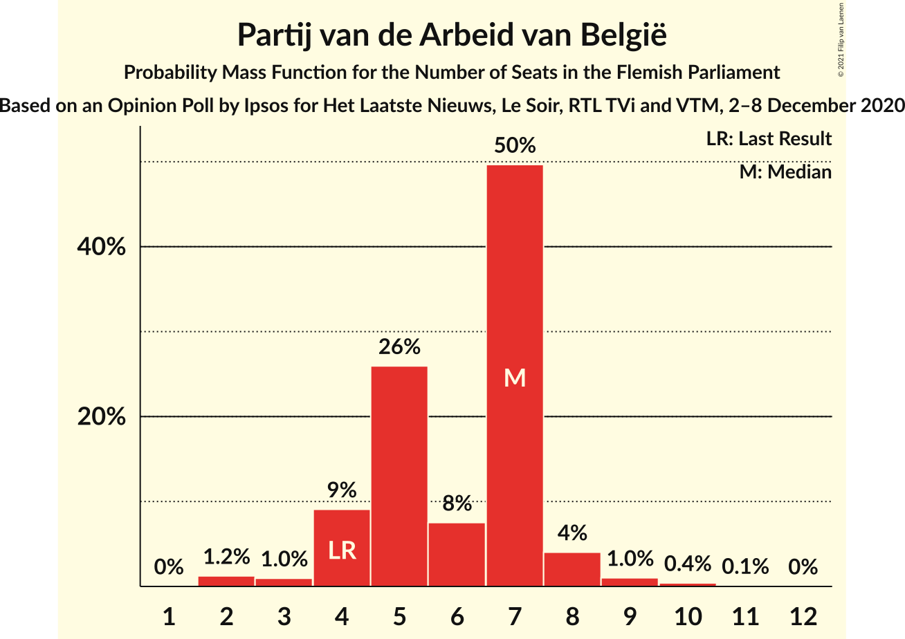

| Number of Seats | Probability | Accumulated | Special Marks |
|:---------------:|:-----------:|:-----------:|:-------------:|
| 2 | 1.2% | 100% |  |
| 3 | 1.0% | 98.7% |  |
| 4 | 9% | 98% | Last Result |
| 5 | 26% | 89% |  |
| 6 | 8% | 63% |  |
| 7 | 50% | 55% | Median |
| 8 | 4% | 6% |  |
| 9 | 1.0% | 2% |  |
| 10 | 0.4% | 0.5% |  |
| 11 | 0.1% | 0.1% |  |
| 12 | 0% | 0% |  |

## Coalitions

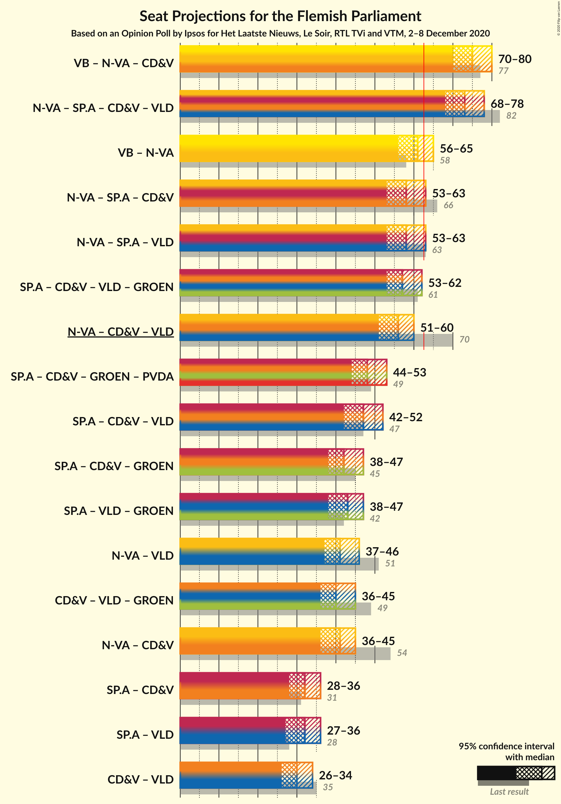

### Confidence Intervals

| Coalition | Last Result | Median | Majority? | 80% Confidence Interval | 90% Confidence Interval | 95% Confidence Interval | 99% Confidence Interval |
|:---------:|:-----------:|:------:|:---------:|:-----------------------:|:-----------------------:|:-----------------------:|:-----------------------:|
| Vlaams Belang – Nieuw-Vlaamse Alliantie – Christen-Democratisch en Vlaams | 77 | 75 | 100% | 72–79 | 71–80 | 70–80 | 69–82 |
| Nieuw-Vlaamse Alliantie – Vooruit – Christen-Democratisch en Vlaams – Open Vlaamse Liberalen en Democraten | 82 | 73 | 100% | 70–76 | 69–77 | 68–78 | 67–79 |
| Vlaams Belang – Nieuw-Vlaamse Alliantie | 58 | 61 | 21% | 58–64 | 57–64 | 56–65 | 54–67 |
| Nieuw-Vlaamse Alliantie – Vooruit – Christen-Democratisch en Vlaams | 66 | 58 | 3% | 55–61 | 54–62 | 53–63 | 52–64 |
| Nieuw-Vlaamse Alliantie – Vooruit – Open Vlaamse Liberalen en Democraten | 63 | 58 | 3% | 55–61 | 54–62 | 53–63 | 52–65 |
| Vooruit – Christen-Democratisch en Vlaams – Open Vlaamse Liberalen en Democraten – Groen | 61 | 57 | 2% | 54–60 | 53–61 | 53–62 | 51–64 |
| Nieuw-Vlaamse Alliantie – Christen-Democratisch en Vlaams – Open Vlaamse Liberalen en Democraten | 70 | 56 | 0.3% | 53–59 | 52–60 | 51–60 | 50–62 |
| Vooruit – Christen-Democratisch en Vlaams – Groen – Partij van de Arbeid van België | 49 | 48 | 0% | 45–51 | 44–52 | 44–53 | 42–55 |
| Vooruit – Christen-Democratisch en Vlaams – Open Vlaamse Liberalen en Democraten | 47 | 47 | 0% | 44–50 | 43–51 | 42–52 | 41–53 |
| Vooruit – Christen-Democratisch en Vlaams – Groen | 45 | 42 | 0% | 39–45 | 38–46 | 38–47 | 36–48 |
| Vooruit – Open Vlaamse Liberalen en Democraten – Groen | 42 | 43 | 0% | 40–45 | 38–46 | 38–47 | 36–49 |
| Nieuw-Vlaamse Alliantie – Open Vlaamse Liberalen en Democraten | 51 | 41 | 0% | 38–44 | 37–45 | 37–46 | 35–47 |
| Christen-Democratisch en Vlaams – Open Vlaamse Liberalen en Democraten – Groen | 49 | 40 | 0% | 37–43 | 36–44 | 36–45 | 34–46 |
| Nieuw-Vlaamse Alliantie – Christen-Democratisch en Vlaams | 54 | 41 | 0% | 38–43 | 36–44 | 36–45 | 35–46 |
| Vooruit – Christen-Democratisch en Vlaams | 31 | 32 | 0% | 29–35 | 28–36 | 28–36 | 26–38 |
| Vooruit – Open Vlaamse Liberalen en Democraten | 28 | 32 | 0% | 29–35 | 28–36 | 27–36 | 27–38 |
| Christen-Democratisch en Vlaams – Open Vlaamse Liberalen en Democraten | 35 | 30 | 0% | 27–32 | 26–33 | 26–34 | 25–35 |

### Vlaams Belang – Nieuw-Vlaamse Alliantie – Christen-Democratisch en Vlaams

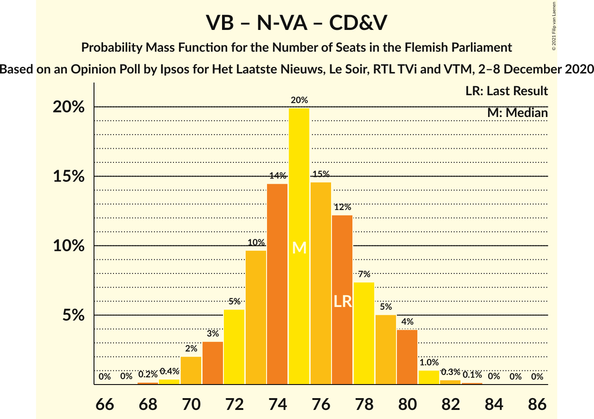

| Number of Seats | Probability | Accumulated | Special Marks |
|:---------------:|:-----------:|:-----------:|:-------------:|
| 67 | 0% | 100% |  |
| 68 | 0.2% | 99.9% |  |
| 69 | 0.4% | 99.8% |  |
| 70 | 2% | 99.4% |  |
| 71 | 3% | 97% |  |
| 72 | 5% | 94% |  |
| 73 | 10% | 89% |  |
| 74 | 14% | 79% |  |
| 75 | 20% | 65% | Median |
| 76 | 15% | 45% |  |
| 77 | 12% | 30% | Last Result |
| 78 | 7% | 18% |  |
| 79 | 5% | 11% |  |
| 80 | 4% | 6% |  |
| 81 | 1.0% | 2% |  |
| 82 | 0.3% | 0.5% |  |
| 83 | 0.1% | 0.2% |  |
| 84 | 0% | 0.1% |  |
| 85 | 0% | 0% |  |

### Nieuw-Vlaamse Alliantie – Vooruit – Christen-Democratisch en Vlaams – Open Vlaamse Liberalen en Democraten

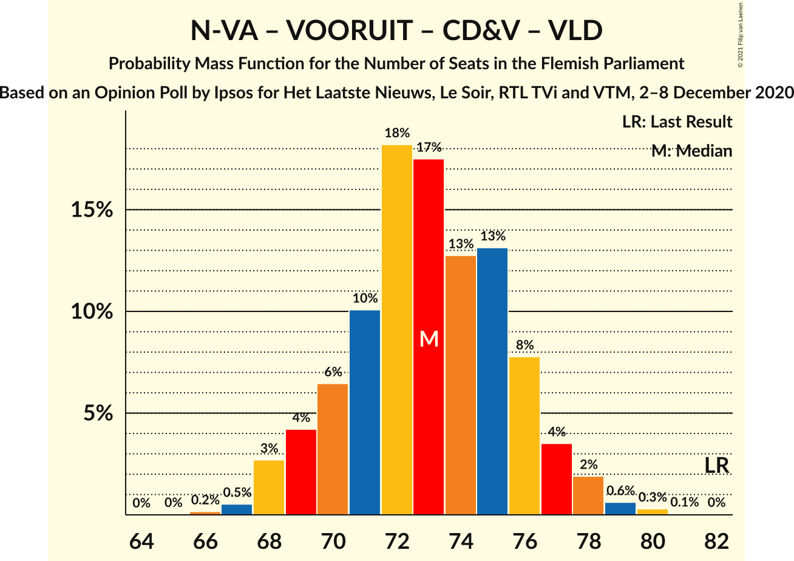

| Number of Seats | Probability | Accumulated | Special Marks |
|:---------------:|:-----------:|:-----------:|:-------------:|
| 65 | 0% | 100% |  |
| 66 | 0.2% | 99.9% |  |
| 67 | 0.5% | 99.8% |  |
| 68 | 3% | 99.3% |  |
| 69 | 4% | 97% |  |
| 70 | 6% | 92% |  |
| 71 | 10% | 86% |  |
| 72 | 18% | 76% |  |
| 73 | 17% | 58% |  |
| 74 | 13% | 40% | Median |
| 75 | 13% | 27% |  |
| 76 | 8% | 14% |  |
| 77 | 4% | 6% |  |
| 78 | 2% | 3% |  |
| 79 | 0.6% | 1.0% |  |
| 80 | 0.3% | 0.4% |  |
| 81 | 0.1% | 0.1% |  |
| 82 | 0% | 0% | Last Result |

### Vlaams Belang – Nieuw-Vlaamse Alliantie

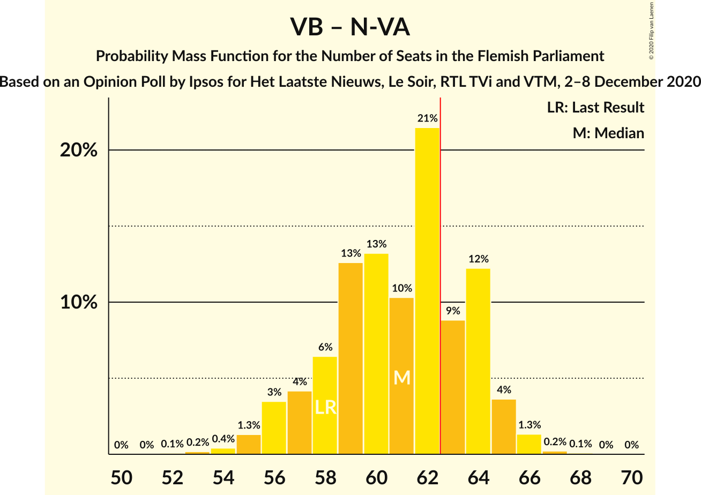

| Number of Seats | Probability | Accumulated | Special Marks |
|:---------------:|:-----------:|:-----------:|:-------------:|
| 53 | 0.1% | 100% |  |
| 54 | 0.5% | 99.8% |  |
| 55 | 1.1% | 99.3% |  |
| 56 | 3% | 98% |  |
| 57 | 4% | 95% |  |
| 58 | 7% | 91% | Last Result |
| 59 | 11% | 84% |  |
| 60 | 16% | 73% |  |
| 61 | 23% | 56% | Median |
| 62 | 11% | 33% |  |
| 63 | 9% | 21% | Majority |
| 64 | 8% | 13% |  |
| 65 | 2% | 4% |  |
| 66 | 1.1% | 2% |  |
| 67 | 0.5% | 0.7% |  |
| 68 | 0.2% | 0.2% |  |
| 69 | 0% | 0% |  |

### Nieuw-Vlaamse Alliantie – Vooruit – Christen-Democratisch en Vlaams

| Number of Seats | Probability | Accumulated | Special Marks |
|:---------------:|:-----------:|:-----------:|:-------------:|
| 50 | 0.1% | 100% |  |
| 51 | 0.2% | 99.9% |  |
| 52 | 0.9% | 99.7% |  |
| 53 | 3% | 98.8% |  |
| 54 | 4% | 96% |  |
| 55 | 9% | 92% |  |
| 56 | 9% | 84% |  |
| 57 | 14% | 75% |  |
| 58 | 15% | 61% |  |
| 59 | 16% | 45% | Median |
| 60 | 16% | 29% |  |
| 61 | 6% | 14% |  |
| 62 | 4% | 8% |  |
| 63 | 2% | 3% | Majority |
| 64 | 0.8% | 1.1% |  |
| 65 | 0.2% | 0.3% |  |
| 66 | 0.1% | 0.1% | Last Result |
| 67 | 0% | 0% |  |

### Nieuw-Vlaamse Alliantie – Vooruit – Open Vlaamse Liberalen en Democraten

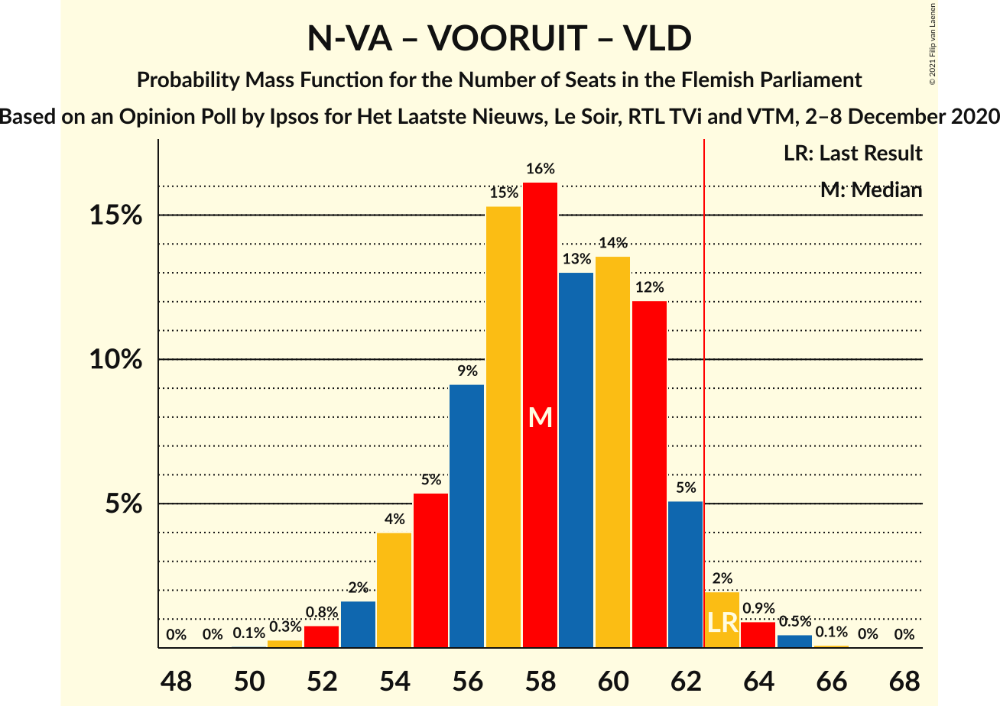

| Number of Seats | Probability | Accumulated | Special Marks |
|:---------------:|:-----------:|:-----------:|:-------------:|
| 50 | 0.1% | 100% |  |
| 51 | 0.3% | 99.9% |  |
| 52 | 0.8% | 99.6% |  |
| 53 | 2% | 98.9% |  |
| 54 | 4% | 97% |  |
| 55 | 5% | 93% |  |
| 56 | 9% | 88% |  |
| 57 | 15% | 79% |  |
| 58 | 16% | 63% |  |
| 59 | 13% | 47% |  |
| 60 | 14% | 34% | Median |
| 61 | 12% | 21% |  |
| 62 | 5% | 9% |  |
| 63 | 2% | 3% | Last Result, Majority |
| 64 | 0.9% | 2% |  |
| 65 | 0.5% | 0.6% |  |
| 66 | 0.1% | 0.1% |  |
| 67 | 0% | 0% |  |

### Vooruit – Christen-Democratisch en Vlaams – Open Vlaamse Liberalen en Democraten – Groen

| Number of Seats | Probability | Accumulated | Special Marks |
|:---------------:|:-----------:|:-----------:|:-------------:|
| 49 | 0.1% | 100% |  |
| 50 | 0.2% | 99.9% |  |
| 51 | 0.7% | 99.7% |  |
| 52 | 1.4% | 99.1% |  |
| 53 | 3% | 98% |  |
| 54 | 6% | 95% |  |
| 55 | 10% | 89% |  |
| 56 | 21% | 79% |  |
| 57 | 13% | 58% |  |
| 58 | 16% | 44% | Median |
| 59 | 12% | 29% |  |
| 60 | 8% | 16% |  |
| 61 | 5% | 9% | Last Result |
| 62 | 1.5% | 3% |  |
| 63 | 1.3% | 2% | Majority |
| 64 | 0.3% | 0.5% |  |
| 65 | 0.1% | 0.2% |  |
| 66 | 0% | 0% |  |

### Nieuw-Vlaamse Alliantie – Christen-Democratisch en Vlaams – Open Vlaamse Liberalen en Democraten

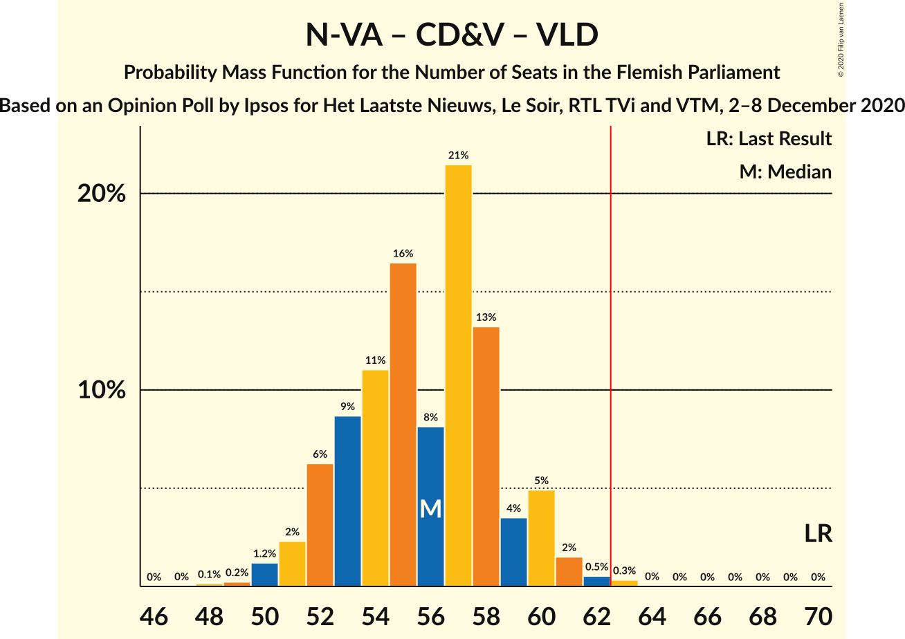

| Number of Seats | Probability | Accumulated | Special Marks |
|:---------------:|:-----------:|:-----------:|:-------------:|
| 48 | 0.1% | 100% |  |
| 49 | 0.3% | 99.9% |  |
| 50 | 0.9% | 99.7% |  |
| 51 | 3% | 98.7% |  |
| 52 | 6% | 96% |  |
| 53 | 8% | 90% |  |
| 54 | 13% | 82% |  |
| 55 | 16% | 69% |  |
| 56 | 16% | 53% | Median |
| 57 | 17% | 37% |  |
| 58 | 9% | 20% |  |
| 59 | 6% | 11% |  |
| 60 | 3% | 6% |  |
| 61 | 2% | 2% |  |
| 62 | 0.4% | 0.6% |  |
| 63 | 0.2% | 0.3% | Majority |
| 64 | 0.1% | 0.1% |  |
| 65 | 0% | 0% |  |
| 66 | 0% | 0% |  |
| 67 | 0% | 0% |  |
| 68 | 0% | 0% |  |
| 69 | 0% | 0% |  |
| 70 | 0% | 0% | Last Result |

### Vooruit – Christen-Democratisch en Vlaams – Groen – Partij van de Arbeid van België

| Number of Seats | Probability | Accumulated | Special Marks |
|:---------------:|:-----------:|:-----------:|:-------------:|
| 40 | 0.1% | 100% |  |
| 41 | 0.2% | 99.9% |  |
| 42 | 0.4% | 99.8% |  |
| 43 | 2% | 99.3% |  |
| 44 | 3% | 98% |  |
| 45 | 6% | 94% |  |
| 46 | 8% | 88% |  |
| 47 | 11% | 79% |  |
| 48 | 18% | 68% |  |
| 49 | 21% | 50% | Last Result |
| 50 | 11% | 29% | Median |
| 51 | 11% | 18% |  |
| 52 | 4% | 7% |  |
| 53 | 2% | 4% |  |
| 54 | 1.4% | 2% |  |
| 55 | 0.3% | 0.5% |  |
| 56 | 0.1% | 0.2% |  |
| 57 | 0% | 0% |  |

### Vooruit – Christen-Democratisch en Vlaams – Open Vlaamse Liberalen en Democraten

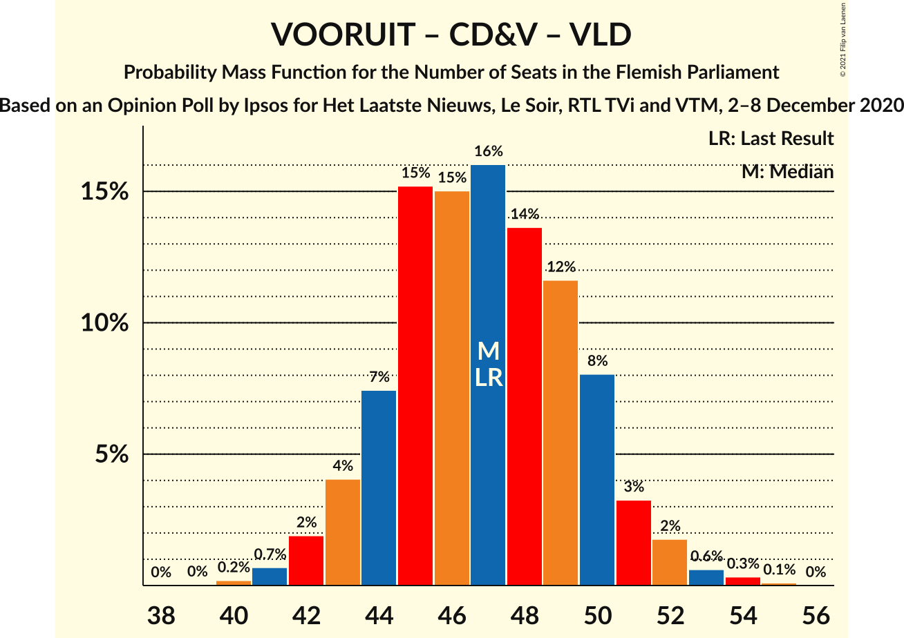

| Number of Seats | Probability | Accumulated | Special Marks |
|:---------------:|:-----------:|:-----------:|:-------------:|
| 40 | 0.2% | 100% |  |
| 41 | 0.7% | 99.8% |  |
| 42 | 2% | 99.1% |  |
| 43 | 4% | 97% |  |
| 44 | 7% | 93% |  |
| 45 | 15% | 86% |  |
| 46 | 15% | 70% |  |
| 47 | 16% | 55% | Last Result, Median |
| 48 | 14% | 39% |  |
| 49 | 12% | 26% |  |
| 50 | 8% | 14% |  |
| 51 | 3% | 6% |  |
| 52 | 2% | 3% |  |
| 53 | 0.6% | 1.1% |  |
| 54 | 0.3% | 0.5% |  |
| 55 | 0.1% | 0.1% |  |
| 56 | 0% | 0% |  |

### Vooruit – Christen-Democratisch en Vlaams – Groen

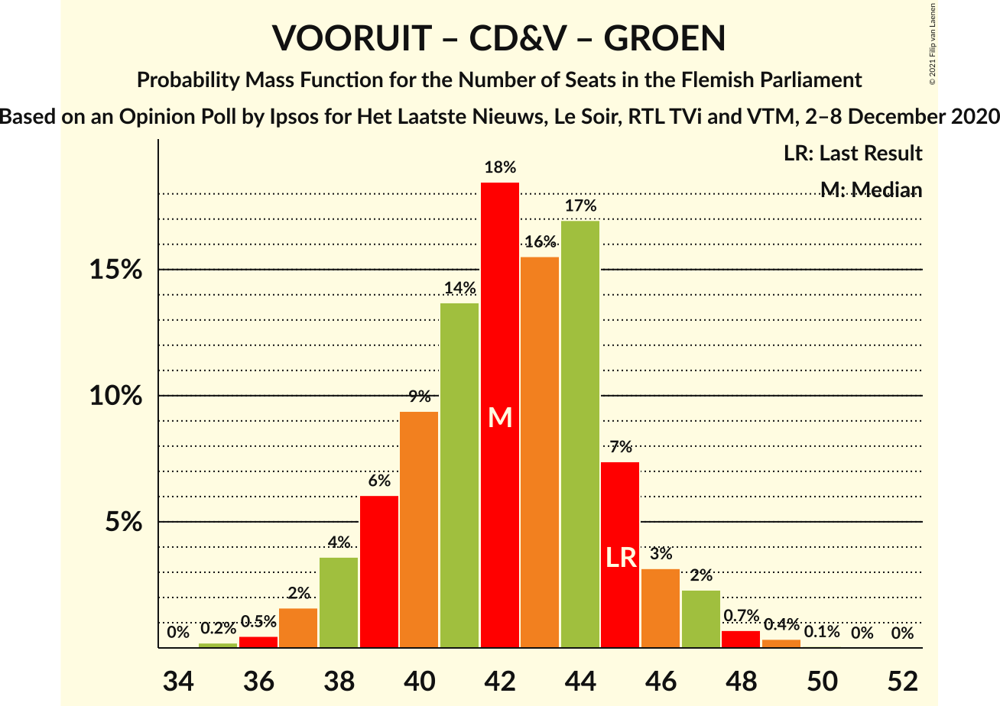

| Number of Seats | Probability | Accumulated | Special Marks |
|:---------------:|:-----------:|:-----------:|:-------------:|
| 34 | 0% | 100% |  |
| 35 | 0.2% | 99.9% |  |
| 36 | 0.5% | 99.7% |  |
| 37 | 2% | 99.3% |  |
| 38 | 4% | 98% |  |
| 39 | 6% | 94% |  |
| 40 | 9% | 88% |  |
| 41 | 14% | 79% |  |
| 42 | 18% | 65% |  |
| 43 | 16% | 46% | Median |
| 44 | 17% | 31% |  |
| 45 | 7% | 14% | Last Result |
| 46 | 3% | 7% |  |
| 47 | 2% | 3% |  |
| 48 | 0.7% | 1.1% |  |
| 49 | 0.4% | 0.4% |  |
| 50 | 0.1% | 0.1% |  |
| 51 | 0% | 0% |  |

### Vooruit – Open Vlaamse Liberalen en Democraten – Groen

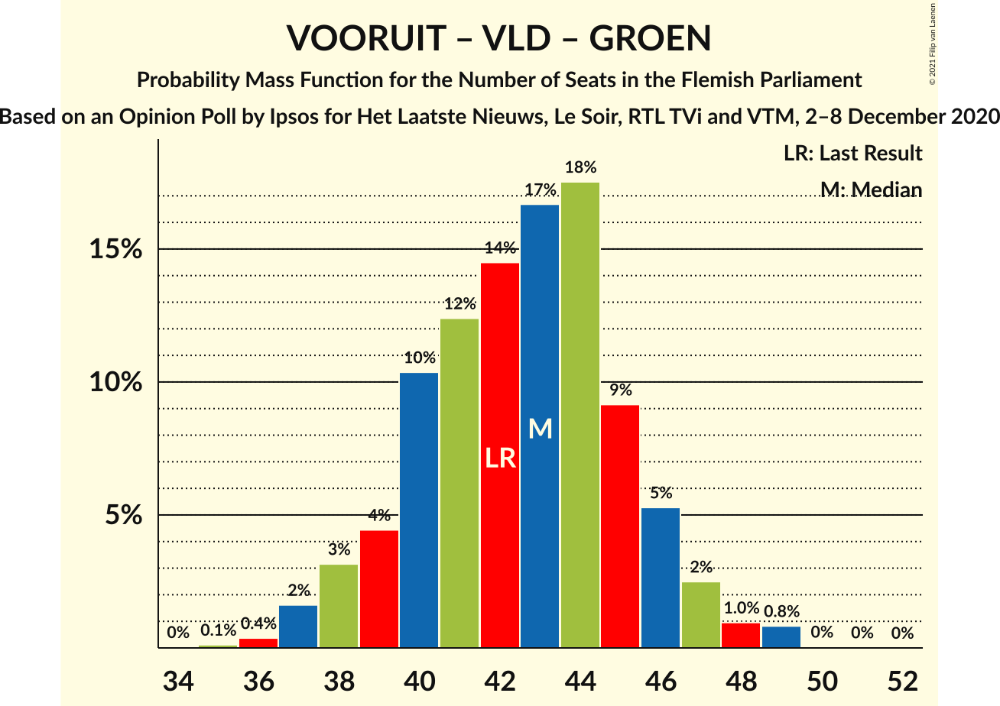

| Number of Seats | Probability | Accumulated | Special Marks |
|:---------------:|:-----------:|:-----------:|:-------------:|
| 35 | 0.1% | 100% |  |
| 36 | 0.4% | 99.8% |  |
| 37 | 2% | 99.5% |  |
| 38 | 3% | 98% |  |
| 39 | 4% | 95% |  |
| 40 | 10% | 90% |  |
| 41 | 12% | 80% |  |
| 42 | 14% | 67% | Last Result |
| 43 | 17% | 53% |  |
| 44 | 18% | 36% | Median |
| 45 | 9% | 19% |  |
| 46 | 5% | 10% |  |
| 47 | 2% | 4% |  |
| 48 | 1.0% | 2% |  |
| 49 | 0.8% | 0.9% |  |
| 50 | 0% | 0.1% |  |
| 51 | 0% | 0% |  |

### Nieuw-Vlaamse Alliantie – Open Vlaamse Liberalen en Democraten

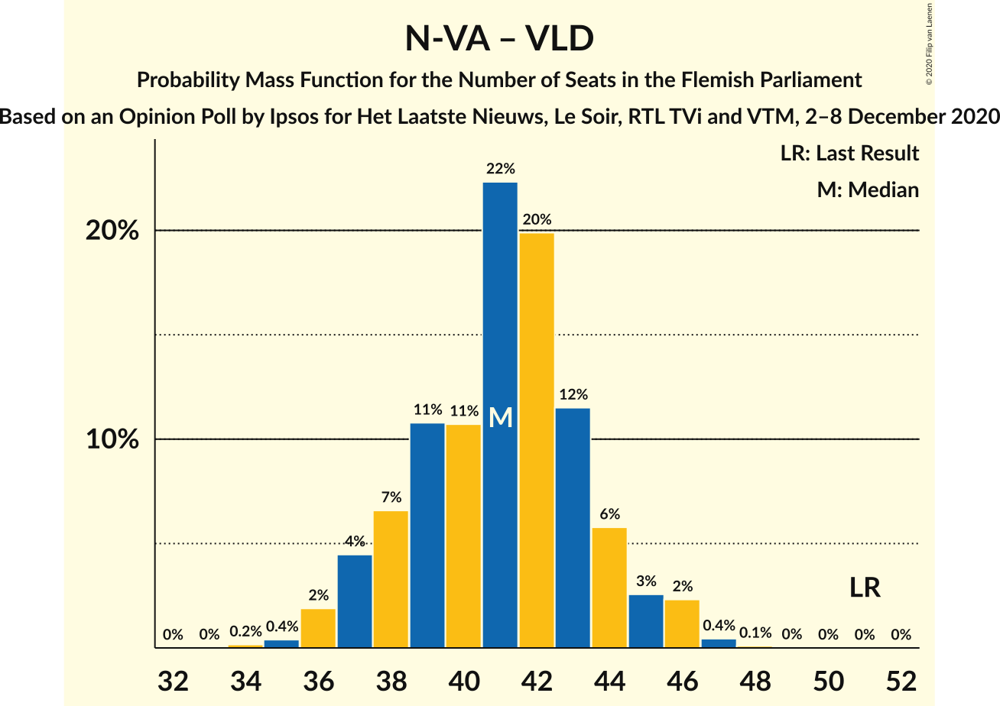

| Number of Seats | Probability | Accumulated | Special Marks |
|:---------------:|:-----------:|:-----------:|:-------------:|
| 34 | 0.2% | 100% |  |
| 35 | 0.4% | 99.8% |  |
| 36 | 2% | 99.4% |  |
| 37 | 4% | 98% |  |
| 38 | 7% | 93% |  |
| 39 | 11% | 86% |  |
| 40 | 11% | 76% |  |
| 41 | 22% | 65% |  |
| 42 | 20% | 43% | Median |
| 43 | 12% | 23% |  |
| 44 | 6% | 11% |  |
| 45 | 3% | 5% |  |
| 46 | 2% | 3% |  |
| 47 | 0.4% | 0.6% |  |
| 48 | 0.1% | 0.1% |  |
| 49 | 0% | 0% |  |
| 50 | 0% | 0% |  |
| 51 | 0% | 0% | Last Result |

### Christen-Democratisch en Vlaams – Open Vlaamse Liberalen en Democraten – Groen

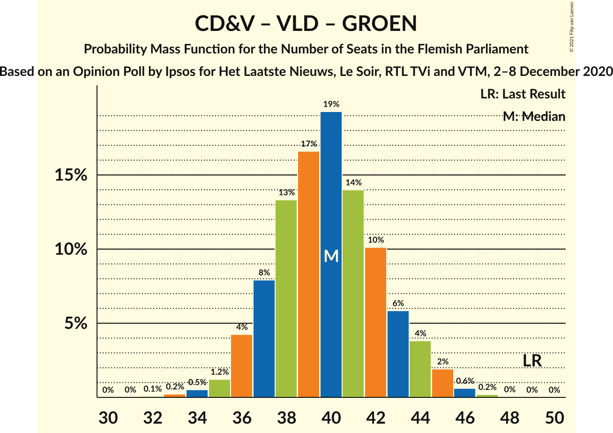

| Number of Seats | Probability | Accumulated | Special Marks |
|:---------------:|:-----------:|:-----------:|:-------------:|
| 32 | 0.1% | 100% |  |
| 33 | 0.2% | 99.9% |  |
| 34 | 0.5% | 99.7% |  |
| 35 | 1.2% | 99.1% |  |
| 36 | 4% | 98% |  |
| 37 | 8% | 94% |  |
| 38 | 13% | 86% |  |
| 39 | 17% | 72% |  |
| 40 | 19% | 56% | Median |
| 41 | 14% | 37% |  |
| 42 | 10% | 23% |  |
| 43 | 6% | 12% |  |
| 44 | 4% | 7% |  |
| 45 | 2% | 3% |  |
| 46 | 0.6% | 0.9% |  |
| 47 | 0.2% | 0.2% |  |
| 48 | 0% | 0.1% |  |
| 49 | 0% | 0% | Last Result |

### Nieuw-Vlaamse Alliantie – Christen-Democratisch en Vlaams

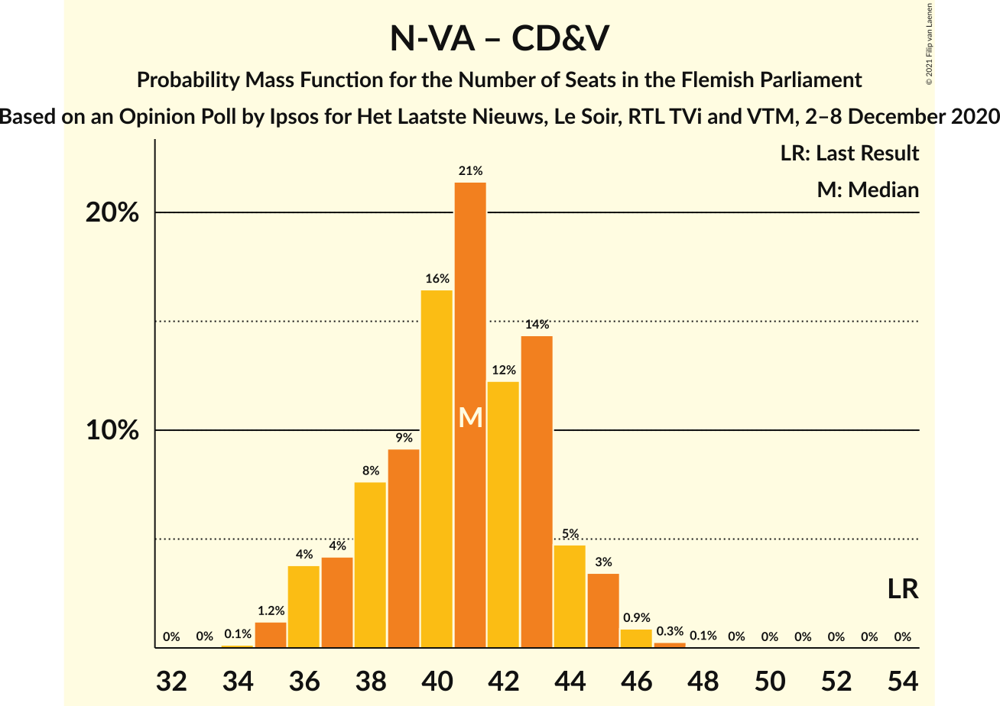

| Number of Seats | Probability | Accumulated | Special Marks |
|:---------------:|:-----------:|:-----------:|:-------------:|
| 34 | 0.1% | 100% |  |
| 35 | 1.2% | 99.8% |  |
| 36 | 4% | 98.6% |  |
| 37 | 4% | 95% |  |
| 38 | 8% | 91% |  |
| 39 | 9% | 83% |  |
| 40 | 16% | 74% |  |
| 41 | 21% | 57% | Median |
| 42 | 12% | 36% |  |
| 43 | 14% | 24% |  |
| 44 | 5% | 9% |  |
| 45 | 3% | 5% |  |
| 46 | 0.9% | 1.2% |  |
| 47 | 0.3% | 0.3% |  |
| 48 | 0.1% | 0.1% |  |
| 49 | 0% | 0% |  |
| 50 | 0% | 0% |  |
| 51 | 0% | 0% |  |
| 52 | 0% | 0% |  |
| 53 | 0% | 0% |  |
| 54 | 0% | 0% | Last Result |

### Vooruit – Christen-Democratisch en Vlaams

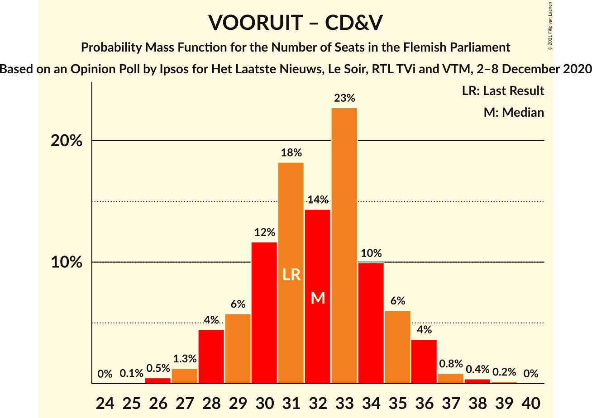

| Number of Seats | Probability | Accumulated | Special Marks |
|:---------------:|:-----------:|:-----------:|:-------------:|
| 25 | 0.1% | 100% |  |
| 26 | 0.5% | 99.9% |  |
| 27 | 1.3% | 99.5% |  |
| 28 | 4% | 98% |  |
| 29 | 6% | 94% |  |
| 30 | 12% | 88% |  |
| 31 | 18% | 76% | Last Result |
| 32 | 14% | 58% | Median |
| 33 | 23% | 44% |  |
| 34 | 10% | 21% |  |
| 35 | 6% | 11% |  |
| 36 | 4% | 5% |  |
| 37 | 0.8% | 1.4% |  |
| 38 | 0.4% | 0.6% |  |
| 39 | 0.2% | 0.2% |  |
| 40 | 0% | 0% |  |

### Vooruit – Open Vlaamse Liberalen en Democraten

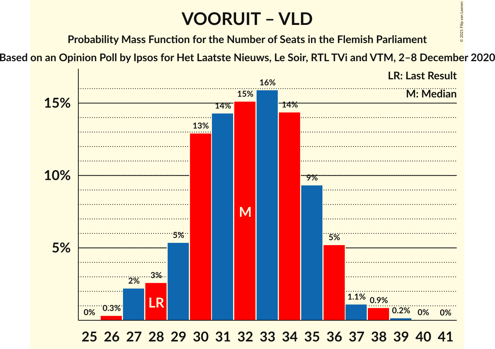

| Number of Seats | Probability | Accumulated | Special Marks |
|:---------------:|:-----------:|:-----------:|:-------------:|
| 26 | 0.3% | 100% |  |
| 27 | 2% | 99.6% |  |
| 28 | 3% | 97% | Last Result |
| 29 | 5% | 95% |  |
| 30 | 13% | 89% |  |
| 31 | 14% | 77% |  |
| 32 | 15% | 62% |  |
| 33 | 16% | 47% | Median |
| 34 | 14% | 31% |  |
| 35 | 9% | 17% |  |
| 36 | 5% | 7% |  |
| 37 | 1.1% | 2% |  |
| 38 | 0.9% | 1.1% |  |
| 39 | 0.2% | 0.2% |  |
| 40 | 0% | 0.1% |  |
| 41 | 0% | 0% |  |

### Christen-Democratisch en Vlaams – Open Vlaamse Liberalen en Democraten

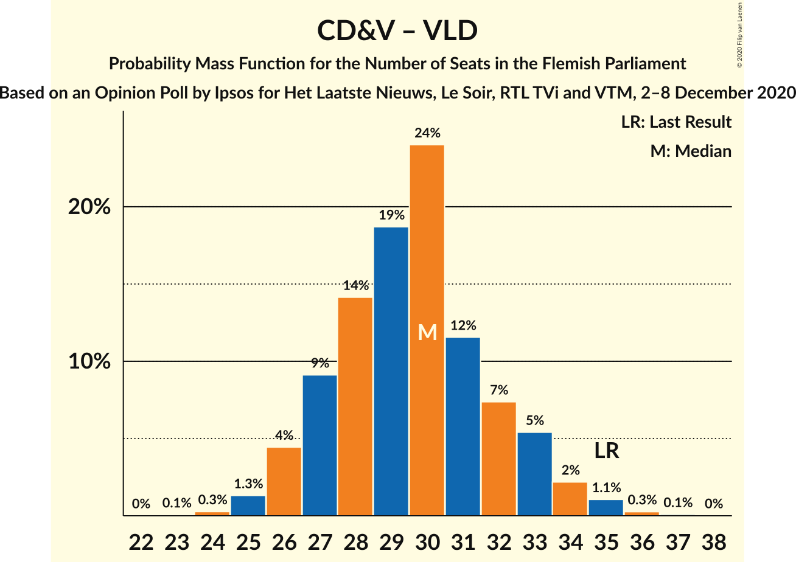

| Number of Seats | Probability | Accumulated | Special Marks |
|:---------------:|:-----------:|:-----------:|:-------------:|
| 23 | 0.1% | 100% |  |
| 24 | 0.3% | 99.9% |  |
| 25 | 1.3% | 99.7% |  |
| 26 | 4% | 98% |  |
| 27 | 9% | 94% |  |
| 28 | 14% | 85% |  |
| 29 | 19% | 71% | Median |
| 30 | 24% | 52% |  |
| 31 | 12% | 28% |  |
| 32 | 7% | 16% |  |
| 33 | 5% | 9% |  |
| 34 | 2% | 4% |  |
| 35 | 1.1% | 1.4% | Last Result |
| 36 | 0.3% | 0.4% |  |
| 37 | 0.1% | 0.1% |  |
| 38 | 0% | 0% |  |

## Technical Information

### Opinion Poll

+ **Polling firm:** Ipsos
+ **Commissioner(s):** Het Laatste Nieuws, Le Soir, RTL TVi and VTM
+ **Fieldwork period:** 2–8 December 2020

### Calculations

+ **Sample size:** 1007
+ **Simulations done:** 1,048,576
+ **Error estimate:** 1.37%

