# Opinion Poll by Ipsos for Het Laatste Nieuws, Le Soir, RTL TVi and VTM, 4–9 March 2021

<a href="#voting-intentions">Voting Intentions</a> | <a href="#seats">Seats</a> | <a href="#coalitions">Coalitions</a> | <a href="#technical-information">Technical Information</a>

## Voting Intentions

### Confidence Intervals

| Party | Last Result | Poll Result | 80% Confidence Interval | 90% Confidence Interval | 95% Confidence Interval | 99% Confidence Interval |
|:-----:|:-----------:|:-----------:|:-----------------------:|:-----------------------:|:-----------------------:|:-----------------------:|
| Vlaams Belang | 18.5% | 23.6% | 21.9–25.3% |21.4–25.8% |21.0–26.3% |20.3–27.2% |
| Nieuw-Vlaamse Alliantie | 24.8% | 20.0% | 18.4–21.7% |18.0–22.1% |17.6–22.6% |16.9–23.4% |
| Christen-Democratisch en Vlaams | 15.4% | 13.2% | 11.9–14.7% |11.6–15.1% |11.3–15.5% |10.7–16.2% |
| Open Vlaamse Liberalen en Democraten | 13.1% | 12.9% | 11.6–14.4% |11.3–14.8% |11.0–15.2% |10.4–15.9% |
| Socialistische Partij Anders | 10.1% | 12.3% | 11.1–13.7% |10.7–14.2% |10.4–14.5% |9.9–15.2% |
| Groen | 10.1% | 8.2% | 7.1–9.4% |6.9–9.7% |6.6–10.0% |6.2–10.6% |
| Partij van de Arbeid van België | 5.3% | 8.2% | 7.1–9.4% |6.9–9.7% |6.6–10.0% |6.2–10.6% |

*Note:* The poll result column reflects the actual value used in the calculations. Published results may vary slightly, and in addition be rounded to fewer digits.

## Seats

### Confidence Intervals

| Party | Last Result | Median | 80% Confidence Interval | 90% Confidence Interval | 95% Confidence Interval | 99% Confidence Interval |
|:-----:|:-----------:|:------:|:-----------------------:|:-----------------------:|:-----------------------:|:-----------------------:|
| <a href="#vlaams-belang">Vlaams Belang</a> | 23 | 31 | 28–34 |27–34 |27–35 |25–36 |
| <a href="#nieuw-vlaamse-alliantie">Nieuw-Vlaamse Alliantie</a> | 35 | 27 | 24–28 |22–29 |22–30 |22–31 |
| <a href="#christen-democratisch-en-vlaams">Christen-Democratisch en Vlaams</a> | 19 | 16 | 14–18 |14–19 |13–20 |12–20 |
| <a href="#open-vlaamse-liberalen-en-democraten">Open Vlaamse Liberalen en Democraten</a> | 16 | 16 | 14–19 |14–19 |14–19 |12–20 |
| <a href="#socialistische-partij-anders">Socialistische Partij Anders</a> | 12 | 15 | 14–18 |13–19 |13–19 |12–19 |
| <a href="#groen">Groen</a> | 14 | 11 | 8–11 |7–13 |7–14 |6–14 |
| <a href="#partij-van-de-arbeid-van-belgië">Partij van de Arbeid van België</a> | 4 | 8 | 7–11 |7–12 |7–13 |5–13 |

### Vlaams Belang

*For a full overview of the results for this party, see the [Vlaams Belang](party-vlaamsbelang.html) page.*

| Number of Seats | Probability | Accumulated | Special Marks |
|:---------------:|:-----------:|:-----------:|:-------------:|
| 23 | 0% | 100% | Last Result |
| 24 | 0.2% | 100% |  |
| 25 | 0.9% | 99.8% |  |
| 26 | 1.3% | 98.8% |  |
| 27 | 3% | 98% |  |
| 28 | 8% | 94% |  |
| 29 | 11% | 86% |  |
| 30 | 25% | 75% |  |
| 31 | 9% | 50% | Median |
| 32 | 14% | 41% |  |
| 33 | 11% | 27% |  |
| 34 | 13% | 16% |  |
| 35 | 2% | 3% |  |
| 36 | 0.4% | 0.8% |  |
| 37 | 0.2% | 0.3% |  |
| 38 | 0.1% | 0.1% |  |
| 39 | 0% | 0% |  |

### Nieuw-Vlaamse Alliantie

*For a full overview of the results for this party, see the [Nieuw-Vlaamse Alliantie](party-nieuw-vlaamsealliantie.html) page.*

| Number of Seats | Probability | Accumulated | Special Marks |
|:---------------:|:-----------:|:-----------:|:-------------:|
| 21 | 0.3% | 100% |  |
| 22 | 5% | 99.7% |  |
| 23 | 4% | 94% |  |
| 24 | 5% | 90% |  |
| 25 | 10% | 85% |  |
| 26 | 12% | 75% |  |
| 27 | 38% | 62% | Median |
| 28 | 19% | 25% |  |
| 29 | 3% | 6% |  |
| 30 | 3% | 3% |  |
| 31 | 0.4% | 0.8% |  |
| 32 | 0.3% | 0.4% |  |
| 33 | 0.1% | 0.1% |  |
| 34 | 0% | 0% |  |
| 35 | 0% | 0% | Last Result |

### Christen-Democratisch en Vlaams

*For a full overview of the results for this party, see the [Christen-Democratisch en Vlaams](party-christen-democratischenvlaams.html) page.*

| Number of Seats | Probability | Accumulated | Special Marks |
|:---------------:|:-----------:|:-----------:|:-------------:|
| 11 | 0.1% | 100% |  |
| 12 | 2% | 99.9% |  |
| 13 | 3% | 98% |  |
| 14 | 22% | 95% |  |
| 15 | 13% | 73% |  |
| 16 | 27% | 60% | Median |
| 17 | 18% | 33% |  |
| 18 | 8% | 15% |  |
| 19 | 3% | 7% | Last Result |
| 20 | 4% | 4% |  |
| 21 | 0.2% | 0.2% |  |
| 22 | 0% | 0% |  |

### Open Vlaamse Liberalen en Democraten

*For a full overview of the results for this party, see the [Open Vlaamse Liberalen en Democraten](party-openvlaamseliberalenendemocraten.html) page.*

| Number of Seats | Probability | Accumulated | Special Marks |
|:---------------:|:-----------:|:-----------:|:-------------:|
| 11 | 0.1% | 100% |  |
| 12 | 0.5% | 99.9% |  |
| 13 | 1.1% | 99.4% |  |
| 14 | 10% | 98% |  |
| 15 | 17% | 89% |  |
| 16 | 29% | 72% | Last Result, Median |
| 17 | 17% | 43% |  |
| 18 | 9% | 26% |  |
| 19 | 17% | 17% |  |
| 20 | 0.4% | 0.5% |  |
| 21 | 0.1% | 0.1% |  |
| 22 | 0.1% | 0.1% |  |
| 23 | 0% | 0% |  |

### Socialistische Partij Anders

*For a full overview of the results for this party, see the [Socialistische Partij Anders](party-socialistischepartijanders.html) page.*

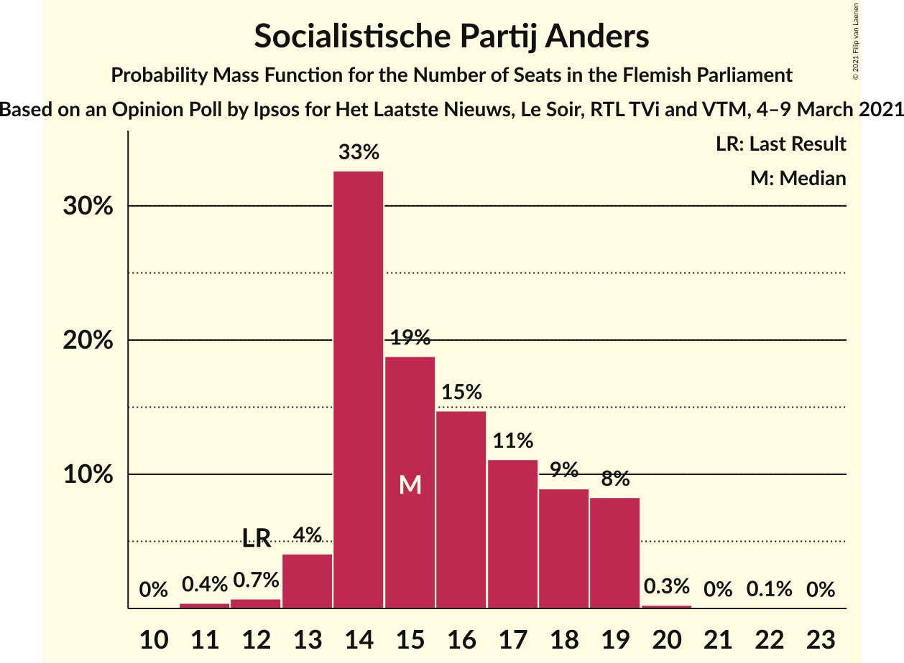

| Number of Seats | Probability | Accumulated | Special Marks |
|:---------------:|:-----------:|:-----------:|:-------------:|
| 11 | 0.4% | 100% |  |
| 12 | 0.7% | 99.6% | Last Result |
| 13 | 4% | 98.9% |  |
| 14 | 33% | 95% |  |
| 15 | 19% | 62% | Median |
| 16 | 15% | 43% |  |
| 17 | 11% | 29% |  |
| 18 | 9% | 18% |  |
| 19 | 8% | 9% |  |
| 20 | 0.3% | 0.3% |  |
| 21 | 0% | 0.1% |  |
| 22 | 0.1% | 0.1% |  |
| 23 | 0% | 0% |  |

### Groen

*For a full overview of the results for this party, see the [Groen](party-groen.html) page.*

| Number of Seats | Probability | Accumulated | Special Marks |
|:---------------:|:-----------:|:-----------:|:-------------:|
| 5 | 0.5% | 100% |  |
| 6 | 2% | 99.5% |  |
| 7 | 5% | 98% |  |
| 8 | 6% | 93% |  |
| 9 | 12% | 87% |  |
| 10 | 17% | 75% |  |
| 11 | 49% | 58% | Median |
| 12 | 3% | 9% |  |
| 13 | 2% | 6% |  |
| 14 | 4% | 4% | Last Result |
| 15 | 0.2% | 0.3% |  |
| 16 | 0.1% | 0.1% |  |
| 17 | 0% | 0% |  |

### Partij van de Arbeid van België

*For a full overview of the results for this party, see the [Partij van de Arbeid van België](party-partijvandearbeidvanbelgië.html) page.*

| Number of Seats | Probability | Accumulated | Special Marks |
|:---------------:|:-----------:|:-----------:|:-------------:|
| 4 | 0.1% | 100% | Last Result |
| 5 | 1.0% | 99.9% |  |
| 6 | 0.6% | 98.9% |  |
| 7 | 36% | 98% |  |
| 8 | 21% | 63% | Median |
| 9 | 13% | 41% |  |
| 10 | 15% | 28% |  |
| 11 | 6% | 14% |  |
| 12 | 4% | 8% |  |
| 13 | 3% | 3% |  |
| 14 | 0.4% | 0.4% |  |
| 15 | 0% | 0% |  |

## Coalitions

### Confidence Intervals

| Coalition | Last Result | Median | Majority? | 80% Confidence Interval | 90% Confidence Interval | 95% Confidence Interval | 99% Confidence Interval |
|:---------:|:-----------:|:------:|:---------:|:-----------------------:|:-----------------------:|:-----------------------:|:-----------------------:|
| Nieuw-Vlaamse Alliantie – Christen-Democratisch en Vlaams – Open Vlaamse Liberalen en Democraten – Socialistische Partij Anders | 82 | 74 | 100% | 71–77 | 70–78 | 69–80 | 68–81 |
| Vlaams Belang – Nieuw-Vlaamse Alliantie – Christen-Democratisch en Vlaams | 77 | 73 | 100% | 70–77 | 69–77 | 68–78 | 66–80 |
| Nieuw-Vlaamse Alliantie – Christen-Democratisch en Vlaams – Open Vlaamse Liberalen en Democraten | 70 | 59 | 8% | 55–62 | 55–63 | 53–64 | 52–65 |
| Christen-Democratisch en Vlaams – Open Vlaamse Liberalen en Democraten – Socialistische Partij Anders – Groen | 61 | 58 | 4% | 55–61 | 54–62 | 54–63 | 52–65 |
| Nieuw-Vlaamse Alliantie – Open Vlaamse Liberalen en Democraten – Socialistische Partij Anders | 63 | 58 | 4% | 55–62 | 54–62 | 54–63 | 52–65 |
| Nieuw-Vlaamse Alliantie – Christen-Democratisch en Vlaams – Socialistische Partij Anders | 66 | 58 | 3% | 55–61 | 54–62 | 53–63 | 52–64 |
| Vlaams Belang – Nieuw-Vlaamse Alliantie | 58 | 57 | 0.9% | 54–60 | 53–61 | 52–62 | 50–63 |
| Christen-Democratisch en Vlaams – Socialistische Partij Anders – Groen – Partij van de Arbeid van België | 49 | 50 | 0% | 47–54 | 46–55 | 46–55 | 45–58 |
| Christen-Democratisch en Vlaams – Open Vlaamse Liberalen en Democraten – Socialistische Partij Anders | 47 | 47 | 0% | 45–51 | 44–52 | 43–53 | 42–54 |
| Christen-Democratisch en Vlaams – Open Vlaamse Liberalen en Democraten – Groen | 49 | 42 | 0% | 40–46 | 39–47 | 38–48 | 37–49 |
| Nieuw-Vlaamse Alliantie – Christen-Democratisch en Vlaams | 54 | 42 | 0% | 39–45 | 38–46 | 38–47 | 36–48 |
| Nieuw-Vlaamse Alliantie – Open Vlaamse Liberalen en Democraten | 51 | 43 | 0% | 40–46 | 39–46 | 38–47 | 37–48 |
| Open Vlaamse Liberalen en Democraten – Socialistische Partij Anders – Groen | 42 | 42 | 0% | 39–45 | 38–47 | 37–47 | 36–49 |
| Christen-Democratisch en Vlaams – Socialistische Partij Anders – Groen | 45 | 42 | 0% | 39–45 | 38–46 | 37–46 | 36–48 |
| Christen-Democratisch en Vlaams – Open Vlaamse Liberalen en Democraten | 35 | 32 | 0% | 30–35 | 29–36 | 28–37 | 27–38 |
| Christen-Democratisch en Vlaams – Socialistische Partij Anders | 31 | 31 | 0% | 29–35 | 28–35 | 28–36 | 26–37 |
| Open Vlaamse Liberalen en Democraten – Socialistische Partij Anders | 28 | 32 | 0% | 29–35 | 29–36 | 28–36 | 27–38 |

### Nieuw-Vlaamse Alliantie – Christen-Democratisch en Vlaams – Open Vlaamse Liberalen en Democraten – Socialistische Partij Anders

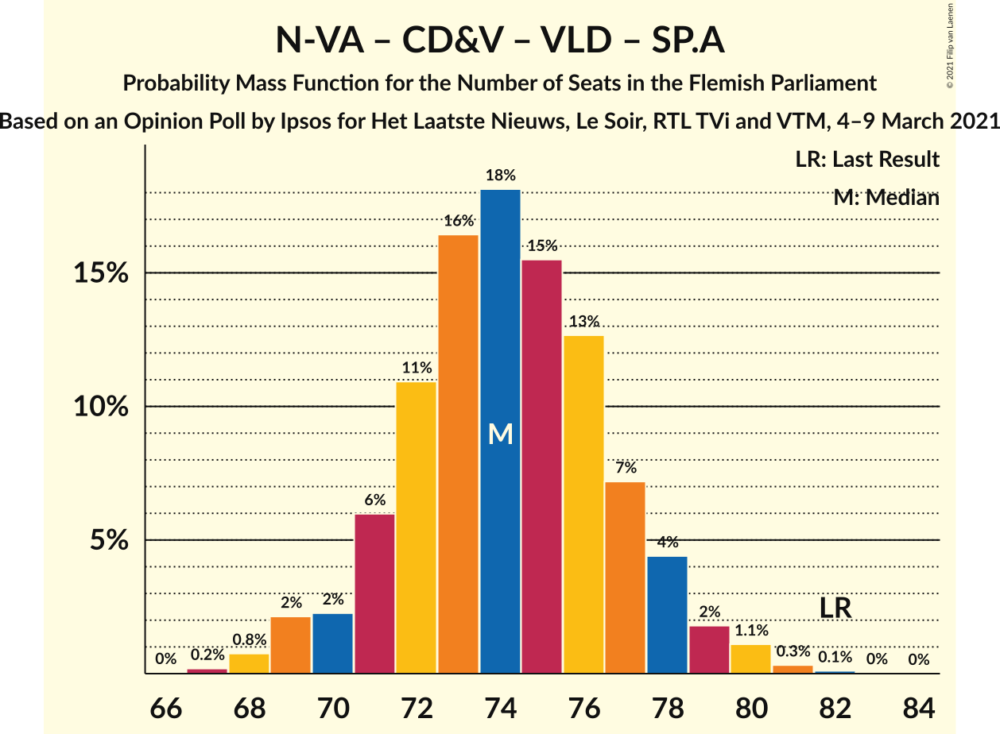

| Number of Seats | Probability | Accumulated | Special Marks |
|:---------------:|:-----------:|:-----------:|:-------------:|
| 67 | 0.1% | 100% |  |
| 68 | 0.5% | 99.8% |  |
| 69 | 2% | 99.4% |  |
| 70 | 3% | 97% |  |
| 71 | 8% | 95% |  |
| 72 | 9% | 87% |  |
| 73 | 15% | 78% |  |
| 74 | 21% | 63% | Median |
| 75 | 15% | 43% |  |
| 76 | 10% | 28% |  |
| 77 | 9% | 18% |  |
| 78 | 4% | 9% |  |
| 79 | 2% | 5% |  |
| 80 | 2% | 3% |  |
| 81 | 0.4% | 0.5% |  |
| 82 | 0.1% | 0.1% | Last Result |
| 83 | 0% | 0% |  |

### Vlaams Belang – Nieuw-Vlaamse Alliantie – Christen-Democratisch en Vlaams

| Number of Seats | Probability | Accumulated | Special Marks |
|:---------------:|:-----------:|:-----------:|:-------------:|
| 65 | 0.2% | 100% |  |
| 66 | 0.9% | 99.7% |  |
| 67 | 0.5% | 98.8% |  |
| 68 | 1.0% | 98% |  |
| 69 | 5% | 97% |  |
| 70 | 9% | 92% |  |
| 71 | 4% | 83% |  |
| 72 | 22% | 79% |  |
| 73 | 14% | 57% |  |
| 74 | 13% | 43% | Median |
| 75 | 12% | 30% |  |
| 76 | 5% | 18% |  |
| 77 | 10% | 13% | Last Result |
| 78 | 2% | 3% |  |
| 79 | 0.4% | 1.0% |  |
| 80 | 0.4% | 0.6% |  |
| 81 | 0.1% | 0.1% |  |
| 82 | 0% | 0% |  |

### Nieuw-Vlaamse Alliantie – Christen-Democratisch en Vlaams – Open Vlaamse Liberalen en Democraten

| Number of Seats | Probability | Accumulated | Special Marks |
|:---------------:|:-----------:|:-----------:|:-------------:|
| 51 | 0.1% | 100% |  |
| 52 | 0.6% | 99.8% |  |
| 53 | 2% | 99.2% |  |
| 54 | 1.0% | 97% |  |
| 55 | 7% | 96% |  |
| 56 | 4% | 89% |  |
| 57 | 13% | 85% |  |
| 58 | 21% | 72% |  |
| 59 | 15% | 51% | Median |
| 60 | 15% | 36% |  |
| 61 | 9% | 21% |  |
| 62 | 5% | 13% |  |
| 63 | 5% | 8% | Majority |
| 64 | 0.8% | 3% |  |
| 65 | 2% | 2% |  |
| 66 | 0.3% | 0.4% |  |
| 67 | 0.1% | 0.1% |  |
| 68 | 0% | 0% |  |
| 69 | 0% | 0% |  |
| 70 | 0% | 0% | Last Result |

### Christen-Democratisch en Vlaams – Open Vlaamse Liberalen en Democraten – Socialistische Partij Anders – Groen

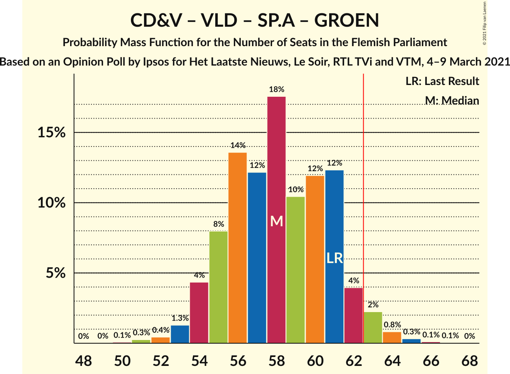

| Number of Seats | Probability | Accumulated | Special Marks |
|:---------------:|:-----------:|:-----------:|:-------------:|
| 50 | 0.1% | 100% |  |
| 51 | 0.3% | 99.9% |  |
| 52 | 0.4% | 99.6% |  |
| 53 | 1.3% | 99.2% |  |
| 54 | 4% | 98% |  |
| 55 | 8% | 94% |  |
| 56 | 14% | 86% |  |
| 57 | 12% | 72% |  |
| 58 | 18% | 60% | Median |
| 59 | 10% | 42% |  |
| 60 | 12% | 32% |  |
| 61 | 12% | 20% | Last Result |
| 62 | 4% | 8% |  |
| 63 | 2% | 4% | Majority |
| 64 | 0.8% | 1.3% |  |
| 65 | 0.3% | 0.5% |  |
| 66 | 0.1% | 0.2% |  |
| 67 | 0.1% | 0.1% |  |
| 68 | 0% | 0% |  |

### Nieuw-Vlaamse Alliantie – Open Vlaamse Liberalen en Democraten – Socialistische Partij Anders

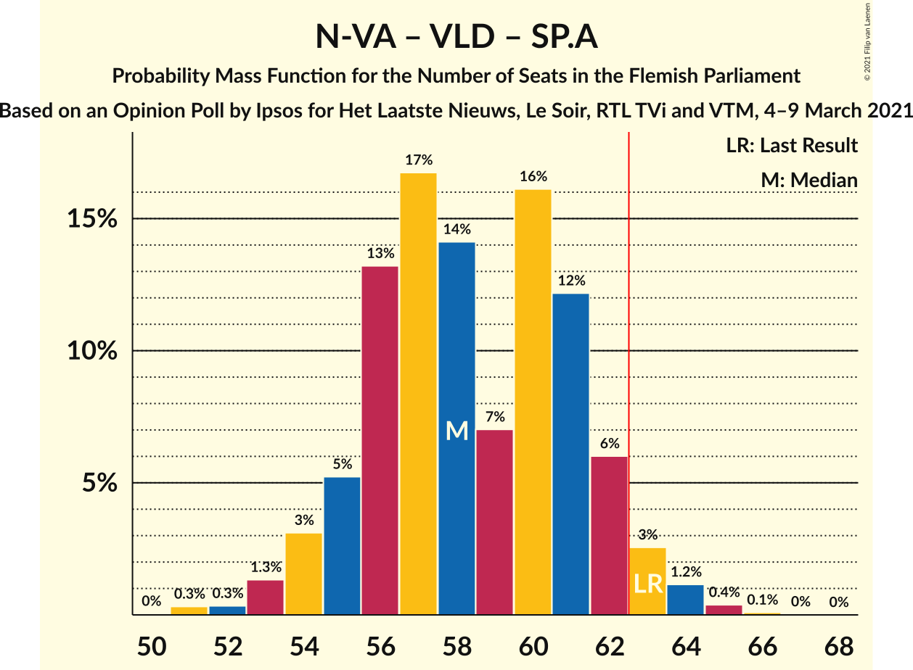

| Number of Seats | Probability | Accumulated | Special Marks |
|:---------------:|:-----------:|:-----------:|:-------------:|
| 50 | 0% | 100% |  |
| 51 | 0.3% | 99.9% |  |
| 52 | 0.3% | 99.6% |  |
| 53 | 1.3% | 99.3% |  |
| 54 | 3% | 98% |  |
| 55 | 5% | 95% |  |
| 56 | 13% | 90% |  |
| 57 | 17% | 76% |  |
| 58 | 14% | 60% | Median |
| 59 | 7% | 46% |  |
| 60 | 16% | 39% |  |
| 61 | 12% | 22% |  |
| 62 | 6% | 10% |  |
| 63 | 3% | 4% | Last Result, Majority |
| 64 | 1.2% | 2% |  |
| 65 | 0.4% | 0.5% |  |
| 66 | 0.1% | 0.1% |  |
| 67 | 0% | 0% |  |

### Nieuw-Vlaamse Alliantie – Christen-Democratisch en Vlaams – Socialistische Partij Anders

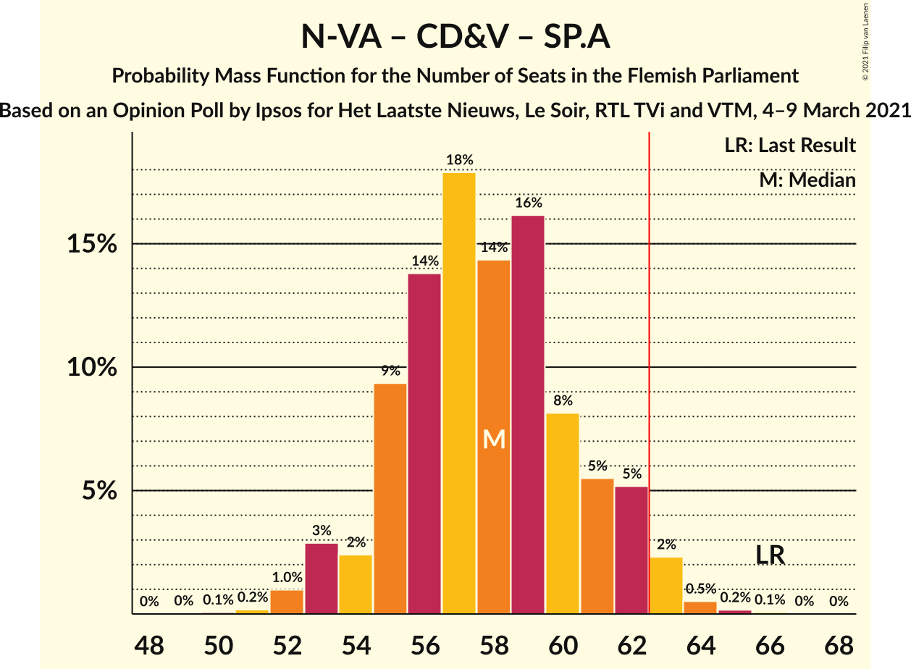

| Number of Seats | Probability | Accumulated | Special Marks |
|:---------------:|:-----------:|:-----------:|:-------------:|
| 50 | 0.1% | 100% |  |
| 51 | 0.2% | 99.9% |  |
| 52 | 1.0% | 99.7% |  |
| 53 | 3% | 98.7% |  |
| 54 | 2% | 96% |  |
| 55 | 9% | 93% |  |
| 56 | 14% | 84% |  |
| 57 | 18% | 70% |  |
| 58 | 14% | 52% | Median |
| 59 | 16% | 38% |  |
| 60 | 8% | 22% |  |
| 61 | 5% | 14% |  |
| 62 | 5% | 8% |  |
| 63 | 2% | 3% | Majority |
| 64 | 0.5% | 0.8% |  |
| 65 | 0.2% | 0.3% |  |
| 66 | 0.1% | 0.1% | Last Result |
| 67 | 0% | 0% |  |

### Vlaams Belang – Nieuw-Vlaamse Alliantie

| Number of Seats | Probability | Accumulated | Special Marks |
|:---------------:|:-----------:|:-----------:|:-------------:|
| 48 | 0% | 100% |  |
| 49 | 0.2% | 99.9% |  |
| 50 | 0.3% | 99.8% |  |
| 51 | 0.6% | 99.5% |  |
| 52 | 1.4% | 98.8% |  |
| 53 | 4% | 97% |  |
| 54 | 9% | 93% |  |
| 55 | 10% | 84% |  |
| 56 | 11% | 74% |  |
| 57 | 15% | 63% |  |
| 58 | 13% | 48% | Last Result, Median |
| 59 | 11% | 35% |  |
| 60 | 16% | 24% |  |
| 61 | 4% | 8% |  |
| 62 | 3% | 4% |  |
| 63 | 0.6% | 0.9% | Majority |
| 64 | 0.2% | 0.3% |  |
| 65 | 0% | 0.1% |  |
| 66 | 0% | 0% |  |

### Christen-Democratisch en Vlaams – Socialistische Partij Anders – Groen – Partij van de Arbeid van België

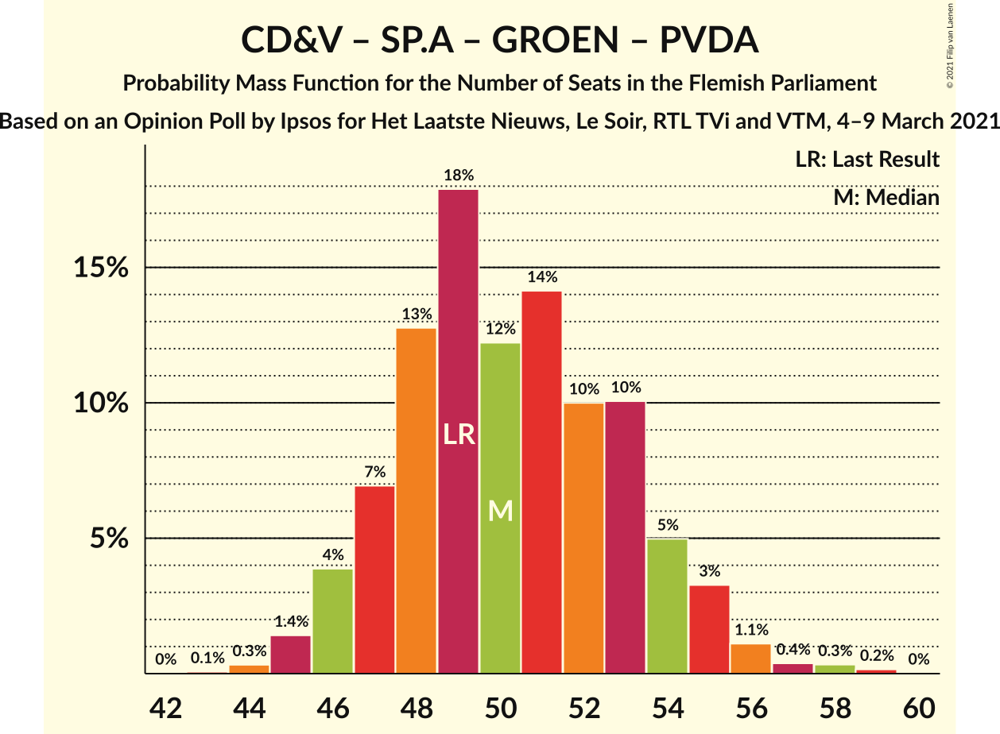

| Number of Seats | Probability | Accumulated | Special Marks |
|:---------------:|:-----------:|:-----------:|:-------------:|
| 43 | 0.1% | 100% |  |
| 44 | 0.3% | 99.9% |  |
| 45 | 1.4% | 99.6% |  |
| 46 | 4% | 98% |  |
| 47 | 7% | 94% |  |
| 48 | 13% | 87% |  |
| 49 | 18% | 75% | Last Result |
| 50 | 12% | 57% | Median |
| 51 | 14% | 44% |  |
| 52 | 10% | 30% |  |
| 53 | 10% | 20% |  |
| 54 | 5% | 10% |  |
| 55 | 3% | 5% |  |
| 56 | 1.1% | 2% |  |
| 57 | 0.4% | 0.9% |  |
| 58 | 0.3% | 0.5% |  |
| 59 | 0.2% | 0.2% |  |
| 60 | 0% | 0% |  |

### Christen-Democratisch en Vlaams – Open Vlaamse Liberalen en Democraten – Socialistische Partij Anders

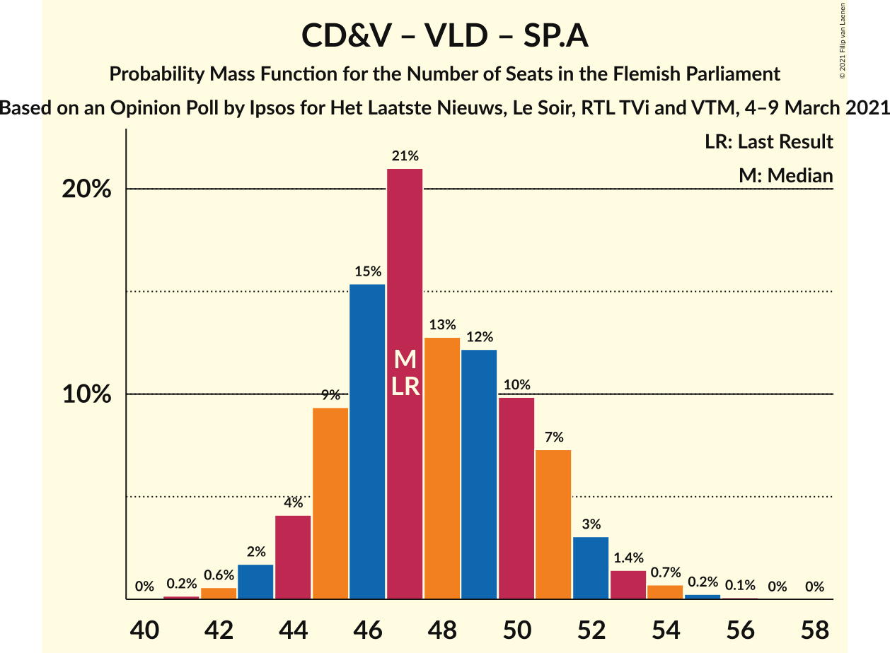

| Number of Seats | Probability | Accumulated | Special Marks |
|:---------------:|:-----------:|:-----------:|:-------------:|
| 41 | 0.1% | 100% |  |
| 42 | 0.6% | 99.8% |  |
| 43 | 2% | 99.3% |  |
| 44 | 4% | 97% |  |
| 45 | 8% | 94% |  |
| 46 | 16% | 86% |  |
| 47 | 25% | 70% | Last Result, Median |
| 48 | 8% | 45% |  |
| 49 | 12% | 38% |  |
| 50 | 9% | 26% |  |
| 51 | 10% | 17% |  |
| 52 | 4% | 7% |  |
| 53 | 2% | 3% |  |
| 54 | 0.7% | 0.9% |  |
| 55 | 0.2% | 0.3% |  |
| 56 | 0.1% | 0.1% |  |
| 57 | 0% | 0% |  |

### Christen-Democratisch en Vlaams – Open Vlaamse Liberalen en Democraten – Groen

| Number of Seats | Probability | Accumulated | Special Marks |
|:---------------:|:-----------:|:-----------:|:-------------:|
| 35 | 0.1% | 100% |  |
| 36 | 0.3% | 99.8% |  |
| 37 | 1.0% | 99.5% |  |
| 38 | 2% | 98.5% |  |
| 39 | 4% | 96% |  |
| 40 | 15% | 92% |  |
| 41 | 12% | 77% |  |
| 42 | 19% | 65% |  |
| 43 | 7% | 45% | Median |
| 44 | 16% | 38% |  |
| 45 | 8% | 23% |  |
| 46 | 9% | 15% |  |
| 47 | 2% | 6% |  |
| 48 | 2% | 4% |  |
| 49 | 1.1% | 1.3% | Last Result |
| 50 | 0.1% | 0.2% |  |
| 51 | 0% | 0.1% |  |
| 52 | 0% | 0% |  |

### Nieuw-Vlaamse Alliantie – Christen-Democratisch en Vlaams

| Number of Seats | Probability | Accumulated | Special Marks |
|:---------------:|:-----------:|:-----------:|:-------------:|
| 35 | 0.1% | 100% |  |
| 36 | 1.2% | 99.9% |  |
| 37 | 1.2% | 98.8% |  |
| 38 | 3% | 98% |  |
| 39 | 8% | 95% |  |
| 40 | 6% | 87% |  |
| 41 | 16% | 81% |  |
| 42 | 20% | 66% |  |
| 43 | 16% | 46% | Median |
| 44 | 15% | 30% |  |
| 45 | 7% | 15% |  |
| 46 | 4% | 7% |  |
| 47 | 3% | 4% |  |
| 48 | 0.7% | 0.8% |  |
| 49 | 0.1% | 0.2% |  |
| 50 | 0% | 0.1% |  |
| 51 | 0% | 0% |  |
| 52 | 0% | 0% |  |
| 53 | 0% | 0% |  |
| 54 | 0% | 0% | Last Result |

### Nieuw-Vlaamse Alliantie – Open Vlaamse Liberalen en Democraten

| Number of Seats | Probability | Accumulated | Special Marks |
|:---------------:|:-----------:|:-----------:|:-------------:|
| 35 | 0% | 100% |  |
| 36 | 0.3% | 99.9% |  |
| 37 | 2% | 99.7% |  |
| 38 | 3% | 98% |  |
| 39 | 2% | 95% |  |
| 40 | 5% | 94% |  |
| 41 | 12% | 89% |  |
| 42 | 22% | 77% |  |
| 43 | 13% | 54% | Median |
| 44 | 20% | 41% |  |
| 45 | 9% | 22% |  |
| 46 | 10% | 13% |  |
| 47 | 1.4% | 3% |  |
| 48 | 0.9% | 1.3% |  |
| 49 | 0.3% | 0.4% |  |
| 50 | 0.1% | 0.1% |  |
| 51 | 0% | 0% | Last Result |

### Open Vlaamse Liberalen en Democraten – Socialistische Partij Anders – Groen

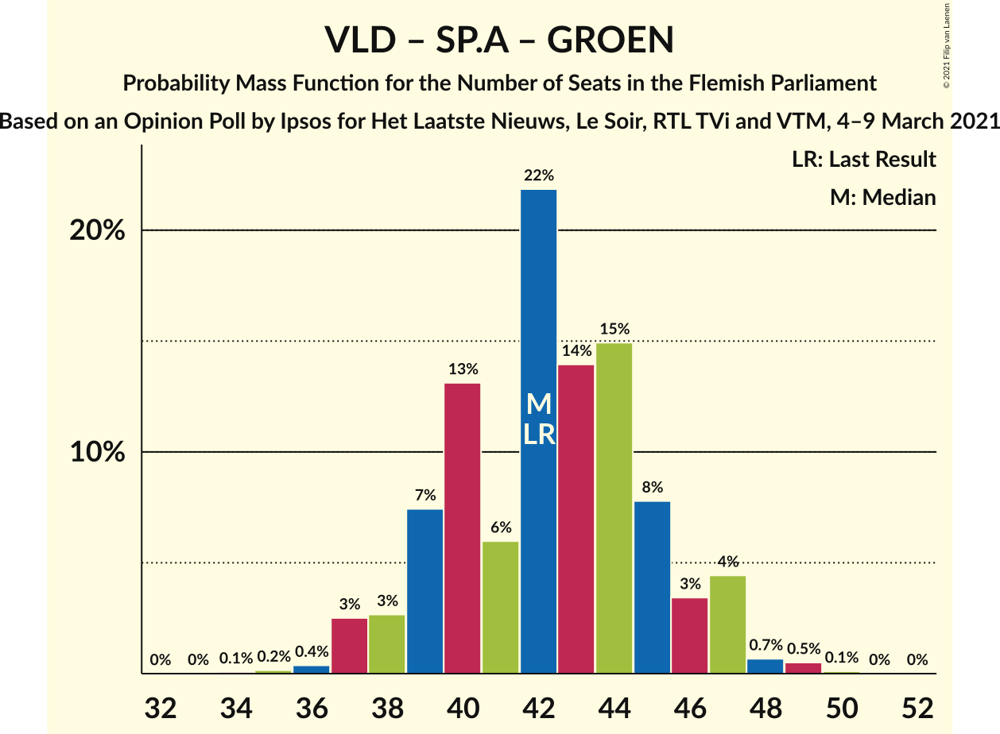

| Number of Seats | Probability | Accumulated | Special Marks |
|:---------------:|:-----------:|:-----------:|:-------------:|
| 34 | 0.1% | 100% |  |
| 35 | 0.2% | 99.9% |  |
| 36 | 0.4% | 99.8% |  |
| 37 | 3% | 99.4% |  |
| 38 | 3% | 97% |  |
| 39 | 7% | 94% |  |
| 40 | 13% | 87% |  |
| 41 | 6% | 74% |  |
| 42 | 22% | 68% | Last Result, Median |
| 43 | 14% | 46% |  |
| 44 | 15% | 32% |  |
| 45 | 8% | 17% |  |
| 46 | 3% | 9% |  |
| 47 | 4% | 6% |  |
| 48 | 0.7% | 1.3% |  |
| 49 | 0.5% | 0.6% |  |
| 50 | 0.1% | 0.1% |  |
| 51 | 0% | 0% |  |

### Christen-Democratisch en Vlaams – Socialistische Partij Anders – Groen

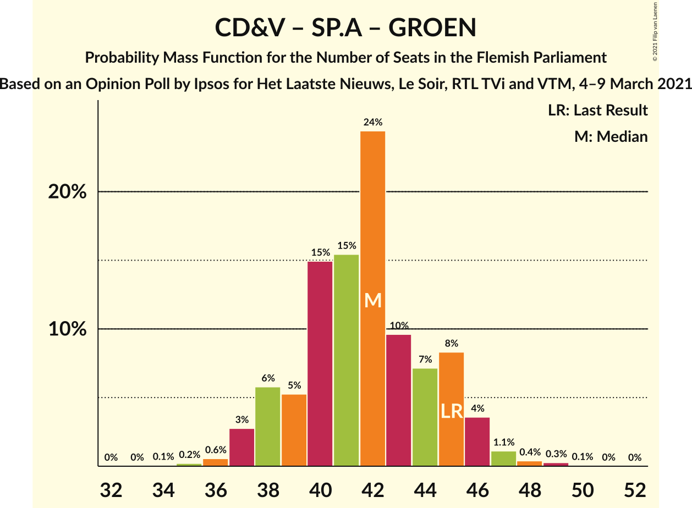

| Number of Seats | Probability | Accumulated | Special Marks |
|:---------------:|:-----------:|:-----------:|:-------------:|
| 34 | 0.1% | 100% |  |
| 35 | 0.2% | 99.9% |  |
| 36 | 0.6% | 99.7% |  |
| 37 | 3% | 99.1% |  |
| 38 | 6% | 96% |  |
| 39 | 5% | 91% |  |
| 40 | 15% | 85% |  |
| 41 | 15% | 70% |  |
| 42 | 24% | 55% | Median |
| 43 | 10% | 31% |  |
| 44 | 7% | 21% |  |
| 45 | 8% | 14% | Last Result |
| 46 | 4% | 5% |  |
| 47 | 1.1% | 2% |  |
| 48 | 0.4% | 0.7% |  |
| 49 | 0.3% | 0.4% |  |
| 50 | 0.1% | 0.1% |  |
| 51 | 0% | 0% |  |

### Christen-Democratisch en Vlaams – Open Vlaamse Liberalen en Democraten

| Number of Seats | Probability | Accumulated | Special Marks |
|:---------------:|:-----------:|:-----------:|:-------------:|
| 26 | 0.2% | 100% |  |
| 27 | 0.6% | 99.8% |  |
| 28 | 3% | 99.2% |  |
| 29 | 4% | 97% |  |
| 30 | 17% | 93% |  |
| 31 | 17% | 76% |  |
| 32 | 14% | 59% | Median |
| 33 | 18% | 45% |  |
| 34 | 7% | 27% |  |
| 35 | 13% | 20% | Last Result |
| 36 | 3% | 7% |  |
| 37 | 1.3% | 4% |  |
| 38 | 2% | 2% |  |
| 39 | 0.2% | 0.3% |  |
| 40 | 0% | 0% |  |

### Christen-Democratisch en Vlaams – Socialistische Partij Anders

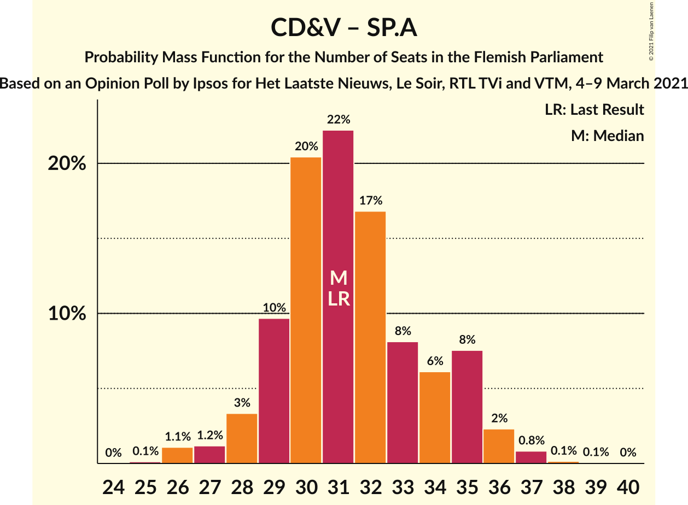

| Number of Seats | Probability | Accumulated | Special Marks |
|:---------------:|:-----------:|:-----------:|:-------------:|
| 25 | 0.1% | 100% |  |
| 26 | 1.1% | 99.9% |  |
| 27 | 1.2% | 98.8% |  |
| 28 | 3% | 98% |  |
| 29 | 10% | 94% |  |
| 30 | 20% | 85% |  |
| 31 | 22% | 64% | Last Result, Median |
| 32 | 17% | 42% |  |
| 33 | 8% | 25% |  |
| 34 | 6% | 17% |  |
| 35 | 8% | 11% |  |
| 36 | 2% | 3% |  |
| 37 | 0.8% | 1.1% |  |
| 38 | 0.1% | 0.2% |  |
| 39 | 0.1% | 0.1% |  |
| 40 | 0% | 0% |  |

### Open Vlaamse Liberalen en Democraten – Socialistische Partij Anders

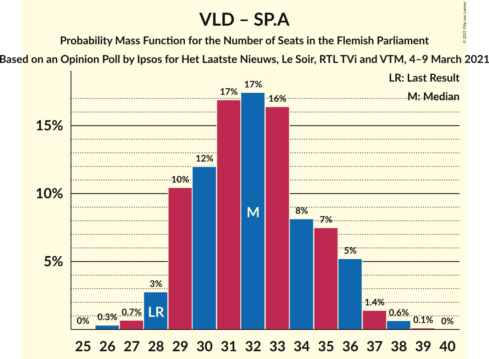

| Number of Seats | Probability | Accumulated | Special Marks |
|:---------------:|:-----------:|:-----------:|:-------------:|
| 25 | 0% | 100% |  |
| 26 | 0.3% | 99.9% |  |
| 27 | 0.7% | 99.6% |  |
| 28 | 3% | 99.0% | Last Result |
| 29 | 10% | 96% |  |
| 30 | 12% | 86% |  |
| 31 | 17% | 74% | Median |
| 32 | 17% | 57% |  |
| 33 | 16% | 39% |  |
| 34 | 8% | 23% |  |
| 35 | 7% | 15% |  |
| 36 | 5% | 7% |  |
| 37 | 1.4% | 2% |  |
| 38 | 0.6% | 0.8% |  |
| 39 | 0.1% | 0.1% |  |
| 40 | 0% | 0% |  |

## Technical Information

### Opinion Poll

+ **Polling firm:** Ipsos
+ **Commissioner(s):** Het Laatste Nieuws, Le Soir, RTL TVi and VTM
+ **Fieldwork period:** 4–9 March 2021

### Calculations

+ **Sample size:** 1006
+ **Simulations done:** 131,072
+ **Error estimate:** 1.30%

