# Opinion Poll by TNS for De Standaard and VRT, 29 March–19 April 2021

<a href="#voting-intentions">Voting Intentions</a> | <a href="#seats">Seats</a> | <a href="#coalitions">Coalitions</a> | <a href="#technical-information">Technical Information</a>

## Voting Intentions

### Confidence Intervals

| Party | Last Result | Poll Result | 80% Confidence Interval | 90% Confidence Interval | 95% Confidence Interval | 99% Confidence Interval |
|:-----:|:-----------:|:-----------:|:-----------------------:|:-----------------------:|:-----------------------:|:-----------------------:|
| Vlaams Belang | 18.5% | 24.7% | 23.5–26.0% |23.2–26.4% |22.8–26.7% |22.3–27.4% |
| Nieuw-Vlaamse Alliantie | 24.8% | 21.5% | 20.4–22.8% |20.0–23.1% |19.8–23.5% |19.2–24.1% |
| Vooruit | 10.1% | 12.0% | 11.1–13.0% |10.8–13.3% |10.6–13.5% |10.2–14.0% |
| Open Vlaamse Liberalen en Democraten | 13.1% | 11.5% | 10.6–12.5% |10.4–12.8% |10.2–13.0% |9.8–13.5% |
| Groen | 10.1% | 10.9% | 10.0–11.9% |9.8–12.1% |9.6–12.4% |9.2–12.9% |
| Christen-Democratisch en Vlaams | 15.4% | 10.0% | 9.2–10.9% |8.9–11.2% |8.7–11.4% |8.4–11.9% |
| Partij van de Arbeid van België | 5.3% | 7.9% | 7.2–8.8% |7.0–9.0% |6.8–9.2% |6.4–9.6% |

*Note:* The poll result column reflects the actual value used in the calculations. Published results may vary slightly, and in addition be rounded to fewer digits.

## Seats

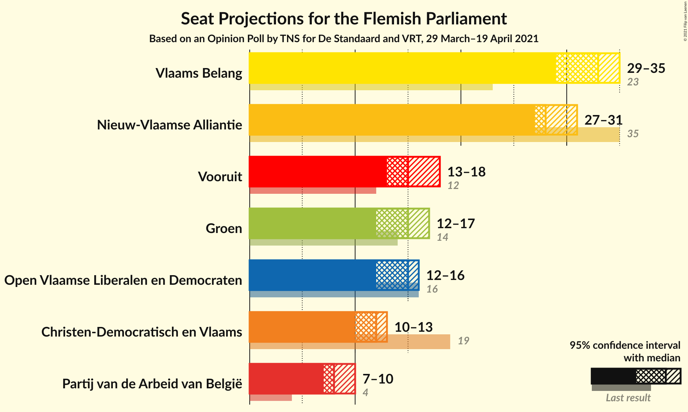

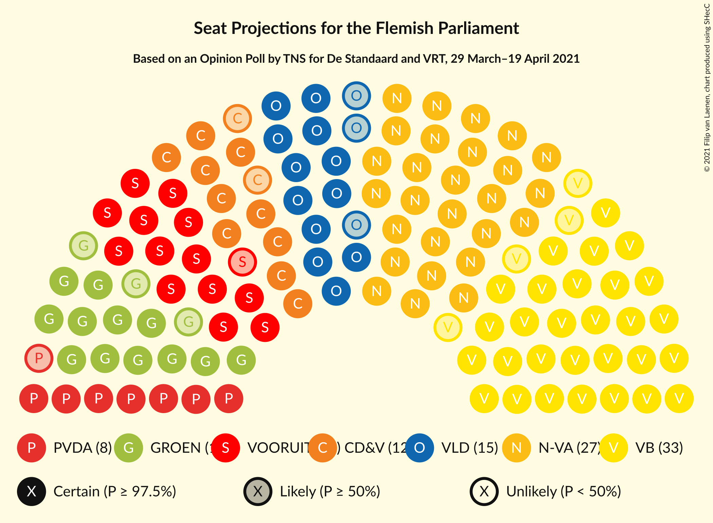

### Confidence Intervals

| Party | Last Result | Median | 80% Confidence Interval | 90% Confidence Interval | 95% Confidence Interval | 99% Confidence Interval |
|:-----:|:-----------:|:------:|:-----------------------:|:-----------------------:|:-----------------------:|:-----------------------:|
| <a href="#vlaams-belang">Vlaams Belang</a> | 23 | 33 | 30–34 |30–35 |29–35 |28–36 |
| <a href="#nieuw-vlaamse-alliantie">Nieuw-Vlaamse Alliantie</a> | 35 | 28 | 27–29 |27–30 |27–31 |25–33 |
| <a href="#vooruit">Vooruit</a> | 12 | 15 | 14–16 |13–17 |13–18 |13–18 |
| <a href="#open-vlaamse-liberalen-en-democraten">Open Vlaamse Liberalen en Democraten</a> | 16 | 15 | 13–16 |12–16 |12–16 |11–17 |
| <a href="#groen">Groen</a> | 14 | 15 | 14–15 |13–16 |12–16 |11–18 |
| <a href="#christen-democratisch-en-vlaams">Christen-Democratisch en Vlaams</a> | 19 | 12 | 10–12 |10–13 |10–14 |10–14 |
| <a href="#partij-van-de-arbeid-van-belgië">Partij van de Arbeid van België</a> | 4 | 8 | 7–9 |7–9 |7–10 |6–12 |

### Vlaams Belang

*For a full overview of the results for this party, see the [Vlaams Belang](party-vlaamsbelang.html) page.*

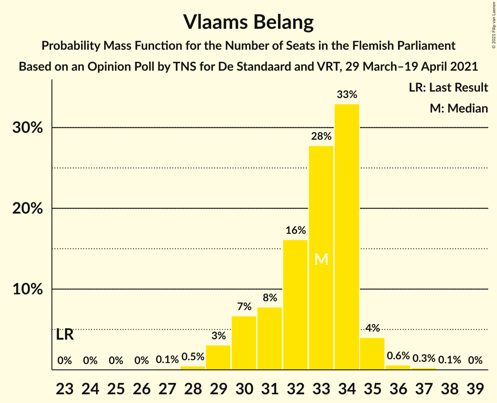

| Number of Seats | Probability | Accumulated | Special Marks |
|:---------------:|:-----------:|:-----------:|:-------------:|
| 23 | 0% | 100% | Last Result |
| 24 | 0% | 100% |  |
| 25 | 0% | 100% |  |
| 26 | 0% | 100% |  |
| 27 | 0.1% | 100% |  |
| 28 | 0.5% | 99.9% |  |
| 29 | 3% | 99.4% |  |
| 30 | 7% | 96% |  |
| 31 | 8% | 90% |  |
| 32 | 16% | 82% |  |
| 33 | 28% | 66% | Median |
| 34 | 33% | 38% |  |
| 35 | 4% | 5% |  |
| 36 | 0.6% | 1.0% |  |
| 37 | 0.3% | 0.4% |  |
| 38 | 0.1% | 0.1% |  |
| 39 | 0% | 0% |  |

### Nieuw-Vlaamse Alliantie

*For a full overview of the results for this party, see the [Nieuw-Vlaamse Alliantie](party-nieuw-vlaamsealliantie.html) page.*

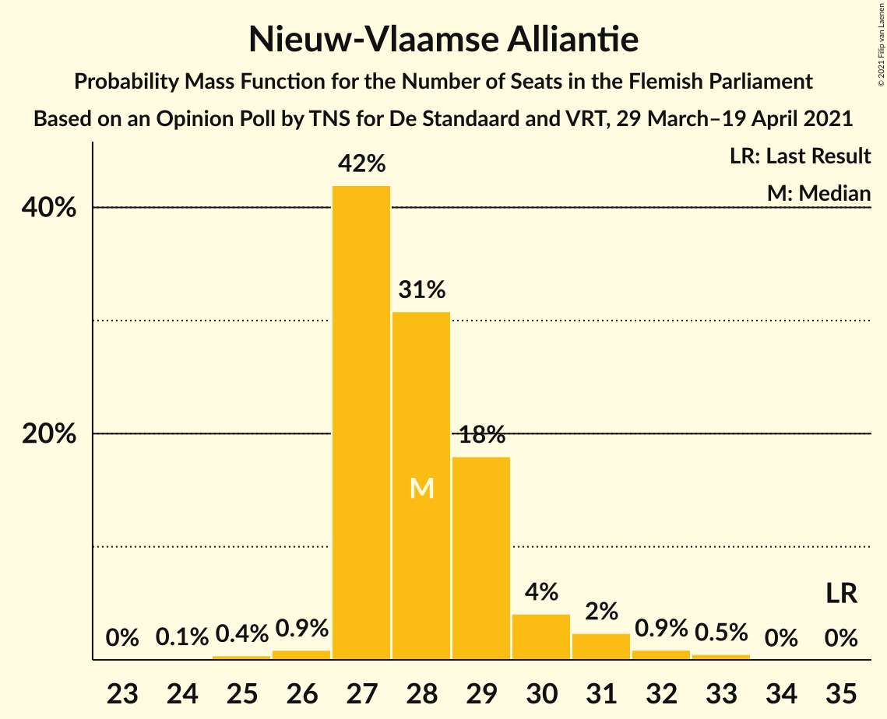

| Number of Seats | Probability | Accumulated | Special Marks |
|:---------------:|:-----------:|:-----------:|:-------------:|
| 24 | 0.1% | 100% |  |
| 25 | 0.4% | 99.9% |  |
| 26 | 0.9% | 99.5% |  |
| 27 | 42% | 98.6% |  |
| 28 | 31% | 57% | Median |
| 29 | 18% | 26% |  |
| 30 | 4% | 8% |  |
| 31 | 2% | 4% |  |
| 32 | 0.9% | 1.4% |  |
| 33 | 0.5% | 0.5% |  |
| 34 | 0% | 0% |  |
| 35 | 0% | 0% | Last Result |

### Vooruit

*For a full overview of the results for this party, see the [Vooruit](party-vooruit.html) page.*

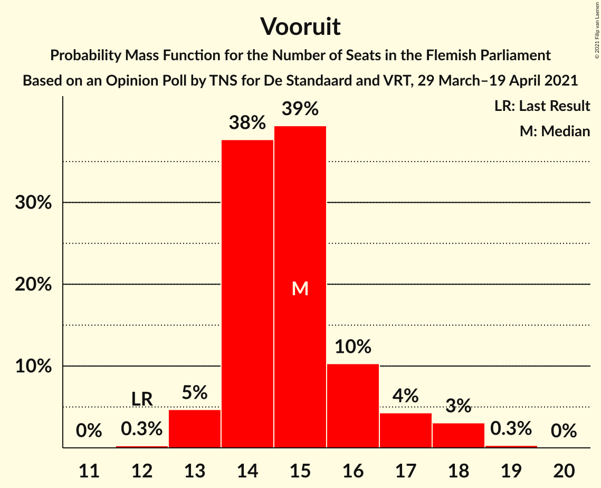

| Number of Seats | Probability | Accumulated | Special Marks |
|:---------------:|:-----------:|:-----------:|:-------------:|
| 12 | 0.3% | 100% | Last Result |
| 13 | 5% | 99.6% |  |
| 14 | 38% | 95% |  |
| 15 | 38% | 57% | Median |
| 16 | 11% | 19% |  |
| 17 | 5% | 7% |  |
| 18 | 3% | 3% |  |
| 19 | 0.2% | 0.2% |  |
| 20 | 0% | 0% |  |

### Open Vlaamse Liberalen en Democraten

*For a full overview of the results for this party, see the [Open Vlaamse Liberalen en Democraten](party-openvlaamseliberalenendemocraten.html) page.*

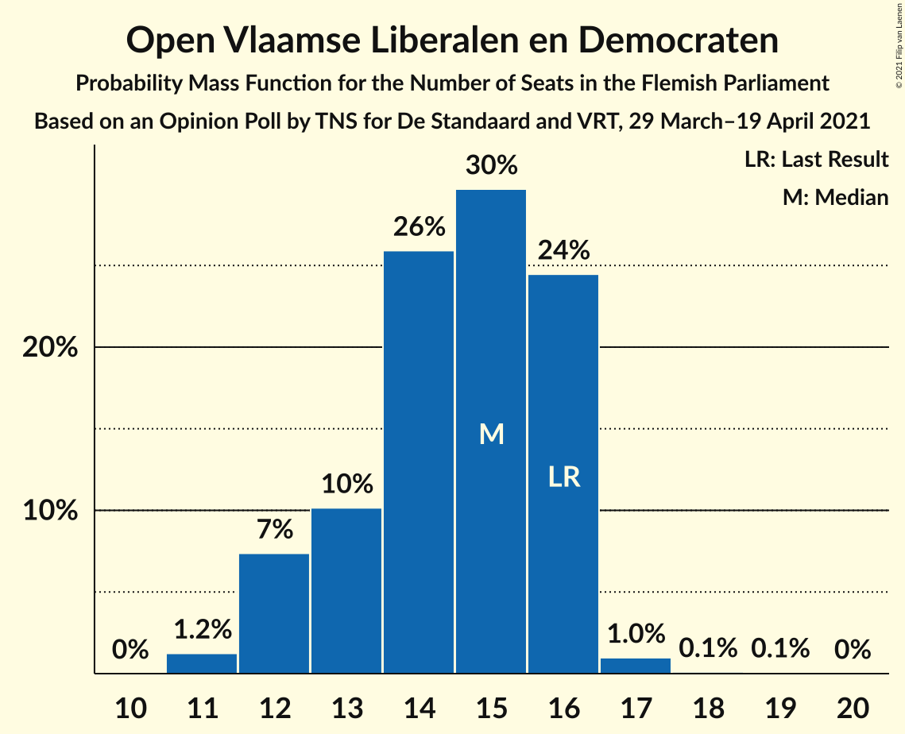

| Number of Seats | Probability | Accumulated | Special Marks |
|:---------------:|:-----------:|:-----------:|:-------------:|
| 11 | 1.3% | 100% |  |
| 12 | 7% | 98.7% |  |
| 13 | 10% | 92% |  |
| 14 | 27% | 81% |  |
| 15 | 29% | 55% | Median |
| 16 | 24% | 26% | Last Result |
| 17 | 1.1% | 1.3% |  |
| 18 | 0.1% | 0.2% |  |
| 19 | 0.1% | 0.1% |  |
| 20 | 0% | 0% |  |

### Groen

*For a full overview of the results for this party, see the [Groen](party-groen.html) page.*

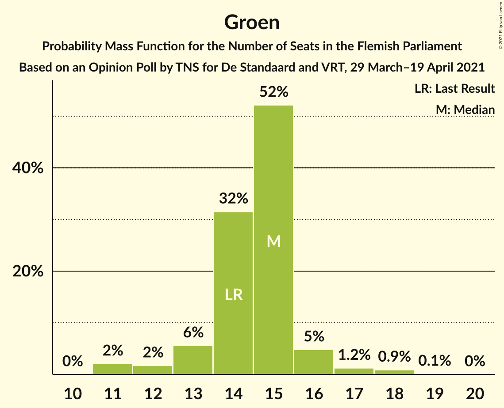

| Number of Seats | Probability | Accumulated | Special Marks |
|:---------------:|:-----------:|:-----------:|:-------------:|
| 11 | 2% | 100% |  |
| 12 | 2% | 98% |  |
| 13 | 6% | 96% |  |
| 14 | 32% | 91% | Last Result |
| 15 | 52% | 59% | Median |
| 16 | 5% | 7% |  |
| 17 | 1.2% | 2% |  |
| 18 | 0.9% | 1.0% |  |
| 19 | 0.1% | 0.1% |  |
| 20 | 0% | 0% |  |

### Christen-Democratisch en Vlaams

*For a full overview of the results for this party, see the [Christen-Democratisch en Vlaams](party-christen-democratischenvlaams.html) page.*

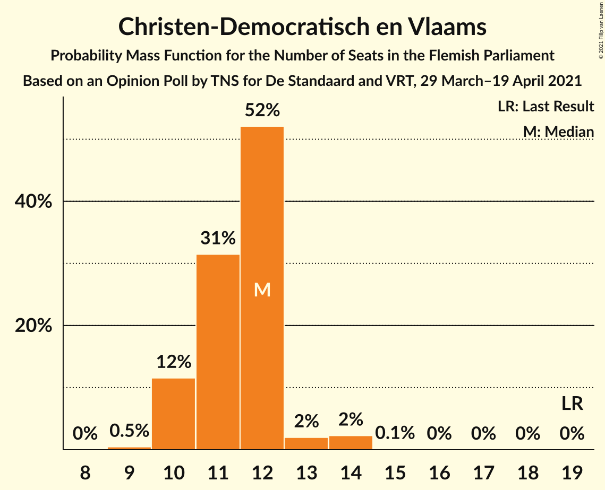

| Number of Seats | Probability | Accumulated | Special Marks |
|:---------------:|:-----------:|:-----------:|:-------------:|
| 9 | 0.4% | 100% |  |
| 10 | 10% | 99.5% |  |
| 11 | 29% | 89% |  |
| 12 | 53% | 60% | Median |
| 13 | 4% | 7% |  |
| 14 | 3% | 3% |  |
| 15 | 0.1% | 0.2% |  |
| 16 | 0% | 0% |  |
| 17 | 0% | 0% |  |
| 18 | 0% | 0% |  |
| 19 | 0% | 0% | Last Result |

### Partij van de Arbeid van België

*For a full overview of the results for this party, see the [Partij van de Arbeid van België](party-partijvandearbeidvanbelgië.html) page.*

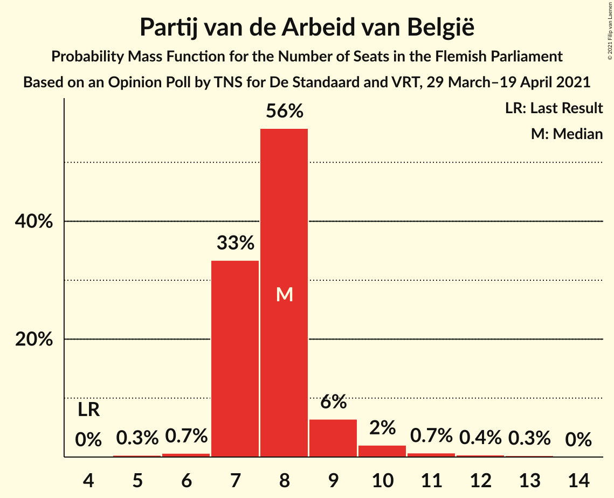

| Number of Seats | Probability | Accumulated | Special Marks |
|:---------------:|:-----------:|:-----------:|:-------------:|
| 4 | 0% | 100% | Last Result |
| 5 | 0.3% | 100% |  |
| 6 | 0.7% | 99.7% |  |
| 7 | 32% | 99.0% |  |
| 8 | 57% | 67% | Median |
| 9 | 7% | 10% |  |
| 10 | 2% | 3% |  |
| 11 | 0.8% | 2% |  |
| 12 | 0.4% | 0.7% |  |
| 13 | 0.3% | 0.3% |  |
| 14 | 0% | 0% |  |

## Coalitions

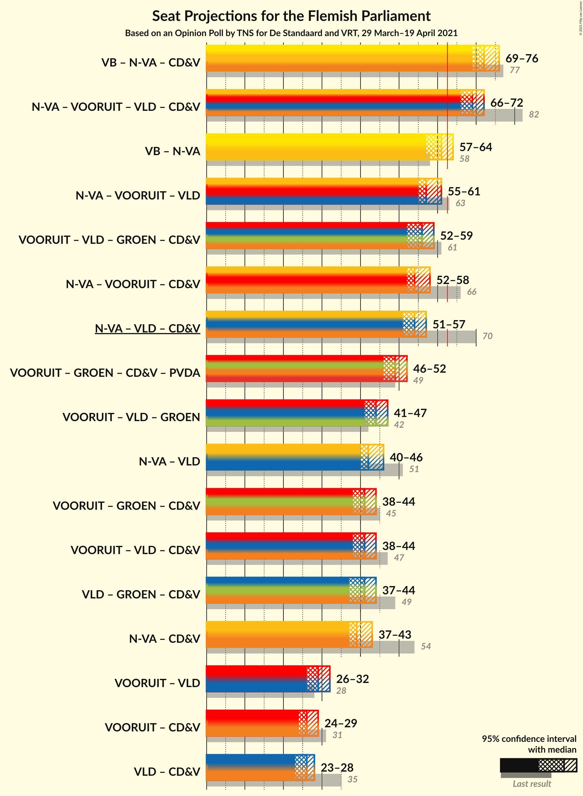

### Confidence Intervals

| Coalition | Last Result | Median | Majority? | 80% Confidence Interval | 90% Confidence Interval | 95% Confidence Interval | 99% Confidence Interval |
|:---------:|:-----------:|:------:|:---------:|:-----------------------:|:-----------------------:|:-----------------------:|:-----------------------:|
| Vlaams Belang – Nieuw-Vlaamse Alliantie – Christen-Democratisch en Vlaams | 77 | 72 | 100% | 70–74 | 70–75 | 69–76 | 67–77 |
| Nieuw-Vlaamse Alliantie – Vooruit – Open Vlaamse Liberalen en Democraten – Christen-Democratisch en Vlaams | 82 | 69 | 100% | 67–71 | 67–72 | 66–72 | 65–74 |
| Vlaams Belang – Nieuw-Vlaamse Alliantie | 58 | 61 | 10% | 59–63 | 58–63 | 57–64 | 56–65 |
| Nieuw-Vlaamse Alliantie – Vooruit – Open Vlaamse Liberalen en Democraten | 63 | 57 | 0.1% | 56–60 | 55–60 | 55–61 | 54–62 |
| Vooruit – Open Vlaamse Liberalen en Democraten – Groen – Christen-Democratisch en Vlaams | 61 | 56 | 0% | 54–57 | 53–58 | 52–59 | 51–60 |
| Nieuw-Vlaamse Alliantie – Vooruit – Christen-Democratisch en Vlaams | 66 | 54 | 0% | 53–56 | 52–57 | 52–58 | 51–59 |
| Nieuw-Vlaamse Alliantie – Open Vlaamse Liberalen en Democraten – Christen-Democratisch en Vlaams | 70 | 54 | 0% | 52–56 | 52–57 | 51–57 | 50–58 |
| Vooruit – Groen – Christen-Democratisch en Vlaams – Partij van de Arbeid van België | 49 | 49 | 0% | 47–51 | 46–51 | 46–52 | 44–53 |
| Vooruit – Open Vlaamse Liberalen en Democraten – Groen | 42 | 44 | 0% | 42–46 | 41–46 | 40–47 | 39–49 |
| Nieuw-Vlaamse Alliantie – Open Vlaamse Liberalen en Democraten | 51 | 42 | 0% | 41–44 | 40–45 | 40–45 | 39–47 |
| Vooruit – Groen – Christen-Democratisch en Vlaams | 45 | 41 | 0% | 39–43 | 39–44 | 38–44 | 37–45 |
| Vooruit – Open Vlaamse Liberalen en Democraten – Christen-Democratisch en Vlaams | 47 | 41 | 0% | 39–43 | 39–43 | 38–44 | 36–45 |
| Open Vlaamse Liberalen en Democraten – Groen – Christen-Democratisch en Vlaams | 49 | 41 | 0% | 38–42 | 38–43 | 37–44 | 36–45 |
| Nieuw-Vlaamse Alliantie – Christen-Democratisch en Vlaams | 54 | 39 | 0% | 38–41 | 38–42 | 37–43 | 36–44 |
| Vooruit – Open Vlaamse Liberalen en Democraten | 28 | 29 | 0% | 28–31 | 27–32 | 26–32 | 25–34 |
| Vooruit – Christen-Democratisch en Vlaams | 31 | 26 | 0% | 25–28 | 24–29 | 24–29 | 23–30 |
| Open Vlaamse Liberalen en Democraten – Christen-Democratisch en Vlaams | 35 | 26 | 0% | 24–28 | 24–28 | 23–29 | 22–30 |

### Vlaams Belang – Nieuw-Vlaamse Alliantie – Christen-Democratisch en Vlaams

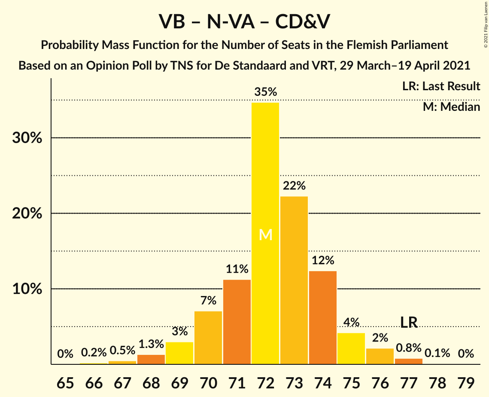

| Number of Seats | Probability | Accumulated | Special Marks |
|:---------------:|:-----------:|:-----------:|:-------------:|
| 66 | 0.2% | 100% |  |
| 67 | 0.5% | 99.8% |  |
| 68 | 1.3% | 99.3% |  |
| 69 | 3% | 98% |  |
| 70 | 7% | 95% |  |
| 71 | 11% | 88% |  |
| 72 | 35% | 77% |  |
| 73 | 22% | 42% | Median |
| 74 | 12% | 20% |  |
| 75 | 4% | 7% |  |
| 76 | 2% | 3% |  |
| 77 | 0.8% | 1.0% | Last Result |
| 78 | 0.1% | 0.2% |  |
| 79 | 0% | 0% |  |

### Nieuw-Vlaamse Alliantie – Vooruit – Open Vlaamse Liberalen en Democraten – Christen-Democratisch en Vlaams

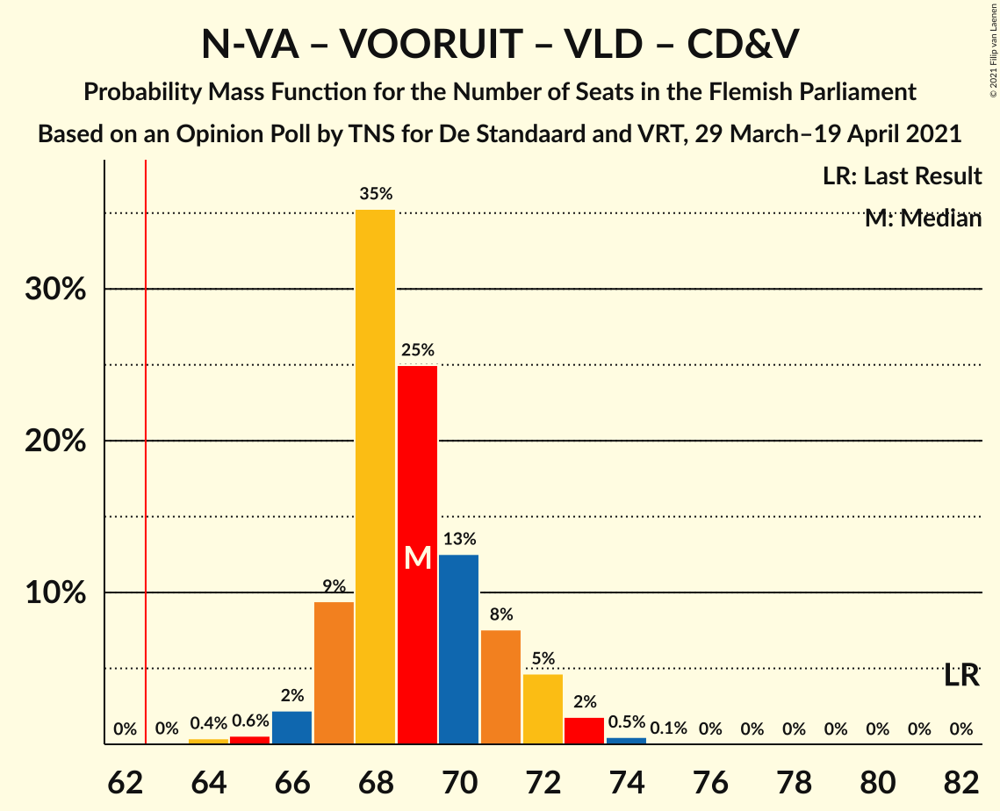

| Number of Seats | Probability | Accumulated | Special Marks |
|:---------------:|:-----------:|:-----------:|:-------------:|
| 64 | 0.4% | 100% |  |
| 65 | 0.6% | 99.6% |  |
| 66 | 2% | 99.0% |  |
| 67 | 9% | 97% |  |
| 68 | 35% | 87% |  |
| 69 | 25% | 52% |  |
| 70 | 13% | 27% | Median |
| 71 | 8% | 15% |  |
| 72 | 5% | 7% |  |
| 73 | 2% | 2% |  |
| 74 | 0.5% | 0.6% |  |
| 75 | 0.1% | 0.1% |  |
| 76 | 0% | 0% |  |
| 77 | 0% | 0% |  |
| 78 | 0% | 0% |  |
| 79 | 0% | 0% |  |
| 80 | 0% | 0% |  |
| 81 | 0% | 0% |  |
| 82 | 0% | 0% | Last Result |

### Vlaams Belang – Nieuw-Vlaamse Alliantie

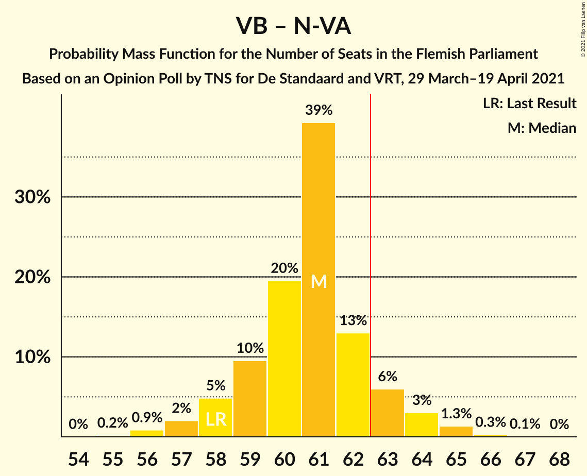

| Number of Seats | Probability | Accumulated | Special Marks |
|:---------------:|:-----------:|:-----------:|:-------------:|
| 55 | 0.1% | 100% |  |
| 56 | 1.0% | 99.8% |  |
| 57 | 2% | 98.8% |  |
| 58 | 5% | 96% | Last Result |
| 59 | 9% | 92% |  |
| 60 | 21% | 82% |  |
| 61 | 37% | 61% | Median |
| 62 | 15% | 25% |  |
| 63 | 6% | 10% | Majority |
| 64 | 3% | 4% |  |
| 65 | 1.2% | 2% |  |
| 66 | 0.3% | 0.4% |  |
| 67 | 0.1% | 0.1% |  |
| 68 | 0% | 0% |  |

### Nieuw-Vlaamse Alliantie – Vooruit – Open Vlaamse Liberalen en Democraten

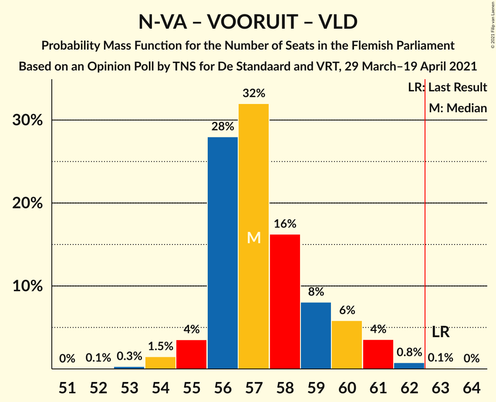

| Number of Seats | Probability | Accumulated | Special Marks |
|:---------------:|:-----------:|:-----------:|:-------------:|
| 52 | 0.1% | 100% |  |
| 53 | 0.3% | 99.9% |  |
| 54 | 1.5% | 99.6% |  |
| 55 | 4% | 98% |  |
| 56 | 28% | 95% |  |
| 57 | 32% | 67% |  |
| 58 | 16% | 35% | Median |
| 59 | 8% | 18% |  |
| 60 | 6% | 10% |  |
| 61 | 4% | 4% |  |
| 62 | 0.8% | 0.9% |  |
| 63 | 0.1% | 0.1% | Last Result, Majority |
| 64 | 0% | 0% |  |

### Vooruit – Open Vlaamse Liberalen en Democraten – Groen – Christen-Democratisch en Vlaams

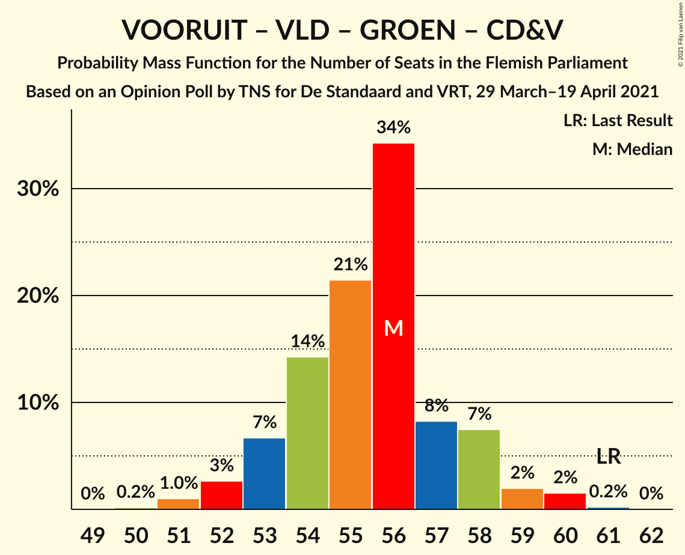

| Number of Seats | Probability | Accumulated | Special Marks |
|:---------------:|:-----------:|:-----------:|:-------------:|
| 50 | 0.3% | 100% |  |
| 51 | 0.9% | 99.7% |  |
| 52 | 3% | 98.8% |  |
| 53 | 5% | 96% |  |
| 54 | 13% | 91% |  |
| 55 | 26% | 77% |  |
| 56 | 32% | 51% |  |
| 57 | 11% | 19% | Median |
| 58 | 5% | 9% |  |
| 59 | 2% | 4% |  |
| 60 | 1.1% | 1.3% |  |
| 61 | 0.2% | 0.2% | Last Result |
| 62 | 0% | 0% |  |

### Nieuw-Vlaamse Alliantie – Vooruit – Christen-Democratisch en Vlaams

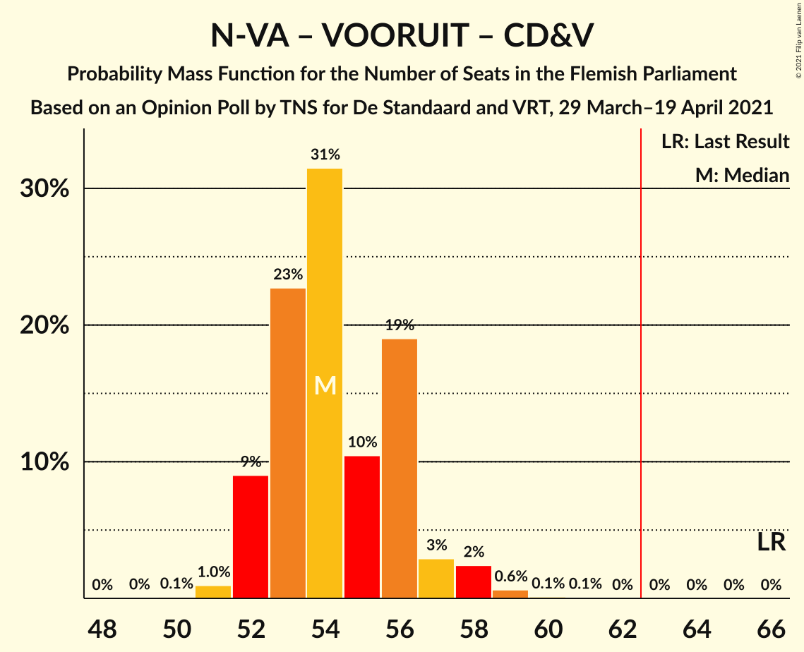

| Number of Seats | Probability | Accumulated | Special Marks |
|:---------------:|:-----------:|:-----------:|:-------------:|
| 50 | 0.2% | 100% |  |
| 51 | 2% | 99.8% |  |
| 52 | 8% | 98% |  |
| 53 | 22% | 90% |  |
| 54 | 30% | 69% |  |
| 55 | 13% | 38% | Median |
| 56 | 17% | 25% |  |
| 57 | 4% | 8% |  |
| 58 | 3% | 4% |  |
| 59 | 0.8% | 1.0% |  |
| 60 | 0.2% | 0.3% |  |
| 61 | 0.1% | 0.1% |  |
| 62 | 0% | 0% |  |
| 63 | 0% | 0% | Majority |
| 64 | 0% | 0% |  |
| 65 | 0% | 0% |  |
| 66 | 0% | 0% | Last Result |

### Nieuw-Vlaamse Alliantie – Open Vlaamse Liberalen en Democraten – Christen-Democratisch en Vlaams

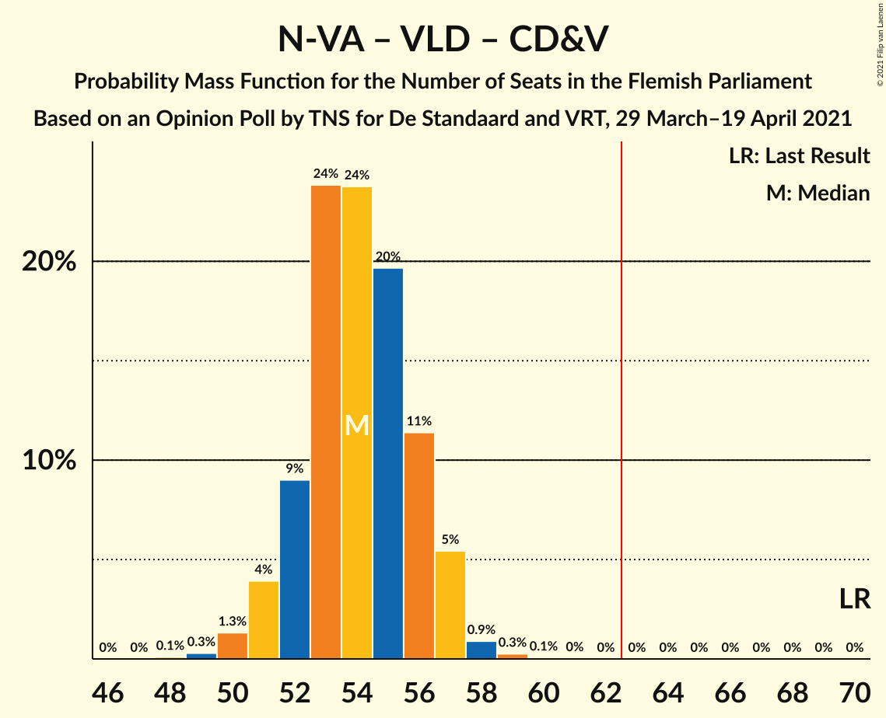

| Number of Seats | Probability | Accumulated | Special Marks |
|:---------------:|:-----------:|:-----------:|:-------------:|
| 49 | 0.4% | 100% |  |
| 50 | 1.3% | 99.6% |  |
| 51 | 3% | 98% |  |
| 52 | 9% | 95% |  |
| 53 | 24% | 86% |  |
| 54 | 25% | 62% |  |
| 55 | 19% | 38% | Median |
| 56 | 12% | 18% |  |
| 57 | 5% | 7% |  |
| 58 | 1.0% | 1.5% |  |
| 59 | 0.3% | 0.4% |  |
| 60 | 0.1% | 0.1% |  |
| 61 | 0% | 0% |  |
| 62 | 0% | 0% |  |
| 63 | 0% | 0% | Majority |
| 64 | 0% | 0% |  |
| 65 | 0% | 0% |  |
| 66 | 0% | 0% |  |
| 67 | 0% | 0% |  |
| 68 | 0% | 0% |  |
| 69 | 0% | 0% |  |
| 70 | 0% | 0% | Last Result |

### Vooruit – Groen – Christen-Democratisch en Vlaams – Partij van de Arbeid van België

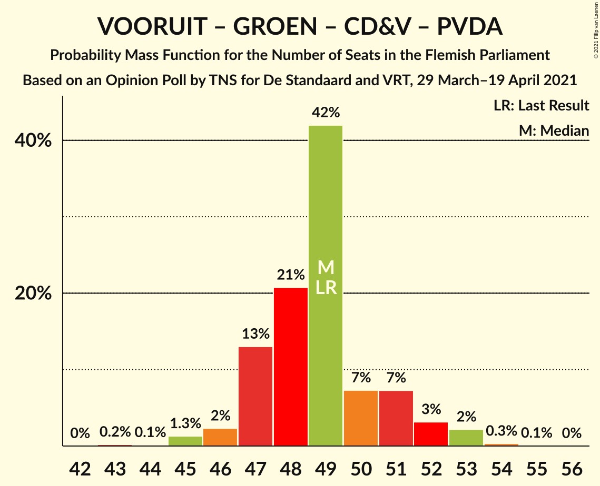

| Number of Seats | Probability | Accumulated | Special Marks |
|:---------------:|:-----------:|:-----------:|:-------------:|
| 43 | 0.1% | 100% |  |
| 44 | 0.5% | 99.9% |  |
| 45 | 1.2% | 99.4% |  |
| 46 | 3% | 98% |  |
| 47 | 15% | 95% |  |
| 48 | 19% | 80% |  |
| 49 | 37% | 61% | Last Result |
| 50 | 12% | 24% | Median |
| 51 | 7% | 12% |  |
| 52 | 3% | 5% |  |
| 53 | 1.5% | 2% |  |
| 54 | 0.3% | 0.5% |  |
| 55 | 0.1% | 0.1% |  |
| 56 | 0% | 0% |  |

### Vooruit – Open Vlaamse Liberalen en Democraten – Groen

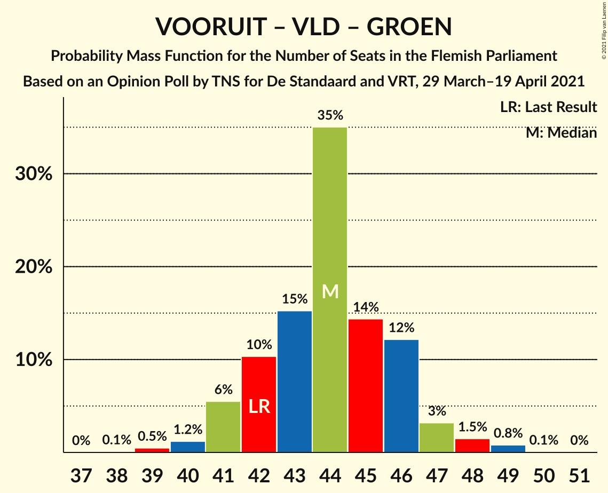

| Number of Seats | Probability | Accumulated | Special Marks |
|:---------------:|:-----------:|:-----------:|:-------------:|
| 38 | 0.1% | 100% |  |
| 39 | 0.5% | 99.9% |  |
| 40 | 2% | 99.4% |  |
| 41 | 4% | 97% |  |
| 42 | 11% | 93% | Last Result |
| 43 | 15% | 83% |  |
| 44 | 40% | 68% |  |
| 45 | 15% | 28% | Median |
| 46 | 8% | 13% |  |
| 47 | 3% | 5% |  |
| 48 | 1.1% | 2% |  |
| 49 | 0.5% | 0.6% |  |
| 50 | 0.1% | 0.1% |  |
| 51 | 0% | 0% |  |

### Nieuw-Vlaamse Alliantie – Open Vlaamse Liberalen en Democraten

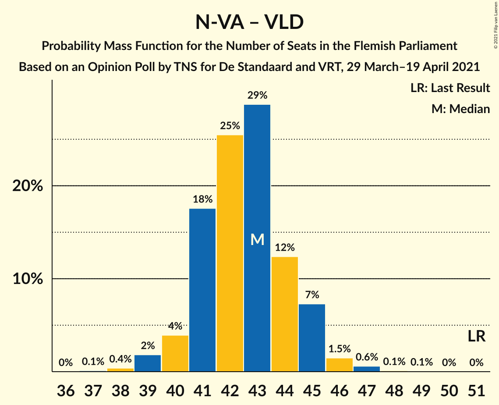

| Number of Seats | Probability | Accumulated | Special Marks |
|:---------------:|:-----------:|:-----------:|:-------------:|
| 37 | 0.1% | 100% |  |
| 38 | 0.4% | 99.9% |  |
| 39 | 2% | 99.5% |  |
| 40 | 4% | 98% |  |
| 41 | 19% | 94% |  |
| 42 | 28% | 74% |  |
| 43 | 23% | 46% | Median |
| 44 | 15% | 24% |  |
| 45 | 7% | 9% |  |
| 46 | 2% | 2% |  |
| 47 | 0.5% | 0.7% |  |
| 48 | 0.2% | 0.2% |  |
| 49 | 0% | 0% |  |
| 50 | 0% | 0% |  |
| 51 | 0% | 0% | Last Result |

### Vooruit – Groen – Christen-Democratisch en Vlaams

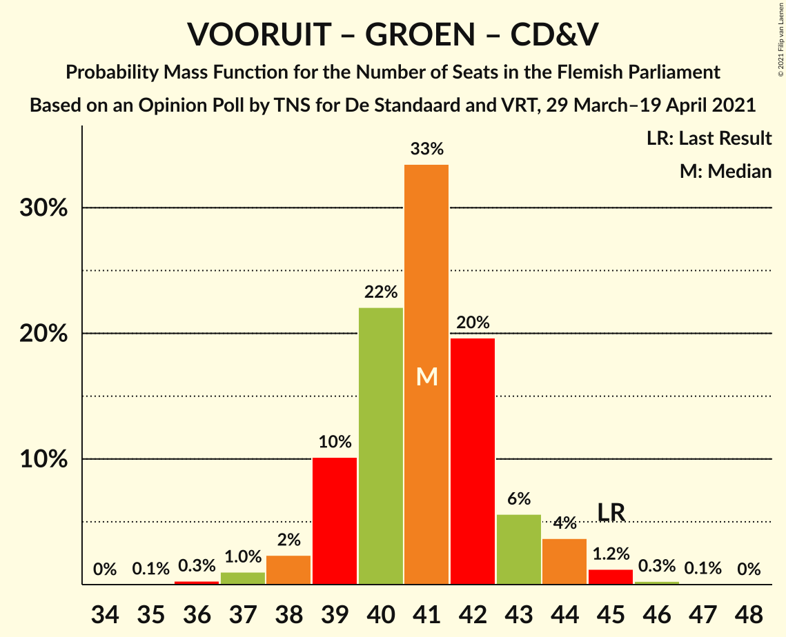

| Number of Seats | Probability | Accumulated | Special Marks |
|:---------------:|:-----------:|:-----------:|:-------------:|
| 35 | 0.1% | 100% |  |
| 36 | 0.3% | 99.9% |  |
| 37 | 1.0% | 99.6% |  |
| 38 | 2% | 98.6% |  |
| 39 | 10% | 96% |  |
| 40 | 22% | 86% |  |
| 41 | 33% | 64% |  |
| 42 | 20% | 31% | Median |
| 43 | 6% | 11% |  |
| 44 | 4% | 5% |  |
| 45 | 1.2% | 2% | Last Result |
| 46 | 0.3% | 0.4% |  |
| 47 | 0.1% | 0.1% |  |
| 48 | 0% | 0% |  |

### Vooruit – Open Vlaamse Liberalen en Democraten – Christen-Democratisch en Vlaams

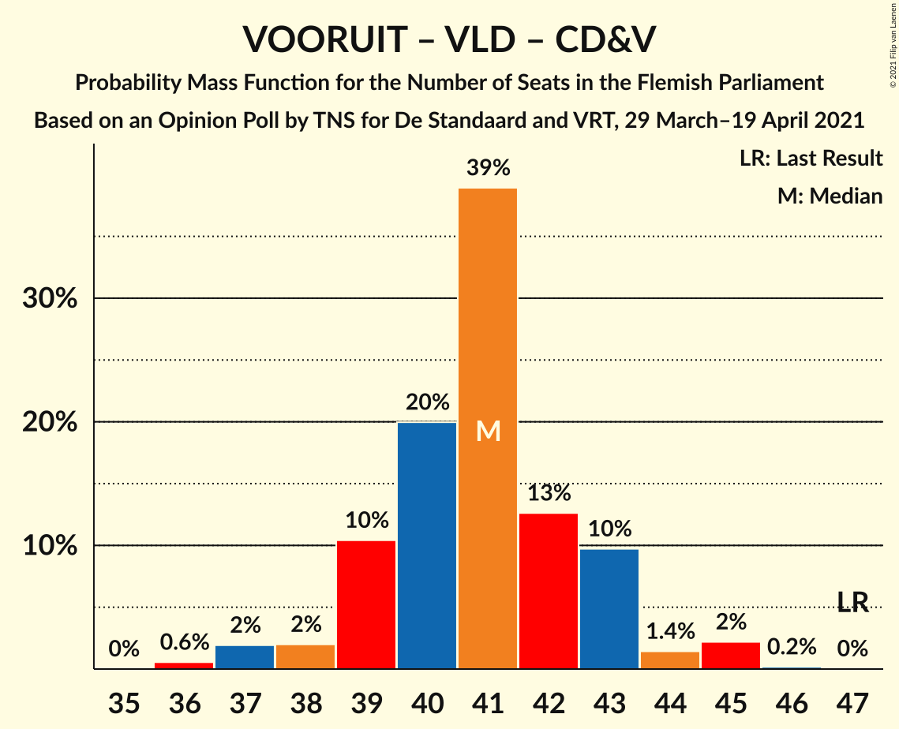

| Number of Seats | Probability | Accumulated | Special Marks |
|:---------------:|:-----------:|:-----------:|:-------------:|
| 35 | 0.1% | 100% |  |
| 36 | 0.5% | 99.9% |  |
| 37 | 1.2% | 99.5% |  |
| 38 | 3% | 98% |  |
| 39 | 8% | 95% |  |
| 40 | 22% | 87% |  |
| 41 | 36% | 65% |  |
| 42 | 18% | 29% | Median |
| 43 | 7% | 11% |  |
| 44 | 3% | 5% |  |
| 45 | 1.2% | 2% |  |
| 46 | 0.4% | 0.4% |  |
| 47 | 0% | 0% | Last Result |

### Open Vlaamse Liberalen en Democraten – Groen – Christen-Democratisch en Vlaams

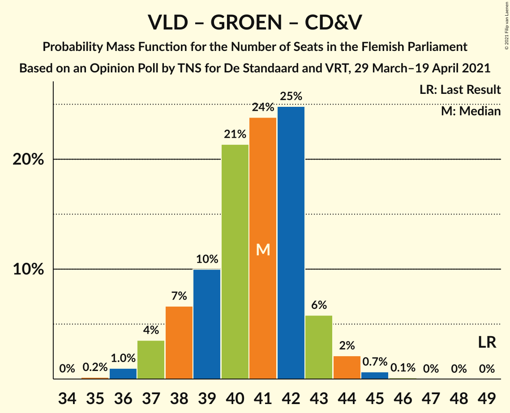

| Number of Seats | Probability | Accumulated | Special Marks |
|:---------------:|:-----------:|:-----------:|:-------------:|
| 35 | 0.2% | 100% |  |
| 36 | 0.8% | 99.8% |  |
| 37 | 3% | 99.0% |  |
| 38 | 6% | 96% |  |
| 39 | 11% | 90% |  |
| 40 | 22% | 78% |  |
| 41 | 23% | 57% |  |
| 42 | 24% | 34% | Median |
| 43 | 6% | 9% |  |
| 44 | 3% | 4% |  |
| 45 | 0.7% | 0.9% |  |
| 46 | 0.1% | 0.1% |  |
| 47 | 0% | 0% |  |
| 48 | 0% | 0% |  |
| 49 | 0% | 0% | Last Result |

### Nieuw-Vlaamse Alliantie – Christen-Democratisch en Vlaams

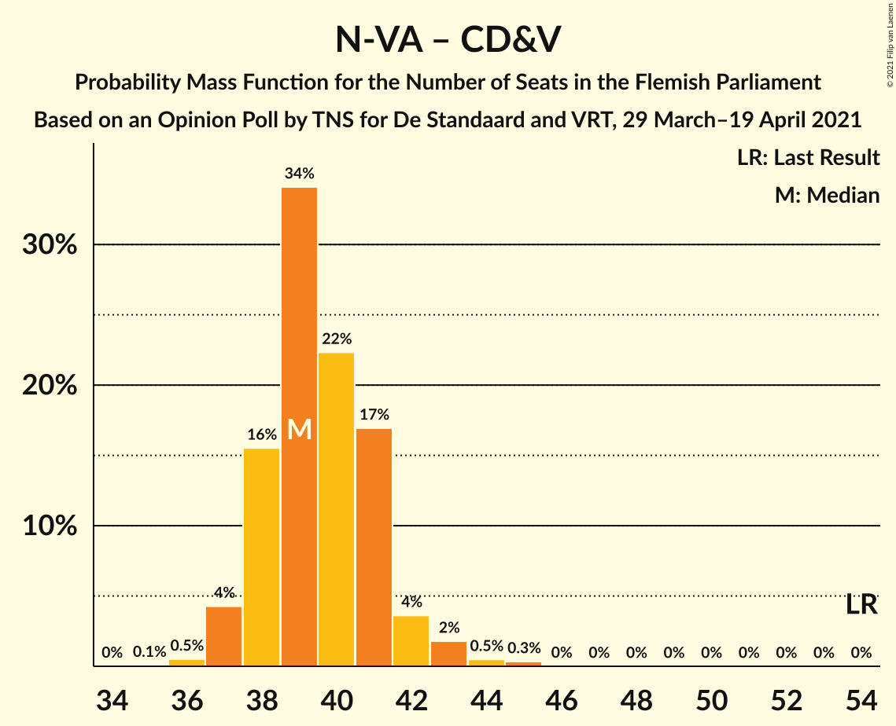

| Number of Seats | Probability | Accumulated | Special Marks |
|:---------------:|:-----------:|:-----------:|:-------------:|
| 35 | 0.1% | 100% |  |
| 36 | 0.5% | 99.9% |  |
| 37 | 4% | 99.4% |  |
| 38 | 16% | 95% |  |
| 39 | 34% | 80% |  |
| 40 | 22% | 46% | Median |
| 41 | 17% | 23% |  |
| 42 | 4% | 6% |  |
| 43 | 2% | 3% |  |
| 44 | 0.5% | 0.8% |  |
| 45 | 0.3% | 0.4% |  |
| 46 | 0% | 0% |  |
| 47 | 0% | 0% |  |
| 48 | 0% | 0% |  |
| 49 | 0% | 0% |  |
| 50 | 0% | 0% |  |
| 51 | 0% | 0% |  |
| 52 | 0% | 0% |  |
| 53 | 0% | 0% |  |
| 54 | 0% | 0% | Last Result |

### Vooruit – Open Vlaamse Liberalen en Democraten

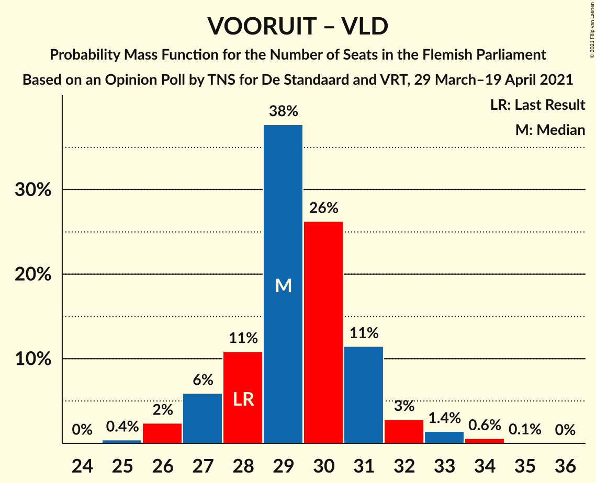

| Number of Seats | Probability | Accumulated | Special Marks |
|:---------------:|:-----------:|:-----------:|:-------------:|
| 25 | 0.5% | 100% |  |
| 26 | 2% | 99.5% |  |
| 27 | 6% | 97% |  |
| 28 | 13% | 92% | Last Result |
| 29 | 37% | 79% |  |
| 30 | 27% | 42% | Median |
| 31 | 10% | 15% |  |
| 32 | 3% | 6% |  |
| 33 | 2% | 2% |  |
| 34 | 0.6% | 0.6% |  |
| 35 | 0.1% | 0.1% |  |
| 36 | 0% | 0% |  |

### Vooruit – Christen-Democratisch en Vlaams

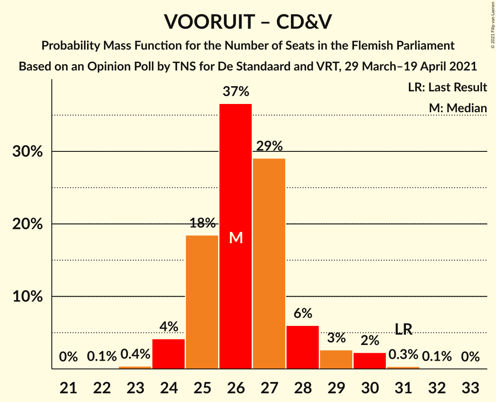

| Number of Seats | Probability | Accumulated | Special Marks |
|:---------------:|:-----------:|:-----------:|:-------------:|
| 22 | 0% | 100% |  |
| 23 | 0.5% | 99.9% |  |
| 24 | 5% | 99.5% |  |
| 25 | 15% | 95% |  |
| 26 | 36% | 79% |  |
| 27 | 29% | 43% | Median |
| 28 | 8% | 14% |  |
| 29 | 4% | 6% |  |
| 30 | 2% | 2% |  |
| 31 | 0.4% | 0.4% | Last Result |
| 32 | 0% | 0% |  |

### Open Vlaamse Liberalen en Democraten – Christen-Democratisch en Vlaams

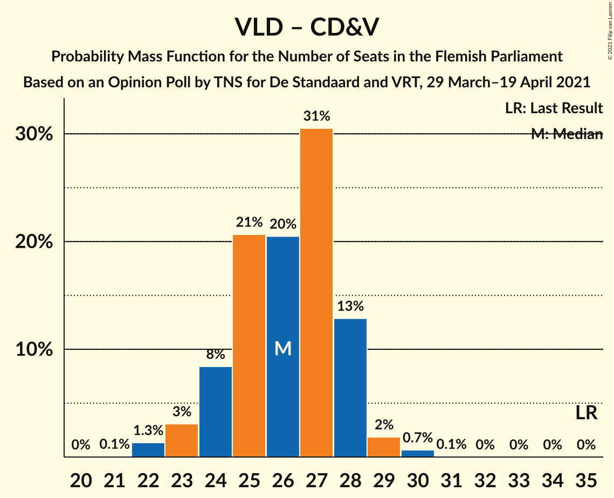

| Number of Seats | Probability | Accumulated | Special Marks |
|:---------------:|:-----------:|:-----------:|:-------------:|
| 21 | 0.1% | 100% |  |
| 22 | 1.3% | 99.9% |  |
| 23 | 3% | 98.6% |  |
| 24 | 8% | 96% |  |
| 25 | 21% | 87% |  |
| 26 | 20% | 66% |  |
| 27 | 31% | 46% | Median |
| 28 | 13% | 15% |  |
| 29 | 2% | 3% |  |
| 30 | 0.7% | 0.7% |  |
| 31 | 0.1% | 0.1% |  |
| 32 | 0% | 0% |  |
| 33 | 0% | 0% |  |
| 34 | 0% | 0% |  |
| 35 | 0% | 0% | Last Result |

## Technical Information

### Opinion Poll

+ **Polling firm:** TNS
+ **Commissioner(s):** De Standaard and VRT
+ **Fieldwork period:** 29 March–19 April 2021

### Calculations

+ **Sample size:** 1908
+ **Simulations done:** 524,288
+ **Error estimate:** 0.84%

