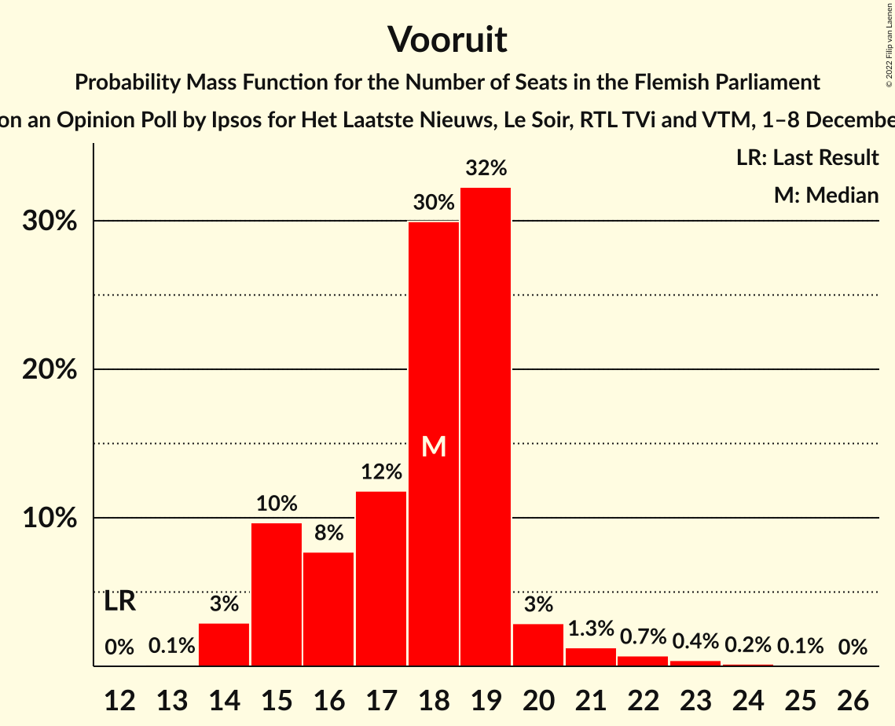
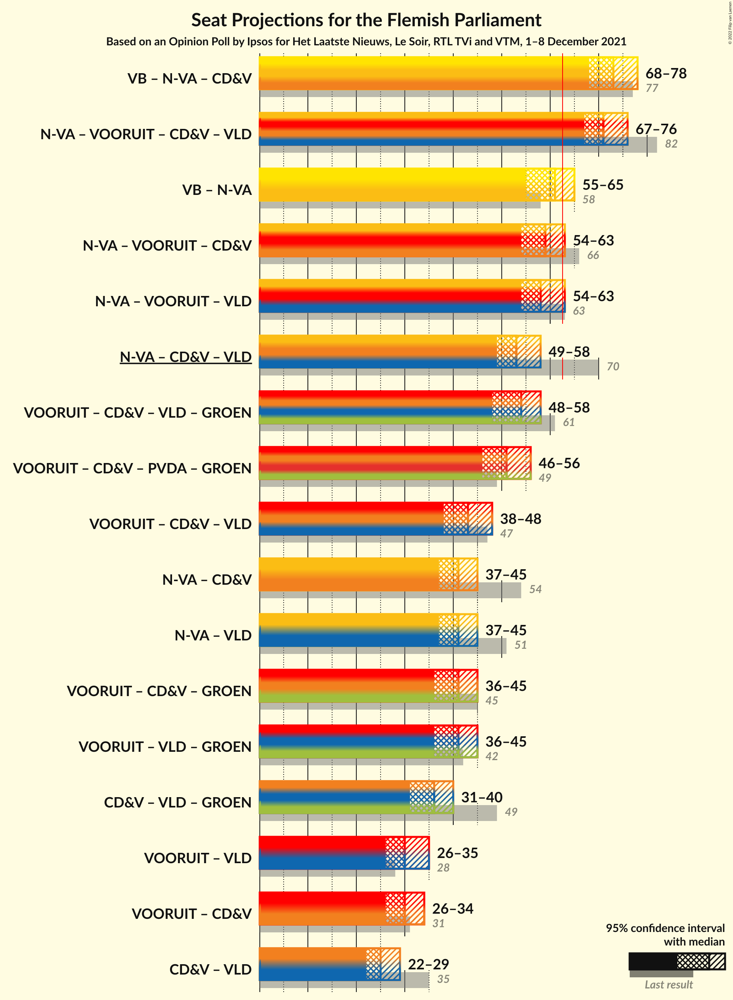
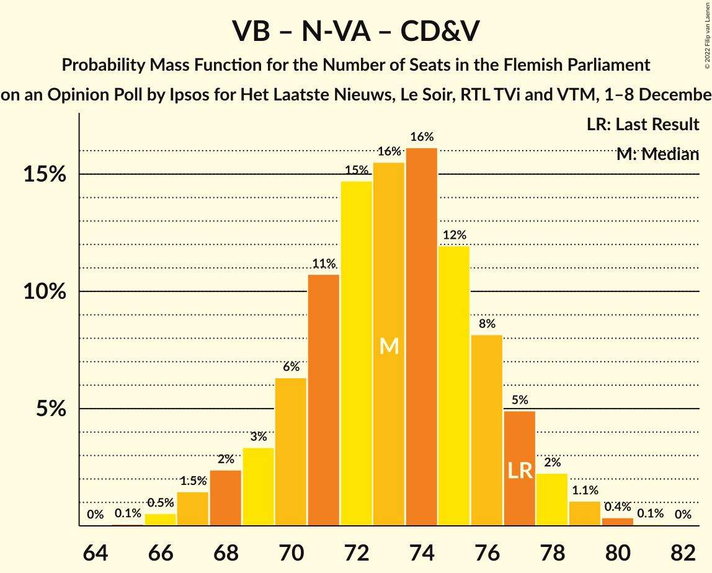
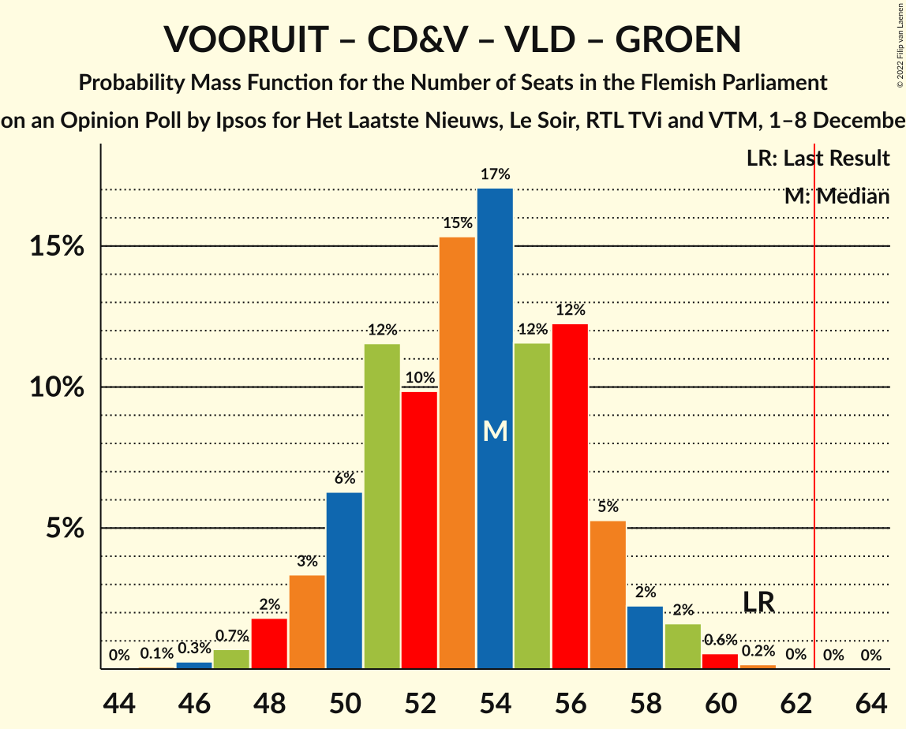
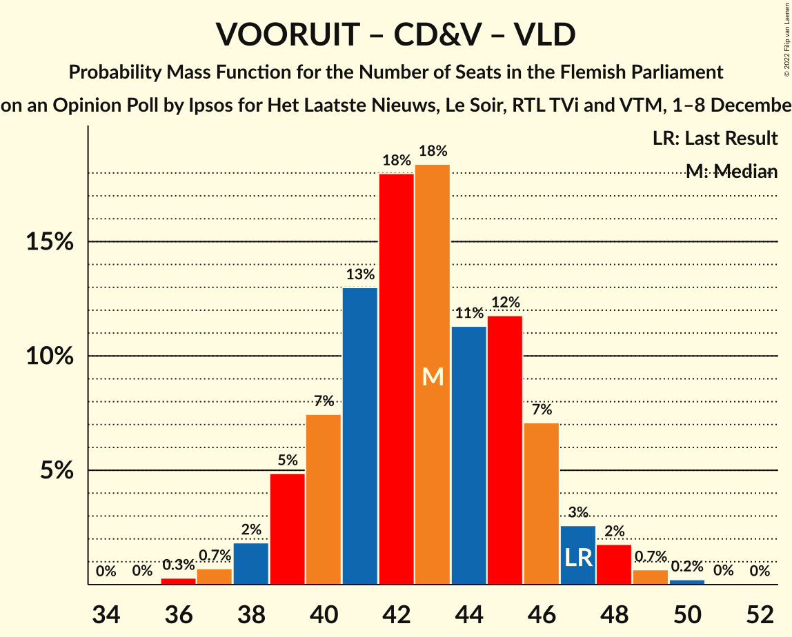
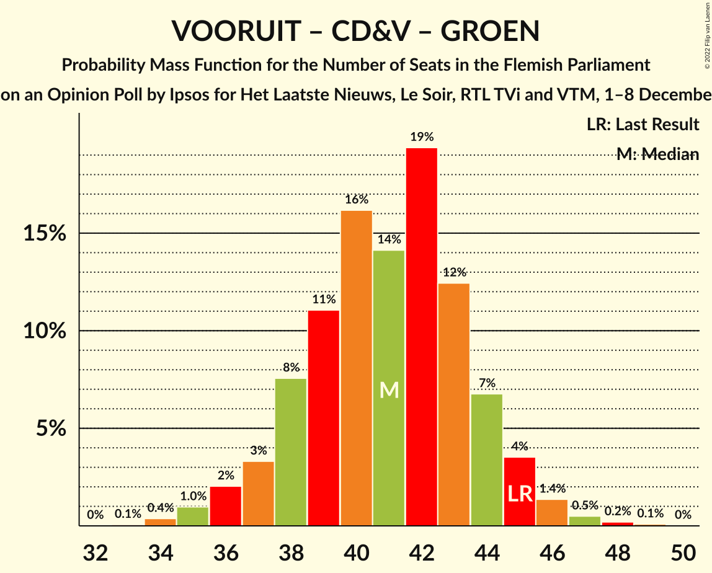
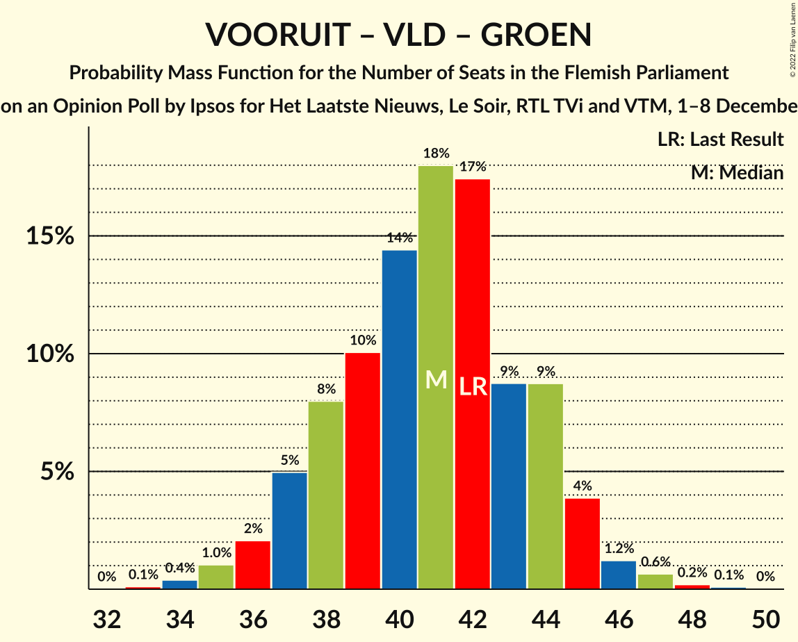
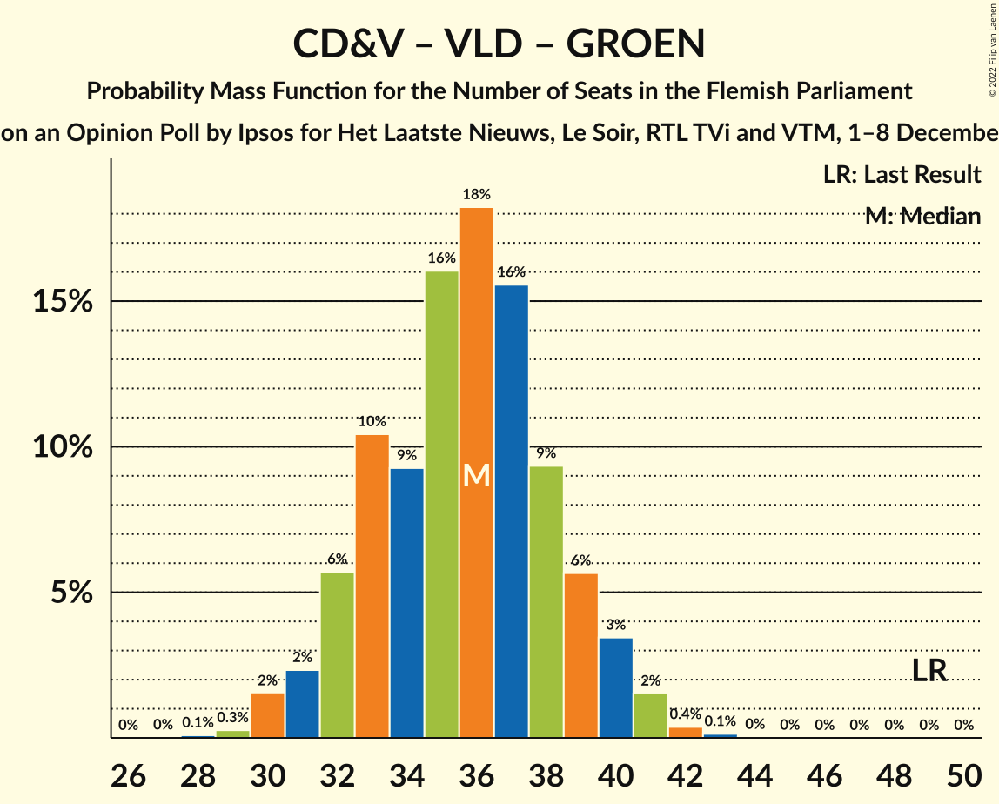

# Opinion Poll by Ipsos for Het Laatste Nieuws, Le Soir, RTL TVi and VTM, 1–8 December 2021

<a href="#voting-intentions">Voting Intentions</a> | <a href="#seats">Seats</a> | <a href="#coalitions">Coalitions</a> | <a href="#technical-information">Technical Information</a>

## Voting Intentions

### Confidence Intervals

| Party | Last Result | Poll Result | 80% Confidence Interval | 90% Confidence Interval | 95% Confidence Interval | 99% Confidence Interval |
|:-----:|:-----------:|:-----------:|:-----------------------:|:-----------------------:|:-----------------------:|:-----------------------:|
| Vlaams Belang | 18.5% | 24.5% | 22.8–26.3% |22.3–26.8% |21.9–27.3% |21.1–28.2% |
| Nieuw-Vlaamse Alliantie | 24.8% | 21.6% | 20.0–23.3% |19.5–23.8% |19.1–24.2% |18.4–25.1% |
| Vooruit | 10.1% | 13.9% | 12.5–15.4% |12.2–15.8% |11.8–16.2% |11.2–16.9% |
| Christen-Democratisch en Vlaams | 15.4% | 10.7% | 9.6–12.1% |9.2–12.5% |8.9–12.8% |8.4–13.5% |
| Open Vlaamse Liberalen en Democraten | 13.1% | 10.3% | 9.2–11.7% |8.9–12.1% |8.6–12.4% |8.0–13.1% |
| Partij van de Arbeid van België | 5.3% | 8.9% | 7.8–10.2% |7.5–10.5% |7.3–10.9% |6.8–11.5% |
| Groen | 10.1% | 8.4% | 7.4–9.6% |7.1–10.0% |6.8–10.3% |6.4–10.9% |

*Note:* The poll result column reflects the actual value used in the calculations. Published results may vary slightly, and in addition be rounded to fewer digits.

## Seats

### Confidence Intervals

| Party | Last Result | Median | 80% Confidence Interval | 90% Confidence Interval | 95% Confidence Interval | 99% Confidence Interval |
|:-----:|:-----------:|:------:|:-----------------------:|:-----------------------:|:-----------------------:|:-----------------------:|
| <a href="#vlaams-belang">Vlaams Belang</a> | 23 | 33 | 29–34 |29–35 |28–36 |27–38 |
| <a href="#nieuw-vlaamse-alliantie">Nieuw-Vlaamse Alliantie</a> | 35 | 28 | 27–31 |26–32 |25–33 |23–33 |
| <a href="#vooruit">Vooruit</a> | 12 | 18 | 15–19 |15–20 |14–21 |14–23 |
| <a href="#christen-democratisch-en-vlaams">Christen-Democratisch en Vlaams</a> | 19 | 12 | 11–14 |10–15 |10–16 |10–16 |
| <a href="#open-vlaamse-liberalen-en-democraten">Open Vlaamse Liberalen en Democraten</a> | 16 | 12 | 11–15 |11–15 |10–16 |9–16 |
| <a href="#partij-van-de-arbeid-van-belgië">Partij van de Arbeid van België</a> | 4 | 10 | 8–13 |7–13 |7–13 |7–14 |
| <a href="#groen">Groen</a> | 14 | 11 | 8–12 |7–13 |7–14 |6–15 |

### Vlaams Belang

*For a full overview of the results for this party, see the [Vlaams Belang](party-vlaamsbelang.html) page.*

| Number of Seats | Probability | Accumulated | Special Marks |
|:---------------:|:-----------:|:-----------:|:-------------:|
| 23 | 0% | 100% | Last Result |
| 24 | 0% | 100% |  |
| 25 | 0.1% | 100% |  |
| 26 | 0.3% | 99.9% |  |
| 27 | 1.5% | 99.6% |  |
| 28 | 3% | 98% |  |
| 29 | 9% | 95% |  |
| 30 | 10% | 86% |  |
| 31 | 10% | 76% |  |
| 32 | 12% | 66% |  |
| 33 | 22% | 54% | Median |
| 34 | 24% | 33% |  |
| 35 | 4% | 8% |  |
| 36 | 2% | 4% |  |
| 37 | 2% | 2% |  |
| 38 | 0.6% | 0.8% |  |
| 39 | 0.1% | 0.2% |  |
| 40 | 0% | 0% |  |

### Nieuw-Vlaamse Alliantie

*For a full overview of the results for this party, see the [Nieuw-Vlaamse Alliantie](party-nieuw-vlaamsealliantie.html) page.*

| Number of Seats | Probability | Accumulated | Special Marks |
|:---------------:|:-----------:|:-----------:|:-------------:|
| 22 | 0.1% | 100% |  |
| 23 | 0.6% | 99.9% |  |
| 24 | 1.0% | 99.3% |  |
| 25 | 2% | 98% |  |
| 26 | 4% | 97% |  |
| 27 | 32% | 92% |  |
| 28 | 21% | 60% | Median |
| 29 | 19% | 39% |  |
| 30 | 9% | 20% |  |
| 31 | 5% | 12% |  |
| 32 | 4% | 7% |  |
| 33 | 3% | 3% |  |
| 34 | 0.3% | 0.4% |  |
| 35 | 0.1% | 0.1% | Last Result |
| 36 | 0% | 0% |  |

### Vooruit

*For a full overview of the results for this party, see the [Vooruit](party-vooruit.html) page.*

| Number of Seats | Probability | Accumulated | Special Marks |
|:---------------:|:-----------:|:-----------:|:-------------:|
| 12 | 0% | 100% | Last Result |
| 13 | 0.1% | 100% |  |
| 14 | 3% | 99.9% |  |
| 15 | 7% | 97% |  |
| 16 | 5% | 89% |  |
| 17 | 11% | 84% |  |
| 18 | 36% | 73% | Median |
| 19 | 31% | 37% |  |
| 20 | 3% | 6% |  |
| 21 | 1.5% | 3% |  |
| 22 | 0.8% | 2% |  |
| 23 | 0.6% | 0.8% |  |
| 24 | 0.1% | 0.2% |  |
| 25 | 0.1% | 0.1% |  |
| 26 | 0% | 0% |  |

### Christen-Democratisch en Vlaams

*For a full overview of the results for this party, see the [Christen-Democratisch en Vlaams](party-christen-democratischenvlaams.html) page.*

| Number of Seats | Probability | Accumulated | Special Marks |
|:---------------:|:-----------:|:-----------:|:-------------:|
| 9 | 0.4% | 100% |  |
| 10 | 6% | 99.6% |  |
| 11 | 18% | 94% |  |
| 12 | 30% | 75% | Median |
| 13 | 15% | 45% |  |
| 14 | 23% | 30% |  |
| 15 | 4% | 6% |  |
| 16 | 2% | 3% |  |
| 17 | 0.1% | 0.2% |  |
| 18 | 0% | 0% |  |
| 19 | 0% | 0% | Last Result |

### Open Vlaamse Liberalen en Democraten

*For a full overview of the results for this party, see the [Open Vlaamse Liberalen en Democraten](party-openvlaamseliberalenendemocraten.html) page.*

| Number of Seats | Probability | Accumulated | Special Marks |
|:---------------:|:-----------:|:-----------:|:-------------:|
| 8 | 0.3% | 100% |  |
| 9 | 0.4% | 99.6% |  |
| 10 | 3% | 99.2% |  |
| 11 | 31% | 96% |  |
| 12 | 23% | 65% | Median |
| 13 | 17% | 42% |  |
| 14 | 15% | 26% |  |
| 15 | 8% | 11% |  |
| 16 | 3% | 3% | Last Result |
| 17 | 0.1% | 0.2% |  |
| 18 | 0.1% | 0.1% |  |
| 19 | 0% | 0% |  |

### Partij van de Arbeid van België

*For a full overview of the results for this party, see the [Partij van de Arbeid van België](party-partijvandearbeidvanbelgië.html) page.*

| Number of Seats | Probability | Accumulated | Special Marks |
|:---------------:|:-----------:|:-----------:|:-------------:|
| 4 | 0% | 100% | Last Result |
| 5 | 0.1% | 100% |  |
| 6 | 0.1% | 99.9% |  |
| 7 | 8% | 99.9% |  |
| 8 | 23% | 91% |  |
| 9 | 17% | 68% |  |
| 10 | 17% | 51% | Median |
| 11 | 8% | 34% |  |
| 12 | 7% | 26% |  |
| 13 | 17% | 19% |  |
| 14 | 2% | 2% |  |
| 15 | 0.2% | 0.2% |  |
| 16 | 0% | 0% |  |

### Groen

*For a full overview of the results for this party, see the [Groen](party-groen.html) page.*

| Number of Seats | Probability | Accumulated | Special Marks |
|:---------------:|:-----------:|:-----------:|:-------------:|
| 5 | 0.4% | 100% |  |
| 6 | 0.5% | 99.6% |  |
| 7 | 5% | 99.1% |  |
| 8 | 4% | 94% |  |
| 9 | 6% | 90% |  |
| 10 | 8% | 83% |  |
| 11 | 60% | 75% | Median |
| 12 | 9% | 15% |  |
| 13 | 2% | 6% |  |
| 14 | 4% | 4% | Last Result |
| 15 | 0.5% | 0.5% |  |
| 16 | 0% | 0% |  |

## Coalitions

### Confidence Intervals

| Coalition | Last Result | Median | Majority? | 80% Confidence Interval | 90% Confidence Interval | 95% Confidence Interval | 99% Confidence Interval |
|:---------:|:-----------:|:------:|:---------:|:-----------------------:|:-----------------------:|:-----------------------:|:-----------------------:|
| Vlaams Belang – Nieuw-Vlaamse Alliantie – Christen-Democratisch en Vlaams | 77 | 73 | 100% | 70–76 | 69–77 | 68–78 | 66–79 |
| Nieuw-Vlaamse Alliantie – Vooruit – Christen-Democratisch en Vlaams – Open Vlaamse Liberalen en Democraten | 82 | 71 | 100% | 68–74 | 68–75 | 67–76 | 65–77 |
| Vlaams Belang – Nieuw-Vlaamse Alliantie | 58 | 60 | 23% | 57–64 | 56–65 | 55–66 | 54–67 |
| Nieuw-Vlaamse Alliantie – Vooruit – Christen-Democratisch en Vlaams | 66 | 59 | 5% | 56–62 | 55–62 | 54–63 | 53–65 |
| Nieuw-Vlaamse Alliantie – Vooruit – Open Vlaamse Liberalen en Democraten | 63 | 59 | 4% | 56–61 | 55–62 | 54–63 | 53–65 |
| Vooruit – Christen-Democratisch en Vlaams – Open Vlaamse Liberalen en Democraten – Groen | 61 | 54 | 0% | 50–56 | 49–57 | 49–58 | 47–60 |
| Nieuw-Vlaamse Alliantie – Christen-Democratisch en Vlaams – Open Vlaamse Liberalen en Democraten | 70 | 53 | 0% | 50–56 | 49–57 | 49–58 | 48–60 |
| Vooruit – Christen-Democratisch en Vlaams – Partij van de Arbeid van België – Groen | 49 | 51 | 0% | 48–55 | 47–56 | 46–56 | 45–57 |
| Vooruit – Christen-Democratisch en Vlaams – Open Vlaamse Liberalen en Democraten | 47 | 43 | 0% | 40–46 | 39–46 | 38–47 | 37–49 |
| Nieuw-Vlaamse Alliantie – Christen-Democratisch en Vlaams | 54 | 41 | 0% | 38–44 | 38–45 | 37–45 | 36–47 |
| Nieuw-Vlaamse Alliantie – Open Vlaamse Liberalen en Democraten | 51 | 41 | 0% | 38–43 | 37–44 | 37–45 | 35–47 |
| Vooruit – Christen-Democratisch en Vlaams – Groen | 45 | 41 | 0% | 38–44 | 37–45 | 36–45 | 35–47 |
| Vooruit – Open Vlaamse Liberalen en Democraten – Groen | 42 | 41 | 0% | 38–44 | 37–45 | 36–45 | 35–47 |
| Christen-Democratisch en Vlaams – Open Vlaamse Liberalen en Democraten – Groen | 49 | 36 | 0% | 32–39 | 32–40 | 31–40 | 30–42 |
| Vooruit – Open Vlaamse Liberalen en Democraten | 28 | 30 | 0% | 28–33 | 27–34 | 26–35 | 25–36 |
| Vooruit – Christen-Democratisch en Vlaams | 31 | 31 | 0% | 28–33 | 27–34 | 26–34 | 25–36 |
| Christen-Democratisch en Vlaams – Open Vlaamse Liberalen en Democraten | 35 | 25 | 0% | 22–28 | 22–28 | 22–29 | 21–30 |

### Vlaams Belang – Nieuw-Vlaamse Alliantie – Christen-Democratisch en Vlaams

| Number of Seats | Probability | Accumulated | Special Marks |
|:---------------:|:-----------:|:-----------:|:-------------:|
| 65 | 0.1% | 100% |  |
| 66 | 0.4% | 99.9% |  |
| 67 | 2% | 99.5% |  |
| 68 | 2% | 98% |  |
| 69 | 3% | 95% |  |
| 70 | 6% | 93% |  |
| 71 | 14% | 87% |  |
| 72 | 14% | 73% |  |
| 73 | 13% | 59% | Median |
| 74 | 19% | 46% |  |
| 75 | 12% | 26% |  |
| 76 | 6% | 15% |  |
| 77 | 5% | 8% | Last Result |
| 78 | 2% | 3% |  |
| 79 | 1.0% | 1.4% |  |
| 80 | 0.3% | 0.4% |  |
| 81 | 0% | 0.1% |  |
| 82 | 0% | 0% |  |

### Nieuw-Vlaamse Alliantie – Vooruit – Christen-Democratisch en Vlaams – Open Vlaamse Liberalen en Democraten

| Number of Seats | Probability | Accumulated | Special Marks |
|:---------------:|:-----------:|:-----------:|:-------------:|
| 63 | 0.1% | 100% | Majority |
| 64 | 0.2% | 99.9% |  |
| 65 | 0.5% | 99.7% |  |
| 66 | 0.8% | 99.2% |  |
| 67 | 3% | 98% |  |
| 68 | 8% | 95% |  |
| 69 | 11% | 87% |  |
| 70 | 18% | 77% | Median |
| 71 | 14% | 59% |  |
| 72 | 18% | 45% |  |
| 73 | 12% | 27% |  |
| 74 | 7% | 15% |  |
| 75 | 5% | 8% |  |
| 76 | 2% | 3% |  |
| 77 | 1.0% | 1.4% |  |
| 78 | 0.2% | 0.4% |  |
| 79 | 0.1% | 0.2% |  |
| 80 | 0.1% | 0.1% |  |
| 81 | 0% | 0% |  |
| 82 | 0% | 0% | Last Result |

### Vlaams Belang – Nieuw-Vlaamse Alliantie

| Number of Seats | Probability | Accumulated | Special Marks |
|:---------------:|:-----------:|:-----------:|:-------------:|
| 52 | 0.1% | 100% |  |
| 53 | 0.2% | 99.9% |  |
| 54 | 0.8% | 99.8% |  |
| 55 | 2% | 98.9% |  |
| 56 | 3% | 97% |  |
| 57 | 7% | 94% |  |
| 58 | 8% | 87% | Last Result |
| 59 | 8% | 79% |  |
| 60 | 21% | 71% |  |
| 61 | 16% | 50% | Median |
| 62 | 11% | 34% |  |
| 63 | 12% | 23% | Majority |
| 64 | 6% | 11% |  |
| 65 | 3% | 5% |  |
| 66 | 2% | 3% |  |
| 67 | 0.4% | 0.7% |  |
| 68 | 0.2% | 0.3% |  |
| 69 | 0.1% | 0.1% |  |
| 70 | 0% | 0% |  |

### Nieuw-Vlaamse Alliantie – Vooruit – Christen-Democratisch en Vlaams

| Number of Seats | Probability | Accumulated | Special Marks |
|:---------------:|:-----------:|:-----------:|:-------------:|
| 51 | 0.1% | 100% |  |
| 52 | 0.2% | 99.9% |  |
| 53 | 0.7% | 99.7% |  |
| 54 | 2% | 99.0% |  |
| 55 | 4% | 97% |  |
| 56 | 9% | 93% |  |
| 57 | 13% | 84% |  |
| 58 | 21% | 71% | Median |
| 59 | 15% | 50% |  |
| 60 | 14% | 35% |  |
| 61 | 8% | 21% |  |
| 62 | 9% | 13% |  |
| 63 | 2% | 5% | Majority |
| 64 | 1.0% | 2% |  |
| 65 | 0.9% | 1.2% |  |
| 66 | 0.2% | 0.3% | Last Result |
| 67 | 0.1% | 0.1% |  |
| 68 | 0% | 0% |  |

### Nieuw-Vlaamse Alliantie – Vooruit – Open Vlaamse Liberalen en Democraten

| Number of Seats | Probability | Accumulated | Special Marks |
|:---------------:|:-----------:|:-----------:|:-------------:|
| 51 | 0.1% | 100% |  |
| 52 | 0.3% | 99.8% |  |
| 53 | 1.0% | 99.6% |  |
| 54 | 2% | 98.6% |  |
| 55 | 5% | 97% |  |
| 56 | 7% | 92% |  |
| 57 | 14% | 84% |  |
| 58 | 18% | 70% | Median |
| 59 | 19% | 53% |  |
| 60 | 15% | 33% |  |
| 61 | 9% | 19% |  |
| 62 | 5% | 10% |  |
| 63 | 2% | 4% | Last Result, Majority |
| 64 | 0.8% | 2% |  |
| 65 | 0.7% | 1.1% |  |
| 66 | 0.2% | 0.4% |  |
| 67 | 0.1% | 0.1% |  |
| 68 | 0.1% | 0.1% |  |
| 69 | 0% | 0% |  |

### Vooruit – Christen-Democratisch en Vlaams – Open Vlaamse Liberalen en Democraten – Groen

| Number of Seats | Probability | Accumulated | Special Marks |
|:---------------:|:-----------:|:-----------:|:-------------:|
| 45 | 0.1% | 100% |  |
| 46 | 0.3% | 99.9% |  |
| 47 | 0.7% | 99.6% |  |
| 48 | 1.4% | 98.9% |  |
| 49 | 4% | 98% |  |
| 50 | 5% | 94% |  |
| 51 | 10% | 89% |  |
| 52 | 8% | 78% |  |
| 53 | 16% | 70% | Median |
| 54 | 19% | 54% |  |
| 55 | 13% | 35% |  |
| 56 | 13% | 23% |  |
| 57 | 5% | 9% |  |
| 58 | 2% | 4% |  |
| 59 | 2% | 2% |  |
| 60 | 0.5% | 0.6% |  |
| 61 | 0.1% | 0.2% | Last Result |
| 62 | 0% | 0% |  |

### Nieuw-Vlaamse Alliantie – Christen-Democratisch en Vlaams – Open Vlaamse Liberalen en Democraten

| Number of Seats | Probability | Accumulated | Special Marks |
|:---------------:|:-----------:|:-----------:|:-------------:|
| 45 | 0% | 100% |  |
| 46 | 0.1% | 99.9% |  |
| 47 | 0.2% | 99.9% |  |
| 48 | 0.9% | 99.7% |  |
| 49 | 4% | 98.9% |  |
| 50 | 6% | 95% |  |
| 51 | 13% | 89% |  |
| 52 | 15% | 76% | Median |
| 53 | 17% | 61% |  |
| 54 | 14% | 43% |  |
| 55 | 12% | 29% |  |
| 56 | 8% | 17% |  |
| 57 | 5% | 9% |  |
| 58 | 3% | 4% |  |
| 59 | 0.9% | 2% |  |
| 60 | 0.5% | 0.6% |  |
| 61 | 0.1% | 0.2% |  |
| 62 | 0% | 0% |  |
| 63 | 0% | 0% | Majority |
| 64 | 0% | 0% |  |
| 65 | 0% | 0% |  |
| 66 | 0% | 0% |  |
| 67 | 0% | 0% |  |
| 68 | 0% | 0% |  |
| 69 | 0% | 0% |  |
| 70 | 0% | 0% | Last Result |

### Vooruit – Christen-Democratisch en Vlaams – Partij van de Arbeid van België – Groen

| Number of Seats | Probability | Accumulated | Special Marks |
|:---------------:|:-----------:|:-----------:|:-------------:|
| 43 | 0.1% | 100% |  |
| 44 | 0.3% | 99.9% |  |
| 45 | 1.2% | 99.6% |  |
| 46 | 2% | 98% |  |
| 47 | 4% | 97% |  |
| 48 | 6% | 92% |  |
| 49 | 14% | 86% | Last Result |
| 50 | 17% | 73% |  |
| 51 | 16% | 56% | Median |
| 52 | 12% | 39% |  |
| 53 | 11% | 27% |  |
| 54 | 6% | 17% |  |
| 55 | 5% | 11% |  |
| 56 | 4% | 6% |  |
| 57 | 2% | 2% |  |
| 58 | 0.4% | 0.5% |  |
| 59 | 0.1% | 0.1% |  |
| 60 | 0% | 0% |  |

### Vooruit – Christen-Democratisch en Vlaams – Open Vlaamse Liberalen en Democraten

| Number of Seats | Probability | Accumulated | Special Marks |
|:---------------:|:-----------:|:-----------:|:-------------:|
| 35 | 0% | 100% |  |
| 36 | 0.4% | 99.9% |  |
| 37 | 0.5% | 99.5% |  |
| 38 | 2% | 99.0% |  |
| 39 | 3% | 97% |  |
| 40 | 8% | 95% |  |
| 41 | 11% | 87% |  |
| 42 | 20% | 76% | Median |
| 43 | 20% | 55% |  |
| 44 | 11% | 35% |  |
| 45 | 13% | 25% |  |
| 46 | 7% | 12% |  |
| 47 | 2% | 5% | Last Result |
| 48 | 2% | 2% |  |
| 49 | 0.6% | 0.9% |  |
| 50 | 0.2% | 0.3% |  |
| 51 | 0% | 0.1% |  |
| 52 | 0% | 0% |  |

### Nieuw-Vlaamse Alliantie – Christen-Democratisch en Vlaams

| Number of Seats | Probability | Accumulated | Special Marks |
|:---------------:|:-----------:|:-----------:|:-------------:|
| 34 | 0.1% | 100% |  |
| 35 | 0.3% | 99.9% |  |
| 36 | 0.4% | 99.6% |  |
| 37 | 4% | 99.2% |  |
| 38 | 8% | 95% |  |
| 39 | 13% | 87% |  |
| 40 | 23% | 75% | Median |
| 41 | 21% | 52% |  |
| 42 | 10% | 31% |  |
| 43 | 8% | 21% |  |
| 44 | 8% | 13% |  |
| 45 | 3% | 5% |  |
| 46 | 1.1% | 2% |  |
| 47 | 0.9% | 1.1% |  |
| 48 | 0.1% | 0.2% |  |
| 49 | 0% | 0% |  |
| 50 | 0% | 0% |  |
| 51 | 0% | 0% |  |
| 52 | 0% | 0% |  |
| 53 | 0% | 0% |  |
| 54 | 0% | 0% | Last Result |

### Nieuw-Vlaamse Alliantie – Open Vlaamse Liberalen en Democraten

| Number of Seats | Probability | Accumulated | Special Marks |
|:---------------:|:-----------:|:-----------:|:-------------:|
| 34 | 0.1% | 100% |  |
| 35 | 0.4% | 99.8% |  |
| 36 | 0.6% | 99.4% |  |
| 37 | 4% | 98.8% |  |
| 38 | 12% | 95% |  |
| 39 | 10% | 83% |  |
| 40 | 18% | 73% | Median |
| 41 | 24% | 56% |  |
| 42 | 14% | 32% |  |
| 43 | 8% | 17% |  |
| 44 | 5% | 10% |  |
| 45 | 3% | 5% |  |
| 46 | 1.4% | 2% |  |
| 47 | 0.5% | 0.7% |  |
| 48 | 0.1% | 0.2% |  |
| 49 | 0% | 0.1% |  |
| 50 | 0% | 0% |  |
| 51 | 0% | 0% | Last Result |

### Vooruit – Christen-Democratisch en Vlaams – Groen

| Number of Seats | Probability | Accumulated | Special Marks |
|:---------------:|:-----------:|:-----------:|:-------------:|
| 33 | 0.1% | 100% |  |
| 34 | 0.3% | 99.9% |  |
| 35 | 1.3% | 99.6% |  |
| 36 | 2% | 98% |  |
| 37 | 3% | 97% |  |
| 38 | 5% | 94% |  |
| 39 | 10% | 88% |  |
| 40 | 16% | 78% |  |
| 41 | 13% | 62% | Median |
| 42 | 23% | 49% |  |
| 43 | 14% | 27% |  |
| 44 | 7% | 13% |  |
| 45 | 4% | 6% | Last Result |
| 46 | 1.2% | 2% |  |
| 47 | 0.3% | 0.6% |  |
| 48 | 0.2% | 0.3% |  |
| 49 | 0.1% | 0.1% |  |
| 50 | 0% | 0% |  |

### Vooruit – Open Vlaamse Liberalen en Democraten – Groen

| Number of Seats | Probability | Accumulated | Special Marks |
|:---------------:|:-----------:|:-----------:|:-------------:|
| 33 | 0.1% | 100% |  |
| 34 | 0.2% | 99.8% |  |
| 35 | 1.0% | 99.6% |  |
| 36 | 2% | 98.6% |  |
| 37 | 5% | 97% |  |
| 38 | 6% | 92% |  |
| 39 | 9% | 86% |  |
| 40 | 15% | 77% |  |
| 41 | 19% | 63% | Median |
| 42 | 20% | 44% | Last Result |
| 43 | 10% | 24% |  |
| 44 | 8% | 14% |  |
| 45 | 4% | 6% |  |
| 46 | 1.1% | 2% |  |
| 47 | 0.7% | 1.0% |  |
| 48 | 0.2% | 0.3% |  |
| 49 | 0.1% | 0.1% |  |
| 50 | 0% | 0% |  |

### Christen-Democratisch en Vlaams – Open Vlaamse Liberalen en Democraten – Groen

| Number of Seats | Probability | Accumulated | Special Marks |
|:---------------:|:-----------:|:-----------:|:-------------:|
| 28 | 0.1% | 100% |  |
| 29 | 0.3% | 99.9% |  |
| 30 | 2% | 99.6% |  |
| 31 | 2% | 98% |  |
| 32 | 6% | 96% |  |
| 33 | 10% | 90% |  |
| 34 | 8% | 79% |  |
| 35 | 17% | 72% | Median |
| 36 | 20% | 55% |  |
| 37 | 15% | 35% |  |
| 38 | 10% | 21% |  |
| 39 | 6% | 11% |  |
| 40 | 3% | 5% |  |
| 41 | 1.3% | 2% |  |
| 42 | 0.4% | 0.5% |  |
| 43 | 0.1% | 0.2% |  |
| 44 | 0% | 0% |  |
| 45 | 0% | 0% |  |
| 46 | 0% | 0% |  |
| 47 | 0% | 0% |  |
| 48 | 0% | 0% |  |
| 49 | 0% | 0% | Last Result |

### Vooruit – Open Vlaamse Liberalen en Democraten

| Number of Seats | Probability | Accumulated | Special Marks |
|:---------------:|:-----------:|:-----------:|:-------------:|
| 24 | 0.3% | 100% |  |
| 25 | 0.6% | 99.7% |  |
| 26 | 3% | 99.0% |  |
| 27 | 3% | 96% |  |
| 28 | 7% | 93% | Last Result |
| 29 | 17% | 86% |  |
| 30 | 24% | 69% | Median |
| 31 | 23% | 45% |  |
| 32 | 9% | 22% |  |
| 33 | 7% | 13% |  |
| 34 | 4% | 7% |  |
| 35 | 2% | 3% |  |
| 36 | 0.6% | 0.8% |  |
| 37 | 0.1% | 0.2% |  |
| 38 | 0.1% | 0.1% |  |
| 39 | 0% | 0% |  |

### Vooruit – Christen-Democratisch en Vlaams

| Number of Seats | Probability | Accumulated | Special Marks |
|:---------------:|:-----------:|:-----------:|:-------------:|
| 24 | 0.2% | 100% |  |
| 25 | 0.5% | 99.8% |  |
| 26 | 2% | 99.3% |  |
| 27 | 4% | 97% |  |
| 28 | 7% | 93% |  |
| 29 | 15% | 86% |  |
| 30 | 18% | 71% | Median |
| 31 | 26% | 53% | Last Result |
| 32 | 15% | 27% |  |
| 33 | 7% | 12% |  |
| 34 | 3% | 5% |  |
| 35 | 2% | 2% |  |
| 36 | 0.3% | 0.5% |  |
| 37 | 0.1% | 0.2% |  |
| 38 | 0% | 0.1% |  |
| 39 | 0% | 0% |  |

### Christen-Democratisch en Vlaams – Open Vlaamse Liberalen en Democraten

| Number of Seats | Probability | Accumulated | Special Marks |
|:---------------:|:-----------:|:-----------:|:-------------:|
| 19 | 0% | 100% |  |
| 20 | 0.4% | 99.9% |  |
| 21 | 2% | 99.5% |  |
| 22 | 10% | 98% |  |
| 23 | 11% | 87% |  |
| 24 | 22% | 77% | Median |
| 25 | 17% | 55% |  |
| 26 | 14% | 38% |  |
| 27 | 13% | 24% |  |
| 28 | 6% | 11% |  |
| 29 | 3% | 4% |  |
| 30 | 1.5% | 2% |  |
| 31 | 0.2% | 0.2% |  |
| 32 | 0% | 0.1% |  |
| 33 | 0% | 0% |  |
| 34 | 0% | 0% |  |
| 35 | 0% | 0% | Last Result |

## Technical Information

### Opinion Poll

+ **Polling firm:** Ipsos
+ **Commissioner(s):** Het Laatste Nieuws, Le Soir, RTL TVi and VTM
+ **Fieldwork period:** 1–8 December 2021

### Calculations

+ **Sample size:** 988
+ **Simulations done:** 524,288
+ **Error estimate:** 0.47%

