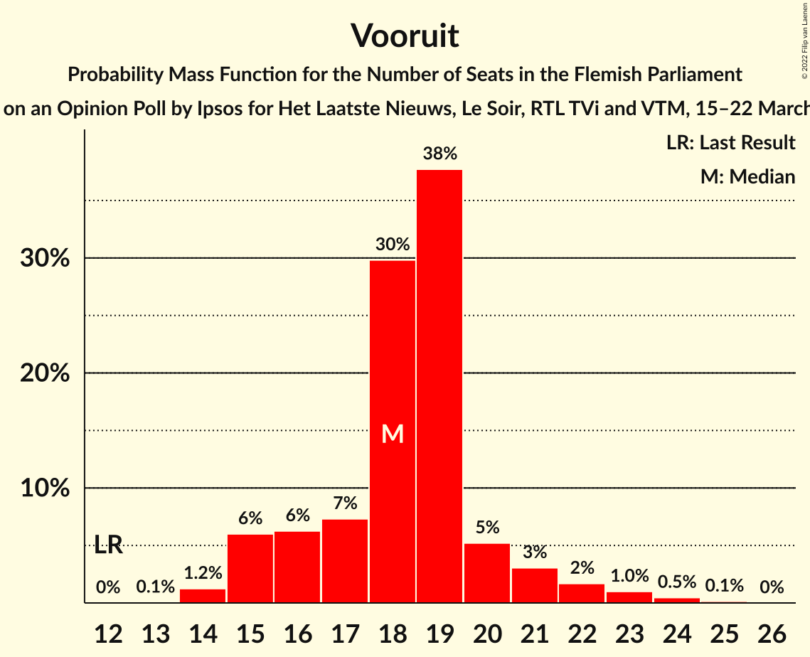
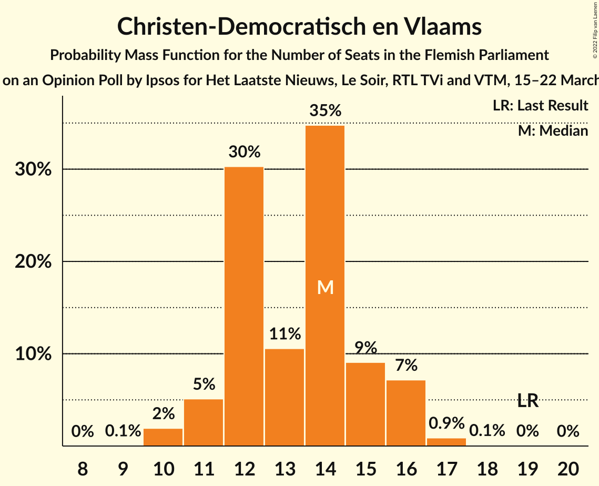
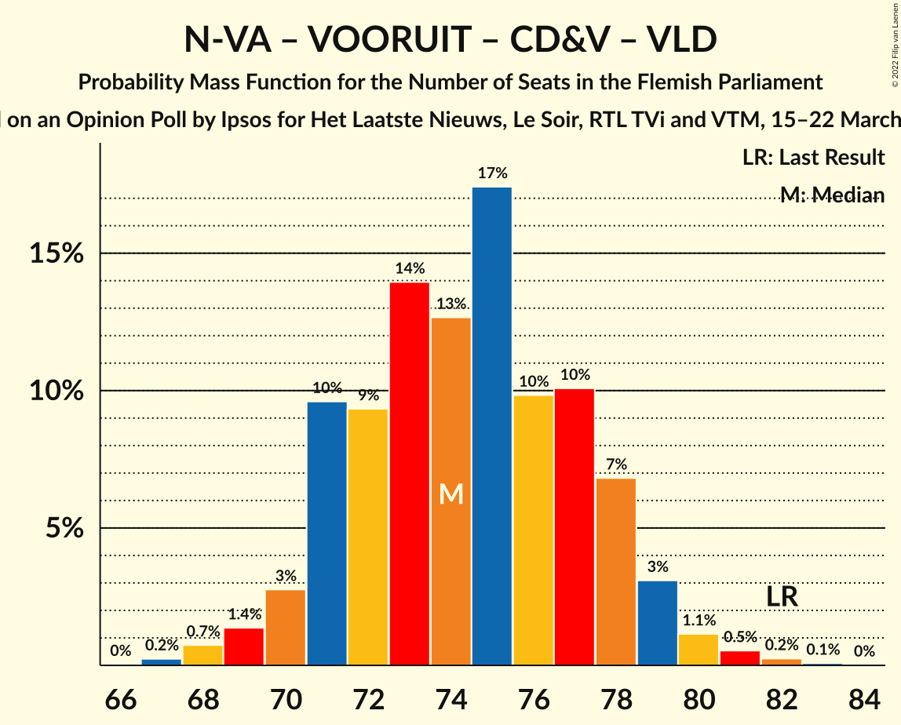
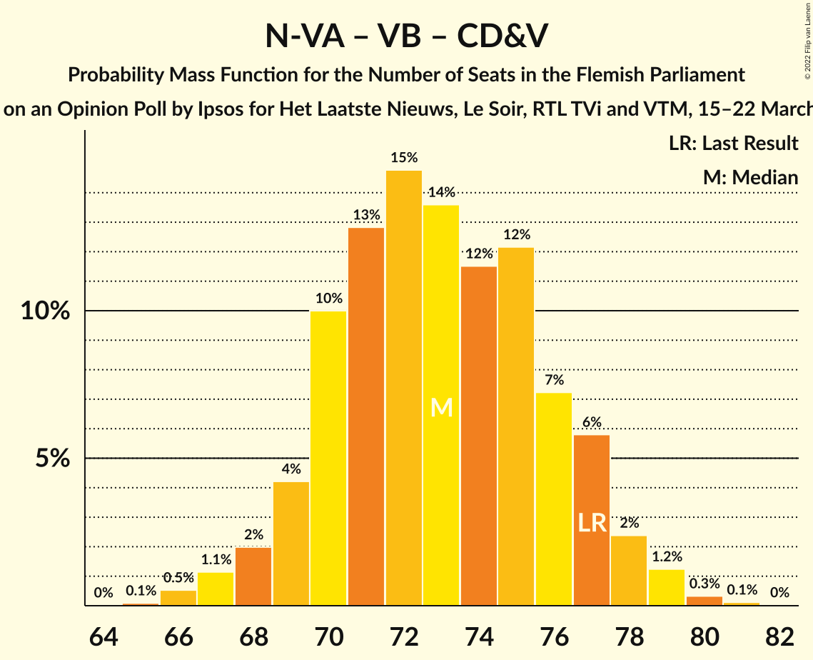
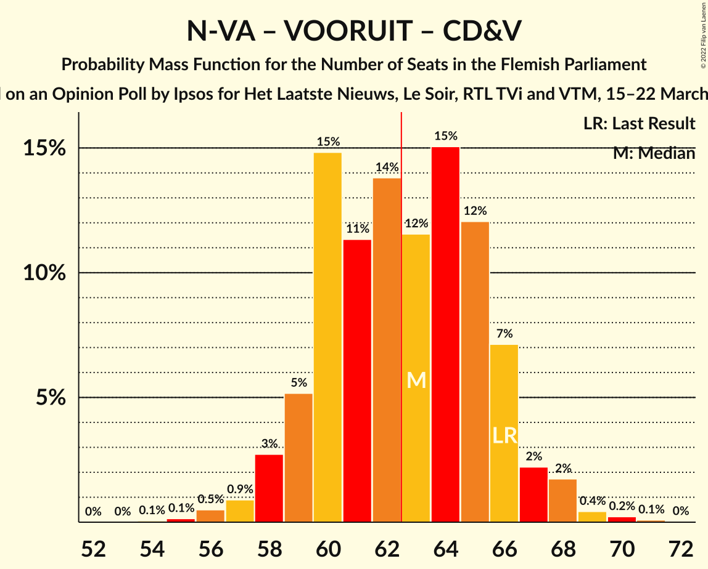
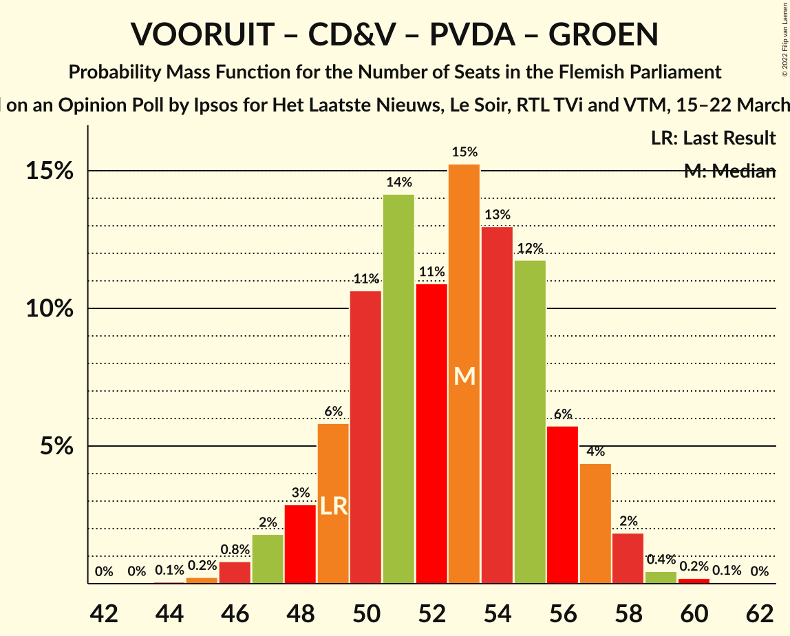
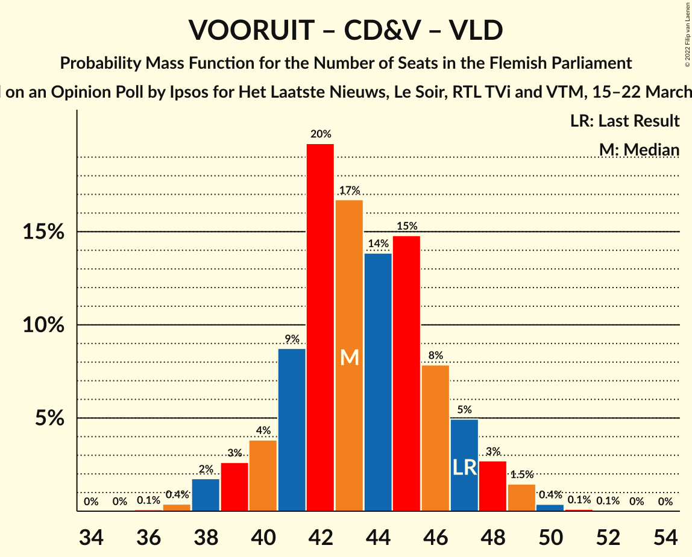
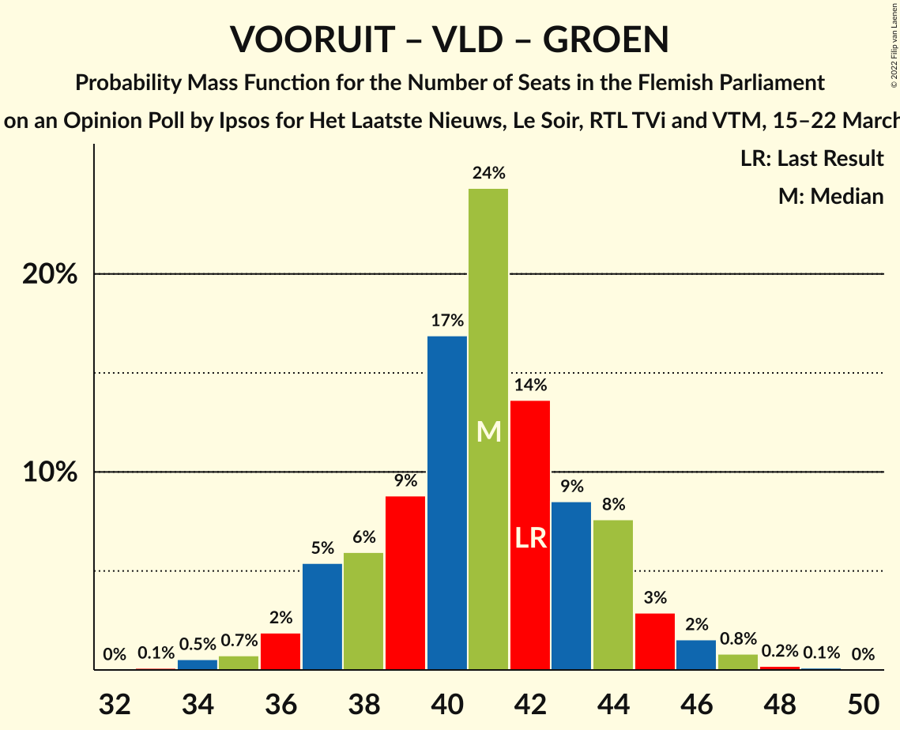

# Opinion Poll by Ipsos for Het Laatste Nieuws, Le Soir, RTL TVi and VTM, 15–22 March 2022

<a href="#voting-intentions">Voting Intentions</a> | <a href="#seats">Seats</a> | <a href="#coalitions">Coalitions</a> | <a href="#technical-information">Technical Information</a>

## Voting Intentions

### Confidence Intervals

| Party | Last Result | Poll Result | 80% Confidence Interval | 90% Confidence Interval | 95% Confidence Interval | 99% Confidence Interval |
|:-----:|:-----------:|:-----------:|:-----------------------:|:-----------------------:|:-----------------------:|:-----------------------:|
| Nieuw-Vlaamse Alliantie | 24.8% | 23.4% | 21.8–25.2% |21.3–25.7% |20.9–26.2% |20.1–27.0% |
| Vlaams Belang | 18.5% | 22.2% | 20.6–24.0% |20.2–24.5% |19.8–24.9% |19.0–25.8% |
| Vooruit | 10.1% | 14.2% | 12.9–15.7% |12.5–16.1% |12.2–16.5% |11.6–17.2% |
| Christen-Democratisch en Vlaams | 15.4% | 11.3% | 10.1–12.7% |9.8–13.1% |9.5–13.4% |9.0–14.1% |
| Open Vlaamse Liberalen en Democraten | 13.1% | 9.8% | 8.7–11.1% |8.4–11.5% |8.1–11.8% |7.6–12.5% |
| Partij van de Arbeid van België | 5.3% | 8.9% | 7.9–10.2% |7.6–10.5% |7.3–10.9% |6.8–11.5% |
| Groen | 10.1% | 8.4% | 7.4–9.7% |7.1–10.0% |6.9–10.3% |6.4–10.9% |

*Note:* The poll result column reflects the actual value used in the calculations. Published results may vary slightly, and in addition be rounded to fewer digits.

## Seats

### Confidence Intervals

| Party | Last Result | Median | 80% Confidence Interval | 90% Confidence Interval | 95% Confidence Interval | 99% Confidence Interval |
|:-----:|:-----------:|:------:|:-----------------------:|:-----------------------:|:-----------------------:|:-----------------------:|
| <a href="#nieuw-vlaamse-alliantie">Nieuw-Vlaamse Alliantie</a> | 35 | 31 | 28–33 |28–35 |27–35 |27–37 |
| <a href="#vlaams-belang">Vlaams Belang</a> | 23 | 29 | 26–32 |25–32 |25–33 |23–34 |
| <a href="#vooruit">Vooruit</a> | 12 | 18 | 16–20 |15–21 |15–22 |14–24 |
| <a href="#christen-democratisch-en-vlaams">Christen-Democratisch en Vlaams</a> | 19 | 14 | 12–15 |11–16 |11–16 |10–17 |
| <a href="#open-vlaamse-liberalen-en-democraten">Open Vlaamse Liberalen en Democraten</a> | 16 | 11 | 11–14 |11–14 |9–15 |8–16 |
| <a href="#partij-van-de-arbeid-van-belgië">Partij van de Arbeid van België</a> | 4 | 10 | 8–13 |8–13 |7–13 |7–14 |
| <a href="#groen">Groen</a> | 14 | 11 | 9–12 |8–14 |7–14 |6–15 |

### Nieuw-Vlaamse Alliantie

*For a full overview of the results for this party, see the [Nieuw-Vlaamse Alliantie](party-nieuw-vlaamsealliantie.html) page.*

| Number of Seats | Probability | Accumulated | Special Marks |
|:---------------:|:-----------:|:-----------:|:-------------:|
| 25 | 0% | 100% |  |
| 26 | 0.1% | 99.9% |  |
| 27 | 4% | 99.8% |  |
| 28 | 7% | 96% |  |
| 29 | 19% | 88% |  |
| 30 | 9% | 69% |  |
| 31 | 18% | 60% | Median |
| 32 | 17% | 42% |  |
| 33 | 17% | 24% |  |
| 34 | 2% | 7% |  |
| 35 | 4% | 5% | Last Result |
| 36 | 0.7% | 1.2% |  |
| 37 | 0.4% | 0.5% |  |
| 38 | 0.1% | 0.1% |  |
| 39 | 0% | 0% |  |

### Vlaams Belang

*For a full overview of the results for this party, see the [Vlaams Belang](party-vlaamsbelang.html) page.*

| Number of Seats | Probability | Accumulated | Special Marks |
|:---------------:|:-----------:|:-----------:|:-------------:|
| 23 | 0.5% | 100% | Last Result |
| 24 | 0.8% | 99.5% |  |
| 25 | 5% | 98.7% |  |
| 26 | 13% | 94% |  |
| 27 | 18% | 81% |  |
| 28 | 12% | 63% |  |
| 29 | 17% | 50% | Median |
| 30 | 9% | 33% |  |
| 31 | 11% | 24% |  |
| 32 | 9% | 13% |  |
| 33 | 2% | 3% |  |
| 34 | 1.4% | 2% |  |
| 35 | 0.2% | 0.2% |  |
| 36 | 0% | 0% |  |

### Vooruit

*For a full overview of the results for this party, see the [Vooruit](party-vooruit.html) page.*

| Number of Seats | Probability | Accumulated | Special Marks |
|:---------------:|:-----------:|:-----------:|:-------------:|
| 12 | 0% | 100% | Last Result |
| 13 | 0.1% | 100% |  |
| 14 | 1.4% | 99.9% |  |
| 15 | 5% | 98.5% |  |
| 16 | 6% | 94% |  |
| 17 | 7% | 87% |  |
| 18 | 34% | 80% | Median |
| 19 | 32% | 46% |  |
| 20 | 6% | 14% |  |
| 21 | 4% | 8% |  |
| 22 | 2% | 3% |  |
| 23 | 0.8% | 1.4% |  |
| 24 | 0.5% | 0.6% |  |
| 25 | 0.1% | 0.1% |  |
| 26 | 0% | 0% |  |

### Christen-Democratisch en Vlaams

*For a full overview of the results for this party, see the [Christen-Democratisch en Vlaams](party-christen-democratischenvlaams.html) page.*

| Number of Seats | Probability | Accumulated | Special Marks |
|:---------------:|:-----------:|:-----------:|:-------------:|
| 10 | 2% | 100% |  |
| 11 | 4% | 98% |  |
| 12 | 26% | 93% |  |
| 13 | 15% | 68% |  |
| 14 | 37% | 53% | Median |
| 15 | 9% | 16% |  |
| 16 | 6% | 7% |  |
| 17 | 0.8% | 0.9% |  |
| 18 | 0.1% | 0.1% |  |
| 19 | 0% | 0.1% | Last Result |
| 20 | 0% | 0% |  |

### Open Vlaamse Liberalen en Democraten

*For a full overview of the results for this party, see the [Open Vlaamse Liberalen en Democraten](party-openvlaamseliberalenendemocraten.html) page.*

| Number of Seats | Probability | Accumulated | Special Marks |
|:---------------:|:-----------:|:-----------:|:-------------:|
| 7 | 0.1% | 100% |  |
| 8 | 1.2% | 99.9% |  |
| 9 | 2% | 98.7% |  |
| 10 | 2% | 97% |  |
| 11 | 50% | 95% | Median |
| 12 | 23% | 45% |  |
| 13 | 8% | 22% |  |
| 14 | 8% | 13% |  |
| 15 | 3% | 5% |  |
| 16 | 1.4% | 1.4% | Last Result |
| 17 | 0% | 0% |  |

### Partij van de Arbeid van België

*For a full overview of the results for this party, see the [Partij van de Arbeid van België](party-partijvandearbeidvanbelgië.html) page.*

| Number of Seats | Probability | Accumulated | Special Marks |
|:---------------:|:-----------:|:-----------:|:-------------:|
| 4 | 0% | 100% | Last Result |
| 5 | 0% | 100% |  |
| 6 | 0% | 100% |  |
| 7 | 5% | 99.9% |  |
| 8 | 24% | 95% |  |
| 9 | 10% | 71% |  |
| 10 | 15% | 61% | Median |
| 11 | 17% | 46% |  |
| 12 | 11% | 29% |  |
| 13 | 16% | 18% |  |
| 14 | 1.3% | 2% |  |
| 15 | 0.3% | 0.3% |  |
| 16 | 0% | 0% |  |

### Groen

*For a full overview of the results for this party, see the [Groen](party-groen.html) page.*

| Number of Seats | Probability | Accumulated | Special Marks |
|:---------------:|:-----------:|:-----------:|:-------------:|
| 5 | 0.3% | 100% |  |
| 6 | 0.5% | 99.7% |  |
| 7 | 4% | 99.2% |  |
| 8 | 4% | 96% |  |
| 9 | 5% | 92% |  |
| 10 | 8% | 87% |  |
| 11 | 65% | 78% | Median |
| 12 | 5% | 14% |  |
| 13 | 3% | 9% |  |
| 14 | 5% | 6% | Last Result |
| 15 | 0.7% | 0.9% |  |
| 16 | 0.2% | 0.2% |  |
| 17 | 0% | 0% |  |

## Coalitions

### Confidence Intervals

| Coalition | Last Result | Median | Majority? | 80% Confidence Interval | 90% Confidence Interval | 95% Confidence Interval | 99% Confidence Interval |
|:---------:|:-----------:|:------:|:---------:|:-----------------------:|:-----------------------:|:-----------------------:|:-----------------------:|
| Nieuw-Vlaamse Alliantie – Vooruit – Christen-Democratisch en Vlaams – Open Vlaamse Liberalen en Democraten | 82 | 74 | 100% | 71–78 | 71–78 | 70–79 | 68–81 |
| Nieuw-Vlaamse Alliantie – Vlaams Belang – Christen-Democratisch en Vlaams | 77 | 73 | 100% | 70–76 | 69–77 | 68–78 | 66–79 |
| Nieuw-Vlaamse Alliantie – Vooruit – Christen-Democratisch en Vlaams | 66 | 63 | 51% | 60–66 | 59–66 | 58–68 | 56–69 |
| Nieuw-Vlaamse Alliantie – Vooruit – Open Vlaamse Liberalen en Democraten | 63 | 61 | 29% | 58–64 | 57–65 | 56–66 | 55–68 |
| Nieuw-Vlaamse Alliantie – Vlaams Belang | 58 | 59 | 14% | 57–63 | 56–64 | 54–65 | 53–67 |
| Nieuw-Vlaamse Alliantie – Christen-Democratisch en Vlaams – Open Vlaamse Liberalen en Democraten | 70 | 56 | 0.7% | 53–59 | 52–60 | 52–61 | 50–63 |
| Vooruit – Christen-Democratisch en Vlaams – Open Vlaamse Liberalen en Democraten – Groen | 61 | 54 | 0.1% | 51–57 | 50–58 | 49–59 | 47–61 |
| Vooruit – Christen-Democratisch en Vlaams – Partij van de Arbeid van België – Groen | 49 | 53 | 0% | 49–56 | 48–57 | 48–57 | 46–59 |
| Nieuw-Vlaamse Alliantie – Christen-Democratisch en Vlaams | 54 | 44 | 0% | 42–47 | 41–47 | 40–48 | 39–51 |
| Vooruit – Christen-Democratisch en Vlaams – Open Vlaamse Liberalen en Democraten | 47 | 43 | 0% | 41–46 | 40–47 | 39–48 | 38–50 |
| Nieuw-Vlaamse Alliantie – Open Vlaamse Liberalen en Democraten | 51 | 43 | 0% | 40–46 | 39–47 | 38–48 | 37–49 |
| Vooruit – Christen-Democratisch en Vlaams – Groen | 45 | 43 | 0% | 39–45 | 38–46 | 38–47 | 36–49 |
| Vooruit – Open Vlaamse Liberalen en Democraten – Groen | 42 | 41 | 0% | 38–44 | 37–45 | 36–45 | 34–47 |
| Christen-Democratisch en Vlaams – Open Vlaamse Liberalen en Democraten – Groen | 49 | 36 | 0% | 33–39 | 32–39 | 31–40 | 30–42 |
| Vooruit – Christen-Democratisch en Vlaams | 31 | 32 | 0% | 29–34 | 28–35 | 27–36 | 26–37 |
| Vooruit – Open Vlaamse Liberalen en Democraten | 28 | 30 | 0% | 28–33 | 27–34 | 26–34 | 25–36 |
| Christen-Democratisch en Vlaams – Open Vlaamse Liberalen en Democraten | 35 | 25 | 0% | 23–27 | 22–28 | 22–29 | 20–30 |

### Nieuw-Vlaamse Alliantie – Vooruit – Christen-Democratisch en Vlaams – Open Vlaamse Liberalen en Democraten

| Number of Seats | Probability | Accumulated | Special Marks |
|:---------------:|:-----------:|:-----------:|:-------------:|
| 66 | 0% | 100% |  |
| 67 | 0.3% | 99.9% |  |
| 68 | 0.5% | 99.6% |  |
| 69 | 1.0% | 99.1% |  |
| 70 | 3% | 98% |  |
| 71 | 9% | 95% |  |
| 72 | 13% | 87% |  |
| 73 | 12% | 74% |  |
| 74 | 14% | 62% | Median |
| 75 | 17% | 48% |  |
| 76 | 7% | 31% |  |
| 77 | 12% | 24% |  |
| 78 | 8% | 12% |  |
| 79 | 2% | 4% |  |
| 80 | 1.0% | 2% |  |
| 81 | 0.8% | 1.2% |  |
| 82 | 0.3% | 0.4% | Last Result |
| 83 | 0.1% | 0.1% |  |
| 84 | 0% | 0% |  |

### Nieuw-Vlaamse Alliantie – Vlaams Belang – Christen-Democratisch en Vlaams

| Number of Seats | Probability | Accumulated | Special Marks |
|:---------------:|:-----------:|:-----------:|:-------------:|
| 65 | 0.1% | 100% |  |
| 66 | 0.5% | 99.9% |  |
| 67 | 0.9% | 99.4% |  |
| 68 | 2% | 98% |  |
| 69 | 3% | 97% |  |
| 70 | 8% | 93% |  |
| 71 | 14% | 86% |  |
| 72 | 17% | 72% |  |
| 73 | 20% | 55% |  |
| 74 | 12% | 36% | Median |
| 75 | 10% | 23% |  |
| 76 | 4% | 14% |  |
| 77 | 7% | 10% | Last Result |
| 78 | 1.3% | 3% |  |
| 79 | 1.2% | 2% |  |
| 80 | 0.2% | 0.4% |  |
| 81 | 0.2% | 0.2% |  |
| 82 | 0% | 0.1% |  |
| 83 | 0% | 0% |  |

### Nieuw-Vlaamse Alliantie – Vooruit – Christen-Democratisch en Vlaams

| Number of Seats | Probability | Accumulated | Special Marks |
|:---------------:|:-----------:|:-----------:|:-------------:|
| 54 | 0.1% | 100% |  |
| 55 | 0.1% | 99.9% |  |
| 56 | 0.6% | 99.8% |  |
| 57 | 0.8% | 99.3% |  |
| 58 | 2% | 98.5% |  |
| 59 | 3% | 97% |  |
| 60 | 19% | 94% |  |
| 61 | 13% | 75% |  |
| 62 | 12% | 62% |  |
| 63 | 12% | 51% | Median, Majority |
| 64 | 16% | 39% |  |
| 65 | 11% | 23% |  |
| 66 | 8% | 12% | Last Result |
| 67 | 1.2% | 4% |  |
| 68 | 2% | 3% |  |
| 69 | 0.5% | 1.0% |  |
| 70 | 0.3% | 0.5% |  |
| 71 | 0.1% | 0.1% |  |
| 72 | 0% | 0% |  |

### Nieuw-Vlaamse Alliantie – Vooruit – Open Vlaamse Liberalen en Democraten

| Number of Seats | Probability | Accumulated | Special Marks |
|:---------------:|:-----------:|:-----------:|:-------------:|
| 53 | 0.1% | 100% |  |
| 54 | 0.3% | 99.9% |  |
| 55 | 0.5% | 99.6% |  |
| 56 | 2% | 99.1% |  |
| 57 | 5% | 97% |  |
| 58 | 8% | 92% |  |
| 59 | 16% | 83% |  |
| 60 | 7% | 67% | Median |
| 61 | 17% | 60% |  |
| 62 | 14% | 43% |  |
| 63 | 11% | 29% | Last Result, Majority |
| 64 | 8% | 17% |  |
| 65 | 6% | 9% |  |
| 66 | 1.4% | 3% |  |
| 67 | 1.4% | 2% |  |
| 68 | 0.5% | 0.7% |  |
| 69 | 0.2% | 0.2% |  |
| 70 | 0.1% | 0.1% |  |
| 71 | 0% | 0% |  |

### Nieuw-Vlaamse Alliantie – Vlaams Belang

| Number of Seats | Probability | Accumulated | Special Marks |
|:---------------:|:-----------:|:-----------:|:-------------:|
| 52 | 0.2% | 100% |  |
| 53 | 0.6% | 99.8% |  |
| 54 | 2% | 99.1% |  |
| 55 | 2% | 97% |  |
| 56 | 4% | 96% |  |
| 57 | 8% | 91% |  |
| 58 | 17% | 84% | Last Result |
| 59 | 19% | 67% |  |
| 60 | 20% | 47% | Median |
| 61 | 7% | 27% |  |
| 62 | 6% | 20% |  |
| 63 | 8% | 14% | Majority |
| 64 | 3% | 6% |  |
| 65 | 2% | 3% |  |
| 66 | 0.6% | 1.1% |  |
| 67 | 0.5% | 0.6% |  |
| 68 | 0.1% | 0.1% |  |
| 69 | 0% | 0% |  |

### Nieuw-Vlaamse Alliantie – Christen-Democratisch en Vlaams – Open Vlaamse Liberalen en Democraten

| Number of Seats | Probability | Accumulated | Special Marks |
|:---------------:|:-----------:|:-----------:|:-------------:|
| 49 | 0.2% | 100% |  |
| 50 | 0.7% | 99.7% |  |
| 51 | 1.4% | 99.1% |  |
| 52 | 3% | 98% |  |
| 53 | 8% | 94% |  |
| 54 | 16% | 86% |  |
| 55 | 12% | 70% |  |
| 56 | 16% | 58% | Median |
| 57 | 12% | 42% |  |
| 58 | 16% | 30% |  |
| 59 | 7% | 14% |  |
| 60 | 5% | 7% |  |
| 61 | 0.7% | 3% |  |
| 62 | 1.2% | 2% |  |
| 63 | 0.5% | 0.7% | Majority |
| 64 | 0.1% | 0.2% |  |
| 65 | 0% | 0% |  |
| 66 | 0% | 0% |  |
| 67 | 0% | 0% |  |
| 68 | 0% | 0% |  |
| 69 | 0% | 0% |  |
| 70 | 0% | 0% | Last Result |

### Vooruit – Christen-Democratisch en Vlaams – Open Vlaamse Liberalen en Democraten – Groen

| Number of Seats | Probability | Accumulated | Special Marks |
|:---------------:|:-----------:|:-----------:|:-------------:|
| 46 | 0.1% | 100% |  |
| 47 | 0.5% | 99.9% |  |
| 48 | 0.9% | 99.4% |  |
| 49 | 3% | 98% |  |
| 50 | 3% | 96% |  |
| 51 | 6% | 93% |  |
| 52 | 7% | 87% |  |
| 53 | 14% | 80% |  |
| 54 | 20% | 66% | Median |
| 55 | 13% | 45% |  |
| 56 | 17% | 32% |  |
| 57 | 7% | 15% |  |
| 58 | 4% | 8% |  |
| 59 | 2% | 4% |  |
| 60 | 1.0% | 2% |  |
| 61 | 0.6% | 0.8% | Last Result |
| 62 | 0.2% | 0.2% |  |
| 63 | 0.1% | 0.1% | Majority |
| 64 | 0% | 0% |  |

### Vooruit – Christen-Democratisch en Vlaams – Partij van de Arbeid van België – Groen

| Number of Seats | Probability | Accumulated | Special Marks |
|:---------------:|:-----------:|:-----------:|:-------------:|
| 44 | 0.1% | 100% |  |
| 45 | 0.2% | 99.9% |  |
| 46 | 0.8% | 99.7% |  |
| 47 | 1.4% | 98.9% |  |
| 48 | 3% | 98% |  |
| 49 | 7% | 95% | Last Result |
| 50 | 10% | 88% |  |
| 51 | 11% | 79% |  |
| 52 | 14% | 68% |  |
| 53 | 10% | 54% | Median |
| 54 | 16% | 43% |  |
| 55 | 17% | 28% |  |
| 56 | 5% | 11% |  |
| 57 | 4% | 5% |  |
| 58 | 0.9% | 2% |  |
| 59 | 0.6% | 0.9% |  |
| 60 | 0.3% | 0.4% |  |
| 61 | 0% | 0.1% |  |
| 62 | 0% | 0% |  |

### Nieuw-Vlaamse Alliantie – Christen-Democratisch en Vlaams

| Number of Seats | Probability | Accumulated | Special Marks |
|:---------------:|:-----------:|:-----------:|:-------------:|
| 37 | 0.1% | 100% |  |
| 38 | 0.2% | 99.9% |  |
| 39 | 0.9% | 99.7% |  |
| 40 | 2% | 98.8% |  |
| 41 | 6% | 97% |  |
| 42 | 17% | 91% |  |
| 43 | 10% | 74% |  |
| 44 | 17% | 63% |  |
| 45 | 17% | 47% | Median |
| 46 | 10% | 29% |  |
| 47 | 14% | 19% |  |
| 48 | 2% | 5% |  |
| 49 | 1.2% | 2% |  |
| 50 | 0.5% | 1.2% |  |
| 51 | 0.4% | 0.7% |  |
| 52 | 0.3% | 0.3% |  |
| 53 | 0% | 0% |  |
| 54 | 0% | 0% | Last Result |

### Vooruit – Christen-Democratisch en Vlaams – Open Vlaamse Liberalen en Democraten

| Number of Seats | Probability | Accumulated | Special Marks |
|:---------------:|:-----------:|:-----------:|:-------------:|
| 36 | 0.1% | 100% |  |
| 37 | 0.2% | 99.9% |  |
| 38 | 2% | 99.7% |  |
| 39 | 3% | 98% |  |
| 40 | 4% | 95% |  |
| 41 | 8% | 91% |  |
| 42 | 15% | 82% |  |
| 43 | 19% | 68% | Median |
| 44 | 16% | 49% |  |
| 45 | 17% | 32% |  |
| 46 | 8% | 16% |  |
| 47 | 5% | 8% | Last Result |
| 48 | 2% | 4% |  |
| 49 | 1.0% | 2% |  |
| 50 | 0.4% | 0.5% |  |
| 51 | 0.1% | 0.2% |  |
| 52 | 0% | 0% |  |

### Nieuw-Vlaamse Alliantie – Open Vlaamse Liberalen en Democraten

| Number of Seats | Probability | Accumulated | Special Marks |
|:---------------:|:-----------:|:-----------:|:-------------:|
| 36 | 0.1% | 100% |  |
| 37 | 0.4% | 99.8% |  |
| 38 | 3% | 99.4% |  |
| 39 | 4% | 97% |  |
| 40 | 11% | 93% |  |
| 41 | 15% | 82% |  |
| 42 | 15% | 67% | Median |
| 43 | 16% | 52% |  |
| 44 | 14% | 36% |  |
| 45 | 9% | 22% |  |
| 46 | 7% | 13% |  |
| 47 | 3% | 6% |  |
| 48 | 2% | 3% |  |
| 49 | 0.2% | 0.5% |  |
| 50 | 0.2% | 0.3% |  |
| 51 | 0.1% | 0.1% | Last Result |
| 52 | 0% | 0% |  |

### Vooruit – Christen-Democratisch en Vlaams – Groen

| Number of Seats | Probability | Accumulated | Special Marks |
|:---------------:|:-----------:|:-----------:|:-------------:|
| 34 | 0.1% | 100% |  |
| 35 | 0.2% | 99.9% |  |
| 36 | 0.6% | 99.7% |  |
| 37 | 1.4% | 99.2% |  |
| 38 | 4% | 98% |  |
| 39 | 6% | 94% |  |
| 40 | 6% | 88% |  |
| 41 | 8% | 82% |  |
| 42 | 23% | 73% |  |
| 43 | 18% | 50% | Median |
| 44 | 15% | 32% |  |
| 45 | 8% | 17% | Last Result |
| 46 | 4% | 8% |  |
| 47 | 2% | 4% |  |
| 48 | 1.5% | 2% |  |
| 49 | 0.5% | 0.7% |  |
| 50 | 0.1% | 0.2% |  |
| 51 | 0% | 0% |  |

### Vooruit – Open Vlaamse Liberalen en Democraten – Groen

| Number of Seats | Probability | Accumulated | Special Marks |
|:---------------:|:-----------:|:-----------:|:-------------:|
| 33 | 0.1% | 100% |  |
| 34 | 0.6% | 99.9% |  |
| 35 | 0.9% | 99.3% |  |
| 36 | 1.4% | 98% |  |
| 37 | 6% | 97% |  |
| 38 | 5% | 91% |  |
| 39 | 8% | 86% |  |
| 40 | 16% | 78% | Median |
| 41 | 27% | 63% |  |
| 42 | 16% | 36% | Last Result |
| 43 | 8% | 20% |  |
| 44 | 7% | 12% |  |
| 45 | 3% | 5% |  |
| 46 | 1.0% | 2% |  |
| 47 | 1.0% | 1.3% |  |
| 48 | 0.2% | 0.3% |  |
| 49 | 0.1% | 0.1% |  |
| 50 | 0% | 0% |  |

### Christen-Democratisch en Vlaams – Open Vlaamse Liberalen en Democraten – Groen

| Number of Seats | Probability | Accumulated | Special Marks |
|:---------------:|:-----------:|:-----------:|:-------------:|
| 28 | 0.1% | 100% |  |
| 29 | 0.1% | 99.9% |  |
| 30 | 0.9% | 99.8% |  |
| 31 | 2% | 98.8% |  |
| 32 | 3% | 97% |  |
| 33 | 6% | 94% |  |
| 34 | 11% | 88% |  |
| 35 | 12% | 76% |  |
| 36 | 30% | 65% | Median |
| 37 | 13% | 34% |  |
| 38 | 10% | 21% |  |
| 39 | 7% | 11% |  |
| 40 | 3% | 5% |  |
| 41 | 1.3% | 2% |  |
| 42 | 0.5% | 0.8% |  |
| 43 | 0.2% | 0.4% |  |
| 44 | 0.1% | 0.1% |  |
| 45 | 0% | 0% |  |
| 46 | 0% | 0% |  |
| 47 | 0% | 0% |  |
| 48 | 0% | 0% |  |
| 49 | 0% | 0% | Last Result |

### Vooruit – Christen-Democratisch en Vlaams

| Number of Seats | Probability | Accumulated | Special Marks |
|:---------------:|:-----------:|:-----------:|:-------------:|
| 25 | 0.1% | 100% |  |
| 26 | 0.5% | 99.9% |  |
| 27 | 3% | 99.4% |  |
| 28 | 2% | 96% |  |
| 29 | 6% | 94% |  |
| 30 | 13% | 88% |  |
| 31 | 23% | 75% | Last Result |
| 32 | 19% | 52% | Median |
| 33 | 16% | 33% |  |
| 34 | 9% | 17% |  |
| 35 | 5% | 8% |  |
| 36 | 2% | 3% |  |
| 37 | 0.6% | 1.0% |  |
| 38 | 0.4% | 0.5% |  |
| 39 | 0.1% | 0.1% |  |
| 40 | 0% | 0% |  |

### Vooruit – Open Vlaamse Liberalen en Democraten

| Number of Seats | Probability | Accumulated | Special Marks |
|:---------------:|:-----------:|:-----------:|:-------------:|
| 23 | 0% | 100% |  |
| 24 | 0.1% | 99.9% |  |
| 25 | 0.9% | 99.8% |  |
| 26 | 3% | 99.0% |  |
| 27 | 5% | 96% |  |
| 28 | 8% | 91% | Last Result |
| 29 | 17% | 82% | Median |
| 30 | 30% | 65% |  |
| 31 | 14% | 35% |  |
| 32 | 9% | 21% |  |
| 33 | 6% | 12% |  |
| 34 | 4% | 6% |  |
| 35 | 1.4% | 2% |  |
| 36 | 0.6% | 0.7% |  |
| 37 | 0.1% | 0.1% |  |
| 38 | 0% | 0.1% |  |
| 39 | 0% | 0% |  |

### Christen-Democratisch en Vlaams – Open Vlaamse Liberalen en Democraten

| Number of Seats | Probability | Accumulated | Special Marks |
|:---------------:|:-----------:|:-----------:|:-------------:|
| 19 | 0% | 100% |  |
| 20 | 0.6% | 99.9% |  |
| 21 | 1.3% | 99.3% |  |
| 22 | 5% | 98% |  |
| 23 | 14% | 93% |  |
| 24 | 9% | 79% |  |
| 25 | 32% | 70% | Median |
| 26 | 18% | 38% |  |
| 27 | 11% | 20% |  |
| 28 | 5% | 9% |  |
| 29 | 2% | 4% |  |
| 30 | 1.4% | 2% |  |
| 31 | 0.2% | 0.3% |  |
| 32 | 0% | 0.1% |  |
| 33 | 0% | 0% |  |
| 34 | 0% | 0% |  |
| 35 | 0% | 0% | Last Result |

## Technical Information

### Opinion Poll

+ **Polling firm:** Ipsos
+ **Commissioner(s):** Het Laatste Nieuws, Le Soir, RTL TVi and VTM
+ **Fieldwork period:** 15–22 March 2022

### Calculations

+ **Sample size:** 1007
+ **Simulations done:** 262,144
+ **Error estimate:** 2.44%

