# Opinion Poll by TNS for De Standaard and VRT, 13–23 March 2023

<a href="#voting-intentions">Voting Intentions</a> | <a href="#seats">Seats</a> | <a href="#coalitions">Coalitions</a> | <a href="#technical-information">Technical Information</a>

## Voting Intentions

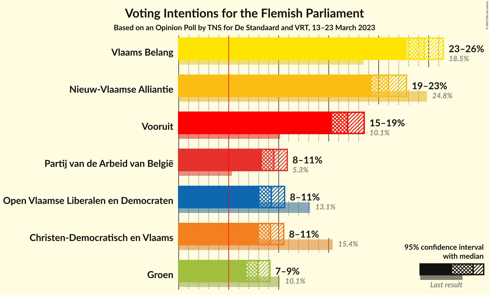

### Confidence Intervals

| Party | Last Result | Poll Result | 80% Confidence Interval | 90% Confidence Interval | 95% Confidence Interval | 99% Confidence Interval |
|:-----:|:-----------:|:-----------:|:-----------------------:|:-----------------------:|:-----------------------:|:-----------------------:|
| Vlaams Belang | 18.5% | 24.6% | 23.4–25.8% |23.1–26.2% |22.8–26.5% |22.2–27.1% |
| Nieuw-Vlaamse Alliantie | 24.8% | 21.0% | 19.9–22.2% |19.6–22.5% |19.3–22.8% |18.8–23.4% |
| Vooruit | 10.1% | 16.9% | 15.9–18.0% |15.6–18.3% |15.3–18.5% |14.8–19.1% |
| Partij van de Arbeid van België | 5.3% | 9.5% | 8.7–10.4% |8.5–10.6% |8.3–10.9% |8.0–11.3% |
| Open Vlaamse Liberalen en Democraten | 13.1% | 9.3% | 8.5–10.1% |8.3–10.4% |8.1–10.6% |7.7–11.0% |
| Christen-Democratisch en Vlaams | 15.4% | 9.2% | 8.4–10.0% |8.2–10.3% |8.0–10.5% |7.7–10.9% |
| Groen | 10.1% | 7.9% | 7.2–8.7% |7.0–8.9% |6.8–9.1% |6.5–9.5% |

*Note:* The poll result column reflects the actual value used in the calculations. Published results may vary slightly, and in addition be rounded to fewer digits.

## Seats

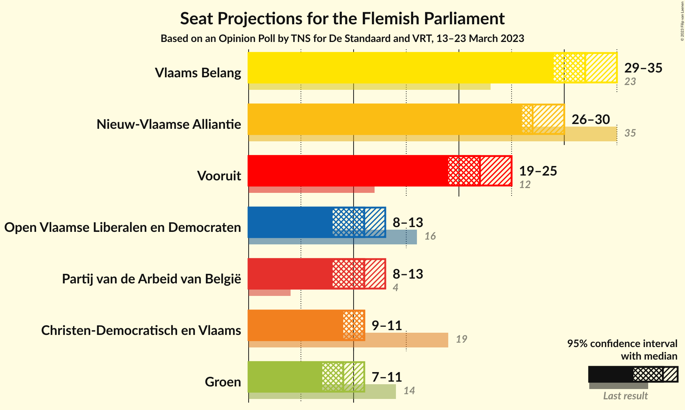

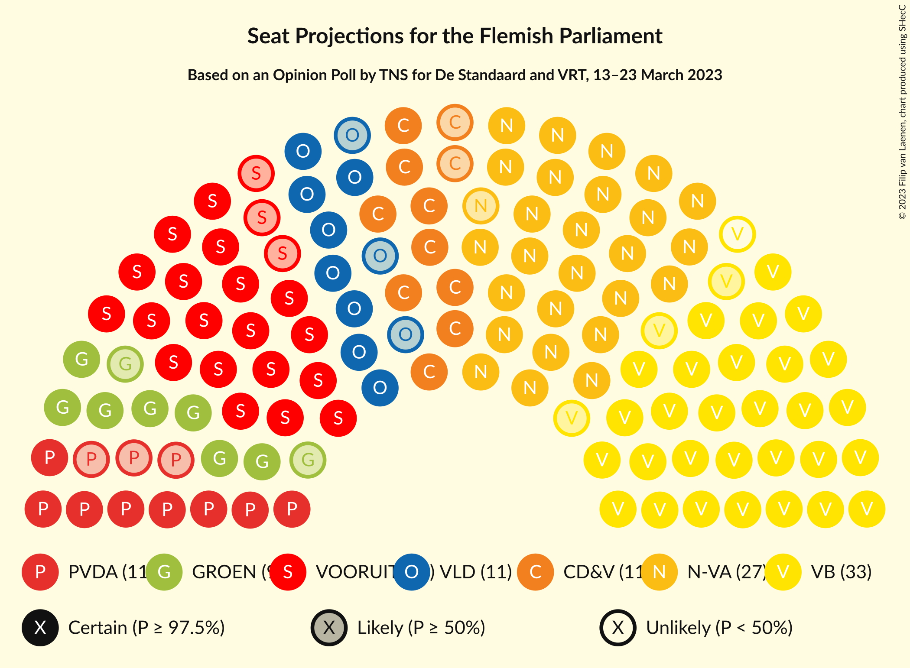

### Confidence Intervals

| Party | Last Result | Median | 80% Confidence Interval | 90% Confidence Interval | 95% Confidence Interval | 99% Confidence Interval |
|:-----:|:-----------:|:------:|:-----------------------:|:-----------------------:|:-----------------------:|:-----------------------:|
| <a href="#vlaams-belang">Vlaams Belang</a> | 23 | 32 | 29–34 |29–35 |29–35 |28–36 |
| <a href="#nieuw-vlaamse-alliantie">Nieuw-Vlaamse Alliantie</a> | 35 | 27 | 26–30 |26–30 |26–30 |25–31 |
| <a href="#vooruit">Vooruit</a> | 12 | 22 | 19–25 |19–25 |19–25 |19–25 |
| <a href="#partij-van-de-arbeid-van-belgië">Partij van de Arbeid van België</a> | 4 | 11 | 9–13 |9–13 |8–13 |8–14 |
| <a href="#open-vlaamse-liberalen-en-democraten">Open Vlaamse Liberalen en Democraten</a> | 16 | 11 | 9–12 |9–12 |8–13 |8–14 |
| <a href="#christen-democratisch-en-vlaams">Christen-Democratisch en Vlaams</a> | 19 | 11 | 9–11 |9–11 |9–11 |8–13 |
| <a href="#groen">Groen</a> | 14 | 9 | 8–11 |7–11 |7–11 |7–12 |

### Vlaams Belang

*For a full overview of the results for this party, see the [Vlaams Belang](party-vlaamsbelang.html) page.*

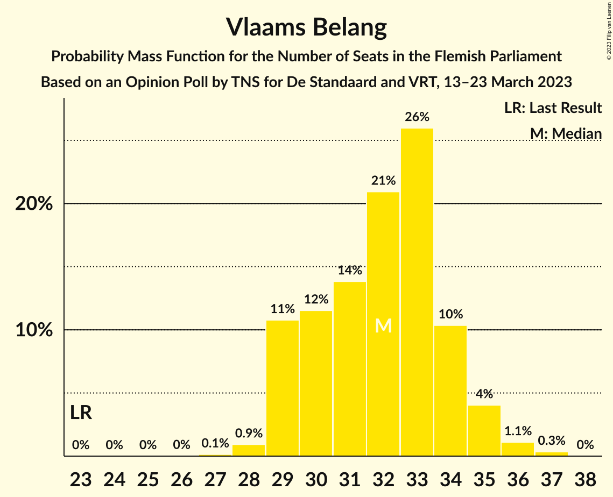

| Number of Seats | Probability | Accumulated | Special Marks |
|:---------------:|:-----------:|:-----------:|:-------------:|
| 23 | 0% | 100% | Last Result |
| 24 | 0% | 100% |  |
| 25 | 0% | 100% |  |
| 26 | 0% | 100% |  |
| 27 | 0.1% | 100% |  |
| 28 | 0.9% | 99.8% |  |
| 29 | 11% | 98.9% |  |
| 30 | 12% | 88% |  |
| 31 | 14% | 77% |  |
| 32 | 21% | 63% | Median |
| 33 | 26% | 42% |  |
| 34 | 10% | 16% |  |
| 35 | 4% | 5% |  |
| 36 | 1.1% | 1.5% |  |
| 37 | 0.3% | 0.4% |  |
| 38 | 0% | 0% |  |

### Nieuw-Vlaamse Alliantie

*For a full overview of the results for this party, see the [Nieuw-Vlaamse Alliantie](party-nieuw-vlaamsealliantie.html) page.*

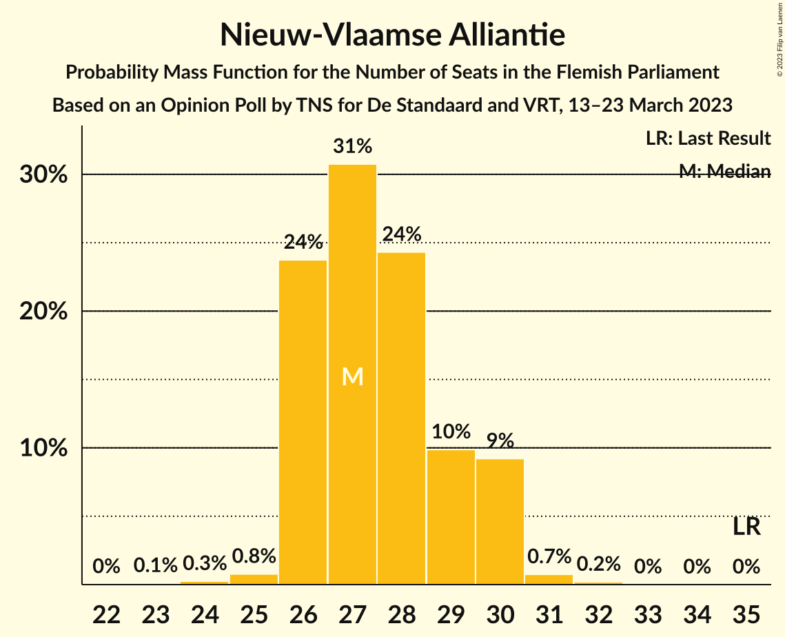

| Number of Seats | Probability | Accumulated | Special Marks |
|:---------------:|:-----------:|:-----------:|:-------------:|
| 23 | 0.1% | 100% |  |
| 24 | 0.3% | 99.9% |  |
| 25 | 0.8% | 99.6% |  |
| 26 | 24% | 98.8% |  |
| 27 | 31% | 75% | Median |
| 28 | 24% | 44% |  |
| 29 | 10% | 20% |  |
| 30 | 9% | 10% |  |
| 31 | 0.7% | 1.0% |  |
| 32 | 0.2% | 0.2% |  |
| 33 | 0% | 0% |  |
| 34 | 0% | 0% |  |
| 35 | 0% | 0% | Last Result |

### Vooruit

*For a full overview of the results for this party, see the [Vooruit](party-vooruit.html) page.*

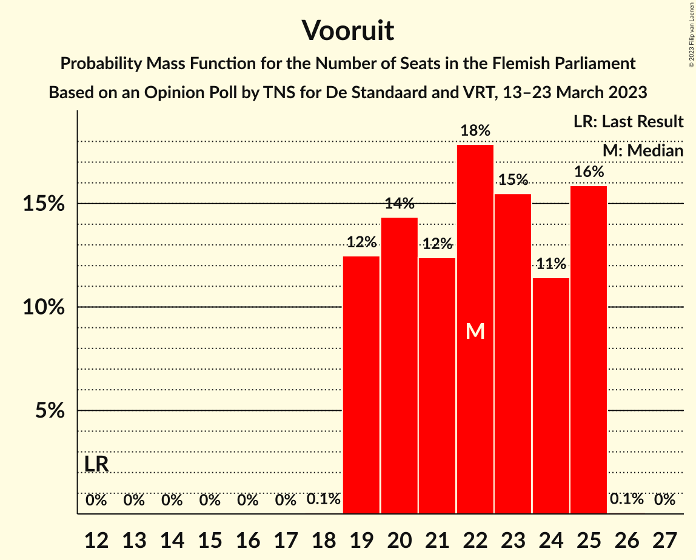

| Number of Seats | Probability | Accumulated | Special Marks |
|:---------------:|:-----------:|:-----------:|:-------------:|
| 12 | 0% | 100% | Last Result |
| 13 | 0% | 100% |  |
| 14 | 0% | 100% |  |
| 15 | 0% | 100% |  |
| 16 | 0% | 100% |  |
| 17 | 0% | 100% |  |
| 18 | 0.1% | 100% |  |
| 19 | 12% | 99.9% |  |
| 20 | 14% | 87% |  |
| 21 | 12% | 73% |  |
| 22 | 18% | 61% | Median |
| 23 | 15% | 43% |  |
| 24 | 11% | 27% |  |
| 25 | 16% | 16% |  |
| 26 | 0.1% | 0.1% |  |
| 27 | 0% | 0% |  |

### Partij van de Arbeid van België

*For a full overview of the results for this party, see the [Partij van de Arbeid van België](party-partijvandearbeidvanbelgië.html) page.*

| Number of Seats | Probability | Accumulated | Special Marks |
|:---------------:|:-----------:|:-----------:|:-------------:|
| 4 | 0% | 100% | Last Result |
| 5 | 0% | 100% |  |
| 6 | 0% | 100% |  |
| 7 | 0.2% | 100% |  |
| 8 | 5% | 99.8% |  |
| 9 | 5% | 95% |  |
| 10 | 17% | 90% |  |
| 11 | 26% | 72% | Median |
| 12 | 19% | 46% |  |
| 13 | 24% | 27% |  |
| 14 | 2% | 2% |  |
| 15 | 0% | 0% |  |

### Open Vlaamse Liberalen en Democraten

*For a full overview of the results for this party, see the [Open Vlaamse Liberalen en Democraten](party-openvlaamseliberalenendemocraten.html) page.*

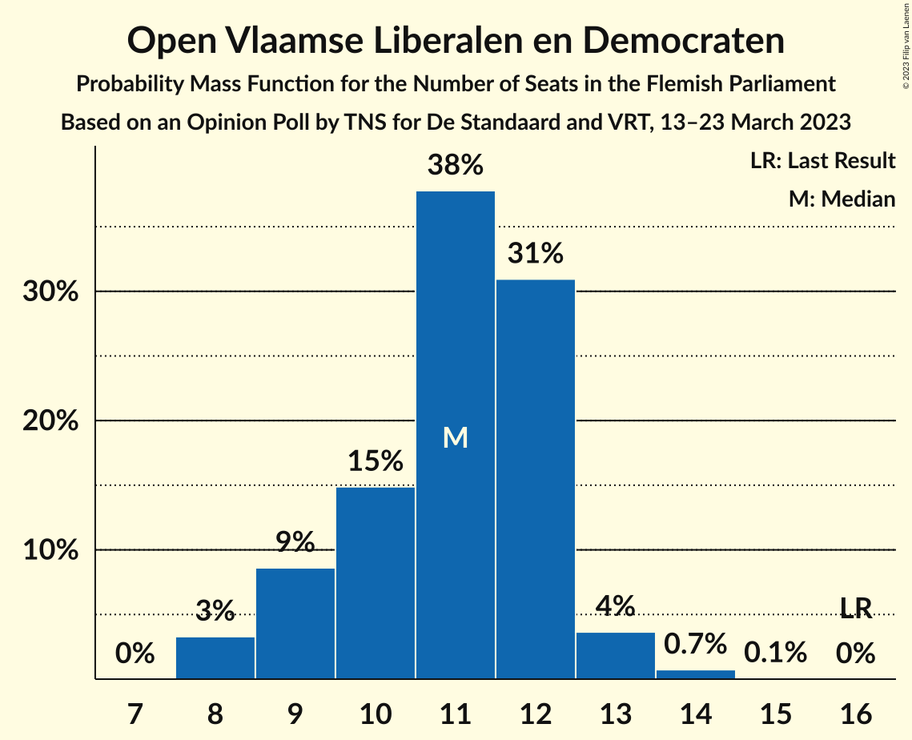

| Number of Seats | Probability | Accumulated | Special Marks |
|:---------------:|:-----------:|:-----------:|:-------------:|
| 8 | 3% | 100% |  |
| 9 | 9% | 97% |  |
| 10 | 15% | 88% |  |
| 11 | 38% | 73% | Median |
| 12 | 31% | 35% |  |
| 13 | 4% | 4% |  |
| 14 | 0.7% | 0.8% |  |
| 15 | 0.1% | 0.1% |  |
| 16 | 0% | 0% | Last Result |

### Christen-Democratisch en Vlaams

*For a full overview of the results for this party, see the [Christen-Democratisch en Vlaams](party-christen-democratischenvlaams.html) page.*

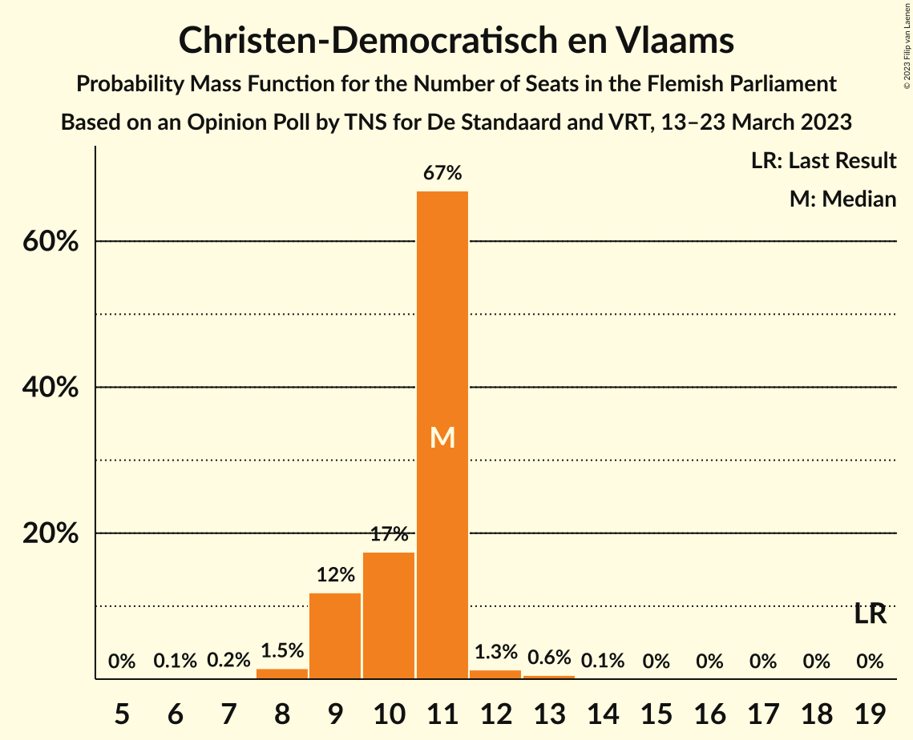

| Number of Seats | Probability | Accumulated | Special Marks |
|:---------------:|:-----------:|:-----------:|:-------------:|
| 6 | 0.1% | 100% |  |
| 7 | 0.2% | 99.9% |  |
| 8 | 1.5% | 99.7% |  |
| 9 | 12% | 98% |  |
| 10 | 17% | 86% |  |
| 11 | 67% | 69% | Median |
| 12 | 1.3% | 2% |  |
| 13 | 0.6% | 0.7% |  |
| 14 | 0.1% | 0.1% |  |
| 15 | 0% | 0% |  |
| 16 | 0% | 0% |  |
| 17 | 0% | 0% |  |
| 18 | 0% | 0% |  |
| 19 | 0% | 0% | Last Result |

### Groen

*For a full overview of the results for this party, see the [Groen](party-groen.html) page.*

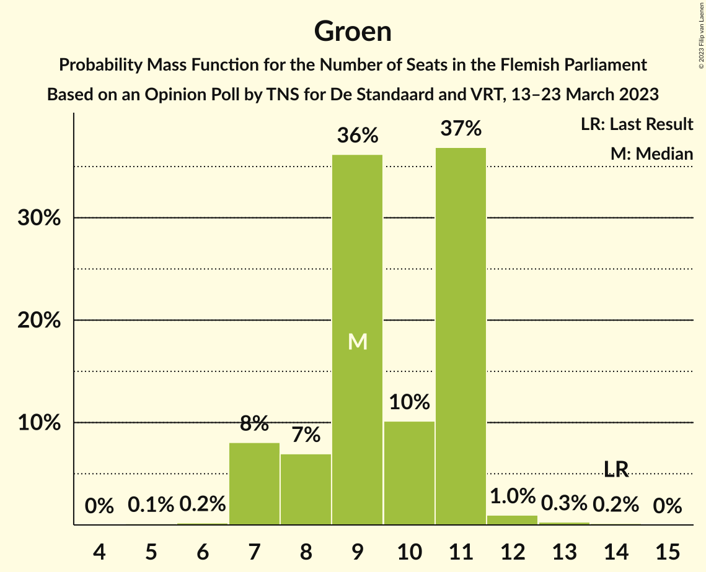

| Number of Seats | Probability | Accumulated | Special Marks |
|:---------------:|:-----------:|:-----------:|:-------------:|
| 5 | 0.1% | 100% |  |
| 6 | 0.2% | 99.9% |  |
| 7 | 8% | 99.7% |  |
| 8 | 7% | 92% |  |
| 9 | 36% | 85% | Median |
| 10 | 10% | 48% |  |
| 11 | 37% | 38% |  |
| 12 | 1.0% | 1.4% |  |
| 13 | 0.3% | 0.4% |  |
| 14 | 0.2% | 0.2% | Last Result |
| 15 | 0% | 0% |  |

## Coalitions

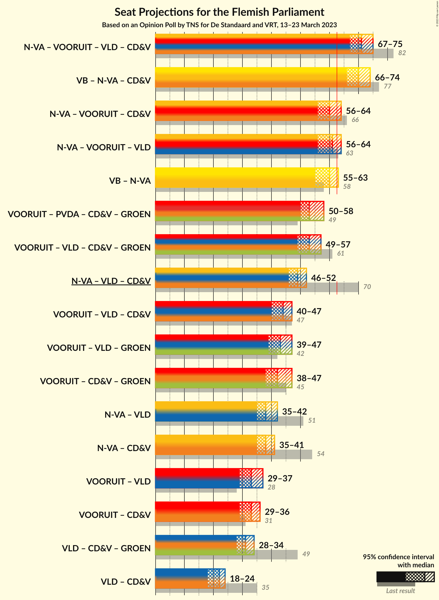

### Confidence Intervals

| Coalition | Last Result | Median | Majority? | 80% Confidence Interval | 90% Confidence Interval | 95% Confidence Interval | 99% Confidence Interval |
|:---------:|:-----------:|:------:|:---------:|:-----------------------:|:-----------------------:|:-----------------------:|:-----------------------:|
| Nieuw-Vlaamse Alliantie – Vooruit – Open Vlaamse Liberalen en Democraten – Christen-Democratisch en Vlaams | 82 | 71 | 100% | 69–74 | 68–74 | 67–75 | 66–76 |
| Vlaams Belang – Nieuw-Vlaamse Alliantie – Christen-Democratisch en Vlaams | 77 | 70 | 100% | 67–72 | 66–73 | 66–74 | 65–75 |
| Nieuw-Vlaamse Alliantie – Vooruit – Christen-Democratisch en Vlaams | 66 | 60 | 12% | 57–63 | 57–63 | 56–64 | 55–65 |
| Nieuw-Vlaamse Alliantie – Vooruit – Open Vlaamse Liberalen en Democraten | 63 | 61 | 16% | 58–63 | 57–64 | 56–64 | 55–66 |
| Vlaams Belang – Nieuw-Vlaamse Alliantie | 58 | 60 | 4% | 57–62 | 56–62 | 55–63 | 55–64 |
| Vooruit – Partij van de Arbeid van België – Christen-Democratisch en Vlaams – Groen | 49 | 53 | 0% | 51–56 | 50–58 | 50–58 | 49–59 |
| Vooruit – Open Vlaamse Liberalen en Democraten – Christen-Democratisch en Vlaams – Groen | 61 | 53 | 0% | 51–56 | 50–57 | 49–57 | 48–59 |
| Nieuw-Vlaamse Alliantie – Open Vlaamse Liberalen en Democraten – Christen-Democratisch en Vlaams | 70 | 49 | 0% | 47–51 | 46–52 | 46–52 | 45–53 |
| Vooruit – Open Vlaamse Liberalen en Democraten – Christen-Democratisch en Vlaams | 47 | 44 | 0% | 41–46 | 40–47 | 40–47 | 39–48 |
| Vooruit – Open Vlaamse Liberalen en Democraten – Groen | 42 | 43 | 0% | 40–46 | 39–46 | 39–47 | 38–48 |
| Vooruit – Christen-Democratisch en Vlaams – Groen | 45 | 42 | 0% | 39–45 | 39–46 | 38–47 | 37–47 |
| Nieuw-Vlaamse Alliantie – Open Vlaamse Liberalen en Democraten | 51 | 38 | 0% | 36–41 | 36–41 | 35–42 | 35–43 |
| Nieuw-Vlaamse Alliantie – Christen-Democratisch en Vlaams | 54 | 38 | 0% | 36–40 | 36–41 | 35–41 | 34–42 |
| Vooruit – Open Vlaamse Liberalen en Democraten | 28 | 33 | 0% | 31–36 | 30–37 | 29–37 | 28–37 |
| Vooruit – Christen-Democratisch en Vlaams | 31 | 33 | 0% | 30–36 | 30–36 | 29–36 | 28–36 |
| Open Vlaamse Liberalen en Democraten – Christen-Democratisch en Vlaams – Groen | 49 | 31 | 0% | 29–33 | 28–34 | 28–34 | 26–36 |
| Open Vlaamse Liberalen en Democraten – Christen-Democratisch en Vlaams | 35 | 22 | 0% | 20–23 | 19–23 | 18–24 | 17–25 |

### Nieuw-Vlaamse Alliantie – Vooruit – Open Vlaamse Liberalen en Democraten – Christen-Democratisch en Vlaams

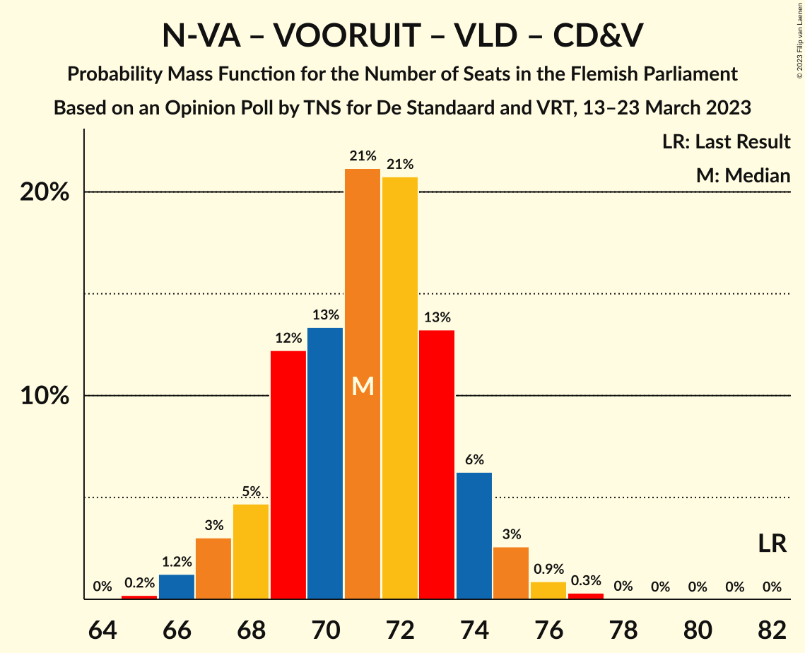

| Number of Seats | Probability | Accumulated | Special Marks |
|:---------------:|:-----------:|:-----------:|:-------------:|
| 65 | 0.2% | 100% |  |
| 66 | 1.2% | 99.8% |  |
| 67 | 3% | 98.5% |  |
| 68 | 5% | 96% |  |
| 69 | 12% | 91% |  |
| 70 | 13% | 79% |  |
| 71 | 21% | 65% | Median |
| 72 | 21% | 44% |  |
| 73 | 13% | 23% |  |
| 74 | 6% | 10% |  |
| 75 | 3% | 4% |  |
| 76 | 0.9% | 1.2% |  |
| 77 | 0.3% | 0.4% |  |
| 78 | 0% | 0% |  |
| 79 | 0% | 0% |  |
| 80 | 0% | 0% |  |
| 81 | 0% | 0% |  |
| 82 | 0% | 0% | Last Result |

### Vlaams Belang – Nieuw-Vlaamse Alliantie – Christen-Democratisch en Vlaams

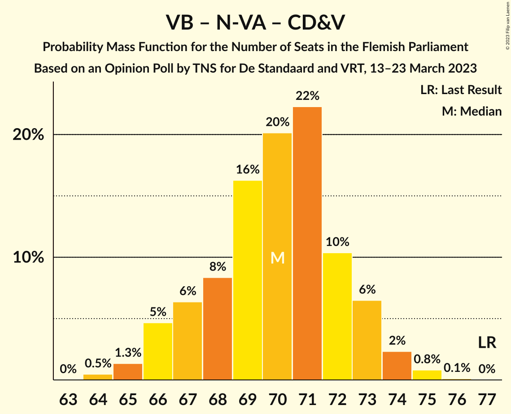

| Number of Seats | Probability | Accumulated | Special Marks |
|:---------------:|:-----------:|:-----------:|:-------------:|
| 64 | 0.5% | 100% |  |
| 65 | 1.3% | 99.5% |  |
| 66 | 5% | 98% |  |
| 67 | 6% | 94% |  |
| 68 | 8% | 87% |  |
| 69 | 16% | 79% |  |
| 70 | 20% | 63% | Median |
| 71 | 22% | 42% |  |
| 72 | 10% | 20% |  |
| 73 | 6% | 10% |  |
| 74 | 2% | 3% |  |
| 75 | 0.8% | 0.9% |  |
| 76 | 0.1% | 0.1% |  |
| 77 | 0% | 0% | Last Result |

### Nieuw-Vlaamse Alliantie – Vooruit – Christen-Democratisch en Vlaams

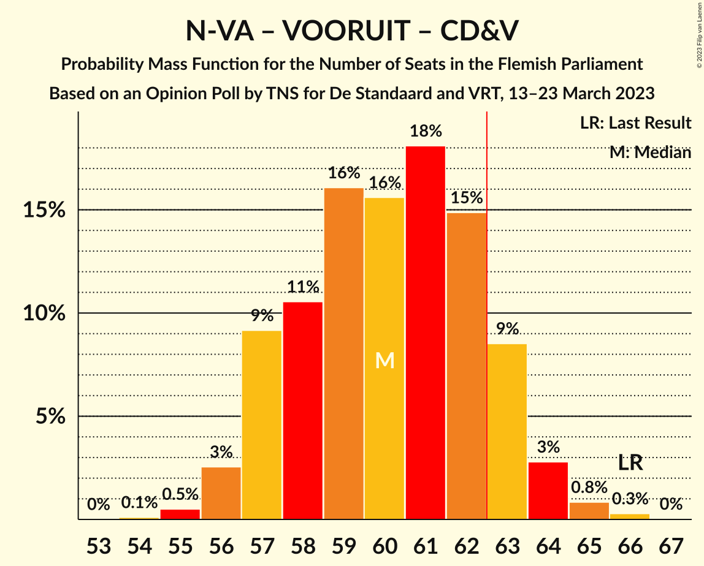

| Number of Seats | Probability | Accumulated | Special Marks |
|:---------------:|:-----------:|:-----------:|:-------------:|
| 54 | 0.1% | 100% |  |
| 55 | 0.5% | 99.9% |  |
| 56 | 3% | 99.4% |  |
| 57 | 9% | 97% |  |
| 58 | 11% | 88% |  |
| 59 | 16% | 77% |  |
| 60 | 16% | 61% | Median |
| 61 | 18% | 45% |  |
| 62 | 15% | 27% |  |
| 63 | 9% | 12% | Majority |
| 64 | 3% | 4% |  |
| 65 | 0.8% | 1.2% |  |
| 66 | 0.3% | 0.3% | Last Result |
| 67 | 0% | 0% |  |

### Nieuw-Vlaamse Alliantie – Vooruit – Open Vlaamse Liberalen en Democraten

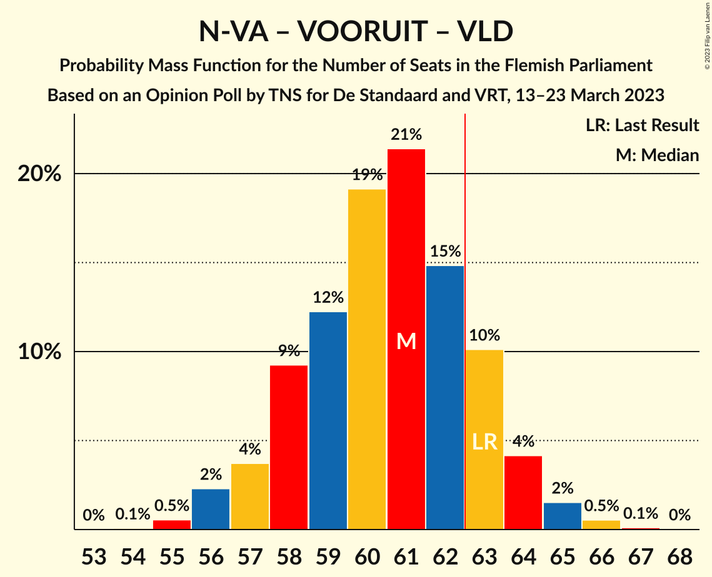

| Number of Seats | Probability | Accumulated | Special Marks |
|:---------------:|:-----------:|:-----------:|:-------------:|
| 54 | 0.1% | 100% |  |
| 55 | 0.5% | 99.9% |  |
| 56 | 2% | 99.4% |  |
| 57 | 4% | 97% |  |
| 58 | 9% | 93% |  |
| 59 | 12% | 84% |  |
| 60 | 19% | 72% | Median |
| 61 | 21% | 53% |  |
| 62 | 15% | 31% |  |
| 63 | 10% | 16% | Last Result, Majority |
| 64 | 4% | 6% |  |
| 65 | 2% | 2% |  |
| 66 | 0.5% | 0.7% |  |
| 67 | 0.1% | 0.1% |  |
| 68 | 0% | 0% |  |

### Vlaams Belang – Nieuw-Vlaamse Alliantie

| Number of Seats | Probability | Accumulated | Special Marks |
|:---------------:|:-----------:|:-----------:|:-------------:|
| 54 | 0.1% | 100% |  |
| 55 | 4% | 99.8% |  |
| 56 | 6% | 96% |  |
| 57 | 7% | 91% |  |
| 58 | 12% | 83% | Last Result |
| 59 | 18% | 71% | Median |
| 60 | 26% | 53% |  |
| 61 | 14% | 27% |  |
| 62 | 9% | 13% |  |
| 63 | 3% | 4% | Majority |
| 64 | 1.1% | 1.3% |  |
| 65 | 0.2% | 0.2% |  |
| 66 | 0% | 0% |  |

### Vooruit – Partij van de Arbeid van België – Christen-Democratisch en Vlaams – Groen

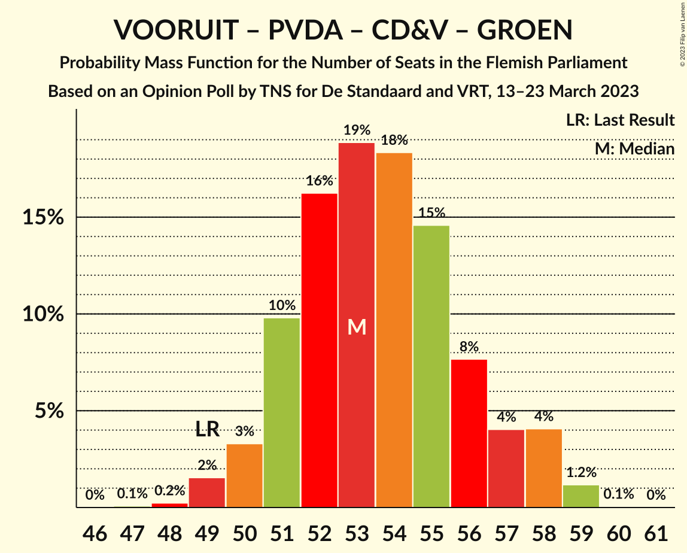

| Number of Seats | Probability | Accumulated | Special Marks |
|:---------------:|:-----------:|:-----------:|:-------------:|
| 47 | 0.1% | 100% |  |
| 48 | 0.2% | 99.9% |  |
| 49 | 2% | 99.7% | Last Result |
| 50 | 3% | 98% |  |
| 51 | 10% | 95% |  |
| 52 | 16% | 85% |  |
| 53 | 19% | 69% | Median |
| 54 | 18% | 50% |  |
| 55 | 15% | 32% |  |
| 56 | 8% | 17% |  |
| 57 | 4% | 9% |  |
| 58 | 4% | 5% |  |
| 59 | 1.2% | 1.2% |  |
| 60 | 0.1% | 0.1% |  |
| 61 | 0% | 0% |  |

### Vooruit – Open Vlaamse Liberalen en Democraten – Christen-Democratisch en Vlaams – Groen

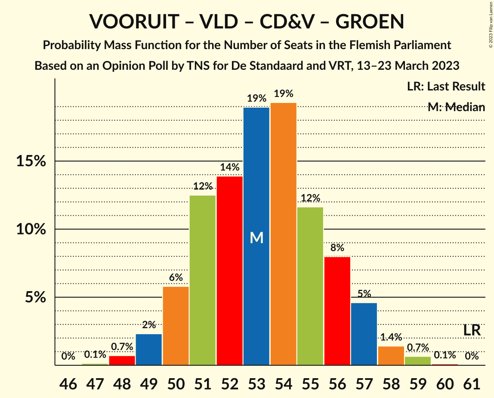

| Number of Seats | Probability | Accumulated | Special Marks |
|:---------------:|:-----------:|:-----------:|:-------------:|
| 47 | 0.1% | 100% |  |
| 48 | 0.7% | 99.9% |  |
| 49 | 2% | 99.1% |  |
| 50 | 6% | 97% |  |
| 51 | 12% | 91% |  |
| 52 | 14% | 79% |  |
| 53 | 19% | 65% | Median |
| 54 | 19% | 46% |  |
| 55 | 12% | 26% |  |
| 56 | 8% | 15% |  |
| 57 | 5% | 7% |  |
| 58 | 1.4% | 2% |  |
| 59 | 0.7% | 0.8% |  |
| 60 | 0.1% | 0.1% |  |
| 61 | 0% | 0% | Last Result |

### Nieuw-Vlaamse Alliantie – Open Vlaamse Liberalen en Democraten – Christen-Democratisch en Vlaams

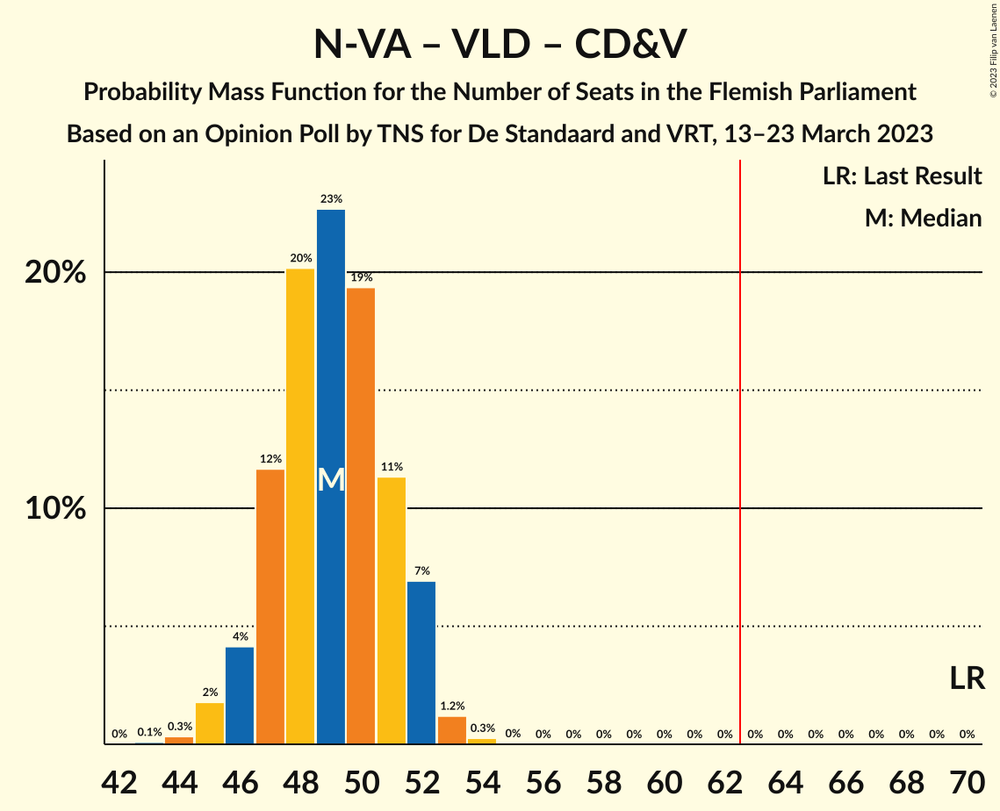

| Number of Seats | Probability | Accumulated | Special Marks |
|:---------------:|:-----------:|:-----------:|:-------------:|
| 43 | 0.1% | 100% |  |
| 44 | 0.3% | 99.9% |  |
| 45 | 2% | 99.6% |  |
| 46 | 4% | 98% |  |
| 47 | 12% | 94% |  |
| 48 | 20% | 82% |  |
| 49 | 23% | 62% | Median |
| 50 | 19% | 39% |  |
| 51 | 11% | 20% |  |
| 52 | 7% | 8% |  |
| 53 | 1.2% | 2% |  |
| 54 | 0.3% | 0.3% |  |
| 55 | 0% | 0% |  |
| 56 | 0% | 0% |  |
| 57 | 0% | 0% |  |
| 58 | 0% | 0% |  |
| 59 | 0% | 0% |  |
| 60 | 0% | 0% |  |
| 61 | 0% | 0% |  |
| 62 | 0% | 0% |  |
| 63 | 0% | 0% | Majority |
| 64 | 0% | 0% |  |
| 65 | 0% | 0% |  |
| 66 | 0% | 0% |  |
| 67 | 0% | 0% |  |
| 68 | 0% | 0% |  |
| 69 | 0% | 0% |  |
| 70 | 0% | 0% | Last Result |

### Vooruit – Open Vlaamse Liberalen en Democraten – Christen-Democratisch en Vlaams

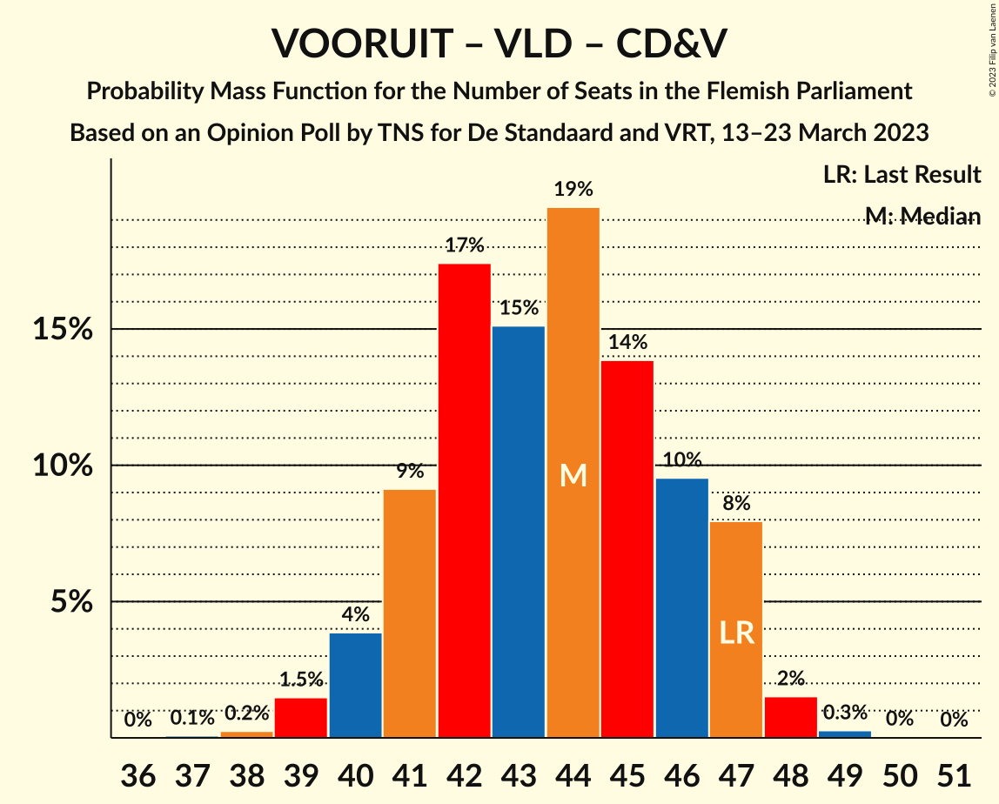

| Number of Seats | Probability | Accumulated | Special Marks |
|:---------------:|:-----------:|:-----------:|:-------------:|
| 37 | 0.1% | 100% |  |
| 38 | 0.2% | 99.9% |  |
| 39 | 1.5% | 99.7% |  |
| 40 | 4% | 98% |  |
| 41 | 9% | 94% |  |
| 42 | 17% | 85% |  |
| 43 | 15% | 68% |  |
| 44 | 19% | 53% | Median |
| 45 | 14% | 33% |  |
| 46 | 10% | 19% |  |
| 47 | 8% | 10% | Last Result |
| 48 | 2% | 2% |  |
| 49 | 0.3% | 0.3% |  |
| 50 | 0% | 0.1% |  |
| 51 | 0% | 0% |  |

### Vooruit – Open Vlaamse Liberalen en Democraten – Groen

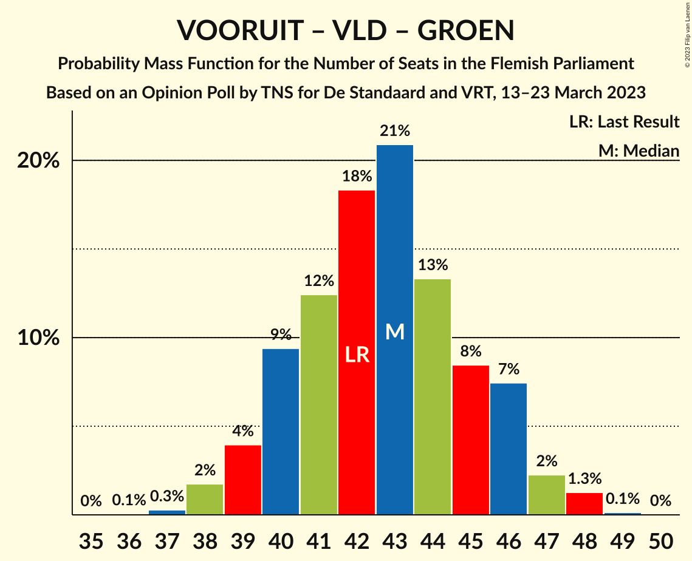

| Number of Seats | Probability | Accumulated | Special Marks |
|:---------------:|:-----------:|:-----------:|:-------------:|
| 36 | 0.1% | 100% |  |
| 37 | 0.3% | 99.9% |  |
| 38 | 2% | 99.7% |  |
| 39 | 4% | 98% |  |
| 40 | 9% | 94% |  |
| 41 | 12% | 85% |  |
| 42 | 18% | 72% | Last Result, Median |
| 43 | 21% | 54% |  |
| 44 | 13% | 33% |  |
| 45 | 8% | 20% |  |
| 46 | 7% | 11% |  |
| 47 | 2% | 4% |  |
| 48 | 1.3% | 1.4% |  |
| 49 | 0.1% | 0.2% |  |
| 50 | 0% | 0% |  |

### Vooruit – Christen-Democratisch en Vlaams – Groen

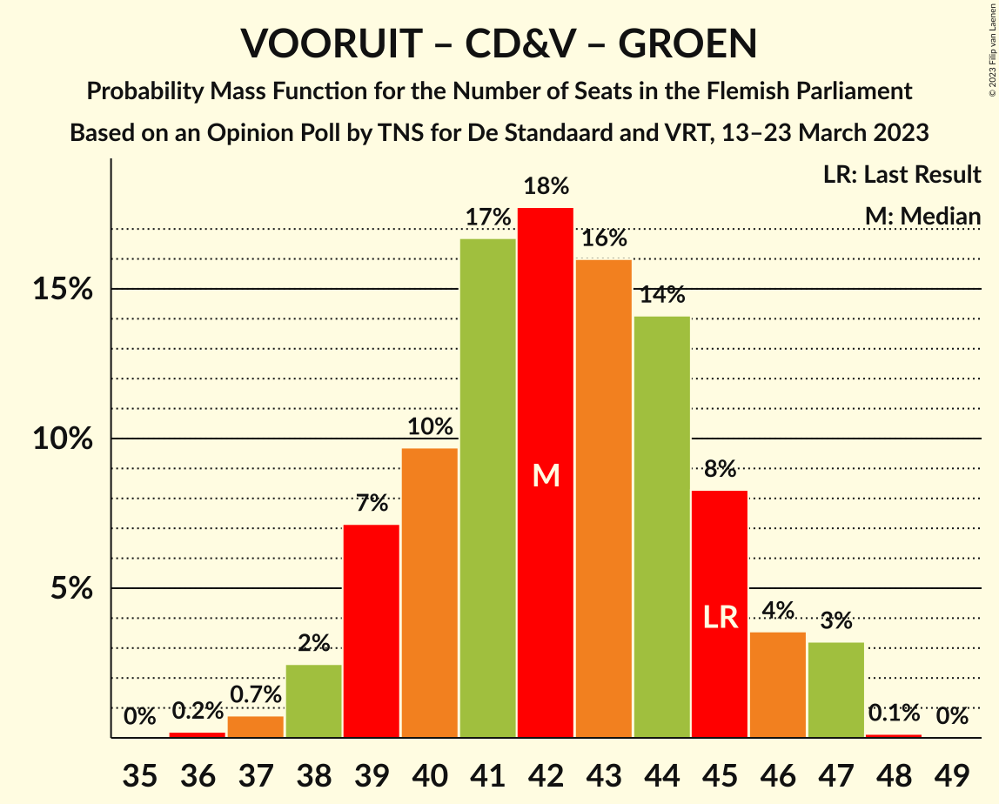

| Number of Seats | Probability | Accumulated | Special Marks |
|:---------------:|:-----------:|:-----------:|:-------------:|
| 36 | 0.2% | 100% |  |
| 37 | 0.7% | 99.8% |  |
| 38 | 2% | 99.0% |  |
| 39 | 7% | 97% |  |
| 40 | 10% | 89% |  |
| 41 | 17% | 80% |  |
| 42 | 18% | 63% | Median |
| 43 | 16% | 45% |  |
| 44 | 14% | 29% |  |
| 45 | 8% | 15% | Last Result |
| 46 | 4% | 7% |  |
| 47 | 3% | 3% |  |
| 48 | 0.1% | 0.2% |  |
| 49 | 0% | 0% |  |

### Nieuw-Vlaamse Alliantie – Open Vlaamse Liberalen en Democraten

| Number of Seats | Probability | Accumulated | Special Marks |
|:---------------:|:-----------:|:-----------:|:-------------:|
| 33 | 0.1% | 100% |  |
| 34 | 0.4% | 99.9% |  |
| 35 | 2% | 99.5% |  |
| 36 | 10% | 97% |  |
| 37 | 15% | 88% |  |
| 38 | 25% | 73% | Median |
| 39 | 22% | 48% |  |
| 40 | 15% | 27% |  |
| 41 | 8% | 11% |  |
| 42 | 3% | 3% |  |
| 43 | 0.4% | 0.5% |  |
| 44 | 0.1% | 0.1% |  |
| 45 | 0% | 0% |  |
| 46 | 0% | 0% |  |
| 47 | 0% | 0% |  |
| 48 | 0% | 0% |  |
| 49 | 0% | 0% |  |
| 50 | 0% | 0% |  |
| 51 | 0% | 0% | Last Result |

### Nieuw-Vlaamse Alliantie – Christen-Democratisch en Vlaams

| Number of Seats | Probability | Accumulated | Special Marks |
|:---------------:|:-----------:|:-----------:|:-------------:|
| 33 | 0.1% | 100% |  |
| 34 | 0.4% | 99.9% |  |
| 35 | 4% | 99.5% |  |
| 36 | 9% | 95% |  |
| 37 | 21% | 86% |  |
| 38 | 28% | 65% | Median |
| 39 | 24% | 37% |  |
| 40 | 7% | 14% |  |
| 41 | 6% | 7% |  |
| 42 | 0.6% | 0.8% |  |
| 43 | 0.1% | 0.1% |  |
| 44 | 0% | 0% |  |
| 45 | 0% | 0% |  |
| 46 | 0% | 0% |  |
| 47 | 0% | 0% |  |
| 48 | 0% | 0% |  |
| 49 | 0% | 0% |  |
| 50 | 0% | 0% |  |
| 51 | 0% | 0% |  |
| 52 | 0% | 0% |  |
| 53 | 0% | 0% |  |
| 54 | 0% | 0% | Last Result |

### Vooruit – Open Vlaamse Liberalen en Democraten

| Number of Seats | Probability | Accumulated | Special Marks |
|:---------------:|:-----------:|:-----------:|:-------------:|
| 27 | 0.1% | 100% |  |
| 28 | 0.7% | 99.9% | Last Result |
| 29 | 3% | 99.2% |  |
| 30 | 5% | 97% |  |
| 31 | 15% | 91% |  |
| 32 | 16% | 76% |  |
| 33 | 19% | 60% | Median |
| 34 | 16% | 40% |  |
| 35 | 11% | 25% |  |
| 36 | 8% | 14% |  |
| 37 | 5% | 5% |  |
| 38 | 0.4% | 0.4% |  |
| 39 | 0.1% | 0.1% |  |
| 40 | 0% | 0% |  |

### Vooruit – Christen-Democratisch en Vlaams

| Number of Seats | Probability | Accumulated | Special Marks |
|:---------------:|:-----------:|:-----------:|:-------------:|
| 27 | 0.1% | 100% |  |
| 28 | 0.5% | 99.9% |  |
| 29 | 3% | 99.4% |  |
| 30 | 15% | 96% |  |
| 31 | 14% | 81% | Last Result |
| 32 | 15% | 67% |  |
| 33 | 17% | 52% | Median |
| 34 | 13% | 35% |  |
| 35 | 11% | 22% |  |
| 36 | 11% | 11% |  |
| 37 | 0.2% | 0.3% |  |
| 38 | 0% | 0.1% |  |
| 39 | 0% | 0% |  |

### Open Vlaamse Liberalen en Democraten – Christen-Democratisch en Vlaams – Groen

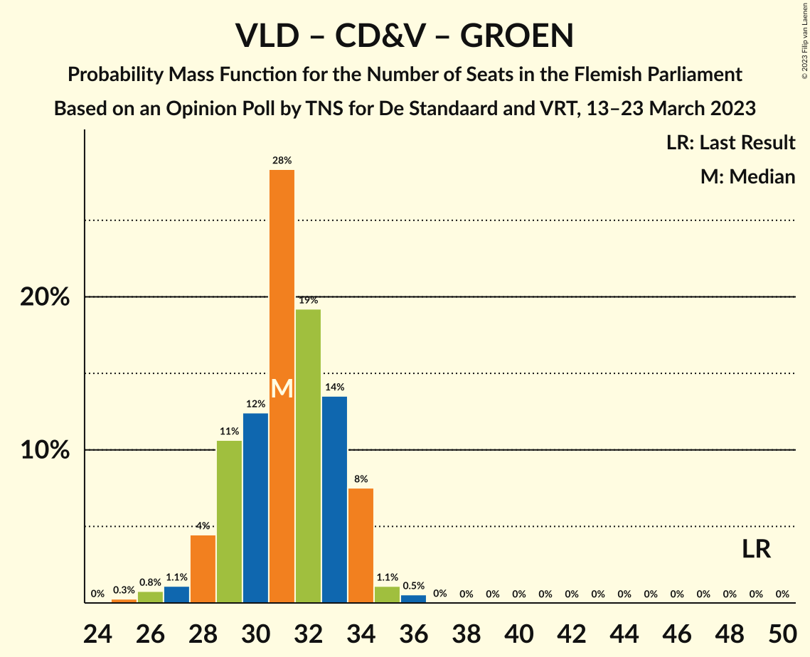

| Number of Seats | Probability | Accumulated | Special Marks |
|:---------------:|:-----------:|:-----------:|:-------------:|
| 25 | 0.3% | 100% |  |
| 26 | 0.8% | 99.7% |  |
| 27 | 1.1% | 98.9% |  |
| 28 | 4% | 98% |  |
| 29 | 11% | 93% |  |
| 30 | 12% | 83% |  |
| 31 | 28% | 70% | Median |
| 32 | 19% | 42% |  |
| 33 | 14% | 23% |  |
| 34 | 8% | 9% |  |
| 35 | 1.1% | 2% |  |
| 36 | 0.5% | 0.6% |  |
| 37 | 0% | 0% |  |
| 38 | 0% | 0% |  |
| 39 | 0% | 0% |  |
| 40 | 0% | 0% |  |
| 41 | 0% | 0% |  |
| 42 | 0% | 0% |  |
| 43 | 0% | 0% |  |
| 44 | 0% | 0% |  |
| 45 | 0% | 0% |  |
| 46 | 0% | 0% |  |
| 47 | 0% | 0% |  |
| 48 | 0% | 0% |  |
| 49 | 0% | 0% | Last Result |

### Open Vlaamse Liberalen en Democraten – Christen-Democratisch en Vlaams

| Number of Seats | Probability | Accumulated | Special Marks |
|:---------------:|:-----------:|:-----------:|:-------------:|
| 16 | 0.1% | 100% |  |
| 17 | 0.5% | 99.9% |  |
| 18 | 2% | 99.4% |  |
| 19 | 6% | 97% |  |
| 20 | 10% | 91% |  |
| 21 | 20% | 81% |  |
| 22 | 43% | 62% | Median |
| 23 | 15% | 19% |  |
| 24 | 3% | 4% |  |
| 25 | 0.9% | 1.0% |  |
| 26 | 0.1% | 0.1% |  |
| 27 | 0% | 0% |  |
| 28 | 0% | 0% |  |
| 29 | 0% | 0% |  |
| 30 | 0% | 0% |  |
| 31 | 0% | 0% |  |
| 32 | 0% | 0% |  |
| 33 | 0% | 0% |  |
| 34 | 0% | 0% |  |
| 35 | 0% | 0% | Last Result |

## Technical Information

### Opinion Poll

+ **Polling firm:** TNS
+ **Commissioner(s):** De Standaard and VRT
+ **Fieldwork period:** 13–23 March 2023

### Calculations

+ **Sample size:** 2092
+ **Simulations done:** 1,048,576
+ **Error estimate:** 0.67%

