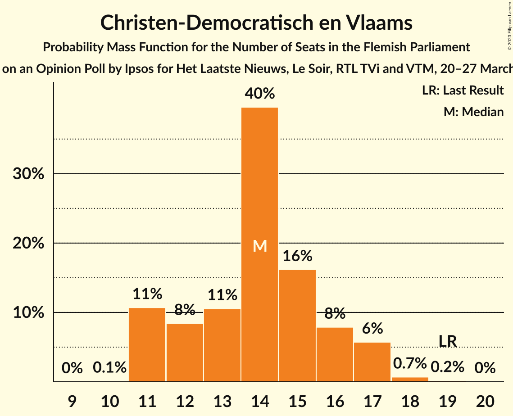
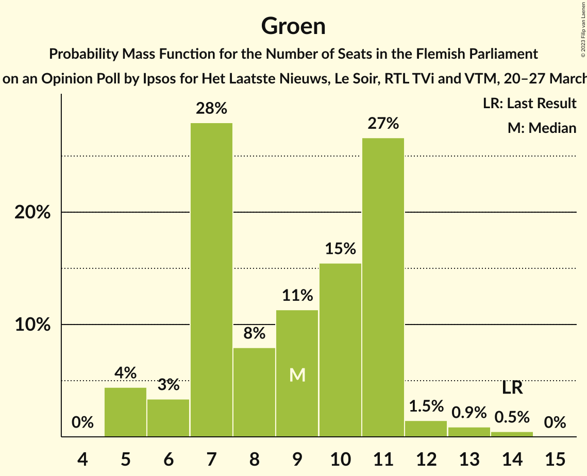
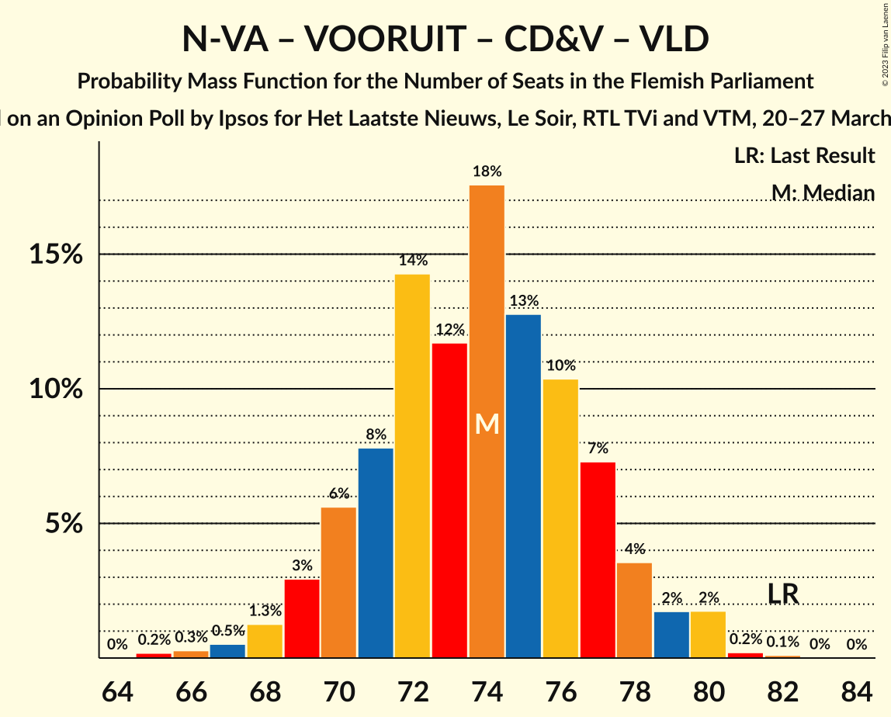
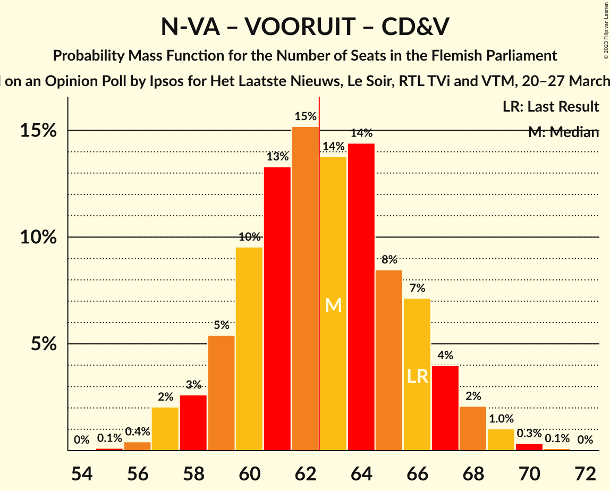
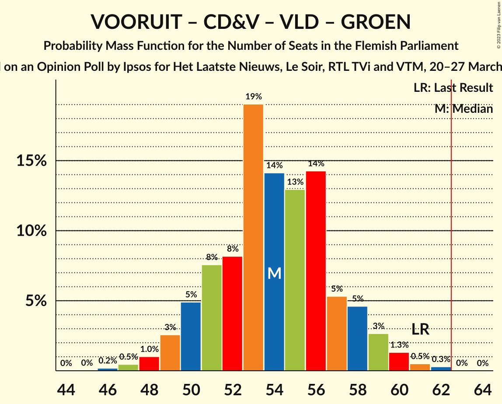
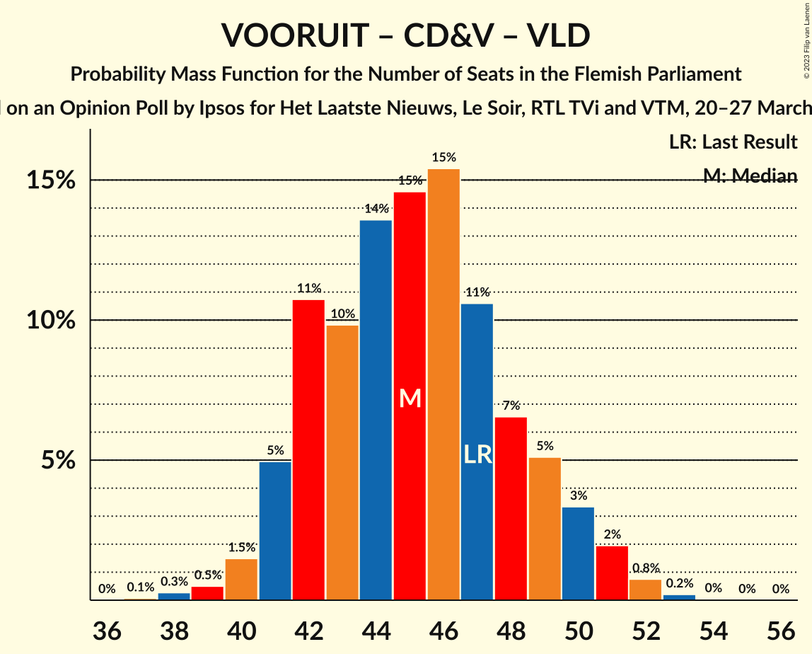
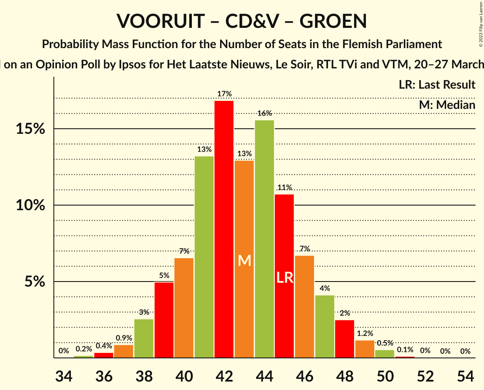

# Opinion Poll by Ipsos for Het Laatste Nieuws, Le Soir, RTL TVi and VTM, 20–27 March 2023

<a href="#voting-intentions">Voting Intentions</a> | <a href="#seats">Seats</a> | <a href="#coalitions">Coalitions</a> | <a href="#technical-information">Technical Information</a>

## Voting Intentions

### Confidence Intervals

| Party | Last Result | Poll Result | 80% Confidence Interval | 90% Confidence Interval | 95% Confidence Interval | 99% Confidence Interval |
|:-----:|:-----------:|:-----------:|:-----------------------:|:-----------------------:|:-----------------------:|:-----------------------:|
| Vlaams Belang | 18.5% | 25.0% | 23.3–26.8% |22.8–27.3% |22.4–27.8% |21.6–28.7% |
| Nieuw-Vlaamse Alliantie | 24.8% | 21.6% | 20.0–23.4% |19.5–23.8% |19.2–24.3% |18.4–25.1% |
| Vooruit | 10.1% | 15.5% | 14.1–17.1% |13.7–17.5% |13.4–17.9% |12.7–18.7% |
| Christen-Democratisch en Vlaams | 15.4% | 11.8% | 10.6–13.2% |10.2–13.6% |9.9–14.0% |9.4–14.7% |
| Open Vlaamse Liberalen en Democraten | 13.1% | 9.2% | 8.1–10.5% |7.8–10.8% |7.6–11.2% |7.1–11.8% |
| Partij van de Arbeid van België | 5.3% | 8.0% | 7.0–9.2% |6.7–9.6% |6.5–9.9% |6.0–10.5% |
| Groen | 10.1% | 7.4% | 6.4–8.6% |6.2–8.9% |5.9–9.2% |5.5–9.8% |

*Note:* The poll result column reflects the actual value used in the calculations. Published results may vary slightly, and in addition be rounded to fewer digits.

## Seats

### Confidence Intervals

| Party | Last Result | Median | 80% Confidence Interval | 90% Confidence Interval | 95% Confidence Interval | 99% Confidence Interval |
|:-----:|:-----------:|:------:|:-----------------------:|:-----------------------:|:-----------------------:|:-----------------------:|
| <a href="#vlaams-belang">Vlaams Belang</a> | 23 | 33 | 30–36 |30–36 |29–37 |27–38 |
| <a href="#nieuw-vlaamse-alliantie">Nieuw-Vlaamse Alliantie</a> | 35 | 29 | 26–31 |26–32 |26–32 |24–34 |
| <a href="#vooruit">Vooruit</a> | 12 | 20 | 18–23 |17–24 |17–25 |16–25 |
| <a href="#christen-democratisch-en-vlaams">Christen-Democratisch en Vlaams</a> | 19 | 14 | 11–16 |11–17 |11–17 |11–18 |
| <a href="#open-vlaamse-liberalen-en-democraten">Open Vlaamse Liberalen en Democraten</a> | 16 | 11 | 9–13 |8–13 |8–14 |8–15 |
| <a href="#partij-van-de-arbeid-van-belgië">Partij van de Arbeid van België</a> | 4 | 8 | 7–11 |7–12 |6–13 |5–13 |
| <a href="#groen">Groen</a> | 14 | 9 | 7–11 |6–11 |5–12 |5–14 |

### Vlaams Belang

*For a full overview of the results for this party, see the [Vlaams Belang](party-vlaamsbelang.html) page.*

| Number of Seats | Probability | Accumulated | Special Marks |
|:---------------:|:-----------:|:-----------:|:-------------:|
| 23 | 0% | 100% | Last Result |
| 24 | 0% | 100% |  |
| 25 | 0% | 100% |  |
| 26 | 0.2% | 100% |  |
| 27 | 0.4% | 99.8% |  |
| 28 | 1.4% | 99.4% |  |
| 29 | 3% | 98% |  |
| 30 | 7% | 95% |  |
| 31 | 13% | 88% |  |
| 32 | 13% | 75% |  |
| 33 | 26% | 62% | Median |
| 34 | 12% | 35% |  |
| 35 | 11% | 23% |  |
| 36 | 7% | 12% |  |
| 37 | 2% | 4% |  |
| 38 | 2% | 2% |  |
| 39 | 0.2% | 0.3% |  |
| 40 | 0% | 0.1% |  |
| 41 | 0% | 0% |  |

### Nieuw-Vlaamse Alliantie

*For a full overview of the results for this party, see the [Nieuw-Vlaamse Alliantie](party-nieuw-vlaamsealliantie.html) page.*

| Number of Seats | Probability | Accumulated | Special Marks |
|:---------------:|:-----------:|:-----------:|:-------------:|
| 22 | 0.1% | 100% |  |
| 23 | 0.2% | 99.9% |  |
| 24 | 0.5% | 99.7% |  |
| 25 | 1.2% | 99.2% |  |
| 26 | 16% | 98% |  |
| 27 | 14% | 82% |  |
| 28 | 17% | 68% |  |
| 29 | 14% | 50% | Median |
| 30 | 23% | 36% |  |
| 31 | 6% | 13% |  |
| 32 | 5% | 7% |  |
| 33 | 1.3% | 2% |  |
| 34 | 0.7% | 0.9% |  |
| 35 | 0.1% | 0.2% | Last Result |
| 36 | 0.1% | 0.1% |  |
| 37 | 0% | 0% |  |

### Vooruit

*For a full overview of the results for this party, see the [Vooruit](party-vooruit.html) page.*

| Number of Seats | Probability | Accumulated | Special Marks |
|:---------------:|:-----------:|:-----------:|:-------------:|
| 12 | 0% | 100% | Last Result |
| 13 | 0% | 100% |  |
| 14 | 0% | 100% |  |
| 15 | 0.1% | 100% |  |
| 16 | 2% | 99.8% |  |
| 17 | 5% | 98% |  |
| 18 | 7% | 93% |  |
| 19 | 34% | 85% |  |
| 20 | 17% | 52% | Median |
| 21 | 11% | 34% |  |
| 22 | 6% | 23% |  |
| 23 | 8% | 17% |  |
| 24 | 4% | 9% |  |
| 25 | 5% | 5% |  |
| 26 | 0% | 0.1% |  |
| 27 | 0% | 0% |  |

### Christen-Democratisch en Vlaams

*For a full overview of the results for this party, see the [Christen-Democratisch en Vlaams](party-christen-democratischenvlaams.html) page.*

| Number of Seats | Probability | Accumulated | Special Marks |
|:---------------:|:-----------:|:-----------:|:-------------:|
| 10 | 0.1% | 100% |  |
| 11 | 13% | 99.9% |  |
| 12 | 10% | 87% |  |
| 13 | 11% | 78% |  |
| 14 | 33% | 67% | Median |
| 15 | 17% | 34% |  |
| 16 | 9% | 17% |  |
| 17 | 7% | 8% |  |
| 18 | 0.6% | 0.8% |  |
| 19 | 0.2% | 0.2% | Last Result |
| 20 | 0% | 0% |  |

### Open Vlaamse Liberalen en Democraten

*For a full overview of the results for this party, see the [Open Vlaamse Liberalen en Democraten](party-openvlaamseliberalenendemocraten.html) page.*

| Number of Seats | Probability | Accumulated | Special Marks |
|:---------------:|:-----------:|:-----------:|:-------------:|
| 6 | 0% | 100% |  |
| 7 | 0.4% | 99.9% |  |
| 8 | 7% | 99.6% |  |
| 9 | 7% | 93% |  |
| 10 | 13% | 86% |  |
| 11 | 29% | 73% | Median |
| 12 | 31% | 43% |  |
| 13 | 7% | 12% |  |
| 14 | 3% | 5% |  |
| 15 | 2% | 2% |  |
| 16 | 0.1% | 0.1% | Last Result |
| 17 | 0% | 0% |  |

### Partij van de Arbeid van België

*For a full overview of the results for this party, see the [Partij van de Arbeid van België](party-partijvandearbeidvanbelgië.html) page.*

| Number of Seats | Probability | Accumulated | Special Marks |
|:---------------:|:-----------:|:-----------:|:-------------:|
| 4 | 0.1% | 100% | Last Result |
| 5 | 2% | 99.9% |  |
| 6 | 1.3% | 98% |  |
| 7 | 38% | 97% |  |
| 8 | 23% | 59% | Median |
| 9 | 10% | 36% |  |
| 10 | 8% | 26% |  |
| 11 | 11% | 18% |  |
| 12 | 3% | 6% |  |
| 13 | 3% | 3% |  |
| 14 | 0.2% | 0.2% |  |
| 15 | 0% | 0% |  |

### Groen

*For a full overview of the results for this party, see the [Groen](party-groen.html) page.*

| Number of Seats | Probability | Accumulated | Special Marks |
|:---------------:|:-----------:|:-----------:|:-------------:|
| 5 | 5% | 100% |  |
| 6 | 3% | 95% |  |
| 7 | 28% | 92% |  |
| 8 | 7% | 64% |  |
| 9 | 13% | 57% | Median |
| 10 | 16% | 44% |  |
| 11 | 26% | 29% |  |
| 12 | 1.1% | 3% |  |
| 13 | 1.1% | 2% |  |
| 14 | 0.5% | 0.5% | Last Result |
| 15 | 0% | 0% |  |

## Coalitions

### Confidence Intervals

| Coalition | Last Result | Median | Majority? | 80% Confidence Interval | 90% Confidence Interval | 95% Confidence Interval | 99% Confidence Interval |
|:---------:|:-----------:|:------:|:---------:|:-----------------------:|:-----------------------:|:-----------------------:|:-----------------------:|
| Vlaams Belang – Nieuw-Vlaamse Alliantie – Christen-Democratisch en Vlaams | 77 | 76 | 100% | 72–78 | 71–79 | 70–80 | 69–82 |
| Nieuw-Vlaamse Alliantie – Vooruit – Christen-Democratisch en Vlaams – Open Vlaamse Liberalen en Democraten | 82 | 74 | 100% | 70–77 | 69–78 | 69–79 | 67–80 |
| Nieuw-Vlaamse Alliantie – Vooruit – Christen-Democratisch en Vlaams | 66 | 63 | 51% | 59–66 | 58–67 | 57–68 | 56–69 |
| Vlaams Belang – Nieuw-Vlaamse Alliantie | 58 | 61 | 35% | 58–65 | 57–65 | 57–66 | 55–68 |
| Nieuw-Vlaamse Alliantie – Vooruit – Open Vlaamse Liberalen en Democraten | 63 | 60 | 17% | 57–63 | 56–64 | 55–65 | 53–67 |
| Vooruit – Christen-Democratisch en Vlaams – Open Vlaamse Liberalen en Democraten – Groen | 61 | 54 | 0% | 51–58 | 50–59 | 49–60 | 47–61 |
| Nieuw-Vlaamse Alliantie – Christen-Democratisch en Vlaams – Open Vlaamse Liberalen en Democraten | 70 | 54 | 0% | 50–57 | 49–58 | 48–58 | 47–60 |
| Vooruit – Christen-Democratisch en Vlaams – Partij van de Arbeid van België – Groen | 49 | 51 | 0% | 48–55 | 47–56 | 46–57 | 45–58 |
| Vooruit – Christen-Democratisch en Vlaams – Open Vlaamse Liberalen en Democraten | 47 | 45 | 0% | 42–49 | 41–50 | 41–51 | 39–52 |
| Vooruit – Christen-Democratisch en Vlaams – Groen | 45 | 43 | 0% | 40–46 | 39–47 | 38–48 | 37–50 |
| Nieuw-Vlaamse Alliantie – Christen-Democratisch en Vlaams | 54 | 43 | 0% | 40–45 | 39–46 | 38–47 | 37–49 |
| Vooruit – Open Vlaamse Liberalen en Democraten – Groen | 42 | 40 | 0% | 37–44 | 36–45 | 35–45 | 34–47 |
| Nieuw-Vlaamse Alliantie – Open Vlaamse Liberalen en Democraten | 51 | 40 | 0% | 37–43 | 36–44 | 35–44 | 34–45 |
| Vooruit – Christen-Democratisch en Vlaams | 31 | 34 | 0% | 31–37 | 30–38 | 30–39 | 29–41 |
| Christen-Democratisch en Vlaams – Open Vlaamse Liberalen en Democraten – Groen | 49 | 34 | 0% | 31–37 | 30–38 | 29–39 | 28–40 |
| Vooruit – Open Vlaamse Liberalen en Democraten | 28 | 31 | 0% | 28–35 | 28–36 | 27–37 | 26–37 |
| Christen-Democratisch en Vlaams – Open Vlaamse Liberalen en Democraten | 35 | 25 | 0% | 22–28 | 22–29 | 21–29 | 20–30 |

### Vlaams Belang – Nieuw-Vlaamse Alliantie – Christen-Democratisch en Vlaams

| Number of Seats | Probability | Accumulated | Special Marks |
|:---------------:|:-----------:|:-----------:|:-------------:|
| 67 | 0.1% | 100% |  |
| 68 | 0.2% | 99.9% |  |
| 69 | 1.0% | 99.7% |  |
| 70 | 2% | 98.6% |  |
| 71 | 4% | 97% |  |
| 72 | 6% | 93% |  |
| 73 | 10% | 87% |  |
| 74 | 11% | 77% |  |
| 75 | 14% | 66% |  |
| 76 | 14% | 52% | Median |
| 77 | 18% | 38% | Last Result |
| 78 | 11% | 20% |  |
| 79 | 5% | 9% |  |
| 80 | 2% | 3% |  |
| 81 | 0.8% | 1.3% |  |
| 82 | 0.4% | 0.5% |  |
| 83 | 0.1% | 0.2% |  |
| 84 | 0% | 0% |  |

### Nieuw-Vlaamse Alliantie – Vooruit – Christen-Democratisch en Vlaams – Open Vlaamse Liberalen en Democraten

| Number of Seats | Probability | Accumulated | Special Marks |
|:---------------:|:-----------:|:-----------:|:-------------:|
| 65 | 0.1% | 100% |  |
| 66 | 0.3% | 99.9% |  |
| 67 | 0.5% | 99.6% |  |
| 68 | 1.1% | 99.1% |  |
| 69 | 4% | 98% |  |
| 70 | 5% | 94% |  |
| 71 | 9% | 89% |  |
| 72 | 13% | 80% |  |
| 73 | 12% | 67% |  |
| 74 | 16% | 55% | Median |
| 75 | 11% | 39% |  |
| 76 | 12% | 28% |  |
| 77 | 8% | 16% |  |
| 78 | 4% | 8% |  |
| 79 | 2% | 4% |  |
| 80 | 2% | 2% |  |
| 81 | 0.2% | 0.4% |  |
| 82 | 0.1% | 0.1% | Last Result |
| 83 | 0% | 0% |  |

### Nieuw-Vlaamse Alliantie – Vooruit – Christen-Democratisch en Vlaams

| Number of Seats | Probability | Accumulated | Special Marks |
|:---------------:|:-----------:|:-----------:|:-------------:|
| 55 | 0.1% | 100% |  |
| 56 | 0.5% | 99.8% |  |
| 57 | 2% | 99.4% |  |
| 58 | 3% | 97% |  |
| 59 | 6% | 95% |  |
| 60 | 9% | 88% |  |
| 61 | 13% | 79% |  |
| 62 | 16% | 67% |  |
| 63 | 13% | 51% | Median, Majority |
| 64 | 13% | 38% |  |
| 65 | 11% | 25% |  |
| 66 | 6% | 14% | Last Result |
| 67 | 4% | 8% |  |
| 68 | 2% | 4% |  |
| 69 | 0.9% | 1.4% |  |
| 70 | 0.3% | 0.4% |  |
| 71 | 0.1% | 0.1% |  |
| 72 | 0% | 0.1% |  |
| 73 | 0% | 0% |  |

### Vlaams Belang – Nieuw-Vlaamse Alliantie

| Number of Seats | Probability | Accumulated | Special Marks |
|:---------------:|:-----------:|:-----------:|:-------------:|
| 53 | 0% | 100% |  |
| 54 | 0.2% | 99.9% |  |
| 55 | 0.9% | 99.8% |  |
| 56 | 1.4% | 98.9% |  |
| 57 | 4% | 98% |  |
| 58 | 5% | 94% | Last Result |
| 59 | 8% | 89% |  |
| 60 | 14% | 81% |  |
| 61 | 18% | 67% |  |
| 62 | 14% | 49% | Median |
| 63 | 15% | 35% | Majority |
| 64 | 9% | 20% |  |
| 65 | 5% | 10% |  |
| 66 | 3% | 5% |  |
| 67 | 1.2% | 2% |  |
| 68 | 0.5% | 0.7% |  |
| 69 | 0.1% | 0.2% |  |
| 70 | 0% | 0.1% |  |
| 71 | 0% | 0% |  |

### Nieuw-Vlaamse Alliantie – Vooruit – Open Vlaamse Liberalen en Democraten

| Number of Seats | Probability | Accumulated | Special Marks |
|:---------------:|:-----------:|:-----------:|:-------------:|
| 52 | 0.2% | 100% |  |
| 53 | 0.3% | 99.7% |  |
| 54 | 1.0% | 99.4% |  |
| 55 | 2% | 98% |  |
| 56 | 6% | 96% |  |
| 57 | 11% | 90% |  |
| 58 | 12% | 79% |  |
| 59 | 14% | 67% |  |
| 60 | 11% | 53% | Median |
| 61 | 14% | 42% |  |
| 62 | 10% | 28% |  |
| 63 | 9% | 17% | Last Result, Majority |
| 64 | 4% | 8% |  |
| 65 | 3% | 5% |  |
| 66 | 1.3% | 2% |  |
| 67 | 0.6% | 0.7% |  |
| 68 | 0.1% | 0.1% |  |
| 69 | 0% | 0% |  |

### Vooruit – Christen-Democratisch en Vlaams – Open Vlaamse Liberalen en Democraten – Groen

| Number of Seats | Probability | Accumulated | Special Marks |
|:---------------:|:-----------:|:-----------:|:-------------:|
| 46 | 0.1% | 100% |  |
| 47 | 0.6% | 99.8% |  |
| 48 | 1.0% | 99.3% |  |
| 49 | 2% | 98% |  |
| 50 | 6% | 97% |  |
| 51 | 7% | 91% |  |
| 52 | 7% | 83% |  |
| 53 | 20% | 76% |  |
| 54 | 15% | 56% | Median |
| 55 | 12% | 42% |  |
| 56 | 13% | 29% |  |
| 57 | 6% | 17% |  |
| 58 | 5% | 11% |  |
| 59 | 3% | 5% |  |
| 60 | 2% | 3% |  |
| 61 | 0.3% | 0.7% | Last Result |
| 62 | 0.4% | 0.4% |  |
| 63 | 0% | 0% | Majority |

### Nieuw-Vlaamse Alliantie – Christen-Democratisch en Vlaams – Open Vlaamse Liberalen en Democraten

| Number of Seats | Probability | Accumulated | Special Marks |
|:---------------:|:-----------:|:-----------:|:-------------:|
| 46 | 0.1% | 100% |  |
| 47 | 0.9% | 99.8% |  |
| 48 | 2% | 98.9% |  |
| 49 | 3% | 97% |  |
| 50 | 5% | 95% |  |
| 51 | 10% | 90% |  |
| 52 | 14% | 80% |  |
| 53 | 13% | 66% |  |
| 54 | 17% | 53% | Median |
| 55 | 13% | 36% |  |
| 56 | 11% | 23% |  |
| 57 | 6% | 12% |  |
| 58 | 4% | 6% |  |
| 59 | 2% | 2% |  |
| 60 | 0.7% | 0.9% |  |
| 61 | 0.1% | 0.2% |  |
| 62 | 0.1% | 0.1% |  |
| 63 | 0% | 0% | Majority |
| 64 | 0% | 0% |  |
| 65 | 0% | 0% |  |
| 66 | 0% | 0% |  |
| 67 | 0% | 0% |  |
| 68 | 0% | 0% |  |
| 69 | 0% | 0% |  |
| 70 | 0% | 0% | Last Result |

### Vooruit – Christen-Democratisch en Vlaams – Partij van de Arbeid van België – Groen

| Number of Seats | Probability | Accumulated | Special Marks |
|:---------------:|:-----------:|:-----------:|:-------------:|
| 44 | 0.2% | 100% |  |
| 45 | 0.4% | 99.7% |  |
| 46 | 2% | 99.3% |  |
| 47 | 3% | 97% |  |
| 48 | 7% | 94% |  |
| 49 | 11% | 87% | Last Result |
| 50 | 14% | 76% |  |
| 51 | 13% | 62% | Median |
| 52 | 18% | 49% |  |
| 53 | 12% | 31% |  |
| 54 | 8% | 20% |  |
| 55 | 6% | 12% |  |
| 56 | 3% | 6% |  |
| 57 | 2% | 3% |  |
| 58 | 0.6% | 1.1% |  |
| 59 | 0.3% | 0.5% |  |
| 60 | 0.1% | 0.1% |  |
| 61 | 0% | 0% |  |

### Vooruit – Christen-Democratisch en Vlaams – Open Vlaamse Liberalen en Democraten

| Number of Seats | Probability | Accumulated | Special Marks |
|:---------------:|:-----------:|:-----------:|:-------------:|
| 37 | 0.1% | 100% |  |
| 38 | 0.2% | 99.9% |  |
| 39 | 0.4% | 99.7% |  |
| 40 | 1.1% | 99.2% |  |
| 41 | 4% | 98% |  |
| 42 | 13% | 94% |  |
| 43 | 9% | 81% |  |
| 44 | 15% | 72% |  |
| 45 | 11% | 57% | Median |
| 46 | 16% | 46% |  |
| 47 | 11% | 30% | Last Result |
| 48 | 6% | 19% |  |
| 49 | 6% | 13% |  |
| 50 | 4% | 7% |  |
| 51 | 3% | 4% |  |
| 52 | 0.7% | 1.0% |  |
| 53 | 0.2% | 0.3% |  |
| 54 | 0% | 0.1% |  |
| 55 | 0% | 0% |  |

### Vooruit – Christen-Democratisch en Vlaams – Groen

| Number of Seats | Probability | Accumulated | Special Marks |
|:---------------:|:-----------:|:-----------:|:-------------:|
| 35 | 0.2% | 100% |  |
| 36 | 0.3% | 99.8% |  |
| 37 | 1.0% | 99.5% |  |
| 38 | 3% | 98.5% |  |
| 39 | 5% | 96% |  |
| 40 | 7% | 91% |  |
| 41 | 12% | 84% |  |
| 42 | 17% | 71% |  |
| 43 | 12% | 54% | Median |
| 44 | 13% | 42% |  |
| 45 | 13% | 29% | Last Result |
| 46 | 8% | 16% |  |
| 47 | 4% | 8% |  |
| 48 | 3% | 5% |  |
| 49 | 1.1% | 2% |  |
| 50 | 0.7% | 0.8% |  |
| 51 | 0.1% | 0.2% |  |
| 52 | 0% | 0.1% |  |
| 53 | 0% | 0% |  |

### Nieuw-Vlaamse Alliantie – Christen-Democratisch en Vlaams

| Number of Seats | Probability | Accumulated | Special Marks |
|:---------------:|:-----------:|:-----------:|:-------------:|
| 35 | 0% | 100% |  |
| 36 | 0.1% | 99.9% |  |
| 37 | 0.8% | 99.8% |  |
| 38 | 3% | 99.0% |  |
| 39 | 5% | 96% |  |
| 40 | 10% | 91% |  |
| 41 | 15% | 80% |  |
| 42 | 15% | 65% |  |
| 43 | 17% | 50% | Median |
| 44 | 15% | 33% |  |
| 45 | 9% | 18% |  |
| 46 | 5% | 10% |  |
| 47 | 3% | 5% |  |
| 48 | 0.8% | 1.4% |  |
| 49 | 0.5% | 0.6% |  |
| 50 | 0.1% | 0.1% |  |
| 51 | 0% | 0% |  |
| 52 | 0% | 0% |  |
| 53 | 0% | 0% |  |
| 54 | 0% | 0% | Last Result |

### Vooruit – Open Vlaamse Liberalen en Democraten – Groen

| Number of Seats | Probability | Accumulated | Special Marks |
|:---------------:|:-----------:|:-----------:|:-------------:|
| 32 | 0.1% | 100% |  |
| 33 | 0.1% | 99.9% |  |
| 34 | 0.7% | 99.8% |  |
| 35 | 2% | 99.0% |  |
| 36 | 5% | 97% |  |
| 37 | 6% | 92% |  |
| 38 | 10% | 86% |  |
| 39 | 19% | 75% |  |
| 40 | 16% | 57% | Median |
| 41 | 10% | 40% |  |
| 42 | 11% | 31% | Last Result |
| 43 | 7% | 19% |  |
| 44 | 7% | 12% |  |
| 45 | 3% | 5% |  |
| 46 | 1.3% | 2% |  |
| 47 | 0.3% | 0.6% |  |
| 48 | 0.2% | 0.3% |  |
| 49 | 0% | 0% |  |

### Nieuw-Vlaamse Alliantie – Open Vlaamse Liberalen en Democraten

| Number of Seats | Probability | Accumulated | Special Marks |
|:---------------:|:-----------:|:-----------:|:-------------:|
| 33 | 0.2% | 100% |  |
| 34 | 1.0% | 99.7% |  |
| 35 | 2% | 98.7% |  |
| 36 | 3% | 97% |  |
| 37 | 11% | 94% |  |
| 38 | 16% | 83% |  |
| 39 | 10% | 67% |  |
| 40 | 19% | 57% | Median |
| 41 | 20% | 38% |  |
| 42 | 7% | 18% |  |
| 43 | 4% | 11% |  |
| 44 | 5% | 6% |  |
| 45 | 0.8% | 1.1% |  |
| 46 | 0.2% | 0.3% |  |
| 47 | 0.1% | 0.2% |  |
| 48 | 0% | 0.1% |  |
| 49 | 0% | 0% |  |
| 50 | 0% | 0% |  |
| 51 | 0% | 0% | Last Result |

### Vooruit – Christen-Democratisch en Vlaams

| Number of Seats | Probability | Accumulated | Special Marks |
|:---------------:|:-----------:|:-----------:|:-------------:|
| 27 | 0.1% | 100% |  |
| 28 | 0.2% | 99.9% |  |
| 29 | 0.7% | 99.7% |  |
| 30 | 6% | 99.0% |  |
| 31 | 8% | 93% | Last Result |
| 32 | 13% | 85% |  |
| 33 | 14% | 72% |  |
| 34 | 16% | 58% | Median |
| 35 | 15% | 43% |  |
| 36 | 11% | 27% |  |
| 37 | 7% | 17% |  |
| 38 | 5% | 10% |  |
| 39 | 2% | 4% |  |
| 40 | 1.3% | 2% |  |
| 41 | 0.3% | 0.6% |  |
| 42 | 0.3% | 0.3% |  |
| 43 | 0% | 0% |  |

### Christen-Democratisch en Vlaams – Open Vlaamse Liberalen en Democraten – Groen

| Number of Seats | Probability | Accumulated | Special Marks |
|:---------------:|:-----------:|:-----------:|:-------------:|
| 26 | 0.1% | 100% |  |
| 27 | 0.3% | 99.8% |  |
| 28 | 1.1% | 99.5% |  |
| 29 | 3% | 98% |  |
| 30 | 5% | 96% |  |
| 31 | 10% | 91% |  |
| 32 | 13% | 81% |  |
| 33 | 11% | 69% |  |
| 34 | 17% | 58% | Median |
| 35 | 11% | 41% |  |
| 36 | 13% | 30% |  |
| 37 | 11% | 17% |  |
| 38 | 3% | 6% |  |
| 39 | 2% | 3% |  |
| 40 | 0.7% | 1.1% |  |
| 41 | 0.3% | 0.4% |  |
| 42 | 0.1% | 0.1% |  |
| 43 | 0% | 0% |  |
| 44 | 0% | 0% |  |
| 45 | 0% | 0% |  |
| 46 | 0% | 0% |  |
| 47 | 0% | 0% |  |
| 48 | 0% | 0% |  |
| 49 | 0% | 0% | Last Result |

### Vooruit – Open Vlaamse Liberalen en Democraten

| Number of Seats | Probability | Accumulated | Special Marks |
|:---------------:|:-----------:|:-----------:|:-------------:|
| 25 | 0.1% | 100% |  |
| 26 | 0.9% | 99.8% |  |
| 27 | 3% | 98.9% |  |
| 28 | 8% | 96% | Last Result |
| 29 | 11% | 88% |  |
| 30 | 14% | 76% |  |
| 31 | 22% | 63% | Median |
| 32 | 13% | 41% |  |
| 33 | 10% | 28% |  |
| 34 | 7% | 18% |  |
| 35 | 4% | 11% |  |
| 36 | 4% | 7% |  |
| 37 | 3% | 3% |  |
| 38 | 0.1% | 0.2% |  |
| 39 | 0% | 0.1% |  |
| 40 | 0% | 0% |  |

### Christen-Democratisch en Vlaams – Open Vlaamse Liberalen en Democraten

| Number of Seats | Probability | Accumulated | Special Marks |
|:---------------:|:-----------:|:-----------:|:-------------:|
| 19 | 0.4% | 100% |  |
| 20 | 1.4% | 99.5% |  |
| 21 | 2% | 98% |  |
| 22 | 11% | 97% |  |
| 23 | 14% | 86% |  |
| 24 | 12% | 72% |  |
| 25 | 17% | 60% | Median |
| 26 | 13% | 43% |  |
| 27 | 16% | 29% |  |
| 28 | 8% | 14% |  |
| 29 | 4% | 6% |  |
| 30 | 1.3% | 2% |  |
| 31 | 0.2% | 0.3% |  |
| 32 | 0% | 0% |  |
| 33 | 0% | 0% |  |
| 34 | 0% | 0% |  |
| 35 | 0% | 0% | Last Result |

## Technical Information

### Opinion Poll

+ **Polling firm:** Ipsos
+ **Commissioner(s):** Het Laatste Nieuws, Le Soir, RTL TVi and VTM
+ **Fieldwork period:** 20–27 March 2023

### Calculations

+ **Sample size:** 1000
+ **Simulations done:** 524,288
+ **Error estimate:** 2.03%

