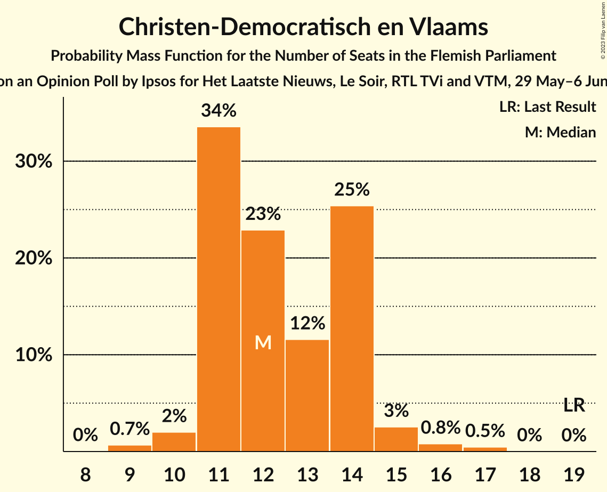
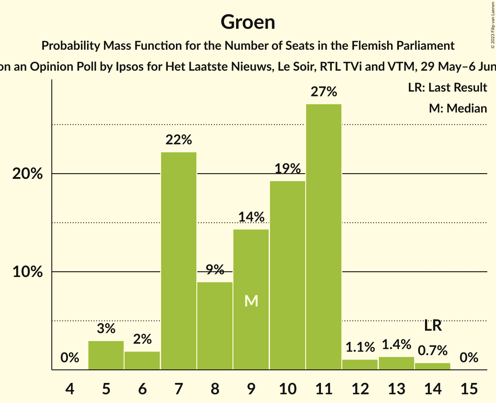
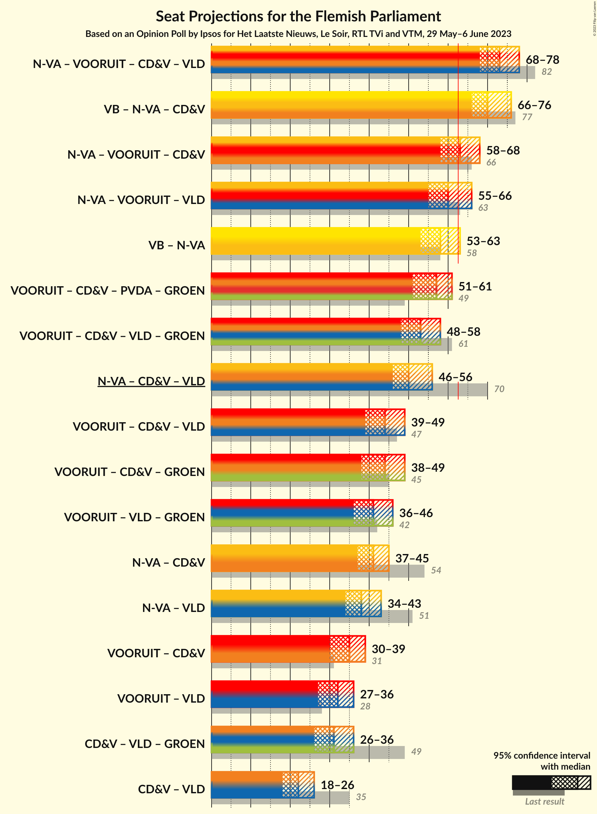
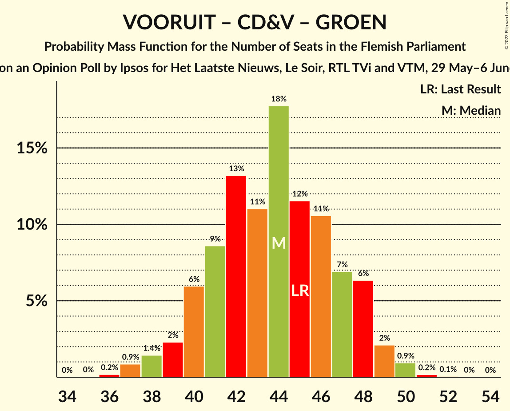

# Opinion Poll by Ipsos for Het Laatste Nieuws, Le Soir, RTL TVi and VTM, 29 May–6 June 2023

<a href="#voting-intentions">Voting Intentions</a> | <a href="#seats">Seats</a> | <a href="#coalitions">Coalitions</a> | <a href="#technical-information">Technical Information</a>

## Voting Intentions

### Confidence Intervals

| Party | Last Result | Poll Result | 80% Confidence Interval | 90% Confidence Interval | 95% Confidence Interval | 99% Confidence Interval |
|:-----:|:-----------:|:-----------:|:-----------------------:|:-----------------------:|:-----------------------:|:-----------------------:|
| Vlaams Belang | 18.5% | 22.7% | 21.1–24.5% |20.6–25.0% |20.2–25.4% |19.4–26.3% |
| Nieuw-Vlaamse Alliantie | 24.8% | 21.8% | 20.2–23.5% |19.7–24.0% |19.3–24.5% |18.6–25.3% |
| Vooruit | 10.1% | 16.8% | 15.4–18.4% |15.0–18.9% |14.6–19.3% |13.9–20.0% |
| Christen-Democratisch en Vlaams | 15.4% | 10.7% | 9.5–12.1% |9.2–12.4% |8.9–12.8% |8.4–13.5% |
| Partij van de Arbeid van België | 5.3% | 10.3% | 9.2–11.6% |8.8–12.0% |8.6–12.3% |8.0–13.0% |
| Groen | 10.1% | 7.6% | 6.6–8.8% |6.3–9.1% |6.1–9.4% |5.7–10.0% |
| Open Vlaamse Liberalen en Democraten | 13.1% | 5.0% | 4.2–6.0% |4.0–6.3% |3.8–6.5% |3.5–7.1% |

*Note:* The poll result column reflects the actual value used in the calculations. Published results may vary slightly, and in addition be rounded to fewer digits.

## Seats

### Confidence Intervals

| Party | Last Result | Median | 80% Confidence Interval | 90% Confidence Interval | 95% Confidence Interval | 99% Confidence Interval |
|:-----:|:-----------:|:------:|:-----------------------:|:-----------------------:|:-----------------------:|:-----------------------:|
| <a href="#vlaams-belang">Vlaams Belang</a> | 23 | 30 | 28–34 |28–35 |27–36 |25–37 |
| <a href="#nieuw-vlaamse-alliantie">Nieuw-Vlaamse Alliantie</a> | 35 | 30 | 28–33 |27–34 |26–35 |26–36 |
| <a href="#vooruit">Vooruit</a> | 12 | 24 | 20–25 |19–26 |19–27 |19–29 |
| <a href="#christen-democratisch-en-vlaams">Christen-Democratisch en Vlaams</a> | 19 | 14 | 11–14 |11–15 |11–16 |10–17 |
| <a href="#partij-van-de-arbeid-van-belgië">Partij van de Arbeid van België</a> | 4 | 13 | 12–14 |11–15 |10–17 |8–18 |
| <a href="#groen">Groen</a> | 14 | 10 | 7–11 |7–13 |7–14 |5–14 |
| <a href="#open-vlaamse-liberalen-en-democraten">Open Vlaamse Liberalen en Democraten</a> | 16 | 2 | 2–5 |1–6 |0–7 |0–8 |

### Vlaams Belang

*For a full overview of the results for this party, see the [Vlaams Belang](party-vlaamsbelang.html) page.*

| Number of Seats | Probability | Accumulated | Special Marks |
|:---------------:|:-----------:|:-----------:|:-------------:|
| 23 | 0% | 100% | Last Result |
| 24 | 0.1% | 100% |  |
| 25 | 0.7% | 99.8% |  |
| 26 | 1.3% | 99.2% |  |
| 27 | 3% | 98% |  |
| 28 | 6% | 95% |  |
| 29 | 17% | 89% |  |
| 30 | 23% | 72% | Median |
| 31 | 10% | 49% |  |
| 32 | 13% | 39% |  |
| 33 | 11% | 26% |  |
| 34 | 9% | 15% |  |
| 35 | 2% | 6% |  |
| 36 | 2% | 4% |  |
| 37 | 1.1% | 1.2% |  |
| 38 | 0.1% | 0.1% |  |
| 39 | 0% | 0% |  |

### Nieuw-Vlaamse Alliantie

*For a full overview of the results for this party, see the [Nieuw-Vlaamse Alliantie](party-nieuw-vlaamsealliantie.html) page.*

| Number of Seats | Probability | Accumulated | Special Marks |
|:---------------:|:-----------:|:-----------:|:-------------:|
| 24 | 0% | 100% |  |
| 25 | 0.1% | 99.9% |  |
| 26 | 3% | 99.8% |  |
| 27 | 5% | 97% |  |
| 28 | 10% | 92% |  |
| 29 | 15% | 82% |  |
| 30 | 29% | 67% | Median |
| 31 | 18% | 39% |  |
| 32 | 10% | 21% |  |
| 33 | 5% | 11% |  |
| 34 | 3% | 6% |  |
| 35 | 2% | 3% | Last Result |
| 36 | 0.8% | 1.0% |  |
| 37 | 0.2% | 0.2% |  |
| 38 | 0% | 0% |  |

### Vooruit

*For a full overview of the results for this party, see the [Vooruit](party-vooruit.html) page.*

| Number of Seats | Probability | Accumulated | Special Marks |
|:---------------:|:-----------:|:-----------:|:-------------:|
| 12 | 0% | 100% | Last Result |
| 13 | 0% | 100% |  |
| 14 | 0% | 100% |  |
| 15 | 0% | 100% |  |
| 16 | 0% | 100% |  |
| 17 | 0% | 100% |  |
| 18 | 0.3% | 100% |  |
| 19 | 6% | 99.7% |  |
| 20 | 7% | 94% |  |
| 21 | 5% | 86% |  |
| 22 | 4% | 81% |  |
| 23 | 11% | 77% |  |
| 24 | 23% | 66% | Median |
| 25 | 36% | 43% |  |
| 26 | 3% | 6% |  |
| 27 | 1.2% | 3% |  |
| 28 | 1.3% | 2% |  |
| 29 | 0.3% | 0.6% |  |
| 30 | 0.3% | 0.3% |  |
| 31 | 0% | 0% |  |

### Christen-Democratisch en Vlaams

*For a full overview of the results for this party, see the [Christen-Democratisch en Vlaams](party-christen-democratischenvlaams.html) page.*

| Number of Seats | Probability | Accumulated | Special Marks |
|:---------------:|:-----------:|:-----------:|:-------------:|
| 9 | 0.2% | 100% |  |
| 10 | 0.4% | 99.8% |  |
| 11 | 19% | 99.3% |  |
| 12 | 14% | 80% |  |
| 13 | 14% | 66% |  |
| 14 | 43% | 52% | Median |
| 15 | 6% | 9% |  |
| 16 | 2% | 4% |  |
| 17 | 2% | 2% |  |
| 18 | 0.2% | 0.3% |  |
| 19 | 0.1% | 0.1% | Last Result |
| 20 | 0% | 0% |  |

### Partij van de Arbeid van België

*For a full overview of the results for this party, see the [Partij van de Arbeid van België](party-partijvandearbeidvanbelgië.html) page.*

| Number of Seats | Probability | Accumulated | Special Marks |
|:---------------:|:-----------:|:-----------:|:-------------:|
| 4 | 0% | 100% | Last Result |
| 5 | 0% | 100% |  |
| 6 | 0% | 100% |  |
| 7 | 0.1% | 100% |  |
| 8 | 0.5% | 99.9% |  |
| 9 | 0.8% | 99.4% |  |
| 10 | 2% | 98.7% |  |
| 11 | 7% | 97% |  |
| 12 | 9% | 91% |  |
| 13 | 32% | 82% | Median |
| 14 | 40% | 50% |  |
| 15 | 5% | 10% |  |
| 16 | 2% | 5% |  |
| 17 | 1.3% | 3% |  |
| 18 | 1.4% | 1.4% |  |
| 19 | 0% | 0% |  |

### Groen

*For a full overview of the results for this party, see the [Groen](party-groen.html) page.*

| Number of Seats | Probability | Accumulated | Special Marks |
|:---------------:|:-----------:|:-----------:|:-------------:|
| 5 | 1.0% | 100% |  |
| 6 | 0.9% | 99.0% |  |
| 7 | 17% | 98% |  |
| 8 | 5% | 81% |  |
| 9 | 15% | 75% |  |
| 10 | 17% | 61% | Median |
| 11 | 34% | 44% |  |
| 12 | 4% | 9% |  |
| 13 | 3% | 6% |  |
| 14 | 3% | 3% | Last Result |
| 15 | 0% | 0.1% |  |
| 16 | 0% | 0% |  |

### Open Vlaamse Liberalen en Democraten

*For a full overview of the results for this party, see the [Open Vlaamse Liberalen en Democraten](party-openvlaamseliberalenendemocraten.html) page.*

| Number of Seats | Probability | Accumulated | Special Marks |
|:---------------:|:-----------:|:-----------:|:-------------:|
| 0 | 4% | 100% |  |
| 1 | 1.3% | 96% |  |
| 2 | 50% | 95% | Median |
| 3 | 5% | 44% |  |
| 4 | 21% | 40% |  |
| 5 | 10% | 19% |  |
| 6 | 5% | 9% |  |
| 7 | 3% | 4% |  |
| 8 | 1.1% | 1.2% |  |
| 9 | 0% | 0% |  |
| 10 | 0% | 0% |  |
| 11 | 0% | 0% |  |
| 12 | 0% | 0% |  |
| 13 | 0% | 0% |  |
| 14 | 0% | 0% |  |
| 15 | 0% | 0% |  |
| 16 | 0% | 0% | Last Result |

## Coalitions

### Confidence Intervals

| Coalition | Last Result | Median | Majority? | 80% Confidence Interval | 90% Confidence Interval | 95% Confidence Interval | 99% Confidence Interval |
|:---------:|:-----------:|:------:|:---------:|:-----------------------:|:-----------------------:|:-----------------------:|:-----------------------:|
| Vlaams Belang – Nieuw-Vlaamse Alliantie – Christen-Democratisch en Vlaams | 77 | 74 | 100% | 71–78 | 70–79 | 69–79 | 67–81 |
| Nieuw-Vlaamse Alliantie – Vooruit – Christen-Democratisch en Vlaams – Open Vlaamse Liberalen en Democraten | 82 | 70 | 99.8% | 66–73 | 65–74 | 65–75 | 63–76 |
| Nieuw-Vlaamse Alliantie – Vooruit – Christen-Democratisch en Vlaams | 66 | 67 | 94% | 63–70 | 62–71 | 61–72 | 60–73 |
| Vlaams Belang – Nieuw-Vlaamse Alliantie | 58 | 61 | 31% | 58–65 | 56–66 | 56–66 | 55–68 |
| Vooruit – Christen-Democratisch en Vlaams – Partij van de Arbeid van België – Groen | 49 | 60 | 16% | 56–63 | 55–64 | 55–65 | 53–67 |
| Nieuw-Vlaamse Alliantie – Vooruit – Open Vlaamse Liberalen en Democraten | 63 | 57 | 1.0% | 54–60 | 52–61 | 51–62 | 50–63 |
| Vooruit – Christen-Democratisch en Vlaams – Groen – Open Vlaamse Liberalen en Democraten | 61 | 50 | 0% | 46–53 | 45–54 | 44–55 | 43–56 |
| Nieuw-Vlaamse Alliantie – Christen-Democratisch en Vlaams – Open Vlaamse Liberalen en Democraten | 70 | 46 | 0% | 43–49 | 43–50 | 42–51 | 40–53 |
| Vooruit – Christen-Democratisch en Vlaams – Groen | 45 | 46 | 0% | 43–50 | 42–51 | 41–51 | 40–53 |
| Nieuw-Vlaamse Alliantie – Christen-Democratisch en Vlaams | 54 | 43 | 0% | 40–46 | 39–47 | 39–48 | 38–49 |
| Vooruit – Christen-Democratisch en Vlaams – Open Vlaamse Liberalen en Democraten | 47 | 40 | 0% | 36–43 | 35–44 | 34–45 | 33–46 |
| Vooruit – Groen – Open Vlaamse Liberalen en Democraten | 42 | 36 | 0% | 33–40 | 32–41 | 31–42 | 29–43 |
| Vooruit – Christen-Democratisch en Vlaams | 31 | 37 | 0% | 33–39 | 32–40 | 31–41 | 30–42 |
| Nieuw-Vlaamse Alliantie – Open Vlaamse Liberalen en Democraten | 51 | 33 | 0% | 30–36 | 30–37 | 29–38 | 28–40 |
| Christen-Democratisch en Vlaams – Groen – Open Vlaamse Liberalen en Democraten | 49 | 26 | 0% | 23–29 | 22–30 | 21–31 | 20–32 |
| Vooruit – Open Vlaamse Liberalen en Democraten | 28 | 27 | 0% | 23–30 | 22–31 | 21–31 | 20–33 |
| Christen-Democratisch en Vlaams – Open Vlaamse Liberalen en Democraten | 35 | 16 | 0% | 14–19 | 13–20 | 13–20 | 11–22 |

### Vlaams Belang – Nieuw-Vlaamse Alliantie – Christen-Democratisch en Vlaams

| Number of Seats | Probability | Accumulated | Special Marks |
|:---------------:|:-----------:|:-----------:|:-------------:|
| 66 | 0.1% | 100% |  |
| 67 | 0.4% | 99.9% |  |
| 68 | 1.1% | 99.5% |  |
| 69 | 2% | 98% |  |
| 70 | 5% | 96% |  |
| 71 | 7% | 91% |  |
| 72 | 10% | 84% |  |
| 73 | 12% | 73% |  |
| 74 | 15% | 62% | Median |
| 75 | 15% | 46% |  |
| 76 | 12% | 31% |  |
| 77 | 8% | 20% | Last Result |
| 78 | 5% | 11% |  |
| 79 | 4% | 6% |  |
| 80 | 2% | 2% |  |
| 81 | 0.4% | 0.8% |  |
| 82 | 0.3% | 0.4% |  |
| 83 | 0.1% | 0.1% |  |
| 84 | 0% | 0% |  |

### Nieuw-Vlaamse Alliantie – Vooruit – Christen-Democratisch en Vlaams – Open Vlaamse Liberalen en Democraten

| Number of Seats | Probability | Accumulated | Special Marks |
|:---------------:|:-----------:|:-----------:|:-------------:|
| 61 | 0% | 100% |  |
| 62 | 0.1% | 99.9% |  |
| 63 | 0.9% | 99.8% | Majority |
| 64 | 1.3% | 98.9% |  |
| 65 | 3% | 98% |  |
| 66 | 5% | 94% |  |
| 67 | 5% | 90% |  |
| 68 | 9% | 85% |  |
| 69 | 15% | 76% |  |
| 70 | 17% | 60% | Median |
| 71 | 18% | 43% |  |
| 72 | 11% | 25% |  |
| 73 | 7% | 14% |  |
| 74 | 5% | 8% |  |
| 75 | 2% | 3% |  |
| 76 | 0.8% | 1.2% |  |
| 77 | 0.3% | 0.4% |  |
| 78 | 0.1% | 0.1% |  |
| 79 | 0% | 0% |  |
| 80 | 0% | 0% |  |
| 81 | 0% | 0% |  |
| 82 | 0% | 0% | Last Result |

### Nieuw-Vlaamse Alliantie – Vooruit – Christen-Democratisch en Vlaams

| Number of Seats | Probability | Accumulated | Special Marks |
|:---------------:|:-----------:|:-----------:|:-------------:|
| 58 | 0.1% | 100% |  |
| 59 | 0.2% | 99.9% |  |
| 60 | 0.7% | 99.7% |  |
| 61 | 2% | 99.0% |  |
| 62 | 3% | 97% |  |
| 63 | 6% | 94% | Majority |
| 64 | 6% | 88% |  |
| 65 | 8% | 82% |  |
| 66 | 13% | 74% | Last Result |
| 67 | 17% | 60% |  |
| 68 | 17% | 44% | Median |
| 69 | 13% | 26% |  |
| 70 | 7% | 14% |  |
| 71 | 4% | 7% |  |
| 72 | 2% | 3% |  |
| 73 | 0.6% | 1.1% |  |
| 74 | 0.4% | 0.5% |  |
| 75 | 0.1% | 0.1% |  |
| 76 | 0% | 0% |  |

### Vlaams Belang – Nieuw-Vlaamse Alliantie

| Number of Seats | Probability | Accumulated | Special Marks |
|:---------------:|:-----------:|:-----------:|:-------------:|
| 53 | 0.1% | 100% |  |
| 54 | 0.2% | 99.9% |  |
| 55 | 2% | 99.7% |  |
| 56 | 3% | 98% |  |
| 57 | 3% | 95% |  |
| 58 | 9% | 92% | Last Result |
| 59 | 12% | 83% |  |
| 60 | 12% | 71% | Median |
| 61 | 16% | 59% |  |
| 62 | 12% | 43% |  |
| 63 | 10% | 31% | Majority |
| 64 | 10% | 20% |  |
| 65 | 5% | 11% |  |
| 66 | 3% | 5% |  |
| 67 | 0.9% | 2% |  |
| 68 | 0.5% | 0.8% |  |
| 69 | 0.2% | 0.3% |  |
| 70 | 0.1% | 0.1% |  |
| 71 | 0% | 0% |  |

### Vooruit – Christen-Democratisch en Vlaams – Partij van de Arbeid van België – Groen

| Number of Seats | Probability | Accumulated | Special Marks |
|:---------------:|:-----------:|:-----------:|:-------------:|
| 49 | 0% | 100% | Last Result |
| 50 | 0% | 100% |  |
| 51 | 0.1% | 100% |  |
| 52 | 0.3% | 99.9% |  |
| 53 | 0.6% | 99.6% |  |
| 54 | 1.4% | 99.0% |  |
| 55 | 3% | 98% |  |
| 56 | 7% | 95% |  |
| 57 | 8% | 88% |  |
| 58 | 14% | 81% |  |
| 59 | 12% | 67% |  |
| 60 | 12% | 55% |  |
| 61 | 14% | 43% | Median |
| 62 | 12% | 29% |  |
| 63 | 9% | 16% | Majority |
| 64 | 4% | 8% |  |
| 65 | 2% | 3% |  |
| 66 | 1.1% | 2% |  |
| 67 | 0.4% | 0.5% |  |
| 68 | 0.1% | 0.1% |  |
| 69 | 0% | 0% |  |

### Nieuw-Vlaamse Alliantie – Vooruit – Open Vlaamse Liberalen en Democraten

| Number of Seats | Probability | Accumulated | Special Marks |
|:---------------:|:-----------:|:-----------:|:-------------:|
| 48 | 0.1% | 100% |  |
| 49 | 0.3% | 99.9% |  |
| 50 | 0.8% | 99.6% |  |
| 51 | 1.4% | 98.8% |  |
| 52 | 3% | 97% |  |
| 53 | 4% | 94% |  |
| 54 | 7% | 90% |  |
| 55 | 12% | 83% |  |
| 56 | 15% | 71% | Median |
| 57 | 17% | 57% |  |
| 58 | 13% | 39% |  |
| 59 | 11% | 26% |  |
| 60 | 8% | 16% |  |
| 61 | 5% | 7% |  |
| 62 | 2% | 3% |  |
| 63 | 0.5% | 1.0% | Last Result, Majority |
| 64 | 0.3% | 0.4% |  |
| 65 | 0.1% | 0.2% |  |
| 66 | 0% | 0% |  |

### Vooruit – Christen-Democratisch en Vlaams – Groen – Open Vlaamse Liberalen en Democraten

| Number of Seats | Probability | Accumulated | Special Marks |
|:---------------:|:-----------:|:-----------:|:-------------:|
| 40 | 0% | 100% |  |
| 41 | 0.1% | 99.9% |  |
| 42 | 0.3% | 99.8% |  |
| 43 | 0.7% | 99.5% |  |
| 44 | 2% | 98.8% |  |
| 45 | 3% | 97% |  |
| 46 | 9% | 94% |  |
| 47 | 8% | 85% |  |
| 48 | 11% | 77% |  |
| 49 | 15% | 66% |  |
| 50 | 14% | 51% | Median |
| 51 | 14% | 37% |  |
| 52 | 11% | 23% |  |
| 53 | 5% | 12% |  |
| 54 | 3% | 7% |  |
| 55 | 3% | 4% |  |
| 56 | 0.8% | 1.2% |  |
| 57 | 0.3% | 0.5% |  |
| 58 | 0.1% | 0.1% |  |
| 59 | 0% | 0% |  |
| 60 | 0% | 0% |  |
| 61 | 0% | 0% | Last Result |

### Nieuw-Vlaamse Alliantie – Christen-Democratisch en Vlaams – Open Vlaamse Liberalen en Democraten

| Number of Seats | Probability | Accumulated | Special Marks |
|:---------------:|:-----------:|:-----------:|:-------------:|
| 39 | 0.1% | 100% |  |
| 40 | 0.5% | 99.9% |  |
| 41 | 2% | 99.4% |  |
| 42 | 3% | 98% |  |
| 43 | 6% | 95% |  |
| 44 | 10% | 89% |  |
| 45 | 15% | 79% |  |
| 46 | 18% | 64% | Median |
| 47 | 16% | 46% |  |
| 48 | 11% | 30% |  |
| 49 | 10% | 19% |  |
| 50 | 5% | 9% |  |
| 51 | 2% | 4% |  |
| 52 | 1.4% | 2% |  |
| 53 | 0.6% | 0.8% |  |
| 54 | 0.1% | 0.2% |  |
| 55 | 0.1% | 0.1% |  |
| 56 | 0% | 0% |  |
| 57 | 0% | 0% |  |
| 58 | 0% | 0% |  |
| 59 | 0% | 0% |  |
| 60 | 0% | 0% |  |
| 61 | 0% | 0% |  |
| 62 | 0% | 0% |  |
| 63 | 0% | 0% | Majority |
| 64 | 0% | 0% |  |
| 65 | 0% | 0% |  |
| 66 | 0% | 0% |  |
| 67 | 0% | 0% |  |
| 68 | 0% | 0% |  |
| 69 | 0% | 0% |  |
| 70 | 0% | 0% | Last Result |

### Vooruit – Christen-Democratisch en Vlaams – Groen

| Number of Seats | Probability | Accumulated | Special Marks |
|:---------------:|:-----------:|:-----------:|:-------------:|
| 38 | 0.1% | 100% |  |
| 39 | 0.3% | 99.9% |  |
| 40 | 0.7% | 99.6% |  |
| 41 | 2% | 98.9% |  |
| 42 | 4% | 96% |  |
| 43 | 4% | 93% |  |
| 44 | 12% | 88% |  |
| 45 | 14% | 77% | Last Result |
| 46 | 13% | 63% |  |
| 47 | 14% | 50% |  |
| 48 | 11% | 36% | Median |
| 49 | 11% | 24% |  |
| 50 | 8% | 13% |  |
| 51 | 3% | 5% |  |
| 52 | 1.3% | 2% |  |
| 53 | 0.5% | 0.7% |  |
| 54 | 0.1% | 0.2% |  |
| 55 | 0% | 0.1% |  |
| 56 | 0% | 0% |  |

### Nieuw-Vlaamse Alliantie – Christen-Democratisch en Vlaams

| Number of Seats | Probability | Accumulated | Special Marks |
|:---------------:|:-----------:|:-----------:|:-------------:|
| 36 | 0% | 100% |  |
| 37 | 0.3% | 99.9% |  |
| 38 | 1.4% | 99.7% |  |
| 39 | 4% | 98% |  |
| 40 | 5% | 95% |  |
| 41 | 9% | 90% |  |
| 42 | 13% | 81% |  |
| 43 | 22% | 68% |  |
| 44 | 21% | 46% | Median |
| 45 | 11% | 25% |  |
| 46 | 7% | 15% |  |
| 47 | 4% | 8% |  |
| 48 | 2% | 3% |  |
| 49 | 0.8% | 1.2% |  |
| 50 | 0.3% | 0.5% |  |
| 51 | 0.1% | 0.2% |  |
| 52 | 0% | 0.1% |  |
| 53 | 0% | 0% |  |
| 54 | 0% | 0% | Last Result |

### Vooruit – Christen-Democratisch en Vlaams – Open Vlaamse Liberalen en Democraten

| Number of Seats | Probability | Accumulated | Special Marks |
|:---------------:|:-----------:|:-----------:|:-------------:|
| 31 | 0% | 100% |  |
| 32 | 0.3% | 99.9% |  |
| 33 | 1.4% | 99.6% |  |
| 34 | 1.3% | 98% |  |
| 35 | 3% | 97% |  |
| 36 | 4% | 94% |  |
| 37 | 7% | 90% |  |
| 38 | 8% | 83% |  |
| 39 | 16% | 75% |  |
| 40 | 20% | 59% | Median |
| 41 | 18% | 38% |  |
| 42 | 8% | 20% |  |
| 43 | 5% | 12% |  |
| 44 | 4% | 7% |  |
| 45 | 2% | 3% |  |
| 46 | 0.7% | 0.9% |  |
| 47 | 0.2% | 0.3% | Last Result |
| 48 | 0.1% | 0.1% |  |
| 49 | 0% | 0% |  |

### Vooruit – Groen – Open Vlaamse Liberalen en Democraten

| Number of Seats | Probability | Accumulated | Special Marks |
|:---------------:|:-----------:|:-----------:|:-------------:|
| 27 | 0.1% | 100% |  |
| 28 | 0.1% | 99.9% |  |
| 29 | 0.5% | 99.9% |  |
| 30 | 0.4% | 99.4% |  |
| 31 | 2% | 99.0% |  |
| 32 | 4% | 97% |  |
| 33 | 7% | 93% |  |
| 34 | 10% | 86% |  |
| 35 | 11% | 76% |  |
| 36 | 17% | 64% | Median |
| 37 | 13% | 47% |  |
| 38 | 13% | 34% |  |
| 39 | 9% | 21% |  |
| 40 | 6% | 13% |  |
| 41 | 4% | 7% |  |
| 42 | 1.5% | 3% | Last Result |
| 43 | 0.8% | 1.1% |  |
| 44 | 0.2% | 0.3% |  |
| 45 | 0% | 0.1% |  |
| 46 | 0% | 0% |  |

### Vooruit – Christen-Democratisch en Vlaams

| Number of Seats | Probability | Accumulated | Special Marks |
|:---------------:|:-----------:|:-----------:|:-------------:|
| 29 | 0.1% | 100% |  |
| 30 | 1.1% | 99.9% |  |
| 31 | 3% | 98.8% | Last Result |
| 32 | 2% | 96% |  |
| 33 | 4% | 94% |  |
| 34 | 7% | 90% |  |
| 35 | 9% | 82% |  |
| 36 | 12% | 73% |  |
| 37 | 21% | 61% |  |
| 38 | 18% | 40% | Median |
| 39 | 15% | 22% |  |
| 40 | 4% | 7% |  |
| 41 | 2% | 3% |  |
| 42 | 1.4% | 2% |  |
| 43 | 0.3% | 0.4% |  |
| 44 | 0.1% | 0.1% |  |
| 45 | 0% | 0% |  |

### Nieuw-Vlaamse Alliantie – Open Vlaamse Liberalen en Democraten

| Number of Seats | Probability | Accumulated | Special Marks |
|:---------------:|:-----------:|:-----------:|:-------------:|
| 26 | 0.1% | 100% |  |
| 27 | 0.2% | 99.9% |  |
| 28 | 1.1% | 99.8% |  |
| 29 | 3% | 98.7% |  |
| 30 | 7% | 96% |  |
| 31 | 9% | 89% |  |
| 32 | 21% | 80% | Median |
| 33 | 16% | 59% |  |
| 34 | 15% | 43% |  |
| 35 | 12% | 29% |  |
| 36 | 9% | 17% |  |
| 37 | 4% | 8% |  |
| 38 | 2% | 4% |  |
| 39 | 1.0% | 2% |  |
| 40 | 0.4% | 0.6% |  |
| 41 | 0.2% | 0.2% |  |
| 42 | 0.1% | 0.1% |  |
| 43 | 0% | 0% |  |
| 44 | 0% | 0% |  |
| 45 | 0% | 0% |  |
| 46 | 0% | 0% |  |
| 47 | 0% | 0% |  |
| 48 | 0% | 0% |  |
| 49 | 0% | 0% |  |
| 50 | 0% | 0% |  |
| 51 | 0% | 0% | Last Result |

### Christen-Democratisch en Vlaams – Groen – Open Vlaamse Liberalen en Democraten

| Number of Seats | Probability | Accumulated | Special Marks |
|:---------------:|:-----------:|:-----------:|:-------------:|
| 18 | 0.1% | 100% |  |
| 19 | 0.3% | 99.9% |  |
| 20 | 0.7% | 99.6% |  |
| 21 | 3% | 98.9% |  |
| 22 | 6% | 96% |  |
| 23 | 9% | 90% |  |
| 24 | 13% | 81% |  |
| 25 | 12% | 68% |  |
| 26 | 14% | 57% | Median |
| 27 | 16% | 43% |  |
| 28 | 8% | 27% |  |
| 29 | 9% | 19% |  |
| 30 | 6% | 9% |  |
| 31 | 3% | 4% |  |
| 32 | 0.9% | 1.4% |  |
| 33 | 0.3% | 0.4% |  |
| 34 | 0.1% | 0.1% |  |
| 35 | 0% | 0% |  |
| 36 | 0% | 0% |  |
| 37 | 0% | 0% |  |
| 38 | 0% | 0% |  |
| 39 | 0% | 0% |  |
| 40 | 0% | 0% |  |
| 41 | 0% | 0% |  |
| 42 | 0% | 0% |  |
| 43 | 0% | 0% |  |
| 44 | 0% | 0% |  |
| 45 | 0% | 0% |  |
| 46 | 0% | 0% |  |
| 47 | 0% | 0% |  |
| 48 | 0% | 0% |  |
| 49 | 0% | 0% | Last Result |

### Vooruit – Open Vlaamse Liberalen en Democraten

| Number of Seats | Probability | Accumulated | Special Marks |
|:---------------:|:-----------:|:-----------:|:-------------:|
| 19 | 0.1% | 100% |  |
| 20 | 0.5% | 99.8% |  |
| 21 | 3% | 99.4% |  |
| 22 | 3% | 97% |  |
| 23 | 4% | 94% |  |
| 24 | 5% | 90% |  |
| 25 | 9% | 85% |  |
| 26 | 20% | 75% | Median |
| 27 | 25% | 55% |  |
| 28 | 9% | 30% | Last Result |
| 29 | 10% | 21% |  |
| 30 | 6% | 11% |  |
| 31 | 3% | 5% |  |
| 32 | 1.5% | 2% |  |
| 33 | 0.4% | 0.7% |  |
| 34 | 0.2% | 0.2% |  |
| 35 | 0% | 0.1% |  |
| 36 | 0% | 0% |  |

### Christen-Democratisch en Vlaams – Open Vlaamse Liberalen en Democraten

| Number of Seats | Probability | Accumulated | Special Marks |
|:---------------:|:-----------:|:-----------:|:-------------:|
| 11 | 0.7% | 100% |  |
| 12 | 0.9% | 99.3% |  |
| 13 | 8% | 98% |  |
| 14 | 12% | 91% |  |
| 15 | 13% | 79% |  |
| 16 | 29% | 65% | Median |
| 17 | 10% | 36% |  |
| 18 | 11% | 26% |  |
| 19 | 9% | 15% |  |
| 20 | 4% | 6% |  |
| 21 | 2% | 2% |  |
| 22 | 0.5% | 0.6% |  |
| 23 | 0.1% | 0.1% |  |
| 24 | 0% | 0% |  |
| 25 | 0% | 0% |  |
| 26 | 0% | 0% |  |
| 27 | 0% | 0% |  |
| 28 | 0% | 0% |  |
| 29 | 0% | 0% |  |
| 30 | 0% | 0% |  |
| 31 | 0% | 0% |  |
| 32 | 0% | 0% |  |
| 33 | 0% | 0% |  |
| 34 | 0% | 0% |  |
| 35 | 0% | 0% | Last Result |

## Technical Information

### Opinion Poll

+ **Polling firm:** Ipsos
+ **Commissioner(s):** Het Laatste Nieuws, Le Soir, RTL TVi and VTM
+ **Fieldwork period:** 29 May–6 June 2023

### Calculations

+ **Sample size:** 1000
+ **Simulations done:** 1,048,576
+ **Error estimate:** 1.46%

