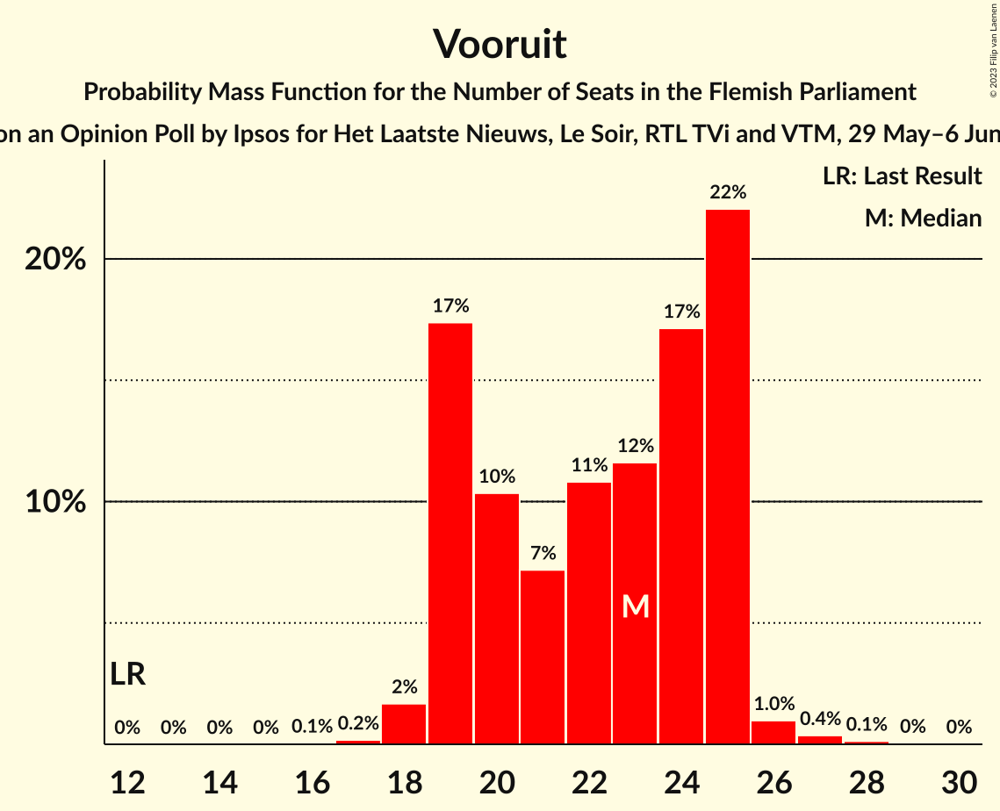
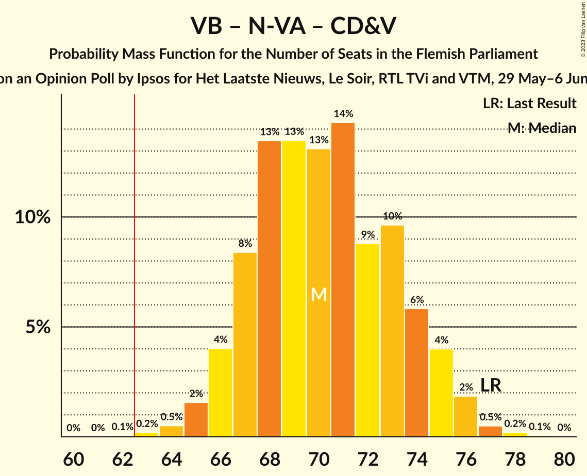
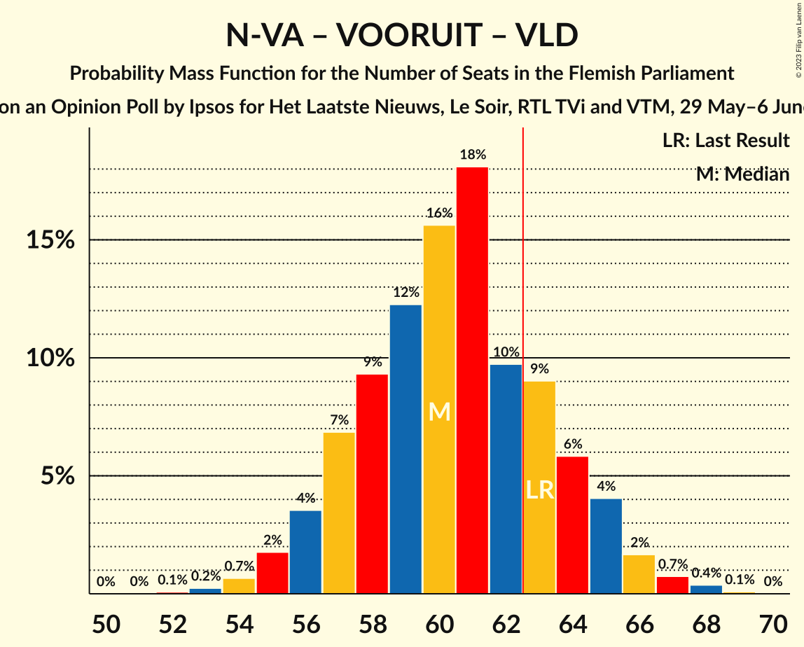
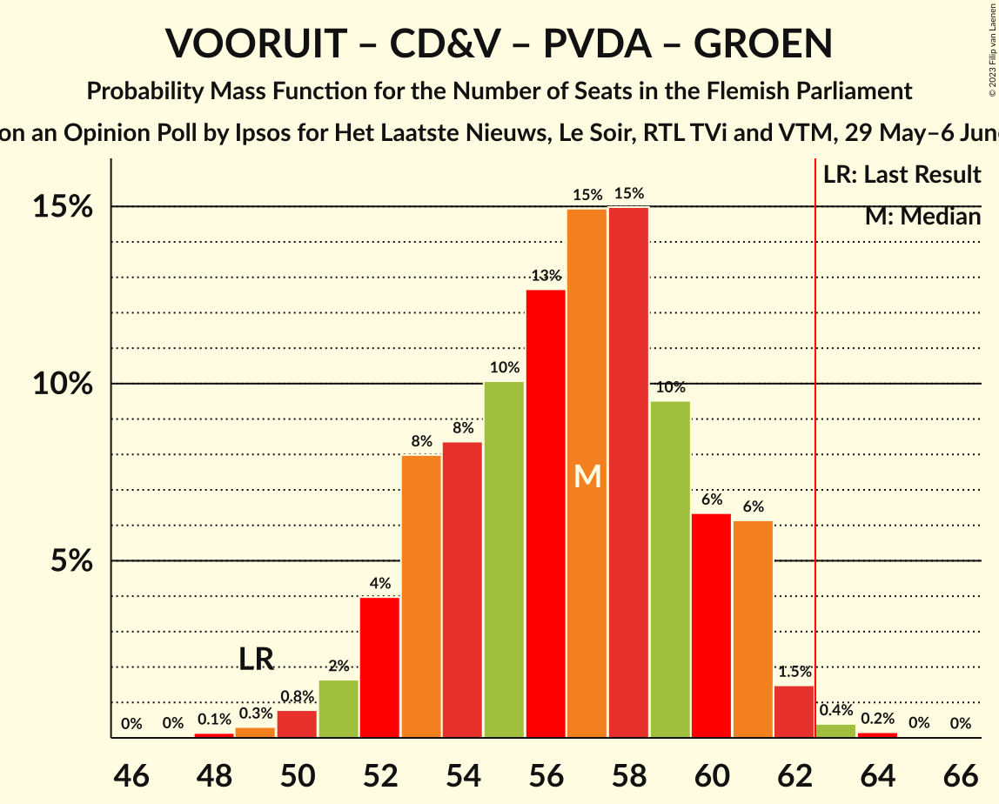

# Opinion Poll by Ipsos for Het Laatste Nieuws, Le Soir, RTL TVi and VTM, 29 May–6 June 2023

<a href="#voting-intentions">Voting Intentions</a> | <a href="#seats">Seats</a> | <a href="#coalitions">Coalitions</a> | <a href="#technical-information">Technical Information</a>

## Voting Intentions

### Confidence Intervals

| Party | Last Result | Poll Result | 80% Confidence Interval | 90% Confidence Interval | 95% Confidence Interval | 99% Confidence Interval |
|:-----:|:-----------:|:-----------:|:-----------------------:|:-----------------------:|:-----------------------:|:-----------------------:|
| Vlaams Belang | 18.5% | 22.7% | 21.1–24.5% |20.6–25.0% |20.2–25.4% |19.4–26.3% |
| Nieuw-Vlaamse Alliantie | 24.8% | 21.8% | 20.2–23.5% |19.7–24.0% |19.3–24.5% |18.6–25.3% |
| Vooruit | 10.1% | 16.8% | 15.4–18.4% |15.0–18.9% |14.6–19.3% |13.9–20.0% |
| Christen-Democratisch en Vlaams | 15.4% | 10.7% | 9.5–12.1% |9.2–12.4% |8.9–12.8% |8.4–13.5% |
| Partij van de Arbeid van België | 5.3% | 10.3% | 9.2–11.6% |8.8–12.0% |8.6–12.3% |8.0–13.0% |
| Open Vlaamse Liberalen en Democraten | 13.1% | 8.3% | 7.3–9.5% |7.0–9.9% |6.7–10.2% |6.3–10.8% |
| Groen | 10.1% | 5.0% | 4.2–6.0% |4.0–6.3% |3.8–6.5% |3.5–7.1% |

*Note:* The poll result column reflects the actual value used in the calculations. Published results may vary slightly, and in addition be rounded to fewer digits.

## Seats

### Confidence Intervals

| Party | Last Result | Median | 80% Confidence Interval | 90% Confidence Interval | 95% Confidence Interval | 99% Confidence Interval |
|:-----:|:-----------:|:------:|:-----------------------:|:-----------------------:|:-----------------------:|:-----------------------:|
| <a href="#vlaams-belang">Vlaams Belang</a> | 23 | 30 | 28–33 |27–34 |26–35 |25–37 |
| <a href="#nieuw-vlaamse-alliantie">Nieuw-Vlaamse Alliantie</a> | 35 | 30 | 27–32 |26–33 |26–34 |26–36 |
| <a href="#vooruit">Vooruit</a> | 12 | 24 | 20–25 |19–26 |19–26 |18–28 |
| <a href="#christen-democratisch-en-vlaams">Christen-Democratisch en Vlaams</a> | 19 | 13 | 11–14 |11–15 |11–16 |10–17 |
| <a href="#partij-van-de-arbeid-van-belgië">Partij van de Arbeid van België</a> | 4 | 13 | 12–14 |11–15 |10–16 |8–18 |
| <a href="#open-vlaamse-liberalen-en-democraten">Open Vlaamse Liberalen en Democraten</a> | 16 | 11 | 8–12 |8–12 |7–13 |6–14 |
| <a href="#groen">Groen</a> | 14 | 5 | 2–6 |2–7 |1–7 |0–8 |

### Vlaams Belang

*For a full overview of the results for this party, see the [Vlaams Belang](party-vlaamsbelang.html) page.*

| Number of Seats | Probability | Accumulated | Special Marks |
|:---------------:|:-----------:|:-----------:|:-------------:|
| 23 | 0.1% | 100% | Last Result |
| 24 | 0.1% | 99.9% |  |
| 25 | 1.0% | 99.8% |  |
| 26 | 3% | 98.8% |  |
| 27 | 4% | 96% |  |
| 28 | 8% | 92% |  |
| 29 | 20% | 84% |  |
| 30 | 17% | 64% | Median |
| 31 | 19% | 47% |  |
| 32 | 11% | 28% |  |
| 33 | 7% | 16% |  |
| 34 | 4% | 9% |  |
| 35 | 3% | 5% |  |
| 36 | 1.4% | 2% |  |
| 37 | 0.6% | 0.7% |  |
| 38 | 0% | 0% |  |

### Nieuw-Vlaamse Alliantie

*For a full overview of the results for this party, see the [Nieuw-Vlaamse Alliantie](party-nieuw-vlaamsealliantie.html) page.*

| Number of Seats | Probability | Accumulated | Special Marks |
|:---------------:|:-----------:|:-----------:|:-------------:|
| 23 | 0% | 100% |  |
| 24 | 0.1% | 99.9% |  |
| 25 | 0.3% | 99.9% |  |
| 26 | 5% | 99.6% |  |
| 27 | 7% | 95% |  |
| 28 | 12% | 88% |  |
| 29 | 11% | 76% |  |
| 30 | 33% | 65% | Median |
| 31 | 18% | 32% |  |
| 32 | 8% | 14% |  |
| 33 | 3% | 6% |  |
| 34 | 1.2% | 3% |  |
| 35 | 0.7% | 2% | Last Result |
| 36 | 0.7% | 0.9% |  |
| 37 | 0.2% | 0.2% |  |
| 38 | 0% | 0% |  |

### Vooruit

*For a full overview of the results for this party, see the [Vooruit](party-vooruit.html) page.*

| Number of Seats | Probability | Accumulated | Special Marks |
|:---------------:|:-----------:|:-----------:|:-------------:|
| 12 | 0% | 100% | Last Result |
| 13 | 0% | 100% |  |
| 14 | 0% | 100% |  |
| 15 | 0% | 100% |  |
| 16 | 0% | 100% |  |
| 17 | 0% | 100% |  |
| 18 | 0.6% | 100% |  |
| 19 | 7% | 99.4% |  |
| 20 | 7% | 92% |  |
| 21 | 6% | 85% |  |
| 22 | 7% | 79% |  |
| 23 | 11% | 72% |  |
| 24 | 25% | 61% | Median |
| 25 | 30% | 35% |  |
| 26 | 3% | 6% |  |
| 27 | 1.4% | 2% |  |
| 28 | 0.7% | 1.0% |  |
| 29 | 0.2% | 0.3% |  |
| 30 | 0.1% | 0.1% |  |
| 31 | 0% | 0% |  |

### Christen-Democratisch en Vlaams

*For a full overview of the results for this party, see the [Christen-Democratisch en Vlaams](party-christen-democratischenvlaams.html) page.*

| Number of Seats | Probability | Accumulated | Special Marks |
|:---------------:|:-----------:|:-----------:|:-------------:|
| 9 | 0.3% | 100% |  |
| 10 | 0.8% | 99.7% |  |
| 11 | 23% | 98.9% |  |
| 12 | 18% | 76% |  |
| 13 | 12% | 58% | Median |
| 14 | 40% | 46% |  |
| 15 | 3% | 6% |  |
| 16 | 2% | 3% |  |
| 17 | 1.2% | 1.3% |  |
| 18 | 0.1% | 0.2% |  |
| 19 | 0% | 0% | Last Result |

### Partij van de Arbeid van België

*For a full overview of the results for this party, see the [Partij van de Arbeid van België](party-partijvandearbeidvanbelgië.html) page.*

| Number of Seats | Probability | Accumulated | Special Marks |
|:---------------:|:-----------:|:-----------:|:-------------:|
| 4 | 0% | 100% | Last Result |
| 5 | 0% | 100% |  |
| 6 | 0% | 100% |  |
| 7 | 0.2% | 100% |  |
| 8 | 0.5% | 99.8% |  |
| 9 | 1.1% | 99.3% |  |
| 10 | 2% | 98% |  |
| 11 | 5% | 96% |  |
| 12 | 12% | 91% |  |
| 13 | 35% | 79% | Median |
| 14 | 36% | 44% |  |
| 15 | 5% | 8% |  |
| 16 | 2% | 4% |  |
| 17 | 1.1% | 2% |  |
| 18 | 1.0% | 1.0% |  |
| 19 | 0% | 0% |  |

### Open Vlaamse Liberalen en Democraten

*For a full overview of the results for this party, see the [Open Vlaamse Liberalen en Democraten](party-openvlaamseliberalenendemocraten.html) page.*

| Number of Seats | Probability | Accumulated | Special Marks |
|:---------------:|:-----------:|:-----------:|:-------------:|
| 4 | 0.1% | 100% |  |
| 5 | 0.1% | 99.9% |  |
| 6 | 0.6% | 99.8% |  |
| 7 | 3% | 99.3% |  |
| 8 | 24% | 97% |  |
| 9 | 10% | 73% |  |
| 10 | 13% | 63% |  |
| 11 | 31% | 50% | Median |
| 12 | 16% | 19% |  |
| 13 | 2% | 3% |  |
| 14 | 1.1% | 1.2% |  |
| 15 | 0.1% | 0.1% |  |
| 16 | 0% | 0% | Last Result |

### Groen

*For a full overview of the results for this party, see the [Groen](party-groen.html) page.*

| Number of Seats | Probability | Accumulated | Special Marks |
|:---------------:|:-----------:|:-----------:|:-------------:|
| 0 | 1.3% | 100% |  |
| 1 | 2% | 98.7% |  |
| 2 | 16% | 96% |  |
| 3 | 12% | 81% |  |
| 4 | 4% | 69% |  |
| 5 | 55% | 65% | Median |
| 6 | 3% | 10% |  |
| 7 | 6% | 7% |  |
| 8 | 0.4% | 0.7% |  |
| 9 | 0.2% | 0.3% |  |
| 10 | 0.1% | 0.1% |  |
| 11 | 0% | 0% |  |
| 12 | 0% | 0% |  |
| 13 | 0% | 0% |  |
| 14 | 0% | 0% | Last Result |

## Coalitions

### Confidence Intervals

| Coalition | Last Result | Median | Majority? | 80% Confidence Interval | 90% Confidence Interval | 95% Confidence Interval | 99% Confidence Interval |
|:---------:|:-----------:|:------:|:---------:|:-----------------------:|:-----------------------:|:-----------------------:|:-----------------------:|
| Nieuw-Vlaamse Alliantie – Vooruit – Christen-Democratisch en Vlaams – Open Vlaamse Liberalen en Democraten | 82 | 76 | 100% | 73–79 | 72–80 | 71–81 | 69–82 |
| Vlaams Belang – Nieuw-Vlaamse Alliantie – Christen-Democratisch en Vlaams | 77 | 73 | 100% | 69–77 | 69–77 | 68–78 | 67–80 |
| Nieuw-Vlaamse Alliantie – Vooruit – Christen-Democratisch en Vlaams | 66 | 66 | 91% | 63–69 | 62–70 | 61–71 | 59–72 |
| Nieuw-Vlaamse Alliantie – Vooruit – Open Vlaamse Liberalen en Democraten | 63 | 63 | 60% | 60–67 | 59–67 | 58–68 | 57–70 |
| Vlaams Belang – Nieuw-Vlaamse Alliantie | 58 | 60 | 21% | 57–64 | 56–65 | 55–65 | 54–67 |
| Vooruit – Christen-Democratisch en Vlaams – Partij van de Arbeid van België – Groen | 49 | 54 | 0% | 50–57 | 49–58 | 48–58 | 46–60 |
| Nieuw-Vlaamse Alliantie – Christen-Democratisch en Vlaams – Open Vlaamse Liberalen en Democraten | 70 | 53 | 0% | 50–56 | 49–57 | 48–58 | 46–59 |
| Vooruit – Christen-Democratisch en Vlaams – Open Vlaamse Liberalen en Democraten – Groen | 61 | 51 | 0% | 47–54 | 46–55 | 45–56 | 43–57 |
| Vooruit – Christen-Democratisch en Vlaams – Open Vlaamse Liberalen en Democraten | 47 | 46 | 0% | 43–50 | 42–51 | 41–51 | 40–52 |
| Nieuw-Vlaamse Alliantie – Christen-Democratisch en Vlaams | 54 | 43 | 0% | 40–45 | 39–46 | 38–47 | 38–49 |
| Vooruit – Christen-Democratisch en Vlaams – Groen | 45 | 41 | 0% | 37–43 | 36–44 | 35–45 | 33–47 |
| Nieuw-Vlaamse Alliantie – Open Vlaamse Liberalen en Democraten | 51 | 40 | 0% | 37–43 | 36–44 | 35–44 | 34–47 |
| Vooruit – Open Vlaamse Liberalen en Democraten – Groen | 42 | 38 | 0% | 34–41 | 33–42 | 32–42 | 31–44 |
| Vooruit – Christen-Democratisch en Vlaams | 31 | 36 | 0% | 33–39 | 32–39 | 31–40 | 30–42 |
| Vooruit – Open Vlaamse Liberalen en Democraten | 28 | 33 | 0% | 30–37 | 30–37 | 29–37 | 27–39 |
| Christen-Democratisch en Vlaams – Open Vlaamse Liberalen en Democraten – Groen | 49 | 27 | 0% | 24–30 | 23–31 | 23–32 | 21–33 |
| Christen-Democratisch en Vlaams – Open Vlaamse Liberalen en Democraten | 35 | 23 | 0% | 20–26 | 20–26 | 19–27 | 18–28 |

### Nieuw-Vlaamse Alliantie – Vooruit – Christen-Democratisch en Vlaams – Open Vlaamse Liberalen en Democraten

| Number of Seats | Probability | Accumulated | Special Marks |
|:---------------:|:-----------:|:-----------:|:-------------:|
| 68 | 0.1% | 100% |  |
| 69 | 0.4% | 99.9% |  |
| 70 | 1.1% | 99.5% |  |
| 71 | 3% | 98% |  |
| 72 | 4% | 96% |  |
| 73 | 6% | 92% |  |
| 74 | 11% | 86% |  |
| 75 | 13% | 74% |  |
| 76 | 17% | 61% |  |
| 77 | 19% | 44% |  |
| 78 | 9% | 26% | Median |
| 79 | 7% | 16% |  |
| 80 | 5% | 10% |  |
| 81 | 3% | 5% |  |
| 82 | 1.2% | 2% | Last Result |
| 83 | 0.3% | 0.5% |  |
| 84 | 0.1% | 0.2% |  |
| 85 | 0% | 0% |  |

### Vlaams Belang – Nieuw-Vlaamse Alliantie – Christen-Democratisch en Vlaams

| Number of Seats | Probability | Accumulated | Special Marks |
|:---------------:|:-----------:|:-----------:|:-------------:|
| 65 | 0.1% | 100% |  |
| 66 | 0.4% | 99.9% |  |
| 67 | 1.1% | 99.6% |  |
| 68 | 2% | 98% |  |
| 69 | 6% | 96% |  |
| 70 | 10% | 90% |  |
| 71 | 9% | 80% |  |
| 72 | 11% | 71% |  |
| 73 | 16% | 60% | Median |
| 74 | 11% | 44% |  |
| 75 | 12% | 33% |  |
| 76 | 12% | 22% |  |
| 77 | 5% | 10% | Last Result |
| 78 | 3% | 5% |  |
| 79 | 1.0% | 2% |  |
| 80 | 0.6% | 0.9% |  |
| 81 | 0.2% | 0.3% |  |
| 82 | 0% | 0.1% |  |
| 83 | 0% | 0% |  |

### Nieuw-Vlaamse Alliantie – Vooruit – Christen-Democratisch en Vlaams

| Number of Seats | Probability | Accumulated | Special Marks |
|:---------------:|:-----------:|:-----------:|:-------------:|
| 57 | 0.2% | 100% |  |
| 58 | 0.1% | 99.8% |  |
| 59 | 0.4% | 99.7% |  |
| 60 | 1.4% | 99.3% |  |
| 61 | 3% | 98% |  |
| 62 | 5% | 95% |  |
| 63 | 8% | 91% | Majority |
| 64 | 8% | 83% |  |
| 65 | 13% | 75% |  |
| 66 | 19% | 62% | Last Result |
| 67 | 15% | 43% | Median |
| 68 | 9% | 28% |  |
| 69 | 11% | 18% |  |
| 70 | 4% | 7% |  |
| 71 | 2% | 3% |  |
| 72 | 0.7% | 1.1% |  |
| 73 | 0.2% | 0.4% |  |
| 74 | 0.1% | 0.1% |  |
| 75 | 0% | 0.1% |  |
| 76 | 0% | 0% |  |

### Nieuw-Vlaamse Alliantie – Vooruit – Open Vlaamse Liberalen en Democraten

| Number of Seats | Probability | Accumulated | Special Marks |
|:---------------:|:-----------:|:-----------:|:-------------:|
| 55 | 0.1% | 100% |  |
| 56 | 0.3% | 99.9% |  |
| 57 | 0.9% | 99.5% |  |
| 58 | 3% | 98.6% |  |
| 59 | 4% | 96% |  |
| 60 | 5% | 92% |  |
| 61 | 9% | 87% |  |
| 62 | 18% | 78% |  |
| 63 | 19% | 60% | Last Result, Majority |
| 64 | 11% | 41% |  |
| 65 | 10% | 31% | Median |
| 66 | 9% | 20% |  |
| 67 | 7% | 11% |  |
| 68 | 3% | 4% |  |
| 69 | 0.8% | 1.5% |  |
| 70 | 0.4% | 0.7% |  |
| 71 | 0.2% | 0.3% |  |
| 72 | 0.1% | 0.1% |  |
| 73 | 0% | 0% |  |

### Vlaams Belang – Nieuw-Vlaamse Alliantie

| Number of Seats | Probability | Accumulated | Special Marks |
|:---------------:|:-----------:|:-----------:|:-------------:|
| 52 | 0% | 100% |  |
| 53 | 0.1% | 99.9% |  |
| 54 | 0.6% | 99.8% |  |
| 55 | 4% | 99.2% |  |
| 56 | 4% | 96% |  |
| 57 | 8% | 91% |  |
| 58 | 7% | 83% | Last Result |
| 59 | 17% | 76% |  |
| 60 | 12% | 59% | Median |
| 61 | 14% | 47% |  |
| 62 | 12% | 33% |  |
| 63 | 11% | 21% | Majority |
| 64 | 5% | 10% |  |
| 65 | 3% | 5% |  |
| 66 | 1.5% | 2% |  |
| 67 | 0.6% | 1.0% |  |
| 68 | 0.3% | 0.4% |  |
| 69 | 0.1% | 0.1% |  |
| 70 | 0% | 0% |  |

### Vooruit – Christen-Democratisch en Vlaams – Partij van de Arbeid van België – Groen

| Number of Seats | Probability | Accumulated | Special Marks |
|:---------------:|:-----------:|:-----------:|:-------------:|
| 45 | 0.1% | 100% |  |
| 46 | 0.4% | 99.8% |  |
| 47 | 0.7% | 99.5% |  |
| 48 | 1.4% | 98.8% |  |
| 49 | 4% | 97% | Last Result |
| 50 | 7% | 93% |  |
| 51 | 6% | 86% |  |
| 52 | 11% | 80% |  |
| 53 | 11% | 69% |  |
| 54 | 15% | 57% |  |
| 55 | 16% | 42% | Median |
| 56 | 12% | 26% |  |
| 57 | 9% | 14% |  |
| 58 | 3% | 5% |  |
| 59 | 1.2% | 2% |  |
| 60 | 0.4% | 0.7% |  |
| 61 | 0.2% | 0.3% |  |
| 62 | 0% | 0% |  |

### Nieuw-Vlaamse Alliantie – Christen-Democratisch en Vlaams – Open Vlaamse Liberalen en Democraten

| Number of Seats | Probability | Accumulated | Special Marks |
|:---------------:|:-----------:|:-----------:|:-------------:|
| 45 | 0.1% | 100% |  |
| 46 | 0.6% | 99.9% |  |
| 47 | 0.8% | 99.2% |  |
| 48 | 2% | 98% |  |
| 49 | 5% | 96% |  |
| 50 | 11% | 91% |  |
| 51 | 9% | 81% |  |
| 52 | 21% | 71% |  |
| 53 | 12% | 50% |  |
| 54 | 12% | 38% | Median |
| 55 | 12% | 26% |  |
| 56 | 7% | 14% |  |
| 57 | 3% | 6% |  |
| 58 | 2% | 3% |  |
| 59 | 0.6% | 0.9% |  |
| 60 | 0.2% | 0.3% |  |
| 61 | 0.1% | 0.1% |  |
| 62 | 0% | 0.1% |  |
| 63 | 0% | 0% | Majority |
| 64 | 0% | 0% |  |
| 65 | 0% | 0% |  |
| 66 | 0% | 0% |  |
| 67 | 0% | 0% |  |
| 68 | 0% | 0% |  |
| 69 | 0% | 0% |  |
| 70 | 0% | 0% | Last Result |

### Vooruit – Christen-Democratisch en Vlaams – Open Vlaamse Liberalen en Democraten – Groen

| Number of Seats | Probability | Accumulated | Special Marks |
|:---------------:|:-----------:|:-----------:|:-------------:|
| 42 | 0.1% | 100% |  |
| 43 | 0.4% | 99.9% |  |
| 44 | 0.9% | 99.5% |  |
| 45 | 1.4% | 98.6% |  |
| 46 | 3% | 97% |  |
| 47 | 6% | 95% |  |
| 48 | 12% | 88% |  |
| 49 | 12% | 77% |  |
| 50 | 11% | 65% |  |
| 51 | 19% | 53% |  |
| 52 | 12% | 34% |  |
| 53 | 9% | 22% | Median |
| 54 | 6% | 13% |  |
| 55 | 4% | 7% |  |
| 56 | 2% | 3% |  |
| 57 | 0.4% | 0.7% |  |
| 58 | 0.2% | 0.2% |  |
| 59 | 0.1% | 0.1% |  |
| 60 | 0% | 0% |  |
| 61 | 0% | 0% | Last Result |

### Vooruit – Christen-Democratisch en Vlaams – Open Vlaamse Liberalen en Democraten

| Number of Seats | Probability | Accumulated | Special Marks |
|:---------------:|:-----------:|:-----------:|:-------------:|
| 38 | 0.1% | 100% |  |
| 39 | 0.2% | 99.9% |  |
| 40 | 0.7% | 99.7% |  |
| 41 | 2% | 99.1% |  |
| 42 | 4% | 97% |  |
| 43 | 6% | 93% |  |
| 44 | 10% | 87% |  |
| 45 | 12% | 77% |  |
| 46 | 20% | 65% |  |
| 47 | 15% | 44% | Last Result |
| 48 | 11% | 29% | Median |
| 49 | 7% | 18% |  |
| 50 | 6% | 11% |  |
| 51 | 4% | 5% |  |
| 52 | 0.6% | 1.0% |  |
| 53 | 0.3% | 0.4% |  |
| 54 | 0.1% | 0.1% |  |
| 55 | 0% | 0% |  |

### Nieuw-Vlaamse Alliantie – Christen-Democratisch en Vlaams

| Number of Seats | Probability | Accumulated | Special Marks |
|:---------------:|:-----------:|:-----------:|:-------------:|
| 36 | 0.1% | 100% |  |
| 37 | 0.4% | 99.9% |  |
| 38 | 3% | 99.5% |  |
| 39 | 4% | 96% |  |
| 40 | 7% | 92% |  |
| 41 | 15% | 85% |  |
| 42 | 17% | 70% |  |
| 43 | 15% | 54% | Median |
| 44 | 20% | 38% |  |
| 45 | 10% | 19% |  |
| 46 | 5% | 9% |  |
| 47 | 2% | 4% |  |
| 48 | 0.9% | 2% |  |
| 49 | 0.4% | 0.6% |  |
| 50 | 0.2% | 0.3% |  |
| 51 | 0.1% | 0.1% |  |
| 52 | 0% | 0% |  |
| 53 | 0% | 0% |  |
| 54 | 0% | 0% | Last Result |

### Vooruit – Christen-Democratisch en Vlaams – Groen

| Number of Seats | Probability | Accumulated | Special Marks |
|:---------------:|:-----------:|:-----------:|:-------------:|
| 32 | 0.3% | 100% |  |
| 33 | 0.4% | 99.7% |  |
| 34 | 0.6% | 99.3% |  |
| 35 | 2% | 98.6% |  |
| 36 | 5% | 96% |  |
| 37 | 5% | 92% |  |
| 38 | 8% | 87% |  |
| 39 | 8% | 78% |  |
| 40 | 17% | 70% |  |
| 41 | 18% | 54% |  |
| 42 | 12% | 35% | Median |
| 43 | 13% | 23% |  |
| 44 | 7% | 10% |  |
| 45 | 2% | 3% | Last Result |
| 46 | 0.8% | 1.3% |  |
| 47 | 0.4% | 0.5% |  |
| 48 | 0.1% | 0.1% |  |
| 49 | 0% | 0% |  |

### Nieuw-Vlaamse Alliantie – Open Vlaamse Liberalen en Democraten

| Number of Seats | Probability | Accumulated | Special Marks |
|:---------------:|:-----------:|:-----------:|:-------------:|
| 33 | 0.2% | 100% |  |
| 34 | 0.6% | 99.8% |  |
| 35 | 2% | 99.2% |  |
| 36 | 4% | 97% |  |
| 37 | 5% | 93% |  |
| 38 | 21% | 88% |  |
| 39 | 12% | 67% |  |
| 40 | 13% | 55% |  |
| 41 | 17% | 42% | Median |
| 42 | 14% | 26% |  |
| 43 | 7% | 12% |  |
| 44 | 3% | 5% |  |
| 45 | 1.1% | 2% |  |
| 46 | 0.4% | 0.9% |  |
| 47 | 0.4% | 0.6% |  |
| 48 | 0.1% | 0.1% |  |
| 49 | 0% | 0% |  |
| 50 | 0% | 0% |  |
| 51 | 0% | 0% | Last Result |

### Vooruit – Open Vlaamse Liberalen en Democraten – Groen

| Number of Seats | Probability | Accumulated | Special Marks |
|:---------------:|:-----------:|:-----------:|:-------------:|
| 29 | 0% | 100% |  |
| 30 | 0.2% | 99.9% |  |
| 31 | 0.5% | 99.7% |  |
| 32 | 2% | 99.2% |  |
| 33 | 3% | 97% |  |
| 34 | 6% | 94% |  |
| 35 | 8% | 88% |  |
| 36 | 12% | 79% |  |
| 37 | 17% | 68% |  |
| 38 | 13% | 51% |  |
| 39 | 12% | 38% |  |
| 40 | 12% | 26% | Median |
| 41 | 6% | 14% |  |
| 42 | 5% | 8% | Last Result |
| 43 | 2% | 2% |  |
| 44 | 0.5% | 0.6% |  |
| 45 | 0.1% | 0.1% |  |
| 46 | 0% | 0% |  |

### Vooruit – Christen-Democratisch en Vlaams

| Number of Seats | Probability | Accumulated | Special Marks |
|:---------------:|:-----------:|:-----------:|:-------------:|
| 29 | 0.1% | 100% |  |
| 30 | 1.3% | 99.9% |  |
| 31 | 3% | 98.6% | Last Result |
| 32 | 4% | 96% |  |
| 33 | 5% | 92% |  |
| 34 | 6% | 86% |  |
| 35 | 14% | 80% |  |
| 36 | 19% | 66% |  |
| 37 | 14% | 47% | Median |
| 38 | 16% | 32% |  |
| 39 | 13% | 17% |  |
| 40 | 3% | 4% |  |
| 41 | 0.9% | 2% |  |
| 42 | 0.5% | 0.7% |  |
| 43 | 0.1% | 0.2% |  |
| 44 | 0% | 0.1% |  |
| 45 | 0% | 0% |  |

### Vooruit – Open Vlaamse Liberalen en Democraten

| Number of Seats | Probability | Accumulated | Special Marks |
|:---------------:|:-----------:|:-----------:|:-------------:|
| 26 | 0.1% | 100% |  |
| 27 | 0.6% | 99.9% |  |
| 28 | 2% | 99.3% | Last Result |
| 29 | 2% | 98% |  |
| 30 | 6% | 95% |  |
| 31 | 11% | 89% |  |
| 32 | 16% | 78% |  |
| 33 | 14% | 62% |  |
| 34 | 15% | 49% |  |
| 35 | 13% | 33% | Median |
| 36 | 10% | 20% |  |
| 37 | 8% | 10% |  |
| 38 | 2% | 2% |  |
| 39 | 0.7% | 0.9% |  |
| 40 | 0.2% | 0.2% |  |
| 41 | 0% | 0.1% |  |
| 42 | 0% | 0% |  |

### Christen-Democratisch en Vlaams – Open Vlaamse Liberalen en Democraten – Groen

| Number of Seats | Probability | Accumulated | Special Marks |
|:---------------:|:-----------:|:-----------:|:-------------:|
| 20 | 0.2% | 100% |  |
| 21 | 0.7% | 99.8% |  |
| 22 | 2% | 99.0% |  |
| 23 | 4% | 98% |  |
| 24 | 7% | 94% |  |
| 25 | 12% | 87% |  |
| 26 | 11% | 75% |  |
| 27 | 21% | 65% |  |
| 28 | 16% | 44% |  |
| 29 | 10% | 28% | Median |
| 30 | 8% | 18% |  |
| 31 | 6% | 9% |  |
| 32 | 3% | 4% |  |
| 33 | 0.5% | 0.9% |  |
| 34 | 0.2% | 0.3% |  |
| 35 | 0.1% | 0.1% |  |
| 36 | 0% | 0% |  |
| 37 | 0% | 0% |  |
| 38 | 0% | 0% |  |
| 39 | 0% | 0% |  |
| 40 | 0% | 0% |  |
| 41 | 0% | 0% |  |
| 42 | 0% | 0% |  |
| 43 | 0% | 0% |  |
| 44 | 0% | 0% |  |
| 45 | 0% | 0% |  |
| 46 | 0% | 0% |  |
| 47 | 0% | 0% |  |
| 48 | 0% | 0% |  |
| 49 | 0% | 0% | Last Result |

### Christen-Democratisch en Vlaams – Open Vlaamse Liberalen en Democraten

| Number of Seats | Probability | Accumulated | Special Marks |
|:---------------:|:-----------:|:-----------:|:-------------:|
| 16 | 0% | 100% |  |
| 17 | 0.2% | 99.9% |  |
| 18 | 0.6% | 99.7% |  |
| 19 | 3% | 99.1% |  |
| 20 | 10% | 96% |  |
| 21 | 9% | 87% |  |
| 22 | 25% | 78% |  |
| 23 | 14% | 53% |  |
| 24 | 12% | 38% | Median |
| 25 | 13% | 26% |  |
| 26 | 9% | 13% |  |
| 27 | 3% | 4% |  |
| 28 | 0.5% | 0.8% |  |
| 29 | 0.2% | 0.3% |  |
| 30 | 0.1% | 0.1% |  |
| 31 | 0% | 0% |  |
| 32 | 0% | 0% |  |
| 33 | 0% | 0% |  |
| 34 | 0% | 0% |  |
| 35 | 0% | 0% | Last Result |

## Technical Information

### Opinion Poll

+ **Polling firm:** Ipsos
+ **Commissioner(s):** Het Laatste Nieuws, Le Soir, RTL TVi and VTM
+ **Fieldwork period:** 29 May–6 June 2023

### Calculations

+ **Sample size:** 1000
+ **Simulations done:** 1,048,576
+ **Error estimate:** 1.60%

