# Opinion Poll by Kantar for La Libre Belgique and RTBf, 10 September–9 October 2023

<a href="#voting-intentions">Voting Intentions</a> | <a href="#seats">Seats</a> | <a href="#coalitions">Coalitions</a> | <a href="#technical-information">Technical Information</a>

## Voting Intentions

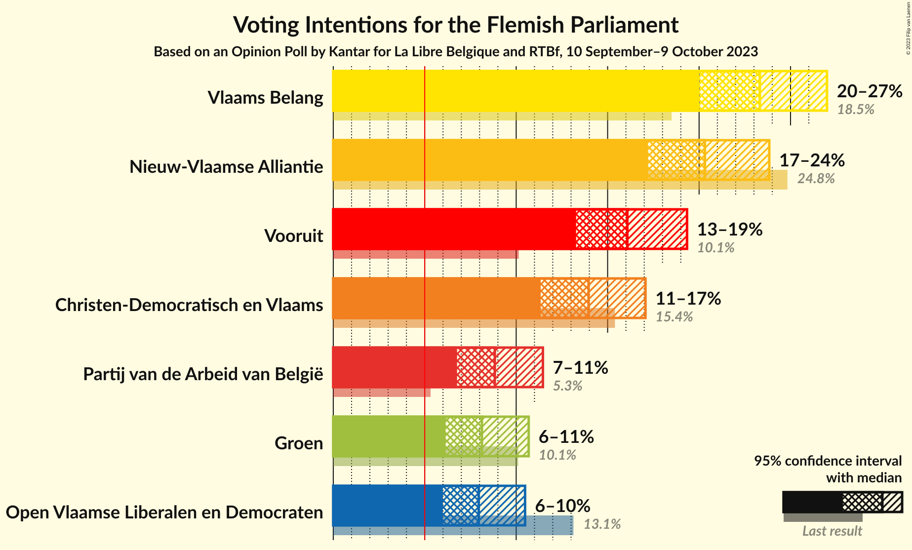

### Confidence Intervals

| Party | Last Result | Poll Result | 80% Confidence Interval | 90% Confidence Interval | 95% Confidence Interval | 99% Confidence Interval |
|:-----:|:-----------:|:-----------:|:-----------------------:|:-----------------------:|:-----------------------:|:-----------------------:|
| Vlaams Belang | 18.5% | 23.3% | 21.2–25.7% |20.5–26.4% |20.0–27.0% |19.0–28.2% |
| Nieuw-Vlaamse Alliantie | 24.8% | 20.3% | 18.3–22.6% |17.7–23.3% |17.2–23.8% |16.3–25.0% |
| Vooruit | 10.1% | 16.1% | 14.2–18.2% |13.7–18.8% |13.3–19.3% |12.4–20.4% |
| Christen-Democratisch en Vlaams | 15.4% | 14.0% | 12.2–16.0% |11.8–16.6% |11.3–17.1% |10.6–18.1% |
| Partij van de Arbeid van België | 5.3% | 8.8% | 7.5–10.5% |7.1–11.0% |6.8–11.5% |6.2–12.3% |
| Groen | 10.1% | 8.1% | 6.8–9.8% |6.4–10.3% |6.1–10.7% |5.6–11.5% |
| Open Vlaamse Liberalen en Democraten | 13.1% | 8.0% | 6.7–9.6% |6.3–10.1% |6.0–10.5% |5.4–11.3% |

*Note:* The poll result column reflects the actual value used in the calculations. Published results may vary slightly, and in addition be rounded to fewer digits.

## Seats

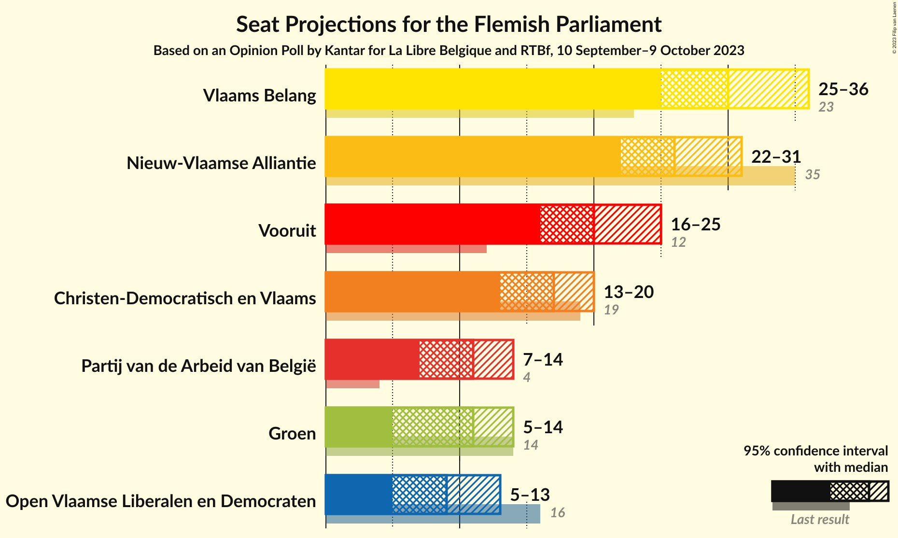

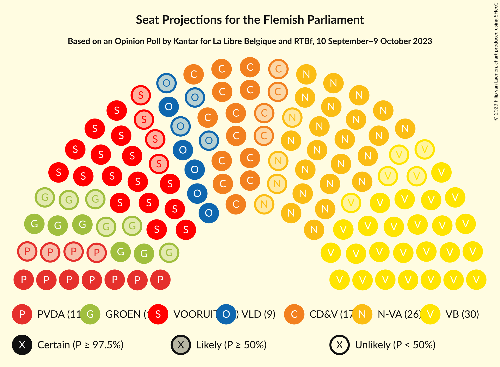

### Confidence Intervals

| Party | Last Result | Median | 80% Confidence Interval | 90% Confidence Interval | 95% Confidence Interval | 99% Confidence Interval |
|:-----:|:-----------:|:------:|:-----------------------:|:-----------------------:|:-----------------------:|:-----------------------:|
| <a href="#vlaams-belang">Vlaams Belang</a> | 23 | 30 | 27–34 |25–35 |25–36 |23–37 |
| <a href="#nieuw-vlaamse-alliantie">Nieuw-Vlaamse Alliantie</a> | 35 | 26 | 24–30 |22–31 |22–31 |21–33 |
| <a href="#vooruit">Vooruit</a> | 12 | 20 | 18–25 |17–25 |16–25 |15–27 |
| <a href="#christen-democratisch-en-vlaams">Christen-Democratisch en Vlaams</a> | 19 | 17 | 14–19 |14–20 |13–20 |11–23 |
| <a href="#partij-van-de-arbeid-van-belgië">Partij van de Arbeid van België</a> | 4 | 11 | 7–13 |7–14 |7–14 |5–14 |
| <a href="#groen">Groen</a> | 14 | 11 | 7–13 |7–14 |5–14 |5–15 |
| <a href="#open-vlaamse-liberalen-en-democraten">Open Vlaamse Liberalen en Democraten</a> | 16 | 9 | 7–12 |5–12 |5–13 |3–14 |

### Vlaams Belang

*For a full overview of the results for this party, see the [Vlaams Belang](party-vlaamsbelang.html) page.*

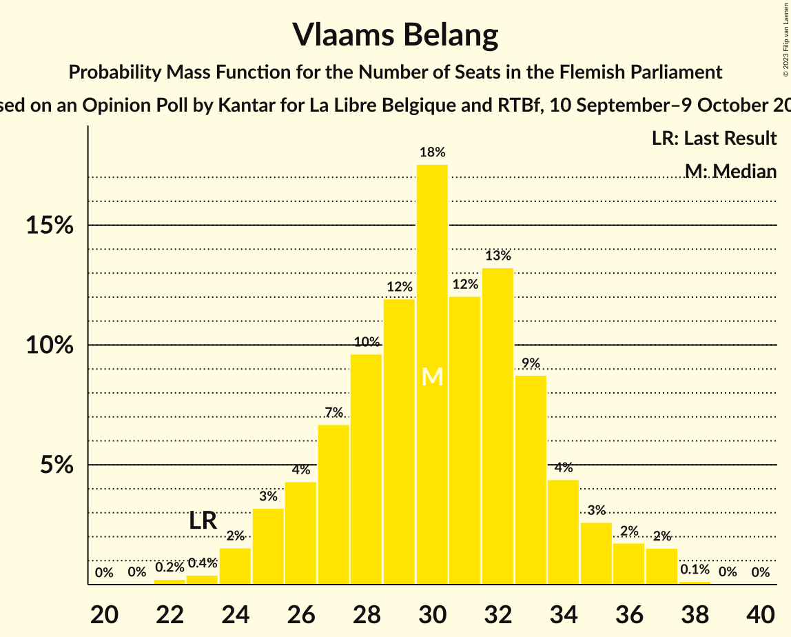

| Number of Seats | Probability | Accumulated | Special Marks |
|:---------------:|:-----------:|:-----------:|:-------------:|
| 22 | 0.2% | 100% |  |
| 23 | 0.4% | 99.7% | Last Result |
| 24 | 2% | 99.3% |  |
| 25 | 3% | 98% |  |
| 26 | 4% | 95% |  |
| 27 | 7% | 90% |  |
| 28 | 10% | 84% |  |
| 29 | 12% | 74% |  |
| 30 | 18% | 62% | Median |
| 31 | 12% | 44% |  |
| 32 | 13% | 32% |  |
| 33 | 9% | 19% |  |
| 34 | 4% | 10% |  |
| 35 | 3% | 6% |  |
| 36 | 2% | 3% |  |
| 37 | 2% | 2% |  |
| 38 | 0.1% | 0.2% |  |
| 39 | 0% | 0.1% |  |
| 40 | 0% | 0% |  |

### Nieuw-Vlaamse Alliantie

*For a full overview of the results for this party, see the [Nieuw-Vlaamse Alliantie](party-nieuw-vlaamsealliantie.html) page.*

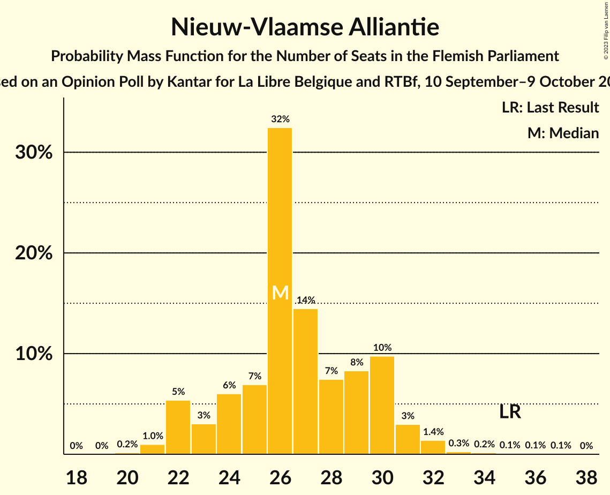

| Number of Seats | Probability | Accumulated | Special Marks |
|:---------------:|:-----------:|:-----------:|:-------------:|
| 20 | 0.2% | 100% |  |
| 21 | 1.0% | 99.8% |  |
| 22 | 5% | 98.8% |  |
| 23 | 3% | 93% |  |
| 24 | 6% | 90% |  |
| 25 | 7% | 84% |  |
| 26 | 32% | 77% | Median |
| 27 | 14% | 45% |  |
| 28 | 7% | 31% |  |
| 29 | 8% | 23% |  |
| 30 | 10% | 15% |  |
| 31 | 3% | 5% |  |
| 32 | 1.4% | 2% |  |
| 33 | 0.3% | 0.6% |  |
| 34 | 0.2% | 0.4% |  |
| 35 | 0.1% | 0.2% | Last Result |
| 36 | 0.1% | 0.1% |  |
| 37 | 0.1% | 0.1% |  |
| 38 | 0% | 0% |  |

### Vooruit

*For a full overview of the results for this party, see the [Vooruit](party-vooruit.html) page.*

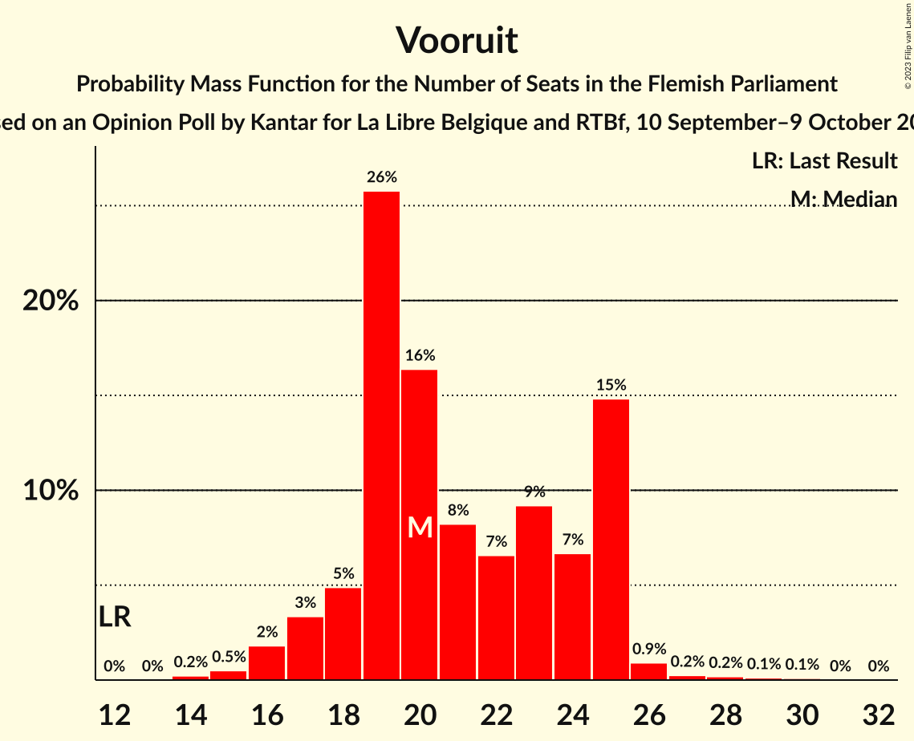

| Number of Seats | Probability | Accumulated | Special Marks |
|:---------------:|:-----------:|:-----------:|:-------------:|
| 12 | 0% | 100% | Last Result |
| 13 | 0% | 100% |  |
| 14 | 0.2% | 100% |  |
| 15 | 0.5% | 99.8% |  |
| 16 | 2% | 99.3% |  |
| 17 | 3% | 97% |  |
| 18 | 5% | 94% |  |
| 19 | 26% | 89% |  |
| 20 | 16% | 63% | Median |
| 21 | 8% | 47% |  |
| 22 | 7% | 39% |  |
| 23 | 9% | 32% |  |
| 24 | 7% | 23% |  |
| 25 | 15% | 16% |  |
| 26 | 0.9% | 2% |  |
| 27 | 0.2% | 0.7% |  |
| 28 | 0.2% | 0.4% |  |
| 29 | 0.1% | 0.2% |  |
| 30 | 0.1% | 0.1% |  |
| 31 | 0% | 0% |  |

### Christen-Democratisch en Vlaams

*For a full overview of the results for this party, see the [Christen-Democratisch en Vlaams](party-christen-democratischenvlaams.html) page.*

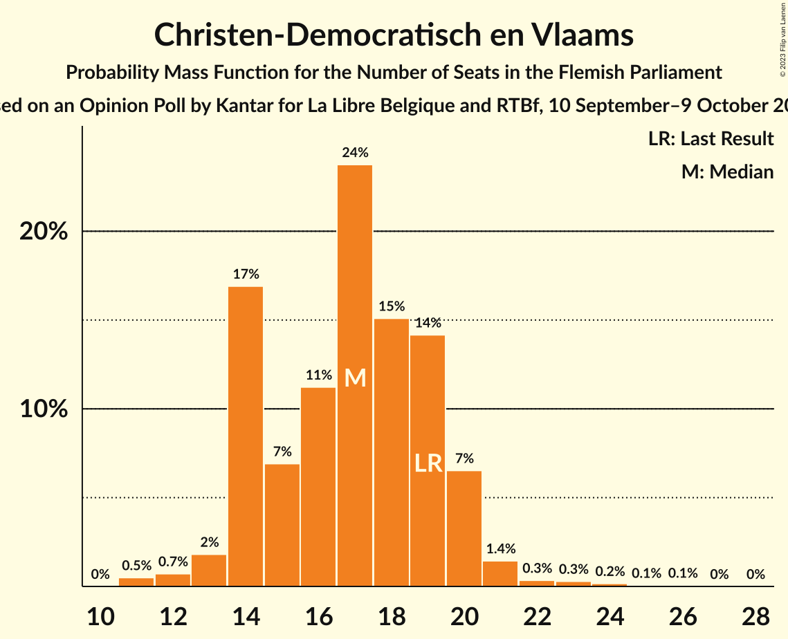

| Number of Seats | Probability | Accumulated | Special Marks |
|:---------------:|:-----------:|:-----------:|:-------------:|
| 11 | 0.5% | 100% |  |
| 12 | 0.7% | 99.5% |  |
| 13 | 2% | 98.8% |  |
| 14 | 17% | 97% |  |
| 15 | 7% | 80% |  |
| 16 | 11% | 73% |  |
| 17 | 24% | 62% | Median |
| 18 | 15% | 38% |  |
| 19 | 14% | 23% | Last Result |
| 20 | 7% | 9% |  |
| 21 | 1.4% | 2% |  |
| 22 | 0.3% | 0.9% |  |
| 23 | 0.3% | 0.6% |  |
| 24 | 0.2% | 0.3% |  |
| 25 | 0.1% | 0.1% |  |
| 26 | 0.1% | 0.1% |  |
| 27 | 0% | 0% |  |

### Partij van de Arbeid van België

*For a full overview of the results for this party, see the [Partij van de Arbeid van België](party-partijvandearbeidvanbelgië.html) page.*

| Number of Seats | Probability | Accumulated | Special Marks |
|:---------------:|:-----------:|:-----------:|:-------------:|
| 4 | 0.1% | 100% | Last Result |
| 5 | 0.6% | 99.9% |  |
| 6 | 0.6% | 99.3% |  |
| 7 | 21% | 98.7% |  |
| 8 | 11% | 78% |  |
| 9 | 8% | 67% |  |
| 10 | 7% | 59% |  |
| 11 | 20% | 52% | Median |
| 12 | 15% | 32% |  |
| 13 | 10% | 17% |  |
| 14 | 6% | 7% |  |
| 15 | 0.2% | 0.5% |  |
| 16 | 0.1% | 0.2% |  |
| 17 | 0.1% | 0.1% |  |
| 18 | 0.1% | 0.1% |  |
| 19 | 0% | 0% |  |

### Groen

*For a full overview of the results for this party, see the [Groen](party-groen.html) page.*

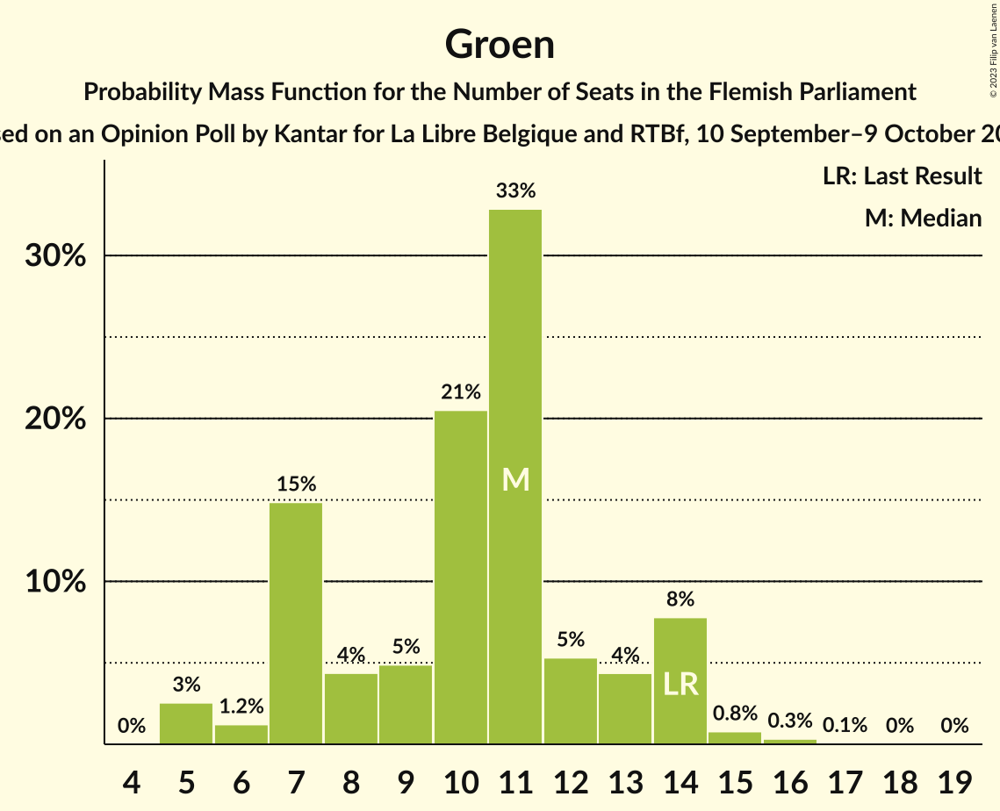

| Number of Seats | Probability | Accumulated | Special Marks |
|:---------------:|:-----------:|:-----------:|:-------------:|
| 4 | 0% | 100% |  |
| 5 | 3% | 99.9% |  |
| 6 | 1.2% | 97% |  |
| 7 | 15% | 96% |  |
| 8 | 4% | 81% |  |
| 9 | 5% | 77% |  |
| 10 | 21% | 72% |  |
| 11 | 33% | 52% | Median |
| 12 | 5% | 19% |  |
| 13 | 4% | 13% |  |
| 14 | 8% | 9% | Last Result |
| 15 | 0.8% | 1.2% |  |
| 16 | 0.3% | 0.4% |  |
| 17 | 0.1% | 0.1% |  |
| 18 | 0% | 0.1% |  |
| 19 | 0% | 0% |  |

### Open Vlaamse Liberalen en Democraten

*For a full overview of the results for this party, see the [Open Vlaamse Liberalen en Democraten](party-openvlaamseliberalenendemocraten.html) page.*

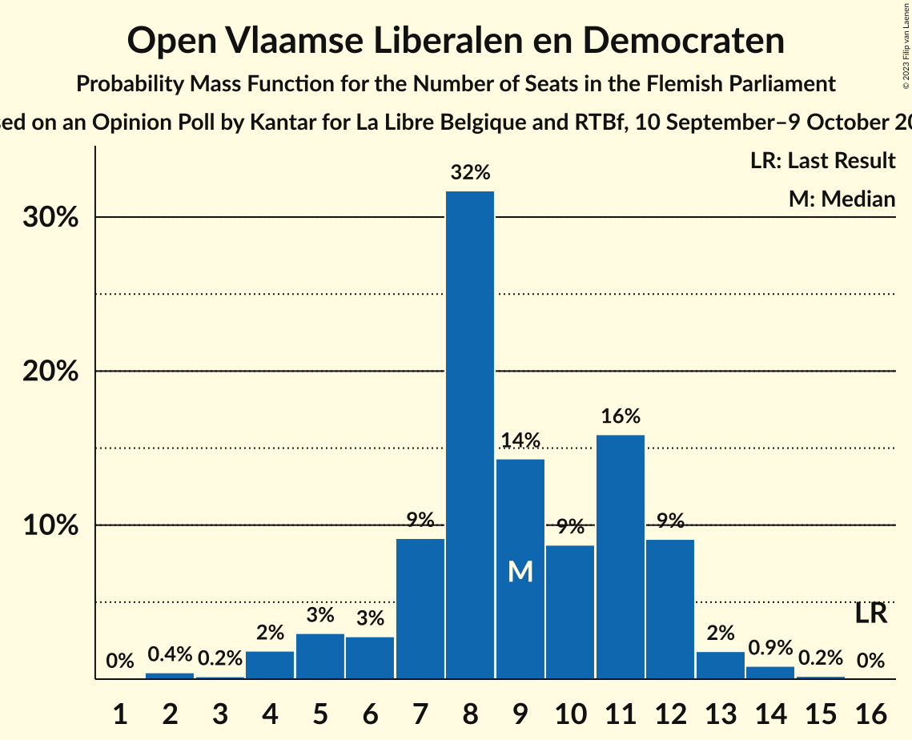

| Number of Seats | Probability | Accumulated | Special Marks |
|:---------------:|:-----------:|:-----------:|:-------------:|
| 2 | 0.4% | 100% |  |
| 3 | 0.2% | 99.6% |  |
| 4 | 2% | 99.4% |  |
| 5 | 3% | 98% |  |
| 6 | 3% | 95% |  |
| 7 | 9% | 92% |  |
| 8 | 32% | 83% |  |
| 9 | 14% | 51% | Median |
| 10 | 9% | 37% |  |
| 11 | 16% | 28% |  |
| 12 | 9% | 12% |  |
| 13 | 2% | 3% |  |
| 14 | 0.9% | 1.1% |  |
| 15 | 0.2% | 0.2% |  |
| 16 | 0% | 0% | Last Result |

## Coalitions

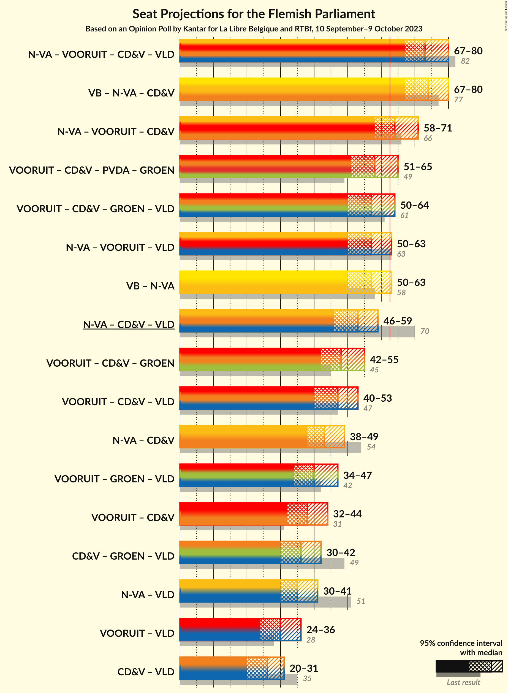

### Confidence Intervals

| Coalition | Last Result | Median | Majority? | 80% Confidence Interval | 90% Confidence Interval | 95% Confidence Interval | 99% Confidence Interval |
|:---------:|:-----------:|:------:|:---------:|:-----------------------:|:-----------------------:|:-----------------------:|:-----------------------:|
| Nieuw-Vlaamse Alliantie – Vooruit – Christen-Democratisch en Vlaams – Open Vlaamse Liberalen en Democraten | 82 | 73 | 99.9% | 69–78 | 68–79 | 67–80 | 65–82 |
| Vlaams Belang – Nieuw-Vlaamse Alliantie – Christen-Democratisch en Vlaams | 77 | 74 | 100% | 69–78 | 68–79 | 67–80 | 65–82 |
| Nieuw-Vlaamse Alliantie – Vooruit – Christen-Democratisch en Vlaams | 66 | 64 | 73% | 60–69 | 59–70 | 58–71 | 56–73 |
| Vooruit – Christen-Democratisch en Vlaams – Partij van de Arbeid van België – Groen | 49 | 58 | 9% | 54–62 | 53–64 | 51–65 | 50–67 |
| Vooruit – Christen-Democratisch en Vlaams – Groen – Open Vlaamse Liberalen en Democraten | 61 | 57 | 5% | 52–61 | 51–62 | 50–64 | 48–66 |
| Nieuw-Vlaamse Alliantie – Vooruit – Open Vlaamse Liberalen en Democraten | 63 | 57 | 4% | 52–61 | 51–62 | 50–63 | 48–65 |
| Vlaams Belang – Nieuw-Vlaamse Alliantie | 58 | 57 | 4% | 53–61 | 51–62 | 50–63 | 49–65 |
| Nieuw-Vlaamse Alliantie – Christen-Democratisch en Vlaams – Open Vlaamse Liberalen en Democraten | 70 | 53 | 0.1% | 48–57 | 47–58 | 46–59 | 44–61 |
| Vooruit – Christen-Democratisch en Vlaams – Groen | 45 | 48 | 0% | 44–52 | 42–54 | 42–55 | 40–57 |
| Vooruit – Christen-Democratisch en Vlaams – Open Vlaamse Liberalen en Democraten | 47 | 47 | 0% | 42–51 | 41–52 | 40–53 | 38–55 |
| Nieuw-Vlaamse Alliantie – Christen-Democratisch en Vlaams | 54 | 43 | 0% | 40–47 | 39–48 | 38–49 | 36–52 |
| Vooruit – Groen – Open Vlaamse Liberalen en Democraten | 42 | 40 | 0% | 36–45 | 35–46 | 34–47 | 32–49 |
| Vooruit – Christen-Democratisch en Vlaams | 31 | 38 | 0% | 34–42 | 33–43 | 32–44 | 30–45 |
| Christen-Democratisch en Vlaams – Groen – Open Vlaamse Liberalen en Democraten | 49 | 36 | 0% | 32–40 | 31–41 | 30–42 | 28–44 |
| Nieuw-Vlaamse Alliantie – Open Vlaamse Liberalen en Democraten | 51 | 35 | 0% | 32–40 | 31–40 | 30–41 | 28–43 |
| Vooruit – Open Vlaamse Liberalen en Democraten | 28 | 30 | 0% | 26–34 | 25–35 | 24–36 | 22–38 |
| Christen-Democratisch en Vlaams – Open Vlaamse Liberalen en Democraten | 35 | 26 | 0% | 22–29 | 21–30 | 20–31 | 19–33 |

### Nieuw-Vlaamse Alliantie – Vooruit – Christen-Democratisch en Vlaams – Open Vlaamse Liberalen en Democraten

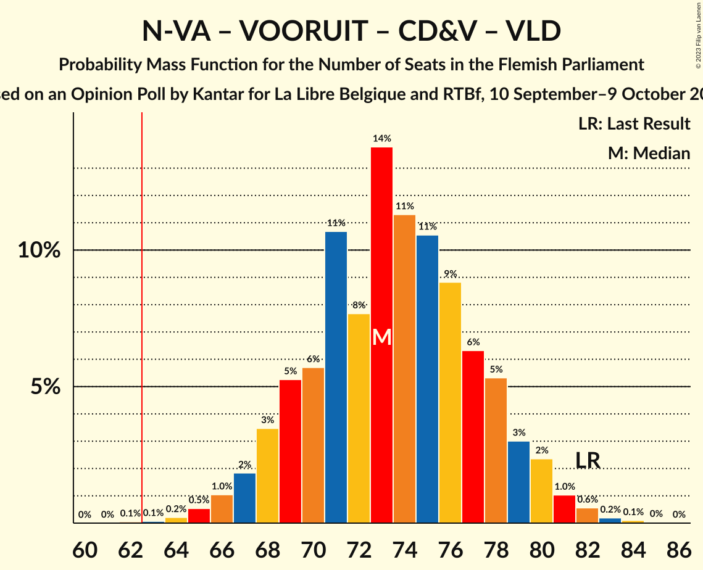

| Number of Seats | Probability | Accumulated | Special Marks |
|:---------------:|:-----------:|:-----------:|:-------------:|
| 62 | 0.1% | 100% |  |
| 63 | 0.1% | 99.9% | Majority |
| 64 | 0.2% | 99.9% |  |
| 65 | 0.5% | 99.7% |  |
| 66 | 1.0% | 99.1% |  |
| 67 | 2% | 98% |  |
| 68 | 3% | 96% |  |
| 69 | 5% | 93% |  |
| 70 | 6% | 87% |  |
| 71 | 11% | 82% |  |
| 72 | 8% | 71% | Median |
| 73 | 14% | 63% |  |
| 74 | 11% | 50% |  |
| 75 | 11% | 38% |  |
| 76 | 9% | 28% |  |
| 77 | 6% | 19% |  |
| 78 | 5% | 13% |  |
| 79 | 3% | 7% |  |
| 80 | 2% | 4% |  |
| 81 | 1.0% | 2% |  |
| 82 | 0.6% | 0.9% | Last Result |
| 83 | 0.2% | 0.4% |  |
| 84 | 0.1% | 0.2% |  |
| 85 | 0% | 0.1% |  |
| 86 | 0% | 0% |  |

### Vlaams Belang – Nieuw-Vlaamse Alliantie – Christen-Democratisch en Vlaams

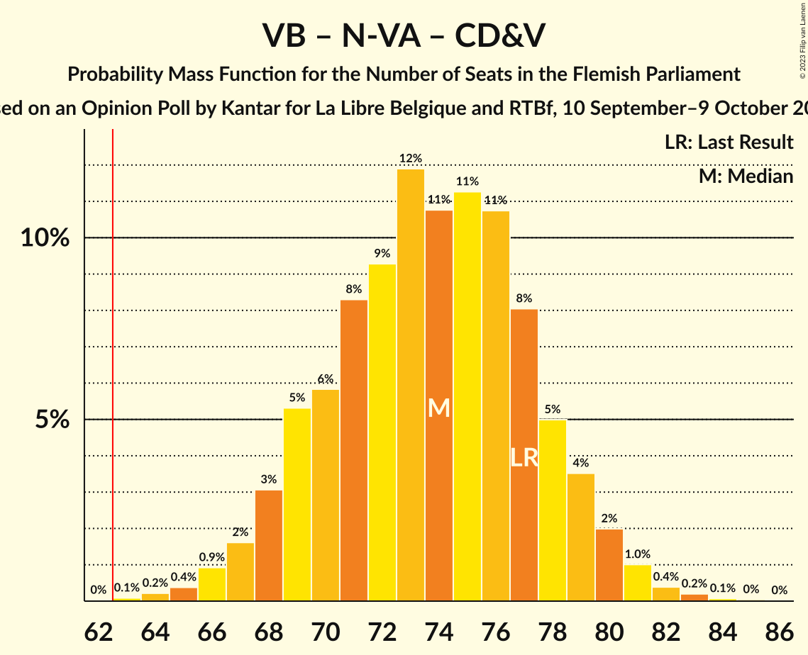

| Number of Seats | Probability | Accumulated | Special Marks |
|:---------------:|:-----------:|:-----------:|:-------------:|
| 63 | 0.1% | 100% | Majority |
| 64 | 0.2% | 99.9% |  |
| 65 | 0.4% | 99.7% |  |
| 66 | 0.9% | 99.3% |  |
| 67 | 2% | 98% |  |
| 68 | 3% | 97% |  |
| 69 | 5% | 94% |  |
| 70 | 6% | 88% |  |
| 71 | 8% | 83% |  |
| 72 | 9% | 74% |  |
| 73 | 12% | 65% | Median |
| 74 | 11% | 53% |  |
| 75 | 11% | 42% |  |
| 76 | 11% | 31% |  |
| 77 | 8% | 20% | Last Result |
| 78 | 5% | 12% |  |
| 79 | 4% | 7% |  |
| 80 | 2% | 4% |  |
| 81 | 1.0% | 2% |  |
| 82 | 0.4% | 0.7% |  |
| 83 | 0.2% | 0.3% |  |
| 84 | 0.1% | 0.1% |  |
| 85 | 0% | 0.1% |  |
| 86 | 0% | 0% |  |

### Nieuw-Vlaamse Alliantie – Vooruit – Christen-Democratisch en Vlaams

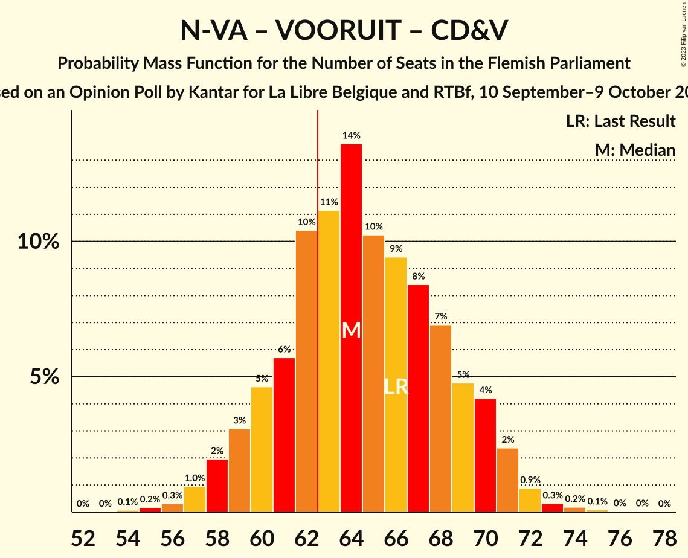

| Number of Seats | Probability | Accumulated | Special Marks |
|:---------------:|:-----------:|:-----------:|:-------------:|
| 54 | 0.1% | 100% |  |
| 55 | 0.2% | 99.9% |  |
| 56 | 0.3% | 99.7% |  |
| 57 | 1.0% | 99.4% |  |
| 58 | 2% | 98% |  |
| 59 | 3% | 96% |  |
| 60 | 5% | 93% |  |
| 61 | 6% | 89% |  |
| 62 | 10% | 83% |  |
| 63 | 11% | 73% | Median, Majority |
| 64 | 14% | 62% |  |
| 65 | 10% | 48% |  |
| 66 | 9% | 38% | Last Result |
| 67 | 8% | 28% |  |
| 68 | 7% | 20% |  |
| 69 | 5% | 13% |  |
| 70 | 4% | 8% |  |
| 71 | 2% | 4% |  |
| 72 | 0.9% | 2% |  |
| 73 | 0.3% | 0.7% |  |
| 74 | 0.2% | 0.3% |  |
| 75 | 0.1% | 0.2% |  |
| 76 | 0% | 0.1% |  |
| 77 | 0% | 0% |  |

### Vooruit – Christen-Democratisch en Vlaams – Partij van de Arbeid van België – Groen

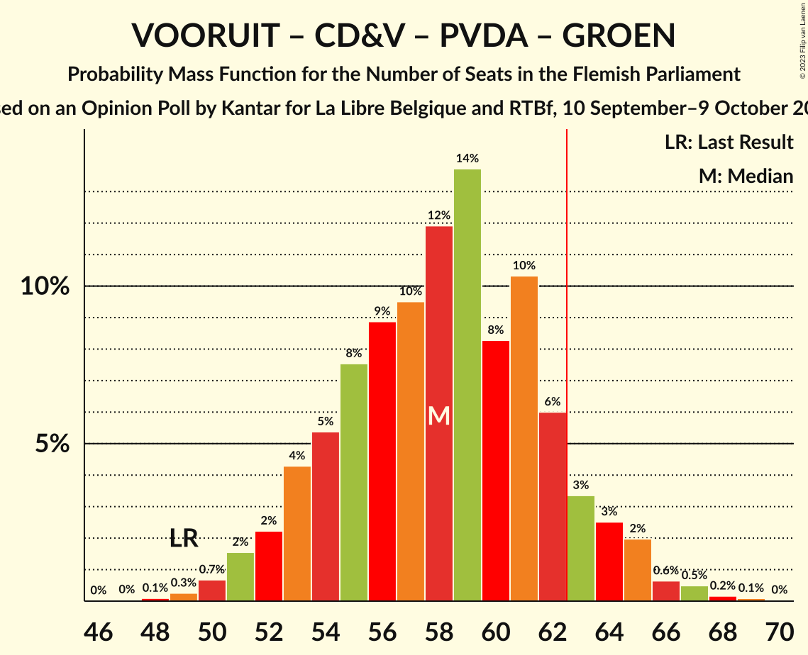

| Number of Seats | Probability | Accumulated | Special Marks |
|:---------------:|:-----------:|:-----------:|:-------------:|
| 47 | 0% | 100% |  |
| 48 | 0.1% | 99.9% |  |
| 49 | 0.3% | 99.8% | Last Result |
| 50 | 0.7% | 99.6% |  |
| 51 | 2% | 98.9% |  |
| 52 | 2% | 97% |  |
| 53 | 4% | 95% |  |
| 54 | 5% | 91% |  |
| 55 | 8% | 85% |  |
| 56 | 9% | 78% |  |
| 57 | 10% | 69% |  |
| 58 | 12% | 60% |  |
| 59 | 14% | 48% | Median |
| 60 | 8% | 34% |  |
| 61 | 10% | 26% |  |
| 62 | 6% | 15% |  |
| 63 | 3% | 9% | Majority |
| 64 | 3% | 6% |  |
| 65 | 2% | 3% |  |
| 66 | 0.6% | 1.4% |  |
| 67 | 0.5% | 0.8% |  |
| 68 | 0.2% | 0.3% |  |
| 69 | 0.1% | 0.1% |  |
| 70 | 0% | 0% |  |

### Vooruit – Christen-Democratisch en Vlaams – Groen – Open Vlaamse Liberalen en Democraten

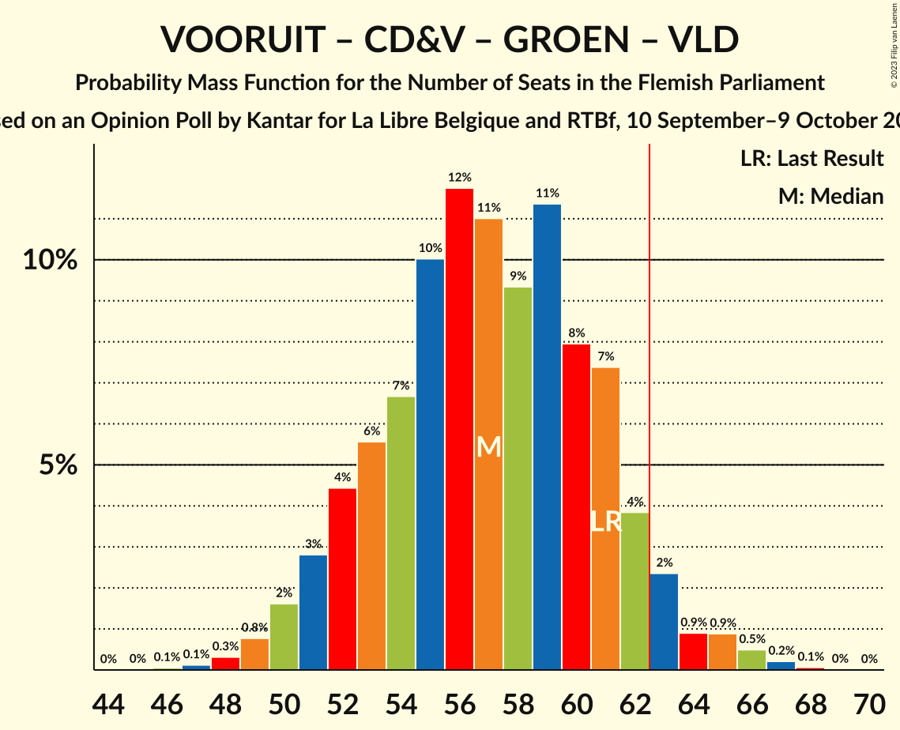

| Number of Seats | Probability | Accumulated | Special Marks |
|:---------------:|:-----------:|:-----------:|:-------------:|
| 46 | 0.1% | 100% |  |
| 47 | 0.1% | 99.9% |  |
| 48 | 0.3% | 99.8% |  |
| 49 | 0.8% | 99.5% |  |
| 50 | 2% | 98.7% |  |
| 51 | 3% | 97% |  |
| 52 | 4% | 94% |  |
| 53 | 6% | 90% |  |
| 54 | 7% | 84% |  |
| 55 | 10% | 78% |  |
| 56 | 12% | 68% |  |
| 57 | 11% | 56% | Median |
| 58 | 9% | 45% |  |
| 59 | 11% | 35% |  |
| 60 | 8% | 24% |  |
| 61 | 7% | 16% | Last Result |
| 62 | 4% | 9% |  |
| 63 | 2% | 5% | Majority |
| 64 | 0.9% | 3% |  |
| 65 | 0.9% | 2% |  |
| 66 | 0.5% | 0.8% |  |
| 67 | 0.2% | 0.3% |  |
| 68 | 0.1% | 0.1% |  |
| 69 | 0% | 0% |  |

### Nieuw-Vlaamse Alliantie – Vooruit – Open Vlaamse Liberalen en Democraten

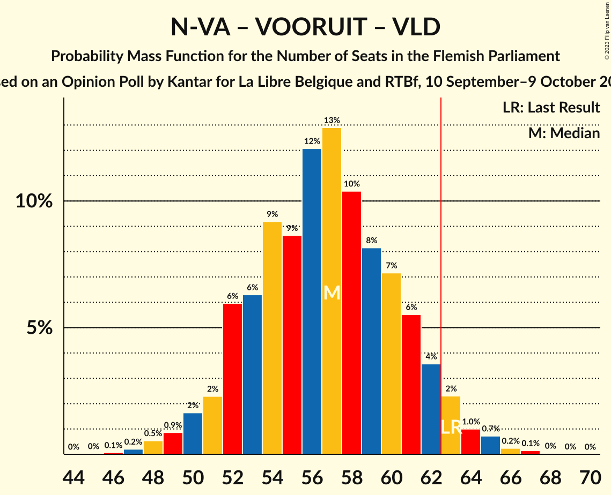

| Number of Seats | Probability | Accumulated | Special Marks |
|:---------------:|:-----------:|:-----------:|:-------------:|
| 46 | 0.1% | 100% |  |
| 47 | 0.2% | 99.9% |  |
| 48 | 0.5% | 99.7% |  |
| 49 | 0.9% | 99.2% |  |
| 50 | 2% | 98% |  |
| 51 | 2% | 97% |  |
| 52 | 6% | 94% |  |
| 53 | 6% | 88% |  |
| 54 | 9% | 82% |  |
| 55 | 9% | 73% | Median |
| 56 | 12% | 64% |  |
| 57 | 13% | 52% |  |
| 58 | 10% | 39% |  |
| 59 | 8% | 29% |  |
| 60 | 7% | 21% |  |
| 61 | 6% | 14% |  |
| 62 | 4% | 8% |  |
| 63 | 2% | 4% | Last Result, Majority |
| 64 | 1.0% | 2% |  |
| 65 | 0.7% | 1.2% |  |
| 66 | 0.2% | 0.4% |  |
| 67 | 0.1% | 0.2% |  |
| 68 | 0% | 0.1% |  |
| 69 | 0% | 0% |  |

### Vlaams Belang – Nieuw-Vlaamse Alliantie

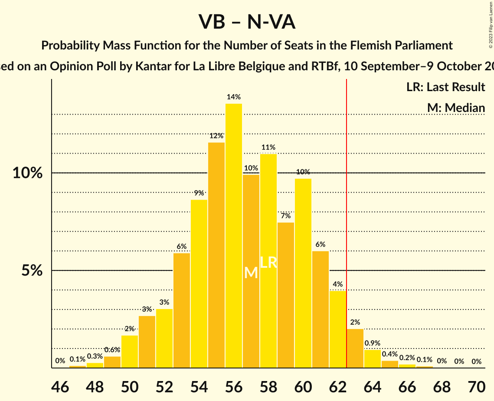

| Number of Seats | Probability | Accumulated | Special Marks |
|:---------------:|:-----------:|:-----------:|:-------------:|
| 46 | 0% | 100% |  |
| 47 | 0.1% | 99.9% |  |
| 48 | 0.3% | 99.8% |  |
| 49 | 0.6% | 99.5% |  |
| 50 | 2% | 98.9% |  |
| 51 | 3% | 97% |  |
| 52 | 3% | 95% |  |
| 53 | 6% | 91% |  |
| 54 | 9% | 86% |  |
| 55 | 12% | 77% |  |
| 56 | 14% | 65% | Median |
| 57 | 10% | 52% |  |
| 58 | 11% | 42% | Last Result |
| 59 | 7% | 31% |  |
| 60 | 10% | 23% |  |
| 61 | 6% | 14% |  |
| 62 | 4% | 8% |  |
| 63 | 2% | 4% | Majority |
| 64 | 0.9% | 2% |  |
| 65 | 0.4% | 0.8% |  |
| 66 | 0.2% | 0.4% |  |
| 67 | 0.1% | 0.2% |  |
| 68 | 0% | 0.1% |  |
| 69 | 0% | 0% |  |

### Nieuw-Vlaamse Alliantie – Christen-Democratisch en Vlaams – Open Vlaamse Liberalen en Democraten

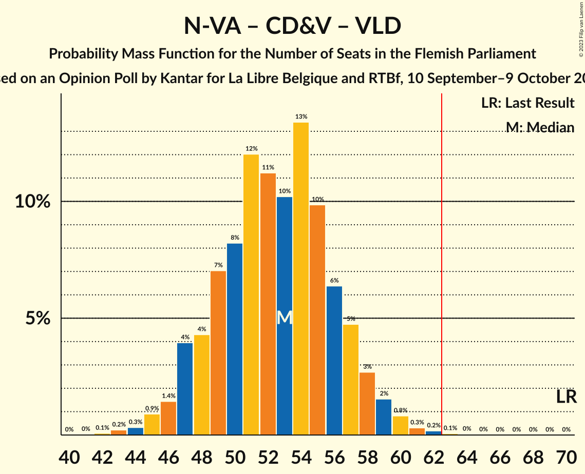

| Number of Seats | Probability | Accumulated | Special Marks |
|:---------------:|:-----------:|:-----------:|:-------------:|
| 42 | 0.1% | 100% |  |
| 43 | 0.2% | 99.9% |  |
| 44 | 0.3% | 99.7% |  |
| 45 | 0.9% | 99.3% |  |
| 46 | 1.4% | 98% |  |
| 47 | 4% | 97% |  |
| 48 | 4% | 93% |  |
| 49 | 7% | 89% |  |
| 50 | 8% | 82% |  |
| 51 | 12% | 73% |  |
| 52 | 11% | 61% | Median |
| 53 | 10% | 50% |  |
| 54 | 13% | 40% |  |
| 55 | 10% | 27% |  |
| 56 | 6% | 17% |  |
| 57 | 5% | 10% |  |
| 58 | 3% | 6% |  |
| 59 | 2% | 3% |  |
| 60 | 0.8% | 1.4% |  |
| 61 | 0.3% | 0.6% |  |
| 62 | 0.2% | 0.3% |  |
| 63 | 0.1% | 0.1% | Majority |
| 64 | 0% | 0.1% |  |
| 65 | 0% | 0% |  |
| 66 | 0% | 0% |  |
| 67 | 0% | 0% |  |
| 68 | 0% | 0% |  |
| 69 | 0% | 0% |  |
| 70 | 0% | 0% | Last Result |

### Vooruit – Christen-Democratisch en Vlaams – Groen

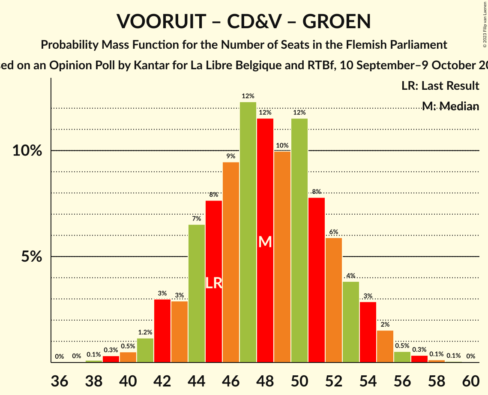

| Number of Seats | Probability | Accumulated | Special Marks |
|:---------------:|:-----------:|:-----------:|:-------------:|
| 37 | 0% | 100% |  |
| 38 | 0.1% | 99.9% |  |
| 39 | 0.3% | 99.8% |  |
| 40 | 0.5% | 99.5% |  |
| 41 | 1.2% | 99.0% |  |
| 42 | 3% | 98% |  |
| 43 | 3% | 95% |  |
| 44 | 7% | 92% |  |
| 45 | 8% | 85% | Last Result |
| 46 | 9% | 78% |  |
| 47 | 12% | 68% |  |
| 48 | 12% | 56% | Median |
| 49 | 10% | 44% |  |
| 50 | 12% | 35% |  |
| 51 | 8% | 23% |  |
| 52 | 6% | 15% |  |
| 53 | 4% | 9% |  |
| 54 | 3% | 5% |  |
| 55 | 2% | 3% |  |
| 56 | 0.5% | 1.1% |  |
| 57 | 0.3% | 0.6% |  |
| 58 | 0.1% | 0.2% |  |
| 59 | 0.1% | 0.1% |  |
| 60 | 0% | 0% |  |

### Vooruit – Christen-Democratisch en Vlaams – Open Vlaamse Liberalen en Democraten

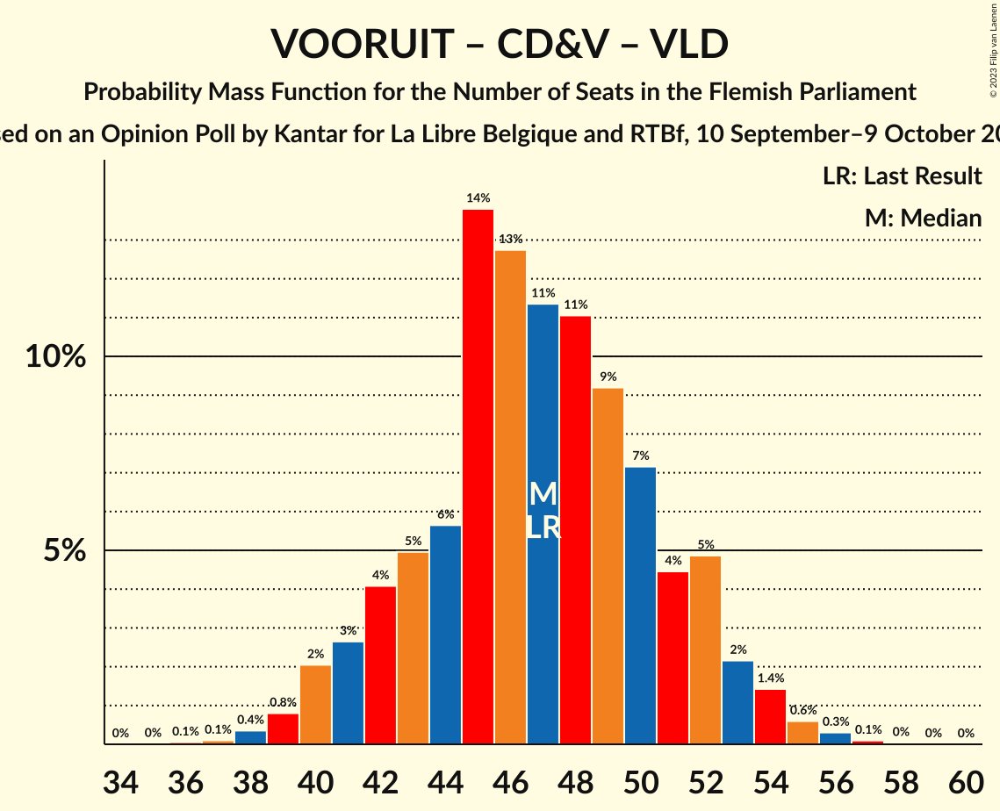

| Number of Seats | Probability | Accumulated | Special Marks |
|:---------------:|:-----------:|:-----------:|:-------------:|
| 36 | 0.1% | 100% |  |
| 37 | 0.1% | 99.9% |  |
| 38 | 0.4% | 99.8% |  |
| 39 | 0.8% | 99.5% |  |
| 40 | 2% | 98.7% |  |
| 41 | 3% | 97% |  |
| 42 | 4% | 94% |  |
| 43 | 5% | 90% |  |
| 44 | 6% | 85% |  |
| 45 | 14% | 79% |  |
| 46 | 13% | 65% | Median |
| 47 | 11% | 53% | Last Result |
| 48 | 11% | 41% |  |
| 49 | 9% | 30% |  |
| 50 | 7% | 21% |  |
| 51 | 4% | 14% |  |
| 52 | 5% | 10% |  |
| 53 | 2% | 5% |  |
| 54 | 1.4% | 2% |  |
| 55 | 0.6% | 1.1% |  |
| 56 | 0.3% | 0.5% |  |
| 57 | 0.1% | 0.2% |  |
| 58 | 0% | 0.1% |  |
| 59 | 0% | 0% |  |

### Nieuw-Vlaamse Alliantie – Christen-Democratisch en Vlaams

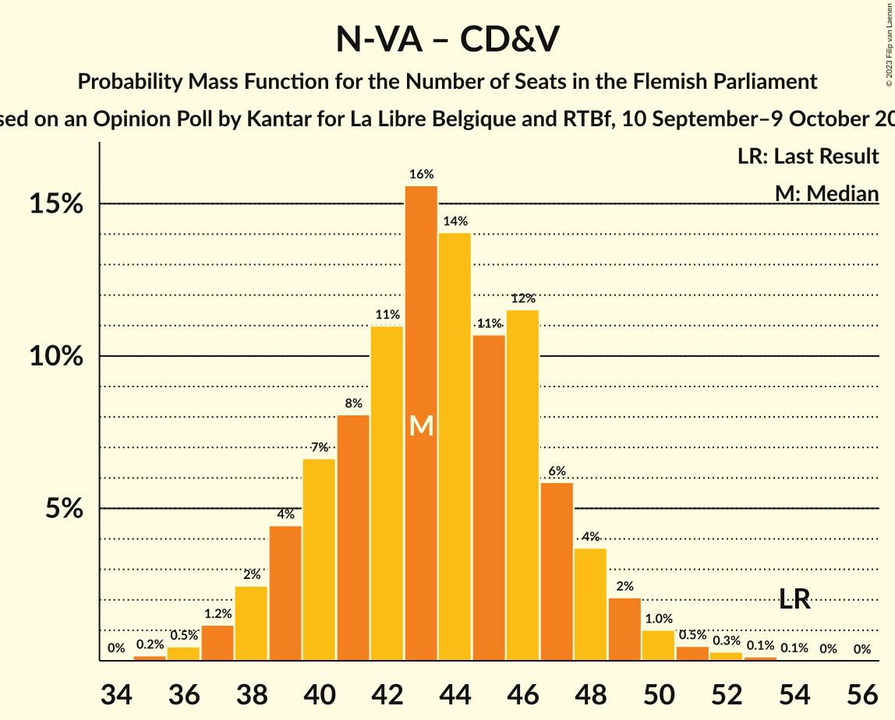

| Number of Seats | Probability | Accumulated | Special Marks |
|:---------------:|:-----------:|:-----------:|:-------------:|
| 34 | 0% | 100% |  |
| 35 | 0.2% | 99.9% |  |
| 36 | 0.5% | 99.8% |  |
| 37 | 1.2% | 99.3% |  |
| 38 | 2% | 98% |  |
| 39 | 4% | 96% |  |
| 40 | 7% | 91% |  |
| 41 | 8% | 85% |  |
| 42 | 11% | 77% |  |
| 43 | 16% | 66% | Median |
| 44 | 14% | 50% |  |
| 45 | 11% | 36% |  |
| 46 | 12% | 25% |  |
| 47 | 6% | 14% |  |
| 48 | 4% | 8% |  |
| 49 | 2% | 4% |  |
| 50 | 1.0% | 2% |  |
| 51 | 0.5% | 1.0% |  |
| 52 | 0.3% | 0.5% |  |
| 53 | 0.1% | 0.2% |  |
| 54 | 0.1% | 0.1% | Last Result |
| 55 | 0% | 0% |  |

### Vooruit – Groen – Open Vlaamse Liberalen en Democraten

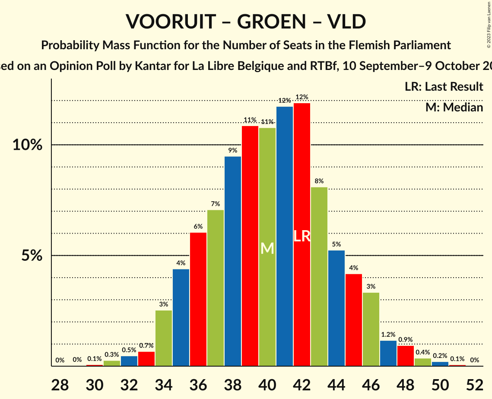

| Number of Seats | Probability | Accumulated | Special Marks |
|:---------------:|:-----------:|:-----------:|:-------------:|
| 30 | 0.1% | 100% |  |
| 31 | 0.3% | 99.9% |  |
| 32 | 0.5% | 99.6% |  |
| 33 | 0.7% | 99.1% |  |
| 34 | 3% | 98% |  |
| 35 | 4% | 96% |  |
| 36 | 6% | 92% |  |
| 37 | 7% | 85% |  |
| 38 | 9% | 78% |  |
| 39 | 11% | 69% |  |
| 40 | 11% | 58% | Median |
| 41 | 12% | 47% |  |
| 42 | 12% | 36% | Last Result |
| 43 | 8% | 24% |  |
| 44 | 5% | 16% |  |
| 45 | 4% | 10% |  |
| 46 | 3% | 6% |  |
| 47 | 1.2% | 3% |  |
| 48 | 0.9% | 2% |  |
| 49 | 0.4% | 0.7% |  |
| 50 | 0.2% | 0.3% |  |
| 51 | 0.1% | 0.1% |  |
| 52 | 0% | 0% |  |

### Vooruit – Christen-Democratisch en Vlaams

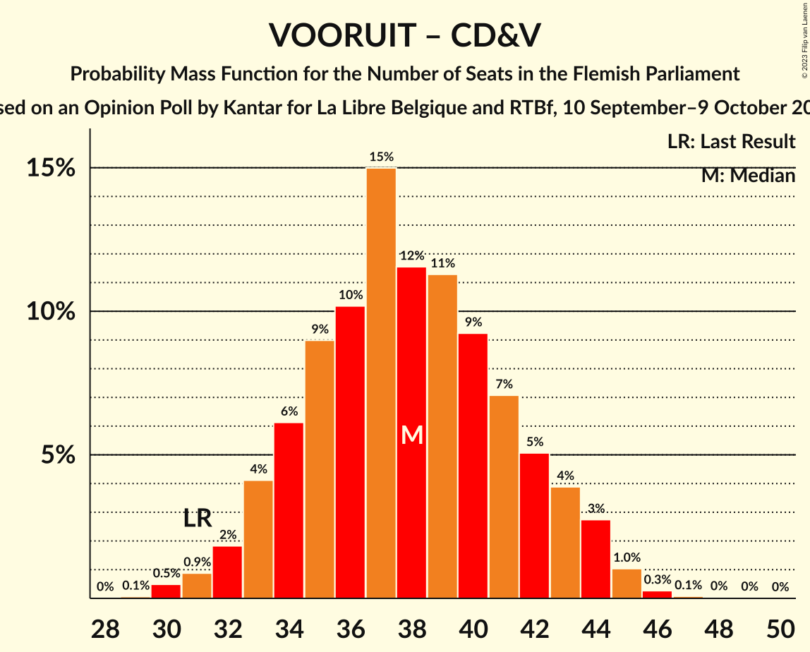

| Number of Seats | Probability | Accumulated | Special Marks |
|:---------------:|:-----------:|:-----------:|:-------------:|
| 29 | 0.1% | 100% |  |
| 30 | 0.5% | 99.9% |  |
| 31 | 0.9% | 99.4% | Last Result |
| 32 | 2% | 98.5% |  |
| 33 | 4% | 97% |  |
| 34 | 6% | 93% |  |
| 35 | 9% | 86% |  |
| 36 | 10% | 77% |  |
| 37 | 15% | 67% | Median |
| 38 | 12% | 52% |  |
| 39 | 11% | 41% |  |
| 40 | 9% | 29% |  |
| 41 | 7% | 20% |  |
| 42 | 5% | 13% |  |
| 43 | 4% | 8% |  |
| 44 | 3% | 4% |  |
| 45 | 1.0% | 1.5% |  |
| 46 | 0.3% | 0.4% |  |
| 47 | 0.1% | 0.2% |  |
| 48 | 0% | 0.1% |  |
| 49 | 0% | 0% |  |

### Christen-Democratisch en Vlaams – Groen – Open Vlaamse Liberalen en Democraten

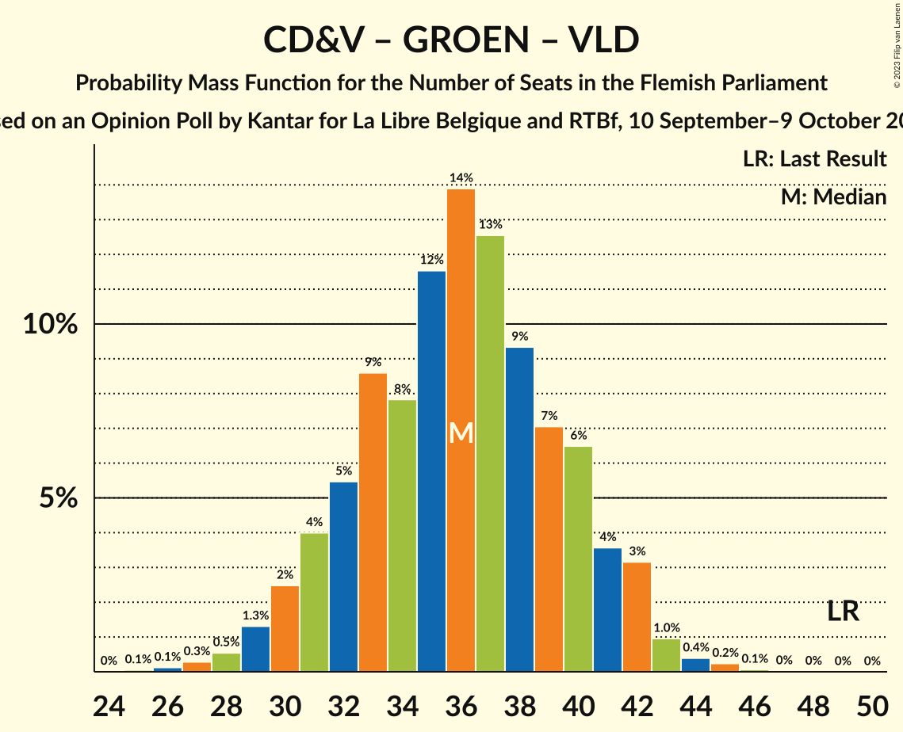

| Number of Seats | Probability | Accumulated | Special Marks |
|:---------------:|:-----------:|:-----------:|:-------------:|
| 25 | 0.1% | 100% |  |
| 26 | 0.1% | 99.9% |  |
| 27 | 0.3% | 99.8% |  |
| 28 | 0.5% | 99.5% |  |
| 29 | 1.3% | 99.0% |  |
| 30 | 2% | 98% |  |
| 31 | 4% | 95% |  |
| 32 | 5% | 91% |  |
| 33 | 9% | 86% |  |
| 34 | 8% | 77% |  |
| 35 | 12% | 69% |  |
| 36 | 14% | 58% |  |
| 37 | 13% | 44% | Median |
| 38 | 9% | 31% |  |
| 39 | 7% | 22% |  |
| 40 | 6% | 15% |  |
| 41 | 4% | 8% |  |
| 42 | 3% | 5% |  |
| 43 | 1.0% | 2% |  |
| 44 | 0.4% | 0.7% |  |
| 45 | 0.2% | 0.4% |  |
| 46 | 0.1% | 0.1% |  |
| 47 | 0% | 0% |  |
| 48 | 0% | 0% |  |
| 49 | 0% | 0% | Last Result |

### Nieuw-Vlaamse Alliantie – Open Vlaamse Liberalen en Democraten

| Number of Seats | Probability | Accumulated | Special Marks |
|:---------------:|:-----------:|:-----------:|:-------------:|
| 26 | 0% | 100% |  |
| 27 | 0.2% | 99.9% |  |
| 28 | 0.4% | 99.8% |  |
| 29 | 1.4% | 99.4% |  |
| 30 | 3% | 98% |  |
| 31 | 3% | 95% |  |
| 32 | 4% | 92% |  |
| 33 | 10% | 88% |  |
| 34 | 15% | 78% |  |
| 35 | 14% | 63% | Median |
| 36 | 8% | 49% |  |
| 37 | 14% | 40% |  |
| 38 | 11% | 27% |  |
| 39 | 6% | 16% |  |
| 40 | 5% | 10% |  |
| 41 | 3% | 5% |  |
| 42 | 1.1% | 2% |  |
| 43 | 0.7% | 1.1% |  |
| 44 | 0.3% | 0.5% |  |
| 45 | 0.1% | 0.1% |  |
| 46 | 0% | 0% |  |
| 47 | 0% | 0% |  |
| 48 | 0% | 0% |  |
| 49 | 0% | 0% |  |
| 50 | 0% | 0% |  |
| 51 | 0% | 0% | Last Result |

### Vooruit – Open Vlaamse Liberalen en Democraten

| Number of Seats | Probability | Accumulated | Special Marks |
|:---------------:|:-----------:|:-----------:|:-------------:|
| 20 | 0.1% | 100% |  |
| 21 | 0.2% | 99.9% |  |
| 22 | 0.3% | 99.7% |  |
| 23 | 0.8% | 99.4% |  |
| 24 | 2% | 98.6% |  |
| 25 | 3% | 97% |  |
| 26 | 5% | 94% |  |
| 27 | 10% | 89% |  |
| 28 | 13% | 78% | Last Result |
| 29 | 11% | 66% | Median |
| 30 | 11% | 55% |  |
| 31 | 11% | 44% |  |
| 32 | 11% | 33% |  |
| 33 | 9% | 22% |  |
| 34 | 6% | 13% |  |
| 35 | 3% | 7% |  |
| 36 | 2% | 4% |  |
| 37 | 0.9% | 2% |  |
| 38 | 0.4% | 0.6% |  |
| 39 | 0.1% | 0.2% |  |
| 40 | 0% | 0.1% |  |
| 41 | 0% | 0% |  |

### Christen-Democratisch en Vlaams – Open Vlaamse Liberalen en Democraten

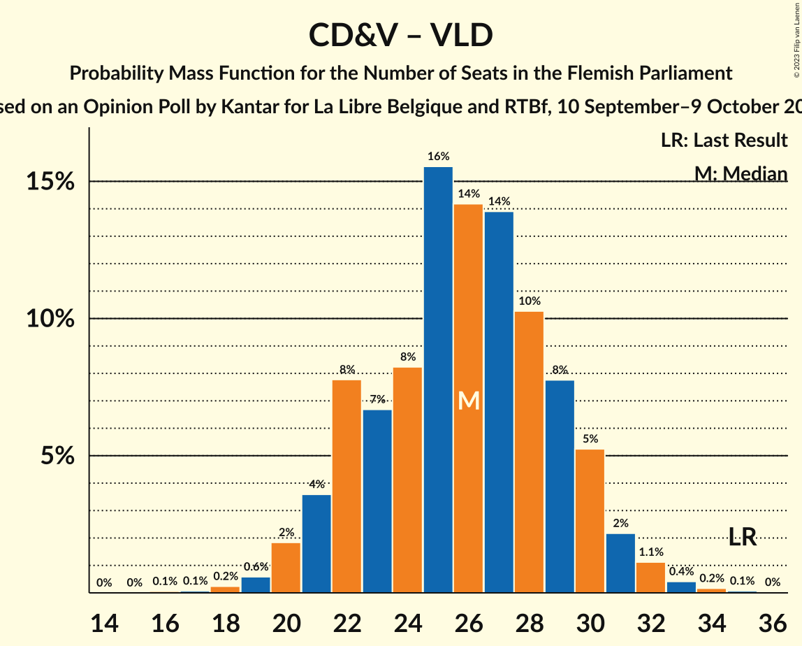

| Number of Seats | Probability | Accumulated | Special Marks |
|:---------------:|:-----------:|:-----------:|:-------------:|
| 16 | 0.1% | 100% |  |
| 17 | 0.1% | 99.9% |  |
| 18 | 0.2% | 99.9% |  |
| 19 | 0.6% | 99.6% |  |
| 20 | 2% | 99.0% |  |
| 21 | 4% | 97% |  |
| 22 | 8% | 94% |  |
| 23 | 7% | 86% |  |
| 24 | 8% | 79% |  |
| 25 | 16% | 71% |  |
| 26 | 14% | 55% | Median |
| 27 | 14% | 41% |  |
| 28 | 10% | 27% |  |
| 29 | 8% | 17% |  |
| 30 | 5% | 9% |  |
| 31 | 2% | 4% |  |
| 32 | 1.1% | 2% |  |
| 33 | 0.4% | 0.7% |  |
| 34 | 0.2% | 0.3% |  |
| 35 | 0.1% | 0.1% | Last Result |
| 36 | 0% | 0% |  |

## Technical Information

### Opinion Poll

+ **Polling firm:** Kantar
+ **Commissioner(s):** La Libre Belgique and RTBf
+ **Fieldwork period:** 10 September–9 October 2023

### Calculations

+ **Sample size:** 566
+ **Simulations done:** 1,048,576
+ **Error estimate:** 2.21%

