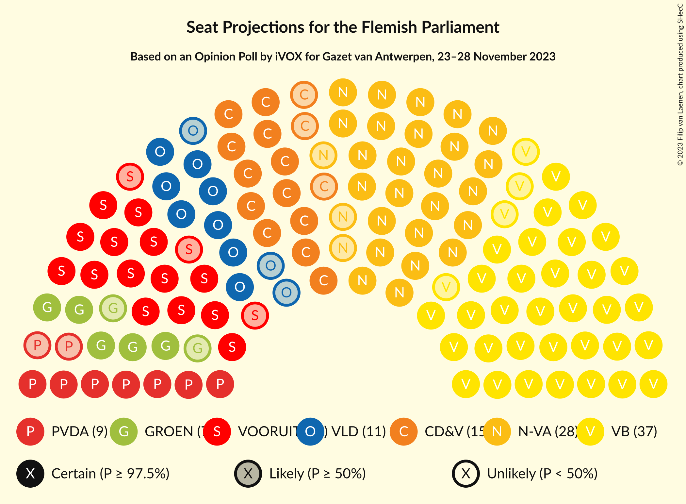
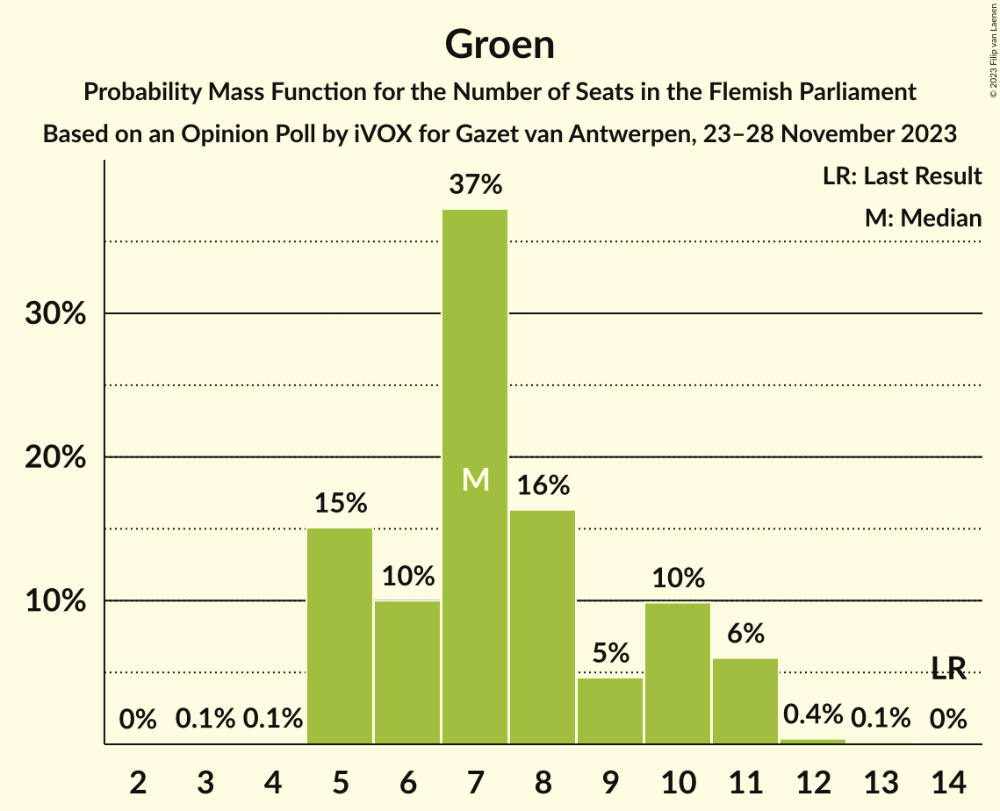
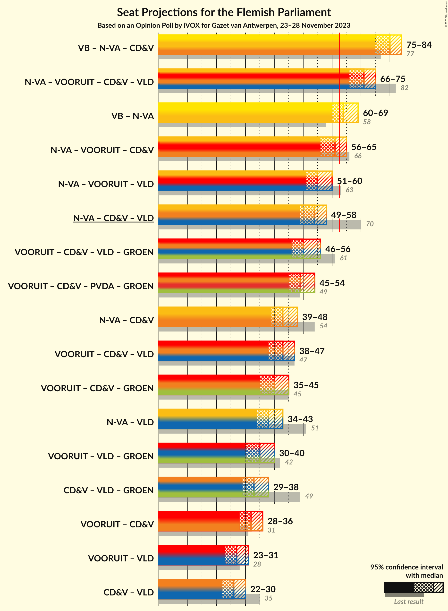
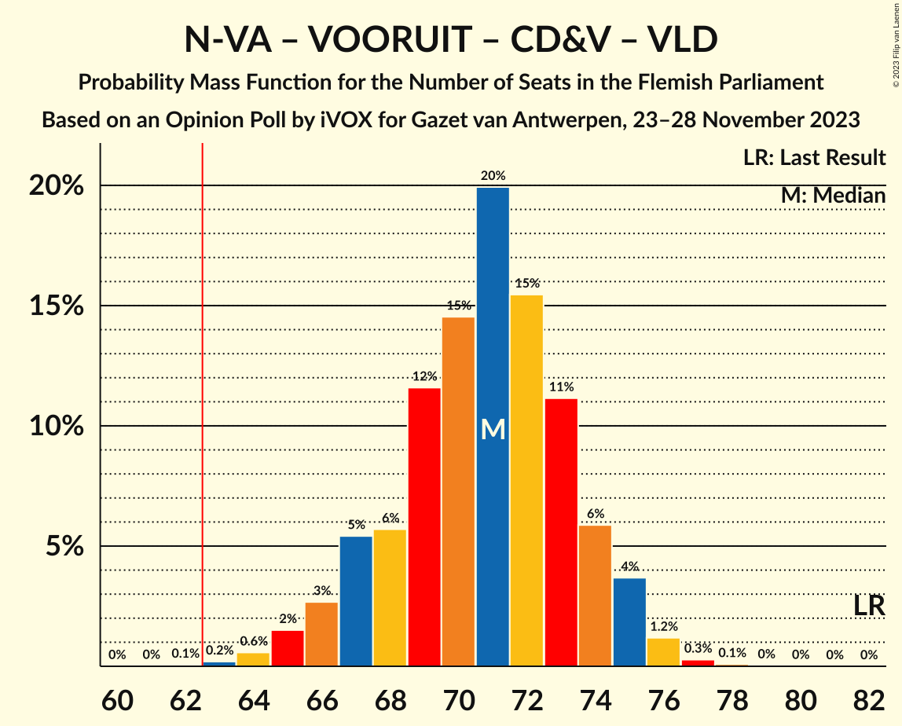
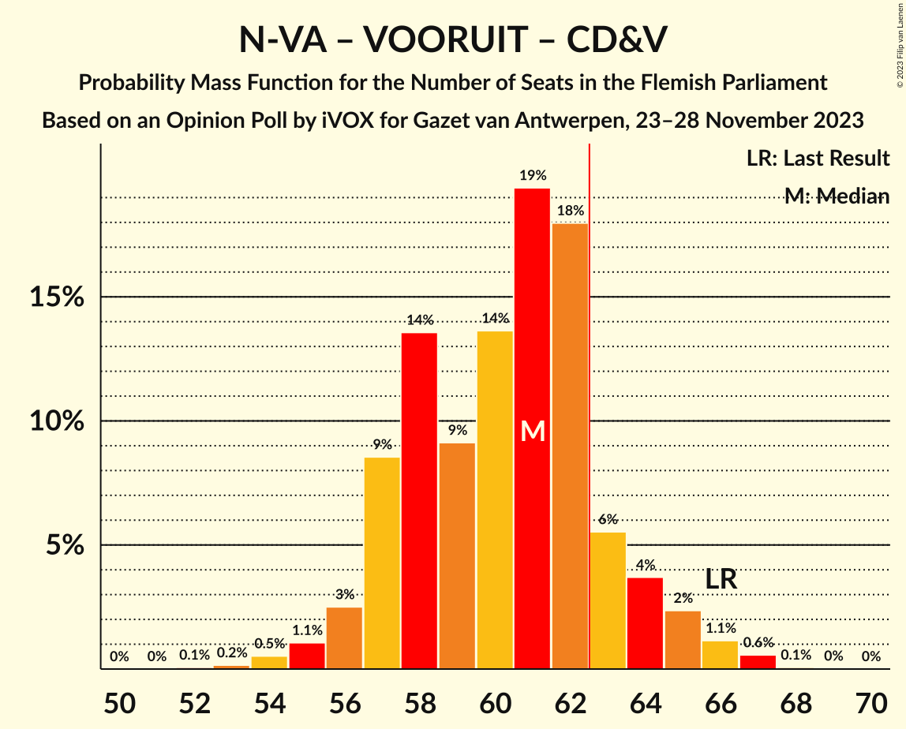
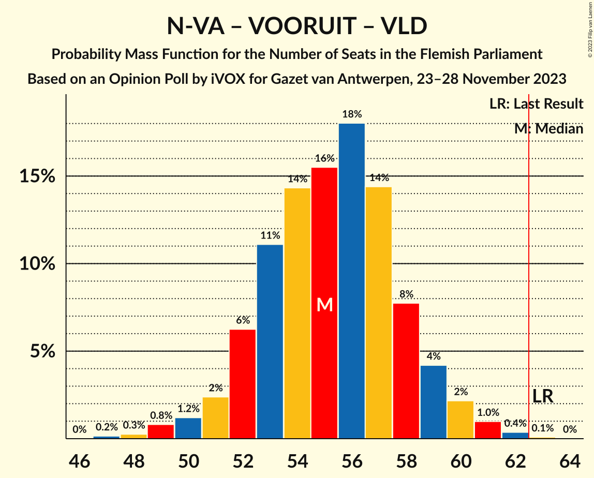
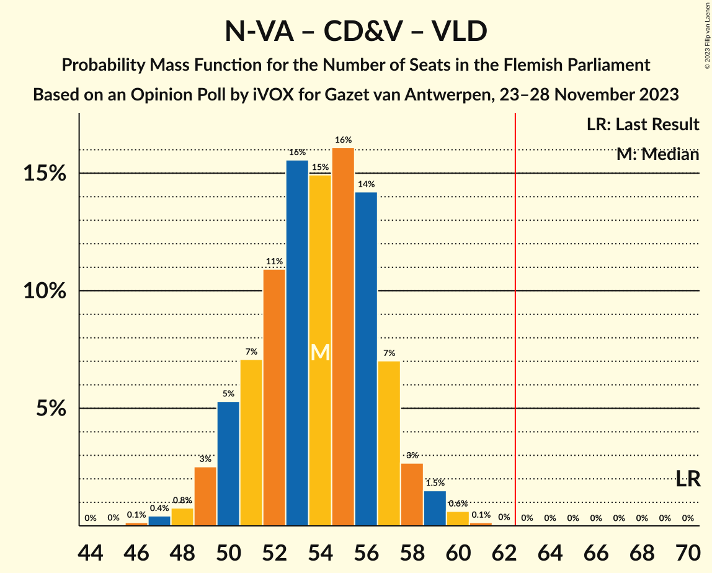
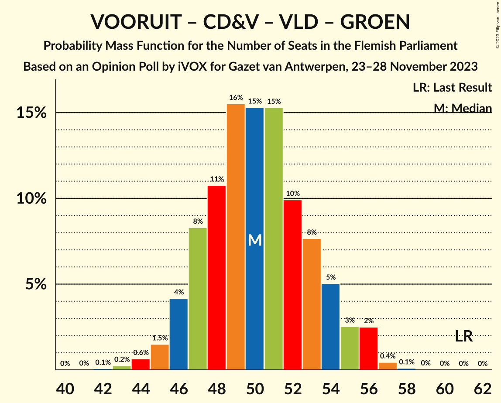
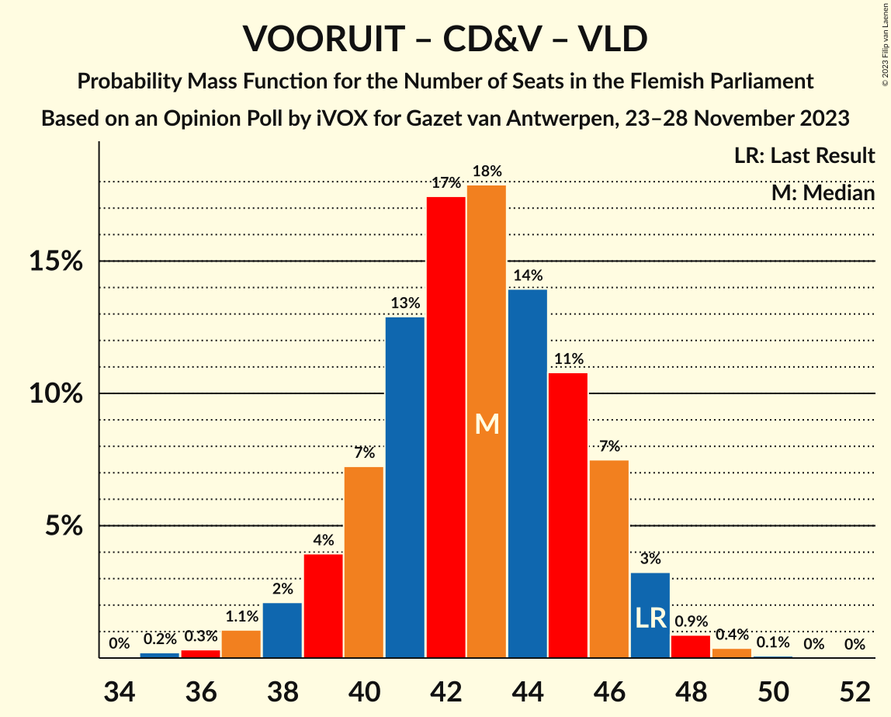
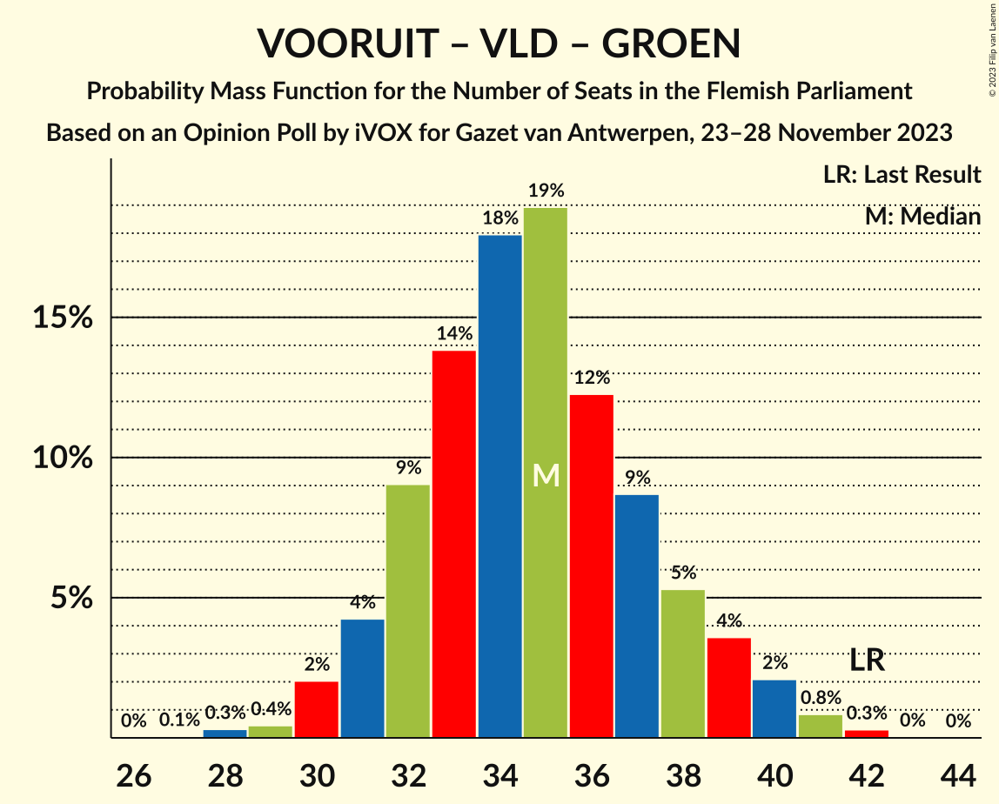

# Opinion Poll by iVOX for Gazet van Antwerpen, 23–28 November 2023

<a href="#voting-intentions">Voting Intentions</a> | <a href="#seats">Seats</a> | <a href="#coalitions">Coalitions</a> | <a href="#technical-information">Technical Information</a>

## Voting Intentions

### Confidence Intervals

| Party | Last Result | Poll Result | 80% Confidence Interval | 90% Confidence Interval | 95% Confidence Interval | 99% Confidence Interval |
|:-----:|:-----------:|:-----------:|:-----------------------:|:-----------------------:|:-----------------------:|:-----------------------:|
| Vlaams Belang | 18.5% | 27.4% | 25.0–30.1% |24.3–30.8% |23.7–31.5% |22.6–32.7% |
| Nieuw-Vlaamse Alliantie | 24.8% | 21.2% | 19.0–23.7% |18.4–24.4% |17.9–25.0% |16.9–26.2% |
| Vooruit | 10.1% | 13.2% | 11.5–15.3% |11.0–15.9% |10.6–16.4% |9.8–17.5% |
| Christen-Democratisch en Vlaams | 15.4% | 12.8% | 11.1–14.9% |10.6–15.5% |10.2–16.0% |9.4–17.1% |
| Open Vlaamse Liberalen en Democraten | 13.1% | 8.8% | 7.3–10.6% |6.9–11.1% |6.6–11.5% |6.0–12.4% |
| Partij van de Arbeid van België | 5.3% | 8.6% | 7.2–10.3% |6.8–10.9% |6.4–11.3% |5.8–12.2% |
| Groen | 10.1% | 6.8% | 5.6–8.5% |5.2–8.9% |4.9–9.3% |4.4–10.2% |

*Note:* The poll result column reflects the actual value used in the calculations. Published results may vary slightly, and in addition be rounded to fewer digits.

## Seats

### Confidence Intervals

| Party | Last Result | Median | 80% Confidence Interval | 90% Confidence Interval | 95% Confidence Interval | 99% Confidence Interval |
|:-----:|:-----------:|:------:|:-----------------------:|:-----------------------:|:-----------------------:|:-----------------------:|
| <a href="#vlaams-belang">Vlaams Belang</a> | 23 | 36 | 33–40 |31–41 |30–42 |29–44 |
| <a href="#nieuw-vlaamse-alliantie">Nieuw-Vlaamse Alliantie</a> | 35 | 28 | 25–31 |24–32 |23–33 |21–36 |
| <a href="#vooruit">Vooruit</a> | 12 | 17 | 14–20 |14–20 |13–21 |11–24 |
| <a href="#christen-democratisch-en-vlaams">Christen-Democratisch en Vlaams</a> | 19 | 15 | 12–18 |12–19 |11–20 |11–21 |
| <a href="#open-vlaamse-liberalen-en-democraten">Open Vlaamse Liberalen en Democraten</a> | 16 | 11 | 8–13 |7–14 |7–14 |5–15 |
| <a href="#partij-van-de-arbeid-van-belgië">Partij van de Arbeid van België</a> | 4 | 10 | 7–13 |7–13 |6–14 |5–14 |
| <a href="#groen">Groen</a> | 14 | 7 | 5–11 |5–11 |4–12 |2–14 |

### Vlaams Belang

*For a full overview of the results for this party, see the [Vlaams Belang](party-vlaamsbelang.html) page.*

| Number of Seats | Probability | Accumulated | Special Marks |
|:---------------:|:-----------:|:-----------:|:-------------:|
| 23 | 0% | 100% | Last Result |
| 24 | 0% | 100% |  |
| 25 | 0% | 100% |  |
| 26 | 0% | 100% |  |
| 27 | 0.1% | 100% |  |
| 28 | 0.2% | 99.9% |  |
| 29 | 0.6% | 99.7% |  |
| 30 | 2% | 99.2% |  |
| 31 | 3% | 97% |  |
| 32 | 4% | 95% |  |
| 33 | 8% | 91% |  |
| 34 | 9% | 83% |  |
| 35 | 11% | 74% |  |
| 36 | 14% | 63% | Median |
| 37 | 20% | 49% |  |
| 38 | 14% | 29% |  |
| 39 | 5% | 16% |  |
| 40 | 4% | 10% |  |
| 41 | 3% | 7% |  |
| 42 | 3% | 4% |  |
| 43 | 0.7% | 1.2% |  |
| 44 | 0.3% | 0.5% |  |
| 45 | 0.2% | 0.2% |  |
| 46 | 0% | 0.1% |  |
| 47 | 0% | 0% |  |

### Nieuw-Vlaamse Alliantie

*For a full overview of the results for this party, see the [Nieuw-Vlaamse Alliantie](party-nieuw-vlaamsealliantie.html) page.*

| Number of Seats | Probability | Accumulated | Special Marks |
|:---------------:|:-----------:|:-----------:|:-------------:|
| 20 | 0% | 100% |  |
| 21 | 0.5% | 99.9% |  |
| 22 | 1.5% | 99.5% |  |
| 23 | 2% | 98% |  |
| 24 | 4% | 96% |  |
| 25 | 5% | 92% |  |
| 26 | 21% | 87% |  |
| 27 | 15% | 67% |  |
| 28 | 13% | 51% | Median |
| 29 | 10% | 38% |  |
| 30 | 14% | 28% |  |
| 31 | 6% | 14% |  |
| 32 | 4% | 8% |  |
| 33 | 2% | 4% |  |
| 34 | 0.9% | 2% |  |
| 35 | 0.5% | 1.2% | Last Result |
| 36 | 0.3% | 0.6% |  |
| 37 | 0.3% | 0.3% |  |
| 38 | 0% | 0% |  |

### Vooruit

*For a full overview of the results for this party, see the [Vooruit](party-vooruit.html) page.*

| Number of Seats | Probability | Accumulated | Special Marks |
|:---------------:|:-----------:|:-----------:|:-------------:|
| 11 | 0.8% | 100% |  |
| 12 | 1.2% | 99.2% | Last Result |
| 13 | 3% | 98% |  |
| 14 | 13% | 95% |  |
| 15 | 9% | 82% |  |
| 16 | 22% | 74% |  |
| 17 | 15% | 51% | Median |
| 18 | 9% | 37% |  |
| 19 | 16% | 28% |  |
| 20 | 8% | 12% |  |
| 21 | 2% | 4% |  |
| 22 | 0.8% | 2% |  |
| 23 | 0.8% | 2% |  |
| 24 | 0.5% | 0.8% |  |
| 25 | 0.3% | 0.3% |  |
| 26 | 0% | 0% |  |

### Christen-Democratisch en Vlaams

*For a full overview of the results for this party, see the [Christen-Democratisch en Vlaams](party-christen-democratischenvlaams.html) page.*

| Number of Seats | Probability | Accumulated | Special Marks |
|:---------------:|:-----------:|:-----------:|:-------------:|
| 10 | 0.1% | 100% |  |
| 11 | 5% | 99.8% |  |
| 12 | 5% | 95% |  |
| 13 | 7% | 90% |  |
| 14 | 24% | 83% |  |
| 15 | 16% | 60% | Median |
| 16 | 11% | 44% |  |
| 17 | 20% | 33% |  |
| 18 | 7% | 13% |  |
| 19 | 4% | 7% | Last Result |
| 20 | 2% | 3% |  |
| 21 | 0.5% | 0.8% |  |
| 22 | 0.2% | 0.3% |  |
| 23 | 0.1% | 0.1% |  |
| 24 | 0% | 0.1% |  |
| 25 | 0% | 0% |  |

### Open Vlaamse Liberalen en Democraten

*For a full overview of the results for this party, see the [Open Vlaamse Liberalen en Democraten](party-openvlaamseliberalenendemocraten.html) page.*

| Number of Seats | Probability | Accumulated | Special Marks |
|:---------------:|:-----------:|:-----------:|:-------------:|
| 2 | 0.1% | 100% |  |
| 3 | 0% | 99.9% |  |
| 4 | 0.3% | 99.9% |  |
| 5 | 0.7% | 99.6% |  |
| 6 | 1.1% | 98.9% |  |
| 7 | 4% | 98% |  |
| 8 | 13% | 94% |  |
| 9 | 14% | 80% |  |
| 10 | 13% | 67% |  |
| 11 | 24% | 54% | Median |
| 12 | 19% | 30% |  |
| 13 | 5% | 10% |  |
| 14 | 3% | 5% |  |
| 15 | 2% | 2% |  |
| 16 | 0.2% | 0.4% | Last Result |
| 17 | 0.2% | 0.2% |  |
| 18 | 0% | 0% |  |

### Partij van de Arbeid van België

*For a full overview of the results for this party, see the [Partij van de Arbeid van België](party-partijvandearbeidvanbelgië.html) page.*

| Number of Seats | Probability | Accumulated | Special Marks |
|:---------------:|:-----------:|:-----------:|:-------------:|
| 4 | 0.2% | 100% | Last Result |
| 5 | 2% | 99.7% |  |
| 6 | 1.0% | 98% |  |
| 7 | 20% | 97% |  |
| 8 | 12% | 77% |  |
| 9 | 12% | 65% |  |
| 10 | 8% | 53% | Median |
| 11 | 20% | 44% |  |
| 12 | 8% | 24% |  |
| 13 | 12% | 16% |  |
| 14 | 3% | 4% |  |
| 15 | 0.2% | 0.4% |  |
| 16 | 0.1% | 0.2% |  |
| 17 | 0.1% | 0.1% |  |
| 18 | 0% | 0% |  |

### Groen

*For a full overview of the results for this party, see the [Groen](party-groen.html) page.*

| Number of Seats | Probability | Accumulated | Special Marks |
|:---------------:|:-----------:|:-----------:|:-------------:|
| 1 | 0.1% | 100% |  |
| 2 | 0.9% | 99.9% |  |
| 3 | 1.4% | 99.0% |  |
| 4 | 0.6% | 98% |  |
| 5 | 22% | 97% |  |
| 6 | 7% | 75% |  |
| 7 | 21% | 68% | Median |
| 8 | 13% | 47% |  |
| 9 | 7% | 34% |  |
| 10 | 12% | 27% |  |
| 11 | 13% | 15% |  |
| 12 | 1.3% | 3% |  |
| 13 | 0.8% | 1.5% |  |
| 14 | 0.6% | 0.7% | Last Result |
| 15 | 0.1% | 0.1% |  |
| 16 | 0% | 0% |  |

## Coalitions

### Confidence Intervals

| Coalition | Last Result | Median | Majority? | 80% Confidence Interval | 90% Confidence Interval | 95% Confidence Interval | 99% Confidence Interval |
|:---------:|:-----------:|:------:|:---------:|:-----------------------:|:-----------------------:|:-----------------------:|:-----------------------:|
| Vlaams Belang – Nieuw-Vlaamse Alliantie – Christen-Democratisch en Vlaams | 77 | 79 | 100% | 75–84 | 74–85 | 73–86 | 71–88 |
| Nieuw-Vlaamse Alliantie – Vooruit – Christen-Democratisch en Vlaams – Open Vlaamse Liberalen en Democraten | 82 | 70 | 98.9% | 66–75 | 65–76 | 64–77 | 62–80 |
| Vlaams Belang – Nieuw-Vlaamse Alliantie | 58 | 64 | 66% | 60–68 | 59–69 | 58–70 | 55–73 |
| Nieuw-Vlaamse Alliantie – Vooruit – Christen-Democratisch en Vlaams | 66 | 60 | 23% | 56–64 | 55–66 | 54–67 | 52–69 |
| Nieuw-Vlaamse Alliantie – Vooruit – Open Vlaamse Liberalen en Democraten | 63 | 55 | 2% | 51–59 | 49–61 | 48–62 | 47–64 |
| Nieuw-Vlaamse Alliantie – Christen-Democratisch en Vlaams – Open Vlaamse Liberalen en Democraten | 70 | 54 | 0.5% | 49–58 | 48–59 | 47–60 | 45–63 |
| Vooruit – Christen-Democratisch en Vlaams – Open Vlaamse Liberalen en Democraten – Groen | 61 | 50 | 0% | 46–55 | 45–56 | 44–57 | 42–59 |
| Vooruit – Christen-Democratisch en Vlaams – Partij van de Arbeid van België – Groen | 49 | 50 | 0% | 45–54 | 44–55 | 43–56 | 41–58 |
| Nieuw-Vlaamse Alliantie – Christen-Democratisch en Vlaams | 54 | 43 | 0% | 39–47 | 38–48 | 38–49 | 35–51 |
| Vooruit – Christen-Democratisch en Vlaams – Open Vlaamse Liberalen en Democraten | 47 | 43 | 0% | 38–47 | 37–48 | 36–49 | 34–51 |
| Vooruit – Christen-Democratisch en Vlaams – Groen | 45 | 40 | 0% | 36–44 | 34–45 | 33–46 | 32–48 |
| Nieuw-Vlaamse Alliantie – Open Vlaamse Liberalen en Democraten | 51 | 38 | 0% | 34–42 | 33–43 | 33–44 | 30–46 |
| Vooruit – Open Vlaamse Liberalen en Democraten – Groen | 42 | 35 | 0% | 31–39 | 30–40 | 29–41 | 27–43 |
| Christen-Democratisch en Vlaams – Open Vlaamse Liberalen en Democraten – Groen | 49 | 33 | 0% | 29–37 | 28–39 | 27–40 | 25–42 |
| Vooruit – Christen-Democratisch en Vlaams | 31 | 32 | 0% | 29–36 | 28–37 | 27–38 | 25–40 |
| Vooruit – Open Vlaamse Liberalen en Democraten | 28 | 27 | 0% | 23–31 | 22–32 | 22–33 | 20–35 |
| Christen-Democratisch en Vlaams – Open Vlaamse Liberalen en Democraten | 35 | 26 | 0% | 22–29 | 21–30 | 20–31 | 19–33 |

### Vlaams Belang – Nieuw-Vlaamse Alliantie – Christen-Democratisch en Vlaams

| Number of Seats | Probability | Accumulated | Special Marks |
|:---------------:|:-----------:|:-----------:|:-------------:|
| 68 | 0% | 100% |  |
| 69 | 0.1% | 99.9% |  |
| 70 | 0.3% | 99.8% |  |
| 71 | 0.5% | 99.5% |  |
| 72 | 0.9% | 99.0% |  |
| 73 | 2% | 98% |  |
| 74 | 3% | 96% |  |
| 75 | 5% | 93% |  |
| 76 | 9% | 88% |  |
| 77 | 9% | 79% | Last Result |
| 78 | 10% | 71% |  |
| 79 | 12% | 60% | Median |
| 80 | 14% | 49% |  |
| 81 | 9% | 35% |  |
| 82 | 9% | 26% |  |
| 83 | 7% | 17% |  |
| 84 | 5% | 10% |  |
| 85 | 3% | 5% |  |
| 86 | 1.3% | 3% |  |
| 87 | 0.8% | 2% |  |
| 88 | 0.4% | 0.8% |  |
| 89 | 0.3% | 0.4% |  |
| 90 | 0.1% | 0.1% |  |
| 91 | 0% | 0% |  |

### Nieuw-Vlaamse Alliantie – Vooruit – Christen-Democratisch en Vlaams – Open Vlaamse Liberalen en Democraten

| Number of Seats | Probability | Accumulated | Special Marks |
|:---------------:|:-----------:|:-----------:|:-------------:|
| 59 | 0.1% | 100% |  |
| 60 | 0.2% | 99.9% |  |
| 61 | 0.2% | 99.8% |  |
| 62 | 0.6% | 99.5% |  |
| 63 | 0.9% | 98.9% | Majority |
| 64 | 2% | 98% |  |
| 65 | 3% | 96% |  |
| 66 | 5% | 93% |  |
| 67 | 7% | 87% |  |
| 68 | 10% | 80% |  |
| 69 | 11% | 71% |  |
| 70 | 11% | 60% |  |
| 71 | 12% | 48% | Median |
| 72 | 9% | 36% |  |
| 73 | 9% | 27% |  |
| 74 | 6% | 18% |  |
| 75 | 5% | 12% |  |
| 76 | 3% | 7% |  |
| 77 | 2% | 4% |  |
| 78 | 0.8% | 2% |  |
| 79 | 0.5% | 1.0% |  |
| 80 | 0.3% | 0.5% |  |
| 81 | 0.1% | 0.2% |  |
| 82 | 0.1% | 0.1% | Last Result |
| 83 | 0% | 0% |  |

### Vlaams Belang – Nieuw-Vlaamse Alliantie

| Number of Seats | Probability | Accumulated | Special Marks |
|:---------------:|:-----------:|:-----------:|:-------------:|
| 53 | 0% | 100% |  |
| 54 | 0.1% | 99.9% |  |
| 55 | 0.4% | 99.8% |  |
| 56 | 0.6% | 99.4% |  |
| 57 | 0.8% | 98.8% |  |
| 58 | 2% | 98% | Last Result |
| 59 | 3% | 96% |  |
| 60 | 5% | 92% |  |
| 61 | 9% | 88% |  |
| 62 | 12% | 78% |  |
| 63 | 9% | 66% | Majority |
| 64 | 13% | 57% | Median |
| 65 | 12% | 44% |  |
| 66 | 9% | 32% |  |
| 67 | 8% | 23% |  |
| 68 | 6% | 15% |  |
| 69 | 4% | 9% |  |
| 70 | 2% | 5% |  |
| 71 | 1.1% | 2% |  |
| 72 | 0.5% | 1.2% |  |
| 73 | 0.3% | 0.7% |  |
| 74 | 0.2% | 0.4% |  |
| 75 | 0.1% | 0.1% |  |
| 76 | 0% | 0% |  |

### Nieuw-Vlaamse Alliantie – Vooruit – Christen-Democratisch en Vlaams

| Number of Seats | Probability | Accumulated | Special Marks |
|:---------------:|:-----------:|:-----------:|:-------------:|
| 49 | 0% | 100% |  |
| 50 | 0.1% | 99.9% |  |
| 51 | 0.2% | 99.8% |  |
| 52 | 0.8% | 99.6% |  |
| 53 | 1.0% | 98.8% |  |
| 54 | 2% | 98% |  |
| 55 | 3% | 96% |  |
| 56 | 6% | 92% |  |
| 57 | 10% | 86% |  |
| 58 | 10% | 76% |  |
| 59 | 9% | 65% |  |
| 60 | 13% | 56% | Median |
| 61 | 11% | 43% |  |
| 62 | 9% | 32% |  |
| 63 | 8% | 23% | Majority |
| 64 | 5% | 14% |  |
| 65 | 4% | 10% |  |
| 66 | 2% | 6% | Last Result |
| 67 | 2% | 3% |  |
| 68 | 0.6% | 1.3% |  |
| 69 | 0.4% | 0.7% |  |
| 70 | 0.2% | 0.3% |  |
| 71 | 0.1% | 0.2% |  |
| 72 | 0.1% | 0.1% |  |
| 73 | 0% | 0% |  |

### Nieuw-Vlaamse Alliantie – Vooruit – Open Vlaamse Liberalen en Democraten

| Number of Seats | Probability | Accumulated | Special Marks |
|:---------------:|:-----------:|:-----------:|:-------------:|
| 44 | 0% | 100% |  |
| 45 | 0.1% | 99.9% |  |
| 46 | 0.3% | 99.8% |  |
| 47 | 0.6% | 99.5% |  |
| 48 | 2% | 98.9% |  |
| 49 | 2% | 97% |  |
| 50 | 4% | 95% |  |
| 51 | 5% | 91% |  |
| 52 | 9% | 86% |  |
| 53 | 10% | 78% |  |
| 54 | 10% | 68% |  |
| 55 | 10% | 57% |  |
| 56 | 11% | 47% | Median |
| 57 | 14% | 36% |  |
| 58 | 8% | 22% |  |
| 59 | 5% | 14% |  |
| 60 | 3% | 9% |  |
| 61 | 2% | 6% |  |
| 62 | 2% | 3% |  |
| 63 | 1.1% | 2% | Last Result, Majority |
| 64 | 0.4% | 0.7% |  |
| 65 | 0.2% | 0.3% |  |
| 66 | 0.1% | 0.2% |  |
| 67 | 0% | 0.1% |  |
| 68 | 0% | 0% |  |

### Nieuw-Vlaamse Alliantie – Christen-Democratisch en Vlaams – Open Vlaamse Liberalen en Democraten

| Number of Seats | Probability | Accumulated | Special Marks |
|:---------------:|:-----------:|:-----------:|:-------------:|
| 43 | 0.1% | 100% |  |
| 44 | 0.2% | 99.9% |  |
| 45 | 0.4% | 99.7% |  |
| 46 | 0.9% | 99.3% |  |
| 47 | 2% | 98% |  |
| 48 | 3% | 97% |  |
| 49 | 4% | 94% |  |
| 50 | 8% | 89% |  |
| 51 | 9% | 81% |  |
| 52 | 10% | 72% |  |
| 53 | 12% | 63% |  |
| 54 | 13% | 51% | Median |
| 55 | 10% | 38% |  |
| 56 | 9% | 28% |  |
| 57 | 8% | 19% |  |
| 58 | 3% | 10% |  |
| 59 | 3% | 7% |  |
| 60 | 2% | 4% |  |
| 61 | 0.8% | 2% |  |
| 62 | 0.6% | 1.1% |  |
| 63 | 0.3% | 0.5% | Majority |
| 64 | 0.1% | 0.2% |  |
| 65 | 0.1% | 0.1% |  |
| 66 | 0% | 0% |  |
| 67 | 0% | 0% |  |
| 68 | 0% | 0% |  |
| 69 | 0% | 0% |  |
| 70 | 0% | 0% | Last Result |

### Vooruit – Christen-Democratisch en Vlaams – Open Vlaamse Liberalen en Democraten – Groen

| Number of Seats | Probability | Accumulated | Special Marks |
|:---------------:|:-----------:|:-----------:|:-------------:|
| 39 | 0.1% | 100% |  |
| 40 | 0.1% | 99.9% |  |
| 41 | 0.2% | 99.8% |  |
| 42 | 0.6% | 99.5% |  |
| 43 | 0.8% | 98.9% |  |
| 44 | 2% | 98% |  |
| 45 | 3% | 96% |  |
| 46 | 5% | 92% |  |
| 47 | 9% | 88% |  |
| 48 | 10% | 78% |  |
| 49 | 12% | 68% |  |
| 50 | 10% | 56% | Median |
| 51 | 11% | 46% |  |
| 52 | 12% | 35% |  |
| 53 | 8% | 23% |  |
| 54 | 5% | 15% |  |
| 55 | 4% | 11% |  |
| 56 | 3% | 7% |  |
| 57 | 2% | 3% |  |
| 58 | 1.0% | 2% |  |
| 59 | 0.4% | 0.7% |  |
| 60 | 0.2% | 0.3% |  |
| 61 | 0.1% | 0.2% | Last Result |
| 62 | 0% | 0% |  |

### Vooruit – Christen-Democratisch en Vlaams – Partij van de Arbeid van België – Groen

| Number of Seats | Probability | Accumulated | Special Marks |
|:---------------:|:-----------:|:-----------:|:-------------:|
| 38 | 0% | 100% |  |
| 39 | 0.1% | 99.9% |  |
| 40 | 0.2% | 99.9% |  |
| 41 | 0.4% | 99.6% |  |
| 42 | 1.0% | 99.3% |  |
| 43 | 2% | 98% |  |
| 44 | 3% | 96% |  |
| 45 | 5% | 93% |  |
| 46 | 8% | 88% |  |
| 47 | 6% | 80% |  |
| 48 | 9% | 74% |  |
| 49 | 14% | 64% | Last Result, Median |
| 50 | 10% | 50% |  |
| 51 | 11% | 40% |  |
| 52 | 11% | 29% |  |
| 53 | 7% | 18% |  |
| 54 | 4% | 11% |  |
| 55 | 3% | 7% |  |
| 56 | 2% | 4% |  |
| 57 | 1.1% | 2% |  |
| 58 | 0.6% | 1.1% |  |
| 59 | 0.3% | 0.5% |  |
| 60 | 0.1% | 0.2% |  |
| 61 | 0.1% | 0.1% |  |
| 62 | 0% | 0% |  |

### Nieuw-Vlaamse Alliantie – Christen-Democratisch en Vlaams

| Number of Seats | Probability | Accumulated | Special Marks |
|:---------------:|:-----------:|:-----------:|:-------------:|
| 33 | 0.1% | 100% |  |
| 34 | 0.2% | 99.9% |  |
| 35 | 0.3% | 99.8% |  |
| 36 | 0.5% | 99.5% |  |
| 37 | 1.3% | 99.0% |  |
| 38 | 4% | 98% |  |
| 39 | 6% | 93% |  |
| 40 | 7% | 87% |  |
| 41 | 10% | 80% |  |
| 42 | 12% | 70% |  |
| 43 | 11% | 58% | Median |
| 44 | 15% | 48% |  |
| 45 | 13% | 33% |  |
| 46 | 7% | 20% |  |
| 47 | 4% | 12% |  |
| 48 | 3% | 8% |  |
| 49 | 3% | 5% |  |
| 50 | 1.3% | 2% |  |
| 51 | 0.6% | 1.0% |  |
| 52 | 0.2% | 0.5% |  |
| 53 | 0.2% | 0.3% |  |
| 54 | 0.1% | 0.1% | Last Result |
| 55 | 0% | 0% |  |

### Vooruit – Christen-Democratisch en Vlaams – Open Vlaamse Liberalen en Democraten

| Number of Seats | Probability | Accumulated | Special Marks |
|:---------------:|:-----------:|:-----------:|:-------------:|
| 32 | 0.1% | 100% |  |
| 33 | 0.2% | 99.9% |  |
| 34 | 0.5% | 99.8% |  |
| 35 | 0.9% | 99.3% |  |
| 36 | 1.4% | 98% |  |
| 37 | 3% | 97% |  |
| 38 | 5% | 94% |  |
| 39 | 6% | 89% |  |
| 40 | 9% | 83% |  |
| 41 | 12% | 74% |  |
| 42 | 12% | 63% |  |
| 43 | 14% | 51% | Median |
| 44 | 10% | 37% |  |
| 45 | 10% | 27% |  |
| 46 | 7% | 17% |  |
| 47 | 4% | 10% | Last Result |
| 48 | 2% | 6% |  |
| 49 | 2% | 4% |  |
| 50 | 0.7% | 2% |  |
| 51 | 0.6% | 0.9% |  |
| 52 | 0.2% | 0.3% |  |
| 53 | 0.1% | 0.1% |  |
| 54 | 0% | 0% |  |

### Vooruit – Christen-Democratisch en Vlaams – Groen

| Number of Seats | Probability | Accumulated | Special Marks |
|:---------------:|:-----------:|:-----------:|:-------------:|
| 29 | 0% | 100% |  |
| 30 | 0.2% | 99.9% |  |
| 31 | 0.2% | 99.8% |  |
| 32 | 0.7% | 99.5% |  |
| 33 | 1.4% | 98.8% |  |
| 34 | 3% | 97% |  |
| 35 | 5% | 95% |  |
| 36 | 7% | 90% |  |
| 37 | 8% | 83% |  |
| 38 | 11% | 75% |  |
| 39 | 10% | 64% | Median |
| 40 | 12% | 55% |  |
| 41 | 13% | 42% |  |
| 42 | 9% | 29% |  |
| 43 | 7% | 21% |  |
| 44 | 7% | 14% |  |
| 45 | 3% | 7% | Last Result |
| 46 | 2% | 4% |  |
| 47 | 1.0% | 2% |  |
| 48 | 0.6% | 1.1% |  |
| 49 | 0.3% | 0.5% |  |
| 50 | 0.2% | 0.2% |  |
| 51 | 0.1% | 0.1% |  |
| 52 | 0% | 0% |  |

### Nieuw-Vlaamse Alliantie – Open Vlaamse Liberalen en Democraten

| Number of Seats | Probability | Accumulated | Special Marks |
|:---------------:|:-----------:|:-----------:|:-------------:|
| 28 | 0% | 100% |  |
| 29 | 0.2% | 99.9% |  |
| 30 | 0.4% | 99.8% |  |
| 31 | 0.7% | 99.4% |  |
| 32 | 1.0% | 98.7% |  |
| 33 | 3% | 98% |  |
| 34 | 5% | 95% |  |
| 35 | 8% | 89% |  |
| 36 | 8% | 82% |  |
| 37 | 13% | 74% |  |
| 38 | 17% | 61% |  |
| 39 | 12% | 44% | Median |
| 40 | 11% | 32% |  |
| 41 | 7% | 21% |  |
| 42 | 6% | 14% |  |
| 43 | 4% | 9% |  |
| 44 | 2% | 4% |  |
| 45 | 1.2% | 2% |  |
| 46 | 0.5% | 0.9% |  |
| 47 | 0.2% | 0.4% |  |
| 48 | 0.1% | 0.2% |  |
| 49 | 0.1% | 0.1% |  |
| 50 | 0% | 0% |  |
| 51 | 0% | 0% | Last Result |

### Vooruit – Open Vlaamse Liberalen en Democraten – Groen

| Number of Seats | Probability | Accumulated | Special Marks |
|:---------------:|:-----------:|:-----------:|:-------------:|
| 24 | 0% | 100% |  |
| 25 | 0.1% | 99.9% |  |
| 26 | 0.2% | 99.8% |  |
| 27 | 0.5% | 99.6% |  |
| 28 | 1.2% | 99.1% |  |
| 29 | 2% | 98% |  |
| 30 | 4% | 96% |  |
| 31 | 6% | 92% |  |
| 32 | 8% | 86% |  |
| 33 | 13% | 78% |  |
| 34 | 11% | 65% |  |
| 35 | 11% | 54% | Median |
| 36 | 13% | 43% |  |
| 37 | 10% | 30% |  |
| 38 | 6% | 20% |  |
| 39 | 5% | 13% |  |
| 40 | 4% | 9% |  |
| 41 | 3% | 5% |  |
| 42 | 1.4% | 2% | Last Result |
| 43 | 0.5% | 0.9% |  |
| 44 | 0.2% | 0.4% |  |
| 45 | 0.1% | 0.2% |  |
| 46 | 0% | 0.1% |  |
| 47 | 0% | 0% |  |

### Christen-Democratisch en Vlaams – Open Vlaamse Liberalen en Democraten – Groen

| Number of Seats | Probability | Accumulated | Special Marks |
|:---------------:|:-----------:|:-----------:|:-------------:|
| 23 | 0.1% | 100% |  |
| 24 | 0.1% | 99.9% |  |
| 25 | 0.5% | 99.8% |  |
| 26 | 0.9% | 99.3% |  |
| 27 | 2% | 98% |  |
| 28 | 3% | 97% |  |
| 29 | 5% | 94% |  |
| 30 | 7% | 89% |  |
| 31 | 10% | 82% |  |
| 32 | 14% | 71% |  |
| 33 | 11% | 57% | Median |
| 34 | 10% | 46% |  |
| 35 | 11% | 37% |  |
| 36 | 10% | 26% |  |
| 37 | 7% | 16% |  |
| 38 | 4% | 9% |  |
| 39 | 2% | 5% |  |
| 40 | 2% | 3% |  |
| 41 | 0.9% | 2% |  |
| 42 | 0.5% | 0.7% |  |
| 43 | 0.2% | 0.2% |  |
| 44 | 0.1% | 0.1% |  |
| 45 | 0% | 0% |  |
| 46 | 0% | 0% |  |
| 47 | 0% | 0% |  |
| 48 | 0% | 0% |  |
| 49 | 0% | 0% | Last Result |

### Vooruit – Christen-Democratisch en Vlaams

| Number of Seats | Probability | Accumulated | Special Marks |
|:---------------:|:-----------:|:-----------:|:-------------:|
| 23 | 0% | 100% |  |
| 24 | 0.1% | 99.9% |  |
| 25 | 0.9% | 99.8% |  |
| 26 | 1.3% | 98.9% |  |
| 27 | 2% | 98% |  |
| 28 | 4% | 95% |  |
| 29 | 7% | 91% |  |
| 30 | 15% | 84% |  |
| 31 | 13% | 69% | Last Result |
| 32 | 12% | 57% | Median |
| 33 | 13% | 45% |  |
| 34 | 12% | 32% |  |
| 35 | 7% | 20% |  |
| 36 | 5% | 12% |  |
| 37 | 4% | 7% |  |
| 38 | 2% | 4% |  |
| 39 | 0.9% | 2% |  |
| 40 | 0.4% | 0.8% |  |
| 41 | 0.2% | 0.4% |  |
| 42 | 0.1% | 0.2% |  |
| 43 | 0% | 0% |  |

### Vooruit – Open Vlaamse Liberalen en Democraten

| Number of Seats | Probability | Accumulated | Special Marks |
|:---------------:|:-----------:|:-----------:|:-------------:|
| 18 | 0.1% | 100% |  |
| 19 | 0.1% | 99.9% |  |
| 20 | 0.4% | 99.8% |  |
| 21 | 1.3% | 99.4% |  |
| 22 | 4% | 98% |  |
| 23 | 5% | 94% |  |
| 24 | 8% | 89% |  |
| 25 | 8% | 81% |  |
| 26 | 11% | 73% |  |
| 27 | 14% | 62% |  |
| 28 | 15% | 49% | Last Result, Median |
| 29 | 13% | 34% |  |
| 30 | 8% | 21% |  |
| 31 | 7% | 13% |  |
| 32 | 3% | 6% |  |
| 33 | 1.3% | 3% |  |
| 34 | 0.6% | 1.4% |  |
| 35 | 0.4% | 0.8% |  |
| 36 | 0.2% | 0.4% |  |
| 37 | 0.1% | 0.1% |  |
| 38 | 0% | 0% |  |

### Christen-Democratisch en Vlaams – Open Vlaamse Liberalen en Democraten

| Number of Seats | Probability | Accumulated | Special Marks |
|:---------------:|:-----------:|:-----------:|:-------------:|
| 16 | 0% | 100% |  |
| 17 | 0.1% | 99.9% |  |
| 18 | 0.2% | 99.9% |  |
| 19 | 0.7% | 99.6% |  |
| 20 | 2% | 98.9% |  |
| 21 | 4% | 97% |  |
| 22 | 7% | 93% |  |
| 23 | 9% | 86% |  |
| 24 | 9% | 78% |  |
| 25 | 15% | 68% |  |
| 26 | 16% | 54% | Median |
| 27 | 14% | 38% |  |
| 28 | 8% | 24% |  |
| 29 | 7% | 16% |  |
| 30 | 5% | 9% |  |
| 31 | 2% | 4% |  |
| 32 | 1.0% | 2% |  |
| 33 | 0.4% | 0.7% |  |
| 34 | 0.2% | 0.3% |  |
| 35 | 0.1% | 0.1% | Last Result |
| 36 | 0% | 0% |  |

## Technical Information

### Opinion Poll

+ **Polling firm:** iVOX
+ **Commissioner(s):** Gazet van Antwerpen
+ **Fieldwork period:** 23–28 November 2023

### Calculations

+ **Sample size:** 514
+ **Simulations done:** 1,048,576
+ **Error estimate:** 0.85%

