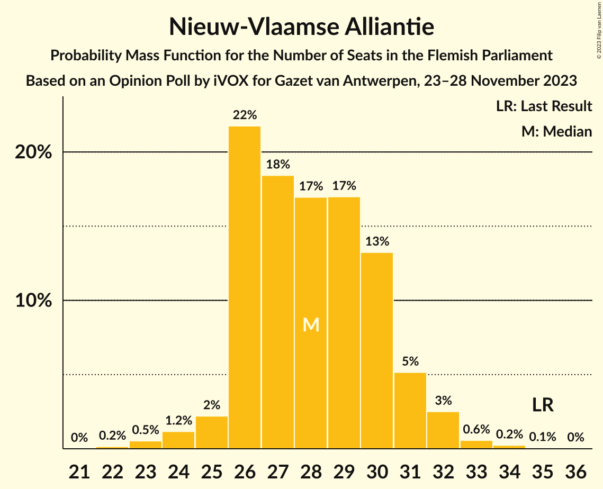
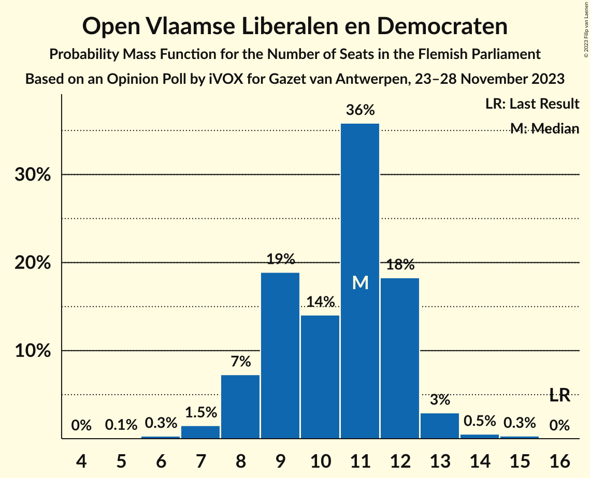
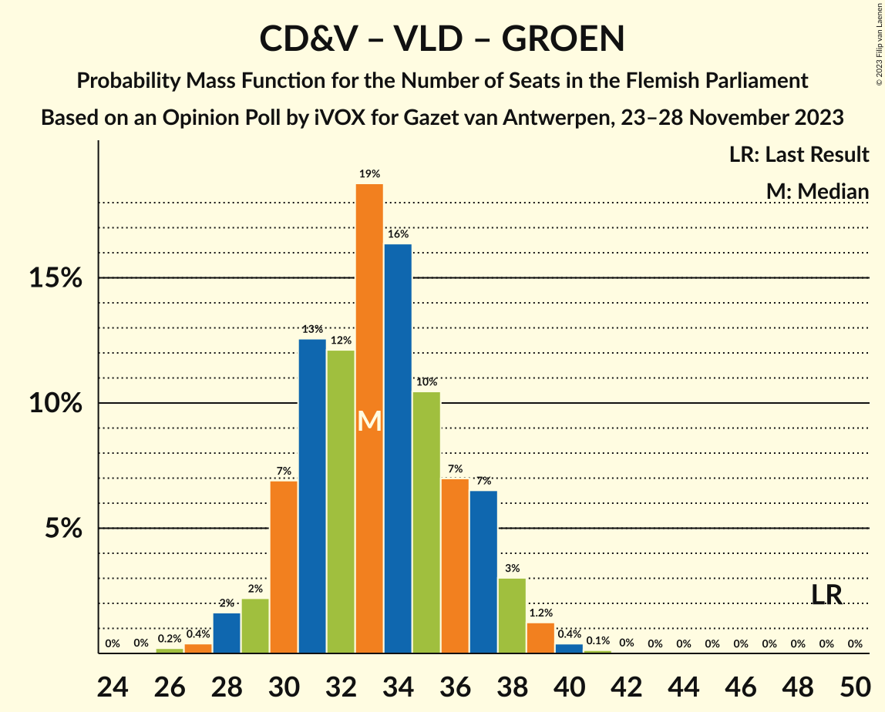

# Opinion Poll by iVOX for Gazet van Antwerpen, 23–28 November 2023

<a href="#voting-intentions">Voting Intentions</a> | <a href="#seats">Seats</a> | <a href="#coalitions">Coalitions</a> | <a href="#technical-information">Technical Information</a>

## Voting Intentions

### Confidence Intervals

| Party | Last Result | Poll Result | 80% Confidence Interval | 90% Confidence Interval | 95% Confidence Interval | 99% Confidence Interval |
|:-----:|:-----------:|:-----------:|:-----------------------:|:-----------------------:|:-----------------------:|:-----------------------:|
| Vlaams Belang | 18.5% | 27.5% | 25.7–29.4% |25.2–29.9% |24.8–30.4% |24.0–31.3% |
| Nieuw-Vlaamse Alliantie | 24.8% | 21.3% | 19.7–23.0% |19.3–23.5% |18.9–24.0% |18.1–24.8% |
| Vooruit | 10.1% | 13.2% | 11.9–14.7% |11.6–15.1% |11.2–15.5% |10.7–16.2% |
| Christen-Democratisch en Vlaams | 15.4% | 12.9% | 11.6–14.4% |11.3–14.8% |11.0–15.1% |10.4–15.9% |
| Open Vlaamse Liberalen en Democraten | 13.1% | 8.7% | 7.7–10.0% |7.3–10.3% |7.1–10.6% |6.6–11.2% |
| Partij van de Arbeid van België | 5.3% | 8.5% | 7.5–9.7% |7.2–10.1% |6.9–10.4% |6.4–11.0% |
| Groen | 10.1% | 6.9% | 6.0–8.0% |5.7–8.4% |5.5–8.7% |5.1–9.2% |

*Note:* The poll result column reflects the actual value used in the calculations. Published results may vary slightly, and in addition be rounded to fewer digits.

## Seats

### Confidence Intervals

| Party | Last Result | Median | 80% Confidence Interval | 90% Confidence Interval | 95% Confidence Interval | 99% Confidence Interval |
|:-----:|:-----------:|:------:|:-----------------------:|:-----------------------:|:-----------------------:|:-----------------------:|
| <a href="#vlaams-belang">Vlaams Belang</a> | 23 | 37 | 34–39 |33–40 |33–41 |31–42 |
| <a href="#nieuw-vlaamse-alliantie">Nieuw-Vlaamse Alliantie</a> | 35 | 28 | 26–30 |26–31 |25–32 |23–33 |
| <a href="#vooruit">Vooruit</a> | 12 | 17 | 15–19 |14–19 |14–20 |13–21 |
| <a href="#christen-democratisch-en-vlaams">Christen-Democratisch en Vlaams</a> | 19 | 15 | 14–17 |13–18 |12–18 |11–19 |
| <a href="#open-vlaamse-liberalen-en-democraten">Open Vlaamse Liberalen en Democraten</a> | 16 | 11 | 9–12 |8–12 |8–13 |7–14 |
| <a href="#partij-van-de-arbeid-van-belgië">Partij van de Arbeid van België</a> | 4 | 9 | 7–12 |7–13 |7–13 |6–13 |
| <a href="#groen">Groen</a> | 14 | 7 | 5–10 |5–11 |5–11 |5–12 |

### Vlaams Belang

*For a full overview of the results for this party, see the [Vlaams Belang](party-vlaamsbelang.html) page.*

| Number of Seats | Probability | Accumulated | Special Marks |
|:---------------:|:-----------:|:-----------:|:-------------:|
| 23 | 0% | 100% | Last Result |
| 24 | 0% | 100% |  |
| 25 | 0% | 100% |  |
| 26 | 0% | 100% |  |
| 27 | 0% | 100% |  |
| 28 | 0% | 100% |  |
| 29 | 0% | 100% |  |
| 30 | 0.2% | 100% |  |
| 31 | 0.5% | 99.8% |  |
| 32 | 1.4% | 99.2% |  |
| 33 | 8% | 98% |  |
| 34 | 9% | 90% |  |
| 35 | 11% | 81% |  |
| 36 | 15% | 70% |  |
| 37 | 30% | 56% | Median |
| 38 | 13% | 26% |  |
| 39 | 6% | 12% |  |
| 40 | 3% | 6% |  |
| 41 | 2% | 3% |  |
| 42 | 1.1% | 1.2% |  |
| 43 | 0.1% | 0.1% |  |
| 44 | 0% | 0% |  |

### Nieuw-Vlaamse Alliantie

*For a full overview of the results for this party, see the [Nieuw-Vlaamse Alliantie](party-nieuw-vlaamsealliantie.html) page.*

| Number of Seats | Probability | Accumulated | Special Marks |
|:---------------:|:-----------:|:-----------:|:-------------:|
| 22 | 0.2% | 100% |  |
| 23 | 0.5% | 99.8% |  |
| 24 | 1.2% | 99.3% |  |
| 25 | 2% | 98% |  |
| 26 | 22% | 96% |  |
| 27 | 18% | 74% |  |
| 28 | 17% | 56% | Median |
| 29 | 17% | 39% |  |
| 30 | 13% | 22% |  |
| 31 | 5% | 9% |  |
| 32 | 3% | 3% |  |
| 33 | 0.6% | 0.9% |  |
| 34 | 0.2% | 0.3% |  |
| 35 | 0.1% | 0.1% | Last Result |
| 36 | 0% | 0% |  |

### Vooruit

*For a full overview of the results for this party, see the [Vooruit](party-vooruit.html) page.*

| Number of Seats | Probability | Accumulated | Special Marks |
|:---------------:|:-----------:|:-----------:|:-------------:|
| 12 | 0.2% | 100% | Last Result |
| 13 | 0.4% | 99.8% |  |
| 14 | 7% | 99.3% |  |
| 15 | 9% | 93% |  |
| 16 | 34% | 84% |  |
| 17 | 15% | 50% | Median |
| 18 | 14% | 35% |  |
| 19 | 16% | 20% |  |
| 20 | 3% | 4% |  |
| 21 | 0.6% | 0.9% |  |
| 22 | 0.2% | 0.3% |  |
| 23 | 0.1% | 0.1% |  |
| 24 | 0% | 0% |  |

### Christen-Democratisch en Vlaams

*For a full overview of the results for this party, see the [Christen-Democratisch en Vlaams](party-christen-democratischenvlaams.html) page.*

| Number of Seats | Probability | Accumulated | Special Marks |
|:---------------:|:-----------:|:-----------:|:-------------:|
| 11 | 1.2% | 100% |  |
| 12 | 2% | 98.8% |  |
| 13 | 4% | 97% |  |
| 14 | 24% | 93% |  |
| 15 | 23% | 69% | Median |
| 16 | 12% | 46% |  |
| 17 | 27% | 34% |  |
| 18 | 4% | 6% |  |
| 19 | 2% | 2% | Last Result |
| 20 | 0.4% | 0.4% |  |
| 21 | 0% | 0% |  |

### Open Vlaamse Liberalen en Democraten

*For a full overview of the results for this party, see the [Open Vlaamse Liberalen en Democraten](party-openvlaamseliberalenendemocraten.html) page.*

| Number of Seats | Probability | Accumulated | Special Marks |
|:---------------:|:-----------:|:-----------:|:-------------:|
| 5 | 0.1% | 100% |  |
| 6 | 0.3% | 99.9% |  |
| 7 | 1.5% | 99.6% |  |
| 8 | 7% | 98% |  |
| 9 | 19% | 91% |  |
| 10 | 14% | 72% |  |
| 11 | 36% | 58% | Median |
| 12 | 18% | 22% |  |
| 13 | 3% | 4% |  |
| 14 | 0.5% | 0.8% |  |
| 15 | 0.3% | 0.3% |  |
| 16 | 0% | 0% | Last Result |

### Partij van de Arbeid van België

*For a full overview of the results for this party, see the [Partij van de Arbeid van België](party-partijvandearbeidvanbelgië.html) page.*

| Number of Seats | Probability | Accumulated | Special Marks |
|:---------------:|:-----------:|:-----------:|:-------------:|
| 4 | 0% | 100% | Last Result |
| 5 | 0.3% | 100% |  |
| 6 | 0.3% | 99.7% |  |
| 7 | 22% | 99.4% |  |
| 8 | 10% | 78% |  |
| 9 | 21% | 68% | Median |
| 10 | 12% | 47% |  |
| 11 | 23% | 35% |  |
| 12 | 6% | 11% |  |
| 13 | 5% | 5% |  |
| 14 | 0.4% | 0.4% |  |
| 15 | 0% | 0% |  |

### Groen

*For a full overview of the results for this party, see the [Groen](party-groen.html) page.*

| Number of Seats | Probability | Accumulated | Special Marks |
|:---------------:|:-----------:|:-----------:|:-------------:|
| 3 | 0.1% | 100% |  |
| 4 | 0.1% | 99.9% |  |
| 5 | 15% | 99.8% |  |
| 6 | 10% | 85% |  |
| 7 | 37% | 75% | Median |
| 8 | 16% | 37% |  |
| 9 | 5% | 21% |  |
| 10 | 10% | 16% |  |
| 11 | 6% | 7% |  |
| 12 | 0.4% | 0.6% |  |
| 13 | 0.1% | 0.2% |  |
| 14 | 0% | 0% | Last Result |

## Coalitions

### Confidence Intervals

| Coalition | Last Result | Median | Majority? | 80% Confidence Interval | 90% Confidence Interval | 95% Confidence Interval | 99% Confidence Interval |
|:---------:|:-----------:|:------:|:---------:|:-----------------------:|:-----------------------:|:-----------------------:|:-----------------------:|
| Vlaams Belang – Nieuw-Vlaamse Alliantie – Christen-Democratisch en Vlaams | 77 | 80 | 100% | 77–83 | 76–83 | 75–84 | 74–86 |
| Nieuw-Vlaamse Alliantie – Vooruit – Christen-Democratisch en Vlaams – Open Vlaamse Liberalen en Democraten | 82 | 71 | 99.9% | 67–74 | 66–75 | 66–75 | 64–76 |
| Vlaams Belang – Nieuw-Vlaamse Alliantie | 58 | 64 | 79% | 61–67 | 61–68 | 60–69 | 58–70 |
| Nieuw-Vlaamse Alliantie – Vooruit – Christen-Democratisch en Vlaams | 66 | 61 | 13% | 57–63 | 57–64 | 56–65 | 54–67 |
| Nieuw-Vlaamse Alliantie – Vooruit – Open Vlaamse Liberalen en Democraten | 63 | 55 | 0.1% | 52–58 | 52–59 | 51–60 | 49–61 |
| Nieuw-Vlaamse Alliantie – Christen-Democratisch en Vlaams – Open Vlaamse Liberalen en Democraten | 70 | 54 | 0% | 51–57 | 50–57 | 49–58 | 47–60 |
| Vooruit – Christen-Democratisch en Vlaams – Open Vlaamse Liberalen en Democraten – Groen | 61 | 50 | 0% | 47–54 | 46–55 | 46–56 | 44–57 |
| Vooruit – Christen-Democratisch en Vlaams – Partij van de Arbeid van België – Groen | 49 | 49 | 0% | 46–52 | 45–53 | 45–54 | 43–56 |
| Nieuw-Vlaamse Alliantie – Christen-Democratisch en Vlaams | 54 | 43 | 0% | 41–46 | 40–47 | 39–48 | 38–49 |
| Vooruit – Christen-Democratisch en Vlaams – Open Vlaamse Liberalen en Democraten | 47 | 43 | 0% | 40–46 | 39–46 | 38–47 | 36–48 |
| Vooruit – Christen-Democratisch en Vlaams – Groen | 45 | 40 | 0% | 37–43 | 36–44 | 35–45 | 34–46 |
| Nieuw-Vlaamse Alliantie – Open Vlaamse Liberalen en Democraten | 51 | 38 | 0% | 36–41 | 35–42 | 34–43 | 33–44 |
| Vooruit – Open Vlaamse Liberalen en Democraten – Groen | 42 | 35 | 0% | 32–38 | 31–39 | 30–40 | 29–41 |
| Christen-Democratisch en Vlaams – Open Vlaamse Liberalen en Democraten – Groen | 49 | 33 | 0% | 30–37 | 30–37 | 29–38 | 27–40 |
| Vooruit – Christen-Democratisch en Vlaams | 31 | 32 | 0% | 30–35 | 29–36 | 28–36 | 27–37 |
| Vooruit – Open Vlaamse Liberalen en Democraten | 28 | 27 | 0% | 25–30 | 24–30 | 23–31 | 22–32 |
| Christen-Democratisch en Vlaams – Open Vlaamse Liberalen en Democraten | 35 | 26 | 0% | 23–28 | 22–29 | 22–30 | 20–31 |

### Vlaams Belang – Nieuw-Vlaamse Alliantie – Christen-Democratisch en Vlaams

| Number of Seats | Probability | Accumulated | Special Marks |
|:---------------:|:-----------:|:-----------:|:-------------:|
| 72 | 0.1% | 100% |  |
| 73 | 0.3% | 99.9% |  |
| 74 | 0.8% | 99.6% |  |
| 75 | 2% | 98.8% |  |
| 76 | 5% | 97% |  |
| 77 | 7% | 92% | Last Result |
| 78 | 10% | 84% |  |
| 79 | 17% | 75% |  |
| 80 | 20% | 58% | Median |
| 81 | 12% | 38% |  |
| 82 | 15% | 26% |  |
| 83 | 6% | 11% |  |
| 84 | 2% | 4% |  |
| 85 | 1.0% | 2% |  |
| 86 | 0.6% | 0.8% |  |
| 87 | 0.2% | 0.2% |  |
| 88 | 0% | 0.1% |  |
| 89 | 0% | 0% |  |

### Nieuw-Vlaamse Alliantie – Vooruit – Christen-Democratisch en Vlaams – Open Vlaamse Liberalen en Democraten

| Number of Seats | Probability | Accumulated | Special Marks |
|:---------------:|:-----------:|:-----------:|:-------------:|
| 62 | 0.1% | 100% |  |
| 63 | 0.2% | 99.9% | Majority |
| 64 | 0.6% | 99.7% |  |
| 65 | 2% | 99.1% |  |
| 66 | 3% | 98% |  |
| 67 | 5% | 95% |  |
| 68 | 6% | 90% |  |
| 69 | 12% | 84% |  |
| 70 | 15% | 72% |  |
| 71 | 20% | 58% | Median |
| 72 | 15% | 38% |  |
| 73 | 11% | 22% |  |
| 74 | 6% | 11% |  |
| 75 | 4% | 5% |  |
| 76 | 1.2% | 2% |  |
| 77 | 0.3% | 0.4% |  |
| 78 | 0.1% | 0.1% |  |
| 79 | 0% | 0.1% |  |
| 80 | 0% | 0% |  |
| 81 | 0% | 0% |  |
| 82 | 0% | 0% | Last Result |

### Vlaams Belang – Nieuw-Vlaamse Alliantie

| Number of Seats | Probability | Accumulated | Special Marks |
|:---------------:|:-----------:|:-----------:|:-------------:|
| 57 | 0.1% | 100% |  |
| 58 | 0.3% | 99.8% | Last Result |
| 59 | 1.5% | 99.5% |  |
| 60 | 3% | 98% |  |
| 61 | 8% | 95% |  |
| 62 | 9% | 88% |  |
| 63 | 15% | 79% | Majority |
| 64 | 15% | 64% |  |
| 65 | 16% | 49% | Median |
| 66 | 14% | 33% |  |
| 67 | 9% | 19% |  |
| 68 | 6% | 10% |  |
| 69 | 3% | 4% |  |
| 70 | 0.8% | 1.2% |  |
| 71 | 0.3% | 0.4% |  |
| 72 | 0.1% | 0.1% |  |
| 73 | 0% | 0% |  |

### Nieuw-Vlaamse Alliantie – Vooruit – Christen-Democratisch en Vlaams

| Number of Seats | Probability | Accumulated | Special Marks |
|:---------------:|:-----------:|:-----------:|:-------------:|
| 52 | 0.1% | 100% |  |
| 53 | 0.2% | 99.9% |  |
| 54 | 0.5% | 99.8% |  |
| 55 | 1.1% | 99.2% |  |
| 56 | 3% | 98% |  |
| 57 | 9% | 96% |  |
| 58 | 14% | 87% |  |
| 59 | 9% | 74% |  |
| 60 | 14% | 64% | Median |
| 61 | 19% | 51% |  |
| 62 | 18% | 31% |  |
| 63 | 6% | 13% | Majority |
| 64 | 4% | 8% |  |
| 65 | 2% | 4% |  |
| 66 | 1.1% | 2% | Last Result |
| 67 | 0.6% | 0.7% |  |
| 68 | 0.1% | 0.1% |  |
| 69 | 0% | 0% |  |

### Nieuw-Vlaamse Alliantie – Vooruit – Open Vlaamse Liberalen en Democraten

| Number of Seats | Probability | Accumulated | Special Marks |
|:---------------:|:-----------:|:-----------:|:-------------:|
| 47 | 0.2% | 100% |  |
| 48 | 0.3% | 99.8% |  |
| 49 | 0.8% | 99.6% |  |
| 50 | 1.2% | 98.8% |  |
| 51 | 2% | 98% |  |
| 52 | 6% | 95% |  |
| 53 | 11% | 89% |  |
| 54 | 14% | 78% |  |
| 55 | 16% | 63% |  |
| 56 | 18% | 48% | Median |
| 57 | 14% | 30% |  |
| 58 | 8% | 16% |  |
| 59 | 4% | 8% |  |
| 60 | 2% | 4% |  |
| 61 | 1.0% | 1.5% |  |
| 62 | 0.4% | 0.5% |  |
| 63 | 0.1% | 0.1% | Last Result, Majority |
| 64 | 0% | 0% |  |

### Nieuw-Vlaamse Alliantie – Christen-Democratisch en Vlaams – Open Vlaamse Liberalen en Democraten

| Number of Seats | Probability | Accumulated | Special Marks |
|:---------------:|:-----------:|:-----------:|:-------------:|
| 46 | 0.1% | 100% |  |
| 47 | 0.4% | 99.8% |  |
| 48 | 0.8% | 99.4% |  |
| 49 | 3% | 98.6% |  |
| 50 | 5% | 96% |  |
| 51 | 7% | 91% |  |
| 52 | 11% | 84% |  |
| 53 | 16% | 73% |  |
| 54 | 15% | 57% | Median |
| 55 | 16% | 42% |  |
| 56 | 14% | 26% |  |
| 57 | 7% | 12% |  |
| 58 | 3% | 5% |  |
| 59 | 1.5% | 2% |  |
| 60 | 0.6% | 0.8% |  |
| 61 | 0.1% | 0.2% |  |
| 62 | 0% | 0.1% |  |
| 63 | 0% | 0% | Majority |
| 64 | 0% | 0% |  |
| 65 | 0% | 0% |  |
| 66 | 0% | 0% |  |
| 67 | 0% | 0% |  |
| 68 | 0% | 0% |  |
| 69 | 0% | 0% |  |
| 70 | 0% | 0% | Last Result |

### Vooruit – Christen-Democratisch en Vlaams – Open Vlaamse Liberalen en Democraten – Groen

| Number of Seats | Probability | Accumulated | Special Marks |
|:---------------:|:-----------:|:-----------:|:-------------:|
| 42 | 0.1% | 100% |  |
| 43 | 0.2% | 99.9% |  |
| 44 | 0.6% | 99.7% |  |
| 45 | 1.5% | 99.0% |  |
| 46 | 4% | 98% |  |
| 47 | 8% | 93% |  |
| 48 | 11% | 85% |  |
| 49 | 16% | 74% |  |
| 50 | 15% | 59% | Median |
| 51 | 15% | 43% |  |
| 52 | 10% | 28% |  |
| 53 | 8% | 18% |  |
| 54 | 5% | 11% |  |
| 55 | 3% | 6% |  |
| 56 | 2% | 3% |  |
| 57 | 0.4% | 0.6% |  |
| 58 | 0.1% | 0.1% |  |
| 59 | 0% | 0% |  |
| 60 | 0% | 0% |  |
| 61 | 0% | 0% | Last Result |

### Vooruit – Christen-Democratisch en Vlaams – Partij van de Arbeid van België – Groen

| Number of Seats | Probability | Accumulated | Special Marks |
|:---------------:|:-----------:|:-----------:|:-------------:|
| 41 | 0% | 100% |  |
| 42 | 0.1% | 99.9% |  |
| 43 | 0.5% | 99.8% |  |
| 44 | 2% | 99.3% |  |
| 45 | 5% | 98% |  |
| 46 | 8% | 93% |  |
| 47 | 11% | 85% |  |
| 48 | 13% | 73% | Median |
| 49 | 18% | 60% | Last Result |
| 50 | 12% | 43% |  |
| 51 | 12% | 31% |  |
| 52 | 10% | 19% |  |
| 53 | 5% | 9% |  |
| 54 | 2% | 4% |  |
| 55 | 1.0% | 2% |  |
| 56 | 0.4% | 0.6% |  |
| 57 | 0.1% | 0.2% |  |
| 58 | 0.1% | 0.1% |  |
| 59 | 0% | 0% |  |

### Nieuw-Vlaamse Alliantie – Christen-Democratisch en Vlaams

| Number of Seats | Probability | Accumulated | Special Marks |
|:---------------:|:-----------:|:-----------:|:-------------:|
| 37 | 0.2% | 100% |  |
| 38 | 1.0% | 99.8% |  |
| 39 | 3% | 98.8% |  |
| 40 | 6% | 96% |  |
| 41 | 10% | 91% |  |
| 42 | 14% | 81% |  |
| 43 | 18% | 67% | Median |
| 44 | 17% | 49% |  |
| 45 | 16% | 32% |  |
| 46 | 8% | 16% |  |
| 47 | 5% | 8% |  |
| 48 | 2% | 3% |  |
| 49 | 0.5% | 0.9% |  |
| 50 | 0.3% | 0.4% |  |
| 51 | 0.1% | 0.1% |  |
| 52 | 0% | 0% |  |
| 53 | 0% | 0% |  |
| 54 | 0% | 0% | Last Result |

### Vooruit – Christen-Democratisch en Vlaams – Open Vlaamse Liberalen en Democraten

| Number of Seats | Probability | Accumulated | Special Marks |
|:---------------:|:-----------:|:-----------:|:-------------:|
| 34 | 0% | 100% |  |
| 35 | 0.2% | 99.9% |  |
| 36 | 0.3% | 99.7% |  |
| 37 | 1.1% | 99.4% |  |
| 38 | 2% | 98% |  |
| 39 | 4% | 96% |  |
| 40 | 7% | 92% |  |
| 41 | 13% | 85% |  |
| 42 | 17% | 72% |  |
| 43 | 18% | 55% | Median |
| 44 | 14% | 37% |  |
| 45 | 11% | 23% |  |
| 46 | 7% | 12% |  |
| 47 | 3% | 5% | Last Result |
| 48 | 0.9% | 1.4% |  |
| 49 | 0.4% | 0.5% |  |
| 50 | 0.1% | 0.1% |  |
| 51 | 0% | 0% |  |

### Vooruit – Christen-Democratisch en Vlaams – Groen

| Number of Seats | Probability | Accumulated | Special Marks |
|:---------------:|:-----------:|:-----------:|:-------------:|
| 32 | 0.1% | 100% |  |
| 33 | 0.3% | 99.9% |  |
| 34 | 0.8% | 99.6% |  |
| 35 | 3% | 98.9% |  |
| 36 | 5% | 95% |  |
| 37 | 11% | 90% |  |
| 38 | 13% | 79% |  |
| 39 | 13% | 67% | Median |
| 40 | 17% | 54% |  |
| 41 | 14% | 37% |  |
| 42 | 9% | 23% |  |
| 43 | 6% | 15% |  |
| 44 | 5% | 9% |  |
| 45 | 3% | 4% | Last Result |
| 46 | 0.7% | 1.0% |  |
| 47 | 0.2% | 0.2% |  |
| 48 | 0.1% | 0.1% |  |
| 49 | 0% | 0% |  |

### Nieuw-Vlaamse Alliantie – Open Vlaamse Liberalen en Democraten

| Number of Seats | Probability | Accumulated | Special Marks |
|:---------------:|:-----------:|:-----------:|:-------------:|
| 31 | 0.1% | 100% |  |
| 32 | 0.2% | 99.9% |  |
| 33 | 1.0% | 99.7% |  |
| 34 | 2% | 98.7% |  |
| 35 | 6% | 97% |  |
| 36 | 9% | 91% |  |
| 37 | 16% | 81% |  |
| 38 | 16% | 65% |  |
| 39 | 16% | 49% | Median |
| 40 | 16% | 32% |  |
| 41 | 8% | 16% |  |
| 42 | 4% | 8% |  |
| 43 | 2% | 4% |  |
| 44 | 1.2% | 1.5% |  |
| 45 | 0.2% | 0.3% |  |
| 46 | 0% | 0.1% |  |
| 47 | 0% | 0% |  |
| 48 | 0% | 0% |  |
| 49 | 0% | 0% |  |
| 50 | 0% | 0% |  |
| 51 | 0% | 0% | Last Result |

### Vooruit – Open Vlaamse Liberalen en Democraten – Groen

| Number of Seats | Probability | Accumulated | Special Marks |
|:---------------:|:-----------:|:-----------:|:-------------:|
| 27 | 0.1% | 100% |  |
| 28 | 0.3% | 99.9% |  |
| 29 | 0.4% | 99.6% |  |
| 30 | 2% | 99.2% |  |
| 31 | 4% | 97% |  |
| 32 | 9% | 93% |  |
| 33 | 14% | 84% |  |
| 34 | 18% | 70% |  |
| 35 | 19% | 52% | Median |
| 36 | 12% | 33% |  |
| 37 | 9% | 21% |  |
| 38 | 5% | 12% |  |
| 39 | 4% | 7% |  |
| 40 | 2% | 3% |  |
| 41 | 0.8% | 1.2% |  |
| 42 | 0.3% | 0.3% | Last Result |
| 43 | 0% | 0.1% |  |
| 44 | 0% | 0% |  |

### Christen-Democratisch en Vlaams – Open Vlaamse Liberalen en Democraten – Groen

| Number of Seats | Probability | Accumulated | Special Marks |
|:---------------:|:-----------:|:-----------:|:-------------:|
| 25 | 0% | 100% |  |
| 26 | 0.2% | 99.9% |  |
| 27 | 0.4% | 99.7% |  |
| 28 | 2% | 99.3% |  |
| 29 | 2% | 98% |  |
| 30 | 7% | 96% |  |
| 31 | 13% | 89% |  |
| 32 | 12% | 76% |  |
| 33 | 19% | 64% | Median |
| 34 | 16% | 45% |  |
| 35 | 10% | 29% |  |
| 36 | 7% | 18% |  |
| 37 | 7% | 11% |  |
| 38 | 3% | 5% |  |
| 39 | 1.2% | 2% |  |
| 40 | 0.4% | 0.6% |  |
| 41 | 0.1% | 0.2% |  |
| 42 | 0% | 0.1% |  |
| 43 | 0% | 0% |  |
| 44 | 0% | 0% |  |
| 45 | 0% | 0% |  |
| 46 | 0% | 0% |  |
| 47 | 0% | 0% |  |
| 48 | 0% | 0% |  |
| 49 | 0% | 0% | Last Result |

### Vooruit – Christen-Democratisch en Vlaams

| Number of Seats | Probability | Accumulated | Special Marks |
|:---------------:|:-----------:|:-----------:|:-------------:|
| 25 | 0.1% | 100% |  |
| 26 | 0.2% | 99.9% |  |
| 27 | 0.6% | 99.7% |  |
| 28 | 2% | 99.1% |  |
| 29 | 5% | 97% |  |
| 30 | 16% | 93% |  |
| 31 | 15% | 77% | Last Result |
| 32 | 16% | 62% | Median |
| 33 | 16% | 46% |  |
| 34 | 14% | 30% |  |
| 35 | 8% | 16% |  |
| 36 | 6% | 8% |  |
| 37 | 2% | 2% |  |
| 38 | 0.3% | 0.4% |  |
| 39 | 0.1% | 0.1% |  |
| 40 | 0% | 0% |  |

### Vooruit – Open Vlaamse Liberalen en Democraten

| Number of Seats | Probability | Accumulated | Special Marks |
|:---------------:|:-----------:|:-----------:|:-------------:|
| 20 | 0.1% | 100% |  |
| 21 | 0.3% | 99.9% |  |
| 22 | 0.9% | 99.6% |  |
| 23 | 2% | 98.6% |  |
| 24 | 3% | 96% |  |
| 25 | 9% | 93% |  |
| 26 | 12% | 84% |  |
| 27 | 27% | 71% |  |
| 28 | 21% | 44% | Last Result, Median |
| 29 | 10% | 24% |  |
| 30 | 9% | 14% |  |
| 31 | 4% | 5% |  |
| 32 | 1.1% | 1.4% |  |
| 33 | 0.2% | 0.3% |  |
| 34 | 0.1% | 0.1% |  |
| 35 | 0% | 0% |  |

### Christen-Democratisch en Vlaams – Open Vlaamse Liberalen en Democraten

| Number of Seats | Probability | Accumulated | Special Marks |
|:---------------:|:-----------:|:-----------:|:-------------:|
| 19 | 0.1% | 100% |  |
| 20 | 0.5% | 99.9% |  |
| 21 | 1.4% | 99.4% |  |
| 22 | 3% | 98% |  |
| 23 | 9% | 95% |  |
| 24 | 10% | 86% |  |
| 25 | 13% | 76% |  |
| 26 | 21% | 63% | Median |
| 27 | 22% | 42% |  |
| 28 | 12% | 20% |  |
| 29 | 5% | 8% |  |
| 30 | 2% | 3% |  |
| 31 | 0.7% | 0.9% |  |
| 32 | 0.1% | 0.1% |  |
| 33 | 0% | 0% |  |
| 34 | 0% | 0% |  |
| 35 | 0% | 0% | Last Result |

## Technical Information

### Opinion Poll

+ **Polling firm:** iVOX
+ **Commissioner(s):** Gazet van Antwerpen
+ **Fieldwork period:** 23–28 November 2023

### Calculations

+ **Sample size:** 1000
+ **Simulations done:** 1,048,576
+ **Error estimate:** 1.13%

