# Opinion Poll by Ipsos for Het Laatste Nieuws, Le Soir, RTL TVi and VTM, 4–11 December 2023

<a href="#voting-intentions">Voting Intentions</a> | <a href="#seats">Seats</a> | <a href="#coalitions">Coalitions</a> | <a href="#technical-information">Technical Information</a>

## Voting Intentions

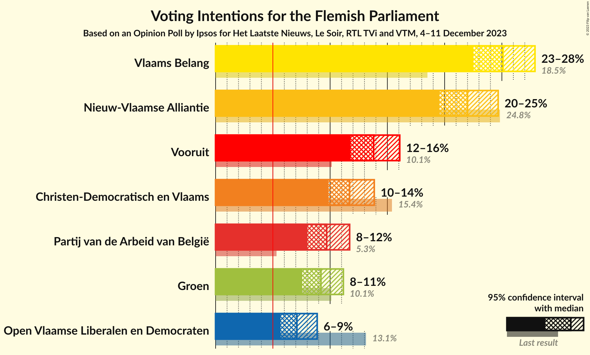

### Confidence Intervals

| Party | Last Result | Poll Result | 80% Confidence Interval | 90% Confidence Interval | 95% Confidence Interval | 99% Confidence Interval |
|:-----:|:-----------:|:-----------:|:-----------------------:|:-----------------------:|:-----------------------:|:-----------------------:|
| Vlaams Belang | 18.5% | 25.1% | 23.4–26.9% |22.9–27.4% |22.5–27.9% |21.7–28.8% |
| Nieuw-Vlaamse Alliantie | 24.8% | 22.0% | 20.4–23.7% |19.9–24.2% |19.5–24.7% |18.8–25.5% |
| Vooruit | 10.1% | 13.8% | 12.5–15.3% |12.1–15.7% |11.8–16.1% |11.2–16.8% |
| Christen-Democratisch en Vlaams | 15.4% | 11.7% | 10.5–13.1% |10.1–13.5% |9.8–13.9% |9.3–14.5% |
| Partij van de Arbeid van België | 5.3% | 9.7% | 8.6–11.0% |8.3–11.4% |8.0–11.7% |7.5–12.3% |
| Groen | 10.1% | 9.2% | 8.1–10.5% |7.8–10.8% |7.6–11.2% |7.1–11.8% |
| Open Vlaamse Liberalen en Democraten | 13.1% | 7.1% | 6.2–8.3% |5.9–8.6% |5.7–8.9% |5.2–9.4% |

*Note:* The poll result column reflects the actual value used in the calculations. Published results may vary slightly, and in addition be rounded to fewer digits.

## Seats

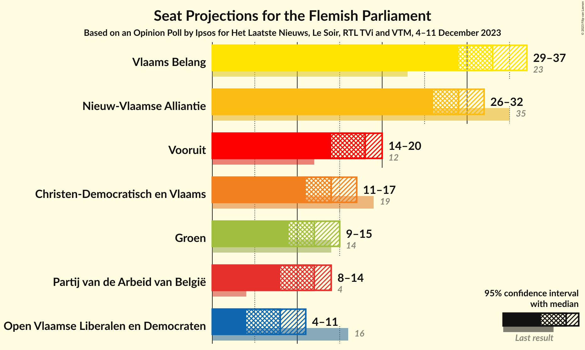

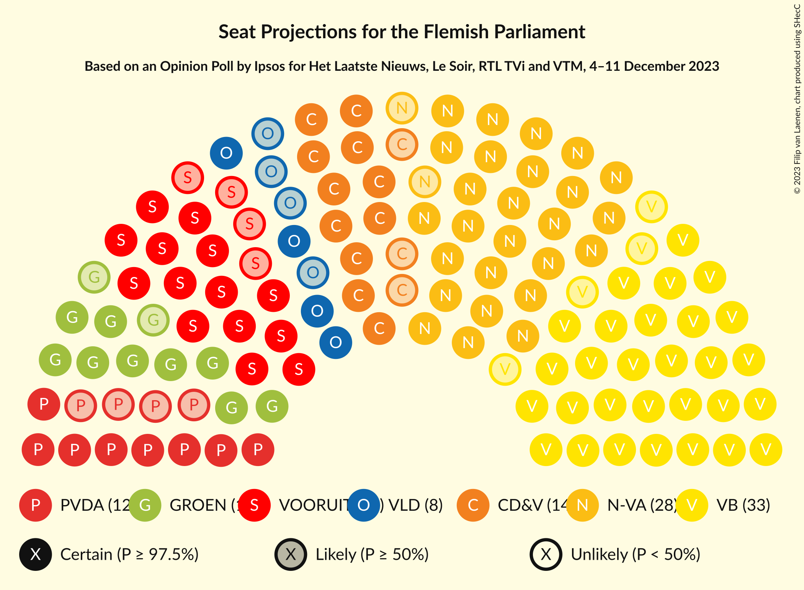

### Confidence Intervals

| Party | Last Result | Median | 80% Confidence Interval | 90% Confidence Interval | 95% Confidence Interval | 99% Confidence Interval |
|:-----:|:-----------:|:------:|:-----------------------:|:-----------------------:|:-----------------------:|:-----------------------:|
| <a href="#vlaams-belang">Vlaams Belang</a> | 23 | 33 | 30–36 |30–37 |29–37 |28–38 |
| <a href="#nieuw-vlaamse-alliantie">Nieuw-Vlaamse Alliantie</a> | 35 | 29 | 27–31 |26–32 |26–32 |24–35 |
| <a href="#vooruit">Vooruit</a> | 12 | 18 | 15–19 |15–19 |14–20 |14–23 |
| <a href="#christen-democratisch-en-vlaams">Christen-Democratisch en Vlaams</a> | 19 | 14 | 12–15 |11–17 |11–17 |11–18 |
| <a href="#partij-van-de-arbeid-van-belgië">Partij van de Arbeid van België</a> | 4 | 12 | 9–14 |9–14 |8–14 |7–15 |
| <a href="#groen">Groen</a> | 14 | 12 | 10–14 |10–14 |9–15 |8–16 |
| <a href="#open-vlaamse-liberalen-en-democraten">Open Vlaamse Liberalen en Democraten</a> | 16 | 8 | 5–9 |4–10 |4–11 |2–11 |

### Vlaams Belang

*For a full overview of the results for this party, see the [Vlaams Belang](party-vlaamsbelang.html) page.*

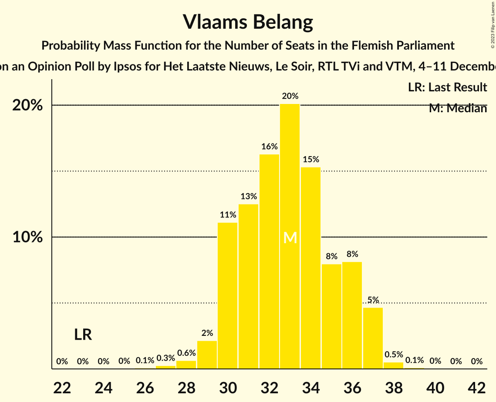

| Number of Seats | Probability | Accumulated | Special Marks |
|:---------------:|:-----------:|:-----------:|:-------------:|
| 23 | 0% | 100% | Last Result |
| 24 | 0% | 100% |  |
| 25 | 0% | 100% |  |
| 26 | 0.1% | 100% |  |
| 27 | 0.3% | 99.9% |  |
| 28 | 0.6% | 99.6% |  |
| 29 | 2% | 99.0% |  |
| 30 | 11% | 97% |  |
| 31 | 13% | 86% |  |
| 32 | 16% | 73% |  |
| 33 | 20% | 57% | Median |
| 34 | 15% | 37% |  |
| 35 | 8% | 21% |  |
| 36 | 8% | 13% |  |
| 37 | 5% | 5% |  |
| 38 | 0.5% | 0.7% |  |
| 39 | 0.1% | 0.2% |  |
| 40 | 0% | 0.1% |  |
| 41 | 0% | 0% |  |

### Nieuw-Vlaamse Alliantie

*For a full overview of the results for this party, see the [Nieuw-Vlaamse Alliantie](party-nieuw-vlaamsealliantie.html) page.*

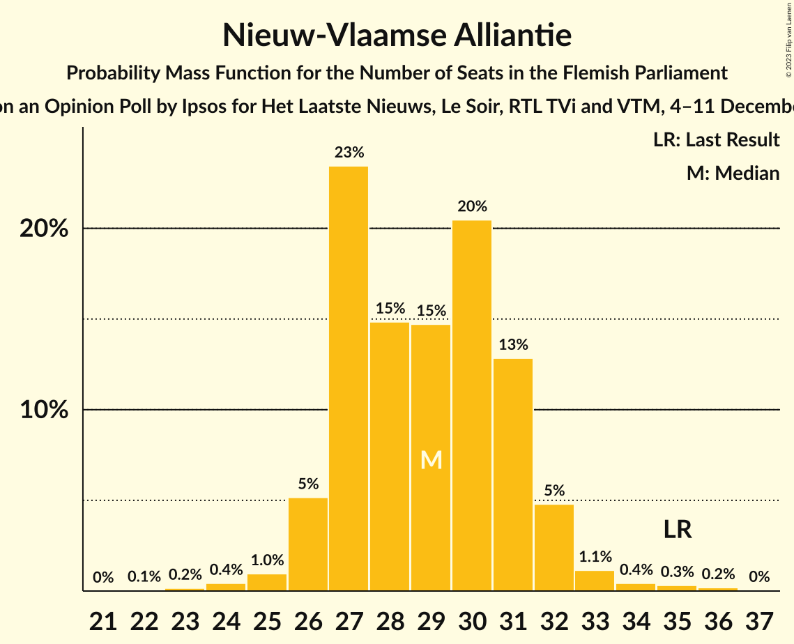

| Number of Seats | Probability | Accumulated | Special Marks |
|:---------------:|:-----------:|:-----------:|:-------------:|
| 22 | 0.1% | 100% |  |
| 23 | 0.2% | 99.9% |  |
| 24 | 0.4% | 99.8% |  |
| 25 | 1.0% | 99.4% |  |
| 26 | 5% | 98% |  |
| 27 | 23% | 93% |  |
| 28 | 15% | 70% |  |
| 29 | 15% | 55% | Median |
| 30 | 20% | 40% |  |
| 31 | 13% | 20% |  |
| 32 | 5% | 7% |  |
| 33 | 1.1% | 2% |  |
| 34 | 0.4% | 1.0% |  |
| 35 | 0.3% | 0.5% | Last Result |
| 36 | 0.2% | 0.2% |  |
| 37 | 0% | 0% |  |

### Vooruit

*For a full overview of the results for this party, see the [Vooruit](party-vooruit.html) page.*

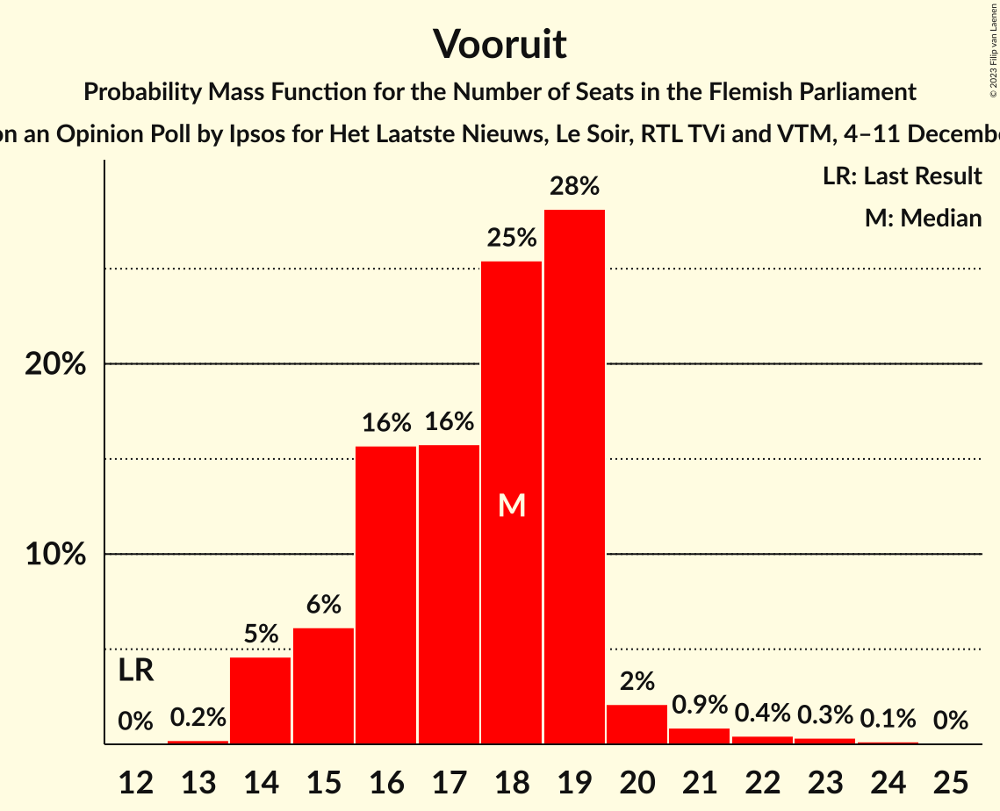

| Number of Seats | Probability | Accumulated | Special Marks |
|:---------------:|:-----------:|:-----------:|:-------------:|
| 12 | 0% | 100% | Last Result |
| 13 | 0.2% | 100% |  |
| 14 | 5% | 99.8% |  |
| 15 | 6% | 95% |  |
| 16 | 16% | 89% |  |
| 17 | 16% | 73% |  |
| 18 | 25% | 58% | Median |
| 19 | 28% | 32% |  |
| 20 | 2% | 4% |  |
| 21 | 0.9% | 2% |  |
| 22 | 0.4% | 1.0% |  |
| 23 | 0.3% | 0.5% |  |
| 24 | 0.1% | 0.2% |  |
| 25 | 0% | 0% |  |

### Christen-Democratisch en Vlaams

*For a full overview of the results for this party, see the [Christen-Democratisch en Vlaams](party-christen-democratischenvlaams.html) page.*

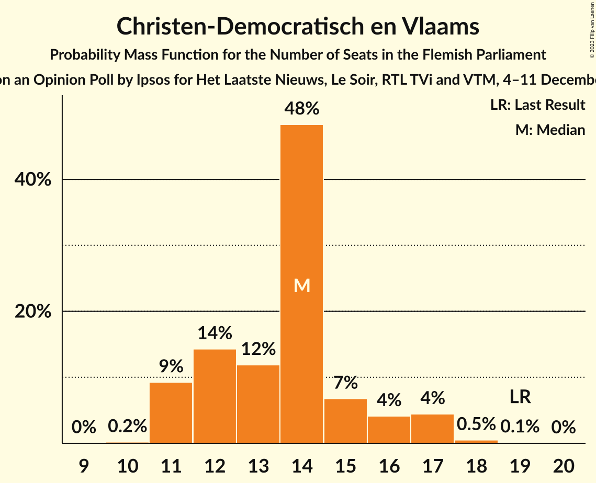

| Number of Seats | Probability | Accumulated | Special Marks |
|:---------------:|:-----------:|:-----------:|:-------------:|
| 10 | 0.2% | 100% |  |
| 11 | 9% | 99.8% |  |
| 12 | 14% | 91% |  |
| 13 | 12% | 76% |  |
| 14 | 48% | 64% | Median |
| 15 | 7% | 16% |  |
| 16 | 4% | 9% |  |
| 17 | 4% | 5% |  |
| 18 | 0.5% | 0.7% |  |
| 19 | 0.1% | 0.2% | Last Result |
| 20 | 0% | 0% |  |

### Partij van de Arbeid van België

*For a full overview of the results for this party, see the [Partij van de Arbeid van België](party-partijvandearbeidvanbelgië.html) page.*

| Number of Seats | Probability | Accumulated | Special Marks |
|:---------------:|:-----------:|:-----------:|:-------------:|
| 4 | 0% | 100% | Last Result |
| 5 | 0% | 100% |  |
| 6 | 0% | 100% |  |
| 7 | 1.3% | 100% |  |
| 8 | 3% | 98.7% |  |
| 9 | 6% | 96% |  |
| 10 | 5% | 90% |  |
| 11 | 24% | 85% |  |
| 12 | 25% | 61% | Median |
| 13 | 25% | 36% |  |
| 14 | 11% | 12% |  |
| 15 | 0.5% | 0.7% |  |
| 16 | 0.2% | 0.3% |  |
| 17 | 0.1% | 0.1% |  |
| 18 | 0% | 0% |  |

### Groen

*For a full overview of the results for this party, see the [Groen](party-groen.html) page.*

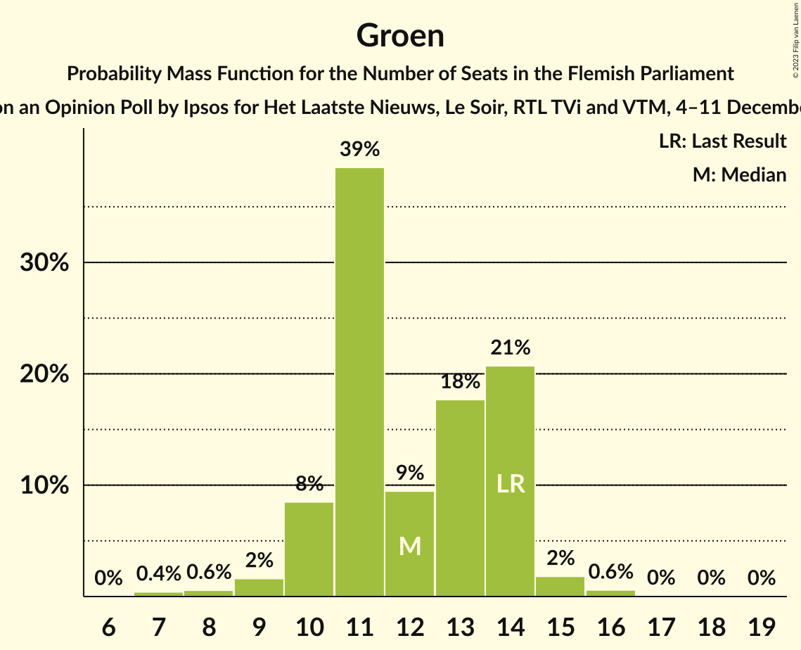

| Number of Seats | Probability | Accumulated | Special Marks |
|:---------------:|:-----------:|:-----------:|:-------------:|
| 7 | 0.4% | 100% |  |
| 8 | 0.6% | 99.6% |  |
| 9 | 2% | 99.0% |  |
| 10 | 8% | 97% |  |
| 11 | 39% | 89% |  |
| 12 | 9% | 50% | Median |
| 13 | 18% | 41% |  |
| 14 | 21% | 23% | Last Result |
| 15 | 2% | 3% |  |
| 16 | 0.6% | 0.7% |  |
| 17 | 0% | 0.1% |  |
| 18 | 0% | 0.1% |  |
| 19 | 0% | 0% |  |

### Open Vlaamse Liberalen en Democraten

*For a full overview of the results for this party, see the [Open Vlaamse Liberalen en Democraten](party-openvlaamseliberalenendemocraten.html) page.*

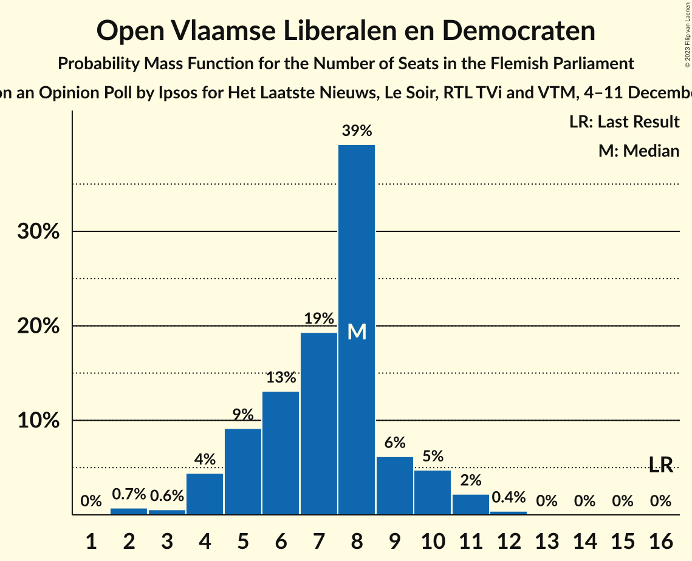

| Number of Seats | Probability | Accumulated | Special Marks |
|:---------------:|:-----------:|:-----------:|:-------------:|
| 2 | 0.7% | 100% |  |
| 3 | 0.6% | 99.3% |  |
| 4 | 4% | 98.7% |  |
| 5 | 9% | 94% |  |
| 6 | 13% | 85% |  |
| 7 | 19% | 72% |  |
| 8 | 39% | 53% | Median |
| 9 | 6% | 14% |  |
| 10 | 5% | 7% |  |
| 11 | 2% | 3% |  |
| 12 | 0.4% | 0.4% |  |
| 13 | 0% | 0% |  |
| 14 | 0% | 0% |  |
| 15 | 0% | 0% |  |
| 16 | 0% | 0% | Last Result |

## Coalitions

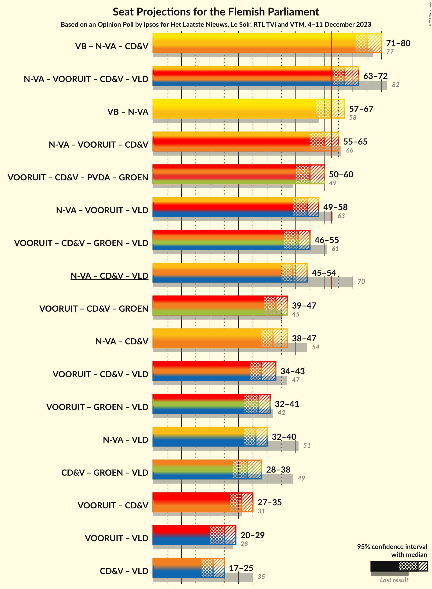

### Confidence Intervals

| Coalition | Last Result | Median | Majority? | 80% Confidence Interval | 90% Confidence Interval | 95% Confidence Interval | 99% Confidence Interval |
|:---------:|:-----------:|:------:|:---------:|:-----------------------:|:-----------------------:|:-----------------------:|:-----------------------:|
| Vlaams Belang – Nieuw-Vlaamse Alliantie – Christen-Democratisch en Vlaams | 77 | 75 | 100% | 72–79 | 71–80 | 71–80 | 69–82 |
| Nieuw-Vlaamse Alliantie – Vooruit – Christen-Democratisch en Vlaams – Open Vlaamse Liberalen en Democraten | 82 | 67 | 98% | 64–70 | 63–71 | 63–72 | 61–74 |
| Vlaams Belang – Nieuw-Vlaamse Alliantie | 58 | 62 | 36% | 59–65 | 58–66 | 57–67 | 56–68 |
| Nieuw-Vlaamse Alliantie – Vooruit – Christen-Democratisch en Vlaams | 66 | 60 | 16% | 57–63 | 56–64 | 55–65 | 54–66 |
| Vooruit – Christen-Democratisch en Vlaams – Partij van de Arbeid van België – Groen | 49 | 55 | 0.1% | 52–58 | 51–59 | 50–60 | 48–61 |
| Nieuw-Vlaamse Alliantie – Vooruit – Open Vlaamse Liberalen en Democraten | 63 | 54 | 0% | 51–57 | 50–58 | 49–58 | 47–60 |
| Vooruit – Christen-Democratisch en Vlaams – Groen – Open Vlaamse Liberalen en Democraten | 61 | 51 | 0% | 47–54 | 46–54 | 46–55 | 44–57 |
| Nieuw-Vlaamse Alliantie – Christen-Democratisch en Vlaams – Open Vlaamse Liberalen en Democraten | 70 | 49 | 0% | 47–53 | 46–54 | 45–54 | 44–57 |
| Vooruit – Christen-Democratisch en Vlaams – Groen | 45 | 43 | 0% | 40–46 | 40–47 | 39–47 | 37–49 |
| Nieuw-Vlaamse Alliantie – Christen-Democratisch en Vlaams | 54 | 42 | 0% | 40–45 | 39–46 | 38–47 | 37–49 |
| Vooruit – Christen-Democratisch en Vlaams – Open Vlaamse Liberalen en Democraten | 47 | 38 | 0% | 35–41 | 35–42 | 34–43 | 32–45 |
| Vooruit – Groen – Open Vlaamse Liberalen en Democraten | 42 | 37 | 0% | 34–40 | 33–40 | 32–41 | 31–43 |
| Nieuw-Vlaamse Alliantie – Open Vlaamse Liberalen en Democraten | 51 | 36 | 0% | 34–39 | 33–40 | 32–40 | 30–42 |
| Christen-Democratisch en Vlaams – Groen – Open Vlaamse Liberalen en Democraten | 49 | 33 | 0% | 30–36 | 29–37 | 28–38 | 27–39 |
| Vooruit – Christen-Democratisch en Vlaams | 31 | 31 | 0% | 29–33 | 28–34 | 27–35 | 26–37 |
| Vooruit – Open Vlaamse Liberalen en Democraten | 28 | 25 | 0% | 22–27 | 21–28 | 20–29 | 19–30 |
| Christen-Democratisch en Vlaams – Open Vlaamse Liberalen en Democraten | 35 | 21 | 0% | 18–24 | 17–24 | 17–25 | 15–26 |

### Vlaams Belang – Nieuw-Vlaamse Alliantie – Christen-Democratisch en Vlaams

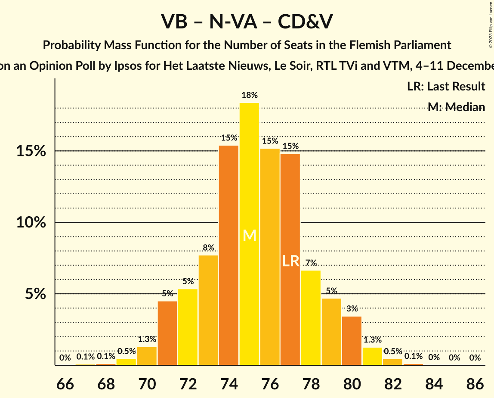

| Number of Seats | Probability | Accumulated | Special Marks |
|:---------------:|:-----------:|:-----------:|:-------------:|
| 67 | 0.1% | 100% |  |
| 68 | 0.1% | 99.9% |  |
| 69 | 0.5% | 99.8% |  |
| 70 | 1.3% | 99.3% |  |
| 71 | 5% | 98% |  |
| 72 | 5% | 94% |  |
| 73 | 8% | 88% |  |
| 74 | 15% | 80% |  |
| 75 | 18% | 65% |  |
| 76 | 15% | 47% | Median |
| 77 | 15% | 31% | Last Result |
| 78 | 7% | 17% |  |
| 79 | 5% | 10% |  |
| 80 | 3% | 5% |  |
| 81 | 1.3% | 2% |  |
| 82 | 0.5% | 0.6% |  |
| 83 | 0.1% | 0.2% |  |
| 84 | 0% | 0.1% |  |
| 85 | 0% | 0% |  |

### Nieuw-Vlaamse Alliantie – Vooruit – Christen-Democratisch en Vlaams – Open Vlaamse Liberalen en Democraten

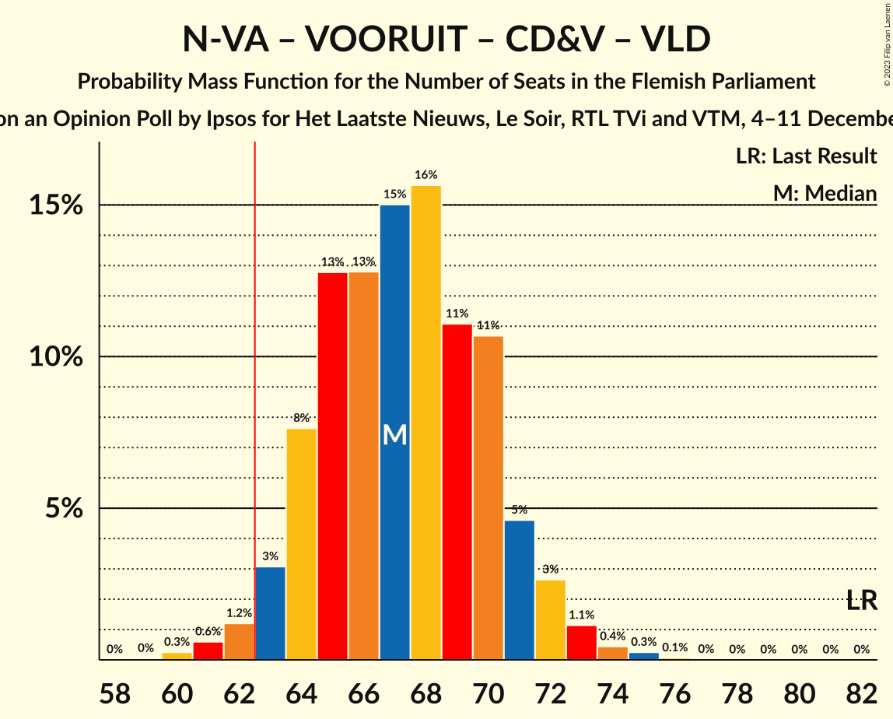

| Number of Seats | Probability | Accumulated | Special Marks |
|:---------------:|:-----------:|:-----------:|:-------------:|
| 59 | 0% | 100% |  |
| 60 | 0.3% | 99.9% |  |
| 61 | 0.6% | 99.7% |  |
| 62 | 1.2% | 99.1% |  |
| 63 | 3% | 98% | Majority |
| 64 | 8% | 95% |  |
| 65 | 13% | 87% |  |
| 66 | 13% | 74% |  |
| 67 | 15% | 62% |  |
| 68 | 16% | 47% |  |
| 69 | 11% | 31% | Median |
| 70 | 11% | 20% |  |
| 71 | 5% | 9% |  |
| 72 | 3% | 5% |  |
| 73 | 1.1% | 2% |  |
| 74 | 0.4% | 0.8% |  |
| 75 | 0.3% | 0.3% |  |
| 76 | 0.1% | 0.1% |  |
| 77 | 0% | 0% |  |
| 78 | 0% | 0% |  |
| 79 | 0% | 0% |  |
| 80 | 0% | 0% |  |
| 81 | 0% | 0% |  |
| 82 | 0% | 0% | Last Result |

### Vlaams Belang – Nieuw-Vlaamse Alliantie

| Number of Seats | Probability | Accumulated | Special Marks |
|:---------------:|:-----------:|:-----------:|:-------------:|
| 54 | 0.1% | 100% |  |
| 55 | 0.3% | 99.9% |  |
| 56 | 1.1% | 99.6% |  |
| 57 | 3% | 98% |  |
| 58 | 4% | 95% | Last Result |
| 59 | 7% | 92% |  |
| 60 | 14% | 85% |  |
| 61 | 17% | 71% |  |
| 62 | 18% | 54% | Median |
| 63 | 15% | 36% | Majority |
| 64 | 9% | 21% |  |
| 65 | 5% | 12% |  |
| 66 | 4% | 7% |  |
| 67 | 2% | 3% |  |
| 68 | 0.6% | 0.9% |  |
| 69 | 0.2% | 0.3% |  |
| 70 | 0.1% | 0.1% |  |
| 71 | 0% | 0% |  |

### Nieuw-Vlaamse Alliantie – Vooruit – Christen-Democratisch en Vlaams

| Number of Seats | Probability | Accumulated | Special Marks |
|:---------------:|:-----------:|:-----------:|:-------------:|
| 52 | 0.1% | 100% |  |
| 53 | 0.2% | 99.9% |  |
| 54 | 0.7% | 99.7% |  |
| 55 | 2% | 99.1% |  |
| 56 | 4% | 97% |  |
| 57 | 11% | 94% |  |
| 58 | 10% | 83% |  |
| 59 | 15% | 73% |  |
| 60 | 14% | 57% |  |
| 61 | 15% | 43% | Median |
| 62 | 12% | 28% |  |
| 63 | 7% | 16% | Majority |
| 64 | 5% | 8% |  |
| 65 | 2% | 3% |  |
| 66 | 0.8% | 1.2% | Last Result |
| 67 | 0.3% | 0.5% |  |
| 68 | 0.1% | 0.2% |  |
| 69 | 0% | 0.1% |  |
| 70 | 0% | 0% |  |

### Vooruit – Christen-Democratisch en Vlaams – Partij van de Arbeid van België – Groen

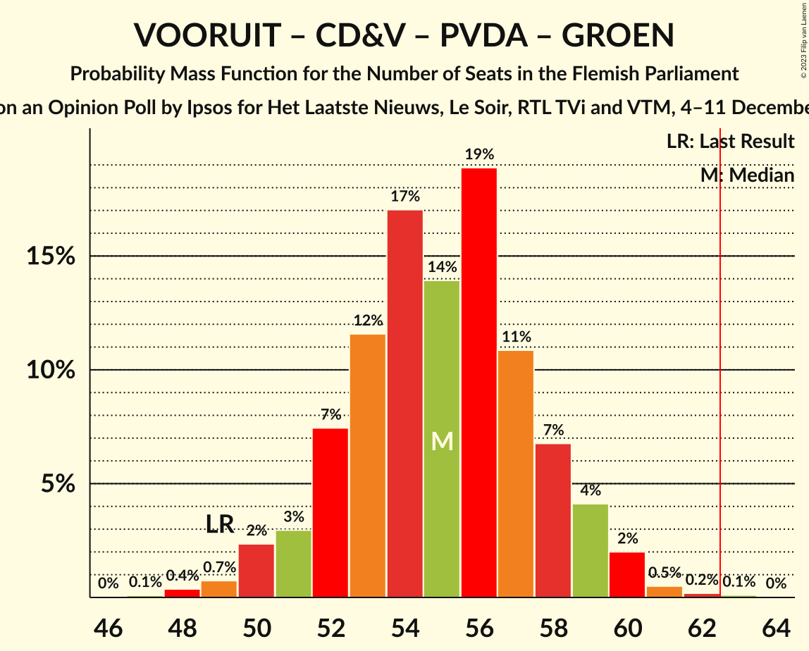

| Number of Seats | Probability | Accumulated | Special Marks |
|:---------------:|:-----------:|:-----------:|:-------------:|
| 47 | 0.1% | 100% |  |
| 48 | 0.4% | 99.9% |  |
| 49 | 0.7% | 99.5% | Last Result |
| 50 | 2% | 98.8% |  |
| 51 | 3% | 96% |  |
| 52 | 7% | 93% |  |
| 53 | 12% | 86% |  |
| 54 | 17% | 74% |  |
| 55 | 14% | 57% |  |
| 56 | 19% | 43% | Median |
| 57 | 11% | 25% |  |
| 58 | 7% | 14% |  |
| 59 | 4% | 7% |  |
| 60 | 2% | 3% |  |
| 61 | 0.5% | 0.8% |  |
| 62 | 0.2% | 0.3% |  |
| 63 | 0.1% | 0.1% | Majority |
| 64 | 0% | 0% |  |

### Nieuw-Vlaamse Alliantie – Vooruit – Open Vlaamse Liberalen en Democraten

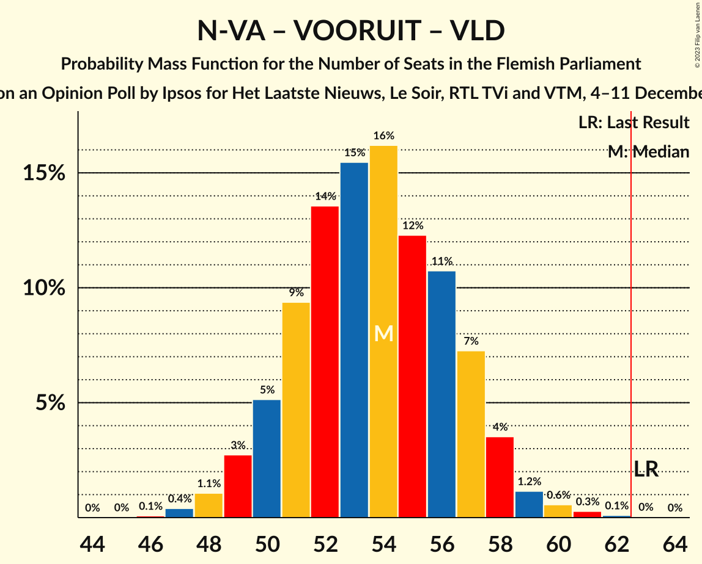

| Number of Seats | Probability | Accumulated | Special Marks |
|:---------------:|:-----------:|:-----------:|:-------------:|
| 46 | 0.1% | 100% |  |
| 47 | 0.4% | 99.9% |  |
| 48 | 1.1% | 99.5% |  |
| 49 | 3% | 98% |  |
| 50 | 5% | 96% |  |
| 51 | 9% | 91% |  |
| 52 | 14% | 81% |  |
| 53 | 15% | 68% |  |
| 54 | 16% | 52% |  |
| 55 | 12% | 36% | Median |
| 56 | 11% | 24% |  |
| 57 | 7% | 13% |  |
| 58 | 4% | 6% |  |
| 59 | 1.2% | 2% |  |
| 60 | 0.6% | 1.0% |  |
| 61 | 0.3% | 0.4% |  |
| 62 | 0.1% | 0.1% |  |
| 63 | 0% | 0% | Last Result, Majority |

### Vooruit – Christen-Democratisch en Vlaams – Groen – Open Vlaamse Liberalen en Democraten

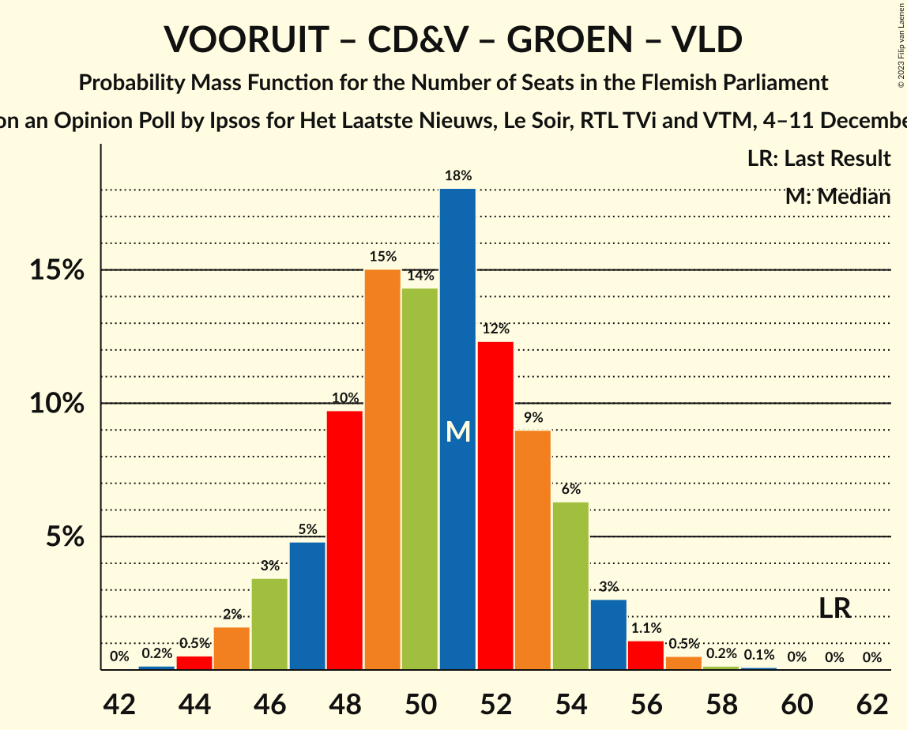

| Number of Seats | Probability | Accumulated | Special Marks |
|:---------------:|:-----------:|:-----------:|:-------------:|
| 42 | 0% | 100% |  |
| 43 | 0.2% | 99.9% |  |
| 44 | 0.5% | 99.8% |  |
| 45 | 2% | 99.2% |  |
| 46 | 3% | 98% |  |
| 47 | 5% | 94% |  |
| 48 | 10% | 89% |  |
| 49 | 15% | 80% |  |
| 50 | 14% | 65% |  |
| 51 | 18% | 50% |  |
| 52 | 12% | 32% | Median |
| 53 | 9% | 20% |  |
| 54 | 6% | 11% |  |
| 55 | 3% | 5% |  |
| 56 | 1.1% | 2% |  |
| 57 | 0.5% | 0.8% |  |
| 58 | 0.2% | 0.3% |  |
| 59 | 0.1% | 0.1% |  |
| 60 | 0% | 0% |  |
| 61 | 0% | 0% | Last Result |

### Nieuw-Vlaamse Alliantie – Christen-Democratisch en Vlaams – Open Vlaamse Liberalen en Democraten

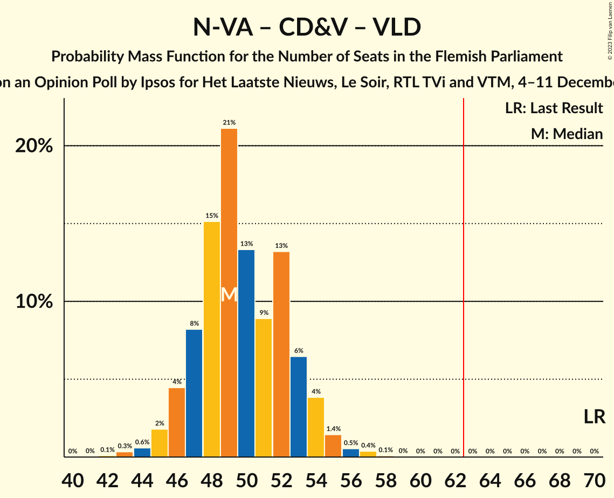

| Number of Seats | Probability | Accumulated | Special Marks |
|:---------------:|:-----------:|:-----------:|:-------------:|
| 42 | 0.1% | 100% |  |
| 43 | 0.3% | 99.9% |  |
| 44 | 0.6% | 99.5% |  |
| 45 | 2% | 98.9% |  |
| 46 | 4% | 97% |  |
| 47 | 8% | 93% |  |
| 48 | 15% | 84% |  |
| 49 | 21% | 69% |  |
| 50 | 13% | 48% |  |
| 51 | 9% | 35% | Median |
| 52 | 13% | 26% |  |
| 53 | 6% | 13% |  |
| 54 | 4% | 6% |  |
| 55 | 1.4% | 2% |  |
| 56 | 0.5% | 1.0% |  |
| 57 | 0.4% | 0.5% |  |
| 58 | 0.1% | 0.1% |  |
| 59 | 0% | 0% |  |
| 60 | 0% | 0% |  |
| 61 | 0% | 0% |  |
| 62 | 0% | 0% |  |
| 63 | 0% | 0% | Majority |
| 64 | 0% | 0% |  |
| 65 | 0% | 0% |  |
| 66 | 0% | 0% |  |
| 67 | 0% | 0% |  |
| 68 | 0% | 0% |  |
| 69 | 0% | 0% |  |
| 70 | 0% | 0% | Last Result |

### Vooruit – Christen-Democratisch en Vlaams – Groen

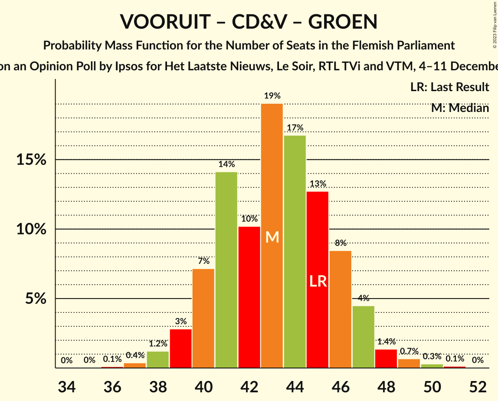

| Number of Seats | Probability | Accumulated | Special Marks |
|:---------------:|:-----------:|:-----------:|:-------------:|
| 36 | 0.1% | 100% |  |
| 37 | 0.4% | 99.9% |  |
| 38 | 1.2% | 99.5% |  |
| 39 | 3% | 98% |  |
| 40 | 7% | 95% |  |
| 41 | 14% | 88% |  |
| 42 | 10% | 74% |  |
| 43 | 19% | 64% |  |
| 44 | 17% | 45% | Median |
| 45 | 13% | 28% | Last Result |
| 46 | 8% | 15% |  |
| 47 | 4% | 7% |  |
| 48 | 1.4% | 2% |  |
| 49 | 0.7% | 1.1% |  |
| 50 | 0.3% | 0.5% |  |
| 51 | 0.1% | 0.2% |  |
| 52 | 0% | 0% |  |

### Nieuw-Vlaamse Alliantie – Christen-Democratisch en Vlaams

| Number of Seats | Probability | Accumulated | Special Marks |
|:---------------:|:-----------:|:-----------:|:-------------:|
| 35 | 0% | 100% |  |
| 36 | 0.1% | 99.9% |  |
| 37 | 0.4% | 99.9% |  |
| 38 | 3% | 99.4% |  |
| 39 | 5% | 97% |  |
| 40 | 9% | 92% |  |
| 41 | 21% | 82% |  |
| 42 | 13% | 62% |  |
| 43 | 15% | 48% | Median |
| 44 | 13% | 33% |  |
| 45 | 12% | 20% |  |
| 46 | 5% | 8% |  |
| 47 | 2% | 4% |  |
| 48 | 1.1% | 2% |  |
| 49 | 0.3% | 0.5% |  |
| 50 | 0.1% | 0.2% |  |
| 51 | 0% | 0.1% |  |
| 52 | 0% | 0% |  |
| 53 | 0% | 0% |  |
| 54 | 0% | 0% | Last Result |

### Vooruit – Christen-Democratisch en Vlaams – Open Vlaamse Liberalen en Democraten

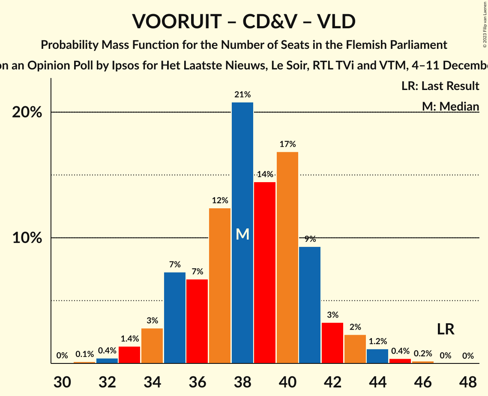

| Number of Seats | Probability | Accumulated | Special Marks |
|:---------------:|:-----------:|:-----------:|:-------------:|
| 31 | 0.1% | 100% |  |
| 32 | 0.4% | 99.8% |  |
| 33 | 1.4% | 99.4% |  |
| 34 | 3% | 98% |  |
| 35 | 7% | 95% |  |
| 36 | 7% | 88% |  |
| 37 | 12% | 81% |  |
| 38 | 21% | 69% |  |
| 39 | 14% | 48% |  |
| 40 | 17% | 34% | Median |
| 41 | 9% | 17% |  |
| 42 | 3% | 7% |  |
| 43 | 2% | 4% |  |
| 44 | 1.2% | 2% |  |
| 45 | 0.4% | 0.6% |  |
| 46 | 0.2% | 0.2% |  |
| 47 | 0% | 0% | Last Result |

### Vooruit – Groen – Open Vlaamse Liberalen en Democraten

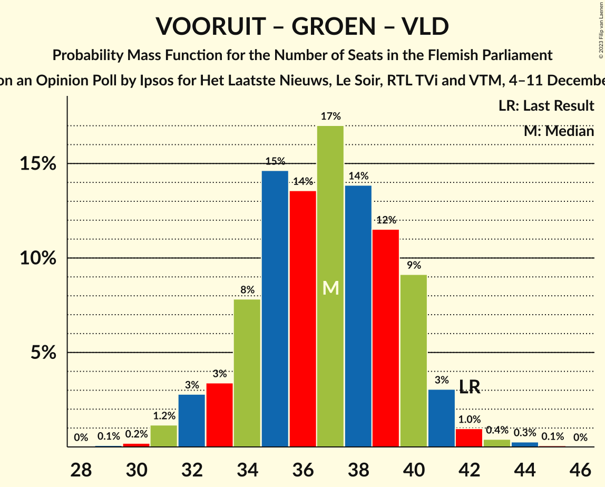

| Number of Seats | Probability | Accumulated | Special Marks |
|:---------------:|:-----------:|:-----------:|:-------------:|
| 29 | 0.1% | 100% |  |
| 30 | 0.2% | 99.9% |  |
| 31 | 1.2% | 99.7% |  |
| 32 | 3% | 98.5% |  |
| 33 | 3% | 96% |  |
| 34 | 8% | 92% |  |
| 35 | 15% | 85% |  |
| 36 | 14% | 70% |  |
| 37 | 17% | 56% |  |
| 38 | 14% | 39% | Median |
| 39 | 12% | 25% |  |
| 40 | 9% | 14% |  |
| 41 | 3% | 5% |  |
| 42 | 1.0% | 2% | Last Result |
| 43 | 0.4% | 0.8% |  |
| 44 | 0.3% | 0.4% |  |
| 45 | 0.1% | 0.1% |  |
| 46 | 0% | 0% |  |

### Nieuw-Vlaamse Alliantie – Open Vlaamse Liberalen en Democraten

| Number of Seats | Probability | Accumulated | Special Marks |
|:---------------:|:-----------:|:-----------:|:-------------:|
| 29 | 0.2% | 100% |  |
| 30 | 0.5% | 99.8% |  |
| 31 | 1.0% | 99.3% |  |
| 32 | 2% | 98% |  |
| 33 | 4% | 96% |  |
| 34 | 12% | 92% |  |
| 35 | 24% | 79% |  |
| 36 | 16% | 55% |  |
| 37 | 11% | 40% | Median |
| 38 | 15% | 29% |  |
| 39 | 8% | 14% |  |
| 40 | 4% | 6% |  |
| 41 | 1.4% | 2% |  |
| 42 | 0.5% | 1.0% |  |
| 43 | 0.4% | 0.5% |  |
| 44 | 0.1% | 0.1% |  |
| 45 | 0% | 0% |  |
| 46 | 0% | 0% |  |
| 47 | 0% | 0% |  |
| 48 | 0% | 0% |  |
| 49 | 0% | 0% |  |
| 50 | 0% | 0% |  |
| 51 | 0% | 0% | Last Result |

### Christen-Democratisch en Vlaams – Groen – Open Vlaamse Liberalen en Democraten

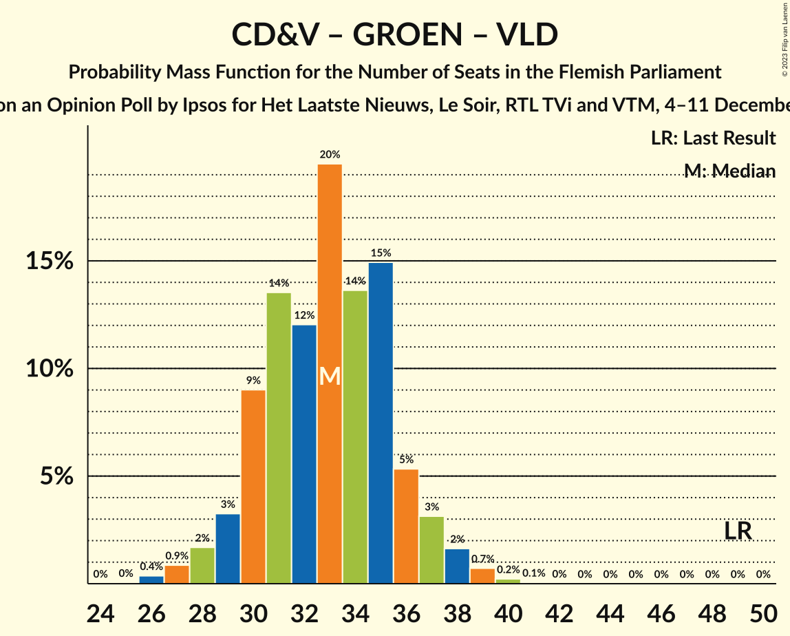

| Number of Seats | Probability | Accumulated | Special Marks |
|:---------------:|:-----------:|:-----------:|:-------------:|
| 25 | 0% | 100% |  |
| 26 | 0.4% | 99.9% |  |
| 27 | 0.9% | 99.6% |  |
| 28 | 2% | 98.7% |  |
| 29 | 3% | 97% |  |
| 30 | 9% | 94% |  |
| 31 | 14% | 85% |  |
| 32 | 12% | 71% |  |
| 33 | 20% | 59% |  |
| 34 | 14% | 40% | Median |
| 35 | 15% | 26% |  |
| 36 | 5% | 11% |  |
| 37 | 3% | 6% |  |
| 38 | 2% | 3% |  |
| 39 | 0.7% | 1.0% |  |
| 40 | 0.2% | 0.3% |  |
| 41 | 0.1% | 0.1% |  |
| 42 | 0% | 0% |  |
| 43 | 0% | 0% |  |
| 44 | 0% | 0% |  |
| 45 | 0% | 0% |  |
| 46 | 0% | 0% |  |
| 47 | 0% | 0% |  |
| 48 | 0% | 0% |  |
| 49 | 0% | 0% | Last Result |

### Vooruit – Christen-Democratisch en Vlaams

| Number of Seats | Probability | Accumulated | Special Marks |
|:---------------:|:-----------:|:-----------:|:-------------:|
| 25 | 0.2% | 100% |  |
| 26 | 1.0% | 99.8% |  |
| 27 | 3% | 98.7% |  |
| 28 | 4% | 96% |  |
| 29 | 9% | 92% |  |
| 30 | 22% | 83% |  |
| 31 | 17% | 61% | Last Result |
| 32 | 20% | 44% | Median |
| 33 | 15% | 25% |  |
| 34 | 5% | 10% |  |
| 35 | 3% | 5% |  |
| 36 | 1.3% | 2% |  |
| 37 | 0.4% | 0.6% |  |
| 38 | 0.1% | 0.2% |  |
| 39 | 0% | 0% |  |

### Vooruit – Open Vlaamse Liberalen en Democraten

| Number of Seats | Probability | Accumulated | Special Marks |
|:---------------:|:-----------:|:-----------:|:-------------:|
| 18 | 0.1% | 100% |  |
| 19 | 0.4% | 99.8% |  |
| 20 | 2% | 99.4% |  |
| 21 | 6% | 97% |  |
| 22 | 6% | 91% |  |
| 23 | 10% | 85% |  |
| 24 | 16% | 75% |  |
| 25 | 17% | 59% |  |
| 26 | 22% | 42% | Median |
| 27 | 13% | 20% |  |
| 28 | 3% | 7% | Last Result |
| 29 | 2% | 3% |  |
| 30 | 0.8% | 1.3% |  |
| 31 | 0.3% | 0.5% |  |
| 32 | 0.1% | 0.1% |  |
| 33 | 0% | 0% |  |

### Christen-Democratisch en Vlaams – Open Vlaamse Liberalen en Democraten

| Number of Seats | Probability | Accumulated | Special Marks |
|:---------------:|:-----------:|:-----------:|:-------------:|
| 14 | 0.1% | 100% |  |
| 15 | 0.5% | 99.9% |  |
| 16 | 1.5% | 99.4% |  |
| 17 | 3% | 98% |  |
| 18 | 6% | 95% |  |
| 19 | 14% | 89% |  |
| 20 | 18% | 75% |  |
| 21 | 17% | 57% |  |
| 22 | 24% | 41% | Median |
| 23 | 7% | 17% |  |
| 24 | 6% | 10% |  |
| 25 | 3% | 4% |  |
| 26 | 1.0% | 1.4% |  |
| 27 | 0.3% | 0.4% |  |
| 28 | 0.1% | 0.1% |  |
| 29 | 0% | 0% |  |
| 30 | 0% | 0% |  |
| 31 | 0% | 0% |  |
| 32 | 0% | 0% |  |
| 33 | 0% | 0% |  |
| 34 | 0% | 0% |  |
| 35 | 0% | 0% | Last Result |

## Technical Information

### Opinion Poll

+ **Polling firm:** Ipsos
+ **Commissioner(s):** Het Laatste Nieuws, Le Soir, RTL TVi and VTM
+ **Fieldwork period:** 4–11 December 2023

### Calculations

+ **Sample size:** 1000
+ **Simulations done:** 1,048,576
+ **Error estimate:** 0.62%

