# Opinion Poll by Kantar and Universiteit Antwerpen for De Standaard and VRT, 8–22 January 2024

<a href="#voting-intentions">Voting Intentions</a> | <a href="#seats">Seats</a> | <a href="#coalitions">Coalitions</a> | <a href="#technical-information">Technical Information</a>

## Voting Intentions

### Confidence Intervals

| Party | Last Result | Poll Result | 80% Confidence Interval | 90% Confidence Interval | 95% Confidence Interval | 99% Confidence Interval |
|:-----:|:-----------:|:-----------:|:-----------------------:|:-----------------------:|:-----------------------:|:-----------------------:|
| Vlaams Belang | 18.5% | 27.8% | 26.5–29.2% |26.1–29.6% |25.8–29.9% |25.2–30.6% |
| Nieuw-Vlaamse Alliantie | 24.8% | 18.9% | 17.8–20.1% |17.5–20.5% |17.2–20.8% |16.7–21.4% |
| Vooruit | 10.1% | 13.7% | 12.7–14.8% |12.5–15.1% |12.2–15.4% |11.8–15.9% |
| Christen-Democratisch en Vlaams | 15.4% | 11.3% | 10.4–12.3% |10.1–12.6% |9.9–12.8% |9.5–13.3% |
| Partij van de Arbeid van België | 5.3% | 10.9% | 10.0–11.9% |9.8–12.2% |9.6–12.4% |9.1–12.9% |
| Open Vlaamse Liberalen en Democraten | 13.1% | 9.0% | 8.2–9.9% |8.0–10.2% |7.8–10.4% |7.4–10.9% |
| Groen | 10.1% | 8.2% | 7.4–9.1% |7.2–9.3% |7.0–9.5% |6.7–10.0% |

*Note:* The poll result column reflects the actual value used in the calculations. Published results may vary slightly, and in addition be rounded to fewer digits.

## Seats

### Confidence Intervals

| Party | Last Result | Median | 80% Confidence Interval | 90% Confidence Interval | 95% Confidence Interval | 99% Confidence Interval |
|:-----:|:-----------:|:------:|:-----------------------:|:-----------------------:|:-----------------------:|:-----------------------:|
| <a href="#vlaams-belang">Vlaams Belang</a> | 23 | 37 | 34–38 |34–38 |33–39 |31–41 |
| <a href="#nieuw-vlaamse-alliantie">Nieuw-Vlaamse Alliantie</a> | 35 | 24 | 22–26 |22–27 |21–27 |21–27 |
| <a href="#vooruit">Vooruit</a> | 12 | 17 | 16–19 |15–19 |15–19 |14–19 |
| <a href="#christen-democratisch-en-vlaams">Christen-Democratisch en Vlaams</a> | 19 | 13 | 11–14 |11–14 |11–14 |11–16 |
| <a href="#partij-van-de-arbeid-van-belgië">Partij van de Arbeid van België</a> | 4 | 13 | 12–14 |11–14 |11–14 |10–16 |
| <a href="#open-vlaamse-liberalen-en-democraten">Open Vlaamse Liberalen en Democraten</a> | 16 | 10 | 8–12 |8–12 |8–12 |8–13 |
| <a href="#groen">Groen</a> | 14 | 10 | 8–11 |7–11 |7–12 |7–13 |

### Vlaams Belang

*For a full overview of the results for this party, see the [Vlaams Belang](party-vlaamsbelang.html) page.*

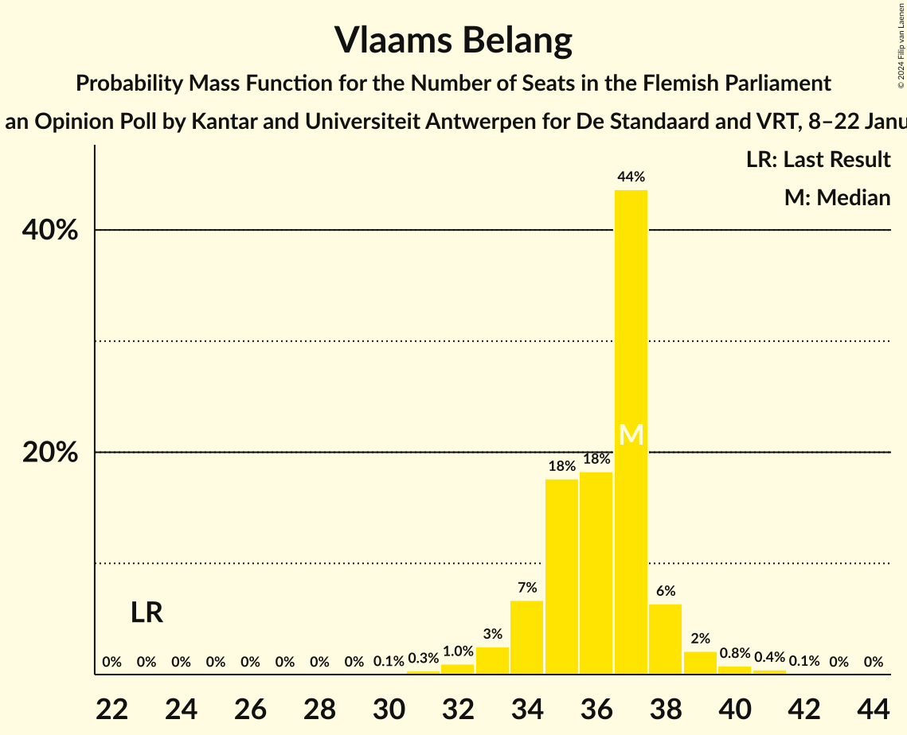

| Number of Seats | Probability | Accumulated | Special Marks |
|:---------------:|:-----------:|:-----------:|:-------------:|
| 23 | 0% | 100% | Last Result |
| 24 | 0% | 100% |  |
| 25 | 0% | 100% |  |
| 26 | 0% | 100% |  |
| 27 | 0% | 100% |  |
| 28 | 0% | 100% |  |
| 29 | 0% | 100% |  |
| 30 | 0.1% | 100% |  |
| 31 | 0.4% | 99.9% |  |
| 32 | 1.1% | 99.5% |  |
| 33 | 3% | 98% |  |
| 34 | 7% | 96% |  |
| 35 | 16% | 88% |  |
| 36 | 20% | 72% |  |
| 37 | 42% | 52% | Median |
| 38 | 7% | 10% |  |
| 39 | 2% | 3% |  |
| 40 | 0.8% | 1.3% |  |
| 41 | 0.4% | 0.5% |  |
| 42 | 0.1% | 0.1% |  |
| 43 | 0% | 0% |  |

### Nieuw-Vlaamse Alliantie

*For a full overview of the results for this party, see the [Nieuw-Vlaamse Alliantie](party-nieuw-vlaamsealliantie.html) page.*

| Number of Seats | Probability | Accumulated | Special Marks |
|:---------------:|:-----------:|:-----------:|:-------------:|
| 21 | 3% | 100% |  |
| 22 | 11% | 97% |  |
| 23 | 16% | 87% |  |
| 24 | 23% | 71% | Median |
| 25 | 17% | 48% |  |
| 26 | 23% | 31% |  |
| 27 | 7% | 8% |  |
| 28 | 0.4% | 0.4% |  |
| 29 | 0% | 0.1% |  |
| 30 | 0% | 0% |  |
| 31 | 0% | 0% |  |
| 32 | 0% | 0% |  |
| 33 | 0% | 0% |  |
| 34 | 0% | 0% |  |
| 35 | 0% | 0% | Last Result |

### Vooruit

*For a full overview of the results for this party, see the [Vooruit](party-vooruit.html) page.*

| Number of Seats | Probability | Accumulated | Special Marks |
|:---------------:|:-----------:|:-----------:|:-------------:|
| 12 | 0% | 100% | Last Result |
| 13 | 0% | 100% |  |
| 14 | 2% | 100% |  |
| 15 | 6% | 98% |  |
| 16 | 33% | 92% |  |
| 17 | 16% | 59% | Median |
| 18 | 24% | 43% |  |
| 19 | 19% | 19% |  |
| 20 | 0.2% | 0.3% |  |
| 21 | 0.1% | 0.1% |  |
| 22 | 0% | 0% |  |

### Christen-Democratisch en Vlaams

*For a full overview of the results for this party, see the [Christen-Democratisch en Vlaams](party-christen-democratischenvlaams.html) page.*

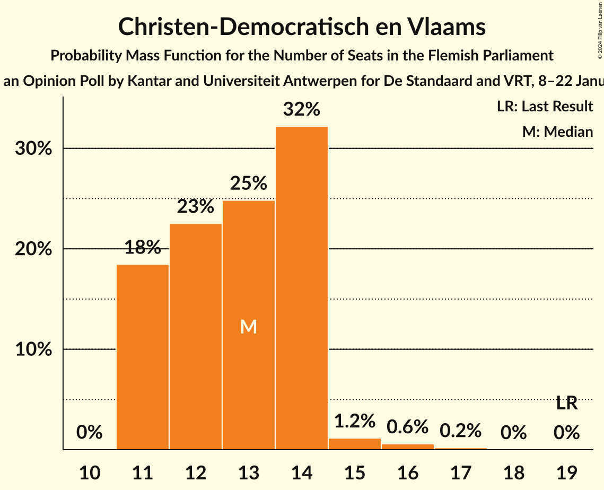

| Number of Seats | Probability | Accumulated | Special Marks |
|:---------------:|:-----------:|:-----------:|:-------------:|
| 11 | 18% | 100% |  |
| 12 | 19% | 82% |  |
| 13 | 22% | 63% | Median |
| 14 | 39% | 41% |  |
| 15 | 1.2% | 2% |  |
| 16 | 0.5% | 0.7% |  |
| 17 | 0.2% | 0.2% |  |
| 18 | 0% | 0% |  |
| 19 | 0% | 0% | Last Result |

### Partij van de Arbeid van België

*For a full overview of the results for this party, see the [Partij van de Arbeid van België](party-partijvandearbeidvanbelgië.html) page.*

| Number of Seats | Probability | Accumulated | Special Marks |
|:---------------:|:-----------:|:-----------:|:-------------:|
| 4 | 0% | 100% | Last Result |
| 5 | 0% | 100% |  |
| 6 | 0% | 100% |  |
| 7 | 0% | 100% |  |
| 8 | 0% | 100% |  |
| 9 | 0.1% | 100% |  |
| 10 | 0.9% | 99.9% |  |
| 11 | 4% | 98.9% |  |
| 12 | 11% | 95% |  |
| 13 | 42% | 84% | Median |
| 14 | 40% | 42% |  |
| 15 | 1.2% | 2% |  |
| 16 | 0.4% | 0.7% |  |
| 17 | 0.2% | 0.3% |  |
| 18 | 0.1% | 0.1% |  |
| 19 | 0% | 0% |  |

### Open Vlaamse Liberalen en Democraten

*For a full overview of the results for this party, see the [Open Vlaamse Liberalen en Democraten](party-openvlaamseliberalenendemocraten.html) page.*

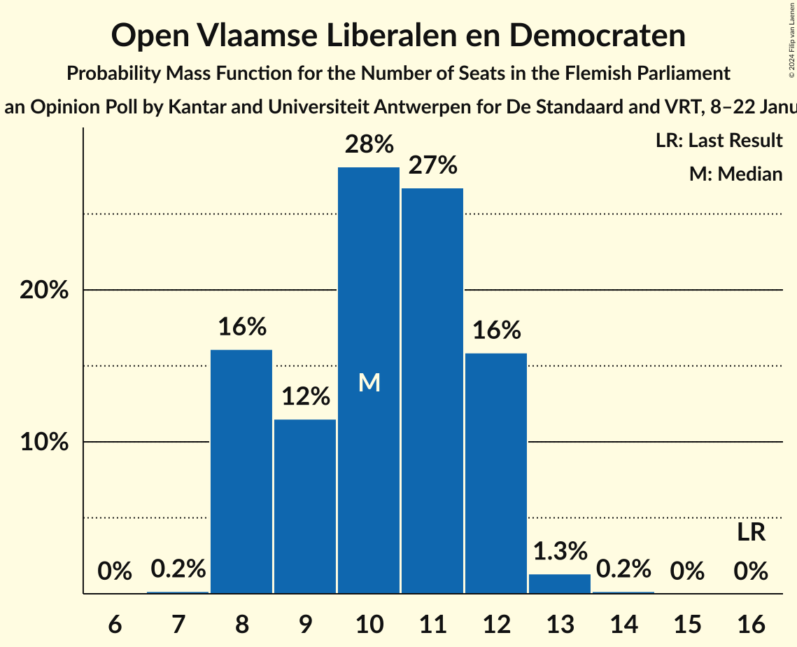

| Number of Seats | Probability | Accumulated | Special Marks |
|:---------------:|:-----------:|:-----------:|:-------------:|
| 7 | 0.2% | 100% |  |
| 8 | 15% | 99.8% |  |
| 9 | 13% | 85% |  |
| 10 | 29% | 72% | Median |
| 11 | 25% | 43% |  |
| 12 | 17% | 19% |  |
| 13 | 1.3% | 2% |  |
| 14 | 0.2% | 0.2% |  |
| 15 | 0% | 0% |  |
| 16 | 0% | 0% | Last Result |

### Groen

*For a full overview of the results for this party, see the [Groen](party-groen.html) page.*

| Number of Seats | Probability | Accumulated | Special Marks |
|:---------------:|:-----------:|:-----------:|:-------------:|
| 6 | 0.2% | 100% |  |
| 7 | 6% | 99.7% |  |
| 8 | 5% | 94% |  |
| 9 | 21% | 89% |  |
| 10 | 32% | 68% | Median |
| 11 | 32% | 36% |  |
| 12 | 3% | 4% |  |
| 13 | 0.8% | 1.3% |  |
| 14 | 0.5% | 0.5% | Last Result |
| 15 | 0% | 0% |  |

## Coalitions

### Confidence Intervals

| Coalition | Last Result | Median | Majority? | 80% Confidence Interval | 90% Confidence Interval | 95% Confidence Interval | 99% Confidence Interval |
|:---------:|:-----------:|:------:|:---------:|:-----------------------:|:-----------------------:|:-----------------------:|:-----------------------:|
| Vlaams Belang – Nieuw-Vlaamse Alliantie – Christen-Democratisch en Vlaams | 77 | 74 | 100% | 71–75 | 70–76 | 70–77 | 69–78 |
| Nieuw-Vlaamse Alliantie – Vooruit – Christen-Democratisch en Vlaams – Open Vlaamse Liberalen en Democraten | 82 | 65 | 89% | 62–67 | 62–68 | 61–68 | 60–69 |
| Vlaams Belang – Nieuw-Vlaamse Alliantie | 58 | 61 | 16% | 58–63 | 58–64 | 57–64 | 55–65 |
| Nieuw-Vlaamse Alliantie – Vooruit – Christen-Democratisch en Vlaams | 66 | 54 | 0% | 52–57 | 51–57 | 51–58 | 50–59 |
| Vooruit – Christen-Democratisch en Vlaams – Partij van de Arbeid van België – Groen | 49 | 53 | 0% | 51–56 | 50–56 | 49–57 | 48–58 |
| Nieuw-Vlaamse Alliantie – Vooruit – Open Vlaamse Liberalen en Democraten | 63 | 52 | 0% | 49–54 | 49–55 | 48–56 | 47–57 |
| Vooruit – Christen-Democratisch en Vlaams – Open Vlaamse Liberalen en Democraten – Groen | 61 | 50 | 0% | 48–52 | 47–53 | 47–54 | 46–55 |
| Nieuw-Vlaamse Alliantie – Christen-Democratisch en Vlaams – Open Vlaamse Liberalen en Democraten | 70 | 48 | 0% | 45–50 | 44–51 | 44–51 | 42–53 |
| Vooruit – Christen-Democratisch en Vlaams – Open Vlaamse Liberalen en Democraten | 47 | 40 | 0% | 38–43 | 37–43 | 37–44 | 36–45 |
| Vooruit – Christen-Democratisch en Vlaams – Groen | 45 | 40 | 0% | 37–42 | 37–43 | 36–44 | 35–45 |
| Vooruit – Open Vlaamse Liberalen en Democraten – Groen | 42 | 37 | 0% | 35–40 | 35–40 | 34–41 | 33–42 |
| Nieuw-Vlaamse Alliantie – Christen-Democratisch en Vlaams | 54 | 38 | 0% | 35–39 | 34–40 | 33–41 | 32–41 |
| Nieuw-Vlaamse Alliantie – Open Vlaamse Liberalen en Democraten | 51 | 34 | 0% | 32–37 | 32–38 | 31–38 | 30–39 |
| Christen-Democratisch en Vlaams – Open Vlaamse Liberalen en Democraten – Groen | 49 | 33 | 0% | 31–35 | 30–36 | 30–36 | 29–37 |
| Vooruit – Christen-Democratisch en Vlaams | 31 | 30 | 0% | 28–32 | 27–33 | 27–33 | 26–34 |
| Vooruit – Open Vlaamse Liberalen en Democraten | 28 | 27 | 0% | 25–30 | 25–30 | 24–31 | 23–31 |
| Christen-Democratisch en Vlaams – Open Vlaamse Liberalen en Democraten | 35 | 23 | 0% | 21–25 | 20–26 | 20–26 | 19–27 |

### Vlaams Belang – Nieuw-Vlaamse Alliantie – Christen-Democratisch en Vlaams

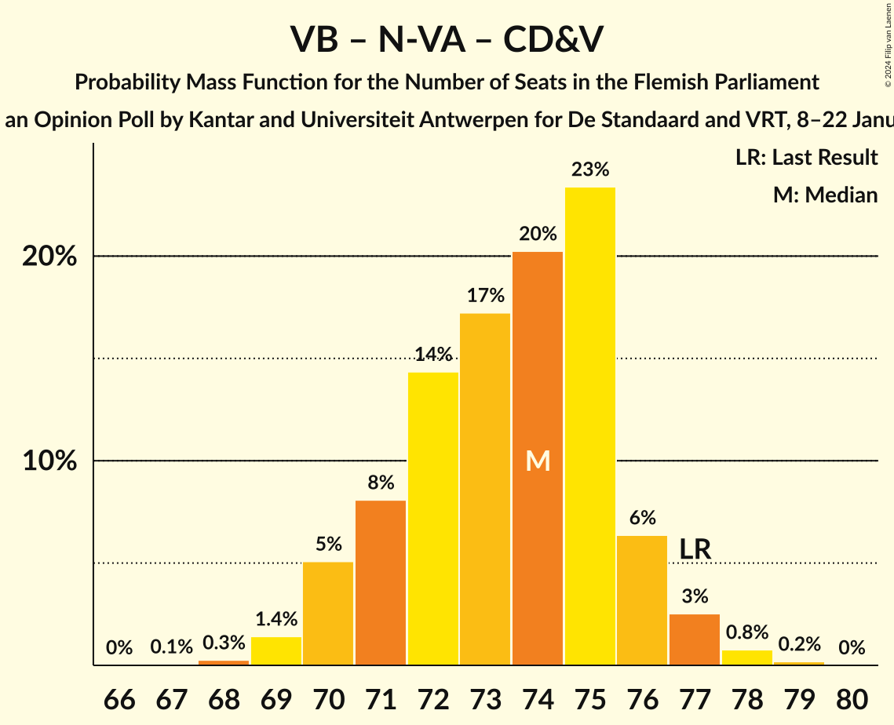

| Number of Seats | Probability | Accumulated | Special Marks |
|:---------------:|:-----------:|:-----------:|:-------------:|
| 67 | 0.1% | 100% |  |
| 68 | 0.2% | 99.9% |  |
| 69 | 1.5% | 99.7% |  |
| 70 | 5% | 98% |  |
| 71 | 7% | 93% |  |
| 72 | 15% | 87% |  |
| 73 | 16% | 72% |  |
| 74 | 22% | 55% | Median |
| 75 | 24% | 33% |  |
| 76 | 6% | 9% |  |
| 77 | 3% | 4% | Last Result |
| 78 | 0.6% | 0.9% |  |
| 79 | 0.2% | 0.2% |  |
| 80 | 0% | 0% |  |

### Nieuw-Vlaamse Alliantie – Vooruit – Christen-Democratisch en Vlaams – Open Vlaamse Liberalen en Democraten

| Number of Seats | Probability | Accumulated | Special Marks |
|:---------------:|:-----------:|:-----------:|:-------------:|
| 58 | 0.1% | 100% |  |
| 59 | 0.3% | 99.9% |  |
| 60 | 1.0% | 99.6% |  |
| 61 | 2% | 98.6% |  |
| 62 | 7% | 96% |  |
| 63 | 16% | 89% | Majority |
| 64 | 22% | 73% | Median |
| 65 | 21% | 50% |  |
| 66 | 13% | 29% |  |
| 67 | 8% | 16% |  |
| 68 | 5% | 8% |  |
| 69 | 2% | 2% |  |
| 70 | 0.3% | 0.4% |  |
| 71 | 0.1% | 0.1% |  |
| 72 | 0% | 0% |  |
| 73 | 0% | 0% |  |
| 74 | 0% | 0% |  |
| 75 | 0% | 0% |  |
| 76 | 0% | 0% |  |
| 77 | 0% | 0% |  |
| 78 | 0% | 0% |  |
| 79 | 0% | 0% |  |
| 80 | 0% | 0% |  |
| 81 | 0% | 0% |  |
| 82 | 0% | 0% | Last Result |

### Vlaams Belang – Nieuw-Vlaamse Alliantie

| Number of Seats | Probability | Accumulated | Special Marks |
|:---------------:|:-----------:|:-----------:|:-------------:|
| 54 | 0% | 100% |  |
| 55 | 0.5% | 99.9% |  |
| 56 | 1.3% | 99.5% |  |
| 57 | 2% | 98% |  |
| 58 | 7% | 96% | Last Result |
| 59 | 15% | 89% |  |
| 60 | 18% | 74% |  |
| 61 | 27% | 56% | Median |
| 62 | 12% | 29% |  |
| 63 | 11% | 16% | Majority |
| 64 | 5% | 5% |  |
| 65 | 0.5% | 0.8% |  |
| 66 | 0.2% | 0.3% |  |
| 67 | 0% | 0% |  |

### Nieuw-Vlaamse Alliantie – Vooruit – Christen-Democratisch en Vlaams

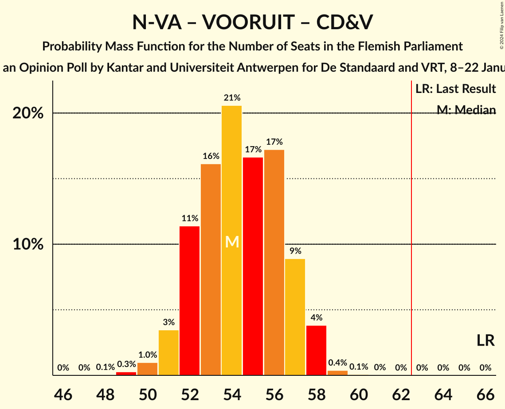

| Number of Seats | Probability | Accumulated | Special Marks |
|:---------------:|:-----------:|:-----------:|:-------------:|
| 48 | 0.1% | 100% |  |
| 49 | 0.3% | 99.9% |  |
| 50 | 0.8% | 99.6% |  |
| 51 | 4% | 98.8% |  |
| 52 | 12% | 95% |  |
| 53 | 13% | 83% |  |
| 54 | 23% | 70% | Median |
| 55 | 14% | 47% |  |
| 56 | 21% | 33% |  |
| 57 | 10% | 12% |  |
| 58 | 2% | 3% |  |
| 59 | 0.4% | 0.5% |  |
| 60 | 0.1% | 0.1% |  |
| 61 | 0% | 0% |  |
| 62 | 0% | 0% |  |
| 63 | 0% | 0% | Majority |
| 64 | 0% | 0% |  |
| 65 | 0% | 0% |  |
| 66 | 0% | 0% | Last Result |

### Vooruit – Christen-Democratisch en Vlaams – Partij van de Arbeid van België – Groen

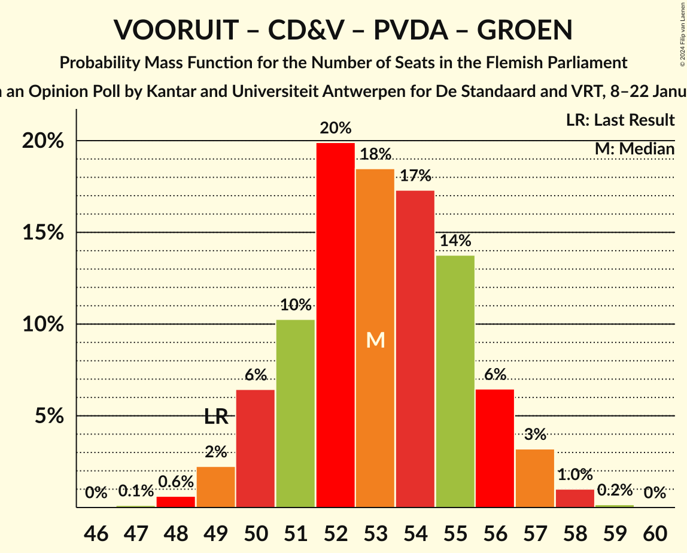

| Number of Seats | Probability | Accumulated | Special Marks |
|:---------------:|:-----------:|:-----------:|:-------------:|
| 47 | 0.1% | 100% |  |
| 48 | 0.5% | 99.8% |  |
| 49 | 3% | 99.4% | Last Result |
| 50 | 6% | 97% |  |
| 51 | 9% | 91% |  |
| 52 | 18% | 82% |  |
| 53 | 22% | 64% | Median |
| 54 | 17% | 42% |  |
| 55 | 13% | 25% |  |
| 56 | 8% | 12% |  |
| 57 | 3% | 4% |  |
| 58 | 1.2% | 1.4% |  |
| 59 | 0.2% | 0.2% |  |
| 60 | 0% | 0% |  |

### Nieuw-Vlaamse Alliantie – Vooruit – Open Vlaamse Liberalen en Democraten

| Number of Seats | Probability | Accumulated | Special Marks |
|:---------------:|:-----------:|:-----------:|:-------------:|
| 46 | 0.1% | 100% |  |
| 47 | 0.6% | 99.8% |  |
| 48 | 2% | 99.2% |  |
| 49 | 10% | 97% |  |
| 50 | 18% | 87% |  |
| 51 | 15% | 69% | Median |
| 52 | 20% | 54% |  |
| 53 | 16% | 35% |  |
| 54 | 10% | 19% |  |
| 55 | 5% | 9% |  |
| 56 | 3% | 4% |  |
| 57 | 0.7% | 0.8% |  |
| 58 | 0% | 0.1% |  |
| 59 | 0% | 0% |  |
| 60 | 0% | 0% |  |
| 61 | 0% | 0% |  |
| 62 | 0% | 0% |  |
| 63 | 0% | 0% | Last Result, Majority |

### Vooruit – Christen-Democratisch en Vlaams – Open Vlaamse Liberalen en Democraten – Groen

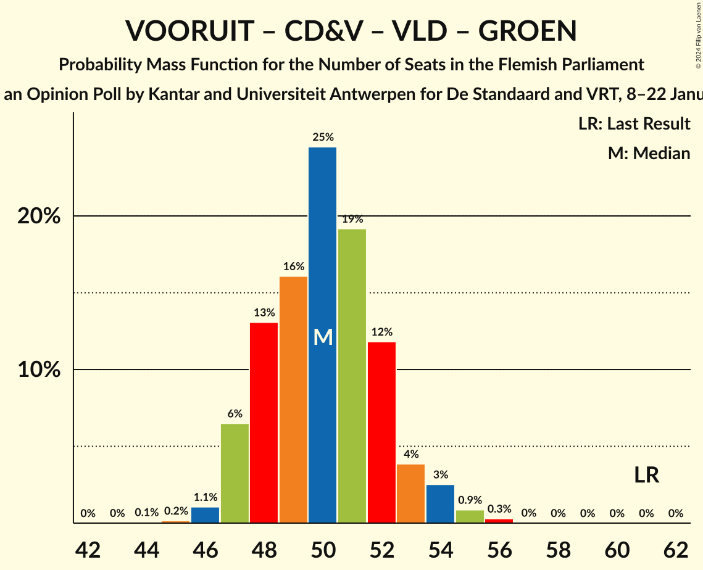

| Number of Seats | Probability | Accumulated | Special Marks |
|:---------------:|:-----------:|:-----------:|:-------------:|
| 44 | 0.1% | 100% |  |
| 45 | 0.2% | 99.9% |  |
| 46 | 1.2% | 99.7% |  |
| 47 | 6% | 98% |  |
| 48 | 10% | 92% |  |
| 49 | 16% | 82% |  |
| 50 | 25% | 67% | Median |
| 51 | 21% | 42% |  |
| 52 | 13% | 20% |  |
| 53 | 3% | 7% |  |
| 54 | 2% | 4% |  |
| 55 | 1.2% | 2% |  |
| 56 | 0.3% | 0.3% |  |
| 57 | 0% | 0% |  |
| 58 | 0% | 0% |  |
| 59 | 0% | 0% |  |
| 60 | 0% | 0% |  |
| 61 | 0% | 0% | Last Result |

### Nieuw-Vlaamse Alliantie – Christen-Democratisch en Vlaams – Open Vlaamse Liberalen en Democraten

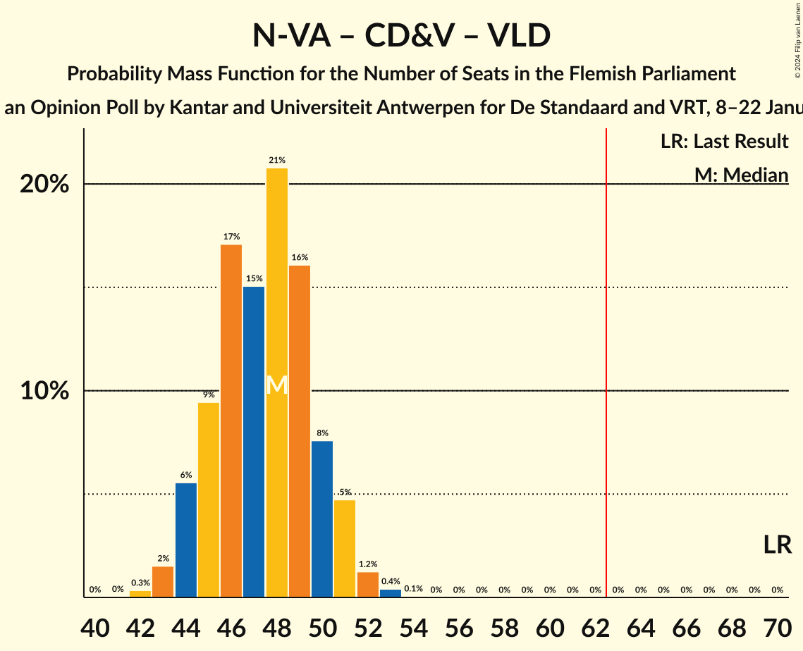

| Number of Seats | Probability | Accumulated | Special Marks |
|:---------------:|:-----------:|:-----------:|:-------------:|
| 41 | 0% | 100% |  |
| 42 | 0.5% | 99.9% |  |
| 43 | 2% | 99.4% |  |
| 44 | 4% | 98% |  |
| 45 | 10% | 94% |  |
| 46 | 16% | 83% |  |
| 47 | 13% | 68% | Median |
| 48 | 25% | 54% |  |
| 49 | 16% | 30% |  |
| 50 | 7% | 14% |  |
| 51 | 5% | 7% |  |
| 52 | 1.4% | 2% |  |
| 53 | 0.5% | 0.6% |  |
| 54 | 0.1% | 0.1% |  |
| 55 | 0% | 0% |  |
| 56 | 0% | 0% |  |
| 57 | 0% | 0% |  |
| 58 | 0% | 0% |  |
| 59 | 0% | 0% |  |
| 60 | 0% | 0% |  |
| 61 | 0% | 0% |  |
| 62 | 0% | 0% |  |
| 63 | 0% | 0% | Majority |
| 64 | 0% | 0% |  |
| 65 | 0% | 0% |  |
| 66 | 0% | 0% |  |
| 67 | 0% | 0% |  |
| 68 | 0% | 0% |  |
| 69 | 0% | 0% |  |
| 70 | 0% | 0% | Last Result |

### Vooruit – Christen-Democratisch en Vlaams – Open Vlaamse Liberalen en Democraten

| Number of Seats | Probability | Accumulated | Special Marks |
|:---------------:|:-----------:|:-----------:|:-------------:|
| 35 | 0.3% | 100% |  |
| 36 | 2% | 99.7% |  |
| 37 | 4% | 98% |  |
| 38 | 11% | 94% |  |
| 39 | 15% | 83% |  |
| 40 | 28% | 69% | Median |
| 41 | 18% | 40% |  |
| 42 | 12% | 22% |  |
| 43 | 6% | 10% |  |
| 44 | 3% | 4% |  |
| 45 | 0.9% | 1.1% |  |
| 46 | 0.2% | 0.2% |  |
| 47 | 0% | 0% | Last Result |

### Vooruit – Christen-Democratisch en Vlaams – Groen

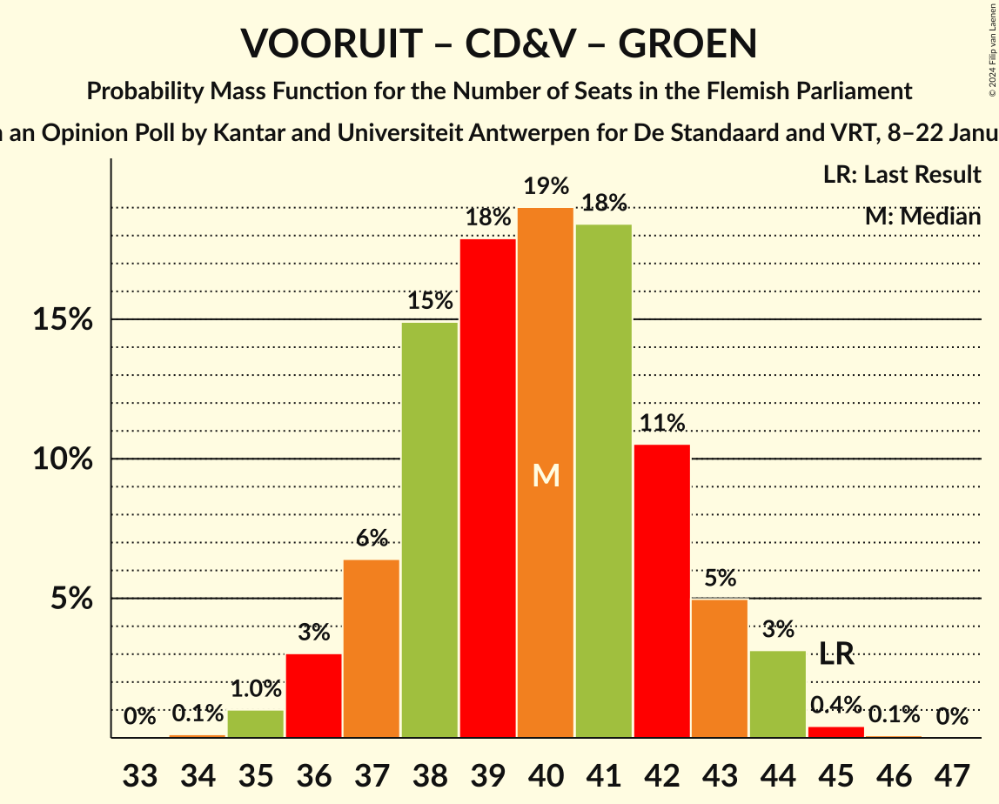

| Number of Seats | Probability | Accumulated | Special Marks |
|:---------------:|:-----------:|:-----------:|:-------------:|
| 34 | 0.1% | 100% |  |
| 35 | 1.2% | 99.9% |  |
| 36 | 2% | 98.6% |  |
| 37 | 7% | 96% |  |
| 38 | 11% | 89% |  |
| 39 | 17% | 78% |  |
| 40 | 23% | 61% | Median |
| 41 | 20% | 39% |  |
| 42 | 10% | 18% |  |
| 43 | 5% | 9% |  |
| 44 | 3% | 4% |  |
| 45 | 0.5% | 0.6% | Last Result |
| 46 | 0.1% | 0.1% |  |
| 47 | 0% | 0% |  |

### Vooruit – Open Vlaamse Liberalen en Democraten – Groen

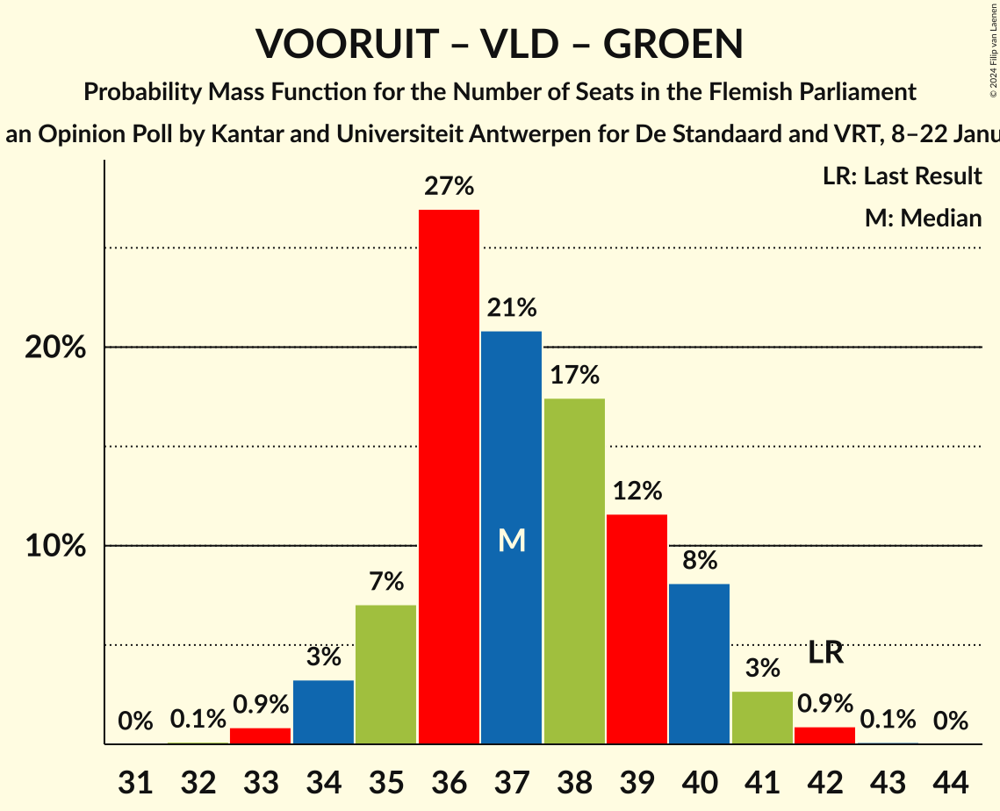

| Number of Seats | Probability | Accumulated | Special Marks |
|:---------------:|:-----------:|:-----------:|:-------------:|
| 32 | 0.1% | 100% |  |
| 33 | 0.9% | 99.8% |  |
| 34 | 3% | 98.9% |  |
| 35 | 7% | 96% |  |
| 36 | 24% | 89% |  |
| 37 | 23% | 64% | Median |
| 38 | 20% | 41% |  |
| 39 | 10% | 21% |  |
| 40 | 7% | 11% |  |
| 41 | 3% | 4% |  |
| 42 | 1.2% | 1.3% | Last Result |
| 43 | 0.1% | 0.1% |  |
| 44 | 0% | 0% |  |

### Nieuw-Vlaamse Alliantie – Christen-Democratisch en Vlaams

| Number of Seats | Probability | Accumulated | Special Marks |
|:---------------:|:-----------:|:-----------:|:-------------:|
| 32 | 0.5% | 100% |  |
| 33 | 3% | 99.5% |  |
| 34 | 4% | 97% |  |
| 35 | 7% | 93% |  |
| 36 | 16% | 86% |  |
| 37 | 18% | 70% | Median |
| 38 | 33% | 52% |  |
| 39 | 10% | 20% |  |
| 40 | 7% | 10% |  |
| 41 | 2% | 3% |  |
| 42 | 0.3% | 0.4% |  |
| 43 | 0.1% | 0.1% |  |
| 44 | 0% | 0% |  |
| 45 | 0% | 0% |  |
| 46 | 0% | 0% |  |
| 47 | 0% | 0% |  |
| 48 | 0% | 0% |  |
| 49 | 0% | 0% |  |
| 50 | 0% | 0% |  |
| 51 | 0% | 0% |  |
| 52 | 0% | 0% |  |
| 53 | 0% | 0% |  |
| 54 | 0% | 0% | Last Result |

### Nieuw-Vlaamse Alliantie – Open Vlaamse Liberalen en Democraten

| Number of Seats | Probability | Accumulated | Special Marks |
|:---------------:|:-----------:|:-----------:|:-------------:|
| 29 | 0.2% | 100% |  |
| 30 | 0.7% | 99.8% |  |
| 31 | 4% | 99.1% |  |
| 32 | 9% | 95% |  |
| 33 | 13% | 86% |  |
| 34 | 24% | 73% | Median |
| 35 | 17% | 49% |  |
| 36 | 13% | 32% |  |
| 37 | 13% | 20% |  |
| 38 | 6% | 7% |  |
| 39 | 0.8% | 1.0% |  |
| 40 | 0.1% | 0.1% |  |
| 41 | 0% | 0% |  |
| 42 | 0% | 0% |  |
| 43 | 0% | 0% |  |
| 44 | 0% | 0% |  |
| 45 | 0% | 0% |  |
| 46 | 0% | 0% |  |
| 47 | 0% | 0% |  |
| 48 | 0% | 0% |  |
| 49 | 0% | 0% |  |
| 50 | 0% | 0% |  |
| 51 | 0% | 0% | Last Result |

### Christen-Democratisch en Vlaams – Open Vlaamse Liberalen en Democraten – Groen

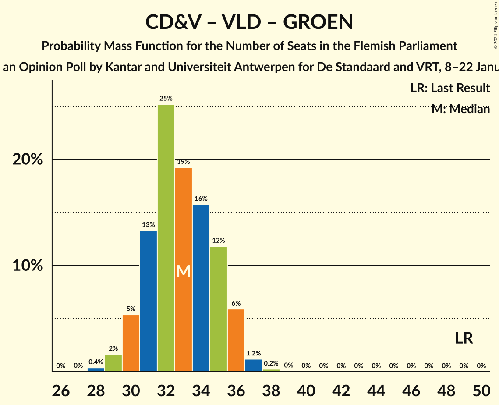

| Number of Seats | Probability | Accumulated | Special Marks |
|:---------------:|:-----------:|:-----------:|:-------------:|
| 28 | 0.3% | 100% |  |
| 29 | 1.2% | 99.6% |  |
| 30 | 6% | 98% |  |
| 31 | 10% | 92% |  |
| 32 | 24% | 82% |  |
| 33 | 18% | 58% | Median |
| 34 | 19% | 40% |  |
| 35 | 13% | 21% |  |
| 36 | 7% | 8% |  |
| 37 | 1.0% | 1.4% |  |
| 38 | 0.3% | 0.3% |  |
| 39 | 0.1% | 0.1% |  |
| 40 | 0% | 0% |  |
| 41 | 0% | 0% |  |
| 42 | 0% | 0% |  |
| 43 | 0% | 0% |  |
| 44 | 0% | 0% |  |
| 45 | 0% | 0% |  |
| 46 | 0% | 0% |  |
| 47 | 0% | 0% |  |
| 48 | 0% | 0% |  |
| 49 | 0% | 0% | Last Result |

### Vooruit – Christen-Democratisch en Vlaams

| Number of Seats | Probability | Accumulated | Special Marks |
|:---------------:|:-----------:|:-----------:|:-------------:|
| 25 | 0.3% | 100% |  |
| 26 | 2% | 99.7% |  |
| 27 | 4% | 98% |  |
| 28 | 9% | 93% |  |
| 29 | 14% | 84% |  |
| 30 | 37% | 70% | Median |
| 31 | 16% | 33% | Last Result |
| 32 | 11% | 17% |  |
| 33 | 5% | 6% |  |
| 34 | 0.5% | 0.7% |  |
| 35 | 0.2% | 0.2% |  |
| 36 | 0% | 0% |  |

### Vooruit – Open Vlaamse Liberalen en Democraten

| Number of Seats | Probability | Accumulated | Special Marks |
|:---------------:|:-----------:|:-----------:|:-------------:|
| 22 | 0.1% | 100% |  |
| 23 | 0.7% | 99.9% |  |
| 24 | 3% | 99.2% |  |
| 25 | 6% | 96% |  |
| 26 | 22% | 89% |  |
| 27 | 25% | 67% | Median |
| 28 | 20% | 42% | Last Result |
| 29 | 10% | 22% |  |
| 30 | 8% | 12% |  |
| 31 | 4% | 4% |  |
| 32 | 0.4% | 0.4% |  |
| 33 | 0% | 0% |  |

### Christen-Democratisch en Vlaams – Open Vlaamse Liberalen en Democraten

| Number of Seats | Probability | Accumulated | Special Marks |
|:---------------:|:-----------:|:-----------:|:-------------:|
| 19 | 1.1% | 100% |  |
| 20 | 5% | 98.9% |  |
| 21 | 11% | 94% |  |
| 22 | 26% | 84% |  |
| 23 | 18% | 58% | Median |
| 24 | 18% | 40% |  |
| 25 | 12% | 22% |  |
| 26 | 9% | 10% |  |
| 27 | 1.0% | 1.2% |  |
| 28 | 0.1% | 0.2% |  |
| 29 | 0% | 0% |  |
| 30 | 0% | 0% |  |
| 31 | 0% | 0% |  |
| 32 | 0% | 0% |  |
| 33 | 0% | 0% |  |
| 34 | 0% | 0% |  |
| 35 | 0% | 0% | Last Result |

## Technical Information

### Opinion Poll

+ **Polling firm:** Kantar and Universiteit Antwerpen
+ **Commissioner(s):** De Standaard and VRT
+ **Fieldwork period:** 8–22 January 2024

### Calculations

+ **Sample size:** 1844
+ **Simulations done:** 1,048,576
+ **Error estimate:** 0.96%

