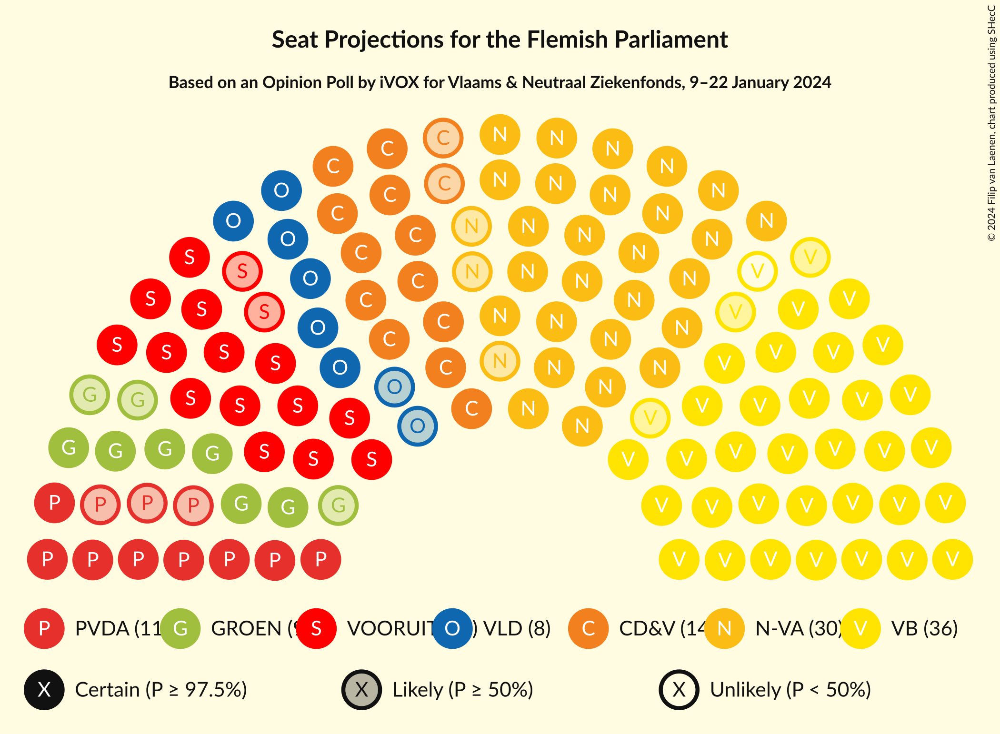
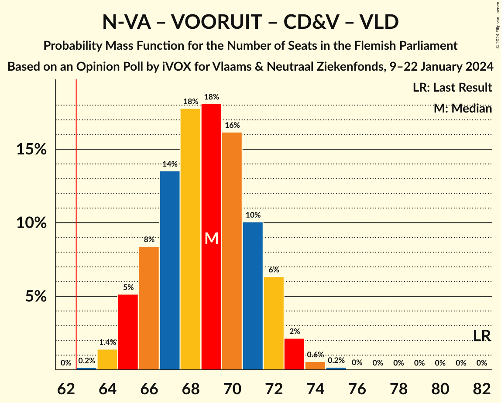
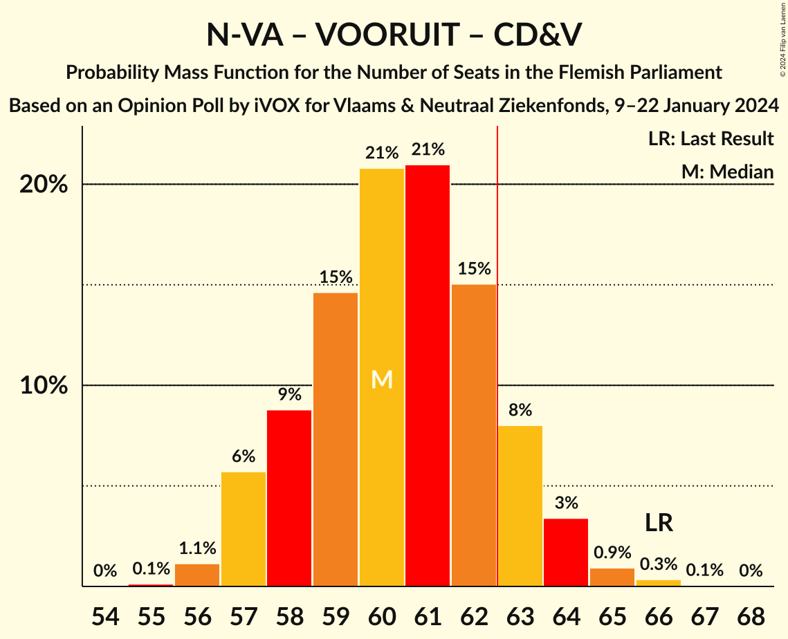
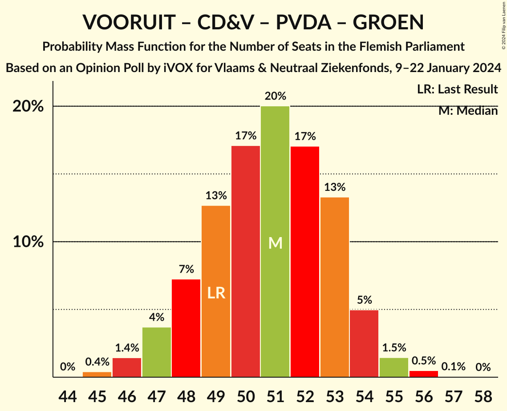

# Opinion Poll by iVOX for Vlaams & Neutraal Ziekenfonds, 9–22 January 2024

<a href="#voting-intentions">Voting Intentions</a> | <a href="#seats">Seats</a> | <a href="#coalitions">Coalitions</a> | <a href="#technical-information">Technical Information</a>

## Voting Intentions

### Confidence Intervals

| Party | Last Result | Poll Result | 80% Confidence Interval | 90% Confidence Interval | 95% Confidence Interval | 99% Confidence Interval |
|:-----:|:-----------:|:-----------:|:-----------------------:|:-----------------------:|:-----------------------:|:-----------------------:|
| Vlaams Belang | 18.5% | 26.6% | 25.4–27.9% |25.0–28.3% |24.7–28.6% |24.1–29.2% |
| Nieuw-Vlaamse Alliantie | 24.8% | 22.7% | 21.5–23.9% |21.2–24.3% |20.9–24.6% |20.4–25.2% |
| Vooruit | 10.1% | 12.8% | 11.9–13.8% |11.6–14.1% |11.4–14.3% |11.0–14.8% |
| Christen-Democratisch en Vlaams | 15.4% | 12.3% | 11.4–13.3% |11.1–13.6% |10.9–13.8% |10.5–14.3% |
| Partij van de Arbeid van België | 5.3% | 9.3% | 8.5–10.2% |8.3–10.4% |8.1–10.7% |7.7–11.1% |
| Open Vlaamse Liberalen en Democraten | 13.1% | 7.6% | 6.9–8.4% |6.7–8.7% |6.5–8.9% |6.2–9.3% |
| Groen | 10.1% | 7.4% | 6.7–8.2% |6.5–8.4% |6.3–8.6% |6.0–9.0% |

*Note:* The poll result column reflects the actual value used in the calculations. Published results may vary slightly, and in addition be rounded to fewer digits.

## Seats

### Confidence Intervals

| Party | Last Result | Median | 80% Confidence Interval | 90% Confidence Interval | 95% Confidence Interval | 99% Confidence Interval |
|:-----:|:-----------:|:------:|:-----------------------:|:-----------------------:|:-----------------------:|:-----------------------:|
| <a href="#vlaams-belang">Vlaams Belang</a> | 23 | 35 | 33–37 |33–38 |32–38 |31–39 |
| <a href="#nieuw-vlaamse-alliantie">Nieuw-Vlaamse Alliantie</a> | 35 | 30 | 28–31 |27–32 |27–33 |26–34 |
| <a href="#vooruit">Vooruit</a> | 12 | 16 | 14–18 |14–18 |14–19 |13–19 |
| <a href="#christen-democratisch-en-vlaams">Christen-Democratisch en Vlaams</a> | 19 | 14 | 13–16 |12–17 |12–17 |12–17 |
| <a href="#partij-van-de-arbeid-van-belgië">Partij van de Arbeid van België</a> | 4 | 11 | 9–13 |9–13 |8–13 |7–14 |
| <a href="#open-vlaamse-liberalen-en-democraten">Open Vlaamse Liberalen en Democraten</a> | 16 | 8 | 7–10 |6–11 |6–11 |5–11 |
| <a href="#groen">Groen</a> | 14 | 9 | 7–11 |7–11 |6–11 |5–11 |

### Vlaams Belang

*For a full overview of the results for this party, see the [Vlaams Belang](party-vlaamsbelang.html) page.*

| Number of Seats | Probability | Accumulated | Special Marks |
|:---------------:|:-----------:|:-----------:|:-------------:|
| 23 | 0% | 100% | Last Result |
| 24 | 0% | 100% |  |
| 25 | 0% | 100% |  |
| 26 | 0% | 100% |  |
| 27 | 0% | 100% |  |
| 28 | 0% | 100% |  |
| 29 | 0% | 100% |  |
| 30 | 0.1% | 100% |  |
| 31 | 0.7% | 99.9% |  |
| 32 | 3% | 99.1% |  |
| 33 | 11% | 96% |  |
| 34 | 22% | 85% |  |
| 35 | 18% | 64% | Median |
| 36 | 30% | 45% |  |
| 37 | 10% | 15% |  |
| 38 | 4% | 5% |  |
| 39 | 1.5% | 2% |  |
| 40 | 0.2% | 0.2% |  |
| 41 | 0% | 0% |  |

### Nieuw-Vlaamse Alliantie

*For a full overview of the results for this party, see the [Nieuw-Vlaamse Alliantie](party-nieuw-vlaamsealliantie.html) page.*

| Number of Seats | Probability | Accumulated | Special Marks |
|:---------------:|:-----------:|:-----------:|:-------------:|
| 26 | 0.8% | 100% |  |
| 27 | 8% | 99.2% |  |
| 28 | 9% | 91% |  |
| 29 | 11% | 82% |  |
| 30 | 42% | 70% | Median |
| 31 | 19% | 28% |  |
| 32 | 6% | 9% |  |
| 33 | 2% | 3% |  |
| 34 | 0.7% | 1.0% |  |
| 35 | 0.2% | 0.3% | Last Result |
| 36 | 0.1% | 0.1% |  |
| 37 | 0% | 0% |  |

### Vooruit

*For a full overview of the results for this party, see the [Vooruit](party-vooruit.html) page.*

| Number of Seats | Probability | Accumulated | Special Marks |
|:---------------:|:-----------:|:-----------:|:-------------:|
| 12 | 0% | 100% | Last Result |
| 13 | 0.6% | 100% |  |
| 14 | 10% | 99.4% |  |
| 15 | 18% | 89% |  |
| 16 | 39% | 71% | Median |
| 17 | 18% | 32% |  |
| 18 | 11% | 14% |  |
| 19 | 2% | 3% |  |
| 20 | 0.3% | 0.4% |  |
| 21 | 0% | 0% |  |

### Christen-Democratisch en Vlaams

*For a full overview of the results for this party, see the [Christen-Democratisch en Vlaams](party-christen-democratischenvlaams.html) page.*

| Number of Seats | Probability | Accumulated | Special Marks |
|:---------------:|:-----------:|:-----------:|:-------------:|
| 11 | 0.5% | 100% |  |
| 12 | 5% | 99.5% |  |
| 13 | 5% | 95% |  |
| 14 | 47% | 90% | Median |
| 15 | 25% | 42% |  |
| 16 | 12% | 18% |  |
| 17 | 6% | 6% |  |
| 18 | 0.2% | 0.2% |  |
| 19 | 0% | 0% | Last Result |

### Partij van de Arbeid van België

*For a full overview of the results for this party, see the [Partij van de Arbeid van België](party-partijvandearbeidvanbelgië.html) page.*

| Number of Seats | Probability | Accumulated | Special Marks |
|:---------------:|:-----------:|:-----------:|:-------------:|
| 4 | 0% | 100% | Last Result |
| 5 | 0% | 100% |  |
| 6 | 0% | 100% |  |
| 7 | 0.6% | 100% |  |
| 8 | 2% | 99.4% |  |
| 9 | 12% | 97% |  |
| 10 | 12% | 86% |  |
| 11 | 30% | 73% | Median |
| 12 | 21% | 43% |  |
| 13 | 21% | 22% |  |
| 14 | 0.7% | 0.7% |  |
| 15 | 0% | 0% |  |

### Open Vlaamse Liberalen en Democraten

*For a full overview of the results for this party, see the [Open Vlaamse Liberalen en Democraten](party-openvlaamseliberalenendemocraten.html) page.*

| Number of Seats | Probability | Accumulated | Special Marks |
|:---------------:|:-----------:|:-----------:|:-------------:|
| 5 | 2% | 100% |  |
| 6 | 4% | 98% |  |
| 7 | 10% | 95% |  |
| 8 | 57% | 84% | Median |
| 9 | 14% | 28% |  |
| 10 | 6% | 14% |  |
| 11 | 8% | 8% |  |
| 12 | 0.2% | 0.2% |  |
| 13 | 0% | 0% |  |
| 14 | 0% | 0% |  |
| 15 | 0% | 0% |  |
| 16 | 0% | 0% | Last Result |

### Groen

*For a full overview of the results for this party, see the [Groen](party-groen.html) page.*

| Number of Seats | Probability | Accumulated | Special Marks |
|:---------------:|:-----------:|:-----------:|:-------------:|
| 5 | 2% | 100% |  |
| 6 | 1.3% | 98% |  |
| 7 | 15% | 97% |  |
| 8 | 21% | 82% |  |
| 9 | 21% | 61% | Median |
| 10 | 21% | 40% |  |
| 11 | 19% | 19% |  |
| 12 | 0.1% | 0.2% |  |
| 13 | 0.1% | 0.1% |  |
| 14 | 0% | 0% | Last Result |

## Coalitions

### Confidence Intervals

| Coalition | Last Result | Median | Majority? | 80% Confidence Interval | 90% Confidence Interval | 95% Confidence Interval | 99% Confidence Interval |
|:---------:|:-----------:|:------:|:---------:|:-----------------------:|:-----------------------:|:-----------------------:|:-----------------------:|
| Vlaams Belang – Nieuw-Vlaamse Alliantie – Christen-Democratisch en Vlaams | 77 | 79 | 100% | 77–82 | 76–83 | 76–83 | 75–84 |
| Nieuw-Vlaamse Alliantie – Vooruit – Christen-Democratisch en Vlaams – Open Vlaamse Liberalen en Democraten | 82 | 69 | 100% | 66–71 | 65–72 | 65–73 | 64–74 |
| Vlaams Belang – Nieuw-Vlaamse Alliantie | 58 | 65 | 93% | 63–67 | 62–68 | 62–69 | 60–70 |
| Nieuw-Vlaamse Alliantie – Vooruit – Christen-Democratisch en Vlaams | 66 | 60 | 13% | 58–63 | 57–63 | 57–64 | 56–65 |
| Nieuw-Vlaamse Alliantie – Vooruit – Open Vlaamse Liberalen en Democraten | 63 | 54 | 0% | 52–57 | 51–58 | 50–58 | 49–59 |
| Nieuw-Vlaamse Alliantie – Christen-Democratisch en Vlaams – Open Vlaamse Liberalen en Democraten | 70 | 53 | 0% | 50–55 | 49–56 | 49–56 | 48–58 |
| Vooruit – Christen-Democratisch en Vlaams – Partij van de Arbeid van België – Groen | 49 | 51 | 0% | 48–53 | 47–54 | 47–54 | 46–56 |
| Vooruit – Christen-Democratisch en Vlaams – Open Vlaamse Liberalen en Democraten – Groen | 61 | 48 | 0% | 46–50 | 45–51 | 44–52 | 43–53 |
| Nieuw-Vlaamse Alliantie – Christen-Democratisch en Vlaams | 54 | 44 | 0% | 42–46 | 41–47 | 41–48 | 40–49 |
| Vooruit – Christen-Democratisch en Vlaams – Groen | 45 | 40 | 0% | 37–42 | 36–43 | 36–43 | 35–44 |
| Vooruit – Christen-Democratisch en Vlaams – Open Vlaamse Liberalen en Democraten | 47 | 39 | 0% | 37–41 | 36–42 | 35–42 | 34–44 |
| Nieuw-Vlaamse Alliantie – Open Vlaamse Liberalen en Democraten | 51 | 38 | 0% | 36–40 | 35–41 | 35–42 | 34–43 |
| Vooruit – Open Vlaamse Liberalen en Democraten – Groen | 42 | 33 | 0% | 31–35 | 30–36 | 30–37 | 29–38 |
| Christen-Democratisch en Vlaams – Open Vlaamse Liberalen en Democraten – Groen | 49 | 32 | 0% | 30–34 | 29–35 | 28–35 | 27–36 |
| Vooruit – Christen-Democratisch en Vlaams | 31 | 31 | 0% | 29–33 | 28–33 | 28–34 | 27–35 |
| Vooruit – Open Vlaamse Liberalen en Democraten | 28 | 24 | 0% | 22–27 | 22–27 | 21–27 | 20–28 |
| Christen-Democratisch en Vlaams – Open Vlaamse Liberalen en Democraten | 35 | 23 | 0% | 21–25 | 20–26 | 20–26 | 19–27 |

### Vlaams Belang – Nieuw-Vlaamse Alliantie – Christen-Democratisch en Vlaams

| Number of Seats | Probability | Accumulated | Special Marks |
|:---------------:|:-----------:|:-----------:|:-------------:|
| 74 | 0.2% | 100% |  |
| 75 | 1.3% | 99.8% |  |
| 76 | 4% | 98.5% |  |
| 77 | 10% | 95% | Last Result |
| 78 | 15% | 85% |  |
| 79 | 23% | 69% | Median |
| 80 | 18% | 46% |  |
| 81 | 14% | 28% |  |
| 82 | 8% | 14% |  |
| 83 | 4% | 6% |  |
| 84 | 1.2% | 2% |  |
| 85 | 0.3% | 0.4% |  |
| 86 | 0.1% | 0.1% |  |
| 87 | 0% | 0% |  |

### Nieuw-Vlaamse Alliantie – Vooruit – Christen-Democratisch en Vlaams – Open Vlaamse Liberalen en Democraten

| Number of Seats | Probability | Accumulated | Special Marks |
|:---------------:|:-----------:|:-----------:|:-------------:|
| 63 | 0.2% | 100% | Majority |
| 64 | 1.4% | 99.8% |  |
| 65 | 5% | 98% |  |
| 66 | 8% | 93% |  |
| 67 | 14% | 85% |  |
| 68 | 18% | 71% | Median |
| 69 | 18% | 54% |  |
| 70 | 16% | 35% |  |
| 71 | 10% | 19% |  |
| 72 | 6% | 9% |  |
| 73 | 2% | 3% |  |
| 74 | 0.6% | 0.8% |  |
| 75 | 0.2% | 0.2% |  |
| 76 | 0% | 0% |  |
| 77 | 0% | 0% |  |
| 78 | 0% | 0% |  |
| 79 | 0% | 0% |  |
| 80 | 0% | 0% |  |
| 81 | 0% | 0% |  |
| 82 | 0% | 0% | Last Result |

### Vlaams Belang – Nieuw-Vlaamse Alliantie

| Number of Seats | Probability | Accumulated | Special Marks |
|:---------------:|:-----------:|:-----------:|:-------------:|
| 58 | 0% | 100% | Last Result |
| 59 | 0.1% | 100% |  |
| 60 | 0.5% | 99.9% |  |
| 61 | 2% | 99.4% |  |
| 62 | 5% | 98% |  |
| 63 | 14% | 93% | Majority |
| 64 | 22% | 79% |  |
| 65 | 22% | 57% | Median |
| 66 | 17% | 36% |  |
| 67 | 11% | 19% |  |
| 68 | 5% | 8% |  |
| 69 | 2% | 3% |  |
| 70 | 0.6% | 0.7% |  |
| 71 | 0.1% | 0.1% |  |
| 72 | 0% | 0% |  |

### Nieuw-Vlaamse Alliantie – Vooruit – Christen-Democratisch en Vlaams

| Number of Seats | Probability | Accumulated | Special Marks |
|:---------------:|:-----------:|:-----------:|:-------------:|
| 55 | 0.1% | 100% |  |
| 56 | 1.1% | 99.9% |  |
| 57 | 6% | 98.7% |  |
| 58 | 9% | 93% |  |
| 59 | 15% | 84% |  |
| 60 | 21% | 70% | Median |
| 61 | 21% | 49% |  |
| 62 | 15% | 28% |  |
| 63 | 8% | 13% | Majority |
| 64 | 3% | 5% |  |
| 65 | 0.9% | 1.4% |  |
| 66 | 0.3% | 0.4% | Last Result |
| 67 | 0.1% | 0.1% |  |
| 68 | 0% | 0% |  |

### Nieuw-Vlaamse Alliantie – Vooruit – Open Vlaamse Liberalen en Democraten

| Number of Seats | Probability | Accumulated | Special Marks |
|:---------------:|:-----------:|:-----------:|:-------------:|
| 48 | 0.1% | 100% |  |
| 49 | 0.4% | 99.9% |  |
| 50 | 2% | 99.5% |  |
| 51 | 6% | 97% |  |
| 52 | 11% | 91% |  |
| 53 | 18% | 80% |  |
| 54 | 21% | 62% | Median |
| 55 | 16% | 42% |  |
| 56 | 13% | 26% |  |
| 57 | 8% | 13% |  |
| 58 | 4% | 5% |  |
| 59 | 1.3% | 2% |  |
| 60 | 0.3% | 0.4% |  |
| 61 | 0.1% | 0.1% |  |
| 62 | 0% | 0% |  |
| 63 | 0% | 0% | Last Result, Majority |

### Nieuw-Vlaamse Alliantie – Christen-Democratisch en Vlaams – Open Vlaamse Liberalen en Democraten

| Number of Seats | Probability | Accumulated | Special Marks |
|:---------------:|:-----------:|:-----------:|:-------------:|
| 47 | 0.2% | 100% |  |
| 48 | 1.1% | 99.7% |  |
| 49 | 6% | 98.7% |  |
| 50 | 7% | 93% |  |
| 51 | 13% | 86% |  |
| 52 | 19% | 72% | Median |
| 53 | 22% | 53% |  |
| 54 | 14% | 31% |  |
| 55 | 10% | 17% |  |
| 56 | 5% | 7% |  |
| 57 | 2% | 2% |  |
| 58 | 0.5% | 0.6% |  |
| 59 | 0.2% | 0.2% |  |
| 60 | 0% | 0% |  |
| 61 | 0% | 0% |  |
| 62 | 0% | 0% |  |
| 63 | 0% | 0% | Majority |
| 64 | 0% | 0% |  |
| 65 | 0% | 0% |  |
| 66 | 0% | 0% |  |
| 67 | 0% | 0% |  |
| 68 | 0% | 0% |  |
| 69 | 0% | 0% |  |
| 70 | 0% | 0% | Last Result |

### Vooruit – Christen-Democratisch en Vlaams – Partij van de Arbeid van België – Groen

| Number of Seats | Probability | Accumulated | Special Marks |
|:---------------:|:-----------:|:-----------:|:-------------:|
| 44 | 0% | 100% |  |
| 45 | 0.4% | 99.9% |  |
| 46 | 1.4% | 99.5% |  |
| 47 | 4% | 98% |  |
| 48 | 7% | 94% |  |
| 49 | 13% | 87% | Last Result |
| 50 | 17% | 74% | Median |
| 51 | 20% | 57% |  |
| 52 | 17% | 37% |  |
| 53 | 13% | 20% |  |
| 54 | 5% | 7% |  |
| 55 | 1.5% | 2% |  |
| 56 | 0.5% | 0.6% |  |
| 57 | 0.1% | 0.1% |  |
| 58 | 0% | 0% |  |

### Vooruit – Christen-Democratisch en Vlaams – Open Vlaamse Liberalen en Democraten – Groen

| Number of Seats | Probability | Accumulated | Special Marks |
|:---------------:|:-----------:|:-----------:|:-------------:|
| 41 | 0% | 100% |  |
| 42 | 0.2% | 99.9% |  |
| 43 | 0.7% | 99.7% |  |
| 44 | 2% | 99.0% |  |
| 45 | 5% | 97% |  |
| 46 | 11% | 92% |  |
| 47 | 24% | 80% | Median |
| 48 | 22% | 56% |  |
| 49 | 17% | 34% |  |
| 50 | 11% | 17% |  |
| 51 | 4% | 7% |  |
| 52 | 2% | 3% |  |
| 53 | 0.6% | 0.7% |  |
| 54 | 0.1% | 0.1% |  |
| 55 | 0% | 0% |  |
| 56 | 0% | 0% |  |
| 57 | 0% | 0% |  |
| 58 | 0% | 0% |  |
| 59 | 0% | 0% |  |
| 60 | 0% | 0% |  |
| 61 | 0% | 0% | Last Result |

### Nieuw-Vlaamse Alliantie – Christen-Democratisch en Vlaams

| Number of Seats | Probability | Accumulated | Special Marks |
|:---------------:|:-----------:|:-----------:|:-------------:|
| 39 | 0.3% | 100% |  |
| 40 | 0.8% | 99.7% |  |
| 41 | 6% | 98.9% |  |
| 42 | 8% | 93% |  |
| 43 | 12% | 85% |  |
| 44 | 23% | 72% | Median |
| 45 | 26% | 49% |  |
| 46 | 14% | 23% |  |
| 47 | 6% | 9% |  |
| 48 | 2% | 3% |  |
| 49 | 0.5% | 0.8% |  |
| 50 | 0.2% | 0.2% |  |
| 51 | 0% | 0.1% |  |
| 52 | 0% | 0% |  |
| 53 | 0% | 0% |  |
| 54 | 0% | 0% | Last Result |

### Vooruit – Christen-Democratisch en Vlaams – Groen

| Number of Seats | Probability | Accumulated | Special Marks |
|:---------------:|:-----------:|:-----------:|:-------------:|
| 33 | 0.1% | 100% |  |
| 34 | 0.3% | 99.9% |  |
| 35 | 1.1% | 99.6% |  |
| 36 | 4% | 98.5% |  |
| 37 | 7% | 94% |  |
| 38 | 13% | 87% |  |
| 39 | 22% | 74% | Median |
| 40 | 20% | 52% |  |
| 41 | 17% | 31% |  |
| 42 | 9% | 14% |  |
| 43 | 4% | 5% |  |
| 44 | 1.2% | 1.4% |  |
| 45 | 0.2% | 0.2% | Last Result |
| 46 | 0% | 0% |  |

### Vooruit – Christen-Democratisch en Vlaams – Open Vlaamse Liberalen en Democraten

| Number of Seats | Probability | Accumulated | Special Marks |
|:---------------:|:-----------:|:-----------:|:-------------:|
| 33 | 0.1% | 100% |  |
| 34 | 0.6% | 99.9% |  |
| 35 | 3% | 99.3% |  |
| 36 | 6% | 97% |  |
| 37 | 13% | 90% |  |
| 38 | 20% | 77% | Median |
| 39 | 20% | 56% |  |
| 40 | 17% | 37% |  |
| 41 | 11% | 20% |  |
| 42 | 6% | 8% |  |
| 43 | 2% | 2% |  |
| 44 | 0.4% | 0.6% |  |
| 45 | 0.2% | 0.2% |  |
| 46 | 0% | 0% |  |
| 47 | 0% | 0% | Last Result |

### Nieuw-Vlaamse Alliantie – Open Vlaamse Liberalen en Democraten

| Number of Seats | Probability | Accumulated | Special Marks |
|:---------------:|:-----------:|:-----------:|:-------------:|
| 33 | 0.1% | 100% |  |
| 34 | 1.4% | 99.8% |  |
| 35 | 8% | 98% |  |
| 36 | 7% | 90% |  |
| 37 | 15% | 83% |  |
| 38 | 31% | 68% | Median |
| 39 | 19% | 38% |  |
| 40 | 9% | 19% |  |
| 41 | 5% | 9% |  |
| 42 | 3% | 4% |  |
| 43 | 0.9% | 1.1% |  |
| 44 | 0.2% | 0.2% |  |
| 45 | 0% | 0% |  |
| 46 | 0% | 0% |  |
| 47 | 0% | 0% |  |
| 48 | 0% | 0% |  |
| 49 | 0% | 0% |  |
| 50 | 0% | 0% |  |
| 51 | 0% | 0% | Last Result |

### Vooruit – Open Vlaamse Liberalen en Democraten – Groen

| Number of Seats | Probability | Accumulated | Special Marks |
|:---------------:|:-----------:|:-----------:|:-------------:|
| 27 | 0.1% | 100% |  |
| 28 | 0.3% | 99.9% |  |
| 29 | 1.2% | 99.6% |  |
| 30 | 4% | 98% |  |
| 31 | 8% | 95% |  |
| 32 | 17% | 86% |  |
| 33 | 24% | 70% | Median |
| 34 | 20% | 46% |  |
| 35 | 16% | 26% |  |
| 36 | 6% | 10% |  |
| 37 | 2% | 3% |  |
| 38 | 0.8% | 1.0% |  |
| 39 | 0.2% | 0.2% |  |
| 40 | 0% | 0% |  |
| 41 | 0% | 0% |  |
| 42 | 0% | 0% | Last Result |

### Christen-Democratisch en Vlaams – Open Vlaamse Liberalen en Democraten – Groen

| Number of Seats | Probability | Accumulated | Special Marks |
|:---------------:|:-----------:|:-----------:|:-------------:|
| 25 | 0.1% | 100% |  |
| 26 | 0.2% | 99.9% |  |
| 27 | 0.6% | 99.7% |  |
| 28 | 2% | 99.2% |  |
| 29 | 5% | 97% |  |
| 30 | 13% | 92% |  |
| 31 | 22% | 79% | Median |
| 32 | 25% | 58% |  |
| 33 | 20% | 32% |  |
| 34 | 7% | 12% |  |
| 35 | 3% | 5% |  |
| 36 | 2% | 2% |  |
| 37 | 0.4% | 0.5% |  |
| 38 | 0.1% | 0.1% |  |
| 39 | 0% | 0% |  |
| 40 | 0% | 0% |  |
| 41 | 0% | 0% |  |
| 42 | 0% | 0% |  |
| 43 | 0% | 0% |  |
| 44 | 0% | 0% |  |
| 45 | 0% | 0% |  |
| 46 | 0% | 0% |  |
| 47 | 0% | 0% |  |
| 48 | 0% | 0% |  |
| 49 | 0% | 0% | Last Result |

### Vooruit – Christen-Democratisch en Vlaams

| Number of Seats | Probability | Accumulated | Special Marks |
|:---------------:|:-----------:|:-----------:|:-------------:|
| 26 | 0.4% | 100% |  |
| 27 | 2% | 99.6% |  |
| 28 | 5% | 98% |  |
| 29 | 15% | 93% |  |
| 30 | 27% | 78% | Median |
| 31 | 24% | 50% | Last Result |
| 32 | 15% | 26% |  |
| 33 | 7% | 11% |  |
| 34 | 3% | 3% |  |
| 35 | 0.6% | 0.7% |  |
| 36 | 0.1% | 0.1% |  |
| 37 | 0% | 0% |  |

### Vooruit – Open Vlaamse Liberalen en Democraten

| Number of Seats | Probability | Accumulated | Special Marks |
|:---------------:|:-----------:|:-----------:|:-------------:|
| 19 | 0.1% | 100% |  |
| 20 | 0.7% | 99.9% |  |
| 21 | 3% | 99.2% |  |
| 22 | 9% | 96% |  |
| 23 | 16% | 87% |  |
| 24 | 26% | 70% | Median |
| 25 | 19% | 44% |  |
| 26 | 14% | 25% |  |
| 27 | 9% | 11% |  |
| 28 | 2% | 2% | Last Result |
| 29 | 0.4% | 0.5% |  |
| 30 | 0.1% | 0.1% |  |
| 31 | 0% | 0% |  |

### Christen-Democratisch en Vlaams – Open Vlaamse Liberalen en Democraten

| Number of Seats | Probability | Accumulated | Special Marks |
|:---------------:|:-----------:|:-----------:|:-------------:|
| 18 | 0.2% | 100% |  |
| 19 | 1.5% | 99.8% |  |
| 20 | 6% | 98% |  |
| 21 | 10% | 93% |  |
| 22 | 32% | 83% | Median |
| 23 | 21% | 51% |  |
| 24 | 13% | 30% |  |
| 25 | 11% | 17% |  |
| 26 | 5% | 6% |  |
| 27 | 0.9% | 1.2% |  |
| 28 | 0.2% | 0.2% |  |
| 29 | 0% | 0% |  |
| 30 | 0% | 0% |  |
| 31 | 0% | 0% |  |
| 32 | 0% | 0% |  |
| 33 | 0% | 0% |  |
| 34 | 0% | 0% |  |
| 35 | 0% | 0% | Last Result |

## Technical Information

### Opinion Poll

+ **Polling firm:** iVOX
+ **Commissioner(s):** Vlaams & Neutraal Ziekenfonds
+ **Fieldwork period:** 9–22 January 2024

### Calculations

+ **Sample size:** 2000
+ **Simulations done:** 2,097,152
+ **Error estimate:** 0.56%

