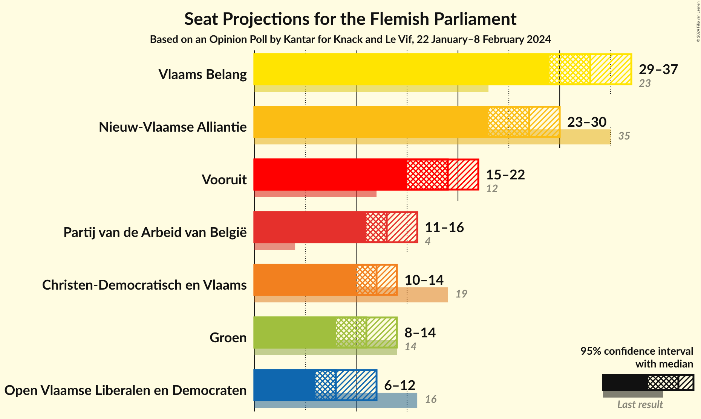
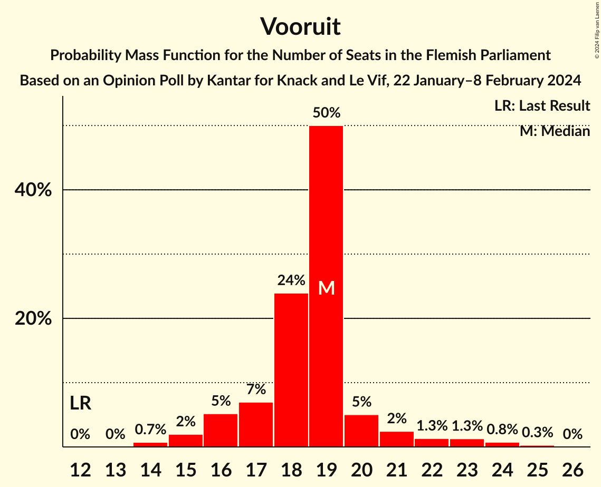
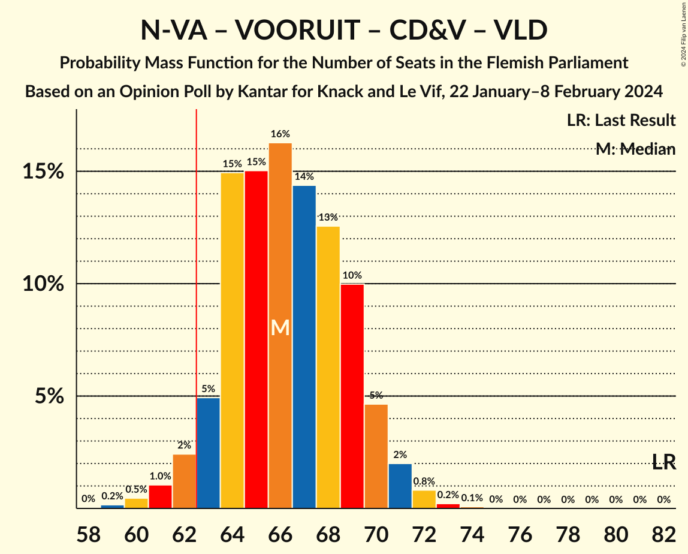
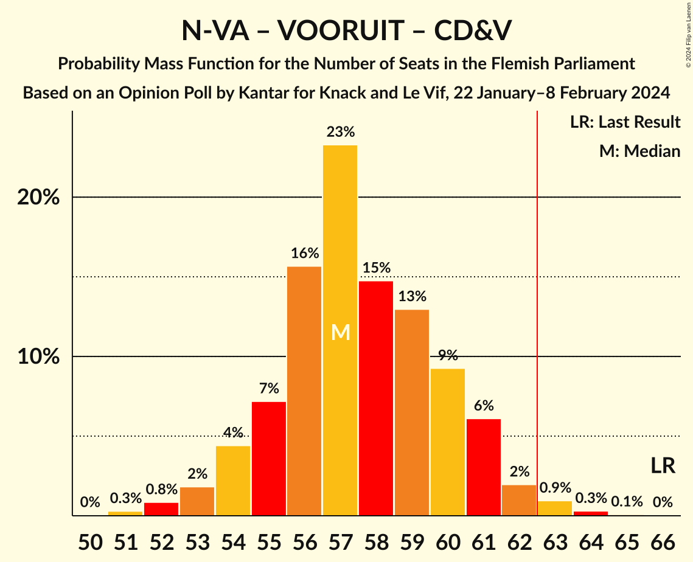
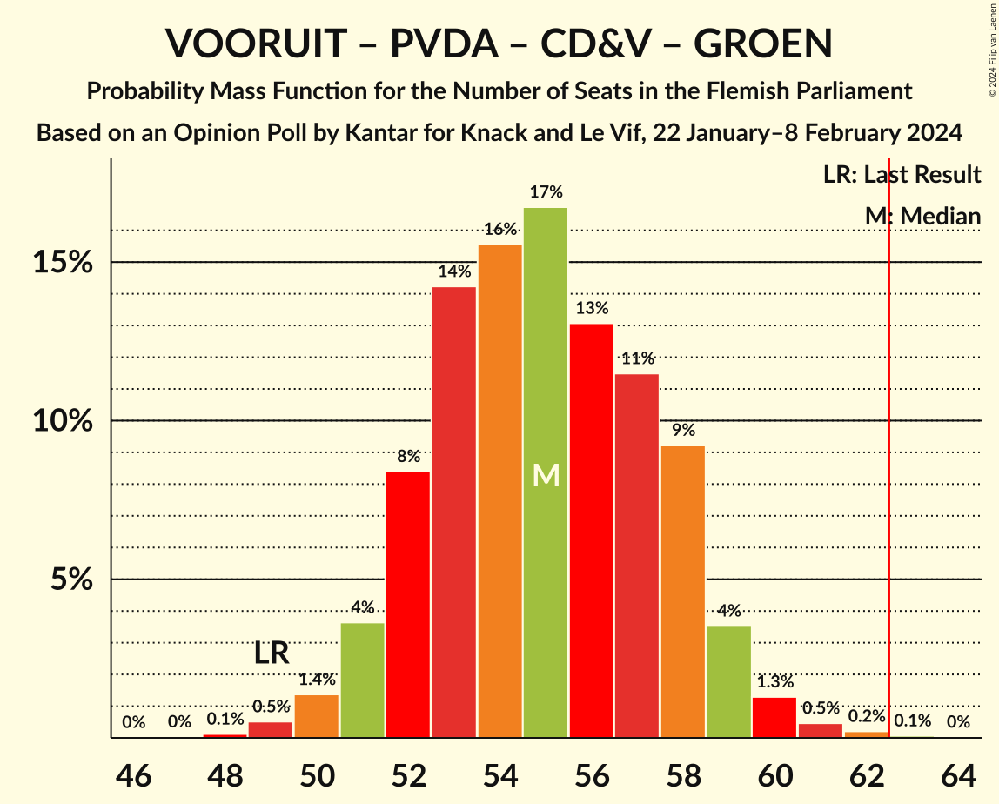
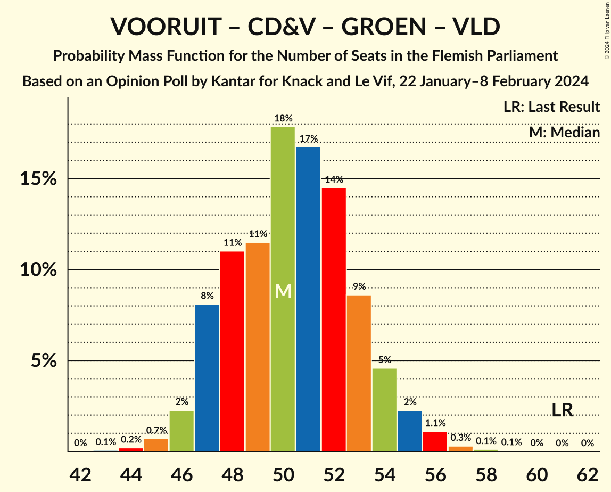
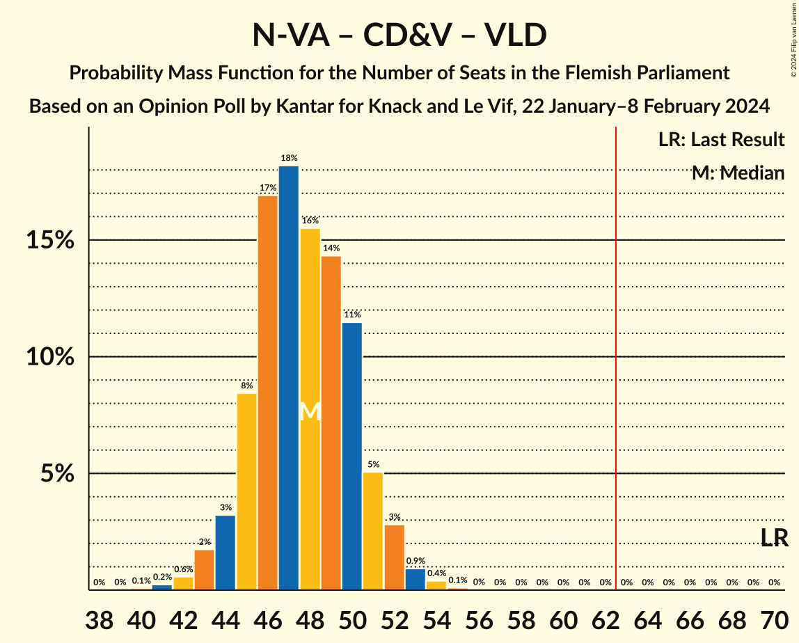
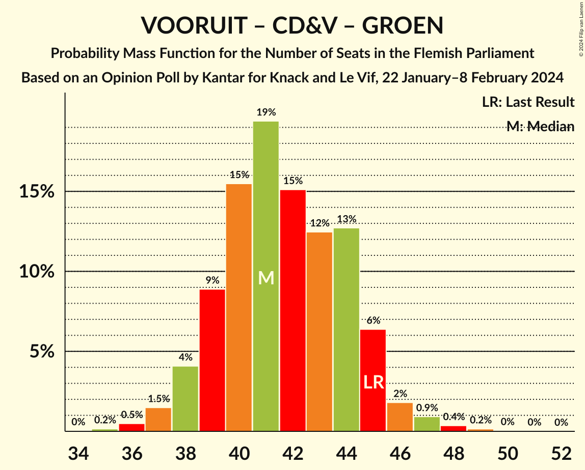
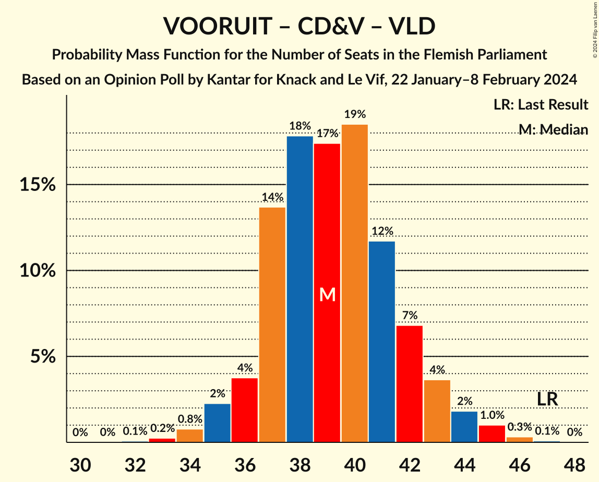
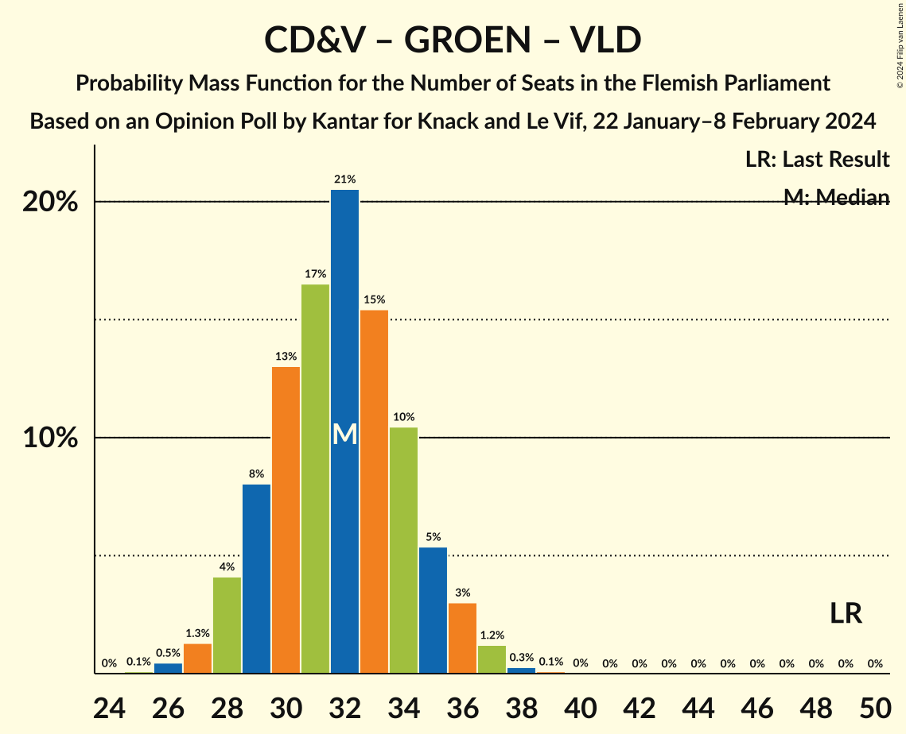

# Opinion Poll by Kantar for Knack and Le Vif, 22 January–8 February 2024

<a href="#voting-intentions">Voting Intentions</a> | <a href="#seats">Seats</a> | <a href="#coalitions">Coalitions</a> | <a href="#technical-information">Technical Information</a>

## Voting Intentions

### Confidence Intervals

| Party | Last Result | Poll Result | 80% Confidence Interval | 90% Confidence Interval | 95% Confidence Interval | 99% Confidence Interval |
|:-----:|:-----------:|:-----------:|:-----------------------:|:-----------------------:|:-----------------------:|:-----------------------:|
| Vlaams Belang | 18.5% | 25.5% | 23.9–27.3% |23.4–27.8% |23.0–28.2% |22.2–29.1% |
| Nieuw-Vlaamse Alliantie | 24.8% | 20.6% | 19.1–22.3% |18.7–22.7% |18.3–23.1% |17.6–23.9% |
| Vooruit | 10.1% | 14.7% | 13.4–16.1% |13.0–16.6% |12.7–16.9% |12.1–17.6% |
| Partij van de Arbeid van België | 5.3% | 10.9% | 9.7–12.2% |9.4–12.5% |9.1–12.9% |8.6–13.5% |
| Christen-Democratisch en Vlaams | 15.4% | 10.5% | 9.4–11.8% |9.1–12.1% |8.8–12.5% |8.3–13.1% |
| Groen | 10.1% | 8.7% | 7.7–9.9% |7.4–10.3% |7.2–10.6% |6.7–11.2% |
| Open Vlaamse Liberalen en Democraten | 13.1% | 8.0% | 7.0–9.1% |6.7–9.5% |6.5–9.8% |6.1–10.3% |

*Note:* The poll result column reflects the actual value used in the calculations. Published results may vary slightly, and in addition be rounded to fewer digits.

## Seats

### Confidence Intervals

| Party | Last Result | Median | 80% Confidence Interval | 90% Confidence Interval | 95% Confidence Interval | 99% Confidence Interval |
|:-----:|:-----------:|:------:|:-----------------------:|:-----------------------:|:-----------------------:|:-----------------------:|
| <a href="#vlaams-belang">Vlaams Belang</a> | 23 | 33 | 31–36 |30–37 |29–37 |28–38 |
| <a href="#nieuw-vlaamse-alliantie">Nieuw-Vlaamse Alliantie</a> | 35 | 27 | 25–30 |24–30 |23–30 |22–31 |
| <a href="#vooruit">Vooruit</a> | 12 | 19 | 17–20 |16–21 |15–22 |14–24 |
| <a href="#partij-van-de-arbeid-van-belgië">Partij van de Arbeid van België</a> | 4 | 13 | 12–14 |11–15 |11–16 |9–18 |
| <a href="#christen-democratisch-en-vlaams">Christen-Democratisch en Vlaams</a> | 19 | 12 | 11–14 |11–14 |10–14 |9–15 |
| <a href="#groen">Groen</a> | 14 | 11 | 9–13 |9–14 |8–14 |7–14 |
| <a href="#open-vlaamse-liberalen-en-democraten">Open Vlaamse Liberalen en Democraten</a> | 16 | 8 | 7–11 |7–11 |6–12 |4–12 |

### Vlaams Belang

*For a full overview of the results for this party, see the [Vlaams Belang](party-vlaamsbelang.html) page.*

| Number of Seats | Probability | Accumulated | Special Marks |
|:---------------:|:-----------:|:-----------:|:-------------:|
| 23 | 0% | 100% | Last Result |
| 24 | 0% | 100% |  |
| 25 | 0% | 100% |  |
| 26 | 0% | 100% |  |
| 27 | 0.2% | 100% |  |
| 28 | 0.4% | 99.8% |  |
| 29 | 3% | 99.5% |  |
| 30 | 6% | 97% |  |
| 31 | 14% | 90% |  |
| 32 | 15% | 76% |  |
| 33 | 14% | 61% | Median |
| 34 | 15% | 48% |  |
| 35 | 13% | 32% |  |
| 36 | 12% | 19% |  |
| 37 | 6% | 7% |  |
| 38 | 1.0% | 1.1% |  |
| 39 | 0.1% | 0.2% |  |
| 40 | 0% | 0.1% |  |
| 41 | 0% | 0% |  |

### Nieuw-Vlaamse Alliantie

*For a full overview of the results for this party, see the [Nieuw-Vlaamse Alliantie](party-nieuw-vlaamsealliantie.html) page.*

| Number of Seats | Probability | Accumulated | Special Marks |
|:---------------:|:-----------:|:-----------:|:-------------:|
| 21 | 0.2% | 100% |  |
| 22 | 1.0% | 99.8% |  |
| 23 | 2% | 98.9% |  |
| 24 | 4% | 97% |  |
| 25 | 9% | 93% |  |
| 26 | 18% | 84% |  |
| 27 | 35% | 66% | Median |
| 28 | 13% | 31% |  |
| 29 | 7% | 19% |  |
| 30 | 11% | 12% |  |
| 31 | 0.8% | 1.0% |  |
| 32 | 0.2% | 0.3% |  |
| 33 | 0.1% | 0.1% |  |
| 34 | 0% | 0% |  |
| 35 | 0% | 0% | Last Result |

### Vooruit

*For a full overview of the results for this party, see the [Vooruit](party-vooruit.html) page.*

| Number of Seats | Probability | Accumulated | Special Marks |
|:---------------:|:-----------:|:-----------:|:-------------:|
| 12 | 0% | 100% | Last Result |
| 13 | 0% | 100% |  |
| 14 | 0.7% | 100% |  |
| 15 | 2% | 99.3% |  |
| 16 | 5% | 97% |  |
| 17 | 7% | 92% |  |
| 18 | 24% | 85% |  |
| 19 | 50% | 61% | Median |
| 20 | 5% | 11% |  |
| 21 | 2% | 6% |  |
| 22 | 1.3% | 4% |  |
| 23 | 1.3% | 2% |  |
| 24 | 0.8% | 1.0% |  |
| 25 | 0.3% | 0.3% |  |
| 26 | 0% | 0% |  |

### Partij van de Arbeid van België

*For a full overview of the results for this party, see the [Partij van de Arbeid van België](party-partijvandearbeidvanbelgië.html) page.*

| Number of Seats | Probability | Accumulated | Special Marks |
|:---------------:|:-----------:|:-----------:|:-------------:|
| 4 | 0% | 100% | Last Result |
| 5 | 0% | 100% |  |
| 6 | 0% | 100% |  |
| 7 | 0% | 100% |  |
| 8 | 0.3% | 100% |  |
| 9 | 0.4% | 99.7% |  |
| 10 | 1.4% | 99.3% |  |
| 11 | 5% | 98% |  |
| 12 | 16% | 93% |  |
| 13 | 30% | 77% | Median |
| 14 | 39% | 46% |  |
| 15 | 3% | 7% |  |
| 16 | 2% | 4% |  |
| 17 | 1.4% | 2% |  |
| 18 | 0.8% | 0.8% |  |
| 19 | 0% | 0% |  |

### Christen-Democratisch en Vlaams

*For a full overview of the results for this party, see the [Christen-Democratisch en Vlaams](party-christen-democratischenvlaams.html) page.*

| Number of Seats | Probability | Accumulated | Special Marks |
|:---------------:|:-----------:|:-----------:|:-------------:|
| 8 | 0% | 100% |  |
| 9 | 2% | 99.9% |  |
| 10 | 2% | 98% |  |
| 11 | 42% | 96% |  |
| 12 | 29% | 54% | Median |
| 13 | 7% | 25% |  |
| 14 | 17% | 18% |  |
| 15 | 0.7% | 1.1% |  |
| 16 | 0.2% | 0.4% |  |
| 17 | 0.2% | 0.2% |  |
| 18 | 0% | 0% |  |
| 19 | 0% | 0% | Last Result |

### Groen

*For a full overview of the results for this party, see the [Groen](party-groen.html) page.*

| Number of Seats | Probability | Accumulated | Special Marks |
|:---------------:|:-----------:|:-----------:|:-------------:|
| 6 | 0.1% | 100% |  |
| 7 | 2% | 99.9% |  |
| 8 | 2% | 98% |  |
| 9 | 6% | 96% |  |
| 10 | 17% | 90% |  |
| 11 | 44% | 73% | Median |
| 12 | 8% | 29% |  |
| 13 | 12% | 21% |  |
| 14 | 9% | 9% | Last Result |
| 15 | 0.4% | 0.4% |  |
| 16 | 0% | 0.1% |  |
| 17 | 0% | 0% |  |

### Open Vlaamse Liberalen en Democraten

*For a full overview of the results for this party, see the [Open Vlaamse Liberalen en Democraten](party-openvlaamseliberalenendemocraten.html) page.*

| Number of Seats | Probability | Accumulated | Special Marks |
|:---------------:|:-----------:|:-----------:|:-------------:|
| 4 | 0.5% | 100% |  |
| 5 | 0.6% | 99.4% |  |
| 6 | 3% | 98.8% |  |
| 7 | 10% | 96% |  |
| 8 | 43% | 87% | Median |
| 9 | 14% | 43% |  |
| 10 | 16% | 29% |  |
| 11 | 8% | 13% |  |
| 12 | 5% | 5% |  |
| 13 | 0.2% | 0.3% |  |
| 14 | 0.1% | 0.1% |  |
| 15 | 0% | 0% |  |
| 16 | 0% | 0% | Last Result |

## Coalitions

### Confidence Intervals

| Coalition | Last Result | Median | Majority? | 80% Confidence Interval | 90% Confidence Interval | 95% Confidence Interval | 99% Confidence Interval |
|:---------:|:-----------:|:------:|:---------:|:-----------------------:|:-----------------------:|:-----------------------:|:-----------------------:|
| Vlaams Belang – Nieuw-Vlaamse Alliantie – Christen-Democratisch en Vlaams | 77 | 72 | 100% | 69–75 | 68–76 | 68–76 | 66–78 |
| Nieuw-Vlaamse Alliantie – Vooruit – Christen-Democratisch en Vlaams – Open Vlaamse Liberalen en Democraten | 82 | 66 | 96% | 64–69 | 63–70 | 62–71 | 60–72 |
| Vlaams Belang – Nieuw-Vlaamse Alliantie | 58 | 60 | 20% | 57–63 | 56–64 | 56–64 | 54–66 |
| Nieuw-Vlaamse Alliantie – Vooruit – Christen-Democratisch en Vlaams | 66 | 57 | 1.4% | 55–60 | 54–61 | 53–62 | 52–63 |
| Vooruit – Partij van de Arbeid van België – Christen-Democratisch en Vlaams – Groen | 49 | 55 | 0.1% | 52–58 | 51–59 | 51–59 | 49–61 |
| Nieuw-Vlaamse Alliantie – Vooruit – Open Vlaamse Liberalen en Democraten | 63 | 54 | 0% | 52–57 | 51–58 | 50–59 | 48–60 |
| Vooruit – Christen-Democratisch en Vlaams – Groen – Open Vlaamse Liberalen en Democraten | 61 | 50 | 0% | 47–53 | 47–54 | 46–55 | 45–56 |
| Nieuw-Vlaamse Alliantie – Christen-Democratisch en Vlaams – Open Vlaamse Liberalen en Democraten | 70 | 48 | 0% | 45–50 | 44–51 | 43–52 | 42–54 |
| Vooruit – Christen-Democratisch en Vlaams – Groen | 45 | 41 | 0% | 39–44 | 38–45 | 38–46 | 36–48 |
| Vooruit – Christen-Democratisch en Vlaams – Open Vlaamse Liberalen en Democraten | 47 | 39 | 0% | 37–42 | 36–43 | 35–44 | 34–45 |
| Nieuw-Vlaamse Alliantie – Christen-Democratisch en Vlaams | 54 | 39 | 0% | 37–42 | 36–42 | 35–43 | 33–44 |
| Vooruit – Groen – Open Vlaamse Liberalen en Democraten | 42 | 38 | 0% | 36–41 | 35–42 | 34–43 | 33–44 |
| Nieuw-Vlaamse Alliantie – Open Vlaamse Liberalen en Democraten | 51 | 36 | 0% | 33–38 | 33–39 | 32–40 | 30–41 |
| Christen-Democratisch en Vlaams – Groen – Open Vlaamse Liberalen en Democraten | 49 | 32 | 0% | 29–34 | 28–35 | 28–36 | 26–37 |
| Vooruit – Christen-Democratisch en Vlaams | 31 | 30 | 0% | 29–33 | 28–34 | 27–35 | 26–36 |
| Vooruit – Open Vlaamse Liberalen en Democraten | 28 | 27 | 0% | 25–30 | 24–31 | 23–31 | 22–33 |
| Christen-Democratisch en Vlaams – Open Vlaamse Liberalen en Democraten | 35 | 21 | 0% | 19–23 | 18–24 | 17–25 | 16–26 |

### Vlaams Belang – Nieuw-Vlaamse Alliantie – Christen-Democratisch en Vlaams

| Number of Seats | Probability | Accumulated | Special Marks |
|:---------------:|:-----------:|:-----------:|:-------------:|
| 64 | 0% | 100% |  |
| 65 | 0.1% | 99.9% |  |
| 66 | 0.5% | 99.8% |  |
| 67 | 1.1% | 99.3% |  |
| 68 | 4% | 98% |  |
| 69 | 7% | 95% |  |
| 70 | 10% | 88% |  |
| 71 | 14% | 78% |  |
| 72 | 17% | 64% | Median |
| 73 | 16% | 47% |  |
| 74 | 14% | 31% |  |
| 75 | 11% | 17% |  |
| 76 | 4% | 6% |  |
| 77 | 1.3% | 2% | Last Result |
| 78 | 0.5% | 0.7% |  |
| 79 | 0.2% | 0.2% |  |
| 80 | 0% | 0.1% |  |
| 81 | 0% | 0% |  |

### Nieuw-Vlaamse Alliantie – Vooruit – Christen-Democratisch en Vlaams – Open Vlaamse Liberalen en Democraten

| Number of Seats | Probability | Accumulated | Special Marks |
|:---------------:|:-----------:|:-----------:|:-------------:|
| 59 | 0.2% | 100% |  |
| 60 | 0.5% | 99.8% |  |
| 61 | 1.0% | 99.3% |  |
| 62 | 2% | 98% |  |
| 63 | 5% | 96% | Majority |
| 64 | 15% | 91% |  |
| 65 | 15% | 76% |  |
| 66 | 16% | 61% | Median |
| 67 | 14% | 45% |  |
| 68 | 13% | 30% |  |
| 69 | 10% | 18% |  |
| 70 | 5% | 8% |  |
| 71 | 2% | 3% |  |
| 72 | 0.8% | 1.1% |  |
| 73 | 0.2% | 0.3% |  |
| 74 | 0.1% | 0.1% |  |
| 75 | 0% | 0% |  |
| 76 | 0% | 0% |  |
| 77 | 0% | 0% |  |
| 78 | 0% | 0% |  |
| 79 | 0% | 0% |  |
| 80 | 0% | 0% |  |
| 81 | 0% | 0% |  |
| 82 | 0% | 0% | Last Result |

### Vlaams Belang – Nieuw-Vlaamse Alliantie

| Number of Seats | Probability | Accumulated | Special Marks |
|:---------------:|:-----------:|:-----------:|:-------------:|
| 52 | 0.1% | 100% |  |
| 53 | 0.1% | 99.9% |  |
| 54 | 0.5% | 99.8% |  |
| 55 | 1.4% | 99.3% |  |
| 56 | 3% | 98% |  |
| 57 | 6% | 95% |  |
| 58 | 11% | 89% | Last Result |
| 59 | 13% | 78% |  |
| 60 | 17% | 65% | Median |
| 61 | 17% | 47% |  |
| 62 | 11% | 31% |  |
| 63 | 10% | 20% | Majority |
| 64 | 7% | 9% |  |
| 65 | 2% | 2% |  |
| 66 | 0.4% | 0.7% |  |
| 67 | 0.2% | 0.2% |  |
| 68 | 0% | 0.1% |  |
| 69 | 0% | 0% |  |

### Nieuw-Vlaamse Alliantie – Vooruit – Christen-Democratisch en Vlaams

| Number of Seats | Probability | Accumulated | Special Marks |
|:---------------:|:-----------:|:-----------:|:-------------:|
| 50 | 0% | 100% |  |
| 51 | 0.3% | 99.9% |  |
| 52 | 0.8% | 99.6% |  |
| 53 | 2% | 98.8% |  |
| 54 | 4% | 97% |  |
| 55 | 7% | 93% |  |
| 56 | 16% | 85% |  |
| 57 | 23% | 70% |  |
| 58 | 15% | 46% | Median |
| 59 | 13% | 32% |  |
| 60 | 9% | 19% |  |
| 61 | 6% | 9% |  |
| 62 | 2% | 3% |  |
| 63 | 0.9% | 1.4% | Majority |
| 64 | 0.3% | 0.4% |  |
| 65 | 0.1% | 0.1% |  |
| 66 | 0% | 0% | Last Result |

### Vooruit – Partij van de Arbeid van België – Christen-Democratisch en Vlaams – Groen

| Number of Seats | Probability | Accumulated | Special Marks |
|:---------------:|:-----------:|:-----------:|:-------------:|
| 47 | 0% | 100% |  |
| 48 | 0.1% | 99.9% |  |
| 49 | 0.5% | 99.8% | Last Result |
| 50 | 1.4% | 99.3% |  |
| 51 | 4% | 98% |  |
| 52 | 8% | 94% |  |
| 53 | 14% | 86% |  |
| 54 | 16% | 72% |  |
| 55 | 17% | 56% | Median |
| 56 | 13% | 39% |  |
| 57 | 11% | 26% |  |
| 58 | 9% | 15% |  |
| 59 | 4% | 6% |  |
| 60 | 1.3% | 2% |  |
| 61 | 0.5% | 0.8% |  |
| 62 | 0.2% | 0.3% |  |
| 63 | 0.1% | 0.1% | Majority |
| 64 | 0% | 0% |  |

### Nieuw-Vlaamse Alliantie – Vooruit – Open Vlaamse Liberalen en Democraten

| Number of Seats | Probability | Accumulated | Special Marks |
|:---------------:|:-----------:|:-----------:|:-------------:|
| 47 | 0.1% | 100% |  |
| 48 | 0.5% | 99.8% |  |
| 49 | 1.0% | 99.3% |  |
| 50 | 2% | 98% |  |
| 51 | 5% | 96% |  |
| 52 | 12% | 91% |  |
| 53 | 17% | 79% |  |
| 54 | 18% | 62% | Median |
| 55 | 13% | 44% |  |
| 56 | 14% | 31% |  |
| 57 | 9% | 17% |  |
| 58 | 4% | 9% |  |
| 59 | 3% | 4% |  |
| 60 | 0.9% | 1.3% |  |
| 61 | 0.3% | 0.4% |  |
| 62 | 0.1% | 0.1% |  |
| 63 | 0% | 0% | Last Result, Majority |

### Vooruit – Christen-Democratisch en Vlaams – Groen – Open Vlaamse Liberalen en Democraten

| Number of Seats | Probability | Accumulated | Special Marks |
|:---------------:|:-----------:|:-----------:|:-------------:|
| 43 | 0.1% | 100% |  |
| 44 | 0.2% | 99.9% |  |
| 45 | 0.7% | 99.7% |  |
| 46 | 2% | 99.0% |  |
| 47 | 8% | 97% |  |
| 48 | 11% | 89% |  |
| 49 | 11% | 78% |  |
| 50 | 18% | 66% | Median |
| 51 | 17% | 48% |  |
| 52 | 14% | 32% |  |
| 53 | 9% | 17% |  |
| 54 | 5% | 8% |  |
| 55 | 2% | 4% |  |
| 56 | 1.1% | 2% |  |
| 57 | 0.3% | 0.5% |  |
| 58 | 0.1% | 0.2% |  |
| 59 | 0.1% | 0.1% |  |
| 60 | 0% | 0% |  |
| 61 | 0% | 0% | Last Result |

### Nieuw-Vlaamse Alliantie – Christen-Democratisch en Vlaams – Open Vlaamse Liberalen en Democraten

| Number of Seats | Probability | Accumulated | Special Marks |
|:---------------:|:-----------:|:-----------:|:-------------:|
| 40 | 0.1% | 100% |  |
| 41 | 0.2% | 99.9% |  |
| 42 | 0.6% | 99.7% |  |
| 43 | 2% | 99.1% |  |
| 44 | 3% | 97% |  |
| 45 | 8% | 94% |  |
| 46 | 17% | 86% |  |
| 47 | 18% | 69% | Median |
| 48 | 16% | 51% |  |
| 49 | 14% | 35% |  |
| 50 | 11% | 21% |  |
| 51 | 5% | 9% |  |
| 52 | 3% | 4% |  |
| 53 | 0.9% | 1.4% |  |
| 54 | 0.4% | 0.5% |  |
| 55 | 0.1% | 0.1% |  |
| 56 | 0% | 0% |  |
| 57 | 0% | 0% |  |
| 58 | 0% | 0% |  |
| 59 | 0% | 0% |  |
| 60 | 0% | 0% |  |
| 61 | 0% | 0% |  |
| 62 | 0% | 0% |  |
| 63 | 0% | 0% | Majority |
| 64 | 0% | 0% |  |
| 65 | 0% | 0% |  |
| 66 | 0% | 0% |  |
| 67 | 0% | 0% |  |
| 68 | 0% | 0% |  |
| 69 | 0% | 0% |  |
| 70 | 0% | 0% | Last Result |

### Vooruit – Christen-Democratisch en Vlaams – Groen

| Number of Seats | Probability | Accumulated | Special Marks |
|:---------------:|:-----------:|:-----------:|:-------------:|
| 35 | 0.2% | 100% |  |
| 36 | 0.5% | 99.8% |  |
| 37 | 1.5% | 99.3% |  |
| 38 | 4% | 98% |  |
| 39 | 9% | 94% |  |
| 40 | 15% | 85% |  |
| 41 | 19% | 69% |  |
| 42 | 15% | 50% | Median |
| 43 | 12% | 35% |  |
| 44 | 13% | 22% |  |
| 45 | 6% | 10% | Last Result |
| 46 | 2% | 3% |  |
| 47 | 0.9% | 1.5% |  |
| 48 | 0.4% | 0.6% |  |
| 49 | 0.2% | 0.2% |  |
| 50 | 0% | 0.1% |  |
| 51 | 0% | 0% |  |

### Vooruit – Christen-Democratisch en Vlaams – Open Vlaamse Liberalen en Democraten

| Number of Seats | Probability | Accumulated | Special Marks |
|:---------------:|:-----------:|:-----------:|:-------------:|
| 32 | 0.1% | 100% |  |
| 33 | 0.2% | 99.9% |  |
| 34 | 0.8% | 99.7% |  |
| 35 | 2% | 98.9% |  |
| 36 | 4% | 97% |  |
| 37 | 14% | 93% |  |
| 38 | 18% | 79% |  |
| 39 | 17% | 61% | Median |
| 40 | 19% | 44% |  |
| 41 | 12% | 25% |  |
| 42 | 7% | 14% |  |
| 43 | 4% | 7% |  |
| 44 | 2% | 3% |  |
| 45 | 1.0% | 1.4% |  |
| 46 | 0.3% | 0.4% |  |
| 47 | 0.1% | 0.1% | Last Result |
| 48 | 0% | 0% |  |

### Nieuw-Vlaamse Alliantie – Christen-Democratisch en Vlaams

| Number of Seats | Probability | Accumulated | Special Marks |
|:---------------:|:-----------:|:-----------:|:-------------:|
| 32 | 0% | 100% |  |
| 33 | 0.5% | 99.9% |  |
| 34 | 1.0% | 99.5% |  |
| 35 | 2% | 98% |  |
| 36 | 4% | 96% |  |
| 37 | 11% | 92% |  |
| 38 | 28% | 81% |  |
| 39 | 17% | 53% | Median |
| 40 | 13% | 36% |  |
| 41 | 13% | 23% |  |
| 42 | 7% | 10% |  |
| 43 | 2% | 3% |  |
| 44 | 0.9% | 1.1% |  |
| 45 | 0.1% | 0.2% |  |
| 46 | 0% | 0.1% |  |
| 47 | 0% | 0% |  |
| 48 | 0% | 0% |  |
| 49 | 0% | 0% |  |
| 50 | 0% | 0% |  |
| 51 | 0% | 0% |  |
| 52 | 0% | 0% |  |
| 53 | 0% | 0% |  |
| 54 | 0% | 0% | Last Result |

### Vooruit – Groen – Open Vlaamse Liberalen en Democraten

| Number of Seats | Probability | Accumulated | Special Marks |
|:---------------:|:-----------:|:-----------:|:-------------:|
| 31 | 0.1% | 100% |  |
| 32 | 0.2% | 99.9% |  |
| 33 | 0.6% | 99.8% |  |
| 34 | 2% | 99.1% |  |
| 35 | 5% | 97% |  |
| 36 | 11% | 92% |  |
| 37 | 15% | 81% |  |
| 38 | 18% | 66% | Median |
| 39 | 16% | 48% |  |
| 40 | 16% | 32% |  |
| 41 | 9% | 17% |  |
| 42 | 5% | 8% | Last Result |
| 43 | 2% | 3% |  |
| 44 | 0.8% | 1.3% |  |
| 45 | 0.3% | 0.4% |  |
| 46 | 0.1% | 0.2% |  |
| 47 | 0% | 0% |  |

### Nieuw-Vlaamse Alliantie – Open Vlaamse Liberalen en Democraten

| Number of Seats | Probability | Accumulated | Special Marks |
|:---------------:|:-----------:|:-----------:|:-------------:|
| 28 | 0% | 100% |  |
| 29 | 0.2% | 99.9% |  |
| 30 | 0.6% | 99.7% |  |
| 31 | 1.1% | 99.1% |  |
| 32 | 3% | 98% |  |
| 33 | 8% | 95% |  |
| 34 | 13% | 87% |  |
| 35 | 22% | 74% | Median |
| 36 | 17% | 51% |  |
| 37 | 12% | 34% |  |
| 38 | 12% | 22% |  |
| 39 | 5% | 10% |  |
| 40 | 3% | 4% |  |
| 41 | 0.9% | 1.2% |  |
| 42 | 0.2% | 0.3% |  |
| 43 | 0.1% | 0.1% |  |
| 44 | 0% | 0% |  |
| 45 | 0% | 0% |  |
| 46 | 0% | 0% |  |
| 47 | 0% | 0% |  |
| 48 | 0% | 0% |  |
| 49 | 0% | 0% |  |
| 50 | 0% | 0% |  |
| 51 | 0% | 0% | Last Result |

### Christen-Democratisch en Vlaams – Groen – Open Vlaamse Liberalen en Democraten

| Number of Seats | Probability | Accumulated | Special Marks |
|:---------------:|:-----------:|:-----------:|:-------------:|
| 25 | 0.1% | 100% |  |
| 26 | 0.5% | 99.9% |  |
| 27 | 1.3% | 99.4% |  |
| 28 | 4% | 98% |  |
| 29 | 8% | 94% |  |
| 30 | 13% | 86% |  |
| 31 | 17% | 73% | Median |
| 32 | 21% | 56% |  |
| 33 | 15% | 36% |  |
| 34 | 10% | 20% |  |
| 35 | 5% | 10% |  |
| 36 | 3% | 5% |  |
| 37 | 1.2% | 2% |  |
| 38 | 0.3% | 0.4% |  |
| 39 | 0.1% | 0.1% |  |
| 40 | 0% | 0% |  |
| 41 | 0% | 0% |  |
| 42 | 0% | 0% |  |
| 43 | 0% | 0% |  |
| 44 | 0% | 0% |  |
| 45 | 0% | 0% |  |
| 46 | 0% | 0% |  |
| 47 | 0% | 0% |  |
| 48 | 0% | 0% |  |
| 49 | 0% | 0% | Last Result |

### Vooruit – Christen-Democratisch en Vlaams

| Number of Seats | Probability | Accumulated | Special Marks |
|:---------------:|:-----------:|:-----------:|:-------------:|
| 25 | 0.4% | 100% |  |
| 26 | 0.9% | 99.6% |  |
| 27 | 3% | 98.7% |  |
| 28 | 5% | 96% |  |
| 29 | 14% | 91% |  |
| 30 | 34% | 76% |  |
| 31 | 19% | 43% | Last Result, Median |
| 32 | 8% | 23% |  |
| 33 | 9% | 15% |  |
| 34 | 3% | 6% |  |
| 35 | 1.3% | 3% |  |
| 36 | 0.7% | 1.2% |  |
| 37 | 0.3% | 0.5% |  |
| 38 | 0.1% | 0.1% |  |
| 39 | 0% | 0% |  |

### Vooruit – Open Vlaamse Liberalen en Democraten

| Number of Seats | Probability | Accumulated | Special Marks |
|:---------------:|:-----------:|:-----------:|:-------------:|
| 20 | 0.1% | 100% |  |
| 21 | 0.2% | 99.9% |  |
| 22 | 0.6% | 99.7% |  |
| 23 | 2% | 99.1% |  |
| 24 | 3% | 97% |  |
| 25 | 7% | 95% |  |
| 26 | 23% | 87% |  |
| 27 | 25% | 65% | Median |
| 28 | 15% | 40% | Last Result |
| 29 | 11% | 25% |  |
| 30 | 7% | 14% |  |
| 31 | 5% | 7% |  |
| 32 | 1.5% | 2% |  |
| 33 | 0.5% | 0.7% |  |
| 34 | 0.2% | 0.3% |  |
| 35 | 0.1% | 0.1% |  |
| 36 | 0% | 0% |  |

### Christen-Democratisch en Vlaams – Open Vlaamse Liberalen en Democraten

| Number of Seats | Probability | Accumulated | Special Marks |
|:---------------:|:-----------:|:-----------:|:-------------:|
| 15 | 0.4% | 100% |  |
| 16 | 0.6% | 99.6% |  |
| 17 | 2% | 99.0% |  |
| 18 | 6% | 97% |  |
| 19 | 19% | 91% |  |
| 20 | 21% | 72% | Median |
| 21 | 21% | 52% |  |
| 22 | 18% | 30% |  |
| 23 | 7% | 13% |  |
| 24 | 3% | 6% |  |
| 25 | 2% | 3% |  |
| 26 | 0.8% | 0.9% |  |
| 27 | 0.1% | 0.1% |  |
| 28 | 0% | 0% |  |
| 29 | 0% | 0% |  |
| 30 | 0% | 0% |  |
| 31 | 0% | 0% |  |
| 32 | 0% | 0% |  |
| 33 | 0% | 0% |  |
| 34 | 0% | 0% |  |
| 35 | 0% | 0% | Last Result |

## Technical Information

### Opinion Poll

+ **Polling firm:** Kantar
+ **Commissioner(s):** Knack and Le Vif
+ **Fieldwork period:** 22 January–8 February 2024

### Calculations

+ **Sample size:** 1077
+ **Simulations done:** 2,097,152
+ **Error estimate:** 0.69%

