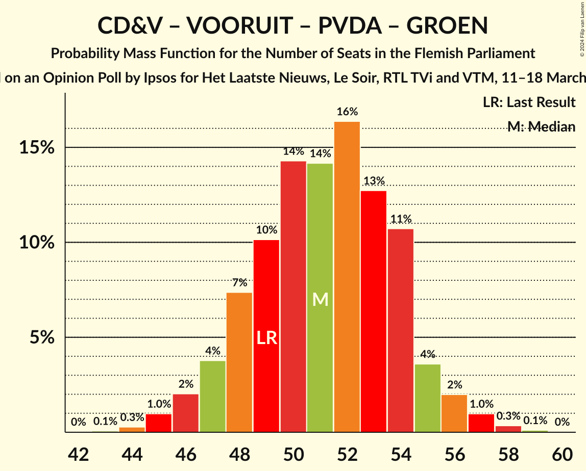

# Opinion Poll by Ipsos for Het Laatste Nieuws, Le Soir, RTL TVi and VTM, 11–18 March 2024

<a href="#voting-intentions">Voting Intentions</a> | <a href="#seats">Seats</a> | <a href="#coalitions">Coalitions</a> | <a href="#technical-information">Technical Information</a>

## Voting Intentions

### Confidence Intervals

| Party | Last Result | Poll Result | 80% Confidence Interval | 90% Confidence Interval | 95% Confidence Interval | 99% Confidence Interval |
|:-----:|:-----------:|:-----------:|:-----------------------:|:-----------------------:|:-----------------------:|:-----------------------:|
| Vlaams Belang | 18.5% | 27.4% | 25.6–29.3% |25.1–29.8% |24.7–30.3% |23.9–31.2% |
| Nieuw-Vlaamse Alliantie | 24.8% | 20.4% | 18.8–22.1% |18.4–22.6% |18.0–23.0% |17.3–23.9% |
| Christen-Democratisch en Vlaams | 15.4% | 13.1% | 11.8–14.6% |11.4–15.0% |11.1–15.3% |10.6–16.1% |
| Vooruit | 10.1% | 11.4% | 10.2–12.8% |9.9–13.2% |9.6–13.5% |9.0–14.2% |
| Partij van de Arbeid van België | 5.3% | 9.5% | 8.4–10.8% |8.1–11.2% |7.8–11.5% |7.3–12.1% |
| Open Vlaamse Liberalen en Democraten | 13.1% | 8.3% | 7.3–9.5% |7.0–9.9% |6.7–10.2% |6.3–10.8% |
| Groen | 10.1% | 7.8% | 6.8–9.0% |6.5–9.3% |6.3–9.6% |5.8–10.2% |

*Note:* The poll result column reflects the actual value used in the calculations. Published results may vary slightly, and in addition be rounded to fewer digits.

## Seats

### Confidence Intervals

| Party | Last Result | Median | 80% Confidence Interval | 90% Confidence Interval | 95% Confidence Interval | 99% Confidence Interval |
|:-----:|:-----------:|:------:|:-----------------------:|:-----------------------:|:-----------------------:|:-----------------------:|
| <a href="#vlaams-belang">Vlaams Belang</a> | 23 | 37 | 34–39 |33–40 |32–41 |31–42 |
| <a href="#nieuw-vlaamse-alliantie">Nieuw-Vlaamse Alliantie</a> | 35 | 27 | 25–29 |24–30 |23–30 |22–32 |
| <a href="#christen-democratisch-en-vlaams">Christen-Democratisch en Vlaams</a> | 19 | 16 | 14–18 |14–19 |13–19 |12–20 |
| <a href="#vooruit">Vooruit</a> | 12 | 14 | 12–16 |11–17 |11–17 |11–19 |
| <a href="#partij-van-de-arbeid-van-belgië">Partij van de Arbeid van België</a> | 4 | 12 | 9–13 |8–14 |8–14 |7–14 |
| <a href="#open-vlaamse-liberalen-en-democraten">Open Vlaamse Liberalen en Democraten</a> | 16 | 10 | 8–12 |7–12 |7–12 |6–13 |
| <a href="#groen">Groen</a> | 14 | 10 | 7–11 |7–12 |6–13 |5–14 |

### Vlaams Belang

*For a full overview of the results for this party, see the [Vlaams Belang](party-vlaamsbelang.html) page.*

| Number of Seats | Probability | Accumulated | Special Marks |
|:---------------:|:-----------:|:-----------:|:-------------:|
| 23 | 0% | 100% | Last Result |
| 24 | 0% | 100% |  |
| 25 | 0% | 100% |  |
| 26 | 0% | 100% |  |
| 27 | 0% | 100% |  |
| 28 | 0% | 100% |  |
| 29 | 0.1% | 100% |  |
| 30 | 0.3% | 99.9% |  |
| 31 | 0.8% | 99.7% |  |
| 32 | 2% | 98.8% |  |
| 33 | 6% | 96% |  |
| 34 | 7% | 90% |  |
| 35 | 15% | 83% |  |
| 36 | 17% | 68% |  |
| 37 | 26% | 51% | Median |
| 38 | 15% | 25% |  |
| 39 | 5% | 10% |  |
| 40 | 2% | 6% |  |
| 41 | 2% | 3% |  |
| 42 | 1.0% | 1.1% |  |
| 43 | 0.1% | 0.1% |  |
| 44 | 0% | 0% |  |

### Nieuw-Vlaamse Alliantie

*For a full overview of the results for this party, see the [Nieuw-Vlaamse Alliantie](party-nieuw-vlaamsealliantie.html) page.*

| Number of Seats | Probability | Accumulated | Special Marks |
|:---------------:|:-----------:|:-----------:|:-------------:|
| 21 | 0.1% | 100% |  |
| 22 | 1.0% | 99.8% |  |
| 23 | 2% | 98.9% |  |
| 24 | 4% | 97% |  |
| 25 | 10% | 93% |  |
| 26 | 29% | 83% |  |
| 27 | 23% | 55% | Median |
| 28 | 13% | 31% |  |
| 29 | 9% | 18% |  |
| 30 | 7% | 9% |  |
| 31 | 2% | 2% |  |
| 32 | 0.5% | 0.7% |  |
| 33 | 0.1% | 0.2% |  |
| 34 | 0% | 0% |  |
| 35 | 0% | 0% | Last Result |

### Christen-Democratisch en Vlaams

*For a full overview of the results for this party, see the [Christen-Democratisch en Vlaams](party-christen-democratischenvlaams.html) page.*

| Number of Seats | Probability | Accumulated | Special Marks |
|:---------------:|:-----------:|:-----------:|:-------------:|
| 11 | 0.4% | 100% |  |
| 12 | 2% | 99.6% |  |
| 13 | 2% | 98% |  |
| 14 | 24% | 96% |  |
| 15 | 17% | 72% |  |
| 16 | 14% | 55% | Median |
| 17 | 31% | 41% |  |
| 18 | 5% | 10% |  |
| 19 | 4% | 5% | Last Result |
| 20 | 1.0% | 1.1% |  |
| 21 | 0.1% | 0.2% |  |
| 22 | 0% | 0% |  |

### Vooruit

*For a full overview of the results for this party, see the [Vooruit](party-vooruit.html) page.*

| Number of Seats | Probability | Accumulated | Special Marks |
|:---------------:|:-----------:|:-----------:|:-------------:|
| 10 | 0.1% | 100% |  |
| 11 | 6% | 99.9% |  |
| 12 | 6% | 94% | Last Result |
| 13 | 12% | 88% |  |
| 14 | 41% | 76% | Median |
| 15 | 14% | 35% |  |
| 16 | 15% | 20% |  |
| 17 | 3% | 5% |  |
| 18 | 1.4% | 2% |  |
| 19 | 0.7% | 0.7% |  |
| 20 | 0% | 0% |  |

### Partij van de Arbeid van België

*For a full overview of the results for this party, see the [Partij van de Arbeid van België](party-partijvandearbeidvanbelgië.html) page.*

| Number of Seats | Probability | Accumulated | Special Marks |
|:---------------:|:-----------:|:-----------:|:-------------:|
| 4 | 0% | 100% | Last Result |
| 5 | 0% | 100% |  |
| 6 | 0% | 100% |  |
| 7 | 2% | 100% |  |
| 8 | 5% | 98% |  |
| 9 | 7% | 93% |  |
| 10 | 11% | 85% |  |
| 11 | 24% | 75% |  |
| 12 | 15% | 51% | Median |
| 13 | 28% | 36% |  |
| 14 | 8% | 8% |  |
| 15 | 0.3% | 0.5% |  |
| 16 | 0.1% | 0.2% |  |
| 17 | 0.1% | 0.1% |  |
| 18 | 0% | 0% |  |

### Open Vlaamse Liberalen en Democraten

*For a full overview of the results for this party, see the [Open Vlaamse Liberalen en Democraten](party-openvlaamseliberalenendemocraten.html) page.*

| Number of Seats | Probability | Accumulated | Special Marks |
|:---------------:|:-----------:|:-----------:|:-------------:|
| 4 | 0.1% | 100% |  |
| 5 | 0.3% | 99.9% |  |
| 6 | 1.1% | 99.6% |  |
| 7 | 5% | 98% |  |
| 8 | 26% | 94% |  |
| 9 | 15% | 68% |  |
| 10 | 17% | 53% | Median |
| 11 | 21% | 36% |  |
| 12 | 14% | 15% |  |
| 13 | 0.9% | 1.2% |  |
| 14 | 0.2% | 0.3% |  |
| 15 | 0.1% | 0.1% |  |
| 16 | 0% | 0% | Last Result |

### Groen

*For a full overview of the results for this party, see the [Groen](party-groen.html) page.*

| Number of Seats | Probability | Accumulated | Special Marks |
|:---------------:|:-----------:|:-----------:|:-------------:|
| 5 | 1.3% | 100% |  |
| 6 | 1.4% | 98.7% |  |
| 7 | 16% | 97% |  |
| 8 | 8% | 81% |  |
| 9 | 13% | 73% |  |
| 10 | 18% | 61% | Median |
| 11 | 35% | 43% |  |
| 12 | 3% | 7% |  |
| 13 | 3% | 4% |  |
| 14 | 1.4% | 1.4% | Last Result |
| 15 | 0% | 0% |  |

## Coalitions

### Confidence Intervals

| Coalition | Last Result | Median | Majority? | 80% Confidence Interval | 90% Confidence Interval | 95% Confidence Interval | 99% Confidence Interval |
|:---------:|:-----------:|:------:|:---------:|:-----------------------:|:-----------------------:|:-----------------------:|:-----------------------:|
| Vlaams Belang – Nieuw-Vlaamse Alliantie – Christen-Democratisch en Vlaams | 77 | 79 | 100% | 76–82 | 75–83 | 74–84 | 73–85 |
| Nieuw-Vlaamse Alliantie – Christen-Democratisch en Vlaams – Vooruit – Open Vlaamse Liberalen en Democraten | 82 | 66 | 95% | 64–70 | 63–71 | 62–72 | 60–73 |
| Vlaams Belang – Nieuw-Vlaamse Alliantie | 58 | 63 | 61% | 60–66 | 60–67 | 59–68 | 57–69 |
| Nieuw-Vlaamse Alliantie – Christen-Democratisch en Vlaams – Vooruit | 66 | 57 | 1.0% | 54–60 | 53–61 | 52–62 | 51–63 |
| Nieuw-Vlaamse Alliantie – Christen-Democratisch en Vlaams – Open Vlaamse Liberalen en Democraten | 70 | 52 | 0% | 49–55 | 48–56 | 48–57 | 46–59 |
| Christen-Democratisch en Vlaams – Vooruit – Partij van de Arbeid van België – Groen | 49 | 51 | 0% | 48–54 | 47–55 | 46–56 | 45–58 |
| Nieuw-Vlaamse Alliantie – Vooruit – Open Vlaamse Liberalen en Democraten | 63 | 51 | 0% | 47–54 | 47–55 | 46–56 | 45–57 |
| Christen-Democratisch en Vlaams – Vooruit – Open Vlaamse Liberalen en Democraten – Groen | 61 | 49 | 0% | 46–52 | 45–53 | 44–54 | 43–56 |
| Nieuw-Vlaamse Alliantie – Christen-Democratisch en Vlaams | 54 | 43 | 0% | 40–45 | 39–46 | 38–47 | 37–48 |
| Christen-Democratisch en Vlaams – Vooruit – Groen | 45 | 40 | 0% | 36–43 | 36–44 | 35–44 | 33–46 |
| Christen-Democratisch en Vlaams – Vooruit – Open Vlaamse Liberalen en Democraten | 47 | 40 | 0% | 36–43 | 35–44 | 35–44 | 33–46 |
| Nieuw-Vlaamse Alliantie – Open Vlaamse Liberalen en Democraten | 51 | 36 | 0% | 34–39 | 33–40 | 32–41 | 31–43 |
| Christen-Democratisch en Vlaams – Open Vlaamse Liberalen en Democraten – Groen | 49 | 35 | 0% | 32–38 | 31–39 | 30–40 | 29–41 |
| Vooruit – Open Vlaamse Liberalen en Democraten – Groen | 42 | 33 | 0% | 30–37 | 30–37 | 29–38 | 28–40 |
| Christen-Democratisch en Vlaams – Vooruit | 31 | 30 | 0% | 27–33 | 27–33 | 26–34 | 25–36 |
| Christen-Democratisch en Vlaams – Open Vlaamse Liberalen en Democraten | 35 | 26 | 0% | 22–28 | 22–29 | 21–29 | 20–31 |
| Vooruit – Open Vlaamse Liberalen en Democraten | 28 | 24 | 0% | 21–27 | 20–27 | 20–28 | 19–29 |

### Vlaams Belang – Nieuw-Vlaamse Alliantie – Christen-Democratisch en Vlaams

| Number of Seats | Probability | Accumulated | Special Marks |
|:---------------:|:-----------:|:-----------:|:-------------:|
| 71 | 0.1% | 100% |  |
| 72 | 0.2% | 99.9% |  |
| 73 | 0.6% | 99.7% |  |
| 74 | 2% | 99.2% |  |
| 75 | 4% | 97% |  |
| 76 | 7% | 93% |  |
| 77 | 13% | 86% | Last Result |
| 78 | 16% | 73% |  |
| 79 | 16% | 57% |  |
| 80 | 16% | 42% | Median |
| 81 | 11% | 25% |  |
| 82 | 7% | 14% |  |
| 83 | 4% | 7% |  |
| 84 | 2% | 3% |  |
| 85 | 0.9% | 1.2% |  |
| 86 | 0.3% | 0.4% |  |
| 87 | 0.1% | 0.1% |  |
| 88 | 0% | 0% |  |

### Nieuw-Vlaamse Alliantie – Christen-Democratisch en Vlaams – Vooruit – Open Vlaamse Liberalen en Democraten

| Number of Seats | Probability | Accumulated | Special Marks |
|:---------------:|:-----------:|:-----------:|:-------------:|
| 58 | 0% | 100% |  |
| 59 | 0.2% | 99.9% |  |
| 60 | 0.6% | 99.7% |  |
| 61 | 2% | 99.2% |  |
| 62 | 3% | 98% |  |
| 63 | 5% | 95% | Majority |
| 64 | 11% | 90% |  |
| 65 | 16% | 79% |  |
| 66 | 15% | 63% |  |
| 67 | 13% | 48% | Median |
| 68 | 12% | 36% |  |
| 69 | 11% | 23% |  |
| 70 | 6% | 12% |  |
| 71 | 4% | 6% |  |
| 72 | 1.5% | 3% |  |
| 73 | 0.7% | 1.0% |  |
| 74 | 0.2% | 0.3% |  |
| 75 | 0.1% | 0.1% |  |
| 76 | 0% | 0% |  |
| 77 | 0% | 0% |  |
| 78 | 0% | 0% |  |
| 79 | 0% | 0% |  |
| 80 | 0% | 0% |  |
| 81 | 0% | 0% |  |
| 82 | 0% | 0% | Last Result |

### Vlaams Belang – Nieuw-Vlaamse Alliantie

| Number of Seats | Probability | Accumulated | Special Marks |
|:---------------:|:-----------:|:-----------:|:-------------:|
| 55 | 0% | 100% |  |
| 56 | 0.2% | 99.9% |  |
| 57 | 0.5% | 99.7% |  |
| 58 | 1.1% | 99.2% | Last Result |
| 59 | 3% | 98% |  |
| 60 | 6% | 95% |  |
| 61 | 12% | 89% |  |
| 62 | 16% | 77% |  |
| 63 | 17% | 61% | Majority |
| 64 | 16% | 44% | Median |
| 65 | 12% | 28% |  |
| 66 | 8% | 16% |  |
| 67 | 4% | 8% |  |
| 68 | 2% | 4% |  |
| 69 | 1.0% | 1.5% |  |
| 70 | 0.3% | 0.5% |  |
| 71 | 0.1% | 0.1% |  |
| 72 | 0% | 0% |  |

### Nieuw-Vlaamse Alliantie – Christen-Democratisch en Vlaams – Vooruit

| Number of Seats | Probability | Accumulated | Special Marks |
|:---------------:|:-----------:|:-----------:|:-------------:|
| 49 | 0% | 100% |  |
| 50 | 0.2% | 99.9% |  |
| 51 | 0.6% | 99.7% |  |
| 52 | 2% | 99.2% |  |
| 53 | 4% | 97% |  |
| 54 | 7% | 93% |  |
| 55 | 11% | 86% |  |
| 56 | 18% | 75% |  |
| 57 | 22% | 58% | Median |
| 58 | 15% | 35% |  |
| 59 | 8% | 21% |  |
| 60 | 5% | 13% |  |
| 61 | 4% | 7% |  |
| 62 | 2% | 3% |  |
| 63 | 0.7% | 1.0% | Majority |
| 64 | 0.2% | 0.3% |  |
| 65 | 0% | 0.1% |  |
| 66 | 0% | 0% | Last Result |

### Nieuw-Vlaamse Alliantie – Christen-Democratisch en Vlaams – Open Vlaamse Liberalen en Democraten

| Number of Seats | Probability | Accumulated | Special Marks |
|:---------------:|:-----------:|:-----------:|:-------------:|
| 44 | 0.1% | 100% |  |
| 45 | 0.2% | 99.9% |  |
| 46 | 0.7% | 99.7% |  |
| 47 | 1.4% | 99.0% |  |
| 48 | 3% | 98% |  |
| 49 | 7% | 95% |  |
| 50 | 12% | 88% |  |
| 51 | 14% | 76% |  |
| 52 | 16% | 62% |  |
| 53 | 15% | 47% | Median |
| 54 | 14% | 32% |  |
| 55 | 9% | 18% |  |
| 56 | 4% | 9% |  |
| 57 | 3% | 5% |  |
| 58 | 1.1% | 2% |  |
| 59 | 0.4% | 0.6% |  |
| 60 | 0.2% | 0.2% |  |
| 61 | 0% | 0.1% |  |
| 62 | 0% | 0% |  |
| 63 | 0% | 0% | Majority |
| 64 | 0% | 0% |  |
| 65 | 0% | 0% |  |
| 66 | 0% | 0% |  |
| 67 | 0% | 0% |  |
| 68 | 0% | 0% |  |
| 69 | 0% | 0% |  |
| 70 | 0% | 0% | Last Result |

### Christen-Democratisch en Vlaams – Vooruit – Partij van de Arbeid van België – Groen

| Number of Seats | Probability | Accumulated | Special Marks |
|:---------------:|:-----------:|:-----------:|:-------------:|
| 43 | 0.1% | 100% |  |
| 44 | 0.3% | 99.9% |  |
| 45 | 1.0% | 99.6% |  |
| 46 | 2% | 98.6% |  |
| 47 | 4% | 97% |  |
| 48 | 7% | 93% |  |
| 49 | 11% | 86% | Last Result |
| 50 | 13% | 75% |  |
| 51 | 15% | 62% |  |
| 52 | 20% | 47% | Median |
| 53 | 12% | 28% |  |
| 54 | 8% | 16% |  |
| 55 | 4% | 7% |  |
| 56 | 2% | 4% |  |
| 57 | 0.9% | 2% |  |
| 58 | 0.4% | 0.6% |  |
| 59 | 0.1% | 0.2% |  |
| 60 | 0% | 0% |  |

### Nieuw-Vlaamse Alliantie – Vooruit – Open Vlaamse Liberalen en Democraten

| Number of Seats | Probability | Accumulated | Special Marks |
|:---------------:|:-----------:|:-----------:|:-------------:|
| 43 | 0.1% | 100% |  |
| 44 | 0.3% | 99.9% |  |
| 45 | 0.9% | 99.6% |  |
| 46 | 2% | 98.7% |  |
| 47 | 7% | 97% |  |
| 48 | 8% | 90% |  |
| 49 | 12% | 82% |  |
| 50 | 15% | 69% |  |
| 51 | 16% | 54% | Median |
| 52 | 13% | 38% |  |
| 53 | 12% | 25% |  |
| 54 | 6% | 13% |  |
| 55 | 3% | 6% |  |
| 56 | 2% | 3% |  |
| 57 | 1.0% | 1.3% |  |
| 58 | 0.2% | 0.3% |  |
| 59 | 0% | 0.1% |  |
| 60 | 0% | 0% |  |
| 61 | 0% | 0% |  |
| 62 | 0% | 0% |  |
| 63 | 0% | 0% | Last Result, Majority |

### Christen-Democratisch en Vlaams – Vooruit – Open Vlaamse Liberalen en Democraten – Groen

| Number of Seats | Probability | Accumulated | Special Marks |
|:---------------:|:-----------:|:-----------:|:-------------:|
| 41 | 0% | 100% |  |
| 42 | 0.3% | 99.9% |  |
| 43 | 0.6% | 99.6% |  |
| 44 | 2% | 99.0% |  |
| 45 | 4% | 97% |  |
| 46 | 6% | 93% |  |
| 47 | 13% | 87% |  |
| 48 | 13% | 74% |  |
| 49 | 13% | 61% |  |
| 50 | 13% | 48% | Median |
| 51 | 14% | 35% |  |
| 52 | 11% | 21% |  |
| 53 | 6% | 10% |  |
| 54 | 2% | 4% |  |
| 55 | 1.3% | 2% |  |
| 56 | 0.4% | 0.6% |  |
| 57 | 0.1% | 0.2% |  |
| 58 | 0% | 0.1% |  |
| 59 | 0% | 0% |  |
| 60 | 0% | 0% |  |
| 61 | 0% | 0% | Last Result |

### Nieuw-Vlaamse Alliantie – Christen-Democratisch en Vlaams

| Number of Seats | Probability | Accumulated | Special Marks |
|:---------------:|:-----------:|:-----------:|:-------------:|
| 36 | 0.2% | 100% |  |
| 37 | 0.4% | 99.8% |  |
| 38 | 2% | 99.4% |  |
| 39 | 4% | 97% |  |
| 40 | 7% | 93% |  |
| 41 | 14% | 85% |  |
| 42 | 16% | 71% |  |
| 43 | 24% | 56% | Median |
| 44 | 14% | 31% |  |
| 45 | 8% | 18% |  |
| 46 | 5% | 10% |  |
| 47 | 3% | 5% |  |
| 48 | 0.9% | 1.4% |  |
| 49 | 0.4% | 0.5% |  |
| 50 | 0.1% | 0.1% |  |
| 51 | 0% | 0% |  |
| 52 | 0% | 0% |  |
| 53 | 0% | 0% |  |
| 54 | 0% | 0% | Last Result |

### Christen-Democratisch en Vlaams – Vooruit – Groen

| Number of Seats | Probability | Accumulated | Special Marks |
|:---------------:|:-----------:|:-----------:|:-------------:|
| 32 | 0.2% | 100% |  |
| 33 | 0.6% | 99.8% |  |
| 34 | 1.1% | 99.2% |  |
| 35 | 2% | 98% |  |
| 36 | 6% | 96% |  |
| 37 | 7% | 90% |  |
| 38 | 14% | 83% |  |
| 39 | 16% | 68% |  |
| 40 | 15% | 53% | Median |
| 41 | 16% | 38% |  |
| 42 | 10% | 22% |  |
| 43 | 6% | 12% |  |
| 44 | 4% | 6% |  |
| 45 | 1.3% | 2% | Last Result |
| 46 | 0.4% | 0.6% |  |
| 47 | 0.1% | 0.2% |  |
| 48 | 0% | 0.1% |  |
| 49 | 0% | 0% |  |

### Christen-Democratisch en Vlaams – Vooruit – Open Vlaamse Liberalen en Democraten

| Number of Seats | Probability | Accumulated | Special Marks |
|:---------------:|:-----------:|:-----------:|:-------------:|
| 32 | 0.1% | 100% |  |
| 33 | 0.4% | 99.9% |  |
| 34 | 1.4% | 99.5% |  |
| 35 | 4% | 98% |  |
| 36 | 7% | 94% |  |
| 37 | 8% | 87% |  |
| 38 | 11% | 79% |  |
| 39 | 12% | 68% |  |
| 40 | 18% | 56% | Median |
| 41 | 16% | 38% |  |
| 42 | 11% | 23% |  |
| 43 | 7% | 12% |  |
| 44 | 3% | 5% |  |
| 45 | 2% | 2% |  |
| 46 | 0.4% | 0.6% |  |
| 47 | 0.1% | 0.1% | Last Result |
| 48 | 0% | 0% |  |

### Nieuw-Vlaamse Alliantie – Open Vlaamse Liberalen en Democraten

| Number of Seats | Probability | Accumulated | Special Marks |
|:---------------:|:-----------:|:-----------:|:-------------:|
| 29 | 0.1% | 100% |  |
| 30 | 0.4% | 99.9% |  |
| 31 | 0.8% | 99.5% |  |
| 32 | 2% | 98.8% |  |
| 33 | 5% | 97% |  |
| 34 | 8% | 92% |  |
| 35 | 15% | 84% |  |
| 36 | 19% | 68% |  |
| 37 | 17% | 49% | Median |
| 38 | 14% | 32% |  |
| 39 | 10% | 19% |  |
| 40 | 5% | 9% |  |
| 41 | 2% | 4% |  |
| 42 | 0.8% | 1.4% |  |
| 43 | 0.5% | 0.6% |  |
| 44 | 0.1% | 0.1% |  |
| 45 | 0% | 0% |  |
| 46 | 0% | 0% |  |
| 47 | 0% | 0% |  |
| 48 | 0% | 0% |  |
| 49 | 0% | 0% |  |
| 50 | 0% | 0% |  |
| 51 | 0% | 0% | Last Result |

### Christen-Democratisch en Vlaams – Open Vlaamse Liberalen en Democraten – Groen

| Number of Seats | Probability | Accumulated | Special Marks |
|:---------------:|:-----------:|:-----------:|:-------------:|
| 27 | 0.1% | 100% |  |
| 28 | 0.2% | 99.9% |  |
| 29 | 0.5% | 99.7% |  |
| 30 | 2% | 99.2% |  |
| 31 | 4% | 97% |  |
| 32 | 7% | 93% |  |
| 33 | 15% | 86% |  |
| 34 | 12% | 71% |  |
| 35 | 13% | 60% |  |
| 36 | 17% | 46% | Median |
| 37 | 15% | 29% |  |
| 38 | 7% | 14% |  |
| 39 | 4% | 7% |  |
| 40 | 2% | 3% |  |
| 41 | 1.1% | 2% |  |
| 42 | 0.4% | 0.5% |  |
| 43 | 0.1% | 0.1% |  |
| 44 | 0% | 0% |  |
| 45 | 0% | 0% |  |
| 46 | 0% | 0% |  |
| 47 | 0% | 0% |  |
| 48 | 0% | 0% |  |
| 49 | 0% | 0% | Last Result |

### Vooruit – Open Vlaamse Liberalen en Democraten – Groen

| Number of Seats | Probability | Accumulated | Special Marks |
|:---------------:|:-----------:|:-----------:|:-------------:|
| 26 | 0.1% | 100% |  |
| 27 | 0.3% | 99.9% |  |
| 28 | 0.8% | 99.6% |  |
| 29 | 3% | 98.8% |  |
| 30 | 7% | 96% |  |
| 31 | 11% | 89% |  |
| 32 | 14% | 79% |  |
| 33 | 15% | 64% |  |
| 34 | 15% | 50% | Median |
| 35 | 13% | 35% |  |
| 36 | 11% | 23% |  |
| 37 | 7% | 12% |  |
| 38 | 3% | 5% |  |
| 39 | 1.2% | 2% |  |
| 40 | 0.4% | 0.6% |  |
| 41 | 0.1% | 0.2% |  |
| 42 | 0% | 0% | Last Result |

### Christen-Democratisch en Vlaams – Vooruit

| Number of Seats | Probability | Accumulated | Special Marks |
|:---------------:|:-----------:|:-----------:|:-------------:|
| 23 | 0% | 100% |  |
| 24 | 0.2% | 99.9% |  |
| 25 | 2% | 99.7% |  |
| 26 | 2% | 98% |  |
| 27 | 6% | 96% |  |
| 28 | 11% | 89% |  |
| 29 | 16% | 78% |  |
| 30 | 21% | 62% | Median |
| 31 | 21% | 41% | Last Result |
| 32 | 9% | 19% |  |
| 33 | 5% | 10% |  |
| 34 | 3% | 5% |  |
| 35 | 1.3% | 2% |  |
| 36 | 0.5% | 0.6% |  |
| 37 | 0.1% | 0.1% |  |
| 38 | 0% | 0% |  |

### Christen-Democratisch en Vlaams – Open Vlaamse Liberalen en Democraten

| Number of Seats | Probability | Accumulated | Special Marks |
|:---------------:|:-----------:|:-----------:|:-------------:|
| 19 | 0.2% | 100% |  |
| 20 | 1.0% | 99.8% |  |
| 21 | 2% | 98.8% |  |
| 22 | 10% | 97% |  |
| 23 | 8% | 87% |  |
| 24 | 10% | 79% |  |
| 25 | 15% | 69% |  |
| 26 | 21% | 54% | Median |
| 27 | 16% | 33% |  |
| 28 | 9% | 16% |  |
| 29 | 5% | 7% |  |
| 30 | 2% | 2% |  |
| 31 | 0.5% | 0.6% |  |
| 32 | 0.1% | 0.1% |  |
| 33 | 0% | 0% |  |
| 34 | 0% | 0% |  |
| 35 | 0% | 0% | Last Result |

### Vooruit – Open Vlaamse Liberalen en Democraten

| Number of Seats | Probability | Accumulated | Special Marks |
|:---------------:|:-----------:|:-----------:|:-------------:|
| 17 | 0.1% | 100% |  |
| 18 | 0.3% | 99.9% |  |
| 19 | 1.2% | 99.6% |  |
| 20 | 4% | 98% |  |
| 21 | 9% | 94% |  |
| 22 | 16% | 86% |  |
| 23 | 14% | 70% |  |
| 24 | 15% | 56% | Median |
| 25 | 14% | 40% |  |
| 26 | 14% | 26% |  |
| 27 | 8% | 12% |  |
| 28 | 3% | 4% | Last Result |
| 29 | 0.7% | 1.0% |  |
| 30 | 0.2% | 0.3% |  |
| 31 | 0.1% | 0.1% |  |
| 32 | 0% | 0% |  |

## Technical Information

### Opinion Poll

+ **Polling firm:** Ipsos
+ **Commissioner(s):** Het Laatste Nieuws, Le Soir, RTL TVi and VTM
+ **Fieldwork period:** 11–18 March 2024

### Calculations

+ **Sample size:** 1000
+ **Simulations done:** 1,048,576
+ **Error estimate:** 1.17%

