# Opinion Poll by iVOX for Overlegcentrum van Vlaamse Verenigingen, 23 April–3 May 2024

<a href="#voting-intentions">Voting Intentions</a> | <a href="#seats">Seats</a> | <a href="#coalitions">Coalitions</a> | <a href="#technical-information">Technical Information</a>

## Voting Intentions

### Confidence Intervals

| Party | Last Result | Poll Result | 80% Confidence Interval | 90% Confidence Interval | 95% Confidence Interval | 99% Confidence Interval |
|:-----:|:-----------:|:-----------:|:-----------------------:|:-----------------------:|:-----------------------:|:-----------------------:|
| Vlaams Belang | 18.5% | 26.3% | 24.9–27.7% |24.5–28.2% |24.2–28.5% |23.5–29.2% |
| Nieuw-Vlaamse Alliantie | 24.8% | 21.4% | 20.1–22.8% |19.8–23.2% |19.4–23.5% |18.9–24.2% |
| Vooruit | 10.1% | 13.5% | 12.4–14.7% |12.1–15.0% |11.9–15.3% |11.4–15.8% |
| Christen-Democratisch en Vlaams | 15.4% | 12.5% | 11.5–13.6% |11.2–13.9% |10.9–14.2% |10.5–14.8% |
| Partij van de Arbeid van België | 5.3% | 8.8% | 7.9–9.8% |7.7–10.1% |7.5–10.3% |7.1–10.8% |
| Groen | 10.1% | 8.2% | 7.3–9.1% |7.1–9.4% |6.9–9.6% |6.5–10.1% |
| Open Vlaamse Liberalen en Democraten | 13.1% | 7.7% | 6.9–8.6% |6.6–8.9% |6.4–9.1% |6.1–9.6% |

*Note:* The poll result column reflects the actual value used in the calculations. Published results may vary slightly, and in addition be rounded to fewer digits.

## Seats

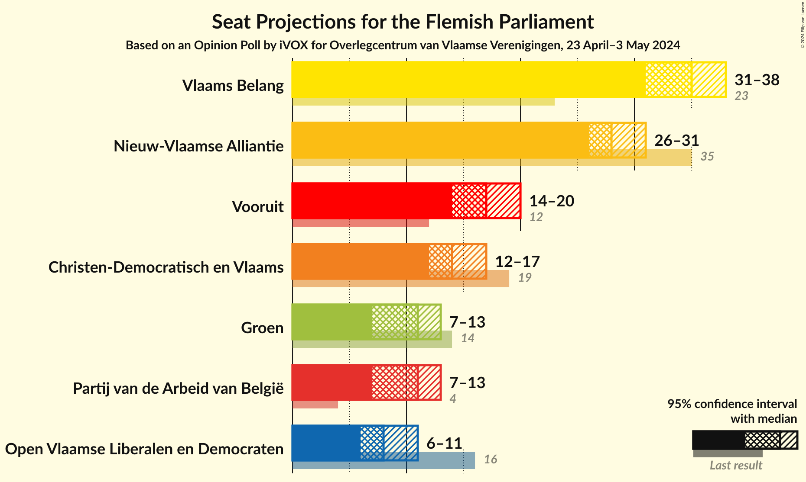

### Confidence Intervals

| Party | Last Result | Median | 80% Confidence Interval | 90% Confidence Interval | 95% Confidence Interval | 99% Confidence Interval |
|:-----:|:-----------:|:------:|:-----------------------:|:-----------------------:|:-----------------------:|:-----------------------:|
| <a href="#vlaams-belang">Vlaams Belang</a> | 23 | 35 | 32–37 |32–37 |31–38 |31–39 |
| <a href="#nieuw-vlaamse-alliantie">Nieuw-Vlaamse Alliantie</a> | 35 | 28 | 26–30 |26–30 |26–31 |25–32 |
| <a href="#vooruit">Vooruit</a> | 12 | 17 | 16–19 |15–19 |14–20 |14–20 |
| <a href="#christen-democratisch-en-vlaams">Christen-Democratisch en Vlaams</a> | 19 | 14 | 14–17 |13–17 |12–17 |11–18 |
| <a href="#partij-van-de-arbeid-van-belgië">Partij van de Arbeid van België</a> | 4 | 11 | 8–12 |7–13 |7–13 |7–13 |
| <a href="#groen">Groen</a> | 14 | 11 | 9–11 |8–13 |7–13 |7–14 |
| <a href="#open-vlaamse-liberalen-en-democraten">Open Vlaamse Liberalen en Democraten</a> | 16 | 8 | 7–10 |7–11 |6–11 |5–12 |

### Vlaams Belang

*For a full overview of the results for this party, see the [Vlaams Belang](party-vlaamsbelang.html) page.*

| Number of Seats | Probability | Accumulated | Special Marks |
|:---------------:|:-----------:|:-----------:|:-------------:|
| 23 | 0% | 100% | Last Result |
| 24 | 0% | 100% |  |
| 25 | 0% | 100% |  |
| 26 | 0% | 100% |  |
| 27 | 0% | 100% |  |
| 28 | 0% | 100% |  |
| 29 | 0.1% | 100% |  |
| 30 | 0.3% | 99.9% |  |
| 31 | 3% | 99.6% |  |
| 32 | 8% | 97% |  |
| 33 | 11% | 88% |  |
| 34 | 19% | 77% |  |
| 35 | 13% | 59% | Median |
| 36 | 29% | 46% |  |
| 37 | 14% | 17% |  |
| 38 | 2% | 3% |  |
| 39 | 0.4% | 0.6% |  |
| 40 | 0.2% | 0.2% |  |
| 41 | 0% | 0% |  |

### Nieuw-Vlaamse Alliantie

*For a full overview of the results for this party, see the [Nieuw-Vlaamse Alliantie](party-nieuw-vlaamsealliantie.html) page.*

| Number of Seats | Probability | Accumulated | Special Marks |
|:---------------:|:-----------:|:-----------:|:-------------:|
| 23 | 0% | 100% |  |
| 24 | 0.2% | 99.9% |  |
| 25 | 1.2% | 99.8% |  |
| 26 | 15% | 98.6% |  |
| 27 | 25% | 83% |  |
| 28 | 17% | 58% | Median |
| 29 | 13% | 41% |  |
| 30 | 24% | 29% |  |
| 31 | 4% | 5% |  |
| 32 | 0.7% | 1.0% |  |
| 33 | 0.1% | 0.2% |  |
| 34 | 0.1% | 0.1% |  |
| 35 | 0% | 0% | Last Result |

### Vooruit

*For a full overview of the results for this party, see the [Vooruit](party-vooruit.html) page.*

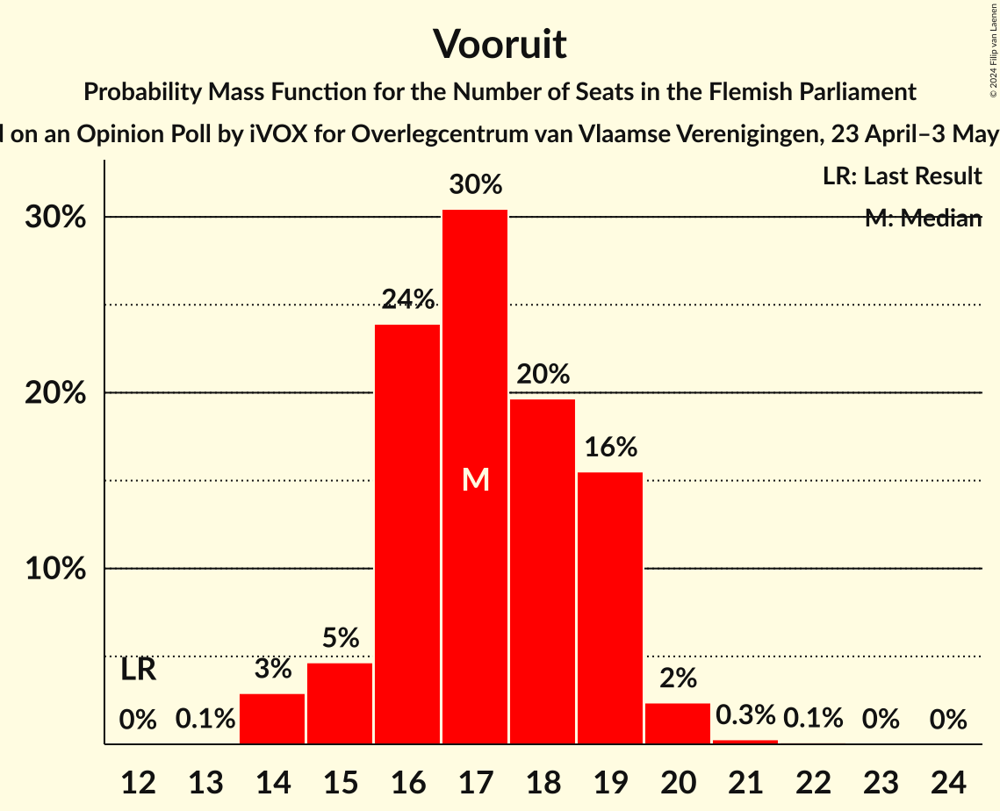

| Number of Seats | Probability | Accumulated | Special Marks |
|:---------------:|:-----------:|:-----------:|:-------------:|
| 12 | 0% | 100% | Last Result |
| 13 | 0.1% | 100% |  |
| 14 | 3% | 99.9% |  |
| 15 | 5% | 97% |  |
| 16 | 25% | 92% |  |
| 17 | 29% | 67% | Median |
| 18 | 20% | 38% |  |
| 19 | 15% | 18% |  |
| 20 | 2% | 3% |  |
| 21 | 0.2% | 0.4% |  |
| 22 | 0.1% | 0.2% |  |
| 23 | 0% | 0% |  |

### Christen-Democratisch en Vlaams

*For a full overview of the results for this party, see the [Christen-Democratisch en Vlaams](party-christen-democratischenvlaams.html) page.*

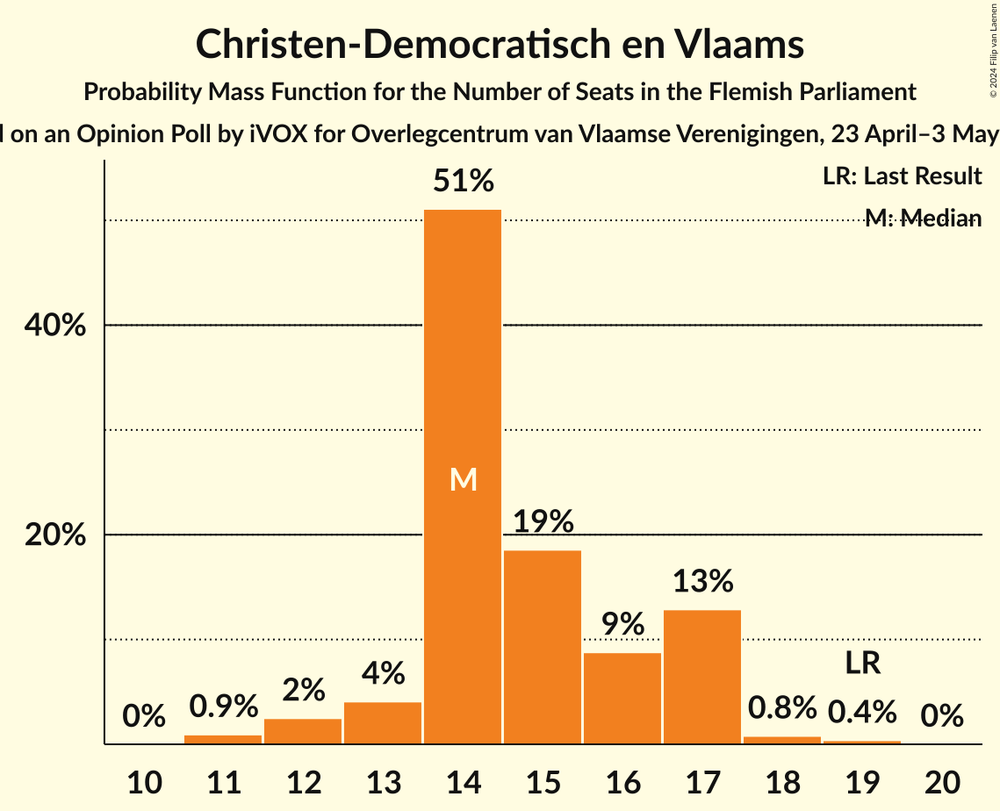

| Number of Seats | Probability | Accumulated | Special Marks |
|:---------------:|:-----------:|:-----------:|:-------------:|
| 11 | 0.9% | 100% |  |
| 12 | 3% | 99.1% |  |
| 13 | 4% | 96% |  |
| 14 | 52% | 93% | Median |
| 15 | 19% | 41% |  |
| 16 | 8% | 22% |  |
| 17 | 13% | 14% |  |
| 18 | 0.8% | 1.2% |  |
| 19 | 0.4% | 0.4% | Last Result |
| 20 | 0% | 0% |  |

### Partij van de Arbeid van België

*For a full overview of the results for this party, see the [Partij van de Arbeid van België](party-partijvandearbeidvanbelgië.html) page.*

| Number of Seats | Probability | Accumulated | Special Marks |
|:---------------:|:-----------:|:-----------:|:-------------:|
| 4 | 0% | 100% | Last Result |
| 5 | 0% | 100% |  |
| 6 | 0% | 100% |  |
| 7 | 7% | 100% |  |
| 8 | 10% | 93% |  |
| 9 | 18% | 83% |  |
| 10 | 13% | 65% |  |
| 11 | 32% | 53% | Median |
| 12 | 14% | 21% |  |
| 13 | 6% | 6% |  |
| 14 | 0.3% | 0.3% |  |
| 15 | 0% | 0% |  |

### Groen

*For a full overview of the results for this party, see the [Groen](party-groen.html) page.*

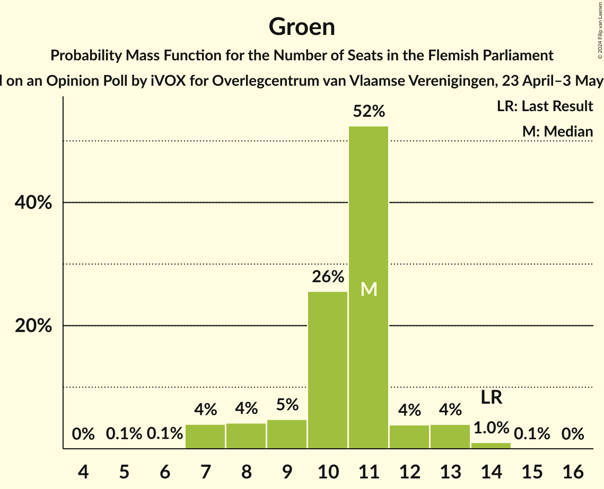

| Number of Seats | Probability | Accumulated | Special Marks |
|:---------------:|:-----------:|:-----------:|:-------------:|
| 5 | 0.1% | 100% |  |
| 6 | 0.1% | 99.9% |  |
| 7 | 4% | 99.8% |  |
| 8 | 4% | 96% |  |
| 9 | 5% | 92% |  |
| 10 | 25% | 87% |  |
| 11 | 53% | 62% | Median |
| 12 | 4% | 9% |  |
| 13 | 4% | 5% |  |
| 14 | 1.1% | 1.1% | Last Result |
| 15 | 0.1% | 0.1% |  |
| 16 | 0% | 0% |  |

### Open Vlaamse Liberalen en Democraten

*For a full overview of the results for this party, see the [Open Vlaamse Liberalen en Democraten](party-openvlaamseliberalenendemocraten.html) page.*

| Number of Seats | Probability | Accumulated | Special Marks |
|:---------------:|:-----------:|:-----------:|:-------------:|
| 4 | 0.2% | 100% |  |
| 5 | 0.9% | 99.8% |  |
| 6 | 3% | 98.9% |  |
| 7 | 11% | 96% |  |
| 8 | 51% | 85% | Median |
| 9 | 16% | 34% |  |
| 10 | 11% | 19% |  |
| 11 | 6% | 7% |  |
| 12 | 1.2% | 1.2% |  |
| 13 | 0% | 0% |  |
| 14 | 0% | 0% |  |
| 15 | 0% | 0% |  |
| 16 | 0% | 0% | Last Result |

## Coalitions

### Confidence Intervals

| Coalition | Last Result | Median | Majority? | 80% Confidence Interval | 90% Confidence Interval | 95% Confidence Interval | 99% Confidence Interval |
|:---------:|:-----------:|:------:|:---------:|:-----------------------:|:-----------------------:|:-----------------------:|:-----------------------:|
| Vlaams Belang – Nieuw-Vlaamse Alliantie – Christen-Democratisch en Vlaams | 77 | 78 | 100% | 75–80 | 75–81 | 74–82 | 73–83 |
| Nieuw-Vlaamse Alliantie – Vooruit – Christen-Democratisch en Vlaams – Open Vlaamse Liberalen en Democraten | 82 | 68 | 99.9% | 66–71 | 65–72 | 65–73 | 64–74 |
| Vlaams Belang – Nieuw-Vlaamse Alliantie | 58 | 63 | 63% | 60–66 | 60–66 | 59–67 | 57–68 |
| Nieuw-Vlaamse Alliantie – Vooruit – Christen-Democratisch en Vlaams | 66 | 60 | 11% | 57–63 | 57–64 | 56–64 | 55–65 |
| Nieuw-Vlaamse Alliantie – Vooruit – Open Vlaamse Liberalen en Democraten | 63 | 53 | 0% | 51–57 | 51–57 | 50–58 | 49–59 |
| Vooruit – Christen-Democratisch en Vlaams – Partij van de Arbeid van België – Groen | 49 | 53 | 0% | 50–55 | 49–56 | 48–57 | 47–58 |
| Nieuw-Vlaamse Alliantie – Christen-Democratisch en Vlaams – Open Vlaamse Liberalen en Democraten | 70 | 51 | 0% | 49–54 | 48–55 | 48–56 | 46–57 |
| Vooruit – Christen-Democratisch en Vlaams – Groen – Open Vlaamse Liberalen en Democraten | 61 | 51 | 0% | 48–53 | 47–54 | 47–55 | 46–56 |
| Nieuw-Vlaamse Alliantie – Christen-Democratisch en Vlaams | 54 | 43 | 0% | 40–45 | 40–46 | 40–47 | 38–48 |
| Vooruit – Christen-Democratisch en Vlaams – Groen | 45 | 42 | 0% | 40–45 | 39–45 | 39–46 | 37–47 |
| Vooruit – Christen-Democratisch en Vlaams – Open Vlaamse Liberalen en Democraten | 47 | 40 | 0% | 38–43 | 37–44 | 36–45 | 35–46 |
| Vooruit – Groen – Open Vlaamse Liberalen en Democraten | 42 | 36 | 0% | 34–39 | 33–39 | 33–40 | 31–41 |
| Nieuw-Vlaamse Alliantie – Open Vlaamse Liberalen en Democraten | 51 | 36 | 0% | 34–39 | 34–40 | 33–40 | 32–42 |
| Christen-Democratisch en Vlaams – Groen – Open Vlaamse Liberalen en Democraten | 49 | 33 | 0% | 31–36 | 31–37 | 30–38 | 29–39 |
| Vooruit – Christen-Democratisch en Vlaams | 31 | 32 | 0% | 30–34 | 29–35 | 29–36 | 28–37 |
| Vooruit – Open Vlaamse Liberalen en Democraten | 28 | 25 | 0% | 24–28 | 23–28 | 22–29 | 21–30 |
| Christen-Democratisch en Vlaams – Open Vlaamse Liberalen en Democraten | 35 | 23 | 0% | 21–25 | 20–26 | 20–27 | 19–28 |

### Vlaams Belang – Nieuw-Vlaamse Alliantie – Christen-Democratisch en Vlaams

| Number of Seats | Probability | Accumulated | Special Marks |
|:---------------:|:-----------:|:-----------:|:-------------:|
| 71 | 0.1% | 100% |  |
| 72 | 0.2% | 99.9% |  |
| 73 | 0.8% | 99.7% |  |
| 74 | 4% | 98.9% |  |
| 75 | 8% | 95% |  |
| 76 | 13% | 87% |  |
| 77 | 21% | 74% | Last Result, Median |
| 78 | 21% | 53% |  |
| 79 | 16% | 33% |  |
| 80 | 9% | 17% |  |
| 81 | 6% | 8% |  |
| 82 | 2% | 3% |  |
| 83 | 0.6% | 0.8% |  |
| 84 | 0.2% | 0.2% |  |
| 85 | 0% | 0% |  |

### Nieuw-Vlaamse Alliantie – Vooruit – Christen-Democratisch en Vlaams – Open Vlaamse Liberalen en Democraten

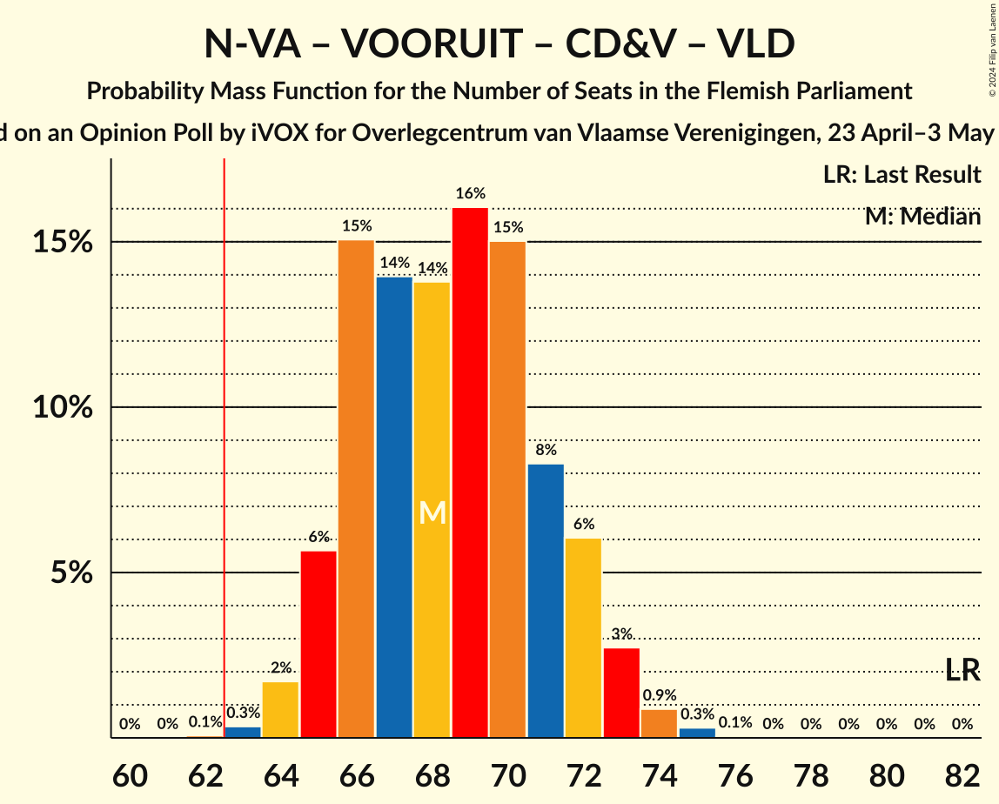

| Number of Seats | Probability | Accumulated | Special Marks |
|:---------------:|:-----------:|:-----------:|:-------------:|
| 62 | 0.1% | 100% |  |
| 63 | 0.3% | 99.9% | Majority |
| 64 | 2% | 99.6% |  |
| 65 | 6% | 98% |  |
| 66 | 16% | 92% |  |
| 67 | 15% | 77% | Median |
| 68 | 14% | 62% |  |
| 69 | 16% | 48% |  |
| 70 | 15% | 32% |  |
| 71 | 7% | 17% |  |
| 72 | 5% | 10% |  |
| 73 | 3% | 4% |  |
| 74 | 0.8% | 1.1% |  |
| 75 | 0.3% | 0.4% |  |
| 76 | 0.1% | 0.1% |  |
| 77 | 0% | 0% |  |
| 78 | 0% | 0% |  |
| 79 | 0% | 0% |  |
| 80 | 0% | 0% |  |
| 81 | 0% | 0% |  |
| 82 | 0% | 0% | Last Result |

### Vlaams Belang – Nieuw-Vlaamse Alliantie

| Number of Seats | Probability | Accumulated | Special Marks |
|:---------------:|:-----------:|:-----------:|:-------------:|
| 57 | 0.5% | 100% |  |
| 58 | 0.7% | 99.5% | Last Result |
| 59 | 3% | 98.8% |  |
| 60 | 7% | 96% |  |
| 61 | 10% | 90% |  |
| 62 | 16% | 79% |  |
| 63 | 22% | 63% | Median, Majority |
| 64 | 22% | 42% |  |
| 65 | 9% | 19% |  |
| 66 | 7% | 10% |  |
| 67 | 2% | 4% |  |
| 68 | 0.9% | 1.1% |  |
| 69 | 0.2% | 0.2% |  |
| 70 | 0% | 0.1% |  |
| 71 | 0% | 0% |  |

### Nieuw-Vlaamse Alliantie – Vooruit – Christen-Democratisch en Vlaams

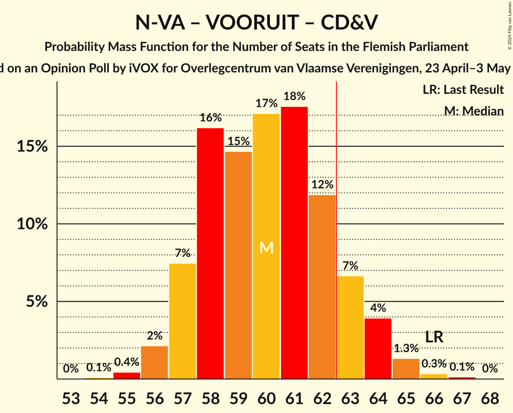

| Number of Seats | Probability | Accumulated | Special Marks |
|:---------------:|:-----------:|:-----------:|:-------------:|
| 54 | 0.1% | 100% |  |
| 55 | 0.5% | 99.9% |  |
| 56 | 2% | 99.4% |  |
| 57 | 8% | 97% |  |
| 58 | 17% | 89% |  |
| 59 | 16% | 72% | Median |
| 60 | 15% | 57% |  |
| 61 | 18% | 41% |  |
| 62 | 12% | 24% |  |
| 63 | 6% | 11% | Majority |
| 64 | 3% | 5% |  |
| 65 | 1.3% | 2% |  |
| 66 | 0.3% | 0.5% | Last Result |
| 67 | 0.2% | 0.2% |  |
| 68 | 0% | 0% |  |

### Nieuw-Vlaamse Alliantie – Vooruit – Open Vlaamse Liberalen en Democraten

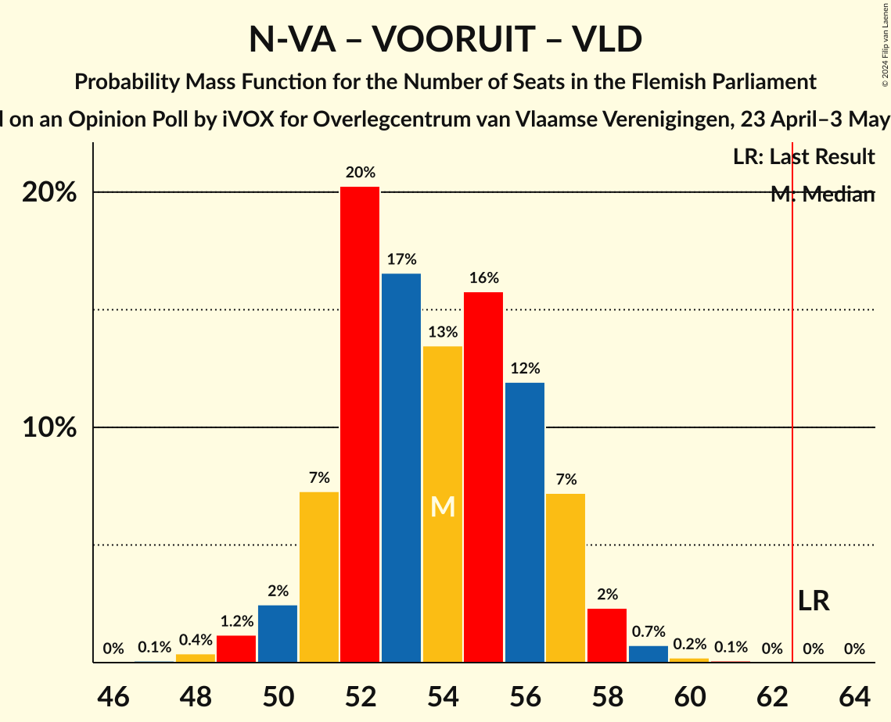

| Number of Seats | Probability | Accumulated | Special Marks |
|:---------------:|:-----------:|:-----------:|:-------------:|
| 47 | 0.1% | 100% |  |
| 48 | 0.4% | 99.9% |  |
| 49 | 1.2% | 99.6% |  |
| 50 | 2% | 98% |  |
| 51 | 7% | 96% |  |
| 52 | 22% | 89% |  |
| 53 | 18% | 67% | Median |
| 54 | 13% | 49% |  |
| 55 | 13% | 36% |  |
| 56 | 13% | 23% |  |
| 57 | 7% | 10% |  |
| 58 | 3% | 4% |  |
| 59 | 0.8% | 1.1% |  |
| 60 | 0.2% | 0.3% |  |
| 61 | 0.1% | 0.1% |  |
| 62 | 0% | 0% |  |
| 63 | 0% | 0% | Last Result, Majority |

### Vooruit – Christen-Democratisch en Vlaams – Partij van de Arbeid van België – Groen

| Number of Seats | Probability | Accumulated | Special Marks |
|:---------------:|:-----------:|:-----------:|:-------------:|
| 46 | 0.2% | 100% |  |
| 47 | 0.5% | 99.8% |  |
| 48 | 2% | 99.2% |  |
| 49 | 5% | 97% | Last Result |
| 50 | 8% | 93% |  |
| 51 | 11% | 84% |  |
| 52 | 22% | 73% |  |
| 53 | 21% | 51% | Median |
| 54 | 13% | 30% |  |
| 55 | 9% | 17% |  |
| 56 | 5% | 8% |  |
| 57 | 2% | 3% |  |
| 58 | 0.6% | 0.9% |  |
| 59 | 0.3% | 0.3% |  |
| 60 | 0% | 0% |  |

### Nieuw-Vlaamse Alliantie – Christen-Democratisch en Vlaams – Open Vlaamse Liberalen en Democraten

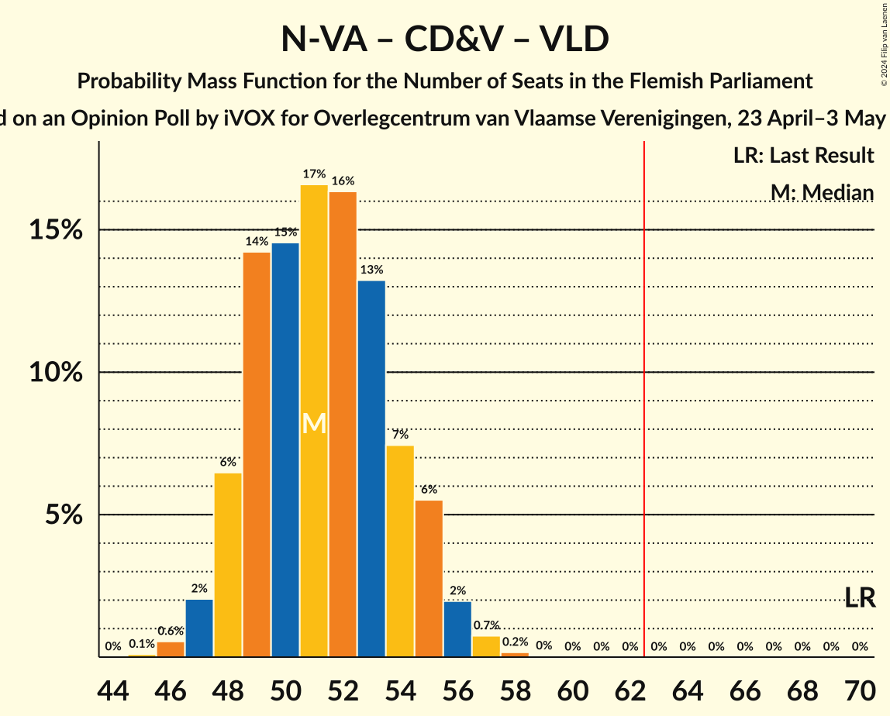

| Number of Seats | Probability | Accumulated | Special Marks |
|:---------------:|:-----------:|:-----------:|:-------------:|
| 45 | 0.1% | 100% |  |
| 46 | 0.6% | 99.9% |  |
| 47 | 2% | 99.3% |  |
| 48 | 7% | 98% |  |
| 49 | 14% | 91% |  |
| 50 | 15% | 77% | Median |
| 51 | 17% | 62% |  |
| 52 | 18% | 45% |  |
| 53 | 13% | 27% |  |
| 54 | 6% | 14% |  |
| 55 | 5% | 8% |  |
| 56 | 2% | 3% |  |
| 57 | 0.8% | 1.0% |  |
| 58 | 0.1% | 0.2% |  |
| 59 | 0% | 0% |  |
| 60 | 0% | 0% |  |
| 61 | 0% | 0% |  |
| 62 | 0% | 0% |  |
| 63 | 0% | 0% | Majority |
| 64 | 0% | 0% |  |
| 65 | 0% | 0% |  |
| 66 | 0% | 0% |  |
| 67 | 0% | 0% |  |
| 68 | 0% | 0% |  |
| 69 | 0% | 0% |  |
| 70 | 0% | 0% | Last Result |

### Vooruit – Christen-Democratisch en Vlaams – Groen – Open Vlaamse Liberalen en Democraten

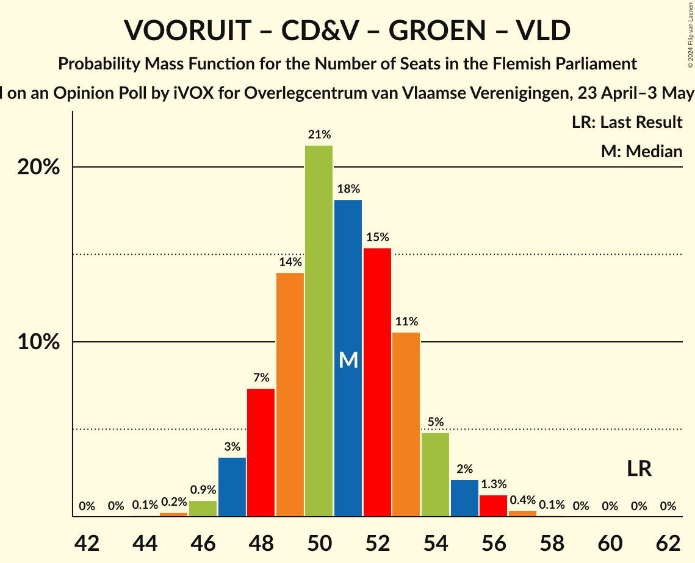

| Number of Seats | Probability | Accumulated | Special Marks |
|:---------------:|:-----------:|:-----------:|:-------------:|
| 44 | 0.1% | 100% |  |
| 45 | 0.2% | 99.9% |  |
| 46 | 0.8% | 99.7% |  |
| 47 | 4% | 98.9% |  |
| 48 | 8% | 95% |  |
| 49 | 13% | 87% |  |
| 50 | 21% | 74% | Median |
| 51 | 18% | 53% |  |
| 52 | 15% | 34% |  |
| 53 | 10% | 20% |  |
| 54 | 5% | 9% |  |
| 55 | 2% | 4% |  |
| 56 | 1.3% | 2% |  |
| 57 | 0.3% | 0.4% |  |
| 58 | 0.1% | 0.1% |  |
| 59 | 0% | 0% |  |
| 60 | 0% | 0% |  |
| 61 | 0% | 0% | Last Result |

### Nieuw-Vlaamse Alliantie – Christen-Democratisch en Vlaams

| Number of Seats | Probability | Accumulated | Special Marks |
|:---------------:|:-----------:|:-----------:|:-------------:|
| 37 | 0.1% | 100% |  |
| 38 | 0.5% | 99.9% |  |
| 39 | 2% | 99.4% |  |
| 40 | 8% | 98% |  |
| 41 | 17% | 90% |  |
| 42 | 19% | 73% | Median |
| 43 | 16% | 54% |  |
| 44 | 19% | 38% |  |
| 45 | 12% | 19% |  |
| 46 | 4% | 7% |  |
| 47 | 3% | 4% |  |
| 48 | 0.6% | 0.8% |  |
| 49 | 0.1% | 0.1% |  |
| 50 | 0% | 0% |  |
| 51 | 0% | 0% |  |
| 52 | 0% | 0% |  |
| 53 | 0% | 0% |  |
| 54 | 0% | 0% | Last Result |

### Vooruit – Christen-Democratisch en Vlaams – Groen

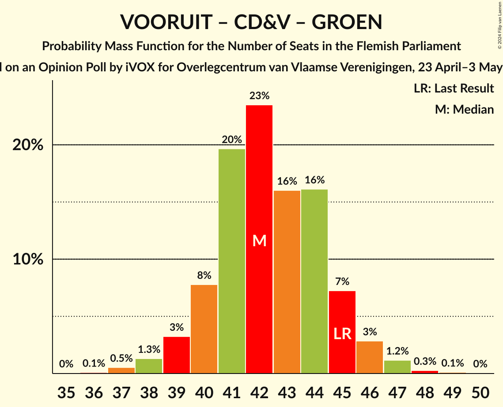

| Number of Seats | Probability | Accumulated | Special Marks |
|:---------------:|:-----------:|:-----------:|:-------------:|
| 36 | 0.1% | 100% |  |
| 37 | 0.6% | 99.9% |  |
| 38 | 1.3% | 99.3% |  |
| 39 | 3% | 98% |  |
| 40 | 8% | 95% |  |
| 41 | 20% | 87% |  |
| 42 | 22% | 66% | Median |
| 43 | 16% | 44% |  |
| 44 | 15% | 27% |  |
| 45 | 8% | 12% | Last Result |
| 46 | 3% | 4% |  |
| 47 | 1.0% | 1.5% |  |
| 48 | 0.3% | 0.4% |  |
| 49 | 0.1% | 0.1% |  |
| 50 | 0.1% | 0.1% |  |
| 51 | 0% | 0% |  |

### Vooruit – Christen-Democratisch en Vlaams – Open Vlaamse Liberalen en Democraten

| Number of Seats | Probability | Accumulated | Special Marks |
|:---------------:|:-----------:|:-----------:|:-------------:|
| 34 | 0.1% | 100% |  |
| 35 | 0.5% | 99.9% |  |
| 36 | 2% | 99.4% |  |
| 37 | 5% | 97% |  |
| 38 | 11% | 93% |  |
| 39 | 21% | 82% | Median |
| 40 | 19% | 61% |  |
| 41 | 15% | 42% |  |
| 42 | 13% | 27% |  |
| 43 | 7% | 14% |  |
| 44 | 4% | 7% |  |
| 45 | 2% | 3% |  |
| 46 | 0.9% | 1.1% |  |
| 47 | 0.1% | 0.1% | Last Result |
| 48 | 0% | 0% |  |

### Vooruit – Groen – Open Vlaamse Liberalen en Democraten

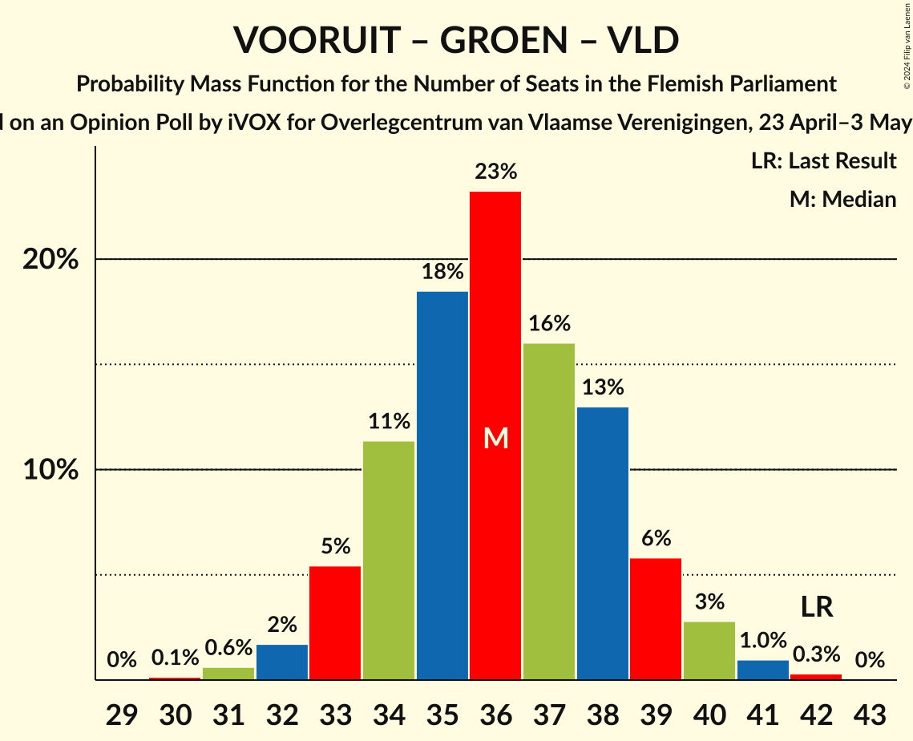

| Number of Seats | Probability | Accumulated | Special Marks |
|:---------------:|:-----------:|:-----------:|:-------------:|
| 30 | 0.1% | 100% |  |
| 31 | 0.7% | 99.8% |  |
| 32 | 2% | 99.1% |  |
| 33 | 6% | 98% |  |
| 34 | 12% | 92% |  |
| 35 | 18% | 80% |  |
| 36 | 22% | 62% | Median |
| 37 | 18% | 40% |  |
| 38 | 12% | 22% |  |
| 39 | 6% | 10% |  |
| 40 | 3% | 4% |  |
| 41 | 1.1% | 1.4% |  |
| 42 | 0.3% | 0.3% | Last Result |
| 43 | 0% | 0% |  |

### Nieuw-Vlaamse Alliantie – Open Vlaamse Liberalen en Democraten

| Number of Seats | Probability | Accumulated | Special Marks |
|:---------------:|:-----------:|:-----------:|:-------------:|
| 31 | 0.1% | 100% |  |
| 32 | 0.5% | 99.8% |  |
| 33 | 3% | 99.4% |  |
| 34 | 10% | 97% |  |
| 35 | 20% | 87% |  |
| 36 | 19% | 67% | Median |
| 37 | 14% | 48% |  |
| 38 | 19% | 34% |  |
| 39 | 9% | 15% |  |
| 40 | 4% | 6% |  |
| 41 | 2% | 2% |  |
| 42 | 0.4% | 0.6% |  |
| 43 | 0.1% | 0.2% |  |
| 44 | 0% | 0% |  |
| 45 | 0% | 0% |  |
| 46 | 0% | 0% |  |
| 47 | 0% | 0% |  |
| 48 | 0% | 0% |  |
| 49 | 0% | 0% |  |
| 50 | 0% | 0% |  |
| 51 | 0% | 0% | Last Result |

### Christen-Democratisch en Vlaams – Groen – Open Vlaamse Liberalen en Democraten

| Number of Seats | Probability | Accumulated | Special Marks |
|:---------------:|:-----------:|:-----------:|:-------------:|
| 27 | 0.1% | 100% |  |
| 28 | 0.2% | 99.9% |  |
| 29 | 0.8% | 99.7% |  |
| 30 | 3% | 98.9% |  |
| 31 | 8% | 96% |  |
| 32 | 12% | 88% |  |
| 33 | 30% | 76% | Median |
| 34 | 15% | 46% |  |
| 35 | 16% | 31% |  |
| 36 | 8% | 15% |  |
| 37 | 4% | 7% |  |
| 38 | 2% | 3% |  |
| 39 | 0.5% | 0.7% |  |
| 40 | 0.2% | 0.2% |  |
| 41 | 0.1% | 0.1% |  |
| 42 | 0% | 0% |  |
| 43 | 0% | 0% |  |
| 44 | 0% | 0% |  |
| 45 | 0% | 0% |  |
| 46 | 0% | 0% |  |
| 47 | 0% | 0% |  |
| 48 | 0% | 0% |  |
| 49 | 0% | 0% | Last Result |

### Vooruit – Christen-Democratisch en Vlaams

| Number of Seats | Probability | Accumulated | Special Marks |
|:---------------:|:-----------:|:-----------:|:-------------:|
| 26 | 0.1% | 100% |  |
| 27 | 0.3% | 99.9% |  |
| 28 | 1.3% | 99.7% |  |
| 29 | 4% | 98% |  |
| 30 | 18% | 95% |  |
| 31 | 25% | 76% | Last Result, Median |
| 32 | 18% | 52% |  |
| 33 | 14% | 34% |  |
| 34 | 13% | 19% |  |
| 35 | 4% | 6% |  |
| 36 | 2% | 3% |  |
| 37 | 0.4% | 0.5% |  |
| 38 | 0.1% | 0.1% |  |
| 39 | 0% | 0% |  |

### Vooruit – Open Vlaamse Liberalen en Democraten

| Number of Seats | Probability | Accumulated | Special Marks |
|:---------------:|:-----------:|:-----------:|:-------------:|
| 20 | 0.2% | 100% |  |
| 21 | 0.8% | 99.8% |  |
| 22 | 3% | 99.0% |  |
| 23 | 6% | 96% |  |
| 24 | 15% | 90% |  |
| 25 | 27% | 75% | Median |
| 26 | 20% | 48% |  |
| 27 | 16% | 29% |  |
| 28 | 8% | 13% | Last Result |
| 29 | 3% | 5% |  |
| 30 | 1.1% | 2% |  |
| 31 | 0.4% | 0.4% |  |
| 32 | 0% | 0% |  |

### Christen-Democratisch en Vlaams – Open Vlaamse Liberalen en Democraten

| Number of Seats | Probability | Accumulated | Special Marks |
|:---------------:|:-----------:|:-----------:|:-------------:|
| 18 | 0.2% | 100% |  |
| 19 | 1.2% | 99.8% |  |
| 20 | 4% | 98.6% |  |
| 21 | 9% | 95% |  |
| 22 | 31% | 86% | Median |
| 23 | 17% | 54% |  |
| 24 | 14% | 37% |  |
| 25 | 13% | 23% |  |
| 26 | 6% | 10% |  |
| 27 | 3% | 4% |  |
| 28 | 0.7% | 0.8% |  |
| 29 | 0.1% | 0.2% |  |
| 30 | 0% | 0% |  |
| 31 | 0% | 0% |  |
| 32 | 0% | 0% |  |
| 33 | 0% | 0% |  |
| 34 | 0% | 0% |  |
| 35 | 0% | 0% | Last Result |

## Technical Information

### Opinion Poll

+ **Polling firm:** iVOX
+ **Commissioner(s):** Overlegcentrum van Vlaamse Verenigingen
+ **Fieldwork period:** 23 April–3 May 2024

### Calculations

+ **Sample size:** 1579
+ **Simulations done:** 1,048,576
+ **Error estimate:** 0.73%

