# Opinion Poll by Ipsos for Het Laatste Nieuws, Le Soir, RTL TVi and VTM, 11–17 September 2024

<a href="#voting-intentions">Voting Intentions</a> | <a href="#seats">Seats</a> | <a href="#coalitions">Coalitions</a> | <a href="#technical-information">Technical Information</a>

## Voting Intentions

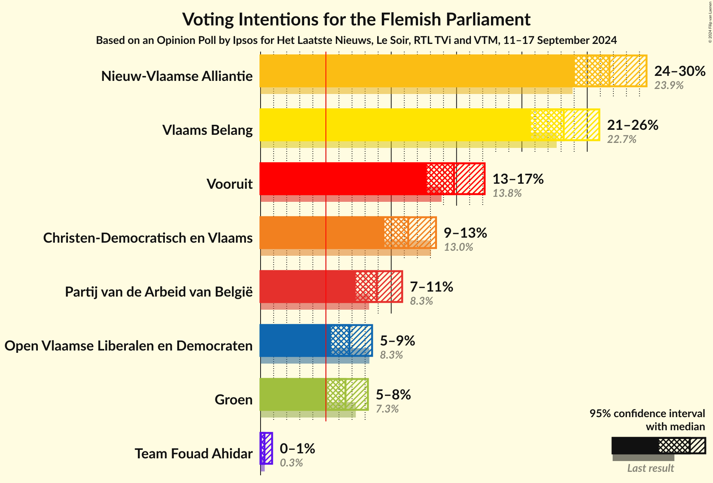

### Confidence Intervals

| Party | Last Result | Poll Result | 80% Confidence Interval | 90% Confidence Interval | 95% Confidence Interval | 99% Confidence Interval |
|:-----:|:-----------:|:-----------:|:-----------------------:|:-----------------------:|:-----------------------:|:-----------------------:|
| Nieuw-Vlaamse Alliantie | 23.9% | 26.7% | 25.0–28.6% |24.5–29.1% |24.1–29.5% |23.2–30.4% |
| Vlaams Belang | 22.7% | 23.2% | 21.6–25.0% |21.1–25.5% |20.7–25.9% |19.9–26.8% |
| Vooruit | 13.8% | 14.8% | 13.4–16.3% |13.1–16.8% |12.7–17.1% |12.1–17.9% |
| Christen-Democratisch en Vlaams | 13.0% | 11.3% | 10.1–12.7% |9.8–13.1% |9.5–13.4% |8.9–14.1% |
| Partij van de Arbeid van België | 8.3% | 8.9% | 7.8–10.2% |7.5–10.5% |7.3–10.8% |6.8–11.5% |
| Open Vlaamse Liberalen en Democraten | 8.3% | 6.8% | 5.9–7.9% |5.6–8.3% |5.4–8.5% |5.0–9.1% |
| Groen | 7.3% | 6.5% | 5.6–7.6% |5.3–7.9% |5.1–8.2% |4.7–8.8% |
| Team Fouad Ahidar | 0.3% | 0.3% | 0.2–0.7% |0.1–0.8% |0.1–0.9% |0.1–1.1% |

*Note:* The poll result column reflects the actual value used in the calculations. Published results may vary slightly, and in addition be rounded to fewer digits.

## Seats

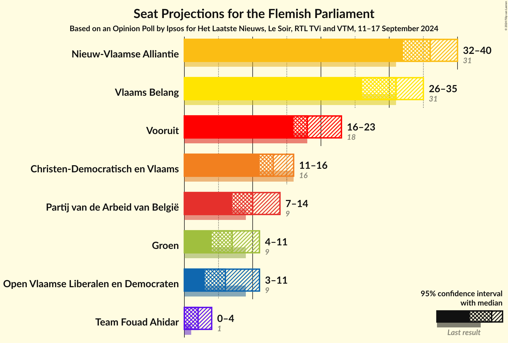

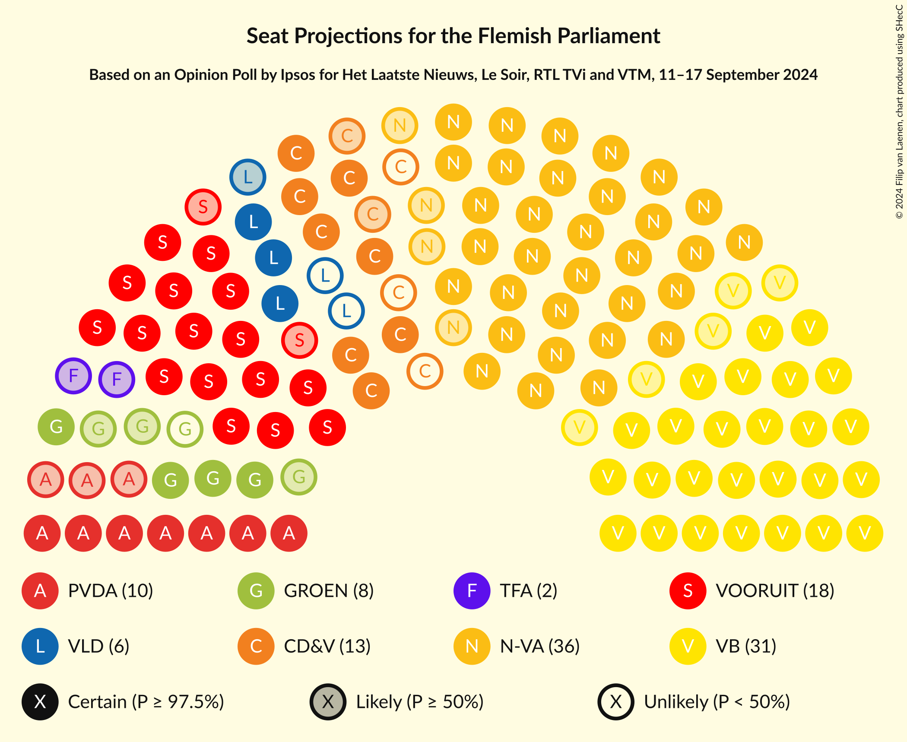

### Confidence Intervals

| Party | Last Result | Median | 80% Confidence Interval | 90% Confidence Interval | 95% Confidence Interval | 99% Confidence Interval |
|:-----:|:-----------:|:------:|:-----------------------:|:-----------------------:|:-----------------------:|:-----------------------:|
| <a href="#nieuw-vlaamse-alliantie">Nieuw-Vlaamse Alliantie</a> | 31 | 36 | 33–39 |32–39 |32–40 |30–42 |
| <a href="#vlaams-belang">Vlaams Belang</a> | 31 | 31 | 28–33 |27–34 |26–35 |25–36 |
| <a href="#vooruit">Vooruit</a> | 18 | 18 | 17–21 |16–22 |16–23 |15–23 |
| <a href="#christen-democratisch-en-vlaams">Christen-Democratisch en Vlaams</a> | 16 | 13 | 11–16 |11–16 |11–16 |11–17 |
| <a href="#partij-van-de-arbeid-van-belgië">Partij van de Arbeid van België</a> | 9 | 10 | 8–12 |7–13 |7–14 |6–14 |
| <a href="#open-vlaamse-liberalen-en-democraten">Open Vlaamse Liberalen en Democraten</a> | 9 | 6 | 5–9 |4–10 |3–11 |2–12 |
| <a href="#groen">Groen</a> | 9 | 7 | 5–9 |5–11 |4–11 |3–11 |
| <a href="#team-fouad-ahidar">Team Fouad Ahidar</a> | 1 | 2 | 1–3 |0–3 |0–4 |0–4 |

### Nieuw-Vlaamse Alliantie

*For a full overview of the results for this party, see the [Nieuw-Vlaamse Alliantie](party-nieuw-vlaamsealliantie.html) page.*

| Number of Seats | Probability | Accumulated | Special Marks |
|:---------------:|:-----------:|:-----------:|:-------------:|
| 29 | 0.1% | 100% |  |
| 30 | 0.5% | 99.9% |  |
| 31 | 2% | 99.4% | Last Result |
| 32 | 3% | 98% |  |
| 33 | 5% | 94% |  |
| 34 | 8% | 89% |  |
| 35 | 20% | 80% |  |
| 36 | 24% | 60% | Median |
| 37 | 16% | 37% |  |
| 38 | 9% | 20% |  |
| 39 | 8% | 12% |  |
| 40 | 2% | 4% |  |
| 41 | 0.7% | 1.4% |  |
| 42 | 0.6% | 0.7% |  |
| 43 | 0.1% | 0.1% |  |
| 44 | 0% | 0% |  |

### Vlaams Belang

*For a full overview of the results for this party, see the [Vlaams Belang](party-vlaamsbelang.html) page.*

| Number of Seats | Probability | Accumulated | Special Marks |
|:---------------:|:-----------:|:-----------:|:-------------:|
| 24 | 0.1% | 100% |  |
| 25 | 0.8% | 99.9% |  |
| 26 | 2% | 99.1% |  |
| 27 | 4% | 97% |  |
| 28 | 10% | 94% |  |
| 29 | 14% | 84% |  |
| 30 | 17% | 70% |  |
| 31 | 18% | 53% | Last Result, Median |
| 32 | 18% | 35% |  |
| 33 | 7% | 17% |  |
| 34 | 6% | 9% |  |
| 35 | 2% | 4% |  |
| 36 | 1.2% | 2% |  |
| 37 | 0.3% | 0.4% |  |
| 38 | 0% | 0.1% |  |
| 39 | 0% | 0% |  |

### Vooruit

*For a full overview of the results for this party, see the [Vooruit](party-vooruit.html) page.*

| Number of Seats | Probability | Accumulated | Special Marks |
|:---------------:|:-----------:|:-----------:|:-------------:|
| 13 | 0.1% | 100% |  |
| 14 | 0.4% | 99.9% |  |
| 15 | 0.7% | 99.6% |  |
| 16 | 7% | 98.9% |  |
| 17 | 17% | 92% |  |
| 18 | 28% | 76% | Last Result, Median |
| 19 | 20% | 48% |  |
| 20 | 11% | 28% |  |
| 21 | 9% | 18% |  |
| 22 | 5% | 9% |  |
| 23 | 3% | 4% |  |
| 24 | 0.3% | 0.4% |  |
| 25 | 0.1% | 0.1% |  |
| 26 | 0% | 0% |  |

### Christen-Democratisch en Vlaams

*For a full overview of the results for this party, see the [Christen-Democratisch en Vlaams](party-christen-democratischenvlaams.html) page.*

| Number of Seats | Probability | Accumulated | Special Marks |
|:---------------:|:-----------:|:-----------:|:-------------:|
| 10 | 0.2% | 100% |  |
| 11 | 15% | 99.8% |  |
| 12 | 27% | 85% |  |
| 13 | 15% | 58% | Median |
| 14 | 13% | 42% |  |
| 15 | 10% | 29% |  |
| 16 | 17% | 19% | Last Result |
| 17 | 2% | 2% |  |
| 18 | 0.2% | 0.3% |  |
| 19 | 0.1% | 0.1% |  |
| 20 | 0% | 0% |  |

### Partij van de Arbeid van België

*For a full overview of the results for this party, see the [Partij van de Arbeid van België](party-partijvandearbeidvanbelgië.html) page.*

| Number of Seats | Probability | Accumulated | Special Marks |
|:---------------:|:-----------:|:-----------:|:-------------:|
| 6 | 1.5% | 100% |  |
| 7 | 8% | 98% |  |
| 8 | 3% | 90% |  |
| 9 | 7% | 87% | Last Result |
| 10 | 47% | 80% | Median |
| 11 | 20% | 33% |  |
| 12 | 8% | 13% |  |
| 13 | 3% | 6% |  |
| 14 | 2% | 3% |  |
| 15 | 0.2% | 0.2% |  |
| 16 | 0% | 0.1% |  |
| 17 | 0% | 0% |  |

### Open Vlaamse Liberalen en Democraten

*For a full overview of the results for this party, see the [Open Vlaamse Liberalen en Democraten](party-openvlaamseliberalenendemocraten.html) page.*

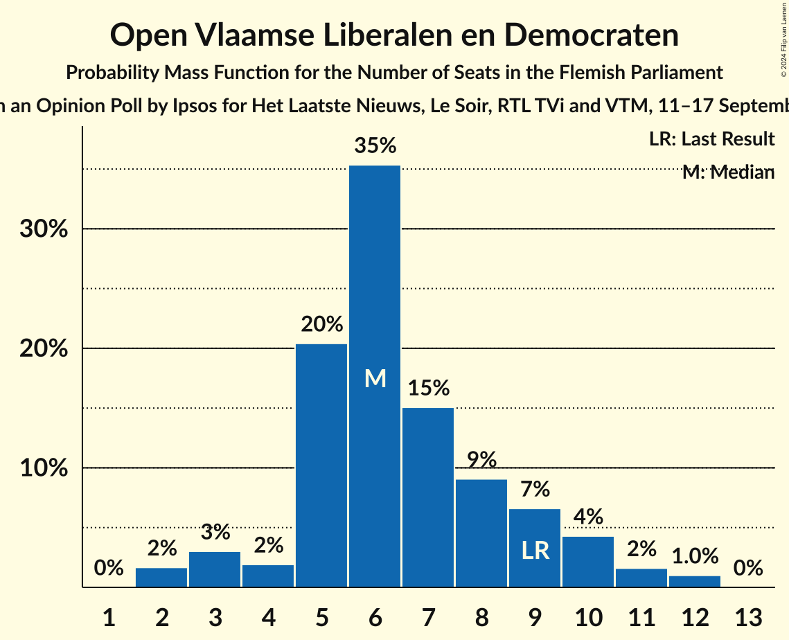

| Number of Seats | Probability | Accumulated | Special Marks |
|:---------------:|:-----------:|:-----------:|:-------------:|
| 2 | 2% | 100% |  |
| 3 | 3% | 98% |  |
| 4 | 2% | 95% |  |
| 5 | 20% | 93% |  |
| 6 | 35% | 73% | Median |
| 7 | 15% | 38% |  |
| 8 | 9% | 23% |  |
| 9 | 7% | 14% | Last Result |
| 10 | 4% | 7% |  |
| 11 | 2% | 3% |  |
| 12 | 1.0% | 1.0% |  |
| 13 | 0% | 0% |  |

### Groen

*For a full overview of the results for this party, see the [Groen](party-groen.html) page.*

| Number of Seats | Probability | Accumulated | Special Marks |
|:---------------:|:-----------:|:-----------:|:-------------:|
| 1 | 0.2% | 100% |  |
| 2 | 0.2% | 99.8% |  |
| 3 | 0.7% | 99.6% |  |
| 4 | 3% | 98.9% |  |
| 5 | 16% | 96% |  |
| 6 | 21% | 80% |  |
| 7 | 16% | 59% | Median |
| 8 | 17% | 43% |  |
| 9 | 19% | 26% | Last Result |
| 10 | 2% | 7% |  |
| 11 | 5% | 5% |  |
| 12 | 0.2% | 0.3% |  |
| 13 | 0% | 0% |  |

### Team Fouad Ahidar

*For a full overview of the results for this party, see the [Team Fouad Ahidar](party-teamfouadahidar.html) page.*

| Number of Seats | Probability | Accumulated | Special Marks |
|:---------------:|:-----------:|:-----------:|:-------------:|
| 0 | 9% | 100% |  |
| 1 | 38% | 91% | Last Result |
| 2 | 36% | 53% | Median |
| 3 | 14% | 17% |  |
| 4 | 3% | 3% |  |
| 5 | 0.3% | 0.3% |  |
| 6 | 0% | 0% |  |

## Coalitions

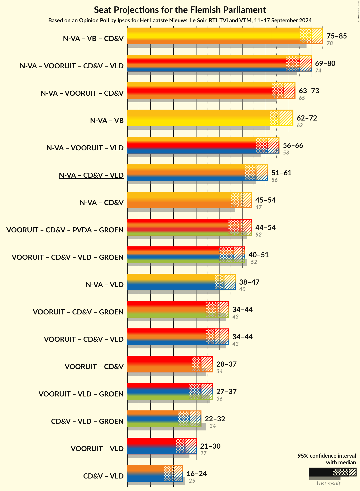

### Confidence Intervals

| Coalition | Last Result | Median | Majority? | 80% Confidence Interval | 90% Confidence Interval | 95% Confidence Interval | 99% Confidence Interval |
|:---------:|:-----------:|:------:|:---------:|:-----------------------:|:-----------------------:|:-----------------------:|:-----------------------:|
| Nieuw-Vlaamse Alliantie – Vlaams Belang – Christen-Democratisch en Vlaams | 78 | 80 | 100% | 77–83 | 76–84 | 75–85 | 73–87 |
| Nieuw-Vlaamse Alliantie – Vooruit – Christen-Democratisch en Vlaams – Open Vlaamse Liberalen en Democraten | 74 | 75 | 100% | 71–78 | 70–79 | 69–80 | 68–81 |
| Nieuw-Vlaamse Alliantie – Vooruit – Christen-Democratisch en Vlaams | 65 | 68 | 98% | 65–71 | 64–72 | 63–73 | 61–75 |
| Nieuw-Vlaamse Alliantie – Vlaams Belang | 62 | 66 | 94% | 63–70 | 62–71 | 62–72 | 60–73 |
| Nieuw-Vlaamse Alliantie – Vooruit – Open Vlaamse Liberalen en Democraten | 58 | 61 | 30% | 58–64 | 57–65 | 56–66 | 54–68 |
| Nieuw-Vlaamse Alliantie – Christen-Democratisch en Vlaams – Open Vlaamse Liberalen en Democraten | 56 | 56 | 0.5% | 52–59 | 51–60 | 51–61 | 49–63 |
| Nieuw-Vlaamse Alliantie – Christen-Democratisch en Vlaams | 47 | 49 | 0% | 46–52 | 46–53 | 45–54 | 43–56 |
| Vooruit – Christen-Democratisch en Vlaams – Partij van de Arbeid van België – Groen | 52 | 49 | 0% | 46–53 | 45–54 | 44–54 | 42–56 |
| Vooruit – Christen-Democratisch en Vlaams – Open Vlaamse Liberalen en Democraten – Groen | 52 | 46 | 0% | 42–49 | 41–50 | 40–51 | 39–53 |
| Nieuw-Vlaamse Alliantie – Open Vlaamse Liberalen en Democraten | 40 | 42 | 0% | 39–45 | 38–46 | 38–47 | 36–49 |
| Vooruit – Christen-Democratisch en Vlaams – Groen | 43 | 39 | 0% | 36–43 | 35–43 | 34–44 | 33–46 |
| Vooruit – Christen-Democratisch en Vlaams – Open Vlaamse Liberalen en Democraten | 43 | 38 | 0% | 35–42 | 34–43 | 34–44 | 32–45 |
| Vooruit – Christen-Democratisch en Vlaams | 34 | 32 | 0% | 29–35 | 29–36 | 28–37 | 27–38 |
| Vooruit – Open Vlaamse Liberalen en Democraten – Groen | 36 | 32 | 0% | 29–36 | 28–37 | 27–37 | 26–39 |
| Christen-Democratisch en Vlaams – Open Vlaamse Liberalen en Democraten – Groen | 34 | 27 | 0% | 23–31 | 23–32 | 22–32 | 21–34 |
| Vooruit – Open Vlaamse Liberalen en Democraten | 27 | 25 | 0% | 22–28 | 22–29 | 21–30 | 19–32 |
| Christen-Democratisch en Vlaams – Open Vlaamse Liberalen en Democraten | 25 | 19 | 0% | 17–23 | 17–24 | 16–24 | 14–26 |

### Nieuw-Vlaamse Alliantie – Vlaams Belang – Christen-Democratisch en Vlaams

| Number of Seats | Probability | Accumulated | Special Marks |
|:---------------:|:-----------:|:-----------:|:-------------:|
| 71 | 0.1% | 100% |  |
| 72 | 0.2% | 99.9% |  |
| 73 | 0.5% | 99.7% |  |
| 74 | 0.9% | 99.2% |  |
| 75 | 3% | 98% |  |
| 76 | 5% | 96% |  |
| 77 | 8% | 91% |  |
| 78 | 14% | 82% | Last Result |
| 79 | 12% | 68% |  |
| 80 | 12% | 56% | Median |
| 81 | 16% | 45% |  |
| 82 | 13% | 28% |  |
| 83 | 9% | 16% |  |
| 84 | 4% | 7% |  |
| 85 | 1.2% | 3% |  |
| 86 | 1.5% | 2% |  |
| 87 | 0.5% | 0.7% |  |
| 88 | 0.1% | 0.2% |  |
| 89 | 0% | 0% |  |

### Nieuw-Vlaamse Alliantie – Vooruit – Christen-Democratisch en Vlaams – Open Vlaamse Liberalen en Democraten

| Number of Seats | Probability | Accumulated | Special Marks |
|:---------------:|:-----------:|:-----------:|:-------------:|
| 66 | 0.1% | 100% |  |
| 67 | 0.2% | 99.8% |  |
| 68 | 0.8% | 99.6% |  |
| 69 | 1.4% | 98.8% |  |
| 70 | 3% | 97% |  |
| 71 | 7% | 95% |  |
| 72 | 8% | 88% |  |
| 73 | 16% | 79% | Median |
| 74 | 13% | 63% | Last Result |
| 75 | 17% | 50% |  |
| 76 | 13% | 34% |  |
| 77 | 11% | 21% |  |
| 78 | 4% | 11% |  |
| 79 | 3% | 6% |  |
| 80 | 2% | 3% |  |
| 81 | 0.8% | 1.2% |  |
| 82 | 0.3% | 0.4% |  |
| 83 | 0.1% | 0.1% |  |
| 84 | 0% | 0% |  |

### Nieuw-Vlaamse Alliantie – Vooruit – Christen-Democratisch en Vlaams

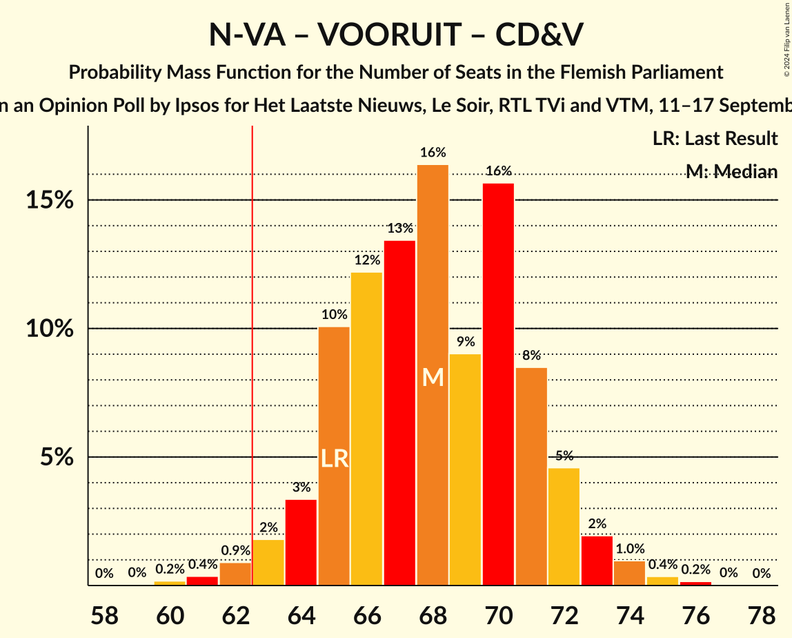

| Number of Seats | Probability | Accumulated | Special Marks |
|:---------------:|:-----------:|:-----------:|:-------------:|
| 59 | 0% | 100% |  |
| 60 | 0.2% | 99.9% |  |
| 61 | 0.4% | 99.8% |  |
| 62 | 0.9% | 99.4% |  |
| 63 | 2% | 98% | Majority |
| 64 | 3% | 97% |  |
| 65 | 10% | 93% | Last Result |
| 66 | 12% | 83% |  |
| 67 | 13% | 71% | Median |
| 68 | 16% | 58% |  |
| 69 | 9% | 41% |  |
| 70 | 16% | 32% |  |
| 71 | 8% | 17% |  |
| 72 | 5% | 8% |  |
| 73 | 2% | 3% |  |
| 74 | 1.0% | 2% |  |
| 75 | 0.4% | 0.6% |  |
| 76 | 0.2% | 0.2% |  |
| 77 | 0% | 0% |  |

### Nieuw-Vlaamse Alliantie – Vlaams Belang

| Number of Seats | Probability | Accumulated | Special Marks |
|:---------------:|:-----------:|:-----------:|:-------------:|
| 57 | 0% | 100% |  |
| 58 | 0.1% | 99.9% |  |
| 59 | 0.3% | 99.8% |  |
| 60 | 0.6% | 99.6% |  |
| 61 | 1.2% | 99.0% |  |
| 62 | 3% | 98% | Last Result |
| 63 | 6% | 94% | Majority |
| 64 | 11% | 88% |  |
| 65 | 12% | 77% |  |
| 66 | 15% | 65% |  |
| 67 | 12% | 50% | Median |
| 68 | 11% | 38% |  |
| 69 | 15% | 27% |  |
| 70 | 5% | 12% |  |
| 71 | 4% | 7% |  |
| 72 | 2% | 3% |  |
| 73 | 0.9% | 1.2% |  |
| 74 | 0.2% | 0.3% |  |
| 75 | 0% | 0.1% |  |
| 76 | 0% | 0% |  |

### Nieuw-Vlaamse Alliantie – Vooruit – Open Vlaamse Liberalen en Democraten

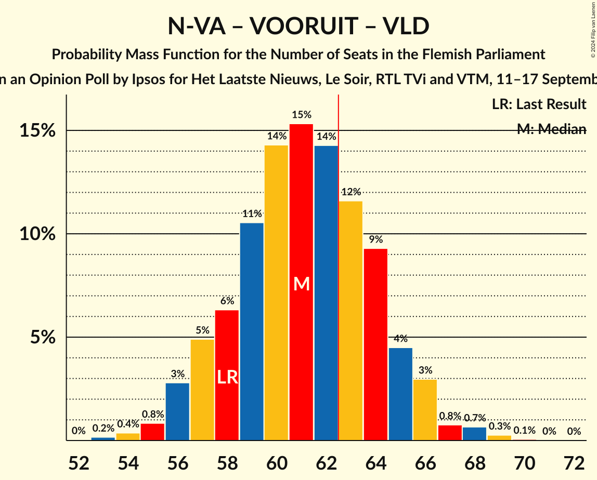

| Number of Seats | Probability | Accumulated | Special Marks |
|:---------------:|:-----------:|:-----------:|:-------------:|
| 52 | 0% | 100% |  |
| 53 | 0.2% | 99.9% |  |
| 54 | 0.4% | 99.8% |  |
| 55 | 0.8% | 99.4% |  |
| 56 | 3% | 98.6% |  |
| 57 | 5% | 96% |  |
| 58 | 6% | 91% | Last Result |
| 59 | 11% | 85% |  |
| 60 | 14% | 74% | Median |
| 61 | 15% | 60% |  |
| 62 | 14% | 44% |  |
| 63 | 12% | 30% | Majority |
| 64 | 9% | 19% |  |
| 65 | 4% | 9% |  |
| 66 | 3% | 5% |  |
| 67 | 0.8% | 2% |  |
| 68 | 0.7% | 1.0% |  |
| 69 | 0.3% | 0.3% |  |
| 70 | 0.1% | 0.1% |  |
| 71 | 0% | 0% |  |

### Nieuw-Vlaamse Alliantie – Christen-Democratisch en Vlaams – Open Vlaamse Liberalen en Democraten

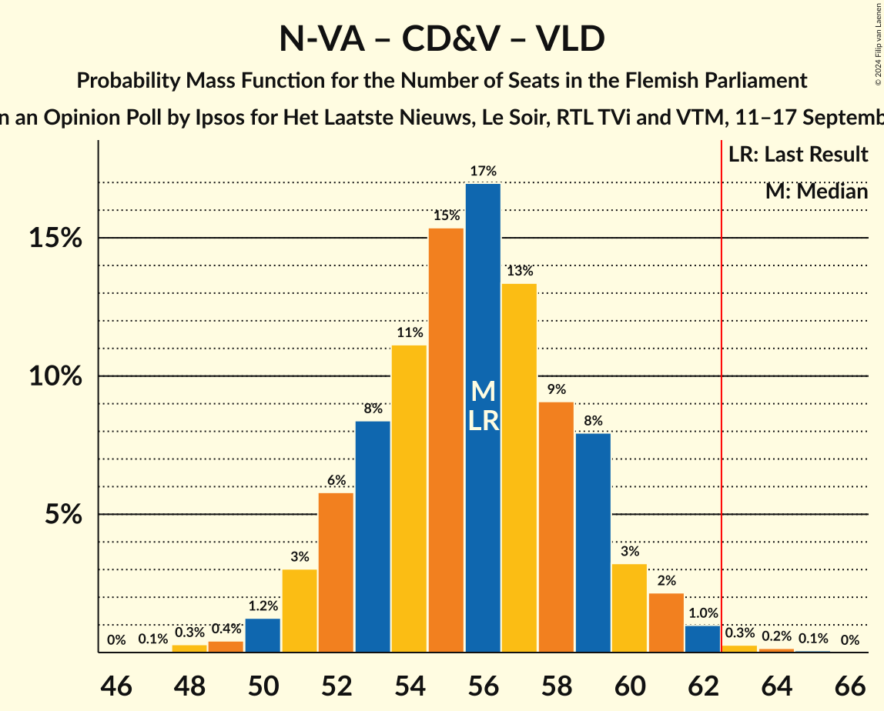

| Number of Seats | Probability | Accumulated | Special Marks |
|:---------------:|:-----------:|:-----------:|:-------------:|
| 47 | 0.1% | 100% |  |
| 48 | 0.3% | 99.9% |  |
| 49 | 0.4% | 99.6% |  |
| 50 | 1.2% | 99.2% |  |
| 51 | 3% | 98% |  |
| 52 | 6% | 95% |  |
| 53 | 8% | 89% |  |
| 54 | 11% | 81% |  |
| 55 | 15% | 70% | Median |
| 56 | 17% | 54% | Last Result |
| 57 | 13% | 37% |  |
| 58 | 9% | 24% |  |
| 59 | 8% | 15% |  |
| 60 | 3% | 7% |  |
| 61 | 2% | 4% |  |
| 62 | 1.0% | 1.5% |  |
| 63 | 0.3% | 0.5% | Majority |
| 64 | 0.2% | 0.2% |  |
| 65 | 0.1% | 0.1% |  |
| 66 | 0% | 0% |  |

### Nieuw-Vlaamse Alliantie – Christen-Democratisch en Vlaams

| Number of Seats | Probability | Accumulated | Special Marks |
|:---------------:|:-----------:|:-----------:|:-------------:|
| 41 | 0.1% | 100% |  |
| 42 | 0.2% | 99.9% |  |
| 43 | 0.6% | 99.7% |  |
| 44 | 1.4% | 99.1% |  |
| 45 | 2% | 98% |  |
| 46 | 6% | 95% |  |
| 47 | 13% | 89% | Last Result |
| 48 | 11% | 76% |  |
| 49 | 19% | 65% | Median |
| 50 | 14% | 45% |  |
| 51 | 13% | 31% |  |
| 52 | 9% | 18% |  |
| 53 | 6% | 9% |  |
| 54 | 2% | 4% |  |
| 55 | 0.9% | 1.5% |  |
| 56 | 0.4% | 0.6% |  |
| 57 | 0.1% | 0.2% |  |
| 58 | 0% | 0% |  |

### Vooruit – Christen-Democratisch en Vlaams – Partij van de Arbeid van België – Groen

| Number of Seats | Probability | Accumulated | Special Marks |
|:---------------:|:-----------:|:-----------:|:-------------:|
| 41 | 0.1% | 100% |  |
| 42 | 0.4% | 99.8% |  |
| 43 | 1.4% | 99.5% |  |
| 44 | 3% | 98% |  |
| 45 | 4% | 95% |  |
| 46 | 7% | 92% |  |
| 47 | 14% | 85% |  |
| 48 | 11% | 71% | Median |
| 49 | 12% | 60% |  |
| 50 | 14% | 49% |  |
| 51 | 10% | 35% |  |
| 52 | 10% | 24% | Last Result |
| 53 | 8% | 14% |  |
| 54 | 3% | 6% |  |
| 55 | 1.4% | 2% |  |
| 56 | 0.6% | 1.0% |  |
| 57 | 0.3% | 0.4% |  |
| 58 | 0.1% | 0.2% |  |
| 59 | 0% | 0% |  |

### Vooruit – Christen-Democratisch en Vlaams – Open Vlaamse Liberalen en Democraten – Groen

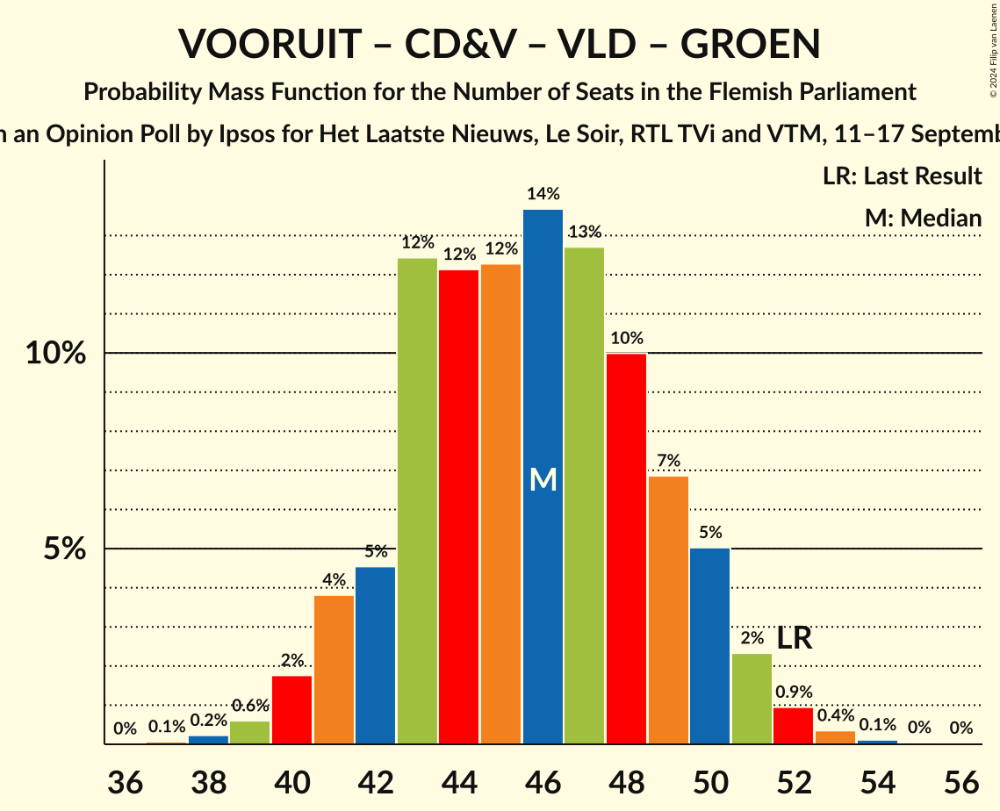

| Number of Seats | Probability | Accumulated | Special Marks |
|:---------------:|:-----------:|:-----------:|:-------------:|
| 37 | 0.1% | 100% |  |
| 38 | 0.2% | 99.9% |  |
| 39 | 0.6% | 99.7% |  |
| 40 | 2% | 99.1% |  |
| 41 | 4% | 97% |  |
| 42 | 5% | 94% |  |
| 43 | 12% | 89% |  |
| 44 | 12% | 77% | Median |
| 45 | 12% | 64% |  |
| 46 | 14% | 52% |  |
| 47 | 13% | 38% |  |
| 48 | 10% | 26% |  |
| 49 | 7% | 16% |  |
| 50 | 5% | 9% |  |
| 51 | 2% | 4% |  |
| 52 | 0.9% | 1.5% | Last Result |
| 53 | 0.4% | 0.5% |  |
| 54 | 0.1% | 0.2% |  |
| 55 | 0% | 0.1% |  |
| 56 | 0% | 0% |  |

### Nieuw-Vlaamse Alliantie – Open Vlaamse Liberalen en Democraten

| Number of Seats | Probability | Accumulated | Special Marks |
|:---------------:|:-----------:|:-----------:|:-------------:|
| 34 | 0.1% | 100% |  |
| 35 | 0.2% | 99.9% |  |
| 36 | 0.7% | 99.7% |  |
| 37 | 1.4% | 99.0% |  |
| 38 | 3% | 98% |  |
| 39 | 6% | 95% |  |
| 40 | 10% | 89% | Last Result |
| 41 | 15% | 79% |  |
| 42 | 16% | 64% | Median |
| 43 | 15% | 48% |  |
| 44 | 12% | 33% |  |
| 45 | 11% | 21% |  |
| 46 | 5% | 10% |  |
| 47 | 2% | 4% |  |
| 48 | 1.2% | 2% |  |
| 49 | 0.3% | 0.5% |  |
| 50 | 0.2% | 0.3% |  |
| 51 | 0% | 0.1% |  |
| 52 | 0% | 0.1% |  |
| 53 | 0% | 0% |  |

### Vooruit – Christen-Democratisch en Vlaams – Groen

| Number of Seats | Probability | Accumulated | Special Marks |
|:---------------:|:-----------:|:-----------:|:-------------:|
| 31 | 0% | 100% |  |
| 32 | 0.2% | 99.9% |  |
| 33 | 0.9% | 99.7% |  |
| 34 | 2% | 98.9% |  |
| 35 | 4% | 97% |  |
| 36 | 8% | 93% |  |
| 37 | 14% | 85% |  |
| 38 | 12% | 71% | Median |
| 39 | 15% | 60% |  |
| 40 | 13% | 45% |  |
| 41 | 10% | 32% |  |
| 42 | 10% | 22% |  |
| 43 | 7% | 12% | Last Result |
| 44 | 2% | 4% |  |
| 45 | 1.2% | 2% |  |
| 46 | 0.5% | 0.8% |  |
| 47 | 0.2% | 0.3% |  |
| 48 | 0.1% | 0.1% |  |
| 49 | 0% | 0% |  |

### Vooruit – Christen-Democratisch en Vlaams – Open Vlaamse Liberalen en Democraten

| Number of Seats | Probability | Accumulated | Special Marks |
|:---------------:|:-----------:|:-----------:|:-------------:|
| 31 | 0.1% | 100% |  |
| 32 | 0.5% | 99.8% |  |
| 33 | 1.2% | 99.3% |  |
| 34 | 3% | 98% |  |
| 35 | 6% | 95% |  |
| 36 | 12% | 89% |  |
| 37 | 14% | 77% | Median |
| 38 | 13% | 62% |  |
| 39 | 14% | 49% |  |
| 40 | 11% | 35% |  |
| 41 | 11% | 24% |  |
| 42 | 5% | 13% |  |
| 43 | 4% | 7% | Last Result |
| 44 | 2% | 3% |  |
| 45 | 0.8% | 1.3% |  |
| 46 | 0.3% | 0.4% |  |
| 47 | 0.1% | 0.2% |  |
| 48 | 0% | 0.1% |  |
| 49 | 0% | 0% |  |

### Vooruit – Christen-Democratisch en Vlaams

| Number of Seats | Probability | Accumulated | Special Marks |
|:---------------:|:-----------:|:-----------:|:-------------:|
| 26 | 0.3% | 100% |  |
| 27 | 1.1% | 99.7% |  |
| 28 | 3% | 98.5% |  |
| 29 | 8% | 95% |  |
| 30 | 13% | 88% |  |
| 31 | 21% | 75% | Median |
| 32 | 13% | 54% |  |
| 33 | 12% | 42% |  |
| 34 | 13% | 29% | Last Result |
| 35 | 8% | 16% |  |
| 36 | 5% | 8% |  |
| 37 | 2% | 3% |  |
| 38 | 0.5% | 0.9% |  |
| 39 | 0.3% | 0.4% |  |
| 40 | 0.1% | 0.1% |  |
| 41 | 0% | 0% |  |

### Vooruit – Open Vlaamse Liberalen en Democraten – Groen

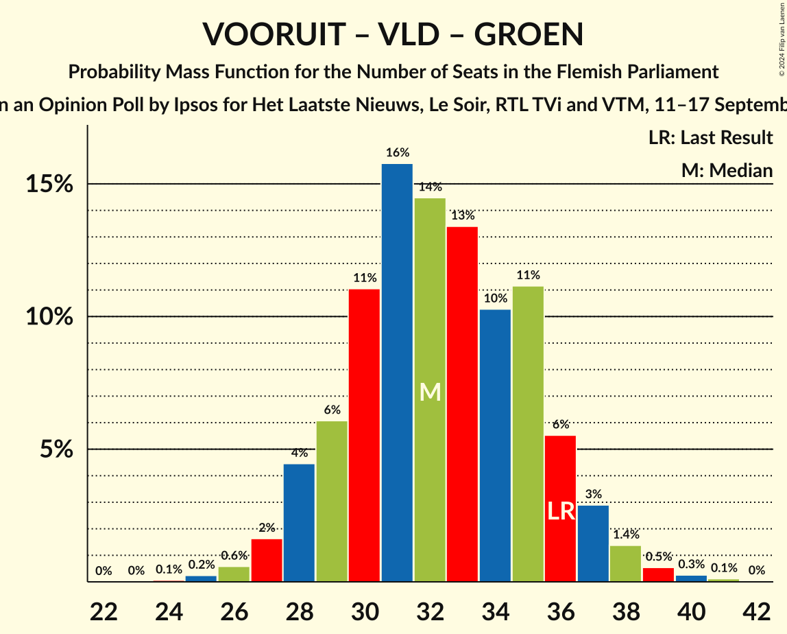

| Number of Seats | Probability | Accumulated | Special Marks |
|:---------------:|:-----------:|:-----------:|:-------------:|
| 24 | 0.1% | 100% |  |
| 25 | 0.2% | 99.9% |  |
| 26 | 0.6% | 99.7% |  |
| 27 | 2% | 99.1% |  |
| 28 | 4% | 97% |  |
| 29 | 6% | 93% |  |
| 30 | 11% | 87% |  |
| 31 | 16% | 76% | Median |
| 32 | 14% | 60% |  |
| 33 | 13% | 46% |  |
| 34 | 10% | 32% |  |
| 35 | 11% | 22% |  |
| 36 | 6% | 11% | Last Result |
| 37 | 3% | 5% |  |
| 38 | 1.4% | 2% |  |
| 39 | 0.5% | 1.0% |  |
| 40 | 0.3% | 0.4% |  |
| 41 | 0.1% | 0.2% |  |
| 42 | 0% | 0% |  |

### Christen-Democratisch en Vlaams – Open Vlaamse Liberalen en Democraten – Groen

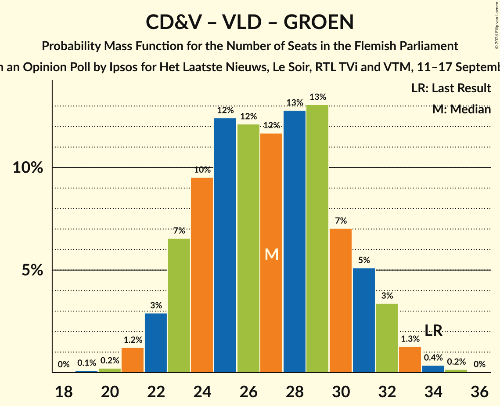

| Number of Seats | Probability | Accumulated | Special Marks |
|:---------------:|:-----------:|:-----------:|:-------------:|
| 19 | 0.1% | 100% |  |
| 20 | 0.2% | 99.9% |  |
| 21 | 1.2% | 99.7% |  |
| 22 | 3% | 98% |  |
| 23 | 7% | 96% |  |
| 24 | 10% | 89% |  |
| 25 | 12% | 79% |  |
| 26 | 12% | 67% | Median |
| 27 | 12% | 55% |  |
| 28 | 13% | 43% |  |
| 29 | 13% | 30% |  |
| 30 | 7% | 17% |  |
| 31 | 5% | 10% |  |
| 32 | 3% | 5% |  |
| 33 | 1.3% | 2% |  |
| 34 | 0.4% | 0.6% | Last Result |
| 35 | 0.2% | 0.2% |  |
| 36 | 0% | 0% |  |

### Vooruit – Open Vlaamse Liberalen en Democraten

| Number of Seats | Probability | Accumulated | Special Marks |
|:---------------:|:-----------:|:-----------:|:-------------:|
| 18 | 0.1% | 100% |  |
| 19 | 0.5% | 99.9% |  |
| 20 | 1.1% | 99.4% |  |
| 21 | 2% | 98% |  |
| 22 | 8% | 96% |  |
| 23 | 12% | 88% |  |
| 24 | 16% | 76% | Median |
| 25 | 18% | 60% |  |
| 26 | 14% | 42% |  |
| 27 | 11% | 28% | Last Result |
| 28 | 8% | 16% |  |
| 29 | 5% | 8% |  |
| 30 | 2% | 4% |  |
| 31 | 0.8% | 1.5% |  |
| 32 | 0.4% | 0.7% |  |
| 33 | 0.2% | 0.3% |  |
| 34 | 0% | 0.1% |  |
| 35 | 0% | 0% |  |

### Christen-Democratisch en Vlaams – Open Vlaamse Liberalen en Democraten

| Number of Seats | Probability | Accumulated | Special Marks |
|:---------------:|:-----------:|:-----------:|:-------------:|
| 13 | 0.2% | 100% |  |
| 14 | 0.4% | 99.8% |  |
| 15 | 0.7% | 99.4% |  |
| 16 | 4% | 98.7% |  |
| 17 | 13% | 95% |  |
| 18 | 16% | 82% |  |
| 19 | 16% | 66% | Median |
| 20 | 13% | 50% |  |
| 21 | 12% | 37% |  |
| 22 | 10% | 25% |  |
| 23 | 8% | 15% |  |
| 24 | 5% | 7% |  |
| 25 | 2% | 2% | Last Result |
| 26 | 0.6% | 0.9% |  |
| 27 | 0.2% | 0.3% |  |
| 28 | 0.1% | 0.1% |  |
| 29 | 0% | 0% |  |

## Technical Information

### Opinion Poll

+ **Polling firm:** Ipsos
+ **Commissioner(s):** Het Laatste Nieuws, Le Soir, RTL TVi and VTM
+ **Fieldwork period:** 11–17 September 2024

### Calculations

+ **Sample size:** 1000
+ **Simulations done:** 2,097,152
+ **Error estimate:** 1.19%

