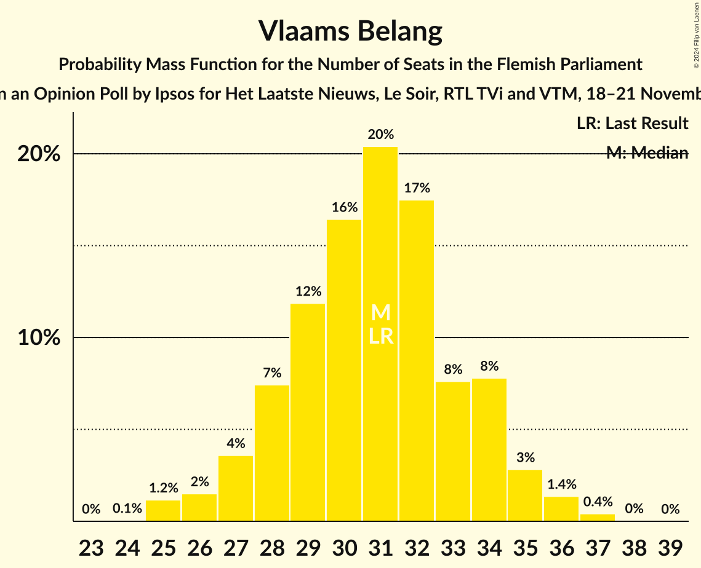
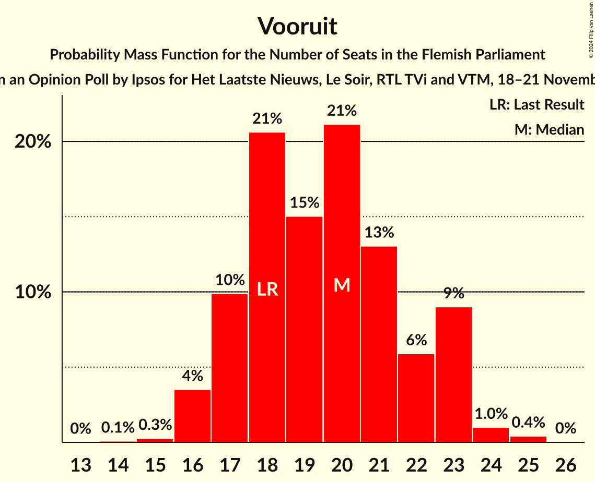
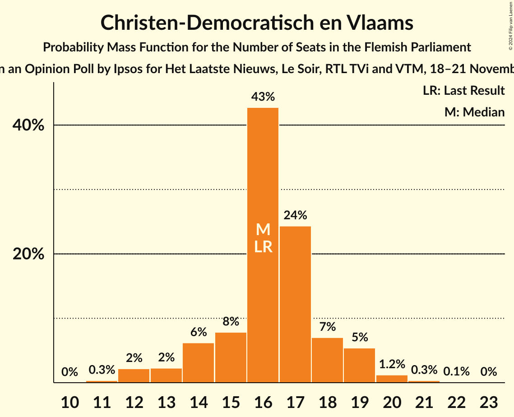
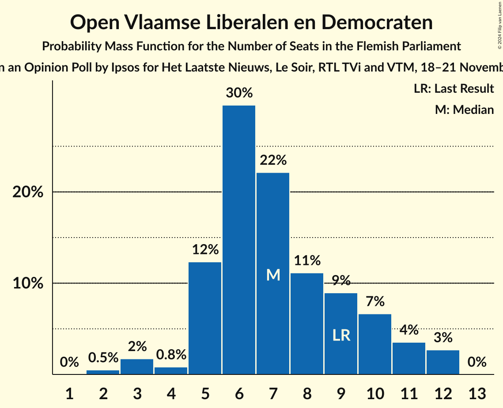
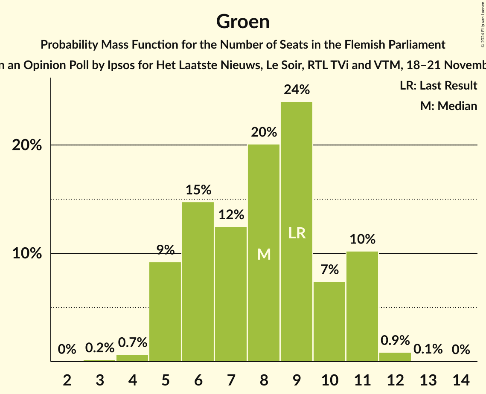
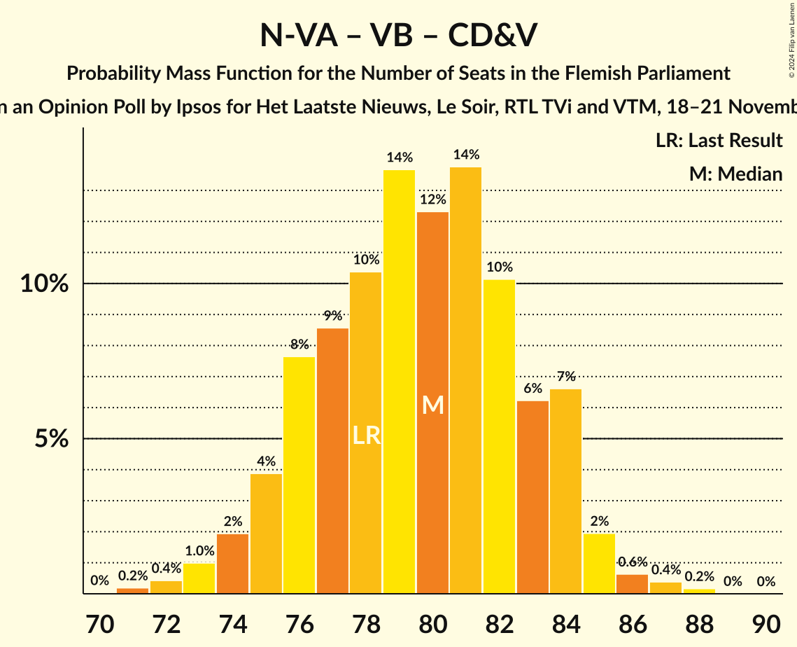
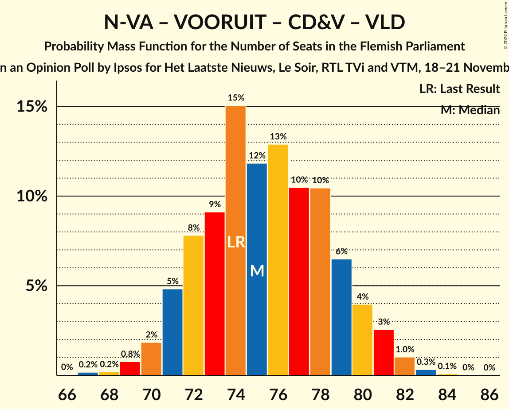
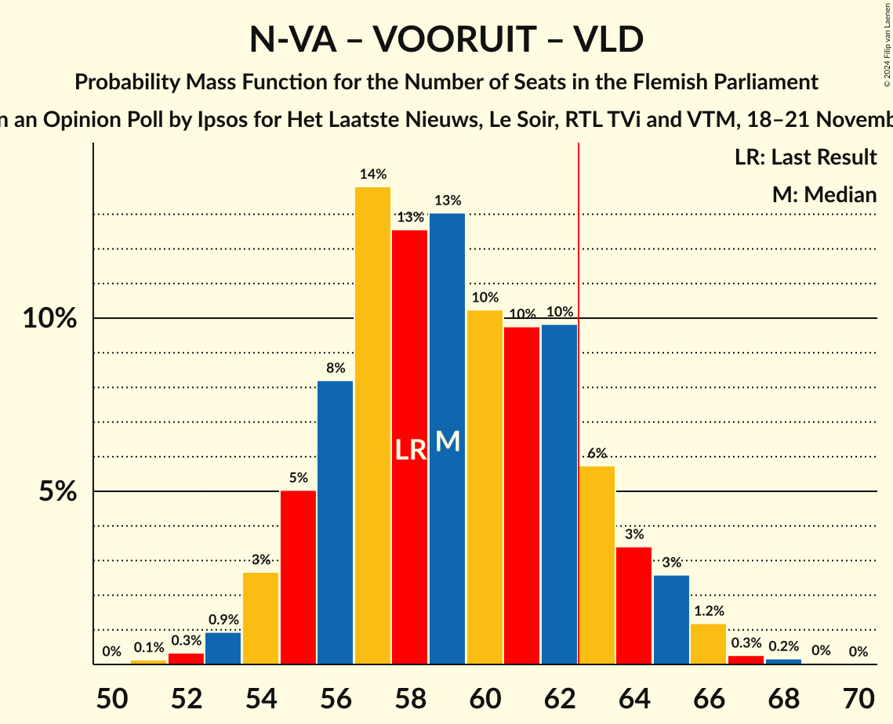
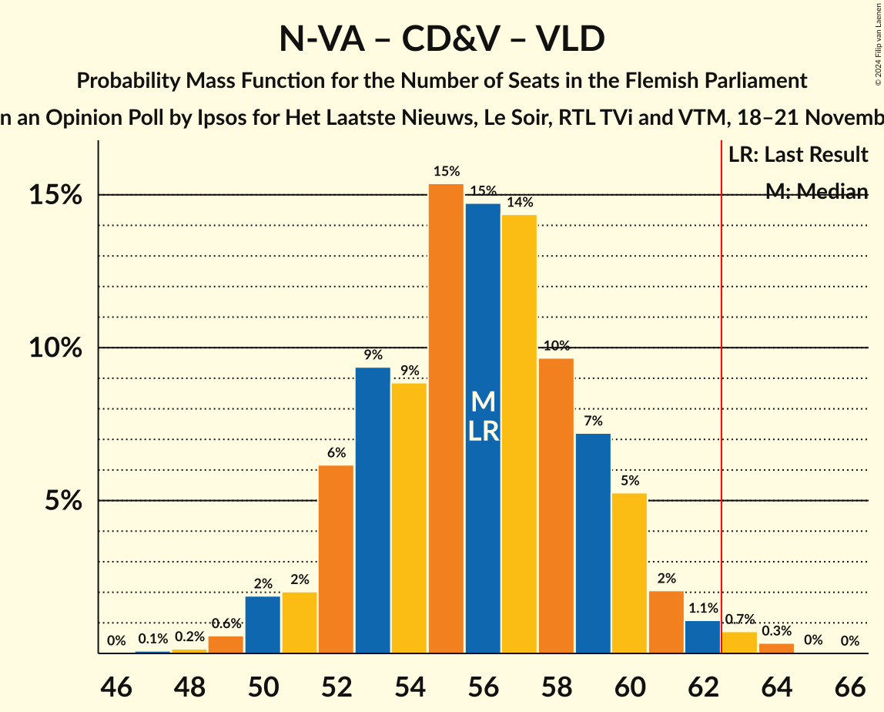

# Opinion Poll by Ipsos for Het Laatste Nieuws, Le Soir, RTL TVi and VTM, 18–21 November 2024

<a href="#voting-intentions">Voting Intentions</a> | <a href="#seats">Seats</a> | <a href="#coalitions">Coalitions</a> | <a href="#technical-information">Technical Information</a>

## Voting Intentions

### Confidence Intervals

| Party | Last Result | Poll Result | 80% Confidence Interval | 90% Confidence Interval | 95% Confidence Interval | 99% Confidence Interval |
|:-----:|:-----------:|:-----------:|:-----------------------:|:-----------------------:|:-----------------------:|:-----------------------:|
| Nieuw-Vlaamse Alliantie | 23.9% | 24.6% | 22.9–26.4% |22.4–26.9% |22.0–27.4% |21.2–28.3% |
| Vlaams Belang | 22.7% | 23.5% | 21.8–25.3% |21.4–25.8% |21.0–26.2% |20.2–27.1% |
| Vooruit | 13.8% | 15.5% | 14.1–17.1% |13.7–17.5% |13.4–17.9% |12.7–18.7% |
| Christen-Democratisch en Vlaams | 13.0% | 13.3% | 12.0–14.8% |11.6–15.2% |11.3–15.6% |10.7–16.3% |
| Partij van de Arbeid van België | 8.3% | 7.9% | 6.9–9.1% |6.6–9.4% |6.4–9.7% |5.9–10.3% |
| Open Vlaamse Liberalen en Democraten | 8.3% | 7.2% | 6.2–8.4% |6.0–8.7% |5.7–9.0% |5.3–9.6% |
| Groen | 7.3% | 6.9% | 6.0–8.0% |5.7–8.4% |5.5–8.7% |5.1–9.2% |
| Team Fouad Ahidar | 0.3% | 0.3% | 0.2–0.7% |0.1–0.8% |0.1–0.9% |0.1–1.1% |

*Note:* The poll result column reflects the actual value used in the calculations. Published results may vary slightly, and in addition be rounded to fewer digits.

## Seats

### Confidence Intervals

| Party | Last Result | Median | 80% Confidence Interval | 90% Confidence Interval | 95% Confidence Interval | 99% Confidence Interval |
|:-----:|:-----------:|:------:|:-----------------------:|:-----------------------:|:-----------------------:|:-----------------------:|
| <a href="#nieuw-vlaamse-alliantie">Nieuw-Vlaamse Alliantie</a> | 31 | 32 | 30–35 |29–36 |29–37 |27–38 |
| <a href="#vlaams-belang">Vlaams Belang</a> | 31 | 31 | 28–34 |27–34 |26–35 |25–36 |
| <a href="#vooruit">Vooruit</a> | 18 | 20 | 17–23 |17–23 |16–23 |16–24 |
| <a href="#christen-democratisch-en-vlaams">Christen-Democratisch en Vlaams</a> | 16 | 16 | 14–18 |14–19 |12–19 |12–20 |
| <a href="#partij-van-de-arbeid-van-belgië">Partij van de Arbeid van België</a> | 9 | 7 | 6–10 |6–10 |6–11 |5–12 |
| <a href="#open-vlaamse-liberalen-en-democraten">Open Vlaamse Liberalen en Democraten</a> | 9 | 7 | 5–10 |5–11 |4–12 |3–12 |
| <a href="#groen">Groen</a> | 9 | 8 | 5–11 |5–11 |5–11 |4–12 |
| <a href="#team-fouad-ahidar">Team Fouad Ahidar</a> | 1 | 1 | 0–3 |0–3 |0–4 |0–4 |

### Nieuw-Vlaamse Alliantie

*For a full overview of the results for this party, see the [Nieuw-Vlaamse Alliantie](party-nieuw-vlaamsealliantie.html) page.*

| Number of Seats | Probability | Accumulated | Special Marks |
|:---------------:|:-----------:|:-----------:|:-------------:|
| 25 | 0.1% | 100% |  |
| 26 | 0.1% | 99.9% |  |
| 27 | 0.7% | 99.8% |  |
| 28 | 1.2% | 99.1% |  |
| 29 | 6% | 98% |  |
| 30 | 10% | 92% |  |
| 31 | 17% | 82% | Last Result |
| 32 | 18% | 65% | Median |
| 33 | 14% | 47% |  |
| 34 | 9% | 33% |  |
| 35 | 15% | 24% |  |
| 36 | 6% | 9% |  |
| 37 | 2% | 3% |  |
| 38 | 0.9% | 1.2% |  |
| 39 | 0.2% | 0.3% |  |
| 40 | 0% | 0% |  |

### Vlaams Belang

*For a full overview of the results for this party, see the [Vlaams Belang](party-vlaamsbelang.html) page.*

| Number of Seats | Probability | Accumulated | Special Marks |
|:---------------:|:-----------:|:-----------:|:-------------:|
| 24 | 0.1% | 100% |  |
| 25 | 1.2% | 99.9% |  |
| 26 | 2% | 98.8% |  |
| 27 | 4% | 97% |  |
| 28 | 7% | 94% |  |
| 29 | 12% | 86% |  |
| 30 | 16% | 74% |  |
| 31 | 20% | 58% | Last Result, Median |
| 32 | 17% | 38% |  |
| 33 | 8% | 20% |  |
| 34 | 8% | 12% |  |
| 35 | 3% | 5% |  |
| 36 | 1.4% | 2% |  |
| 37 | 0.4% | 0.5% |  |
| 38 | 0% | 0.1% |  |
| 39 | 0% | 0% |  |

### Vooruit

*For a full overview of the results for this party, see the [Vooruit](party-vooruit.html) page.*

| Number of Seats | Probability | Accumulated | Special Marks |
|:---------------:|:-----------:|:-----------:|:-------------:|
| 14 | 0.1% | 100% |  |
| 15 | 0.3% | 99.9% |  |
| 16 | 4% | 99.6% |  |
| 17 | 10% | 96% |  |
| 18 | 21% | 86% | Last Result |
| 19 | 15% | 66% |  |
| 20 | 21% | 51% | Median |
| 21 | 13% | 29% |  |
| 22 | 6% | 16% |  |
| 23 | 9% | 10% |  |
| 24 | 1.0% | 1.5% |  |
| 25 | 0.4% | 0.5% |  |
| 26 | 0% | 0% |  |

### Christen-Democratisch en Vlaams

*For a full overview of the results for this party, see the [Christen-Democratisch en Vlaams](party-christen-democratischenvlaams.html) page.*

| Number of Seats | Probability | Accumulated | Special Marks |
|:---------------:|:-----------:|:-----------:|:-------------:|
| 11 | 0.3% | 100% |  |
| 12 | 2% | 99.7% |  |
| 13 | 2% | 97% |  |
| 14 | 6% | 95% |  |
| 15 | 8% | 89% |  |
| 16 | 43% | 81% | Last Result, Median |
| 17 | 24% | 38% |  |
| 18 | 7% | 14% |  |
| 19 | 5% | 7% |  |
| 20 | 1.2% | 2% |  |
| 21 | 0.3% | 0.5% |  |
| 22 | 0.1% | 0.1% |  |
| 23 | 0% | 0% |  |

### Partij van de Arbeid van België

*For a full overview of the results for this party, see the [Partij van de Arbeid van België](party-partijvandearbeidvanbelgië.html) page.*

| Number of Seats | Probability | Accumulated | Special Marks |
|:---------------:|:-----------:|:-----------:|:-------------:|
| 4 | 0.1% | 100% |  |
| 5 | 2% | 99.9% |  |
| 6 | 15% | 98% |  |
| 7 | 34% | 83% | Median |
| 8 | 7% | 49% |  |
| 9 | 8% | 42% | Last Result |
| 10 | 29% | 33% |  |
| 11 | 4% | 4% |  |
| 12 | 0.6% | 0.9% |  |
| 13 | 0.2% | 0.3% |  |
| 14 | 0.1% | 0.1% |  |
| 15 | 0% | 0% |  |

### Open Vlaamse Liberalen en Democraten

*For a full overview of the results for this party, see the [Open Vlaamse Liberalen en Democraten](party-openvlaamseliberalenendemocraten.html) page.*

| Number of Seats | Probability | Accumulated | Special Marks |
|:---------------:|:-----------:|:-----------:|:-------------:|
| 2 | 0.5% | 100% |  |
| 3 | 2% | 99.5% |  |
| 4 | 0.8% | 98% |  |
| 5 | 12% | 97% |  |
| 6 | 30% | 85% |  |
| 7 | 22% | 55% | Median |
| 8 | 11% | 33% |  |
| 9 | 9% | 22% | Last Result |
| 10 | 7% | 13% |  |
| 11 | 4% | 6% |  |
| 12 | 3% | 3% |  |
| 13 | 0% | 0% |  |

### Groen

*For a full overview of the results for this party, see the [Groen](party-groen.html) page.*

| Number of Seats | Probability | Accumulated | Special Marks |
|:---------------:|:-----------:|:-----------:|:-------------:|
| 2 | 0% | 100% |  |
| 3 | 0.2% | 99.9% |  |
| 4 | 0.7% | 99.7% |  |
| 5 | 9% | 99.1% |  |
| 6 | 15% | 90% |  |
| 7 | 12% | 75% |  |
| 8 | 20% | 63% | Median |
| 9 | 24% | 43% | Last Result |
| 10 | 7% | 19% |  |
| 11 | 10% | 11% |  |
| 12 | 0.9% | 0.9% |  |
| 13 | 0.1% | 0.1% |  |
| 14 | 0% | 0% |  |

### Team Fouad Ahidar

*For a full overview of the results for this party, see the [Team Fouad Ahidar](party-teamfouadahidar.html) page.*

| Number of Seats | Probability | Accumulated | Special Marks |
|:---------------:|:-----------:|:-----------:|:-------------:|
| 0 | 11% | 100% |  |
| 1 | 42% | 89% | Last Result, Median |
| 2 | 29% | 48% |  |
| 3 | 15% | 19% |  |
| 4 | 3% | 4% |  |
| 5 | 0.4% | 0.4% |  |
| 6 | 0% | 0% |  |

## Coalitions

### Confidence Intervals

| Coalition | Last Result | Median | Majority? | 80% Confidence Interval | 90% Confidence Interval | 95% Confidence Interval | 99% Confidence Interval |
|:---------:|:-----------:|:------:|:---------:|:-----------------------:|:-----------------------:|:-----------------------:|:-----------------------:|
| Nieuw-Vlaamse Alliantie – Vlaams Belang – Christen-Democratisch en Vlaams | 78 | 80 | 100% | 76–83 | 75–84 | 74–85 | 72–87 |
| Nieuw-Vlaamse Alliantie – Vooruit – Christen-Democratisch en Vlaams – Open Vlaamse Liberalen en Democraten | 74 | 75 | 100% | 72–79 | 71–80 | 70–81 | 69–82 |
| Nieuw-Vlaamse Alliantie – Vooruit – Christen-Democratisch en Vlaams | 65 | 68 | 98.7% | 65–72 | 64–73 | 63–74 | 61–75 |
| Nieuw-Vlaamse Alliantie – Vlaams Belang | 62 | 63 | 63% | 60–67 | 59–67 | 58–69 | 56–70 |
| Nieuw-Vlaamse Alliantie – Vooruit – Open Vlaamse Liberalen en Democraten | 58 | 59 | 13% | 56–63 | 55–64 | 54–65 | 53–66 |
| Nieuw-Vlaamse Alliantie – Christen-Democratisch en Vlaams – Open Vlaamse Liberalen en Democraten | 56 | 56 | 1.1% | 52–59 | 52–60 | 50–61 | 49–63 |
| Vooruit – Christen-Democratisch en Vlaams – Partij van de Arbeid van België – Groen | 52 | 52 | 0% | 49–56 | 47–57 | 46–57 | 45–59 |
| Vooruit – Christen-Democratisch en Vlaams – Open Vlaamse Liberalen en Democraten – Groen | 52 | 51 | 0% | 47–55 | 46–56 | 46–56 | 44–58 |
| Nieuw-Vlaamse Alliantie – Christen-Democratisch en Vlaams | 47 | 49 | 0% | 46–52 | 45–53 | 44–53 | 42–55 |
| Vooruit – Christen-Democratisch en Vlaams – Groen | 43 | 44 | 0% | 40–47 | 40–48 | 39–49 | 37–50 |
| Vooruit – Christen-Democratisch en Vlaams – Open Vlaamse Liberalen en Democraten | 43 | 43 | 0% | 39–47 | 39–47 | 38–48 | 36–50 |
| Nieuw-Vlaamse Alliantie – Open Vlaamse Liberalen en Democraten | 40 | 39 | 0% | 36–43 | 36–44 | 35–45 | 33–47 |
| Vooruit – Christen-Democratisch en Vlaams | 34 | 36 | 0% | 33–39 | 32–40 | 31–40 | 30–41 |
| Vooruit – Open Vlaamse Liberalen en Democraten – Groen | 36 | 34 | 0% | 31–39 | 30–39 | 29–40 | 28–42 |
| Christen-Democratisch en Vlaams – Open Vlaamse Liberalen en Democraten – Groen | 34 | 31 | 0% | 28–35 | 27–35 | 26–36 | 24–38 |
| Vooruit – Open Vlaamse Liberalen en Democraten | 27 | 27 | 0% | 23–30 | 23–31 | 22–32 | 21–34 |
| Christen-Democratisch en Vlaams – Open Vlaamse Liberalen en Democraten | 25 | 23 | 0% | 21–26 | 20–27 | 19–28 | 18–29 |

### Nieuw-Vlaamse Alliantie – Vlaams Belang – Christen-Democratisch en Vlaams

| Number of Seats | Probability | Accumulated | Special Marks |
|:---------------:|:-----------:|:-----------:|:-------------:|
| 70 | 0% | 100% |  |
| 71 | 0.2% | 99.9% |  |
| 72 | 0.4% | 99.8% |  |
| 73 | 1.0% | 99.3% |  |
| 74 | 2% | 98% |  |
| 75 | 4% | 96% |  |
| 76 | 8% | 93% |  |
| 77 | 9% | 85% |  |
| 78 | 10% | 76% | Last Result |
| 79 | 14% | 66% | Median |
| 80 | 12% | 52% |  |
| 81 | 14% | 40% |  |
| 82 | 10% | 26% |  |
| 83 | 6% | 16% |  |
| 84 | 7% | 10% |  |
| 85 | 2% | 3% |  |
| 86 | 0.6% | 1.2% |  |
| 87 | 0.4% | 0.6% |  |
| 88 | 0.2% | 0.2% |  |
| 89 | 0% | 0% |  |

### Nieuw-Vlaamse Alliantie – Vooruit – Christen-Democratisch en Vlaams – Open Vlaamse Liberalen en Democraten

| Number of Seats | Probability | Accumulated | Special Marks |
|:---------------:|:-----------:|:-----------:|:-------------:|
| 67 | 0.2% | 100% |  |
| 68 | 0.2% | 99.8% |  |
| 69 | 0.8% | 99.6% |  |
| 70 | 2% | 98.8% |  |
| 71 | 5% | 97% |  |
| 72 | 8% | 92% |  |
| 73 | 9% | 84% |  |
| 74 | 15% | 75% | Last Result |
| 75 | 12% | 60% | Median |
| 76 | 13% | 48% |  |
| 77 | 10% | 35% |  |
| 78 | 10% | 25% |  |
| 79 | 6% | 14% |  |
| 80 | 4% | 8% |  |
| 81 | 3% | 4% |  |
| 82 | 1.0% | 1.5% |  |
| 83 | 0.3% | 0.4% |  |
| 84 | 0.1% | 0.1% |  |
| 85 | 0% | 0% |  |

### Nieuw-Vlaamse Alliantie – Vooruit – Christen-Democratisch en Vlaams

| Number of Seats | Probability | Accumulated | Special Marks |
|:---------------:|:-----------:|:-----------:|:-------------:|
| 60 | 0.1% | 100% |  |
| 61 | 0.3% | 99.8% |  |
| 62 | 0.7% | 99.5% |  |
| 63 | 2% | 98.7% | Majority |
| 64 | 4% | 97% |  |
| 65 | 8% | 93% | Last Result |
| 66 | 12% | 85% |  |
| 67 | 8% | 73% |  |
| 68 | 19% | 65% | Median |
| 69 | 11% | 46% |  |
| 70 | 14% | 35% |  |
| 71 | 8% | 20% |  |
| 72 | 7% | 13% |  |
| 73 | 3% | 6% |  |
| 74 | 2% | 3% |  |
| 75 | 0.6% | 0.9% |  |
| 76 | 0.2% | 0.2% |  |
| 77 | 0.1% | 0.1% |  |
| 78 | 0% | 0% |  |

### Nieuw-Vlaamse Alliantie – Vlaams Belang

| Number of Seats | Probability | Accumulated | Special Marks |
|:---------------:|:-----------:|:-----------:|:-------------:|
| 55 | 0.1% | 100% |  |
| 56 | 0.6% | 99.9% |  |
| 57 | 1.0% | 99.3% |  |
| 58 | 2% | 98% |  |
| 59 | 3% | 96% |  |
| 60 | 9% | 93% |  |
| 61 | 8% | 84% |  |
| 62 | 13% | 76% | Last Result |
| 63 | 15% | 63% | Median, Majority |
| 64 | 15% | 48% |  |
| 65 | 10% | 34% |  |
| 66 | 10% | 24% |  |
| 67 | 9% | 14% |  |
| 68 | 2% | 5% |  |
| 69 | 2% | 3% |  |
| 70 | 0.4% | 0.9% |  |
| 71 | 0.4% | 0.5% |  |
| 72 | 0.1% | 0.1% |  |
| 73 | 0% | 0% |  |

### Nieuw-Vlaamse Alliantie – Vooruit – Open Vlaamse Liberalen en Democraten

| Number of Seats | Probability | Accumulated | Special Marks |
|:---------------:|:-----------:|:-----------:|:-------------:|
| 51 | 0.1% | 100% |  |
| 52 | 0.3% | 99.8% |  |
| 53 | 0.9% | 99.5% |  |
| 54 | 3% | 98.6% |  |
| 55 | 5% | 96% |  |
| 56 | 8% | 91% |  |
| 57 | 14% | 83% |  |
| 58 | 13% | 69% | Last Result |
| 59 | 13% | 56% | Median |
| 60 | 10% | 43% |  |
| 61 | 10% | 33% |  |
| 62 | 10% | 23% |  |
| 63 | 6% | 13% | Majority |
| 64 | 3% | 8% |  |
| 65 | 3% | 4% |  |
| 66 | 1.2% | 2% |  |
| 67 | 0.3% | 0.5% |  |
| 68 | 0.2% | 0.2% |  |
| 69 | 0% | 0.1% |  |
| 70 | 0% | 0% |  |

### Nieuw-Vlaamse Alliantie – Christen-Democratisch en Vlaams – Open Vlaamse Liberalen en Democraten

| Number of Seats | Probability | Accumulated | Special Marks |
|:---------------:|:-----------:|:-----------:|:-------------:|
| 47 | 0.1% | 100% |  |
| 48 | 0.2% | 99.9% |  |
| 49 | 0.6% | 99.7% |  |
| 50 | 2% | 99.2% |  |
| 51 | 2% | 97% |  |
| 52 | 6% | 95% |  |
| 53 | 9% | 89% |  |
| 54 | 9% | 80% |  |
| 55 | 15% | 71% | Median |
| 56 | 15% | 55% | Last Result |
| 57 | 14% | 41% |  |
| 58 | 10% | 26% |  |
| 59 | 7% | 17% |  |
| 60 | 5% | 10% |  |
| 61 | 2% | 4% |  |
| 62 | 1.1% | 2% |  |
| 63 | 0.7% | 1.1% | Majority |
| 64 | 0.3% | 0.4% |  |
| 65 | 0% | 0.1% |  |
| 66 | 0% | 0% |  |

### Vooruit – Christen-Democratisch en Vlaams – Partij van de Arbeid van België – Groen

| Number of Seats | Probability | Accumulated | Special Marks |
|:---------------:|:-----------:|:-----------:|:-------------:|
| 43 | 0.1% | 100% |  |
| 44 | 0.2% | 99.9% |  |
| 45 | 0.6% | 99.7% |  |
| 46 | 2% | 99.1% |  |
| 47 | 3% | 97% |  |
| 48 | 4% | 94% |  |
| 49 | 8% | 90% |  |
| 50 | 13% | 82% |  |
| 51 | 12% | 69% | Median |
| 52 | 17% | 57% | Last Result |
| 53 | 13% | 40% |  |
| 54 | 12% | 27% |  |
| 55 | 5% | 16% |  |
| 56 | 5% | 10% |  |
| 57 | 3% | 5% |  |
| 58 | 2% | 2% |  |
| 59 | 0.5% | 0.7% |  |
| 60 | 0.1% | 0.2% |  |
| 61 | 0% | 0% |  |

### Vooruit – Christen-Democratisch en Vlaams – Open Vlaamse Liberalen en Democraten – Groen

| Number of Seats | Probability | Accumulated | Special Marks |
|:---------------:|:-----------:|:-----------:|:-------------:|
| 42 | 0.1% | 100% |  |
| 43 | 0.3% | 99.9% |  |
| 44 | 0.7% | 99.6% |  |
| 45 | 1.3% | 98.9% |  |
| 46 | 3% | 98% |  |
| 47 | 6% | 94% |  |
| 48 | 8% | 89% |  |
| 49 | 12% | 81% |  |
| 50 | 17% | 69% |  |
| 51 | 10% | 52% | Median |
| 52 | 12% | 42% | Last Result |
| 53 | 11% | 29% |  |
| 54 | 7% | 19% |  |
| 55 | 5% | 11% |  |
| 56 | 4% | 6% |  |
| 57 | 1.4% | 2% |  |
| 58 | 0.6% | 0.9% |  |
| 59 | 0.2% | 0.3% |  |
| 60 | 0% | 0.1% |  |
| 61 | 0% | 0% |  |

### Nieuw-Vlaamse Alliantie – Christen-Democratisch en Vlaams

| Number of Seats | Probability | Accumulated | Special Marks |
|:---------------:|:-----------:|:-----------:|:-------------:|
| 41 | 0.2% | 100% |  |
| 42 | 0.4% | 99.7% |  |
| 43 | 1.1% | 99.3% |  |
| 44 | 2% | 98% |  |
| 45 | 5% | 96% |  |
| 46 | 10% | 92% |  |
| 47 | 16% | 82% | Last Result |
| 48 | 13% | 66% | Median |
| 49 | 13% | 53% |  |
| 50 | 14% | 41% |  |
| 51 | 12% | 26% |  |
| 52 | 8% | 15% |  |
| 53 | 4% | 6% |  |
| 54 | 2% | 2% |  |
| 55 | 0.5% | 0.9% |  |
| 56 | 0.3% | 0.4% |  |
| 57 | 0.1% | 0.1% |  |
| 58 | 0% | 0% |  |

### Vooruit – Christen-Democratisch en Vlaams – Groen

| Number of Seats | Probability | Accumulated | Special Marks |
|:---------------:|:-----------:|:-----------:|:-------------:|
| 35 | 0% | 100% |  |
| 36 | 0.2% | 99.9% |  |
| 37 | 0.5% | 99.7% |  |
| 38 | 1.4% | 99.3% |  |
| 39 | 3% | 98% |  |
| 40 | 6% | 95% |  |
| 41 | 7% | 89% |  |
| 42 | 13% | 82% |  |
| 43 | 16% | 69% | Last Result |
| 44 | 14% | 54% | Median |
| 45 | 13% | 40% |  |
| 46 | 12% | 27% |  |
| 47 | 8% | 15% |  |
| 48 | 3% | 6% |  |
| 49 | 2% | 4% |  |
| 50 | 2% | 2% |  |
| 51 | 0.3% | 0.5% |  |
| 52 | 0.1% | 0.2% |  |
| 53 | 0% | 0% |  |

### Vooruit – Christen-Democratisch en Vlaams – Open Vlaamse Liberalen en Democraten

| Number of Seats | Probability | Accumulated | Special Marks |
|:---------------:|:-----------:|:-----------:|:-------------:|
| 34 | 0% | 100% |  |
| 35 | 0.1% | 99.9% |  |
| 36 | 0.3% | 99.8% |  |
| 37 | 1.3% | 99.5% |  |
| 38 | 2% | 98% |  |
| 39 | 7% | 96% |  |
| 40 | 6% | 89% |  |
| 41 | 15% | 83% |  |
| 42 | 14% | 68% |  |
| 43 | 13% | 53% | Last Result, Median |
| 44 | 13% | 41% |  |
| 45 | 10% | 27% |  |
| 46 | 7% | 18% |  |
| 47 | 6% | 11% |  |
| 48 | 2% | 5% |  |
| 49 | 2% | 2% |  |
| 50 | 0.4% | 0.7% |  |
| 51 | 0.2% | 0.3% |  |
| 52 | 0.1% | 0.1% |  |
| 53 | 0% | 0% |  |

### Nieuw-Vlaamse Alliantie – Open Vlaamse Liberalen en Democraten

| Number of Seats | Probability | Accumulated | Special Marks |
|:---------------:|:-----------:|:-----------:|:-------------:|
| 32 | 0.2% | 100% |  |
| 33 | 0.4% | 99.8% |  |
| 34 | 2% | 99.4% |  |
| 35 | 2% | 98% |  |
| 36 | 8% | 96% |  |
| 37 | 10% | 88% |  |
| 38 | 10% | 78% |  |
| 39 | 21% | 68% | Median |
| 40 | 11% | 48% | Last Result |
| 41 | 13% | 36% |  |
| 42 | 10% | 23% |  |
| 43 | 4% | 13% |  |
| 44 | 5% | 9% |  |
| 45 | 2% | 4% |  |
| 46 | 1.1% | 2% |  |
| 47 | 0.5% | 0.7% |  |
| 48 | 0.2% | 0.2% |  |
| 49 | 0% | 0% |  |

### Vooruit – Christen-Democratisch en Vlaams

| Number of Seats | Probability | Accumulated | Special Marks |
|:---------------:|:-----------:|:-----------:|:-------------:|
| 29 | 0.3% | 100% |  |
| 30 | 0.6% | 99.7% |  |
| 31 | 2% | 99.1% |  |
| 32 | 3% | 97% |  |
| 33 | 9% | 94% |  |
| 34 | 11% | 85% | Last Result |
| 35 | 19% | 74% |  |
| 36 | 19% | 55% | Median |
| 37 | 16% | 37% |  |
| 38 | 8% | 20% |  |
| 39 | 7% | 12% |  |
| 40 | 3% | 5% |  |
| 41 | 2% | 2% |  |
| 42 | 0.3% | 0.5% |  |
| 43 | 0.1% | 0.2% |  |
| 44 | 0% | 0.1% |  |
| 45 | 0% | 0% |  |

### Vooruit – Open Vlaamse Liberalen en Democraten – Groen

| Number of Seats | Probability | Accumulated | Special Marks |
|:---------------:|:-----------:|:-----------:|:-------------:|
| 26 | 0% | 100% |  |
| 27 | 0.3% | 99.9% |  |
| 28 | 0.8% | 99.7% |  |
| 29 | 2% | 98.9% |  |
| 30 | 4% | 97% |  |
| 31 | 5% | 94% |  |
| 32 | 13% | 89% |  |
| 33 | 10% | 76% |  |
| 34 | 18% | 65% |  |
| 35 | 10% | 48% | Median |
| 36 | 12% | 38% | Last Result |
| 37 | 9% | 26% |  |
| 38 | 6% | 17% |  |
| 39 | 6% | 11% |  |
| 40 | 3% | 5% |  |
| 41 | 1.0% | 2% |  |
| 42 | 0.5% | 0.7% |  |
| 43 | 0.1% | 0.2% |  |
| 44 | 0.1% | 0.1% |  |
| 45 | 0% | 0% |  |

### Christen-Democratisch en Vlaams – Open Vlaamse Liberalen en Democraten – Groen

| Number of Seats | Probability | Accumulated | Special Marks |
|:---------------:|:-----------:|:-----------:|:-------------:|
| 23 | 0.2% | 100% |  |
| 24 | 0.4% | 99.8% |  |
| 25 | 0.5% | 99.4% |  |
| 26 | 1.5% | 98.9% |  |
| 27 | 5% | 97% |  |
| 28 | 5% | 92% |  |
| 29 | 12% | 87% |  |
| 30 | 11% | 75% |  |
| 31 | 18% | 64% | Median |
| 32 | 11% | 46% |  |
| 33 | 14% | 35% |  |
| 34 | 11% | 21% | Last Result |
| 35 | 5% | 10% |  |
| 36 | 3% | 5% |  |
| 37 | 1.0% | 2% |  |
| 38 | 0.6% | 1.0% |  |
| 39 | 0.3% | 0.4% |  |
| 40 | 0.1% | 0.1% |  |
| 41 | 0% | 0% |  |

### Vooruit – Open Vlaamse Liberalen en Democraten

| Number of Seats | Probability | Accumulated | Special Marks |
|:---------------:|:-----------:|:-----------:|:-------------:|
| 20 | 0.3% | 100% |  |
| 21 | 0.6% | 99.7% |  |
| 22 | 3% | 99.1% |  |
| 23 | 8% | 96% |  |
| 24 | 11% | 89% |  |
| 25 | 13% | 77% |  |
| 26 | 13% | 65% |  |
| 27 | 16% | 51% | Last Result, Median |
| 28 | 11% | 35% |  |
| 29 | 9% | 24% |  |
| 30 | 5% | 15% |  |
| 31 | 5% | 9% |  |
| 32 | 2% | 4% |  |
| 33 | 1.5% | 2% |  |
| 34 | 0.4% | 0.6% |  |
| 35 | 0.2% | 0.2% |  |
| 36 | 0% | 0% |  |

### Christen-Democratisch en Vlaams – Open Vlaamse Liberalen en Democraten

| Number of Seats | Probability | Accumulated | Special Marks |
|:---------------:|:-----------:|:-----------:|:-------------:|
| 17 | 0.3% | 100% |  |
| 18 | 1.5% | 99.6% |  |
| 19 | 3% | 98% |  |
| 20 | 4% | 96% |  |
| 21 | 9% | 91% |  |
| 22 | 16% | 82% |  |
| 23 | 22% | 66% | Median |
| 24 | 15% | 43% |  |
| 25 | 13% | 28% | Last Result |
| 26 | 6% | 16% |  |
| 27 | 5% | 9% |  |
| 28 | 3% | 4% |  |
| 29 | 1.1% | 1.5% |  |
| 30 | 0.3% | 0.4% |  |
| 31 | 0% | 0.1% |  |
| 32 | 0% | 0% |  |

## Technical Information

### Opinion Poll

+ **Polling firm:** Ipsos
+ **Commissioner(s):** Het Laatste Nieuws, Le Soir, RTL TVi and VTM
+ **Fieldwork period:** 18–21 November 2024

### Calculations

+ **Sample size:** 1000
+ **Simulations done:** 2,097,152
+ **Error estimate:** 1.54%

