# Opinion Poll by Ipsos for Het Laatste Nieuws, Le Soir, RTL TVi and VTM, 25 May–1 June 2021

<a href="#voting-intentions">Voting Intentions</a> | <a href="#seats">Seats</a> | <a href="#coalitions">Coalitions</a> | <a href="#technical-information">Technical Information</a>

## Voting Intentions

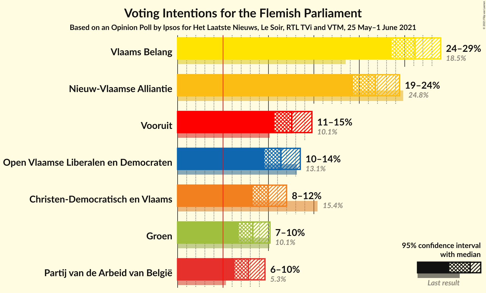

### Confidence Intervals

| Party | Last Result | Poll Result | 80% Confidence Interval | 90% Confidence Interval | 95% Confidence Interval | 99% Confidence Interval |
|:-----:|:-----------:|:-----------:|:-----------------------:|:-----------------------:|:-----------------------:|:-----------------------:|
| Vlaams Belang | 18.5% | 26.1% | 24.4–28.0% |23.9–28.5% |23.5–29.0% |22.7–29.9% |
| Nieuw-Vlaamse Alliantie | 24.8% | 21.8% | 20.1–23.5% |19.7–24.0% |19.3–24.4% |18.6–25.3% |
| Vooruit | 10.1% | 12.6% | 11.3–14.0% |11.0–14.4% |10.7–14.8% |10.1–15.5% |
| Open Vlaamse Liberalen en Democraten | 13.1% | 11.4% | 10.2–12.8% |9.8–13.2% |9.6–13.5% |9.0–14.2% |
| Christen-Democratisch en Vlaams | 15.4% | 10.0% | 8.9–11.3% |8.5–11.7% |8.3–12.0% |7.8–12.7% |
| Groen | 10.1% | 8.3% | 7.3–9.5% |7.0–9.9% |6.7–10.2% |6.3–10.8% |
| Partij van de Arbeid van België | 5.3% | 7.8% | 6.8–9.0% |6.5–9.3% |6.3–9.6% |5.8–10.2% |

*Note:* The poll result column reflects the actual value used in the calculations. Published results may vary slightly, and in addition be rounded to fewer digits.

## Seats

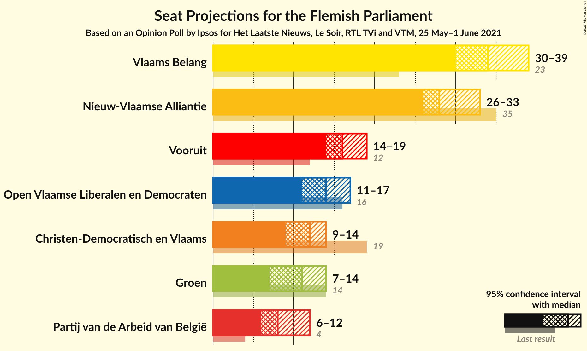

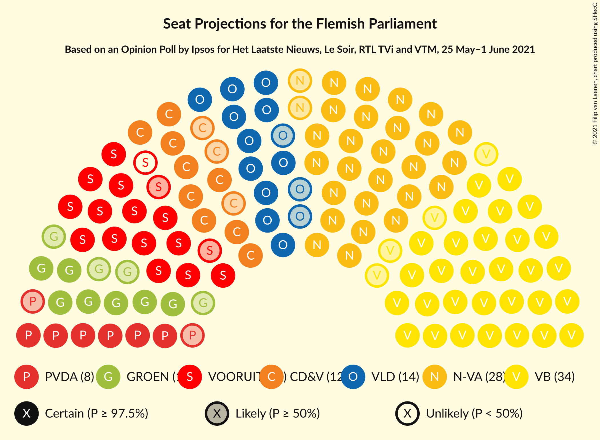

### Confidence Intervals

| Party | Last Result | Median | 80% Confidence Interval | 90% Confidence Interval | 95% Confidence Interval | 99% Confidence Interval |
|:-----:|:-----------:|:------:|:-----------------------:|:-----------------------:|:-----------------------:|:-----------------------:|
| <a href="#vlaams-belang">Vlaams Belang</a> | 23 | 34 | 34–37 |31–38 |30–39 |30–41 |
| <a href="#nieuw-vlaamse-alliantie">Nieuw-Vlaamse Alliantie</a> | 35 | 28 | 27–32 |27–33 |26–33 |24–34 |
| <a href="#vooruit">Vooruit</a> | 12 | 16 | 14–18 |14–19 |14–19 |13–20 |
| <a href="#open-vlaamse-liberalen-en-democraten">Open Vlaamse Liberalen en Democraten</a> | 16 | 14 | 12–16 |12–16 |11–17 |11–19 |
| <a href="#christen-democratisch-en-vlaams">Christen-Democratisch en Vlaams</a> | 19 | 12 | 10–13 |10–14 |9–14 |9–16 |
| <a href="#groen">Groen</a> | 14 | 11 | 9–12 |8–13 |7–14 |5–15 |
| <a href="#partij-van-de-arbeid-van-belgië">Partij van de Arbeid van België</a> | 4 | 8 | 7–10 |7–10 |6–12 |5–13 |

### Vlaams Belang

*For a full overview of the results for this party, see the [Vlaams Belang](party-vlaamsbelang.html) page.*

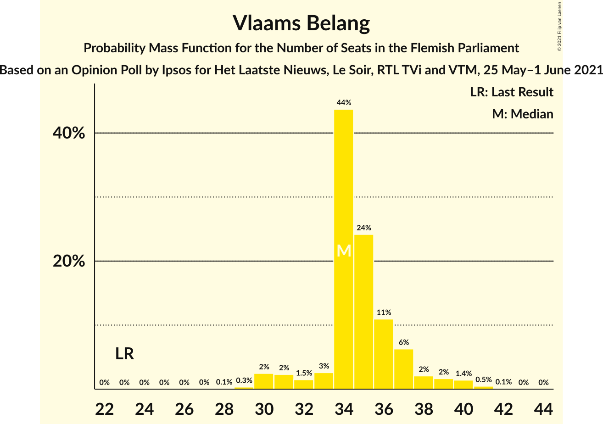

| Number of Seats | Probability | Accumulated | Special Marks |
|:---------------:|:-----------:|:-----------:|:-------------:|
| 23 | 0% | 100% | Last Result |
| 24 | 0% | 100% |  |
| 25 | 0% | 100% |  |
| 26 | 0% | 100% |  |
| 27 | 0% | 100% |  |
| 28 | 0.1% | 100% |  |
| 29 | 0.3% | 99.9% |  |
| 30 | 2% | 99.6% |  |
| 31 | 2% | 97% |  |
| 32 | 1.5% | 95% |  |
| 33 | 3% | 93% |  |
| 34 | 44% | 91% | Median |
| 35 | 24% | 47% |  |
| 36 | 11% | 23% |  |
| 37 | 6% | 12% |  |
| 38 | 2% | 6% |  |
| 39 | 2% | 4% |  |
| 40 | 1.4% | 2% |  |
| 41 | 0.5% | 0.6% |  |
| 42 | 0.1% | 0.1% |  |
| 43 | 0% | 0% |  |

### Nieuw-Vlaamse Alliantie

*For a full overview of the results for this party, see the [Nieuw-Vlaamse Alliantie](party-nieuw-vlaamsealliantie.html) page.*

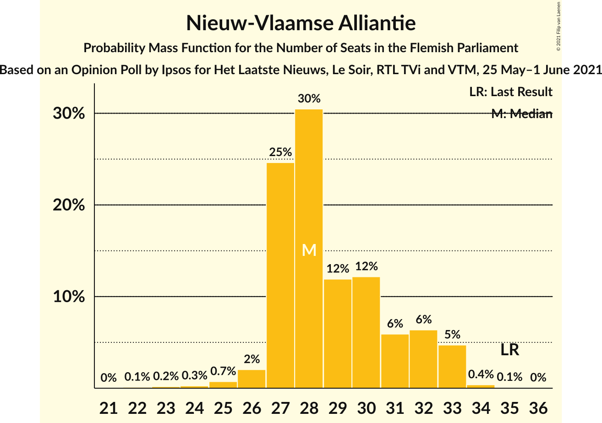

| Number of Seats | Probability | Accumulated | Special Marks |
|:---------------:|:-----------:|:-----------:|:-------------:|
| 22 | 0.1% | 100% |  |
| 23 | 0.2% | 99.9% |  |
| 24 | 0.3% | 99.7% |  |
| 25 | 0.7% | 99.4% |  |
| 26 | 2% | 98.7% |  |
| 27 | 25% | 97% |  |
| 28 | 30% | 72% | Median |
| 29 | 12% | 42% |  |
| 30 | 12% | 30% |  |
| 31 | 6% | 18% |  |
| 32 | 6% | 12% |  |
| 33 | 5% | 5% |  |
| 34 | 0.4% | 0.5% |  |
| 35 | 0.1% | 0.1% | Last Result |
| 36 | 0% | 0% |  |

### Vooruit

*For a full overview of the results for this party, see the [Vooruit](party-vooruit.html) page.*

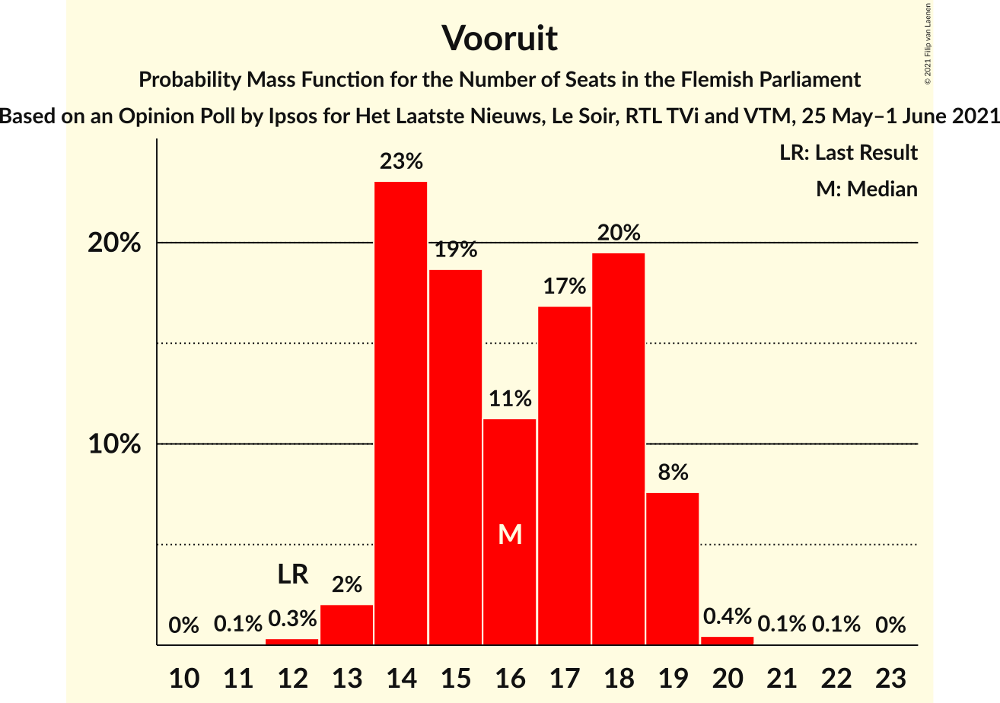

| Number of Seats | Probability | Accumulated | Special Marks |
|:---------------:|:-----------:|:-----------:|:-------------:|
| 11 | 0.1% | 100% |  |
| 12 | 0.3% | 99.9% | Last Result |
| 13 | 2% | 99.6% |  |
| 14 | 23% | 98% |  |
| 15 | 19% | 75% |  |
| 16 | 11% | 56% | Median |
| 17 | 17% | 45% |  |
| 18 | 20% | 28% |  |
| 19 | 8% | 8% |  |
| 20 | 0.4% | 0.6% |  |
| 21 | 0.1% | 0.1% |  |
| 22 | 0.1% | 0.1% |  |
| 23 | 0% | 0% |  |

### Open Vlaamse Liberalen en Democraten

*For a full overview of the results for this party, see the [Open Vlaamse Liberalen en Democraten](party-openvlaamseliberalenendemocraten.html) page.*

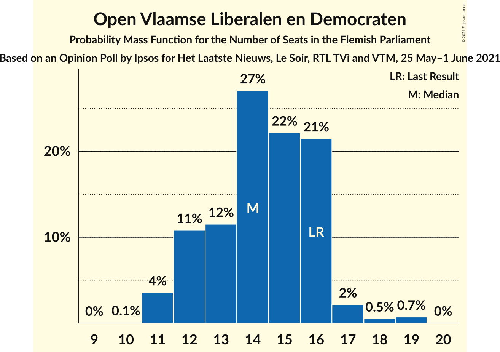

| Number of Seats | Probability | Accumulated | Special Marks |
|:---------------:|:-----------:|:-----------:|:-------------:|
| 10 | 0.1% | 100% |  |
| 11 | 4% | 99.9% |  |
| 12 | 11% | 96% |  |
| 13 | 12% | 86% |  |
| 14 | 27% | 74% | Median |
| 15 | 22% | 47% |  |
| 16 | 21% | 25% | Last Result |
| 17 | 2% | 3% |  |
| 18 | 0.5% | 1.2% |  |
| 19 | 0.7% | 0.7% |  |
| 20 | 0% | 0% |  |

### Christen-Democratisch en Vlaams

*For a full overview of the results for this party, see the [Christen-Democratisch en Vlaams](party-christen-democratischenvlaams.html) page.*

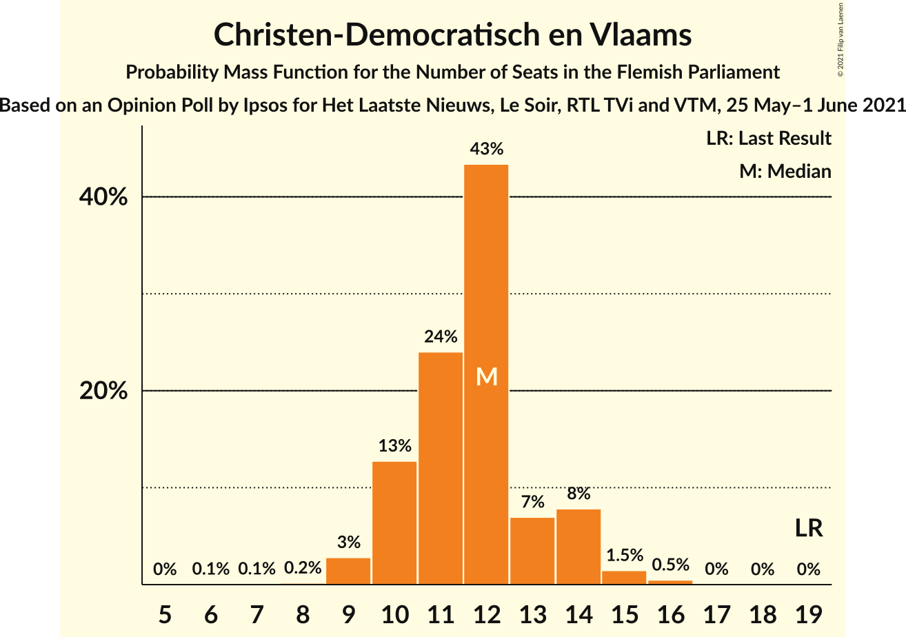

| Number of Seats | Probability | Accumulated | Special Marks |
|:---------------:|:-----------:|:-----------:|:-------------:|
| 6 | 0.1% | 100% |  |
| 7 | 0.1% | 99.9% |  |
| 8 | 0.2% | 99.9% |  |
| 9 | 3% | 99.7% |  |
| 10 | 13% | 97% |  |
| 11 | 24% | 84% |  |
| 12 | 43% | 60% | Median |
| 13 | 7% | 17% |  |
| 14 | 8% | 10% |  |
| 15 | 1.5% | 2% |  |
| 16 | 0.5% | 0.5% |  |
| 17 | 0% | 0% |  |
| 18 | 0% | 0% |  |
| 19 | 0% | 0% | Last Result |

### Groen

*For a full overview of the results for this party, see the [Groen](party-groen.html) page.*

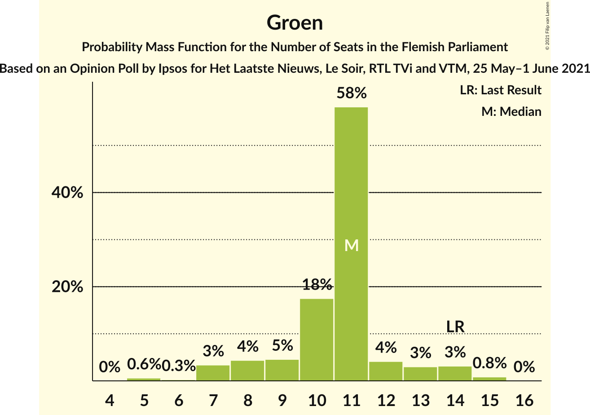

| Number of Seats | Probability | Accumulated | Special Marks |
|:---------------:|:-----------:|:-----------:|:-------------:|
| 5 | 0.6% | 100% |  |
| 6 | 0.3% | 99.4% |  |
| 7 | 3% | 99.1% |  |
| 8 | 4% | 96% |  |
| 9 | 5% | 91% |  |
| 10 | 18% | 87% |  |
| 11 | 58% | 69% | Median |
| 12 | 4% | 11% |  |
| 13 | 3% | 7% |  |
| 14 | 3% | 4% | Last Result |
| 15 | 0.8% | 0.8% |  |
| 16 | 0% | 0% |  |

### Partij van de Arbeid van België

*For a full overview of the results for this party, see the [Partij van de Arbeid van België](party-partijvandearbeidvanbelgië.html) page.*

| Number of Seats | Probability | Accumulated | Special Marks |
|:---------------:|:-----------:|:-----------:|:-------------:|
| 4 | 0.2% | 100% | Last Result |
| 5 | 2% | 99.8% |  |
| 6 | 2% | 98% |  |
| 7 | 45% | 97% |  |
| 8 | 34% | 51% | Median |
| 9 | 7% | 17% |  |
| 10 | 6% | 10% |  |
| 11 | 2% | 5% |  |
| 12 | 1.2% | 3% |  |
| 13 | 2% | 2% |  |
| 14 | 0% | 0% |  |

## Coalitions

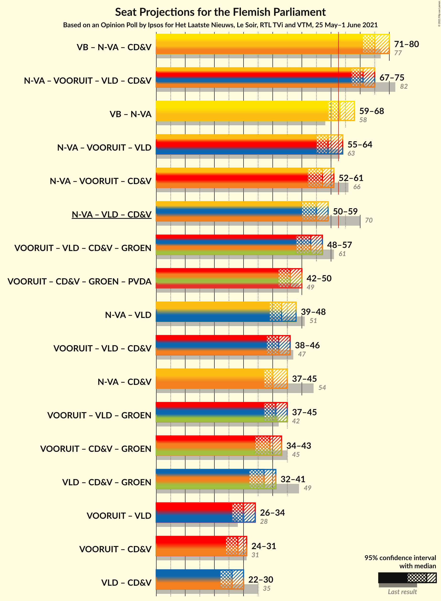

### Confidence Intervals

| Coalition | Last Result | Median | Majority? | 80% Confidence Interval | 90% Confidence Interval | 95% Confidence Interval | 99% Confidence Interval |
|:---------:|:-----------:|:------:|:---------:|:-----------------------:|:-----------------------:|:-----------------------:|:-----------------------:|
| Vlaams Belang – Nieuw-Vlaamse Alliantie – Christen-Democratisch en Vlaams | 77 | 75 | 100% | 72–78 | 72–79 | 71–80 | 69–81 |
| Nieuw-Vlaamse Alliantie – Vooruit – Open Vlaamse Liberalen en Democraten – Christen-Democratisch en Vlaams | 82 | 71 | 100% | 68–73 | 68–74 | 67–75 | 65–77 |
| Vlaams Belang – Nieuw-Vlaamse Alliantie | 58 | 63 | 66% | 61–67 | 60–67 | 59–68 | 58–70 |
| Nieuw-Vlaamse Alliantie – Vooruit – Open Vlaamse Liberalen en Democraten | 63 | 59 | 6% | 56–62 | 56–63 | 55–64 | 53–66 |
| Nieuw-Vlaamse Alliantie – Vooruit – Christen-Democratisch en Vlaams | 66 | 57 | 0.6% | 53–59 | 53–60 | 52–61 | 51–63 |
| Nieuw-Vlaamse Alliantie – Open Vlaamse Liberalen en Democraten – Christen-Democratisch en Vlaams | 70 | 55 | 0.1% | 52–57 | 51–58 | 50–59 | 49–61 |
| Vooruit – Open Vlaamse Liberalen en Democraten – Christen-Democratisch en Vlaams – Groen | 61 | 53 | 0% | 50–56 | 49–56 | 48–57 | 46–58 |
| Vooruit – Christen-Democratisch en Vlaams – Groen – Partij van de Arbeid van België | 49 | 46 | 0% | 43–49 | 43–50 | 42–50 | 40–52 |
| Nieuw-Vlaamse Alliantie – Open Vlaamse Liberalen en Democraten | 51 | 43 | 0% | 41–46 | 40–47 | 39–48 | 38–49 |
| Vooruit – Open Vlaamse Liberalen en Democraten – Christen-Democratisch en Vlaams | 47 | 42 | 0% | 39–45 | 38–46 | 38–46 | 36–47 |
| Nieuw-Vlaamse Alliantie – Christen-Democratisch en Vlaams | 54 | 40 | 0% | 38–44 | 37–44 | 37–45 | 36–46 |
| Vooruit – Open Vlaamse Liberalen en Democraten – Groen | 42 | 41 | 0% | 38–44 | 37–44 | 37–45 | 35–47 |
| Vooruit – Christen-Democratisch en Vlaams – Groen | 45 | 39 | 0% | 36–41 | 35–42 | 34–43 | 32–44 |
| Open Vlaamse Liberalen en Democraten – Christen-Democratisch en Vlaams – Groen | 49 | 37 | 0% | 34–39 | 33–40 | 32–41 | 31–42 |
| Vooruit – Open Vlaamse Liberalen en Democraten | 28 | 30 | 0% | 28–33 | 27–34 | 26–34 | 25–36 |
| Vooruit – Christen-Democratisch en Vlaams | 31 | 28 | 0% | 25–30 | 25–31 | 24–31 | 23–33 |
| Open Vlaamse Liberalen en Democraten – Christen-Democratisch en Vlaams | 35 | 26 | 0% | 24–28 | 23–29 | 22–30 | 21–31 |

### Vlaams Belang – Nieuw-Vlaamse Alliantie – Christen-Democratisch en Vlaams

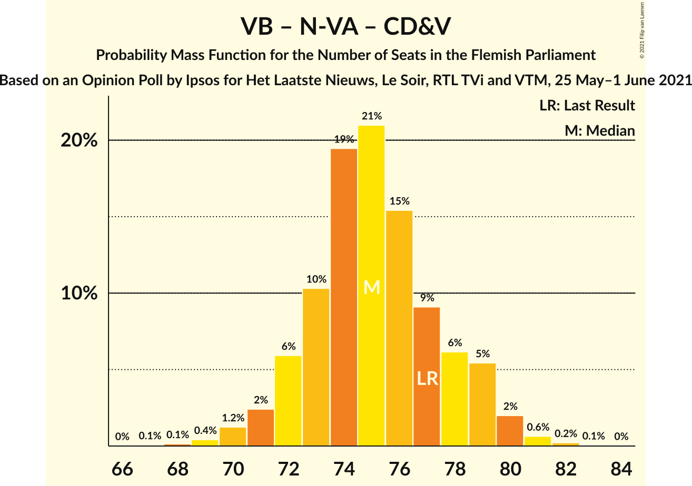

| Number of Seats | Probability | Accumulated | Special Marks |
|:---------------:|:-----------:|:-----------:|:-------------:|
| 67 | 0.1% | 100% |  |
| 68 | 0.1% | 99.9% |  |
| 69 | 0.4% | 99.8% |  |
| 70 | 1.2% | 99.3% |  |
| 71 | 2% | 98% |  |
| 72 | 6% | 96% |  |
| 73 | 10% | 90% |  |
| 74 | 19% | 79% | Median |
| 75 | 21% | 60% |  |
| 76 | 15% | 39% |  |
| 77 | 9% | 24% | Last Result |
| 78 | 6% | 15% |  |
| 79 | 5% | 8% |  |
| 80 | 2% | 3% |  |
| 81 | 0.6% | 0.9% |  |
| 82 | 0.2% | 0.3% |  |
| 83 | 0.1% | 0.1% |  |
| 84 | 0% | 0% |  |

### Nieuw-Vlaamse Alliantie – Vooruit – Open Vlaamse Liberalen en Democraten – Christen-Democratisch en Vlaams

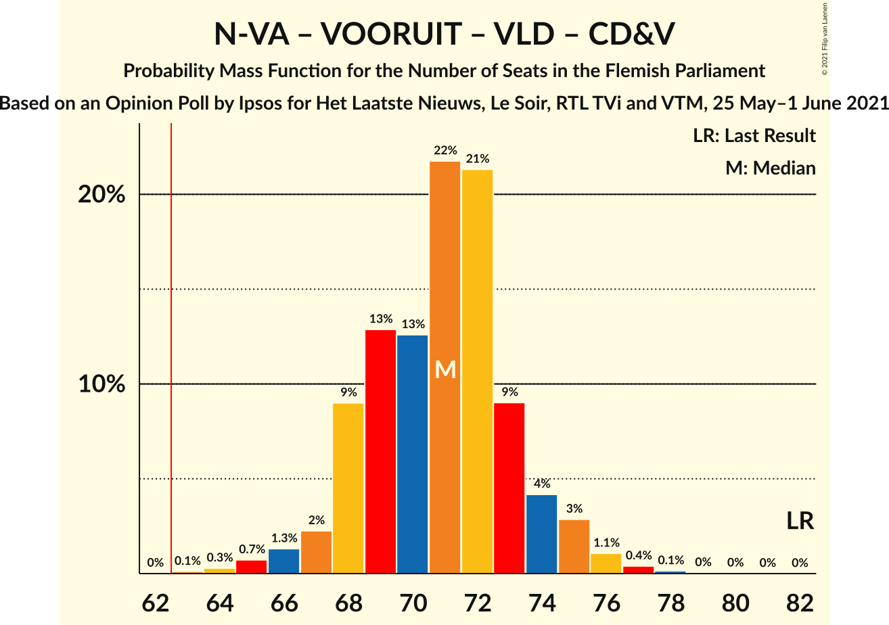

| Number of Seats | Probability | Accumulated | Special Marks |
|:---------------:|:-----------:|:-----------:|:-------------:|
| 63 | 0.1% | 100% | Majority |
| 64 | 0.3% | 99.9% |  |
| 65 | 0.7% | 99.6% |  |
| 66 | 1.3% | 98.9% |  |
| 67 | 2% | 98% |  |
| 68 | 9% | 95% |  |
| 69 | 13% | 86% |  |
| 70 | 13% | 73% | Median |
| 71 | 22% | 61% |  |
| 72 | 21% | 39% |  |
| 73 | 9% | 18% |  |
| 74 | 4% | 9% |  |
| 75 | 3% | 5% |  |
| 76 | 1.1% | 2% |  |
| 77 | 0.4% | 0.6% |  |
| 78 | 0.1% | 0.2% |  |
| 79 | 0% | 0.1% |  |
| 80 | 0% | 0% |  |
| 81 | 0% | 0% |  |
| 82 | 0% | 0% | Last Result |

### Vlaams Belang – Nieuw-Vlaamse Alliantie

| Number of Seats | Probability | Accumulated | Special Marks |
|:---------------:|:-----------:|:-----------:|:-------------:|
| 56 | 0.1% | 100% |  |
| 57 | 0.2% | 99.9% |  |
| 58 | 0.6% | 99.6% | Last Result |
| 59 | 2% | 99.0% |  |
| 60 | 3% | 97% |  |
| 61 | 13% | 94% |  |
| 62 | 15% | 81% | Median |
| 63 | 21% | 66% | Majority |
| 64 | 19% | 46% |  |
| 65 | 10% | 26% |  |
| 66 | 6% | 16% |  |
| 67 | 6% | 10% |  |
| 68 | 3% | 4% |  |
| 69 | 1.1% | 2% |  |
| 70 | 0.4% | 0.6% |  |
| 71 | 0.1% | 0.1% |  |
| 72 | 0% | 0% |  |

### Nieuw-Vlaamse Alliantie – Vooruit – Open Vlaamse Liberalen en Democraten

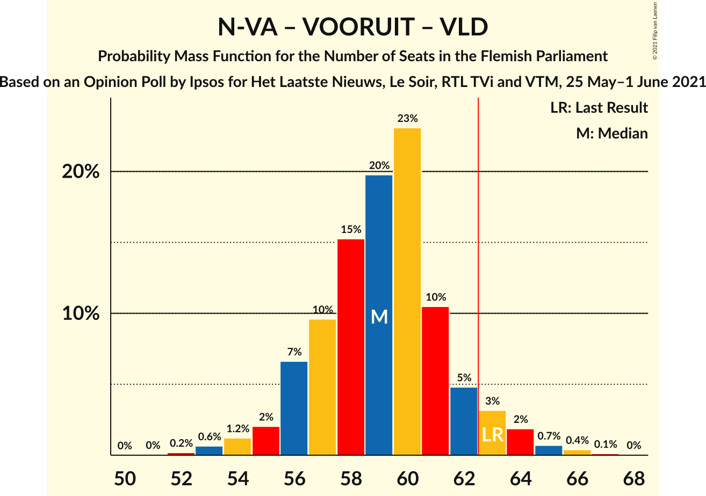

| Number of Seats | Probability | Accumulated | Special Marks |
|:---------------:|:-----------:|:-----------:|:-------------:|
| 52 | 0.2% | 100% |  |
| 53 | 0.6% | 99.8% |  |
| 54 | 1.2% | 99.1% |  |
| 55 | 2% | 98% |  |
| 56 | 7% | 96% |  |
| 57 | 10% | 89% |  |
| 58 | 15% | 80% | Median |
| 59 | 20% | 64% |  |
| 60 | 23% | 45% |  |
| 61 | 10% | 22% |  |
| 62 | 5% | 11% |  |
| 63 | 3% | 6% | Last Result, Majority |
| 64 | 2% | 3% |  |
| 65 | 0.7% | 1.2% |  |
| 66 | 0.4% | 0.5% |  |
| 67 | 0.1% | 0.2% |  |
| 68 | 0% | 0% |  |

### Nieuw-Vlaamse Alliantie – Vooruit – Christen-Democratisch en Vlaams

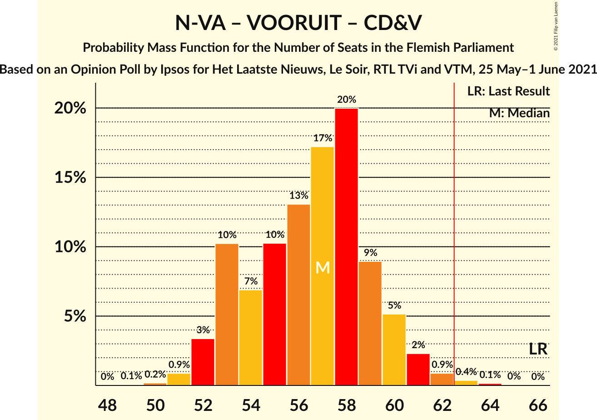

| Number of Seats | Probability | Accumulated | Special Marks |
|:---------------:|:-----------:|:-----------:|:-------------:|
| 49 | 0.1% | 100% |  |
| 50 | 0.2% | 99.9% |  |
| 51 | 0.9% | 99.7% |  |
| 52 | 3% | 98.9% |  |
| 53 | 10% | 95% |  |
| 54 | 7% | 85% |  |
| 55 | 10% | 78% |  |
| 56 | 13% | 68% | Median |
| 57 | 17% | 55% |  |
| 58 | 20% | 38% |  |
| 59 | 9% | 18% |  |
| 60 | 5% | 9% |  |
| 61 | 2% | 4% |  |
| 62 | 0.9% | 1.4% |  |
| 63 | 0.4% | 0.6% | Majority |
| 64 | 0.1% | 0.2% |  |
| 65 | 0% | 0.1% |  |
| 66 | 0% | 0% | Last Result |

### Nieuw-Vlaamse Alliantie – Open Vlaamse Liberalen en Democraten – Christen-Democratisch en Vlaams

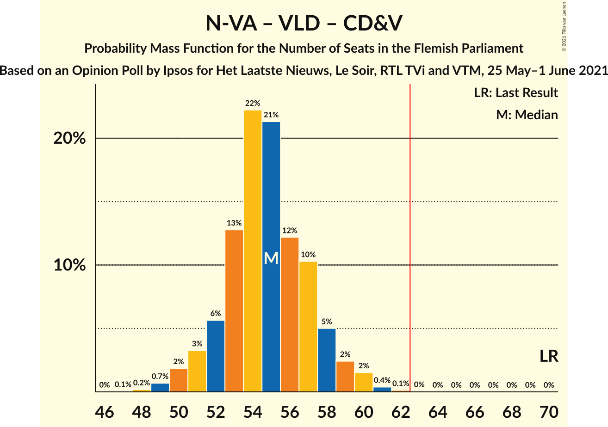

| Number of Seats | Probability | Accumulated | Special Marks |
|:---------------:|:-----------:|:-----------:|:-------------:|
| 47 | 0.1% | 100% |  |
| 48 | 0.2% | 99.9% |  |
| 49 | 0.7% | 99.7% |  |
| 50 | 2% | 99.1% |  |
| 51 | 3% | 97% |  |
| 52 | 6% | 94% |  |
| 53 | 13% | 88% |  |
| 54 | 22% | 76% | Median |
| 55 | 21% | 53% |  |
| 56 | 12% | 32% |  |
| 57 | 10% | 20% |  |
| 58 | 5% | 10% |  |
| 59 | 2% | 5% |  |
| 60 | 2% | 2% |  |
| 61 | 0.4% | 0.6% |  |
| 62 | 0.1% | 0.2% |  |
| 63 | 0% | 0.1% | Majority |
| 64 | 0% | 0% |  |
| 65 | 0% | 0% |  |
| 66 | 0% | 0% |  |
| 67 | 0% | 0% |  |
| 68 | 0% | 0% |  |
| 69 | 0% | 0% |  |
| 70 | 0% | 0% | Last Result |

### Vooruit – Open Vlaamse Liberalen en Democraten – Christen-Democratisch en Vlaams – Groen

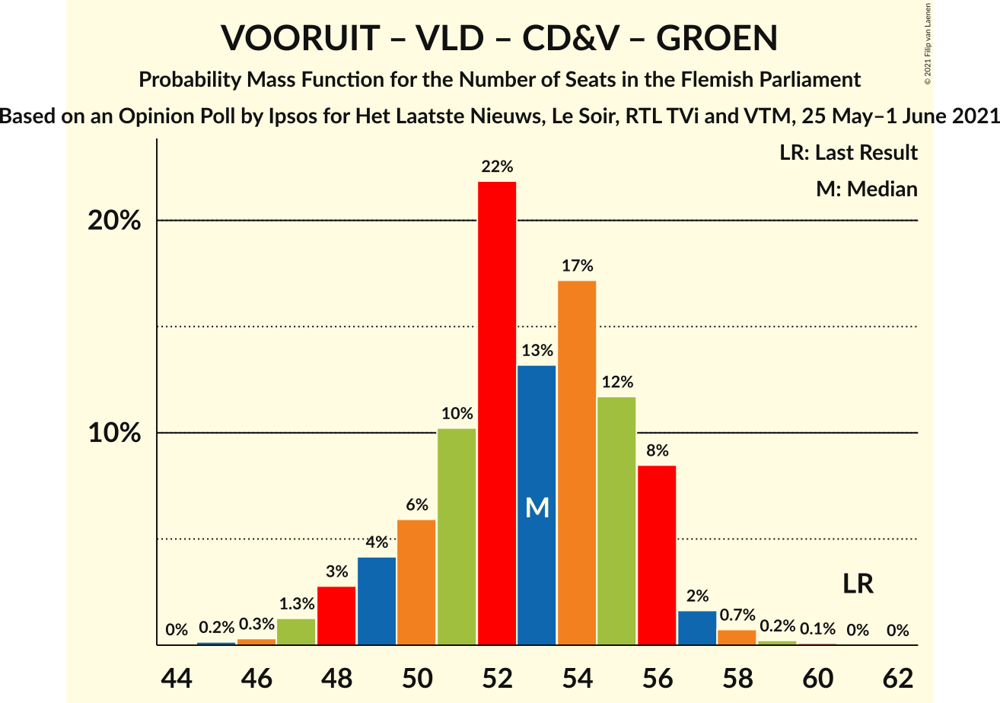

| Number of Seats | Probability | Accumulated | Special Marks |
|:---------------:|:-----------:|:-----------:|:-------------:|
| 44 | 0% | 100% |  |
| 45 | 0.2% | 99.9% |  |
| 46 | 0.3% | 99.8% |  |
| 47 | 1.3% | 99.5% |  |
| 48 | 3% | 98% |  |
| 49 | 4% | 95% |  |
| 50 | 6% | 91% |  |
| 51 | 10% | 85% |  |
| 52 | 22% | 75% |  |
| 53 | 13% | 53% | Median |
| 54 | 17% | 40% |  |
| 55 | 12% | 23% |  |
| 56 | 8% | 11% |  |
| 57 | 2% | 3% |  |
| 58 | 0.7% | 1.1% |  |
| 59 | 0.2% | 0.3% |  |
| 60 | 0.1% | 0.1% |  |
| 61 | 0% | 0% | Last Result |

### Vooruit – Christen-Democratisch en Vlaams – Groen – Partij van de Arbeid van België

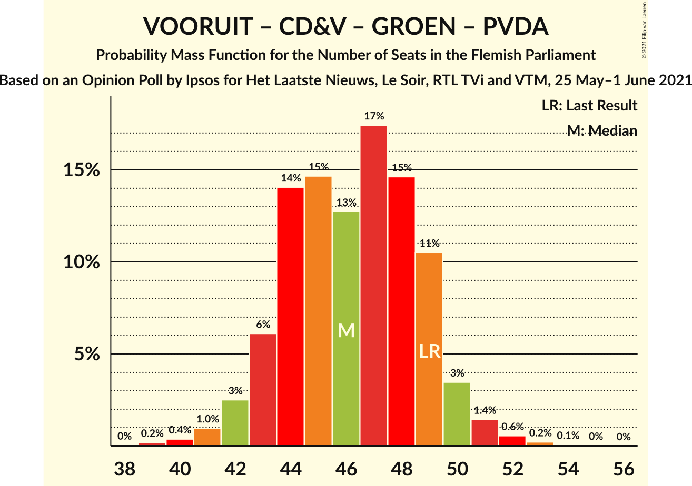

| Number of Seats | Probability | Accumulated | Special Marks |
|:---------------:|:-----------:|:-----------:|:-------------:|
| 38 | 0% | 100% |  |
| 39 | 0.2% | 99.9% |  |
| 40 | 0.4% | 99.7% |  |
| 41 | 1.0% | 99.4% |  |
| 42 | 3% | 98% |  |
| 43 | 6% | 96% |  |
| 44 | 14% | 90% |  |
| 45 | 15% | 76% |  |
| 46 | 13% | 61% |  |
| 47 | 17% | 48% | Median |
| 48 | 15% | 31% |  |
| 49 | 11% | 16% | Last Result |
| 50 | 3% | 6% |  |
| 51 | 1.4% | 2% |  |
| 52 | 0.6% | 0.9% |  |
| 53 | 0.2% | 0.3% |  |
| 54 | 0.1% | 0.1% |  |
| 55 | 0% | 0% |  |

### Nieuw-Vlaamse Alliantie – Open Vlaamse Liberalen en Democraten

| Number of Seats | Probability | Accumulated | Special Marks |
|:---------------:|:-----------:|:-----------:|:-------------:|
| 36 | 0.1% | 100% |  |
| 37 | 0.3% | 99.9% |  |
| 38 | 1.0% | 99.6% |  |
| 39 | 2% | 98.7% |  |
| 40 | 5% | 96% |  |
| 41 | 13% | 92% |  |
| 42 | 20% | 79% | Median |
| 43 | 21% | 59% |  |
| 44 | 16% | 38% |  |
| 45 | 10% | 22% |  |
| 46 | 7% | 12% |  |
| 47 | 2% | 5% |  |
| 48 | 2% | 3% |  |
| 49 | 0.9% | 1.1% |  |
| 50 | 0.1% | 0.2% |  |
| 51 | 0% | 0% | Last Result |

### Vooruit – Open Vlaamse Liberalen en Democraten – Christen-Democratisch en Vlaams

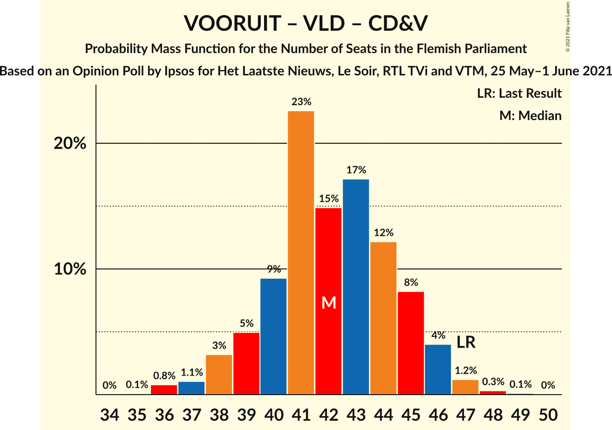

| Number of Seats | Probability | Accumulated | Special Marks |
|:---------------:|:-----------:|:-----------:|:-------------:|
| 35 | 0.1% | 100% |  |
| 36 | 0.8% | 99.9% |  |
| 37 | 1.1% | 99.1% |  |
| 38 | 3% | 98% |  |
| 39 | 5% | 95% |  |
| 40 | 9% | 90% |  |
| 41 | 23% | 81% |  |
| 42 | 15% | 58% | Median |
| 43 | 17% | 43% |  |
| 44 | 12% | 26% |  |
| 45 | 8% | 14% |  |
| 46 | 4% | 6% |  |
| 47 | 1.2% | 2% | Last Result |
| 48 | 0.3% | 0.4% |  |
| 49 | 0.1% | 0.1% |  |
| 50 | 0% | 0% |  |

### Nieuw-Vlaamse Alliantie – Christen-Democratisch en Vlaams

| Number of Seats | Probability | Accumulated | Special Marks |
|:---------------:|:-----------:|:-----------:|:-------------:|
| 33 | 0.1% | 100% |  |
| 34 | 0.1% | 99.9% |  |
| 35 | 0.3% | 99.8% |  |
| 36 | 2% | 99.5% |  |
| 37 | 3% | 98% |  |
| 38 | 10% | 95% |  |
| 39 | 22% | 84% |  |
| 40 | 20% | 62% | Median |
| 41 | 14% | 43% |  |
| 42 | 12% | 29% |  |
| 43 | 6% | 16% |  |
| 44 | 7% | 10% |  |
| 45 | 2% | 4% |  |
| 46 | 0.9% | 1.3% |  |
| 47 | 0.3% | 0.4% |  |
| 48 | 0.1% | 0.1% |  |
| 49 | 0% | 0% |  |
| 50 | 0% | 0% |  |
| 51 | 0% | 0% |  |
| 52 | 0% | 0% |  |
| 53 | 0% | 0% |  |
| 54 | 0% | 0% | Last Result |

### Vooruit – Open Vlaamse Liberalen en Democraten – Groen

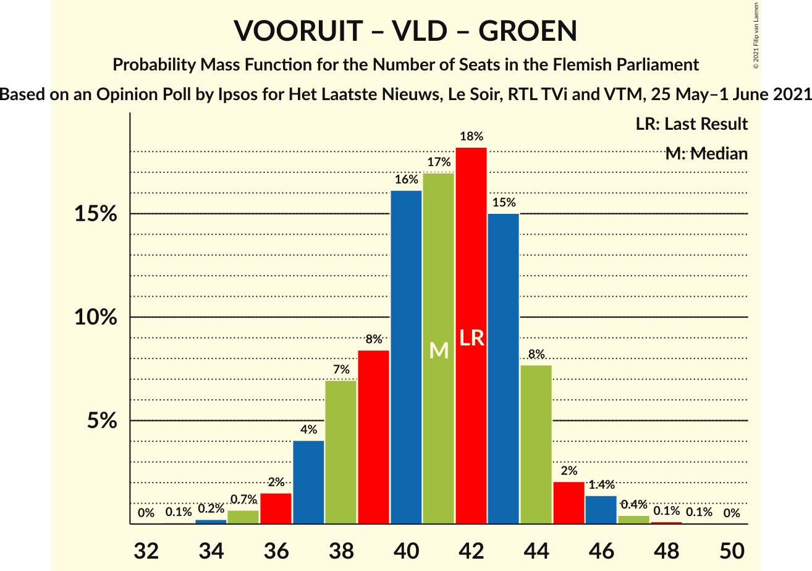

| Number of Seats | Probability | Accumulated | Special Marks |
|:---------------:|:-----------:|:-----------:|:-------------:|
| 33 | 0.1% | 100% |  |
| 34 | 0.2% | 99.9% |  |
| 35 | 0.7% | 99.7% |  |
| 36 | 2% | 99.0% |  |
| 37 | 4% | 98% |  |
| 38 | 7% | 93% |  |
| 39 | 8% | 87% |  |
| 40 | 16% | 78% |  |
| 41 | 17% | 62% | Median |
| 42 | 18% | 45% | Last Result |
| 43 | 15% | 27% |  |
| 44 | 8% | 12% |  |
| 45 | 2% | 4% |  |
| 46 | 1.4% | 2% |  |
| 47 | 0.4% | 0.6% |  |
| 48 | 0.1% | 0.2% |  |
| 49 | 0.1% | 0.1% |  |
| 50 | 0% | 0% |  |

### Vooruit – Christen-Democratisch en Vlaams – Groen

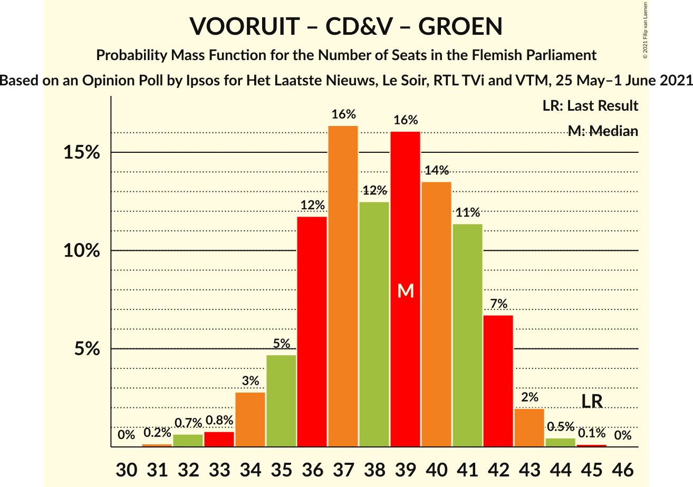

| Number of Seats | Probability | Accumulated | Special Marks |
|:---------------:|:-----------:|:-----------:|:-------------:|
| 30 | 0% | 100% |  |
| 31 | 0.2% | 99.9% |  |
| 32 | 0.7% | 99.8% |  |
| 33 | 0.8% | 99.1% |  |
| 34 | 3% | 98% |  |
| 35 | 5% | 96% |  |
| 36 | 12% | 91% |  |
| 37 | 16% | 79% |  |
| 38 | 12% | 63% |  |
| 39 | 16% | 50% | Median |
| 40 | 14% | 34% |  |
| 41 | 11% | 21% |  |
| 42 | 7% | 9% |  |
| 43 | 2% | 3% |  |
| 44 | 0.5% | 0.6% |  |
| 45 | 0.1% | 0.2% | Last Result |
| 46 | 0% | 0% |  |

### Open Vlaamse Liberalen en Democraten – Christen-Democratisch en Vlaams – Groen

| Number of Seats | Probability | Accumulated | Special Marks |
|:---------------:|:-----------:|:-----------:|:-------------:|
| 29 | 0.1% | 100% |  |
| 30 | 0.3% | 99.9% |  |
| 31 | 1.0% | 99.5% |  |
| 32 | 2% | 98% |  |
| 33 | 5% | 96% |  |
| 34 | 4% | 91% |  |
| 35 | 7% | 87% |  |
| 36 | 21% | 80% |  |
| 37 | 28% | 58% | Median |
| 38 | 16% | 30% |  |
| 39 | 5% | 14% |  |
| 40 | 4% | 8% |  |
| 41 | 3% | 4% |  |
| 42 | 1.3% | 2% |  |
| 43 | 0.1% | 0.2% |  |
| 44 | 0.1% | 0.1% |  |
| 45 | 0% | 0% |  |
| 46 | 0% | 0% |  |
| 47 | 0% | 0% |  |
| 48 | 0% | 0% |  |
| 49 | 0% | 0% | Last Result |

### Vooruit – Open Vlaamse Liberalen en Democraten

| Number of Seats | Probability | Accumulated | Special Marks |
|:---------------:|:-----------:|:-----------:|:-------------:|
| 24 | 0.1% | 100% |  |
| 25 | 0.6% | 99.9% |  |
| 26 | 3% | 99.3% |  |
| 27 | 5% | 96% |  |
| 28 | 7% | 91% | Last Result |
| 29 | 16% | 84% |  |
| 30 | 20% | 68% | Median |
| 31 | 19% | 49% |  |
| 32 | 15% | 30% |  |
| 33 | 8% | 15% |  |
| 34 | 5% | 7% |  |
| 35 | 2% | 2% |  |
| 36 | 0.4% | 0.5% |  |
| 37 | 0.1% | 0.1% |  |
| 38 | 0% | 0% |  |

### Vooruit – Christen-Democratisch en Vlaams

| Number of Seats | Probability | Accumulated | Special Marks |
|:---------------:|:-----------:|:-----------:|:-------------:|
| 21 | 0% | 100% |  |
| 22 | 0.1% | 99.9% |  |
| 23 | 0.6% | 99.8% |  |
| 24 | 4% | 99.2% |  |
| 25 | 10% | 96% |  |
| 26 | 16% | 86% |  |
| 27 | 17% | 70% |  |
| 28 | 15% | 53% | Median |
| 29 | 14% | 38% |  |
| 30 | 14% | 24% |  |
| 31 | 8% | 10% | Last Result |
| 32 | 2% | 2% |  |
| 33 | 0.4% | 0.6% |  |
| 34 | 0.1% | 0.2% |  |
| 35 | 0% | 0.1% |  |
| 36 | 0% | 0% |  |

### Open Vlaamse Liberalen en Democraten – Christen-Democratisch en Vlaams

| Number of Seats | Probability | Accumulated | Special Marks |
|:---------------:|:-----------:|:-----------:|:-------------:|
| 20 | 0.1% | 100% |  |
| 21 | 0.6% | 99.9% |  |
| 22 | 3% | 99.3% |  |
| 23 | 5% | 96% |  |
| 24 | 7% | 91% |  |
| 25 | 17% | 84% |  |
| 26 | 26% | 67% | Median |
| 27 | 26% | 41% |  |
| 28 | 8% | 15% |  |
| 29 | 4% | 7% |  |
| 30 | 2% | 3% |  |
| 31 | 0.6% | 0.7% |  |
| 32 | 0.1% | 0.1% |  |
| 33 | 0% | 0% |  |
| 34 | 0% | 0% |  |
| 35 | 0% | 0% | Last Result |

## Technical Information

### Opinion Poll

+ **Polling firm:** Ipsos
+ **Commissioner(s):** Het Laatste Nieuws, Le Soir, RTL TVi and VTM
+ **Fieldwork period:** 25 May–1 June 2021

### Calculations

+ **Sample size:** 1002
+ **Simulations done:** 1,048,576
+ **Error estimate:** 0.88%

