# Opinion Poll by Ipsos for Het Laatste Nieuws, Le Soir, RTL TVi and VTM, 7–14 September 2021

<a href="#voting-intentions">Voting Intentions</a> | <a href="#seats">Seats</a> | <a href="#coalitions">Coalitions</a> | <a href="#technical-information">Technical Information</a>

## Voting Intentions

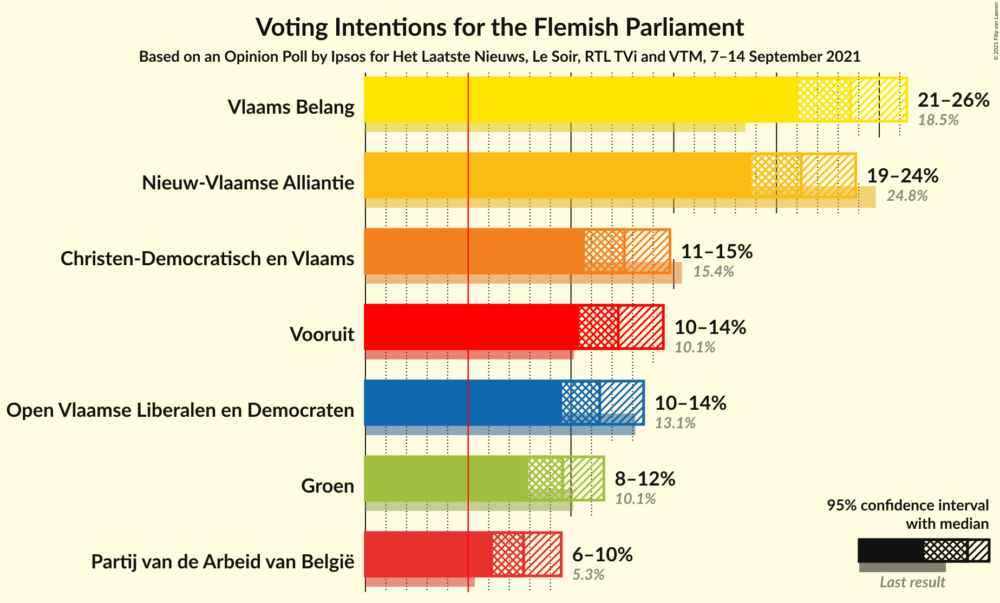

### Confidence Intervals

| Party | Last Result | Poll Result | 80% Confidence Interval | 90% Confidence Interval | 95% Confidence Interval | 99% Confidence Interval |
|:-----:|:-----------:|:-----------:|:-----------------------:|:-----------------------:|:-----------------------:|:-----------------------:|
| Vlaams Belang | 18.5% | 23.6% | 21.9–25.4% |21.5–25.9% |21.1–26.3% |20.3–27.2% |
| Nieuw-Vlaamse Alliantie | 24.8% | 21.2% | 19.6–22.9% |19.2–23.4% |18.8–23.9% |18.0–24.7% |
| Christen-Democratisch en Vlaams | 15.4% | 12.6% | 11.3–14.0% |11.0–14.4% |10.7–14.8% |10.1–15.5% |
| Vooruit | 10.1% | 12.3% | 11.1–13.7% |10.7–14.1% |10.4–14.5% |9.8–15.2% |
| Open Vlaamse Liberalen en Democraten | 13.1% | 11.4% | 10.2–12.8% |9.9–13.2% |9.6–13.5% |9.0–14.2% |
| Groen | 10.1% | 9.6% | 8.5–10.9% |8.2–11.3% |7.9–11.6% |7.4–12.2% |
| Partij van de Arbeid van België | 5.3% | 7.7% | 6.7–8.9% |6.4–9.2% |6.2–9.5% |5.8–10.1% |

*Note:* The poll result column reflects the actual value used in the calculations. Published results may vary slightly, and in addition be rounded to fewer digits.

## Seats

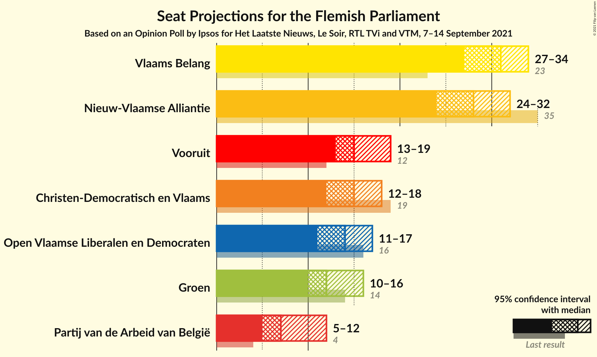

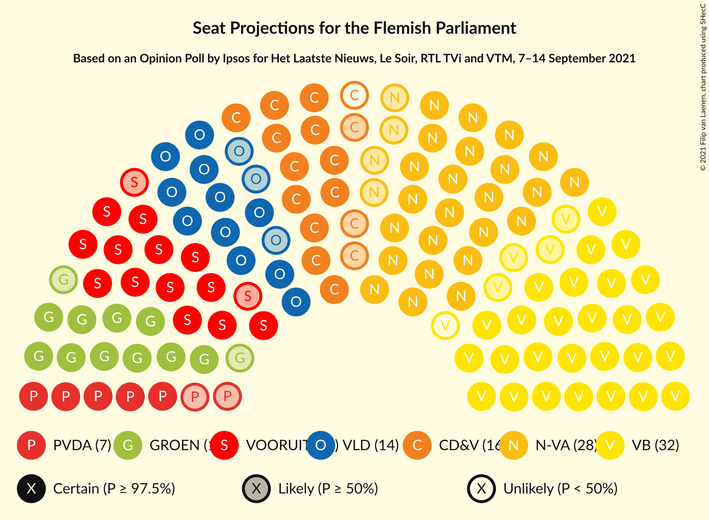

### Confidence Intervals

| Party | Last Result | Median | 80% Confidence Interval | 90% Confidence Interval | 95% Confidence Interval | 99% Confidence Interval |
|:-----:|:-----------:|:------:|:-----------------------:|:-----------------------:|:-----------------------:|:-----------------------:|
| <a href="#vlaams-belang">Vlaams Belang</a> | 23 | 31 | 29–34 |28–34 |27–34 |25–36 |
| <a href="#nieuw-vlaamse-alliantie">Nieuw-Vlaamse Alliantie</a> | 35 | 28 | 27–30 |26–31 |24–32 |22–33 |
| <a href="#christen-democratisch-en-vlaams">Christen-Democratisch en Vlaams</a> | 19 | 15 | 13–17 |12–17 |12–18 |12–20 |
| <a href="#vooruit">Vooruit</a> | 12 | 15 | 14–18 |13–19 |13–19 |12–19 |
| <a href="#open-vlaamse-liberalen-en-democraten">Open Vlaamse Liberalen en Democraten</a> | 16 | 14 | 12–16 |11–17 |11–17 |11–19 |
| <a href="#groen">Groen</a> | 14 | 12 | 11–15 |11–15 |10–16 |9–16 |
| <a href="#partij-van-de-arbeid-van-belgië">Partij van de Arbeid van België</a> | 4 | 7 | 7–9 |6–11 |5–12 |5–13 |

### Vlaams Belang

*For a full overview of the results for this party, see the [Vlaams Belang](party-vlaamsbelang.html) page.*

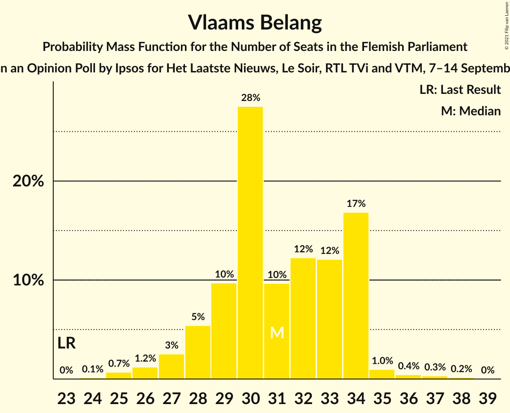

| Number of Seats | Probability | Accumulated | Special Marks |
|:---------------:|:-----------:|:-----------:|:-------------:|
| 23 | 0% | 100% | Last Result |
| 24 | 0.1% | 100% |  |
| 25 | 0.7% | 99.9% |  |
| 26 | 1.2% | 99.2% |  |
| 27 | 3% | 98% |  |
| 28 | 5% | 95% |  |
| 29 | 10% | 90% |  |
| 30 | 28% | 80% |  |
| 31 | 10% | 53% | Median |
| 32 | 12% | 43% |  |
| 33 | 12% | 31% |  |
| 34 | 17% | 19% |  |
| 35 | 1.0% | 2% |  |
| 36 | 0.4% | 0.9% |  |
| 37 | 0.3% | 0.5% |  |
| 38 | 0.2% | 0.2% |  |
| 39 | 0% | 0% |  |

### Nieuw-Vlaamse Alliantie

*For a full overview of the results for this party, see the [Nieuw-Vlaamse Alliantie](party-nieuw-vlaamsealliantie.html) page.*

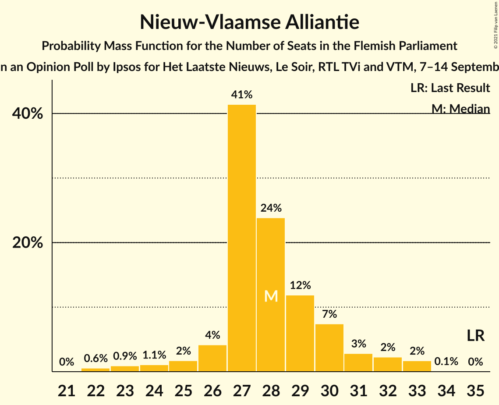

| Number of Seats | Probability | Accumulated | Special Marks |
|:---------------:|:-----------:|:-----------:|:-------------:|
| 22 | 0.6% | 100% |  |
| 23 | 0.9% | 99.4% |  |
| 24 | 1.1% | 98.5% |  |
| 25 | 2% | 97% |  |
| 26 | 4% | 96% |  |
| 27 | 41% | 92% |  |
| 28 | 24% | 50% | Median |
| 29 | 12% | 26% |  |
| 30 | 7% | 14% |  |
| 31 | 3% | 7% |  |
| 32 | 2% | 4% |  |
| 33 | 2% | 2% |  |
| 34 | 0.1% | 0.1% |  |
| 35 | 0% | 0% | Last Result |

### Christen-Democratisch en Vlaams

*For a full overview of the results for this party, see the [Christen-Democratisch en Vlaams](party-christen-democratischenvlaams.html) page.*

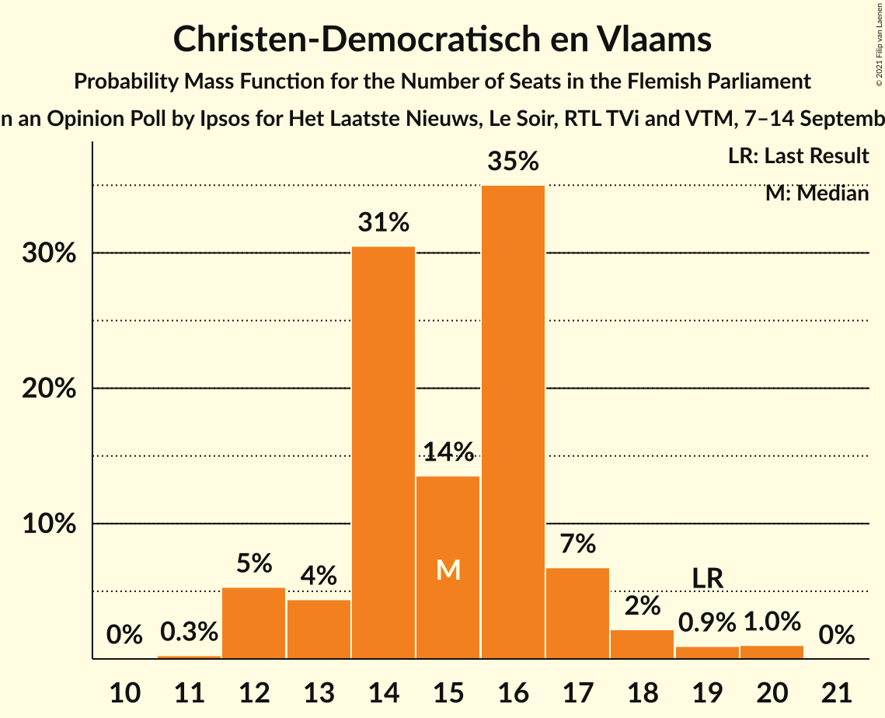

| Number of Seats | Probability | Accumulated | Special Marks |
|:---------------:|:-----------:|:-----------:|:-------------:|
| 11 | 0.3% | 100% |  |
| 12 | 5% | 99.7% |  |
| 13 | 4% | 94% |  |
| 14 | 31% | 90% |  |
| 15 | 14% | 59% | Median |
| 16 | 35% | 46% |  |
| 17 | 7% | 11% |  |
| 18 | 2% | 4% |  |
| 19 | 0.9% | 2% | Last Result |
| 20 | 1.0% | 1.0% |  |
| 21 | 0% | 0% |  |

### Vooruit

*For a full overview of the results for this party, see the [Vooruit](party-vooruit.html) page.*

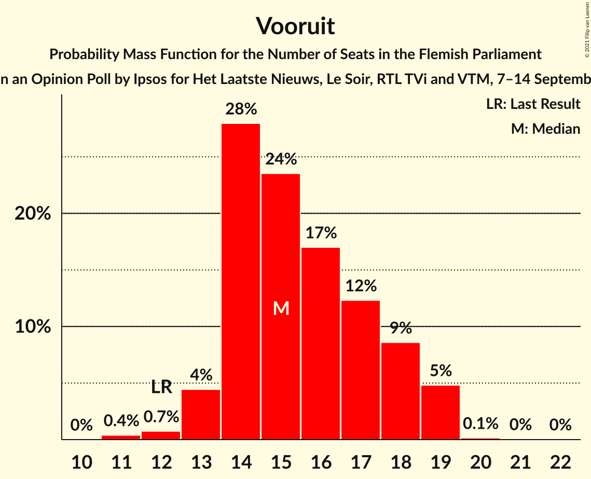

| Number of Seats | Probability | Accumulated | Special Marks |
|:---------------:|:-----------:|:-----------:|:-------------:|
| 11 | 0.4% | 100% |  |
| 12 | 0.7% | 99.6% | Last Result |
| 13 | 4% | 98.9% |  |
| 14 | 28% | 94% |  |
| 15 | 24% | 66% | Median |
| 16 | 17% | 43% |  |
| 17 | 12% | 26% |  |
| 18 | 9% | 14% |  |
| 19 | 5% | 5% |  |
| 20 | 0.1% | 0.2% |  |
| 21 | 0% | 0.1% |  |
| 22 | 0% | 0% |  |

### Open Vlaamse Liberalen en Democraten

*For a full overview of the results for this party, see the [Open Vlaamse Liberalen en Democraten](party-openvlaamseliberalenendemocraten.html) page.*

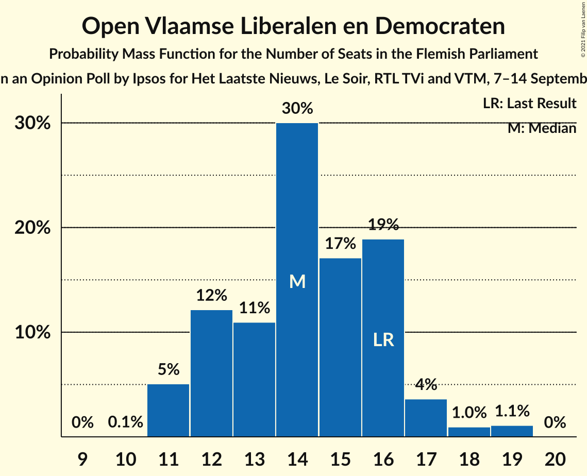

| Number of Seats | Probability | Accumulated | Special Marks |
|:---------------:|:-----------:|:-----------:|:-------------:|
| 10 | 0.1% | 100% |  |
| 11 | 5% | 99.9% |  |
| 12 | 12% | 95% |  |
| 13 | 11% | 83% |  |
| 14 | 30% | 72% | Median |
| 15 | 17% | 42% |  |
| 16 | 19% | 25% | Last Result |
| 17 | 4% | 6% |  |
| 18 | 1.0% | 2% |  |
| 19 | 1.1% | 1.1% |  |
| 20 | 0% | 0% |  |

### Groen

*For a full overview of the results for this party, see the [Groen](party-groen.html) page.*

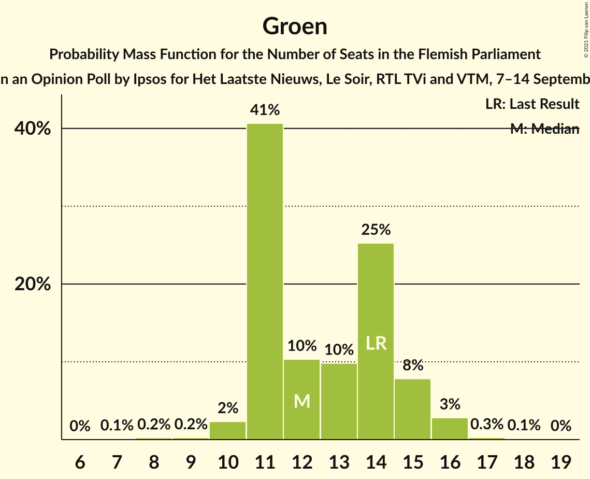

| Number of Seats | Probability | Accumulated | Special Marks |
|:---------------:|:-----------:|:-----------:|:-------------:|
| 7 | 0.1% | 100% |  |
| 8 | 0.2% | 99.9% |  |
| 9 | 0.2% | 99.7% |  |
| 10 | 2% | 99.4% |  |
| 11 | 41% | 97% |  |
| 12 | 10% | 56% | Median |
| 13 | 10% | 46% |  |
| 14 | 25% | 36% | Last Result |
| 15 | 8% | 11% |  |
| 16 | 3% | 3% |  |
| 17 | 0.3% | 0.4% |  |
| 18 | 0.1% | 0.2% |  |
| 19 | 0% | 0% |  |

### Partij van de Arbeid van België

*For a full overview of the results for this party, see the [Partij van de Arbeid van België](party-partijvandearbeidvanbelgië.html) page.*

| Number of Seats | Probability | Accumulated | Special Marks |
|:---------------:|:-----------:|:-----------:|:-------------:|
| 4 | 0.4% | 100% | Last Result |
| 5 | 4% | 99.6% |  |
| 6 | 2% | 96% |  |
| 7 | 45% | 94% | Median |
| 8 | 32% | 48% |  |
| 9 | 7% | 16% |  |
| 10 | 4% | 10% |  |
| 11 | 3% | 5% |  |
| 12 | 2% | 3% |  |
| 13 | 1.1% | 1.2% |  |
| 14 | 0% | 0% |  |

## Coalitions

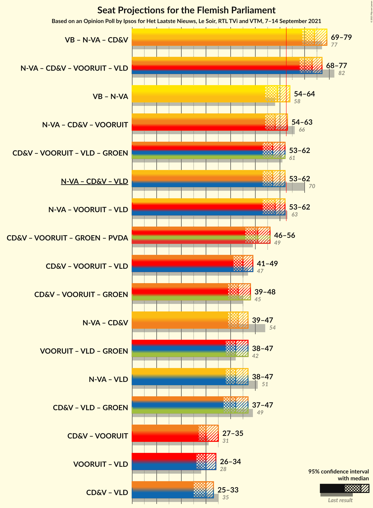

### Confidence Intervals

| Coalition | Last Result | Median | Majority? | 80% Confidence Interval | 90% Confidence Interval | 95% Confidence Interval | 99% Confidence Interval |
|:---------:|:-----------:|:------:|:---------:|:-----------------------:|:-----------------------:|:-----------------------:|:-----------------------:|
| Vlaams Belang – Nieuw-Vlaamse Alliantie – Christen-Democratisch en Vlaams | 77 | 74 | 100% | 71–77 | 70–78 | 69–79 | 67–80 |
| Nieuw-Vlaamse Alliantie – Christen-Democratisch en Vlaams – Vooruit – Open Vlaamse Liberalen en Democraten | 82 | 73 | 100% | 70–76 | 69–76 | 68–77 | 67–79 |
| Vlaams Belang – Nieuw-Vlaamse Alliantie | 58 | 59 | 7% | 56–62 | 55–63 | 54–64 | 53–65 |
| Nieuw-Vlaamse Alliantie – Christen-Democratisch en Vlaams – Vooruit | 66 | 58 | 4% | 56–61 | 55–62 | 54–63 | 52–65 |
| Christen-Democratisch en Vlaams – Vooruit – Open Vlaamse Liberalen en Democraten – Groen | 61 | 57 | 2% | 54–60 | 53–61 | 53–62 | 51–64 |
| Nieuw-Vlaamse Alliantie – Christen-Democratisch en Vlaams – Open Vlaamse Liberalen en Democraten | 70 | 57 | 1.2% | 54–60 | 53–61 | 53–62 | 51–63 |
| Nieuw-Vlaamse Alliantie – Vooruit – Open Vlaamse Liberalen en Democraten | 63 | 58 | 2% | 54–61 | 54–61 | 53–62 | 52–64 |
| Christen-Democratisch en Vlaams – Vooruit – Groen – Partij van de Arbeid van België | 49 | 51 | 0% | 48–54 | 47–55 | 46–56 | 45–58 |
| Christen-Democratisch en Vlaams – Vooruit – Open Vlaamse Liberalen en Democraten | 47 | 45 | 0% | 42–47 | 41–48 | 41–49 | 39–50 |
| Christen-Democratisch en Vlaams – Vooruit – Groen | 45 | 43 | 0% | 40–46 | 39–47 | 39–48 | 37–49 |
| Nieuw-Vlaamse Alliantie – Christen-Democratisch en Vlaams | 54 | 43 | 0% | 41–46 | 40–46 | 39–47 | 37–49 |
| Vooruit – Open Vlaamse Liberalen en Democraten – Groen | 42 | 42 | 0% | 39–45 | 39–46 | 38–47 | 37–49 |
| Nieuw-Vlaamse Alliantie – Open Vlaamse Liberalen en Democraten | 51 | 42 | 0% | 39–45 | 39–46 | 38–47 | 37–48 |
| Christen-Democratisch en Vlaams – Open Vlaamse Liberalen en Democraten – Groen | 49 | 42 | 0% | 39–45 | 38–46 | 37–47 | 36–48 |
| Christen-Democratisch en Vlaams – Vooruit | 31 | 30 | 0% | 28–33 | 27–34 | 27–35 | 26–36 |
| Vooruit – Open Vlaamse Liberalen en Democraten | 28 | 30 | 0% | 27–32 | 26–33 | 26–34 | 25–35 |
| Christen-Democratisch en Vlaams – Open Vlaamse Liberalen en Democraten | 35 | 30 | 0% | 27–32 | 26–33 | 25–33 | 24–35 |

### Vlaams Belang – Nieuw-Vlaamse Alliantie – Christen-Democratisch en Vlaams

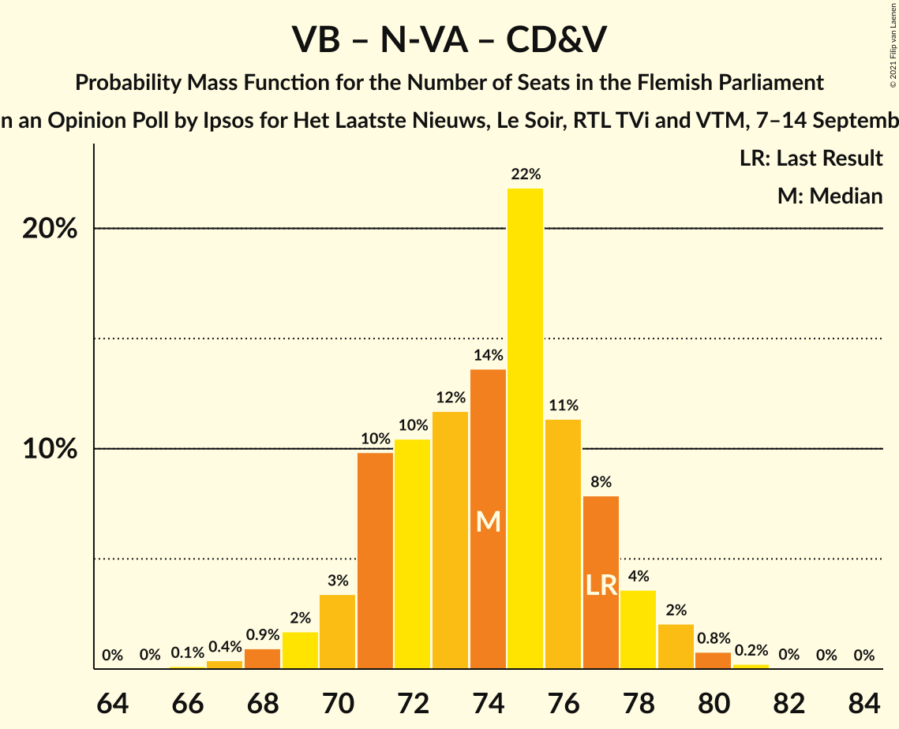

| Number of Seats | Probability | Accumulated | Special Marks |
|:---------------:|:-----------:|:-----------:|:-------------:|
| 66 | 0.1% | 100% |  |
| 67 | 0.4% | 99.8% |  |
| 68 | 0.9% | 99.4% |  |
| 69 | 2% | 98.5% |  |
| 70 | 3% | 97% |  |
| 71 | 10% | 93% |  |
| 72 | 10% | 84% |  |
| 73 | 12% | 73% |  |
| 74 | 14% | 61% | Median |
| 75 | 22% | 48% |  |
| 76 | 11% | 26% |  |
| 77 | 8% | 15% | Last Result |
| 78 | 4% | 7% |  |
| 79 | 2% | 3% |  |
| 80 | 0.8% | 1.1% |  |
| 81 | 0.2% | 0.3% |  |
| 82 | 0% | 0.1% |  |
| 83 | 0% | 0% |  |

### Nieuw-Vlaamse Alliantie – Christen-Democratisch en Vlaams – Vooruit – Open Vlaamse Liberalen en Democraten

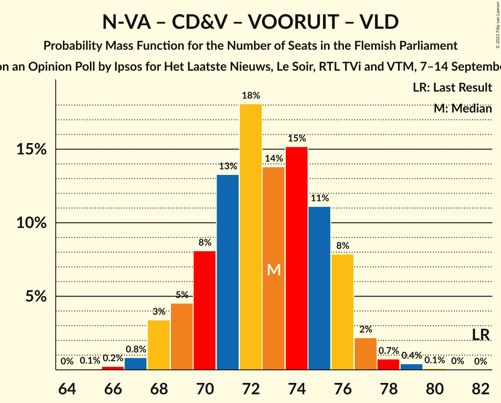

| Number of Seats | Probability | Accumulated | Special Marks |
|:---------------:|:-----------:|:-----------:|:-------------:|
| 65 | 0.1% | 100% |  |
| 66 | 0.2% | 99.9% |  |
| 67 | 0.8% | 99.7% |  |
| 68 | 3% | 98.8% |  |
| 69 | 5% | 95% |  |
| 70 | 8% | 91% |  |
| 71 | 13% | 83% |  |
| 72 | 18% | 70% | Median |
| 73 | 14% | 51% |  |
| 74 | 15% | 38% |  |
| 75 | 11% | 22% |  |
| 76 | 8% | 11% |  |
| 77 | 2% | 3% |  |
| 78 | 0.7% | 1.3% |  |
| 79 | 0.4% | 0.6% |  |
| 80 | 0.1% | 0.1% |  |
| 81 | 0% | 0% |  |
| 82 | 0% | 0% | Last Result |

### Vlaams Belang – Nieuw-Vlaamse Alliantie

| Number of Seats | Probability | Accumulated | Special Marks |
|:---------------:|:-----------:|:-----------:|:-------------:|
| 51 | 0.1% | 100% |  |
| 52 | 0.3% | 99.9% |  |
| 53 | 0.9% | 99.5% |  |
| 54 | 2% | 98.6% |  |
| 55 | 3% | 96% |  |
| 56 | 9% | 93% |  |
| 57 | 13% | 84% |  |
| 58 | 12% | 71% | Last Result |
| 59 | 17% | 59% | Median |
| 60 | 12% | 42% |  |
| 61 | 17% | 30% |  |
| 62 | 7% | 13% |  |
| 63 | 3% | 7% | Majority |
| 64 | 2% | 3% |  |
| 65 | 0.7% | 1.0% |  |
| 66 | 0.2% | 0.3% |  |
| 67 | 0.1% | 0.1% |  |
| 68 | 0% | 0% |  |

### Nieuw-Vlaamse Alliantie – Christen-Democratisch en Vlaams – Vooruit

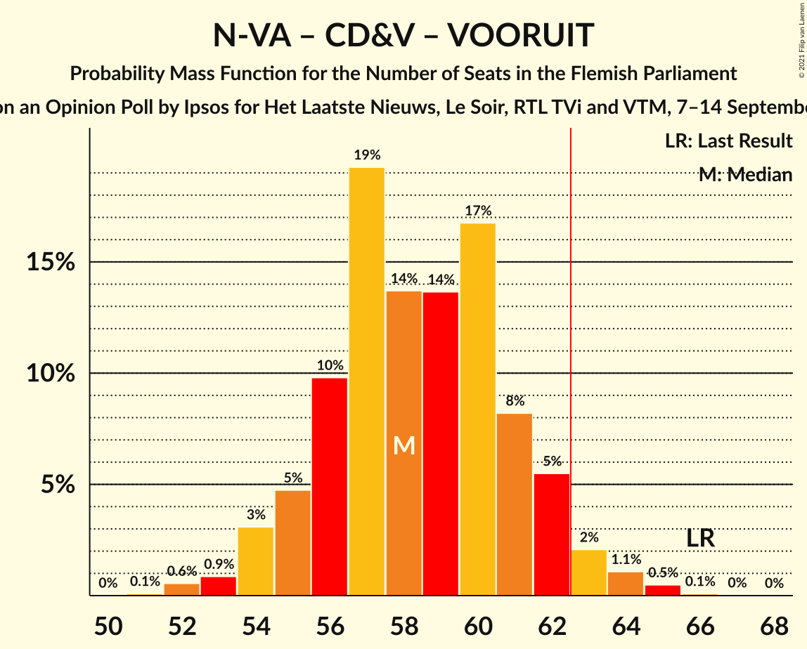

| Number of Seats | Probability | Accumulated | Special Marks |
|:---------------:|:-----------:|:-----------:|:-------------:|
| 51 | 0.1% | 100% |  |
| 52 | 0.6% | 99.9% |  |
| 53 | 0.9% | 99.3% |  |
| 54 | 3% | 98% |  |
| 55 | 5% | 95% |  |
| 56 | 10% | 91% |  |
| 57 | 19% | 81% |  |
| 58 | 14% | 62% | Median |
| 59 | 14% | 48% |  |
| 60 | 17% | 34% |  |
| 61 | 8% | 17% |  |
| 62 | 5% | 9% |  |
| 63 | 2% | 4% | Majority |
| 64 | 1.1% | 2% |  |
| 65 | 0.5% | 0.6% |  |
| 66 | 0.1% | 0.1% | Last Result |
| 67 | 0% | 0% |  |

### Christen-Democratisch en Vlaams – Vooruit – Open Vlaamse Liberalen en Democraten – Groen

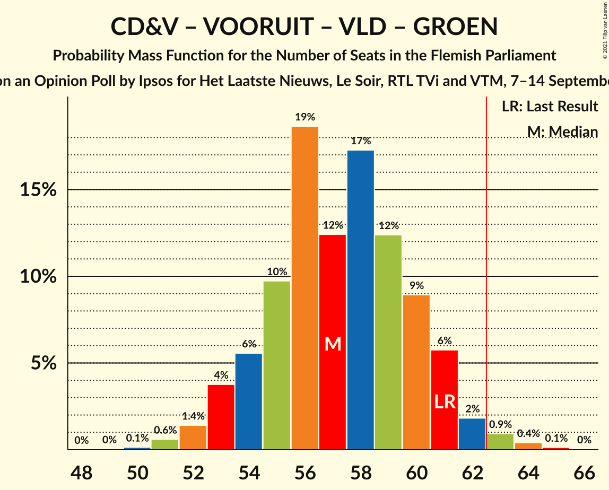

| Number of Seats | Probability | Accumulated | Special Marks |
|:---------------:|:-----------:|:-----------:|:-------------:|
| 49 | 0% | 100% |  |
| 50 | 0.1% | 99.9% |  |
| 51 | 0.6% | 99.8% |  |
| 52 | 1.4% | 99.2% |  |
| 53 | 4% | 98% |  |
| 54 | 6% | 94% |  |
| 55 | 10% | 88% |  |
| 56 | 19% | 79% | Median |
| 57 | 12% | 60% |  |
| 58 | 17% | 48% |  |
| 59 | 12% | 30% |  |
| 60 | 9% | 18% |  |
| 61 | 6% | 9% | Last Result |
| 62 | 2% | 3% |  |
| 63 | 0.9% | 2% | Majority |
| 64 | 0.4% | 0.6% |  |
| 65 | 0.1% | 0.2% |  |
| 66 | 0% | 0% |  |

### Nieuw-Vlaamse Alliantie – Christen-Democratisch en Vlaams – Open Vlaamse Liberalen en Democraten

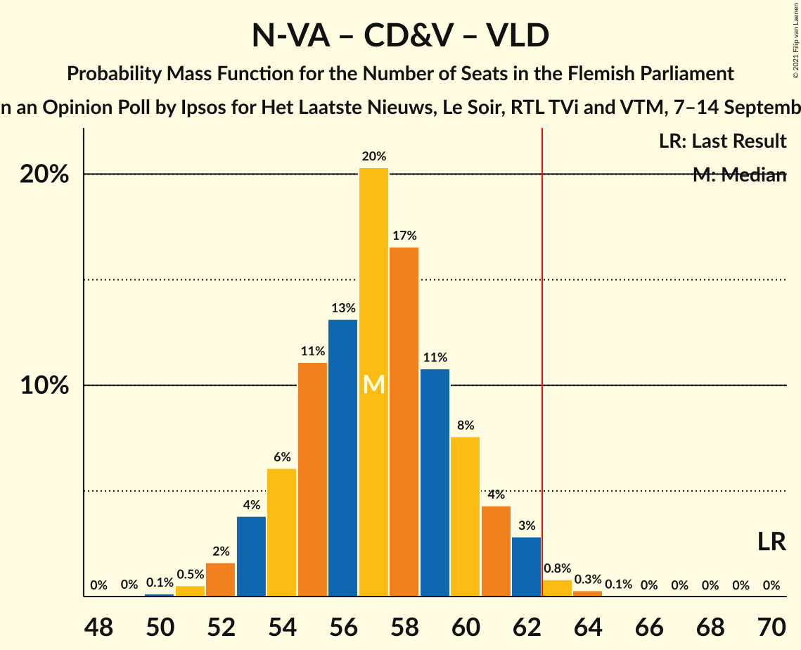

| Number of Seats | Probability | Accumulated | Special Marks |
|:---------------:|:-----------:|:-----------:|:-------------:|
| 49 | 0% | 100% |  |
| 50 | 0.1% | 99.9% |  |
| 51 | 0.5% | 99.8% |  |
| 52 | 2% | 99.3% |  |
| 53 | 4% | 98% |  |
| 54 | 6% | 94% |  |
| 55 | 11% | 88% |  |
| 56 | 13% | 77% |  |
| 57 | 20% | 64% | Median |
| 58 | 17% | 43% |  |
| 59 | 11% | 27% |  |
| 60 | 8% | 16% |  |
| 61 | 4% | 8% |  |
| 62 | 3% | 4% |  |
| 63 | 0.8% | 1.2% | Majority |
| 64 | 0.3% | 0.4% |  |
| 65 | 0.1% | 0.1% |  |
| 66 | 0% | 0% |  |
| 67 | 0% | 0% |  |
| 68 | 0% | 0% |  |
| 69 | 0% | 0% |  |
| 70 | 0% | 0% | Last Result |

### Nieuw-Vlaamse Alliantie – Vooruit – Open Vlaamse Liberalen en Democraten

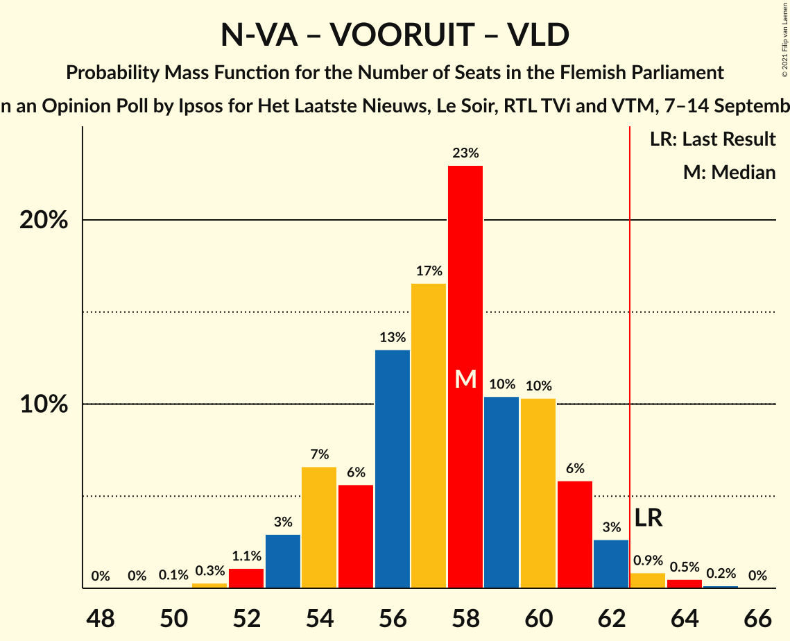

| Number of Seats | Probability | Accumulated | Special Marks |
|:---------------:|:-----------:|:-----------:|:-------------:|
| 50 | 0.1% | 100% |  |
| 51 | 0.3% | 99.9% |  |
| 52 | 1.1% | 99.6% |  |
| 53 | 3% | 98.5% |  |
| 54 | 7% | 96% |  |
| 55 | 6% | 89% |  |
| 56 | 13% | 83% |  |
| 57 | 17% | 70% | Median |
| 58 | 23% | 54% |  |
| 59 | 10% | 31% |  |
| 60 | 10% | 20% |  |
| 61 | 6% | 10% |  |
| 62 | 3% | 4% |  |
| 63 | 0.9% | 2% | Last Result, Majority |
| 64 | 0.5% | 0.7% |  |
| 65 | 0.2% | 0.2% |  |
| 66 | 0% | 0% |  |

### Christen-Democratisch en Vlaams – Vooruit – Groen – Partij van de Arbeid van België

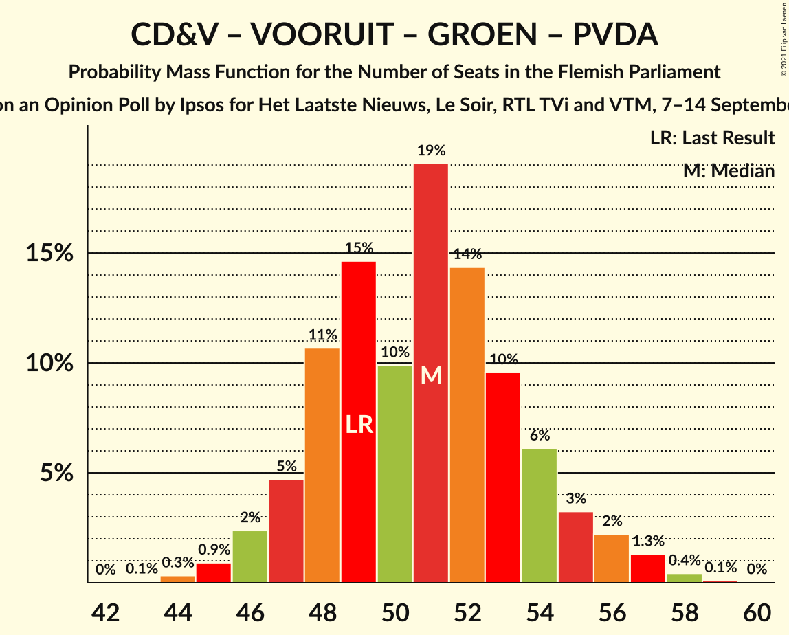

| Number of Seats | Probability | Accumulated | Special Marks |
|:---------------:|:-----------:|:-----------:|:-------------:|
| 43 | 0.1% | 100% |  |
| 44 | 0.3% | 99.9% |  |
| 45 | 0.9% | 99.6% |  |
| 46 | 2% | 98.7% |  |
| 47 | 5% | 96% |  |
| 48 | 11% | 92% |  |
| 49 | 15% | 81% | Last Result, Median |
| 50 | 10% | 66% |  |
| 51 | 19% | 56% |  |
| 52 | 14% | 37% |  |
| 53 | 10% | 23% |  |
| 54 | 6% | 13% |  |
| 55 | 3% | 7% |  |
| 56 | 2% | 4% |  |
| 57 | 1.3% | 2% |  |
| 58 | 0.4% | 0.6% |  |
| 59 | 0.1% | 0.1% |  |
| 60 | 0% | 0% |  |

### Christen-Democratisch en Vlaams – Vooruit – Open Vlaamse Liberalen en Democraten

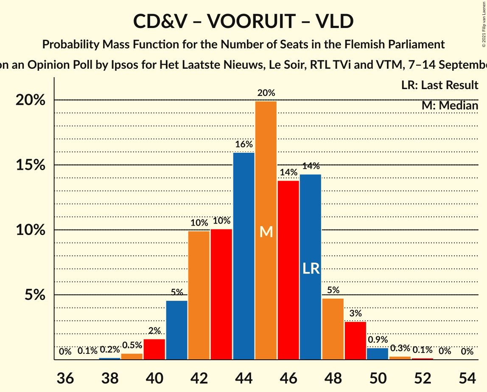

| Number of Seats | Probability | Accumulated | Special Marks |
|:---------------:|:-----------:|:-----------:|:-------------:|
| 37 | 0.1% | 100% |  |
| 38 | 0.2% | 99.9% |  |
| 39 | 0.5% | 99.8% |  |
| 40 | 2% | 99.3% |  |
| 41 | 5% | 98% |  |
| 42 | 10% | 93% |  |
| 43 | 10% | 83% |  |
| 44 | 16% | 73% | Median |
| 45 | 20% | 57% |  |
| 46 | 14% | 37% |  |
| 47 | 14% | 23% | Last Result |
| 48 | 5% | 9% |  |
| 49 | 3% | 4% |  |
| 50 | 0.9% | 1.4% |  |
| 51 | 0.3% | 0.5% |  |
| 52 | 0.1% | 0.2% |  |
| 53 | 0% | 0.1% |  |
| 54 | 0% | 0% |  |

### Christen-Democratisch en Vlaams – Vooruit – Groen

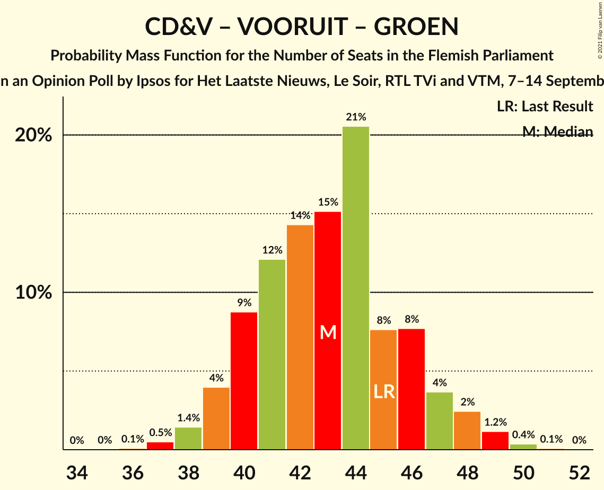

| Number of Seats | Probability | Accumulated | Special Marks |
|:---------------:|:-----------:|:-----------:|:-------------:|
| 36 | 0.1% | 100% |  |
| 37 | 0.5% | 99.9% |  |
| 38 | 1.4% | 99.4% |  |
| 39 | 4% | 98% |  |
| 40 | 9% | 94% |  |
| 41 | 12% | 85% |  |
| 42 | 14% | 73% | Median |
| 43 | 15% | 59% |  |
| 44 | 21% | 44% |  |
| 45 | 8% | 23% | Last Result |
| 46 | 8% | 15% |  |
| 47 | 4% | 8% |  |
| 48 | 2% | 4% |  |
| 49 | 1.2% | 2% |  |
| 50 | 0.4% | 0.5% |  |
| 51 | 0.1% | 0.1% |  |
| 52 | 0% | 0% |  |

### Nieuw-Vlaamse Alliantie – Christen-Democratisch en Vlaams

| Number of Seats | Probability | Accumulated | Special Marks |
|:---------------:|:-----------:|:-----------:|:-------------:|
| 36 | 0.2% | 100% |  |
| 37 | 0.5% | 99.8% |  |
| 38 | 1.0% | 99.3% |  |
| 39 | 3% | 98% |  |
| 40 | 5% | 96% |  |
| 41 | 19% | 91% |  |
| 42 | 13% | 72% |  |
| 43 | 21% | 59% | Median |
| 44 | 17% | 38% |  |
| 45 | 10% | 21% |  |
| 46 | 6% | 11% |  |
| 47 | 3% | 5% |  |
| 48 | 1.1% | 2% |  |
| 49 | 0.5% | 0.7% |  |
| 50 | 0.1% | 0.2% |  |
| 51 | 0.1% | 0.1% |  |
| 52 | 0% | 0% |  |
| 53 | 0% | 0% |  |
| 54 | 0% | 0% | Last Result |

### Vooruit – Open Vlaamse Liberalen en Democraten – Groen

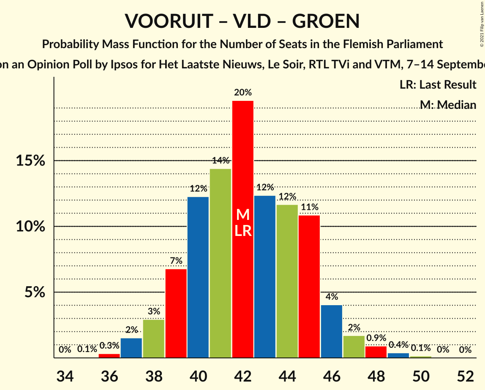

| Number of Seats | Probability | Accumulated | Special Marks |
|:---------------:|:-----------:|:-----------:|:-------------:|
| 35 | 0.1% | 100% |  |
| 36 | 0.3% | 99.9% |  |
| 37 | 2% | 99.6% |  |
| 38 | 3% | 98% |  |
| 39 | 7% | 95% |  |
| 40 | 12% | 88% |  |
| 41 | 14% | 76% | Median |
| 42 | 20% | 62% | Last Result |
| 43 | 12% | 42% |  |
| 44 | 12% | 30% |  |
| 45 | 11% | 18% |  |
| 46 | 4% | 7% |  |
| 47 | 2% | 3% |  |
| 48 | 0.9% | 1.5% |  |
| 49 | 0.4% | 0.6% |  |
| 50 | 0.1% | 0.2% |  |
| 51 | 0% | 0% |  |

### Nieuw-Vlaamse Alliantie – Open Vlaamse Liberalen en Democraten

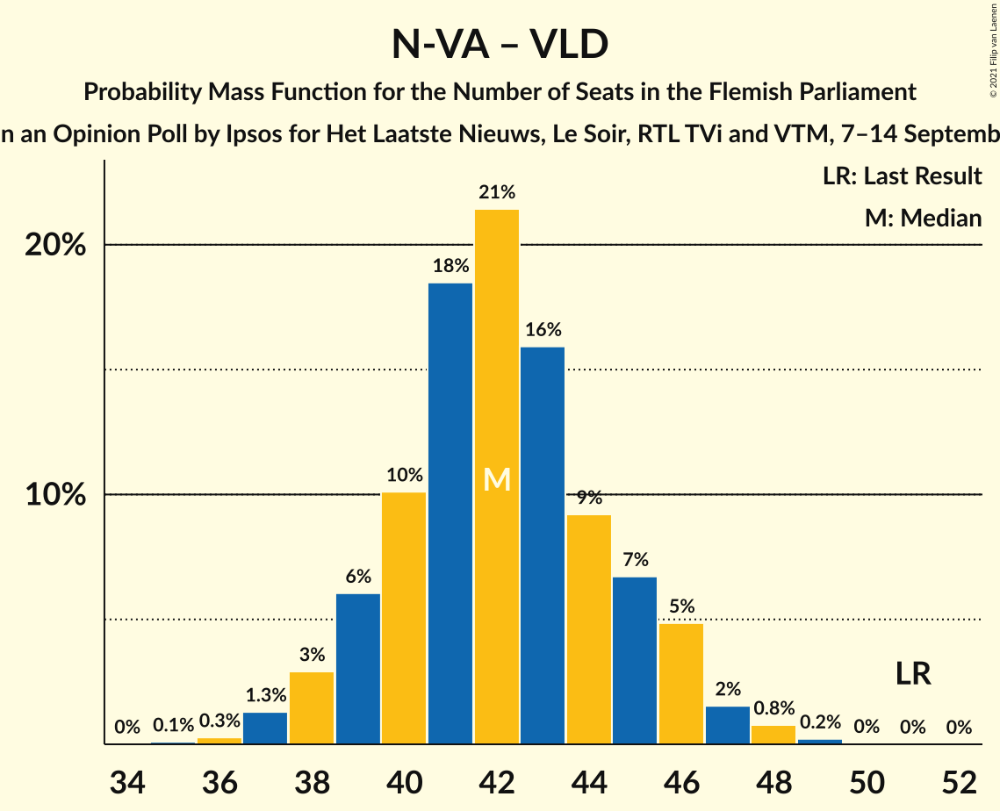

| Number of Seats | Probability | Accumulated | Special Marks |
|:---------------:|:-----------:|:-----------:|:-------------:|
| 35 | 0.1% | 100% |  |
| 36 | 0.3% | 99.9% |  |
| 37 | 1.3% | 99.6% |  |
| 38 | 3% | 98% |  |
| 39 | 6% | 95% |  |
| 40 | 10% | 89% |  |
| 41 | 18% | 79% |  |
| 42 | 21% | 61% | Median |
| 43 | 16% | 39% |  |
| 44 | 9% | 23% |  |
| 45 | 7% | 14% |  |
| 46 | 5% | 7% |  |
| 47 | 2% | 3% |  |
| 48 | 0.8% | 1.1% |  |
| 49 | 0.2% | 0.3% |  |
| 50 | 0% | 0.1% |  |
| 51 | 0% | 0% | Last Result |

### Christen-Democratisch en Vlaams – Open Vlaamse Liberalen en Democraten – Groen

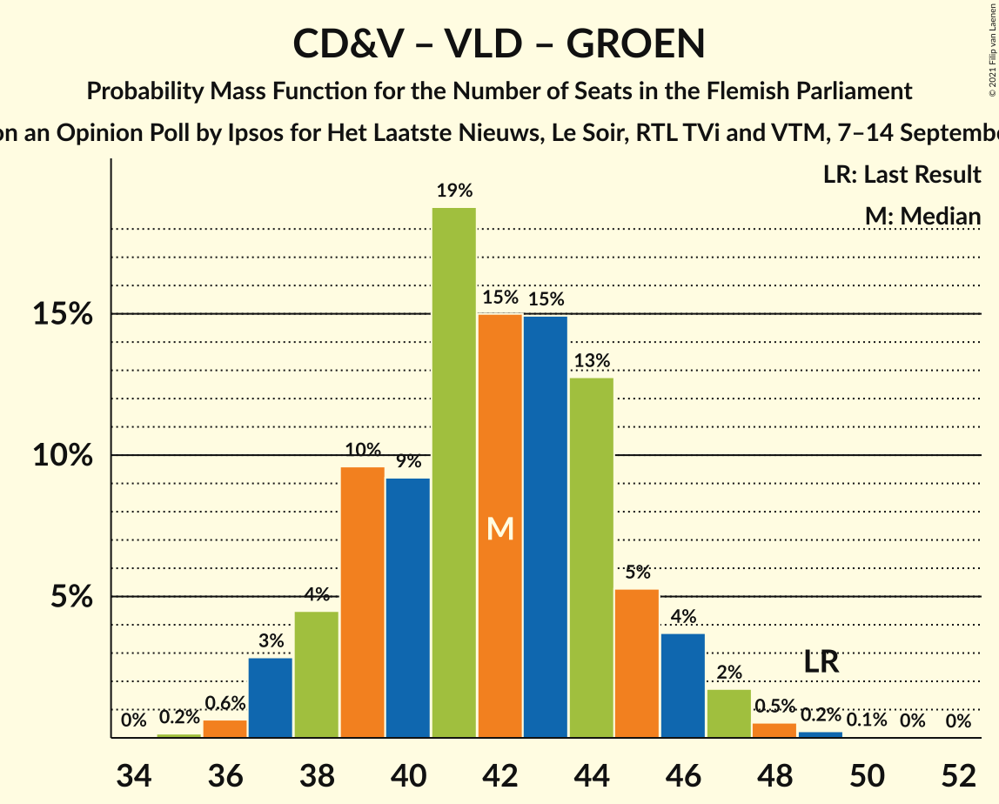

| Number of Seats | Probability | Accumulated | Special Marks |
|:---------------:|:-----------:|:-----------:|:-------------:|
| 34 | 0% | 100% |  |
| 35 | 0.2% | 99.9% |  |
| 36 | 0.6% | 99.8% |  |
| 37 | 3% | 99.2% |  |
| 38 | 4% | 96% |  |
| 39 | 10% | 92% |  |
| 40 | 9% | 82% |  |
| 41 | 19% | 73% | Median |
| 42 | 15% | 54% |  |
| 43 | 15% | 39% |  |
| 44 | 13% | 24% |  |
| 45 | 5% | 12% |  |
| 46 | 4% | 6% |  |
| 47 | 2% | 3% |  |
| 48 | 0.5% | 0.8% |  |
| 49 | 0.2% | 0.3% | Last Result |
| 50 | 0.1% | 0.1% |  |
| 51 | 0% | 0% |  |

### Christen-Democratisch en Vlaams – Vooruit

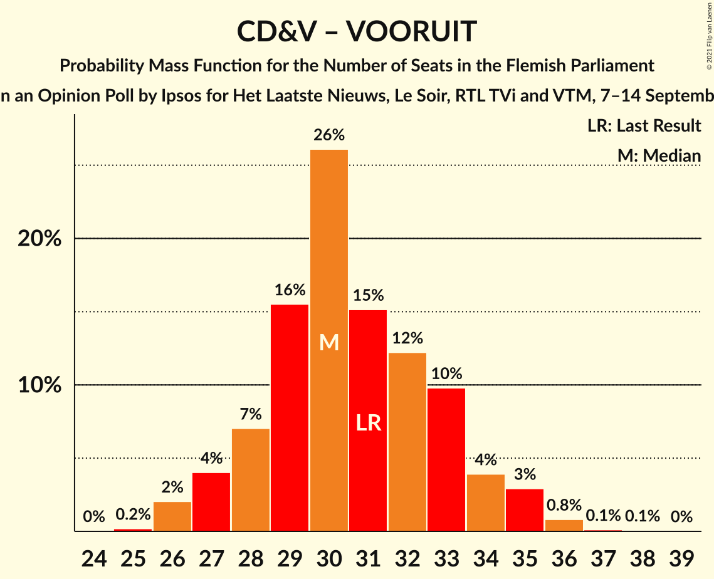

| Number of Seats | Probability | Accumulated | Special Marks |
|:---------------:|:-----------:|:-----------:|:-------------:|
| 25 | 0.2% | 100% |  |
| 26 | 2% | 99.8% |  |
| 27 | 4% | 98% |  |
| 28 | 7% | 94% |  |
| 29 | 16% | 87% |  |
| 30 | 26% | 71% | Median |
| 31 | 15% | 45% | Last Result |
| 32 | 12% | 30% |  |
| 33 | 10% | 18% |  |
| 34 | 4% | 8% |  |
| 35 | 3% | 4% |  |
| 36 | 0.8% | 1.0% |  |
| 37 | 0.1% | 0.2% |  |
| 38 | 0.1% | 0.1% |  |
| 39 | 0% | 0% |  |

### Vooruit – Open Vlaamse Liberalen en Democraten

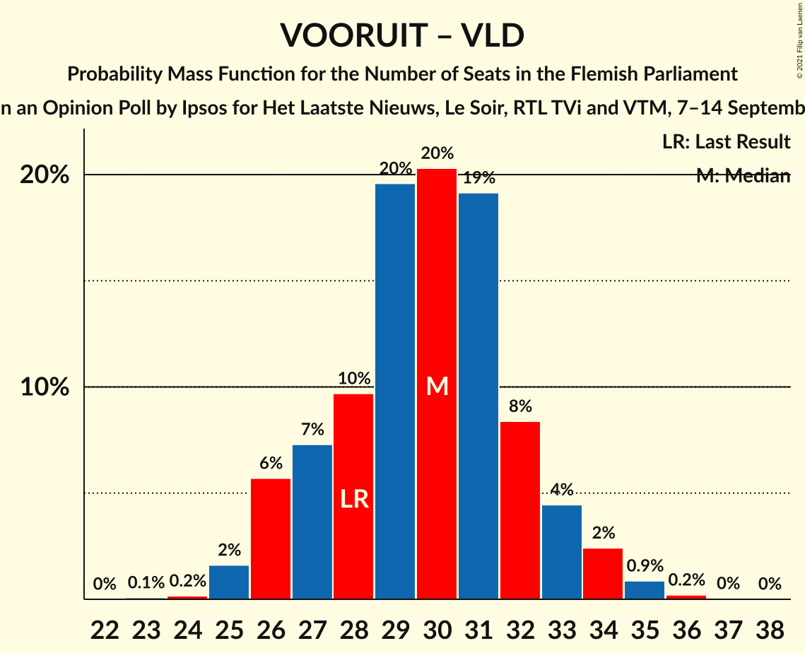

| Number of Seats | Probability | Accumulated | Special Marks |
|:---------------:|:-----------:|:-----------:|:-------------:|
| 23 | 0.1% | 100% |  |
| 24 | 0.2% | 99.9% |  |
| 25 | 2% | 99.7% |  |
| 26 | 6% | 98% |  |
| 27 | 7% | 92% |  |
| 28 | 10% | 85% | Last Result |
| 29 | 20% | 75% | Median |
| 30 | 20% | 56% |  |
| 31 | 19% | 36% |  |
| 32 | 8% | 16% |  |
| 33 | 4% | 8% |  |
| 34 | 2% | 4% |  |
| 35 | 0.9% | 1.1% |  |
| 36 | 0.2% | 0.3% |  |
| 37 | 0% | 0.1% |  |
| 38 | 0% | 0% |  |

### Christen-Democratisch en Vlaams – Open Vlaamse Liberalen en Democraten

| Number of Seats | Probability | Accumulated | Special Marks |
|:---------------:|:-----------:|:-----------:|:-------------:|
| 23 | 0.2% | 100% |  |
| 24 | 0.5% | 99.7% |  |
| 25 | 2% | 99.3% |  |
| 26 | 7% | 97% |  |
| 27 | 7% | 90% |  |
| 28 | 17% | 83% |  |
| 29 | 14% | 66% | Median |
| 30 | 29% | 53% |  |
| 31 | 13% | 24% |  |
| 32 | 6% | 11% |  |
| 33 | 3% | 5% |  |
| 34 | 2% | 2% |  |
| 35 | 0.8% | 0.9% | Last Result |
| 36 | 0.1% | 0.1% |  |
| 37 | 0% | 0% |  |

## Technical Information

### Opinion Poll

+ **Polling firm:** Ipsos
+ **Commissioner(s):** Het Laatste Nieuws, Le Soir, RTL TVi and VTM
+ **Fieldwork period:** 7–14 September 2021

### Calculations

+ **Sample size:** 1000
+ **Simulations done:** 1,048,576
+ **Error estimate:** 1.83%

