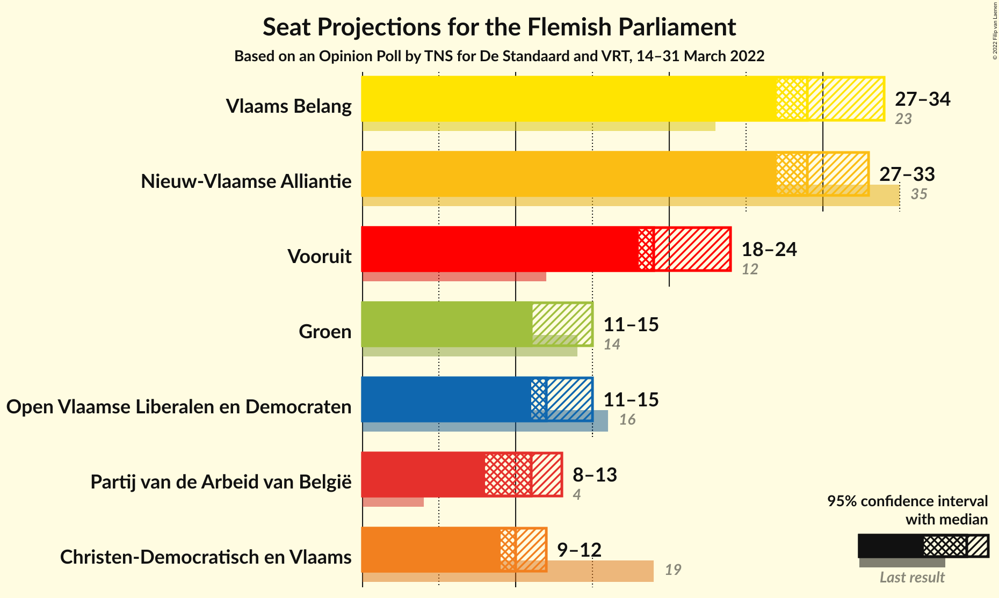

# Opinion Poll by TNS for De Standaard and VRT, 14–31 March 2022

<a href="#voting-intentions">Voting Intentions</a> | <a href="#seats">Seats</a> | <a href="#coalitions">Coalitions</a> | <a href="#technical-information">Technical Information</a>

## Voting Intentions

### Confidence Intervals

| Party | Last Result | Poll Result | 80% Confidence Interval | 90% Confidence Interval | 95% Confidence Interval | 99% Confidence Interval |
|:-----:|:-----------:|:-----------:|:-----------------------:|:-----------------------:|:-----------------------:|:-----------------------:|
| Vlaams Belang | 18.5% | 22.9% | 21.7–24.1% |21.4–24.5% |21.2–24.8% |20.6–25.4% |
| Nieuw-Vlaamse Alliantie | 24.8% | 22.4% | 21.2–23.6% |20.9–23.9% |20.6–24.2% |20.1–24.8% |
| Vooruit | 10.1% | 15.5% | 14.5–16.6% |14.2–16.9% |14.0–17.1% |13.5–17.7% |
| Open Vlaamse Liberalen en Democraten | 13.1% | 10.2% | 9.4–11.1% |9.2–11.4% |9.0–11.6% |8.6–12.1% |
| Groen | 10.1% | 9.4% | 8.6–10.3% |8.4–10.5% |8.2–10.7% |7.8–11.2% |
| Partij van de Arbeid van België | 5.3% | 9.1% | 8.3–10.0% |8.1–10.2% |7.9–10.4% |7.6–10.9% |
| Christen-Democratisch en Vlaams | 15.4% | 8.7% | 8.0–9.6% |7.8–9.8% |7.6–10.0% |7.2–10.4% |

*Note:* The poll result column reflects the actual value used in the calculations. Published results may vary slightly, and in addition be rounded to fewer digits.

## Seats

### Confidence Intervals

| Party | Last Result | Median | 80% Confidence Interval | 90% Confidence Interval | 95% Confidence Interval | 99% Confidence Interval |
|:-----:|:-----------:|:------:|:-----------------------:|:-----------------------:|:-----------------------:|:-----------------------:|
| <a href="#vlaams-belang">Vlaams Belang</a> | 23 | 29 | 27–33 |27–33 |27–34 |26–34 |
| <a href="#nieuw-vlaamse-alliantie">Nieuw-Vlaamse Alliantie</a> | 35 | 29 | 27–32 |27–33 |27–33 |27–33 |
| <a href="#vooruit">Vooruit</a> | 12 | 19 | 19–22 |18–23 |18–24 |18–25 |
| <a href="#open-vlaamse-liberalen-en-democraten">Open Vlaamse Liberalen en Democraten</a> | 16 | 12 | 11–14 |11–15 |11–15 |10–16 |
| <a href="#groen">Groen</a> | 14 | 11 | 11–14 |11–14 |11–15 |10–15 |
| <a href="#partij-van-de-arbeid-van-belgië">Partij van de Arbeid van België</a> | 4 | 11 | 8–13 |8–13 |8–13 |7–13 |
| <a href="#christen-democratisch-en-vlaams">Christen-Democratisch en Vlaams</a> | 19 | 10 | 9–11 |9–12 |9–12 |7–12 |

### Vlaams Belang

*For a full overview of the results for this party, see the [Vlaams Belang](party-vlaamsbelang.html) page.*

| Number of Seats | Probability | Accumulated | Special Marks |
|:---------------:|:-----------:|:-----------:|:-------------:|
| 23 | 0% | 100% | Last Result |
| 24 | 0% | 100% |  |
| 25 | 0.1% | 100% |  |
| 26 | 1.1% | 99.9% |  |
| 27 | 10% | 98.8% |  |
| 28 | 10% | 89% |  |
| 29 | 32% | 79% | Median |
| 30 | 16% | 47% |  |
| 31 | 11% | 31% |  |
| 32 | 7% | 20% |  |
| 33 | 10% | 13% |  |
| 34 | 3% | 3% |  |
| 35 | 0% | 0.1% |  |
| 36 | 0% | 0% |  |

### Nieuw-Vlaamse Alliantie

*For a full overview of the results for this party, see the [Nieuw-Vlaamse Alliantie](party-nieuw-vlaamsealliantie.html) page.*

| Number of Seats | Probability | Accumulated | Special Marks |
|:---------------:|:-----------:|:-----------:|:-------------:|
| 26 | 0% | 100% |  |
| 27 | 11% | 99.9% |  |
| 28 | 21% | 89% |  |
| 29 | 22% | 68% | Median |
| 30 | 20% | 46% |  |
| 31 | 10% | 26% |  |
| 32 | 9% | 16% |  |
| 33 | 7% | 7% |  |
| 34 | 0.2% | 0.2% |  |
| 35 | 0% | 0% | Last Result |

### Vooruit

*For a full overview of the results for this party, see the [Vooruit](party-vooruit.html) page.*

| Number of Seats | Probability | Accumulated | Special Marks |
|:---------------:|:-----------:|:-----------:|:-------------:|
| 12 | 0% | 100% | Last Result |
| 13 | 0% | 100% |  |
| 14 | 0% | 100% |  |
| 15 | 0% | 100% |  |
| 16 | 0.1% | 100% |  |
| 17 | 0.2% | 99.9% |  |
| 18 | 7% | 99.7% |  |
| 19 | 43% | 93% | Median |
| 20 | 15% | 50% |  |
| 21 | 21% | 35% |  |
| 22 | 8% | 14% |  |
| 23 | 4% | 6% |  |
| 24 | 2% | 3% |  |
| 25 | 0.5% | 0.5% |  |
| 26 | 0% | 0% |  |

### Open Vlaamse Liberalen en Democraten

*For a full overview of the results for this party, see the [Open Vlaamse Liberalen en Democraten](party-openvlaamseliberalenendemocraten.html) page.*

| Number of Seats | Probability | Accumulated | Special Marks |
|:---------------:|:-----------:|:-----------:|:-------------:|
| 9 | 0.1% | 100% |  |
| 10 | 0.7% | 99.9% |  |
| 11 | 28% | 99.2% |  |
| 12 | 41% | 72% | Median |
| 13 | 13% | 30% |  |
| 14 | 11% | 17% |  |
| 15 | 4% | 6% |  |
| 16 | 2% | 2% | Last Result |
| 17 | 0% | 0% |  |

### Groen

*For a full overview of the results for this party, see the [Groen](party-groen.html) page.*

| Number of Seats | Probability | Accumulated | Special Marks |
|:---------------:|:-----------:|:-----------:|:-------------:|
| 9 | 0.2% | 100% |  |
| 10 | 0.3% | 99.7% |  |
| 11 | 54% | 99.4% | Median |
| 12 | 18% | 46% |  |
| 13 | 10% | 27% |  |
| 14 | 13% | 17% | Last Result |
| 15 | 5% | 5% |  |
| 16 | 0.2% | 0.2% |  |
| 17 | 0% | 0% |  |

### Partij van de Arbeid van België

*For a full overview of the results for this party, see the [Partij van de Arbeid van België](party-partijvandearbeidvanbelgië.html) page.*

| Number of Seats | Probability | Accumulated | Special Marks |
|:---------------:|:-----------:|:-----------:|:-------------:|
| 4 | 0% | 100% | Last Result |
| 5 | 0% | 100% |  |
| 6 | 0% | 100% |  |
| 7 | 0.8% | 100% |  |
| 8 | 23% | 99.2% |  |
| 9 | 13% | 77% |  |
| 10 | 13% | 64% |  |
| 11 | 19% | 51% | Median |
| 12 | 11% | 32% |  |
| 13 | 21% | 21% |  |
| 14 | 0.3% | 0.4% |  |
| 15 | 0.1% | 0.1% |  |
| 16 | 0% | 0% |  |

### Christen-Democratisch en Vlaams

*For a full overview of the results for this party, see the [Christen-Democratisch en Vlaams](party-christen-democratischenvlaams.html) page.*

| Number of Seats | Probability | Accumulated | Special Marks |
|:---------------:|:-----------:|:-----------:|:-------------:|
| 5 | 0.1% | 100% |  |
| 6 | 0.4% | 99.9% |  |
| 7 | 0.9% | 99.5% |  |
| 8 | 0.8% | 98.6% |  |
| 9 | 18% | 98% |  |
| 10 | 60% | 80% | Median |
| 11 | 13% | 20% |  |
| 12 | 7% | 7% |  |
| 13 | 0% | 0.1% |  |
| 14 | 0% | 0% |  |
| 15 | 0% | 0% |  |
| 16 | 0% | 0% |  |
| 17 | 0% | 0% |  |
| 18 | 0% | 0% |  |
| 19 | 0% | 0% | Last Result |

## Coalitions

### Confidence Intervals

| Coalition | Last Result | Median | Majority? | 80% Confidence Interval | 90% Confidence Interval | 95% Confidence Interval | 99% Confidence Interval |
|:---------:|:-----------:|:------:|:---------:|:-----------------------:|:-----------------------:|:-----------------------:|:-----------------------:|
| Nieuw-Vlaamse Alliantie – Vooruit – Open Vlaamse Liberalen en Democraten – Christen-Democratisch en Vlaams | 82 | 72 | 100% | 69–75 | 68–75 | 68–76 | 67–77 |
| Vlaams Belang – Nieuw-Vlaamse Alliantie – Christen-Democratisch en Vlaams | 77 | 69 | 100% | 66–73 | 66–73 | 65–74 | 64–75 |
| Nieuw-Vlaamse Alliantie – Vooruit – Open Vlaamse Liberalen en Democraten | 63 | 62 | 35% | 59–65 | 58–65 | 58–66 | 57–67 |
| Vlaams Belang – Nieuw-Vlaamse Alliantie | 58 | 59 | 11% | 56–63 | 56–63 | 55–64 | 54–64 |
| Nieuw-Vlaamse Alliantie – Vooruit – Christen-Democratisch en Vlaams | 66 | 60 | 6% | 57–62 | 56–63 | 56–63 | 55–65 |
| Vooruit – Open Vlaamse Liberalen en Democraten – Groen – Christen-Democratisch en Vlaams | 61 | 54 | 0% | 52–57 | 51–58 | 51–59 | 50–60 |
| Vooruit – Groen – Partij van de Arbeid van België – Christen-Democratisch en Vlaams | 49 | 52 | 0% | 49–55 | 49–56 | 48–57 | 47–57 |
| Nieuw-Vlaamse Alliantie – Open Vlaamse Liberalen en Democraten – Christen-Democratisch en Vlaams | 70 | 52 | 0% | 49–54 | 49–55 | 48–56 | 47–57 |
| Vooruit – Open Vlaamse Liberalen en Democraten – Groen | 42 | 44 | 0% | 42–47 | 41–48 | 41–48 | 40–50 |
| Vooruit – Groen – Christen-Democratisch en Vlaams | 45 | 42 | 0% | 40–45 | 39–45 | 39–46 | 38–48 |
| Vooruit – Open Vlaamse Liberalen en Democraten – Christen-Democratisch en Vlaams | 47 | 42 | 0% | 40–45 | 39–46 | 39–46 | 38–47 |
| Nieuw-Vlaamse Alliantie – Open Vlaamse Liberalen en Democraten | 51 | 41 | 0% | 40–44 | 39–45 | 38–46 | 38–47 |
| Nieuw-Vlaamse Alliantie – Christen-Democratisch en Vlaams | 54 | 40 | 0% | 37–42 | 37–43 | 36–43 | 36–44 |
| Open Vlaamse Liberalen en Democraten – Groen – Christen-Democratisch en Vlaams | 49 | 34 | 0% | 32–37 | 32–37 | 31–38 | 30–40 |
| Vooruit – Open Vlaamse Liberalen en Democraten | 28 | 32 | 0% | 30–35 | 30–35 | 29–36 | 29–37 |
| Vooruit – Christen-Democratisch en Vlaams | 31 | 30 | 0% | 28–32 | 28–33 | 27–34 | 26–35 |
| Open Vlaamse Liberalen en Democraten – Christen-Democratisch en Vlaams | 35 | 22 | 0% | 21–24 | 20–25 | 20–26 | 18–27 |

### Nieuw-Vlaamse Alliantie – Vooruit – Open Vlaamse Liberalen en Democraten – Christen-Democratisch en Vlaams

| Number of Seats | Probability | Accumulated | Special Marks |
|:---------------:|:-----------:|:-----------:|:-------------:|
| 66 | 0.4% | 100% |  |
| 67 | 2% | 99.6% |  |
| 68 | 4% | 98% |  |
| 69 | 7% | 94% |  |
| 70 | 12% | 87% | Median |
| 71 | 20% | 75% |  |
| 72 | 19% | 55% |  |
| 73 | 14% | 36% |  |
| 74 | 11% | 22% |  |
| 75 | 7% | 11% |  |
| 76 | 3% | 4% |  |
| 77 | 0.7% | 0.9% |  |
| 78 | 0.2% | 0.2% |  |
| 79 | 0% | 0% |  |
| 80 | 0% | 0% |  |
| 81 | 0% | 0% |  |
| 82 | 0% | 0% | Last Result |

### Vlaams Belang – Nieuw-Vlaamse Alliantie – Christen-Democratisch en Vlaams

| Number of Seats | Probability | Accumulated | Special Marks |
|:---------------:|:-----------:|:-----------:|:-------------:|
| 63 | 0.3% | 100% | Majority |
| 64 | 0.9% | 99.7% |  |
| 65 | 3% | 98.8% |  |
| 66 | 7% | 96% |  |
| 67 | 12% | 89% |  |
| 68 | 13% | 77% | Median |
| 69 | 17% | 63% |  |
| 70 | 15% | 47% |  |
| 71 | 12% | 31% |  |
| 72 | 8% | 19% |  |
| 73 | 7% | 10% |  |
| 74 | 3% | 4% |  |
| 75 | 0.8% | 0.8% |  |
| 76 | 0% | 0% |  |
| 77 | 0% | 0% | Last Result |

### Nieuw-Vlaamse Alliantie – Vooruit – Open Vlaamse Liberalen en Democraten

| Number of Seats | Probability | Accumulated | Special Marks |
|:---------------:|:-----------:|:-----------:|:-------------:|
| 56 | 0.1% | 100% |  |
| 57 | 2% | 99.9% |  |
| 58 | 3% | 98% |  |
| 59 | 8% | 94% |  |
| 60 | 13% | 86% | Median |
| 61 | 19% | 73% |  |
| 62 | 20% | 54% |  |
| 63 | 13% | 35% | Last Result, Majority |
| 64 | 11% | 22% |  |
| 65 | 6% | 11% |  |
| 66 | 4% | 5% |  |
| 67 | 0.5% | 0.8% |  |
| 68 | 0.2% | 0.3% |  |
| 69 | 0% | 0.1% |  |
| 70 | 0% | 0% |  |

### Vlaams Belang – Nieuw-Vlaamse Alliantie

| Number of Seats | Probability | Accumulated | Special Marks |
|:---------------:|:-----------:|:-----------:|:-------------:|
| 54 | 0.6% | 100% |  |
| 55 | 3% | 99.4% |  |
| 56 | 7% | 96% |  |
| 57 | 14% | 89% |  |
| 58 | 14% | 76% | Last Result, Median |
| 59 | 16% | 62% |  |
| 60 | 15% | 46% |  |
| 61 | 13% | 31% |  |
| 62 | 8% | 18% |  |
| 63 | 7% | 11% | Majority |
| 64 | 3% | 4% |  |
| 65 | 0.4% | 0.5% |  |
| 66 | 0.1% | 0.1% |  |
| 67 | 0% | 0% |  |

### Nieuw-Vlaamse Alliantie – Vooruit – Christen-Democratisch en Vlaams

| Number of Seats | Probability | Accumulated | Special Marks |
|:---------------:|:-----------:|:-----------:|:-------------:|
| 53 | 0% | 100% |  |
| 54 | 0.2% | 99.9% |  |
| 55 | 1.5% | 99.7% |  |
| 56 | 6% | 98% |  |
| 57 | 8% | 92% |  |
| 58 | 13% | 84% | Median |
| 59 | 18% | 71% |  |
| 60 | 17% | 52% |  |
| 61 | 19% | 35% |  |
| 62 | 10% | 16% |  |
| 63 | 4% | 6% | Majority |
| 64 | 1.3% | 2% |  |
| 65 | 0.6% | 0.6% |  |
| 66 | 0.1% | 0.1% | Last Result |
| 67 | 0% | 0% |  |

### Vooruit – Open Vlaamse Liberalen en Democraten – Groen – Christen-Democratisch en Vlaams

| Number of Seats | Probability | Accumulated | Special Marks |
|:---------------:|:-----------:|:-----------:|:-------------:|
| 48 | 0.1% | 100% |  |
| 49 | 0.3% | 99.9% |  |
| 50 | 2% | 99.6% |  |
| 51 | 6% | 98% |  |
| 52 | 15% | 92% | Median |
| 53 | 16% | 77% |  |
| 54 | 17% | 61% |  |
| 55 | 15% | 44% |  |
| 56 | 14% | 29% |  |
| 57 | 8% | 14% |  |
| 58 | 4% | 7% |  |
| 59 | 2% | 3% |  |
| 60 | 0.6% | 0.8% |  |
| 61 | 0.1% | 0.1% | Last Result |
| 62 | 0% | 0% |  |

### Vooruit – Groen – Partij van de Arbeid van België – Christen-Democratisch en Vlaams

| Number of Seats | Probability | Accumulated | Special Marks |
|:---------------:|:-----------:|:-----------:|:-------------:|
| 45 | 0% | 100% |  |
| 46 | 0.2% | 99.9% |  |
| 47 | 0.9% | 99.8% |  |
| 48 | 4% | 98.9% |  |
| 49 | 6% | 95% | Last Result |
| 50 | 12% | 89% |  |
| 51 | 17% | 78% | Median |
| 52 | 13% | 61% |  |
| 53 | 9% | 48% |  |
| 54 | 16% | 39% |  |
| 55 | 15% | 23% |  |
| 56 | 5% | 8% |  |
| 57 | 2% | 3% |  |
| 58 | 0.4% | 0.4% |  |
| 59 | 0.1% | 0.1% |  |
| 60 | 0% | 0% |  |

### Nieuw-Vlaamse Alliantie – Open Vlaamse Liberalen en Democraten – Christen-Democratisch en Vlaams

| Number of Seats | Probability | Accumulated | Special Marks |
|:---------------:|:-----------:|:-----------:|:-------------:|
| 46 | 0.1% | 100% |  |
| 47 | 0.7% | 99.9% |  |
| 48 | 3% | 99.2% |  |
| 49 | 8% | 97% |  |
| 50 | 16% | 89% |  |
| 51 | 20% | 73% | Median |
| 52 | 17% | 54% |  |
| 53 | 17% | 37% |  |
| 54 | 11% | 20% |  |
| 55 | 6% | 9% |  |
| 56 | 2% | 3% |  |
| 57 | 0.5% | 0.8% |  |
| 58 | 0.3% | 0.3% |  |
| 59 | 0% | 0% |  |
| 60 | 0% | 0% |  |
| 61 | 0% | 0% |  |
| 62 | 0% | 0% |  |
| 63 | 0% | 0% | Majority |
| 64 | 0% | 0% |  |
| 65 | 0% | 0% |  |
| 66 | 0% | 0% |  |
| 67 | 0% | 0% |  |
| 68 | 0% | 0% |  |
| 69 | 0% | 0% |  |
| 70 | 0% | 0% | Last Result |

### Vooruit – Open Vlaamse Liberalen en Democraten – Groen

| Number of Seats | Probability | Accumulated | Special Marks |
|:---------------:|:-----------:|:-----------:|:-------------:|
| 39 | 0.1% | 100% |  |
| 40 | 0.9% | 99.9% |  |
| 41 | 7% | 99.0% |  |
| 42 | 17% | 92% | Last Result, Median |
| 43 | 16% | 75% |  |
| 44 | 17% | 60% |  |
| 45 | 15% | 43% |  |
| 46 | 15% | 28% |  |
| 47 | 7% | 13% |  |
| 48 | 4% | 7% |  |
| 49 | 2% | 2% |  |
| 50 | 0.6% | 0.7% |  |
| 51 | 0.1% | 0.1% |  |
| 52 | 0% | 0% |  |

### Vooruit – Groen – Christen-Democratisch en Vlaams

| Number of Seats | Probability | Accumulated | Special Marks |
|:---------------:|:-----------:|:-----------:|:-------------:|
| 36 | 0.1% | 100% |  |
| 37 | 0.2% | 99.9% |  |
| 38 | 2% | 99.7% |  |
| 39 | 6% | 98% |  |
| 40 | 19% | 92% | Median |
| 41 | 17% | 73% |  |
| 42 | 19% | 56% |  |
| 43 | 14% | 38% |  |
| 44 | 12% | 24% |  |
| 45 | 7% | 11% | Last Result |
| 46 | 3% | 4% |  |
| 47 | 1.2% | 2% |  |
| 48 | 0.5% | 0.5% |  |
| 49 | 0.1% | 0.1% |  |
| 50 | 0% | 0% |  |

### Vooruit – Open Vlaamse Liberalen en Democraten – Christen-Democratisch en Vlaams

| Number of Seats | Probability | Accumulated | Special Marks |
|:---------------:|:-----------:|:-----------:|:-------------:|
| 36 | 0.1% | 100% |  |
| 37 | 0.2% | 99.9% |  |
| 38 | 0.6% | 99.7% |  |
| 39 | 4% | 99.1% |  |
| 40 | 11% | 95% |  |
| 41 | 23% | 84% | Median |
| 42 | 21% | 62% |  |
| 43 | 14% | 41% |  |
| 44 | 12% | 27% |  |
| 45 | 9% | 15% |  |
| 46 | 4% | 6% |  |
| 47 | 1.2% | 2% | Last Result |
| 48 | 0.4% | 0.5% |  |
| 49 | 0.1% | 0.1% |  |
| 50 | 0% | 0% |  |

### Nieuw-Vlaamse Alliantie – Open Vlaamse Liberalen en Democraten

| Number of Seats | Probability | Accumulated | Special Marks |
|:---------------:|:-----------:|:-----------:|:-------------:|
| 37 | 0.1% | 100% |  |
| 38 | 2% | 99.9% |  |
| 39 | 7% | 97% |  |
| 40 | 18% | 90% |  |
| 41 | 23% | 73% | Median |
| 42 | 13% | 49% |  |
| 43 | 15% | 36% |  |
| 44 | 11% | 21% |  |
| 45 | 7% | 9% |  |
| 46 | 2% | 3% |  |
| 47 | 0.7% | 0.8% |  |
| 48 | 0.1% | 0.1% |  |
| 49 | 0% | 0% |  |
| 50 | 0% | 0% |  |
| 51 | 0% | 0% | Last Result |

### Nieuw-Vlaamse Alliantie – Christen-Democratisch en Vlaams

| Number of Seats | Probability | Accumulated | Special Marks |
|:---------------:|:-----------:|:-----------:|:-------------:|
| 34 | 0.1% | 100% |  |
| 35 | 0.3% | 99.9% |  |
| 36 | 3% | 99.6% |  |
| 37 | 11% | 97% |  |
| 38 | 17% | 86% |  |
| 39 | 16% | 69% | Median |
| 40 | 24% | 52% |  |
| 41 | 13% | 28% |  |
| 42 | 9% | 15% |  |
| 43 | 5% | 6% |  |
| 44 | 1.5% | 2% |  |
| 45 | 0.2% | 0.2% |  |
| 46 | 0% | 0% |  |
| 47 | 0% | 0% |  |
| 48 | 0% | 0% |  |
| 49 | 0% | 0% |  |
| 50 | 0% | 0% |  |
| 51 | 0% | 0% |  |
| 52 | 0% | 0% |  |
| 53 | 0% | 0% |  |
| 54 | 0% | 0% | Last Result |

### Open Vlaamse Liberalen en Democraten – Groen – Christen-Democratisch en Vlaams

| Number of Seats | Probability | Accumulated | Special Marks |
|:---------------:|:-----------:|:-----------:|:-------------:|
| 28 | 0% | 100% |  |
| 29 | 0.1% | 99.9% |  |
| 30 | 0.4% | 99.8% |  |
| 31 | 3% | 99.4% |  |
| 32 | 10% | 96% |  |
| 33 | 25% | 86% | Median |
| 34 | 20% | 61% |  |
| 35 | 19% | 42% |  |
| 36 | 12% | 22% |  |
| 37 | 7% | 11% |  |
| 38 | 3% | 4% |  |
| 39 | 0.5% | 1.1% |  |
| 40 | 0.4% | 0.6% |  |
| 41 | 0.1% | 0.1% |  |
| 42 | 0% | 0% |  |
| 43 | 0% | 0% |  |
| 44 | 0% | 0% |  |
| 45 | 0% | 0% |  |
| 46 | 0% | 0% |  |
| 47 | 0% | 0% |  |
| 48 | 0% | 0% |  |
| 49 | 0% | 0% | Last Result |

### Vooruit – Open Vlaamse Liberalen en Democraten

| Number of Seats | Probability | Accumulated | Special Marks |
|:---------------:|:-----------:|:-----------:|:-------------:|
| 28 | 0.2% | 100% | Last Result |
| 29 | 2% | 99.8% |  |
| 30 | 14% | 97% |  |
| 31 | 24% | 83% | Median |
| 32 | 19% | 59% |  |
| 33 | 14% | 40% |  |
| 34 | 12% | 26% |  |
| 35 | 9% | 14% |  |
| 36 | 4% | 5% |  |
| 37 | 0.9% | 1.3% |  |
| 38 | 0.3% | 0.4% |  |
| 39 | 0.1% | 0.1% |  |
| 40 | 0% | 0% |  |

### Vooruit – Christen-Democratisch en Vlaams

| Number of Seats | Probability | Accumulated | Special Marks |
|:---------------:|:-----------:|:-----------:|:-------------:|
| 25 | 0.1% | 100% |  |
| 26 | 0.5% | 99.8% |  |
| 27 | 2% | 99.3% |  |
| 28 | 10% | 97% |  |
| 29 | 30% | 87% | Median |
| 30 | 21% | 57% |  |
| 31 | 19% | 36% | Last Result |
| 32 | 10% | 17% |  |
| 33 | 3% | 7% |  |
| 34 | 3% | 4% |  |
| 35 | 0.5% | 0.7% |  |
| 36 | 0.2% | 0.2% |  |
| 37 | 0% | 0% |  |

### Open Vlaamse Liberalen en Democraten – Christen-Democratisch en Vlaams

| Number of Seats | Probability | Accumulated | Special Marks |
|:---------------:|:-----------:|:-----------:|:-------------:|
| 17 | 0.1% | 100% |  |
| 18 | 0.4% | 99.9% |  |
| 19 | 0.7% | 99.5% |  |
| 20 | 5% | 98.8% |  |
| 21 | 22% | 94% |  |
| 22 | 35% | 71% | Median |
| 23 | 17% | 36% |  |
| 24 | 12% | 19% |  |
| 25 | 5% | 7% |  |
| 26 | 2% | 3% |  |
| 27 | 0.6% | 0.6% |  |
| 28 | 0% | 0% |  |
| 29 | 0% | 0% |  |
| 30 | 0% | 0% |  |
| 31 | 0% | 0% |  |
| 32 | 0% | 0% |  |
| 33 | 0% | 0% |  |
| 34 | 0% | 0% |  |
| 35 | 0% | 0% | Last Result |

## Technical Information

### Opinion Poll

+ **Polling firm:** TNS
+ **Commissioner(s):** De Standaard and VRT
+ **Fieldwork period:** 14–31 March 2022

### Calculations

+ **Sample size:** 2064
+ **Simulations done:** 1,048,576
+ **Error estimate:** 1.13%

