# Opinion Poll by Ipsos for Het Laatste Nieuws, Le Soir, RTL TVi and VTM, 6–14 June 2022

<a href="#voting-intentions">Voting Intentions</a> | <a href="#seats">Seats</a> | <a href="#coalitions">Coalitions</a> | <a href="#technical-information">Technical Information</a>

## Voting Intentions

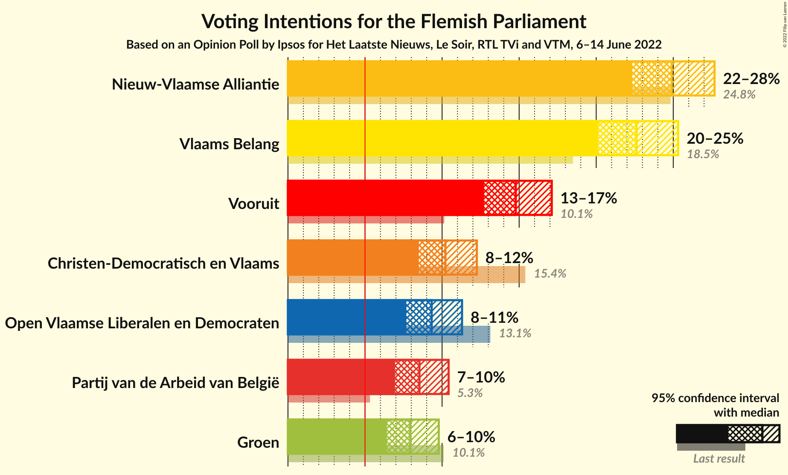

### Confidence Intervals

| Party | Last Result | Poll Result | 80% Confidence Interval | 90% Confidence Interval | 95% Confidence Interval | 99% Confidence Interval |
|:-----:|:-----------:|:-----------:|:-----------------------:|:-----------------------:|:-----------------------:|:-----------------------:|
| Nieuw-Vlaamse Alliantie | 24.8% | 24.9% | 23.2–26.7% |22.7–27.2% |22.3–27.7% |21.5–28.5% |
| Vlaams Belang | 18.5% | 22.6% | 21.0–24.4% |20.5–24.9% |20.1–25.3% |19.4–26.2% |
| Vooruit | 10.1% | 14.8% | 13.4–16.3% |13.0–16.7% |12.7–17.1% |12.1–17.9% |
| Christen-Democratisch en Vlaams | 15.4% | 10.2% | 9.1–11.5% |8.8–11.9% |8.5–12.3% |8.0–12.9% |
| Open Vlaamse Liberalen en Democraten | 13.1% | 9.3% | 8.2–10.6% |7.9–11.0% |7.7–11.3% |7.2–11.9% |
| Partij van de Arbeid van België | 5.3% | 8.5% | 7.5–9.8% |7.2–10.1% |7.0–10.4% |6.5–11.1% |
| Groen | 10.1% | 7.9% | 6.9–9.1% |6.7–9.5% |6.4–9.8% |6.0–10.4% |

*Note:* The poll result column reflects the actual value used in the calculations. Published results may vary slightly, and in addition be rounded to fewer digits.

## Seats

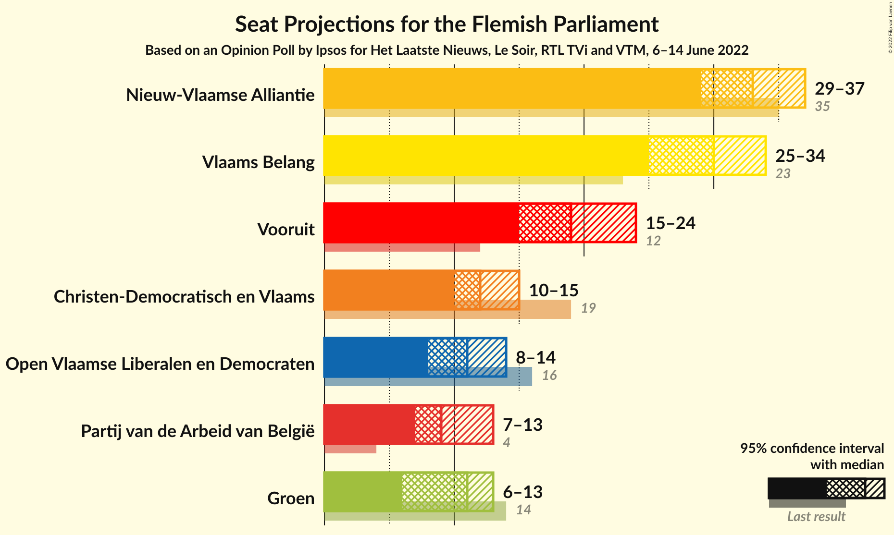

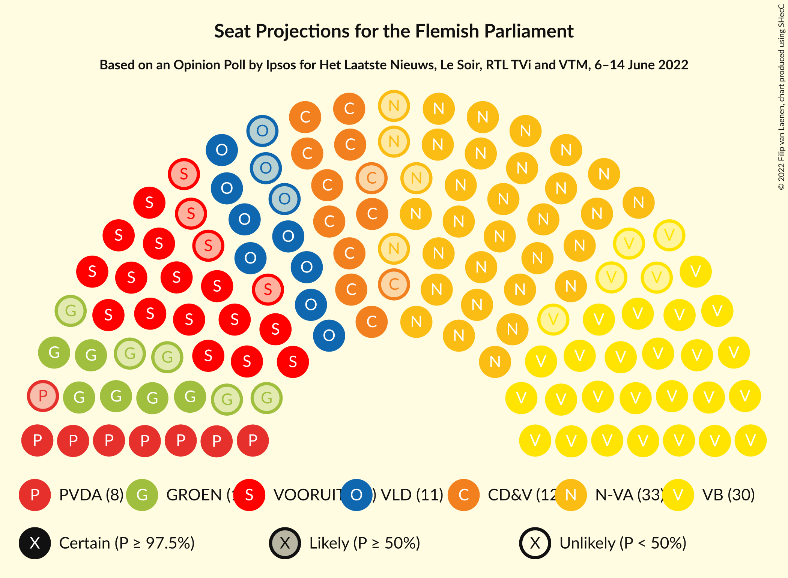

### Confidence Intervals

| Party | Last Result | Median | 80% Confidence Interval | 90% Confidence Interval | 95% Confidence Interval | 99% Confidence Interval |
|:-----:|:-----------:|:------:|:-----------------------:|:-----------------------:|:-----------------------:|:-----------------------:|
| <a href="#nieuw-vlaamse-alliantie">Nieuw-Vlaamse Alliantie</a> | 35 | 33 | 30–36 |30–37 |29–37 |28–39 |
| <a href="#vlaams-belang">Vlaams Belang</a> | 23 | 30 | 26–32 |26–33 |25–34 |24–34 |
| <a href="#vooruit">Vooruit</a> | 12 | 19 | 17–22 |16–23 |15–24 |15–25 |
| <a href="#christen-democratisch-en-vlaams">Christen-Democratisch en Vlaams</a> | 19 | 12 | 10–14 |10–14 |10–15 |9–16 |
| <a href="#open-vlaamse-liberalen-en-democraten">Open Vlaamse Liberalen en Democraten</a> | 16 | 11 | 10–13 |8–14 |8–14 |8–15 |
| <a href="#partij-van-de-arbeid-van-belgië">Partij van de Arbeid van België</a> | 4 | 9 | 7–12 |7–13 |7–13 |6–14 |
| <a href="#groen">Groen</a> | 14 | 11 | 7–11 |7–12 |6–13 |5–14 |

### Nieuw-Vlaamse Alliantie

*For a full overview of the results for this party, see the [Nieuw-Vlaamse Alliantie](party-nieuw-vlaamsealliantie.html) page.*

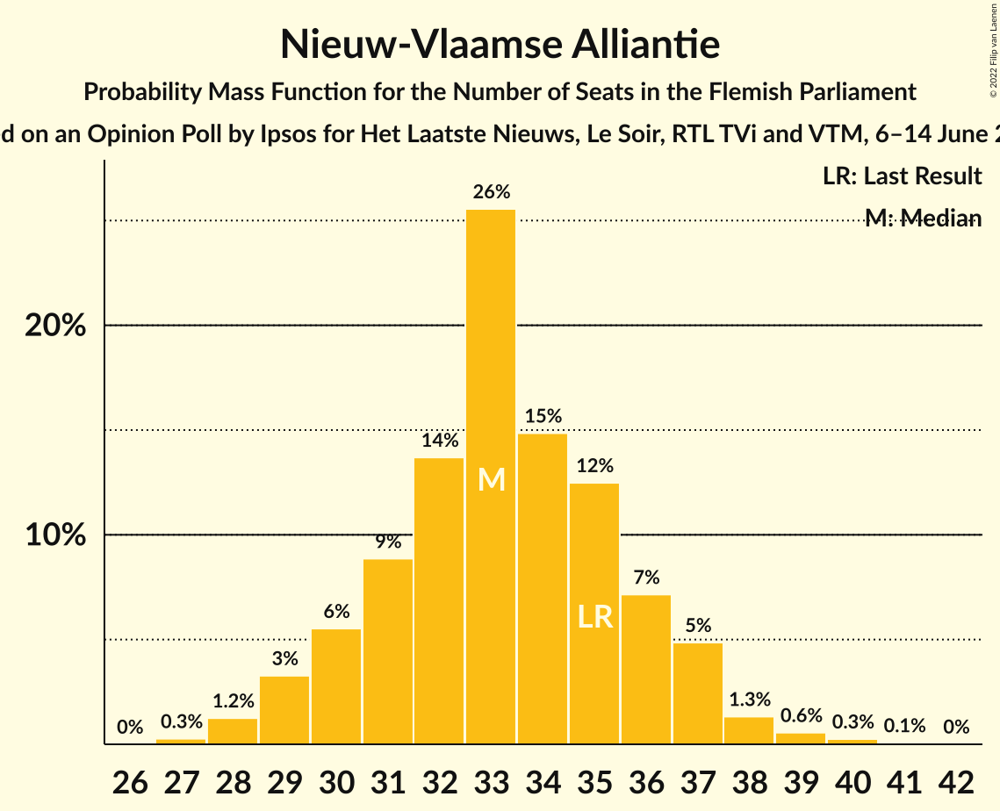

| Number of Seats | Probability | Accumulated | Special Marks |
|:---------------:|:-----------:|:-----------:|:-------------:|
| 27 | 0.3% | 100% |  |
| 28 | 1.2% | 99.7% |  |
| 29 | 3% | 98% |  |
| 30 | 6% | 95% |  |
| 31 | 9% | 90% |  |
| 32 | 14% | 81% |  |
| 33 | 26% | 67% | Median |
| 34 | 15% | 42% |  |
| 35 | 12% | 27% | Last Result |
| 36 | 7% | 14% |  |
| 37 | 5% | 7% |  |
| 38 | 1.3% | 2% |  |
| 39 | 0.6% | 0.9% |  |
| 40 | 0.3% | 0.3% |  |
| 41 | 0.1% | 0.1% |  |
| 42 | 0% | 0% |  |

### Vlaams Belang

*For a full overview of the results for this party, see the [Vlaams Belang](party-vlaamsbelang.html) page.*

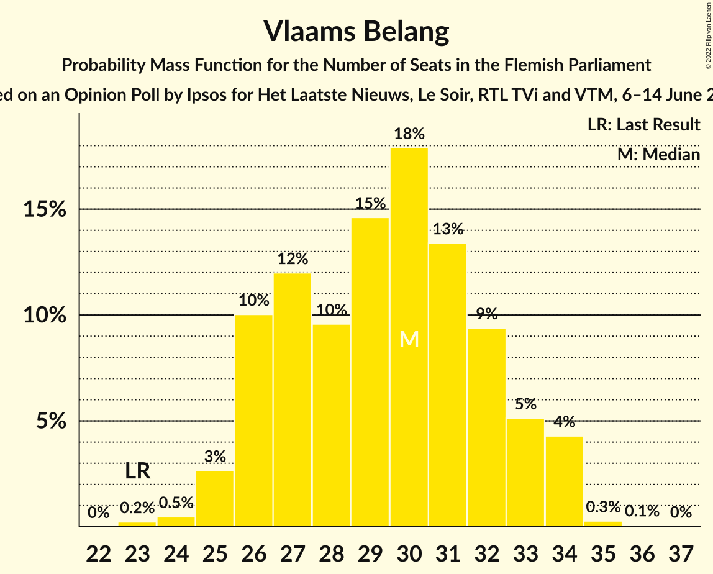

| Number of Seats | Probability | Accumulated | Special Marks |
|:---------------:|:-----------:|:-----------:|:-------------:|
| 23 | 0.2% | 100% | Last Result |
| 24 | 0.5% | 99.8% |  |
| 25 | 3% | 99.3% |  |
| 26 | 10% | 97% |  |
| 27 | 12% | 87% |  |
| 28 | 10% | 75% |  |
| 29 | 15% | 65% |  |
| 30 | 18% | 50% | Median |
| 31 | 13% | 33% |  |
| 32 | 9% | 19% |  |
| 33 | 5% | 10% |  |
| 34 | 4% | 5% |  |
| 35 | 0.3% | 0.4% |  |
| 36 | 0.1% | 0.1% |  |
| 37 | 0% | 0% |  |

### Vooruit

*For a full overview of the results for this party, see the [Vooruit](party-vooruit.html) page.*

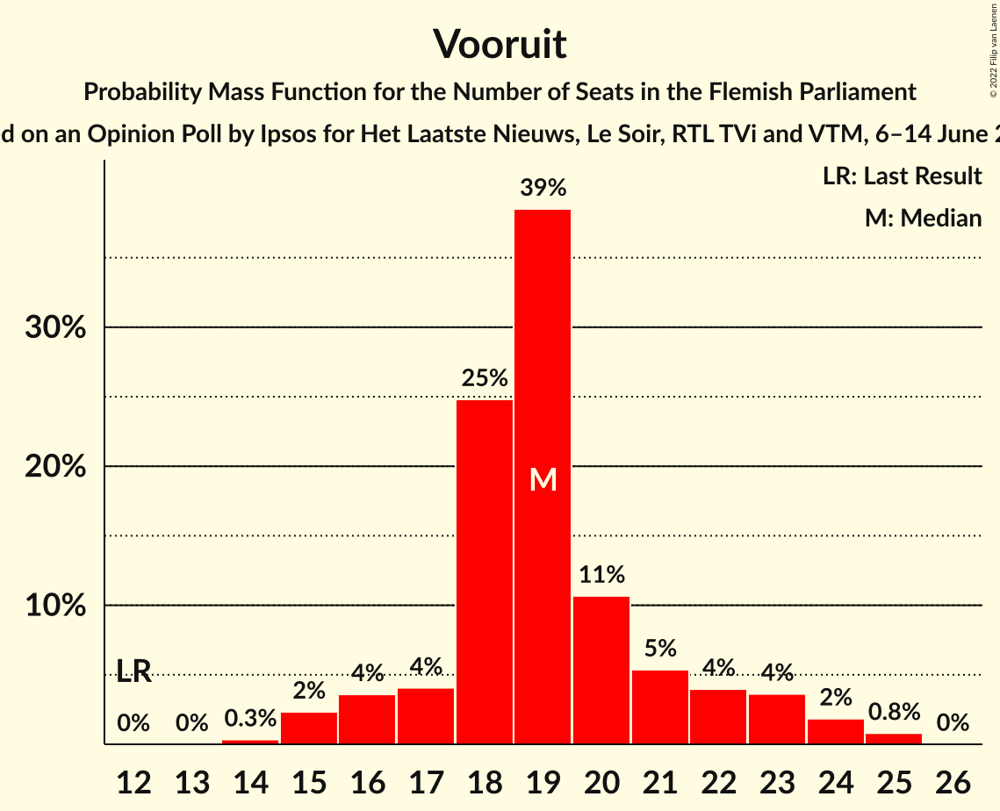

| Number of Seats | Probability | Accumulated | Special Marks |
|:---------------:|:-----------:|:-----------:|:-------------:|
| 12 | 0% | 100% | Last Result |
| 13 | 0% | 100% |  |
| 14 | 0.3% | 100% |  |
| 15 | 2% | 99.6% |  |
| 16 | 4% | 97% |  |
| 17 | 4% | 94% |  |
| 18 | 25% | 90% |  |
| 19 | 39% | 65% | Median |
| 20 | 11% | 26% |  |
| 21 | 5% | 16% |  |
| 22 | 4% | 10% |  |
| 23 | 4% | 6% |  |
| 24 | 2% | 3% |  |
| 25 | 0.8% | 0.8% |  |
| 26 | 0% | 0% |  |

### Christen-Democratisch en Vlaams

*For a full overview of the results for this party, see the [Christen-Democratisch en Vlaams](party-christen-democratischenvlaams.html) page.*

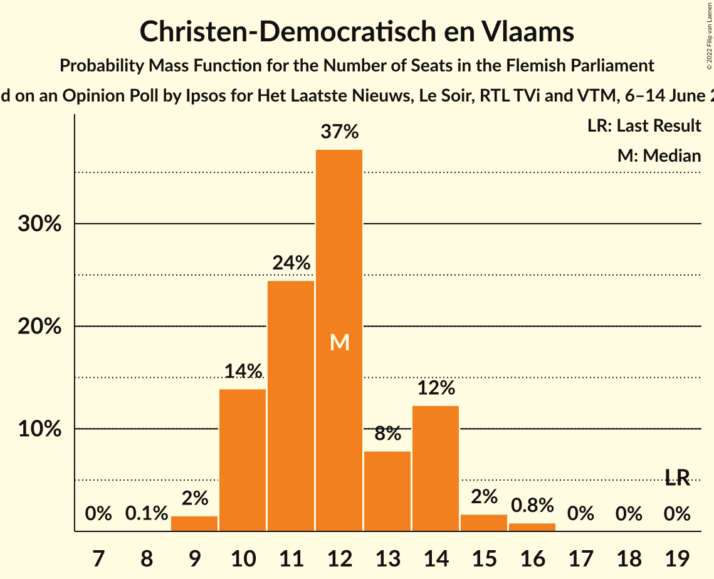

| Number of Seats | Probability | Accumulated | Special Marks |
|:---------------:|:-----------:|:-----------:|:-------------:|
| 7 | 0% | 100% |  |
| 8 | 0.1% | 99.9% |  |
| 9 | 2% | 99.9% |  |
| 10 | 14% | 98% |  |
| 11 | 24% | 84% |  |
| 12 | 37% | 60% | Median |
| 13 | 8% | 23% |  |
| 14 | 12% | 15% |  |
| 15 | 2% | 3% |  |
| 16 | 0.8% | 0.9% |  |
| 17 | 0% | 0% |  |
| 18 | 0% | 0% |  |
| 19 | 0% | 0% | Last Result |

### Open Vlaamse Liberalen en Democraten

*For a full overview of the results for this party, see the [Open Vlaamse Liberalen en Democraten](party-openvlaamseliberalenendemocraten.html) page.*

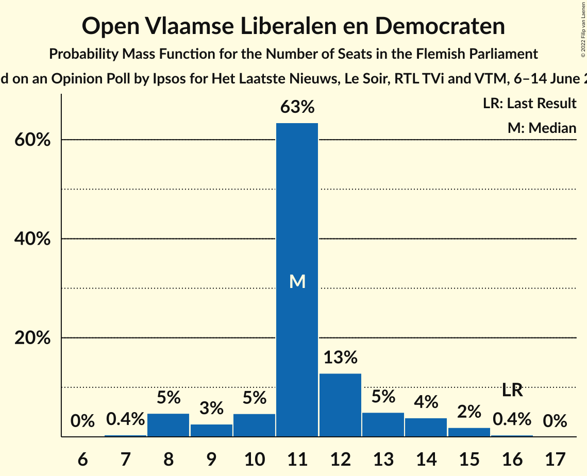

| Number of Seats | Probability | Accumulated | Special Marks |
|:---------------:|:-----------:|:-----------:|:-------------:|
| 6 | 0% | 100% |  |
| 7 | 0.4% | 99.9% |  |
| 8 | 5% | 99.5% |  |
| 9 | 3% | 95% |  |
| 10 | 5% | 92% |  |
| 11 | 63% | 87% | Median |
| 12 | 13% | 24% |  |
| 13 | 5% | 11% |  |
| 14 | 4% | 6% |  |
| 15 | 2% | 2% |  |
| 16 | 0.4% | 0.4% | Last Result |
| 17 | 0% | 0% |  |

### Partij van de Arbeid van België

*For a full overview of the results for this party, see the [Partij van de Arbeid van België](party-partijvandearbeidvanbelgië.html) page.*

| Number of Seats | Probability | Accumulated | Special Marks |
|:---------------:|:-----------:|:-----------:|:-------------:|
| 4 | 0% | 100% | Last Result |
| 5 | 0.2% | 100% |  |
| 6 | 0.3% | 99.8% |  |
| 7 | 15% | 99.4% |  |
| 8 | 32% | 84% |  |
| 9 | 13% | 53% | Median |
| 10 | 14% | 40% |  |
| 11 | 8% | 26% |  |
| 12 | 7% | 17% |  |
| 13 | 9% | 10% |  |
| 14 | 0.5% | 0.6% |  |
| 15 | 0.1% | 0.1% |  |
| 16 | 0% | 0% |  |

### Groen

*For a full overview of the results for this party, see the [Groen](party-groen.html) page.*

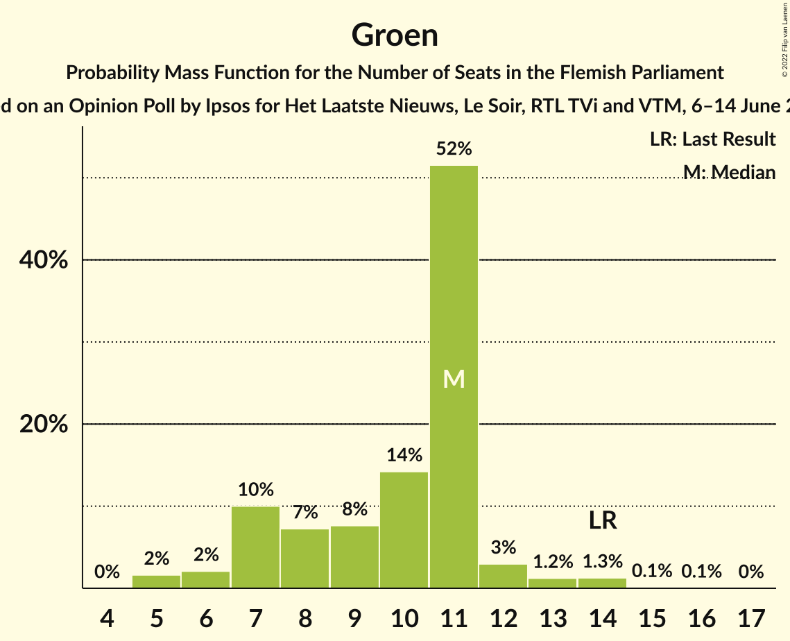

| Number of Seats | Probability | Accumulated | Special Marks |
|:---------------:|:-----------:|:-----------:|:-------------:|
| 5 | 2% | 100% |  |
| 6 | 2% | 98% |  |
| 7 | 10% | 96% |  |
| 8 | 7% | 86% |  |
| 9 | 8% | 79% |  |
| 10 | 14% | 71% |  |
| 11 | 52% | 57% | Median |
| 12 | 3% | 6% |  |
| 13 | 1.2% | 3% |  |
| 14 | 1.3% | 1.4% | Last Result |
| 15 | 0.1% | 0.2% |  |
| 16 | 0.1% | 0.1% |  |
| 17 | 0% | 0% |  |

## Coalitions

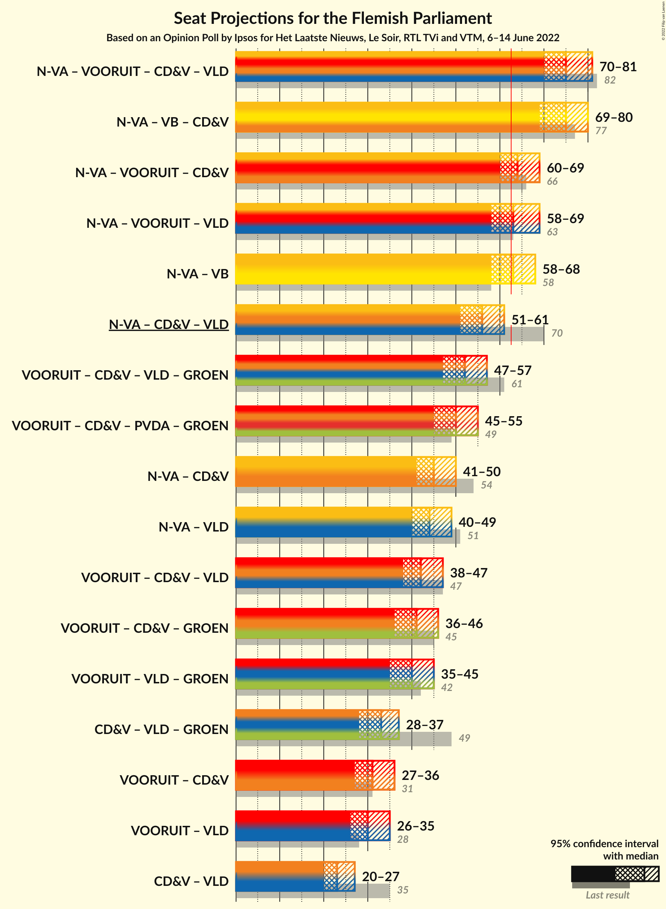

### Confidence Intervals

| Coalition | Last Result | Median | Majority? | 80% Confidence Interval | 90% Confidence Interval | 95% Confidence Interval | 99% Confidence Interval |
|:---------:|:-----------:|:------:|:---------:|:-----------------------:|:-----------------------:|:-----------------------:|:-----------------------:|
| Nieuw-Vlaamse Alliantie – Vooruit – Christen-Democratisch en Vlaams – Open Vlaamse Liberalen en Democraten | 82 | 75 | 100% | 72–79 | 71–80 | 70–81 | 69–82 |
| Nieuw-Vlaamse Alliantie – Vlaams Belang – Christen-Democratisch en Vlaams | 77 | 75 | 100% | 71–78 | 70–79 | 69–80 | 68–81 |
| Nieuw-Vlaamse Alliantie – Vooruit – Christen-Democratisch en Vlaams | 66 | 64 | 76% | 61–68 | 60–68 | 60–69 | 58–71 |
| Nieuw-Vlaamse Alliantie – Vooruit – Open Vlaamse Liberalen en Democraten | 63 | 63 | 64% | 60–67 | 59–68 | 58–69 | 57–70 |
| Nieuw-Vlaamse Alliantie – Vlaams Belang | 58 | 63 | 55% | 59–66 | 58–67 | 58–68 | 56–69 |
| Nieuw-Vlaamse Alliantie – Christen-Democratisch en Vlaams – Open Vlaamse Liberalen en Democraten | 70 | 56 | 0.7% | 53–59 | 52–60 | 51–61 | 50–63 |
| Vooruit – Christen-Democratisch en Vlaams – Open Vlaamse Liberalen en Democraten – Groen | 61 | 52 | 0% | 49–55 | 48–56 | 47–57 | 45–59 |
| Vooruit – Christen-Democratisch en Vlaams – Partij van de Arbeid van België – Groen | 49 | 50 | 0% | 47–54 | 46–54 | 45–55 | 44–57 |
| Nieuw-Vlaamse Alliantie – Christen-Democratisch en Vlaams | 54 | 45 | 0% | 42–48 | 41–49 | 41–50 | 39–52 |
| Nieuw-Vlaamse Alliantie – Open Vlaamse Liberalen en Democraten | 51 | 44 | 0% | 41–47 | 41–48 | 40–49 | 38–51 |
| Vooruit – Christen-Democratisch en Vlaams – Open Vlaamse Liberalen en Democraten | 47 | 42 | 0% | 39–45 | 39–46 | 38–47 | 36–49 |
| Vooruit – Christen-Democratisch en Vlaams – Groen | 45 | 41 | 0% | 38–44 | 37–45 | 36–46 | 34–48 |
| Vooruit – Open Vlaamse Liberalen en Democraten – Groen | 42 | 40 | 0% | 37–43 | 36–44 | 35–45 | 34–47 |
| Christen-Democratisch en Vlaams – Open Vlaamse Liberalen en Democraten – Groen | 49 | 33 | 0% | 30–36 | 29–37 | 28–37 | 27–39 |
| Vooruit – Christen-Democratisch en Vlaams | 31 | 31 | 0% | 28–34 | 28–35 | 27–36 | 26–37 |
| Vooruit – Open Vlaamse Liberalen en Democraten | 28 | 30 | 0% | 28–33 | 27–34 | 26–35 | 25–36 |
| Christen-Democratisch en Vlaams – Open Vlaamse Liberalen en Democraten | 35 | 23 | 0% | 21–25 | 20–26 | 20–27 | 18–28 |

### Nieuw-Vlaamse Alliantie – Vooruit – Christen-Democratisch en Vlaams – Open Vlaamse Liberalen en Democraten

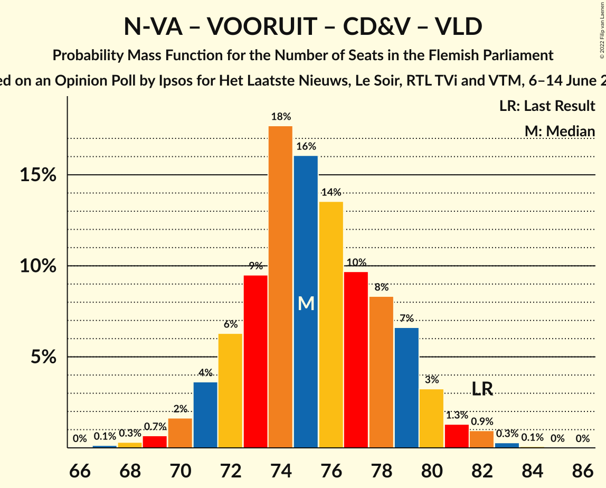

| Number of Seats | Probability | Accumulated | Special Marks |
|:---------------:|:-----------:|:-----------:|:-------------:|
| 67 | 0.1% | 100% |  |
| 68 | 0.3% | 99.8% |  |
| 69 | 0.7% | 99.5% |  |
| 70 | 2% | 98.9% |  |
| 71 | 4% | 97% |  |
| 72 | 6% | 94% |  |
| 73 | 9% | 87% |  |
| 74 | 18% | 78% |  |
| 75 | 16% | 60% | Median |
| 76 | 14% | 44% |  |
| 77 | 10% | 31% |  |
| 78 | 8% | 21% |  |
| 79 | 7% | 12% |  |
| 80 | 3% | 6% |  |
| 81 | 1.3% | 3% |  |
| 82 | 0.9% | 1.3% | Last Result |
| 83 | 0.3% | 0.4% |  |
| 84 | 0.1% | 0.1% |  |
| 85 | 0% | 0% |  |

### Nieuw-Vlaamse Alliantie – Vlaams Belang – Christen-Democratisch en Vlaams

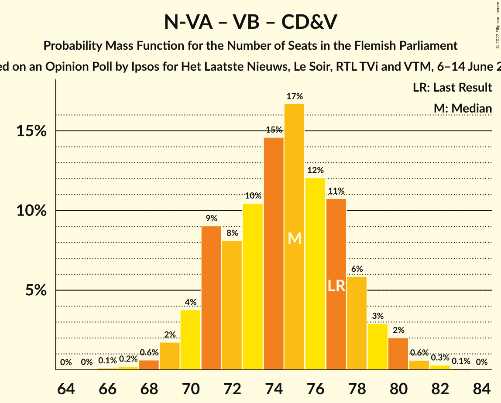

| Number of Seats | Probability | Accumulated | Special Marks |
|:---------------:|:-----------:|:-----------:|:-------------:|
| 66 | 0.1% | 100% |  |
| 67 | 0.2% | 99.9% |  |
| 68 | 0.6% | 99.7% |  |
| 69 | 2% | 99.0% |  |
| 70 | 4% | 97% |  |
| 71 | 9% | 94% |  |
| 72 | 8% | 84% |  |
| 73 | 10% | 76% |  |
| 74 | 15% | 66% |  |
| 75 | 17% | 51% | Median |
| 76 | 12% | 35% |  |
| 77 | 11% | 23% | Last Result |
| 78 | 6% | 12% |  |
| 79 | 3% | 6% |  |
| 80 | 2% | 3% |  |
| 81 | 0.6% | 1.0% |  |
| 82 | 0.3% | 0.4% |  |
| 83 | 0.1% | 0.1% |  |
| 84 | 0% | 0% |  |

### Nieuw-Vlaamse Alliantie – Vooruit – Christen-Democratisch en Vlaams

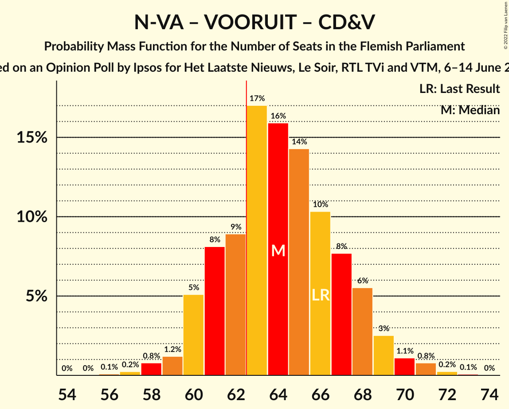

| Number of Seats | Probability | Accumulated | Special Marks |
|:---------------:|:-----------:|:-----------:|:-------------:|
| 56 | 0.1% | 100% |  |
| 57 | 0.2% | 99.9% |  |
| 58 | 0.8% | 99.7% |  |
| 59 | 1.2% | 98.9% |  |
| 60 | 5% | 98% |  |
| 61 | 8% | 93% |  |
| 62 | 9% | 84% |  |
| 63 | 17% | 76% | Majority |
| 64 | 16% | 59% | Median |
| 65 | 14% | 43% |  |
| 66 | 10% | 28% | Last Result |
| 67 | 8% | 18% |  |
| 68 | 6% | 10% |  |
| 69 | 3% | 5% |  |
| 70 | 1.1% | 2% |  |
| 71 | 0.8% | 1.1% |  |
| 72 | 0.2% | 0.3% |  |
| 73 | 0.1% | 0.1% |  |
| 74 | 0% | 0% |  |

### Nieuw-Vlaamse Alliantie – Vooruit – Open Vlaamse Liberalen en Democraten

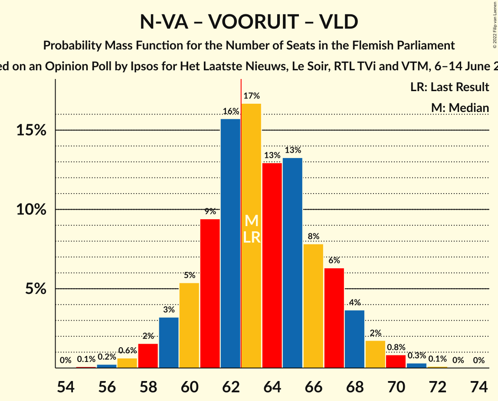

| Number of Seats | Probability | Accumulated | Special Marks |
|:---------------:|:-----------:|:-----------:|:-------------:|
| 55 | 0.1% | 100% |  |
| 56 | 0.2% | 99.9% |  |
| 57 | 0.6% | 99.7% |  |
| 58 | 2% | 99.0% |  |
| 59 | 3% | 97% |  |
| 60 | 5% | 94% |  |
| 61 | 9% | 89% |  |
| 62 | 16% | 79% |  |
| 63 | 17% | 64% | Last Result, Median, Majority |
| 64 | 13% | 47% |  |
| 65 | 13% | 34% |  |
| 66 | 8% | 21% |  |
| 67 | 6% | 13% |  |
| 68 | 4% | 7% |  |
| 69 | 2% | 3% |  |
| 70 | 0.8% | 1.3% |  |
| 71 | 0.3% | 0.5% |  |
| 72 | 0.1% | 0.1% |  |
| 73 | 0% | 0% |  |

### Nieuw-Vlaamse Alliantie – Vlaams Belang

| Number of Seats | Probability | Accumulated | Special Marks |
|:---------------:|:-----------:|:-----------:|:-------------:|
| 54 | 0.1% | 100% |  |
| 55 | 0.3% | 99.9% |  |
| 56 | 0.7% | 99.6% |  |
| 57 | 1.1% | 98.9% |  |
| 58 | 3% | 98% | Last Result |
| 59 | 9% | 95% |  |
| 60 | 9% | 85% |  |
| 61 | 10% | 76% |  |
| 62 | 11% | 67% |  |
| 63 | 15% | 55% | Median, Majority |
| 64 | 17% | 40% |  |
| 65 | 10% | 23% |  |
| 66 | 7% | 13% |  |
| 67 | 3% | 7% |  |
| 68 | 3% | 4% |  |
| 69 | 0.8% | 1.1% |  |
| 70 | 0.2% | 0.3% |  |
| 71 | 0.1% | 0.1% |  |
| 72 | 0% | 0% |  |

### Nieuw-Vlaamse Alliantie – Christen-Democratisch en Vlaams – Open Vlaamse Liberalen en Democraten

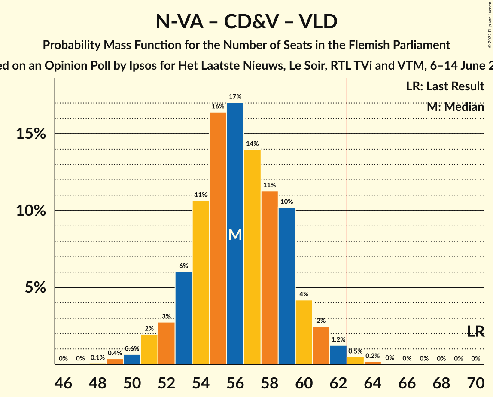

| Number of Seats | Probability | Accumulated | Special Marks |
|:---------------:|:-----------:|:-----------:|:-------------:|
| 48 | 0.1% | 100% |  |
| 49 | 0.4% | 99.9% |  |
| 50 | 0.6% | 99.6% |  |
| 51 | 2% | 98.9% |  |
| 52 | 3% | 97% |  |
| 53 | 6% | 94% |  |
| 54 | 11% | 88% |  |
| 55 | 16% | 78% |  |
| 56 | 17% | 61% | Median |
| 57 | 14% | 44% |  |
| 58 | 11% | 30% |  |
| 59 | 10% | 19% |  |
| 60 | 4% | 9% |  |
| 61 | 2% | 4% |  |
| 62 | 1.2% | 2% |  |
| 63 | 0.5% | 0.7% | Majority |
| 64 | 0.2% | 0.2% |  |
| 65 | 0% | 0.1% |  |
| 66 | 0% | 0% |  |
| 67 | 0% | 0% |  |
| 68 | 0% | 0% |  |
| 69 | 0% | 0% |  |
| 70 | 0% | 0% | Last Result |

### Vooruit – Christen-Democratisch en Vlaams – Open Vlaamse Liberalen en Democraten – Groen

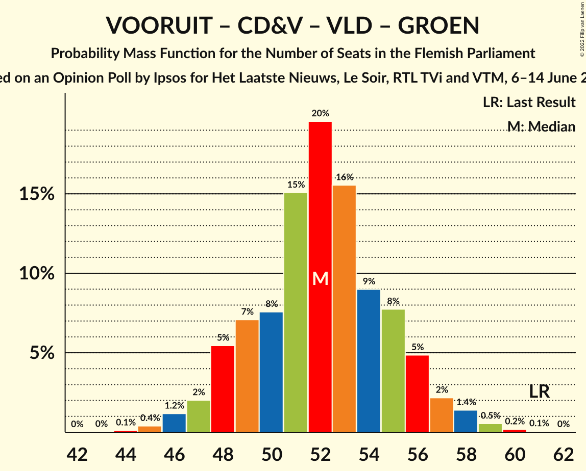

| Number of Seats | Probability | Accumulated | Special Marks |
|:---------------:|:-----------:|:-----------:|:-------------:|
| 44 | 0.1% | 100% |  |
| 45 | 0.4% | 99.8% |  |
| 46 | 1.2% | 99.4% |  |
| 47 | 2% | 98% |  |
| 48 | 5% | 96% |  |
| 49 | 7% | 91% |  |
| 50 | 8% | 84% |  |
| 51 | 15% | 76% |  |
| 52 | 20% | 61% |  |
| 53 | 16% | 42% | Median |
| 54 | 9% | 26% |  |
| 55 | 8% | 17% |  |
| 56 | 5% | 9% |  |
| 57 | 2% | 4% |  |
| 58 | 1.4% | 2% |  |
| 59 | 0.5% | 0.8% |  |
| 60 | 0.2% | 0.3% |  |
| 61 | 0.1% | 0.1% | Last Result |
| 62 | 0% | 0% |  |

### Vooruit – Christen-Democratisch en Vlaams – Partij van de Arbeid van België – Groen

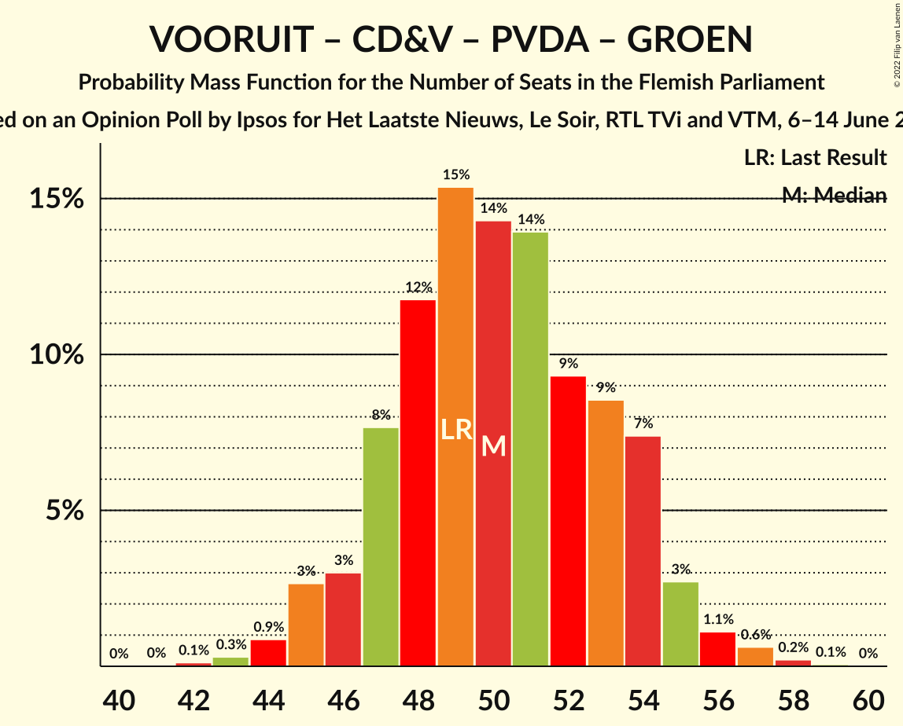

| Number of Seats | Probability | Accumulated | Special Marks |
|:---------------:|:-----------:|:-----------:|:-------------:|
| 42 | 0.1% | 100% |  |
| 43 | 0.3% | 99.8% |  |
| 44 | 0.9% | 99.5% |  |
| 45 | 3% | 98.7% |  |
| 46 | 3% | 96% |  |
| 47 | 8% | 93% |  |
| 48 | 12% | 85% |  |
| 49 | 15% | 74% | Last Result |
| 50 | 14% | 58% |  |
| 51 | 14% | 44% | Median |
| 52 | 9% | 30% |  |
| 53 | 9% | 21% |  |
| 54 | 7% | 12% |  |
| 55 | 3% | 5% |  |
| 56 | 1.1% | 2% |  |
| 57 | 0.6% | 0.9% |  |
| 58 | 0.2% | 0.3% |  |
| 59 | 0.1% | 0.1% |  |
| 60 | 0% | 0% |  |

### Nieuw-Vlaamse Alliantie – Christen-Democratisch en Vlaams

| Number of Seats | Probability | Accumulated | Special Marks |
|:---------------:|:-----------:|:-----------:|:-------------:|
| 38 | 0.1% | 100% |  |
| 39 | 0.6% | 99.8% |  |
| 40 | 2% | 99.2% |  |
| 41 | 4% | 98% |  |
| 42 | 6% | 93% |  |
| 43 | 11% | 87% |  |
| 44 | 17% | 76% |  |
| 45 | 17% | 59% | Median |
| 46 | 16% | 42% |  |
| 47 | 13% | 27% |  |
| 48 | 6% | 13% |  |
| 49 | 4% | 7% |  |
| 50 | 2% | 3% |  |
| 51 | 0.9% | 1.5% |  |
| 52 | 0.4% | 0.6% |  |
| 53 | 0.1% | 0.1% |  |
| 54 | 0% | 0% | Last Result |

### Nieuw-Vlaamse Alliantie – Open Vlaamse Liberalen en Democraten

| Number of Seats | Probability | Accumulated | Special Marks |
|:---------------:|:-----------:|:-----------:|:-------------:|
| 37 | 0.2% | 100% |  |
| 38 | 0.5% | 99.8% |  |
| 39 | 2% | 99.2% |  |
| 40 | 2% | 98% |  |
| 41 | 6% | 96% |  |
| 42 | 10% | 90% |  |
| 43 | 13% | 80% |  |
| 44 | 20% | 66% | Median |
| 45 | 14% | 46% |  |
| 46 | 13% | 32% |  |
| 47 | 11% | 20% |  |
| 48 | 5% | 9% |  |
| 49 | 2% | 3% |  |
| 50 | 0.8% | 1.5% |  |
| 51 | 0.4% | 0.7% | Last Result |
| 52 | 0.1% | 0.2% |  |
| 53 | 0.1% | 0.1% |  |
| 54 | 0% | 0% |  |

### Vooruit – Christen-Democratisch en Vlaams – Open Vlaamse Liberalen en Democraten

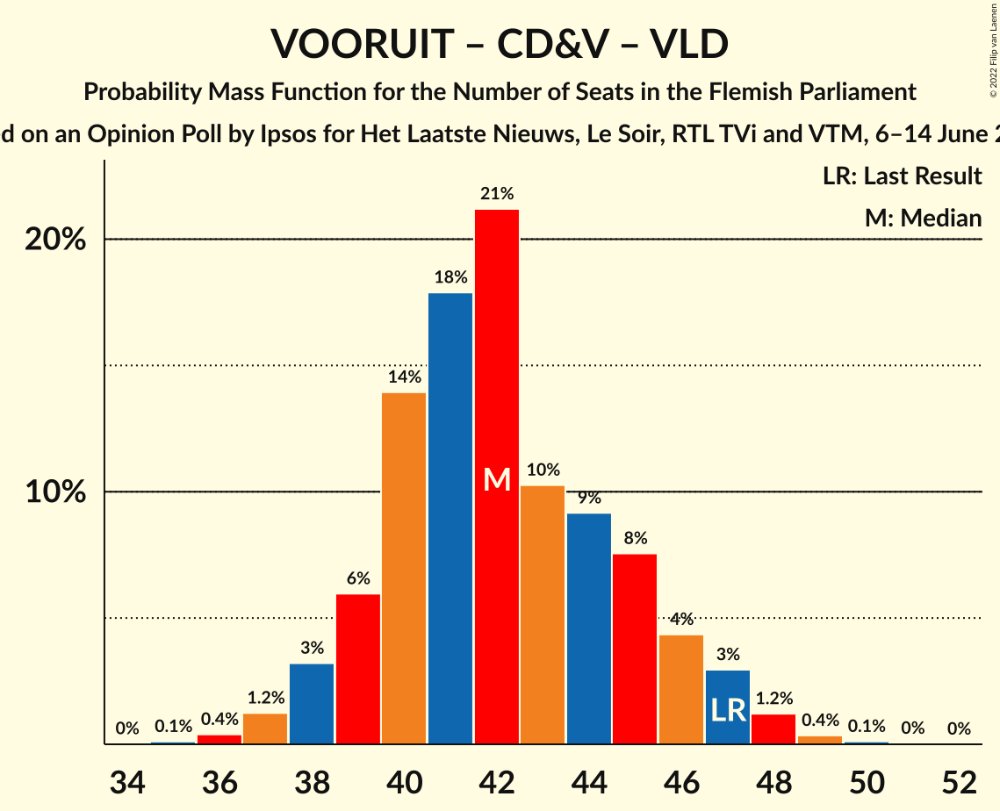

| Number of Seats | Probability | Accumulated | Special Marks |
|:---------------:|:-----------:|:-----------:|:-------------:|
| 35 | 0.1% | 100% |  |
| 36 | 0.4% | 99.9% |  |
| 37 | 1.2% | 99.5% |  |
| 38 | 3% | 98% |  |
| 39 | 6% | 95% |  |
| 40 | 14% | 89% |  |
| 41 | 18% | 75% |  |
| 42 | 21% | 57% | Median |
| 43 | 10% | 36% |  |
| 44 | 9% | 26% |  |
| 45 | 8% | 17% |  |
| 46 | 4% | 9% |  |
| 47 | 3% | 5% | Last Result |
| 48 | 1.2% | 2% |  |
| 49 | 0.4% | 0.5% |  |
| 50 | 0.1% | 0.2% |  |
| 51 | 0% | 0.1% |  |
| 52 | 0% | 0% |  |

### Vooruit – Christen-Democratisch en Vlaams – Groen

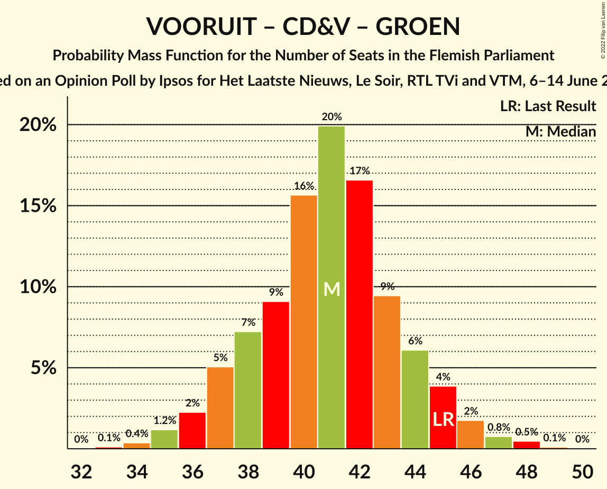

| Number of Seats | Probability | Accumulated | Special Marks |
|:---------------:|:-----------:|:-----------:|:-------------:|
| 33 | 0.1% | 100% |  |
| 34 | 0.4% | 99.9% |  |
| 35 | 1.2% | 99.5% |  |
| 36 | 2% | 98% |  |
| 37 | 5% | 96% |  |
| 38 | 7% | 91% |  |
| 39 | 9% | 84% |  |
| 40 | 16% | 75% |  |
| 41 | 20% | 59% |  |
| 42 | 17% | 39% | Median |
| 43 | 9% | 23% |  |
| 44 | 6% | 13% |  |
| 45 | 4% | 7% | Last Result |
| 46 | 2% | 3% |  |
| 47 | 0.8% | 1.4% |  |
| 48 | 0.5% | 0.6% |  |
| 49 | 0.1% | 0.1% |  |
| 50 | 0% | 0% |  |

### Vooruit – Open Vlaamse Liberalen en Democraten – Groen

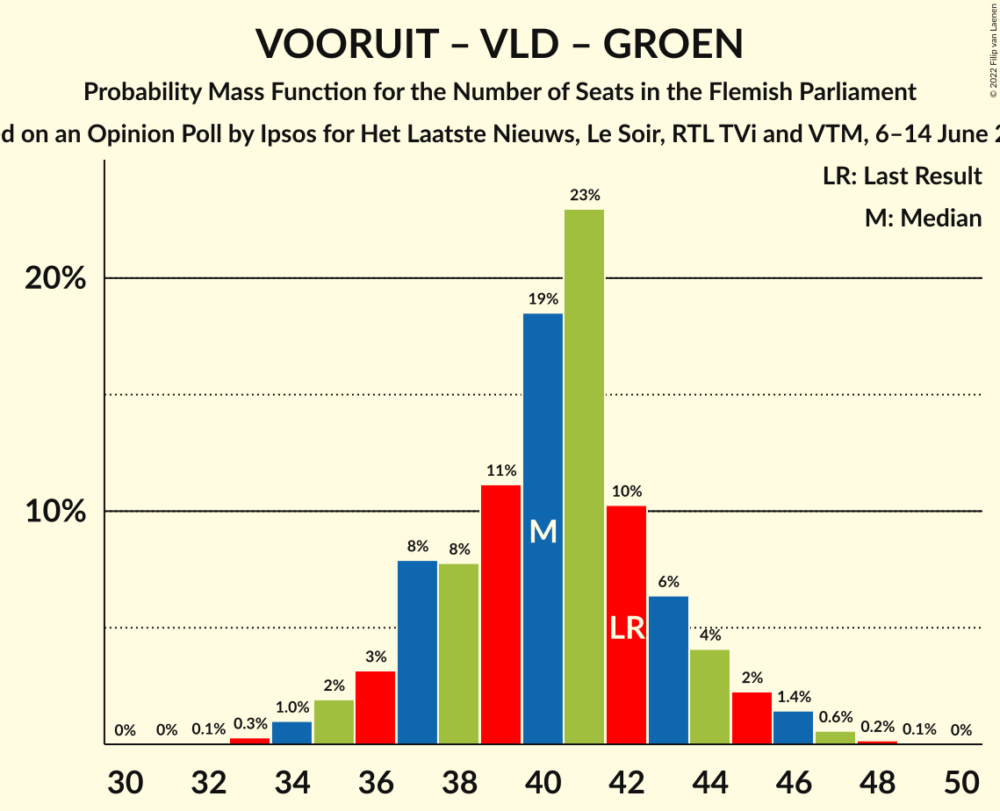

| Number of Seats | Probability | Accumulated | Special Marks |
|:---------------:|:-----------:|:-----------:|:-------------:|
| 32 | 0.1% | 100% |  |
| 33 | 0.3% | 99.9% |  |
| 34 | 1.0% | 99.6% |  |
| 35 | 2% | 98.6% |  |
| 36 | 3% | 97% |  |
| 37 | 8% | 94% |  |
| 38 | 8% | 86% |  |
| 39 | 11% | 78% |  |
| 40 | 19% | 67% |  |
| 41 | 23% | 48% | Median |
| 42 | 10% | 25% | Last Result |
| 43 | 6% | 15% |  |
| 44 | 4% | 9% |  |
| 45 | 2% | 5% |  |
| 46 | 1.4% | 2% |  |
| 47 | 0.6% | 0.8% |  |
| 48 | 0.2% | 0.2% |  |
| 49 | 0.1% | 0.1% |  |
| 50 | 0% | 0% |  |

### Christen-Democratisch en Vlaams – Open Vlaamse Liberalen en Democraten – Groen

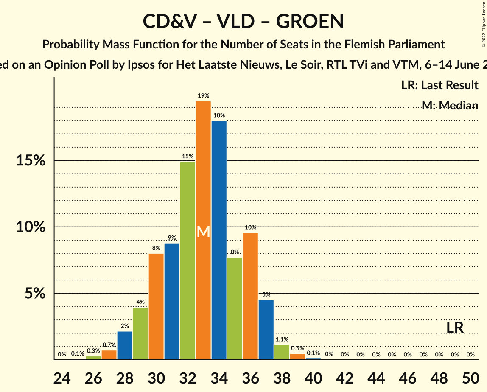

| Number of Seats | Probability | Accumulated | Special Marks |
|:---------------:|:-----------:|:-----------:|:-------------:|
| 25 | 0.1% | 100% |  |
| 26 | 0.3% | 99.9% |  |
| 27 | 0.7% | 99.6% |  |
| 28 | 2% | 98.9% |  |
| 29 | 4% | 97% |  |
| 30 | 8% | 93% |  |
| 31 | 9% | 85% |  |
| 32 | 15% | 76% |  |
| 33 | 19% | 61% |  |
| 34 | 18% | 42% | Median |
| 35 | 8% | 24% |  |
| 36 | 10% | 16% |  |
| 37 | 5% | 6% |  |
| 38 | 1.1% | 2% |  |
| 39 | 0.5% | 0.6% |  |
| 40 | 0.1% | 0.2% |  |
| 41 | 0% | 0.1% |  |
| 42 | 0% | 0% |  |
| 43 | 0% | 0% |  |
| 44 | 0% | 0% |  |
| 45 | 0% | 0% |  |
| 46 | 0% | 0% |  |
| 47 | 0% | 0% |  |
| 48 | 0% | 0% |  |
| 49 | 0% | 0% | Last Result |

### Vooruit – Christen-Democratisch en Vlaams

| Number of Seats | Probability | Accumulated | Special Marks |
|:---------------:|:-----------:|:-----------:|:-------------:|
| 25 | 0.2% | 100% |  |
| 26 | 0.7% | 99.8% |  |
| 27 | 3% | 99.0% |  |
| 28 | 7% | 96% |  |
| 29 | 15% | 89% |  |
| 30 | 18% | 74% |  |
| 31 | 24% | 56% | Last Result, Median |
| 32 | 11% | 32% |  |
| 33 | 8% | 21% |  |
| 34 | 6% | 13% |  |
| 35 | 4% | 7% |  |
| 36 | 1.5% | 3% |  |
| 37 | 0.8% | 1.1% |  |
| 38 | 0.2% | 0.3% |  |
| 39 | 0.1% | 0.1% |  |
| 40 | 0% | 0% |  |

### Vooruit – Open Vlaamse Liberalen en Democraten

| Number of Seats | Probability | Accumulated | Special Marks |
|:---------------:|:-----------:|:-----------:|:-------------:|
| 23 | 0.1% | 100% |  |
| 24 | 0.2% | 99.9% |  |
| 25 | 0.5% | 99.8% |  |
| 26 | 3% | 99.2% |  |
| 27 | 5% | 96% |  |
| 28 | 6% | 91% | Last Result |
| 29 | 19% | 85% |  |
| 30 | 31% | 66% | Median |
| 31 | 13% | 35% |  |
| 32 | 7% | 22% |  |
| 33 | 6% | 15% |  |
| 34 | 4% | 8% |  |
| 35 | 3% | 5% |  |
| 36 | 1.4% | 2% |  |
| 37 | 0.3% | 0.3% |  |
| 38 | 0.1% | 0.1% |  |
| 39 | 0% | 0% |  |

### Christen-Democratisch en Vlaams – Open Vlaamse Liberalen en Democraten

| Number of Seats | Probability | Accumulated | Special Marks |
|:---------------:|:-----------:|:-----------:|:-------------:|
| 17 | 0.1% | 100% |  |
| 18 | 0.6% | 99.8% |  |
| 19 | 1.4% | 99.2% |  |
| 20 | 4% | 98% |  |
| 21 | 10% | 94% |  |
| 22 | 27% | 84% |  |
| 23 | 25% | 58% | Median |
| 24 | 11% | 33% |  |
| 25 | 12% | 22% |  |
| 26 | 6% | 9% |  |
| 27 | 2% | 4% |  |
| 28 | 0.8% | 1.1% |  |
| 29 | 0.2% | 0.3% |  |
| 30 | 0.1% | 0.1% |  |
| 31 | 0% | 0% |  |
| 32 | 0% | 0% |  |
| 33 | 0% | 0% |  |
| 34 | 0% | 0% |  |
| 35 | 0% | 0% | Last Result |

## Technical Information

### Opinion Poll

+ **Polling firm:** Ipsos
+ **Commissioner(s):** Het Laatste Nieuws, Le Soir, RTL TVi and VTM
+ **Fieldwork period:** 6–14 June 2022

### Calculations

+ **Sample size:** 1008
+ **Simulations done:** 1,048,576
+ **Error estimate:** 1.05%

