# Opinion Poll by Kantar for La Libre Belgique and RTBf, 16–29 January 2023

<a href="#voting-intentions">Voting Intentions</a> | <a href="#seats">Seats</a> | <a href="#coalitions">Coalitions</a> | <a href="#technical-information">Technical Information</a>

## Voting Intentions

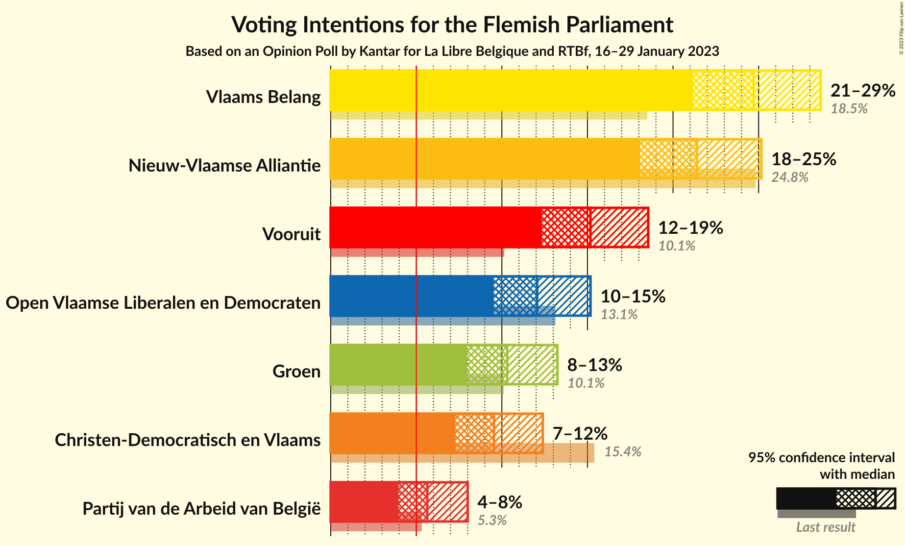

### Confidence Intervals

| Party | Last Result | Poll Result | 80% Confidence Interval | 90% Confidence Interval | 95% Confidence Interval | 99% Confidence Interval |
|:-----:|:-----------:|:-----------:|:-----------------------:|:-----------------------:|:-----------------------:|:-----------------------:|
| Vlaams Belang | 18.5% | 24.7% | 22.4–27.3% |21.7–28.0% |21.2–28.6% |20.1–29.9% |
| Nieuw-Vlaamse Alliantie | 24.8% | 21.4% | 19.2–23.9% |18.6–24.6% |18.1–25.2% |17.1–26.4% |
| Vooruit | 10.1% | 15.2% | 13.3–17.4% |12.8–18.0% |12.3–18.5% |11.5–19.6% |
| Open Vlaamse Liberalen en Democraten | 13.1% | 12.1% | 10.4–14.1% |9.9–14.7% |9.5–15.2% |8.8–16.2% |
| Groen | 10.1% | 10.3% | 8.8–12.2% |8.3–12.8% |8.0–13.2% |7.3–14.2% |
| Christen-Democratisch en Vlaams | 15.4% | 9.5% | 8.0–11.4% |7.6–11.9% |7.3–12.4% |6.6–13.3% |
| Partij van de Arbeid van België | 5.3% | 5.6% | 4.5–7.2% |4.2–7.6% |4.0–8.0% |3.5–8.8% |

*Note:* The poll result column reflects the actual value used in the calculations. Published results may vary slightly, and in addition be rounded to fewer digits.

## Seats

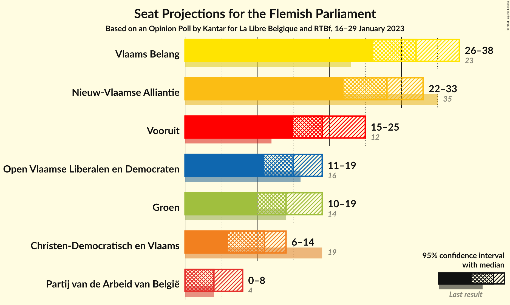

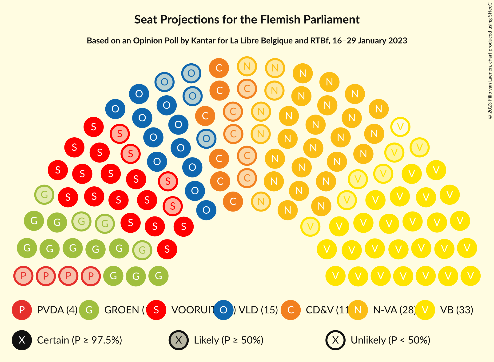

### Confidence Intervals

| Party | Last Result | Median | 80% Confidence Interval | 90% Confidence Interval | 95% Confidence Interval | 99% Confidence Interval |
|:-----:|:-----------:|:------:|:-----------------------:|:-----------------------:|:-----------------------:|:-----------------------:|
| <a href="#vlaams-belang">Vlaams Belang</a> | 23 | 32 | 29–36 |27–37 |26–38 |25–40 |
| <a href="#nieuw-vlaamse-alliantie">Nieuw-Vlaamse Alliantie</a> | 35 | 28 | 26–31 |24–32 |22–33 |22–36 |
| <a href="#vooruit">Vooruit</a> | 12 | 19 | 17–24 |16–25 |15–25 |14–25 |
| <a href="#open-vlaamse-liberalen-en-democraten">Open Vlaamse Liberalen en Democraten</a> | 16 | 15 | 12–19 |12–19 |11–19 |10–20 |
| <a href="#groen">Groen</a> | 14 | 14 | 11–16 |11–18 |10–19 |8–19 |
| <a href="#christen-democratisch-en-vlaams">Christen-Democratisch en Vlaams</a> | 19 | 11 | 9–14 |8–14 |6–14 |5–16 |
| <a href="#partij-van-de-arbeid-van-belgië">Partij van de Arbeid van België</a> | 4 | 4 | 2–7 |1–7 |0–8 |0–9 |

### Vlaams Belang

*For a full overview of the results for this party, see the [Vlaams Belang](party-vlaamsbelang.html) page.*

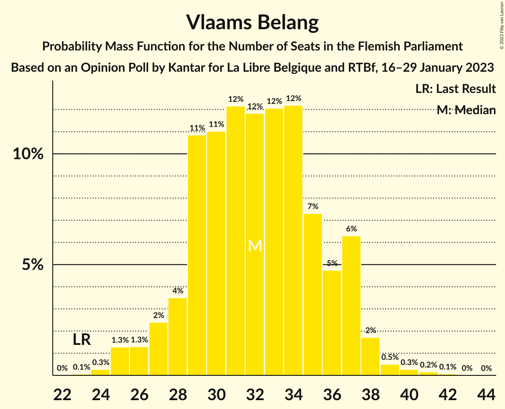

| Number of Seats | Probability | Accumulated | Special Marks |
|:---------------:|:-----------:|:-----------:|:-------------:|
| 23 | 0.1% | 100% | Last Result |
| 24 | 0.3% | 99.9% |  |
| 25 | 1.3% | 99.7% |  |
| 26 | 1.3% | 98% |  |
| 27 | 2% | 97% |  |
| 28 | 4% | 95% |  |
| 29 | 11% | 91% |  |
| 30 | 11% | 80% |  |
| 31 | 12% | 69% |  |
| 32 | 12% | 57% | Median |
| 33 | 12% | 45% |  |
| 34 | 12% | 33% |  |
| 35 | 7% | 21% |  |
| 36 | 5% | 14% |  |
| 37 | 6% | 9% |  |
| 38 | 2% | 3% |  |
| 39 | 0.5% | 1.0% |  |
| 40 | 0.3% | 0.5% |  |
| 41 | 0.2% | 0.2% |  |
| 42 | 0.1% | 0.1% |  |
| 43 | 0% | 0% |  |

### Nieuw-Vlaamse Alliantie

*For a full overview of the results for this party, see the [Nieuw-Vlaamse Alliantie](party-nieuw-vlaamsealliantie.html) page.*

| Number of Seats | Probability | Accumulated | Special Marks |
|:---------------:|:-----------:|:-----------:|:-------------:|
| 21 | 0.3% | 100% |  |
| 22 | 2% | 99.7% |  |
| 23 | 1.4% | 97% |  |
| 24 | 2% | 96% |  |
| 25 | 3% | 94% |  |
| 26 | 15% | 91% |  |
| 27 | 18% | 76% |  |
| 28 | 17% | 58% | Median |
| 29 | 12% | 41% |  |
| 30 | 14% | 29% |  |
| 31 | 7% | 15% |  |
| 32 | 4% | 8% |  |
| 33 | 2% | 4% |  |
| 34 | 0.7% | 2% |  |
| 35 | 0.6% | 1.1% | Last Result |
| 36 | 0.5% | 0.6% |  |
| 37 | 0.1% | 0.1% |  |
| 38 | 0% | 0% |  |

### Vooruit

*For a full overview of the results for this party, see the [Vooruit](party-vooruit.html) page.*

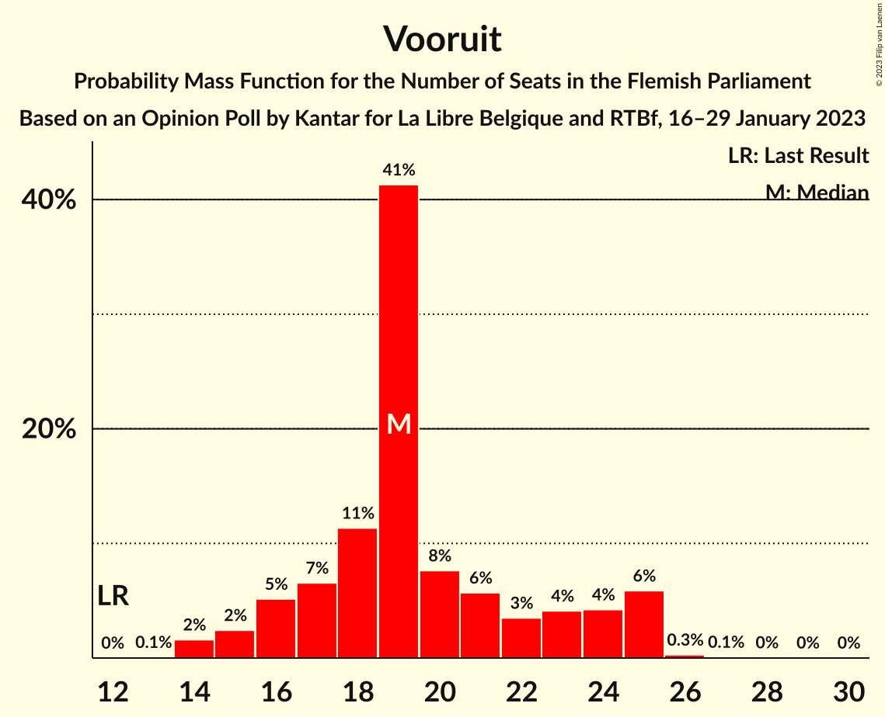

| Number of Seats | Probability | Accumulated | Special Marks |
|:---------------:|:-----------:|:-----------:|:-------------:|
| 12 | 0% | 100% | Last Result |
| 13 | 0.1% | 100% |  |
| 14 | 2% | 99.9% |  |
| 15 | 2% | 98% |  |
| 16 | 5% | 96% |  |
| 17 | 7% | 91% |  |
| 18 | 11% | 84% |  |
| 19 | 41% | 73% | Median |
| 20 | 8% | 32% |  |
| 21 | 6% | 24% |  |
| 22 | 3% | 18% |  |
| 23 | 4% | 15% |  |
| 24 | 4% | 11% |  |
| 25 | 6% | 6% |  |
| 26 | 0.3% | 0.5% |  |
| 27 | 0.1% | 0.2% |  |
| 28 | 0% | 0.1% |  |
| 29 | 0% | 0.1% |  |
| 30 | 0% | 0% |  |

### Open Vlaamse Liberalen en Democraten

*For a full overview of the results for this party, see the [Open Vlaamse Liberalen en Democraten](party-openvlaamseliberalenendemocraten.html) page.*

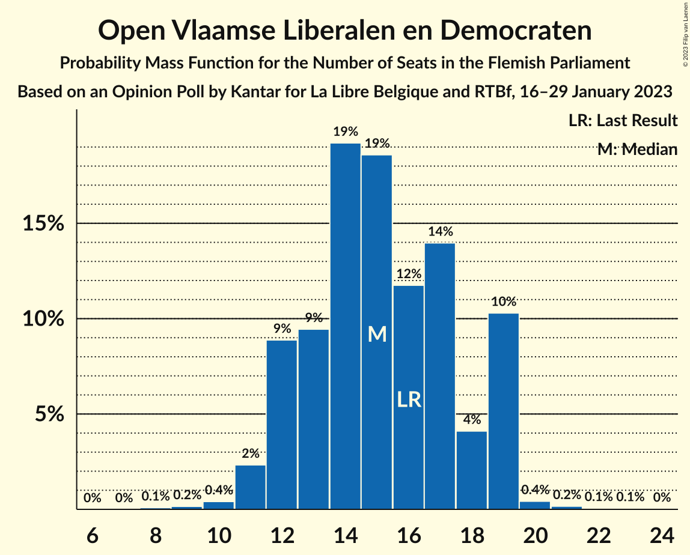

| Number of Seats | Probability | Accumulated | Special Marks |
|:---------------:|:-----------:|:-----------:|:-------------:|
| 8 | 0.1% | 100% |  |
| 9 | 0.2% | 99.9% |  |
| 10 | 0.4% | 99.8% |  |
| 11 | 2% | 99.3% |  |
| 12 | 9% | 97% |  |
| 13 | 9% | 88% |  |
| 14 | 19% | 79% |  |
| 15 | 19% | 59% | Median |
| 16 | 12% | 41% | Last Result |
| 17 | 14% | 29% |  |
| 18 | 4% | 15% |  |
| 19 | 10% | 11% |  |
| 20 | 0.4% | 0.8% |  |
| 21 | 0.2% | 0.3% |  |
| 22 | 0.1% | 0.2% |  |
| 23 | 0.1% | 0.1% |  |
| 24 | 0% | 0% |  |

### Groen

*For a full overview of the results for this party, see the [Groen](party-groen.html) page.*

| Number of Seats | Probability | Accumulated | Special Marks |
|:---------------:|:-----------:|:-----------:|:-------------:|
| 7 | 0.4% | 100% |  |
| 8 | 0.2% | 99.6% |  |
| 9 | 0.8% | 99.4% |  |
| 10 | 2% | 98.7% |  |
| 11 | 18% | 97% |  |
| 12 | 6% | 78% |  |
| 13 | 8% | 72% |  |
| 14 | 38% | 64% | Last Result, Median |
| 15 | 11% | 26% |  |
| 16 | 6% | 15% |  |
| 17 | 3% | 9% |  |
| 18 | 3% | 6% |  |
| 19 | 4% | 4% |  |
| 20 | 0.1% | 0.2% |  |
| 21 | 0% | 0.1% |  |
| 22 | 0% | 0% |  |

### Christen-Democratisch en Vlaams

*For a full overview of the results for this party, see the [Christen-Democratisch en Vlaams](party-christen-democratischenvlaams.html) page.*

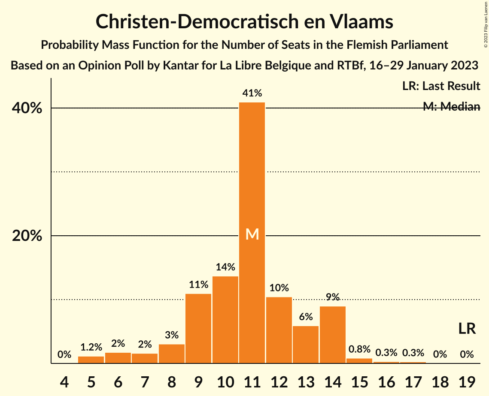

| Number of Seats | Probability | Accumulated | Special Marks |
|:---------------:|:-----------:|:-----------:|:-------------:|
| 5 | 1.2% | 100% |  |
| 6 | 2% | 98.8% |  |
| 7 | 2% | 97% |  |
| 8 | 3% | 95% |  |
| 9 | 11% | 92% |  |
| 10 | 14% | 81% |  |
| 11 | 41% | 68% | Median |
| 12 | 10% | 27% |  |
| 13 | 6% | 16% |  |
| 14 | 9% | 10% |  |
| 15 | 0.8% | 1.5% |  |
| 16 | 0.3% | 0.6% |  |
| 17 | 0.3% | 0.3% |  |
| 18 | 0% | 0.1% |  |
| 19 | 0% | 0% | Last Result |

### Partij van de Arbeid van België

*For a full overview of the results for this party, see the [Partij van de Arbeid van België](party-partijvandearbeidvanbelgië.html) page.*

| Number of Seats | Probability | Accumulated | Special Marks |
|:---------------:|:-----------:|:-----------:|:-------------:|
| 0 | 3% | 100% |  |
| 1 | 4% | 97% |  |
| 2 | 14% | 93% |  |
| 3 | 4% | 80% |  |
| 4 | 28% | 76% | Last Result, Median |
| 5 | 22% | 48% |  |
| 6 | 4% | 26% |  |
| 7 | 18% | 22% |  |
| 8 | 3% | 4% |  |
| 9 | 0.3% | 0.7% |  |
| 10 | 0.2% | 0.4% |  |
| 11 | 0.1% | 0.2% |  |
| 12 | 0% | 0.1% |  |
| 13 | 0% | 0% |  |

## Coalitions

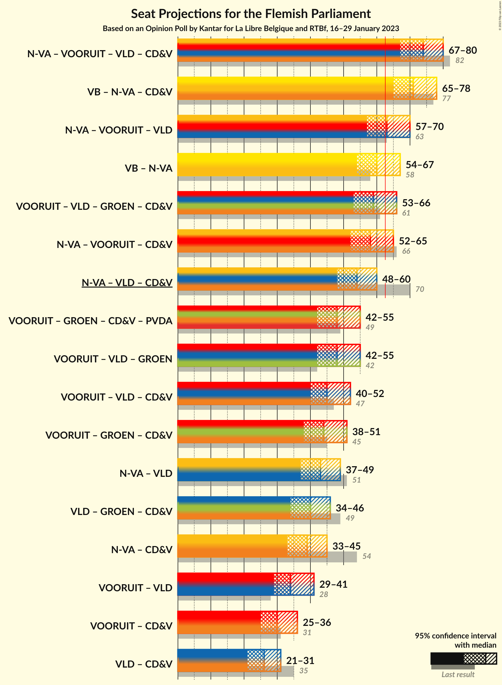

### Confidence Intervals

| Coalition | Last Result | Median | Majority? | 80% Confidence Interval | 90% Confidence Interval | 95% Confidence Interval | 99% Confidence Interval |
|:---------:|:-----------:|:------:|:---------:|:-----------------------:|:-----------------------:|:-----------------------:|:-----------------------:|
| Nieuw-Vlaamse Alliantie – Vooruit – Open Vlaamse Liberalen en Democraten – Christen-Democratisch en Vlaams | 82 | 74 | 100% | 70–78 | 68–79 | 67–80 | 65–82 |
| Vlaams Belang – Nieuw-Vlaamse Alliantie – Christen-Democratisch en Vlaams | 77 | 71 | 99.3% | 67–75 | 65–76 | 65–78 | 62–80 |
| Nieuw-Vlaamse Alliantie – Vooruit – Open Vlaamse Liberalen en Democraten | 63 | 63 | 53% | 59–67 | 57–68 | 57–70 | 54–72 |
| Vlaams Belang – Nieuw-Vlaamse Alliantie | 58 | 60 | 26% | 56–64 | 55–66 | 54–67 | 52–69 |
| Vooruit – Open Vlaamse Liberalen en Democraten – Groen – Christen-Democratisch en Vlaams | 61 | 59 | 17% | 55–64 | 54–65 | 53–66 | 51–68 |
| Nieuw-Vlaamse Alliantie – Vooruit – Christen-Democratisch en Vlaams | 66 | 58 | 11% | 54–63 | 53–64 | 52–65 | 50–67 |
| Nieuw-Vlaamse Alliantie – Open Vlaamse Liberalen en Democraten – Christen-Democratisch en Vlaams | 70 | 54 | 0.5% | 50–58 | 49–59 | 48–60 | 46–63 |
| Vooruit – Groen – Christen-Democratisch en Vlaams – Partij van de Arbeid van België | 49 | 48 | 0% | 44–53 | 43–54 | 42–55 | 40–58 |
| Vooruit – Open Vlaamse Liberalen en Democraten – Groen | 42 | 48 | 0% | 44–53 | 43–54 | 42–55 | 40–57 |
| Vooruit – Open Vlaamse Liberalen en Democraten – Christen-Democratisch en Vlaams | 47 | 45 | 0% | 42–50 | 41–51 | 40–52 | 37–54 |
| Vooruit – Groen – Christen-Democratisch en Vlaams | 45 | 44 | 0% | 40–48 | 39–50 | 38–51 | 36–53 |
| Nieuw-Vlaamse Alliantie – Open Vlaamse Liberalen en Democraten | 51 | 43 | 0% | 40–47 | 38–48 | 37–49 | 36–51 |
| Open Vlaamse Liberalen en Democraten – Groen – Christen-Democratisch en Vlaams | 49 | 40 | 0% | 36–44 | 35–45 | 34–46 | 32–48 |
| Nieuw-Vlaamse Alliantie – Christen-Democratisch en Vlaams | 54 | 39 | 0% | 35–43 | 34–44 | 33–45 | 32–47 |
| Vooruit – Open Vlaamse Liberalen en Democraten | 28 | 34 | 0% | 31–39 | 30–40 | 29–41 | 27–43 |
| Vooruit – Christen-Democratisch en Vlaams | 31 | 30 | 0% | 27–34 | 26–36 | 25–36 | 24–39 |
| Open Vlaamse Liberalen en Democraten – Christen-Democratisch en Vlaams | 35 | 26 | 0% | 23–30 | 22–30 | 21–31 | 19–33 |

### Nieuw-Vlaamse Alliantie – Vooruit – Open Vlaamse Liberalen en Democraten – Christen-Democratisch en Vlaams

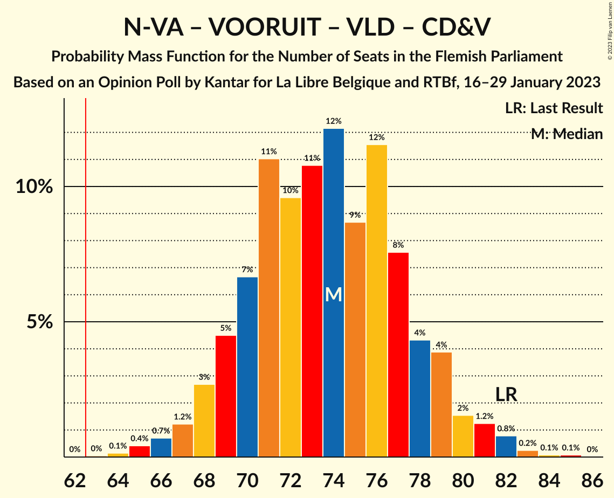

| Number of Seats | Probability | Accumulated | Special Marks |
|:---------------:|:-----------:|:-----------:|:-------------:|
| 63 | 0% | 100% | Majority |
| 64 | 0.1% | 99.9% |  |
| 65 | 0.4% | 99.8% |  |
| 66 | 0.7% | 99.4% |  |
| 67 | 1.2% | 98.7% |  |
| 68 | 3% | 97% |  |
| 69 | 5% | 95% |  |
| 70 | 7% | 90% |  |
| 71 | 11% | 84% |  |
| 72 | 10% | 73% |  |
| 73 | 11% | 63% | Median |
| 74 | 12% | 52% |  |
| 75 | 9% | 40% |  |
| 76 | 12% | 31% |  |
| 77 | 8% | 20% |  |
| 78 | 4% | 12% |  |
| 79 | 4% | 8% |  |
| 80 | 2% | 4% |  |
| 81 | 1.2% | 2% |  |
| 82 | 0.8% | 1.2% | Last Result |
| 83 | 0.2% | 0.4% |  |
| 84 | 0.1% | 0.2% |  |
| 85 | 0.1% | 0.1% |  |
| 86 | 0% | 0% |  |

### Vlaams Belang – Nieuw-Vlaamse Alliantie – Christen-Democratisch en Vlaams

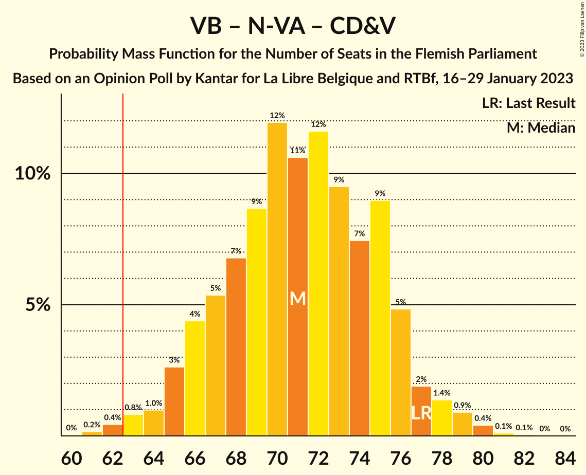

| Number of Seats | Probability | Accumulated | Special Marks |
|:---------------:|:-----------:|:-----------:|:-------------:|
| 60 | 0% | 100% |  |
| 61 | 0.2% | 99.9% |  |
| 62 | 0.4% | 99.8% |  |
| 63 | 0.8% | 99.3% | Majority |
| 64 | 1.0% | 98% |  |
| 65 | 3% | 98% |  |
| 66 | 4% | 95% |  |
| 67 | 5% | 90% |  |
| 68 | 7% | 85% |  |
| 69 | 9% | 78% |  |
| 70 | 12% | 70% |  |
| 71 | 11% | 58% | Median |
| 72 | 12% | 47% |  |
| 73 | 9% | 36% |  |
| 74 | 7% | 26% |  |
| 75 | 9% | 19% |  |
| 76 | 5% | 10% |  |
| 77 | 2% | 5% | Last Result |
| 78 | 1.4% | 3% |  |
| 79 | 0.9% | 2% |  |
| 80 | 0.4% | 0.6% |  |
| 81 | 0.1% | 0.2% |  |
| 82 | 0.1% | 0.1% |  |
| 83 | 0% | 0% |  |

### Nieuw-Vlaamse Alliantie – Vooruit – Open Vlaamse Liberalen en Democraten

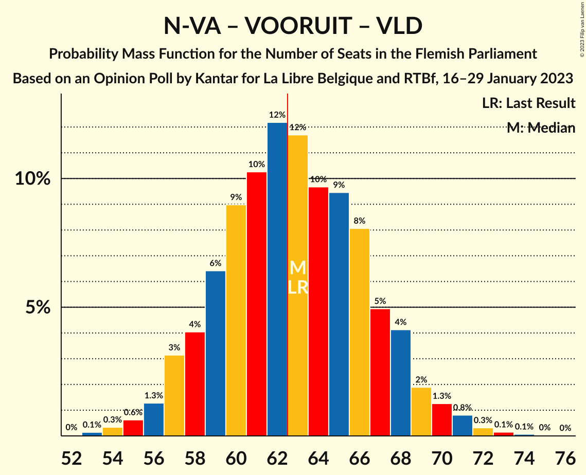

| Number of Seats | Probability | Accumulated | Special Marks |
|:---------------:|:-----------:|:-----------:|:-------------:|
| 52 | 0% | 100% |  |
| 53 | 0.1% | 99.9% |  |
| 54 | 0.3% | 99.8% |  |
| 55 | 0.6% | 99.5% |  |
| 56 | 1.3% | 98.8% |  |
| 57 | 3% | 98% |  |
| 58 | 4% | 94% |  |
| 59 | 6% | 90% |  |
| 60 | 9% | 84% |  |
| 61 | 10% | 75% |  |
| 62 | 12% | 65% | Median |
| 63 | 12% | 53% | Last Result, Majority |
| 64 | 10% | 41% |  |
| 65 | 9% | 31% |  |
| 66 | 8% | 22% |  |
| 67 | 5% | 14% |  |
| 68 | 4% | 9% |  |
| 69 | 2% | 5% |  |
| 70 | 1.3% | 3% |  |
| 71 | 0.8% | 1.4% |  |
| 72 | 0.3% | 0.6% |  |
| 73 | 0.1% | 0.3% |  |
| 74 | 0.1% | 0.1% |  |
| 75 | 0% | 0.1% |  |
| 76 | 0% | 0% |  |

### Vlaams Belang – Nieuw-Vlaamse Alliantie

| Number of Seats | Probability | Accumulated | Special Marks |
|:---------------:|:-----------:|:-----------:|:-------------:|
| 49 | 0% | 100% |  |
| 50 | 0.1% | 99.9% |  |
| 51 | 0.3% | 99.8% |  |
| 52 | 0.6% | 99.5% |  |
| 53 | 1.1% | 98.9% |  |
| 54 | 2% | 98% |  |
| 55 | 5% | 96% |  |
| 56 | 5% | 91% |  |
| 57 | 7% | 86% |  |
| 58 | 7% | 79% | Last Result |
| 59 | 12% | 72% |  |
| 60 | 12% | 60% | Median |
| 61 | 12% | 48% |  |
| 62 | 9% | 36% |  |
| 63 | 8% | 26% | Majority |
| 64 | 9% | 19% |  |
| 65 | 4% | 10% |  |
| 66 | 3% | 6% |  |
| 67 | 1.3% | 3% |  |
| 68 | 1.1% | 2% |  |
| 69 | 0.4% | 0.7% |  |
| 70 | 0.1% | 0.2% |  |
| 71 | 0.1% | 0.1% |  |
| 72 | 0% | 0% |  |

### Vooruit – Open Vlaamse Liberalen en Democraten – Groen – Christen-Democratisch en Vlaams

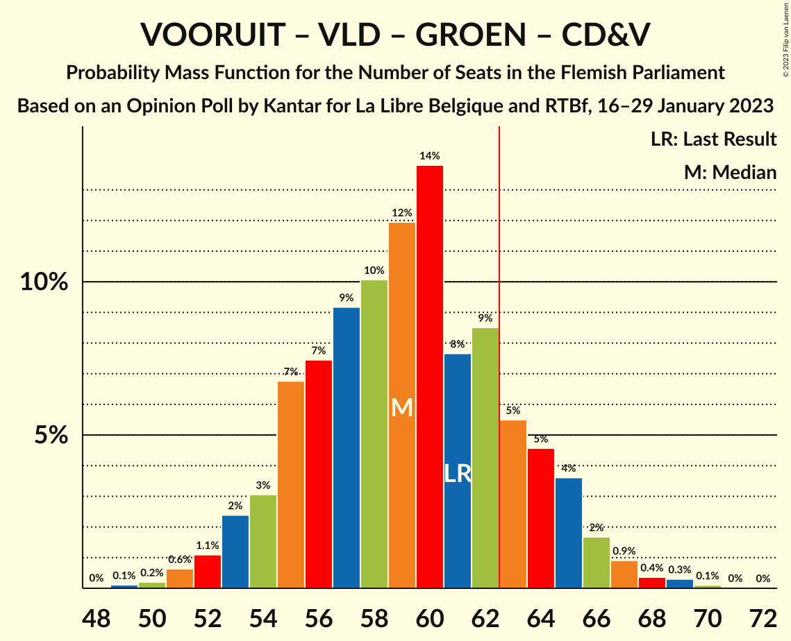

| Number of Seats | Probability | Accumulated | Special Marks |
|:---------------:|:-----------:|:-----------:|:-------------:|
| 48 | 0% | 100% |  |
| 49 | 0.1% | 99.9% |  |
| 50 | 0.2% | 99.8% |  |
| 51 | 0.6% | 99.6% |  |
| 52 | 1.1% | 99.0% |  |
| 53 | 2% | 98% |  |
| 54 | 3% | 96% |  |
| 55 | 7% | 92% |  |
| 56 | 7% | 86% |  |
| 57 | 9% | 78% |  |
| 58 | 10% | 69% |  |
| 59 | 12% | 59% | Median |
| 60 | 14% | 47% |  |
| 61 | 8% | 33% | Last Result |
| 62 | 9% | 26% |  |
| 63 | 5% | 17% | Majority |
| 64 | 5% | 12% |  |
| 65 | 4% | 7% |  |
| 66 | 2% | 3% |  |
| 67 | 0.9% | 2% |  |
| 68 | 0.4% | 0.8% |  |
| 69 | 0.3% | 0.4% |  |
| 70 | 0.1% | 0.1% |  |
| 71 | 0% | 0% |  |

### Nieuw-Vlaamse Alliantie – Vooruit – Christen-Democratisch en Vlaams

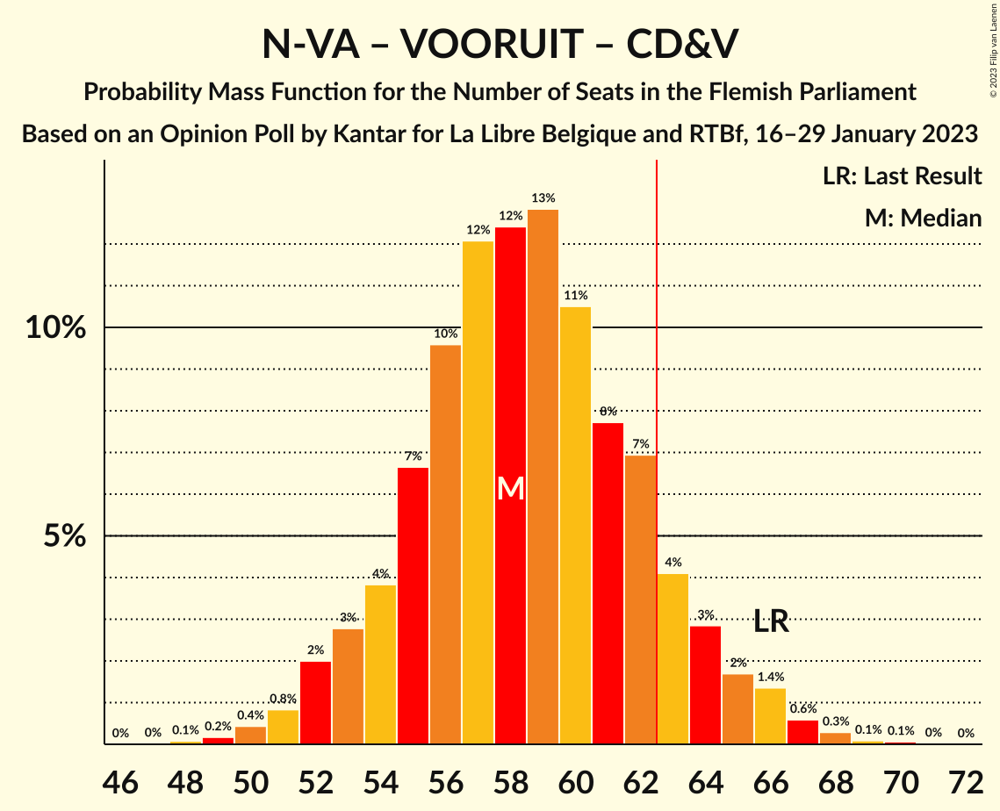

| Number of Seats | Probability | Accumulated | Special Marks |
|:---------------:|:-----------:|:-----------:|:-------------:|
| 48 | 0.1% | 100% |  |
| 49 | 0.2% | 99.9% |  |
| 50 | 0.4% | 99.7% |  |
| 51 | 0.8% | 99.3% |  |
| 52 | 2% | 98% |  |
| 53 | 3% | 96% |  |
| 54 | 4% | 94% |  |
| 55 | 7% | 90% |  |
| 56 | 10% | 83% |  |
| 57 | 12% | 74% |  |
| 58 | 12% | 62% | Median |
| 59 | 13% | 49% |  |
| 60 | 11% | 36% |  |
| 61 | 8% | 26% |  |
| 62 | 7% | 18% |  |
| 63 | 4% | 11% | Majority |
| 64 | 3% | 7% |  |
| 65 | 2% | 4% |  |
| 66 | 1.4% | 2% | Last Result |
| 67 | 0.6% | 1.1% |  |
| 68 | 0.3% | 0.5% |  |
| 69 | 0.1% | 0.2% |  |
| 70 | 0.1% | 0.1% |  |
| 71 | 0% | 0% |  |

### Nieuw-Vlaamse Alliantie – Open Vlaamse Liberalen en Democraten – Christen-Democratisch en Vlaams

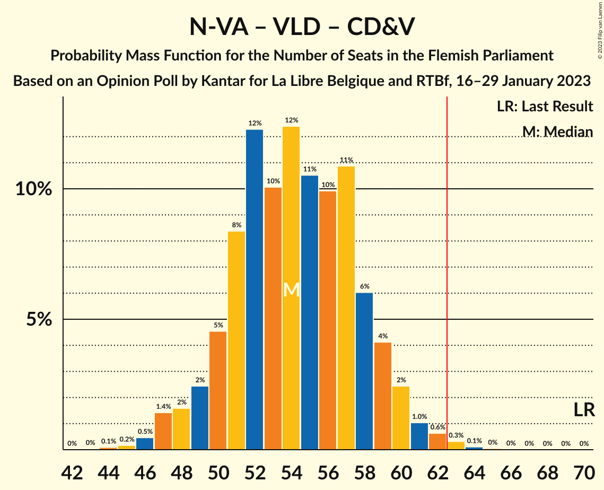

| Number of Seats | Probability | Accumulated | Special Marks |
|:---------------:|:-----------:|:-----------:|:-------------:|
| 43 | 0% | 100% |  |
| 44 | 0.1% | 99.9% |  |
| 45 | 0.2% | 99.9% |  |
| 46 | 0.5% | 99.7% |  |
| 47 | 1.4% | 99.2% |  |
| 48 | 2% | 98% |  |
| 49 | 2% | 96% |  |
| 50 | 5% | 94% |  |
| 51 | 8% | 89% |  |
| 52 | 12% | 81% |  |
| 53 | 10% | 69% |  |
| 54 | 12% | 58% | Median |
| 55 | 11% | 46% |  |
| 56 | 10% | 36% |  |
| 57 | 11% | 26% |  |
| 58 | 6% | 15% |  |
| 59 | 4% | 9% |  |
| 60 | 2% | 5% |  |
| 61 | 1.0% | 2% |  |
| 62 | 0.6% | 1.1% |  |
| 63 | 0.3% | 0.5% | Majority |
| 64 | 0.1% | 0.2% |  |
| 65 | 0% | 0.1% |  |
| 66 | 0% | 0% |  |
| 67 | 0% | 0% |  |
| 68 | 0% | 0% |  |
| 69 | 0% | 0% |  |
| 70 | 0% | 0% | Last Result |

### Vooruit – Groen – Christen-Democratisch en Vlaams – Partij van de Arbeid van België

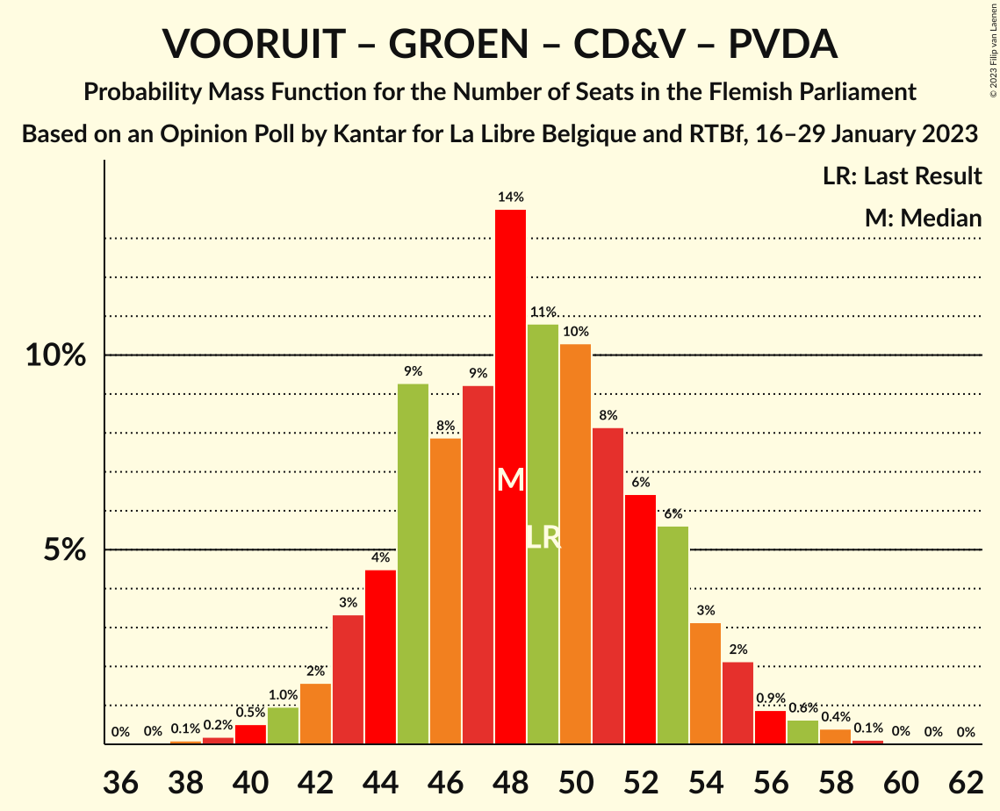

| Number of Seats | Probability | Accumulated | Special Marks |
|:---------------:|:-----------:|:-----------:|:-------------:|
| 38 | 0.1% | 100% |  |
| 39 | 0.2% | 99.9% |  |
| 40 | 0.5% | 99.7% |  |
| 41 | 1.0% | 99.2% |  |
| 42 | 2% | 98% |  |
| 43 | 3% | 97% |  |
| 44 | 4% | 93% |  |
| 45 | 9% | 89% |  |
| 46 | 8% | 80% |  |
| 47 | 9% | 72% |  |
| 48 | 14% | 62% | Median |
| 49 | 11% | 49% | Last Result |
| 50 | 10% | 38% |  |
| 51 | 8% | 28% |  |
| 52 | 6% | 19% |  |
| 53 | 6% | 13% |  |
| 54 | 3% | 7% |  |
| 55 | 2% | 4% |  |
| 56 | 0.9% | 2% |  |
| 57 | 0.6% | 1.2% |  |
| 58 | 0.4% | 0.6% |  |
| 59 | 0.1% | 0.2% |  |
| 60 | 0% | 0.1% |  |
| 61 | 0% | 0% |  |

### Vooruit – Open Vlaamse Liberalen en Democraten – Groen

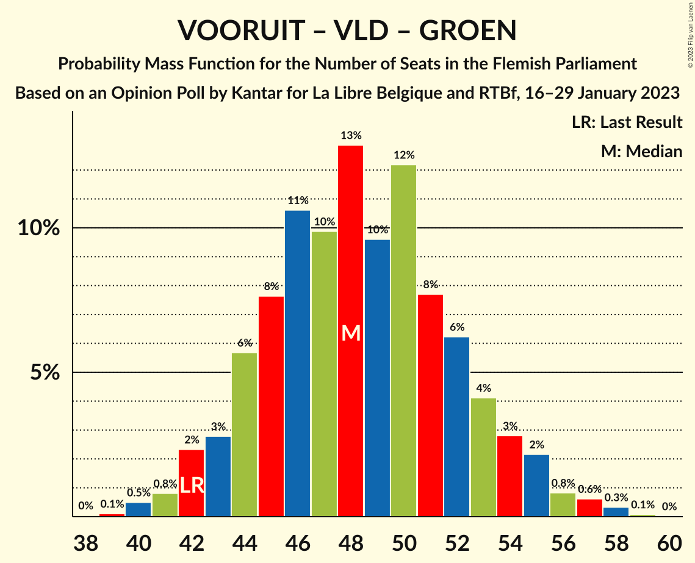

| Number of Seats | Probability | Accumulated | Special Marks |
|:---------------:|:-----------:|:-----------:|:-------------:|
| 38 | 0% | 100% |  |
| 39 | 0.1% | 99.9% |  |
| 40 | 0.5% | 99.8% |  |
| 41 | 0.8% | 99.3% |  |
| 42 | 2% | 98.5% | Last Result |
| 43 | 3% | 96% |  |
| 44 | 6% | 93% |  |
| 45 | 8% | 88% |  |
| 46 | 11% | 80% |  |
| 47 | 10% | 69% |  |
| 48 | 13% | 60% | Median |
| 49 | 10% | 47% |  |
| 50 | 12% | 37% |  |
| 51 | 8% | 25% |  |
| 52 | 6% | 17% |  |
| 53 | 4% | 11% |  |
| 54 | 3% | 7% |  |
| 55 | 2% | 4% |  |
| 56 | 0.8% | 2% |  |
| 57 | 0.6% | 1.1% |  |
| 58 | 0.3% | 0.4% |  |
| 59 | 0.1% | 0.1% |  |
| 60 | 0% | 0% |  |

### Vooruit – Open Vlaamse Liberalen en Democraten – Christen-Democratisch en Vlaams

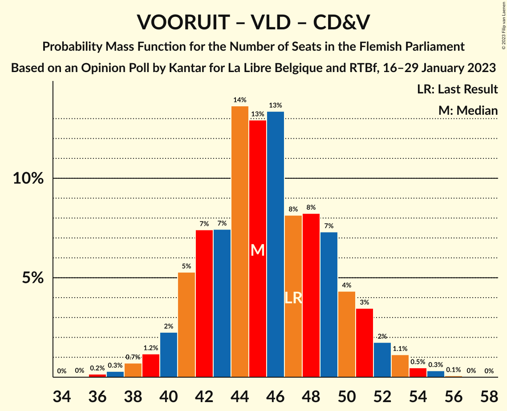

| Number of Seats | Probability | Accumulated | Special Marks |
|:---------------:|:-----------:|:-----------:|:-------------:|
| 35 | 0% | 100% |  |
| 36 | 0.2% | 99.9% |  |
| 37 | 0.3% | 99.8% |  |
| 38 | 0.7% | 99.5% |  |
| 39 | 1.2% | 98.8% |  |
| 40 | 2% | 98% |  |
| 41 | 5% | 95% |  |
| 42 | 7% | 90% |  |
| 43 | 7% | 83% |  |
| 44 | 14% | 75% |  |
| 45 | 13% | 62% | Median |
| 46 | 13% | 49% |  |
| 47 | 8% | 35% | Last Result |
| 48 | 8% | 27% |  |
| 49 | 7% | 19% |  |
| 50 | 4% | 12% |  |
| 51 | 3% | 7% |  |
| 52 | 2% | 4% |  |
| 53 | 1.1% | 2% |  |
| 54 | 0.5% | 0.9% |  |
| 55 | 0.3% | 0.4% |  |
| 56 | 0.1% | 0.1% |  |
| 57 | 0% | 0% |  |

### Vooruit – Groen – Christen-Democratisch en Vlaams

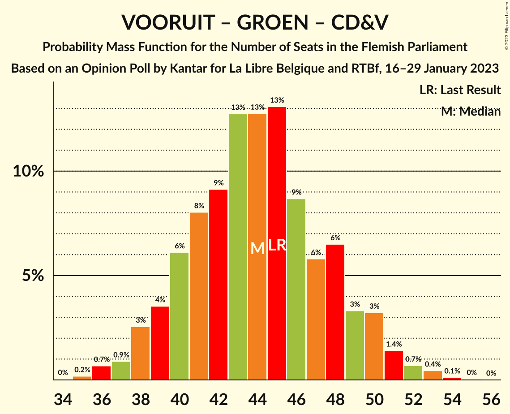

| Number of Seats | Probability | Accumulated | Special Marks |
|:---------------:|:-----------:|:-----------:|:-------------:|
| 34 | 0% | 100% |  |
| 35 | 0.2% | 99.9% |  |
| 36 | 0.7% | 99.7% |  |
| 37 | 0.9% | 99.1% |  |
| 38 | 3% | 98% |  |
| 39 | 4% | 96% |  |
| 40 | 6% | 92% |  |
| 41 | 8% | 86% |  |
| 42 | 9% | 78% |  |
| 43 | 13% | 69% |  |
| 44 | 13% | 56% | Median |
| 45 | 13% | 43% | Last Result |
| 46 | 9% | 30% |  |
| 47 | 6% | 22% |  |
| 48 | 6% | 16% |  |
| 49 | 3% | 9% |  |
| 50 | 3% | 6% |  |
| 51 | 1.4% | 3% |  |
| 52 | 0.7% | 1.3% |  |
| 53 | 0.4% | 0.6% |  |
| 54 | 0.1% | 0.2% |  |
| 55 | 0% | 0.1% |  |
| 56 | 0% | 0% |  |

### Nieuw-Vlaamse Alliantie – Open Vlaamse Liberalen en Democraten

| Number of Seats | Probability | Accumulated | Special Marks |
|:---------------:|:-----------:|:-----------:|:-------------:|
| 34 | 0.1% | 100% |  |
| 35 | 0.3% | 99.8% |  |
| 36 | 0.7% | 99.5% |  |
| 37 | 1.4% | 98.8% |  |
| 38 | 3% | 97% |  |
| 39 | 4% | 95% |  |
| 40 | 8% | 91% |  |
| 41 | 10% | 82% |  |
| 42 | 11% | 72% |  |
| 43 | 14% | 61% | Median |
| 44 | 11% | 47% |  |
| 45 | 11% | 36% |  |
| 46 | 11% | 25% |  |
| 47 | 6% | 14% |  |
| 48 | 4% | 8% |  |
| 49 | 2% | 4% |  |
| 50 | 1.0% | 2% |  |
| 51 | 0.6% | 1.1% | Last Result |
| 52 | 0.2% | 0.4% |  |
| 53 | 0.1% | 0.2% |  |
| 54 | 0% | 0.1% |  |
| 55 | 0% | 0% |  |

### Open Vlaamse Liberalen en Democraten – Groen – Christen-Democratisch en Vlaams

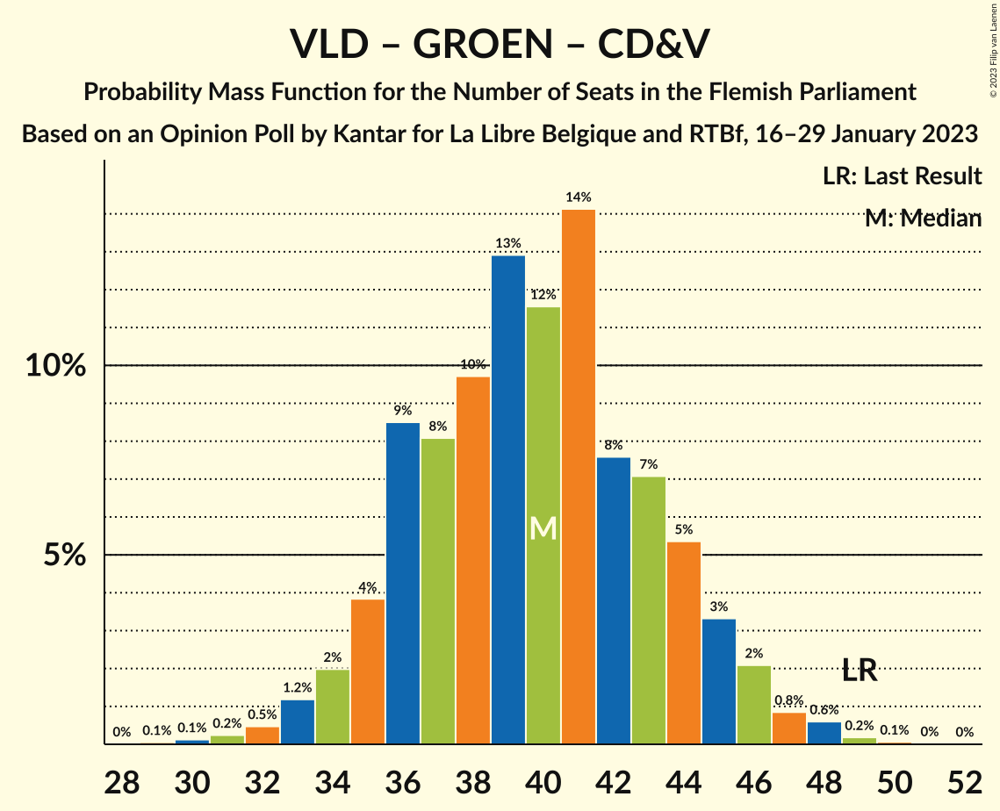

| Number of Seats | Probability | Accumulated | Special Marks |
|:---------------:|:-----------:|:-----------:|:-------------:|
| 29 | 0.1% | 100% |  |
| 30 | 0.1% | 99.9% |  |
| 31 | 0.2% | 99.8% |  |
| 32 | 0.5% | 99.6% |  |
| 33 | 1.2% | 99.1% |  |
| 34 | 2% | 98% |  |
| 35 | 4% | 96% |  |
| 36 | 9% | 92% |  |
| 37 | 8% | 84% |  |
| 38 | 10% | 75% |  |
| 39 | 13% | 66% |  |
| 40 | 12% | 53% | Median |
| 41 | 14% | 41% |  |
| 42 | 8% | 27% |  |
| 43 | 7% | 20% |  |
| 44 | 5% | 13% |  |
| 45 | 3% | 7% |  |
| 46 | 2% | 4% |  |
| 47 | 0.8% | 2% |  |
| 48 | 0.6% | 0.9% |  |
| 49 | 0.2% | 0.3% | Last Result |
| 50 | 0.1% | 0.1% |  |
| 51 | 0% | 0% |  |

### Nieuw-Vlaamse Alliantie – Christen-Democratisch en Vlaams

| Number of Seats | Probability | Accumulated | Special Marks |
|:---------------:|:-----------:|:-----------:|:-------------:|
| 29 | 0.1% | 100% |  |
| 30 | 0.1% | 99.9% |  |
| 31 | 0.2% | 99.8% |  |
| 32 | 0.7% | 99.6% |  |
| 33 | 3% | 98.9% |  |
| 34 | 2% | 96% |  |
| 35 | 4% | 94% |  |
| 36 | 6% | 90% |  |
| 37 | 10% | 83% |  |
| 38 | 17% | 73% |  |
| 39 | 14% | 57% | Median |
| 40 | 13% | 42% |  |
| 41 | 11% | 29% |  |
| 42 | 7% | 18% |  |
| 43 | 5% | 11% |  |
| 44 | 3% | 6% |  |
| 45 | 1.4% | 3% |  |
| 46 | 1.1% | 2% |  |
| 47 | 0.3% | 0.6% |  |
| 48 | 0.1% | 0.2% |  |
| 49 | 0.1% | 0.1% |  |
| 50 | 0% | 0% |  |
| 51 | 0% | 0% |  |
| 52 | 0% | 0% |  |
| 53 | 0% | 0% |  |
| 54 | 0% | 0% | Last Result |

### Vooruit – Open Vlaamse Liberalen en Democraten

| Number of Seats | Probability | Accumulated | Special Marks |
|:---------------:|:-----------:|:-----------:|:-------------:|
| 26 | 0.1% | 100% |  |
| 27 | 0.5% | 99.8% |  |
| 28 | 0.9% | 99.3% | Last Result |
| 29 | 2% | 98% |  |
| 30 | 3% | 97% |  |
| 31 | 9% | 93% |  |
| 32 | 8% | 85% |  |
| 33 | 13% | 77% |  |
| 34 | 15% | 64% | Median |
| 35 | 11% | 48% |  |
| 36 | 11% | 37% |  |
| 37 | 7% | 26% |  |
| 38 | 8% | 19% |  |
| 39 | 4% | 11% |  |
| 40 | 3% | 7% |  |
| 41 | 1.4% | 3% |  |
| 42 | 1.1% | 2% |  |
| 43 | 0.6% | 1.0% |  |
| 44 | 0.4% | 0.4% |  |
| 45 | 0% | 0.1% |  |
| 46 | 0% | 0% |  |

### Vooruit – Christen-Democratisch en Vlaams

| Number of Seats | Probability | Accumulated | Special Marks |
|:---------------:|:-----------:|:-----------:|:-------------:|
| 21 | 0.1% | 100% |  |
| 22 | 0.2% | 99.9% |  |
| 23 | 0.2% | 99.7% |  |
| 24 | 1.1% | 99.5% |  |
| 25 | 3% | 98% |  |
| 26 | 4% | 96% |  |
| 27 | 6% | 91% |  |
| 28 | 8% | 86% |  |
| 29 | 15% | 78% |  |
| 30 | 22% | 63% | Median |
| 31 | 11% | 41% | Last Result |
| 32 | 9% | 30% |  |
| 33 | 6% | 21% |  |
| 34 | 6% | 15% |  |
| 35 | 3% | 9% |  |
| 36 | 4% | 6% |  |
| 37 | 1.1% | 2% |  |
| 38 | 0.6% | 1.1% |  |
| 39 | 0.5% | 0.6% |  |
| 40 | 0% | 0.1% |  |
| 41 | 0% | 0% |  |

### Open Vlaamse Liberalen en Democraten – Christen-Democratisch en Vlaams

| Number of Seats | Probability | Accumulated | Special Marks |
|:---------------:|:-----------:|:-----------:|:-------------:|
| 17 | 0.1% | 100% |  |
| 18 | 0.3% | 99.9% |  |
| 19 | 0.4% | 99.6% |  |
| 20 | 1.1% | 99.2% |  |
| 21 | 2% | 98% |  |
| 22 | 4% | 96% |  |
| 23 | 8% | 92% |  |
| 24 | 11% | 84% |  |
| 25 | 16% | 73% |  |
| 26 | 14% | 57% | Median |
| 27 | 15% | 43% |  |
| 28 | 9% | 28% |  |
| 29 | 7% | 19% |  |
| 30 | 7% | 12% |  |
| 31 | 3% | 5% |  |
| 32 | 1.0% | 2% |  |
| 33 | 0.7% | 0.9% |  |
| 34 | 0.2% | 0.3% |  |
| 35 | 0.1% | 0.1% | Last Result |
| 36 | 0% | 0% |  |

## Technical Information

### Opinion Poll

+ **Polling firm:** Kantar
+ **Commissioner(s):** La Libre Belgique and RTBf
+ **Fieldwork period:** 16–29 January 2023

### Calculations

+ **Sample size:** 514
+ **Simulations done:** 1,048,576
+ **Error estimate:** 1.59%

