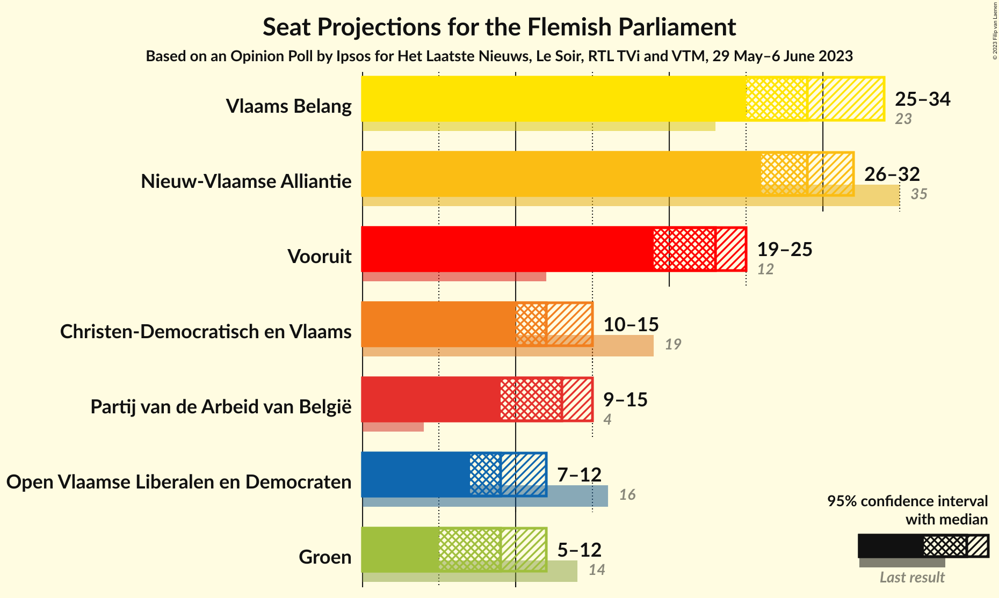
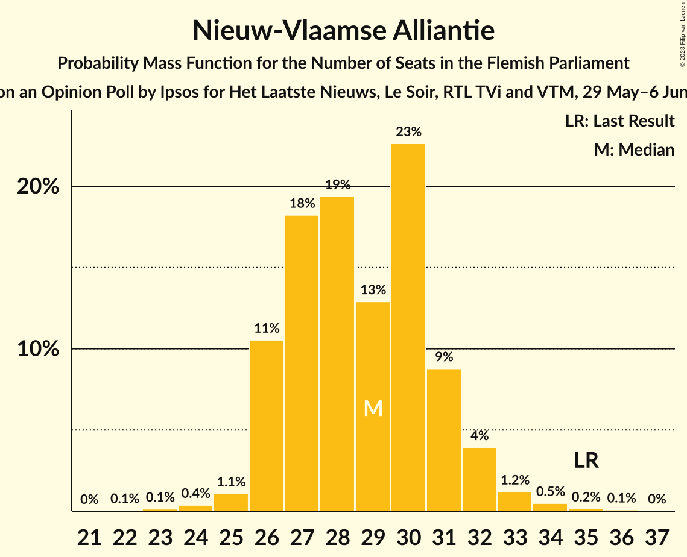
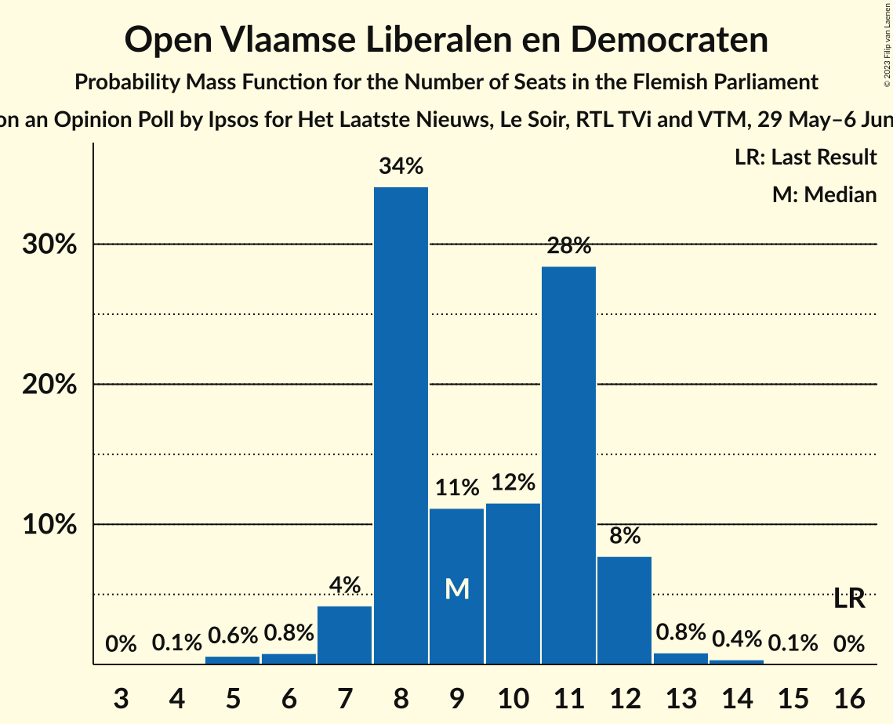
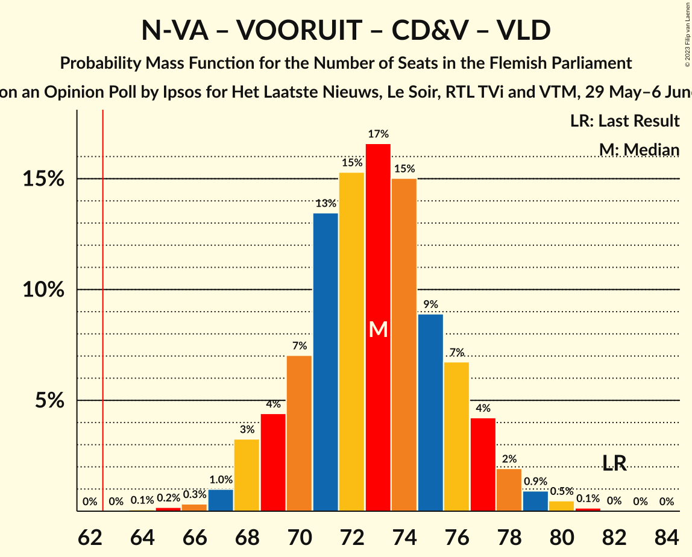
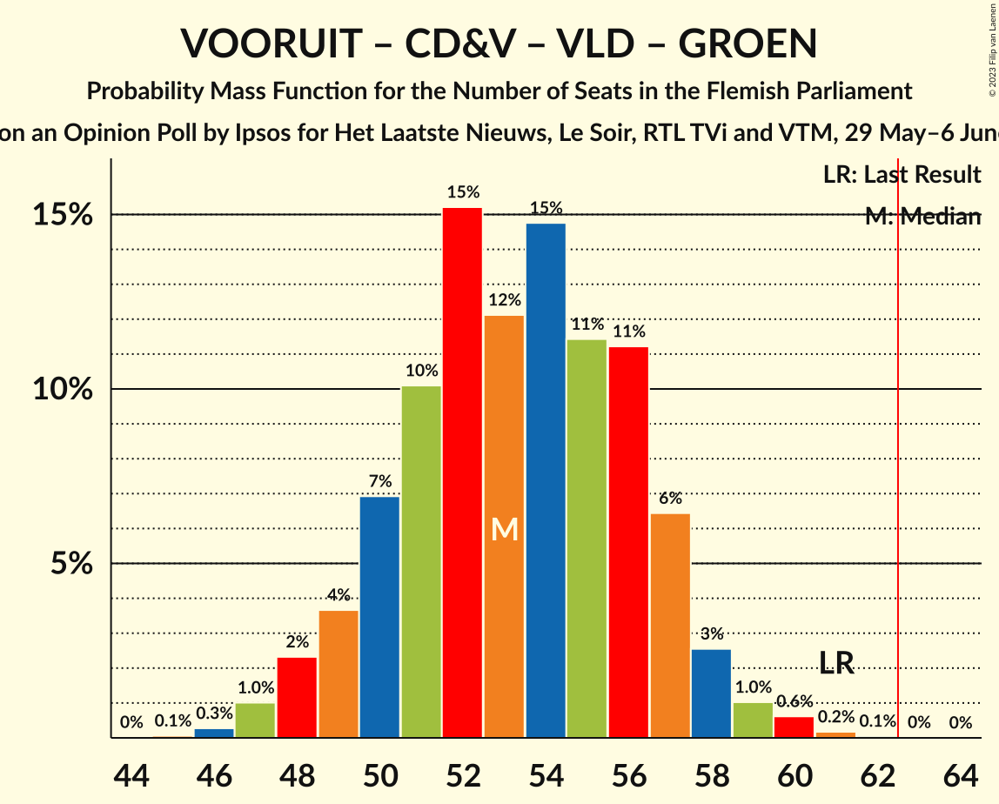
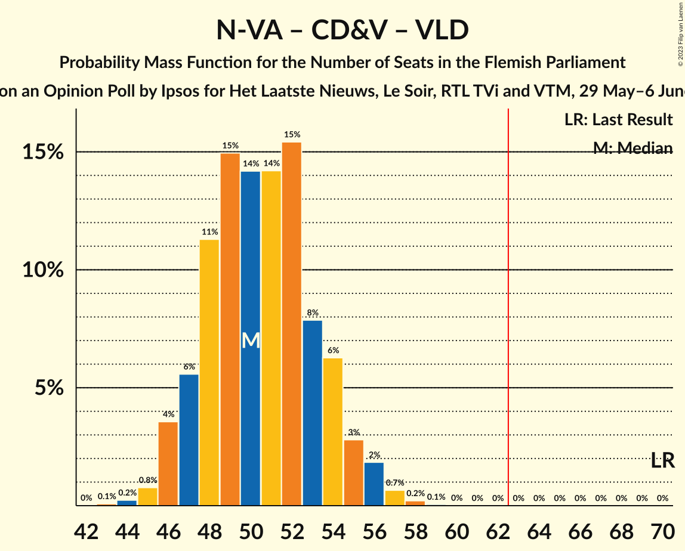
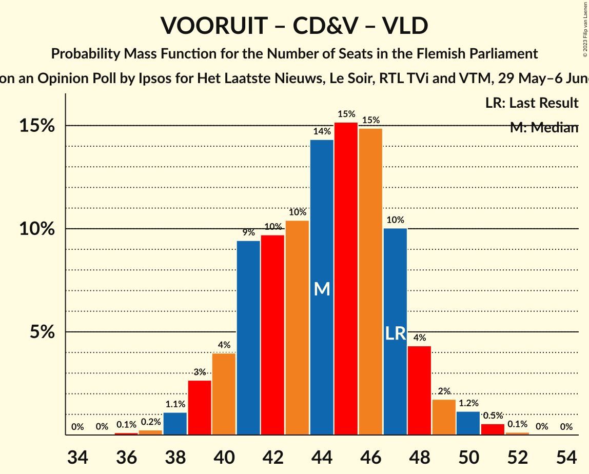
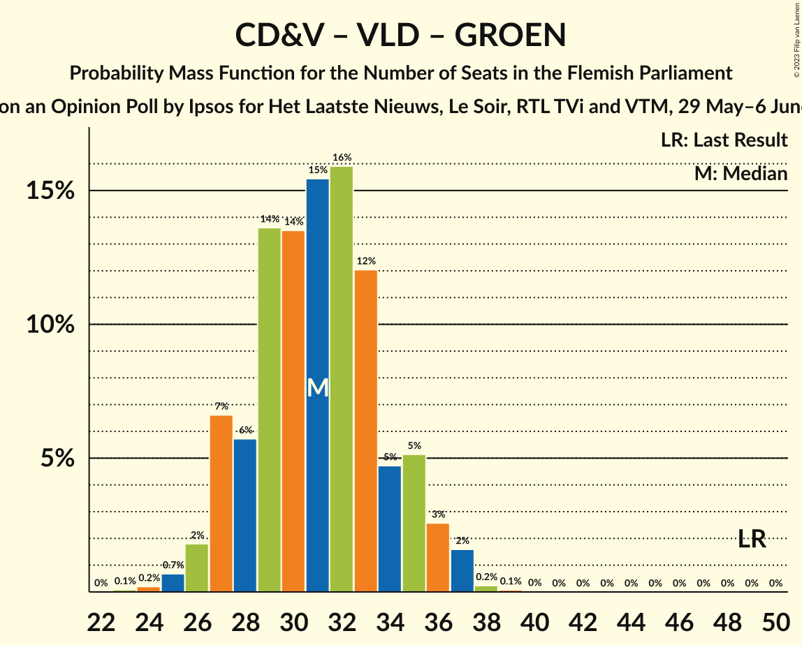

# Opinion Poll by Ipsos for Het Laatste Nieuws, Le Soir, RTL TVi and VTM, 29 May–6 June 2023

<a href="#voting-intentions">Voting Intentions</a> | <a href="#seats">Seats</a> | <a href="#coalitions">Coalitions</a> | <a href="#technical-information">Technical Information</a>

## Voting Intentions

### Confidence Intervals

| Party | Last Result | Poll Result | 80% Confidence Interval | 90% Confidence Interval | 95% Confidence Interval | 99% Confidence Interval |
|:-----:|:-----------:|:-----------:|:-----------------------:|:-----------------------:|:-----------------------:|:-----------------------:|
| Vlaams Belang | 18.5% | 22.7% | 21.1–24.5% |20.6–25.0% |20.2–25.4% |19.4–26.3% |
| Nieuw-Vlaamse Alliantie | 24.8% | 21.8% | 20.2–23.5% |19.7–24.0% |19.3–24.5% |18.6–25.3% |
| Vooruit | 10.1% | 16.8% | 15.4–18.4% |15.0–18.9% |14.6–19.3% |13.9–20.0% |
| Christen-Democratisch en Vlaams | 15.4% | 10.7% | 9.5–12.1% |9.2–12.4% |8.9–12.8% |8.4–13.5% |
| Partij van de Arbeid van België | 5.3% | 10.3% | 9.2–11.6% |8.8–12.0% |8.6–12.3% |8.0–13.0% |
| Open Vlaamse Liberalen en Democraten | 13.1% | 8.3% | 7.3–9.5% |7.0–9.9% |6.7–10.2% |6.3–10.8% |
| Groen | 10.1% | 7.6% | 6.6–8.8% |6.3–9.1% |6.1–9.4% |5.7–10.0% |

*Note:* The poll result column reflects the actual value used in the calculations. Published results may vary slightly, and in addition be rounded to fewer digits.

## Seats

### Confidence Intervals

| Party | Last Result | Median | 80% Confidence Interval | 90% Confidence Interval | 95% Confidence Interval | 99% Confidence Interval |
|:-----:|:-----------:|:------:|:-----------------------:|:-----------------------:|:-----------------------:|:-----------------------:|
| <a href="#vlaams-belang">Vlaams Belang</a> | 23 | 29 | 26–32 |26–33 |25–34 |24–35 |
| <a href="#nieuw-vlaamse-alliantie">Nieuw-Vlaamse Alliantie</a> | 35 | 29 | 26–31 |26–32 |26–32 |24–34 |
| <a href="#vooruit">Vooruit</a> | 12 | 23 | 19–25 |19–25 |19–25 |18–27 |
| <a href="#christen-democratisch-en-vlaams">Christen-Democratisch en Vlaams</a> | 19 | 12 | 11–14 |11–14 |10–15 |9–16 |
| <a href="#partij-van-de-arbeid-van-belgië">Partij van de Arbeid van België</a> | 4 | 13 | 11–14 |10–14 |9–15 |8–17 |
| <a href="#open-vlaamse-liberalen-en-democraten">Open Vlaamse Liberalen en Democraten</a> | 16 | 9 | 8–11 |7–12 |7–12 |5–13 |
| <a href="#groen">Groen</a> | 14 | 9 | 7–11 |7–11 |5–12 |5–14 |

### Vlaams Belang

*For a full overview of the results for this party, see the [Vlaams Belang](party-vlaamsbelang.html) page.*

| Number of Seats | Probability | Accumulated | Special Marks |
|:---------------:|:-----------:|:-----------:|:-------------:|
| 23 | 0.2% | 100% | Last Result |
| 24 | 0.9% | 99.8% |  |
| 25 | 3% | 98.9% |  |
| 26 | 7% | 96% |  |
| 27 | 11% | 89% |  |
| 28 | 13% | 78% |  |
| 29 | 23% | 65% | Median |
| 30 | 15% | 43% |  |
| 31 | 12% | 28% |  |
| 32 | 9% | 16% |  |
| 33 | 4% | 7% |  |
| 34 | 2% | 3% |  |
| 35 | 0.4% | 0.7% |  |
| 36 | 0.3% | 0.3% |  |
| 37 | 0.1% | 0.1% |  |
| 38 | 0% | 0% |  |

### Nieuw-Vlaamse Alliantie

*For a full overview of the results for this party, see the [Nieuw-Vlaamse Alliantie](party-nieuw-vlaamsealliantie.html) page.*

| Number of Seats | Probability | Accumulated | Special Marks |
|:---------------:|:-----------:|:-----------:|:-------------:|
| 22 | 0.1% | 100% |  |
| 23 | 0.1% | 99.9% |  |
| 24 | 0.4% | 99.8% |  |
| 25 | 1.1% | 99.4% |  |
| 26 | 11% | 98% |  |
| 27 | 18% | 88% |  |
| 28 | 19% | 70% |  |
| 29 | 13% | 50% | Median |
| 30 | 23% | 37% |  |
| 31 | 9% | 15% |  |
| 32 | 4% | 6% |  |
| 33 | 1.2% | 2% |  |
| 34 | 0.5% | 0.8% |  |
| 35 | 0.2% | 0.3% | Last Result |
| 36 | 0.1% | 0.1% |  |
| 37 | 0% | 0% |  |

### Vooruit

*For a full overview of the results for this party, see the [Vooruit](party-vooruit.html) page.*

| Number of Seats | Probability | Accumulated | Special Marks |
|:---------------:|:-----------:|:-----------:|:-------------:|
| 12 | 0% | 100% | Last Result |
| 13 | 0% | 100% |  |
| 14 | 0% | 100% |  |
| 15 | 0% | 100% |  |
| 16 | 0.1% | 100% |  |
| 17 | 0.2% | 99.9% |  |
| 18 | 2% | 99.8% |  |
| 19 | 17% | 98% |  |
| 20 | 10% | 81% |  |
| 21 | 7% | 70% |  |
| 22 | 11% | 63% |  |
| 23 | 12% | 52% | Median |
| 24 | 17% | 41% |  |
| 25 | 22% | 24% |  |
| 26 | 1.0% | 2% |  |
| 27 | 0.4% | 0.6% |  |
| 28 | 0.1% | 0.2% |  |
| 29 | 0% | 0.1% |  |
| 30 | 0% | 0% |  |

### Christen-Democratisch en Vlaams

*For a full overview of the results for this party, see the [Christen-Democratisch en Vlaams](party-christen-democratischenvlaams.html) page.*

| Number of Seats | Probability | Accumulated | Special Marks |
|:---------------:|:-----------:|:-----------:|:-------------:|
| 8 | 0% | 100% |  |
| 9 | 0.7% | 99.9% |  |
| 10 | 2% | 99.3% |  |
| 11 | 34% | 97% |  |
| 12 | 23% | 64% | Median |
| 13 | 12% | 41% |  |
| 14 | 25% | 29% |  |
| 15 | 3% | 4% |  |
| 16 | 0.8% | 1.3% |  |
| 17 | 0.5% | 0.5% |  |
| 18 | 0% | 0% |  |
| 19 | 0% | 0% | Last Result |

### Partij van de Arbeid van België

*For a full overview of the results for this party, see the [Partij van de Arbeid van België](party-partijvandearbeidvanbelgië.html) page.*

| Number of Seats | Probability | Accumulated | Special Marks |
|:---------------:|:-----------:|:-----------:|:-------------:|
| 4 | 0% | 100% | Last Result |
| 5 | 0% | 100% |  |
| 6 | 0% | 100% |  |
| 7 | 0.2% | 100% |  |
| 8 | 2% | 99.8% |  |
| 9 | 2% | 98% |  |
| 10 | 3% | 96% |  |
| 11 | 9% | 93% |  |
| 12 | 13% | 84% |  |
| 13 | 43% | 71% | Median |
| 14 | 25% | 29% |  |
| 15 | 2% | 4% |  |
| 16 | 0.8% | 1.3% |  |
| 17 | 0.3% | 0.6% |  |
| 18 | 0.3% | 0.3% |  |
| 19 | 0% | 0% |  |

### Open Vlaamse Liberalen en Democraten

*For a full overview of the results for this party, see the [Open Vlaamse Liberalen en Democraten](party-openvlaamseliberalenendemocraten.html) page.*

| Number of Seats | Probability | Accumulated | Special Marks |
|:---------------:|:-----------:|:-----------:|:-------------:|
| 4 | 0.1% | 100% |  |
| 5 | 0.6% | 99.9% |  |
| 6 | 0.8% | 99.3% |  |
| 7 | 4% | 98% |  |
| 8 | 34% | 94% |  |
| 9 | 11% | 60% | Median |
| 10 | 12% | 49% |  |
| 11 | 28% | 37% |  |
| 12 | 8% | 9% |  |
| 13 | 0.8% | 1.3% |  |
| 14 | 0.4% | 0.4% |  |
| 15 | 0.1% | 0.1% |  |
| 16 | 0% | 0% | Last Result |

### Groen

*For a full overview of the results for this party, see the [Groen](party-groen.html) page.*

| Number of Seats | Probability | Accumulated | Special Marks |
|:---------------:|:-----------:|:-----------:|:-------------:|
| 5 | 3% | 100% |  |
| 6 | 2% | 97% |  |
| 7 | 22% | 95% |  |
| 8 | 9% | 73% |  |
| 9 | 14% | 64% | Median |
| 10 | 19% | 50% |  |
| 11 | 27% | 30% |  |
| 12 | 1.1% | 3% |  |
| 13 | 1.4% | 2% |  |
| 14 | 0.7% | 0.7% | Last Result |
| 15 | 0% | 0% |  |

## Coalitions

### Confidence Intervals

| Coalition | Last Result | Median | Majority? | 80% Confidence Interval | 90% Confidence Interval | 95% Confidence Interval | 99% Confidence Interval |
|:---------:|:-----------:|:------:|:---------:|:-----------------------:|:-----------------------:|:-----------------------:|:-----------------------:|
| Nieuw-Vlaamse Alliantie – Vooruit – Christen-Democratisch en Vlaams – Open Vlaamse Liberalen en Democraten | 82 | 73 | 100% | 70–76 | 69–77 | 68–78 | 66–80 |
| Vlaams Belang – Nieuw-Vlaamse Alliantie – Christen-Democratisch en Vlaams | 77 | 70 | 99.9% | 67–74 | 66–75 | 66–76 | 64–77 |
| Nieuw-Vlaamse Alliantie – Vooruit – Christen-Democratisch en Vlaams | 66 | 63 | 66% | 60–67 | 59–67 | 58–68 | 57–70 |
| Nieuw-Vlaamse Alliantie – Vooruit – Open Vlaamse Liberalen en Democraten | 63 | 60 | 22% | 57–64 | 56–65 | 55–66 | 54–67 |
| Vlaams Belang – Nieuw-Vlaamse Alliantie | 58 | 58 | 5% | 55–61 | 54–62 | 53–63 | 52–65 |
| Vooruit – Christen-Democratisch en Vlaams – Partij van de Arbeid van België – Groen | 49 | 57 | 0.6% | 53–60 | 52–61 | 51–61 | 50–63 |
| Vooruit – Christen-Democratisch en Vlaams – Open Vlaamse Liberalen en Democraten – Groen | 61 | 53 | 0% | 50–57 | 49–57 | 48–58 | 47–60 |
| Nieuw-Vlaamse Alliantie – Christen-Democratisch en Vlaams – Open Vlaamse Liberalen en Democraten | 70 | 50 | 0% | 47–54 | 47–55 | 46–56 | 45–57 |
| Vooruit – Christen-Democratisch en Vlaams – Open Vlaamse Liberalen en Democraten | 47 | 44 | 0% | 41–47 | 40–48 | 39–49 | 38–51 |
| Vooruit – Christen-Democratisch en Vlaams – Groen | 45 | 44 | 0% | 40–47 | 40–48 | 38–49 | 37–50 |
| Vooruit – Open Vlaamse Liberalen en Democraten – Groen | 42 | 41 | 0% | 37–44 | 37–45 | 36–46 | 35–47 |
| Nieuw-Vlaamse Alliantie – Christen-Democratisch en Vlaams | 54 | 41 | 0% | 38–44 | 38–45 | 37–45 | 36–47 |
| Nieuw-Vlaamse Alliantie – Open Vlaamse Liberalen en Democraten | 51 | 38 | 0% | 35–41 | 35–42 | 34–43 | 33–44 |
| Vooruit – Christen-Democratisch en Vlaams | 31 | 35 | 0% | 31–38 | 30–38 | 30–39 | 29–40 |
| Vooruit – Open Vlaamse Liberalen en Democraten | 28 | 32 | 0% | 28–35 | 27–36 | 27–36 | 26–37 |
| Christen-Democratisch en Vlaams – Open Vlaamse Liberalen en Democraten – Groen | 49 | 31 | 0% | 28–34 | 27–35 | 26–36 | 25–37 |
| Christen-Democratisch en Vlaams – Open Vlaamse Liberalen en Democraten | 35 | 22 | 0% | 19–25 | 19–25 | 18–26 | 17–27 |

### Nieuw-Vlaamse Alliantie – Vooruit – Christen-Democratisch en Vlaams – Open Vlaamse Liberalen en Democraten

| Number of Seats | Probability | Accumulated | Special Marks |
|:---------------:|:-----------:|:-----------:|:-------------:|
| 64 | 0.1% | 100% |  |
| 65 | 0.2% | 99.9% |  |
| 66 | 0.3% | 99.7% |  |
| 67 | 1.0% | 99.4% |  |
| 68 | 3% | 98% |  |
| 69 | 4% | 95% |  |
| 70 | 7% | 91% |  |
| 71 | 13% | 84% |  |
| 72 | 15% | 70% |  |
| 73 | 17% | 55% | Median |
| 74 | 15% | 38% |  |
| 75 | 9% | 23% |  |
| 76 | 7% | 14% |  |
| 77 | 4% | 8% |  |
| 78 | 2% | 4% |  |
| 79 | 0.9% | 2% |  |
| 80 | 0.5% | 0.7% |  |
| 81 | 0.1% | 0.2% |  |
| 82 | 0% | 0.1% | Last Result |
| 83 | 0% | 0% |  |

### Vlaams Belang – Nieuw-Vlaamse Alliantie – Christen-Democratisch en Vlaams

| Number of Seats | Probability | Accumulated | Special Marks |
|:---------------:|:-----------:|:-----------:|:-------------:|
| 62 | 0.1% | 100% |  |
| 63 | 0.2% | 99.9% | Majority |
| 64 | 0.5% | 99.7% |  |
| 65 | 2% | 99.2% |  |
| 66 | 4% | 98% |  |
| 67 | 8% | 94% |  |
| 68 | 13% | 85% |  |
| 69 | 13% | 72% |  |
| 70 | 13% | 58% | Median |
| 71 | 14% | 45% |  |
| 72 | 9% | 31% |  |
| 73 | 10% | 22% |  |
| 74 | 6% | 12% |  |
| 75 | 4% | 7% |  |
| 76 | 2% | 3% |  |
| 77 | 0.5% | 0.8% | Last Result |
| 78 | 0.2% | 0.3% |  |
| 79 | 0.1% | 0.1% |  |
| 80 | 0% | 0% |  |

### Nieuw-Vlaamse Alliantie – Vooruit – Christen-Democratisch en Vlaams

| Number of Seats | Probability | Accumulated | Special Marks |
|:---------------:|:-----------:|:-----------:|:-------------:|
| 55 | 0% | 100% |  |
| 56 | 0.1% | 99.9% |  |
| 57 | 1.3% | 99.8% |  |
| 58 | 2% | 98.5% |  |
| 59 | 4% | 96% |  |
| 60 | 6% | 92% |  |
| 61 | 10% | 86% |  |
| 62 | 10% | 76% |  |
| 63 | 18% | 66% | Majority |
| 64 | 15% | 48% | Median |
| 65 | 15% | 33% |  |
| 66 | 8% | 19% | Last Result |
| 67 | 6% | 10% |  |
| 68 | 2% | 4% |  |
| 69 | 2% | 2% |  |
| 70 | 0.6% | 0.7% |  |
| 71 | 0.1% | 0.2% |  |
| 72 | 0% | 0% |  |

### Nieuw-Vlaamse Alliantie – Vooruit – Open Vlaamse Liberalen en Democraten

| Number of Seats | Probability | Accumulated | Special Marks |
|:---------------:|:-----------:|:-----------:|:-------------:|
| 52 | 0.1% | 100% |  |
| 53 | 0.2% | 99.9% |  |
| 54 | 0.7% | 99.7% |  |
| 55 | 2% | 99.0% |  |
| 56 | 4% | 97% |  |
| 57 | 7% | 94% |  |
| 58 | 9% | 87% |  |
| 59 | 12% | 78% |  |
| 60 | 16% | 65% |  |
| 61 | 18% | 50% | Median |
| 62 | 10% | 32% |  |
| 63 | 9% | 22% | Last Result, Majority |
| 64 | 6% | 13% |  |
| 65 | 4% | 7% |  |
| 66 | 2% | 3% |  |
| 67 | 0.7% | 1.2% |  |
| 68 | 0.4% | 0.5% |  |
| 69 | 0.1% | 0.1% |  |
| 70 | 0% | 0% |  |

### Vlaams Belang – Nieuw-Vlaamse Alliantie

| Number of Seats | Probability | Accumulated | Special Marks |
|:---------------:|:-----------:|:-----------:|:-------------:|
| 50 | 0.1% | 100% |  |
| 51 | 0.3% | 99.9% |  |
| 52 | 0.6% | 99.6% |  |
| 53 | 2% | 99.0% |  |
| 54 | 5% | 97% |  |
| 55 | 14% | 93% |  |
| 56 | 12% | 79% |  |
| 57 | 14% | 67% |  |
| 58 | 10% | 53% | Last Result, Median |
| 59 | 15% | 43% |  |
| 60 | 12% | 28% |  |
| 61 | 7% | 16% |  |
| 62 | 4% | 9% |  |
| 63 | 3% | 5% | Majority |
| 64 | 1.3% | 2% |  |
| 65 | 0.4% | 0.5% |  |
| 66 | 0.1% | 0.1% |  |
| 67 | 0% | 0% |  |

### Vooruit – Christen-Democratisch en Vlaams – Partij van de Arbeid van België – Groen

| Number of Seats | Probability | Accumulated | Special Marks |
|:---------------:|:-----------:|:-----------:|:-------------:|
| 48 | 0.1% | 100% |  |
| 49 | 0.3% | 99.8% | Last Result |
| 50 | 0.8% | 99.5% |  |
| 51 | 2% | 98.7% |  |
| 52 | 4% | 97% |  |
| 53 | 8% | 93% |  |
| 54 | 8% | 85% |  |
| 55 | 10% | 77% |  |
| 56 | 13% | 67% |  |
| 57 | 15% | 54% | Median |
| 58 | 15% | 39% |  |
| 59 | 10% | 24% |  |
| 60 | 6% | 15% |  |
| 61 | 6% | 8% |  |
| 62 | 1.5% | 2% |  |
| 63 | 0.4% | 0.6% | Majority |
| 64 | 0.2% | 0.2% |  |
| 65 | 0% | 0.1% |  |
| 66 | 0% | 0% |  |

### Vooruit – Christen-Democratisch en Vlaams – Open Vlaamse Liberalen en Democraten – Groen

| Number of Seats | Probability | Accumulated | Special Marks |
|:---------------:|:-----------:|:-----------:|:-------------:|
| 45 | 0.1% | 100% |  |
| 46 | 0.3% | 99.9% |  |
| 47 | 1.0% | 99.6% |  |
| 48 | 2% | 98.6% |  |
| 49 | 4% | 96% |  |
| 50 | 7% | 93% |  |
| 51 | 10% | 86% |  |
| 52 | 15% | 76% |  |
| 53 | 12% | 60% | Median |
| 54 | 15% | 48% |  |
| 55 | 11% | 34% |  |
| 56 | 11% | 22% |  |
| 57 | 6% | 11% |  |
| 58 | 3% | 4% |  |
| 59 | 1.0% | 2% |  |
| 60 | 0.6% | 0.9% |  |
| 61 | 0.2% | 0.2% | Last Result |
| 62 | 0.1% | 0.1% |  |
| 63 | 0% | 0% | Majority |

### Nieuw-Vlaamse Alliantie – Christen-Democratisch en Vlaams – Open Vlaamse Liberalen en Democraten

| Number of Seats | Probability | Accumulated | Special Marks |
|:---------------:|:-----------:|:-----------:|:-------------:|
| 43 | 0.1% | 100% |  |
| 44 | 0.2% | 99.9% |  |
| 45 | 0.8% | 99.7% |  |
| 46 | 4% | 98.9% |  |
| 47 | 6% | 95% |  |
| 48 | 11% | 90% |  |
| 49 | 15% | 78% |  |
| 50 | 14% | 64% | Median |
| 51 | 14% | 49% |  |
| 52 | 15% | 35% |  |
| 53 | 8% | 20% |  |
| 54 | 6% | 12% |  |
| 55 | 3% | 6% |  |
| 56 | 2% | 3% |  |
| 57 | 0.7% | 0.9% |  |
| 58 | 0.2% | 0.3% |  |
| 59 | 0.1% | 0.1% |  |
| 60 | 0% | 0% |  |
| 61 | 0% | 0% |  |
| 62 | 0% | 0% |  |
| 63 | 0% | 0% | Majority |
| 64 | 0% | 0% |  |
| 65 | 0% | 0% |  |
| 66 | 0% | 0% |  |
| 67 | 0% | 0% |  |
| 68 | 0% | 0% |  |
| 69 | 0% | 0% |  |
| 70 | 0% | 0% | Last Result |

### Vooruit – Christen-Democratisch en Vlaams – Open Vlaamse Liberalen en Democraten

| Number of Seats | Probability | Accumulated | Special Marks |
|:---------------:|:-----------:|:-----------:|:-------------:|
| 36 | 0.1% | 100% |  |
| 37 | 0.2% | 99.9% |  |
| 38 | 1.1% | 99.6% |  |
| 39 | 3% | 98.5% |  |
| 40 | 4% | 96% |  |
| 41 | 9% | 92% |  |
| 42 | 10% | 82% |  |
| 43 | 10% | 73% |  |
| 44 | 14% | 62% | Median |
| 45 | 15% | 48% |  |
| 46 | 15% | 33% |  |
| 47 | 10% | 18% | Last Result |
| 48 | 4% | 8% |  |
| 49 | 2% | 4% |  |
| 50 | 1.2% | 2% |  |
| 51 | 0.5% | 0.7% |  |
| 52 | 0.1% | 0.2% |  |
| 53 | 0% | 0% |  |

### Vooruit – Christen-Democratisch en Vlaams – Groen

| Number of Seats | Probability | Accumulated | Special Marks |
|:---------------:|:-----------:|:-----------:|:-------------:|
| 36 | 0.2% | 100% |  |
| 37 | 0.9% | 99.8% |  |
| 38 | 1.4% | 98.9% |  |
| 39 | 2% | 97% |  |
| 40 | 6% | 95% |  |
| 41 | 9% | 89% |  |
| 42 | 13% | 81% |  |
| 43 | 11% | 67% |  |
| 44 | 18% | 56% | Median |
| 45 | 12% | 39% | Last Result |
| 46 | 11% | 27% |  |
| 47 | 7% | 17% |  |
| 48 | 6% | 10% |  |
| 49 | 2% | 3% |  |
| 50 | 0.9% | 1.2% |  |
| 51 | 0.2% | 0.3% |  |
| 52 | 0.1% | 0.1% |  |
| 53 | 0% | 0% |  |

### Vooruit – Open Vlaamse Liberalen en Democraten – Groen

| Number of Seats | Probability | Accumulated | Special Marks |
|:---------------:|:-----------:|:-----------:|:-------------:|
| 33 | 0.1% | 100% |  |
| 34 | 0.3% | 99.8% |  |
| 35 | 1.2% | 99.5% |  |
| 36 | 3% | 98% |  |
| 37 | 6% | 95% |  |
| 38 | 10% | 90% |  |
| 39 | 8% | 80% |  |
| 40 | 15% | 72% |  |
| 41 | 13% | 57% | Median |
| 42 | 16% | 45% | Last Result |
| 43 | 12% | 29% |  |
| 44 | 10% | 17% |  |
| 45 | 4% | 7% |  |
| 46 | 2% | 3% |  |
| 47 | 0.8% | 1.3% |  |
| 48 | 0.4% | 0.5% |  |
| 49 | 0.1% | 0.1% |  |
| 50 | 0% | 0% |  |

### Nieuw-Vlaamse Alliantie – Christen-Democratisch en Vlaams

| Number of Seats | Probability | Accumulated | Special Marks |
|:---------------:|:-----------:|:-----------:|:-------------:|
| 34 | 0.1% | 100% |  |
| 35 | 0.2% | 99.9% |  |
| 36 | 0.4% | 99.7% |  |
| 37 | 2% | 99.3% |  |
| 38 | 10% | 97% |  |
| 39 | 12% | 87% |  |
| 40 | 17% | 75% |  |
| 41 | 18% | 58% | Median |
| 42 | 16% | 40% |  |
| 43 | 10% | 24% |  |
| 44 | 8% | 14% |  |
| 45 | 3% | 5% |  |
| 46 | 1.3% | 2% |  |
| 47 | 0.6% | 0.8% |  |
| 48 | 0.1% | 0.2% |  |
| 49 | 0.1% | 0.1% |  |
| 50 | 0% | 0% |  |
| 51 | 0% | 0% |  |
| 52 | 0% | 0% |  |
| 53 | 0% | 0% |  |
| 54 | 0% | 0% | Last Result |

### Nieuw-Vlaamse Alliantie – Open Vlaamse Liberalen en Democraten

| Number of Seats | Probability | Accumulated | Special Marks |
|:---------------:|:-----------:|:-----------:|:-------------:|
| 31 | 0.1% | 100% |  |
| 32 | 0.2% | 99.9% |  |
| 33 | 0.9% | 99.7% |  |
| 34 | 4% | 98.7% |  |
| 35 | 9% | 95% |  |
| 36 | 11% | 86% |  |
| 37 | 15% | 75% |  |
| 38 | 18% | 60% | Median |
| 39 | 14% | 43% |  |
| 40 | 12% | 29% |  |
| 41 | 9% | 17% |  |
| 42 | 5% | 8% |  |
| 43 | 2% | 3% |  |
| 44 | 0.6% | 1.0% |  |
| 45 | 0.3% | 0.4% |  |
| 46 | 0.1% | 0.1% |  |
| 47 | 0% | 0.1% |  |
| 48 | 0% | 0% |  |
| 49 | 0% | 0% |  |
| 50 | 0% | 0% |  |
| 51 | 0% | 0% | Last Result |

### Vooruit – Christen-Democratisch en Vlaams

| Number of Seats | Probability | Accumulated | Special Marks |
|:---------------:|:-----------:|:-----------:|:-------------:|
| 28 | 0.1% | 100% |  |
| 29 | 0.7% | 99.9% |  |
| 30 | 5% | 99.2% |  |
| 31 | 9% | 94% | Last Result |
| 32 | 6% | 85% |  |
| 33 | 11% | 78% |  |
| 34 | 9% | 67% |  |
| 35 | 16% | 58% | Median |
| 36 | 18% | 42% |  |
| 37 | 13% | 24% |  |
| 38 | 7% | 12% |  |
| 39 | 4% | 5% |  |
| 40 | 0.6% | 0.9% |  |
| 41 | 0.2% | 0.3% |  |
| 42 | 0.1% | 0.1% |  |
| 43 | 0% | 0% |  |

### Vooruit – Open Vlaamse Liberalen en Democraten

| Number of Seats | Probability | Accumulated | Special Marks |
|:---------------:|:-----------:|:-----------:|:-------------:|
| 25 | 0.2% | 100% |  |
| 26 | 1.3% | 99.7% |  |
| 27 | 5% | 98% |  |
| 28 | 4% | 93% | Last Result |
| 29 | 6% | 89% |  |
| 30 | 11% | 82% |  |
| 31 | 15% | 71% |  |
| 32 | 15% | 56% | Median |
| 33 | 19% | 41% |  |
| 34 | 7% | 23% |  |
| 35 | 7% | 16% |  |
| 36 | 6% | 8% |  |
| 37 | 2% | 2% |  |
| 38 | 0.3% | 0.5% |  |
| 39 | 0.1% | 0.1% |  |
| 40 | 0% | 0% |  |

### Christen-Democratisch en Vlaams – Open Vlaamse Liberalen en Democraten – Groen

| Number of Seats | Probability | Accumulated | Special Marks |
|:---------------:|:-----------:|:-----------:|:-------------:|
| 23 | 0.1% | 100% |  |
| 24 | 0.2% | 99.9% |  |
| 25 | 0.7% | 99.7% |  |
| 26 | 2% | 99.0% |  |
| 27 | 7% | 97% |  |
| 28 | 6% | 91% |  |
| 29 | 14% | 85% |  |
| 30 | 14% | 71% | Median |
| 31 | 15% | 58% |  |
| 32 | 16% | 42% |  |
| 33 | 12% | 26% |  |
| 34 | 5% | 14% |  |
| 35 | 5% | 10% |  |
| 36 | 3% | 5% |  |
| 37 | 2% | 2% |  |
| 38 | 0.2% | 0.3% |  |
| 39 | 0.1% | 0.1% |  |
| 40 | 0% | 0% |  |
| 41 | 0% | 0% |  |
| 42 | 0% | 0% |  |
| 43 | 0% | 0% |  |
| 44 | 0% | 0% |  |
| 45 | 0% | 0% |  |
| 46 | 0% | 0% |  |
| 47 | 0% | 0% |  |
| 48 | 0% | 0% |  |
| 49 | 0% | 0% | Last Result |

### Christen-Democratisch en Vlaams – Open Vlaamse Liberalen en Democraten

| Number of Seats | Probability | Accumulated | Special Marks |
|:---------------:|:-----------:|:-----------:|:-------------:|
| 15 | 0.1% | 100% |  |
| 16 | 0.3% | 99.9% |  |
| 17 | 0.7% | 99.6% |  |
| 18 | 2% | 98.9% |  |
| 19 | 9% | 97% |  |
| 20 | 15% | 88% |  |
| 21 | 13% | 73% | Median |
| 22 | 30% | 59% |  |
| 23 | 8% | 30% |  |
| 24 | 9% | 21% |  |
| 25 | 7% | 12% |  |
| 26 | 4% | 5% |  |
| 27 | 0.8% | 1.0% |  |
| 28 | 0.2% | 0.3% |  |
| 29 | 0% | 0.1% |  |
| 30 | 0% | 0% |  |
| 31 | 0% | 0% |  |
| 32 | 0% | 0% |  |
| 33 | 0% | 0% |  |
| 34 | 0% | 0% |  |
| 35 | 0% | 0% | Last Result |

## Technical Information

### Opinion Poll

+ **Polling firm:** Ipsos
+ **Commissioner(s):** Het Laatste Nieuws, Le Soir, RTL TVi and VTM
+ **Fieldwork period:** 29 May–6 June 2023

### Calculations

+ **Sample size:** 1000
+ **Simulations done:** 1,048,576
+ **Error estimate:** 0.85%

