# Opinion Poll by Ipsos for Het Laatste Nieuws, Le Soir, RTL TVi and VTM, 18–25 September 2023

<a href="#voting-intentions">Voting Intentions</a> | <a href="#seats">Seats</a> | <a href="#coalitions">Coalitions</a> | <a href="#technical-information">Technical Information</a>

## Voting Intentions

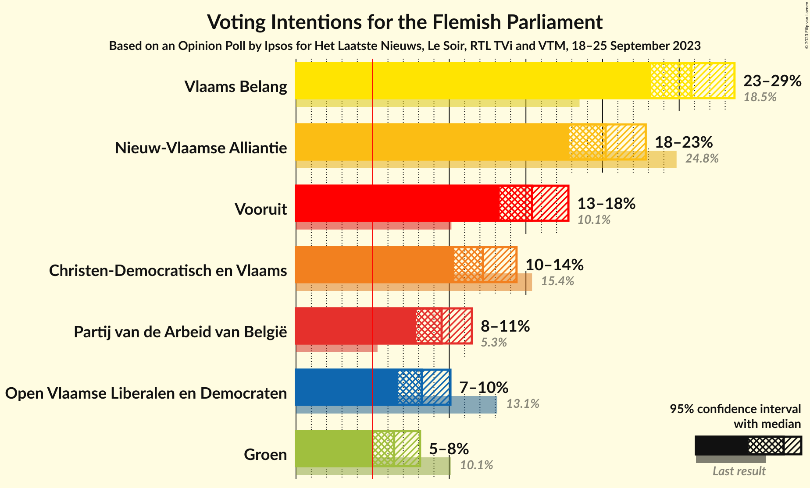

### Confidence Intervals

| Party | Last Result | Poll Result | 80% Confidence Interval | 90% Confidence Interval | 95% Confidence Interval | 99% Confidence Interval |
|:-----:|:-----------:|:-----------:|:-----------------------:|:-----------------------:|:-----------------------:|:-----------------------:|
| Vlaams Belang | 18.5% | 25.8% | 24.1–27.6% |23.6–28.2% |23.2–28.6% |22.4–29.5% |
| Nieuw-Vlaamse Alliantie | 24.8% | 20.2% | 18.6–21.9% |18.2–22.4% |17.8–22.8% |17.1–23.6% |
| Vooruit | 10.1% | 15.4% | 14.0–16.9% |13.6–17.4% |13.3–17.8% |12.7–18.5% |
| Christen-Democratisch en Vlaams | 15.4% | 12.2% | 11.0–13.6% |10.6–14.0% |10.3–14.4% |9.7–15.1% |
| Partij van de Arbeid van België | 5.3% | 9.5% | 8.4–10.8% |8.1–11.2% |7.8–11.5% |7.3–12.1% |
| Open Vlaamse Liberalen en Democraten | 13.1% | 8.2% | 7.2–9.4% |6.9–9.8% |6.6–10.1% |6.2–10.7% |
| Groen | 10.1% | 6.4% | 5.5–7.5% |5.3–7.8% |5.0–8.1% |4.6–8.7% |

*Note:* The poll result column reflects the actual value used in the calculations. Published results may vary slightly, and in addition be rounded to fewer digits.

## Seats

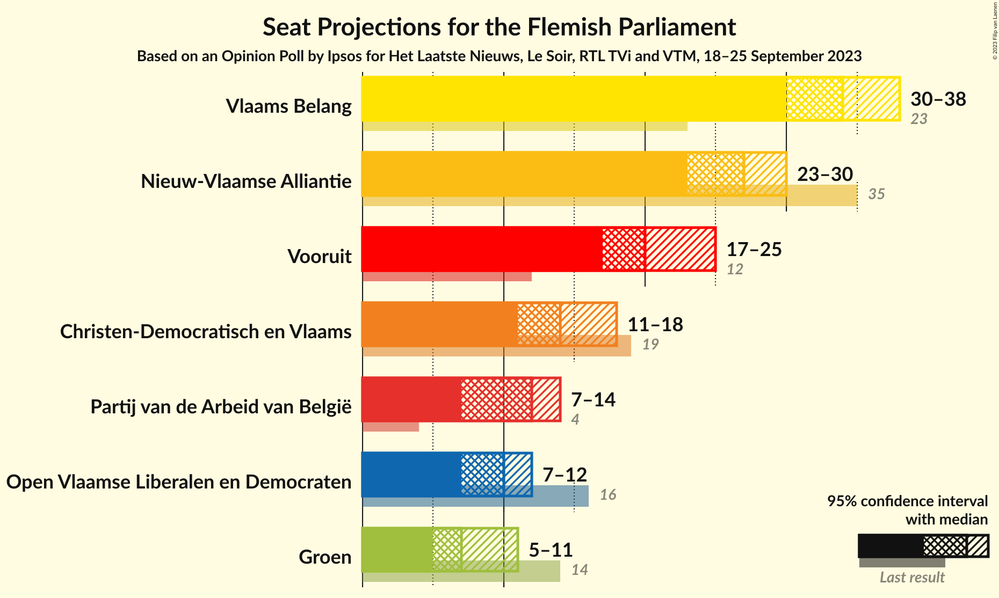

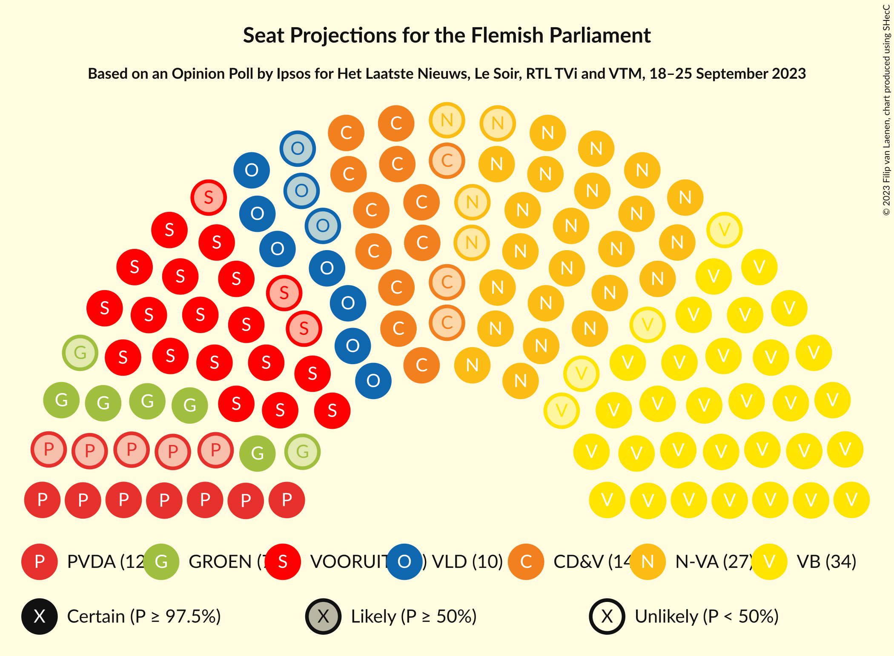

### Confidence Intervals

| Party | Last Result | Median | 80% Confidence Interval | 90% Confidence Interval | 95% Confidence Interval | 99% Confidence Interval |
|:-----:|:-----------:|:------:|:-----------------------:|:-----------------------:|:-----------------------:|:-----------------------:|
| <a href="#vlaams-belang">Vlaams Belang</a> | 23 | 34 | 32–37 |31–38 |30–38 |29–40 |
| <a href="#nieuw-vlaamse-alliantie">Nieuw-Vlaamse Alliantie</a> | 35 | 27 | 25–30 |24–30 |23–30 |22–32 |
| <a href="#vooruit">Vooruit</a> | 12 | 20 | 18–23 |17–24 |17–25 |16–25 |
| <a href="#christen-democratisch-en-vlaams">Christen-Democratisch en Vlaams</a> | 19 | 14 | 12–17 |12–17 |11–18 |11–19 |
| <a href="#partij-van-de-arbeid-van-belgië">Partij van de Arbeid van België</a> | 4 | 12 | 9–13 |8–14 |7–14 |7–15 |
| <a href="#open-vlaamse-liberalen-en-democraten">Open Vlaamse Liberalen en Democraten</a> | 16 | 10 | 8–12 |7–12 |7–12 |6–13 |
| <a href="#groen">Groen</a> | 14 | 7 | 5–9 |5–10 |5–11 |3–11 |

### Vlaams Belang

*For a full overview of the results for this party, see the [Vlaams Belang](party-vlaamsbelang.html) page.*

| Number of Seats | Probability | Accumulated | Special Marks |
|:---------------:|:-----------:|:-----------:|:-------------:|
| 23 | 0% | 100% | Last Result |
| 24 | 0% | 100% |  |
| 25 | 0% | 100% |  |
| 26 | 0% | 100% |  |
| 27 | 0% | 100% |  |
| 28 | 0.2% | 99.9% |  |
| 29 | 0.7% | 99.7% |  |
| 30 | 3% | 99.0% |  |
| 31 | 5% | 96% |  |
| 32 | 10% | 91% |  |
| 33 | 16% | 81% |  |
| 34 | 16% | 65% | Median |
| 35 | 14% | 50% |  |
| 36 | 19% | 36% |  |
| 37 | 12% | 17% |  |
| 38 | 3% | 5% |  |
| 39 | 1.1% | 2% |  |
| 40 | 0.4% | 0.6% |  |
| 41 | 0.2% | 0.3% |  |
| 42 | 0.1% | 0.1% |  |
| 43 | 0% | 0% |  |

### Nieuw-Vlaamse Alliantie

*For a full overview of the results for this party, see the [Nieuw-Vlaamse Alliantie](party-nieuw-vlaamsealliantie.html) page.*

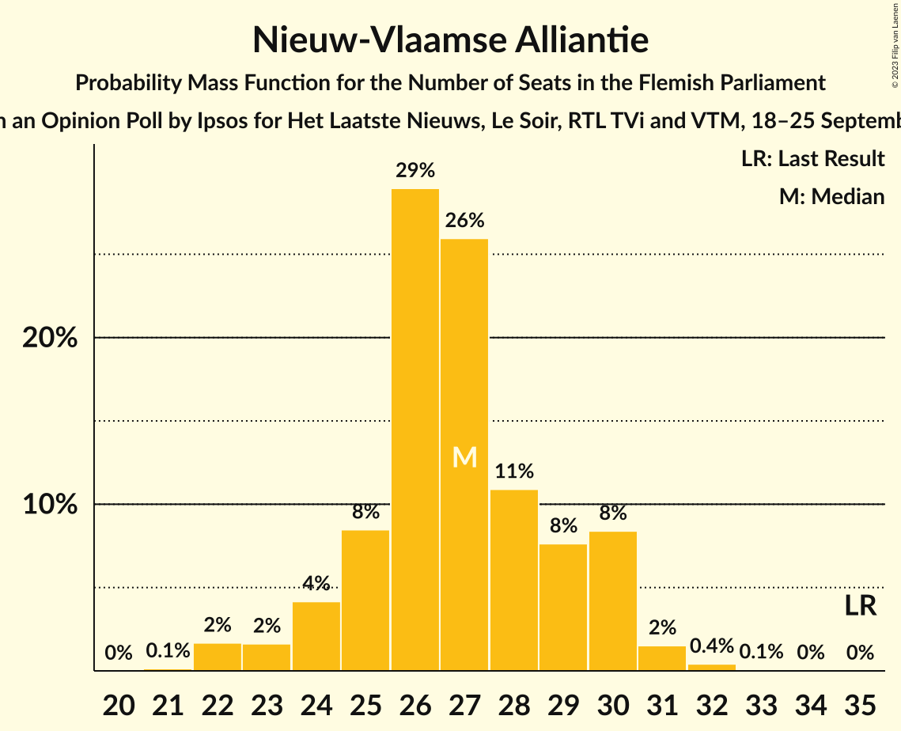

| Number of Seats | Probability | Accumulated | Special Marks |
|:---------------:|:-----------:|:-----------:|:-------------:|
| 21 | 0.1% | 100% |  |
| 22 | 2% | 99.9% |  |
| 23 | 2% | 98% |  |
| 24 | 4% | 97% |  |
| 25 | 8% | 92% |  |
| 26 | 29% | 84% |  |
| 27 | 26% | 55% | Median |
| 28 | 11% | 29% |  |
| 29 | 8% | 18% |  |
| 30 | 8% | 10% |  |
| 31 | 2% | 2% |  |
| 32 | 0.4% | 0.5% |  |
| 33 | 0.1% | 0.1% |  |
| 34 | 0% | 0% |  |
| 35 | 0% | 0% | Last Result |

### Vooruit

*For a full overview of the results for this party, see the [Vooruit](party-vooruit.html) page.*

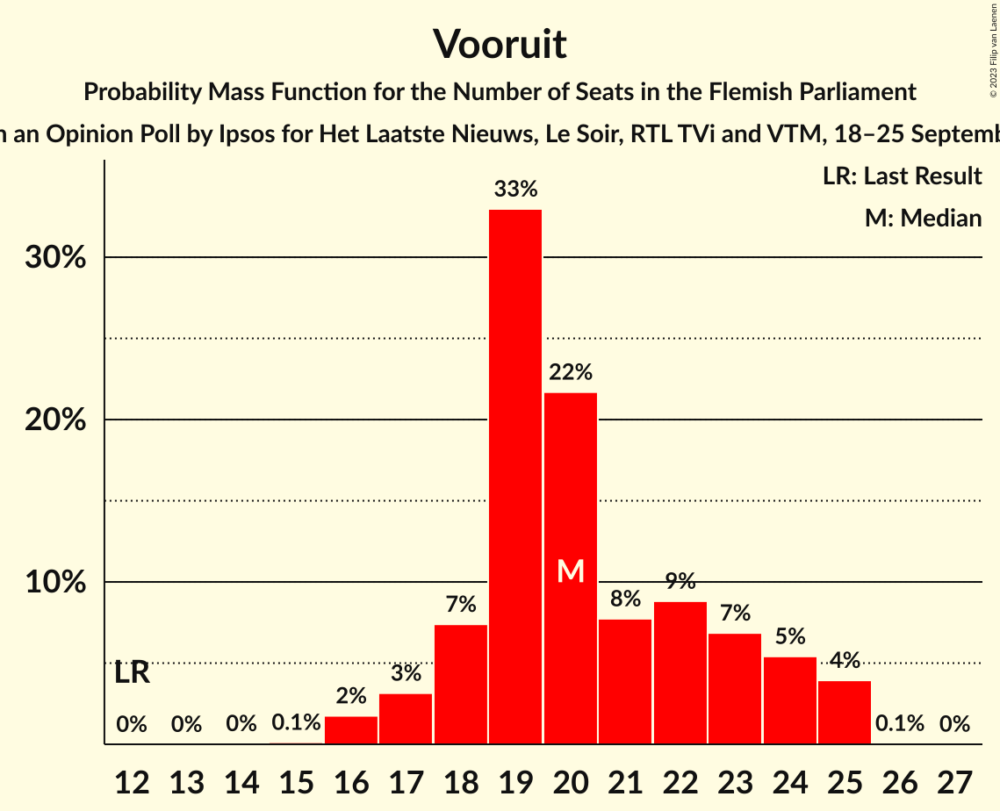

| Number of Seats | Probability | Accumulated | Special Marks |
|:---------------:|:-----------:|:-----------:|:-------------:|
| 12 | 0% | 100% | Last Result |
| 13 | 0% | 100% |  |
| 14 | 0% | 100% |  |
| 15 | 0.1% | 99.9% |  |
| 16 | 2% | 99.8% |  |
| 17 | 3% | 98% |  |
| 18 | 7% | 95% |  |
| 19 | 33% | 88% |  |
| 20 | 22% | 55% | Median |
| 21 | 8% | 33% |  |
| 22 | 9% | 25% |  |
| 23 | 7% | 16% |  |
| 24 | 5% | 9% |  |
| 25 | 4% | 4% |  |
| 26 | 0.1% | 0.1% |  |
| 27 | 0% | 0% |  |

### Christen-Democratisch en Vlaams

*For a full overview of the results for this party, see the [Christen-Democratisch en Vlaams](party-christen-democratischenvlaams.html) page.*

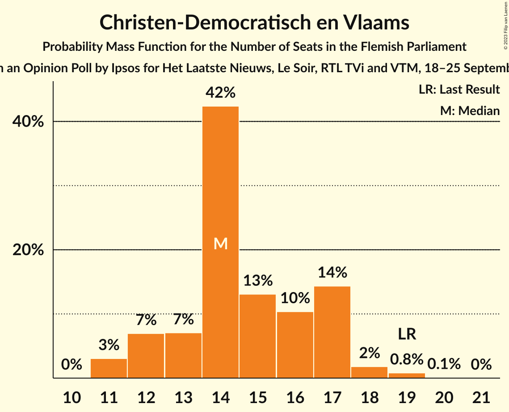

| Number of Seats | Probability | Accumulated | Special Marks |
|:---------------:|:-----------:|:-----------:|:-------------:|
| 11 | 3% | 100% |  |
| 12 | 7% | 97% |  |
| 13 | 7% | 90% |  |
| 14 | 42% | 83% | Median |
| 15 | 13% | 41% |  |
| 16 | 10% | 27% |  |
| 17 | 14% | 17% |  |
| 18 | 2% | 3% |  |
| 19 | 0.8% | 0.9% | Last Result |
| 20 | 0.1% | 0.1% |  |
| 21 | 0% | 0% |  |

### Partij van de Arbeid van België

*For a full overview of the results for this party, see the [Partij van de Arbeid van België](party-partijvandearbeidvanbelgië.html) page.*

| Number of Seats | Probability | Accumulated | Special Marks |
|:---------------:|:-----------:|:-----------:|:-------------:|
| 4 | 0% | 100% | Last Result |
| 5 | 0% | 100% |  |
| 6 | 0% | 100% |  |
| 7 | 3% | 100% |  |
| 8 | 4% | 97% |  |
| 9 | 5% | 93% |  |
| 10 | 6% | 89% |  |
| 11 | 26% | 82% |  |
| 12 | 22% | 56% | Median |
| 13 | 25% | 35% |  |
| 14 | 9% | 9% |  |
| 15 | 0.4% | 0.6% |  |
| 16 | 0.1% | 0.2% |  |
| 17 | 0.1% | 0.1% |  |
| 18 | 0% | 0% |  |

### Open Vlaamse Liberalen en Democraten

*For a full overview of the results for this party, see the [Open Vlaamse Liberalen en Democraten](party-openvlaamseliberalenendemocraten.html) page.*

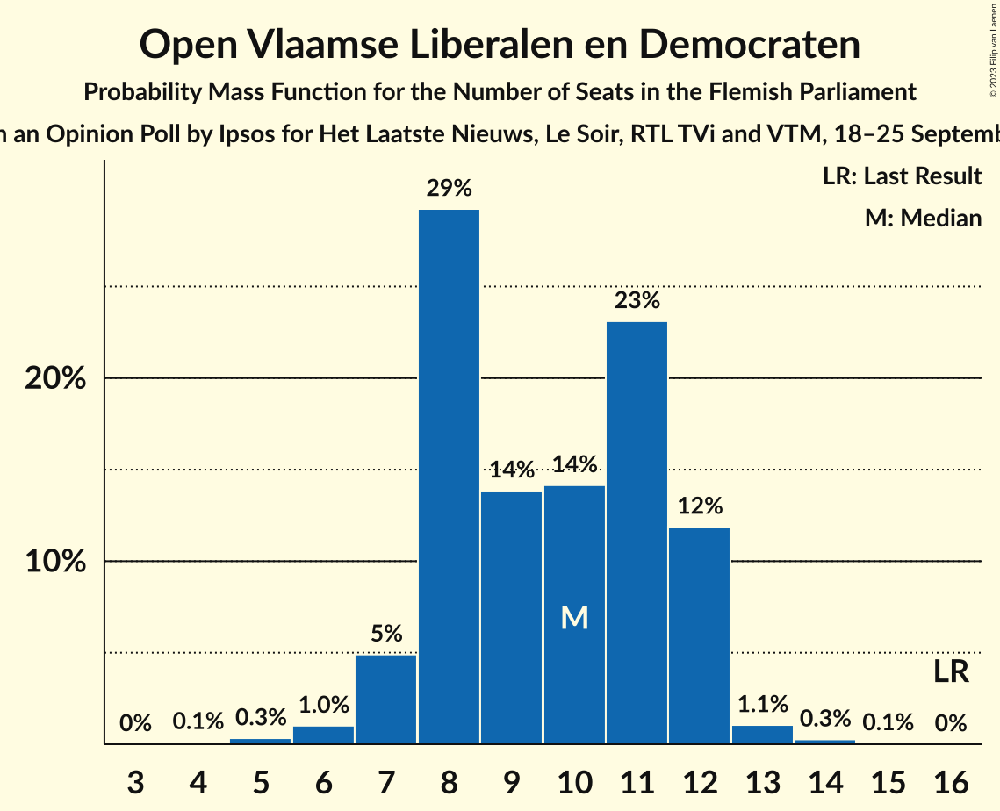

| Number of Seats | Probability | Accumulated | Special Marks |
|:---------------:|:-----------:|:-----------:|:-------------:|
| 4 | 0.1% | 100% |  |
| 5 | 0.3% | 99.9% |  |
| 6 | 1.0% | 99.5% |  |
| 7 | 5% | 98.5% |  |
| 8 | 29% | 94% |  |
| 9 | 14% | 64% |  |
| 10 | 14% | 51% | Median |
| 11 | 23% | 36% |  |
| 12 | 12% | 13% |  |
| 13 | 1.1% | 1.4% |  |
| 14 | 0.3% | 0.3% |  |
| 15 | 0.1% | 0.1% |  |
| 16 | 0% | 0% | Last Result |

### Groen

*For a full overview of the results for this party, see the [Groen](party-groen.html) page.*

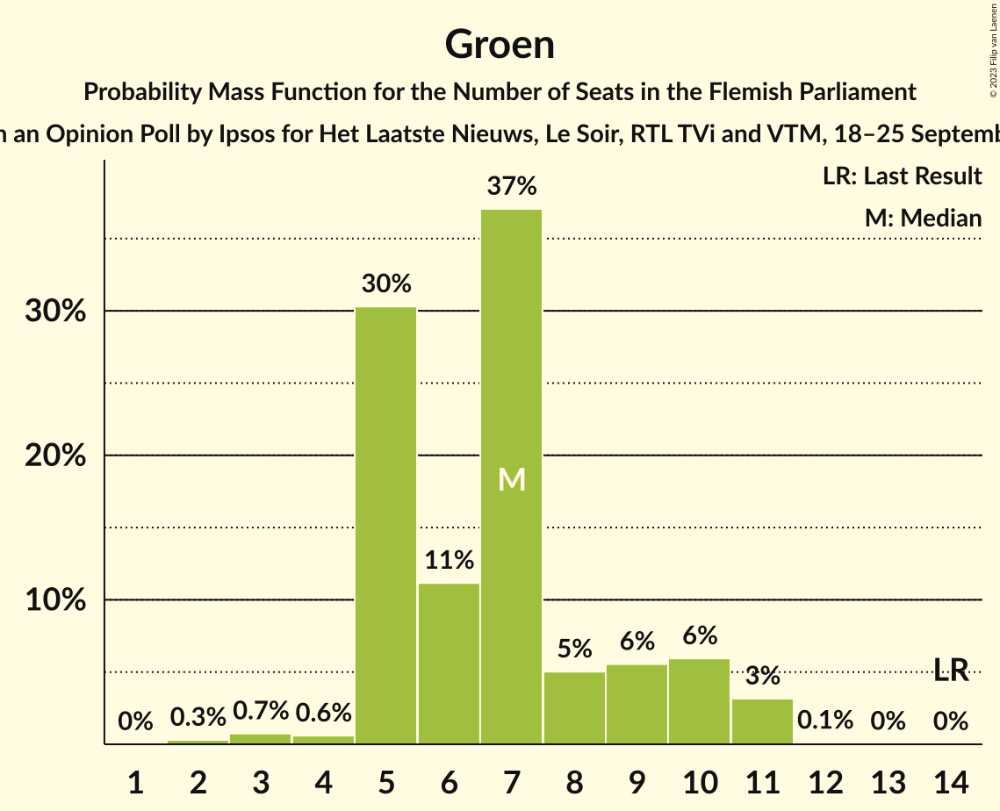

| Number of Seats | Probability | Accumulated | Special Marks |
|:---------------:|:-----------:|:-----------:|:-------------:|
| 2 | 0.3% | 100% |  |
| 3 | 0.7% | 99.7% |  |
| 4 | 0.6% | 98.9% |  |
| 5 | 30% | 98% |  |
| 6 | 11% | 68% |  |
| 7 | 37% | 57% | Median |
| 8 | 5% | 20% |  |
| 9 | 6% | 15% |  |
| 10 | 6% | 9% |  |
| 11 | 3% | 3% |  |
| 12 | 0.1% | 0.1% |  |
| 13 | 0% | 0% |  |
| 14 | 0% | 0% | Last Result |

## Coalitions

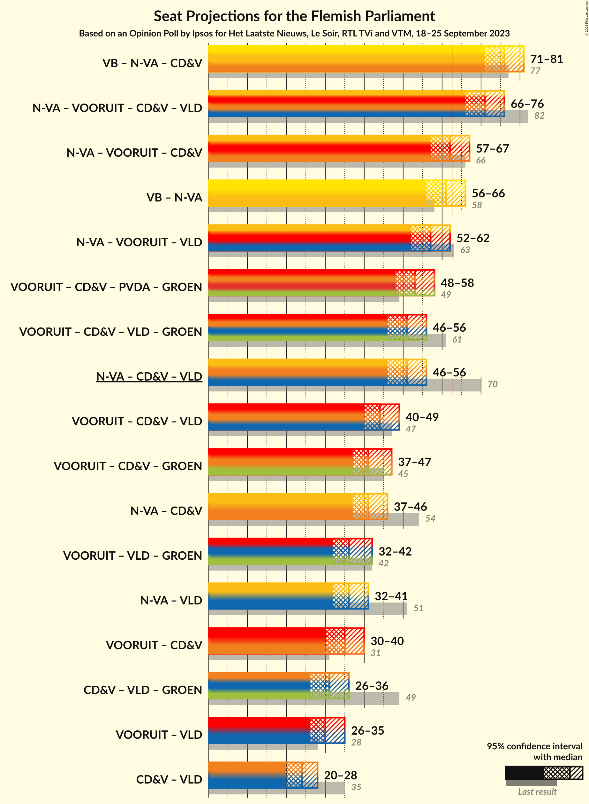

### Confidence Intervals

| Coalition | Last Result | Median | Majority? | 80% Confidence Interval | 90% Confidence Interval | 95% Confidence Interval | 99% Confidence Interval |
|:---------:|:-----------:|:------:|:---------:|:-----------------------:|:-----------------------:|:-----------------------:|:-----------------------:|
| Vlaams Belang – Nieuw-Vlaamse Alliantie – Christen-Democratisch en Vlaams | 77 | 76 | 100% | 73–79 | 72–80 | 71–81 | 69–82 |
| Nieuw-Vlaamse Alliantie – Vooruit – Christen-Democratisch en Vlaams – Open Vlaamse Liberalen en Democraten | 82 | 71 | 100% | 68–75 | 67–76 | 66–76 | 64–78 |
| Nieuw-Vlaamse Alliantie – Vooruit – Christen-Democratisch en Vlaams | 66 | 62 | 37% | 58–65 | 57–66 | 57–67 | 55–69 |
| Vlaams Belang – Nieuw-Vlaamse Alliantie | 58 | 61 | 32% | 58–64 | 57–65 | 56–66 | 55–67 |
| Nieuw-Vlaamse Alliantie – Vooruit – Open Vlaamse Liberalen en Democraten | 63 | 57 | 2% | 53–60 | 53–61 | 52–62 | 50–64 |
| Vooruit – Christen-Democratisch en Vlaams – Partij van de Arbeid van België – Groen | 49 | 53 | 0% | 50–57 | 49–58 | 48–58 | 47–60 |
| Vooruit – Christen-Democratisch en Vlaams – Open Vlaamse Liberalen en Democraten – Groen | 61 | 51 | 0% | 48–54 | 47–55 | 46–56 | 45–58 |
| Nieuw-Vlaamse Alliantie – Christen-Democratisch en Vlaams – Open Vlaamse Liberalen en Democraten | 70 | 51 | 0% | 48–54 | 47–55 | 46–56 | 45–57 |
| Vooruit – Christen-Democratisch en Vlaams – Open Vlaamse Liberalen en Democraten | 47 | 44 | 0% | 41–47 | 40–48 | 40–49 | 38–51 |
| Vooruit – Christen-Democratisch en Vlaams – Groen | 45 | 41 | 0% | 38–45 | 38–46 | 37–47 | 35–49 |
| Nieuw-Vlaamse Alliantie – Christen-Democratisch en Vlaams | 54 | 41 | 0% | 39–44 | 38–45 | 37–46 | 36–47 |
| Vooruit – Open Vlaamse Liberalen en Democraten – Groen | 42 | 36 | 0% | 34–40 | 33–41 | 32–42 | 31–43 |
| Nieuw-Vlaamse Alliantie – Open Vlaamse Liberalen en Democraten | 51 | 36 | 0% | 34–40 | 33–40 | 32–41 | 30–43 |
| Vooruit – Christen-Democratisch en Vlaams | 31 | 35 | 0% | 32–38 | 31–39 | 30–40 | 29–42 |
| Christen-Democratisch en Vlaams – Open Vlaamse Liberalen en Democraten – Groen | 49 | 31 | 0% | 27–34 | 27–35 | 26–36 | 25–37 |
| Vooruit – Open Vlaamse Liberalen en Democraten | 28 | 30 | 0% | 27–33 | 26–34 | 26–35 | 25–36 |
| Christen-Democratisch en Vlaams – Open Vlaamse Liberalen en Democraten | 35 | 24 | 0% | 22–27 | 21–28 | 20–28 | 19–30 |

### Vlaams Belang – Nieuw-Vlaamse Alliantie – Christen-Democratisch en Vlaams

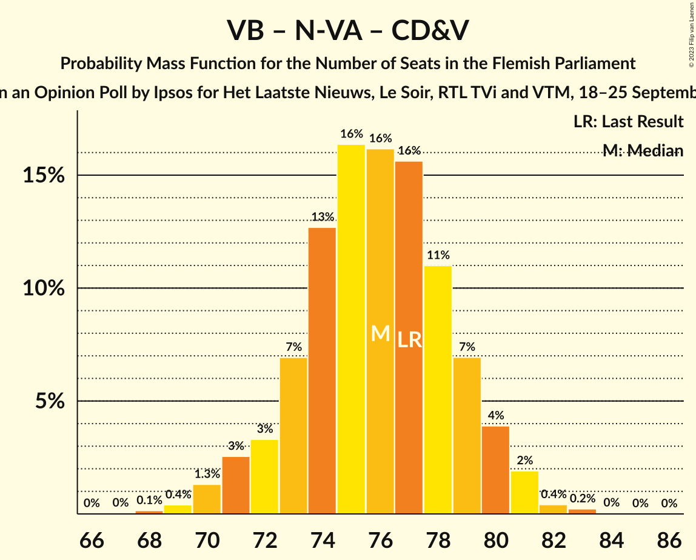

| Number of Seats | Probability | Accumulated | Special Marks |
|:---------------:|:-----------:|:-----------:|:-------------:|
| 67 | 0% | 100% |  |
| 68 | 0.1% | 99.9% |  |
| 69 | 0.4% | 99.8% |  |
| 70 | 1.3% | 99.4% |  |
| 71 | 3% | 98% |  |
| 72 | 3% | 96% |  |
| 73 | 7% | 92% |  |
| 74 | 13% | 85% |  |
| 75 | 16% | 73% | Median |
| 76 | 16% | 56% |  |
| 77 | 16% | 40% | Last Result |
| 78 | 11% | 24% |  |
| 79 | 7% | 13% |  |
| 80 | 4% | 7% |  |
| 81 | 2% | 3% |  |
| 82 | 0.4% | 0.7% |  |
| 83 | 0.2% | 0.3% |  |
| 84 | 0% | 0.1% |  |
| 85 | 0% | 0% |  |

### Nieuw-Vlaamse Alliantie – Vooruit – Christen-Democratisch en Vlaams – Open Vlaamse Liberalen en Democraten

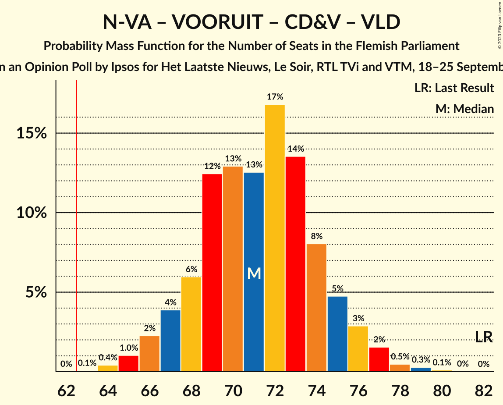

| Number of Seats | Probability | Accumulated | Special Marks |
|:---------------:|:-----------:|:-----------:|:-------------:|
| 63 | 0.1% | 100% | Majority |
| 64 | 0.4% | 99.9% |  |
| 65 | 1.0% | 99.5% |  |
| 66 | 2% | 98% |  |
| 67 | 4% | 96% |  |
| 68 | 6% | 92% |  |
| 69 | 12% | 86% |  |
| 70 | 13% | 74% |  |
| 71 | 13% | 61% | Median |
| 72 | 17% | 48% |  |
| 73 | 14% | 32% |  |
| 74 | 8% | 18% |  |
| 75 | 5% | 10% |  |
| 76 | 3% | 5% |  |
| 77 | 2% | 2% |  |
| 78 | 0.5% | 0.9% |  |
| 79 | 0.3% | 0.4% |  |
| 80 | 0.1% | 0.1% |  |
| 81 | 0% | 0% |  |
| 82 | 0% | 0% | Last Result |

### Nieuw-Vlaamse Alliantie – Vooruit – Christen-Democratisch en Vlaams

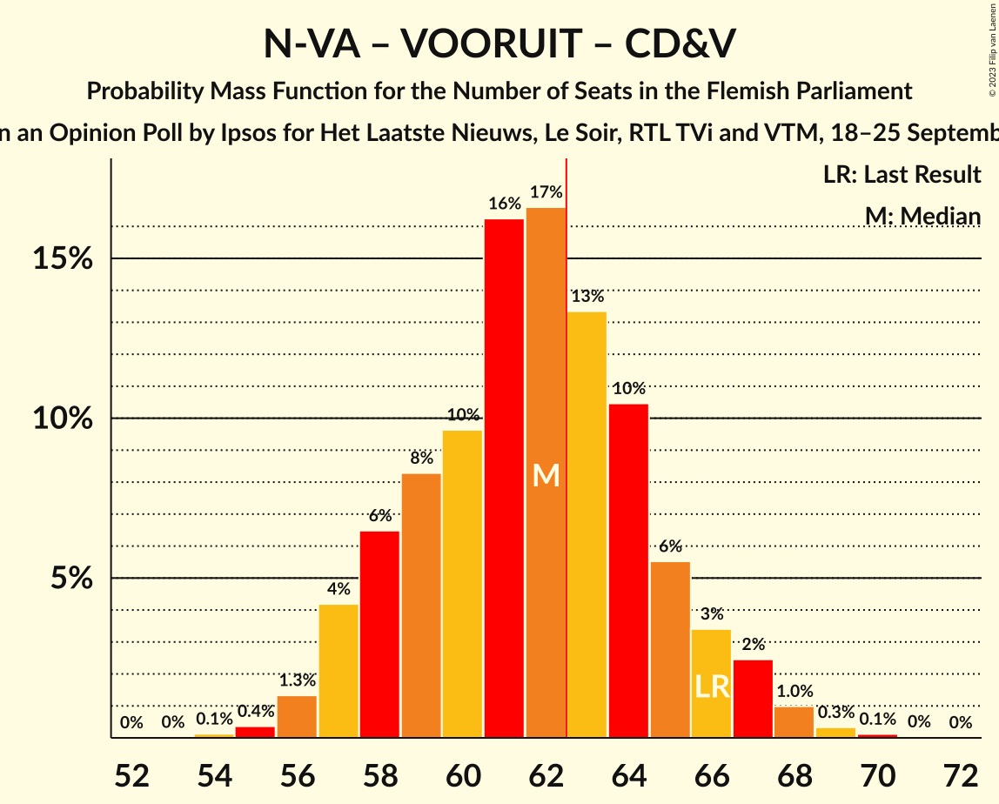

| Number of Seats | Probability | Accumulated | Special Marks |
|:---------------:|:-----------:|:-----------:|:-------------:|
| 54 | 0.1% | 100% |  |
| 55 | 0.4% | 99.8% |  |
| 56 | 1.3% | 99.5% |  |
| 57 | 4% | 98% |  |
| 58 | 6% | 94% |  |
| 59 | 8% | 87% |  |
| 60 | 10% | 79% |  |
| 61 | 16% | 70% | Median |
| 62 | 17% | 53% |  |
| 63 | 13% | 37% | Majority |
| 64 | 10% | 23% |  |
| 65 | 6% | 13% |  |
| 66 | 3% | 7% | Last Result |
| 67 | 2% | 4% |  |
| 68 | 1.0% | 1.5% |  |
| 69 | 0.3% | 0.5% |  |
| 70 | 0.1% | 0.2% |  |
| 71 | 0% | 0.1% |  |
| 72 | 0% | 0% |  |

### Vlaams Belang – Nieuw-Vlaamse Alliantie

| Number of Seats | Probability | Accumulated | Special Marks |
|:---------------:|:-----------:|:-----------:|:-------------:|
| 53 | 0.1% | 100% |  |
| 54 | 0.2% | 99.9% |  |
| 55 | 0.7% | 99.7% |  |
| 56 | 2% | 99.0% |  |
| 57 | 4% | 97% |  |
| 58 | 5% | 94% | Last Result |
| 59 | 11% | 89% |  |
| 60 | 14% | 78% |  |
| 61 | 17% | 64% | Median |
| 62 | 15% | 47% |  |
| 63 | 15% | 32% | Majority |
| 64 | 10% | 17% |  |
| 65 | 4% | 7% |  |
| 66 | 2% | 3% |  |
| 67 | 0.8% | 1.2% |  |
| 68 | 0.3% | 0.4% |  |
| 69 | 0.1% | 0.1% |  |
| 70 | 0% | 0% |  |

### Nieuw-Vlaamse Alliantie – Vooruit – Open Vlaamse Liberalen en Democraten

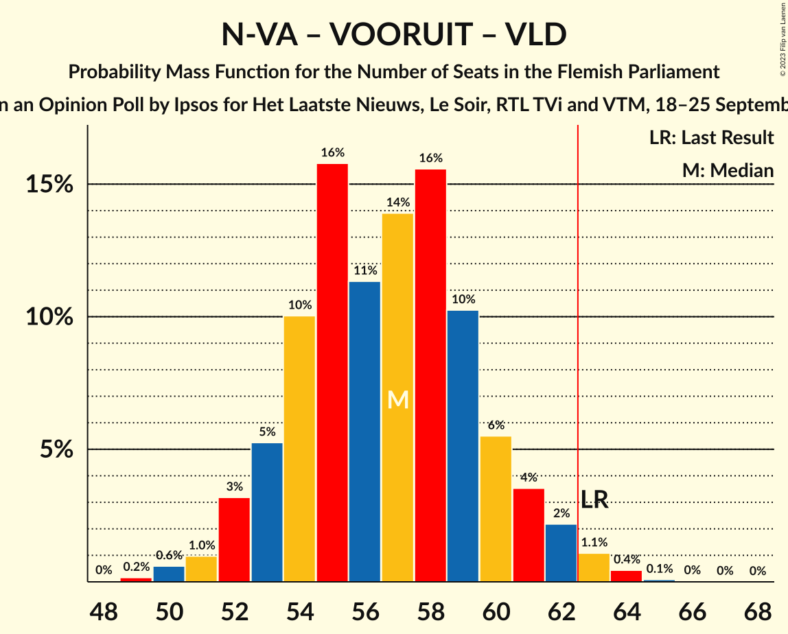

| Number of Seats | Probability | Accumulated | Special Marks |
|:---------------:|:-----------:|:-----------:|:-------------:|
| 48 | 0% | 100% |  |
| 49 | 0.2% | 99.9% |  |
| 50 | 0.6% | 99.8% |  |
| 51 | 1.0% | 99.2% |  |
| 52 | 3% | 98% |  |
| 53 | 5% | 95% |  |
| 54 | 10% | 90% |  |
| 55 | 16% | 80% |  |
| 56 | 11% | 64% |  |
| 57 | 14% | 53% | Median |
| 58 | 16% | 39% |  |
| 59 | 10% | 23% |  |
| 60 | 6% | 13% |  |
| 61 | 4% | 7% |  |
| 62 | 2% | 4% |  |
| 63 | 1.1% | 2% | Last Result, Majority |
| 64 | 0.4% | 0.6% |  |
| 65 | 0.1% | 0.1% |  |
| 66 | 0% | 0.1% |  |
| 67 | 0% | 0% |  |

### Vooruit – Christen-Democratisch en Vlaams – Partij van de Arbeid van België – Groen

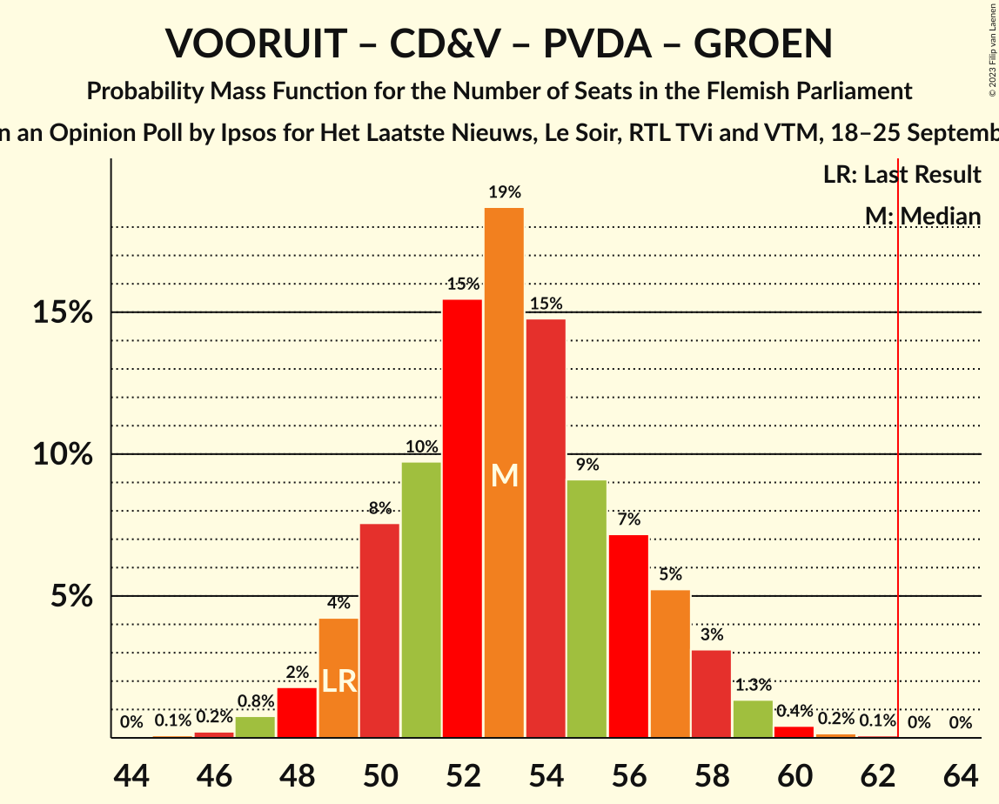

| Number of Seats | Probability | Accumulated | Special Marks |
|:---------------:|:-----------:|:-----------:|:-------------:|
| 45 | 0.1% | 100% |  |
| 46 | 0.2% | 99.9% |  |
| 47 | 0.8% | 99.7% |  |
| 48 | 2% | 98.9% |  |
| 49 | 4% | 97% | Last Result |
| 50 | 8% | 93% |  |
| 51 | 10% | 85% |  |
| 52 | 15% | 76% |  |
| 53 | 19% | 60% | Median |
| 54 | 15% | 41% |  |
| 55 | 9% | 27% |  |
| 56 | 7% | 18% |  |
| 57 | 5% | 10% |  |
| 58 | 3% | 5% |  |
| 59 | 1.3% | 2% |  |
| 60 | 0.4% | 0.7% |  |
| 61 | 0.2% | 0.3% |  |
| 62 | 0.1% | 0.1% |  |
| 63 | 0% | 0% | Majority |

### Vooruit – Christen-Democratisch en Vlaams – Open Vlaamse Liberalen en Democraten – Groen

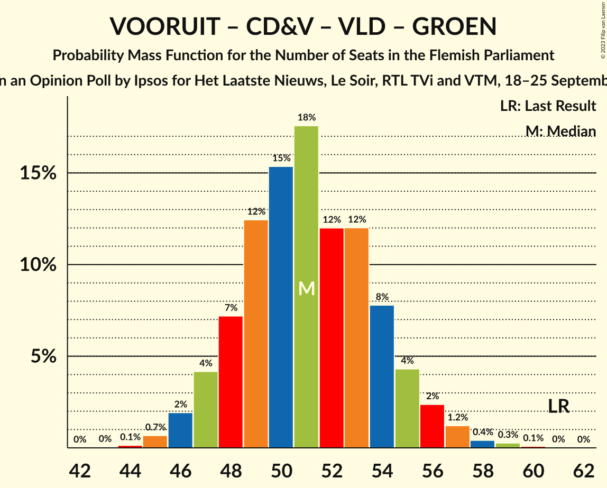

| Number of Seats | Probability | Accumulated | Special Marks |
|:---------------:|:-----------:|:-----------:|:-------------:|
| 43 | 0% | 100% |  |
| 44 | 0.1% | 99.9% |  |
| 45 | 0.7% | 99.8% |  |
| 46 | 2% | 99.1% |  |
| 47 | 4% | 97% |  |
| 48 | 7% | 93% |  |
| 49 | 12% | 86% |  |
| 50 | 15% | 73% |  |
| 51 | 18% | 58% | Median |
| 52 | 12% | 40% |  |
| 53 | 12% | 28% |  |
| 54 | 8% | 16% |  |
| 55 | 4% | 9% |  |
| 56 | 2% | 4% |  |
| 57 | 1.2% | 2% |  |
| 58 | 0.4% | 0.8% |  |
| 59 | 0.3% | 0.4% |  |
| 60 | 0.1% | 0.1% |  |
| 61 | 0% | 0% | Last Result |

### Nieuw-Vlaamse Alliantie – Christen-Democratisch en Vlaams – Open Vlaamse Liberalen en Democraten

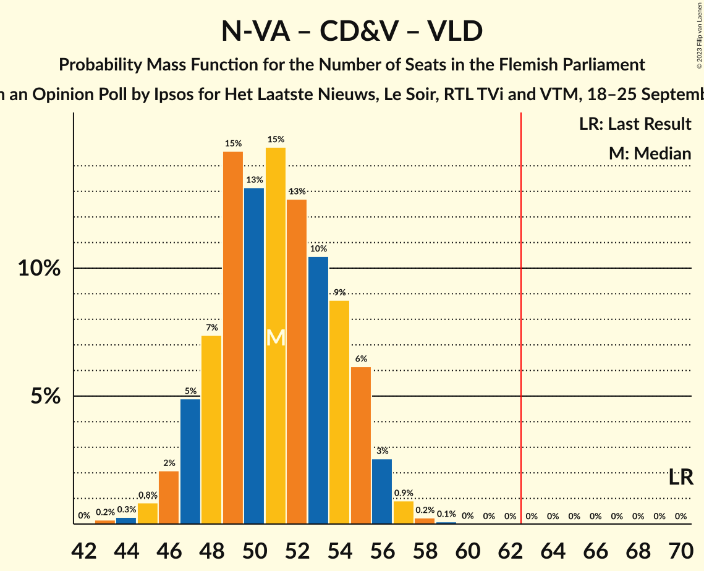

| Number of Seats | Probability | Accumulated | Special Marks |
|:---------------:|:-----------:|:-----------:|:-------------:|
| 43 | 0.2% | 100% |  |
| 44 | 0.3% | 99.8% |  |
| 45 | 0.8% | 99.5% |  |
| 46 | 2% | 98.7% |  |
| 47 | 5% | 97% |  |
| 48 | 7% | 92% |  |
| 49 | 15% | 84% |  |
| 50 | 13% | 70% |  |
| 51 | 15% | 57% | Median |
| 52 | 13% | 42% |  |
| 53 | 10% | 29% |  |
| 54 | 9% | 19% |  |
| 55 | 6% | 10% |  |
| 56 | 3% | 4% |  |
| 57 | 0.9% | 1.3% |  |
| 58 | 0.2% | 0.4% |  |
| 59 | 0.1% | 0.1% |  |
| 60 | 0% | 0% |  |
| 61 | 0% | 0% |  |
| 62 | 0% | 0% |  |
| 63 | 0% | 0% | Majority |
| 64 | 0% | 0% |  |
| 65 | 0% | 0% |  |
| 66 | 0% | 0% |  |
| 67 | 0% | 0% |  |
| 68 | 0% | 0% |  |
| 69 | 0% | 0% |  |
| 70 | 0% | 0% | Last Result |

### Vooruit – Christen-Democratisch en Vlaams – Open Vlaamse Liberalen en Democraten

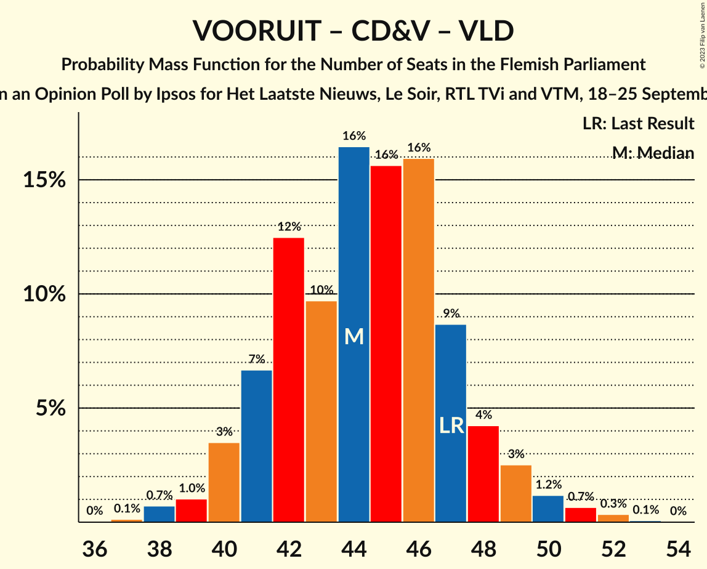

| Number of Seats | Probability | Accumulated | Special Marks |
|:---------------:|:-----------:|:-----------:|:-------------:|
| 36 | 0% | 100% |  |
| 37 | 0.1% | 99.9% |  |
| 38 | 0.7% | 99.8% |  |
| 39 | 1.0% | 99.1% |  |
| 40 | 3% | 98% |  |
| 41 | 7% | 95% |  |
| 42 | 12% | 88% |  |
| 43 | 10% | 75% |  |
| 44 | 16% | 66% | Median |
| 45 | 16% | 49% |  |
| 46 | 16% | 34% |  |
| 47 | 9% | 18% | Last Result |
| 48 | 4% | 9% |  |
| 49 | 3% | 5% |  |
| 50 | 1.2% | 2% |  |
| 51 | 0.7% | 1.1% |  |
| 52 | 0.3% | 0.4% |  |
| 53 | 0.1% | 0.1% |  |
| 54 | 0% | 0% |  |

### Vooruit – Christen-Democratisch en Vlaams – Groen

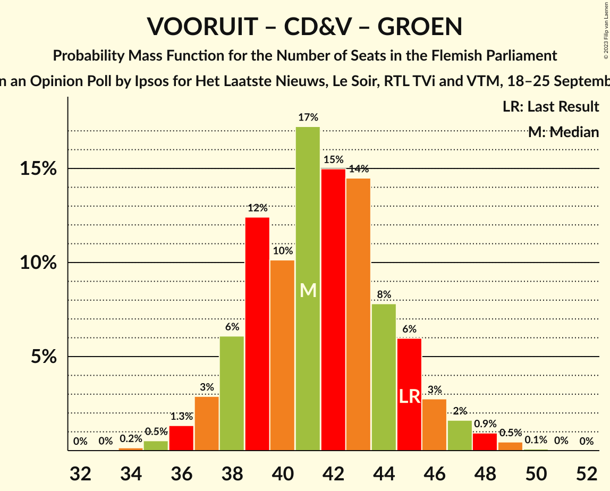

| Number of Seats | Probability | Accumulated | Special Marks |
|:---------------:|:-----------:|:-----------:|:-------------:|
| 34 | 0.2% | 100% |  |
| 35 | 0.5% | 99.8% |  |
| 36 | 1.3% | 99.3% |  |
| 37 | 3% | 98% |  |
| 38 | 6% | 95% |  |
| 39 | 12% | 89% |  |
| 40 | 10% | 77% |  |
| 41 | 17% | 66% | Median |
| 42 | 15% | 49% |  |
| 43 | 14% | 34% |  |
| 44 | 8% | 20% |  |
| 45 | 6% | 12% | Last Result |
| 46 | 3% | 6% |  |
| 47 | 2% | 3% |  |
| 48 | 0.9% | 2% |  |
| 49 | 0.5% | 0.6% |  |
| 50 | 0.1% | 0.1% |  |
| 51 | 0% | 0.1% |  |
| 52 | 0% | 0% |  |

### Nieuw-Vlaamse Alliantie – Christen-Democratisch en Vlaams

| Number of Seats | Probability | Accumulated | Special Marks |
|:---------------:|:-----------:|:-----------:|:-------------:|
| 34 | 0.1% | 100% |  |
| 35 | 0.3% | 99.9% |  |
| 36 | 0.5% | 99.6% |  |
| 37 | 2% | 99.1% |  |
| 38 | 6% | 97% |  |
| 39 | 10% | 91% |  |
| 40 | 15% | 81% |  |
| 41 | 18% | 65% | Median |
| 42 | 14% | 47% |  |
| 43 | 15% | 33% |  |
| 44 | 10% | 18% |  |
| 45 | 5% | 8% |  |
| 46 | 2% | 3% |  |
| 47 | 1.0% | 1.3% |  |
| 48 | 0.2% | 0.3% |  |
| 49 | 0.1% | 0.1% |  |
| 50 | 0% | 0% |  |
| 51 | 0% | 0% |  |
| 52 | 0% | 0% |  |
| 53 | 0% | 0% |  |
| 54 | 0% | 0% | Last Result |

### Vooruit – Open Vlaamse Liberalen en Democraten – Groen

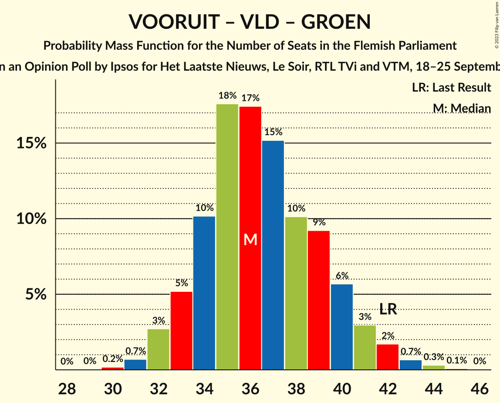

| Number of Seats | Probability | Accumulated | Special Marks |
|:---------------:|:-----------:|:-----------:|:-------------:|
| 29 | 0% | 100% |  |
| 30 | 0.2% | 99.9% |  |
| 31 | 0.7% | 99.8% |  |
| 32 | 3% | 99.1% |  |
| 33 | 5% | 96% |  |
| 34 | 10% | 91% |  |
| 35 | 18% | 81% |  |
| 36 | 17% | 63% |  |
| 37 | 15% | 46% | Median |
| 38 | 10% | 31% |  |
| 39 | 9% | 21% |  |
| 40 | 6% | 11% |  |
| 41 | 3% | 6% |  |
| 42 | 2% | 3% | Last Result |
| 43 | 0.7% | 1.1% |  |
| 44 | 0.3% | 0.4% |  |
| 45 | 0.1% | 0.1% |  |
| 46 | 0% | 0% |  |

### Nieuw-Vlaamse Alliantie – Open Vlaamse Liberalen en Democraten

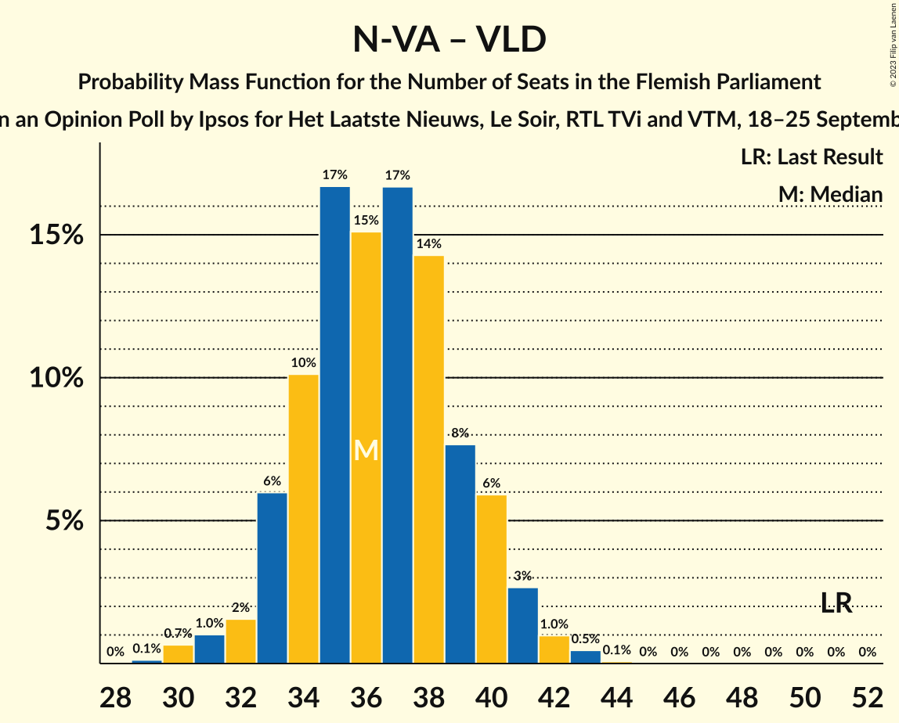

| Number of Seats | Probability | Accumulated | Special Marks |
|:---------------:|:-----------:|:-----------:|:-------------:|
| 29 | 0.1% | 100% |  |
| 30 | 0.7% | 99.9% |  |
| 31 | 1.0% | 99.2% |  |
| 32 | 2% | 98% |  |
| 33 | 6% | 97% |  |
| 34 | 10% | 91% |  |
| 35 | 17% | 81% |  |
| 36 | 15% | 64% |  |
| 37 | 17% | 49% | Median |
| 38 | 14% | 32% |  |
| 39 | 8% | 18% |  |
| 40 | 6% | 10% |  |
| 41 | 3% | 4% |  |
| 42 | 1.0% | 2% |  |
| 43 | 0.5% | 0.6% |  |
| 44 | 0.1% | 0.1% |  |
| 45 | 0% | 0% |  |
| 46 | 0% | 0% |  |
| 47 | 0% | 0% |  |
| 48 | 0% | 0% |  |
| 49 | 0% | 0% |  |
| 50 | 0% | 0% |  |
| 51 | 0% | 0% | Last Result |

### Vooruit – Christen-Democratisch en Vlaams

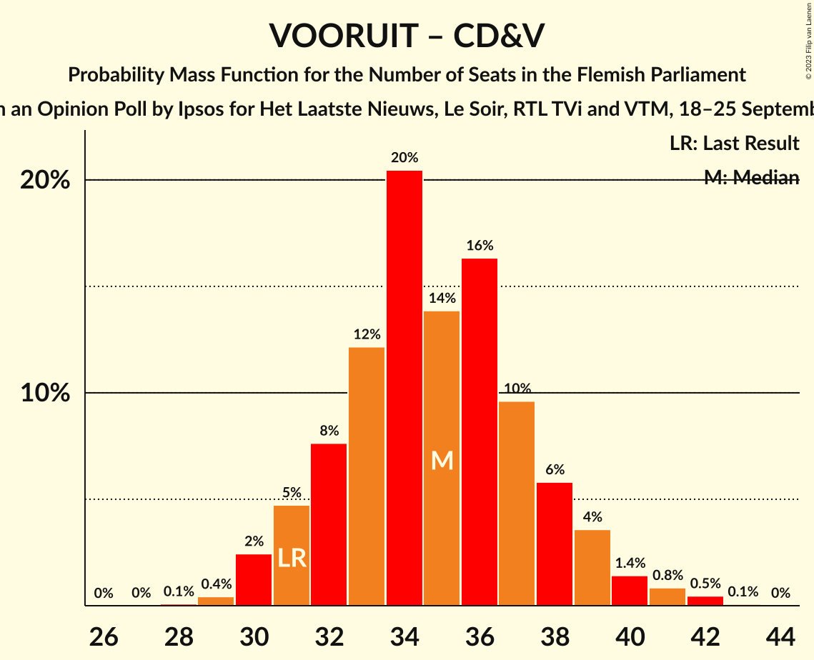

| Number of Seats | Probability | Accumulated | Special Marks |
|:---------------:|:-----------:|:-----------:|:-------------:|
| 28 | 0.1% | 100% |  |
| 29 | 0.4% | 99.9% |  |
| 30 | 2% | 99.5% |  |
| 31 | 5% | 97% | Last Result |
| 32 | 8% | 92% |  |
| 33 | 12% | 85% |  |
| 34 | 20% | 72% | Median |
| 35 | 14% | 52% |  |
| 36 | 16% | 38% |  |
| 37 | 10% | 22% |  |
| 38 | 6% | 12% |  |
| 39 | 4% | 6% |  |
| 40 | 1.4% | 3% |  |
| 41 | 0.8% | 1.4% |  |
| 42 | 0.5% | 0.5% |  |
| 43 | 0.1% | 0.1% |  |
| 44 | 0% | 0% |  |

### Christen-Democratisch en Vlaams – Open Vlaamse Liberalen en Democraten – Groen

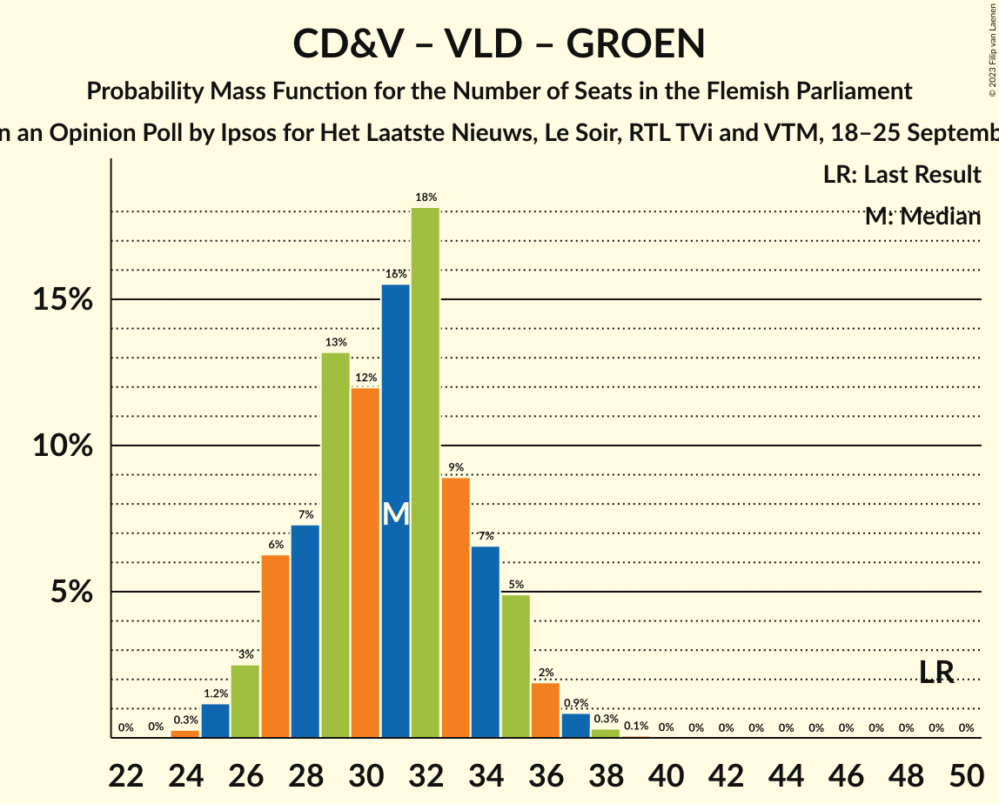

| Number of Seats | Probability | Accumulated | Special Marks |
|:---------------:|:-----------:|:-----------:|:-------------:|
| 23 | 0% | 100% |  |
| 24 | 0.3% | 99.9% |  |
| 25 | 1.2% | 99.7% |  |
| 26 | 3% | 98% |  |
| 27 | 6% | 96% |  |
| 28 | 7% | 90% |  |
| 29 | 13% | 82% |  |
| 30 | 12% | 69% |  |
| 31 | 16% | 57% | Median |
| 32 | 18% | 42% |  |
| 33 | 9% | 24% |  |
| 34 | 7% | 15% |  |
| 35 | 5% | 8% |  |
| 36 | 2% | 3% |  |
| 37 | 0.9% | 1.3% |  |
| 38 | 0.3% | 0.4% |  |
| 39 | 0.1% | 0.1% |  |
| 40 | 0% | 0% |  |
| 41 | 0% | 0% |  |
| 42 | 0% | 0% |  |
| 43 | 0% | 0% |  |
| 44 | 0% | 0% |  |
| 45 | 0% | 0% |  |
| 46 | 0% | 0% |  |
| 47 | 0% | 0% |  |
| 48 | 0% | 0% |  |
| 49 | 0% | 0% | Last Result |

### Vooruit – Open Vlaamse Liberalen en Democraten

| Number of Seats | Probability | Accumulated | Special Marks |
|:---------------:|:-----------:|:-----------:|:-------------:|
| 23 | 0.1% | 100% |  |
| 24 | 0.3% | 99.9% |  |
| 25 | 1.3% | 99.5% |  |
| 26 | 3% | 98% |  |
| 27 | 10% | 95% |  |
| 28 | 18% | 85% | Last Result |
| 29 | 12% | 67% |  |
| 30 | 17% | 55% | Median |
| 31 | 16% | 38% |  |
| 32 | 11% | 22% |  |
| 33 | 6% | 11% |  |
| 34 | 3% | 5% |  |
| 35 | 2% | 3% |  |
| 36 | 0.7% | 1.1% |  |
| 37 | 0.4% | 0.4% |  |
| 38 | 0% | 0% |  |

### Christen-Democratisch en Vlaams – Open Vlaamse Liberalen en Democraten

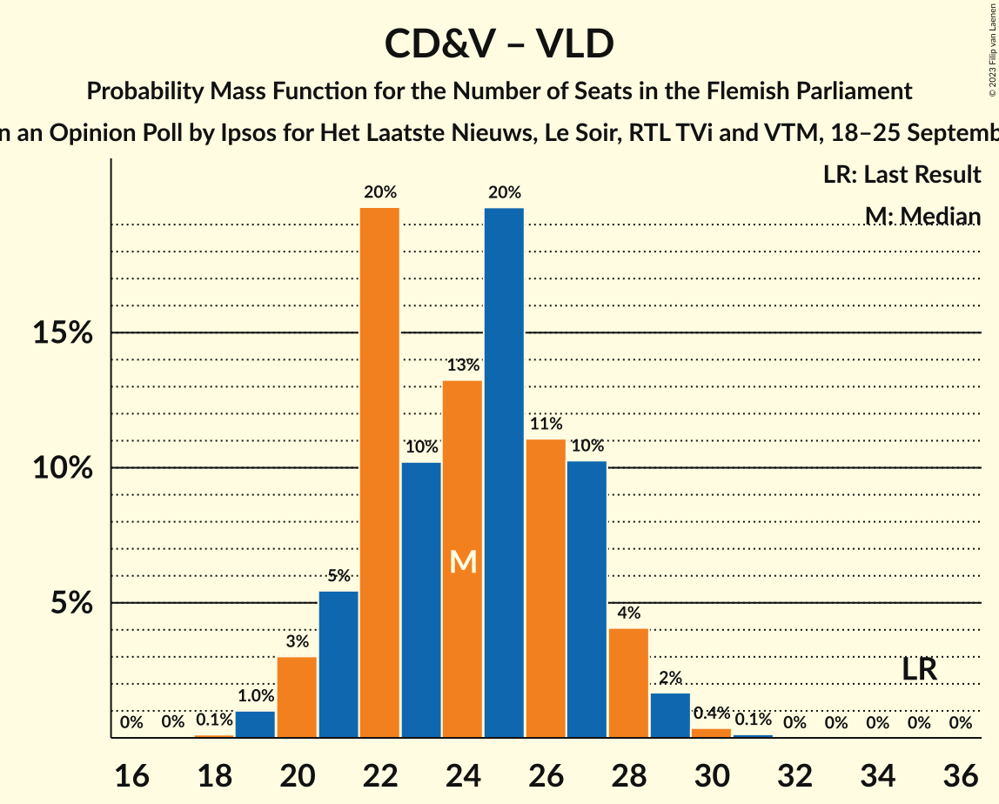

| Number of Seats | Probability | Accumulated | Special Marks |
|:---------------:|:-----------:|:-----------:|:-------------:|
| 17 | 0% | 100% |  |
| 18 | 0.1% | 99.9% |  |
| 19 | 1.0% | 99.8% |  |
| 20 | 3% | 98.8% |  |
| 21 | 5% | 96% |  |
| 22 | 20% | 90% |  |
| 23 | 10% | 71% |  |
| 24 | 13% | 60% | Median |
| 25 | 20% | 47% |  |
| 26 | 11% | 28% |  |
| 27 | 10% | 17% |  |
| 28 | 4% | 6% |  |
| 29 | 2% | 2% |  |
| 30 | 0.4% | 0.5% |  |
| 31 | 0.1% | 0.1% |  |
| 32 | 0% | 0% |  |
| 33 | 0% | 0% |  |
| 34 | 0% | 0% |  |
| 35 | 0% | 0% | Last Result |

## Technical Information

### Opinion Poll

+ **Polling firm:** Ipsos
+ **Commissioner(s):** Het Laatste Nieuws, Le Soir, RTL TVi and VTM
+ **Fieldwork period:** 18–25 September 2023

### Calculations

+ **Sample size:** 1000
+ **Simulations done:** 1,048,576
+ **Error estimate:** 0.94%

