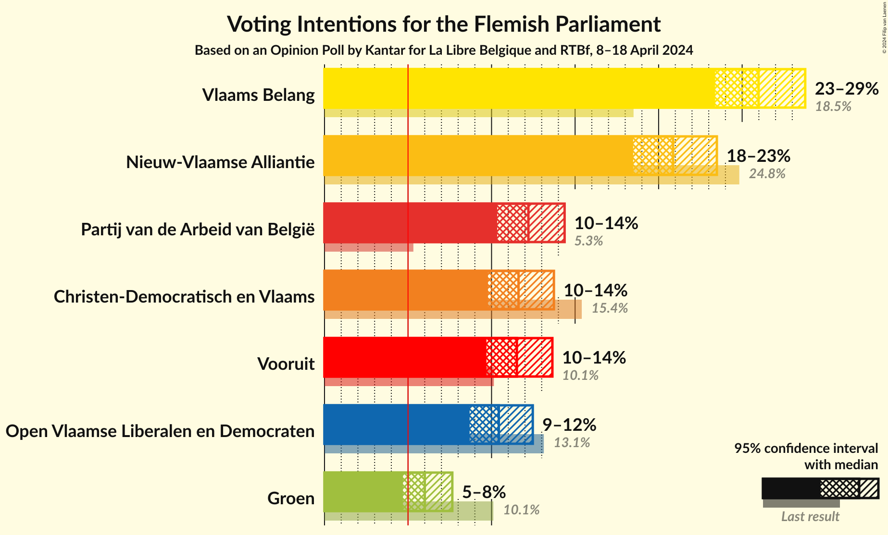

# Opinion Poll by Kantar for La Libre Belgique and RTBf, 8–18 April 2024

<a href="#voting-intentions">Voting Intentions</a> | <a href="#seats">Seats</a> | <a href="#coalitions">Coalitions</a> | <a href="#technical-information">Technical Information</a>

## Voting Intentions

### Confidence Intervals

| Party | Last Result | Poll Result | 80% Confidence Interval | 90% Confidence Interval | 95% Confidence Interval | 99% Confidence Interval |
|:-----:|:-----------:|:-----------:|:-----------------------:|:-----------------------:|:-----------------------:|:-----------------------:|
| Vlaams Belang | 18.5% | 26.0% | 24.3–27.8% |23.8–28.3% |23.4–28.8% |22.6–29.7% |
| Nieuw-Vlaamse Alliantie | 24.8% | 20.9% | 19.3–22.6% |18.9–23.1% |18.5–23.5% |17.7–24.3% |
| Partij van de Arbeid van België | 5.3% | 12.2% | 11.0–13.6% |10.6–14.0% |10.3–14.4% |9.8–15.1% |
| Christen-Democratisch en Vlaams | 15.4% | 11.6% | 10.4–13.0% |10.1–13.4% |9.8–13.7% |9.2–14.4% |
| Vooruit | 10.1% | 11.5% | 10.3–12.9% |10.0–13.3% |9.7–13.6% |9.1–14.3% |
| Open Vlaamse Liberalen en Democraten | 13.1% | 10.4% | 9.3–11.8% |9.0–12.1% |8.7–12.5% |8.2–13.1% |
| Groen | 10.1% | 6.0% | 5.1–7.1% |4.9–7.4% |4.7–7.7% |4.3–8.2% |

*Note:* The poll result column reflects the actual value used in the calculations. Published results may vary slightly, and in addition be rounded to fewer digits.

## Seats

### Confidence Intervals

| Party | Last Result | Median | 80% Confidence Interval | 90% Confidence Interval | 95% Confidence Interval | 99% Confidence Interval |
|:-----:|:-----------:|:------:|:-----------------------:|:-----------------------:|:-----------------------:|:-----------------------:|
| <a href="#vlaams-belang">Vlaams Belang</a> | 23 | 35 | 32–37 |31–38 |30–38 |29–40 |
| <a href="#nieuw-vlaamse-alliantie">Nieuw-Vlaamse Alliantie</a> | 35 | 27 | 25–30 |25–31 |24–31 |23–32 |
| <a href="#partij-van-de-arbeid-van-belgië">Partij van de Arbeid van België</a> | 4 | 14 | 13–18 |13–18 |13–19 |13–19 |
| <a href="#christen-democratisch-en-vlaams">Christen-Democratisch en Vlaams</a> | 19 | 14 | 12–16 |11–17 |11–17 |11–17 |
| <a href="#vooruit">Vooruit</a> | 12 | 14 | 13–16 |12–17 |11–18 |11–19 |
| <a href="#open-vlaamse-liberalen-en-democraten">Open Vlaamse Liberalen en Democraten</a> | 16 | 12 | 11–15 |11–15 |11–16 |9–17 |
| <a href="#groen">Groen</a> | 14 | 5 | 5–7 |3–8 |3–9 |2–10 |

### Vlaams Belang

*For a full overview of the results for this party, see the [Vlaams Belang](party-vlaamsbelang.html) page.*

| Number of Seats | Probability | Accumulated | Special Marks |
|:---------------:|:-----------:|:-----------:|:-------------:|
| 23 | 0% | 100% | Last Result |
| 24 | 0% | 100% |  |
| 25 | 0% | 100% |  |
| 26 | 0% | 100% |  |
| 27 | 0% | 100% |  |
| 28 | 0.1% | 100% |  |
| 29 | 0.5% | 99.9% |  |
| 30 | 2% | 99.5% |  |
| 31 | 4% | 97% |  |
| 32 | 12% | 93% |  |
| 33 | 14% | 81% |  |
| 34 | 14% | 67% |  |
| 35 | 20% | 53% | Median |
| 36 | 19% | 33% |  |
| 37 | 8% | 15% |  |
| 38 | 4% | 6% |  |
| 39 | 1.2% | 2% |  |
| 40 | 0.5% | 0.7% |  |
| 41 | 0.2% | 0.2% |  |
| 42 | 0.1% | 0.1% |  |
| 43 | 0% | 0% |  |

### Nieuw-Vlaamse Alliantie

*For a full overview of the results for this party, see the [Nieuw-Vlaamse Alliantie](party-nieuw-vlaamsealliantie.html) page.*

| Number of Seats | Probability | Accumulated | Special Marks |
|:---------------:|:-----------:|:-----------:|:-------------:|
| 21 | 0.1% | 100% |  |
| 22 | 0.3% | 99.9% |  |
| 23 | 0.7% | 99.6% |  |
| 24 | 2% | 99.0% |  |
| 25 | 8% | 97% |  |
| 26 | 15% | 89% |  |
| 27 | 31% | 73% | Median |
| 28 | 16% | 43% |  |
| 29 | 9% | 26% |  |
| 30 | 11% | 17% |  |
| 31 | 5% | 6% |  |
| 32 | 1.0% | 1.4% |  |
| 33 | 0.2% | 0.4% |  |
| 34 | 0.1% | 0.2% |  |
| 35 | 0% | 0% | Last Result |

### Partij van de Arbeid van België

*For a full overview of the results for this party, see the [Partij van de Arbeid van België](party-partijvandearbeidvanbelgië.html) page.*

| Number of Seats | Probability | Accumulated | Special Marks |
|:---------------:|:-----------:|:-----------:|:-------------:|
| 4 | 0% | 100% | Last Result |
| 5 | 0% | 100% |  |
| 6 | 0% | 100% |  |
| 7 | 0% | 100% |  |
| 8 | 0% | 100% |  |
| 9 | 0% | 100% |  |
| 10 | 0% | 100% |  |
| 11 | 0.2% | 100% |  |
| 12 | 0.3% | 99.8% |  |
| 13 | 10% | 99.5% |  |
| 14 | 40% | 90% | Median |
| 15 | 13% | 50% |  |
| 16 | 11% | 37% |  |
| 17 | 8% | 25% |  |
| 18 | 15% | 18% |  |
| 19 | 3% | 3% |  |
| 20 | 0.1% | 0.2% |  |
| 21 | 0% | 0% |  |

### Christen-Democratisch en Vlaams

*For a full overview of the results for this party, see the [Christen-Democratisch en Vlaams](party-christen-democratischenvlaams.html) page.*

| Number of Seats | Probability | Accumulated | Special Marks |
|:---------------:|:-----------:|:-----------:|:-------------:|
| 10 | 0.1% | 100% |  |
| 11 | 9% | 99.8% |  |
| 12 | 22% | 90% |  |
| 13 | 9% | 68% |  |
| 14 | 30% | 59% | Median |
| 15 | 18% | 29% |  |
| 16 | 5% | 11% |  |
| 17 | 6% | 7% |  |
| 18 | 0.2% | 0.3% |  |
| 19 | 0.1% | 0.1% | Last Result |
| 20 | 0% | 0% |  |

### Vooruit

*For a full overview of the results for this party, see the [Vooruit](party-vooruit.html) page.*

| Number of Seats | Probability | Accumulated | Special Marks |
|:---------------:|:-----------:|:-----------:|:-------------:|
| 11 | 4% | 100% |  |
| 12 | 3% | 96% | Last Result |
| 13 | 16% | 93% |  |
| 14 | 31% | 76% | Median |
| 15 | 18% | 45% |  |
| 16 | 21% | 27% |  |
| 17 | 3% | 6% |  |
| 18 | 3% | 3% |  |
| 19 | 0.5% | 0.6% |  |
| 20 | 0% | 0% |  |

### Open Vlaamse Liberalen en Democraten

*For a full overview of the results for this party, see the [Open Vlaamse Liberalen en Democraten](party-openvlaamseliberalenendemocraten.html) page.*

| Number of Seats | Probability | Accumulated | Special Marks |
|:---------------:|:-----------:|:-----------:|:-------------:|
| 8 | 0.1% | 100% |  |
| 9 | 0.5% | 99.9% |  |
| 10 | 0.9% | 99.4% |  |
| 11 | 9% | 98.6% |  |
| 12 | 45% | 89% | Median |
| 13 | 12% | 44% |  |
| 14 | 16% | 32% |  |
| 15 | 12% | 16% |  |
| 16 | 2% | 4% | Last Result |
| 17 | 2% | 2% |  |
| 18 | 0.1% | 0.1% |  |
| 19 | 0% | 0% |  |

### Groen

*For a full overview of the results for this party, see the [Groen](party-groen.html) page.*

| Number of Seats | Probability | Accumulated | Special Marks |
|:---------------:|:-----------:|:-----------:|:-------------:|
| 1 | 0.1% | 100% |  |
| 2 | 2% | 99.9% |  |
| 3 | 3% | 98% |  |
| 4 | 1.3% | 95% |  |
| 5 | 47% | 93% | Median |
| 6 | 13% | 47% |  |
| 7 | 25% | 34% |  |
| 8 | 5% | 9% |  |
| 9 | 2% | 4% |  |
| 10 | 0.9% | 1.4% |  |
| 11 | 0.5% | 0.5% |  |
| 12 | 0% | 0% |  |
| 13 | 0% | 0% |  |
| 14 | 0% | 0% | Last Result |

## Coalitions

### Confidence Intervals

| Coalition | Last Result | Median | Majority? | 80% Confidence Interval | 90% Confidence Interval | 95% Confidence Interval | 99% Confidence Interval |
|:---------:|:-----------:|:------:|:---------:|:-----------------------:|:-----------------------:|:-----------------------:|:-----------------------:|
| Vlaams Belang – Nieuw-Vlaamse Alliantie – Christen-Democratisch en Vlaams | 77 | 76 | 100% | 72–79 | 72–80 | 71–80 | 69–82 |
| Nieuw-Vlaamse Alliantie – Christen-Democratisch en Vlaams – Vooruit – Open Vlaamse Liberalen en Democraten | 82 | 69 | 99.5% | 65–71 | 64–72 | 64–73 | 62–75 |
| Vlaams Belang – Nieuw-Vlaamse Alliantie | 58 | 62 | 41% | 59–65 | 58–66 | 57–67 | 56–68 |
| Nieuw-Vlaamse Alliantie – Christen-Democratisch en Vlaams – Vooruit | 66 | 56 | 0.2% | 52–58 | 52–60 | 51–60 | 50–62 |
| Nieuw-Vlaamse Alliantie – Christen-Democratisch en Vlaams – Open Vlaamse Liberalen en Democraten | 70 | 54 | 0% | 51–57 | 50–58 | 50–59 | 48–60 |
| Nieuw-Vlaamse Alliantie – Vooruit – Open Vlaamse Liberalen en Democraten | 63 | 55 | 0.1% | 52–58 | 51–59 | 50–59 | 49–61 |
| Partij van de Arbeid van België – Christen-Democratisch en Vlaams – Vooruit – Groen | 49 | 49 | 0% | 46–52 | 45–53 | 44–54 | 43–55 |
| Christen-Democratisch en Vlaams – Vooruit – Open Vlaamse Liberalen en Democraten – Groen | 61 | 47 | 0% | 44–50 | 43–51 | 42–51 | 41–53 |
| Nieuw-Vlaamse Alliantie – Christen-Democratisch en Vlaams | 54 | 41 | 0% | 38–44 | 38–45 | 37–46 | 36–47 |
| Christen-Democratisch en Vlaams – Vooruit – Open Vlaamse Liberalen en Democraten | 47 | 41 | 0% | 38–44 | 37–45 | 37–45 | 35–47 |
| Nieuw-Vlaamse Alliantie – Open Vlaamse Liberalen en Democraten | 51 | 40 | 0% | 38–43 | 37–44 | 37–45 | 35–46 |
| Christen-Democratisch en Vlaams – Vooruit – Groen | 45 | 34 | 0% | 31–37 | 30–38 | 29–38 | 28–40 |
| Vooruit – Open Vlaamse Liberalen en Democraten – Groen | 42 | 33 | 0% | 30–36 | 30–37 | 29–38 | 28–39 |
| Christen-Democratisch en Vlaams – Open Vlaamse Liberalen en Democraten – Groen | 49 | 32 | 0% | 29–35 | 29–36 | 28–37 | 27–38 |
| Christen-Democratisch en Vlaams – Vooruit | 31 | 28 | 0% | 25–31 | 25–31 | 24–32 | 23–33 |
| Christen-Democratisch en Vlaams – Open Vlaamse Liberalen en Democraten | 35 | 26 | 0% | 24–29 | 23–30 | 23–31 | 22–32 |
| Vooruit – Open Vlaamse Liberalen en Democraten | 28 | 27 | 0% | 25–30 | 24–30 | 23–31 | 22–32 |

### Vlaams Belang – Nieuw-Vlaamse Alliantie – Christen-Democratisch en Vlaams

| Number of Seats | Probability | Accumulated | Special Marks |
|:---------------:|:-----------:|:-----------:|:-------------:|
| 68 | 0.1% | 100% |  |
| 69 | 0.3% | 99.8% |  |
| 70 | 1.0% | 99.5% |  |
| 71 | 3% | 98% |  |
| 72 | 7% | 96% |  |
| 73 | 9% | 89% |  |
| 74 | 13% | 80% |  |
| 75 | 14% | 68% |  |
| 76 | 17% | 53% | Median |
| 77 | 14% | 37% | Last Result |
| 78 | 10% | 23% |  |
| 79 | 7% | 13% |  |
| 80 | 4% | 6% |  |
| 81 | 1.2% | 2% |  |
| 82 | 0.4% | 0.5% |  |
| 83 | 0.1% | 0.1% |  |
| 84 | 0% | 0% |  |

### Nieuw-Vlaamse Alliantie – Christen-Democratisch en Vlaams – Vooruit – Open Vlaamse Liberalen en Democraten

| Number of Seats | Probability | Accumulated | Special Marks |
|:---------------:|:-----------:|:-----------:|:-------------:|
| 60 | 0.1% | 100% |  |
| 61 | 0.1% | 99.9% |  |
| 62 | 0.3% | 99.8% |  |
| 63 | 1.1% | 99.5% | Majority |
| 64 | 3% | 98% |  |
| 65 | 7% | 95% |  |
| 66 | 7% | 88% |  |
| 67 | 11% | 81% | Median |
| 68 | 17% | 69% |  |
| 69 | 22% | 53% |  |
| 70 | 13% | 31% |  |
| 71 | 8% | 18% |  |
| 72 | 5% | 10% |  |
| 73 | 3% | 5% |  |
| 74 | 2% | 2% |  |
| 75 | 0.5% | 0.7% |  |
| 76 | 0.2% | 0.2% |  |
| 77 | 0% | 0% |  |
| 78 | 0% | 0% |  |
| 79 | 0% | 0% |  |
| 80 | 0% | 0% |  |
| 81 | 0% | 0% |  |
| 82 | 0% | 0% | Last Result |

### Vlaams Belang – Nieuw-Vlaamse Alliantie

| Number of Seats | Probability | Accumulated | Special Marks |
|:---------------:|:-----------:|:-----------:|:-------------:|
| 54 | 0.1% | 100% |  |
| 55 | 0.2% | 99.9% |  |
| 56 | 0.7% | 99.7% |  |
| 57 | 2% | 99.0% |  |
| 58 | 4% | 97% | Last Result |
| 59 | 8% | 93% |  |
| 60 | 12% | 85% |  |
| 61 | 15% | 74% |  |
| 62 | 18% | 58% | Median |
| 63 | 14% | 41% | Majority |
| 64 | 12% | 26% |  |
| 65 | 7% | 15% |  |
| 66 | 5% | 7% |  |
| 67 | 2% | 3% |  |
| 68 | 0.6% | 0.9% |  |
| 69 | 0.2% | 0.3% |  |
| 70 | 0% | 0.1% |  |
| 71 | 0% | 0% |  |

### Nieuw-Vlaamse Alliantie – Christen-Democratisch en Vlaams – Vooruit

| Number of Seats | Probability | Accumulated | Special Marks |
|:---------------:|:-----------:|:-----------:|:-------------:|
| 48 | 0.1% | 100% |  |
| 49 | 0.3% | 99.9% |  |
| 50 | 1.0% | 99.6% |  |
| 51 | 3% | 98.6% |  |
| 52 | 6% | 96% |  |
| 53 | 9% | 90% |  |
| 54 | 12% | 80% |  |
| 55 | 13% | 69% | Median |
| 56 | 17% | 56% |  |
| 57 | 20% | 39% |  |
| 58 | 10% | 19% |  |
| 59 | 5% | 10% |  |
| 60 | 3% | 5% |  |
| 61 | 1.1% | 2% |  |
| 62 | 0.6% | 0.8% |  |
| 63 | 0.1% | 0.2% | Majority |
| 64 | 0% | 0% |  |
| 65 | 0% | 0% |  |
| 66 | 0% | 0% | Last Result |

### Nieuw-Vlaamse Alliantie – Christen-Democratisch en Vlaams – Open Vlaamse Liberalen en Democraten

| Number of Seats | Probability | Accumulated | Special Marks |
|:---------------:|:-----------:|:-----------:|:-------------:|
| 46 | 0.1% | 100% |  |
| 47 | 0.1% | 99.9% |  |
| 48 | 0.4% | 99.8% |  |
| 49 | 2% | 99.4% |  |
| 50 | 6% | 98% |  |
| 51 | 6% | 92% |  |
| 52 | 11% | 86% |  |
| 53 | 19% | 75% | Median |
| 54 | 14% | 56% |  |
| 55 | 15% | 43% |  |
| 56 | 13% | 28% |  |
| 57 | 9% | 15% |  |
| 58 | 3% | 7% |  |
| 59 | 2% | 3% |  |
| 60 | 0.8% | 1.2% |  |
| 61 | 0.2% | 0.4% |  |
| 62 | 0.1% | 0.2% |  |
| 63 | 0% | 0% | Majority |
| 64 | 0% | 0% |  |
| 65 | 0% | 0% |  |
| 66 | 0% | 0% |  |
| 67 | 0% | 0% |  |
| 68 | 0% | 0% |  |
| 69 | 0% | 0% |  |
| 70 | 0% | 0% | Last Result |

### Nieuw-Vlaamse Alliantie – Vooruit – Open Vlaamse Liberalen en Democraten

| Number of Seats | Probability | Accumulated | Special Marks |
|:---------------:|:-----------:|:-----------:|:-------------:|
| 47 | 0.1% | 100% |  |
| 48 | 0.2% | 99.9% |  |
| 49 | 0.8% | 99.7% |  |
| 50 | 2% | 98.9% |  |
| 51 | 4% | 97% |  |
| 52 | 9% | 93% |  |
| 53 | 13% | 84% | Median |
| 54 | 16% | 71% |  |
| 55 | 16% | 55% |  |
| 56 | 13% | 39% |  |
| 57 | 14% | 26% |  |
| 58 | 7% | 12% |  |
| 59 | 3% | 5% |  |
| 60 | 2% | 2% |  |
| 61 | 0.6% | 0.8% |  |
| 62 | 0.2% | 0.2% |  |
| 63 | 0% | 0.1% | Last Result, Majority |
| 64 | 0% | 0% |  |

### Partij van de Arbeid van België – Christen-Democratisch en Vlaams – Vooruit – Groen

| Number of Seats | Probability | Accumulated | Special Marks |
|:---------------:|:-----------:|:-----------:|:-------------:|
| 41 | 0.1% | 100% |  |
| 42 | 0.2% | 99.9% |  |
| 43 | 0.6% | 99.8% |  |
| 44 | 2% | 99.2% |  |
| 45 | 4% | 97% |  |
| 46 | 8% | 94% |  |
| 47 | 12% | 86% | Median |
| 48 | 14% | 74% |  |
| 49 | 16% | 60% | Last Result |
| 50 | 14% | 44% |  |
| 51 | 12% | 30% |  |
| 52 | 10% | 18% |  |
| 53 | 5% | 8% |  |
| 54 | 2% | 3% |  |
| 55 | 0.8% | 1.3% |  |
| 56 | 0.3% | 0.5% |  |
| 57 | 0.1% | 0.1% |  |
| 58 | 0% | 0% |  |

### Christen-Democratisch en Vlaams – Vooruit – Open Vlaamse Liberalen en Democraten – Groen

| Number of Seats | Probability | Accumulated | Special Marks |
|:---------------:|:-----------:|:-----------:|:-------------:|
| 39 | 0.1% | 100% |  |
| 40 | 0.3% | 99.8% |  |
| 41 | 0.8% | 99.6% |  |
| 42 | 3% | 98.8% |  |
| 43 | 4% | 96% |  |
| 44 | 9% | 92% |  |
| 45 | 10% | 84% | Median |
| 46 | 18% | 73% |  |
| 47 | 18% | 55% |  |
| 48 | 16% | 38% |  |
| 49 | 10% | 21% |  |
| 50 | 6% | 12% |  |
| 51 | 3% | 6% |  |
| 52 | 2% | 2% |  |
| 53 | 0.6% | 0.8% |  |
| 54 | 0.1% | 0.2% |  |
| 55 | 0.1% | 0.1% |  |
| 56 | 0% | 0% |  |
| 57 | 0% | 0% |  |
| 58 | 0% | 0% |  |
| 59 | 0% | 0% |  |
| 60 | 0% | 0% |  |
| 61 | 0% | 0% | Last Result |

### Nieuw-Vlaamse Alliantie – Christen-Democratisch en Vlaams

| Number of Seats | Probability | Accumulated | Special Marks |
|:---------------:|:-----------:|:-----------:|:-------------:|
| 34 | 0.1% | 100% |  |
| 35 | 0.2% | 99.9% |  |
| 36 | 0.7% | 99.7% |  |
| 37 | 2% | 98.9% |  |
| 38 | 12% | 97% |  |
| 39 | 10% | 85% |  |
| 40 | 12% | 75% |  |
| 41 | 18% | 63% | Median |
| 42 | 17% | 45% |  |
| 43 | 13% | 28% |  |
| 44 | 8% | 15% |  |
| 45 | 4% | 7% |  |
| 46 | 1.4% | 3% |  |
| 47 | 0.9% | 1.2% |  |
| 48 | 0.2% | 0.2% |  |
| 49 | 0% | 0.1% |  |
| 50 | 0% | 0% |  |
| 51 | 0% | 0% |  |
| 52 | 0% | 0% |  |
| 53 | 0% | 0% |  |
| 54 | 0% | 0% | Last Result |

### Christen-Democratisch en Vlaams – Vooruit – Open Vlaamse Liberalen en Democraten

| Number of Seats | Probability | Accumulated | Special Marks |
|:---------------:|:-----------:|:-----------:|:-------------:|
| 34 | 0.1% | 100% |  |
| 35 | 0.5% | 99.8% |  |
| 36 | 1.3% | 99.3% |  |
| 37 | 4% | 98% |  |
| 38 | 7% | 94% |  |
| 39 | 10% | 87% |  |
| 40 | 13% | 76% | Median |
| 41 | 26% | 63% |  |
| 42 | 16% | 38% |  |
| 43 | 8% | 21% |  |
| 44 | 6% | 13% |  |
| 45 | 4% | 6% |  |
| 46 | 1.3% | 2% |  |
| 47 | 0.7% | 0.9% | Last Result |
| 48 | 0.1% | 0.2% |  |
| 49 | 0% | 0% |  |

### Nieuw-Vlaamse Alliantie – Open Vlaamse Liberalen en Democraten

| Number of Seats | Probability | Accumulated | Special Marks |
|:---------------:|:-----------:|:-----------:|:-------------:|
| 33 | 0% | 100% |  |
| 34 | 0.2% | 99.9% |  |
| 35 | 0.6% | 99.8% |  |
| 36 | 2% | 99.2% |  |
| 37 | 4% | 98% |  |
| 38 | 12% | 93% |  |
| 39 | 21% | 81% | Median |
| 40 | 15% | 60% |  |
| 41 | 15% | 46% |  |
| 42 | 13% | 31% |  |
| 43 | 10% | 18% |  |
| 44 | 5% | 8% |  |
| 45 | 2% | 3% |  |
| 46 | 0.6% | 1.0% |  |
| 47 | 0.3% | 0.4% |  |
| 48 | 0% | 0.1% |  |
| 49 | 0% | 0% |  |
| 50 | 0% | 0% |  |
| 51 | 0% | 0% | Last Result |

### Christen-Democratisch en Vlaams – Vooruit – Groen

| Number of Seats | Probability | Accumulated | Special Marks |
|:---------------:|:-----------:|:-----------:|:-------------:|
| 27 | 0.2% | 100% |  |
| 28 | 0.6% | 99.7% |  |
| 29 | 2% | 99.2% |  |
| 30 | 4% | 97% |  |
| 31 | 8% | 93% |  |
| 32 | 11% | 85% |  |
| 33 | 17% | 75% | Median |
| 34 | 17% | 58% |  |
| 35 | 16% | 41% |  |
| 36 | 13% | 25% |  |
| 37 | 6% | 12% |  |
| 38 | 4% | 6% |  |
| 39 | 1.3% | 2% |  |
| 40 | 0.4% | 0.7% |  |
| 41 | 0.2% | 0.2% |  |
| 42 | 0% | 0.1% |  |
| 43 | 0% | 0% |  |
| 44 | 0% | 0% |  |
| 45 | 0% | 0% | Last Result |

### Vooruit – Open Vlaamse Liberalen en Democraten – Groen

| Number of Seats | Probability | Accumulated | Special Marks |
|:---------------:|:-----------:|:-----------:|:-------------:|
| 26 | 0.1% | 100% |  |
| 27 | 0.3% | 99.9% |  |
| 28 | 2% | 99.6% |  |
| 29 | 2% | 98% |  |
| 30 | 7% | 96% |  |
| 31 | 12% | 89% | Median |
| 32 | 16% | 77% |  |
| 33 | 18% | 61% |  |
| 34 | 17% | 43% |  |
| 35 | 13% | 27% |  |
| 36 | 8% | 14% |  |
| 37 | 4% | 6% |  |
| 38 | 2% | 3% |  |
| 39 | 0.6% | 0.8% |  |
| 40 | 0.2% | 0.3% |  |
| 41 | 0.1% | 0.1% |  |
| 42 | 0% | 0% | Last Result |

### Christen-Democratisch en Vlaams – Open Vlaamse Liberalen en Democraten – Groen

| Number of Seats | Probability | Accumulated | Special Marks |
|:---------------:|:-----------:|:-----------:|:-------------:|
| 25 | 0.1% | 100% |  |
| 26 | 0.1% | 99.9% |  |
| 27 | 0.8% | 99.7% |  |
| 28 | 4% | 99.0% |  |
| 29 | 7% | 95% |  |
| 30 | 8% | 89% |  |
| 31 | 19% | 81% | Median |
| 32 | 17% | 62% |  |
| 33 | 14% | 45% |  |
| 34 | 14% | 31% |  |
| 35 | 9% | 17% |  |
| 36 | 5% | 8% |  |
| 37 | 3% | 4% |  |
| 38 | 0.7% | 1.1% |  |
| 39 | 0.3% | 0.4% |  |
| 40 | 0.1% | 0.1% |  |
| 41 | 0% | 0% |  |
| 42 | 0% | 0% |  |
| 43 | 0% | 0% |  |
| 44 | 0% | 0% |  |
| 45 | 0% | 0% |  |
| 46 | 0% | 0% |  |
| 47 | 0% | 0% |  |
| 48 | 0% | 0% |  |
| 49 | 0% | 0% | Last Result |

### Christen-Democratisch en Vlaams – Vooruit

| Number of Seats | Probability | Accumulated | Special Marks |
|:---------------:|:-----------:|:-----------:|:-------------:|
| 22 | 0.1% | 100% |  |
| 23 | 0.8% | 99.9% |  |
| 24 | 2% | 99.1% |  |
| 25 | 7% | 97% |  |
| 26 | 12% | 90% |  |
| 27 | 15% | 78% |  |
| 28 | 18% | 63% | Median |
| 29 | 21% | 45% |  |
| 30 | 13% | 24% |  |
| 31 | 7% | 11% | Last Result |
| 32 | 3% | 4% |  |
| 33 | 1.2% | 2% |  |
| 34 | 0.2% | 0.3% |  |
| 35 | 0.1% | 0.1% |  |
| 36 | 0% | 0% |  |

### Christen-Democratisch en Vlaams – Open Vlaamse Liberalen en Democraten

| Number of Seats | Probability | Accumulated | Special Marks |
|:---------------:|:-----------:|:-----------:|:-------------:|
| 21 | 0.1% | 100% |  |
| 22 | 2% | 99.8% |  |
| 23 | 6% | 98% |  |
| 24 | 9% | 93% |  |
| 25 | 11% | 84% |  |
| 26 | 24% | 72% | Median |
| 27 | 20% | 48% |  |
| 28 | 10% | 28% |  |
| 29 | 10% | 17% |  |
| 30 | 4% | 8% |  |
| 31 | 3% | 3% |  |
| 32 | 0.5% | 0.7% |  |
| 33 | 0.1% | 0.2% |  |
| 34 | 0% | 0% |  |
| 35 | 0% | 0% | Last Result |

### Vooruit – Open Vlaamse Liberalen en Democraten

| Number of Seats | Probability | Accumulated | Special Marks |
|:---------------:|:-----------:|:-----------:|:-------------:|
| 21 | 0% | 100% |  |
| 22 | 0.7% | 99.9% |  |
| 23 | 2% | 99.3% |  |
| 24 | 3% | 97% |  |
| 25 | 9% | 94% |  |
| 26 | 20% | 85% | Median |
| 27 | 21% | 65% |  |
| 28 | 16% | 44% | Last Result |
| 29 | 13% | 27% |  |
| 30 | 9% | 14% |  |
| 31 | 4% | 5% |  |
| 32 | 1.0% | 1.4% |  |
| 33 | 0.3% | 0.4% |  |
| 34 | 0.1% | 0.1% |  |
| 35 | 0% | 0% |  |

## Technical Information

### Opinion Poll

+ **Polling firm:** Kantar
+ **Commissioner(s):** La Libre Belgique and RTBf
+ **Fieldwork period:** 8–18 April 2024

### Calculations

+ **Sample size:** 1016
+ **Simulations done:** 2,097,152
+ **Error estimate:** 0.76%

