# Opinion Poll by Ipsos for Het Laatste Nieuws, Le Soir, RTL TVi and VTM, 14–20 May 2024

<a href="#voting-intentions">Voting Intentions</a> | <a href="#seats">Seats</a> | <a href="#coalitions">Coalitions</a> | <a href="#technical-information">Technical Information</a>

## Voting Intentions

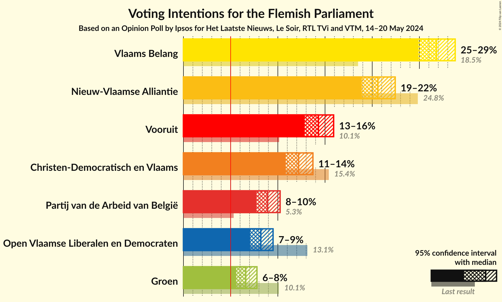

### Confidence Intervals

| Party | Last Result | Poll Result | 80% Confidence Interval | 90% Confidence Interval | 95% Confidence Interval | 99% Confidence Interval |
|:-----:|:-----------:|:-----------:|:-----------------------:|:-----------------------:|:-----------------------:|:-----------------------:|
| Vlaams Belang | 18.5% | 26.8% | 25.5–28.1% |25.2–28.5% |24.9–28.8% |24.3–29.4% |
| Nieuw-Vlaamse Alliantie | 24.8% | 20.6% | 19.5–21.8% |19.2–22.1% |18.9–22.4% |18.4–23.0% |
| Vooruit | 10.1% | 14.3% | 13.3–15.3% |13.1–15.7% |12.8–15.9% |12.4–16.4% |
| Christen-Democratisch en Vlaams | 15.4% | 12.2% | 11.3–13.2% |11.1–13.5% |10.8–13.7% |10.4–14.2% |
| Partij van de Arbeid van België | 5.3% | 8.9% | 8.1–9.8% |7.9–10.0% |7.7–10.2% |7.4–10.7% |
| Open Vlaamse Liberalen en Democraten | 13.1% | 8.2% | 7.5–9.0% |7.3–9.3% |7.1–9.5% |6.7–9.9% |
| Groen | 10.1% | 6.6% | 5.9–7.4% |5.7–7.6% |5.6–7.8% |5.3–8.2% |

*Note:* The poll result column reflects the actual value used in the calculations. Published results may vary slightly, and in addition be rounded to fewer digits.

## Seats

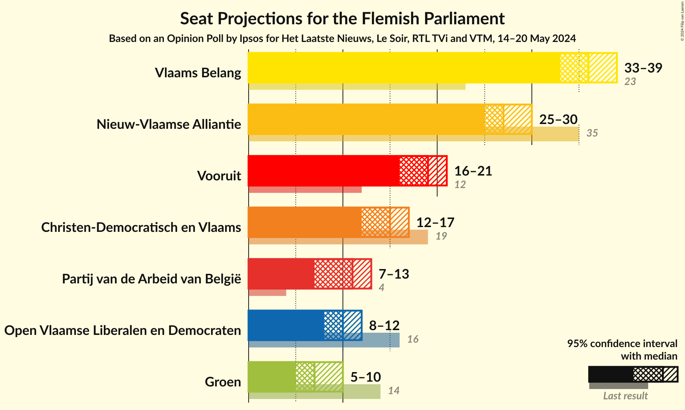

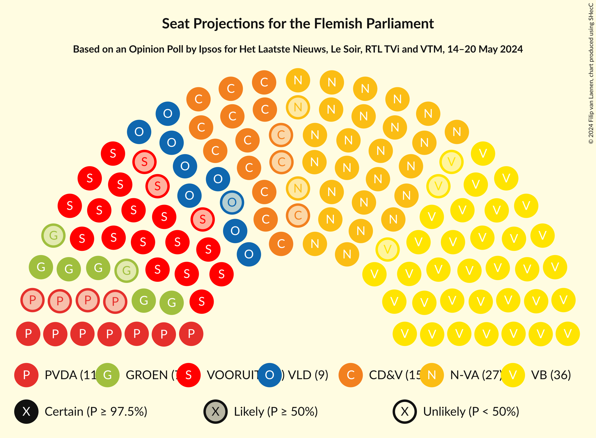

### Confidence Intervals

| Party | Last Result | Median | 80% Confidence Interval | 90% Confidence Interval | 95% Confidence Interval | 99% Confidence Interval |
|:-----:|:-----------:|:------:|:-----------------------:|:-----------------------:|:-----------------------:|:-----------------------:|
| <a href="#vlaams-belang">Vlaams Belang</a> | 23 | 36 | 34–38 |33–38 |33–39 |32–40 |
| <a href="#nieuw-vlaamse-alliantie">Nieuw-Vlaamse Alliantie</a> | 35 | 27 | 26–29 |26–30 |25–30 |24–31 |
| <a href="#vooruit">Vooruit</a> | 12 | 19 | 17–20 |16–20 |16–21 |16–23 |
| <a href="#christen-democratisch-en-vlaams">Christen-Democratisch en Vlaams</a> | 19 | 15 | 14–16 |13–17 |12–17 |11–17 |
| <a href="#partij-van-de-arbeid-van-belgië">Partij van de Arbeid van België</a> | 4 | 11 | 9–13 |8–13 |7–13 |7–13 |
| <a href="#open-vlaamse-liberalen-en-democraten">Open Vlaamse Liberalen en Democraten</a> | 16 | 10 | 8–11 |8–12 |8–12 |7–12 |
| <a href="#groen">Groen</a> | 14 | 7 | 5–9 |5–10 |5–10 |5–11 |

### Vlaams Belang

*For a full overview of the results for this party, see the [Vlaams Belang](party-vlaamsbelang.html) page.*

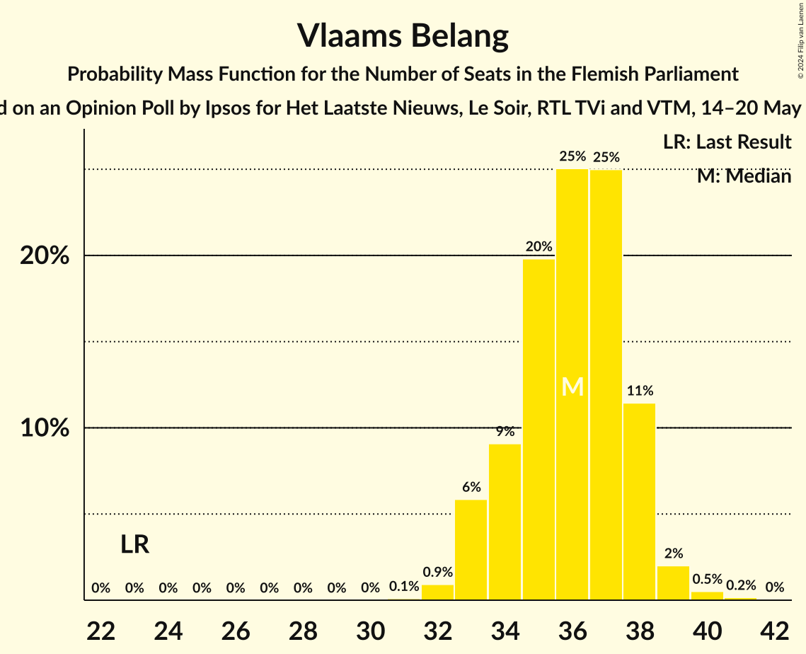

| Number of Seats | Probability | Accumulated | Special Marks |
|:---------------:|:-----------:|:-----------:|:-------------:|
| 23 | 0% | 100% | Last Result |
| 24 | 0% | 100% |  |
| 25 | 0% | 100% |  |
| 26 | 0% | 100% |  |
| 27 | 0% | 100% |  |
| 28 | 0% | 100% |  |
| 29 | 0% | 100% |  |
| 30 | 0% | 100% |  |
| 31 | 0.1% | 100% |  |
| 32 | 0.9% | 99.9% |  |
| 33 | 6% | 99.0% |  |
| 34 | 9% | 93% |  |
| 35 | 20% | 84% |  |
| 36 | 25% | 64% | Median |
| 37 | 25% | 39% |  |
| 38 | 11% | 14% |  |
| 39 | 2% | 3% |  |
| 40 | 0.5% | 0.7% |  |
| 41 | 0.2% | 0.2% |  |
| 42 | 0% | 0% |  |

### Nieuw-Vlaamse Alliantie

*For a full overview of the results for this party, see the [Nieuw-Vlaamse Alliantie](party-nieuw-vlaamsealliantie.html) page.*

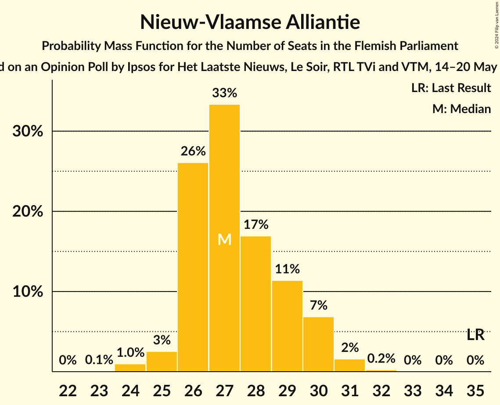

| Number of Seats | Probability | Accumulated | Special Marks |
|:---------------:|:-----------:|:-----------:|:-------------:|
| 23 | 0.1% | 100% |  |
| 24 | 1.0% | 99.9% |  |
| 25 | 3% | 98.9% |  |
| 26 | 26% | 96% |  |
| 27 | 33% | 70% | Median |
| 28 | 17% | 37% |  |
| 29 | 11% | 20% |  |
| 30 | 7% | 9% |  |
| 31 | 2% | 2% |  |
| 32 | 0.2% | 0.2% |  |
| 33 | 0% | 0% |  |
| 34 | 0% | 0% |  |
| 35 | 0% | 0% | Last Result |

### Vooruit

*For a full overview of the results for this party, see the [Vooruit](party-vooruit.html) page.*

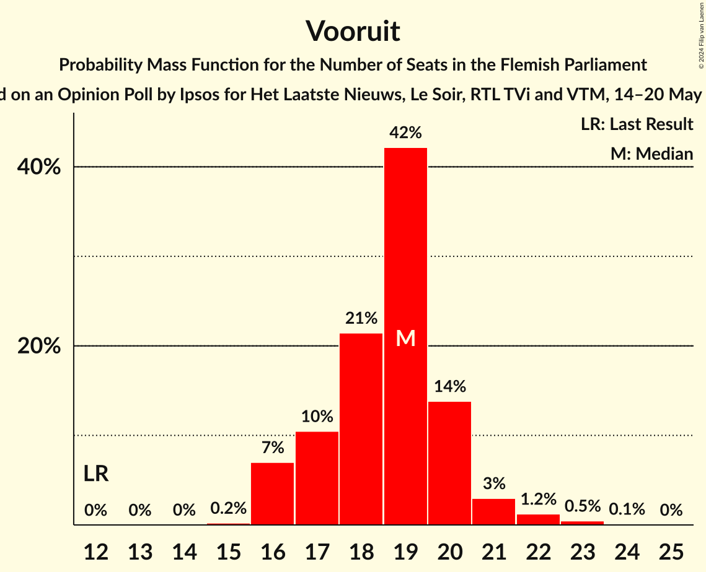

| Number of Seats | Probability | Accumulated | Special Marks |
|:---------------:|:-----------:|:-----------:|:-------------:|
| 12 | 0% | 100% | Last Result |
| 13 | 0% | 100% |  |
| 14 | 0% | 100% |  |
| 15 | 0.2% | 100% |  |
| 16 | 7% | 99.7% |  |
| 17 | 10% | 93% |  |
| 18 | 21% | 82% |  |
| 19 | 42% | 61% | Median |
| 20 | 14% | 19% |  |
| 21 | 3% | 5% |  |
| 22 | 1.2% | 2% |  |
| 23 | 0.5% | 0.6% |  |
| 24 | 0.1% | 0.1% |  |
| 25 | 0% | 0% |  |

### Christen-Democratisch en Vlaams

*For a full overview of the results for this party, see the [Christen-Democratisch en Vlaams](party-christen-democratischenvlaams.html) page.*

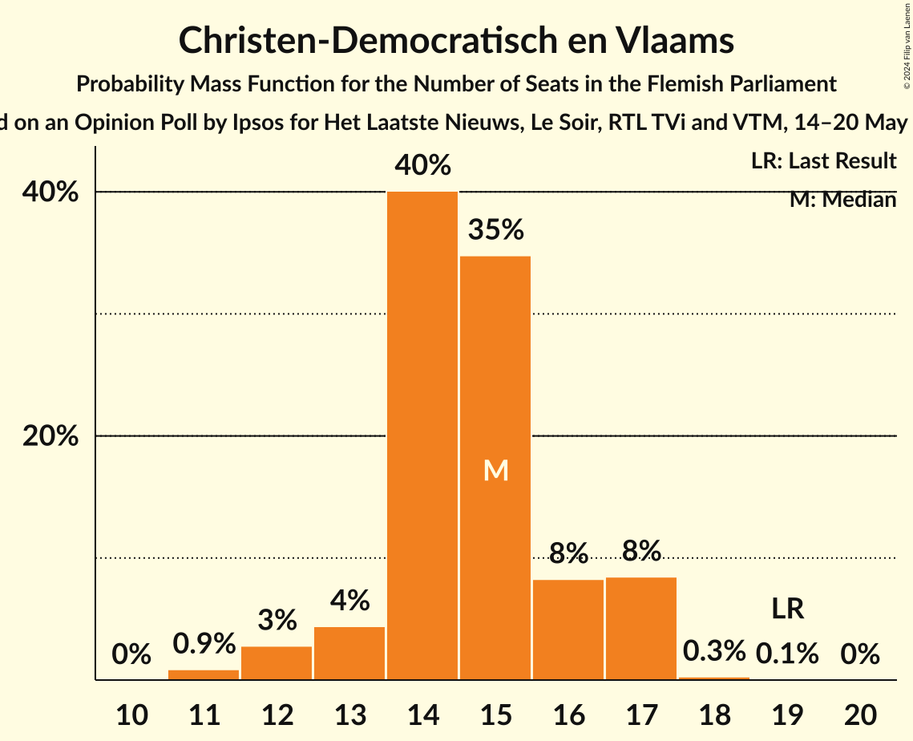

| Number of Seats | Probability | Accumulated | Special Marks |
|:---------------:|:-----------:|:-----------:|:-------------:|
| 11 | 0.9% | 100% |  |
| 12 | 3% | 99.1% |  |
| 13 | 4% | 96% |  |
| 14 | 40% | 92% |  |
| 15 | 35% | 52% | Median |
| 16 | 8% | 17% |  |
| 17 | 8% | 9% |  |
| 18 | 0.3% | 0.3% |  |
| 19 | 0.1% | 0.1% | Last Result |
| 20 | 0% | 0% |  |

### Partij van de Arbeid van België

*For a full overview of the results for this party, see the [Partij van de Arbeid van België](party-partijvandearbeidvanbelgië.html) page.*

| Number of Seats | Probability | Accumulated | Special Marks |
|:---------------:|:-----------:|:-----------:|:-------------:|
| 4 | 0% | 100% | Last Result |
| 5 | 0% | 100% |  |
| 6 | 0% | 100% |  |
| 7 | 4% | 100% |  |
| 8 | 4% | 96% |  |
| 9 | 13% | 92% |  |
| 10 | 13% | 79% |  |
| 11 | 38% | 66% | Median |
| 12 | 15% | 28% |  |
| 13 | 12% | 13% |  |
| 14 | 0.3% | 0.3% |  |
| 15 | 0% | 0% |  |

### Open Vlaamse Liberalen en Democraten

*For a full overview of the results for this party, see the [Open Vlaamse Liberalen en Democraten](party-openvlaamseliberalenendemocraten.html) page.*

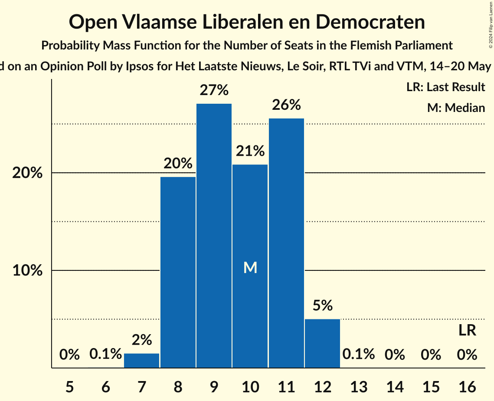

| Number of Seats | Probability | Accumulated | Special Marks |
|:---------------:|:-----------:|:-----------:|:-------------:|
| 6 | 0.1% | 100% |  |
| 7 | 2% | 99.9% |  |
| 8 | 20% | 98% |  |
| 9 | 27% | 79% |  |
| 10 | 21% | 52% | Median |
| 11 | 26% | 31% |  |
| 12 | 5% | 5% |  |
| 13 | 0.1% | 0.1% |  |
| 14 | 0% | 0% |  |
| 15 | 0% | 0% |  |
| 16 | 0% | 0% | Last Result |

### Groen

*For a full overview of the results for this party, see the [Groen](party-groen.html) page.*

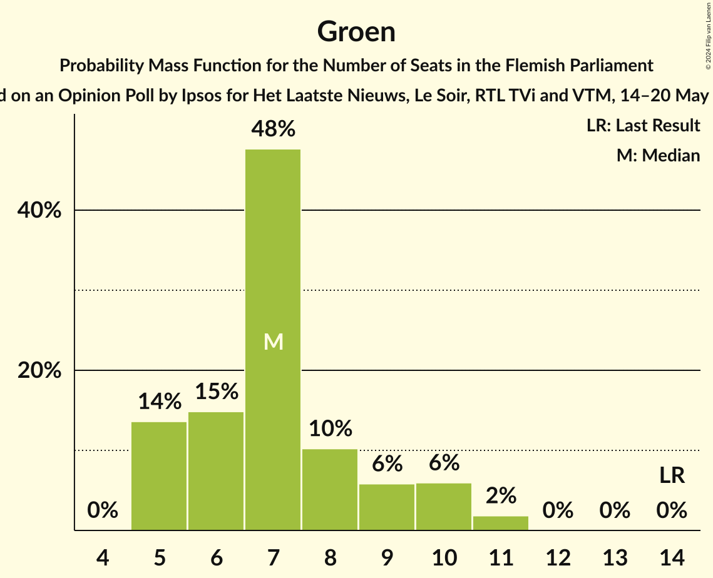

| Number of Seats | Probability | Accumulated | Special Marks |
|:---------------:|:-----------:|:-----------:|:-------------:|
| 5 | 14% | 100% |  |
| 6 | 15% | 86% |  |
| 7 | 48% | 72% | Median |
| 8 | 10% | 24% |  |
| 9 | 6% | 14% |  |
| 10 | 6% | 8% |  |
| 11 | 2% | 2% |  |
| 12 | 0% | 0% |  |
| 13 | 0% | 0% |  |
| 14 | 0% | 0% | Last Result |

## Coalitions

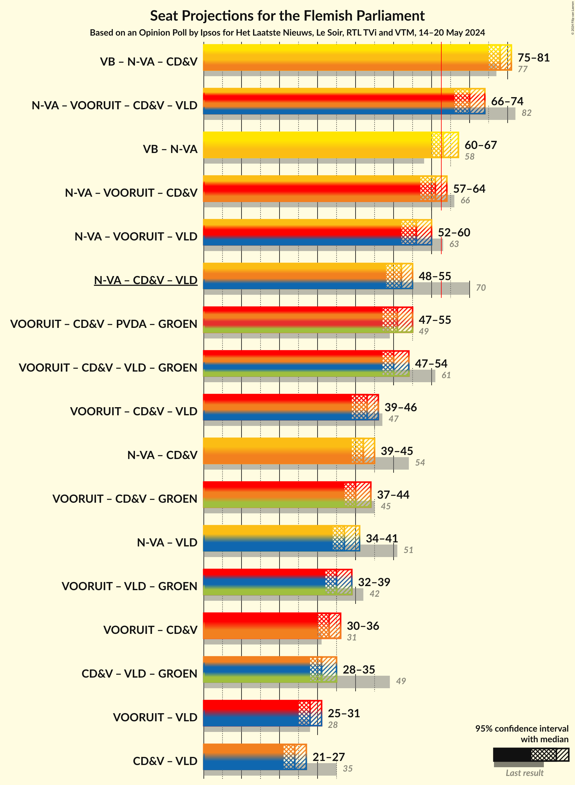

### Confidence Intervals

| Coalition | Last Result | Median | Majority? | 80% Confidence Interval | 90% Confidence Interval | 95% Confidence Interval | 99% Confidence Interval |
|:---------:|:-----------:|:------:|:---------:|:-----------------------:|:-----------------------:|:-----------------------:|:-----------------------:|
| Vlaams Belang – Nieuw-Vlaamse Alliantie – Christen-Democratisch en Vlaams | 77 | 78 | 100% | 76–80 | 75–81 | 75–81 | 74–82 |
| Nieuw-Vlaamse Alliantie – Vooruit – Christen-Democratisch en Vlaams – Open Vlaamse Liberalen en Democraten | 82 | 70 | 100% | 68–73 | 67–73 | 66–74 | 65–76 |
| Vlaams Belang – Nieuw-Vlaamse Alliantie | 58 | 63 | 66% | 61–66 | 61–66 | 60–67 | 59–68 |
| Nieuw-Vlaamse Alliantie – Vooruit – Christen-Democratisch en Vlaams | 66 | 61 | 16% | 58–63 | 57–64 | 57–64 | 56–66 |
| Nieuw-Vlaamse Alliantie – Vooruit – Open Vlaamse Liberalen en Democraten | 63 | 56 | 0% | 53–58 | 53–59 | 52–60 | 51–61 |
| Nieuw-Vlaamse Alliantie – Christen-Democratisch en Vlaams – Open Vlaamse Liberalen en Democraten | 70 | 52 | 0% | 49–54 | 48–55 | 48–55 | 47–57 |
| Vooruit – Christen-Democratisch en Vlaams – Partij van de Arbeid van België – Groen | 49 | 51 | 0% | 48–54 | 48–54 | 47–55 | 46–56 |
| Vooruit – Christen-Democratisch en Vlaams – Open Vlaamse Liberalen en Democraten – Groen | 61 | 50 | 0% | 48–52 | 47–53 | 47–54 | 46–55 |
| Vooruit – Christen-Democratisch en Vlaams – Open Vlaamse Liberalen en Democraten | 47 | 43 | 0% | 41–45 | 40–46 | 39–46 | 38–47 |
| Nieuw-Vlaamse Alliantie – Christen-Democratisch en Vlaams | 54 | 42 | 0% | 40–44 | 39–45 | 39–45 | 38–47 |
| Vooruit – Christen-Democratisch en Vlaams – Groen | 45 | 40 | 0% | 38–43 | 37–44 | 37–44 | 36–45 |
| Nieuw-Vlaamse Alliantie – Open Vlaamse Liberalen en Democraten | 51 | 37 | 0% | 35–39 | 34–40 | 34–41 | 33–42 |
| Vooruit – Open Vlaamse Liberalen en Democraten – Groen | 42 | 35 | 0% | 33–37 | 33–38 | 32–39 | 31–40 |
| Vooruit – Christen-Democratisch en Vlaams | 31 | 33 | 0% | 31–35 | 30–36 | 30–36 | 29–37 |
| Christen-Democratisch en Vlaams – Open Vlaamse Liberalen en Democraten – Groen | 49 | 31 | 0% | 29–34 | 28–34 | 28–35 | 27–37 |
| Vooruit – Open Vlaamse Liberalen en Democraten | 28 | 28 | 0% | 27–30 | 26–31 | 25–31 | 24–33 |
| Christen-Democratisch en Vlaams – Open Vlaamse Liberalen en Democraten | 35 | 24 | 0% | 22–26 | 22–27 | 21–27 | 20–28 |

### Vlaams Belang – Nieuw-Vlaamse Alliantie – Christen-Democratisch en Vlaams

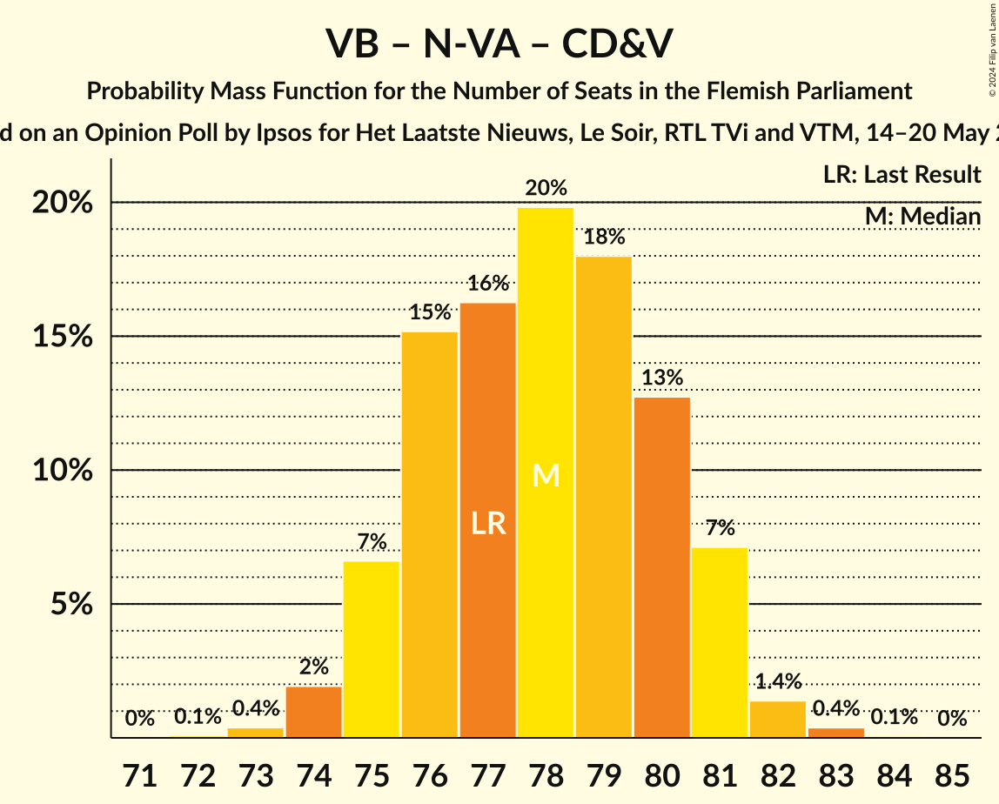

| Number of Seats | Probability | Accumulated | Special Marks |
|:---------------:|:-----------:|:-----------:|:-------------:|
| 72 | 0.1% | 100% |  |
| 73 | 0.4% | 99.9% |  |
| 74 | 2% | 99.5% |  |
| 75 | 7% | 98% |  |
| 76 | 15% | 91% |  |
| 77 | 16% | 76% | Last Result |
| 78 | 20% | 60% | Median |
| 79 | 18% | 40% |  |
| 80 | 13% | 22% |  |
| 81 | 7% | 9% |  |
| 82 | 1.4% | 2% |  |
| 83 | 0.4% | 0.5% |  |
| 84 | 0.1% | 0.1% |  |
| 85 | 0% | 0% |  |

### Nieuw-Vlaamse Alliantie – Vooruit – Christen-Democratisch en Vlaams – Open Vlaamse Liberalen en Democraten

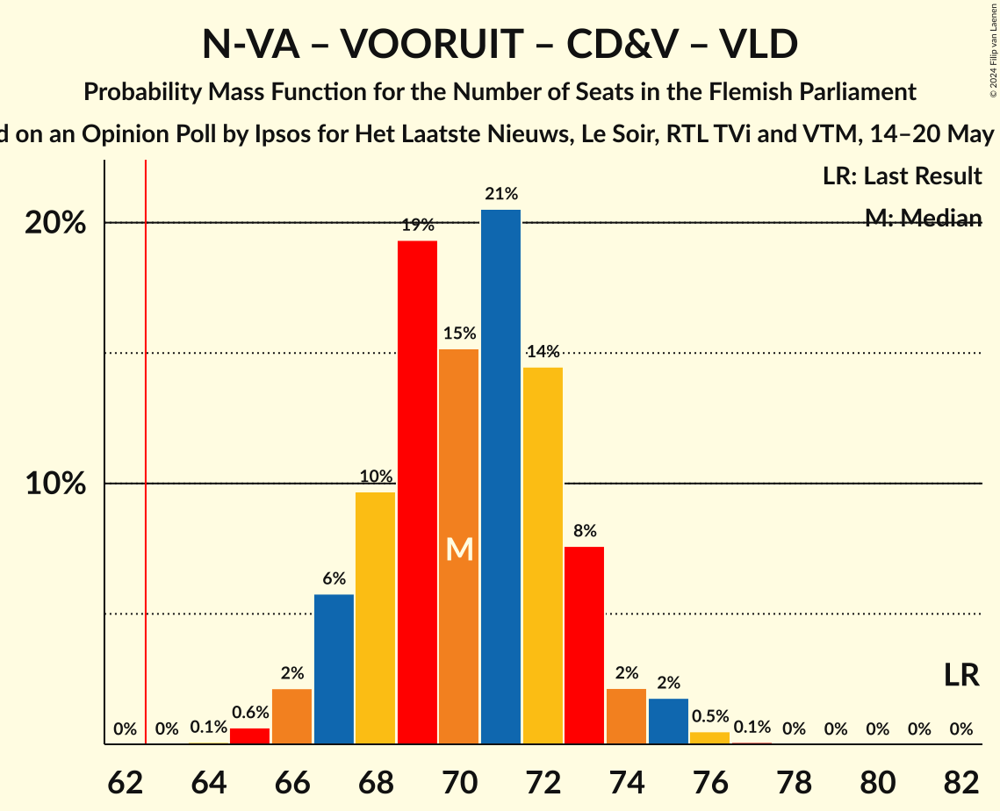

| Number of Seats | Probability | Accumulated | Special Marks |
|:---------------:|:-----------:|:-----------:|:-------------:|
| 64 | 0.1% | 100% |  |
| 65 | 0.6% | 99.9% |  |
| 66 | 2% | 99.3% |  |
| 67 | 6% | 97% |  |
| 68 | 10% | 91% |  |
| 69 | 19% | 82% |  |
| 70 | 15% | 62% |  |
| 71 | 21% | 47% | Median |
| 72 | 14% | 27% |  |
| 73 | 8% | 12% |  |
| 74 | 2% | 5% |  |
| 75 | 2% | 2% |  |
| 76 | 0.5% | 0.6% |  |
| 77 | 0.1% | 0.1% |  |
| 78 | 0% | 0% |  |
| 79 | 0% | 0% |  |
| 80 | 0% | 0% |  |
| 81 | 0% | 0% |  |
| 82 | 0% | 0% | Last Result |

### Vlaams Belang – Nieuw-Vlaamse Alliantie

| Number of Seats | Probability | Accumulated | Special Marks |
|:---------------:|:-----------:|:-----------:|:-------------:|
| 58 | 0.2% | 100% | Last Result |
| 59 | 1.0% | 99.8% |  |
| 60 | 4% | 98.8% |  |
| 61 | 11% | 95% |  |
| 62 | 18% | 84% |  |
| 63 | 20% | 66% | Median, Majority |
| 64 | 23% | 46% |  |
| 65 | 12% | 23% |  |
| 66 | 7% | 11% |  |
| 67 | 3% | 4% |  |
| 68 | 1.0% | 1.2% |  |
| 69 | 0.2% | 0.2% |  |
| 70 | 0% | 0% |  |

### Nieuw-Vlaamse Alliantie – Vooruit – Christen-Democratisch en Vlaams

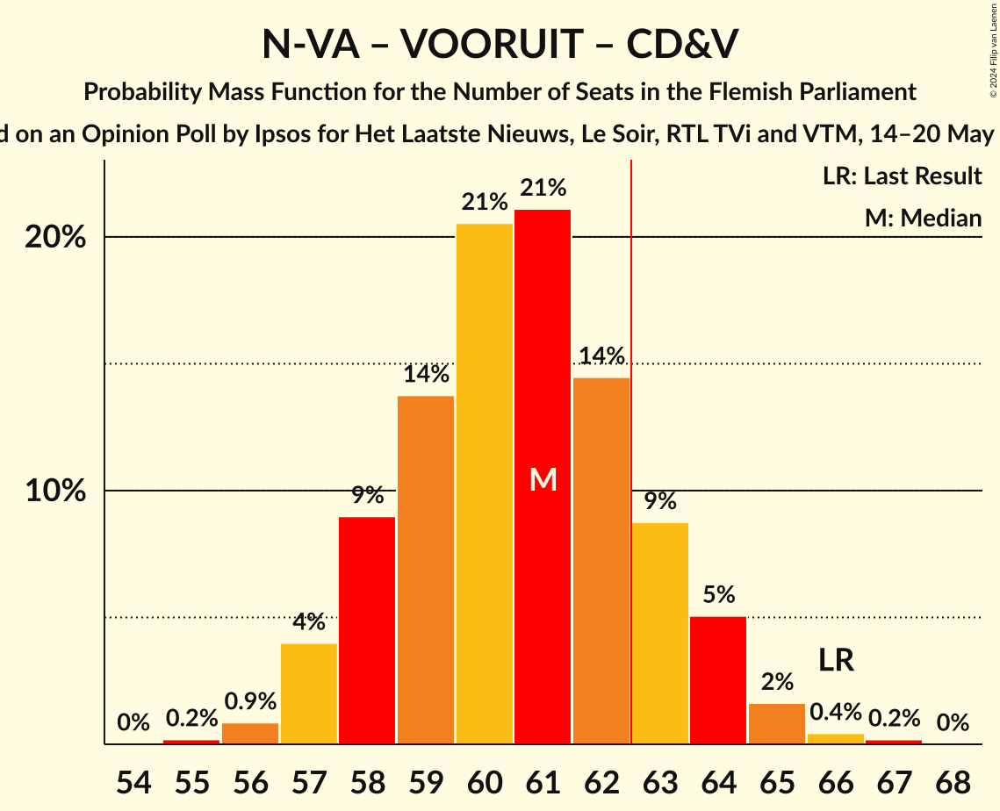

| Number of Seats | Probability | Accumulated | Special Marks |
|:---------------:|:-----------:|:-----------:|:-------------:|
| 55 | 0.2% | 100% |  |
| 56 | 0.9% | 99.8% |  |
| 57 | 4% | 98.9% |  |
| 58 | 9% | 95% |  |
| 59 | 14% | 86% |  |
| 60 | 21% | 72% |  |
| 61 | 21% | 52% | Median |
| 62 | 14% | 31% |  |
| 63 | 9% | 16% | Majority |
| 64 | 5% | 7% |  |
| 65 | 2% | 2% |  |
| 66 | 0.4% | 0.6% | Last Result |
| 67 | 0.2% | 0.2% |  |
| 68 | 0% | 0% |  |

### Nieuw-Vlaamse Alliantie – Vooruit – Open Vlaamse Liberalen en Democraten

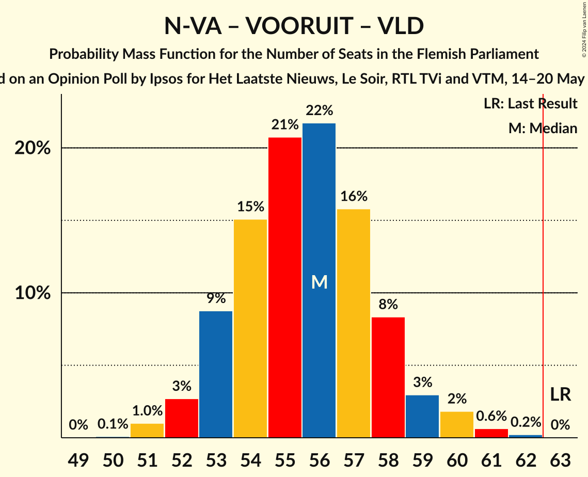

| Number of Seats | Probability | Accumulated | Special Marks |
|:---------------:|:-----------:|:-----------:|:-------------:|
| 50 | 0.1% | 100% |  |
| 51 | 1.0% | 99.9% |  |
| 52 | 3% | 98.9% |  |
| 53 | 9% | 96% |  |
| 54 | 15% | 87% |  |
| 55 | 21% | 72% |  |
| 56 | 22% | 52% | Median |
| 57 | 16% | 30% |  |
| 58 | 8% | 14% |  |
| 59 | 3% | 6% |  |
| 60 | 2% | 3% |  |
| 61 | 0.6% | 0.9% |  |
| 62 | 0.2% | 0.3% |  |
| 63 | 0% | 0% | Last Result, Majority |

### Nieuw-Vlaamse Alliantie – Christen-Democratisch en Vlaams – Open Vlaamse Liberalen en Democraten

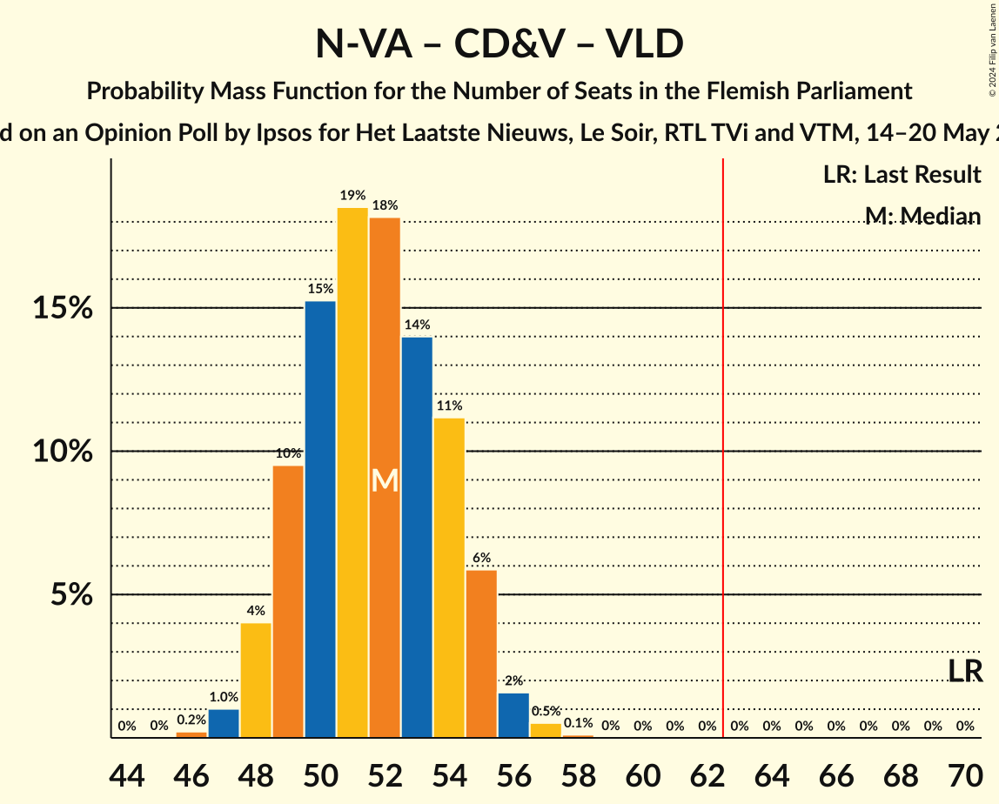

| Number of Seats | Probability | Accumulated | Special Marks |
|:---------------:|:-----------:|:-----------:|:-------------:|
| 46 | 0.2% | 100% |  |
| 47 | 1.0% | 99.8% |  |
| 48 | 4% | 98.7% |  |
| 49 | 10% | 95% |  |
| 50 | 15% | 85% |  |
| 51 | 19% | 70% |  |
| 52 | 18% | 51% | Median |
| 53 | 14% | 33% |  |
| 54 | 11% | 19% |  |
| 55 | 6% | 8% |  |
| 56 | 2% | 2% |  |
| 57 | 0.5% | 0.6% |  |
| 58 | 0.1% | 0.1% |  |
| 59 | 0% | 0% |  |
| 60 | 0% | 0% |  |
| 61 | 0% | 0% |  |
| 62 | 0% | 0% |  |
| 63 | 0% | 0% | Majority |
| 64 | 0% | 0% |  |
| 65 | 0% | 0% |  |
| 66 | 0% | 0% |  |
| 67 | 0% | 0% |  |
| 68 | 0% | 0% |  |
| 69 | 0% | 0% |  |
| 70 | 0% | 0% | Last Result |

### Vooruit – Christen-Democratisch en Vlaams – Partij van de Arbeid van België – Groen

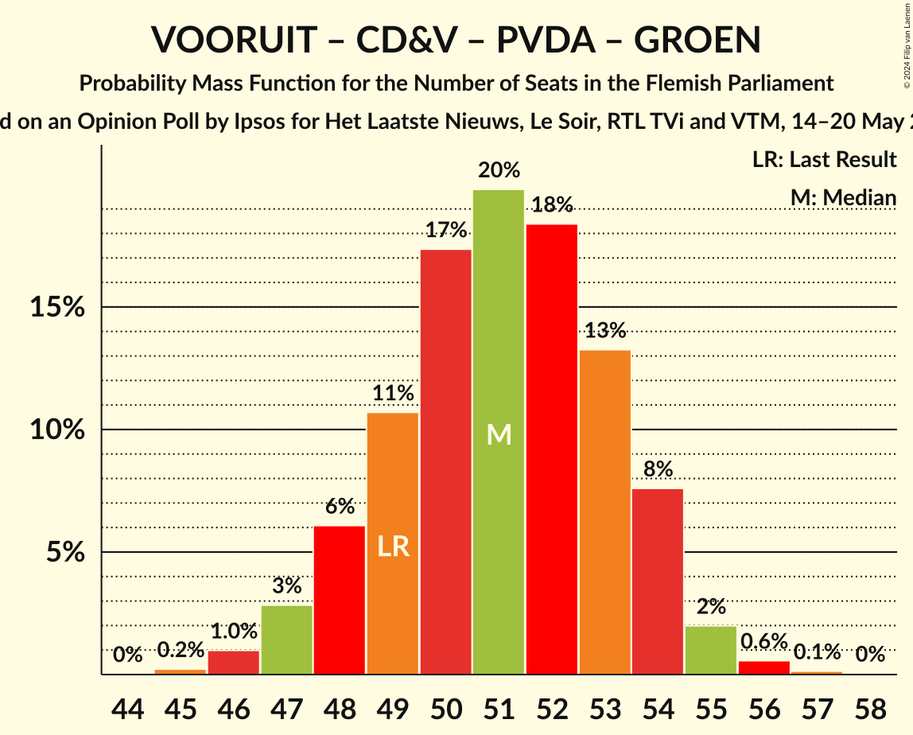

| Number of Seats | Probability | Accumulated | Special Marks |
|:---------------:|:-----------:|:-----------:|:-------------:|
| 45 | 0.2% | 100% |  |
| 46 | 1.0% | 99.7% |  |
| 47 | 3% | 98.8% |  |
| 48 | 6% | 96% |  |
| 49 | 11% | 90% | Last Result |
| 50 | 17% | 79% |  |
| 51 | 20% | 62% |  |
| 52 | 18% | 42% | Median |
| 53 | 13% | 24% |  |
| 54 | 8% | 10% |  |
| 55 | 2% | 3% |  |
| 56 | 0.6% | 0.8% |  |
| 57 | 0.1% | 0.2% |  |
| 58 | 0% | 0% |  |

### Vooruit – Christen-Democratisch en Vlaams – Open Vlaamse Liberalen en Democraten – Groen

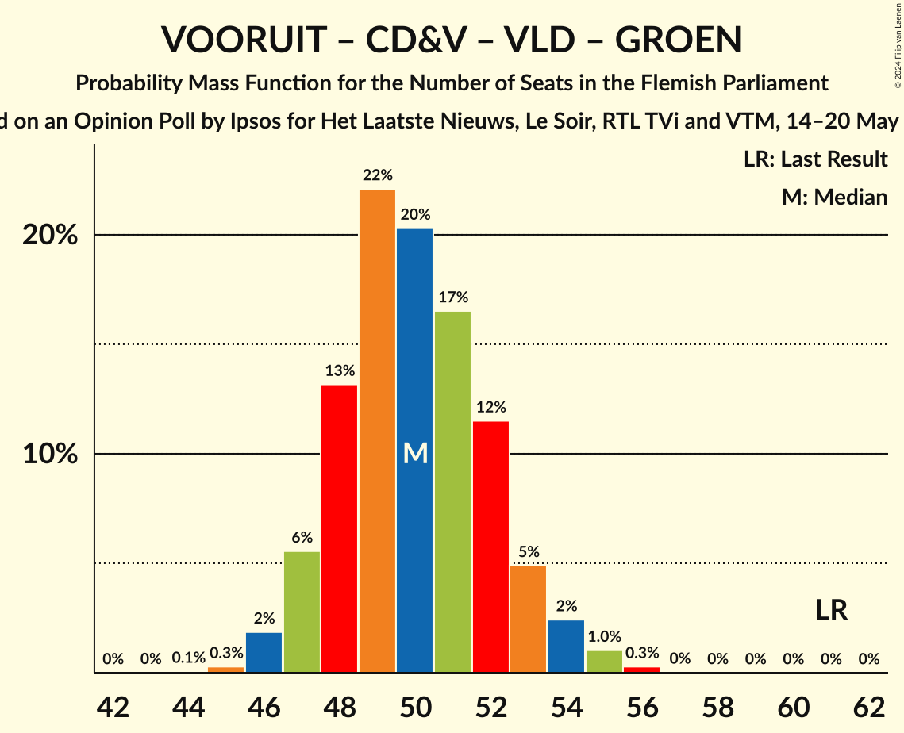

| Number of Seats | Probability | Accumulated | Special Marks |
|:---------------:|:-----------:|:-----------:|:-------------:|
| 44 | 0.1% | 100% |  |
| 45 | 0.3% | 99.9% |  |
| 46 | 2% | 99.6% |  |
| 47 | 6% | 98% |  |
| 48 | 13% | 92% |  |
| 49 | 22% | 79% |  |
| 50 | 20% | 57% |  |
| 51 | 17% | 37% | Median |
| 52 | 12% | 20% |  |
| 53 | 5% | 9% |  |
| 54 | 2% | 4% |  |
| 55 | 1.0% | 1.3% |  |
| 56 | 0.3% | 0.3% |  |
| 57 | 0% | 0% |  |
| 58 | 0% | 0% |  |
| 59 | 0% | 0% |  |
| 60 | 0% | 0% |  |
| 61 | 0% | 0% | Last Result |

### Vooruit – Christen-Democratisch en Vlaams – Open Vlaamse Liberalen en Democraten

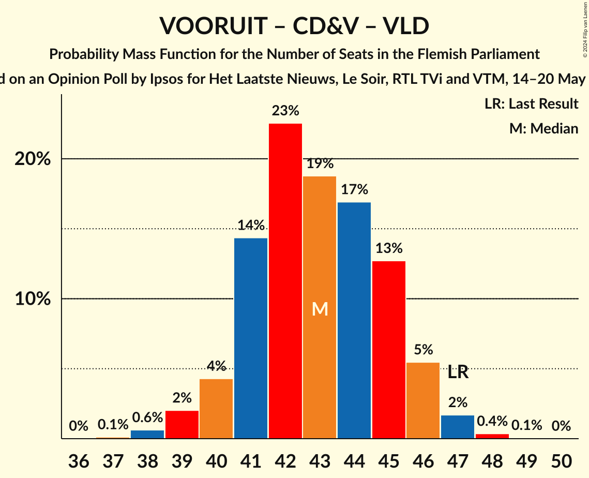

| Number of Seats | Probability | Accumulated | Special Marks |
|:---------------:|:-----------:|:-----------:|:-------------:|
| 37 | 0.1% | 100% |  |
| 38 | 0.6% | 99.9% |  |
| 39 | 2% | 99.2% |  |
| 40 | 4% | 97% |  |
| 41 | 14% | 93% |  |
| 42 | 23% | 79% |  |
| 43 | 19% | 56% |  |
| 44 | 17% | 37% | Median |
| 45 | 13% | 20% |  |
| 46 | 5% | 8% |  |
| 47 | 2% | 2% | Last Result |
| 48 | 0.4% | 0.4% |  |
| 49 | 0.1% | 0.1% |  |
| 50 | 0% | 0% |  |

### Nieuw-Vlaamse Alliantie – Christen-Democratisch en Vlaams

| Number of Seats | Probability | Accumulated | Special Marks |
|:---------------:|:-----------:|:-----------:|:-------------:|
| 37 | 0.2% | 100% |  |
| 38 | 2% | 99.8% |  |
| 39 | 4% | 98% |  |
| 40 | 12% | 94% |  |
| 41 | 23% | 82% |  |
| 42 | 24% | 59% | Median |
| 43 | 16% | 35% |  |
| 44 | 12% | 20% |  |
| 45 | 6% | 8% |  |
| 46 | 1.2% | 2% |  |
| 47 | 0.6% | 0.6% |  |
| 48 | 0% | 0% |  |
| 49 | 0% | 0% |  |
| 50 | 0% | 0% |  |
| 51 | 0% | 0% |  |
| 52 | 0% | 0% |  |
| 53 | 0% | 0% |  |
| 54 | 0% | 0% | Last Result |

### Vooruit – Christen-Democratisch en Vlaams – Groen

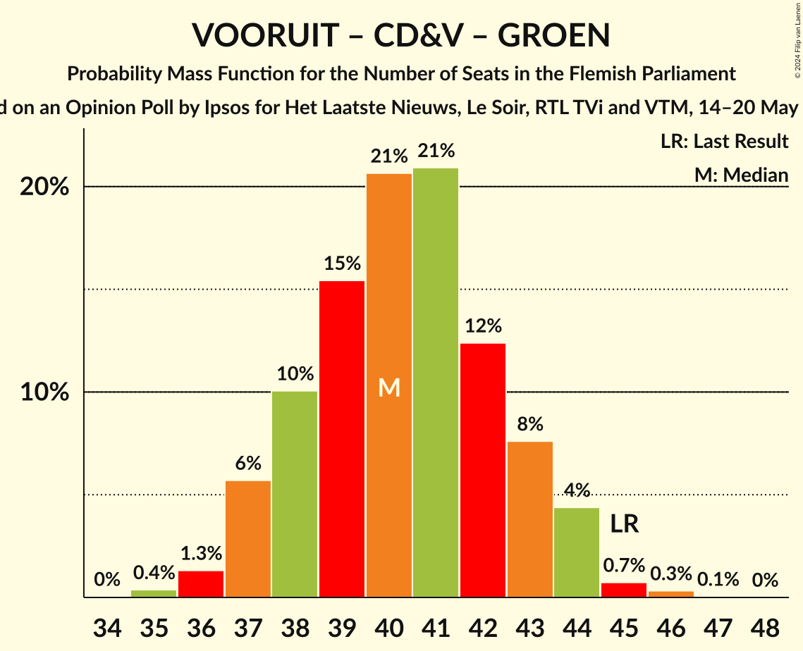

| Number of Seats | Probability | Accumulated | Special Marks |
|:---------------:|:-----------:|:-----------:|:-------------:|
| 34 | 0% | 100% |  |
| 35 | 0.4% | 99.9% |  |
| 36 | 1.3% | 99.6% |  |
| 37 | 6% | 98% |  |
| 38 | 10% | 93% |  |
| 39 | 15% | 82% |  |
| 40 | 21% | 67% |  |
| 41 | 21% | 46% | Median |
| 42 | 12% | 25% |  |
| 43 | 8% | 13% |  |
| 44 | 4% | 5% |  |
| 45 | 0.7% | 1.1% | Last Result |
| 46 | 0.3% | 0.4% |  |
| 47 | 0.1% | 0.1% |  |
| 48 | 0% | 0% |  |

### Nieuw-Vlaamse Alliantie – Open Vlaamse Liberalen en Democraten

| Number of Seats | Probability | Accumulated | Special Marks |
|:---------------:|:-----------:|:-----------:|:-------------:|
| 32 | 0.1% | 100% |  |
| 33 | 1.3% | 99.9% |  |
| 34 | 5% | 98.6% |  |
| 35 | 14% | 93% |  |
| 36 | 18% | 79% |  |
| 37 | 26% | 61% | Median |
| 38 | 14% | 35% |  |
| 39 | 12% | 20% |  |
| 40 | 6% | 9% |  |
| 41 | 2% | 3% |  |
| 42 | 0.5% | 0.7% |  |
| 43 | 0.1% | 0.1% |  |
| 44 | 0% | 0% |  |
| 45 | 0% | 0% |  |
| 46 | 0% | 0% |  |
| 47 | 0% | 0% |  |
| 48 | 0% | 0% |  |
| 49 | 0% | 0% |  |
| 50 | 0% | 0% |  |
| 51 | 0% | 0% | Last Result |

### Vooruit – Open Vlaamse Liberalen en Democraten – Groen

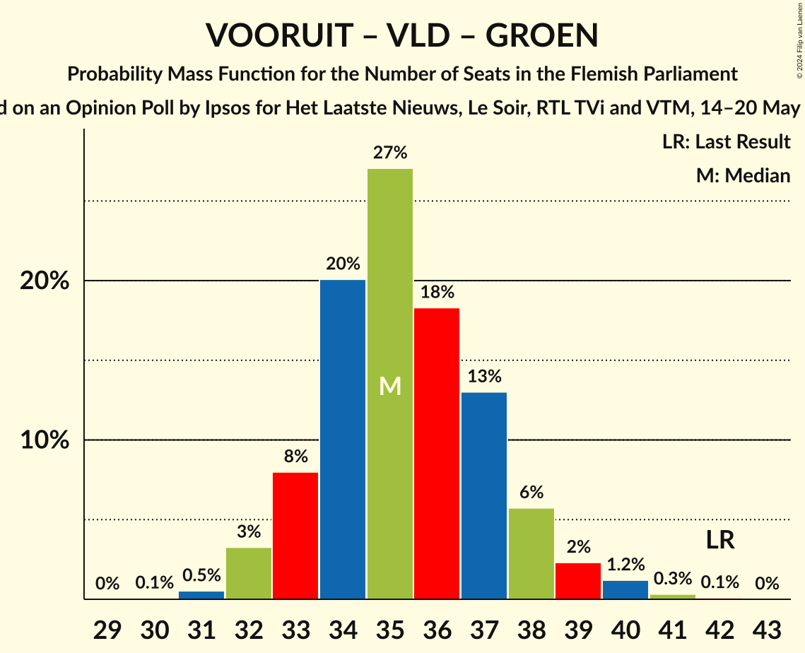

| Number of Seats | Probability | Accumulated | Special Marks |
|:---------------:|:-----------:|:-----------:|:-------------:|
| 30 | 0.1% | 100% |  |
| 31 | 0.5% | 99.9% |  |
| 32 | 3% | 99.4% |  |
| 33 | 8% | 96% |  |
| 34 | 20% | 88% |  |
| 35 | 27% | 68% |  |
| 36 | 18% | 41% | Median |
| 37 | 13% | 23% |  |
| 38 | 6% | 10% |  |
| 39 | 2% | 4% |  |
| 40 | 1.2% | 2% |  |
| 41 | 0.3% | 0.4% |  |
| 42 | 0.1% | 0.1% | Last Result |
| 43 | 0% | 0% |  |

### Vooruit – Christen-Democratisch en Vlaams

| Number of Seats | Probability | Accumulated | Special Marks |
|:---------------:|:-----------:|:-----------:|:-------------:|
| 28 | 0.1% | 100% |  |
| 29 | 0.4% | 99.9% |  |
| 30 | 5% | 99.4% |  |
| 31 | 9% | 95% | Last Result |
| 32 | 16% | 86% |  |
| 33 | 25% | 71% |  |
| 34 | 26% | 46% | Median |
| 35 | 11% | 19% |  |
| 36 | 6% | 9% |  |
| 37 | 2% | 2% |  |
| 38 | 0.2% | 0.3% |  |
| 39 | 0.1% | 0.1% |  |
| 40 | 0% | 0% |  |

### Christen-Democratisch en Vlaams – Open Vlaamse Liberalen en Democraten – Groen

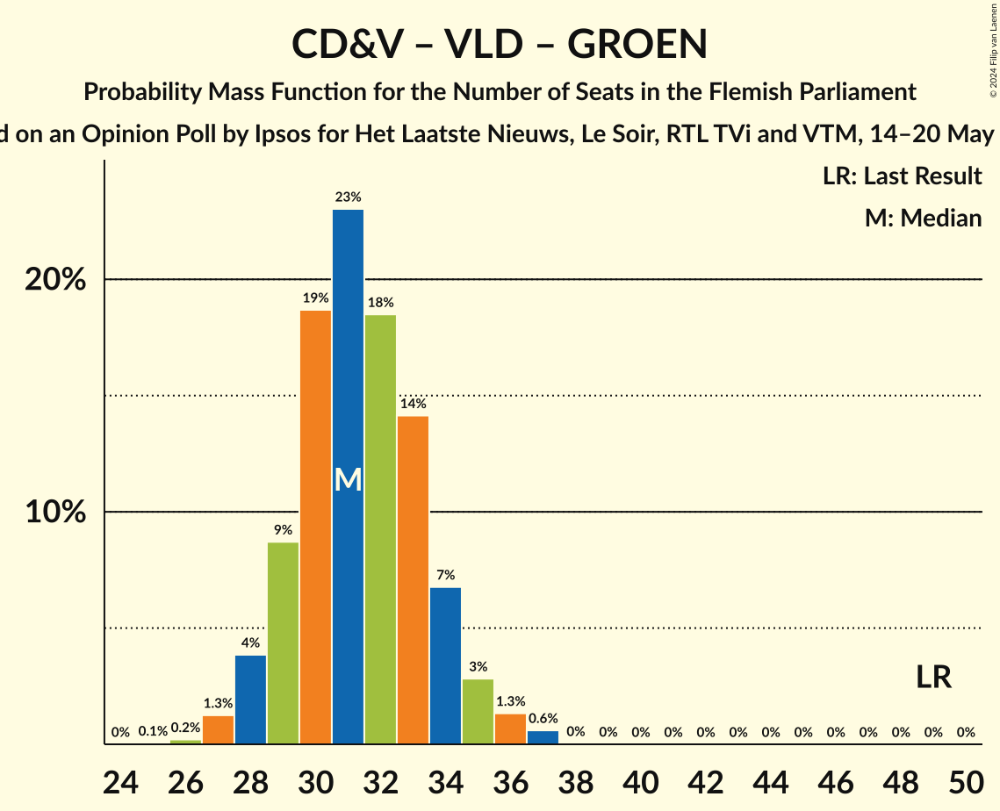

| Number of Seats | Probability | Accumulated | Special Marks |
|:---------------:|:-----------:|:-----------:|:-------------:|
| 25 | 0.1% | 100% |  |
| 26 | 0.2% | 99.9% |  |
| 27 | 1.3% | 99.7% |  |
| 28 | 4% | 98% |  |
| 29 | 9% | 95% |  |
| 30 | 19% | 86% |  |
| 31 | 23% | 67% |  |
| 32 | 18% | 44% | Median |
| 33 | 14% | 26% |  |
| 34 | 7% | 12% |  |
| 35 | 3% | 5% |  |
| 36 | 1.3% | 2% |  |
| 37 | 0.6% | 0.6% |  |
| 38 | 0% | 0% |  |
| 39 | 0% | 0% |  |
| 40 | 0% | 0% |  |
| 41 | 0% | 0% |  |
| 42 | 0% | 0% |  |
| 43 | 0% | 0% |  |
| 44 | 0% | 0% |  |
| 45 | 0% | 0% |  |
| 46 | 0% | 0% |  |
| 47 | 0% | 0% |  |
| 48 | 0% | 0% |  |
| 49 | 0% | 0% | Last Result |

### Vooruit – Open Vlaamse Liberalen en Democraten

| Number of Seats | Probability | Accumulated | Special Marks |
|:---------------:|:-----------:|:-----------:|:-------------:|
| 23 | 0.1% | 100% |  |
| 24 | 0.7% | 99.9% |  |
| 25 | 3% | 99.2% |  |
| 26 | 6% | 96% |  |
| 27 | 23% | 91% |  |
| 28 | 28% | 68% | Last Result |
| 29 | 18% | 40% | Median |
| 30 | 14% | 22% |  |
| 31 | 6% | 8% |  |
| 32 | 1.3% | 2% |  |
| 33 | 0.5% | 0.6% |  |
| 34 | 0.1% | 0.1% |  |
| 35 | 0% | 0% |  |

### Christen-Democratisch en Vlaams – Open Vlaamse Liberalen en Democraten

| Number of Seats | Probability | Accumulated | Special Marks |
|:---------------:|:-----------:|:-----------:|:-------------:|
| 19 | 0.1% | 100% |  |
| 20 | 0.7% | 99.9% |  |
| 21 | 2% | 99.2% |  |
| 22 | 12% | 97% |  |
| 23 | 20% | 85% |  |
| 24 | 19% | 65% |  |
| 25 | 22% | 47% | Median |
| 26 | 16% | 25% |  |
| 27 | 7% | 9% |  |
| 28 | 2% | 2% |  |
| 29 | 0.2% | 0.2% |  |
| 30 | 0% | 0% |  |
| 31 | 0% | 0% |  |
| 32 | 0% | 0% |  |
| 33 | 0% | 0% |  |
| 34 | 0% | 0% |  |
| 35 | 0% | 0% | Last Result |

## Technical Information

### Opinion Poll

+ **Polling firm:** Ipsos
+ **Commissioner(s):** Het Laatste Nieuws, Le Soir, RTL TVi and VTM
+ **Fieldwork period:** 14–20 May 2024

### Calculations

+ **Sample size:** 2000
+ **Simulations done:** 2,097,152
+ **Error estimate:** 0.73%

