# Opinion Poll by Cluster17 for RTL TVi, 28–31 May 2024

<a href="#voting-intentions">Voting Intentions</a> | <a href="#seats">Seats</a> | <a href="#coalitions">Coalitions</a> | <a href="#technical-information">Technical Information</a>

## Voting Intentions

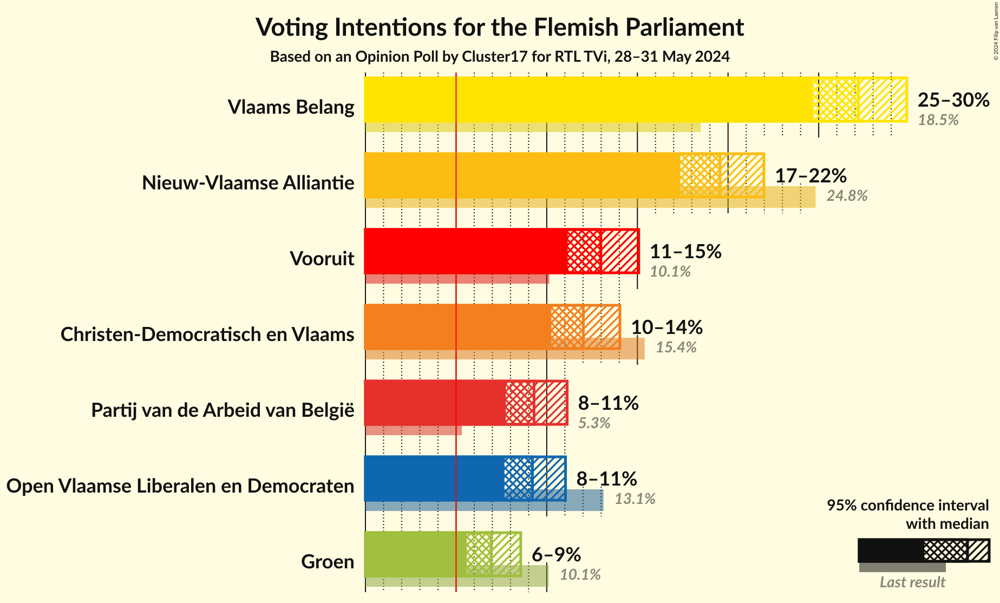

### Confidence Intervals

| Party | Last Result | Poll Result | 80% Confidence Interval | 90% Confidence Interval | 95% Confidence Interval | 99% Confidence Interval |
|:-----:|:-----------:|:-----------:|:-----------------------:|:-----------------------:|:-----------------------:|:-----------------------:|
| Vlaams Belang | 18.5% | 27.2% | 25.5–28.9% |25.1–29.4% |24.7–29.9% |23.9–30.7% |
| Nieuw-Vlaamse Alliantie | 24.8% | 19.6% | 18.1–21.1% |17.7–21.6% |17.4–22.0% |16.7–22.7% |
| Vooruit | 10.1% | 13.0% | 11.8–14.3% |11.4–14.7% |11.2–15.1% |10.6–15.7% |
| Christen-Democratisch en Vlaams | 15.4% | 12.0% | 10.9–13.3% |10.5–13.7% |10.3–14.0% |9.7–14.7% |
| Partij van de Arbeid van België | 5.3% | 9.3% | 8.3–10.5% |8.0–10.8% |7.7–11.1% |7.3–11.7% |
| Open Vlaamse Liberalen en Democraten | 13.1% | 9.2% | 8.2–10.4% |7.9–10.7% |7.7–11.0% |7.2–11.6% |
| Groen | 10.1% | 6.9% | 6.1–8.0% |5.8–8.3% |5.6–8.6% |5.2–9.1% |

*Note:* The poll result column reflects the actual value used in the calculations. Published results may vary slightly, and in addition be rounded to fewer digits.

## Seats

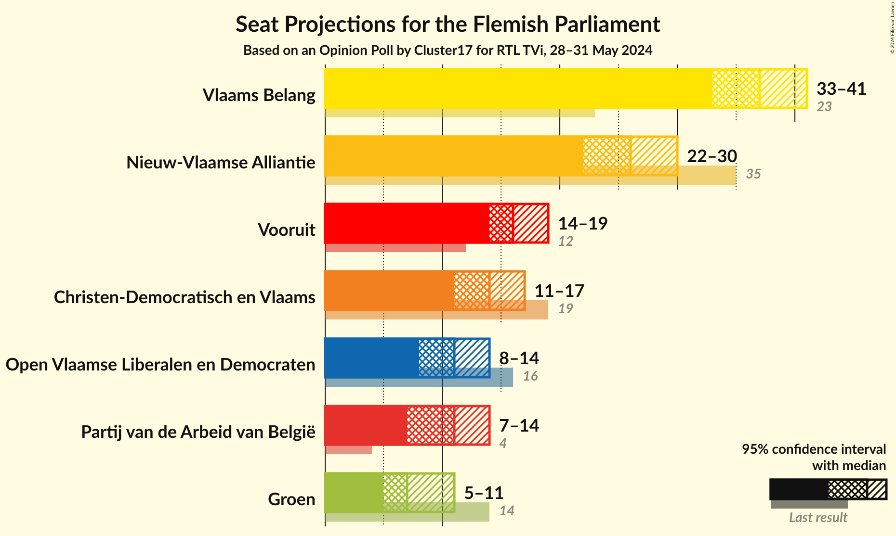

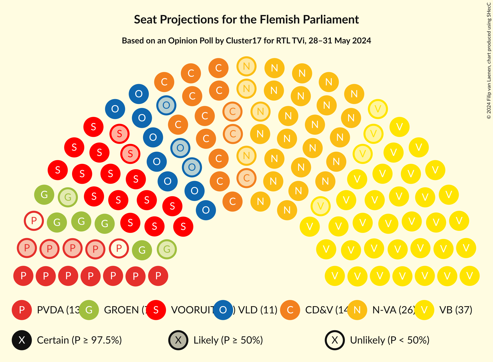

### Confidence Intervals

| Party | Last Result | Median | 80% Confidence Interval | 90% Confidence Interval | 95% Confidence Interval | 99% Confidence Interval |
|:-----:|:-----------:|:------:|:-----------------------:|:-----------------------:|:-----------------------:|:-----------------------:|
| <a href="#vlaams-belang">Vlaams Belang</a> | 23 | 37 | 34–39 |33–40 |33–41 |31–42 |
| <a href="#nieuw-vlaamse-alliantie">Nieuw-Vlaamse Alliantie</a> | 35 | 26 | 24–28 |23–29 |22–30 |22–31 |
| <a href="#vooruit">Vooruit</a> | 12 | 16 | 15–19 |14–19 |14–19 |13–20 |
| <a href="#christen-democratisch-en-vlaams">Christen-Democratisch en Vlaams</a> | 19 | 14 | 13–17 |12–17 |11–17 |11–18 |
| <a href="#partij-van-de-arbeid-van-belgië">Partij van de Arbeid van België</a> | 4 | 11 | 9–13 |8–14 |7–14 |7–14 |
| <a href="#open-vlaamse-liberalen-en-democraten">Open Vlaamse Liberalen en Democraten</a> | 16 | 11 | 9–13 |8–13 |8–14 |8–15 |
| <a href="#groen">Groen</a> | 14 | 7 | 5–11 |5–11 |5–11 |5–11 |

### Vlaams Belang

*For a full overview of the results for this party, see the [Vlaams Belang](party-vlaamsbelang.html) page.*

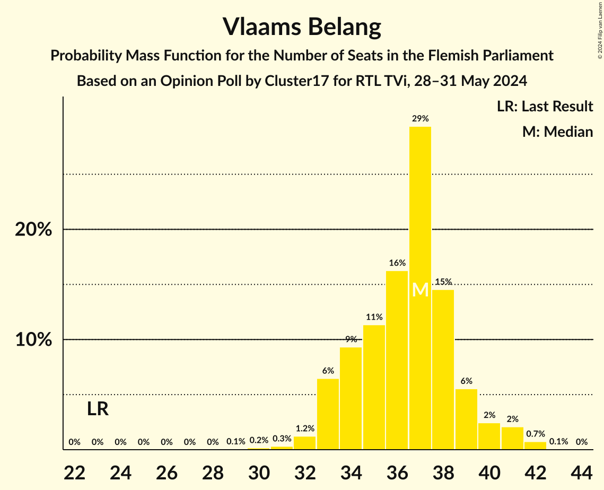

| Number of Seats | Probability | Accumulated | Special Marks |
|:---------------:|:-----------:|:-----------:|:-------------:|
| 23 | 0% | 100% | Last Result |
| 24 | 0% | 100% |  |
| 25 | 0% | 100% |  |
| 26 | 0% | 100% |  |
| 27 | 0% | 100% |  |
| 28 | 0% | 100% |  |
| 29 | 0.1% | 100% |  |
| 30 | 0.2% | 99.9% |  |
| 31 | 0.3% | 99.8% |  |
| 32 | 1.2% | 99.5% |  |
| 33 | 6% | 98% |  |
| 34 | 9% | 92% |  |
| 35 | 11% | 82% |  |
| 36 | 16% | 71% |  |
| 37 | 29% | 55% | Median |
| 38 | 15% | 25% |  |
| 39 | 6% | 11% |  |
| 40 | 2% | 5% |  |
| 41 | 2% | 3% |  |
| 42 | 0.7% | 0.8% |  |
| 43 | 0.1% | 0.1% |  |
| 44 | 0% | 0% |  |

### Nieuw-Vlaamse Alliantie

*For a full overview of the results for this party, see the [Nieuw-Vlaamse Alliantie](party-nieuw-vlaamsealliantie.html) page.*

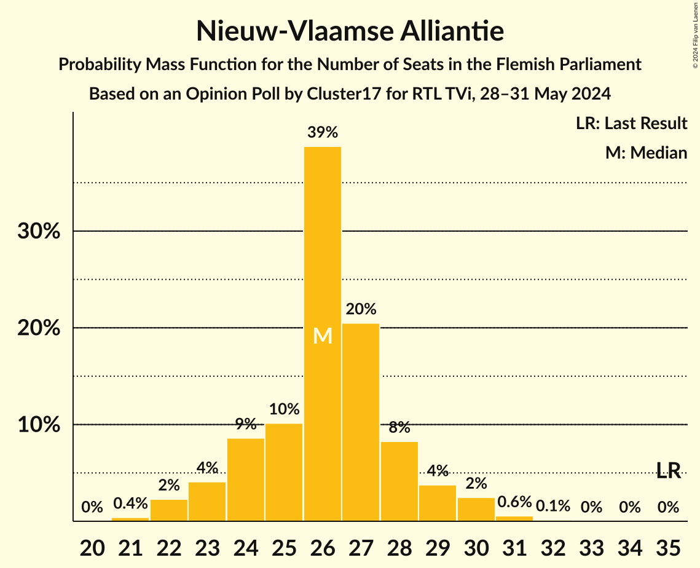

| Number of Seats | Probability | Accumulated | Special Marks |
|:---------------:|:-----------:|:-----------:|:-------------:|
| 21 | 0.4% | 100% |  |
| 22 | 2% | 99.6% |  |
| 23 | 4% | 97% |  |
| 24 | 9% | 93% |  |
| 25 | 10% | 85% |  |
| 26 | 39% | 74% | Median |
| 27 | 20% | 36% |  |
| 28 | 8% | 15% |  |
| 29 | 4% | 7% |  |
| 30 | 2% | 3% |  |
| 31 | 0.6% | 0.7% |  |
| 32 | 0.1% | 0.2% |  |
| 33 | 0% | 0% |  |
| 34 | 0% | 0% |  |
| 35 | 0% | 0% | Last Result |

### Vooruit

*For a full overview of the results for this party, see the [Vooruit](party-vooruit.html) page.*

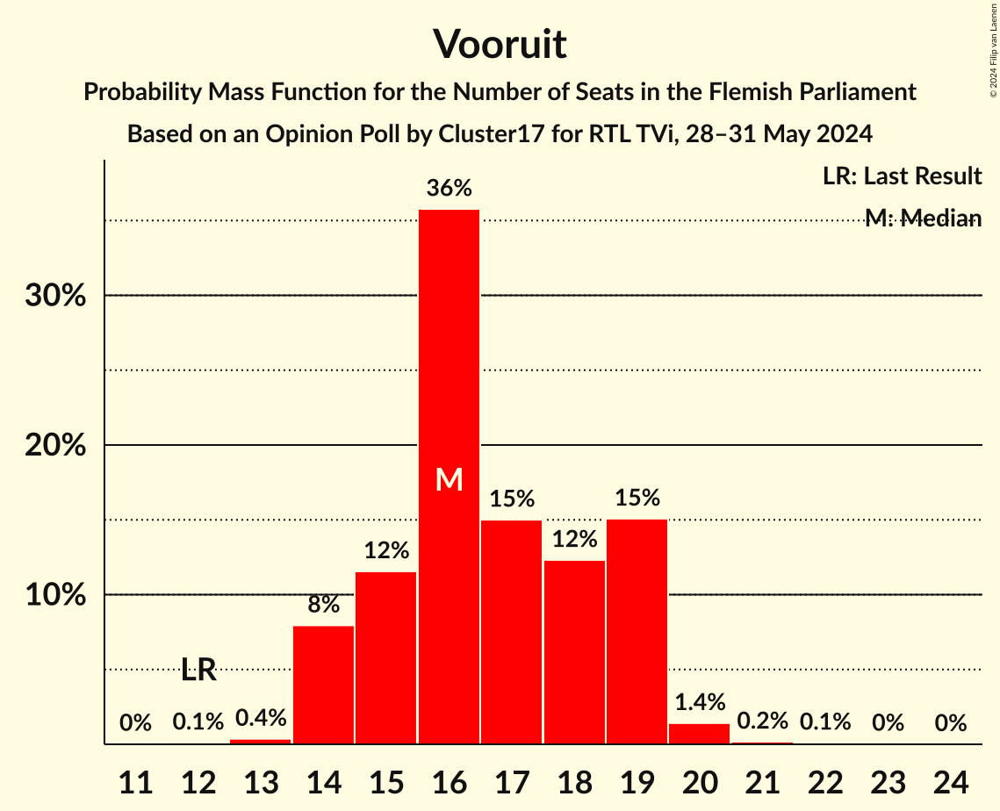

| Number of Seats | Probability | Accumulated | Special Marks |
|:---------------:|:-----------:|:-----------:|:-------------:|
| 12 | 0.1% | 100% | Last Result |
| 13 | 0.4% | 99.8% |  |
| 14 | 8% | 99.5% |  |
| 15 | 12% | 92% |  |
| 16 | 36% | 80% | Median |
| 17 | 15% | 44% |  |
| 18 | 12% | 29% |  |
| 19 | 15% | 17% |  |
| 20 | 1.4% | 2% |  |
| 21 | 0.2% | 0.4% |  |
| 22 | 0.1% | 0.2% |  |
| 23 | 0% | 0.1% |  |
| 24 | 0% | 0% |  |

### Christen-Democratisch en Vlaams

*For a full overview of the results for this party, see the [Christen-Democratisch en Vlaams](party-christen-democratischenvlaams.html) page.*

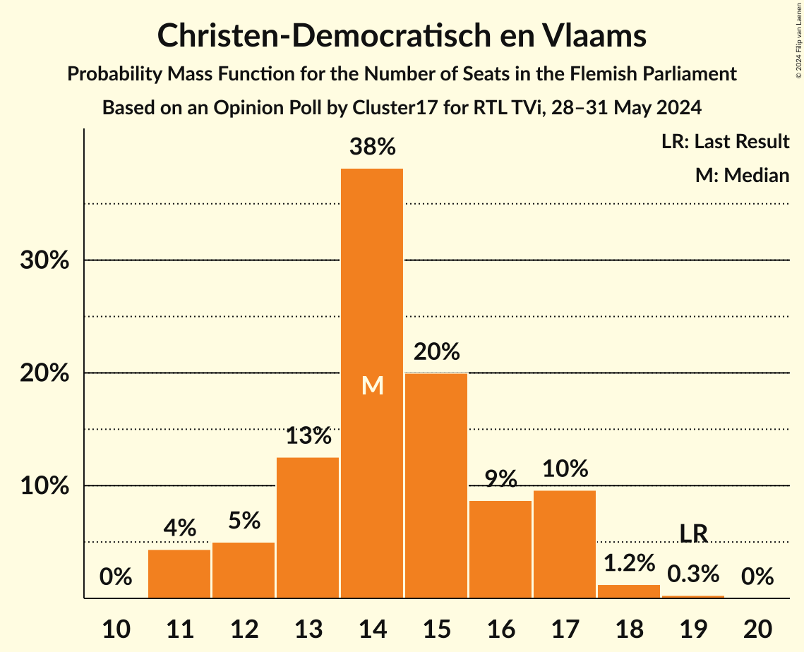

| Number of Seats | Probability | Accumulated | Special Marks |
|:---------------:|:-----------:|:-----------:|:-------------:|
| 11 | 4% | 100% |  |
| 12 | 5% | 96% |  |
| 13 | 13% | 91% |  |
| 14 | 38% | 78% | Median |
| 15 | 20% | 40% |  |
| 16 | 9% | 20% |  |
| 17 | 10% | 11% |  |
| 18 | 1.2% | 2% |  |
| 19 | 0.3% | 0.3% | Last Result |
| 20 | 0% | 0% |  |

### Partij van de Arbeid van België

*For a full overview of the results for this party, see the [Partij van de Arbeid van België](party-partijvandearbeidvanbelgië.html) page.*

| Number of Seats | Probability | Accumulated | Special Marks |
|:---------------:|:-----------:|:-----------:|:-------------:|
| 4 | 0% | 100% | Last Result |
| 5 | 0% | 100% |  |
| 6 | 0% | 100% |  |
| 7 | 3% | 100% |  |
| 8 | 6% | 97% |  |
| 9 | 7% | 91% |  |
| 10 | 9% | 84% |  |
| 11 | 29% | 75% | Median |
| 12 | 14% | 46% |  |
| 13 | 26% | 32% |  |
| 14 | 6% | 6% |  |
| 15 | 0.2% | 0.2% |  |
| 16 | 0% | 0% |  |

### Open Vlaamse Liberalen en Democraten

*For a full overview of the results for this party, see the [Open Vlaamse Liberalen en Democraten](party-openvlaamseliberalenendemocraten.html) page.*

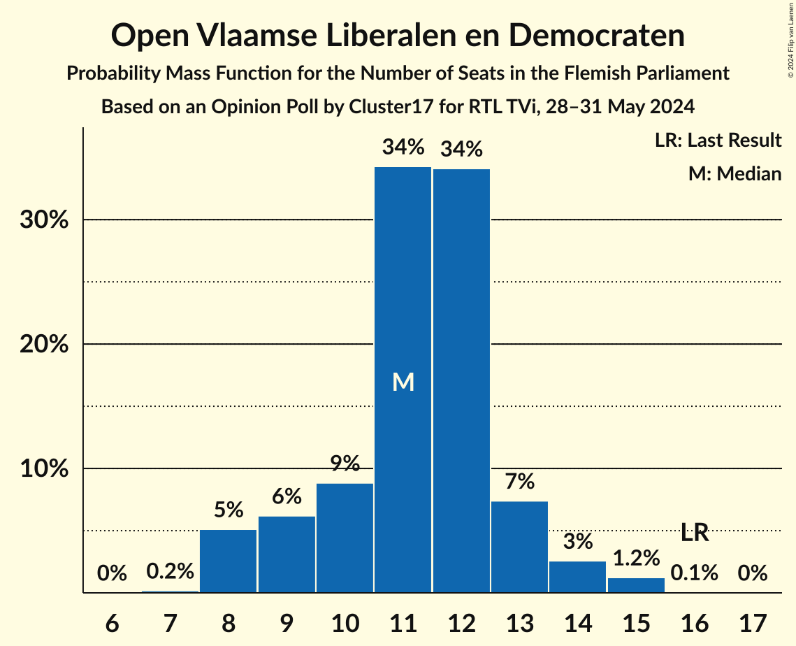

| Number of Seats | Probability | Accumulated | Special Marks |
|:---------------:|:-----------:|:-----------:|:-------------:|
| 7 | 0.2% | 100% |  |
| 8 | 5% | 99.8% |  |
| 9 | 6% | 95% |  |
| 10 | 9% | 88% |  |
| 11 | 34% | 80% | Median |
| 12 | 34% | 45% |  |
| 13 | 7% | 11% |  |
| 14 | 3% | 4% |  |
| 15 | 1.2% | 1.3% |  |
| 16 | 0.1% | 0.1% | Last Result |
| 17 | 0% | 0% |  |

### Groen

*For a full overview of the results for this party, see the [Groen](party-groen.html) page.*

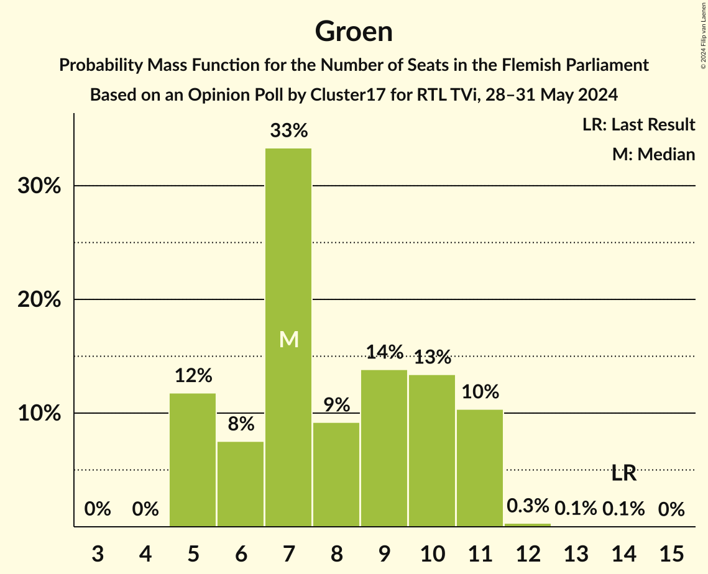

| Number of Seats | Probability | Accumulated | Special Marks |
|:---------------:|:-----------:|:-----------:|:-------------:|
| 3 | 0% | 100% |  |
| 4 | 0% | 99.9% |  |
| 5 | 12% | 99.9% |  |
| 6 | 8% | 88% |  |
| 7 | 33% | 81% | Median |
| 8 | 9% | 47% |  |
| 9 | 14% | 38% |  |
| 10 | 13% | 24% |  |
| 11 | 10% | 11% |  |
| 12 | 0.3% | 0.5% |  |
| 13 | 0.1% | 0.2% |  |
| 14 | 0.1% | 0.1% | Last Result |
| 15 | 0% | 0% |  |

## Coalitions

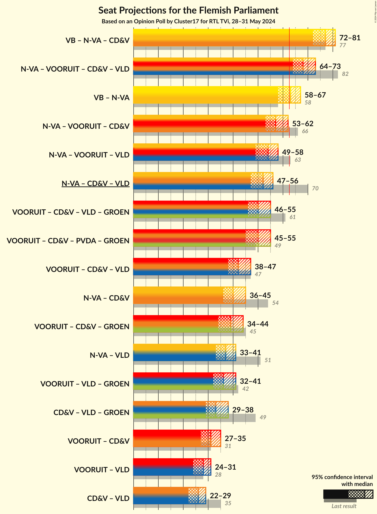

### Confidence Intervals

| Coalition | Last Result | Median | Majority? | 80% Confidence Interval | 90% Confidence Interval | 95% Confidence Interval | 99% Confidence Interval |
|:---------:|:-----------:|:------:|:---------:|:-----------------------:|:-----------------------:|:-----------------------:|:-----------------------:|
| Vlaams Belang – Nieuw-Vlaamse Alliantie – Christen-Democratisch en Vlaams | 77 | 77 | 100% | 74–80 | 73–81 | 72–81 | 71–83 |
| Nieuw-Vlaamse Alliantie – Vooruit – Christen-Democratisch en Vlaams – Open Vlaamse Liberalen en Democraten | 82 | 68 | 99.3% | 65–71 | 65–72 | 64–73 | 62–75 |
| Vlaams Belang – Nieuw-Vlaamse Alliantie | 58 | 63 | 51% | 60–65 | 59–66 | 58–67 | 57–68 |
| Nieuw-Vlaamse Alliantie – Vooruit – Christen-Democratisch en Vlaams | 66 | 57 | 1.2% | 54–60 | 53–61 | 53–62 | 51–63 |
| Nieuw-Vlaamse Alliantie – Vooruit – Open Vlaamse Liberalen en Democraten | 63 | 54 | 0% | 51–57 | 50–58 | 49–58 | 48–60 |
| Nieuw-Vlaamse Alliantie – Christen-Democratisch en Vlaams – Open Vlaamse Liberalen en Democraten | 70 | 52 | 0% | 49–55 | 48–55 | 47–56 | 46–57 |
| Vooruit – Christen-Democratisch en Vlaams – Open Vlaamse Liberalen en Democraten – Groen | 61 | 50 | 0% | 47–53 | 46–54 | 46–55 | 44–56 |
| Vooruit – Christen-Democratisch en Vlaams – Partij van de Arbeid van België – Groen | 49 | 50 | 0% | 47–53 | 46–54 | 45–55 | 44–57 |
| Vooruit – Christen-Democratisch en Vlaams – Open Vlaamse Liberalen en Democraten | 47 | 42 | 0% | 40–45 | 39–46 | 38–47 | 36–48 |
| Nieuw-Vlaamse Alliantie – Christen-Democratisch en Vlaams | 54 | 40 | 0% | 38–43 | 37–44 | 36–45 | 35–46 |
| Vooruit – Christen-Democratisch en Vlaams – Groen | 45 | 39 | 0% | 36–42 | 35–43 | 34–44 | 33–45 |
| Nieuw-Vlaamse Alliantie – Open Vlaamse Liberalen en Democraten | 51 | 37 | 0% | 35–40 | 34–41 | 33–41 | 32–43 |
| Vooruit – Open Vlaamse Liberalen en Democraten – Groen | 42 | 36 | 0% | 33–39 | 32–40 | 32–41 | 30–42 |
| Christen-Democratisch en Vlaams – Open Vlaamse Liberalen en Democraten – Groen | 49 | 33 | 0% | 31–37 | 30–37 | 29–38 | 28–39 |
| Vooruit – Christen-Democratisch en Vlaams | 31 | 31 | 0% | 29–34 | 28–34 | 27–35 | 26–36 |
| Vooruit – Open Vlaamse Liberalen en Democraten | 28 | 28 | 0% | 26–31 | 25–31 | 24–31 | 22–33 |
| Christen-Democratisch en Vlaams – Open Vlaamse Liberalen en Democraten | 35 | 26 | 0% | 23–28 | 22–29 | 22–29 | 20–31 |

### Vlaams Belang – Nieuw-Vlaamse Alliantie – Christen-Democratisch en Vlaams

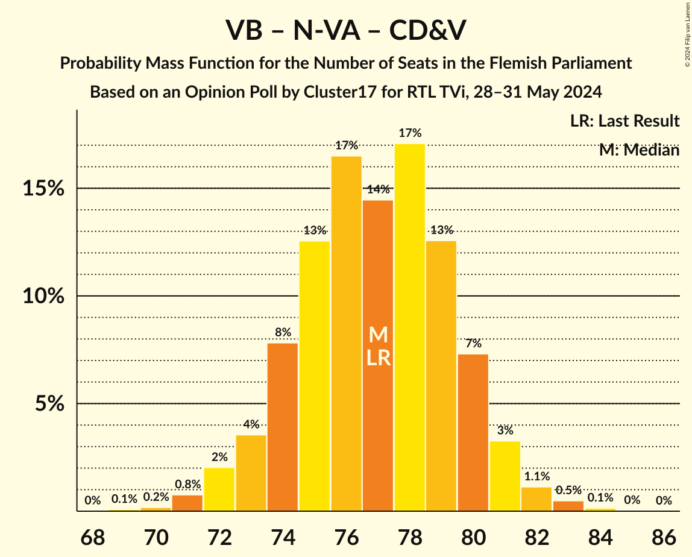

| Number of Seats | Probability | Accumulated | Special Marks |
|:---------------:|:-----------:|:-----------:|:-------------:|
| 69 | 0.1% | 100% |  |
| 70 | 0.2% | 99.9% |  |
| 71 | 0.8% | 99.7% |  |
| 72 | 2% | 99.0% |  |
| 73 | 4% | 97% |  |
| 74 | 8% | 93% |  |
| 75 | 13% | 86% |  |
| 76 | 17% | 73% |  |
| 77 | 14% | 56% | Last Result, Median |
| 78 | 17% | 42% |  |
| 79 | 13% | 25% |  |
| 80 | 7% | 12% |  |
| 81 | 3% | 5% |  |
| 82 | 1.1% | 2% |  |
| 83 | 0.5% | 0.7% |  |
| 84 | 0.1% | 0.2% |  |
| 85 | 0% | 0% |  |

### Nieuw-Vlaamse Alliantie – Vooruit – Christen-Democratisch en Vlaams – Open Vlaamse Liberalen en Democraten

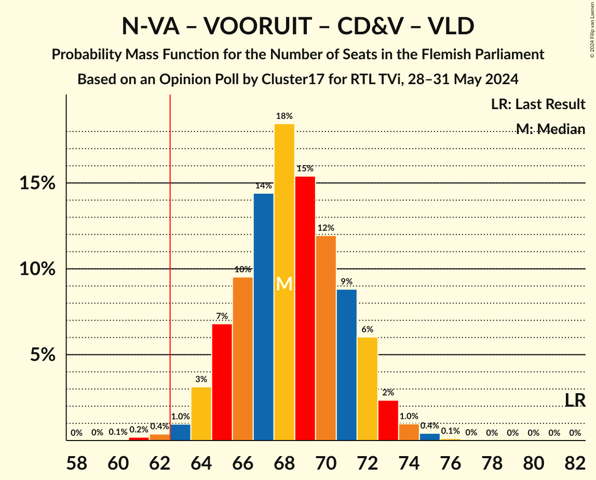

| Number of Seats | Probability | Accumulated | Special Marks |
|:---------------:|:-----------:|:-----------:|:-------------:|
| 60 | 0.1% | 100% |  |
| 61 | 0.2% | 99.9% |  |
| 62 | 0.4% | 99.7% |  |
| 63 | 1.0% | 99.3% | Majority |
| 64 | 3% | 98% |  |
| 65 | 7% | 95% |  |
| 66 | 10% | 88% |  |
| 67 | 14% | 79% | Median |
| 68 | 18% | 65% |  |
| 69 | 15% | 46% |  |
| 70 | 12% | 31% |  |
| 71 | 9% | 19% |  |
| 72 | 6% | 10% |  |
| 73 | 2% | 4% |  |
| 74 | 1.0% | 2% |  |
| 75 | 0.4% | 0.6% |  |
| 76 | 0.1% | 0.1% |  |
| 77 | 0% | 0% |  |
| 78 | 0% | 0% |  |
| 79 | 0% | 0% |  |
| 80 | 0% | 0% |  |
| 81 | 0% | 0% |  |
| 82 | 0% | 0% | Last Result |

### Vlaams Belang – Nieuw-Vlaamse Alliantie

| Number of Seats | Probability | Accumulated | Special Marks |
|:---------------:|:-----------:|:-----------:|:-------------:|
| 55 | 0.2% | 100% |  |
| 56 | 0.3% | 99.8% |  |
| 57 | 0.9% | 99.5% |  |
| 58 | 2% | 98.6% | Last Result |
| 59 | 5% | 97% |  |
| 60 | 10% | 92% |  |
| 61 | 14% | 82% |  |
| 62 | 17% | 69% |  |
| 63 | 17% | 51% | Median, Majority |
| 64 | 18% | 35% |  |
| 65 | 8% | 16% |  |
| 66 | 4% | 8% |  |
| 67 | 2% | 4% |  |
| 68 | 1.3% | 2% |  |
| 69 | 0.3% | 0.4% |  |
| 70 | 0.1% | 0.1% |  |
| 71 | 0% | 0% |  |

### Nieuw-Vlaamse Alliantie – Vooruit – Christen-Democratisch en Vlaams

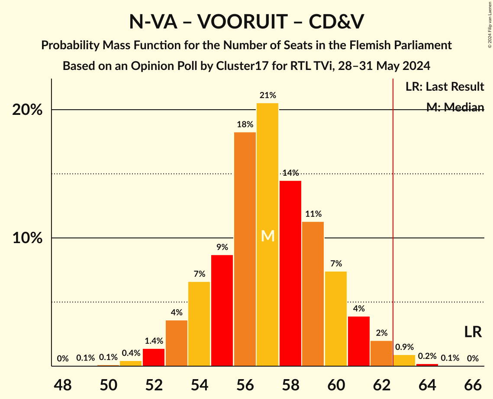

| Number of Seats | Probability | Accumulated | Special Marks |
|:---------------:|:-----------:|:-----------:|:-------------:|
| 49 | 0.1% | 100% |  |
| 50 | 0.1% | 99.9% |  |
| 51 | 0.4% | 99.8% |  |
| 52 | 1.4% | 99.4% |  |
| 53 | 4% | 98% |  |
| 54 | 7% | 94% |  |
| 55 | 9% | 88% |  |
| 56 | 18% | 79% | Median |
| 57 | 21% | 61% |  |
| 58 | 14% | 40% |  |
| 59 | 11% | 26% |  |
| 60 | 7% | 15% |  |
| 61 | 4% | 7% |  |
| 62 | 2% | 3% |  |
| 63 | 0.9% | 1.2% | Majority |
| 64 | 0.2% | 0.3% |  |
| 65 | 0.1% | 0.1% |  |
| 66 | 0% | 0% | Last Result |

### Nieuw-Vlaamse Alliantie – Vooruit – Open Vlaamse Liberalen en Democraten

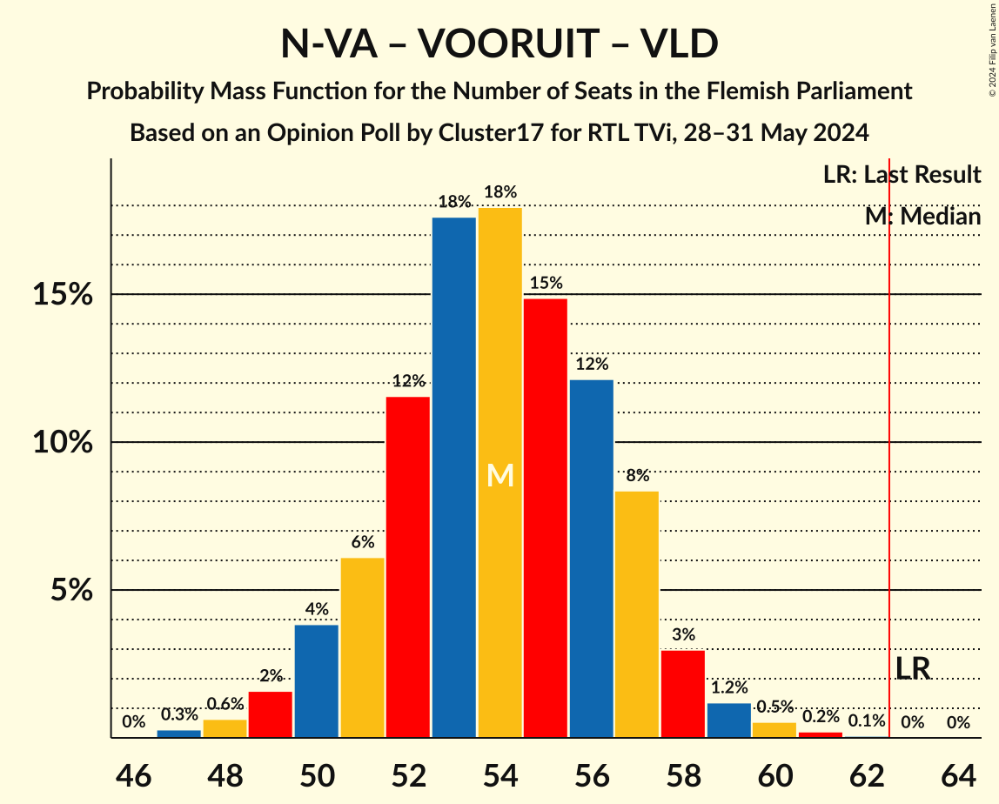

| Number of Seats | Probability | Accumulated | Special Marks |
|:---------------:|:-----------:|:-----------:|:-------------:|
| 46 | 0% | 100% |  |
| 47 | 0.3% | 99.9% |  |
| 48 | 0.6% | 99.7% |  |
| 49 | 2% | 99.0% |  |
| 50 | 4% | 97% |  |
| 51 | 6% | 94% |  |
| 52 | 12% | 87% |  |
| 53 | 18% | 76% | Median |
| 54 | 18% | 58% |  |
| 55 | 15% | 40% |  |
| 56 | 12% | 26% |  |
| 57 | 8% | 13% |  |
| 58 | 3% | 5% |  |
| 59 | 1.2% | 2% |  |
| 60 | 0.5% | 0.8% |  |
| 61 | 0.2% | 0.3% |  |
| 62 | 0.1% | 0.1% |  |
| 63 | 0% | 0% | Last Result, Majority |

### Nieuw-Vlaamse Alliantie – Christen-Democratisch en Vlaams – Open Vlaamse Liberalen en Democraten

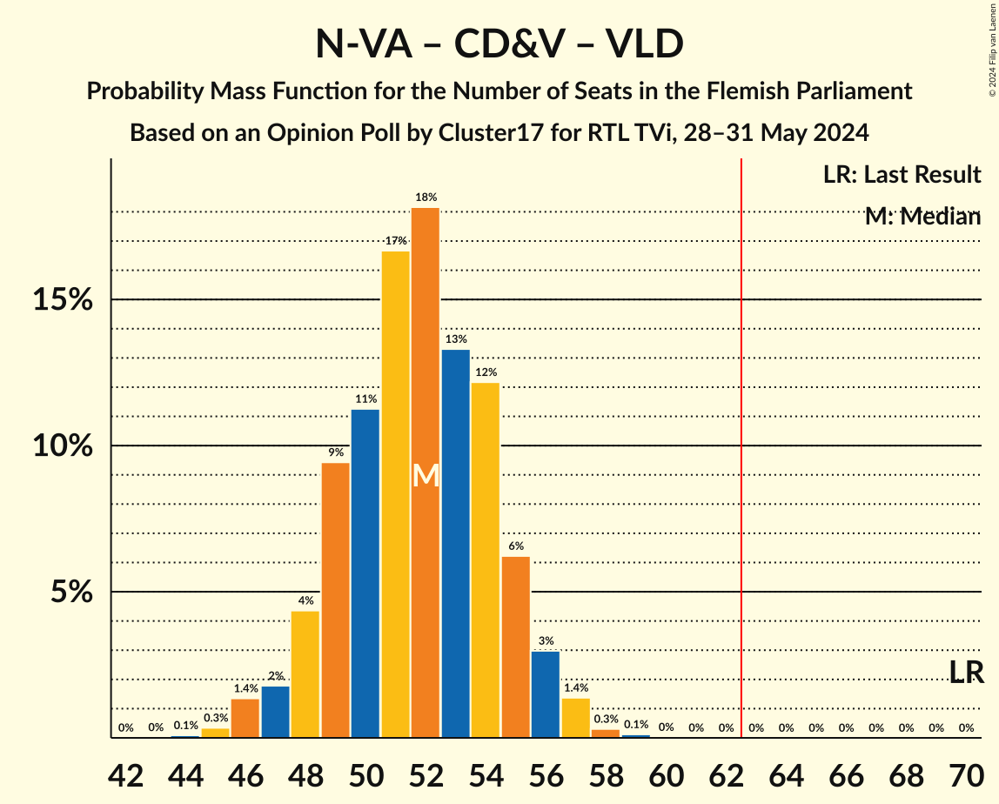

| Number of Seats | Probability | Accumulated | Special Marks |
|:---------------:|:-----------:|:-----------:|:-------------:|
| 44 | 0.1% | 100% |  |
| 45 | 0.3% | 99.9% |  |
| 46 | 1.4% | 99.5% |  |
| 47 | 2% | 98% |  |
| 48 | 4% | 96% |  |
| 49 | 9% | 92% |  |
| 50 | 11% | 83% |  |
| 51 | 17% | 71% | Median |
| 52 | 18% | 55% |  |
| 53 | 13% | 37% |  |
| 54 | 12% | 23% |  |
| 55 | 6% | 11% |  |
| 56 | 3% | 5% |  |
| 57 | 1.4% | 2% |  |
| 58 | 0.3% | 0.5% |  |
| 59 | 0.1% | 0.2% |  |
| 60 | 0% | 0% |  |
| 61 | 0% | 0% |  |
| 62 | 0% | 0% |  |
| 63 | 0% | 0% | Majority |
| 64 | 0% | 0% |  |
| 65 | 0% | 0% |  |
| 66 | 0% | 0% |  |
| 67 | 0% | 0% |  |
| 68 | 0% | 0% |  |
| 69 | 0% | 0% |  |
| 70 | 0% | 0% | Last Result |

### Vooruit – Christen-Democratisch en Vlaams – Open Vlaamse Liberalen en Democraten – Groen

| Number of Seats | Probability | Accumulated | Special Marks |
|:---------------:|:-----------:|:-----------:|:-------------:|
| 43 | 0.2% | 100% |  |
| 44 | 0.5% | 99.8% |  |
| 45 | 1.3% | 99.3% |  |
| 46 | 3% | 98% |  |
| 47 | 9% | 95% |  |
| 48 | 11% | 85% | Median |
| 49 | 15% | 74% |  |
| 50 | 14% | 59% |  |
| 51 | 16% | 45% |  |
| 52 | 12% | 29% |  |
| 53 | 8% | 16% |  |
| 54 | 4% | 8% |  |
| 55 | 2% | 4% |  |
| 56 | 1.2% | 2% |  |
| 57 | 0.3% | 0.5% |  |
| 58 | 0.1% | 0.1% |  |
| 59 | 0% | 0% |  |
| 60 | 0% | 0% |  |
| 61 | 0% | 0% | Last Result |

### Vooruit – Christen-Democratisch en Vlaams – Partij van de Arbeid van België – Groen

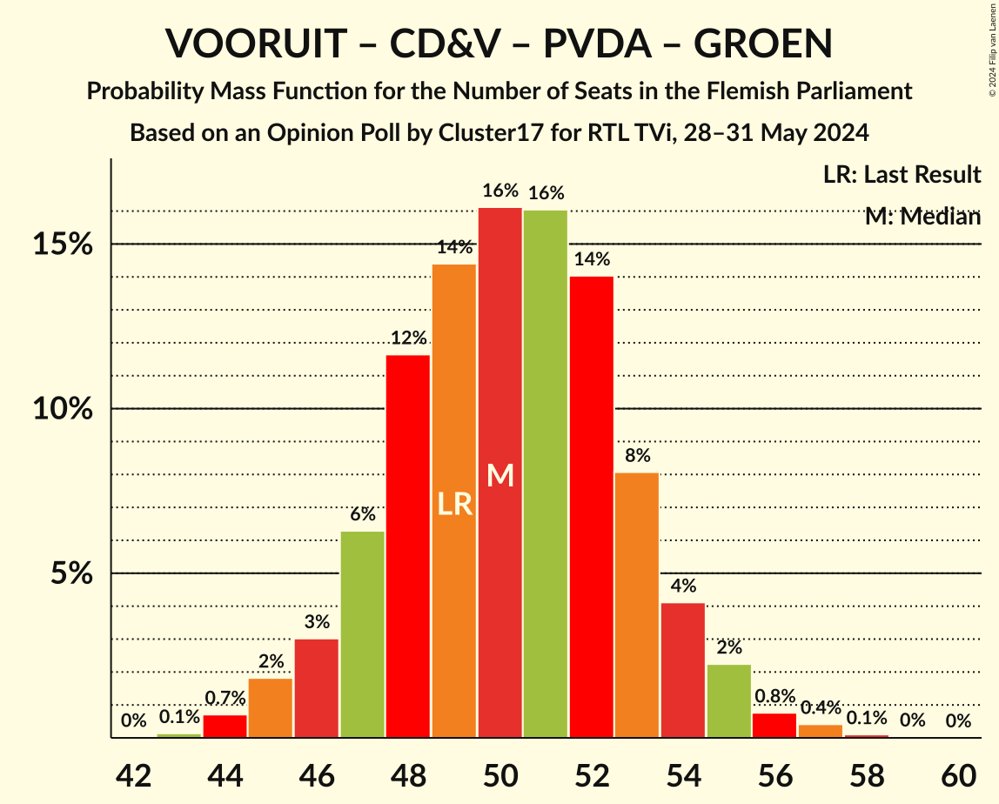

| Number of Seats | Probability | Accumulated | Special Marks |
|:---------------:|:-----------:|:-----------:|:-------------:|
| 43 | 0.1% | 100% |  |
| 44 | 0.7% | 99.8% |  |
| 45 | 2% | 99.1% |  |
| 46 | 3% | 97% |  |
| 47 | 6% | 94% |  |
| 48 | 12% | 88% | Median |
| 49 | 14% | 76% | Last Result |
| 50 | 16% | 62% |  |
| 51 | 16% | 46% |  |
| 52 | 14% | 30% |  |
| 53 | 8% | 16% |  |
| 54 | 4% | 8% |  |
| 55 | 2% | 4% |  |
| 56 | 0.8% | 1.3% |  |
| 57 | 0.4% | 0.6% |  |
| 58 | 0.1% | 0.1% |  |
| 59 | 0% | 0% |  |

### Vooruit – Christen-Democratisch en Vlaams – Open Vlaamse Liberalen en Democraten

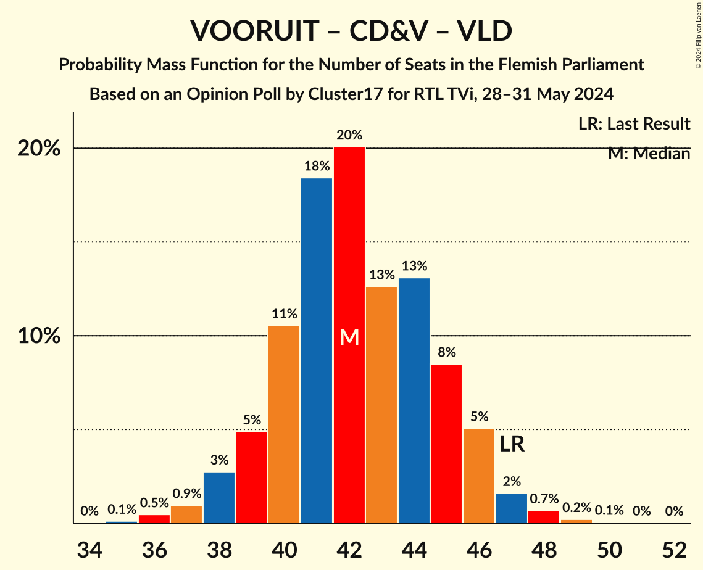

| Number of Seats | Probability | Accumulated | Special Marks |
|:---------------:|:-----------:|:-----------:|:-------------:|
| 35 | 0.1% | 100% |  |
| 36 | 0.5% | 99.9% |  |
| 37 | 0.9% | 99.4% |  |
| 38 | 3% | 98% |  |
| 39 | 5% | 96% |  |
| 40 | 11% | 91% |  |
| 41 | 18% | 80% | Median |
| 42 | 20% | 62% |  |
| 43 | 13% | 42% |  |
| 44 | 13% | 29% |  |
| 45 | 8% | 16% |  |
| 46 | 5% | 8% |  |
| 47 | 2% | 3% | Last Result |
| 48 | 0.7% | 1.0% |  |
| 49 | 0.2% | 0.3% |  |
| 50 | 0.1% | 0.1% |  |
| 51 | 0% | 0% |  |

### Nieuw-Vlaamse Alliantie – Christen-Democratisch en Vlaams

| Number of Seats | Probability | Accumulated | Special Marks |
|:---------------:|:-----------:|:-----------:|:-------------:|
| 33 | 0.1% | 100% |  |
| 34 | 0.2% | 99.9% |  |
| 35 | 0.7% | 99.7% |  |
| 36 | 2% | 99.0% |  |
| 37 | 5% | 97% |  |
| 38 | 11% | 93% |  |
| 39 | 13% | 82% |  |
| 40 | 19% | 69% | Median |
| 41 | 20% | 50% |  |
| 42 | 12% | 30% |  |
| 43 | 11% | 18% |  |
| 44 | 4% | 7% |  |
| 45 | 2% | 3% |  |
| 46 | 0.5% | 0.7% |  |
| 47 | 0.1% | 0.2% |  |
| 48 | 0.1% | 0.1% |  |
| 49 | 0% | 0% |  |
| 50 | 0% | 0% |  |
| 51 | 0% | 0% |  |
| 52 | 0% | 0% |  |
| 53 | 0% | 0% |  |
| 54 | 0% | 0% | Last Result |

### Vooruit – Christen-Democratisch en Vlaams – Groen

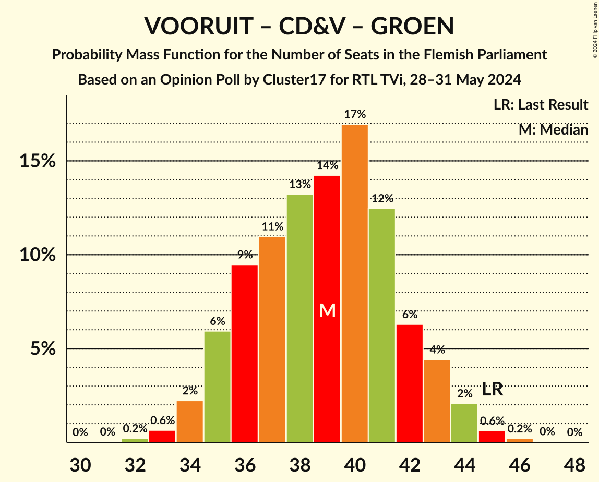

| Number of Seats | Probability | Accumulated | Special Marks |
|:---------------:|:-----------:|:-----------:|:-------------:|
| 32 | 0.2% | 100% |  |
| 33 | 0.6% | 99.8% |  |
| 34 | 2% | 99.1% |  |
| 35 | 6% | 97% |  |
| 36 | 9% | 91% |  |
| 37 | 11% | 81% | Median |
| 38 | 13% | 71% |  |
| 39 | 14% | 57% |  |
| 40 | 17% | 43% |  |
| 41 | 12% | 26% |  |
| 42 | 6% | 14% |  |
| 43 | 4% | 7% |  |
| 44 | 2% | 3% |  |
| 45 | 0.6% | 0.9% | Last Result |
| 46 | 0.2% | 0.3% |  |
| 47 | 0% | 0.1% |  |
| 48 | 0% | 0% |  |

### Nieuw-Vlaamse Alliantie – Open Vlaamse Liberalen en Democraten

| Number of Seats | Probability | Accumulated | Special Marks |
|:---------------:|:-----------:|:-----------:|:-------------:|
| 30 | 0.1% | 100% |  |
| 31 | 0.3% | 99.9% |  |
| 32 | 0.7% | 99.6% |  |
| 33 | 2% | 98.9% |  |
| 34 | 5% | 97% |  |
| 35 | 10% | 92% |  |
| 36 | 11% | 82% |  |
| 37 | 23% | 71% | Median |
| 38 | 23% | 48% |  |
| 39 | 12% | 26% |  |
| 40 | 8% | 14% |  |
| 41 | 3% | 5% |  |
| 42 | 1.5% | 2% |  |
| 43 | 0.5% | 0.7% |  |
| 44 | 0.2% | 0.2% |  |
| 45 | 0% | 0% |  |
| 46 | 0% | 0% |  |
| 47 | 0% | 0% |  |
| 48 | 0% | 0% |  |
| 49 | 0% | 0% |  |
| 50 | 0% | 0% |  |
| 51 | 0% | 0% | Last Result |

### Vooruit – Open Vlaamse Liberalen en Democraten – Groen

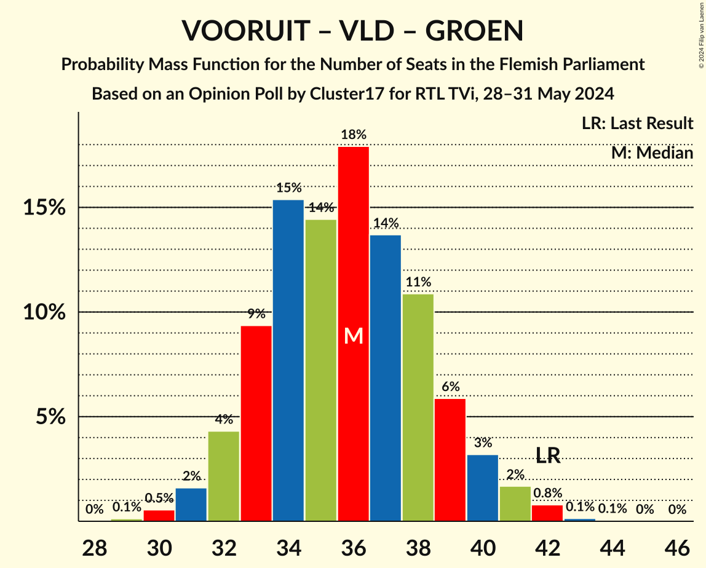

| Number of Seats | Probability | Accumulated | Special Marks |
|:---------------:|:-----------:|:-----------:|:-------------:|
| 29 | 0.1% | 100% |  |
| 30 | 0.5% | 99.9% |  |
| 31 | 2% | 99.3% |  |
| 32 | 4% | 98% |  |
| 33 | 9% | 93% |  |
| 34 | 15% | 84% | Median |
| 35 | 14% | 69% |  |
| 36 | 18% | 54% |  |
| 37 | 14% | 36% |  |
| 38 | 11% | 23% |  |
| 39 | 6% | 12% |  |
| 40 | 3% | 6% |  |
| 41 | 2% | 3% |  |
| 42 | 0.8% | 1.0% | Last Result |
| 43 | 0.1% | 0.2% |  |
| 44 | 0.1% | 0.1% |  |
| 45 | 0% | 0% |  |

### Christen-Democratisch en Vlaams – Open Vlaamse Liberalen en Democraten – Groen

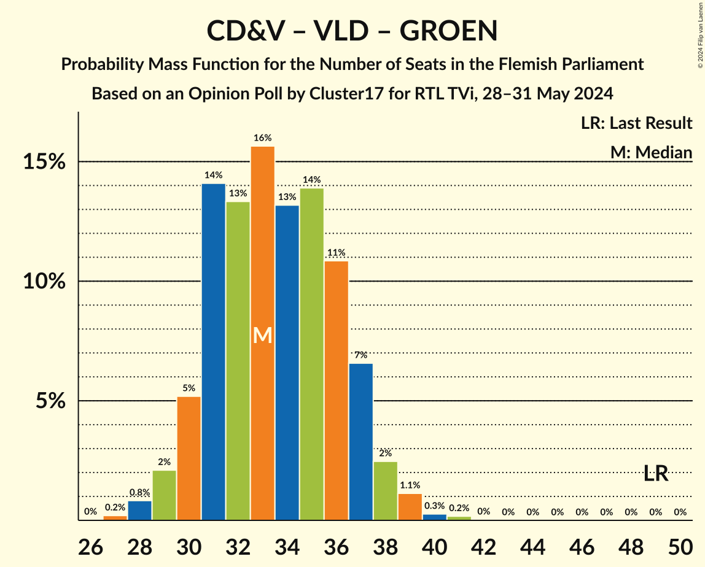

| Number of Seats | Probability | Accumulated | Special Marks |
|:---------------:|:-----------:|:-----------:|:-------------:|
| 27 | 0.2% | 100% |  |
| 28 | 0.8% | 99.8% |  |
| 29 | 2% | 98.9% |  |
| 30 | 5% | 97% |  |
| 31 | 14% | 92% |  |
| 32 | 13% | 78% | Median |
| 33 | 16% | 64% |  |
| 34 | 13% | 49% |  |
| 35 | 14% | 35% |  |
| 36 | 11% | 21% |  |
| 37 | 7% | 11% |  |
| 38 | 2% | 4% |  |
| 39 | 1.1% | 2% |  |
| 40 | 0.3% | 0.5% |  |
| 41 | 0.2% | 0.2% |  |
| 42 | 0% | 0% |  |
| 43 | 0% | 0% |  |
| 44 | 0% | 0% |  |
| 45 | 0% | 0% |  |
| 46 | 0% | 0% |  |
| 47 | 0% | 0% |  |
| 48 | 0% | 0% |  |
| 49 | 0% | 0% | Last Result |

### Vooruit – Christen-Democratisch en Vlaams

| Number of Seats | Probability | Accumulated | Special Marks |
|:---------------:|:-----------:|:-----------:|:-------------:|
| 25 | 0.3% | 100% |  |
| 26 | 0.9% | 99.7% |  |
| 27 | 2% | 98.8% |  |
| 28 | 4% | 96% |  |
| 29 | 11% | 93% |  |
| 30 | 26% | 81% | Median |
| 31 | 18% | 55% | Last Result |
| 32 | 15% | 37% |  |
| 33 | 11% | 22% |  |
| 34 | 7% | 11% |  |
| 35 | 2% | 4% |  |
| 36 | 2% | 2% |  |
| 37 | 0.4% | 0.4% |  |
| 38 | 0% | 0.1% |  |
| 39 | 0% | 0% |  |

### Vooruit – Open Vlaamse Liberalen en Democraten

| Number of Seats | Probability | Accumulated | Special Marks |
|:---------------:|:-----------:|:-----------:|:-------------:|
| 21 | 0.1% | 100% |  |
| 22 | 0.5% | 99.9% |  |
| 23 | 0.9% | 99.4% |  |
| 24 | 2% | 98.5% |  |
| 25 | 6% | 96% |  |
| 26 | 11% | 91% |  |
| 27 | 26% | 79% | Median |
| 28 | 19% | 54% | Last Result |
| 29 | 13% | 35% |  |
| 30 | 11% | 21% |  |
| 31 | 8% | 10% |  |
| 32 | 2% | 2% |  |
| 33 | 0.6% | 0.8% |  |
| 34 | 0.2% | 0.3% |  |
| 35 | 0% | 0% |  |

### Christen-Democratisch en Vlaams – Open Vlaamse Liberalen en Democraten

| Number of Seats | Probability | Accumulated | Special Marks |
|:---------------:|:-----------:|:-----------:|:-------------:|
| 19 | 0.1% | 100% |  |
| 20 | 0.5% | 99.9% |  |
| 21 | 1.1% | 99.4% |  |
| 22 | 5% | 98% |  |
| 23 | 7% | 93% |  |
| 24 | 12% | 86% |  |
| 25 | 18% | 74% | Median |
| 26 | 26% | 56% |  |
| 27 | 15% | 30% |  |
| 28 | 9% | 15% |  |
| 29 | 4% | 6% |  |
| 30 | 2% | 2% |  |
| 31 | 0.4% | 0.5% |  |
| 32 | 0.1% | 0.1% |  |
| 33 | 0% | 0% |  |
| 34 | 0% | 0% |  |
| 35 | 0% | 0% | Last Result |

## Technical Information

### Opinion Poll

+ **Polling firm:** Cluster17
+ **Commissioner(s):** RTL TVi
+ **Fieldwork period:** 28–31 May 2024

### Calculations

+ **Sample size:** 1140
+ **Simulations done:** 2,097,152
+ **Error estimate:** 0.61%

