# Opinion Poll by Ipsos for Het Laatste Nieuws and VTM, 3–4 June 2024

<a href="#voting-intentions">Voting Intentions</a> | <a href="#seats">Seats</a> | <a href="#coalitions">Coalitions</a> | <a href="#technical-information">Technical Information</a>

## Voting Intentions

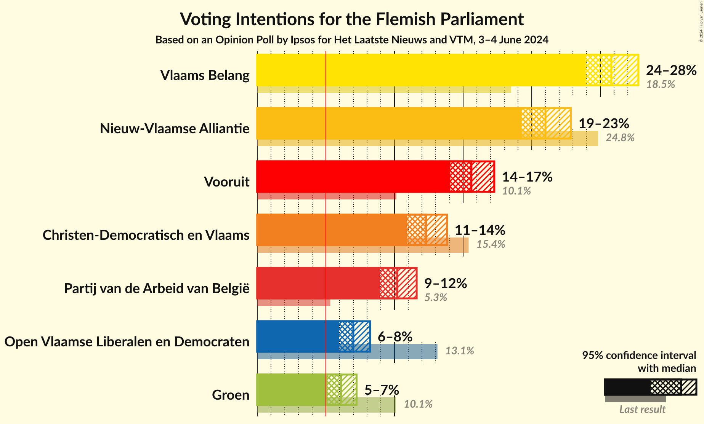

### Confidence Intervals

| Party | Last Result | Poll Result | 80% Confidence Interval | 90% Confidence Interval | 95% Confidence Interval | 99% Confidence Interval |
|:-----:|:-----------:|:-----------:|:-----------------------:|:-----------------------:|:-----------------------:|:-----------------------:|
| Vlaams Belang | 18.5% | 25.8% | 24.6–27.1% |24.2–27.5% |23.9–27.8% |23.4–28.4% |
| Nieuw-Vlaamse Alliantie | 24.8% | 21.0% | 19.9–22.2% |19.5–22.6% |19.3–22.8% |18.7–23.4% |
| Vooruit | 10.1% | 15.6% | 14.6–16.7% |14.3–17.0% |14.1–17.3% |13.6–17.8% |
| Christen-Democratisch en Vlaams | 15.4% | 12.3% | 11.4–13.3% |11.1–13.6% |10.9–13.8% |10.5–14.3% |
| Partij van de Arbeid van België | 5.3% | 10.2% | 9.4–11.1% |9.1–11.4% |8.9–11.6% |8.6–12.1% |
| Open Vlaamse Liberalen en Democraten | 13.1% | 7.0% | 6.3–7.8% |6.1–8.0% |6.0–8.2% |5.6–8.6% |
| Groen | 10.1% | 6.1% | 5.5–6.8% |5.3–7.1% |5.1–7.2% |4.8–7.6% |

*Note:* The poll result column reflects the actual value used in the calculations. Published results may vary slightly, and in addition be rounded to fewer digits.

## Seats

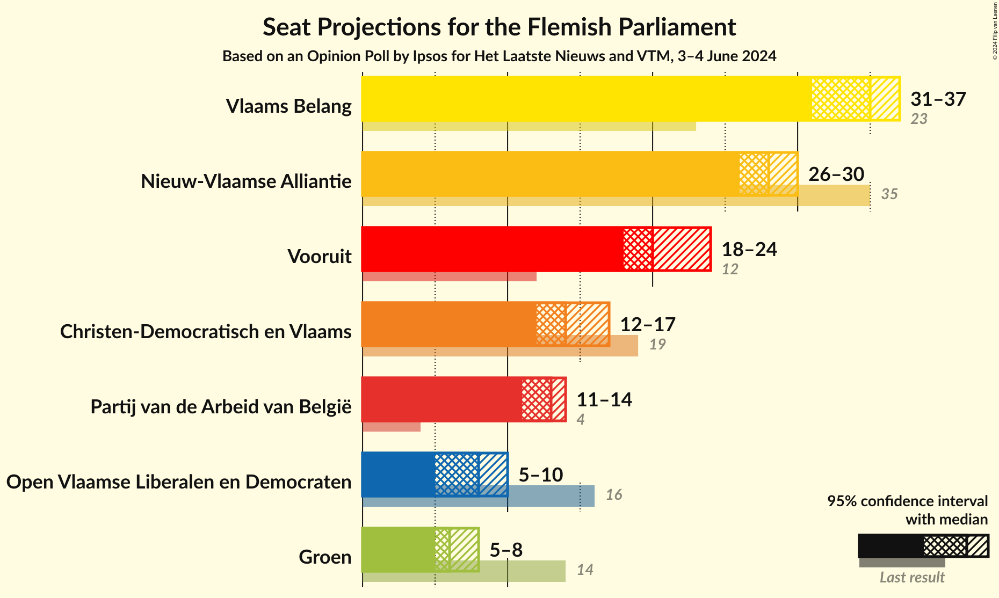

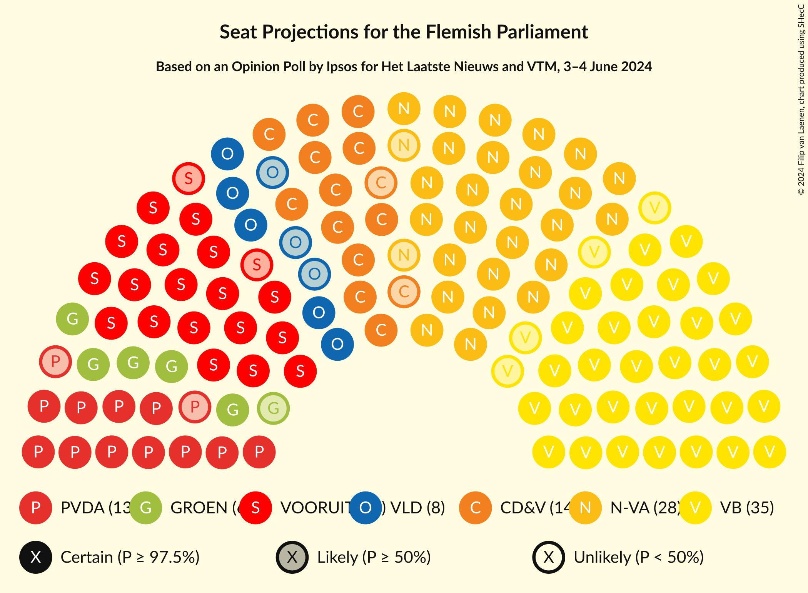

### Confidence Intervals

| Party | Last Result | Median | 80% Confidence Interval | 90% Confidence Interval | 95% Confidence Interval | 99% Confidence Interval |
|:-----:|:-----------:|:------:|:-----------------------:|:-----------------------:|:-----------------------:|:-----------------------:|
| <a href="#vlaams-belang">Vlaams Belang</a> | 23 | 35 | 32–37 |32–37 |31–37 |30–38 |
| <a href="#nieuw-vlaamse-alliantie">Nieuw-Vlaamse Alliantie</a> | 35 | 28 | 27–30 |26–30 |26–30 |25–31 |
| <a href="#vooruit">Vooruit</a> | 12 | 20 | 19–23 |19–24 |18–24 |18–25 |
| <a href="#christen-democratisch-en-vlaams">Christen-Democratisch en Vlaams</a> | 19 | 14 | 14–17 |13–17 |12–17 |12–18 |
| <a href="#partij-van-de-arbeid-van-belgië">Partij van de Arbeid van België</a> | 4 | 13 | 11–14 |11–14 |11–14 |10–14 |
| <a href="#open-vlaamse-liberalen-en-democraten">Open Vlaamse Liberalen en Democraten</a> | 16 | 8 | 6–8 |5–9 |5–10 |4–11 |
| <a href="#groen">Groen</a> | 14 | 6 | 5–7 |5–8 |5–8 |4–10 |

### Vlaams Belang

*For a full overview of the results for this party, see the [Vlaams Belang](party-vlaamsbelang.html) page.*

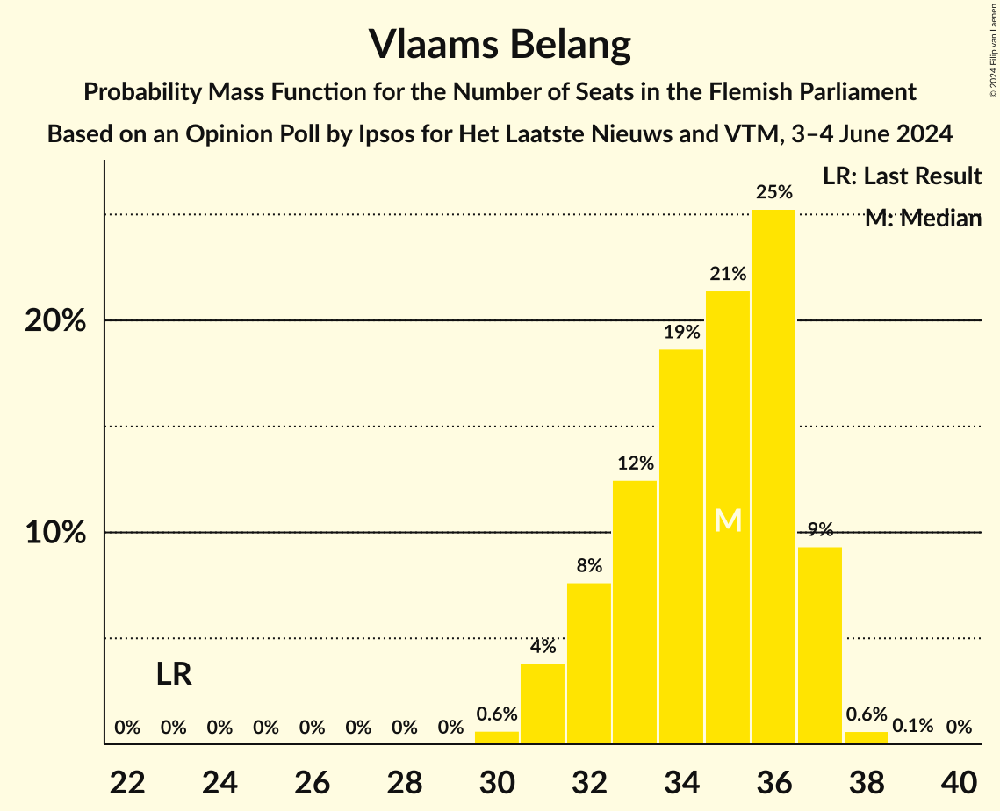

| Number of Seats | Probability | Accumulated | Special Marks |
|:---------------:|:-----------:|:-----------:|:-------------:|
| 23 | 0% | 100% | Last Result |
| 24 | 0% | 100% |  |
| 25 | 0% | 100% |  |
| 26 | 0% | 100% |  |
| 27 | 0% | 100% |  |
| 28 | 0% | 100% |  |
| 29 | 0% | 100% |  |
| 30 | 0.6% | 100% |  |
| 31 | 4% | 99.4% |  |
| 32 | 8% | 96% |  |
| 33 | 12% | 88% |  |
| 34 | 19% | 75% |  |
| 35 | 21% | 57% | Median |
| 36 | 25% | 35% |  |
| 37 | 9% | 10% |  |
| 38 | 0.6% | 0.7% |  |
| 39 | 0.1% | 0.1% |  |
| 40 | 0% | 0% |  |

### Nieuw-Vlaamse Alliantie

*For a full overview of the results for this party, see the [Nieuw-Vlaamse Alliantie](party-nieuw-vlaamsealliantie.html) page.*

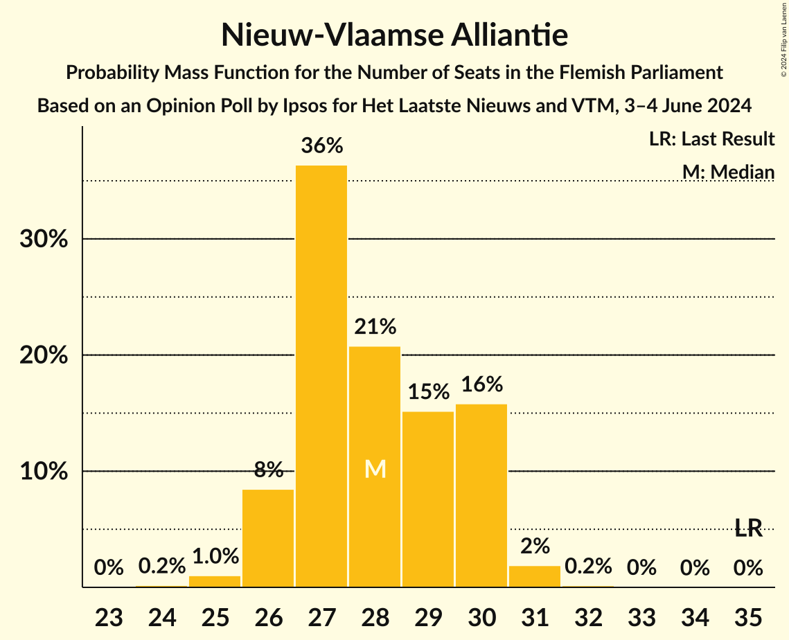

| Number of Seats | Probability | Accumulated | Special Marks |
|:---------------:|:-----------:|:-----------:|:-------------:|
| 23 | 0% | 100% |  |
| 24 | 0.2% | 99.9% |  |
| 25 | 1.0% | 99.8% |  |
| 26 | 8% | 98.7% |  |
| 27 | 36% | 90% |  |
| 28 | 21% | 54% | Median |
| 29 | 15% | 33% |  |
| 30 | 16% | 18% |  |
| 31 | 2% | 2% |  |
| 32 | 0.2% | 0.2% |  |
| 33 | 0% | 0.1% |  |
| 34 | 0% | 0% |  |
| 35 | 0% | 0% | Last Result |

### Vooruit

*For a full overview of the results for this party, see the [Vooruit](party-vooruit.html) page.*

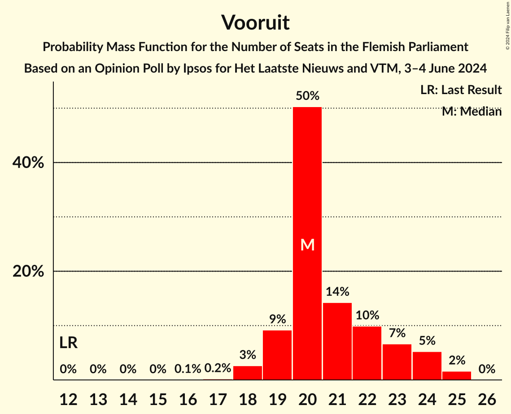

| Number of Seats | Probability | Accumulated | Special Marks |
|:---------------:|:-----------:|:-----------:|:-------------:|
| 12 | 0% | 100% | Last Result |
| 13 | 0% | 100% |  |
| 14 | 0% | 100% |  |
| 15 | 0% | 100% |  |
| 16 | 0.1% | 100% |  |
| 17 | 0.2% | 99.9% |  |
| 18 | 3% | 99.7% |  |
| 19 | 9% | 97% |  |
| 20 | 50% | 88% | Median |
| 21 | 14% | 38% |  |
| 22 | 10% | 23% |  |
| 23 | 7% | 13% |  |
| 24 | 5% | 7% |  |
| 25 | 2% | 2% |  |
| 26 | 0% | 0% |  |

### Christen-Democratisch en Vlaams

*For a full overview of the results for this party, see the [Christen-Democratisch en Vlaams](party-christen-democratischenvlaams.html) page.*

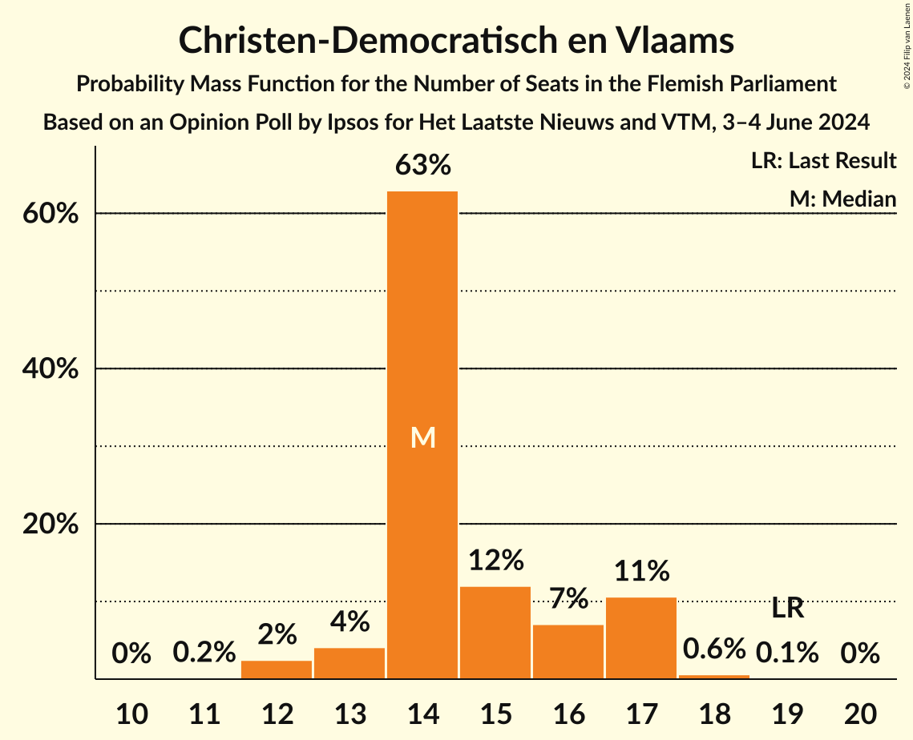

| Number of Seats | Probability | Accumulated | Special Marks |
|:---------------:|:-----------:|:-----------:|:-------------:|
| 11 | 0.2% | 100% |  |
| 12 | 2% | 99.8% |  |
| 13 | 4% | 97% |  |
| 14 | 63% | 93% | Median |
| 15 | 12% | 30% |  |
| 16 | 7% | 18% |  |
| 17 | 11% | 11% |  |
| 18 | 0.6% | 0.7% |  |
| 19 | 0.1% | 0.1% | Last Result |
| 20 | 0% | 0% |  |

### Partij van de Arbeid van België

*For a full overview of the results for this party, see the [Partij van de Arbeid van België](party-partijvandearbeidvanbelgië.html) page.*

| Number of Seats | Probability | Accumulated | Special Marks |
|:---------------:|:-----------:|:-----------:|:-------------:|
| 4 | 0% | 100% | Last Result |
| 5 | 0% | 100% |  |
| 6 | 0% | 100% |  |
| 7 | 0% | 100% |  |
| 8 | 0% | 100% |  |
| 9 | 0.3% | 100% |  |
| 10 | 0.7% | 99.7% |  |
| 11 | 9% | 99.0% |  |
| 12 | 21% | 90% |  |
| 13 | 46% | 69% | Median |
| 14 | 22% | 23% |  |
| 15 | 0.3% | 0.5% |  |
| 16 | 0.1% | 0.1% |  |
| 17 | 0% | 0.1% |  |
| 18 | 0% | 0% |  |

### Open Vlaamse Liberalen en Democraten

*For a full overview of the results for this party, see the [Open Vlaamse Liberalen en Democraten](party-openvlaamseliberalenendemocraten.html) page.*

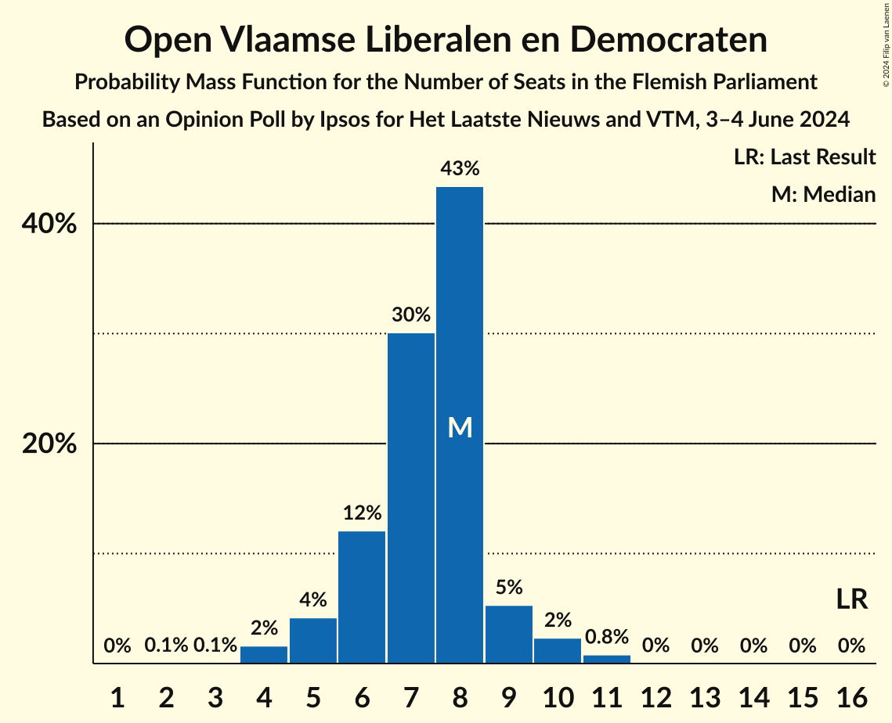

| Number of Seats | Probability | Accumulated | Special Marks |
|:---------------:|:-----------:|:-----------:|:-------------:|
| 2 | 0.1% | 100% |  |
| 3 | 0.1% | 99.9% |  |
| 4 | 2% | 99.9% |  |
| 5 | 4% | 98% |  |
| 6 | 12% | 94% |  |
| 7 | 30% | 82% |  |
| 8 | 43% | 52% | Median |
| 9 | 5% | 8% |  |
| 10 | 2% | 3% |  |
| 11 | 0.8% | 0.8% |  |
| 12 | 0% | 0% |  |
| 13 | 0% | 0% |  |
| 14 | 0% | 0% |  |
| 15 | 0% | 0% |  |
| 16 | 0% | 0% | Last Result |

### Groen

*For a full overview of the results for this party, see the [Groen](party-groen.html) page.*

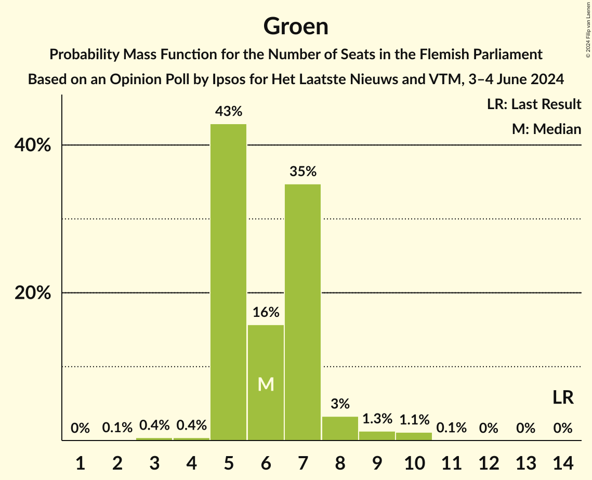

| Number of Seats | Probability | Accumulated | Special Marks |
|:---------------:|:-----------:|:-----------:|:-------------:|
| 2 | 0.1% | 100% |  |
| 3 | 0.4% | 99.9% |  |
| 4 | 0.4% | 99.5% |  |
| 5 | 43% | 99.1% |  |
| 6 | 16% | 56% | Median |
| 7 | 35% | 41% |  |
| 8 | 3% | 6% |  |
| 9 | 1.3% | 2% |  |
| 10 | 1.1% | 1.2% |  |
| 11 | 0.1% | 0.1% |  |
| 12 | 0% | 0% |  |
| 13 | 0% | 0% |  |
| 14 | 0% | 0% | Last Result |

## Coalitions

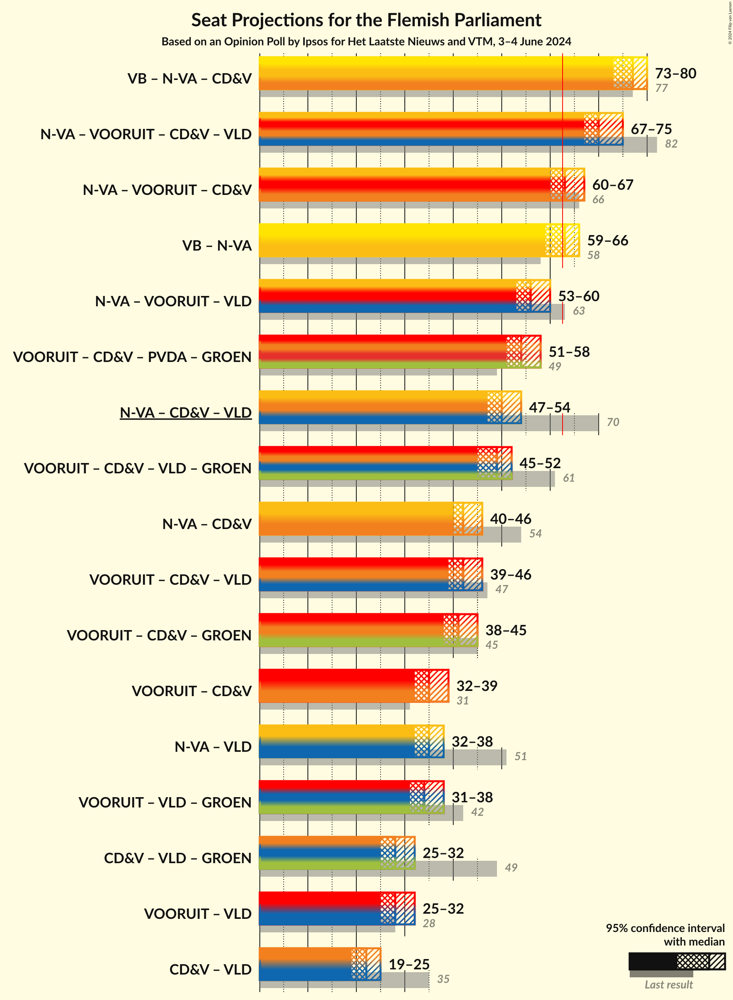

### Confidence Intervals

| Coalition | Last Result | Median | Majority? | 80% Confidence Interval | 90% Confidence Interval | 95% Confidence Interval | 99% Confidence Interval |
|:---------:|:-----------:|:------:|:---------:|:-----------------------:|:-----------------------:|:-----------------------:|:-----------------------:|
| Vlaams Belang – Nieuw-Vlaamse Alliantie – Christen-Democratisch en Vlaams | 77 | 77 | 100% | 75–79 | 74–80 | 73–80 | 72–81 |
| Nieuw-Vlaamse Alliantie – Vooruit – Christen-Democratisch en Vlaams – Open Vlaamse Liberalen en Democraten | 82 | 70 | 100% | 68–73 | 68–74 | 67–75 | 66–76 |
| Nieuw-Vlaamse Alliantie – Vooruit – Christen-Democratisch en Vlaams | 66 | 63 | 58% | 61–66 | 60–67 | 60–67 | 59–68 |
| Vlaams Belang – Nieuw-Vlaamse Alliantie | 58 | 63 | 54% | 60–65 | 59–65 | 59–66 | 58–67 |
| Nieuw-Vlaamse Alliantie – Vooruit – Open Vlaamse Liberalen en Democraten | 63 | 56 | 0% | 54–58 | 53–59 | 53–60 | 52–61 |
| Vooruit – Christen-Democratisch en Vlaams – Partij van de Arbeid van België – Groen | 49 | 54 | 0% | 52–56 | 51–57 | 51–58 | 50–59 |
| Nieuw-Vlaamse Alliantie – Christen-Democratisch en Vlaams – Open Vlaamse Liberalen en Democraten | 70 | 50 | 0% | 48–52 | 47–53 | 47–54 | 45–55 |
| Vooruit – Christen-Democratisch en Vlaams – Open Vlaamse Liberalen en Democraten – Groen | 61 | 49 | 0% | 46–51 | 46–52 | 45–52 | 45–53 |
| Nieuw-Vlaamse Alliantie – Christen-Democratisch en Vlaams | 54 | 42 | 0% | 41–45 | 40–45 | 40–46 | 39–47 |
| Vooruit – Christen-Democratisch en Vlaams – Open Vlaamse Liberalen en Democraten | 47 | 42 | 0% | 40–45 | 40–46 | 39–46 | 38–47 |
| Vooruit – Christen-Democratisch en Vlaams – Groen | 45 | 41 | 0% | 39–44 | 39–44 | 38–45 | 37–46 |
| Vooruit – Christen-Democratisch en Vlaams | 31 | 35 | 0% | 33–38 | 33–38 | 32–39 | 31–40 |
| Nieuw-Vlaamse Alliantie – Open Vlaamse Liberalen en Democraten | 51 | 35 | 0% | 34–37 | 33–38 | 32–38 | 31–39 |
| Vooruit – Open Vlaamse Liberalen en Democraten – Groen | 42 | 34 | 0% | 32–36 | 31–37 | 31–38 | 30–39 |
| Christen-Democratisch en Vlaams – Open Vlaamse Liberalen en Democraten – Groen | 49 | 28 | 0% | 26–30 | 25–31 | 25–32 | 24–33 |
| Vooruit – Open Vlaamse Liberalen en Democraten | 28 | 28 | 0% | 26–31 | 26–31 | 25–32 | 24–32 |
| Christen-Democratisch en Vlaams – Open Vlaamse Liberalen en Democraten | 35 | 22 | 0% | 20–24 | 20–25 | 19–25 | 18–26 |

### Vlaams Belang – Nieuw-Vlaamse Alliantie – Christen-Democratisch en Vlaams

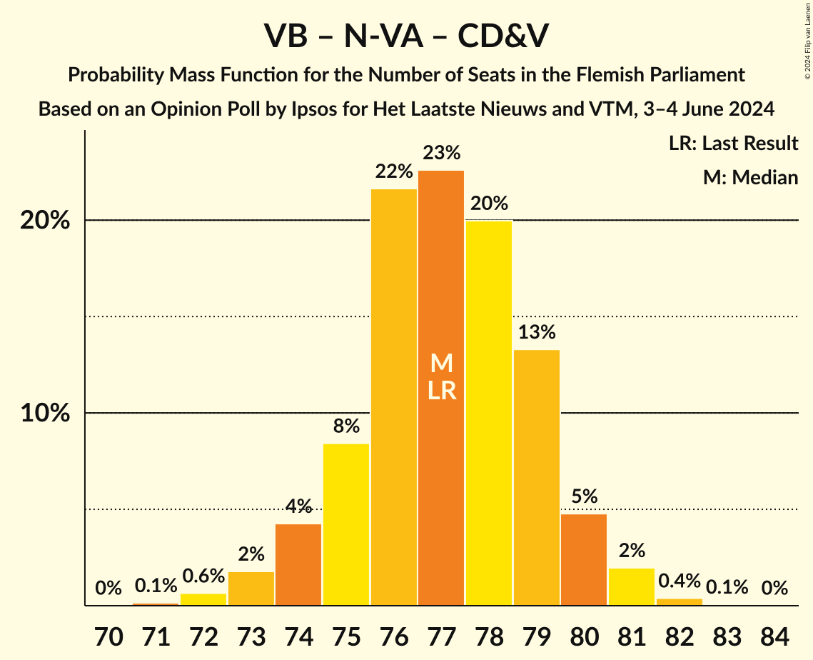

| Number of Seats | Probability | Accumulated | Special Marks |
|:---------------:|:-----------:|:-----------:|:-------------:|
| 71 | 0.1% | 100% |  |
| 72 | 0.6% | 99.8% |  |
| 73 | 2% | 99.2% |  |
| 74 | 4% | 97% |  |
| 75 | 8% | 93% |  |
| 76 | 22% | 85% |  |
| 77 | 23% | 63% | Last Result, Median |
| 78 | 20% | 40% |  |
| 79 | 13% | 21% |  |
| 80 | 5% | 7% |  |
| 81 | 2% | 2% |  |
| 82 | 0.4% | 0.5% |  |
| 83 | 0.1% | 0.1% |  |
| 84 | 0% | 0% |  |

### Nieuw-Vlaamse Alliantie – Vooruit – Christen-Democratisch en Vlaams – Open Vlaamse Liberalen en Democraten

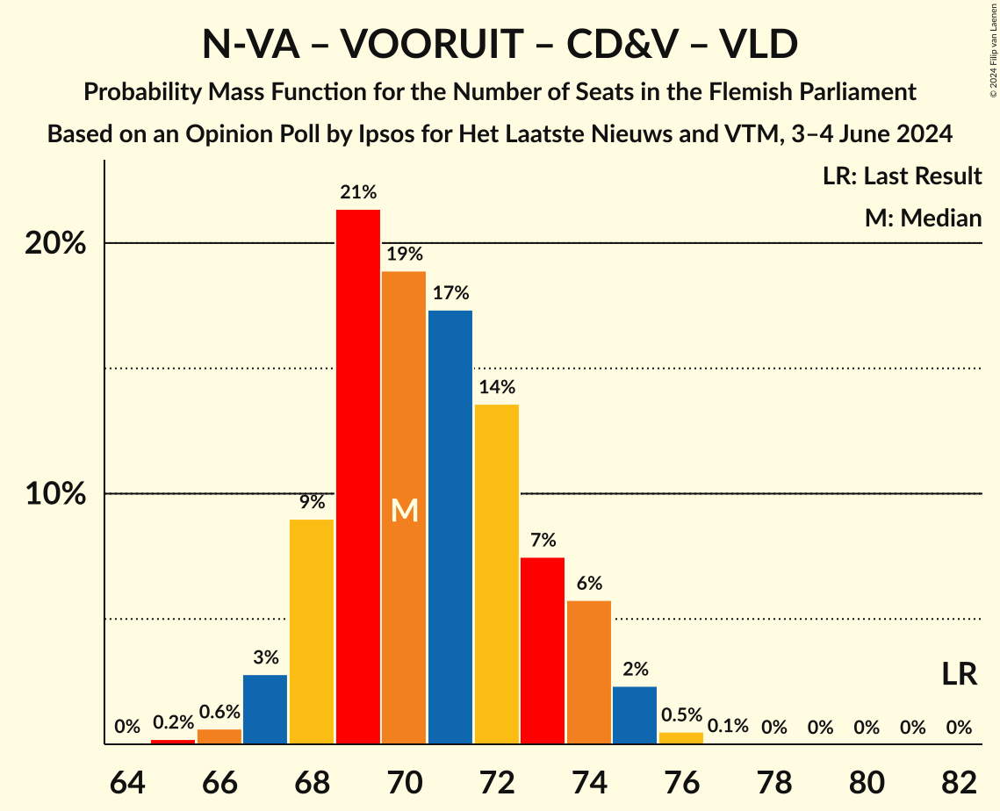

| Number of Seats | Probability | Accumulated | Special Marks |
|:---------------:|:-----------:|:-----------:|:-------------:|
| 65 | 0.2% | 100% |  |
| 66 | 0.6% | 99.7% |  |
| 67 | 3% | 99.1% |  |
| 68 | 9% | 96% |  |
| 69 | 21% | 87% |  |
| 70 | 19% | 66% | Median |
| 71 | 17% | 47% |  |
| 72 | 14% | 30% |  |
| 73 | 7% | 16% |  |
| 74 | 6% | 9% |  |
| 75 | 2% | 3% |  |
| 76 | 0.5% | 0.6% |  |
| 77 | 0.1% | 0.1% |  |
| 78 | 0% | 0% |  |
| 79 | 0% | 0% |  |
| 80 | 0% | 0% |  |
| 81 | 0% | 0% |  |
| 82 | 0% | 0% | Last Result |

### Nieuw-Vlaamse Alliantie – Vooruit – Christen-Democratisch en Vlaams

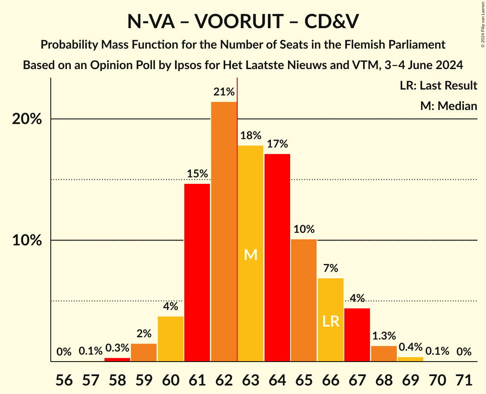

| Number of Seats | Probability | Accumulated | Special Marks |
|:---------------:|:-----------:|:-----------:|:-------------:|
| 57 | 0.1% | 100% |  |
| 58 | 0.3% | 99.9% |  |
| 59 | 2% | 99.6% |  |
| 60 | 4% | 98% |  |
| 61 | 15% | 94% |  |
| 62 | 21% | 80% | Median |
| 63 | 18% | 58% | Majority |
| 64 | 17% | 40% |  |
| 65 | 10% | 23% |  |
| 66 | 7% | 13% | Last Result |
| 67 | 4% | 6% |  |
| 68 | 1.3% | 2% |  |
| 69 | 0.4% | 0.5% |  |
| 70 | 0.1% | 0.1% |  |
| 71 | 0% | 0% |  |

### Vlaams Belang – Nieuw-Vlaamse Alliantie

| Number of Seats | Probability | Accumulated | Special Marks |
|:---------------:|:-----------:|:-----------:|:-------------:|
| 57 | 0.2% | 100% |  |
| 58 | 1.4% | 99.8% | Last Result |
| 59 | 4% | 98% |  |
| 60 | 9% | 95% |  |
| 61 | 11% | 86% |  |
| 62 | 21% | 75% |  |
| 63 | 23% | 54% | Median, Majority |
| 64 | 17% | 31% |  |
| 65 | 9% | 14% |  |
| 66 | 3% | 4% |  |
| 67 | 0.6% | 0.8% |  |
| 68 | 0.1% | 0.1% |  |
| 69 | 0% | 0% |  |

### Nieuw-Vlaamse Alliantie – Vooruit – Open Vlaamse Liberalen en Democraten

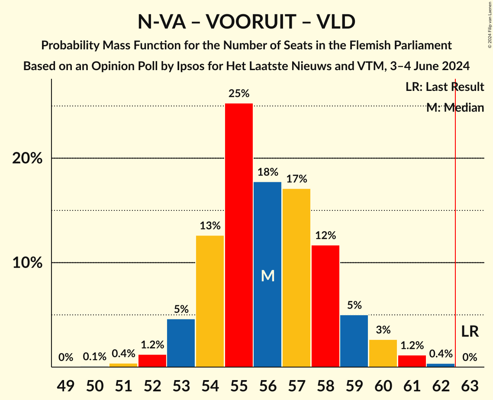

| Number of Seats | Probability | Accumulated | Special Marks |
|:---------------:|:-----------:|:-----------:|:-------------:|
| 50 | 0.1% | 100% |  |
| 51 | 0.4% | 99.9% |  |
| 52 | 1.2% | 99.5% |  |
| 53 | 5% | 98% |  |
| 54 | 13% | 94% |  |
| 55 | 25% | 81% |  |
| 56 | 18% | 56% | Median |
| 57 | 17% | 38% |  |
| 58 | 12% | 21% |  |
| 59 | 5% | 9% |  |
| 60 | 3% | 4% |  |
| 61 | 1.2% | 2% |  |
| 62 | 0.4% | 0.4% |  |
| 63 | 0% | 0% | Last Result, Majority |

### Vooruit – Christen-Democratisch en Vlaams – Partij van de Arbeid van België – Groen

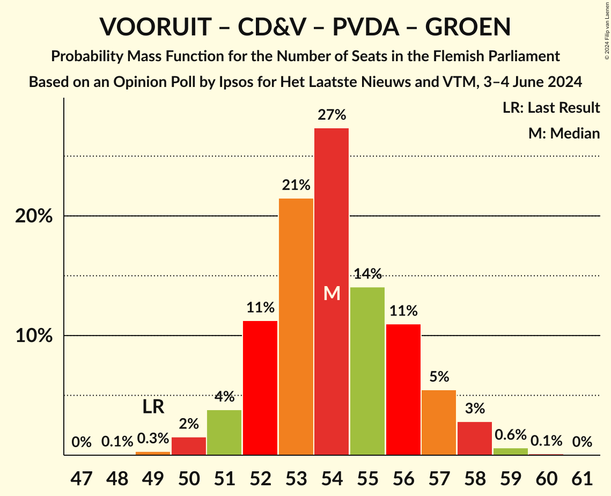

| Number of Seats | Probability | Accumulated | Special Marks |
|:---------------:|:-----------:|:-----------:|:-------------:|
| 48 | 0.1% | 100% |  |
| 49 | 0.3% | 99.9% | Last Result |
| 50 | 2% | 99.6% |  |
| 51 | 4% | 98% |  |
| 52 | 11% | 94% |  |
| 53 | 21% | 83% | Median |
| 54 | 27% | 62% |  |
| 55 | 14% | 34% |  |
| 56 | 11% | 20% |  |
| 57 | 5% | 9% |  |
| 58 | 3% | 4% |  |
| 59 | 0.6% | 0.8% |  |
| 60 | 0.1% | 0.2% |  |
| 61 | 0% | 0% |  |

### Nieuw-Vlaamse Alliantie – Christen-Democratisch en Vlaams – Open Vlaamse Liberalen en Democraten

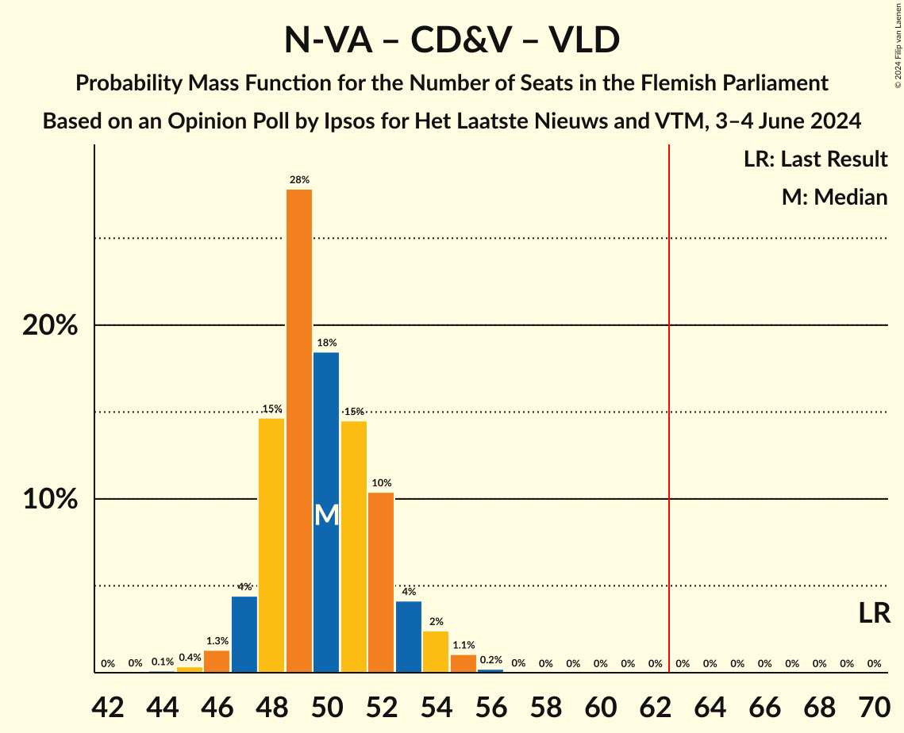

| Number of Seats | Probability | Accumulated | Special Marks |
|:---------------:|:-----------:|:-----------:|:-------------:|
| 44 | 0.1% | 100% |  |
| 45 | 0.4% | 99.9% |  |
| 46 | 1.3% | 99.5% |  |
| 47 | 4% | 98% |  |
| 48 | 15% | 94% |  |
| 49 | 28% | 79% |  |
| 50 | 18% | 51% | Median |
| 51 | 15% | 33% |  |
| 52 | 10% | 18% |  |
| 53 | 4% | 8% |  |
| 54 | 2% | 4% |  |
| 55 | 1.1% | 1.3% |  |
| 56 | 0.2% | 0.3% |  |
| 57 | 0% | 0% |  |
| 58 | 0% | 0% |  |
| 59 | 0% | 0% |  |
| 60 | 0% | 0% |  |
| 61 | 0% | 0% |  |
| 62 | 0% | 0% |  |
| 63 | 0% | 0% | Majority |
| 64 | 0% | 0% |  |
| 65 | 0% | 0% |  |
| 66 | 0% | 0% |  |
| 67 | 0% | 0% |  |
| 68 | 0% | 0% |  |
| 69 | 0% | 0% |  |
| 70 | 0% | 0% | Last Result |

### Vooruit – Christen-Democratisch en Vlaams – Open Vlaamse Liberalen en Democraten – Groen

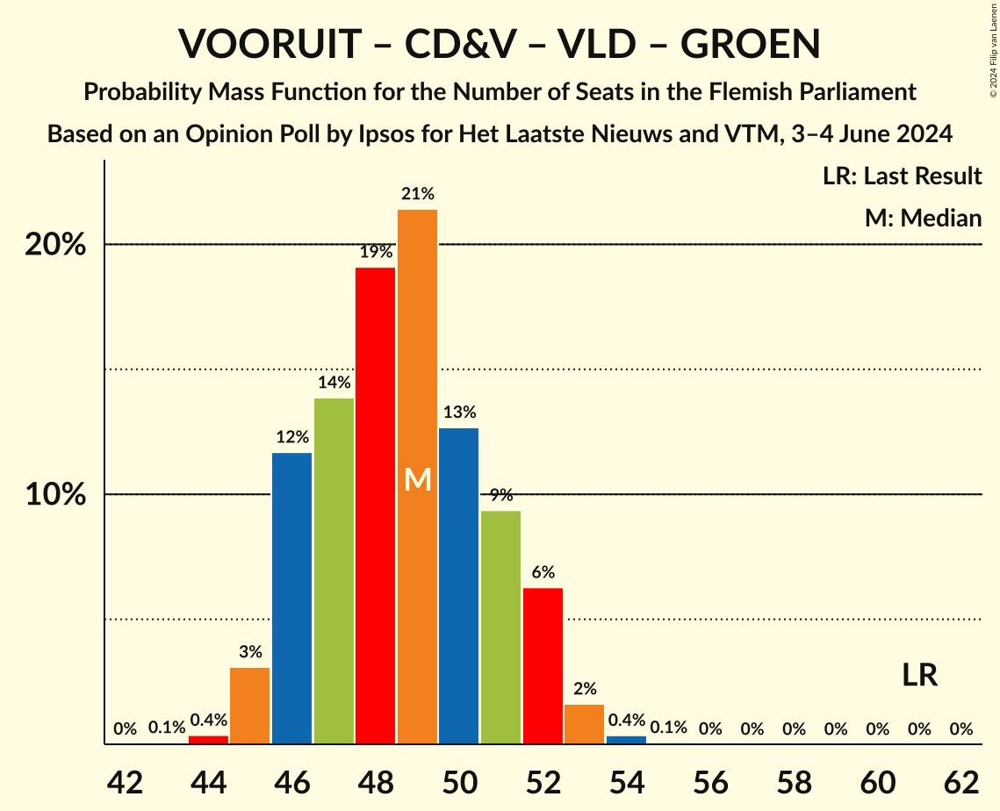

| Number of Seats | Probability | Accumulated | Special Marks |
|:---------------:|:-----------:|:-----------:|:-------------:|
| 43 | 0.1% | 100% |  |
| 44 | 0.4% | 99.9% |  |
| 45 | 3% | 99.6% |  |
| 46 | 12% | 96% |  |
| 47 | 14% | 85% |  |
| 48 | 19% | 71% | Median |
| 49 | 21% | 52% |  |
| 50 | 13% | 30% |  |
| 51 | 9% | 18% |  |
| 52 | 6% | 8% |  |
| 53 | 2% | 2% |  |
| 54 | 0.4% | 0.5% |  |
| 55 | 0.1% | 0.1% |  |
| 56 | 0% | 0% |  |
| 57 | 0% | 0% |  |
| 58 | 0% | 0% |  |
| 59 | 0% | 0% |  |
| 60 | 0% | 0% |  |
| 61 | 0% | 0% | Last Result |

### Nieuw-Vlaamse Alliantie – Christen-Democratisch en Vlaams

| Number of Seats | Probability | Accumulated | Special Marks |
|:---------------:|:-----------:|:-----------:|:-------------:|
| 37 | 0% | 100% |  |
| 38 | 0.3% | 99.9% |  |
| 39 | 1.4% | 99.7% |  |
| 40 | 5% | 98% |  |
| 41 | 27% | 93% |  |
| 42 | 21% | 66% | Median |
| 43 | 18% | 45% |  |
| 44 | 16% | 27% |  |
| 45 | 7% | 11% |  |
| 46 | 2% | 4% |  |
| 47 | 2% | 2% |  |
| 48 | 0.4% | 0.4% |  |
| 49 | 0% | 0% |  |
| 50 | 0% | 0% |  |
| 51 | 0% | 0% |  |
| 52 | 0% | 0% |  |
| 53 | 0% | 0% |  |
| 54 | 0% | 0% | Last Result |

### Vooruit – Christen-Democratisch en Vlaams – Open Vlaamse Liberalen en Democraten

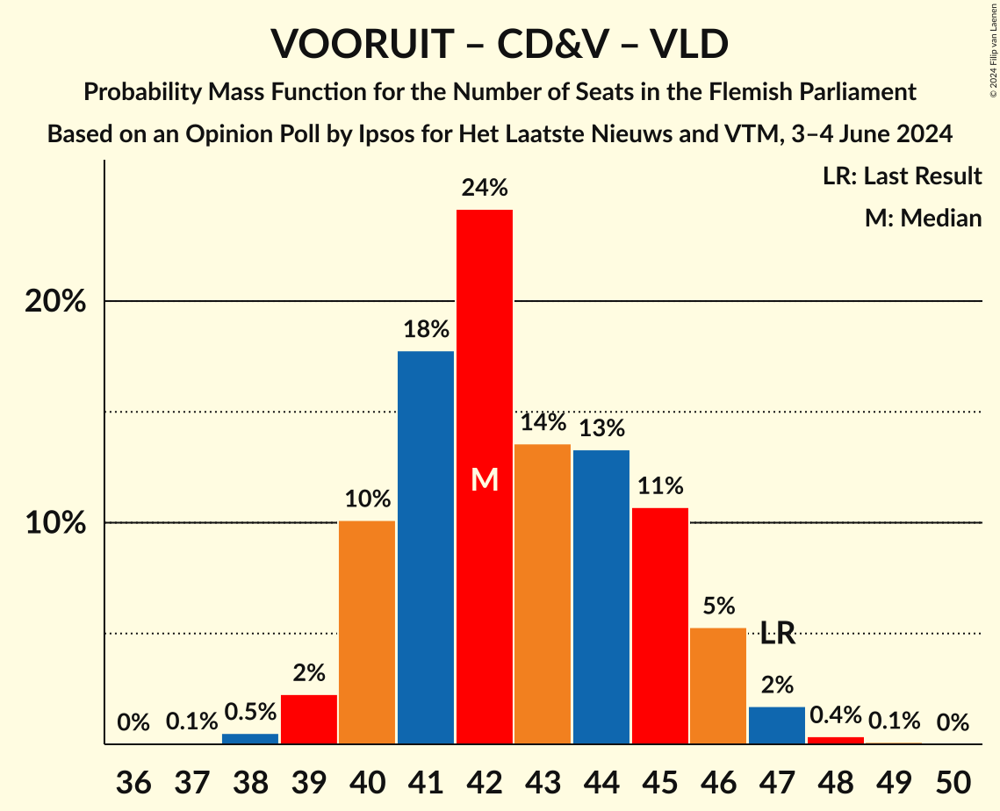

| Number of Seats | Probability | Accumulated | Special Marks |
|:---------------:|:-----------:|:-----------:|:-------------:|
| 37 | 0.1% | 100% |  |
| 38 | 0.5% | 99.9% |  |
| 39 | 2% | 99.4% |  |
| 40 | 10% | 97% |  |
| 41 | 18% | 87% |  |
| 42 | 24% | 69% | Median |
| 43 | 14% | 45% |  |
| 44 | 13% | 31% |  |
| 45 | 11% | 18% |  |
| 46 | 5% | 7% |  |
| 47 | 2% | 2% | Last Result |
| 48 | 0.4% | 0.5% |  |
| 49 | 0.1% | 0.1% |  |
| 50 | 0% | 0% |  |

### Vooruit – Christen-Democratisch en Vlaams – Groen

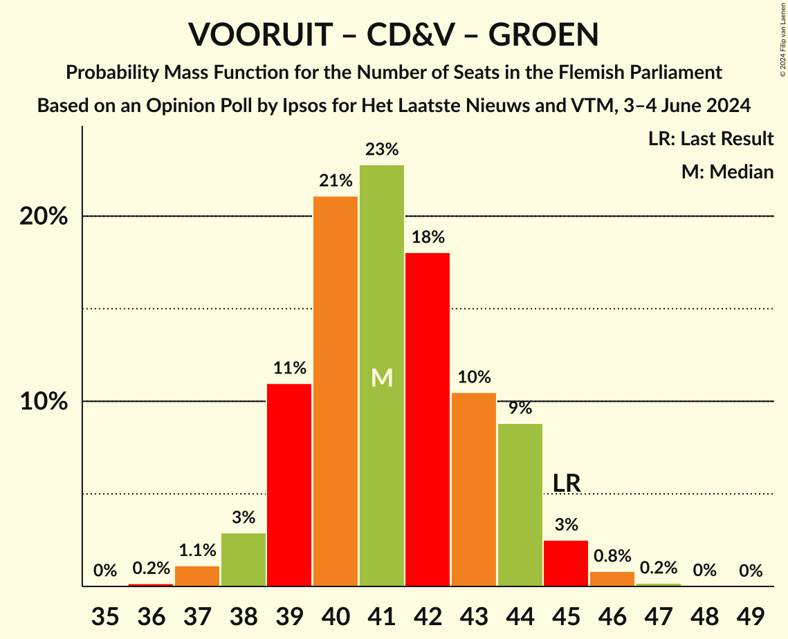

| Number of Seats | Probability | Accumulated | Special Marks |
|:---------------:|:-----------:|:-----------:|:-------------:|
| 36 | 0.2% | 100% |  |
| 37 | 1.1% | 99.8% |  |
| 38 | 3% | 98.7% |  |
| 39 | 11% | 96% |  |
| 40 | 21% | 85% | Median |
| 41 | 23% | 64% |  |
| 42 | 18% | 41% |  |
| 43 | 10% | 23% |  |
| 44 | 9% | 12% |  |
| 45 | 3% | 4% | Last Result |
| 46 | 0.8% | 1.1% |  |
| 47 | 0.2% | 0.2% |  |
| 48 | 0% | 0.1% |  |
| 49 | 0% | 0% |  |

### Vooruit – Christen-Democratisch en Vlaams

| Number of Seats | Probability | Accumulated | Special Marks |
|:---------------:|:-----------:|:-----------:|:-------------:|
| 30 | 0.1% | 100% |  |
| 31 | 0.5% | 99.9% | Last Result |
| 32 | 3% | 99.4% |  |
| 33 | 8% | 96% |  |
| 34 | 31% | 89% | Median |
| 35 | 20% | 58% |  |
| 36 | 14% | 38% |  |
| 37 | 14% | 24% |  |
| 38 | 6% | 10% |  |
| 39 | 3% | 4% |  |
| 40 | 0.6% | 0.8% |  |
| 41 | 0.2% | 0.3% |  |
| 42 | 0.1% | 0.1% |  |
| 43 | 0% | 0% |  |

### Nieuw-Vlaamse Alliantie – Open Vlaamse Liberalen en Democraten

| Number of Seats | Probability | Accumulated | Special Marks |
|:---------------:|:-----------:|:-----------:|:-------------:|
| 30 | 0.2% | 100% |  |
| 31 | 0.5% | 99.7% |  |
| 32 | 2% | 99.2% |  |
| 33 | 6% | 97% |  |
| 34 | 19% | 92% |  |
| 35 | 33% | 73% |  |
| 36 | 17% | 39% | Median |
| 37 | 13% | 22% |  |
| 38 | 7% | 10% |  |
| 39 | 2% | 2% |  |
| 40 | 0.3% | 0.5% |  |
| 41 | 0.1% | 0.1% |  |
| 42 | 0% | 0% |  |
| 43 | 0% | 0% |  |
| 44 | 0% | 0% |  |
| 45 | 0% | 0% |  |
| 46 | 0% | 0% |  |
| 47 | 0% | 0% |  |
| 48 | 0% | 0% |  |
| 49 | 0% | 0% |  |
| 50 | 0% | 0% |  |
| 51 | 0% | 0% | Last Result |

### Vooruit – Open Vlaamse Liberalen en Democraten – Groen

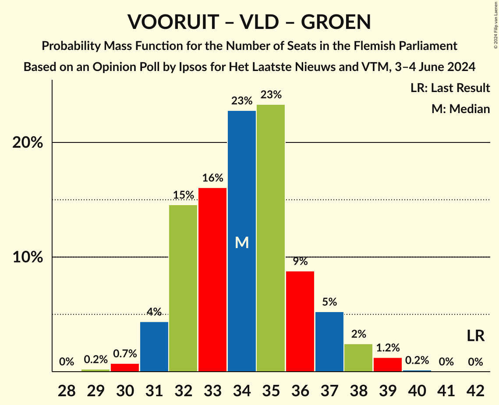

| Number of Seats | Probability | Accumulated | Special Marks |
|:---------------:|:-----------:|:-----------:|:-------------:|
| 29 | 0.2% | 100% |  |
| 30 | 0.7% | 99.7% |  |
| 31 | 4% | 99.0% |  |
| 32 | 15% | 95% |  |
| 33 | 16% | 80% |  |
| 34 | 23% | 64% | Median |
| 35 | 23% | 41% |  |
| 36 | 9% | 18% |  |
| 37 | 5% | 9% |  |
| 38 | 2% | 4% |  |
| 39 | 1.2% | 1.4% |  |
| 40 | 0.2% | 0.2% |  |
| 41 | 0% | 0% |  |
| 42 | 0% | 0% | Last Result |

### Christen-Democratisch en Vlaams – Open Vlaamse Liberalen en Democraten – Groen

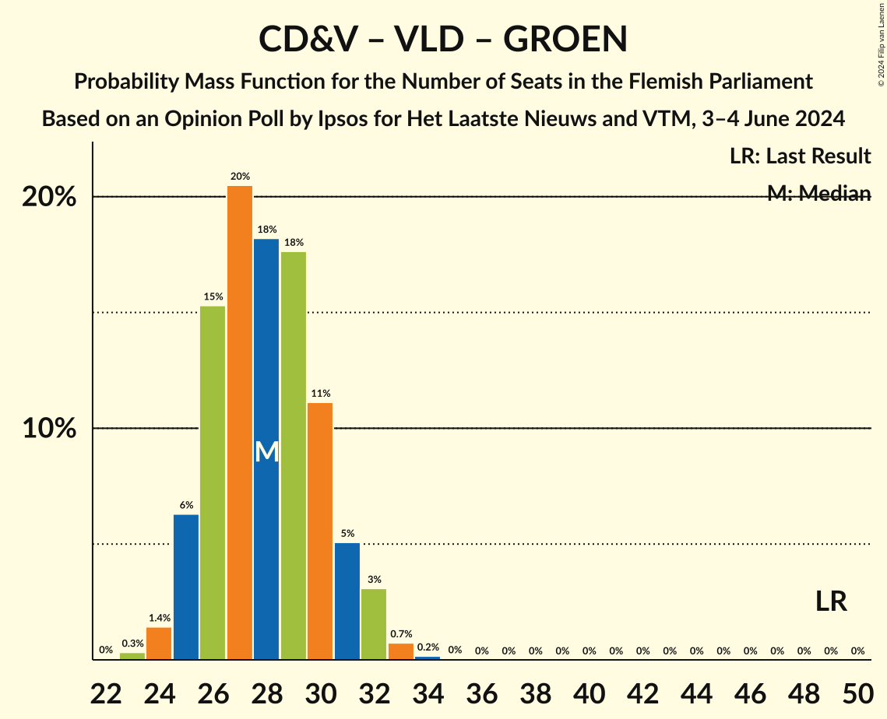

| Number of Seats | Probability | Accumulated | Special Marks |
|:---------------:|:-----------:|:-----------:|:-------------:|
| 22 | 0% | 100% |  |
| 23 | 0.3% | 99.9% |  |
| 24 | 1.4% | 99.6% |  |
| 25 | 6% | 98% |  |
| 26 | 15% | 92% |  |
| 27 | 20% | 77% |  |
| 28 | 18% | 56% | Median |
| 29 | 18% | 38% |  |
| 30 | 11% | 20% |  |
| 31 | 5% | 9% |  |
| 32 | 3% | 4% |  |
| 33 | 0.7% | 1.0% |  |
| 34 | 0.2% | 0.2% |  |
| 35 | 0% | 0.1% |  |
| 36 | 0% | 0% |  |
| 37 | 0% | 0% |  |
| 38 | 0% | 0% |  |
| 39 | 0% | 0% |  |
| 40 | 0% | 0% |  |
| 41 | 0% | 0% |  |
| 42 | 0% | 0% |  |
| 43 | 0% | 0% |  |
| 44 | 0% | 0% |  |
| 45 | 0% | 0% |  |
| 46 | 0% | 0% |  |
| 47 | 0% | 0% |  |
| 48 | 0% | 0% |  |
| 49 | 0% | 0% | Last Result |

### Vooruit – Open Vlaamse Liberalen en Democraten

| Number of Seats | Probability | Accumulated | Special Marks |
|:---------------:|:-----------:|:-----------:|:-------------:|
| 22 | 0% | 100% |  |
| 23 | 0.1% | 99.9% |  |
| 24 | 0.8% | 99.8% |  |
| 25 | 3% | 99.0% |  |
| 26 | 12% | 96% |  |
| 27 | 24% | 85% |  |
| 28 | 30% | 61% | Last Result, Median |
| 29 | 11% | 31% |  |
| 30 | 9% | 20% |  |
| 31 | 6% | 10% |  |
| 32 | 4% | 4% |  |
| 33 | 0.3% | 0.4% |  |
| 34 | 0% | 0% |  |

### Christen-Democratisch en Vlaams – Open Vlaamse Liberalen en Democraten

| Number of Seats | Probability | Accumulated | Special Marks |
|:---------------:|:-----------:|:-----------:|:-------------:|
| 16 | 0% | 100% |  |
| 17 | 0.2% | 99.9% |  |
| 18 | 0.9% | 99.8% |  |
| 19 | 4% | 98.9% |  |
| 20 | 12% | 95% |  |
| 21 | 24% | 83% |  |
| 22 | 32% | 59% | Median |
| 23 | 10% | 27% |  |
| 24 | 8% | 17% |  |
| 25 | 7% | 9% |  |
| 26 | 1.1% | 2% |  |
| 27 | 0.4% | 0.5% |  |
| 28 | 0% | 0% |  |
| 29 | 0% | 0% |  |
| 30 | 0% | 0% |  |
| 31 | 0% | 0% |  |
| 32 | 0% | 0% |  |
| 33 | 0% | 0% |  |
| 34 | 0% | 0% |  |
| 35 | 0% | 0% | Last Result |

## Technical Information

### Opinion Poll

+ **Polling firm:** Ipsos
+ **Commissioner(s):** Het Laatste Nieuws and VTM
+ **Fieldwork period:** 3–4 June 2024

### Calculations

+ **Sample size:** 2000
+ **Simulations done:** 2,097,152
+ **Error estimate:** 0.44%

