# Poll Average

<a href="#voting-intentions">Voting Intentions</a> | <a href="#seats">Seats</a> | <a href="#coalitions">Coalitions</a> | <a href="#technical-information">Technical Information</a>

## Summary

The table below lists the polls on which the average is based. They are the most recent polls (less than 90 days old) registered and analyzed so far.

| Period     | Polling firm/Commissioner(s) | N-VA | VB | CD&V | VLD | VOORUIT | GROEN | PVDA |
|:----------:|:----------------------------:|:--:|:--:|:--:|:--:|:--:|:--:|:--:|
| 26 May 2019 | General Election | 24.8%   35 | 18.5%   23 | 15.4%   19 | 13.1%   16 | 10.1%   12 | 10.1%   14 | 5.3%   4 |
| N/A | Poll Average | 18–23%   24–31 | 24–29%   31–39 | 10–14%   11–17 | 6–12%   6–15 | 10–17%   13–23 | 5–9%   5–11 | 8–14%   8–18 |
| [3–4 June 2024](2024-06-04-Ipsos.html) | Ipsos   Het Laatste Nieuws and VTM | 19–23%   26–30 | 24–28%   31–37 | 11–14%   12–17 | 6–8%   5–10 | 14–17%   18–24 | 5–7%   5–8 | 9–12%   11–14 |
| [28–31 May 2024](2024-05-31-Cluster17.html) | Cluster17   RTL TVi | 17–22%   22–30 | 25–30%   33–41 | 10–14%   11–17 | 8–11%   8–14 | 11–15%   14–19 | 6–9%   5–11 | 8–11%   7–14 |
| [23 April–3 May 2024](2024-05-03-iVOX.html) | iVOX   Overlegcentrum van Vlaamse Verenigingen | 19–24%   26–31 | 24–29%   31–38 | 11–14%   12–17 | 6–9%   6–11 | 12–15%   14–20 | 7–10%   7–13 | 7–10%   7–13 |
| [8–18 April 2024](2024-04-18-Kantar.html) | Kantar   La Libre Belgique and RTBf | 18–23%   24–31 | 23–29%   30–38 | 10–14%   11–17 | 9–12%   11–16 | 10–14%   11–18 | 5–8%   3–9 | 10–14%   13–19 |
| 26 May 2019 | General Election | 24.8%   35 | 18.5%   23 | 15.4%   19 | 13.1%   16 | 10.1%   12 | 10.1%   14 | 5.3%   4 |

Only polls for which at least the sample size has been published are included in the table above.

**Legend:**
+ **Top half of each row:** Voting intentions (95% confidence interval)
+ **Bottom half of each row:** Seat projections for the Flemish Parliament (95% confidence interval)
+ **N-VA:** Nieuw-Vlaamse Alliantie
+ **VB:** Vlaams Belang
+ **CD&V:** Christen-Democratisch en Vlaams
+ **VLD:** Open Vlaamse Liberalen en Democraten
+ **VOORUIT:** Vooruit
+ **GROEN:** Groen
+ **PVDA:** Partij van de Arbeid van België
+ **N/A (single party):** Party not included the published results
+ **N/A (entire row):** Calculation for this opinion poll not started yet

## Voting Intentions

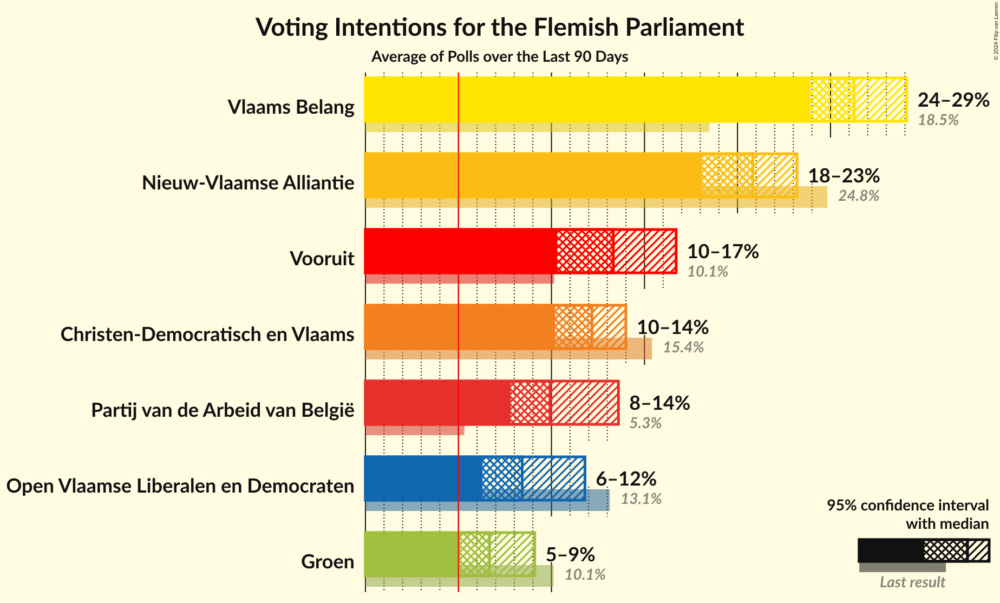

### Confidence Intervals

| Party | Last Result | Median | 80% Confidence Interval | 90% Confidence Interval | 95% Confidence Interval | 99% Confidence Interval |
|:-----:|:-----------:|:------:|:-----------------------:|:-----------------------:|:-----------------------:|:-----------------------:|
| <a href="#nieuw-vlaamse-alliantie">Nieuw-Vlaamse Alliantie</a> | 24.8% | 20.8% | 19.0–22.4% |18.5–22.8% | 18.1–23.2% | 17.2–24.0% |
| <a href="#vlaams-belang">Vlaams Belang</a> | 18.5% | 26.3% | 24.7–28.1% |24.3–28.6% | 23.9–29.1% | 23.1–30.1% |
| <a href="#christen-democratisch-en-vlaams">Christen-Democratisch en Vlaams</a> | 15.4% | 12.2% | 10.9–13.3% |10.6–13.7% | 10.2–14.0% | 9.6–14.6% |
| <a href="#open-vlaamse-liberalen-en-democraten">Open Vlaamse Liberalen en Democraten</a> | 13.1% | 8.4% | 6.8–10.8% |6.5–11.3% | 6.3–11.8% | 5.9–12.6% |
| <a href="#vooruit">Vooruit</a> | 10.1% | 13.3% | 11.2–15.8% |10.7–16.3% | 10.3–16.7% | 9.6–17.3% |
| <a href="#groen">Groen</a> | 10.1% | 6.7% | 5.6–8.5% |5.3–8.8% | 5.1–9.1% | 4.6–9.7% |
| <a href="#partij-van-de-arbeid-van-belgië">Partij van de Arbeid van België</a> | 5.3% | 9.9% | 8.4–12.5% |8.1–13.1% | 7.8–13.6% | 7.4–14.5% |

### Nieuw-Vlaamse Alliantie

*For a full overview of the results for this party, see the [Nieuw-Vlaamse Alliantie](party-nieuw-vlaamsealliantie.html) page.*

| Voting Intentions | Probability | Accumulated | Special Marks |
|:-----------------:|:-----------:|:-----------:|:-------------:|
| 14.5–15.5% | 0% | 100% |  |
| 15.5–16.5% | 0.1% | 100% |  |
| 16.5–17.5% | 0.9% | 99.9% |  |
| 17.5–18.5% | 4% | 99.0% |  |
| 18.5–19.5% | 12% | 95% |  |
| 19.5–20.5% | 24% | 82% |  |
| 20.5–21.5% | 31% | 58% | Median |
| 21.5–22.5% | 20% | 27% |  |
| 22.5–23.5% | 6% | 7% |  |
| 23.5–24.5% | 1.1% | 1.2% |  |
| 24.5–25.5% | 0.1% | 0.1% | Last Result |
| 25.5–26.5% | 0% | 0% |  |

### Vlaams Belang

*For a full overview of the results for this party, see the [Vlaams Belang](party-vlaamsbelang.html) page.*

| Voting Intentions | Probability | Accumulated | Special Marks |
|:-----------------:|:-----------:|:-----------:|:-------------:|
| 18.5–19.5% | 0% | 100% | Last Result |
| 19.5–20.5% | 0% | 100% |  |
| 20.5–21.5% | 0% | 100% |  |
| 21.5–22.5% | 0.1% | 100% |  |
| 22.5–23.5% | 1.1% | 99.9% |  |
| 23.5–24.5% | 7% | 98.8% |  |
| 24.5–25.5% | 20% | 92% |  |
| 25.5–26.5% | 30% | 72% | Median |
| 26.5–27.5% | 24% | 42% |  |
| 27.5–28.5% | 12% | 18% |  |
| 28.5–29.5% | 4% | 6% |  |
| 29.5–30.5% | 1.0% | 1.2% |  |
| 30.5–31.5% | 0.2% | 0.2% |  |
| 31.5–32.5% | 0% | 0% |  |

### Christen-Democratisch en Vlaams

*For a full overview of the results for this party, see the [Christen-Democratisch en Vlaams](party-christen-democratischenvlaams.html) page.*

| Voting Intentions | Probability | Accumulated | Special Marks |
|:-----------------:|:-----------:|:-----------:|:-------------:|
| 7.5–8.5% | 0% | 100% |  |
| 8.5–9.5% | 0.4% | 100% |  |
| 9.5–10.5% | 4% | 99.6% |  |
| 10.5–11.5% | 21% | 95% |  |
| 11.5–12.5% | 40% | 75% | Median |
| 12.5–13.5% | 28% | 34% |  |
| 13.5–14.5% | 6% | 7% |  |
| 14.5–15.5% | 0.5% | 0.5% | Last Result |
| 15.5–16.5% | 0% | 0% |  |

### Open Vlaamse Liberalen en Democraten

*For a full overview of the results for this party, see the [Open Vlaamse Liberalen en Democraten](party-openvlaamseliberalenendemocraten.html) page.*

| Voting Intentions | Probability | Accumulated | Special Marks |
|:-----------------:|:-----------:|:-----------:|:-------------:|
| 4.5–5.5% | 0.1% | 100% |  |
| 5.5–6.5% | 6% | 99.9% |  |
| 6.5–7.5% | 25% | 94% |  |
| 7.5–8.5% | 22% | 69% | Median |
| 8.5–9.5% | 17% | 48% |  |
| 9.5–10.5% | 17% | 30% |  |
| 10.5–11.5% | 10% | 14% |  |
| 11.5–12.5% | 3% | 4% |  |
| 12.5–13.5% | 0.5% | 0.5% | Last Result |
| 13.5–14.5% | 0% | 0% |  |

### Vooruit

*For a full overview of the results for this party, see the [Vooruit](party-vooruit.html) page.*

| Voting Intentions | Probability | Accumulated | Special Marks |
|:-----------------:|:-----------:|:-----------:|:-------------:|
| 7.5–8.5% | 0% | 100% |  |
| 8.5–9.5% | 0.4% | 100% |  |
| 9.5–10.5% | 3% | 99.6% | Last Result |
| 10.5–11.5% | 10% | 96% |  |
| 11.5–12.5% | 17% | 86% |  |
| 12.5–13.5% | 23% | 68% | Median |
| 13.5–14.5% | 18% | 45% |  |
| 14.5–15.5% | 14% | 28% |  |
| 15.5–16.5% | 11% | 14% |  |
| 16.5–17.5% | 3% | 3% |  |
| 17.5–18.5% | 0.3% | 0.3% |  |
| 18.5–19.5% | 0% | 0% |  |

### Groen

*For a full overview of the results for this party, see the [Groen](party-groen.html) page.*

| Voting Intentions | Probability | Accumulated | Special Marks |
|:-----------------:|:-----------:|:-----------:|:-------------:|
| 2.5–3.5% | 0% | 100% |  |
| 3.5–4.5% | 0.4% | 100% |  |
| 4.5–5.5% | 9% | 99.6% |  |
| 5.5–6.5% | 35% | 90% |  |
| 6.5–7.5% | 27% | 55% | Median |
| 7.5–8.5% | 19% | 28% |  |
| 8.5–9.5% | 8% | 8% |  |
| 9.5–10.5% | 0.8% | 0.8% | Last Result |
| 10.5–11.5% | 0% | 0% |  |

### Partij van de Arbeid van België

*For a full overview of the results for this party, see the [Partij van de Arbeid van België](party-partijvandearbeidvanbelgië.html) page.*

| Voting Intentions | Probability | Accumulated | Special Marks |
|:-----------------:|:-----------:|:-----------:|:-------------:|
| 4.5–5.5% | 0% | 100% | Last Result |
| 5.5–6.5% | 0% | 100% |  |
| 6.5–7.5% | 1.0% | 100% |  |
| 7.5–8.5% | 12% | 99.0% |  |
| 8.5–9.5% | 27% | 87% |  |
| 9.5–10.5% | 26% | 60% | Median |
| 10.5–11.5% | 15% | 34% |  |
| 11.5–12.5% | 10% | 20% |  |
| 12.5–13.5% | 7% | 10% |  |
| 13.5–14.5% | 2% | 3% |  |
| 14.5–15.5% | 0.4% | 0.4% |  |
| 15.5–16.5% | 0% | 0% |  |

## Seats

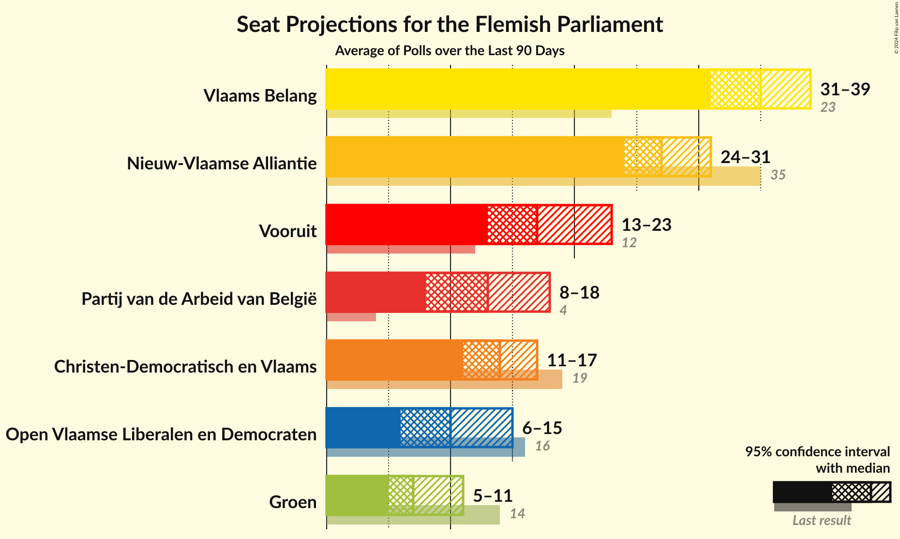

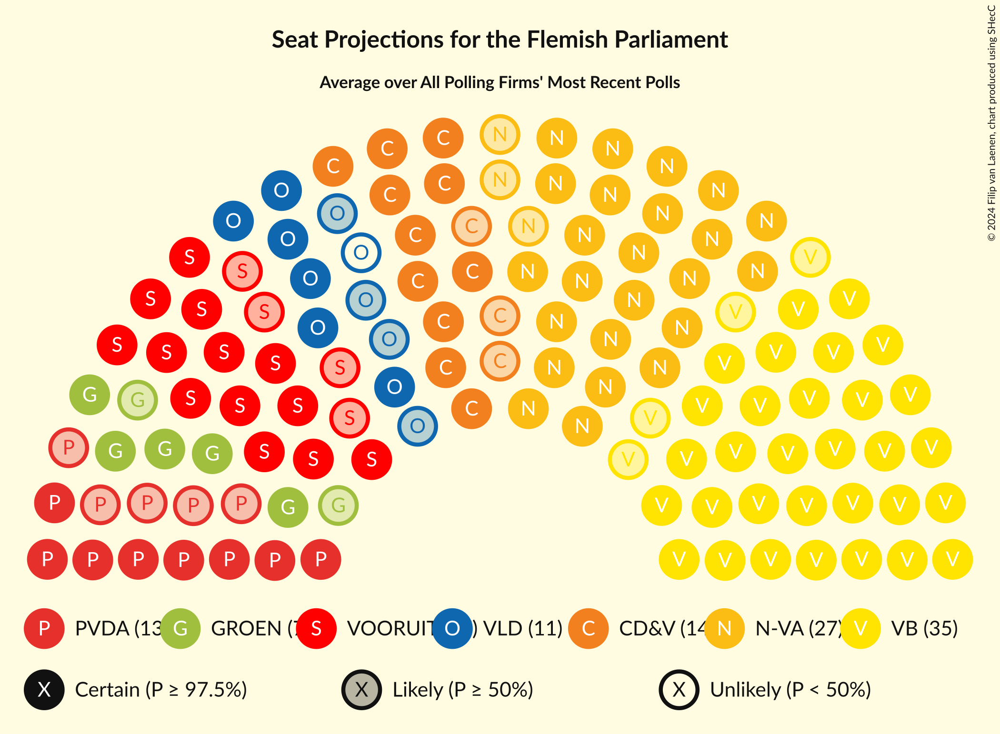

### Confidence Intervals

| Party | Last Result | Median | 80% Confidence Interval | 90% Confidence Interval | 95% Confidence Interval | 99% Confidence Interval |
|:-----:|:-----------:|:------:|:-----------------------:|:-----------------------:|:-----------------------:|:-----------------------:|
| <a href="#nieuw-vlaamse-alliantie">Nieuw-Vlaamse Alliantie</a> | 35 | 27 | 26–30 |25–30 | 24–31 | 22–32 |
| <a href="#vlaams-belang">Vlaams Belang</a> | 23 | 35 | 32–37 |32–38 | 31–39 | 30–41 |
| <a href="#christen-democratisch-en-vlaams">Christen-Democratisch en Vlaams</a> | 19 | 14 | 12–17 |12–17 | 11–17 | 11–18 |
| <a href="#open-vlaamse-liberalen-en-democraten">Open Vlaamse Liberalen en Democraten</a> | 16 | 10 | 7–13 |6–14 | 6–15 | 5–16 |
| <a href="#vooruit">Vooruit</a> | 12 | 17 | 14–20 |13–22 | 13–23 | 11–24 |
| <a href="#groen">Groen</a> | 14 | 7 | 5–11 |5–11 | 5–11 | 2–13 |
| <a href="#partij-van-de-arbeid-van-belgië">Partij van de Arbeid van België</a> | 4 | 13 | 9–15 |8–17 | 8–18 | 7–19 |

### Nieuw-Vlaamse Alliantie

*For a full overview of the results for this party, see the [Nieuw-Vlaamse Alliantie](party-nieuw-vlaamsealliantie.html) page.*

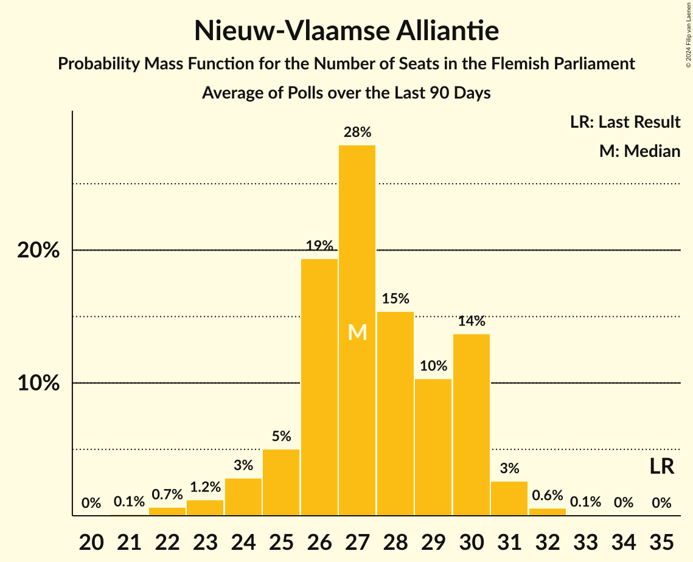

| Number of Seats | Probability | Accumulated | Special Marks |
|:---------------:|:-----------:|:-----------:|:-------------:|
| 21 | 0.1% | 100% |  |
| 22 | 0.7% | 99.9% |  |
| 23 | 1.2% | 99.2% |  |
| 24 | 3% | 98% |  |
| 25 | 5% | 95% |  |
| 26 | 19% | 90% |  |
| 27 | 28% | 71% | Median |
| 28 | 15% | 43% |  |
| 29 | 10% | 27% |  |
| 30 | 14% | 17% |  |
| 31 | 3% | 3% |  |
| 32 | 0.6% | 0.7% |  |
| 33 | 0.1% | 0.2% |  |
| 34 | 0% | 0.1% |  |
| 35 | 0% | 0% | Last Result |

### Vlaams Belang

*For a full overview of the results for this party, see the [Vlaams Belang](party-vlaamsbelang.html) page.*

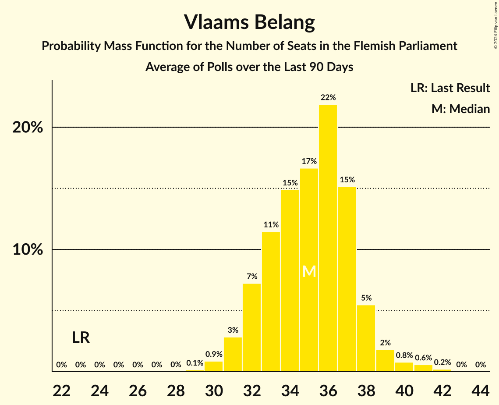

| Number of Seats | Probability | Accumulated | Special Marks |
|:---------------:|:-----------:|:-----------:|:-------------:|
| 23 | 0% | 100% | Last Result |
| 24 | 0% | 100% |  |
| 25 | 0% | 100% |  |
| 26 | 0% | 100% |  |
| 27 | 0% | 100% |  |
| 28 | 0% | 100% |  |
| 29 | 0.1% | 100% |  |
| 30 | 0.9% | 99.8% |  |
| 31 | 3% | 99.0% |  |
| 32 | 7% | 96% |  |
| 33 | 11% | 89% |  |
| 34 | 15% | 77% |  |
| 35 | 17% | 63% | Median |
| 36 | 22% | 46% |  |
| 37 | 15% | 24% |  |
| 38 | 5% | 9% |  |
| 39 | 2% | 3% |  |
| 40 | 0.8% | 2% |  |
| 41 | 0.6% | 0.8% |  |
| 42 | 0.2% | 0.2% |  |
| 43 | 0% | 0% |  |

### Christen-Democratisch en Vlaams

*For a full overview of the results for this party, see the [Christen-Democratisch en Vlaams](party-christen-democratischenvlaams.html) page.*

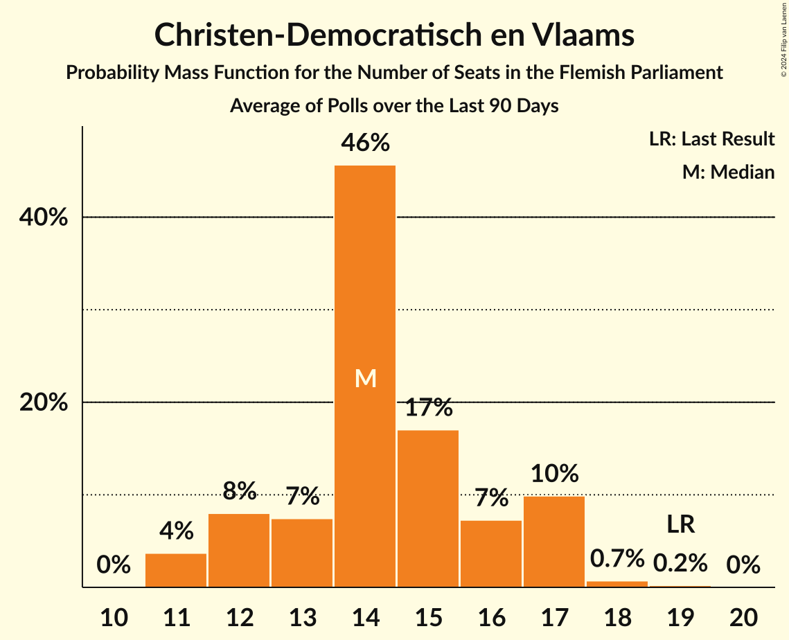

| Number of Seats | Probability | Accumulated | Special Marks |
|:---------------:|:-----------:|:-----------:|:-------------:|
| 11 | 4% | 100% |  |
| 12 | 8% | 96% |  |
| 13 | 7% | 88% |  |
| 14 | 46% | 81% | Median |
| 15 | 17% | 35% |  |
| 16 | 7% | 18% |  |
| 17 | 10% | 11% |  |
| 18 | 0.7% | 1.0% |  |
| 19 | 0.2% | 0.2% | Last Result |
| 20 | 0% | 0% |  |

### Open Vlaamse Liberalen en Democraten

*For a full overview of the results for this party, see the [Open Vlaamse Liberalen en Democraten](party-openvlaamseliberalenendemocraten.html) page.*

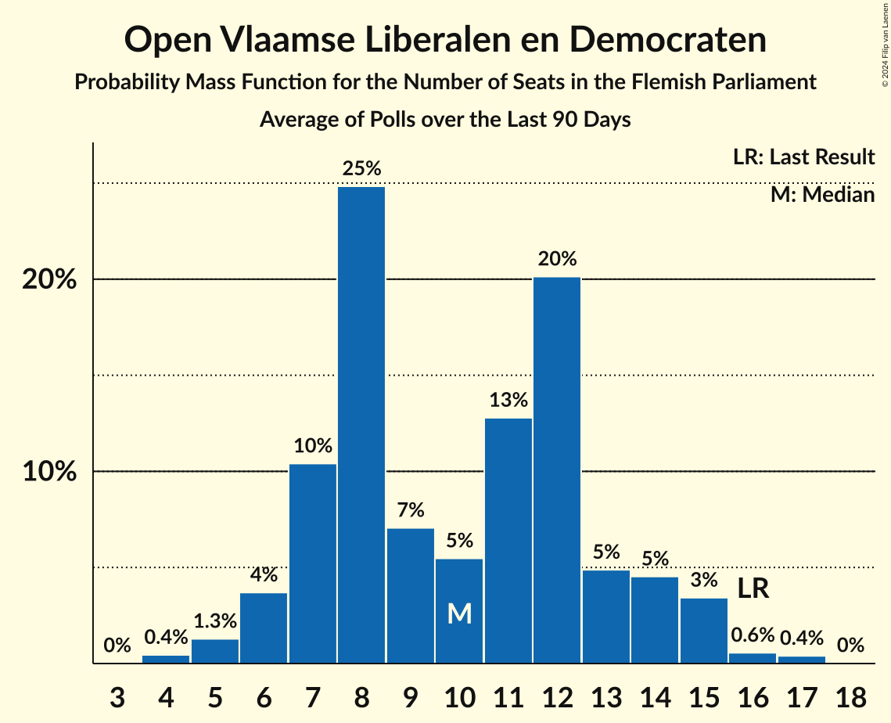

| Number of Seats | Probability | Accumulated | Special Marks |
|:---------------:|:-----------:|:-----------:|:-------------:|
| 4 | 0.4% | 100% |  |
| 5 | 1.3% | 99.5% |  |
| 6 | 4% | 98% |  |
| 7 | 10% | 95% |  |
| 8 | 25% | 84% |  |
| 9 | 7% | 59% |  |
| 10 | 5% | 52% | Median |
| 11 | 13% | 47% |  |
| 12 | 20% | 34% |  |
| 13 | 5% | 14% |  |
| 14 | 5% | 9% |  |
| 15 | 3% | 4% |  |
| 16 | 0.6% | 1.0% | Last Result |
| 17 | 0.4% | 0.4% |  |
| 18 | 0% | 0% |  |

### Vooruit

*For a full overview of the results for this party, see the [Vooruit](party-vooruit.html) page.*

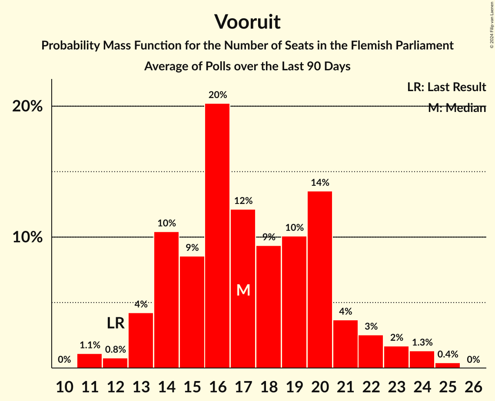

| Number of Seats | Probability | Accumulated | Special Marks |
|:---------------:|:-----------:|:-----------:|:-------------:|
| 11 | 1.1% | 100% |  |
| 12 | 0.8% | 98.9% | Last Result |
| 13 | 4% | 98% |  |
| 14 | 10% | 94% |  |
| 15 | 9% | 83% |  |
| 16 | 20% | 75% |  |
| 17 | 12% | 55% | Median |
| 18 | 9% | 43% |  |
| 19 | 10% | 33% |  |
| 20 | 14% | 23% |  |
| 21 | 4% | 10% |  |
| 22 | 3% | 6% |  |
| 23 | 2% | 3% |  |
| 24 | 1.3% | 2% |  |
| 25 | 0.4% | 0.4% |  |
| 26 | 0% | 0% |  |

### Groen

*For a full overview of the results for this party, see the [Groen](party-groen.html) page.*

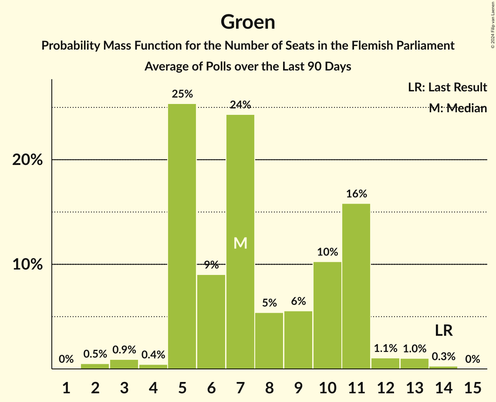

| Number of Seats | Probability | Accumulated | Special Marks |
|:---------------:|:-----------:|:-----------:|:-------------:|
| 2 | 0.5% | 100% |  |
| 3 | 0.9% | 99.5% |  |
| 4 | 0.4% | 98.6% |  |
| 5 | 25% | 98% |  |
| 6 | 9% | 73% |  |
| 7 | 24% | 64% | Median |
| 8 | 5% | 39% |  |
| 9 | 6% | 34% |  |
| 10 | 10% | 28% |  |
| 11 | 16% | 18% |  |
| 12 | 1.1% | 2% |  |
| 13 | 1.0% | 1.3% |  |
| 14 | 0.3% | 0.3% | Last Result |
| 15 | 0% | 0% |  |

### Partij van de Arbeid van België

*For a full overview of the results for this party, see the [Partij van de Arbeid van België](party-partijvandearbeidvanbelgië.html) page.*

| Number of Seats | Probability | Accumulated | Special Marks |
|:---------------:|:-----------:|:-----------:|:-------------:|
| 4 | 0% | 100% | Last Result |
| 5 | 0% | 100% |  |
| 6 | 0% | 100% |  |
| 7 | 2% | 100% |  |
| 8 | 4% | 98% |  |
| 9 | 7% | 93% |  |
| 10 | 6% | 87% |  |
| 11 | 17% | 81% |  |
| 12 | 13% | 64% |  |
| 13 | 22% | 52% | Median |
| 14 | 17% | 30% |  |
| 15 | 3% | 13% |  |
| 16 | 3% | 9% |  |
| 17 | 2% | 6% |  |
| 18 | 4% | 4% |  |
| 19 | 0.7% | 0.8% |  |
| 20 | 0% | 0% |  |

## Coalitions

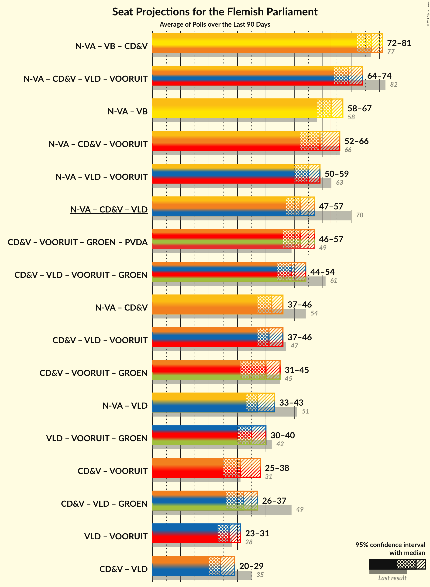

### Confidence Intervals

| Coalition | Last Result | Median | Majority? | 80% Confidence Interval | 90% Confidence Interval | 95% Confidence Interval | 99% Confidence Interval |
|:---------:|:-----------:|:------:|:---------:|:-----------------------:|:-----------------------:|:-----------------------:|:-----------------------:|
| Nieuw-Vlaamse Alliantie – Vlaams Belang – Christen-Democratisch en Vlaams | 77 | 77 | 100% | 74–80 | 73–80 | 72–81 | 71–82 |
| Nieuw-Vlaamse Alliantie – Christen-Democratisch en Vlaams – Open Vlaamse Liberalen en Democraten – Vooruit | 82 | 69 | 99.7% | 66–72 | 65–73 | 64–74 | 63–75 |
| Nieuw-Vlaamse Alliantie – Vlaams Belang | 58 | 63 | 52% | 60–65 | 59–66 | 58–67 | 57–68 |
| Nieuw-Vlaamse Alliantie – Christen-Democratisch en Vlaams – Vooruit | 66 | 59 | 18% | 54–64 | 53–65 | 52–66 | 51–67 |
| Nieuw-Vlaamse Alliantie – Open Vlaamse Liberalen en Democraten – Vooruit | 63 | 55 | 0% | 52–58 | 51–58 | 50–59 | 49–61 |
| Nieuw-Vlaamse Alliantie – Christen-Democratisch en Vlaams – Open Vlaamse Liberalen en Democraten | 70 | 52 | 0% | 49–55 | 48–56 | 47–57 | 46–59 |
| Christen-Democratisch en Vlaams – Vooruit – Groen – Partij van de Arbeid van België | 49 | 52 | 0% | 48–55 | 46–56 | 46–57 | 44–58 |
| Christen-Democratisch en Vlaams – Open Vlaamse Liberalen en Democraten – Vooruit – Groen | 61 | 49 | 0% | 46–52 | 45–53 | 44–54 | 42–56 |
| Nieuw-Vlaamse Alliantie – Christen-Democratisch en Vlaams | 54 | 42 | 0% | 39–45 | 38–45 | 37–46 | 36–47 |
| Christen-Democratisch en Vlaams – Open Vlaamse Liberalen en Democraten – Vooruit | 47 | 41 | 0% | 39–45 | 38–45 | 37–46 | 36–47 |
| Christen-Democratisch en Vlaams – Vooruit – Groen | 45 | 40 | 0% | 33–44 | 32–44 | 31–45 | 29–46 |
| Nieuw-Vlaamse Alliantie – Open Vlaamse Liberalen en Democraten | 51 | 37 | 0% | 34–41 | 34–42 | 33–43 | 32–45 |
| Open Vlaamse Liberalen en Democraten – Vooruit – Groen | 42 | 35 | 0% | 32–38 | 31–39 | 30–40 | 28–41 |
| Christen-Democratisch en Vlaams – Vooruit | 31 | 31 | 0% | 27–36 | 26–37 | 25–38 | 24–39 |
| Christen-Democratisch en Vlaams – Open Vlaamse Liberalen en Democraten – Groen | 49 | 32 | 0% | 27–36 | 26–37 | 26–37 | 25–39 |
| Open Vlaamse Liberalen en Democraten – Vooruit | 28 | 27 | 0% | 25–30 | 24–31 | 23–31 | 22–32 |
| Christen-Democratisch en Vlaams – Open Vlaamse Liberalen en Democraten | 35 | 24 | 0% | 21–28 | 20–29 | 20–29 | 19–31 |

### Nieuw-Vlaamse Alliantie – Vlaams Belang – Christen-Democratisch en Vlaams

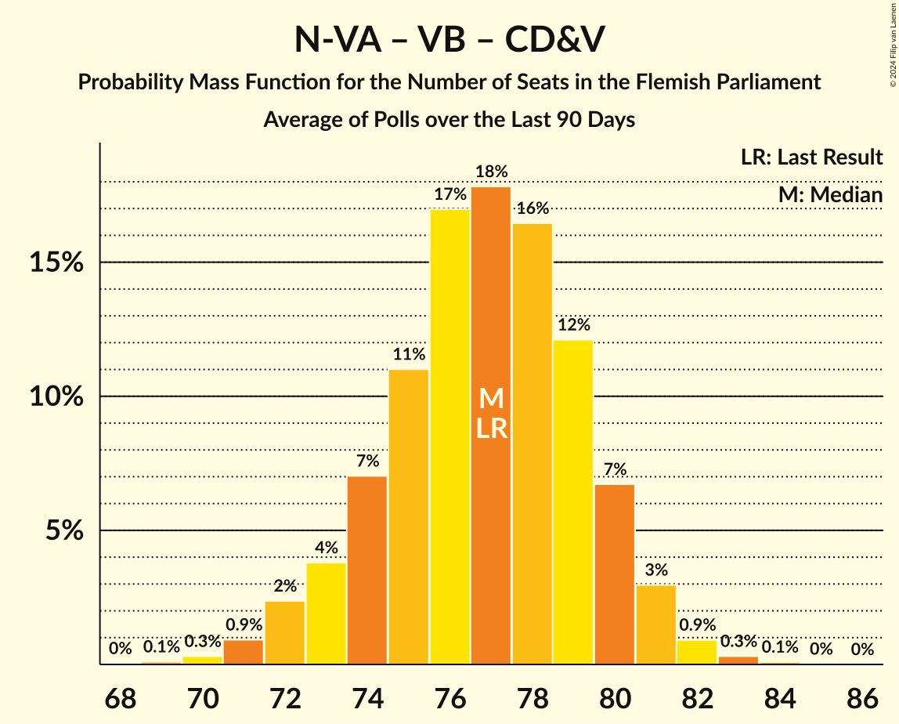

| Number of Seats | Probability | Accumulated | Special Marks |
|:---------------:|:-----------:|:-----------:|:-------------:|
| 68 | 0% | 100% |  |
| 69 | 0.1% | 99.9% |  |
| 70 | 0.3% | 99.8% |  |
| 71 | 0.9% | 99.5% |  |
| 72 | 2% | 98.6% |  |
| 73 | 4% | 96% |  |
| 74 | 7% | 92% |  |
| 75 | 11% | 85% |  |
| 76 | 17% | 74% | Median |
| 77 | 18% | 57% | Last Result |
| 78 | 16% | 40% |  |
| 79 | 12% | 23% |  |
| 80 | 7% | 11% |  |
| 81 | 3% | 4% |  |
| 82 | 0.9% | 1.3% |  |
| 83 | 0.3% | 0.4% |  |
| 84 | 0.1% | 0.1% |  |
| 85 | 0% | 0% |  |

### Nieuw-Vlaamse Alliantie – Christen-Democratisch en Vlaams – Open Vlaamse Liberalen en Democraten – Vooruit

| Number of Seats | Probability | Accumulated | Special Marks |
|:---------------:|:-----------:|:-----------:|:-------------:|
| 61 | 0.1% | 100% |  |
| 62 | 0.2% | 99.9% |  |
| 63 | 0.6% | 99.7% | Majority |
| 64 | 2% | 99.1% |  |
| 65 | 5% | 97% |  |
| 66 | 8% | 92% |  |
| 67 | 11% | 84% |  |
| 68 | 15% | 73% | Median |
| 69 | 19% | 59% |  |
| 70 | 15% | 40% |  |
| 71 | 11% | 26% |  |
| 72 | 8% | 15% |  |
| 73 | 4% | 7% |  |
| 74 | 2% | 3% |  |
| 75 | 0.9% | 1.1% |  |
| 76 | 0.2% | 0.2% |  |
| 77 | 0% | 0% |  |
| 78 | 0% | 0% |  |
| 79 | 0% | 0% |  |
| 80 | 0% | 0% |  |
| 81 | 0% | 0% |  |
| 82 | 0% | 0% | Last Result |

### Nieuw-Vlaamse Alliantie – Vlaams Belang

| Number of Seats | Probability | Accumulated | Special Marks |
|:---------------:|:-----------:|:-----------:|:-------------:|
| 55 | 0.1% | 100% |  |
| 56 | 0.3% | 99.9% |  |
| 57 | 0.8% | 99.6% |  |
| 58 | 2% | 98.8% | Last Result |
| 59 | 5% | 97% |  |
| 60 | 9% | 92% |  |
| 61 | 13% | 83% |  |
| 62 | 18% | 70% | Median |
| 63 | 19% | 52% | Majority |
| 64 | 17% | 33% |  |
| 65 | 9% | 16% |  |
| 66 | 5% | 7% |  |
| 67 | 2% | 3% |  |
| 68 | 0.7% | 1.0% |  |
| 69 | 0.2% | 0.2% |  |
| 70 | 0% | 0.1% |  |
| 71 | 0% | 0% |  |

### Nieuw-Vlaamse Alliantie – Christen-Democratisch en Vlaams – Vooruit

| Number of Seats | Probability | Accumulated | Special Marks |
|:---------------:|:-----------:|:-----------:|:-------------:|
| 49 | 0.1% | 100% |  |
| 50 | 0.3% | 99.9% |  |
| 51 | 0.8% | 99.6% |  |
| 52 | 2% | 98.8% |  |
| 53 | 3% | 97% |  |
| 54 | 5% | 94% |  |
| 55 | 5% | 89% |  |
| 56 | 9% | 84% |  |
| 57 | 12% | 74% |  |
| 58 | 10% | 62% | Median |
| 59 | 8% | 52% |  |
| 60 | 8% | 44% |  |
| 61 | 9% | 36% |  |
| 62 | 9% | 27% |  |
| 63 | 6% | 18% | Majority |
| 64 | 5% | 12% |  |
| 65 | 3% | 6% |  |
| 66 | 2% | 3% | Last Result |
| 67 | 1.1% | 2% |  |
| 68 | 0.3% | 0.5% |  |
| 69 | 0.1% | 0.1% |  |
| 70 | 0% | 0% |  |

### Nieuw-Vlaamse Alliantie – Open Vlaamse Liberalen en Democraten – Vooruit

| Number of Seats | Probability | Accumulated | Special Marks |
|:---------------:|:-----------:|:-----------:|:-------------:|
| 47 | 0.1% | 100% |  |
| 48 | 0.3% | 99.9% |  |
| 49 | 0.9% | 99.6% |  |
| 50 | 2% | 98.7% |  |
| 51 | 4% | 97% |  |
| 52 | 10% | 92% |  |
| 53 | 13% | 82% |  |
| 54 | 15% | 69% | Median |
| 55 | 18% | 54% |  |
| 56 | 14% | 36% |  |
| 57 | 12% | 22% |  |
| 58 | 6% | 10% |  |
| 59 | 3% | 4% |  |
| 60 | 1.2% | 2% |  |
| 61 | 0.5% | 0.7% |  |
| 62 | 0.2% | 0.2% |  |
| 63 | 0% | 0% | Last Result, Majority |

### Nieuw-Vlaamse Alliantie – Christen-Democratisch en Vlaams – Open Vlaamse Liberalen en Democraten

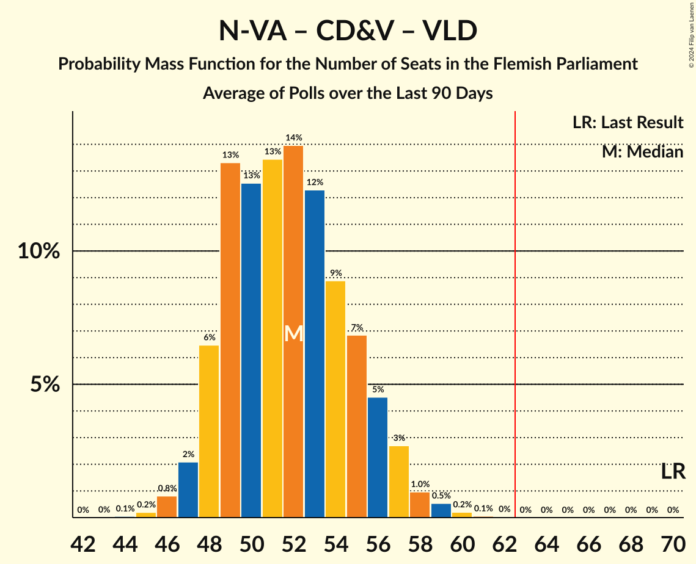

| Number of Seats | Probability | Accumulated | Special Marks |
|:---------------:|:-----------:|:-----------:|:-------------:|
| 44 | 0.1% | 100% |  |
| 45 | 0.2% | 99.9% |  |
| 46 | 0.8% | 99.7% |  |
| 47 | 2% | 98.9% |  |
| 48 | 6% | 97% |  |
| 49 | 13% | 90% |  |
| 50 | 13% | 77% |  |
| 51 | 13% | 64% | Median |
| 52 | 14% | 51% |  |
| 53 | 12% | 37% |  |
| 54 | 9% | 25% |  |
| 55 | 7% | 16% |  |
| 56 | 5% | 9% |  |
| 57 | 3% | 5% |  |
| 58 | 1.0% | 2% |  |
| 59 | 0.5% | 0.8% |  |
| 60 | 0.2% | 0.3% |  |
| 61 | 0.1% | 0.1% |  |
| 62 | 0% | 0% |  |
| 63 | 0% | 0% | Majority |
| 64 | 0% | 0% |  |
| 65 | 0% | 0% |  |
| 66 | 0% | 0% |  |
| 67 | 0% | 0% |  |
| 68 | 0% | 0% |  |
| 69 | 0% | 0% |  |
| 70 | 0% | 0% | Last Result |

### Christen-Democratisch en Vlaams – Vooruit – Groen – Partij van de Arbeid van België

| Number of Seats | Probability | Accumulated | Special Marks |
|:---------------:|:-----------:|:-----------:|:-------------:|
| 42 | 0% | 100% |  |
| 43 | 0.2% | 99.9% |  |
| 44 | 0.6% | 99.7% |  |
| 45 | 1.3% | 99.1% |  |
| 46 | 3% | 98% |  |
| 47 | 5% | 95% |  |
| 48 | 7% | 90% |  |
| 49 | 9% | 83% | Last Result |
| 50 | 10% | 75% |  |
| 51 | 11% | 64% | Median |
| 52 | 13% | 53% |  |
| 53 | 14% | 40% |  |
| 54 | 12% | 26% |  |
| 55 | 6% | 14% |  |
| 56 | 4% | 8% |  |
| 57 | 2% | 3% |  |
| 58 | 0.9% | 1.1% |  |
| 59 | 0.2% | 0.3% |  |
| 60 | 0% | 0% |  |

### Christen-Democratisch en Vlaams – Open Vlaamse Liberalen en Democraten – Vooruit – Groen

| Number of Seats | Probability | Accumulated | Special Marks |
|:---------------:|:-----------:|:-----------:|:-------------:|
| 40 | 0.1% | 100% |  |
| 41 | 0.2% | 99.9% |  |
| 42 | 0.7% | 99.7% |  |
| 43 | 1.0% | 99.0% |  |
| 44 | 2% | 98% |  |
| 45 | 4% | 96% |  |
| 46 | 8% | 92% |  |
| 47 | 11% | 83% |  |
| 48 | 13% | 72% | Median |
| 49 | 15% | 59% |  |
| 50 | 14% | 44% |  |
| 51 | 12% | 30% |  |
| 52 | 9% | 19% |  |
| 53 | 5% | 10% |  |
| 54 | 2% | 4% |  |
| 55 | 1.2% | 2% |  |
| 56 | 0.6% | 0.9% |  |
| 57 | 0.2% | 0.2% |  |
| 58 | 0% | 0.1% |  |
| 59 | 0% | 0% |  |
| 60 | 0% | 0% |  |
| 61 | 0% | 0% | Last Result |

### Nieuw-Vlaamse Alliantie – Christen-Democratisch en Vlaams

| Number of Seats | Probability | Accumulated | Special Marks |
|:---------------:|:-----------:|:-----------:|:-------------:|
| 34 | 0.1% | 100% |  |
| 35 | 0.2% | 99.9% |  |
| 36 | 0.6% | 99.7% |  |
| 37 | 2% | 99.1% |  |
| 38 | 6% | 97% |  |
| 39 | 7% | 92% |  |
| 40 | 11% | 85% |  |
| 41 | 20% | 74% | Median |
| 42 | 17% | 54% |  |
| 43 | 15% | 37% |  |
| 44 | 12% | 22% |  |
| 45 | 6% | 10% |  |
| 46 | 2% | 4% |  |
| 47 | 2% | 2% |  |
| 48 | 0.3% | 0.4% |  |
| 49 | 0% | 0.1% |  |
| 50 | 0% | 0% |  |
| 51 | 0% | 0% |  |
| 52 | 0% | 0% |  |
| 53 | 0% | 0% |  |
| 54 | 0% | 0% | Last Result |

### Christen-Democratisch en Vlaams – Open Vlaamse Liberalen en Democraten – Vooruit

| Number of Seats | Probability | Accumulated | Special Marks |
|:---------------:|:-----------:|:-----------:|:-------------:|
| 34 | 0.1% | 100% |  |
| 35 | 0.3% | 99.9% |  |
| 36 | 0.9% | 99.6% |  |
| 37 | 2% | 98.7% |  |
| 38 | 5% | 96% |  |
| 39 | 10% | 91% |  |
| 40 | 13% | 81% |  |
| 41 | 20% | 68% | Median |
| 42 | 18% | 49% |  |
| 43 | 10% | 30% |  |
| 44 | 9% | 20% |  |
| 45 | 6% | 11% |  |
| 46 | 3% | 5% |  |
| 47 | 1.0% | 1.4% | Last Result |
| 48 | 0.3% | 0.4% |  |
| 49 | 0.1% | 0.1% |  |
| 50 | 0% | 0% |  |

### Christen-Democratisch en Vlaams – Vooruit – Groen

| Number of Seats | Probability | Accumulated | Special Marks |
|:---------------:|:-----------:|:-----------:|:-------------:|
| 27 | 0.1% | 100% |  |
| 28 | 0.1% | 99.9% |  |
| 29 | 0.5% | 99.8% |  |
| 30 | 1.1% | 99.3% |  |
| 31 | 2% | 98% |  |
| 32 | 3% | 96% |  |
| 33 | 4% | 94% |  |
| 34 | 5% | 89% |  |
| 35 | 6% | 85% |  |
| 36 | 6% | 79% |  |
| 37 | 5% | 73% |  |
| 38 | 5% | 69% | Median |
| 39 | 7% | 63% |  |
| 40 | 12% | 56% |  |
| 41 | 14% | 44% |  |
| 42 | 12% | 30% |  |
| 43 | 8% | 19% |  |
| 44 | 7% | 11% |  |
| 45 | 3% | 4% | Last Result |
| 46 | 1.0% | 1.4% |  |
| 47 | 0.3% | 0.5% |  |
| 48 | 0.1% | 0.1% |  |
| 49 | 0% | 0% |  |

### Nieuw-Vlaamse Alliantie – Open Vlaamse Liberalen en Democraten

| Number of Seats | Probability | Accumulated | Special Marks |
|:---------------:|:-----------:|:-----------:|:-------------:|
| 30 | 0.1% | 100% |  |
| 31 | 0.2% | 99.9% |  |
| 32 | 0.7% | 99.7% |  |
| 33 | 3% | 98.9% |  |
| 34 | 9% | 96% |  |
| 35 | 16% | 88% |  |
| 36 | 11% | 72% |  |
| 37 | 14% | 60% | Median |
| 38 | 16% | 47% |  |
| 39 | 11% | 31% |  |
| 40 | 7% | 20% |  |
| 41 | 5% | 13% |  |
| 42 | 4% | 8% |  |
| 43 | 3% | 5% |  |
| 44 | 1.3% | 2% |  |
| 45 | 0.5% | 0.7% |  |
| 46 | 0.2% | 0.3% |  |
| 47 | 0.1% | 0.1% |  |
| 48 | 0% | 0% |  |
| 49 | 0% | 0% |  |
| 50 | 0% | 0% |  |
| 51 | 0% | 0% | Last Result |

### Open Vlaamse Liberalen en Democraten – Vooruit – Groen

| Number of Seats | Probability | Accumulated | Special Marks |
|:---------------:|:-----------:|:-----------:|:-------------:|
| 27 | 0.1% | 100% |  |
| 28 | 0.4% | 99.9% |  |
| 29 | 0.7% | 99.5% |  |
| 30 | 2% | 98.8% |  |
| 31 | 5% | 97% |  |
| 32 | 9% | 92% |  |
| 33 | 12% | 83% |  |
| 34 | 17% | 71% | Median |
| 35 | 17% | 54% |  |
| 36 | 14% | 37% |  |
| 37 | 10% | 23% |  |
| 38 | 7% | 13% |  |
| 39 | 3% | 6% |  |
| 40 | 2% | 3% |  |
| 41 | 0.7% | 1.0% |  |
| 42 | 0.3% | 0.3% | Last Result |
| 43 | 0% | 0.1% |  |
| 44 | 0% | 0% |  |

### Christen-Democratisch en Vlaams – Vooruit

| Number of Seats | Probability | Accumulated | Special Marks |
|:---------------:|:-----------:|:-----------:|:-------------:|
| 23 | 0.2% | 100% |  |
| 24 | 0.6% | 99.8% |  |
| 25 | 2% | 99.2% |  |
| 26 | 3% | 97% |  |
| 27 | 4% | 94% |  |
| 28 | 6% | 90% |  |
| 29 | 9% | 84% |  |
| 30 | 14% | 75% |  |
| 31 | 12% | 61% | Last Result, Median |
| 32 | 10% | 48% |  |
| 33 | 9% | 39% |  |
| 34 | 12% | 30% |  |
| 35 | 7% | 17% |  |
| 36 | 4% | 11% |  |
| 37 | 4% | 6% |  |
| 38 | 2% | 3% |  |
| 39 | 0.8% | 1.0% |  |
| 40 | 0.1% | 0.2% |  |
| 41 | 0.1% | 0.1% |  |
| 42 | 0% | 0% |  |

### Christen-Democratisch en Vlaams – Open Vlaamse Liberalen en Democraten – Groen

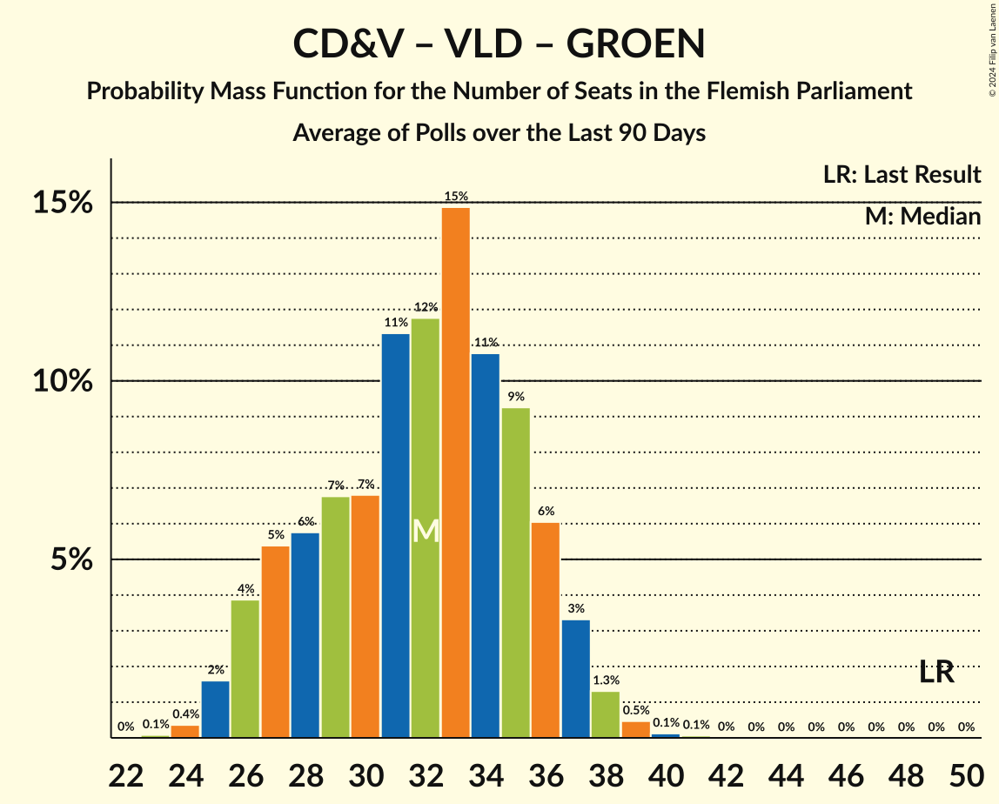

| Number of Seats | Probability | Accumulated | Special Marks |
|:---------------:|:-----------:|:-----------:|:-------------:|
| 23 | 0.1% | 100% |  |
| 24 | 0.4% | 99.9% |  |
| 25 | 2% | 99.5% |  |
| 26 | 4% | 98% |  |
| 27 | 5% | 94% |  |
| 28 | 6% | 89% |  |
| 29 | 7% | 83% |  |
| 30 | 7% | 76% |  |
| 31 | 11% | 69% | Median |
| 32 | 12% | 58% |  |
| 33 | 15% | 46% |  |
| 34 | 11% | 31% |  |
| 35 | 9% | 21% |  |
| 36 | 6% | 11% |  |
| 37 | 3% | 5% |  |
| 38 | 1.3% | 2% |  |
| 39 | 0.5% | 0.7% |  |
| 40 | 0.1% | 0.2% |  |
| 41 | 0.1% | 0.1% |  |
| 42 | 0% | 0% |  |
| 43 | 0% | 0% |  |
| 44 | 0% | 0% |  |
| 45 | 0% | 0% |  |
| 46 | 0% | 0% |  |
| 47 | 0% | 0% |  |
| 48 | 0% | 0% |  |
| 49 | 0% | 0% | Last Result |

### Open Vlaamse Liberalen en Democraten – Vooruit

| Number of Seats | Probability | Accumulated | Special Marks |
|:---------------:|:-----------:|:-----------:|:-------------:|
| 20 | 0.1% | 100% |  |
| 21 | 0.2% | 99.9% |  |
| 22 | 1.0% | 99.7% |  |
| 23 | 2% | 98.7% |  |
| 24 | 5% | 96% |  |
| 25 | 11% | 91% |  |
| 26 | 16% | 80% |  |
| 27 | 22% | 64% | Median |
| 28 | 18% | 43% | Last Result |
| 29 | 10% | 25% |  |
| 30 | 8% | 14% |  |
| 31 | 4% | 7% |  |
| 32 | 2% | 2% |  |
| 33 | 0.3% | 0.4% |  |
| 34 | 0.1% | 0.1% |  |
| 35 | 0% | 0% |  |

### Christen-Democratisch en Vlaams – Open Vlaamse Liberalen en Democraten

| Number of Seats | Probability | Accumulated | Special Marks |
|:---------------:|:-----------:|:-----------:|:-------------:|
| 17 | 0% | 100% |  |
| 18 | 0.3% | 99.9% |  |
| 19 | 1.2% | 99.7% |  |
| 20 | 4% | 98% |  |
| 21 | 9% | 94% |  |
| 22 | 18% | 86% |  |
| 23 | 10% | 68% |  |
| 24 | 10% | 58% | Median |
| 25 | 13% | 48% |  |
| 26 | 14% | 35% |  |
| 27 | 10% | 21% |  |
| 28 | 5% | 11% |  |
| 29 | 3% | 6% |  |
| 30 | 1.4% | 2% |  |
| 31 | 0.8% | 1.0% |  |
| 32 | 0.2% | 0.2% |  |
| 33 | 0% | 0% |  |
| 34 | 0% | 0% |  |
| 35 | 0% | 0% | Last Result |

## Technical Information

+ **Number of polls included in this average:** 4
+ **Lowest number of simulations done in a poll included in this average:** 2,097,152
+ **Total number of simulations done in the polls included in this average:** 8,388,608
+ **Error estimate:** 0.76%
