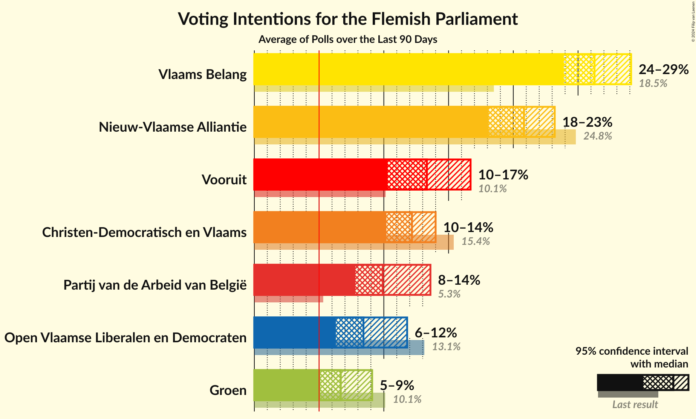
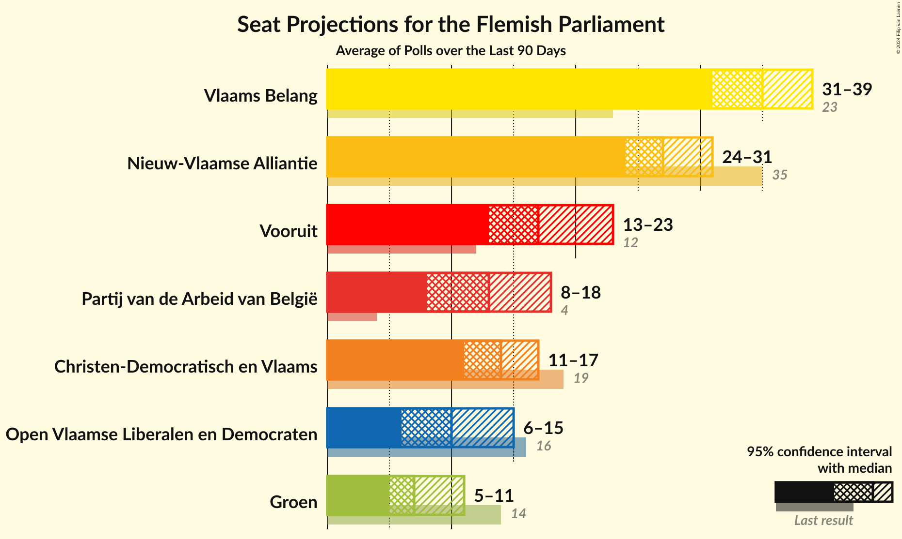
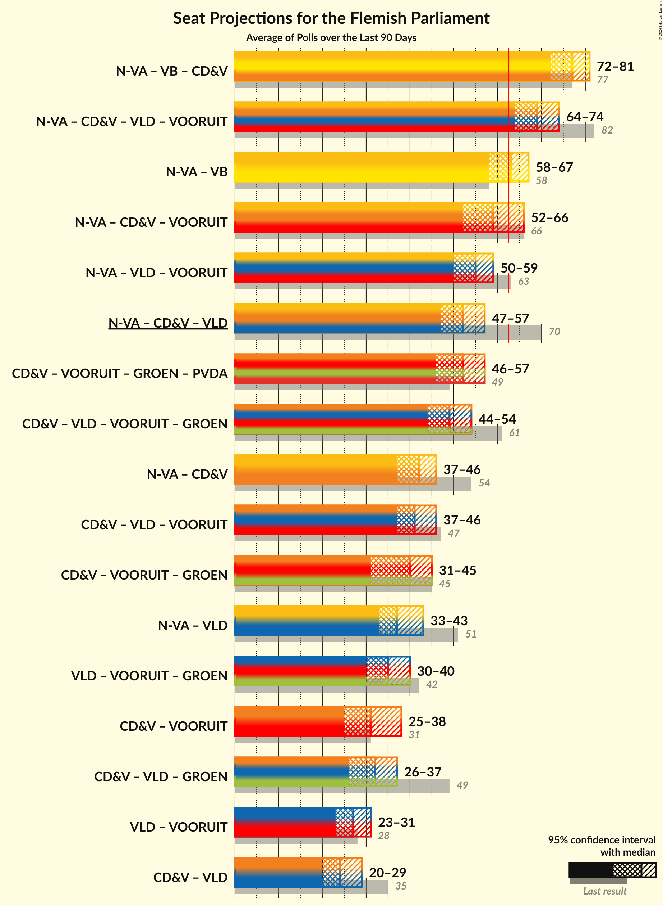

# Overview

The table below lists the most recent polls (less than 90 days old) registered and analyzed so far.

| Period     | Polling firm/Commissioner(s) | N-VA | VB | CD&V | VLD | VOORUIT | GROEN | PVDA |
|:----------:|:----------------------------:|:--:|:--:|:--:|:--:|:--:|:--:|:--:|
| 26 May 2019 | General Election | 24.8%   35 | 18.5%   23 | 15.4%   19 | 13.1%   16 | 10.1%   12 | 10.1%   14 | 5.3%   4 |
| N/A | [Poll Average](average.html) | 18–23%   24–31 | 24–29%   31–39 | 10–14%   11–17 | 6–12%   6–15 | 10–17%   13–23 | 5–9%   5–11 | 8–14%   8–18 |
| [3–4 June 2024](2024-06-04-Ipsos.html) | Ipsos   Het Laatste Nieuws and VTM | 19–23%   26–30 | 24–28%   31–37 | 11–14%   12–17 | 6–8%   5–10 | 14–17%   18–24 | 5–7%   5–8 | 9–12%   11–14 |
| [28–31 May 2024](2024-05-31-Cluster17.html) | Cluster17   RTL TVi | 17–22%   22–30 | 25–30%   33–41 | 10–14%   11–17 | 8–11%   8–14 | 11–15%   14–19 | 6–9%   5–11 | 8–11%   7–14 |
| [23 April–3 May 2024](2024-05-03-iVOX.html) | iVOX   Overlegcentrum van Vlaamse Verenigingen | 19–24%   26–31 | 24–29%   31–38 | 11–14%   12–17 | 6–9%   6–11 | 12–15%   14–20 | 7–10%   7–13 | 7–10%   7–13 |
| [8–18 April 2024](2024-04-18-Kantar.html) | Kantar   La Libre Belgique and RTBf | 18–23%   24–31 | 23–29%   30–38 | 10–14%   11–17 | 9–12%   11–16 | 10–14%   11–18 | 5–8%   3–9 | 10–14%   13–19 |
| 26 May 2019 | General Election | 24.8%   35 | 18.5%   23 | 15.4%   19 | 13.1%   16 | 10.1%   12 | 10.1%   14 | 5.3%   4 |

Only polls for which at least the sample size has been published are included in the table above.

**Legend:**
+ **Top half of each row:** Voting intentions (95% confidence interval)
+ **Bottom half of each row:** Seat projections for the Flemish Parliament (95% confidence interval)
+ **N-VA:** Nieuw-Vlaamse Alliantie
+ **VB:** Vlaams Belang
+ **CD&V:** Christen-Democratisch en Vlaams
+ **VLD:** Open Vlaamse Liberalen en Democraten
+ **VOORUIT:** Vooruit
+ **GROEN:** Groen
+ **PVDA:** Partij van de Arbeid van België
+ **N/A (single party):** Party not included the published results
+ **N/A (entire row):** Calculation for this opinion poll not started yet

