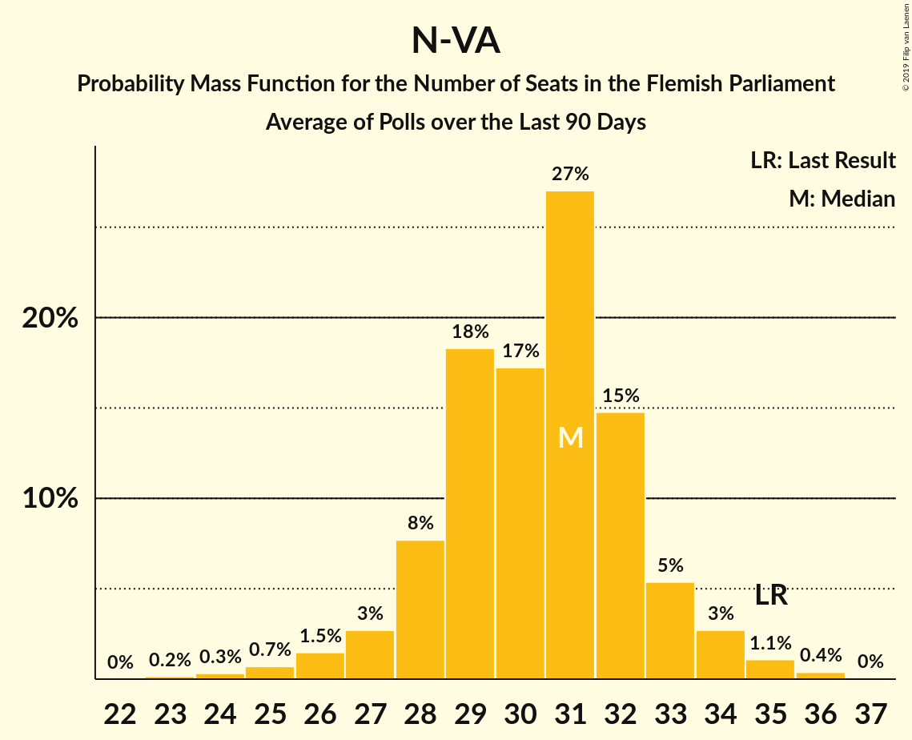

# N-VA

<a href="#voting-intentions">Voting Intentions</a> | <a href="#seats">Seats</a>

## Voting Intentions

Last result: **24.8%** (General Election of 26 May 2019)

### Confidence Intervals

| Period     | Polling firm/Commissioner(s) | Median | 80% Confidence Interval | 90% Confidence Interval | 95% Confidence Interval | 99% Confidence Interval |
|:----------:|:----------------:|:-----------:|:-----------------------:|:-----------------------:|:-----------------------:|:-----------------------:|
| N/A | [Poll Average](average.html) | 22.7% | 21.1–24.5% | 20.6–25.0% | 20.2–25.4% | 19.5–26.3% |
| [2–10 September 2019](2019-09-10-Ipsos.html) | Ipsos   Het Laatste Nieuws, Le Soir, RTL TVi and VTM | 22.7% | 21.1–24.5% | 20.6–25.0% | 20.2–25.4% | 19.4–26.3% |

### Probability Mass Function

The following table shows the probability mass function per percentage block of voting intentions for the [poll average](average.html) for N-VA.

| Voting Intentions | Probability | Accumulated | Special Marks |
|:-----------------:|:-----------:|:-----------:|:-------------:|
| 17.5–18.5% | 0% | 100% |  |
| 18.5–19.5% | 0.6% | 100% |  |
| 19.5–20.5% | 4% | 99.4% |  |
| 20.5–21.5% | 14% | 95% |  |
| 21.5–22.5% | 26% | 82% |  |
| 22.5–23.5% | 28% | 55% | Median |
| 23.5–24.5% | 18% | 27% |  |
| 24.5–25.5% | 7% | 9% | Last Result |
| 25.5–26.5% | 2% | 2% |  |
| 26.5–27.5% | 0.2% | 0.3% |  |
| 27.5–28.5% | 0% | 0% |  |

## Seats

Last result: **35** seats (General Election of 26 May 2019)

### Confidence Intervals

| Period     | Polling firm/Commissioner(s) | Median | 80% Confidence Interval | 90% Confidence Interval | 95% Confidence Interval | 99% Confidence Interval |
|:----------:|:----------------:|:------:|:-----------------------:|:-----------------------:|:-----------------------:|:-----------------------:|
| N/A | [Poll Average](average.html) | 31 | 28–32 | 27–33 | 26–34 | 25–35 |
| [2–10 September 2019](2019-09-10-Ipsos.html) | Ipsos   Het Laatste Nieuws, Le Soir, RTL TVi and VTM | 31 | 28–32 | 27–33 | 26–34 | 25–35 |

### Probability Mass Function

The following table shows the probability mass function per seat for the [poll average](average.html) for N-VA.

| Number of Seats | Probability | Accumulated | Special Marks |
|:---------------:|:-----------:|:-----------:|:-------------:|
| 23 | 0.2% | 100% |  |
| 24 | 0.3% | 99.8% |  |
| 25 | 0.7% | 99.5% |  |
| 26 | 1.5% | 98.8% |  |
| 27 | 3% | 97% |  |
| 28 | 8% | 95% |  |
| 29 | 18% | 87% |  |
| 30 | 17% | 69% |  |
| 31 | 27% | 51% | Median |
| 32 | 15% | 24% |  |
| 33 | 5% | 10% |  |
| 34 | 3% | 4% |  |
| 35 | 1.1% | 2% | Last Result |
| 36 | 0.4% | 0.4% |  |
| 37 | 0% | 0% |  |

