# Opinion Poll by Ipsos for Het Laatste Nieuws, Le Soir, RTL TVi and VTM, 4–11 March 2025

<a href="#voting-intentions">Voting Intentions</a> | <a href="#seats">Seats</a> | <a href="#coalitions">Coalitions</a> | <a href="#technical-information">Technical Information</a>

## Voting Intentions

### Confidence Intervals

| Party | Last Result | Poll Result | 80% Confidence Interval | 90% Confidence Interval | 95% Confidence Interval | 99% Confidence Interval |
|:-----:|:-----------:|:-----------:|:-----------------------:|:-----------------------:|:-----------------------:|:-----------------------:|
| Vlaams Belang | 22.7% | 25.7% | 24.0–27.5% |23.5–28.0% |23.1–28.5% |22.3–29.4% |
| Nieuw-Vlaamse Alliantie | 23.9% | 25.5% | 23.8–27.3% |23.3–27.8% |22.9–28.3% |22.1–29.2% |
| Vooruit | 13.8% | 14.3% | 12.9–15.8% |12.6–16.2% |12.3–16.6% |11.6–17.3% |
| Christen-Democratisch en Vlaams | 13.0% | 11.7% | 10.5–13.1% |10.1–13.5% |9.8–13.8% |9.3–14.5% |
| Partij van de Arbeid van België | 8.3% | 10.0% | 8.9–11.3% |8.6–11.7% |8.3–12.0% |7.8–12.7% |
| Groen | 7.3% | 6.6% | 5.7–7.7% |5.4–8.0% |5.2–8.3% |4.8–8.9% |
| Open Vlaamse Liberalen en Democraten | 8.3% | 6.0% | 5.1–7.1% |4.9–7.4% |4.7–7.7% |4.3–8.2% |
| Team Fouad Ahidar | 0.3% | 0.3% | 0.2–0.7% |0.1–0.8% |0.1–0.9% |0.1–1.1% |

*Note:* The poll result column reflects the actual value used in the calculations. Published results may vary slightly, and in addition be rounded to fewer digits.

## Seats

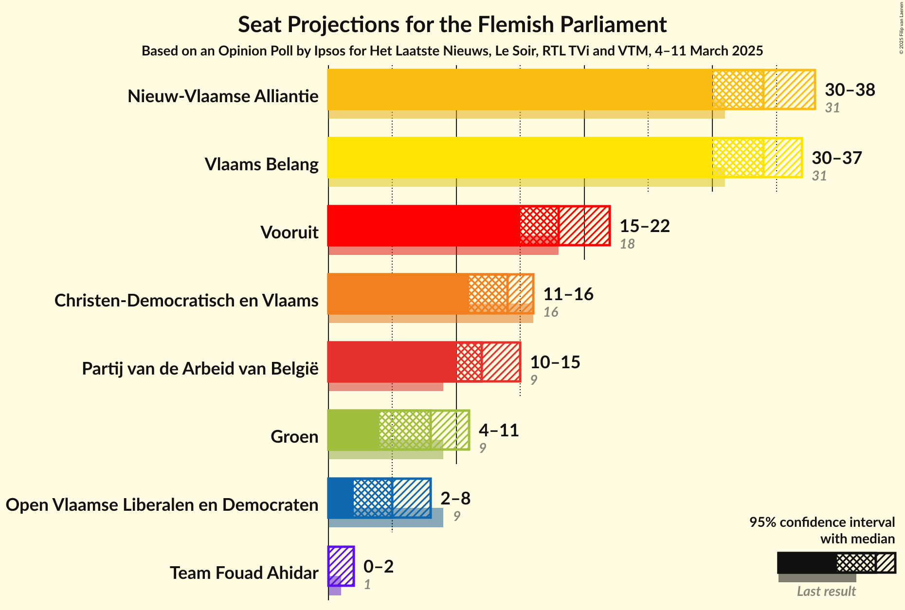

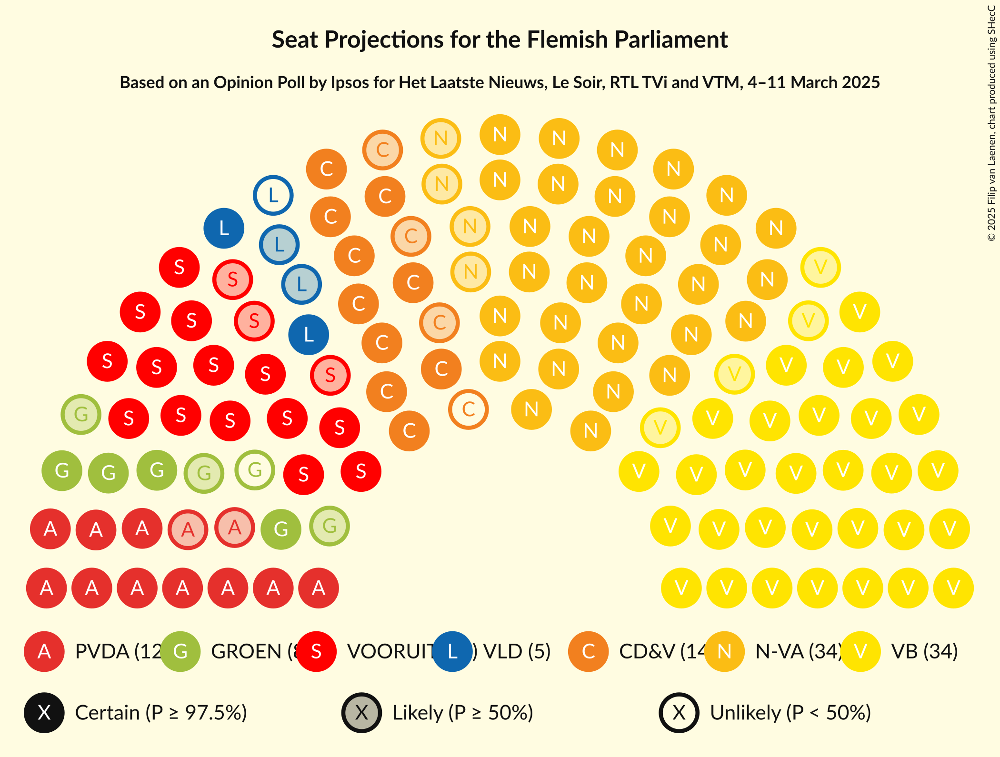

### Confidence Intervals

| Party | Last Result | Median | 80% Confidence Interval | 90% Confidence Interval | 95% Confidence Interval | 99% Confidence Interval |
|:-----:|:-----------:|:------:|:-----------------------:|:-----------------------:|:-----------------------:|:-----------------------:|
| <a href="#vlaams-belang">Vlaams Belang</a> | 31 | 34 | 31–37 |31–38 |30–38 |28–39 |
| <a href="#nieuw-vlaamse-alliantie">Nieuw-Vlaamse Alliantie</a> | 31 | 34 | 31–36 |30–37 |30–38 |28–40 |
| <a href="#vooruit">Vooruit</a> | 18 | 17 | 16–20 |15–21 |15–22 |14–23 |
| <a href="#christen-democratisch-en-vlaams">Christen-Democratisch en Vlaams</a> | 16 | 14 | 11–16 |11–16 |11–16 |11–17 |
| <a href="#partij-van-de-arbeid-van-belgië">Partij van de Arbeid van België</a> | 9 | 12 | 10–14 |10–14 |9–15 |7–16 |
| <a href="#groen">Groen</a> | 9 | 7 | 5–9 |5–10 |4–11 |3–11 |
| <a href="#open-vlaamse-liberalen-en-democraten">Open Vlaamse Liberalen en Democraten</a> | 9 | 5 | 2–6 |2–6 |2–7 |1–10 |
| <a href="#team-fouad-ahidar">Team Fouad Ahidar</a> | 1 | 2 | 1–3 |0–3 |0–3 |0–4 |

### Vlaams Belang

*For a full overview of the results for this party, see the [Vlaams Belang](party-vlaamsbelang.html) page.*

| Number of Seats | Probability | Accumulated | Special Marks |
|:---------------:|:-----------:|:-----------:|:-------------:|
| 27 | 0% | 100% |  |
| 28 | 0.7% | 99.9% |  |
| 29 | 1.0% | 99.2% |  |
| 30 | 3% | 98% |  |
| 31 | 12% | 95% | Last Result |
| 32 | 9% | 83% |  |
| 33 | 22% | 74% |  |
| 34 | 9% | 52% | Median |
| 35 | 18% | 43% |  |
| 36 | 11% | 25% |  |
| 37 | 6% | 13% |  |
| 38 | 6% | 7% |  |
| 39 | 0.7% | 1.1% |  |
| 40 | 0.3% | 0.4% |  |
| 41 | 0.1% | 0.2% |  |
| 42 | 0% | 0% |  |

### Nieuw-Vlaamse Alliantie

*For a full overview of the results for this party, see the [Nieuw-Vlaamse Alliantie](party-nieuw-vlaamsealliantie.html) page.*

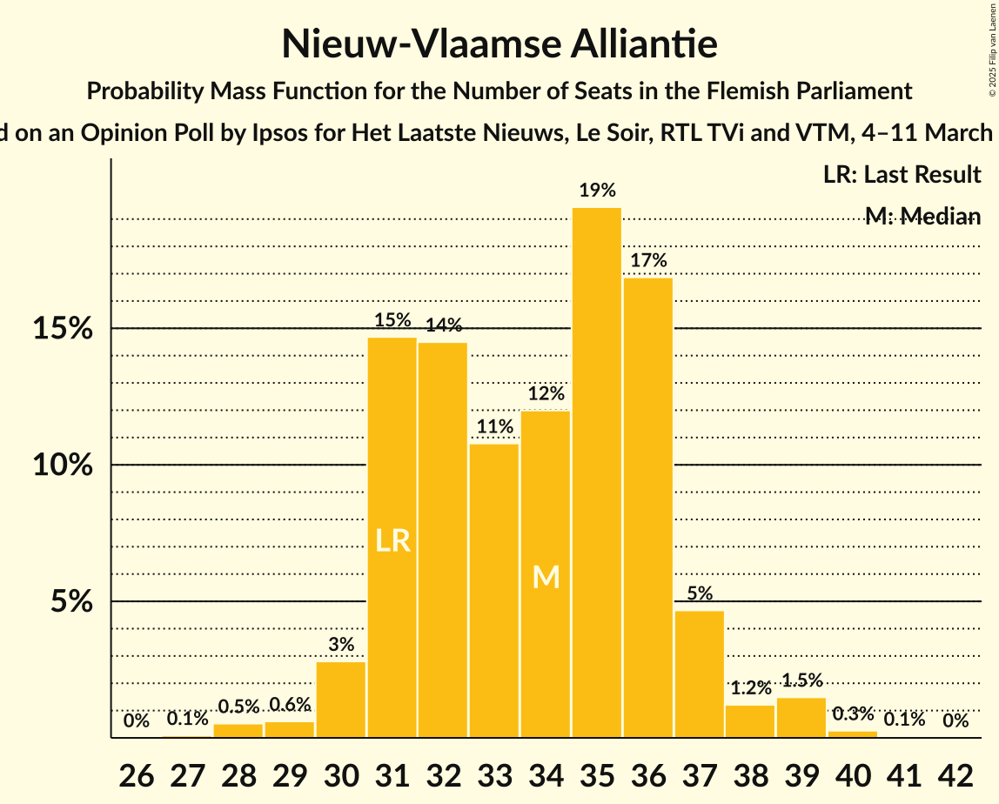

| Number of Seats | Probability | Accumulated | Special Marks |
|:---------------:|:-----------:|:-----------:|:-------------:|
| 27 | 0.1% | 100% |  |
| 28 | 0.8% | 99.9% |  |
| 29 | 1.2% | 99.1% |  |
| 30 | 4% | 98% |  |
| 31 | 10% | 93% | Last Result |
| 32 | 13% | 84% |  |
| 33 | 17% | 71% |  |
| 34 | 19% | 54% | Median |
| 35 | 13% | 35% |  |
| 36 | 13% | 22% |  |
| 37 | 6% | 9% |  |
| 38 | 1.2% | 3% |  |
| 39 | 2% | 2% |  |
| 40 | 0.5% | 0.5% |  |
| 41 | 0% | 0% |  |

### Vooruit

*For a full overview of the results for this party, see the [Vooruit](party-vooruit.html) page.*

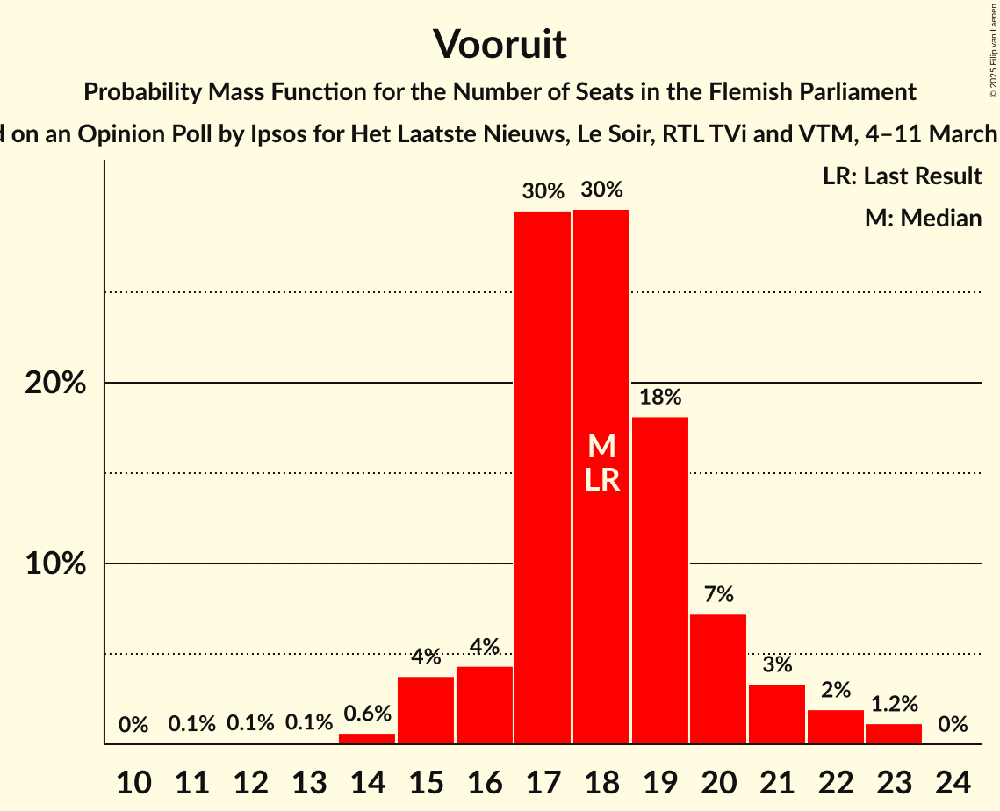

| Number of Seats | Probability | Accumulated | Special Marks |
|:---------------:|:-----------:|:-----------:|:-------------:|
| 11 | 0.1% | 100% |  |
| 12 | 0.1% | 99.9% |  |
| 13 | 0.2% | 99.8% |  |
| 14 | 1.2% | 99.6% |  |
| 15 | 3% | 98% |  |
| 16 | 21% | 95% |  |
| 17 | 31% | 74% | Median |
| 18 | 17% | 43% | Last Result |
| 19 | 13% | 26% |  |
| 20 | 4% | 13% |  |
| 21 | 5% | 9% |  |
| 22 | 2% | 3% |  |
| 23 | 2% | 2% |  |
| 24 | 0% | 0% |  |

### Christen-Democratisch en Vlaams

*For a full overview of the results for this party, see the [Christen-Democratisch en Vlaams](party-christen-democratischenvlaams.html) page.*

| Number of Seats | Probability | Accumulated | Special Marks |
|:---------------:|:-----------:|:-----------:|:-------------:|
| 10 | 0.1% | 100% |  |
| 11 | 13% | 99.9% |  |
| 12 | 25% | 87% |  |
| 13 | 8% | 62% |  |
| 14 | 24% | 54% | Median |
| 15 | 10% | 31% |  |
| 16 | 18% | 20% | Last Result |
| 17 | 1.4% | 2% |  |
| 18 | 0.2% | 0.4% |  |
| 19 | 0.2% | 0.2% |  |
| 20 | 0% | 0% |  |

### Partij van de Arbeid van België

*For a full overview of the results for this party, see the [Partij van de Arbeid van België](party-partijvandearbeidvanbelgië.html) page.*

| Number of Seats | Probability | Accumulated | Special Marks |
|:---------------:|:-----------:|:-----------:|:-------------:|
| 6 | 0.1% | 100% |  |
| 7 | 1.1% | 99.9% |  |
| 8 | 0.2% | 98.8% |  |
| 9 | 1.2% | 98.6% | Last Result |
| 10 | 19% | 97% |  |
| 11 | 28% | 79% |  |
| 12 | 21% | 51% | Median |
| 13 | 13% | 30% |  |
| 14 | 14% | 17% |  |
| 15 | 2% | 3% |  |
| 16 | 0.6% | 1.0% |  |
| 17 | 0.4% | 0.4% |  |
| 18 | 0% | 0% |  |

### Groen

*For a full overview of the results for this party, see the [Groen](party-groen.html) page.*

| Number of Seats | Probability | Accumulated | Special Marks |
|:---------------:|:-----------:|:-----------:|:-------------:|
| 1 | 0.1% | 100% |  |
| 2 | 0.1% | 99.9% |  |
| 3 | 0.5% | 99.7% |  |
| 4 | 2% | 99.2% |  |
| 5 | 17% | 97% |  |
| 6 | 17% | 80% |  |
| 7 | 19% | 63% | Median |
| 8 | 8% | 44% |  |
| 9 | 29% | 35% | Last Result |
| 10 | 3% | 6% |  |
| 11 | 3% | 3% |  |
| 12 | 0.2% | 0.2% |  |
| 13 | 0% | 0% |  |

### Open Vlaamse Liberalen en Democraten

*For a full overview of the results for this party, see the [Open Vlaamse Liberalen en Democraten](party-openvlaamseliberalenendemocraten.html) page.*

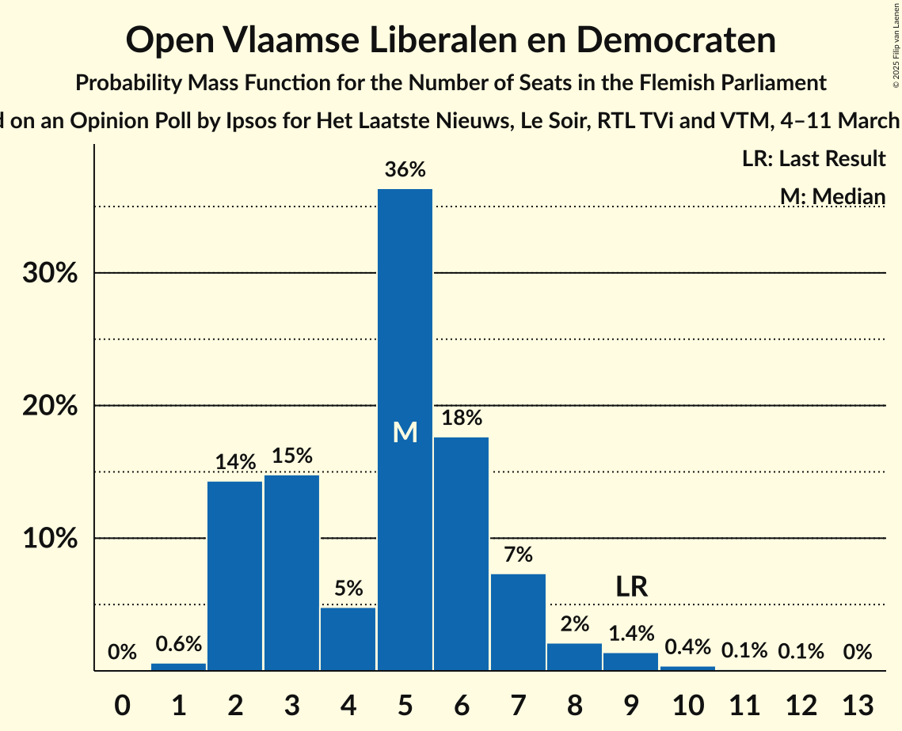

| Number of Seats | Probability | Accumulated | Special Marks |
|:---------------:|:-----------:|:-----------:|:-------------:|
| 1 | 0.6% | 100% |  |
| 2 | 15% | 99.4% |  |
| 3 | 16% | 84% |  |
| 4 | 6% | 68% |  |
| 5 | 33% | 62% | Median |
| 6 | 24% | 29% |  |
| 7 | 3% | 5% |  |
| 8 | 1.4% | 2% |  |
| 9 | 0.2% | 0.8% | Last Result |
| 10 | 0.5% | 0.6% |  |
| 11 | 0% | 0.1% |  |
| 12 | 0% | 0% |  |

### Team Fouad Ahidar

*For a full overview of the results for this party, see the [Team Fouad Ahidar](party-teamfouadahidar.html) page.*

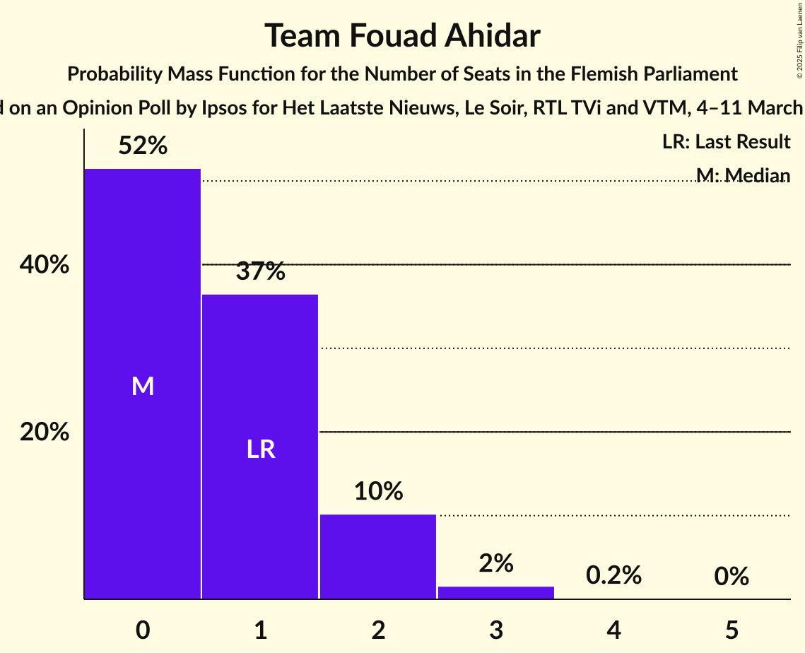

| Number of Seats | Probability | Accumulated | Special Marks |
|:---------------:|:-----------:|:-----------:|:-------------:|
| 0 | 8% | 100% |  |
| 1 | 39% | 92% | Last Result |
| 2 | 38% | 53% | Median |
| 3 | 13% | 15% |  |
| 4 | 2% | 2% |  |
| 5 | 0.3% | 0.3% |  |
| 6 | 0% | 0% |  |

## Coalitions

### Confidence Intervals

| Coalition | Last Result | Median | Majority? | 80% Confidence Interval | 90% Confidence Interval | 95% Confidence Interval | 99% Confidence Interval |
|:---------:|:-----------:|:------:|:---------:|:-----------------------:|:-----------------------:|:-----------------------:|:-----------------------:|
| Vlaams Belang – Nieuw-Vlaamse Alliantie – Christen-Democratisch en Vlaams | 78 | 82 | 100% | 78–84 | 77–85 | 76–86 | 74–88 |
| Nieuw-Vlaamse Alliantie – Vooruit – Christen-Democratisch en Vlaams – Open Vlaamse Liberalen en Democraten | 74 | 69 | 99.5% | 66–73 | 66–74 | 65–75 | 63–77 |
| Vlaams Belang – Nieuw-Vlaamse Alliantie | 62 | 67 | 98% | 65–71 | 63–72 | 63–72 | 61–75 |
| Nieuw-Vlaamse Alliantie – Vooruit – Christen-Democratisch en Vlaams | 65 | 65 | 77% | 61–69 | 60–70 | 60–71 | 59–72 |
| Nieuw-Vlaamse Alliantie – Vooruit – Open Vlaamse Liberalen en Democraten | 58 | 56 | 0.6% | 52–60 | 52–61 | 51–62 | 49–63 |
| Nieuw-Vlaamse Alliantie – Christen-Democratisch en Vlaams – Open Vlaamse Liberalen en Democraten | 56 | 51 | 0% | 49–56 | 48–56 | 47–57 | 46–59 |
| Vooruit – Christen-Democratisch en Vlaams – Partij van de Arbeid van België – Groen | 52 | 50 | 0% | 47–53 | 46–54 | 46–56 | 44–57 |
| Nieuw-Vlaamse Alliantie – Christen-Democratisch en Vlaams | 47 | 47 | 0% | 44–51 | 43–52 | 42–52 | 41–53 |
| Vooruit – Christen-Democratisch en Vlaams – Groen – Open Vlaamse Liberalen en Democraten | 52 | 43 | 0% | 39–47 | 39–47 | 38–48 | 36–50 |
| Vooruit – Christen-Democratisch en Vlaams – Groen | 43 | 38 | 0% | 35–42 | 34–42 | 34–43 | 32–45 |
| Nieuw-Vlaamse Alliantie – Open Vlaamse Liberalen en Democraten | 40 | 38 | 0% | 35–41 | 35–42 | 34–43 | 32–44 |
| Vooruit – Christen-Democratisch en Vlaams – Open Vlaamse Liberalen en Democraten | 43 | 35 | 0% | 33–39 | 32–40 | 31–41 | 30–43 |
| Vooruit – Christen-Democratisch en Vlaams | 34 | 31 | 0% | 29–34 | 28–35 | 28–36 | 26–37 |
| Vooruit – Groen – Open Vlaamse Liberalen en Democraten | 36 | 29 | 0% | 26–33 | 25–34 | 25–35 | 23–36 |
| Christen-Democratisch en Vlaams – Groen – Open Vlaamse Liberalen en Democraten | 34 | 26 | 0% | 22–29 | 21–29 | 20–31 | 19–32 |
| Vooruit – Open Vlaamse Liberalen en Democraten | 27 | 22 | 0% | 19–25 | 18–26 | 18–27 | 17–29 |
| Christen-Democratisch en Vlaams – Open Vlaamse Liberalen en Democraten | 25 | 18 | 0% | 16–22 | 15–22 | 14–23 | 13–24 |

### Vlaams Belang – Nieuw-Vlaamse Alliantie – Christen-Democratisch en Vlaams

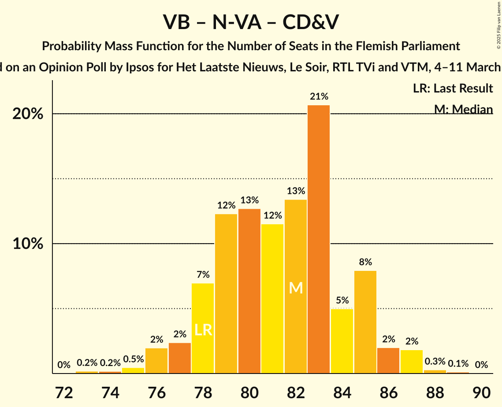

| Number of Seats | Probability | Accumulated | Special Marks |
|:---------------:|:-----------:|:-----------:|:-------------:|
| 73 | 0.2% | 100% |  |
| 74 | 0.3% | 99.8% |  |
| 75 | 1.3% | 99.5% |  |
| 76 | 2% | 98% |  |
| 77 | 3% | 97% |  |
| 78 | 14% | 93% | Last Result |
| 79 | 7% | 79% |  |
| 80 | 10% | 72% |  |
| 81 | 10% | 62% |  |
| 82 | 18% | 52% | Median |
| 83 | 15% | 34% |  |
| 84 | 9% | 19% |  |
| 85 | 7% | 10% |  |
| 86 | 2% | 3% |  |
| 87 | 0.7% | 1.2% |  |
| 88 | 0.4% | 0.5% |  |
| 89 | 0.1% | 0.1% |  |
| 90 | 0% | 0% |  |

### Nieuw-Vlaamse Alliantie – Vooruit – Christen-Democratisch en Vlaams – Open Vlaamse Liberalen en Democraten

| Number of Seats | Probability | Accumulated | Special Marks |
|:---------------:|:-----------:|:-----------:|:-------------:|
| 61 | 0% | 100% |  |
| 62 | 0.4% | 99.9% |  |
| 63 | 0.4% | 99.5% | Majority |
| 64 | 1.0% | 99.1% |  |
| 65 | 3% | 98% |  |
| 66 | 13% | 96% |  |
| 67 | 11% | 83% |  |
| 68 | 12% | 72% |  |
| 69 | 12% | 59% |  |
| 70 | 16% | 48% | Median |
| 71 | 7% | 32% |  |
| 72 | 6% | 25% |  |
| 73 | 11% | 19% |  |
| 74 | 4% | 8% | Last Result |
| 75 | 2% | 4% |  |
| 76 | 0.9% | 2% |  |
| 77 | 0.6% | 0.8% |  |
| 78 | 0.2% | 0.3% |  |
| 79 | 0% | 0% |  |

### Vlaams Belang – Nieuw-Vlaamse Alliantie

| Number of Seats | Probability | Accumulated | Special Marks |
|:---------------:|:-----------:|:-----------:|:-------------:|
| 59 | 0.1% | 100% |  |
| 60 | 0.1% | 99.9% |  |
| 61 | 0.9% | 99.8% |  |
| 62 | 1.3% | 98.9% | Last Result |
| 63 | 4% | 98% | Majority |
| 64 | 3% | 94% |  |
| 65 | 8% | 91% |  |
| 66 | 18% | 83% |  |
| 67 | 18% | 65% |  |
| 68 | 11% | 47% | Median |
| 69 | 10% | 36% |  |
| 70 | 10% | 25% |  |
| 71 | 9% | 15% |  |
| 72 | 5% | 6% |  |
| 73 | 0.9% | 2% |  |
| 74 | 0.4% | 0.9% |  |
| 75 | 0.4% | 0.5% |  |
| 76 | 0.2% | 0.2% |  |
| 77 | 0% | 0% |  |

### Nieuw-Vlaamse Alliantie – Vooruit – Christen-Democratisch en Vlaams

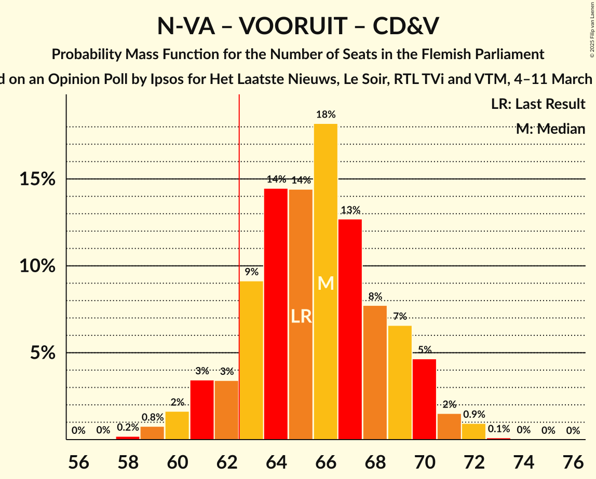

| Number of Seats | Probability | Accumulated | Special Marks |
|:---------------:|:-----------:|:-----------:|:-------------:|
| 57 | 0.1% | 100% |  |
| 58 | 0.3% | 99.9% |  |
| 59 | 2% | 99.6% |  |
| 60 | 6% | 98% |  |
| 61 | 3% | 92% |  |
| 62 | 11% | 88% |  |
| 63 | 7% | 77% | Majority |
| 64 | 15% | 70% |  |
| 65 | 12% | 55% | Last Result, Median |
| 66 | 12% | 43% |  |
| 67 | 15% | 31% |  |
| 68 | 4% | 16% |  |
| 69 | 5% | 11% |  |
| 70 | 3% | 6% |  |
| 71 | 3% | 3% |  |
| 72 | 0.2% | 0.5% |  |
| 73 | 0.2% | 0.3% |  |
| 74 | 0.1% | 0.1% |  |
| 75 | 0% | 0% |  |

### Nieuw-Vlaamse Alliantie – Vooruit – Open Vlaamse Liberalen en Democraten

| Number of Seats | Probability | Accumulated | Special Marks |
|:---------------:|:-----------:|:-----------:|:-------------:|
| 48 | 0.1% | 100% |  |
| 49 | 1.1% | 99.9% |  |
| 50 | 0.7% | 98.8% |  |
| 51 | 2% | 98% |  |
| 52 | 9% | 97% |  |
| 53 | 4% | 87% |  |
| 54 | 17% | 83% |  |
| 55 | 14% | 66% |  |
| 56 | 11% | 52% | Median |
| 57 | 16% | 41% |  |
| 58 | 8% | 25% | Last Result |
| 59 | 7% | 17% |  |
| 60 | 5% | 10% |  |
| 61 | 2% | 5% |  |
| 62 | 2% | 3% |  |
| 63 | 0.4% | 0.6% | Majority |
| 64 | 0.2% | 0.3% |  |
| 65 | 0% | 0.1% |  |
| 66 | 0% | 0% |  |

### Nieuw-Vlaamse Alliantie – Christen-Democratisch en Vlaams – Open Vlaamse Liberalen en Democraten

| Number of Seats | Probability | Accumulated | Special Marks |
|:---------------:|:-----------:|:-----------:|:-------------:|
| 44 | 0.1% | 100% |  |
| 45 | 0.3% | 99.8% |  |
| 46 | 1.0% | 99.6% |  |
| 47 | 2% | 98.6% |  |
| 48 | 2% | 96% |  |
| 49 | 8% | 94% |  |
| 50 | 28% | 85% |  |
| 51 | 8% | 58% |  |
| 52 | 10% | 50% |  |
| 53 | 14% | 39% | Median |
| 54 | 10% | 26% |  |
| 55 | 4% | 16% |  |
| 56 | 8% | 12% | Last Result |
| 57 | 2% | 4% |  |
| 58 | 0.9% | 2% |  |
| 59 | 0.7% | 0.9% |  |
| 60 | 0.2% | 0.2% |  |
| 61 | 0% | 0% |  |

### Vooruit – Christen-Democratisch en Vlaams – Partij van de Arbeid van België – Groen

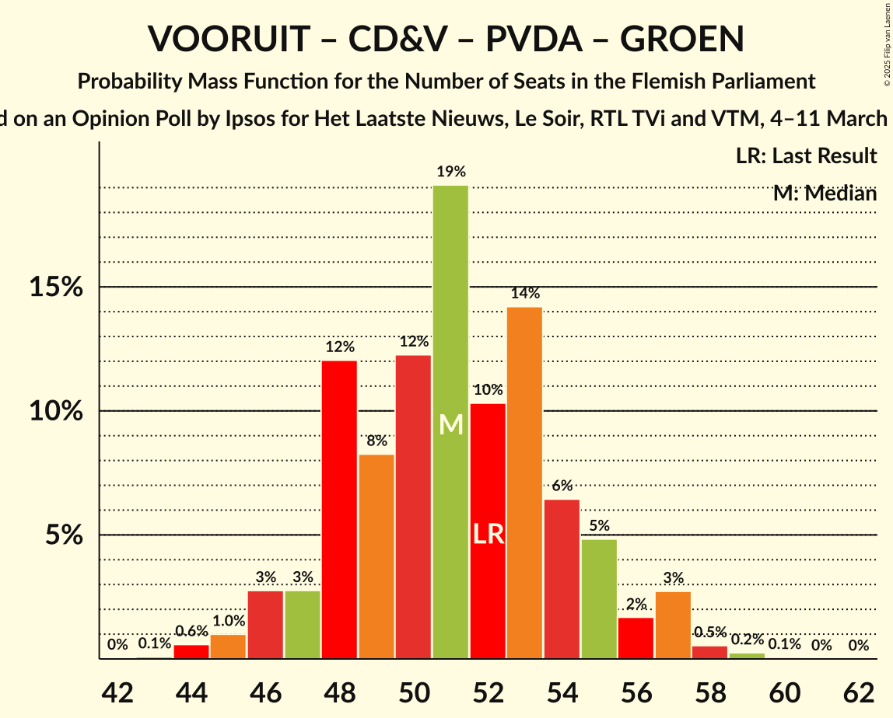

| Number of Seats | Probability | Accumulated | Special Marks |
|:---------------:|:-----------:|:-----------:|:-------------:|
| 42 | 0% | 100% |  |
| 43 | 0.2% | 99.9% |  |
| 44 | 0.8% | 99.8% |  |
| 45 | 1.4% | 99.0% |  |
| 46 | 8% | 98% |  |
| 47 | 4% | 90% |  |
| 48 | 12% | 86% |  |
| 49 | 10% | 74% |  |
| 50 | 20% | 64% | Median |
| 51 | 13% | 45% |  |
| 52 | 12% | 32% | Last Result |
| 53 | 11% | 20% |  |
| 54 | 4% | 8% |  |
| 55 | 1.0% | 4% |  |
| 56 | 2% | 3% |  |
| 57 | 0.6% | 0.9% |  |
| 58 | 0.3% | 0.3% |  |
| 59 | 0% | 0.1% |  |
| 60 | 0% | 0% |  |

### Nieuw-Vlaamse Alliantie – Christen-Democratisch en Vlaams

| Number of Seats | Probability | Accumulated | Special Marks |
|:---------------:|:-----------:|:-----------:|:-------------:|
| 40 | 0.1% | 100% |  |
| 41 | 0.6% | 99.8% |  |
| 42 | 2% | 99.3% |  |
| 43 | 5% | 97% |  |
| 44 | 5% | 92% |  |
| 45 | 17% | 87% |  |
| 46 | 7% | 70% |  |
| 47 | 16% | 63% | Last Result |
| 48 | 14% | 47% | Median |
| 49 | 12% | 33% |  |
| 50 | 10% | 21% |  |
| 51 | 5% | 11% |  |
| 52 | 3% | 5% |  |
| 53 | 2% | 2% |  |
| 54 | 0.2% | 0.3% |  |
| 55 | 0.1% | 0.1% |  |
| 56 | 0.1% | 0.1% |  |
| 57 | 0% | 0% |  |

### Vooruit – Christen-Democratisch en Vlaams – Groen – Open Vlaamse Liberalen en Democraten

| Number of Seats | Probability | Accumulated | Special Marks |
|:---------------:|:-----------:|:-----------:|:-------------:|
| 34 | 0.1% | 100% |  |
| 35 | 0.1% | 99.8% |  |
| 36 | 0.4% | 99.8% |  |
| 37 | 0.9% | 99.4% |  |
| 38 | 1.2% | 98% |  |
| 39 | 9% | 97% |  |
| 40 | 9% | 89% |  |
| 41 | 9% | 80% |  |
| 42 | 10% | 71% |  |
| 43 | 16% | 60% | Median |
| 44 | 19% | 44% |  |
| 45 | 9% | 26% |  |
| 46 | 6% | 17% |  |
| 47 | 6% | 10% |  |
| 48 | 3% | 5% |  |
| 49 | 1.1% | 2% |  |
| 50 | 0.4% | 0.6% |  |
| 51 | 0.2% | 0.2% |  |
| 52 | 0.1% | 0.1% | Last Result |
| 53 | 0% | 0% |  |

### Vooruit – Christen-Democratisch en Vlaams – Groen

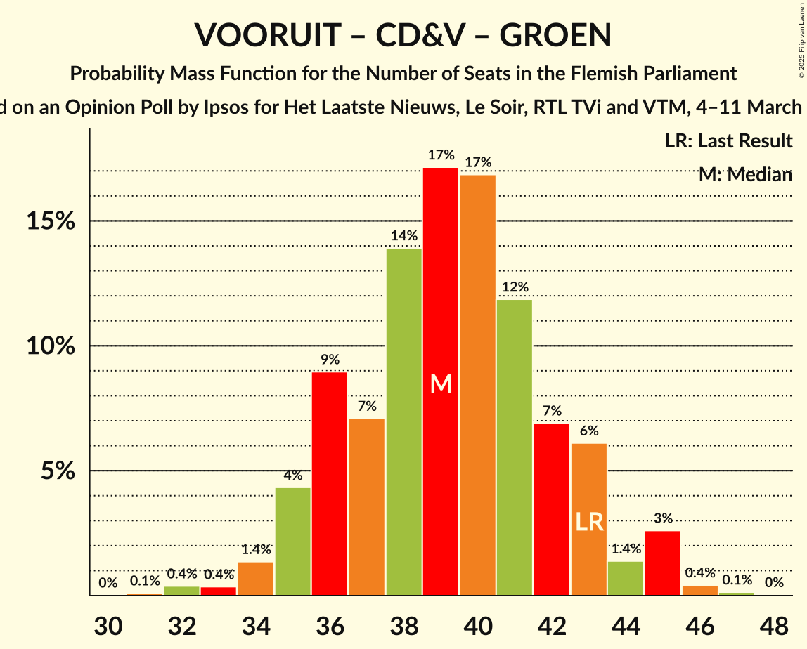

| Number of Seats | Probability | Accumulated | Special Marks |
|:---------------:|:-----------:|:-----------:|:-------------:|
| 31 | 0.1% | 100% |  |
| 32 | 0.6% | 99.8% |  |
| 33 | 1.0% | 99.2% |  |
| 34 | 6% | 98% |  |
| 35 | 6% | 92% |  |
| 36 | 7% | 86% |  |
| 37 | 11% | 79% |  |
| 38 | 18% | 68% | Median |
| 39 | 17% | 50% |  |
| 40 | 11% | 33% |  |
| 41 | 10% | 22% |  |
| 42 | 7% | 11% |  |
| 43 | 2% | 4% | Last Result |
| 44 | 1.1% | 2% |  |
| 45 | 0.9% | 1.2% |  |
| 46 | 0.2% | 0.3% |  |
| 47 | 0% | 0.1% |  |
| 48 | 0% | 0% |  |

### Nieuw-Vlaamse Alliantie – Open Vlaamse Liberalen en Democraten

| Number of Seats | Probability | Accumulated | Special Marks |
|:---------------:|:-----------:|:-----------:|:-------------:|
| 31 | 0.4% | 100% |  |
| 32 | 0.3% | 99.6% |  |
| 33 | 2% | 99.3% |  |
| 34 | 2% | 98% |  |
| 35 | 9% | 95% |  |
| 36 | 11% | 86% |  |
| 37 | 9% | 75% |  |
| 38 | 20% | 65% |  |
| 39 | 15% | 46% | Median |
| 40 | 17% | 31% | Last Result |
| 41 | 6% | 14% |  |
| 42 | 5% | 8% |  |
| 43 | 1.2% | 4% |  |
| 44 | 2% | 2% |  |
| 45 | 0.3% | 0.4% |  |
| 46 | 0.1% | 0.1% |  |
| 47 | 0% | 0% |  |

### Vooruit – Christen-Democratisch en Vlaams – Open Vlaamse Liberalen en Democraten

| Number of Seats | Probability | Accumulated | Special Marks |
|:---------------:|:-----------:|:-----------:|:-------------:|
| 28 | 0.1% | 100% |  |
| 29 | 0.1% | 99.9% |  |
| 30 | 0.8% | 99.8% |  |
| 31 | 2% | 99.0% |  |
| 32 | 7% | 97% |  |
| 33 | 10% | 91% |  |
| 34 | 19% | 81% |  |
| 35 | 19% | 62% |  |
| 36 | 6% | 43% | Median |
| 37 | 11% | 37% |  |
| 38 | 8% | 26% |  |
| 39 | 9% | 18% |  |
| 40 | 6% | 9% |  |
| 41 | 2% | 4% |  |
| 42 | 1.1% | 2% |  |
| 43 | 0.4% | 0.5% | Last Result |
| 44 | 0.1% | 0.1% |  |
| 45 | 0% | 0.1% |  |
| 46 | 0% | 0% |  |

### Vooruit – Christen-Democratisch en Vlaams

| Number of Seats | Probability | Accumulated | Special Marks |
|:---------------:|:-----------:|:-----------:|:-------------:|
| 25 | 0.2% | 100% |  |
| 26 | 0.5% | 99.7% |  |
| 27 | 1.5% | 99.3% |  |
| 28 | 8% | 98% |  |
| 29 | 22% | 90% |  |
| 30 | 13% | 68% |  |
| 31 | 11% | 55% | Median |
| 32 | 14% | 45% |  |
| 33 | 12% | 31% |  |
| 34 | 10% | 19% | Last Result |
| 35 | 6% | 9% |  |
| 36 | 2% | 3% |  |
| 37 | 1.1% | 2% |  |
| 38 | 0.4% | 0.5% |  |
| 39 | 0.1% | 0.1% |  |
| 40 | 0% | 0% |  |

### Vooruit – Groen – Open Vlaamse Liberalen en Democraten

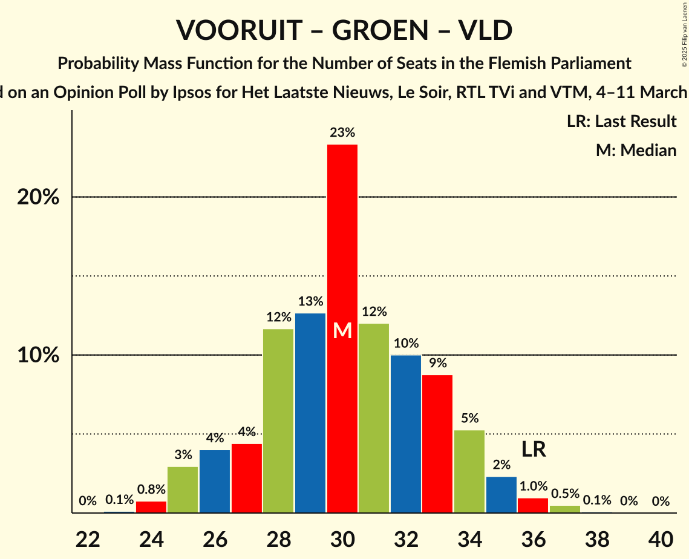

| Number of Seats | Probability | Accumulated | Special Marks |
|:---------------:|:-----------:|:-----------:|:-------------:|
| 22 | 0.1% | 100% |  |
| 23 | 0.9% | 99.9% |  |
| 24 | 1.3% | 99.0% |  |
| 25 | 4% | 98% |  |
| 26 | 5% | 94% |  |
| 27 | 11% | 89% |  |
| 28 | 15% | 78% |  |
| 29 | 15% | 63% | Median |
| 30 | 15% | 48% |  |
| 31 | 14% | 33% |  |
| 32 | 8% | 19% |  |
| 33 | 6% | 11% |  |
| 34 | 3% | 6% |  |
| 35 | 2% | 3% |  |
| 36 | 0.4% | 0.7% | Last Result |
| 37 | 0.1% | 0.3% |  |
| 38 | 0.1% | 0.1% |  |
| 39 | 0% | 0% |  |

### Christen-Democratisch en Vlaams – Groen – Open Vlaamse Liberalen en Democraten

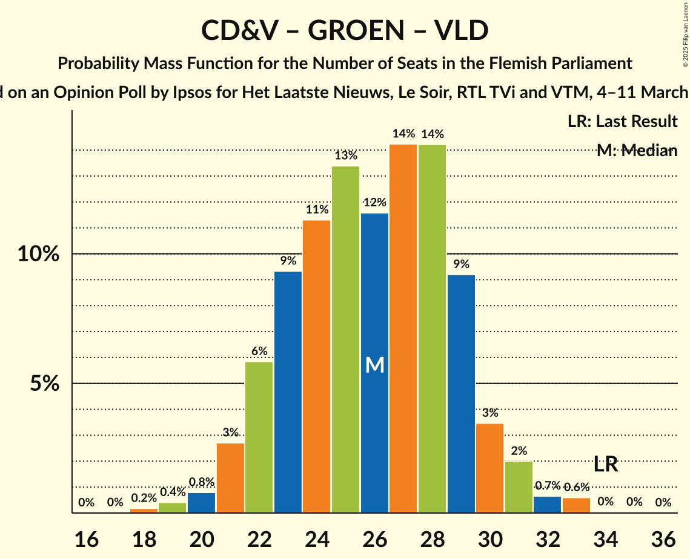

| Number of Seats | Probability | Accumulated | Special Marks |
|:---------------:|:-----------:|:-----------:|:-------------:|
| 17 | 0.1% | 100% |  |
| 18 | 0.1% | 99.8% |  |
| 19 | 0.3% | 99.7% |  |
| 20 | 3% | 99.4% |  |
| 21 | 5% | 96% |  |
| 22 | 6% | 91% |  |
| 23 | 7% | 85% |  |
| 24 | 13% | 79% |  |
| 25 | 15% | 66% |  |
| 26 | 20% | 51% | Median |
| 27 | 11% | 31% |  |
| 28 | 9% | 20% |  |
| 29 | 6% | 11% |  |
| 30 | 2% | 4% |  |
| 31 | 2% | 3% |  |
| 32 | 0.5% | 0.6% |  |
| 33 | 0.1% | 0.2% |  |
| 34 | 0% | 0.1% | Last Result |
| 35 | 0% | 0% |  |

### Vooruit – Open Vlaamse Liberalen en Democraten

| Number of Seats | Probability | Accumulated | Special Marks |
|:---------------:|:-----------:|:-----------:|:-------------:|
| 16 | 0.1% | 100% |  |
| 17 | 0.7% | 99.8% |  |
| 18 | 6% | 99.1% |  |
| 19 | 8% | 93% |  |
| 20 | 4% | 85% |  |
| 21 | 15% | 81% |  |
| 22 | 26% | 66% | Median |
| 23 | 20% | 40% |  |
| 24 | 5% | 20% |  |
| 25 | 6% | 15% |  |
| 26 | 5% | 9% |  |
| 27 | 3% | 4% | Last Result |
| 28 | 0.6% | 1.2% |  |
| 29 | 0.5% | 0.6% |  |
| 30 | 0.1% | 0.1% |  |
| 31 | 0% | 0% |  |

### Christen-Democratisch en Vlaams – Open Vlaamse Liberalen en Democraten

| Number of Seats | Probability | Accumulated | Special Marks |
|:---------------:|:-----------:|:-----------:|:-------------:|
| 12 | 0.1% | 100% |  |
| 13 | 1.0% | 99.9% |  |
| 14 | 3% | 98.9% |  |
| 15 | 3% | 96% |  |
| 16 | 13% | 93% |  |
| 17 | 26% | 80% |  |
| 18 | 23% | 54% |  |
| 19 | 10% | 31% | Median |
| 20 | 3% | 22% |  |
| 21 | 8% | 19% |  |
| 22 | 8% | 11% |  |
| 23 | 2% | 3% |  |
| 24 | 0.9% | 1.1% |  |
| 25 | 0.2% | 0.2% | Last Result |
| 26 | 0.1% | 0.1% |  |
| 27 | 0% | 0% |  |

## Technical Information

### Opinion Poll

+ **Polling firm:** Ipsos
+ **Commissioner(s):** Het Laatste Nieuws, Le Soir, RTL TVi and VTM
+ **Fieldwork period:** 4–11 March 2025

### Calculations

+ **Sample size:** 1001
+ **Simulations done:** 2,097,152
+ **Error estimate:** 1.37%

