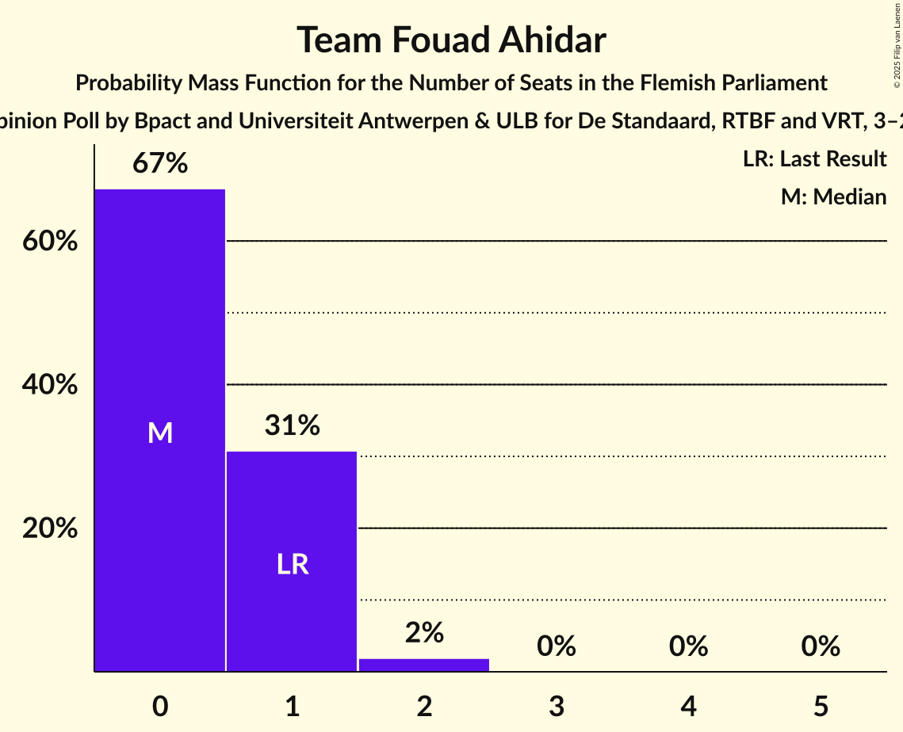

# Opinion Poll by Bpact and Universiteit Antwerpen & ULB for De Standaard, RTBF and VRT, 3–24 March 2025

<a href="#voting-intentions">Voting Intentions</a> | <a href="#seats">Seats</a> | <a href="#coalitions">Coalitions</a> | <a href="#technical-information">Technical Information</a>

## Voting Intentions

### Confidence Intervals

| Party | Last Result | Poll Result | 80% Confidence Interval | 90% Confidence Interval | 95% Confidence Interval | 99% Confidence Interval |
|:-----:|:-----------:|:-----------:|:-----------------------:|:-----------------------:|:-----------------------:|:-----------------------:|
| Nieuw-Vlaamse Alliantie | 23.9% | 26.9% | 25.7–28.2% |25.4–28.5% |25.1–28.8% |24.5–29.4% |
| Vlaams Belang | 22.7% | 20.5% | 19.5–21.7% |19.2–22.0% |18.9–22.3% |18.4–22.8% |
| Vooruit | 13.8% | 14.8% | 13.8–15.8% |13.5–16.0% |13.3–16.3% |12.9–16.8% |
| Christen-Democratisch en Vlaams | 13.0% | 13.7% | 12.8–14.6% |12.5–14.9% |12.3–15.2% |11.9–15.7% |
| Partij van de Arbeid van België | 8.3% | 8.9% | 8.2–9.8% |8.0–10.0% |7.8–10.2% |7.5–10.6% |
| Groen | 7.3% | 7.3% | 6.7–8.1% |6.5–8.3% |6.3–8.5% |6.0–8.9% |
| Open Vlaamse Liberalen en Democraten | 8.3% | 5.7% | 5.1–6.4% |4.9–6.6% |4.8–6.8% |4.5–7.1% |
| Team Fouad Ahidar | 0.3% | 0.1% | 0.0–0.2% |0.0–0.3% |0.0–0.3% |0.0–0.4% |

*Note:* The poll result column reflects the actual value used in the calculations. Published results may vary slightly, and in addition be rounded to fewer digits.

## Seats

### Confidence Intervals

| Party | Last Result | Median | 80% Confidence Interval | 90% Confidence Interval | 95% Confidence Interval | 99% Confidence Interval |
|:-----:|:-----------:|:------:|:-----------------------:|:-----------------------:|:-----------------------:|:-----------------------:|
| <a href="#nieuw-vlaamse-alliantie">Nieuw-Vlaamse Alliantie</a> | 31 | 36 | 35–38 |35–39 |34–39 |33–41 |
| <a href="#vlaams-belang">Vlaams Belang</a> | 31 | 27 | 26–30 |25–30 |25–31 |24–31 |
| <a href="#vooruit">Vooruit</a> | 18 | 18 | 18–21 |18–21 |17–21 |17–23 |
| <a href="#christen-democratisch-en-vlaams">Christen-Democratisch en Vlaams</a> | 16 | 17 | 16–18 |16–19 |15–19 |14–20 |
| <a href="#partij-van-de-arbeid-van-belgië">Partij van de Arbeid van België</a> | 9 | 11 | 10–12 |8–12 |7–13 |7–14 |
| <a href="#groen">Groen</a> | 9 | 9 | 8–11 |8–12 |7–12 |7–12 |
| <a href="#open-vlaamse-liberalen-en-democraten">Open Vlaamse Liberalen en Democraten</a> | 9 | 5 | 2–6 |2–6 |2–7 |2–7 |
| <a href="#team-fouad-ahidar">Team Fouad Ahidar</a> | 1 | 0 | 0–1 |0–1 |0–1 |0–2 |

### Nieuw-Vlaamse Alliantie

*For a full overview of the results for this party, see the [Nieuw-Vlaamse Alliantie](party-nieuw-vlaamsealliantie.html) page.*

| Number of Seats | Probability | Accumulated | Special Marks |
|:---------------:|:-----------:|:-----------:|:-------------:|
| 31 | 0.1% | 100% | Last Result |
| 32 | 0.3% | 99.9% |  |
| 33 | 0.9% | 99.6% |  |
| 34 | 2% | 98.7% |  |
| 35 | 26% | 96% |  |
| 36 | 22% | 71% | Median |
| 37 | 26% | 49% |  |
| 38 | 14% | 23% |  |
| 39 | 6% | 8% |  |
| 40 | 1.4% | 2% |  |
| 41 | 0.8% | 1.0% |  |
| 42 | 0.1% | 0.1% |  |
| 43 | 0% | 0% |  |

### Vlaams Belang

*For a full overview of the results for this party, see the [Vlaams Belang](party-vlaamsbelang.html) page.*

| Number of Seats | Probability | Accumulated | Special Marks |
|:---------------:|:-----------:|:-----------:|:-------------:|
| 22 | 0.1% | 100% |  |
| 23 | 0.2% | 99.9% |  |
| 24 | 0.6% | 99.7% |  |
| 25 | 5% | 99.1% |  |
| 26 | 34% | 94% |  |
| 27 | 22% | 60% | Median |
| 28 | 14% | 38% |  |
| 29 | 12% | 24% |  |
| 30 | 9% | 11% |  |
| 31 | 3% | 3% | Last Result |
| 32 | 0.1% | 0.1% |  |
| 33 | 0% | 0% |  |

### Vooruit

*For a full overview of the results for this party, see the [Vooruit](party-vooruit.html) page.*

| Number of Seats | Probability | Accumulated | Special Marks |
|:---------------:|:-----------:|:-----------:|:-------------:|
| 16 | 0.1% | 100% |  |
| 17 | 5% | 99.9% |  |
| 18 | 50% | 95% | Last Result, Median |
| 19 | 15% | 45% |  |
| 20 | 17% | 31% |  |
| 21 | 12% | 14% |  |
| 22 | 2% | 2% |  |
| 23 | 0.8% | 0.8% |  |
| 24 | 0% | 0% |  |

### Christen-Democratisch en Vlaams

*For a full overview of the results for this party, see the [Christen-Democratisch en Vlaams](party-christen-democratischenvlaams.html) page.*

| Number of Seats | Probability | Accumulated | Special Marks |
|:---------------:|:-----------:|:-----------:|:-------------:|
| 13 | 0.1% | 100% |  |
| 14 | 0.6% | 99.9% |  |
| 15 | 3% | 99.3% |  |
| 16 | 41% | 97% | Last Result |
| 17 | 40% | 55% | Median |
| 18 | 7% | 16% |  |
| 19 | 7% | 9% |  |
| 20 | 2% | 2% |  |
| 21 | 0.1% | 0.1% |  |
| 22 | 0% | 0% |  |

### Partij van de Arbeid van België

*For a full overview of the results for this party, see the [Partij van de Arbeid van België](party-partijvandearbeidvanbelgië.html) page.*

| Number of Seats | Probability | Accumulated | Special Marks |
|:---------------:|:-----------:|:-----------:|:-------------:|
| 7 | 4% | 100% |  |
| 8 | 2% | 96% |  |
| 9 | 3% | 94% | Last Result |
| 10 | 24% | 91% |  |
| 11 | 40% | 67% | Median |
| 12 | 24% | 27% |  |
| 13 | 2% | 3% |  |
| 14 | 0.9% | 0.9% |  |
| 15 | 0% | 0% |  |

### Groen

*For a full overview of the results for this party, see the [Groen](party-groen.html) page.*

| Number of Seats | Probability | Accumulated | Special Marks |
|:---------------:|:-----------:|:-----------:|:-------------:|
| 6 | 0.4% | 100% |  |
| 7 | 5% | 99.6% |  |
| 8 | 26% | 95% |  |
| 9 | 38% | 69% | Last Result, Median |
| 10 | 11% | 31% |  |
| 11 | 15% | 20% |  |
| 12 | 5% | 6% |  |
| 13 | 0.3% | 0.3% |  |
| 14 | 0% | 0% |  |

### Open Vlaamse Liberalen en Democraten

*For a full overview of the results for this party, see the [Open Vlaamse Liberalen en Democraten](party-openvlaamseliberalenendemocraten.html) page.*

| Number of Seats | Probability | Accumulated | Special Marks |
|:---------------:|:-----------:|:-----------:|:-------------:|
| 1 | 0.1% | 100% |  |
| 2 | 23% | 99.9% |  |
| 3 | 12% | 77% |  |
| 4 | 5% | 65% |  |
| 5 | 45% | 60% | Median |
| 6 | 12% | 15% |  |
| 7 | 3% | 3% |  |
| 8 | 0.2% | 0.3% |  |
| 9 | 0% | 0% | Last Result |

### Team Fouad Ahidar

*For a full overview of the results for this party, see the [Team Fouad Ahidar](party-teamfouadahidar.html) page.*

| Number of Seats | Probability | Accumulated | Special Marks |
|:---------------:|:-----------:|:-----------:|:-------------:|
| 0 | 67% | 100% | Median |
| 1 | 31% | 33% | Last Result |
| 2 | 2% | 2% |  |
| 3 | 0% | 0% |  |

## Coalitions

### Confidence Intervals

| Coalition | Last Result | Median | Majority? | 80% Confidence Interval | 90% Confidence Interval | 95% Confidence Interval | 99% Confidence Interval |
|:---------:|:-----------:|:------:|:---------:|:-----------------------:|:-----------------------:|:-----------------------:|:-----------------------:|
| Nieuw-Vlaamse Alliantie – Vlaams Belang – Christen-Democratisch en Vlaams | 78 | 80 | 100% | 78–83 | 78–84 | 77–84 | 76–85 |
| Nieuw-Vlaamse Alliantie – Vooruit – Christen-Democratisch en Vlaams – Open Vlaamse Liberalen en Democraten | 74 | 76 | 100% | 74–78 | 73–79 | 73–80 | 72–82 |
| Nieuw-Vlaamse Alliantie – Vooruit – Christen-Democratisch en Vlaams | 65 | 72 | 100% | 70–74 | 70–75 | 69–76 | 68–77 |
| Nieuw-Vlaamse Alliantie – Vlaams Belang | 62 | 64 | 74% | 61–66 | 61–67 | 61–68 | 59–69 |
| Nieuw-Vlaamse Alliantie – Vooruit – Open Vlaamse Liberalen en Democraten | 58 | 60 | 4% | 57–62 | 56–62 | 56–63 | 55–65 |
| Nieuw-Vlaamse Alliantie – Christen-Democratisch en Vlaams – Open Vlaamse Liberalen en Democraten | 56 | 57 | 0.3% | 55–60 | 54–60 | 54–61 | 53–62 |
| Vooruit – Christen-Democratisch en Vlaams – Partij van de Arbeid van België – Groen | 52 | 56 | 0% | 53–58 | 53–59 | 52–59 | 51–60 |
| Nieuw-Vlaamse Alliantie – Christen-Democratisch en Vlaams | 47 | 53 | 0% | 51–55 | 51–56 | 50–57 | 49–58 |
| Vooruit – Christen-Democratisch en Vlaams – Groen – Open Vlaamse Liberalen en Democraten | 52 | 49 | 0% | 47–52 | 46–52 | 45–53 | 44–54 |
| Vooruit – Christen-Democratisch en Vlaams – Groen | 43 | 45 | 0% | 43–47 | 42–48 | 42–48 | 41–50 |
| Nieuw-Vlaamse Alliantie – Open Vlaamse Liberalen en Democraten | 40 | 41 | 0% | 38–43 | 38–44 | 37–44 | 36–45 |
| Vooruit – Christen-Democratisch en Vlaams – Open Vlaamse Liberalen en Democraten | 43 | 40 | 0% | 37–42 | 37–43 | 36–43 | 36–44 |
| Vooruit – Christen-Democratisch en Vlaams | 34 | 35 | 0% | 34–38 | 34–38 | 33–39 | 32–40 |
| Vooruit – Groen – Open Vlaamse Liberalen en Democraten | 36 | 32 | 0% | 30–35 | 29–36 | 29–36 | 28–37 |
| Christen-Democratisch en Vlaams – Groen – Open Vlaamse Liberalen en Democraten | 34 | 30 | 0% | 28–33 | 27–33 | 27–34 | 26–35 |
| Vooruit – Open Vlaamse Liberalen en Democraten | 27 | 23 | 0% | 21–26 | 20–26 | 20–26 | 20–27 |
| Christen-Democratisch en Vlaams – Open Vlaamse Liberalen en Democraten | 25 | 21 | 0% | 18–23 | 18–23 | 18–24 | 18–25 |

### Nieuw-Vlaamse Alliantie – Vlaams Belang – Christen-Democratisch en Vlaams

| Number of Seats | Probability | Accumulated | Special Marks |
|:---------------:|:-----------:|:-----------:|:-------------:|
| 75 | 0.2% | 100% |  |
| 76 | 0.8% | 99.8% |  |
| 77 | 4% | 98.9% |  |
| 78 | 9% | 95% | Last Result |
| 79 | 19% | 87% |  |
| 80 | 18% | 67% | Median |
| 81 | 17% | 49% |  |
| 82 | 14% | 32% |  |
| 83 | 11% | 17% |  |
| 84 | 5% | 6% |  |
| 85 | 1.3% | 2% |  |
| 86 | 0.3% | 0.5% |  |
| 87 | 0.1% | 0.1% |  |
| 88 | 0% | 0% |  |

### Nieuw-Vlaamse Alliantie – Vooruit – Christen-Democratisch en Vlaams – Open Vlaamse Liberalen en Democraten

| Number of Seats | Probability | Accumulated | Special Marks |
|:---------------:|:-----------:|:-----------:|:-------------:|
| 71 | 0.2% | 100% |  |
| 72 | 2% | 99.8% |  |
| 73 | 5% | 98% |  |
| 74 | 8% | 93% | Last Result |
| 75 | 12% | 85% |  |
| 76 | 26% | 74% | Median |
| 77 | 22% | 48% |  |
| 78 | 18% | 26% |  |
| 79 | 5% | 8% |  |
| 80 | 2% | 3% |  |
| 81 | 0.6% | 1.1% |  |
| 82 | 0.5% | 0.5% |  |
| 83 | 0% | 0.1% |  |
| 84 | 0% | 0% |  |

### Nieuw-Vlaamse Alliantie – Vooruit – Christen-Democratisch en Vlaams

| Number of Seats | Probability | Accumulated | Special Marks |
|:---------------:|:-----------:|:-----------:|:-------------:|
| 65 | 0% | 100% | Last Result |
| 66 | 0.1% | 100% |  |
| 67 | 0.3% | 99.9% |  |
| 68 | 0.9% | 99.6% |  |
| 69 | 3% | 98.7% |  |
| 70 | 8% | 96% |  |
| 71 | 28% | 88% | Median |
| 72 | 22% | 60% |  |
| 73 | 20% | 39% |  |
| 74 | 10% | 19% |  |
| 75 | 5% | 9% |  |
| 76 | 3% | 4% |  |
| 77 | 0.8% | 1.0% |  |
| 78 | 0.2% | 0.2% |  |
| 79 | 0% | 0% |  |

### Nieuw-Vlaamse Alliantie – Vlaams Belang

| Number of Seats | Probability | Accumulated | Special Marks |
|:---------------:|:-----------:|:-----------:|:-------------:|
| 58 | 0.1% | 100% |  |
| 59 | 0.6% | 99.9% |  |
| 60 | 1.5% | 99.3% |  |
| 61 | 9% | 98% |  |
| 62 | 14% | 89% | Last Result |
| 63 | 21% | 74% | Median, Majority |
| 64 | 19% | 53% |  |
| 65 | 16% | 34% |  |
| 66 | 9% | 18% |  |
| 67 | 6% | 9% |  |
| 68 | 2% | 3% |  |
| 69 | 0.5% | 0.6% |  |
| 70 | 0.2% | 0.2% |  |
| 71 | 0% | 0% |  |

### Nieuw-Vlaamse Alliantie – Vooruit – Open Vlaamse Liberalen en Democraten

| Number of Seats | Probability | Accumulated | Special Marks |
|:---------------:|:-----------:|:-----------:|:-------------:|
| 53 | 0.1% | 100% |  |
| 54 | 0.1% | 99.9% |  |
| 55 | 0.7% | 99.8% |  |
| 56 | 5% | 99.1% |  |
| 57 | 9% | 94% |  |
| 58 | 12% | 85% | Last Result |
| 59 | 16% | 73% | Median |
| 60 | 22% | 56% |  |
| 61 | 23% | 34% |  |
| 62 | 7% | 11% |  |
| 63 | 2% | 4% | Majority |
| 64 | 1.2% | 2% |  |
| 65 | 0.5% | 0.6% |  |
| 66 | 0% | 0% |  |

### Nieuw-Vlaamse Alliantie – Christen-Democratisch en Vlaams – Open Vlaamse Liberalen en Democraten

| Number of Seats | Probability | Accumulated | Special Marks |
|:---------------:|:-----------:|:-----------:|:-------------:|
| 51 | 0% | 100% |  |
| 52 | 0.2% | 99.9% |  |
| 53 | 1.3% | 99.7% |  |
| 54 | 5% | 98% |  |
| 55 | 7% | 94% |  |
| 56 | 16% | 87% | Last Result |
| 57 | 21% | 71% |  |
| 58 | 22% | 50% | Median |
| 59 | 14% | 28% |  |
| 60 | 9% | 14% |  |
| 61 | 4% | 5% |  |
| 62 | 0.6% | 0.9% |  |
| 63 | 0.3% | 0.3% | Majority |
| 64 | 0% | 0.1% |  |
| 65 | 0% | 0% |  |

### Vooruit – Christen-Democratisch en Vlaams – Partij van de Arbeid van België – Groen

| Number of Seats | Probability | Accumulated | Special Marks |
|:---------------:|:-----------:|:-----------:|:-------------:|
| 50 | 0.2% | 100% |  |
| 51 | 1.1% | 99.8% |  |
| 52 | 3% | 98.7% | Last Result |
| 53 | 9% | 96% |  |
| 54 | 15% | 87% |  |
| 55 | 17% | 72% | Median |
| 56 | 20% | 56% |  |
| 57 | 20% | 35% |  |
| 58 | 10% | 16% |  |
| 59 | 4% | 6% |  |
| 60 | 1.2% | 2% |  |
| 61 | 0.3% | 0.3% |  |
| 62 | 0% | 0.1% |  |
| 63 | 0% | 0% | Majority |

### Nieuw-Vlaamse Alliantie – Christen-Democratisch en Vlaams

| Number of Seats | Probability | Accumulated | Special Marks |
|:---------------:|:-----------:|:-----------:|:-------------:|
| 47 | 0% | 100% | Last Result |
| 48 | 0.1% | 100% |  |
| 49 | 0.5% | 99.8% |  |
| 50 | 2% | 99.3% |  |
| 51 | 10% | 97% |  |
| 52 | 20% | 87% |  |
| 53 | 26% | 68% | Median |
| 54 | 22% | 42% |  |
| 55 | 11% | 20% |  |
| 56 | 6% | 9% |  |
| 57 | 2% | 3% |  |
| 58 | 0.7% | 0.9% |  |
| 59 | 0.2% | 0.2% |  |
| 60 | 0% | 0% |  |

### Vooruit – Christen-Democratisch en Vlaams – Groen – Open Vlaamse Liberalen en Democraten

| Number of Seats | Probability | Accumulated | Special Marks |
|:---------------:|:-----------:|:-----------:|:-------------:|
| 43 | 0.1% | 100% |  |
| 44 | 0.6% | 99.9% |  |
| 45 | 2% | 99.4% |  |
| 46 | 7% | 97% |  |
| 47 | 13% | 90% |  |
| 48 | 17% | 77% |  |
| 49 | 19% | 61% | Median |
| 50 | 17% | 42% |  |
| 51 | 14% | 25% |  |
| 52 | 7% | 11% | Last Result |
| 53 | 4% | 5% |  |
| 54 | 0.6% | 0.8% |  |
| 55 | 0.1% | 0.2% |  |
| 56 | 0.1% | 0.1% |  |
| 57 | 0% | 0% |  |

### Vooruit – Christen-Democratisch en Vlaams – Groen

| Number of Seats | Probability | Accumulated | Special Marks |
|:---------------:|:-----------:|:-----------:|:-------------:|
| 40 | 0.1% | 100% |  |
| 41 | 1.2% | 99.8% |  |
| 42 | 7% | 98.6% |  |
| 43 | 13% | 91% | Last Result |
| 44 | 24% | 78% | Median |
| 45 | 20% | 55% |  |
| 46 | 16% | 35% |  |
| 47 | 11% | 18% |  |
| 48 | 6% | 8% |  |
| 49 | 1.5% | 2% |  |
| 50 | 0.4% | 0.7% |  |
| 51 | 0.2% | 0.2% |  |
| 52 | 0% | 0% |  |

### Nieuw-Vlaamse Alliantie – Open Vlaamse Liberalen en Democraten

| Number of Seats | Probability | Accumulated | Special Marks |
|:---------------:|:-----------:|:-----------:|:-------------:|
| 35 | 0.2% | 100% |  |
| 36 | 0.5% | 99.8% |  |
| 37 | 4% | 99.3% |  |
| 38 | 8% | 95% |  |
| 39 | 9% | 88% |  |
| 40 | 27% | 78% | Last Result |
| 41 | 18% | 52% | Median |
| 42 | 17% | 34% |  |
| 43 | 10% | 17% |  |
| 44 | 5% | 6% |  |
| 45 | 0.8% | 1.1% |  |
| 46 | 0.3% | 0.4% |  |
| 47 | 0.1% | 0.1% |  |
| 48 | 0% | 0% |  |

### Vooruit – Christen-Democratisch en Vlaams – Open Vlaamse Liberalen en Democraten

| Number of Seats | Probability | Accumulated | Special Marks |
|:---------------:|:-----------:|:-----------:|:-------------:|
| 35 | 0.2% | 100% |  |
| 36 | 4% | 99.8% |  |
| 37 | 8% | 96% |  |
| 38 | 9% | 88% |  |
| 39 | 19% | 79% |  |
| 40 | 25% | 60% | Median |
| 41 | 15% | 35% |  |
| 42 | 11% | 20% |  |
| 43 | 6% | 8% | Last Result |
| 44 | 1.4% | 2% |  |
| 45 | 0.3% | 0.4% |  |
| 46 | 0.1% | 0.1% |  |
| 47 | 0% | 0% |  |

### Vooruit – Christen-Democratisch en Vlaams

| Number of Seats | Probability | Accumulated | Special Marks |
|:---------------:|:-----------:|:-----------:|:-------------:|
| 31 | 0% | 100% |  |
| 32 | 0.5% | 99.9% |  |
| 33 | 3% | 99.4% |  |
| 34 | 19% | 96% | Last Result |
| 35 | 29% | 77% | Median |
| 36 | 21% | 49% |  |
| 37 | 16% | 28% |  |
| 38 | 9% | 12% |  |
| 39 | 2% | 3% |  |
| 40 | 1.0% | 1.3% |  |
| 41 | 0.3% | 0.3% |  |
| 42 | 0% | 0% |  |

### Vooruit – Groen – Open Vlaamse Liberalen en Democraten

| Number of Seats | Probability | Accumulated | Special Marks |
|:---------------:|:-----------:|:-----------:|:-------------:|
| 27 | 0.2% | 100% |  |
| 28 | 1.4% | 99.8% |  |
| 29 | 8% | 98% |  |
| 30 | 10% | 90% |  |
| 31 | 17% | 81% |  |
| 32 | 19% | 64% | Median |
| 33 | 14% | 45% |  |
| 34 | 17% | 31% |  |
| 35 | 8% | 14% |  |
| 36 | 3% | 6% | Last Result |
| 37 | 2% | 2% |  |
| 38 | 0.2% | 0.3% |  |
| 39 | 0% | 0.1% |  |
| 40 | 0% | 0% |  |

### Christen-Democratisch en Vlaams – Groen – Open Vlaamse Liberalen en Democraten

| Number of Seats | Probability | Accumulated | Special Marks |
|:---------------:|:-----------:|:-----------:|:-------------:|
| 25 | 0.2% | 100% |  |
| 26 | 1.3% | 99.8% |  |
| 27 | 8% | 98% |  |
| 28 | 12% | 91% |  |
| 29 | 13% | 79% |  |
| 30 | 21% | 66% |  |
| 31 | 19% | 45% | Median |
| 32 | 14% | 25% |  |
| 33 | 7% | 11% |  |
| 34 | 3% | 4% | Last Result |
| 35 | 0.8% | 0.9% |  |
| 36 | 0.1% | 0.1% |  |
| 37 | 0% | 0% |  |

### Vooruit – Open Vlaamse Liberalen en Democraten

| Number of Seats | Probability | Accumulated | Special Marks |
|:---------------:|:-----------:|:-----------:|:-------------:|
| 19 | 0.4% | 100% |  |
| 20 | 9% | 99.6% |  |
| 21 | 13% | 90% |  |
| 22 | 10% | 78% |  |
| 23 | 31% | 68% | Median |
| 24 | 14% | 37% |  |
| 25 | 12% | 23% |  |
| 26 | 10% | 12% |  |
| 27 | 1.4% | 2% | Last Result |
| 28 | 0.3% | 0.4% |  |
| 29 | 0% | 0.1% |  |
| 30 | 0% | 0% |  |

### Christen-Democratisch en Vlaams – Open Vlaamse Liberalen en Democraten

| Number of Seats | Probability | Accumulated | Special Marks |
|:---------------:|:-----------:|:-----------:|:-------------:|
| 17 | 0.2% | 100% |  |
| 18 | 12% | 99.7% |  |
| 19 | 11% | 88% |  |
| 20 | 9% | 77% |  |
| 21 | 23% | 68% |  |
| 22 | 32% | 46% | Median |
| 23 | 10% | 14% |  |
| 24 | 3% | 4% |  |
| 25 | 0.8% | 1.0% | Last Result |
| 26 | 0.2% | 0.2% |  |
| 27 | 0% | 0% |  |

## Technical Information

### Opinion Poll

+ **Polling firm:** Bpact and Universiteit Antwerpen & ULB
+ **Commissioner(s):** De Standaard, RTBF and VRT
+ **Fieldwork period:** 3–24 March 2025

### Calculations

+ **Sample size:** 2196
+ **Simulations done:** 2,097,152
+ **Error estimate:** 1.27%

