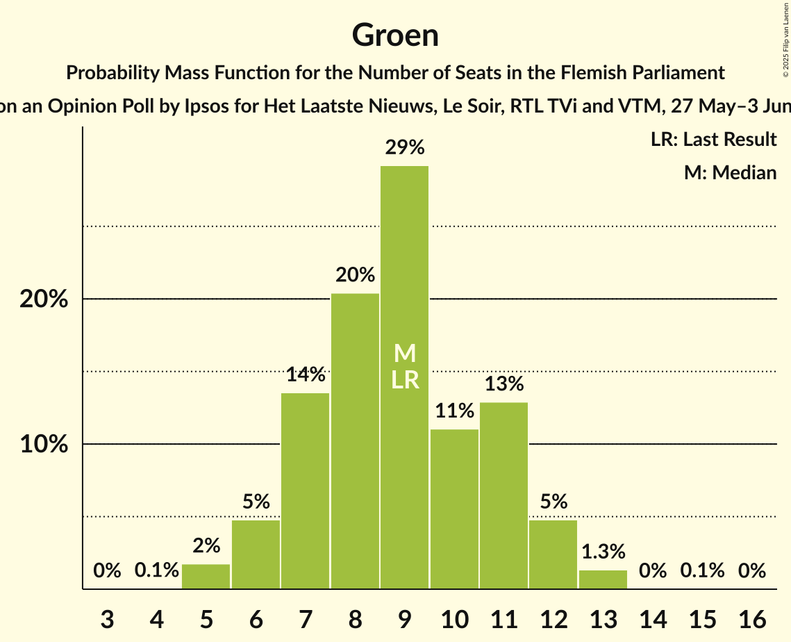
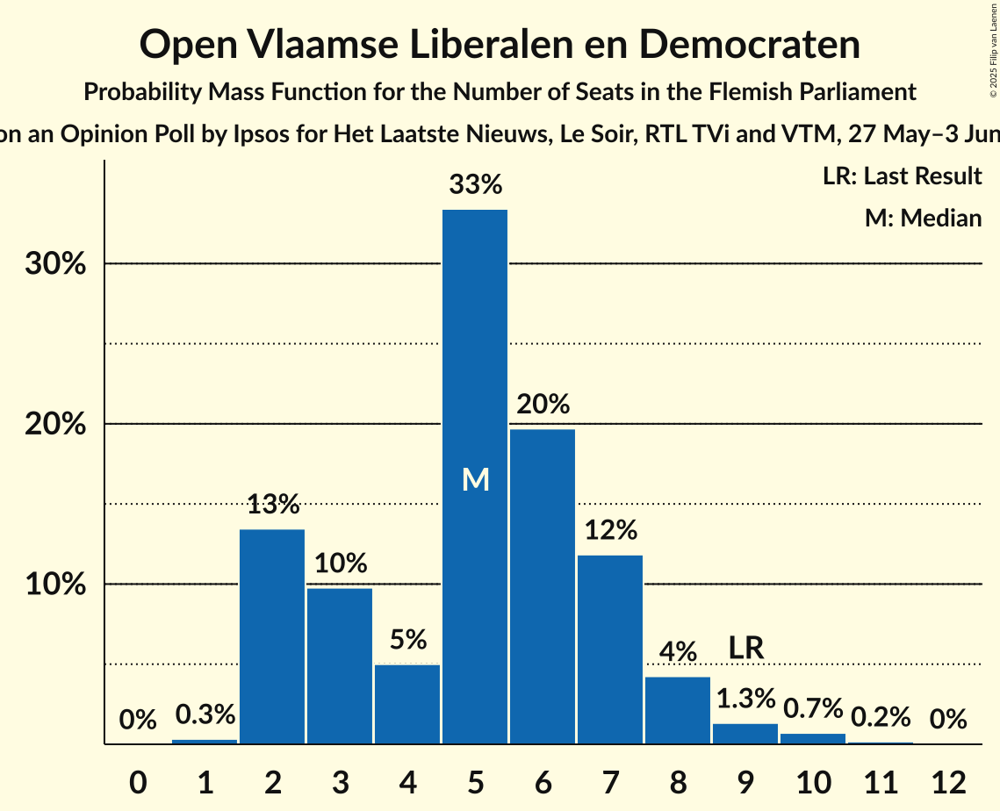
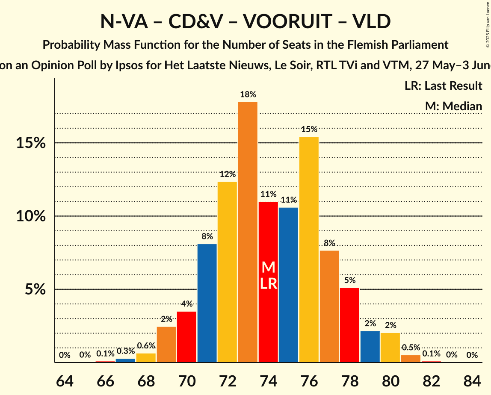
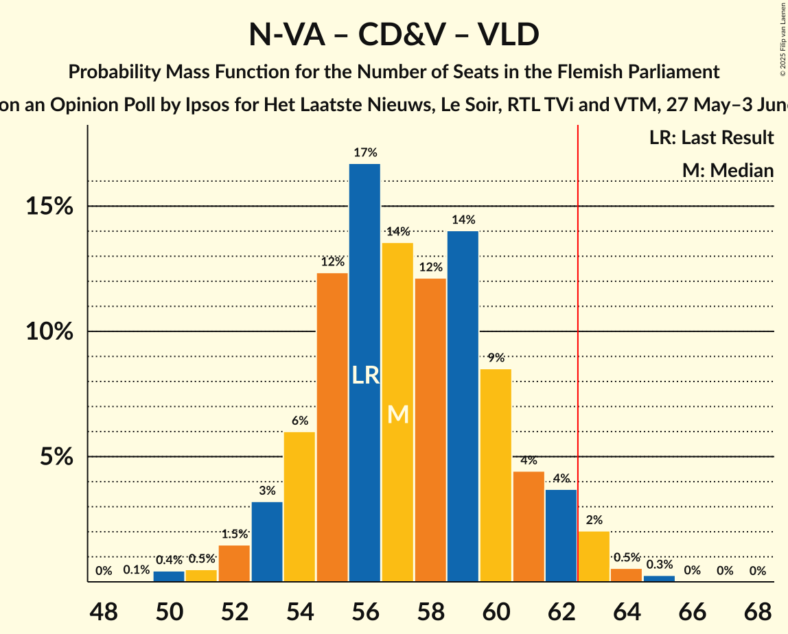
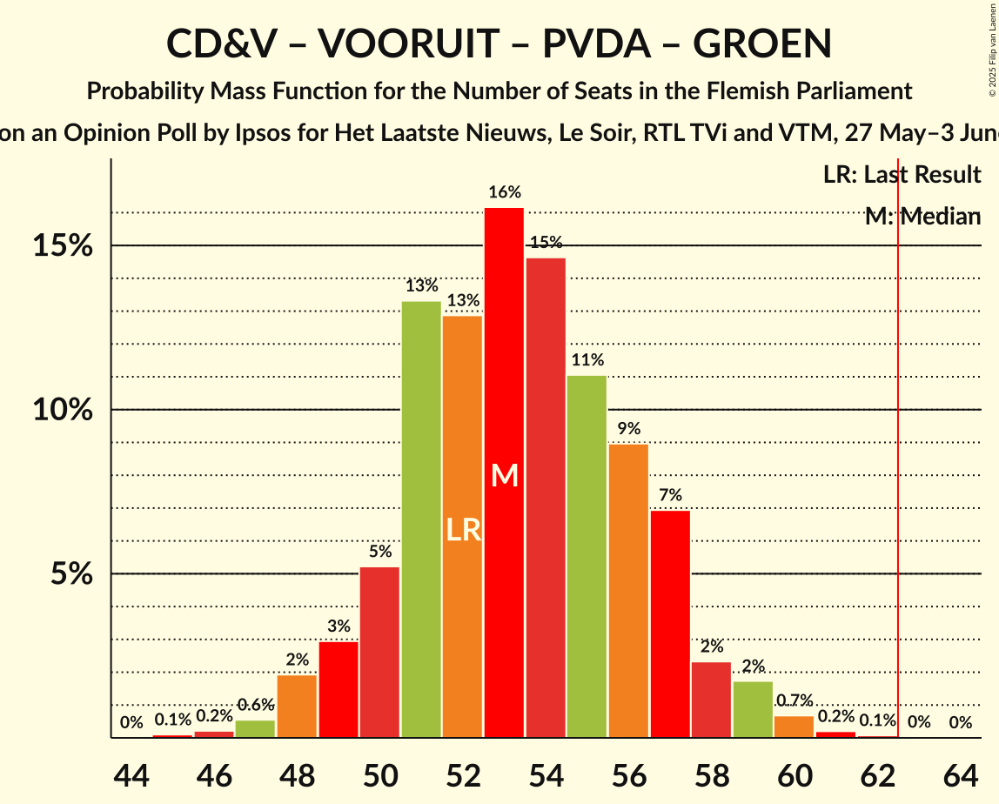
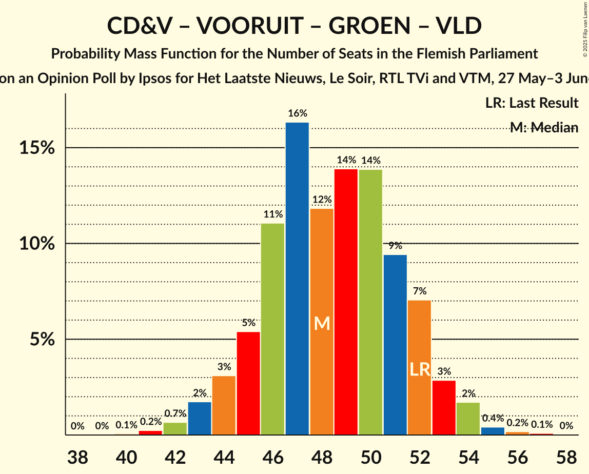
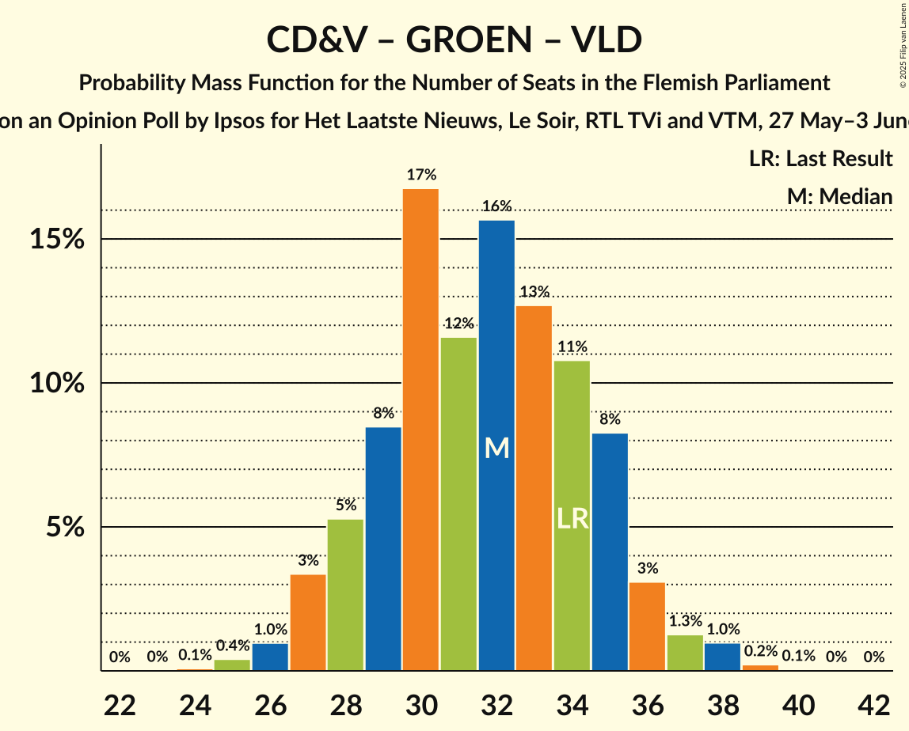

# Opinion Poll by Ipsos for Het Laatste Nieuws, Le Soir, RTL TVi and VTM, 27 May–3 June 2025

<a href="#voting-intentions">Voting Intentions</a> | <a href="#seats">Seats</a> | <a href="#coalitions">Coalitions</a> | <a href="#technical-information">Technical Information</a>

## Voting Intentions

### Confidence Intervals

| Party | Last Result | Poll Result | 80% Confidence Interval | 90% Confidence Interval | 95% Confidence Interval | 99% Confidence Interval |
|:-----:|:-----------:|:-----------:|:-----------------------:|:-----------------------:|:-----------------------:|:-----------------------:|
| Nieuw-Vlaamse Alliantie | 23.9% | 26.3% | 24.6–28.2% |24.1–28.7% |23.7–29.1% |22.8–30.0% |
| Vlaams Belang | 22.7% | 22.8% | 21.2–24.6% |20.7–25.1% |20.3–25.5% |19.5–26.4% |
| Christen-Democratisch en Vlaams | 13.0% | 14.5% | 13.2–16.0% |12.8–16.4% |12.5–16.8% |11.8–17.6% |
| Vooruit | 13.8% | 13.4% | 12.1–14.9% |11.7–15.3% |11.4–15.7% |10.8–16.4% |
| Partij van de Arbeid van België | 8.3% | 8.9% | 7.8–10.2% |7.5–10.5% |7.3–10.8% |6.8–11.5% |
| Groen | 7.3% | 7.4% | 6.4–8.6% |6.2–8.9% |5.9–9.2% |5.5–9.8% |
| Open Vlaamse Liberalen en Democraten | 8.3% | 6.1% | 5.2–7.2% |5.0–7.5% |4.8–7.8% |4.4–8.3% |
| Team Fouad Ahidar | 0.3% | 0.1% | 0.0–0.4% |0.0–0.5% |0.0–0.6% |0.0–0.7% |

*Note:* The poll result column reflects the actual value used in the calculations. Published results may vary slightly, and in addition be rounded to fewer digits.

## Seats

### Confidence Intervals

| Party | Last Result | Median | 80% Confidence Interval | 90% Confidence Interval | 95% Confidence Interval | 99% Confidence Interval |
|:-----:|:-----------:|:------:|:-----------------------:|:-----------------------:|:-----------------------:|:-----------------------:|
| <a href="#nieuw-vlaamse-alliantie">Nieuw-Vlaamse Alliantie</a> | 31 | 35 | 32–37 |31–38 |31–39 |30–40 |
| <a href="#vlaams-belang">Vlaams Belang</a> | 31 | 31 | 27–32 |26–33 |26–33 |25–35 |
| <a href="#christen-democratisch-en-vlaams">Christen-Democratisch en Vlaams</a> | 16 | 18 | 16–20 |16–21 |15–21 |14–23 |
| <a href="#vooruit">Vooruit</a> | 18 | 17 | 15–18 |14–19 |13–20 |11–21 |
| <a href="#partij-van-de-arbeid-van-belgië">Partij van de Arbeid van België</a> | 9 | 10 | 7–12 |7–13 |7–14 |6–14 |
| <a href="#groen">Groen</a> | 9 | 9 | 7–11 |6–12 |6–12 |5–13 |
| <a href="#open-vlaamse-liberalen-en-democraten">Open Vlaamse Liberalen en Democraten</a> | 9 | 5 | 2–7 |2–8 |2–8 |2–10 |
| <a href="#team-fouad-ahidar">Team Fouad Ahidar</a> | 1 | 1 | 0–2 |0–2 |0–3 |0–3 |

### Nieuw-Vlaamse Alliantie

*For a full overview of the results for this party, see the [Nieuw-Vlaamse Alliantie](party-nieuw-vlaamsealliantie.html) page.*

| Number of Seats | Probability | Accumulated | Special Marks |
|:---------------:|:-----------:|:-----------:|:-------------:|
| 29 | 0.3% | 100% |  |
| 30 | 1.4% | 99.7% |  |
| 31 | 6% | 98% | Last Result |
| 32 | 11% | 92% |  |
| 33 | 13% | 81% |  |
| 34 | 13% | 68% |  |
| 35 | 24% | 55% | Median |
| 36 | 16% | 31% |  |
| 37 | 6% | 15% |  |
| 38 | 5% | 9% |  |
| 39 | 3% | 4% |  |
| 40 | 0.4% | 0.7% |  |
| 41 | 0.2% | 0.2% |  |
| 42 | 0.1% | 0.1% |  |
| 43 | 0% | 0% |  |

### Vlaams Belang

*For a full overview of the results for this party, see the [Vlaams Belang](party-vlaamsbelang.html) page.*

| Number of Seats | Probability | Accumulated | Special Marks |
|:---------------:|:-----------:|:-----------:|:-------------:|
| 23 | 0% | 100% |  |
| 24 | 0.3% | 99.9% |  |
| 25 | 2% | 99.6% |  |
| 26 | 6% | 98% |  |
| 27 | 2% | 91% |  |
| 28 | 7% | 89% |  |
| 29 | 12% | 82% |  |
| 30 | 16% | 70% |  |
| 31 | 18% | 54% | Last Result, Median |
| 32 | 28% | 37% |  |
| 33 | 6% | 8% |  |
| 34 | 1.2% | 2% |  |
| 35 | 0.5% | 0.7% |  |
| 36 | 0.2% | 0.2% |  |
| 37 | 0% | 0% |  |

### Christen-Democratisch en Vlaams

*For a full overview of the results for this party, see the [Christen-Democratisch en Vlaams](party-christen-democratischenvlaams.html) page.*

| Number of Seats | Probability | Accumulated | Special Marks |
|:---------------:|:-----------:|:-----------:|:-------------:|
| 12 | 0.1% | 100% |  |
| 13 | 0.2% | 99.9% |  |
| 14 | 0.9% | 99.7% |  |
| 15 | 3% | 98.8% |  |
| 16 | 19% | 96% | Last Result |
| 17 | 26% | 77% |  |
| 18 | 15% | 51% | Median |
| 19 | 25% | 36% |  |
| 20 | 6% | 12% |  |
| 21 | 3% | 6% |  |
| 22 | 2% | 2% |  |
| 23 | 0.5% | 0.7% |  |
| 24 | 0.2% | 0.2% |  |
| 25 | 0% | 0% |  |

### Vooruit

*For a full overview of the results for this party, see the [Vooruit](party-vooruit.html) page.*

| Number of Seats | Probability | Accumulated | Special Marks |
|:---------------:|:-----------:|:-----------:|:-------------:|
| 11 | 0.7% | 100% |  |
| 12 | 1.1% | 99.3% |  |
| 13 | 1.4% | 98% |  |
| 14 | 5% | 97% |  |
| 15 | 8% | 92% |  |
| 16 | 15% | 85% |  |
| 17 | 43% | 69% | Median |
| 18 | 20% | 27% | Last Result |
| 19 | 4% | 7% |  |
| 20 | 2% | 3% |  |
| 21 | 0.6% | 0.8% |  |
| 22 | 0.1% | 0.2% |  |
| 23 | 0.1% | 0.1% |  |
| 24 | 0% | 0% |  |

### Partij van de Arbeid van België

*For a full overview of the results for this party, see the [Partij van de Arbeid van België](party-partijvandearbeidvanbelgië.html) page.*

| Number of Seats | Probability | Accumulated | Special Marks |
|:---------------:|:-----------:|:-----------:|:-------------:|
| 6 | 2% | 100% |  |
| 7 | 13% | 98% |  |
| 8 | 5% | 85% |  |
| 9 | 5% | 79% | Last Result |
| 10 | 41% | 74% | Median |
| 11 | 20% | 33% |  |
| 12 | 7% | 13% |  |
| 13 | 3% | 6% |  |
| 14 | 3% | 3% |  |
| 15 | 0% | 0.1% |  |
| 16 | 0% | 0% |  |

### Groen

*For a full overview of the results for this party, see the [Groen](party-groen.html) page.*

| Number of Seats | Probability | Accumulated | Special Marks |
|:---------------:|:-----------:|:-----------:|:-------------:|
| 4 | 0.1% | 100% |  |
| 5 | 2% | 99.9% |  |
| 6 | 5% | 98% |  |
| 7 | 14% | 93% |  |
| 8 | 20% | 80% |  |
| 9 | 29% | 59% | Last Result, Median |
| 10 | 11% | 30% |  |
| 11 | 13% | 19% |  |
| 12 | 5% | 6% |  |
| 13 | 1.3% | 1.4% |  |
| 14 | 0% | 0.1% |  |
| 15 | 0.1% | 0.1% |  |
| 16 | 0% | 0% |  |

### Open Vlaamse Liberalen en Democraten

*For a full overview of the results for this party, see the [Open Vlaamse Liberalen en Democraten](party-openvlaamseliberalenendemocraten.html) page.*

| Number of Seats | Probability | Accumulated | Special Marks |
|:---------------:|:-----------:|:-----------:|:-------------:|
| 1 | 0.3% | 100% |  |
| 2 | 13% | 99.7% |  |
| 3 | 10% | 86% |  |
| 4 | 5% | 76% |  |
| 5 | 33% | 71% | Median |
| 6 | 20% | 38% |  |
| 7 | 12% | 18% |  |
| 8 | 4% | 6% |  |
| 9 | 1.3% | 2% | Last Result |
| 10 | 0.7% | 0.9% |  |
| 11 | 0.2% | 0.2% |  |
| 12 | 0% | 0% |  |

### Team Fouad Ahidar

*For a full overview of the results for this party, see the [Team Fouad Ahidar](party-teamfouadahidar.html) page.*

| Number of Seats | Probability | Accumulated | Special Marks |
|:---------------:|:-----------:|:-----------:|:-------------:|
| 0 | 42% | 100% |  |
| 1 | 43% | 58% | Last Result, Median |
| 2 | 12% | 14% |  |
| 3 | 2% | 3% |  |
| 4 | 0.3% | 0.3% |  |
| 5 | 0% | 0% |  |

## Coalitions

### Confidence Intervals

| Coalition | Last Result | Median | Majority? | 80% Confidence Interval | 90% Confidence Interval | 95% Confidence Interval | 99% Confidence Interval |
|:---------:|:-----------:|:------:|:---------:|:-----------------------:|:-----------------------:|:-----------------------:|:-----------------------:|
| Nieuw-Vlaamse Alliantie – Vlaams Belang – Christen-Democratisch en Vlaams | 78 | 83 | 100% | 79–86 | 78–87 | 78–87 | 76–89 |
| Nieuw-Vlaamse Alliantie – Christen-Democratisch en Vlaams – Vooruit – Open Vlaamse Liberalen en Democraten | 74 | 74 | 100% | 71–77 | 70–78 | 69–80 | 68–81 |
| Nieuw-Vlaamse Alliantie – Christen-Democratisch en Vlaams – Vooruit | 65 | 69 | 99.7% | 66–72 | 65–73 | 64–75 | 63–76 |
| Nieuw-Vlaamse Alliantie – Vlaams Belang | 62 | 65 | 84% | 62–68 | 61–69 | 60–70 | 58–71 |
| Nieuw-Vlaamse Alliantie – Christen-Democratisch en Vlaams – Open Vlaamse Liberalen en Democraten | 56 | 57 | 3% | 54–61 | 53–62 | 53–63 | 50–64 |
| Nieuw-Vlaamse Alliantie – Vooruit – Open Vlaamse Liberalen en Democraten | 58 | 56 | 1.2% | 53–60 | 52–61 | 51–62 | 50–63 |
| Christen-Democratisch en Vlaams – Vooruit – Partij van de Arbeid van België – Groen | 52 | 53 | 0% | 50–57 | 49–58 | 48–59 | 47–60 |
| Nieuw-Vlaamse Alliantie – Christen-Democratisch en Vlaams | 47 | 52 | 0% | 49–55 | 48–57 | 48–57 | 47–59 |
| Christen-Democratisch en Vlaams – Vooruit – Groen – Open Vlaamse Liberalen en Democraten | 52 | 48 | 0% | 45–52 | 44–53 | 43–53 | 42–55 |
| Christen-Democratisch en Vlaams – Vooruit – Groen | 43 | 43 | 0% | 41–47 | 40–47 | 39–48 | 37–50 |
| Nieuw-Vlaamse Alliantie – Open Vlaamse Liberalen en Democraten | 40 | 39 | 0% | 36–43 | 35–44 | 35–45 | 34–46 |
| Christen-Democratisch en Vlaams – Vooruit – Open Vlaamse Liberalen en Democraten | 43 | 40 | 0% | 37–43 | 35–44 | 35–44 | 33–46 |
| Christen-Democratisch en Vlaams – Vooruit | 34 | 35 | 0% | 32–37 | 31–38 | 30–39 | 28–41 |
| Christen-Democratisch en Vlaams – Groen – Open Vlaamse Liberalen en Democraten | 34 | 32 | 0% | 28–35 | 28–36 | 27–37 | 25–38 |
| Vooruit – Groen – Open Vlaamse Liberalen en Democraten | 36 | 30 | 0% | 28–34 | 27–35 | 26–35 | 24–37 |
| Christen-Democratisch en Vlaams – Open Vlaamse Liberalen en Democraten | 25 | 23 | 0% | 20–26 | 19–27 | 18–27 | 18–29 |
| Vooruit – Open Vlaamse Liberalen en Democraten | 27 | 22 | 0% | 19–25 | 18–25 | 18–26 | 16–28 |

### Nieuw-Vlaamse Alliantie – Vlaams Belang – Christen-Democratisch en Vlaams

| Number of Seats | Probability | Accumulated | Special Marks |
|:---------------:|:-----------:|:-----------:|:-------------:|
| 74 | 0.1% | 100% |  |
| 75 | 0.3% | 99.9% |  |
| 76 | 0.7% | 99.6% |  |
| 77 | 1.2% | 98.9% |  |
| 78 | 4% | 98% | Last Result |
| 79 | 4% | 94% |  |
| 80 | 8% | 90% |  |
| 81 | 11% | 82% |  |
| 82 | 14% | 71% |  |
| 83 | 23% | 57% |  |
| 84 | 12% | 33% | Median |
| 85 | 9% | 22% |  |
| 86 | 7% | 13% |  |
| 87 | 4% | 6% |  |
| 88 | 0.8% | 2% |  |
| 89 | 0.8% | 1.0% |  |
| 90 | 0.1% | 0.2% |  |
| 91 | 0% | 0% |  |

### Nieuw-Vlaamse Alliantie – Christen-Democratisch en Vlaams – Vooruit – Open Vlaamse Liberalen en Democraten

| Number of Seats | Probability | Accumulated | Special Marks |
|:---------------:|:-----------:|:-----------:|:-------------:|
| 66 | 0.1% | 100% |  |
| 67 | 0.3% | 99.9% |  |
| 68 | 0.6% | 99.6% |  |
| 69 | 2% | 98.9% |  |
| 70 | 4% | 96% |  |
| 71 | 8% | 93% |  |
| 72 | 12% | 85% |  |
| 73 | 18% | 72% |  |
| 74 | 11% | 55% | Last Result |
| 75 | 11% | 44% | Median |
| 76 | 15% | 33% |  |
| 77 | 8% | 18% |  |
| 78 | 5% | 10% |  |
| 79 | 2% | 5% |  |
| 80 | 2% | 3% |  |
| 81 | 0.5% | 0.7% |  |
| 82 | 0.1% | 0.1% |  |
| 83 | 0% | 0% |  |

### Nieuw-Vlaamse Alliantie – Christen-Democratisch en Vlaams – Vooruit

| Number of Seats | Probability | Accumulated | Special Marks |
|:---------------:|:-----------:|:-----------:|:-------------:|
| 61 | 0.1% | 100% |  |
| 62 | 0.2% | 99.9% |  |
| 63 | 0.6% | 99.7% | Majority |
| 64 | 3% | 99.0% |  |
| 65 | 5% | 96% | Last Result |
| 66 | 10% | 92% |  |
| 67 | 9% | 82% |  |
| 68 | 15% | 73% |  |
| 69 | 10% | 58% |  |
| 70 | 18% | 48% | Median |
| 71 | 14% | 30% |  |
| 72 | 7% | 16% |  |
| 73 | 5% | 9% |  |
| 74 | 2% | 5% |  |
| 75 | 2% | 3% |  |
| 76 | 0.4% | 0.6% |  |
| 77 | 0.2% | 0.3% |  |
| 78 | 0% | 0.1% |  |
| 79 | 0% | 0% |  |

### Nieuw-Vlaamse Alliantie – Vlaams Belang

| Number of Seats | Probability | Accumulated | Special Marks |
|:---------------:|:-----------:|:-----------:|:-------------:|
| 57 | 0.1% | 100% |  |
| 58 | 0.5% | 99.8% |  |
| 59 | 0.8% | 99.4% |  |
| 60 | 2% | 98.5% |  |
| 61 | 5% | 96% |  |
| 62 | 7% | 91% | Last Result |
| 63 | 10% | 84% | Majority |
| 64 | 17% | 74% |  |
| 65 | 17% | 57% |  |
| 66 | 17% | 40% | Median |
| 67 | 10% | 23% |  |
| 68 | 6% | 13% |  |
| 69 | 4% | 7% |  |
| 70 | 2% | 3% |  |
| 71 | 0.6% | 0.9% |  |
| 72 | 0.2% | 0.3% |  |
| 73 | 0.1% | 0.1% |  |
| 74 | 0% | 0% |  |

### Nieuw-Vlaamse Alliantie – Christen-Democratisch en Vlaams – Open Vlaamse Liberalen en Democraten

| Number of Seats | Probability | Accumulated | Special Marks |
|:---------------:|:-----------:|:-----------:|:-------------:|
| 49 | 0.1% | 100% |  |
| 50 | 0.4% | 99.9% |  |
| 51 | 0.5% | 99.5% |  |
| 52 | 1.5% | 99.0% |  |
| 53 | 3% | 98% |  |
| 54 | 6% | 94% |  |
| 55 | 12% | 88% |  |
| 56 | 17% | 76% | Last Result |
| 57 | 14% | 59% |  |
| 58 | 12% | 46% | Median |
| 59 | 14% | 34% |  |
| 60 | 9% | 20% |  |
| 61 | 4% | 11% |  |
| 62 | 4% | 7% |  |
| 63 | 2% | 3% | Majority |
| 64 | 0.5% | 0.9% |  |
| 65 | 0.3% | 0.3% |  |
| 66 | 0% | 0.1% |  |
| 67 | 0% | 0% |  |

### Nieuw-Vlaamse Alliantie – Vooruit – Open Vlaamse Liberalen en Democraten

| Number of Seats | Probability | Accumulated | Special Marks |
|:---------------:|:-----------:|:-----------:|:-------------:|
| 49 | 0.1% | 100% |  |
| 50 | 0.8% | 99.8% |  |
| 51 | 2% | 99.0% |  |
| 52 | 3% | 97% |  |
| 53 | 9% | 94% |  |
| 54 | 11% | 86% |  |
| 55 | 11% | 75% |  |
| 56 | 19% | 64% |  |
| 57 | 15% | 45% | Median |
| 58 | 9% | 30% | Last Result |
| 59 | 10% | 21% |  |
| 60 | 5% | 11% |  |
| 61 | 3% | 6% |  |
| 62 | 2% | 3% |  |
| 63 | 0.8% | 1.2% | Majority |
| 64 | 0.2% | 0.4% |  |
| 65 | 0.2% | 0.2% |  |
| 66 | 0% | 0% |  |

### Christen-Democratisch en Vlaams – Vooruit – Partij van de Arbeid van België – Groen

| Number of Seats | Probability | Accumulated | Special Marks |
|:---------------:|:-----------:|:-----------:|:-------------:|
| 45 | 0.1% | 100% |  |
| 46 | 0.2% | 99.9% |  |
| 47 | 0.6% | 99.7% |  |
| 48 | 2% | 99.1% |  |
| 49 | 3% | 97% |  |
| 50 | 5% | 94% |  |
| 51 | 13% | 89% |  |
| 52 | 13% | 76% | Last Result |
| 53 | 16% | 63% |  |
| 54 | 15% | 47% | Median |
| 55 | 11% | 32% |  |
| 56 | 9% | 21% |  |
| 57 | 7% | 12% |  |
| 58 | 2% | 5% |  |
| 59 | 2% | 3% |  |
| 60 | 0.7% | 1.0% |  |
| 61 | 0.2% | 0.3% |  |
| 62 | 0.1% | 0.1% |  |
| 63 | 0% | 0% | Majority |

### Nieuw-Vlaamse Alliantie – Christen-Democratisch en Vlaams

| Number of Seats | Probability | Accumulated | Special Marks |
|:---------------:|:-----------:|:-----------:|:-------------:|
| 45 | 0.1% | 100% |  |
| 46 | 0.3% | 99.9% |  |
| 47 | 2% | 99.6% | Last Result |
| 48 | 3% | 98% |  |
| 49 | 6% | 94% |  |
| 50 | 11% | 88% |  |
| 51 | 15% | 77% |  |
| 52 | 14% | 62% |  |
| 53 | 16% | 48% | Median |
| 54 | 14% | 32% |  |
| 55 | 10% | 18% |  |
| 56 | 3% | 8% |  |
| 57 | 3% | 5% |  |
| 58 | 2% | 2% |  |
| 59 | 0.4% | 0.5% |  |
| 60 | 0.1% | 0.2% |  |
| 61 | 0% | 0% |  |

### Christen-Democratisch en Vlaams – Vooruit – Groen – Open Vlaamse Liberalen en Democraten

| Number of Seats | Probability | Accumulated | Special Marks |
|:---------------:|:-----------:|:-----------:|:-------------:|
| 40 | 0.1% | 100% |  |
| 41 | 0.2% | 99.9% |  |
| 42 | 0.7% | 99.7% |  |
| 43 | 2% | 99.0% |  |
| 44 | 3% | 97% |  |
| 45 | 5% | 94% |  |
| 46 | 11% | 89% |  |
| 47 | 16% | 78% |  |
| 48 | 12% | 61% |  |
| 49 | 14% | 50% | Median |
| 50 | 14% | 36% |  |
| 51 | 9% | 22% |  |
| 52 | 7% | 12% | Last Result |
| 53 | 3% | 5% |  |
| 54 | 2% | 2% |  |
| 55 | 0.4% | 0.7% |  |
| 56 | 0.2% | 0.3% |  |
| 57 | 0.1% | 0.1% |  |
| 58 | 0% | 0% |  |

### Christen-Democratisch en Vlaams – Vooruit – Groen

| Number of Seats | Probability | Accumulated | Special Marks |
|:---------------:|:-----------:|:-----------:|:-------------:|
| 35 | 0.1% | 100% |  |
| 36 | 0.2% | 99.9% |  |
| 37 | 0.6% | 99.8% |  |
| 38 | 1.1% | 99.1% |  |
| 39 | 2% | 98% |  |
| 40 | 5% | 96% |  |
| 41 | 15% | 91% |  |
| 42 | 13% | 76% |  |
| 43 | 14% | 64% | Last Result |
| 44 | 16% | 49% | Median |
| 45 | 12% | 33% |  |
| 46 | 11% | 21% |  |
| 47 | 6% | 11% |  |
| 48 | 2% | 4% |  |
| 49 | 1.0% | 2% |  |
| 50 | 0.5% | 0.7% |  |
| 51 | 0.1% | 0.2% |  |
| 52 | 0.1% | 0.1% |  |
| 53 | 0% | 0% |  |

### Nieuw-Vlaamse Alliantie – Open Vlaamse Liberalen en Democraten

| Number of Seats | Probability | Accumulated | Special Marks |
|:---------------:|:-----------:|:-----------:|:-------------:|
| 32 | 0.1% | 100% |  |
| 33 | 0.3% | 99.9% |  |
| 34 | 1.0% | 99.6% |  |
| 35 | 4% | 98.5% |  |
| 36 | 8% | 95% |  |
| 37 | 5% | 87% |  |
| 38 | 15% | 82% |  |
| 39 | 18% | 67% |  |
| 40 | 14% | 49% | Last Result, Median |
| 41 | 14% | 35% |  |
| 42 | 10% | 21% |  |
| 43 | 5% | 10% |  |
| 44 | 3% | 5% |  |
| 45 | 2% | 3% |  |
| 46 | 0.8% | 1.0% |  |
| 47 | 0.2% | 0.2% |  |
| 48 | 0.1% | 0.1% |  |
| 49 | 0% | 0% |  |

### Christen-Democratisch en Vlaams – Vooruit – Open Vlaamse Liberalen en Democraten

| Number of Seats | Probability | Accumulated | Special Marks |
|:---------------:|:-----------:|:-----------:|:-------------:|
| 31 | 0.1% | 100% |  |
| 32 | 0.2% | 99.9% |  |
| 33 | 0.2% | 99.7% |  |
| 34 | 1.4% | 99.5% |  |
| 35 | 4% | 98% |  |
| 36 | 4% | 95% |  |
| 37 | 10% | 91% |  |
| 38 | 16% | 81% |  |
| 39 | 14% | 65% |  |
| 40 | 15% | 52% | Median |
| 41 | 15% | 37% |  |
| 42 | 11% | 22% |  |
| 43 | 5% | 11% | Last Result |
| 44 | 4% | 6% |  |
| 45 | 0.7% | 2% |  |
| 46 | 0.6% | 0.9% |  |
| 47 | 0.2% | 0.3% |  |
| 48 | 0.1% | 0.1% |  |
| 49 | 0% | 0% |  |

### Christen-Democratisch en Vlaams – Vooruit

| Number of Seats | Probability | Accumulated | Special Marks |
|:---------------:|:-----------:|:-----------:|:-------------:|
| 27 | 0.1% | 100% |  |
| 28 | 0.4% | 99.9% |  |
| 29 | 0.8% | 99.5% |  |
| 30 | 2% | 98.6% |  |
| 31 | 3% | 97% |  |
| 32 | 10% | 94% |  |
| 33 | 16% | 84% |  |
| 34 | 14% | 68% | Last Result |
| 35 | 17% | 55% | Median |
| 36 | 24% | 37% |  |
| 37 | 7% | 14% |  |
| 38 | 4% | 7% |  |
| 39 | 2% | 3% |  |
| 40 | 0.5% | 1.0% |  |
| 41 | 0.4% | 0.5% |  |
| 42 | 0.1% | 0.1% |  |
| 43 | 0% | 0% |  |

### Christen-Democratisch en Vlaams – Groen – Open Vlaamse Liberalen en Democraten

| Number of Seats | Probability | Accumulated | Special Marks |
|:---------------:|:-----------:|:-----------:|:-------------:|
| 24 | 0.1% | 100% |  |
| 25 | 0.4% | 99.9% |  |
| 26 | 1.0% | 99.5% |  |
| 27 | 3% | 98.5% |  |
| 28 | 5% | 95% |  |
| 29 | 8% | 90% |  |
| 30 | 17% | 81% |  |
| 31 | 12% | 65% |  |
| 32 | 16% | 53% | Median |
| 33 | 13% | 37% |  |
| 34 | 11% | 25% | Last Result |
| 35 | 8% | 14% |  |
| 36 | 3% | 6% |  |
| 37 | 1.3% | 3% |  |
| 38 | 1.0% | 1.3% |  |
| 39 | 0.2% | 0.3% |  |
| 40 | 0.1% | 0.1% |  |
| 41 | 0% | 0% |  |

### Vooruit – Groen – Open Vlaamse Liberalen en Democraten

| Number of Seats | Probability | Accumulated | Special Marks |
|:---------------:|:-----------:|:-----------:|:-------------:|
| 22 | 0% | 100% |  |
| 23 | 0.1% | 99.9% |  |
| 24 | 0.5% | 99.9% |  |
| 25 | 0.5% | 99.4% |  |
| 26 | 2% | 98.8% |  |
| 27 | 7% | 97% |  |
| 28 | 9% | 90% |  |
| 29 | 12% | 81% |  |
| 30 | 21% | 69% |  |
| 31 | 13% | 48% | Median |
| 32 | 12% | 36% |  |
| 33 | 9% | 23% |  |
| 34 | 7% | 14% |  |
| 35 | 4% | 6% |  |
| 36 | 2% | 2% | Last Result |
| 37 | 0.4% | 0.7% |  |
| 38 | 0.2% | 0.3% |  |
| 39 | 0.1% | 0.1% |  |
| 40 | 0% | 0% |  |

### Christen-Democratisch en Vlaams – Open Vlaamse Liberalen en Democraten

| Number of Seats | Probability | Accumulated | Special Marks |
|:---------------:|:-----------:|:-----------:|:-------------:|
| 16 | 0% | 100% |  |
| 17 | 0.4% | 99.9% |  |
| 18 | 3% | 99.5% |  |
| 19 | 3% | 97% |  |
| 20 | 7% | 94% |  |
| 21 | 16% | 87% |  |
| 22 | 18% | 71% |  |
| 23 | 16% | 53% | Median |
| 24 | 13% | 37% |  |
| 25 | 13% | 24% | Last Result |
| 26 | 5% | 10% |  |
| 27 | 3% | 6% |  |
| 28 | 1.3% | 2% |  |
| 29 | 0.6% | 0.8% |  |
| 30 | 0.2% | 0.2% |  |
| 31 | 0% | 0% |  |

### Vooruit – Open Vlaamse Liberalen en Democraten

| Number of Seats | Probability | Accumulated | Special Marks |
|:---------------:|:-----------:|:-----------:|:-------------:|
| 14 | 0.1% | 100% |  |
| 15 | 0.3% | 99.9% |  |
| 16 | 0.6% | 99.6% |  |
| 17 | 1.4% | 99.1% |  |
| 18 | 4% | 98% |  |
| 19 | 9% | 94% |  |
| 20 | 13% | 85% |  |
| 21 | 14% | 72% |  |
| 22 | 19% | 58% | Median |
| 23 | 18% | 38% |  |
| 24 | 10% | 20% |  |
| 25 | 6% | 10% |  |
| 26 | 2% | 4% |  |
| 27 | 0.7% | 1.2% | Last Result |
| 28 | 0.4% | 0.5% |  |
| 29 | 0.1% | 0.2% |  |
| 30 | 0% | 0% |  |

## Technical Information

### Opinion Poll

+ **Polling firm:** Ipsos
+ **Commissioner(s):** Het Laatste Nieuws, Le Soir, RTL TVi and VTM
+ **Fieldwork period:** 27 May–3 June 2025

### Calculations

+ **Sample size:** 1000
+ **Simulations done:** 2,097,152
+ **Error estimate:** 1.81%

