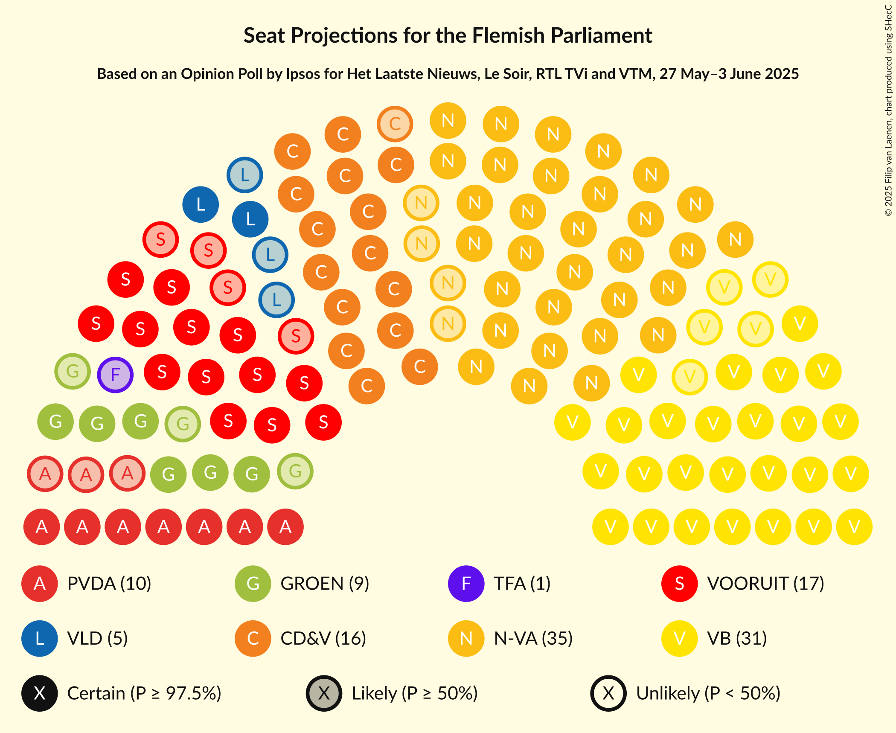
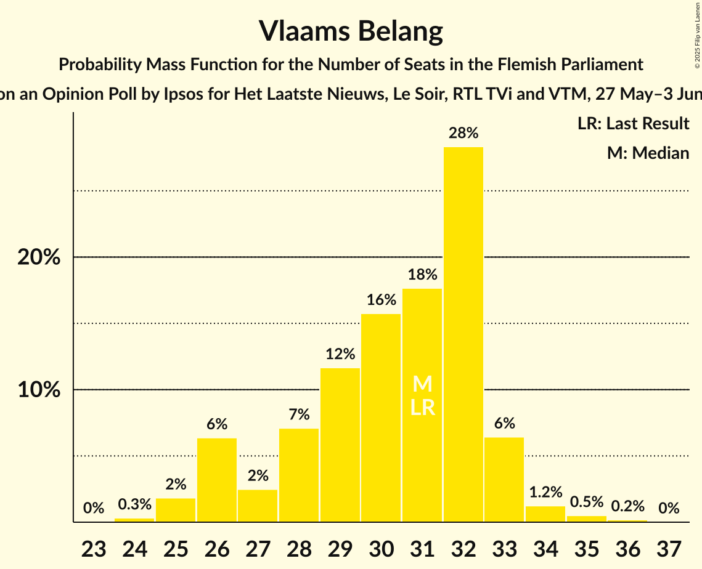
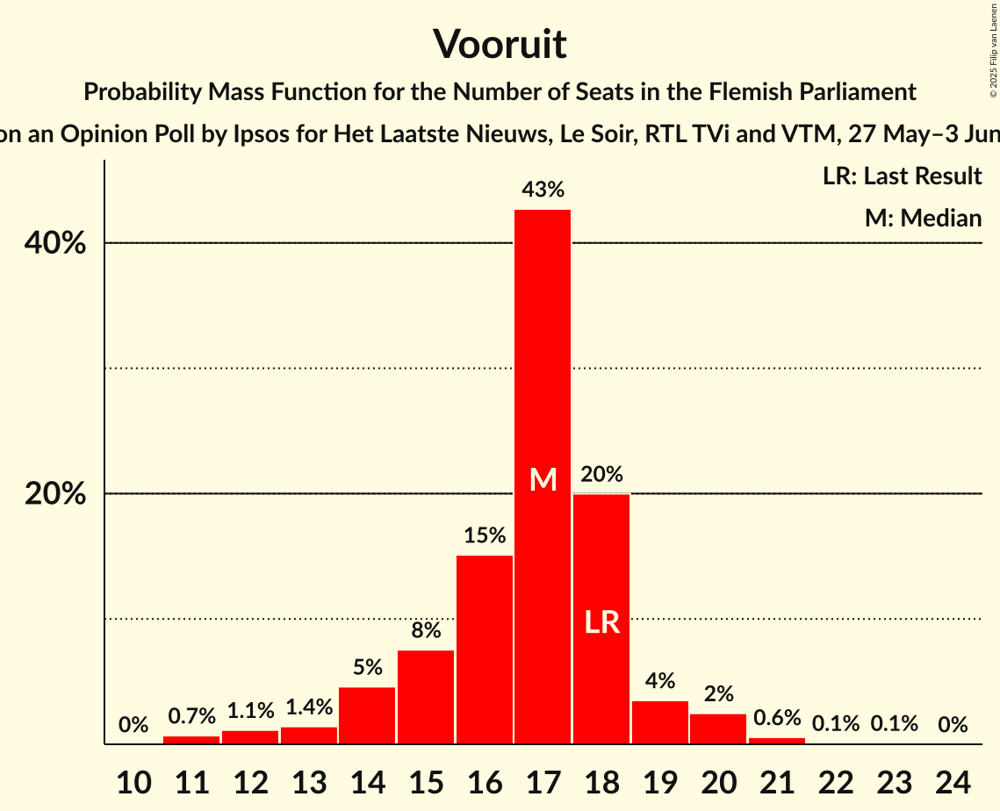

# Opinion Poll by Ipsos for Het Laatste Nieuws, Le Soir, RTL TVi and VTM, 27 May–3 June 2025

<a href="#voting-intentions">Voting Intentions</a> | <a href="#seats">Seats</a> | <a href="#coalitions">Coalitions</a> | <a href="#technical-information">Technical Information</a>

## Voting Intentions

### Confidence Intervals

| Party | Last Result | Poll Result | 80% Confidence Interval | 90% Confidence Interval | 95% Confidence Interval | 99% Confidence Interval |
|:-----:|:-----------:|:-----------:|:-----------------------:|:-----------------------:|:-----------------------:|:-----------------------:|
| Nieuw-Vlaamse Alliantie | 23.9% | 26.3% | 24.6–28.2% |24.1–28.7% |23.7–29.1% |22.8–30.0% |
| Vlaams Belang | 22.7% | 22.8% | 21.2–24.6% |20.7–25.1% |20.3–25.5% |19.5–26.4% |
| Christen-Democratisch en Vlaams | 13.0% | 14.5% | 13.2–16.0% |12.8–16.4% |12.5–16.8% |11.8–17.6% |
| Vooruit | 13.8% | 13.4% | 12.1–14.9% |11.7–15.3% |11.4–15.7% |10.8–16.4% |
| Partij van de Arbeid van België | 8.3% | 8.9% | 7.8–10.2% |7.5–10.5% |7.3–10.8% |6.8–11.5% |
| Groen | 7.3% | 7.4% | 6.4–8.6% |6.2–8.9% |5.9–9.2% |5.5–9.8% |
| Open Vlaamse Liberalen en Democraten | 8.3% | 6.1% | 5.2–7.2% |5.0–7.5% |4.8–7.8% |4.4–8.3% |
| Team Fouad Ahidar | 0.3% | 0.2% | 0.1–0.5% |0.1–0.6% |0.1–0.7% |0.0–0.9% |

*Note:* The poll result column reflects the actual value used in the calculations. Published results may vary slightly, and in addition be rounded to fewer digits.

## Seats

### Confidence Intervals

| Party | Last Result | Median | 80% Confidence Interval | 90% Confidence Interval | 95% Confidence Interval | 99% Confidence Interval |
|:-----:|:-----------:|:------:|:-----------------------:|:-----------------------:|:-----------------------:|:-----------------------:|
| <a href="#nieuw-vlaamse-alliantie">Nieuw-Vlaamse Alliantie</a> | 31 | 35 | 33–36 |33–38 |32–38 |31–40 |
| <a href="#vlaams-belang">Vlaams Belang</a> | 31 | 30 | 29–31 |29–31 |26–32 |25–35 |
| <a href="#christen-democratisch-en-vlaams">Christen-Democratisch en Vlaams</a> | 16 | 18 | 17–19 |16–19 |16–20 |15–22 |
| <a href="#vooruit">Vooruit</a> | 18 | 17 | 17–19 |15–19 |14–20 |13–20 |
| <a href="#partij-van-de-arbeid-van-belgië">Partij van de Arbeid van België</a> | 9 | 7 | 7–10 |7–10 |7–11 |7–14 |
| <a href="#groen">Groen</a> | 9 | 9 | 6–11 |6–11 |6–11 |5–12 |
| <a href="#open-vlaamse-liberalen-en-democraten">Open Vlaamse Liberalen en Democraten</a> | 9 | 5 | 3–6 |2–6 |2–9 |2–9 |
| <a href="#team-fouad-ahidar">Team Fouad Ahidar</a> | 1 | 1 | 1–2 |1–2 |0–2 |0–3 |

### Nieuw-Vlaamse Alliantie

*For a full overview of the results for this party, see the [Nieuw-Vlaamse Alliantie](party-nieuw-vlaamsealliantie.html) page.*

| Number of Seats | Probability | Accumulated | Special Marks |
|:---------------:|:-----------:|:-----------:|:-------------:|
| 28 | 0.1% | 100% |  |
| 29 | 0% | 99.9% |  |
| 30 | 0.3% | 99.9% |  |
| 31 | 0.7% | 99.6% | Last Result |
| 32 | 3% | 98.9% |  |
| 33 | 6% | 96% |  |
| 34 | 37% | 90% |  |
| 35 | 18% | 53% | Median |
| 36 | 28% | 34% |  |
| 37 | 0.5% | 6% |  |
| 38 | 4% | 6% |  |
| 39 | 1.4% | 2% |  |
| 40 | 0.6% | 0.7% |  |
| 41 | 0.1% | 0.1% |  |
| 42 | 0% | 0% |  |

### Vlaams Belang

*For a full overview of the results for this party, see the [Vlaams Belang](party-vlaamsbelang.html) page.*

| Number of Seats | Probability | Accumulated | Special Marks |
|:---------------:|:-----------:|:-----------:|:-------------:|
| 23 | 0% | 100% |  |
| 24 | 0.1% | 99.9% |  |
| 25 | 2% | 99.8% |  |
| 26 | 0.9% | 98% |  |
| 27 | 0.3% | 97% |  |
| 28 | 2% | 97% |  |
| 29 | 28% | 95% |  |
| 30 | 21% | 67% | Median |
| 31 | 44% | 47% | Last Result |
| 32 | 2% | 3% |  |
| 33 | 0.1% | 1.0% |  |
| 34 | 0.2% | 0.9% |  |
| 35 | 0.6% | 0.7% |  |
| 36 | 0% | 0.1% |  |
| 37 | 0% | 0% |  |

### Christen-Democratisch en Vlaams

*For a full overview of the results for this party, see the [Christen-Democratisch en Vlaams](party-christen-democratischenvlaams.html) page.*

| Number of Seats | Probability | Accumulated | Special Marks |
|:---------------:|:-----------:|:-----------:|:-------------:|
| 13 | 0% | 100% |  |
| 14 | 0.4% | 99.9% |  |
| 15 | 0.2% | 99.6% |  |
| 16 | 7% | 99.4% | Last Result |
| 17 | 17% | 92% |  |
| 18 | 37% | 75% | Median |
| 19 | 35% | 38% |  |
| 20 | 1.1% | 3% |  |
| 21 | 1.4% | 2% |  |
| 22 | 0.4% | 0.5% |  |
| 23 | 0.1% | 0.1% |  |
| 24 | 0% | 0% |  |

### Vooruit

*For a full overview of the results for this party, see the [Vooruit](party-vooruit.html) page.*

| Number of Seats | Probability | Accumulated | Special Marks |
|:---------------:|:-----------:|:-----------:|:-------------:|
| 11 | 0.3% | 100% |  |
| 12 | 0.1% | 99.7% |  |
| 13 | 0.3% | 99.6% |  |
| 14 | 3% | 99.2% |  |
| 15 | 2% | 96% |  |
| 16 | 3% | 95% |  |
| 17 | 70% | 92% | Median |
| 18 | 6% | 22% | Last Result |
| 19 | 12% | 16% |  |
| 20 | 4% | 4% |  |
| 21 | 0% | 0.1% |  |
| 22 | 0% | 0.1% |  |
| 23 | 0.1% | 0.1% |  |
| 24 | 0% | 0% |  |

### Partij van de Arbeid van België

*For a full overview of the results for this party, see the [Partij van de Arbeid van België](party-partijvandearbeidvanbelgië.html) page.*

| Number of Seats | Probability | Accumulated | Special Marks |
|:---------------:|:-----------:|:-----------:|:-------------:|
| 6 | 0.4% | 100% |  |
| 7 | 69% | 99.6% | Median |
| 8 | 0.3% | 31% |  |
| 9 | 0.3% | 30% | Last Result |
| 10 | 25% | 30% |  |
| 11 | 3% | 5% |  |
| 12 | 0.8% | 2% |  |
| 13 | 0.9% | 1.5% |  |
| 14 | 0.4% | 0.6% |  |
| 15 | 0.2% | 0.2% |  |
| 16 | 0% | 0% |  |

### Groen

*For a full overview of the results for this party, see the [Groen](party-groen.html) page.*

| Number of Seats | Probability | Accumulated | Special Marks |
|:---------------:|:-----------:|:-----------:|:-------------:|
| 3 | 0.1% | 100% |  |
| 4 | 0.3% | 99.9% |  |
| 5 | 0.3% | 99.6% |  |
| 6 | 15% | 99.3% |  |
| 7 | 4% | 84% |  |
| 8 | 0.7% | 80% |  |
| 9 | 33% | 79% | Last Result, Median |
| 10 | 8% | 46% |  |
| 11 | 37% | 38% |  |
| 12 | 0.9% | 1.2% |  |
| 13 | 0.2% | 0.4% |  |
| 14 | 0.1% | 0.2% |  |
| 15 | 0.1% | 0.1% |  |
| 16 | 0% | 0% |  |

### Open Vlaamse Liberalen en Democraten

*For a full overview of the results for this party, see the [Open Vlaamse Liberalen en Democraten](party-openvlaamseliberalenendemocraten.html) page.*

| Number of Seats | Probability | Accumulated | Special Marks |
|:---------------:|:-----------:|:-----------:|:-------------:|
| 1 | 0.1% | 100% |  |
| 2 | 9% | 99.9% |  |
| 3 | 1.4% | 91% |  |
| 4 | 0.2% | 90% |  |
| 5 | 76% | 90% | Median |
| 6 | 9% | 14% |  |
| 7 | 2% | 5% |  |
| 8 | 0% | 3% |  |
| 9 | 3% | 3% | Last Result |
| 10 | 0% | 0.1% |  |
| 11 | 0% | 0.1% |  |
| 12 | 0% | 0% |  |

### Team Fouad Ahidar

*For a full overview of the results for this party, see the [Team Fouad Ahidar](party-teamfouadahidar.html) page.*

| Number of Seats | Probability | Accumulated | Special Marks |
|:---------------:|:-----------:|:-----------:|:-------------:|
| 0 | 3% | 100% |  |
| 1 | 47% | 97% | Last Result, Median |
| 2 | 48% | 50% |  |
| 3 | 2% | 2% |  |
| 4 | 0.3% | 0.4% |  |
| 5 | 0% | 0% |  |

## Coalitions

### Confidence Intervals

| Coalition | Last Result | Median | Majority? | 80% Confidence Interval | 90% Confidence Interval | 95% Confidence Interval | 99% Confidence Interval |
|:---------:|:-----------:|:------:|:---------:|:-----------------------:|:-----------------------:|:-----------------------:|:-----------------------:|
| Nieuw-Vlaamse Alliantie – Vlaams Belang – Christen-Democratisch en Vlaams | 78 | 83 | 100% | 81–85 | 79–85 | 79–86 | 77–89 |
| Nieuw-Vlaamse Alliantie – Christen-Democratisch en Vlaams – Vooruit – Open Vlaamse Liberalen en Democraten | 74 | 75 | 100% | 74–77 | 73–77 | 72–78 | 69–79 |
| Nieuw-Vlaamse Alliantie – Christen-Democratisch en Vlaams – Vooruit | 65 | 70 | 99.9% | 69–72 | 68–72 | 67–72 | 64–76 |
| Nieuw-Vlaamse Alliantie – Vlaams Belang | 62 | 65 | 97% | 63–66 | 63–66 | 62–68 | 59–71 |
| Nieuw-Vlaamse Alliantie – Christen-Democratisch en Vlaams – Open Vlaamse Liberalen en Democraten | 56 | 57 | 0.4% | 56–60 | 55–60 | 55–61 | 52–62 |
| Nieuw-Vlaamse Alliantie – Vooruit – Open Vlaamse Liberalen en Democraten | 58 | 58 | 0.4% | 56–59 | 54–59 | 53–59 | 51–62 |
| Christen-Democratisch en Vlaams – Vooruit – Partij van de Arbeid van België – Groen | 52 | 53 | 0% | 52–54 | 51–55 | 48–57 | 47–59 |
| Nieuw-Vlaamse Alliantie – Christen-Democratisch en Vlaams | 47 | 52 | 0% | 52–55 | 49–55 | 49–56 | 47–58 |
| Christen-Democratisch en Vlaams – Vooruit – Groen – Open Vlaamse Liberalen en Democraten | 52 | 50 | 0% | 47–51 | 46–52 | 44–52 | 41–54 |
| Christen-Democratisch en Vlaams – Vooruit – Groen | 43 | 45 | 0% | 42–46 | 41–46 | 39–46 | 38–49 |
| Nieuw-Vlaamse Alliantie – Open Vlaamse Liberalen en Democraten | 40 | 39 | 0% | 39–41 | 37–42 | 37–44 | 35–46 |
| Christen-Democratisch en Vlaams – Vooruit – Open Vlaamse Liberalen en Democraten | 43 | 40 | 0% | 38–41 | 37–42 | 36–44 | 34–44 |
| Christen-Democratisch en Vlaams – Vooruit | 34 | 36 | 0% | 35–36 | 32–36 | 31–37 | 30–39 |
| Vooruit – Groen – Open Vlaamse Liberalen en Democraten | 36 | 31 | 0% | 28–33 | 27–35 | 27–36 | 25–36 |
| Christen-Democratisch en Vlaams – Groen – Open Vlaamse Liberalen en Democraten | 34 | 33 | 0% | 28–34 | 28–34 | 28–34 | 26–37 |
| Vooruit – Open Vlaamse Liberalen en Democraten | 27 | 22 | 0% | 20–24 | 19–26 | 19–27 | 17–27 |
| Christen-Democratisch en Vlaams – Open Vlaamse Liberalen en Democraten | 25 | 23 | 0% | 22–24 | 21–25 | 20–26 | 18–26 |

### Nieuw-Vlaamse Alliantie – Vlaams Belang – Christen-Democratisch en Vlaams

| Number of Seats | Probability | Accumulated | Special Marks |
|:---------------:|:-----------:|:-----------:|:-------------:|
| 74 | 0.1% | 100% |  |
| 75 | 0.1% | 99.9% |  |
| 76 | 0.3% | 99.8% |  |
| 77 | 0.1% | 99.5% |  |
| 78 | 0.5% | 99.4% | Last Result |
| 79 | 5% | 98.9% |  |
| 80 | 3% | 93% |  |
| 81 | 1.1% | 90% |  |
| 82 | 12% | 89% |  |
| 83 | 37% | 77% | Median |
| 84 | 29% | 40% |  |
| 85 | 7% | 10% |  |
| 86 | 2% | 3% |  |
| 87 | 0% | 0.9% |  |
| 88 | 0.3% | 0.8% |  |
| 89 | 0.1% | 0.6% |  |
| 90 | 0.5% | 0.5% |  |
| 91 | 0% | 0% |  |

### Nieuw-Vlaamse Alliantie – Christen-Democratisch en Vlaams – Vooruit – Open Vlaamse Liberalen en Democraten

| Number of Seats | Probability | Accumulated | Special Marks |
|:---------------:|:-----------:|:-----------:|:-------------:|
| 66 | 0.1% | 100% |  |
| 67 | 0.3% | 99.9% |  |
| 68 | 0% | 99.6% |  |
| 69 | 0.2% | 99.6% |  |
| 70 | 0.7% | 99.3% |  |
| 71 | 0.7% | 98.7% |  |
| 72 | 0.6% | 98% |  |
| 73 | 6% | 97% |  |
| 74 | 39% | 91% | Last Result |
| 75 | 7% | 52% | Median |
| 76 | 15% | 45% |  |
| 77 | 28% | 31% |  |
| 78 | 1.0% | 3% |  |
| 79 | 1.4% | 2% |  |
| 80 | 0.1% | 0.2% |  |
| 81 | 0.1% | 0.1% |  |
| 82 | 0% | 0% |  |

### Nieuw-Vlaamse Alliantie – Christen-Democratisch en Vlaams – Vooruit

| Number of Seats | Probability | Accumulated | Special Marks |
|:---------------:|:-----------:|:-----------:|:-------------:|
| 61 | 0.1% | 100% |  |
| 62 | 0.1% | 99.9% |  |
| 63 | 0.3% | 99.9% | Majority |
| 64 | 0.2% | 99.6% |  |
| 65 | 0.5% | 99.4% | Last Result |
| 66 | 0.5% | 99.0% |  |
| 67 | 3% | 98% |  |
| 68 | 2% | 95% |  |
| 69 | 43% | 93% |  |
| 70 | 1.3% | 50% | Median |
| 71 | 18% | 49% |  |
| 72 | 29% | 31% |  |
| 73 | 0.6% | 2% |  |
| 74 | 0.3% | 1.3% |  |
| 75 | 0% | 1.0% |  |
| 76 | 0.9% | 1.0% |  |
| 77 | 0% | 0% |  |

### Nieuw-Vlaamse Alliantie – Vlaams Belang

| Number of Seats | Probability | Accumulated | Special Marks |
|:---------------:|:-----------:|:-----------:|:-------------:|
| 57 | 0.1% | 100% |  |
| 58 | 0.3% | 99.8% |  |
| 59 | 0.2% | 99.6% |  |
| 60 | 2% | 99.3% |  |
| 61 | 0.1% | 98% |  |
| 62 | 0.6% | 98% | Last Result |
| 63 | 7% | 97% | Majority |
| 64 | 0.8% | 90% |  |
| 65 | 78% | 89% | Median |
| 66 | 6% | 11% |  |
| 67 | 0.3% | 4% |  |
| 68 | 3% | 4% |  |
| 69 | 1.0% | 2% |  |
| 70 | 0% | 0.7% |  |
| 71 | 0.3% | 0.6% |  |
| 72 | 0% | 0.3% |  |
| 73 | 0% | 0.3% |  |
| 74 | 0.3% | 0.3% |  |
| 75 | 0% | 0% |  |

### Nieuw-Vlaamse Alliantie – Christen-Democratisch en Vlaams – Open Vlaamse Liberalen en Democraten

| Number of Seats | Probability | Accumulated | Special Marks |
|:---------------:|:-----------:|:-----------:|:-------------:|
| 50 | 0.3% | 100% |  |
| 51 | 0% | 99.6% |  |
| 52 | 0.4% | 99.6% |  |
| 53 | 1.0% | 99.2% |  |
| 54 | 0.2% | 98% |  |
| 55 | 4% | 98% |  |
| 56 | 5% | 94% | Last Result |
| 57 | 48% | 89% |  |
| 58 | 7% | 41% | Median |
| 59 | 0.7% | 34% |  |
| 60 | 28% | 33% |  |
| 61 | 4% | 5% |  |
| 62 | 0.9% | 1.2% |  |
| 63 | 0.2% | 0.4% | Majority |
| 64 | 0% | 0.1% |  |
| 65 | 0.1% | 0.1% |  |
| 66 | 0% | 0% |  |

### Nieuw-Vlaamse Alliantie – Vooruit – Open Vlaamse Liberalen en Democraten

| Number of Seats | Probability | Accumulated | Special Marks |
|:---------------:|:-----------:|:-----------:|:-------------:|
| 50 | 0.4% | 100% |  |
| 51 | 0.2% | 99.6% |  |
| 52 | 2% | 99.4% |  |
| 53 | 0.8% | 98% |  |
| 54 | 5% | 97% |  |
| 55 | 2% | 92% |  |
| 56 | 37% | 90% |  |
| 57 | 0.4% | 53% | Median |
| 58 | 32% | 53% | Last Result |
| 59 | 18% | 21% |  |
| 60 | 2% | 2% |  |
| 61 | 0.1% | 0.6% |  |
| 62 | 0.2% | 0.5% |  |
| 63 | 0.3% | 0.4% | Majority |
| 64 | 0.1% | 0.1% |  |
| 65 | 0% | 0% |  |

### Christen-Democratisch en Vlaams – Vooruit – Partij van de Arbeid van België – Groen

| Number of Seats | Probability | Accumulated | Special Marks |
|:---------------:|:-----------:|:-----------:|:-------------:|
| 45 | 0% | 100% |  |
| 46 | 0.3% | 99.9% |  |
| 47 | 0.2% | 99.6% |  |
| 48 | 2% | 99.5% |  |
| 49 | 1.2% | 97% |  |
| 50 | 0.6% | 96% |  |
| 51 | 4% | 96% | Median |
| 52 | 39% | 92% | Last Result |
| 53 | 42% | 53% |  |
| 54 | 1.5% | 11% |  |
| 55 | 5% | 9% |  |
| 56 | 2% | 5% |  |
| 57 | 2% | 3% |  |
| 58 | 0.3% | 1.1% |  |
| 59 | 0.5% | 0.8% |  |
| 60 | 0.2% | 0.3% |  |
| 61 | 0% | 0% |  |

### Nieuw-Vlaamse Alliantie – Christen-Democratisch en Vlaams

| Number of Seats | Probability | Accumulated | Special Marks |
|:---------------:|:-----------:|:-----------:|:-------------:|
| 46 | 0.3% | 100% |  |
| 47 | 0.2% | 99.7% | Last Result |
| 48 | 0.5% | 99.4% |  |
| 49 | 7% | 99.0% |  |
| 50 | 0.9% | 92% |  |
| 51 | 0.8% | 92% |  |
| 52 | 49% | 91% |  |
| 53 | 0.6% | 41% | Median |
| 54 | 6% | 41% |  |
| 55 | 31% | 34% |  |
| 56 | 2% | 4% |  |
| 57 | 0.2% | 2% |  |
| 58 | 1.1% | 1.4% |  |
| 59 | 0.2% | 0.3% |  |
| 60 | 0.1% | 0.1% |  |
| 61 | 0% | 0% |  |

### Christen-Democratisch en Vlaams – Vooruit – Groen – Open Vlaamse Liberalen en Democraten

| Number of Seats | Probability | Accumulated | Special Marks |
|:---------------:|:-----------:|:-----------:|:-------------:|
| 39 | 0.1% | 100% |  |
| 40 | 0.1% | 99.9% |  |
| 41 | 0.4% | 99.8% |  |
| 42 | 0.2% | 99.4% |  |
| 43 | 0.2% | 99.2% |  |
| 44 | 2% | 99.1% |  |
| 45 | 2% | 97% |  |
| 46 | 2% | 95% |  |
| 47 | 16% | 93% |  |
| 48 | 4% | 77% |  |
| 49 | 0.5% | 73% | Median |
| 50 | 30% | 73% |  |
| 51 | 36% | 42% |  |
| 52 | 4% | 6% | Last Result |
| 53 | 0.1% | 2% |  |
| 54 | 1.3% | 2% |  |
| 55 | 0.2% | 0.4% |  |
| 56 | 0% | 0.1% |  |
| 57 | 0% | 0.1% |  |
| 58 | 0.1% | 0.1% |  |
| 59 | 0% | 0% |  |

### Christen-Democratisch en Vlaams – Vooruit – Groen

| Number of Seats | Probability | Accumulated | Special Marks |
|:---------------:|:-----------:|:-----------:|:-------------:|
| 35 | 0.1% | 100% |  |
| 36 | 0% | 99.9% |  |
| 37 | 0.1% | 99.9% |  |
| 38 | 2% | 99.7% |  |
| 39 | 0.9% | 98% |  |
| 40 | 1.0% | 97% |  |
| 41 | 3% | 96% |  |
| 42 | 14% | 92% |  |
| 43 | 0.6% | 79% | Last Result |
| 44 | 2% | 78% | Median |
| 45 | 32% | 76% |  |
| 46 | 42% | 44% |  |
| 47 | 1.4% | 2% |  |
| 48 | 0.2% | 0.7% |  |
| 49 | 0.1% | 0.6% |  |
| 50 | 0.3% | 0.5% |  |
| 51 | 0.1% | 0.1% |  |
| 52 | 0% | 0% |  |

### Nieuw-Vlaamse Alliantie – Open Vlaamse Liberalen en Democraten

| Number of Seats | Probability | Accumulated | Special Marks |
|:---------------:|:-----------:|:-----------:|:-------------:|
| 33 | 0.4% | 100% |  |
| 34 | 0.1% | 99.6% |  |
| 35 | 0.6% | 99.5% |  |
| 36 | 0.5% | 99.0% |  |
| 37 | 6% | 98% |  |
| 38 | 0.2% | 92% |  |
| 39 | 42% | 92% |  |
| 40 | 13% | 50% | Last Result, Median |
| 41 | 31% | 37% |  |
| 42 | 3% | 6% |  |
| 43 | 0.4% | 4% |  |
| 44 | 2% | 3% |  |
| 45 | 0.3% | 0.8% |  |
| 46 | 0.5% | 0.5% |  |
| 47 | 0% | 0.1% |  |
| 48 | 0% | 0% |  |

### Christen-Democratisch en Vlaams – Vooruit – Open Vlaamse Liberalen en Democraten

| Number of Seats | Probability | Accumulated | Special Marks |
|:---------------:|:-----------:|:-----------:|:-------------:|
| 32 | 0.1% | 100% |  |
| 33 | 0.1% | 99.8% |  |
| 34 | 0.3% | 99.7% |  |
| 35 | 1.3% | 99.4% |  |
| 36 | 1.2% | 98% |  |
| 37 | 3% | 97% |  |
| 38 | 7% | 94% |  |
| 39 | 1.0% | 87% |  |
| 40 | 37% | 86% | Median |
| 41 | 40% | 49% |  |
| 42 | 4% | 9% |  |
| 43 | 0.3% | 5% | Last Result |
| 44 | 4% | 4% |  |
| 45 | 0.1% | 0.3% |  |
| 46 | 0.1% | 0.2% |  |
| 47 | 0% | 0.1% |  |
| 48 | 0% | 0% |  |

### Christen-Democratisch en Vlaams – Vooruit

| Number of Seats | Probability | Accumulated | Special Marks |
|:---------------:|:-----------:|:-----------:|:-------------:|
| 28 | 0% | 100% |  |
| 29 | 0.1% | 99.9% |  |
| 30 | 0.8% | 99.8% |  |
| 31 | 3% | 99.1% |  |
| 32 | 2% | 97% |  |
| 33 | 1.3% | 95% |  |
| 34 | 0.8% | 94% | Last Result |
| 35 | 41% | 93% | Median |
| 36 | 49% | 52% |  |
| 37 | 2% | 3% |  |
| 38 | 0.9% | 1.5% |  |
| 39 | 0.4% | 0.6% |  |
| 40 | 0.1% | 0.2% |  |
| 41 | 0.1% | 0.1% |  |
| 42 | 0% | 0% |  |

### Vooruit – Groen – Open Vlaamse Liberalen en Democraten

| Number of Seats | Probability | Accumulated | Special Marks |
|:---------------:|:-----------:|:-----------:|:-------------:|
| 20 | 0.1% | 100% |  |
| 21 | 0% | 99.9% |  |
| 22 | 0.1% | 99.8% |  |
| 23 | 0% | 99.7% |  |
| 24 | 0% | 99.7% |  |
| 25 | 0.5% | 99.7% |  |
| 26 | 1.2% | 99.2% |  |
| 27 | 3% | 98% |  |
| 28 | 6% | 95% |  |
| 29 | 3% | 89% |  |
| 30 | 12% | 86% |  |
| 31 | 28% | 74% | Median |
| 32 | 1.1% | 47% |  |
| 33 | 39% | 45% |  |
| 34 | 0.8% | 6% |  |
| 35 | 1.3% | 6% |  |
| 36 | 4% | 4% | Last Result |
| 37 | 0.2% | 0.2% |  |
| 38 | 0% | 0% |  |

### Christen-Democratisch en Vlaams – Groen – Open Vlaamse Liberalen en Democraten

| Number of Seats | Probability | Accumulated | Special Marks |
|:---------------:|:-----------:|:-----------:|:-------------:|
| 24 | 0.3% | 100% |  |
| 25 | 0.2% | 99.7% |  |
| 26 | 0.1% | 99.5% |  |
| 27 | 0.1% | 99.4% |  |
| 28 | 14% | 99.3% |  |
| 29 | 1.1% | 86% |  |
| 30 | 7% | 85% |  |
| 31 | 0.4% | 77% |  |
| 32 | 9% | 77% | Median |
| 33 | 29% | 68% |  |
| 34 | 36% | 39% | Last Result |
| 35 | 0.6% | 2% |  |
| 36 | 1.4% | 2% |  |
| 37 | 0.2% | 0.5% |  |
| 38 | 0.2% | 0.3% |  |
| 39 | 0% | 0.1% |  |
| 40 | 0% | 0.1% |  |
| 41 | 0.1% | 0.1% |  |
| 42 | 0% | 0% |  |

### Vooruit – Open Vlaamse Liberalen en Democraten

| Number of Seats | Probability | Accumulated | Special Marks |
|:---------------:|:-----------:|:-----------:|:-------------:|
| 14 | 0.2% | 100% |  |
| 15 | 0.1% | 99.8% |  |
| 16 | 0.2% | 99.7% |  |
| 17 | 1.3% | 99.5% |  |
| 18 | 0.2% | 98% |  |
| 19 | 6% | 98% |  |
| 20 | 4% | 92% |  |
| 21 | 0.6% | 87% |  |
| 22 | 66% | 87% | Median |
| 23 | 0.6% | 21% |  |
| 24 | 12% | 20% |  |
| 25 | 1.5% | 9% |  |
| 26 | 4% | 7% |  |
| 27 | 3% | 3% | Last Result |
| 28 | 0.1% | 0.1% |  |
| 29 | 0% | 0% |  |

### Christen-Democratisch en Vlaams – Open Vlaamse Liberalen en Democraten

| Number of Seats | Probability | Accumulated | Special Marks |
|:---------------:|:-----------:|:-----------:|:-------------:|
| 17 | 0.2% | 100% |  |
| 18 | 1.1% | 99.8% |  |
| 19 | 1.2% | 98.7% |  |
| 20 | 0.7% | 98% |  |
| 21 | 5% | 97% |  |
| 22 | 17% | 92% |  |
| 23 | 41% | 75% | Median |
| 24 | 28% | 34% |  |
| 25 | 2% | 6% | Last Result |
| 26 | 4% | 4% |  |
| 27 | 0.2% | 0.4% |  |
| 28 | 0.1% | 0.3% |  |
| 29 | 0.1% | 0.1% |  |
| 30 | 0% | 0% |  |

## Technical Information

### Opinion Poll

+ **Polling firm:** Ipsos
+ **Commissioner(s):** Het Laatste Nieuws, Le Soir, RTL TVi and VTM
+ **Fieldwork period:** 27 May–3 June 2025

### Calculations

+ **Sample size:** 1000
+ **Simulations done:** 32,768
+ **Error estimate:** 1.97%

