# Opinion Poll by Ipsos for Het Laatste Nieuws, Le Soir, RTL TVi and VTM, 16–23 September 2025

<a href="#voting-intentions">Voting Intentions</a> | <a href="#seats">Seats</a> | <a href="#coalitions">Coalitions</a> | <a href="#technical-information">Technical Information</a>

## Voting Intentions

### Confidence Intervals

| Party | Last Result | Poll Result | 80% Confidence Interval | 90% Confidence Interval | 95% Confidence Interval | 99% Confidence Interval |
|:-----:|:-----------:|:-----------:|:-----------------------:|:-----------------------:|:-----------------------:|:-----------------------:|
| Vlaams Belang | 22.7% | 26.7% | 25.0–28.6% |24.5–29.1% |24.1–29.5% |23.2–30.4% |
| Nieuw-Vlaamse Alliantie | 23.9% | 23.4% | 21.7–25.2% |21.3–25.7% |20.9–26.1% |20.1–27.0% |
| Vooruit | 13.8% | 13.6% | 12.3–15.1% |11.9–15.5% |11.6–15.9% |11.0–16.6% |
| Christen-Democratisch en Vlaams | 13.0% | 13.4% | 12.1–14.9% |11.7–15.3% |11.4–15.7% |10.8–16.4% |
| Partij van de Arbeid van België | 8.3% | 9.1% | 8.0–10.4% |7.7–10.7% |7.5–11.1% |7.0–11.7% |
| Groen | 7.3% | 7.3% | 6.3–8.5% |6.1–8.8% |5.8–9.1% |5.4–9.7% |
| Open Vlaamse Liberalen en Democraten | 8.3% | 5.7% | 4.9–6.8% |4.6–7.1% |4.4–7.3% |4.1–7.9% |
| Team Fouad Ahidar | 0.3% | 0.0% | 0.0–0.2% |0.0–0.3% |0.0–0.4% |0.0–0.5% |

*Note:* The poll result column reflects the actual value used in the calculations. Published results may vary slightly, and in addition be rounded to fewer digits.

## Seats

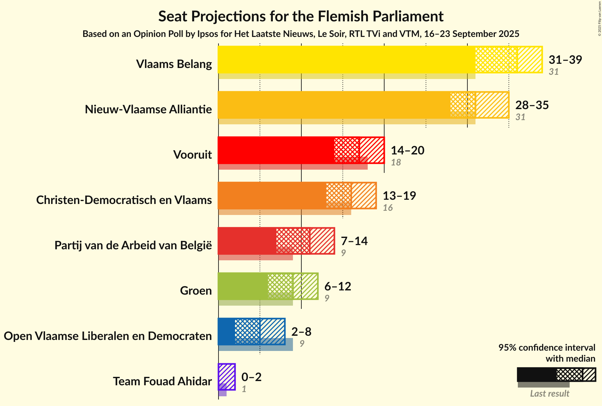

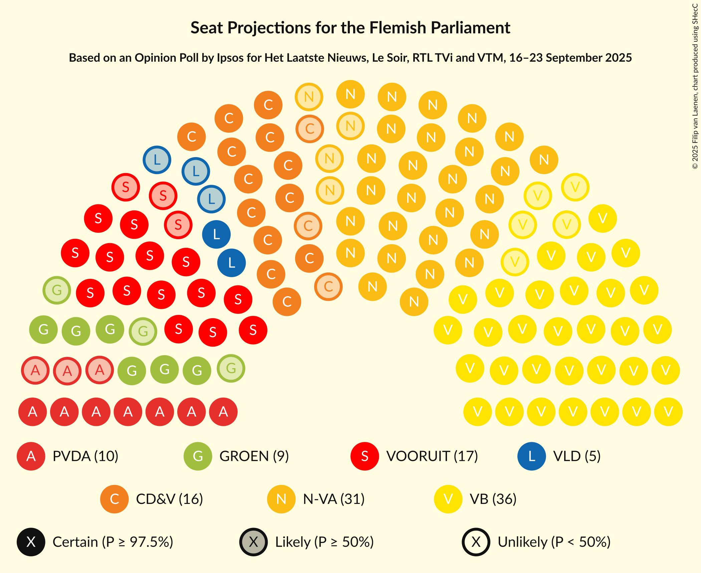

### Confidence Intervals

| Party | Last Result | Median | 80% Confidence Interval | 90% Confidence Interval | 95% Confidence Interval | 99% Confidence Interval |
|:-----:|:-----------:|:------:|:-----------------------:|:-----------------------:|:-----------------------:|:-----------------------:|
| <a href="#vlaams-belang">Vlaams Belang</a> | 31 | 36 | 32–38 |32–39 |31–39 |30–41 |
| <a href="#nieuw-vlaamse-alliantie">Nieuw-Vlaamse Alliantie</a> | 31 | 31 | 29–33 |28–34 |28–35 |25–36 |
| <a href="#vooruit">Vooruit</a> | 18 | 17 | 16–19 |14–19 |14–20 |12–22 |
| <a href="#christen-democratisch-en-vlaams">Christen-Democratisch en Vlaams</a> | 16 | 16 | 14–18 |13–19 |13–19 |12–21 |
| <a href="#partij-van-de-arbeid-van-belgië">Partij van de Arbeid van België</a> | 9 | 11 | 8–13 |7–14 |7–14 |6–14 |
| <a href="#groen">Groen</a> | 9 | 9 | 7–11 |6–12 |6–12 |5–13 |
| <a href="#open-vlaamse-liberalen-en-democraten">Open Vlaamse Liberalen en Democraten</a> | 9 | 5 | 2–6 |2–7 |2–8 |1–8 |
| <a href="#team-fouad-ahidar">Team Fouad Ahidar</a> | 1 | 0 | 0–1 |0–1 |0–2 |0–2 |

### Vlaams Belang

*For a full overview of the results for this party, see the [Vlaams Belang](party-vlaamsbelang.html) page.*

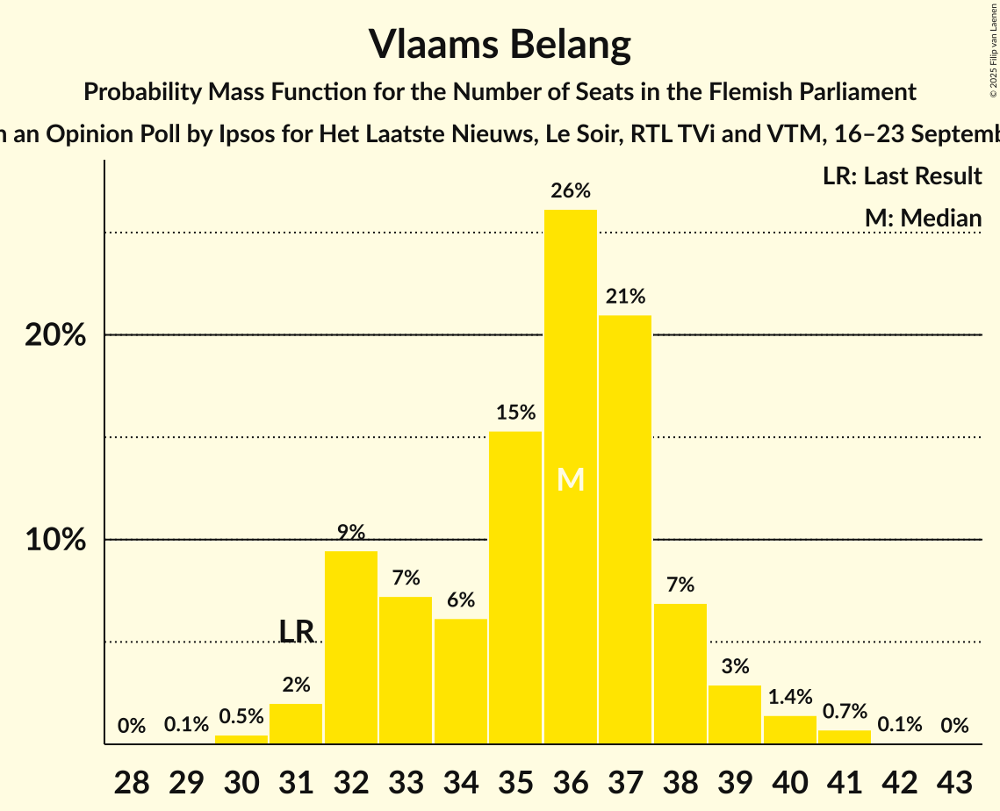

| Number of Seats | Probability | Accumulated | Special Marks |
|:---------------:|:-----------:|:-----------:|:-------------:|
| 29 | 0.1% | 100% |  |
| 30 | 0.5% | 99.9% |  |
| 31 | 2% | 99.4% | Last Result |
| 32 | 9% | 97% |  |
| 33 | 7% | 88% |  |
| 34 | 6% | 81% |  |
| 35 | 15% | 75% |  |
| 36 | 26% | 59% | Median |
| 37 | 21% | 33% |  |
| 38 | 7% | 12% |  |
| 39 | 3% | 5% |  |
| 40 | 1.4% | 2% |  |
| 41 | 0.7% | 0.8% |  |
| 42 | 0.1% | 0.1% |  |
| 43 | 0% | 0% |  |

### Nieuw-Vlaamse Alliantie

*For a full overview of the results for this party, see the [Nieuw-Vlaamse Alliantie](party-nieuw-vlaamsealliantie.html) page.*

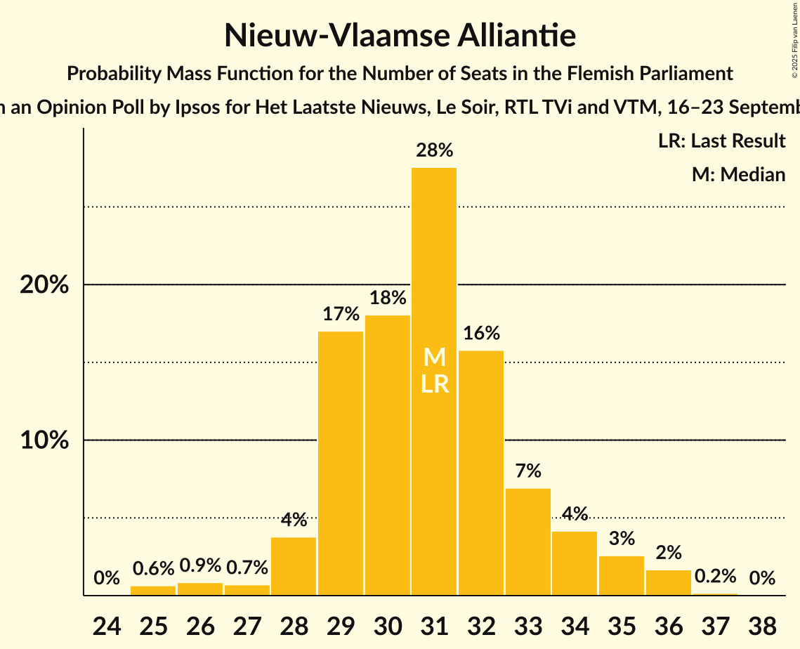

| Number of Seats | Probability | Accumulated | Special Marks |
|:---------------:|:-----------:|:-----------:|:-------------:|
| 25 | 0.6% | 100% |  |
| 26 | 0.9% | 99.3% |  |
| 27 | 0.7% | 98% |  |
| 28 | 4% | 98% |  |
| 29 | 17% | 94% |  |
| 30 | 18% | 77% |  |
| 31 | 28% | 59% | Last Result, Median |
| 32 | 16% | 31% |  |
| 33 | 7% | 16% |  |
| 34 | 4% | 9% |  |
| 35 | 3% | 4% |  |
| 36 | 2% | 2% |  |
| 37 | 0.2% | 0.2% |  |
| 38 | 0% | 0% |  |

### Vooruit

*For a full overview of the results for this party, see the [Vooruit](party-vooruit.html) page.*

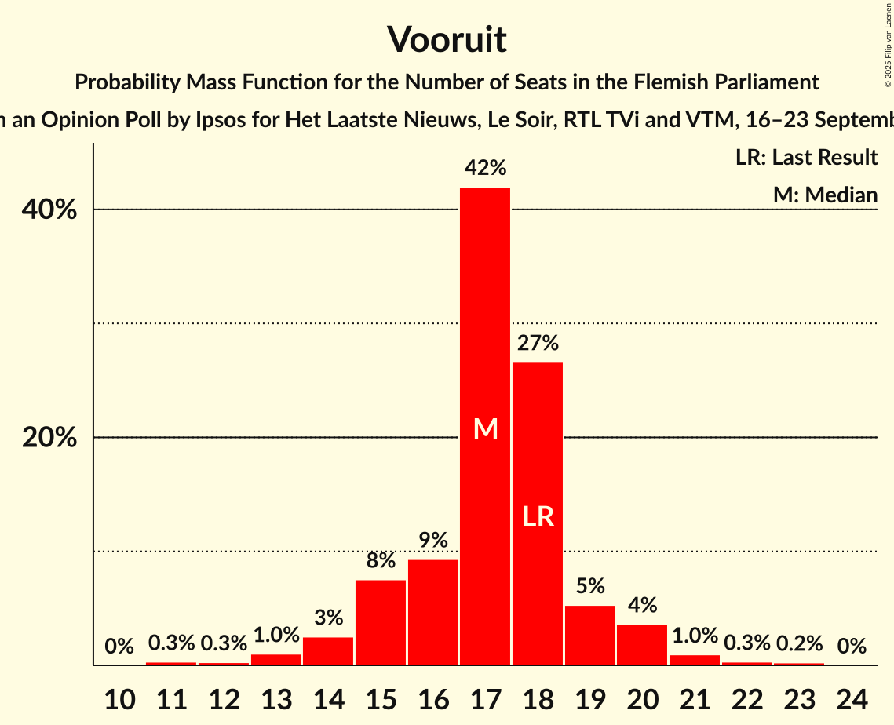

| Number of Seats | Probability | Accumulated | Special Marks |
|:---------------:|:-----------:|:-----------:|:-------------:|
| 11 | 0.2% | 100% |  |
| 12 | 0.5% | 99.8% |  |
| 13 | 0.7% | 99.3% |  |
| 14 | 5% | 98.6% |  |
| 15 | 4% | 94% |  |
| 16 | 8% | 90% |  |
| 17 | 45% | 82% | Median |
| 18 | 25% | 37% | Last Result |
| 19 | 8% | 12% |  |
| 20 | 3% | 4% |  |
| 21 | 1.2% | 2% |  |
| 22 | 0.4% | 0.6% |  |
| 23 | 0.2% | 0.2% |  |
| 24 | 0% | 0% |  |

### Christen-Democratisch en Vlaams

*For a full overview of the results for this party, see the [Christen-Democratisch en Vlaams](party-christen-democratischenvlaams.html) page.*

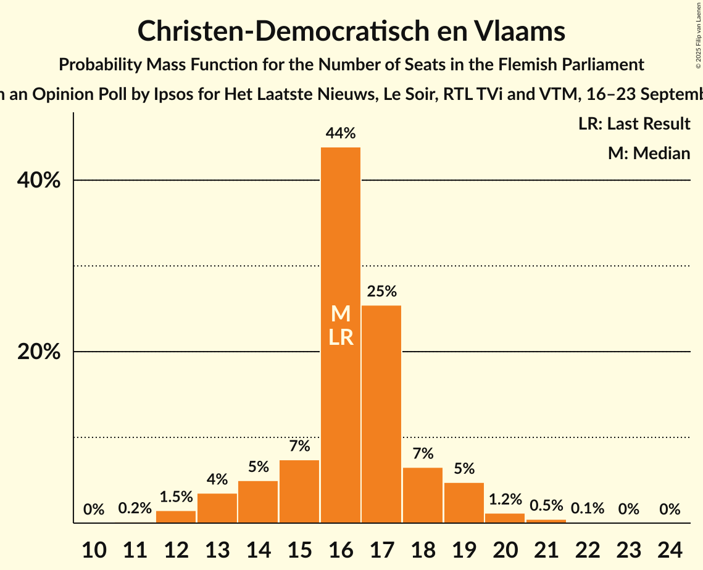

| Number of Seats | Probability | Accumulated | Special Marks |
|:---------------:|:-----------:|:-----------:|:-------------:|
| 11 | 0.2% | 100% |  |
| 12 | 1.5% | 99.8% |  |
| 13 | 4% | 98% |  |
| 14 | 5% | 95% |  |
| 15 | 7% | 90% |  |
| 16 | 44% | 82% | Last Result, Median |
| 17 | 25% | 39% |  |
| 18 | 7% | 13% |  |
| 19 | 5% | 7% |  |
| 20 | 1.2% | 2% |  |
| 21 | 0.5% | 0.7% |  |
| 22 | 0.1% | 0.2% |  |
| 23 | 0% | 0.1% |  |
| 24 | 0% | 0% |  |

### Partij van de Arbeid van België

*For a full overview of the results for this party, see the [Partij van de Arbeid van België](party-partijvandearbeidvanbelgië.html) page.*

| Number of Seats | Probability | Accumulated | Special Marks |
|:---------------:|:-----------:|:-----------:|:-------------:|
| 6 | 0.9% | 100% |  |
| 7 | 9% | 99.1% |  |
| 8 | 6% | 90% |  |
| 9 | 2% | 84% | Last Result |
| 10 | 22% | 82% |  |
| 11 | 30% | 60% | Median |
| 12 | 17% | 29% |  |
| 13 | 7% | 12% |  |
| 14 | 5% | 5% |  |
| 15 | 0.2% | 0.2% |  |
| 16 | 0% | 0.1% |  |
| 17 | 0% | 0% |  |

### Groen

*For a full overview of the results for this party, see the [Groen](party-groen.html) page.*

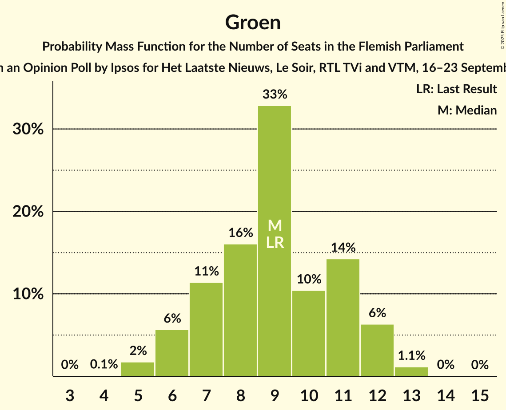

| Number of Seats | Probability | Accumulated | Special Marks |
|:---------------:|:-----------:|:-----------:|:-------------:|
| 4 | 0.1% | 100% |  |
| 5 | 0.9% | 99.9% |  |
| 6 | 5% | 99.0% |  |
| 7 | 11% | 94% |  |
| 8 | 22% | 83% |  |
| 9 | 31% | 61% | Last Result, Median |
| 10 | 8% | 30% |  |
| 11 | 12% | 22% |  |
| 12 | 7% | 9% |  |
| 13 | 2% | 2% |  |
| 14 | 0.1% | 0.1% |  |
| 15 | 0% | 0% |  |

### Open Vlaamse Liberalen en Democraten

*For a full overview of the results for this party, see the [Open Vlaamse Liberalen en Democraten](party-openvlaamseliberalenendemocraten.html) page.*

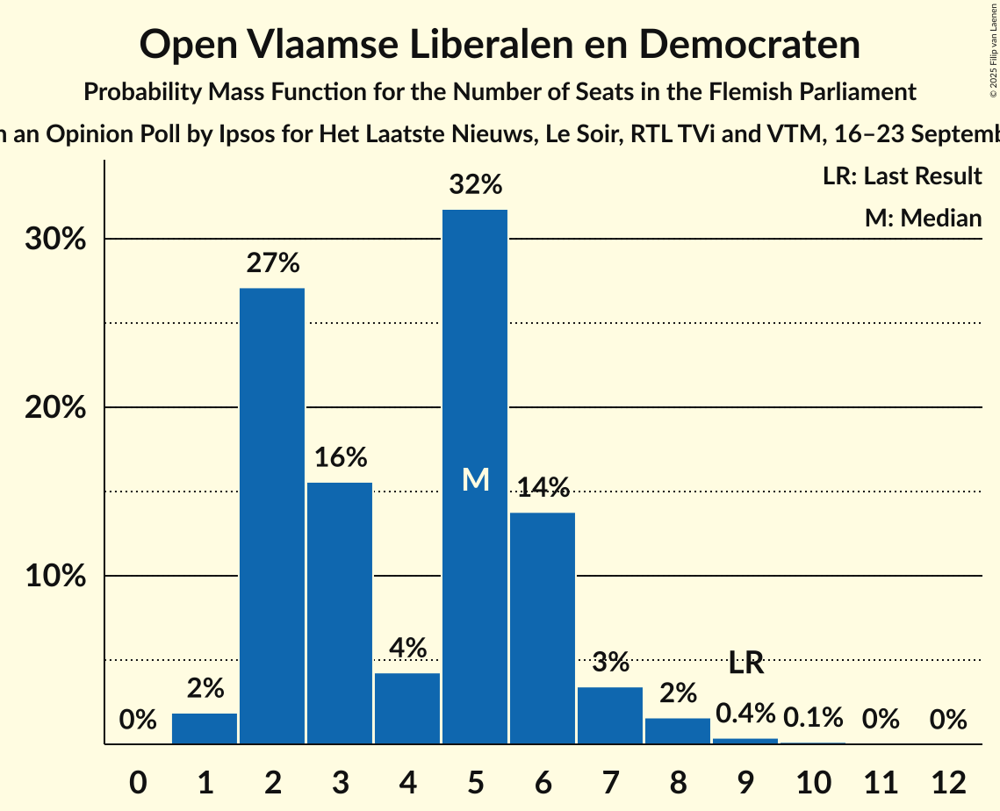

| Number of Seats | Probability | Accumulated | Special Marks |
|:---------------:|:-----------:|:-----------:|:-------------:|
| 1 | 2% | 100% |  |
| 2 | 24% | 98% |  |
| 3 | 9% | 74% |  |
| 4 | 2% | 65% |  |
| 5 | 46% | 63% | Median |
| 6 | 12% | 17% |  |
| 7 | 2% | 6% |  |
| 8 | 3% | 4% |  |
| 9 | 0.3% | 0.5% | Last Result |
| 10 | 0.1% | 0.1% |  |
| 11 | 0% | 0.1% |  |
| 12 | 0% | 0% |  |

### Team Fouad Ahidar

*For a full overview of the results for this party, see the [Team Fouad Ahidar](party-teamfouadahidar.html) page.*

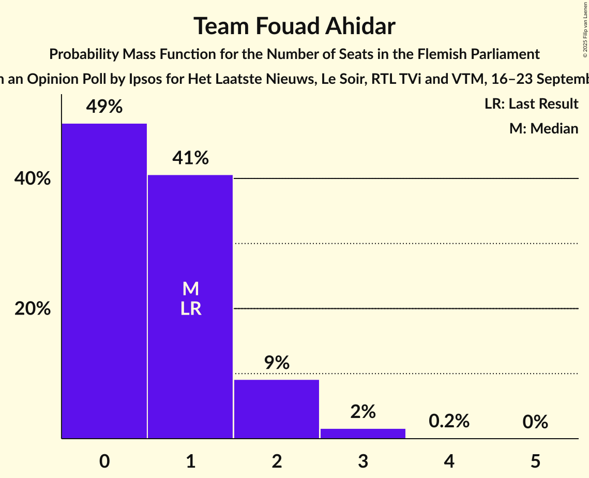

| Number of Seats | Probability | Accumulated | Special Marks |
|:---------------:|:-----------:|:-----------:|:-------------:|
| 0 | 79% | 100% | Median |
| 1 | 18% | 21% | Last Result |
| 2 | 3% | 3% |  |
| 3 | 0.2% | 0.2% |  |
| 4 | 0% | 0% |  |

## Coalitions

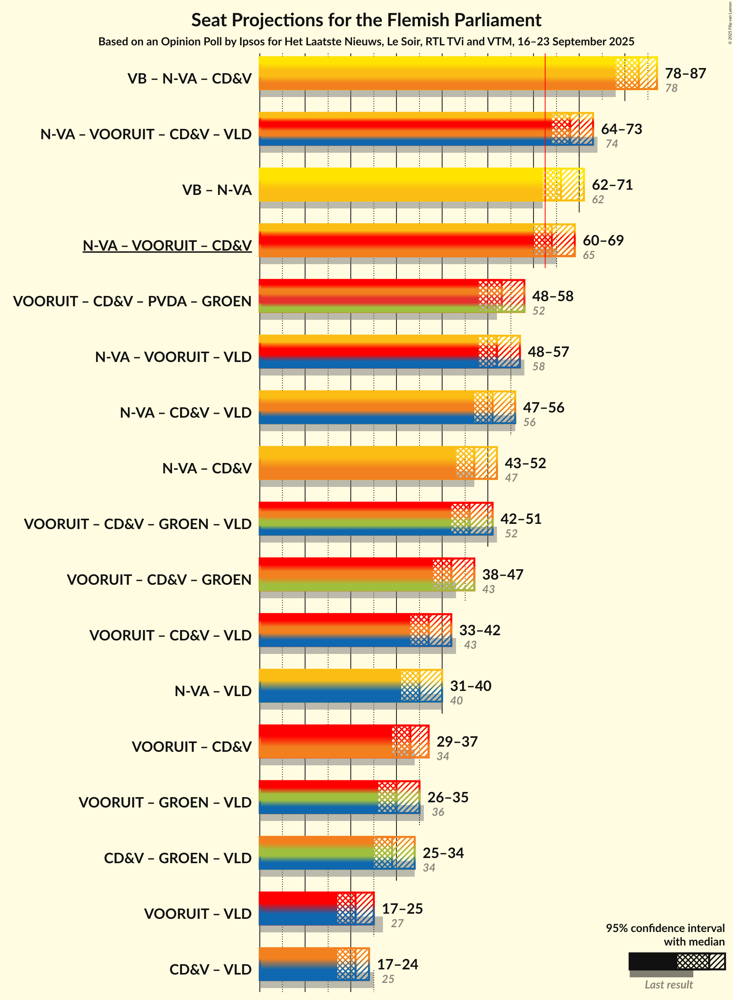

### Confidence Intervals

| Coalition | Last Result | Median | Majority? | 80% Confidence Interval | 90% Confidence Interval | 95% Confidence Interval | 99% Confidence Interval |
|:---------:|:-----------:|:------:|:---------:|:-----------------------:|:-----------------------:|:-----------------------:|:-----------------------:|
| Vlaams Belang – Nieuw-Vlaamse Alliantie – Christen-Democratisch en Vlaams | 78 | 83 | 100% | 79–86 | 79–86 | 78–87 | 77–89 |
| Nieuw-Vlaamse Alliantie – Vooruit – Christen-Democratisch en Vlaams – Open Vlaamse Liberalen en Democraten | 74 | 69 | 99.4% | 66–72 | 65–73 | 64–74 | 62–75 |
| Vlaams Belang – Nieuw-Vlaamse Alliantie | 62 | 67 | 95% | 63–69 | 63–70 | 62–71 | 60–73 |
| Nieuw-Vlaamse Alliantie – Vooruit – Christen-Democratisch en Vlaams | 65 | 64 | 76% | 61–68 | 61–69 | 60–69 | 58–70 |
| Vooruit – Christen-Democratisch en Vlaams – Partij van de Arbeid van België – Groen | 52 | 53 | 0% | 50–56 | 49–57 | 48–58 | 47–59 |
| Nieuw-Vlaamse Alliantie – Vooruit – Open Vlaamse Liberalen en Democraten | 58 | 52 | 0% | 50–55 | 49–57 | 48–58 | 46–59 |
| Nieuw-Vlaamse Alliantie – Christen-Democratisch en Vlaams – Open Vlaamse Liberalen en Democraten | 56 | 51 | 0% | 49–54 | 48–56 | 47–56 | 45–58 |
| Nieuw-Vlaamse Alliantie – Christen-Democratisch en Vlaams | 47 | 47 | 0% | 45–50 | 44–51 | 43–52 | 41–53 |
| Vooruit – Christen-Democratisch en Vlaams – Groen – Open Vlaamse Liberalen en Democraten | 52 | 46 | 0% | 44–50 | 43–51 | 42–52 | 40–53 |
| Vooruit – Christen-Democratisch en Vlaams – Groen | 43 | 42 | 0% | 40–46 | 39–47 | 38–47 | 37–49 |
| Vooruit – Christen-Democratisch en Vlaams – Open Vlaamse Liberalen en Democraten | 43 | 38 | 0% | 35–41 | 34–42 | 33–42 | 31–44 |
| Nieuw-Vlaamse Alliantie – Open Vlaamse Liberalen en Democraten | 40 | 35 | 0% | 32–38 | 32–39 | 31–40 | 29–41 |
| Vooruit – Christen-Democratisch en Vlaams | 34 | 33 | 0% | 31–36 | 30–36 | 29–37 | 28–39 |
| Vooruit – Groen – Open Vlaamse Liberalen en Democraten | 36 | 30 | 0% | 28–34 | 27–35 | 26–35 | 24–37 |
| Christen-Democratisch en Vlaams – Groen – Open Vlaamse Liberalen en Democraten | 34 | 30 | 0% | 27–33 | 26–34 | 25–34 | 24–36 |
| Vooruit – Open Vlaamse Liberalen en Democraten | 27 | 22 | 0% | 19–24 | 18–25 | 18–26 | 16–27 |
| Christen-Democratisch en Vlaams – Open Vlaamse Liberalen en Democraten | 25 | 21 | 0% | 18–23 | 17–24 | 17–24 | 15–26 |

### Vlaams Belang – Nieuw-Vlaamse Alliantie – Christen-Democratisch en Vlaams

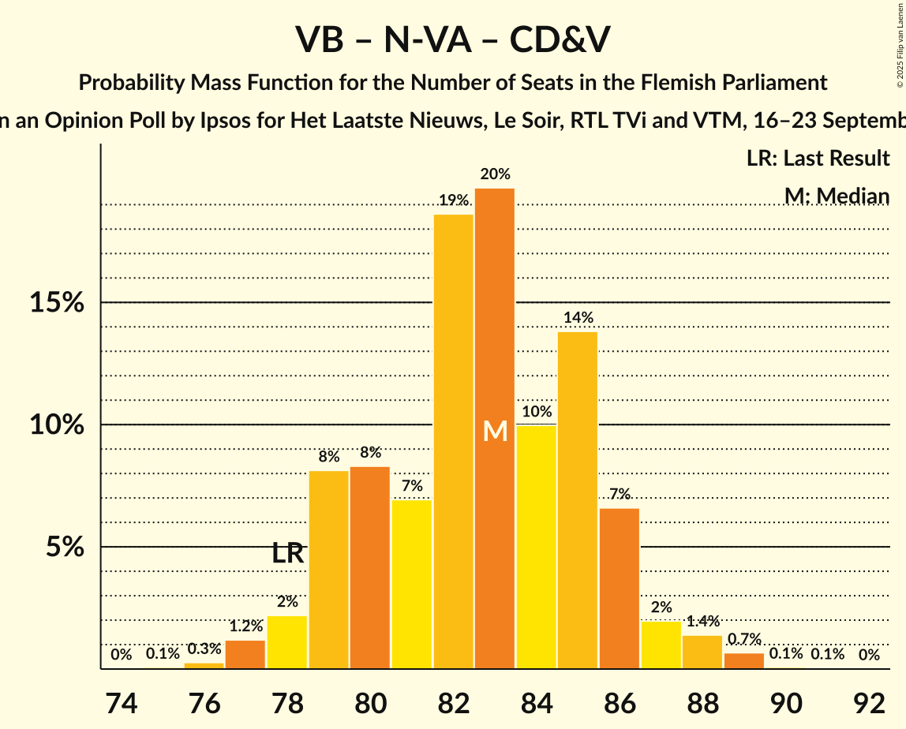

| Number of Seats | Probability | Accumulated | Special Marks |
|:---------------:|:-----------:|:-----------:|:-------------:|
| 75 | 0.1% | 100% |  |
| 76 | 0.3% | 99.9% |  |
| 77 | 1.2% | 99.6% |  |
| 78 | 2% | 98% | Last Result |
| 79 | 8% | 96% |  |
| 80 | 8% | 88% |  |
| 81 | 7% | 80% |  |
| 82 | 19% | 73% |  |
| 83 | 20% | 54% | Median |
| 84 | 10% | 35% |  |
| 85 | 14% | 25% |  |
| 86 | 7% | 11% |  |
| 87 | 2% | 4% |  |
| 88 | 1.4% | 2% |  |
| 89 | 0.7% | 0.8% |  |
| 90 | 0.1% | 0.1% |  |
| 91 | 0.1% | 0.1% |  |
| 92 | 0% | 0% |  |

### Nieuw-Vlaamse Alliantie – Vooruit – Christen-Democratisch en Vlaams – Open Vlaamse Liberalen en Democraten

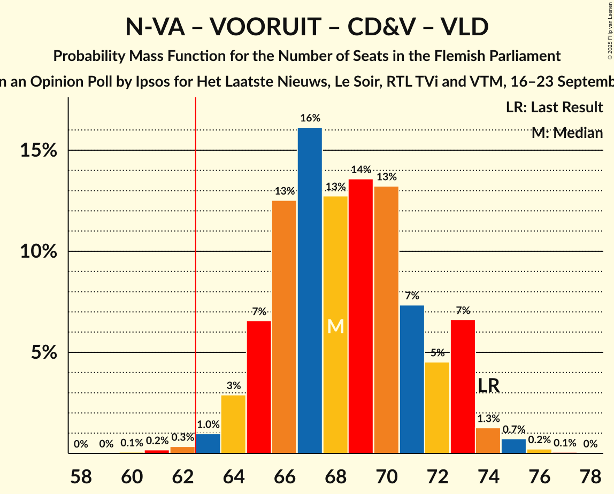

| Number of Seats | Probability | Accumulated | Special Marks |
|:---------------:|:-----------:|:-----------:|:-------------:|
| 60 | 0% | 100% |  |
| 61 | 0.1% | 99.9% |  |
| 62 | 0.4% | 99.8% |  |
| 63 | 0.7% | 99.4% | Majority |
| 64 | 2% | 98.6% |  |
| 65 | 5% | 97% |  |
| 66 | 10% | 92% |  |
| 67 | 19% | 82% |  |
| 68 | 10% | 63% |  |
| 69 | 19% | 53% | Median |
| 70 | 15% | 34% |  |
| 71 | 8% | 19% |  |
| 72 | 5% | 11% |  |
| 73 | 2% | 7% |  |
| 74 | 2% | 4% | Last Result |
| 75 | 2% | 2% |  |
| 76 | 0.4% | 0.5% |  |
| 77 | 0.1% | 0.1% |  |
| 78 | 0% | 0% |  |

### Vlaams Belang – Nieuw-Vlaamse Alliantie

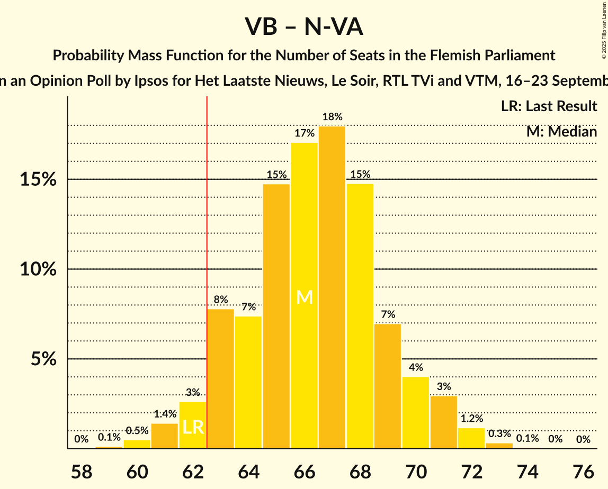

| Number of Seats | Probability | Accumulated | Special Marks |
|:---------------:|:-----------:|:-----------:|:-------------:|
| 59 | 0.1% | 100% |  |
| 60 | 0.5% | 99.8% |  |
| 61 | 2% | 99.4% |  |
| 62 | 3% | 98% | Last Result |
| 63 | 8% | 95% | Majority |
| 64 | 8% | 87% |  |
| 65 | 13% | 80% |  |
| 66 | 15% | 67% |  |
| 67 | 21% | 52% | Median |
| 68 | 14% | 31% |  |
| 69 | 9% | 17% |  |
| 70 | 4% | 8% |  |
| 71 | 2% | 4% |  |
| 72 | 1.4% | 2% |  |
| 73 | 0.5% | 0.5% |  |
| 74 | 0% | 0.1% |  |
| 75 | 0% | 0% |  |

### Nieuw-Vlaamse Alliantie – Vooruit – Christen-Democratisch en Vlaams

| Number of Seats | Probability | Accumulated | Special Marks |
|:---------------:|:-----------:|:-----------:|:-------------:|
| 56 | 0.1% | 100% |  |
| 57 | 0.1% | 99.9% |  |
| 58 | 0.5% | 99.8% |  |
| 59 | 1.2% | 99.3% |  |
| 60 | 3% | 98% |  |
| 61 | 7% | 95% |  |
| 62 | 12% | 88% |  |
| 63 | 11% | 76% | Majority |
| 64 | 17% | 65% | Median |
| 65 | 22% | 49% | Last Result |
| 66 | 10% | 27% |  |
| 67 | 6% | 17% |  |
| 68 | 4% | 10% |  |
| 69 | 4% | 6% |  |
| 70 | 1.4% | 2% |  |
| 71 | 0.3% | 0.5% |  |
| 72 | 0.2% | 0.2% |  |
| 73 | 0% | 0.1% |  |
| 74 | 0% | 0% |  |

### Vooruit – Christen-Democratisch en Vlaams – Partij van de Arbeid van België – Groen

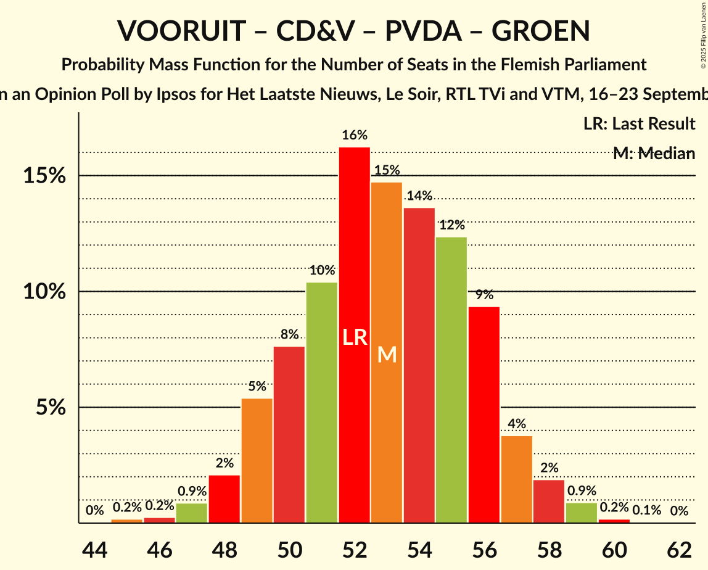

| Number of Seats | Probability | Accumulated | Special Marks |
|:---------------:|:-----------:|:-----------:|:-------------:|
| 45 | 0.1% | 100% |  |
| 46 | 0.3% | 99.9% |  |
| 47 | 0.5% | 99.6% |  |
| 48 | 2% | 99.0% |  |
| 49 | 4% | 97% |  |
| 50 | 6% | 93% |  |
| 51 | 13% | 87% |  |
| 52 | 17% | 74% | Last Result |
| 53 | 15% | 58% | Median |
| 54 | 15% | 43% |  |
| 55 | 9% | 27% |  |
| 56 | 11% | 18% |  |
| 57 | 3% | 7% |  |
| 58 | 2% | 4% |  |
| 59 | 1.2% | 2% |  |
| 60 | 0.2% | 0.3% |  |
| 61 | 0.1% | 0.1% |  |
| 62 | 0% | 0% |  |

### Nieuw-Vlaamse Alliantie – Vooruit – Open Vlaamse Liberalen en Democraten

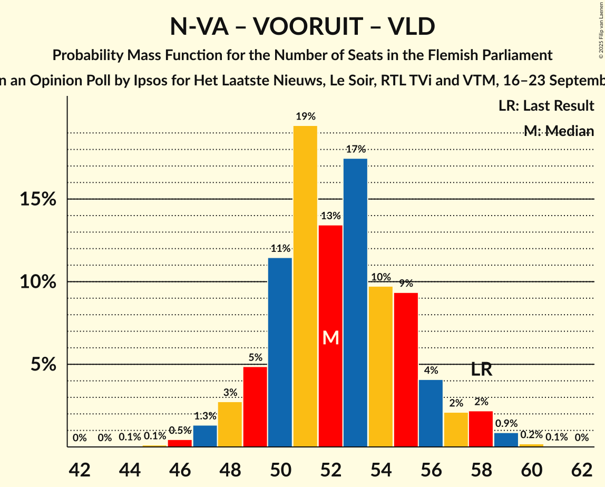

| Number of Seats | Probability | Accumulated | Special Marks |
|:---------------:|:-----------:|:-----------:|:-------------:|
| 44 | 0.1% | 100% |  |
| 45 | 0.1% | 99.9% |  |
| 46 | 0.5% | 99.8% |  |
| 47 | 1.3% | 99.4% |  |
| 48 | 3% | 98% |  |
| 49 | 5% | 95% |  |
| 50 | 11% | 90% |  |
| 51 | 19% | 79% |  |
| 52 | 13% | 60% |  |
| 53 | 17% | 46% | Median |
| 54 | 10% | 29% |  |
| 55 | 9% | 19% |  |
| 56 | 4% | 10% |  |
| 57 | 2% | 5% |  |
| 58 | 2% | 3% | Last Result |
| 59 | 0.9% | 1.1% |  |
| 60 | 0.2% | 0.3% |  |
| 61 | 0.1% | 0.1% |  |
| 62 | 0% | 0% |  |

### Nieuw-Vlaamse Alliantie – Christen-Democratisch en Vlaams – Open Vlaamse Liberalen en Democraten

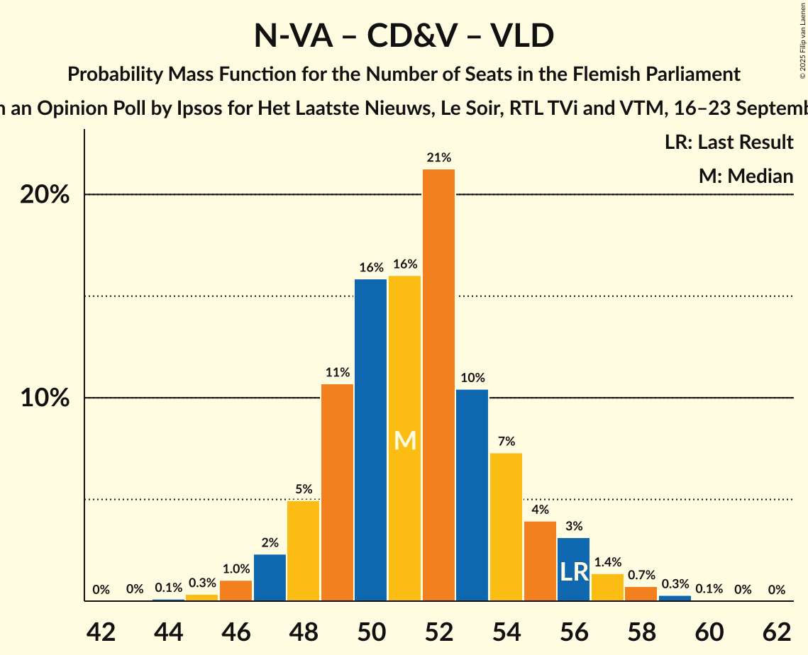

| Number of Seats | Probability | Accumulated | Special Marks |
|:---------------:|:-----------:|:-----------:|:-------------:|
| 43 | 0% | 100% |  |
| 44 | 0.1% | 99.9% |  |
| 45 | 0.3% | 99.8% |  |
| 46 | 1.0% | 99.5% |  |
| 47 | 2% | 98% |  |
| 48 | 5% | 96% |  |
| 49 | 11% | 91% |  |
| 50 | 16% | 80% |  |
| 51 | 16% | 65% |  |
| 52 | 21% | 49% | Median |
| 53 | 10% | 27% |  |
| 54 | 7% | 17% |  |
| 55 | 4% | 10% |  |
| 56 | 3% | 6% | Last Result |
| 57 | 1.4% | 2% |  |
| 58 | 0.7% | 1.1% |  |
| 59 | 0.3% | 0.4% |  |
| 60 | 0.1% | 0.1% |  |
| 61 | 0% | 0% |  |

### Nieuw-Vlaamse Alliantie – Christen-Democratisch en Vlaams

| Number of Seats | Probability | Accumulated | Special Marks |
|:---------------:|:-----------:|:-----------:|:-------------:|
| 40 | 0.1% | 100% |  |
| 41 | 0.5% | 99.9% |  |
| 42 | 1.1% | 99.4% |  |
| 43 | 3% | 98% |  |
| 44 | 4% | 95% |  |
| 45 | 10% | 91% |  |
| 46 | 18% | 81% |  |
| 47 | 25% | 63% | Last Result, Median |
| 48 | 16% | 38% |  |
| 49 | 9% | 22% |  |
| 50 | 6% | 13% |  |
| 51 | 3% | 7% |  |
| 52 | 2% | 4% |  |
| 53 | 1.0% | 1.3% |  |
| 54 | 0.2% | 0.3% |  |
| 55 | 0.1% | 0.1% |  |
| 56 | 0% | 0% |  |

### Vooruit – Christen-Democratisch en Vlaams – Groen – Open Vlaamse Liberalen en Democraten

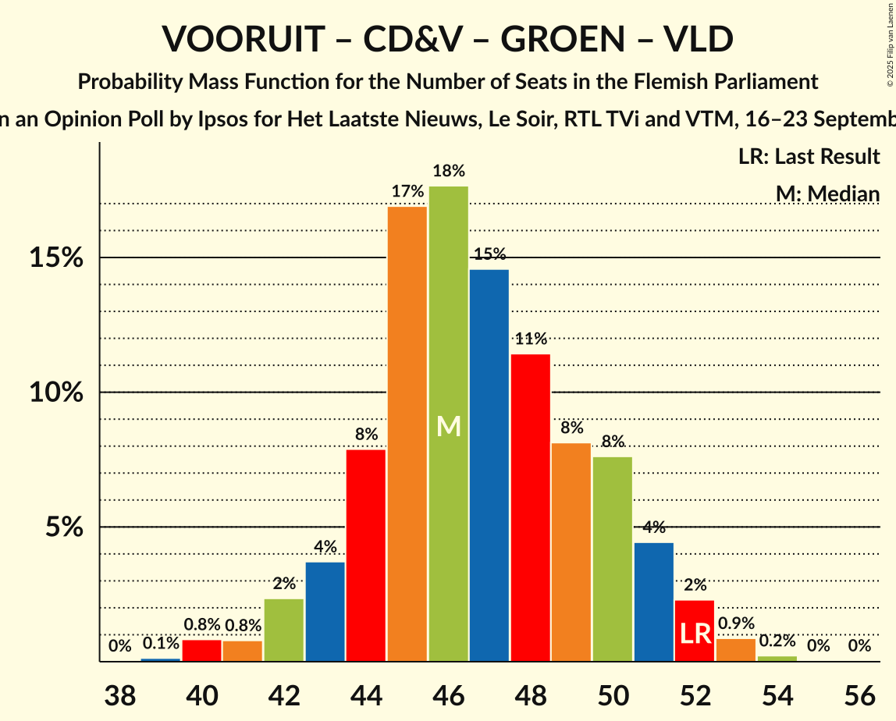

| Number of Seats | Probability | Accumulated | Special Marks |
|:---------------:|:-----------:|:-----------:|:-------------:|
| 39 | 0.1% | 100% |  |
| 40 | 0.8% | 99.8% |  |
| 41 | 0.8% | 99.0% |  |
| 42 | 2% | 98% |  |
| 43 | 4% | 96% |  |
| 44 | 8% | 92% |  |
| 45 | 17% | 84% |  |
| 46 | 18% | 67% |  |
| 47 | 15% | 50% | Median |
| 48 | 11% | 35% |  |
| 49 | 8% | 24% |  |
| 50 | 8% | 16% |  |
| 51 | 4% | 8% |  |
| 52 | 2% | 3% | Last Result |
| 53 | 0.9% | 1.2% |  |
| 54 | 0.2% | 0.3% |  |
| 55 | 0% | 0.1% |  |
| 56 | 0% | 0% |  |

### Vooruit – Christen-Democratisch en Vlaams – Groen

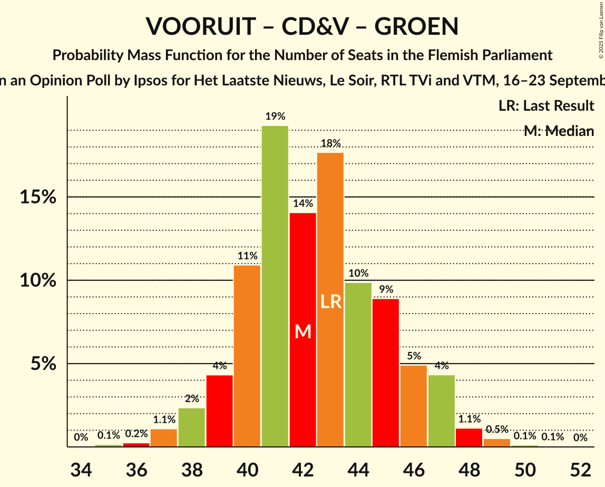

| Number of Seats | Probability | Accumulated | Special Marks |
|:---------------:|:-----------:|:-----------:|:-------------:|
| 35 | 0.1% | 100% |  |
| 36 | 0.2% | 99.8% |  |
| 37 | 1.1% | 99.6% |  |
| 38 | 2% | 98% |  |
| 39 | 4% | 96% |  |
| 40 | 11% | 92% |  |
| 41 | 19% | 81% |  |
| 42 | 14% | 62% | Median |
| 43 | 18% | 48% | Last Result |
| 44 | 10% | 30% |  |
| 45 | 9% | 20% |  |
| 46 | 5% | 11% |  |
| 47 | 4% | 6% |  |
| 48 | 1.1% | 2% |  |
| 49 | 0.5% | 0.7% |  |
| 50 | 0.1% | 0.2% |  |
| 51 | 0.1% | 0.1% |  |
| 52 | 0% | 0% |  |

### Vooruit – Christen-Democratisch en Vlaams – Open Vlaamse Liberalen en Democraten

| Number of Seats | Probability | Accumulated | Special Marks |
|:---------------:|:-----------:|:-----------:|:-------------:|
| 30 | 0.1% | 100% |  |
| 31 | 0.3% | 99.8% |  |
| 32 | 0.8% | 99.5% |  |
| 33 | 2% | 98.7% |  |
| 34 | 4% | 97% |  |
| 35 | 10% | 93% |  |
| 36 | 13% | 83% |  |
| 37 | 12% | 70% |  |
| 38 | 22% | 58% | Median |
| 39 | 17% | 36% |  |
| 40 | 8% | 19% |  |
| 41 | 6% | 11% |  |
| 42 | 3% | 5% |  |
| 43 | 1.2% | 2% | Last Result |
| 44 | 0.6% | 0.8% |  |
| 45 | 0.1% | 0.2% |  |
| 46 | 0.1% | 0.1% |  |
| 47 | 0% | 0% |  |

### Nieuw-Vlaamse Alliantie – Open Vlaamse Liberalen en Democraten

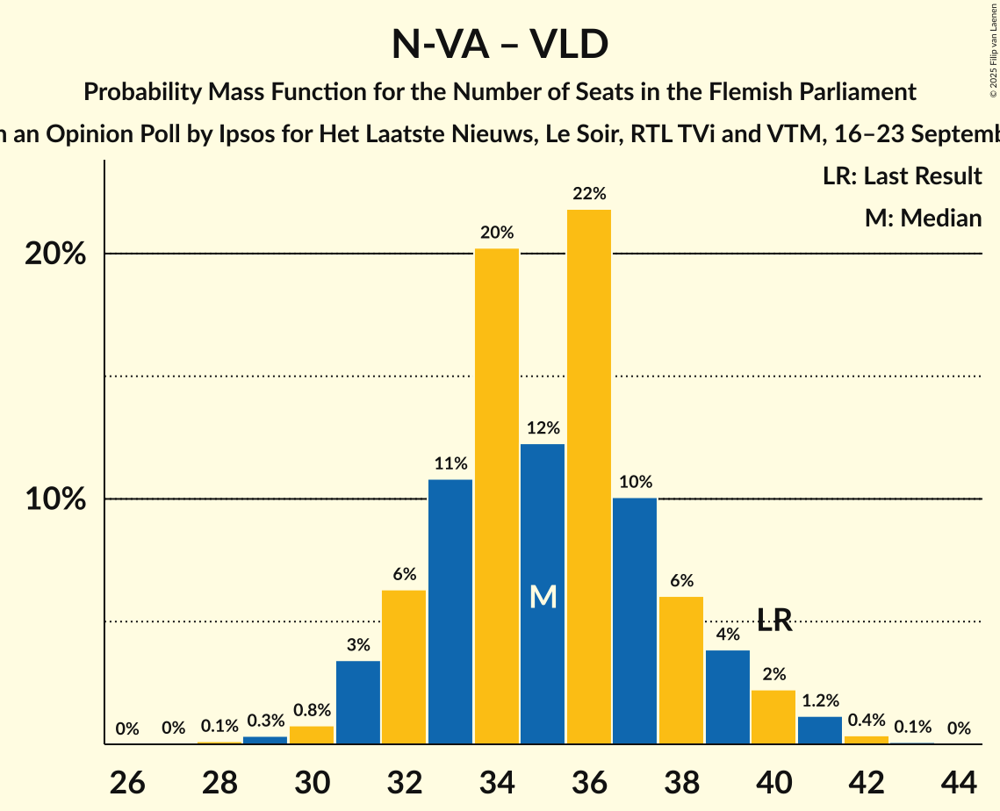

| Number of Seats | Probability | Accumulated | Special Marks |
|:---------------:|:-----------:|:-----------:|:-------------:|
| 28 | 0.1% | 100% |  |
| 29 | 0.3% | 99.8% |  |
| 30 | 0.8% | 99.5% |  |
| 31 | 3% | 98.7% |  |
| 32 | 6% | 95% |  |
| 33 | 11% | 89% |  |
| 34 | 20% | 78% |  |
| 35 | 12% | 58% |  |
| 36 | 22% | 46% | Median |
| 37 | 10% | 24% |  |
| 38 | 6% | 14% |  |
| 39 | 4% | 8% |  |
| 40 | 2% | 4% | Last Result |
| 41 | 1.2% | 2% |  |
| 42 | 0.4% | 0.5% |  |
| 43 | 0.1% | 0.1% |  |
| 44 | 0% | 0% |  |

### Vooruit – Christen-Democratisch en Vlaams

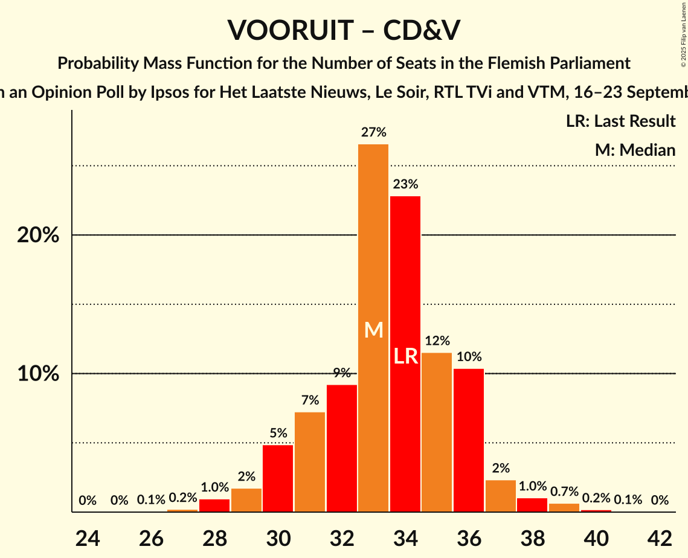

| Number of Seats | Probability | Accumulated | Special Marks |
|:---------------:|:-----------:|:-----------:|:-------------:|
| 26 | 0.1% | 100% |  |
| 27 | 0.2% | 99.9% |  |
| 28 | 1.0% | 99.7% |  |
| 29 | 2% | 98.7% |  |
| 30 | 5% | 97% |  |
| 31 | 7% | 92% |  |
| 32 | 9% | 85% |  |
| 33 | 27% | 76% | Median |
| 34 | 23% | 49% | Last Result |
| 35 | 12% | 26% |  |
| 36 | 10% | 15% |  |
| 37 | 2% | 4% |  |
| 38 | 1.0% | 2% |  |
| 39 | 0.7% | 0.9% |  |
| 40 | 0.2% | 0.3% |  |
| 41 | 0.1% | 0.1% |  |
| 42 | 0% | 0% |  |

### Vooruit – Groen – Open Vlaamse Liberalen en Democraten

| Number of Seats | Probability | Accumulated | Special Marks |
|:---------------:|:-----------:|:-----------:|:-------------:|
| 23 | 0.1% | 100% |  |
| 24 | 0.7% | 99.9% |  |
| 25 | 0.9% | 99.2% |  |
| 26 | 2% | 98% |  |
| 27 | 4% | 96% |  |
| 28 | 13% | 92% |  |
| 29 | 13% | 79% |  |
| 30 | 22% | 66% |  |
| 31 | 14% | 44% | Median |
| 32 | 9% | 30% |  |
| 33 | 9% | 21% |  |
| 34 | 6% | 12% |  |
| 35 | 5% | 6% |  |
| 36 | 1.1% | 2% | Last Result |
| 37 | 0.3% | 0.5% |  |
| 38 | 0.1% | 0.2% |  |
| 39 | 0% | 0.1% |  |
| 40 | 0% | 0% |  |

### Christen-Democratisch en Vlaams – Groen – Open Vlaamse Liberalen en Democraten

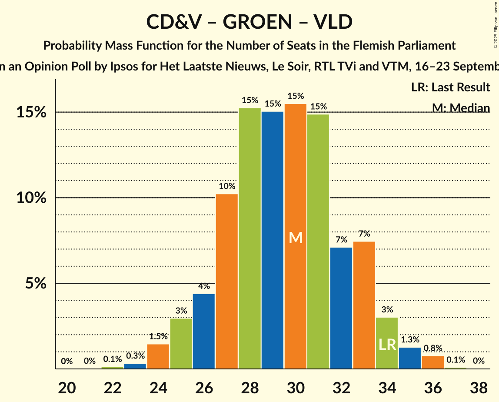

| Number of Seats | Probability | Accumulated | Special Marks |
|:---------------:|:-----------:|:-----------:|:-------------:|
| 22 | 0.1% | 100% |  |
| 23 | 0.3% | 99.8% |  |
| 24 | 1.5% | 99.5% |  |
| 25 | 3% | 98% |  |
| 26 | 4% | 95% |  |
| 27 | 10% | 91% |  |
| 28 | 15% | 80% |  |
| 29 | 15% | 65% |  |
| 30 | 15% | 50% | Median |
| 31 | 15% | 35% |  |
| 32 | 7% | 20% |  |
| 33 | 7% | 13% |  |
| 34 | 3% | 5% | Last Result |
| 35 | 1.3% | 2% |  |
| 36 | 0.8% | 0.9% |  |
| 37 | 0.1% | 0.1% |  |
| 38 | 0% | 0% |  |

### Vooruit – Open Vlaamse Liberalen en Democraten

| Number of Seats | Probability | Accumulated | Special Marks |
|:---------------:|:-----------:|:-----------:|:-------------:|
| 14 | 0.1% | 100% |  |
| 15 | 0.2% | 99.9% |  |
| 16 | 0.4% | 99.6% |  |
| 17 | 1.4% | 99.3% |  |
| 18 | 3% | 98% |  |
| 19 | 16% | 95% |  |
| 20 | 10% | 78% |  |
| 21 | 13% | 68% |  |
| 22 | 27% | 56% | Median |
| 23 | 15% | 29% |  |
| 24 | 7% | 14% |  |
| 25 | 4% | 7% |  |
| 26 | 2% | 3% |  |
| 27 | 0.6% | 0.8% | Last Result |
| 28 | 0.2% | 0.2% |  |
| 29 | 0.1% | 0.1% |  |
| 30 | 0% | 0% |  |

### Christen-Democratisch en Vlaams – Open Vlaamse Liberalen en Democraten

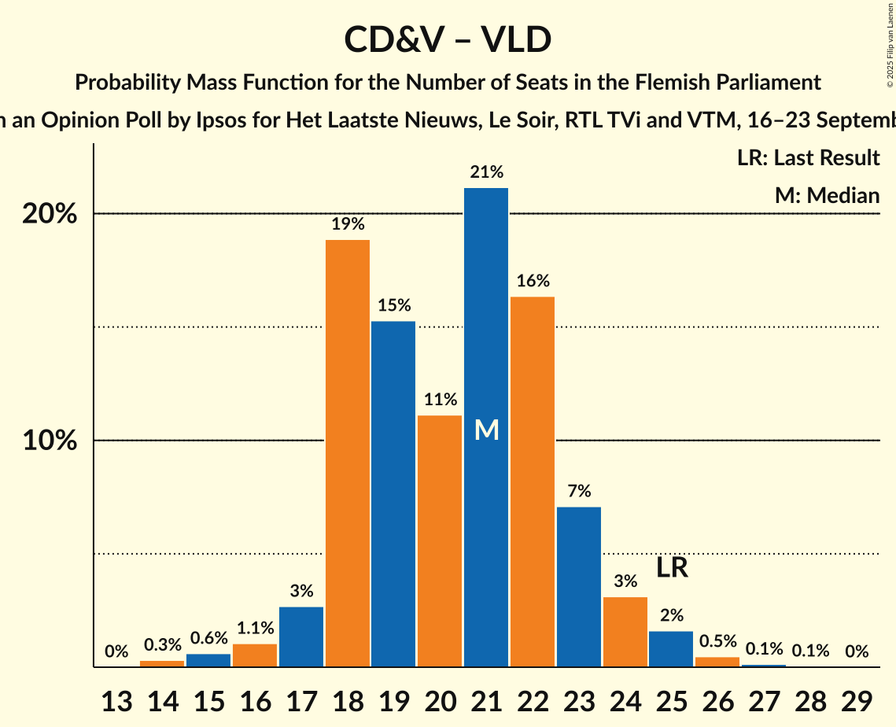

| Number of Seats | Probability | Accumulated | Special Marks |
|:---------------:|:-----------:|:-----------:|:-------------:|
| 14 | 0.2% | 100% |  |
| 15 | 0.7% | 99.8% |  |
| 16 | 1.2% | 99.1% |  |
| 17 | 3% | 98% |  |
| 18 | 15% | 95% |  |
| 19 | 12% | 80% |  |
| 20 | 9% | 68% |  |
| 21 | 26% | 59% | Median |
| 22 | 18% | 32% |  |
| 23 | 7% | 14% |  |
| 24 | 4% | 7% |  |
| 25 | 1.4% | 2% | Last Result |
| 26 | 0.5% | 0.8% |  |
| 27 | 0.2% | 0.3% |  |
| 28 | 0.1% | 0.1% |  |
| 29 | 0% | 0% |  |

## Technical Information

### Opinion Poll

+ **Polling firm:** Ipsos
+ **Commissioner(s):** Het Laatste Nieuws, Le Soir, RTL TVi and VTM
+ **Fieldwork period:** 16–23 September 2025

### Calculations

+ **Sample size:** 1000
+ **Simulations done:** 2,097,152
+ **Error estimate:** 2.33%

