# Poll Average

<a href="#voting-intentions">Voting Intentions</a> | <a href="#seats">Seats</a> | <a href="#coalitions">Coalitions</a> | <a href="#technical-information">Technical Information</a>

## Summary

The table below lists the polls on which the average is based. They are the most recent polls (less than 90 days old) registered and analyzed so far.

| Period     | Polling firm/Commissioner(s) | N-VA | CD&V | VLD | SP.A | GROEN | VB | PVDA | PIRAAT | LDD |
|:----------:|:----------------------------:|:--:|:--:|:--:|:--:|:--:|:--:|:--:|:--:|:--:|
| 25 May 2014 | General Election | 31.9%   43 | 20.5%   27 | 14.1%   19 | 14.0%   18 | 8.7%   10 | 5.9%   6 | 2.5%   0 | 0.6%   0 | 0.0%   0 |
| N/A | Poll Average | 25–31%   33–41 | 13–17%   15–21 | 11–16%   13–22 | 10–15%   12–19 | 13–18%   17–24 | 8–13%   8–16 | 4–7%   2–6 | N/A   N/A | N/A   N/A |
| [25 March–14 April 2019](2019-04-14-TNS.html) | TNS   De Standaard, La Libre Belgique, RTBf and VRT | 25–31%   33–41 | 13–17%   15–21 | 12–17%   15–22 | 11–15%   14–19 | 13–17%   16–23 | 8–11%   8–13 | 5–7%   2–8 | N/A   N/A | N/A   N/A |
| [5–11 February 2019](2019-02-11-Ipsos.html) | Ipsos   Het Laatste Nieuws, Le Soir, RTL TVi and VTM | 25–30%   33–41 | 13–17%   15–21 | 11–15%   13–19 | 9–13%   10–17 | 13–18%   18–25 | 9–13%   10–17 | 4–6%   2–5 | N/A   N/A | N/A   N/A |
| 25 May 2014 | General Election | 31.9%   43 | 20.5%   27 | 14.1%   19 | 14.0%   18 | 8.7%   10 | 5.9%   6 | 2.5%   0 | 0.6%   0 | 0.0%   0 |

Only polls for which at least the sample size has been published are included in the table above.

**Legend:**
+ **Top half of each row:** Voting intentions (95% confidence interval)
+ **Bottom half of each row:** Seat projections for the Flemish Parliament (95% confidence interval)
+ **N-VA:** N-VA
+ **CD&V:** CD&V
+ **VLD:** Open Vld
+ **SP.A:** sp.a
+ **GROEN:** Groen
+ **VB:** Vlaams Belang
+ **PVDA:** PVDA
+ **PIRAAT:** Piratenpartij
+ **LDD:** Lijst Dedecker
+ **N/A (single party):** Party not included the published results
+ **N/A (entire row):** Calculation for this opinion poll not started yet

## Voting Intentions

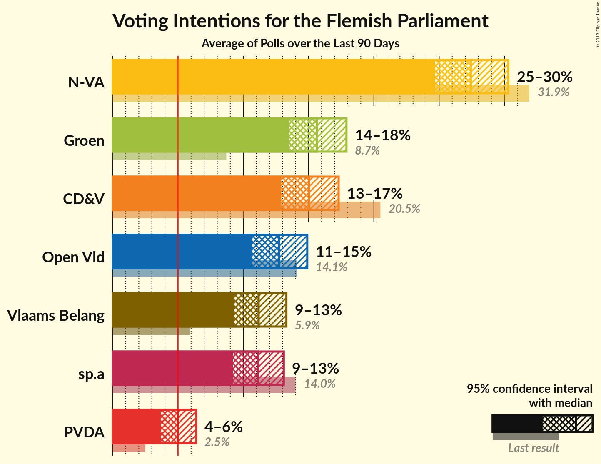

### Confidence Intervals

| Party | Last Result | Median | 80% Confidence Interval | 90% Confidence Interval | 95% Confidence Interval | 99% Confidence Interval |
|:-----:|:-----------:|:------:|:-----------------------:|:-----------------------:|:-----------------------:|:-----------------------:|
| <a href="#n-va">N-VA</a> | 31.9% | 27.7% | 25.9–29.6% |25.4–30.1% | 24.9–30.6% | 24.1–31.5% |
| <a href="#cd&v">CD&V</a> | 20.5% | 14.9% | 13.5–16.4% |13.1–16.8% | 12.8–17.2% | 12.1–17.9% |
| <a href="#open-vld">Open Vld</a> | 14.1% | 13.5% | 11.8–15.2% |11.4–15.7% | 11.0–16.1% | 10.4–17.0% |
| <a href="#sp.a">sp.a</a> | 14.0% | 11.9% | 10.3–13.7% |9.9–14.2% | 9.5–14.6% | 8.9–15.4% |
| <a href="#groen">Groen</a> | 8.7% | 15.1% | 13.6–16.7% |13.2–17.2% | 12.8–17.6% | 12.2–18.4% |
| <a href="#vlaams-belang">Vlaams Belang</a> | 5.9% | 10.3% | 8.6–12.1% |8.3–12.5% | 8.0–12.9% | 7.4–13.7% |
| <a href="#pvda">PVDA</a> | 2.5% | 5.4% | 4.4–6.6% |4.1–6.9% | 3.9–7.2% | 3.5–7.8% |
| <a href="#piratenpartij">Piratenpartij</a> | 0.6% | N/A | N/A |N/A | N/A | N/A |
| <a href="#lijst-dedecker">Lijst Dedecker</a> | 0.0% | N/A | N/A |N/A | N/A | N/A |

### N-VA

*For a full overview of the results for this party, see the [N-VA](party-n-va.html) page.*

| Voting Intentions | Probability | Accumulated | Special Marks |
|:-----------------:|:-----------:|:-----------:|:-------------:|
| 21.5–22.5% | 0% | 100% |  |
| 22.5–23.5% | 0.1% | 100% |  |
| 23.5–24.5% | 1.1% | 99.9% |  |
| 24.5–25.5% | 5% | 98.8% |  |
| 25.5–26.5% | 15% | 94% |  |
| 26.5–27.5% | 25% | 79% |  |
| 27.5–28.5% | 26% | 54% | Median |
| 28.5–29.5% | 18% | 28% |  |
| 29.5–30.5% | 8% | 10% |  |
| 30.5–31.5% | 2% | 3% |  |
| 31.5–32.5% | 0.4% | 0.4% | Last Result |
| 32.5–33.5% | 0% | 0.1% |  |
| 33.5–34.5% | 0% | 0% |  |

### CD&V

*For a full overview of the results for this party, see the [CD&V](party-cdv.html) page.*

| Voting Intentions | Probability | Accumulated | Special Marks |
|:-----------------:|:-----------:|:-----------:|:-------------:|
| 9.5–10.5% | 0% | 100% |  |
| 10.5–11.5% | 0.1% | 100% |  |
| 11.5–12.5% | 1.4% | 99.9% |  |
| 12.5–13.5% | 10% | 98% |  |
| 13.5–14.5% | 27% | 89% |  |
| 14.5–15.5% | 33% | 61% | Median |
| 15.5–16.5% | 21% | 28% |  |
| 16.5–17.5% | 6% | 8% |  |
| 17.5–18.5% | 1.1% | 1.2% |  |
| 18.5–19.5% | 0.1% | 0.1% |  |
| 19.5–20.5% | 0% | 0% |  |
| 20.5–21.5% | 0% | 0% | Last Result |

### Open Vld

*For a full overview of the results for this party, see the [Open Vld](party-openvld.html) page.*

| Voting Intentions | Probability | Accumulated | Special Marks |
|:-----------------:|:-----------:|:-----------:|:-------------:|
| 8.5–9.5% | 0% | 100% |  |
| 9.5–10.5% | 0.8% | 100% |  |
| 10.5–11.5% | 6% | 99.2% |  |
| 11.5–12.5% | 18% | 93% |  |
| 12.5–13.5% | 27% | 75% | Median |
| 13.5–14.5% | 26% | 48% | Last Result |
| 14.5–15.5% | 15% | 22% |  |
| 15.5–16.5% | 5% | 7% |  |
| 16.5–17.5% | 1.0% | 1.2% |  |
| 17.5–18.5% | 0.1% | 0.1% |  |
| 18.5–19.5% | 0% | 0% |  |

### sp.a

*For a full overview of the results for this party, see the [sp.a](party-spa.html) page.*

| Voting Intentions | Probability | Accumulated | Special Marks |
|:-----------------:|:-----------:|:-----------:|:-------------:|
| 6.5–7.5% | 0% | 100% |  |
| 7.5–8.5% | 0.1% | 100% |  |
| 8.5–9.5% | 3% | 99.9% |  |
| 9.5–10.5% | 12% | 97% |  |
| 10.5–11.5% | 25% | 85% |  |
| 11.5–12.5% | 27% | 60% | Median |
| 12.5–13.5% | 21% | 33% |  |
| 13.5–14.5% | 10% | 12% | Last Result |
| 14.5–15.5% | 2% | 3% |  |
| 15.5–16.5% | 0.3% | 0.3% |  |
| 16.5–17.5% | 0% | 0% |  |

### Groen

*For a full overview of the results for this party, see the [Groen](party-groen.html) page.*

| Voting Intentions | Probability | Accumulated | Special Marks |
|:-----------------:|:-----------:|:-----------:|:-------------:|
| 8.5–9.5% | 0% | 100% | Last Result |
| 9.5–10.5% | 0% | 100% |  |
| 10.5–11.5% | 0.1% | 100% |  |
| 11.5–12.5% | 1.2% | 99.9% |  |
| 12.5–13.5% | 8% | 98.7% |  |
| 13.5–14.5% | 23% | 91% |  |
| 14.5–15.5% | 31% | 68% | Median |
| 15.5–16.5% | 24% | 37% |  |
| 16.5–17.5% | 10% | 13% |  |
| 17.5–18.5% | 3% | 3% |  |
| 18.5–19.5% | 0.4% | 0.4% |  |
| 19.5–20.5% | 0% | 0% |  |

### Vlaams Belang

*For a full overview of the results for this party, see the [Vlaams Belang](party-vlaamsbelang.html) page.*

| Voting Intentions | Probability | Accumulated | Special Marks |
|:-----------------:|:-----------:|:-----------:|:-------------:|
| 5.5–6.5% | 0% | 100% | Last Result |
| 6.5–7.5% | 0.8% | 100% |  |
| 7.5–8.5% | 8% | 99.2% |  |
| 8.5–9.5% | 22% | 91% |  |
| 9.5–10.5% | 26% | 69% | Median |
| 10.5–11.5% | 24% | 43% |  |
| 11.5–12.5% | 14% | 19% |  |
| 12.5–13.5% | 4% | 5% |  |
| 13.5–14.5% | 0.6% | 0.6% |  |
| 14.5–15.5% | 0% | 0% |  |
| 15.5–16.5% | 0% | 0% |  |

### PVDA

*For a full overview of the results for this party, see the [PVDA](party-pvda.html) page.*

| Voting Intentions | Probability | Accumulated | Special Marks |
|:-----------------:|:-----------:|:-----------:|:-------------:|
| 1.5–2.5% | 0% | 100% |  |
| 2.5–3.5% | 0.5% | 100% | Last Result |
| 3.5–4.5% | 14% | 99.5% |  |
| 4.5–5.5% | 40% | 86% | Median |
| 5.5–6.5% | 34% | 45% |  |
| 6.5–7.5% | 10% | 11% |  |
| 7.5–8.5% | 1.1% | 1.1% |  |
| 8.5–9.5% | 0% | 0% |  |

## Seats

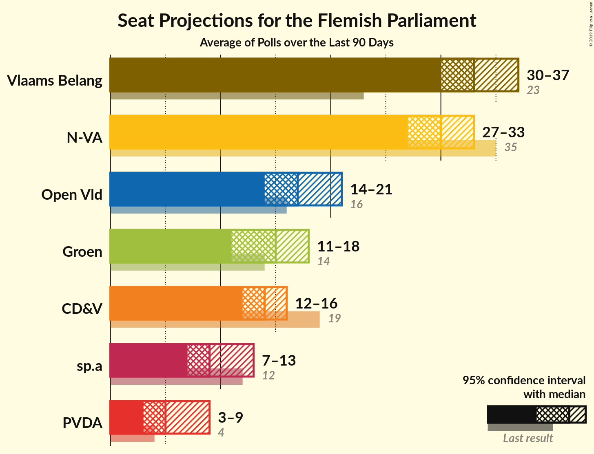

### Confidence Intervals

| Party | Last Result | Median | 80% Confidence Interval | 90% Confidence Interval | 95% Confidence Interval | 99% Confidence Interval |
|:-----:|:-----------:|:------:|:-----------------------:|:-----------------------:|:-----------------------:|:-----------------------:|
| <a href="#n-va">N-VA</a> | 43 | 37 | 34–39 |33–40 | 33–41 | 31–43 |
| <a href="#cd&v">CD&V</a> | 27 | 19 | 15–20 |15–20 | 15–21 | 15–23 |
| <a href="#open-vld">Open Vld</a> | 19 | 18 | 14–20 |13–20 | 13–22 | 12–23 |
| <a href="#sp.a">sp.a</a> | 18 | 14 | 13–18 |13–19 | 12–19 | 10–19 |
| <a href="#groen">Groen</a> | 10 | 21 | 18–23 |17–23 | 17–24 | 15–26 |
| <a href="#vlaams-belang">Vlaams Belang</a> | 6 | 12 | 8–15 |8–16 | 8–16 | 8–17 |
| <a href="#pvda">PVDA</a> | 0 | 4 | 2–5 |2–5 | 2–6 | 1–9 |
| <a href="#piratenpartij">Piratenpartij</a> | 0 | N/A | N/A |N/A | N/A | N/A |
| <a href="#lijst-dedecker">Lijst Dedecker</a> | 0 | N/A | N/A |N/A | N/A | N/A |

### N-VA

*For a full overview of the results for this party, see the [N-VA](party-n-va.html) page.*

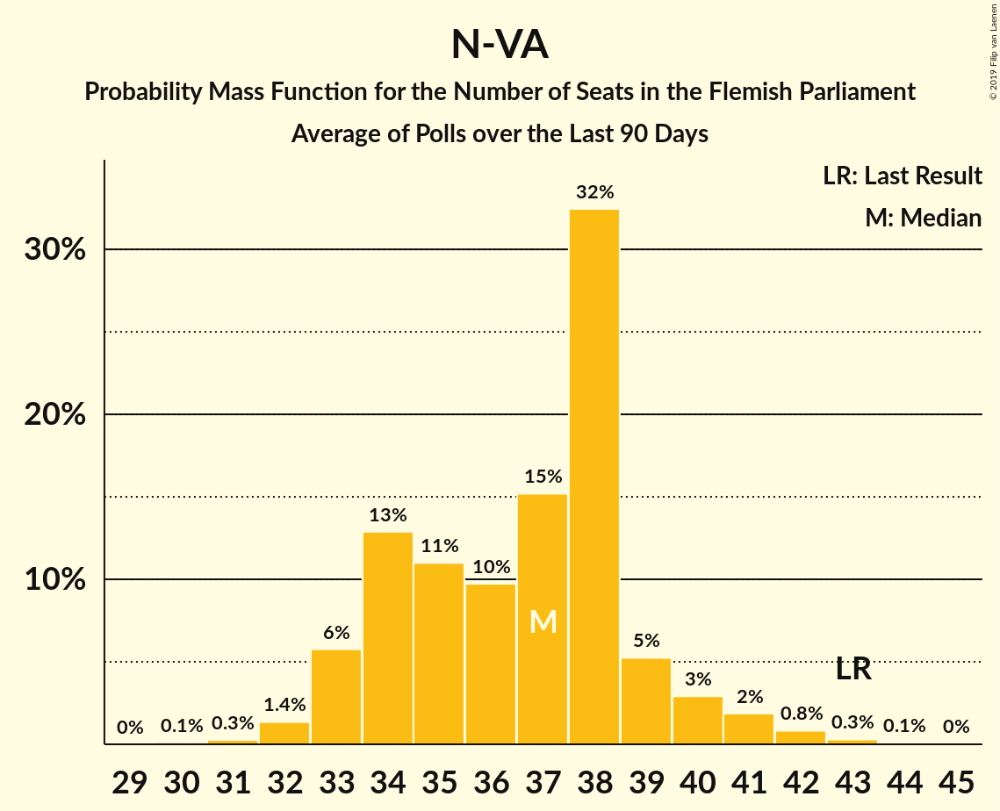

| Number of Seats | Probability | Accumulated | Special Marks |
|:---------------:|:-----------:|:-----------:|:-------------:|
| 30 | 0.2% | 100% |  |
| 31 | 0.3% | 99.8% |  |
| 32 | 1.3% | 99.5% |  |
| 33 | 4% | 98% |  |
| 34 | 10% | 94% |  |
| 35 | 12% | 84% |  |
| 36 | 9% | 72% |  |
| 37 | 17% | 62% | Median |
| 38 | 28% | 45% |  |
| 39 | 8% | 17% |  |
| 40 | 5% | 9% |  |
| 41 | 2% | 4% |  |
| 42 | 1.2% | 2% |  |
| 43 | 0.4% | 0.5% | Last Result |
| 44 | 0.1% | 0.1% |  |
| 45 | 0% | 0% |  |

### CD&V

*For a full overview of the results for this party, see the [CD&V](party-cdv.html) page.*

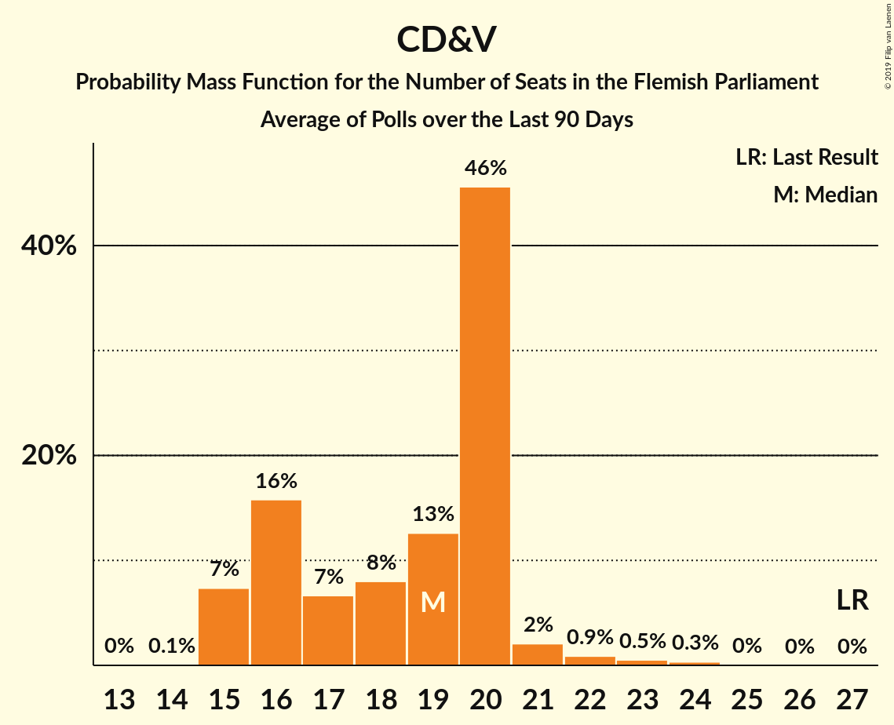

| Number of Seats | Probability | Accumulated | Special Marks |
|:---------------:|:-----------:|:-----------:|:-------------:|
| 13 | 0.1% | 100% |  |
| 14 | 0.4% | 99.9% |  |
| 15 | 14% | 99.5% |  |
| 16 | 17% | 86% |  |
| 17 | 6% | 69% |  |
| 18 | 8% | 63% |  |
| 19 | 10% | 55% | Median |
| 20 | 42% | 45% |  |
| 21 | 2% | 3% |  |
| 22 | 0.7% | 1.3% |  |
| 23 | 0.3% | 0.6% |  |
| 24 | 0.3% | 0.3% |  |
| 25 | 0% | 0% |  |
| 26 | 0% | 0% |  |
| 27 | 0% | 0% | Last Result |

### Open Vld

*For a full overview of the results for this party, see the [Open Vld](party-openvld.html) page.*

| Number of Seats | Probability | Accumulated | Special Marks |
|:---------------:|:-----------:|:-----------:|:-------------:|
| 12 | 0.7% | 100% |  |
| 13 | 6% | 99.3% |  |
| 14 | 6% | 93% |  |
| 15 | 6% | 87% |  |
| 16 | 6% | 81% |  |
| 17 | 18% | 75% |  |
| 18 | 20% | 57% | Median |
| 19 | 20% | 37% | Last Result |
| 20 | 11% | 16% |  |
| 21 | 2% | 5% |  |
| 22 | 2% | 3% |  |
| 23 | 0.7% | 1.1% |  |
| 24 | 0.3% | 0.4% |  |
| 25 | 0.1% | 0.1% |  |
| 26 | 0% | 0% |  |

### sp.a

*For a full overview of the results for this party, see the [sp.a](party-spa.html) page.*

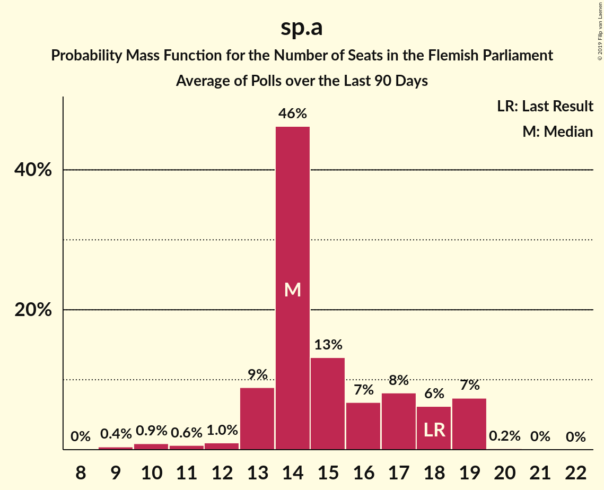

| Number of Seats | Probability | Accumulated | Special Marks |
|:---------------:|:-----------:|:-----------:|:-------------:|
| 9 | 0.4% | 100% |  |
| 10 | 0.9% | 99.6% |  |
| 11 | 0.6% | 98.7% |  |
| 12 | 1.0% | 98% |  |
| 13 | 9% | 97% |  |
| 14 | 47% | 88% | Median |
| 15 | 12% | 41% |  |
| 16 | 7% | 29% |  |
| 17 | 8% | 22% |  |
| 18 | 6% | 14% | Last Result |
| 19 | 8% | 8% |  |
| 20 | 0.1% | 0.2% |  |
| 21 | 0% | 0.1% |  |
| 22 | 0% | 0% |  |

### Groen

*For a full overview of the results for this party, see the [Groen](party-groen.html) page.*

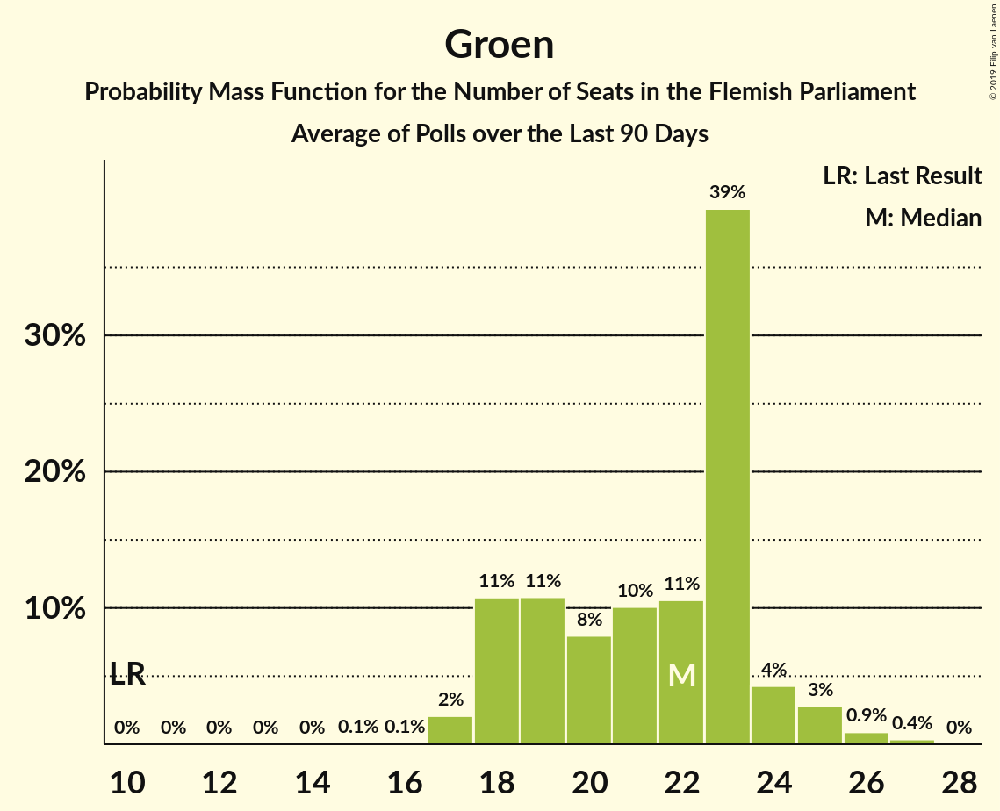

| Number of Seats | Probability | Accumulated | Special Marks |
|:---------------:|:-----------:|:-----------:|:-------------:|
| 10 | 0% | 100% | Last Result |
| 11 | 0% | 100% |  |
| 12 | 0% | 100% |  |
| 13 | 0% | 100% |  |
| 14 | 0% | 100% |  |
| 15 | 1.0% | 100% |  |
| 16 | 1.0% | 99.0% |  |
| 17 | 7% | 98% |  |
| 18 | 18% | 91% |  |
| 19 | 12% | 74% |  |
| 20 | 10% | 62% |  |
| 21 | 12% | 52% | Median |
| 22 | 10% | 41% |  |
| 23 | 26% | 31% |  |
| 24 | 2% | 5% |  |
| 25 | 2% | 2% |  |
| 26 | 0.5% | 0.7% |  |
| 27 | 0.2% | 0.2% |  |
| 28 | 0% | 0% |  |

### Vlaams Belang

*For a full overview of the results for this party, see the [Vlaams Belang](party-vlaamsbelang.html) page.*

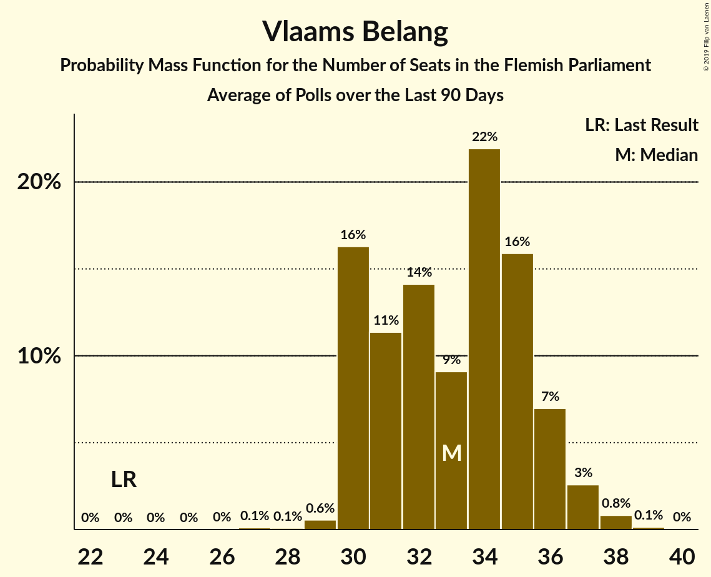

| Number of Seats | Probability | Accumulated | Special Marks |
|:---------------:|:-----------:|:-----------:|:-------------:|
| 6 | 0.2% | 100% | Last Result |
| 7 | 0.2% | 99.8% |  |
| 8 | 13% | 99.6% |  |
| 9 | 6% | 87% |  |
| 10 | 8% | 81% |  |
| 11 | 19% | 72% |  |
| 12 | 20% | 54% | Median |
| 13 | 18% | 34% |  |
| 14 | 4% | 16% |  |
| 15 | 6% | 12% |  |
| 16 | 5% | 7% |  |
| 17 | 2% | 2% |  |
| 18 | 0.1% | 0.1% |  |
| 19 | 0% | 0.1% |  |
| 20 | 0% | 0% |  |

### PVDA

*For a full overview of the results for this party, see the [PVDA](party-pvda.html) page.*

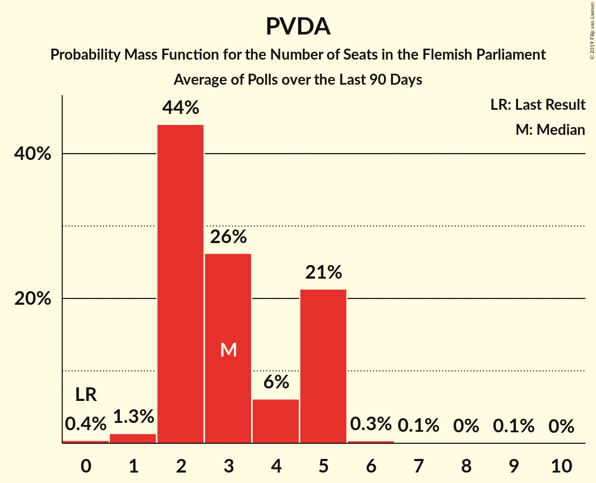

| Number of Seats | Probability | Accumulated | Special Marks |
|:---------------:|:-----------:|:-----------:|:-------------:|
| 0 | 0.2% | 100% | Last Result |
| 1 | 0.7% | 99.8% |  |
| 2 | 25% | 99.1% |  |
| 3 | 24% | 74% |  |
| 4 | 5% | 50% | Median |
| 5 | 41% | 45% |  |
| 6 | 1.3% | 3% |  |
| 7 | 0.6% | 2% |  |
| 8 | 0.7% | 1.5% |  |
| 9 | 0.8% | 0.8% |  |
| 10 | 0% | 0% |  |

## Coalitions

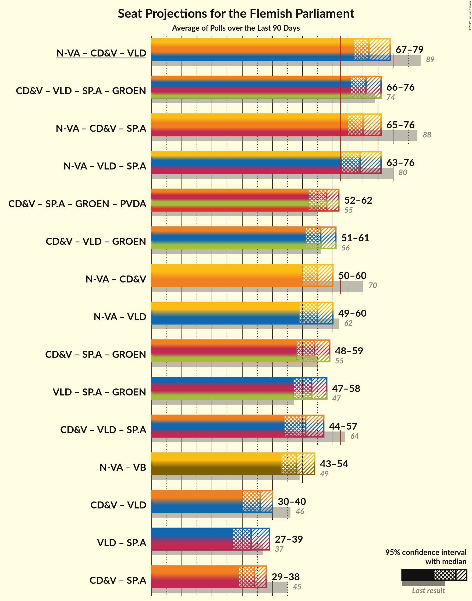

### Confidence Intervals

| Coalition | Last Result | Median | Majority? | 80% Confidence Interval | 90% Confidence Interval | 95% Confidence Interval | 99% Confidence Interval |
|:---------:|:-----------:|:------:|:---------:|:-----------------------:|:-----------------------:|:-----------------------:|:-----------------------:|
| N-VA – CD&V – Open Vld | 89 | 72 | 100% | 69–77 | 68–78 | 67–79 | 65–80 |
| CD&V – Open Vld – sp.a – Groen | 74 | 71 | 99.9% | 68–75 | 67–75 | 66–76 | 64–78 |
| N-VA – CD&V – sp.a | 88 | 70 | 99.8% | 67–74 | 66–75 | 65–76 | 63–77 |
| N-VA – Open Vld – sp.a | 80 | 69 | 98% | 65–74 | 63–75 | 63–76 | 61–77 |
| CD&V – sp.a – Groen – PVDA | 55 | 58 | 2% | 54–61 | 53–62 | 52–62 | 50–64 |
| CD&V – Open Vld – Groen | 56 | 56 | 0.6% | 53–60 | 52–61 | 51–61 | 50–63 |
| N-VA – CD&V | 70 | 55 | 0.1% | 52–59 | 51–59 | 50–60 | 49–62 |
| N-VA – Open Vld | 62 | 55 | 0.2% | 51–58 | 49–59 | 49–60 | 47–62 |
| CD&V – sp.a – Groen | 55 | 54 | 0% | 50–57 | 49–58 | 48–59 | 47–60 |
| Open Vld – sp.a – Groen | 47 | 53 | 0% | 49–57 | 48–58 | 47–58 | 46–60 |
| CD&V – Open Vld – sp.a | 64 | 51 | 0% | 47–55 | 45–56 | 44–57 | 43–58 |
| N-VA – Vlaams Belang | 49 | 48 | 0% | 45–52 | 44–53 | 43–54 | 42–56 |
| CD&V – Open Vld | 46 | 36 | 0% | 33–39 | 32–40 | 30–40 | 29–42 |
| Open Vld – sp.a | 37 | 33 | 0% | 28–37 | 27–38 | 27–39 | 25–40 |
| CD&V – sp.a | 45 | 34 | 0% | 30–36 | 29–37 | 29–38 | 28–39 |

### N-VA – CD&V – Open Vld

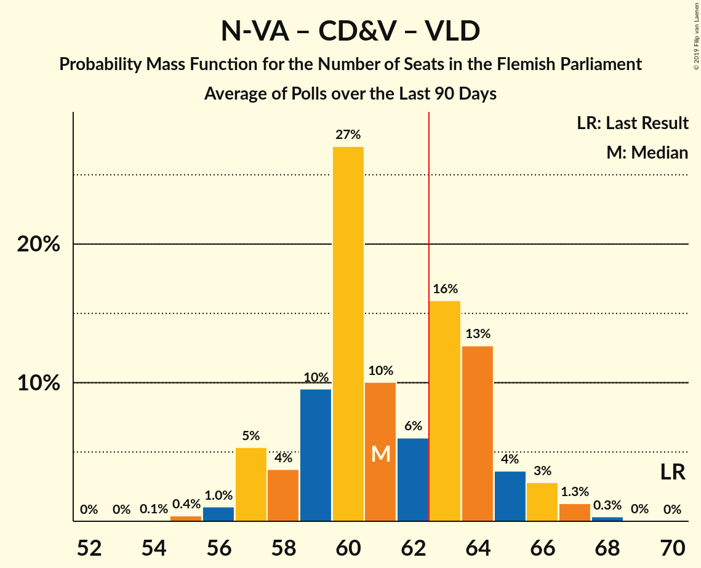

| Number of Seats | Probability | Accumulated | Special Marks |
|:---------------:|:-----------:|:-----------:|:-------------:|
| 64 | 0.1% | 100% |  |
| 65 | 0.4% | 99.9% |  |
| 66 | 0.9% | 99.5% |  |
| 67 | 2% | 98.6% |  |
| 68 | 5% | 97% |  |
| 69 | 7% | 92% |  |
| 70 | 8% | 86% |  |
| 71 | 12% | 78% |  |
| 72 | 19% | 66% |  |
| 73 | 11% | 47% |  |
| 74 | 10% | 36% | Median |
| 75 | 10% | 26% |  |
| 76 | 6% | 17% |  |
| 77 | 3% | 10% |  |
| 78 | 4% | 8% |  |
| 79 | 3% | 4% |  |
| 80 | 0.5% | 0.9% |  |
| 81 | 0.4% | 0.5% |  |
| 82 | 0% | 0% |  |
| 83 | 0% | 0% |  |
| 84 | 0% | 0% |  |
| 85 | 0% | 0% |  |
| 86 | 0% | 0% |  |
| 87 | 0% | 0% |  |
| 88 | 0% | 0% |  |
| 89 | 0% | 0% | Last Result |

### CD&V – Open Vld – sp.a – Groen

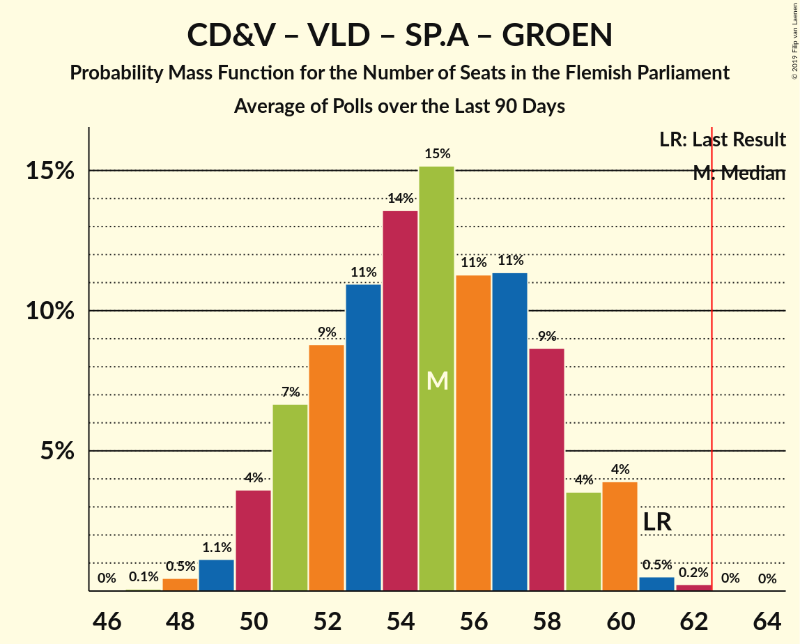

| Number of Seats | Probability | Accumulated | Special Marks |
|:---------------:|:-----------:|:-----------:|:-------------:|
| 62 | 0% | 100% |  |
| 63 | 0.2% | 99.9% | Majority |
| 64 | 0.6% | 99.7% |  |
| 65 | 0.8% | 99.2% |  |
| 66 | 3% | 98% |  |
| 67 | 5% | 96% |  |
| 68 | 7% | 91% |  |
| 69 | 7% | 84% |  |
| 70 | 11% | 77% |  |
| 71 | 17% | 66% |  |
| 72 | 15% | 49% | Median |
| 73 | 15% | 34% |  |
| 74 | 8% | 19% | Last Result |
| 75 | 6% | 11% |  |
| 76 | 3% | 5% |  |
| 77 | 1.3% | 2% |  |
| 78 | 0.6% | 0.8% |  |
| 79 | 0.1% | 0.2% |  |
| 80 | 0.1% | 0.1% |  |
| 81 | 0% | 0% |  |

### N-VA – CD&V – sp.a

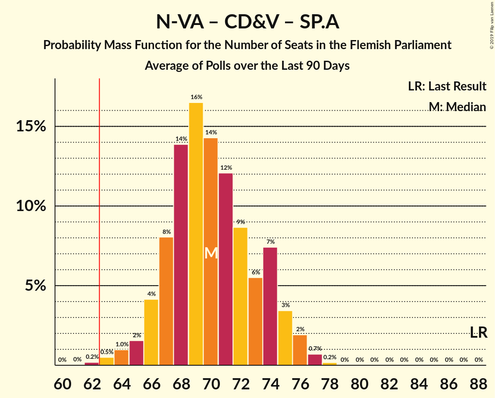

| Number of Seats | Probability | Accumulated | Special Marks |
|:---------------:|:-----------:|:-----------:|:-------------:|
| 62 | 0.2% | 100% |  |
| 63 | 0.5% | 99.8% | Majority |
| 64 | 1.0% | 99.3% |  |
| 65 | 2% | 98% |  |
| 66 | 4% | 97% |  |
| 67 | 8% | 93% |  |
| 68 | 14% | 85% |  |
| 69 | 16% | 71% |  |
| 70 | 14% | 54% | Median |
| 71 | 12% | 40% |  |
| 72 | 9% | 28% |  |
| 73 | 6% | 19% |  |
| 74 | 7% | 14% |  |
| 75 | 3% | 6% |  |
| 76 | 2% | 3% |  |
| 77 | 0.7% | 0.9% |  |
| 78 | 0.2% | 0.2% |  |
| 79 | 0% | 0% |  |
| 80 | 0% | 0% |  |
| 81 | 0% | 0% |  |
| 82 | 0% | 0% |  |
| 83 | 0% | 0% |  |
| 84 | 0% | 0% |  |
| 85 | 0% | 0% |  |
| 86 | 0% | 0% |  |
| 87 | 0% | 0% |  |
| 88 | 0% | 0% | Last Result |

### N-VA – Open Vld – sp.a

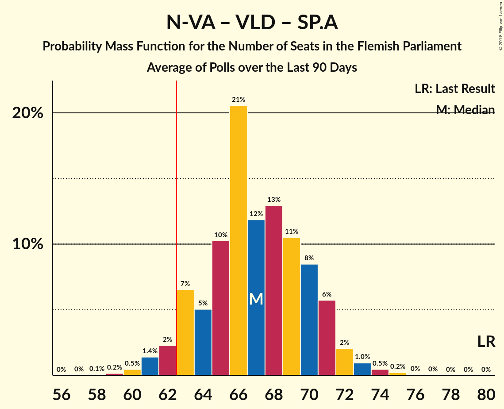

| Number of Seats | Probability | Accumulated | Special Marks |
|:---------------:|:-----------:|:-----------:|:-------------:|
| 59 | 0.1% | 100% |  |
| 60 | 0.2% | 99.9% |  |
| 61 | 0.7% | 99.7% |  |
| 62 | 1.1% | 99.0% |  |
| 63 | 3% | 98% | Majority |
| 64 | 3% | 95% |  |
| 65 | 5% | 92% |  |
| 66 | 11% | 86% |  |
| 67 | 7% | 75% |  |
| 68 | 10% | 69% |  |
| 69 | 11% | 58% | Median |
| 70 | 7% | 47% |  |
| 71 | 8% | 40% |  |
| 72 | 11% | 32% |  |
| 73 | 7% | 21% |  |
| 74 | 5% | 13% |  |
| 75 | 5% | 8% |  |
| 76 | 2% | 3% |  |
| 77 | 1.3% | 2% |  |
| 78 | 0.3% | 0.4% |  |
| 79 | 0.1% | 0.2% |  |
| 80 | 0% | 0% | Last Result |

### CD&V – sp.a – Groen – PVDA

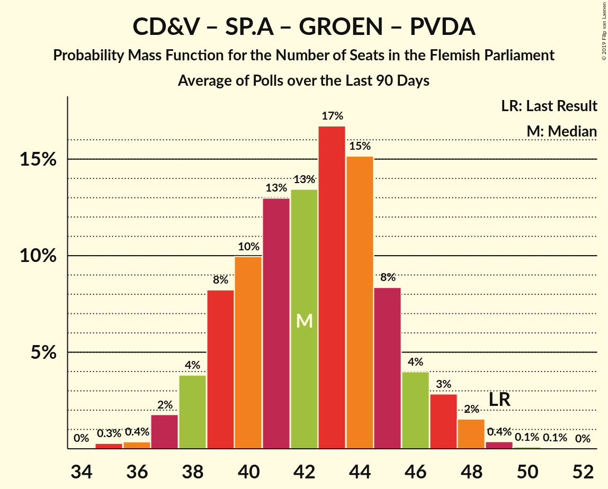

| Number of Seats | Probability | Accumulated | Special Marks |
|:---------------:|:-----------:|:-----------:|:-------------:|
| 49 | 0.1% | 100% |  |
| 50 | 0.4% | 99.9% |  |
| 51 | 1.2% | 99.5% |  |
| 52 | 2% | 98% |  |
| 53 | 4% | 97% |  |
| 54 | 6% | 93% |  |
| 55 | 11% | 87% | Last Result |
| 56 | 8% | 76% |  |
| 57 | 16% | 68% |  |
| 58 | 14% | 51% | Median |
| 59 | 15% | 38% |  |
| 60 | 11% | 23% |  |
| 61 | 6% | 12% |  |
| 62 | 4% | 6% |  |
| 63 | 1.3% | 2% | Majority |
| 64 | 0.9% | 1.1% |  |
| 65 | 0.1% | 0.3% |  |
| 66 | 0.1% | 0.1% |  |
| 67 | 0% | 0% |  |

### CD&V – Open Vld – Groen

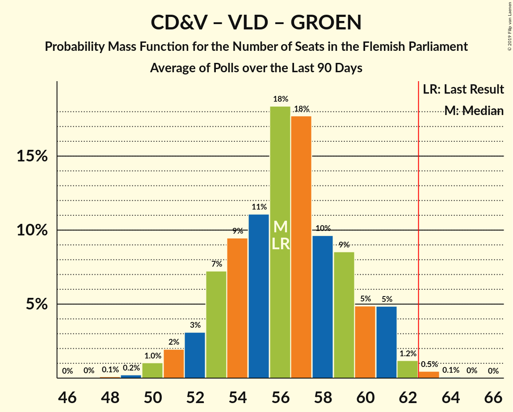

| Number of Seats | Probability | Accumulated | Special Marks |
|:---------------:|:-----------:|:-----------:|:-------------:|
| 47 | 0% | 100% |  |
| 48 | 0.1% | 99.9% |  |
| 49 | 0.2% | 99.9% |  |
| 50 | 1.0% | 99.6% |  |
| 51 | 2% | 98.6% |  |
| 52 | 3% | 97% |  |
| 53 | 7% | 94% |  |
| 54 | 9% | 86% |  |
| 55 | 11% | 77% |  |
| 56 | 18% | 66% | Last Result |
| 57 | 18% | 47% |  |
| 58 | 10% | 30% | Median |
| 59 | 9% | 20% |  |
| 60 | 5% | 11% |  |
| 61 | 5% | 7% |  |
| 62 | 1.2% | 2% |  |
| 63 | 0.5% | 0.6% | Majority |
| 64 | 0.1% | 0.1% |  |
| 65 | 0% | 0% |  |

### N-VA – CD&V

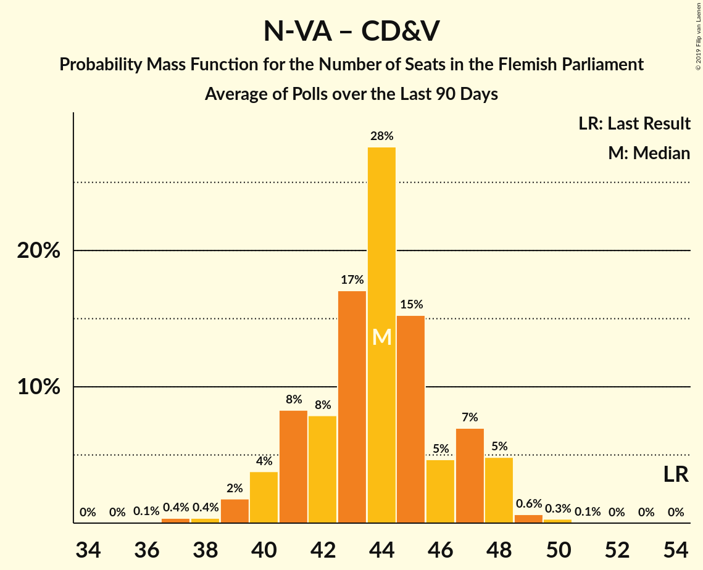

| Number of Seats | Probability | Accumulated | Special Marks |
|:---------------:|:-----------:|:-----------:|:-------------:|
| 48 | 0.2% | 100% |  |
| 49 | 0.7% | 99.8% |  |
| 50 | 2% | 99.1% |  |
| 51 | 4% | 97% |  |
| 52 | 8% | 93% |  |
| 53 | 14% | 85% |  |
| 54 | 16% | 71% |  |
| 55 | 13% | 55% |  |
| 56 | 10% | 42% | Median |
| 57 | 12% | 31% |  |
| 58 | 9% | 19% |  |
| 59 | 5% | 10% |  |
| 60 | 3% | 5% |  |
| 61 | 1.3% | 2% |  |
| 62 | 0.6% | 0.7% |  |
| 63 | 0.1% | 0.1% | Majority |
| 64 | 0% | 0% |  |
| 65 | 0% | 0% |  |
| 66 | 0% | 0% |  |
| 67 | 0% | 0% |  |
| 68 | 0% | 0% |  |
| 69 | 0% | 0% |  |
| 70 | 0% | 0% | Last Result |

### N-VA – Open Vld

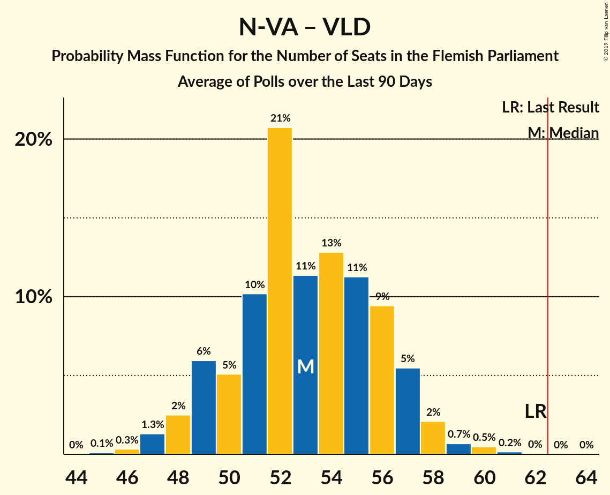

| Number of Seats | Probability | Accumulated | Special Marks |
|:---------------:|:-----------:|:-----------:|:-------------:|
| 45 | 0% | 100% |  |
| 46 | 0.2% | 99.9% |  |
| 47 | 0.7% | 99.8% |  |
| 48 | 1.3% | 99.1% |  |
| 49 | 3% | 98% |  |
| 50 | 3% | 95% |  |
| 51 | 6% | 91% |  |
| 52 | 12% | 85% |  |
| 53 | 9% | 73% |  |
| 54 | 14% | 64% |  |
| 55 | 14% | 50% | Median |
| 56 | 14% | 36% |  |
| 57 | 9% | 23% |  |
| 58 | 7% | 14% |  |
| 59 | 4% | 7% |  |
| 60 | 2% | 4% |  |
| 61 | 1.4% | 2% |  |
| 62 | 0.3% | 0.6% | Last Result |
| 63 | 0.2% | 0.2% | Majority |
| 64 | 0% | 0% |  |

### CD&V – sp.a – Groen

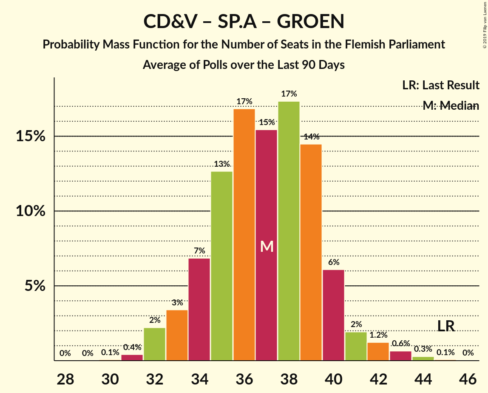

| Number of Seats | Probability | Accumulated | Special Marks |
|:---------------:|:-----------:|:-----------:|:-------------:|
| 45 | 0% | 100% |  |
| 46 | 0.1% | 99.9% |  |
| 47 | 0.7% | 99.8% |  |
| 48 | 2% | 99.1% |  |
| 49 | 3% | 97% |  |
| 50 | 5% | 94% |  |
| 51 | 6% | 89% |  |
| 52 | 15% | 83% |  |
| 53 | 13% | 68% |  |
| 54 | 16% | 55% | Median |
| 55 | 12% | 38% | Last Result |
| 56 | 11% | 27% |  |
| 57 | 10% | 16% |  |
| 58 | 3% | 6% |  |
| 59 | 2% | 3% |  |
| 60 | 0.8% | 1.2% |  |
| 61 | 0.2% | 0.4% |  |
| 62 | 0.1% | 0.1% |  |
| 63 | 0% | 0% | Majority |

### Open Vld – sp.a – Groen

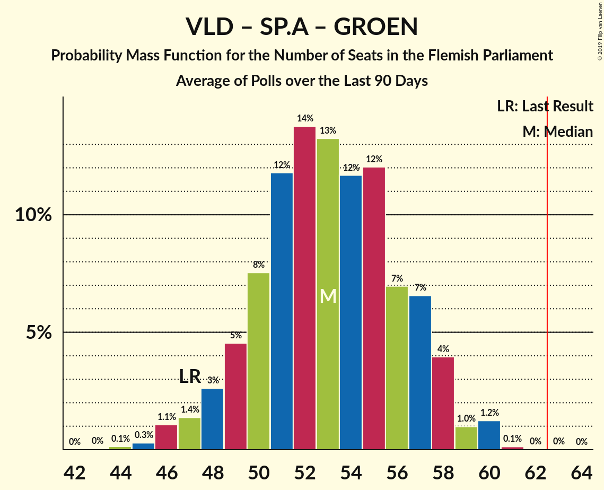

| Number of Seats | Probability | Accumulated | Special Marks |
|:---------------:|:-----------:|:-----------:|:-------------:|
| 44 | 0.1% | 100% |  |
| 45 | 0.3% | 99.8% |  |
| 46 | 1.1% | 99.5% |  |
| 47 | 1.4% | 98% | Last Result |
| 48 | 3% | 97% |  |
| 49 | 5% | 94% |  |
| 50 | 8% | 90% |  |
| 51 | 12% | 82% |  |
| 52 | 14% | 71% |  |
| 53 | 13% | 57% | Median |
| 54 | 12% | 44% |  |
| 55 | 12% | 32% |  |
| 56 | 7% | 20% |  |
| 57 | 7% | 13% |  |
| 58 | 4% | 6% |  |
| 59 | 1.0% | 2% |  |
| 60 | 1.2% | 1.4% |  |
| 61 | 0.1% | 0.2% |  |
| 62 | 0% | 0.1% |  |
| 63 | 0% | 0% | Majority |

### CD&V – Open Vld – sp.a

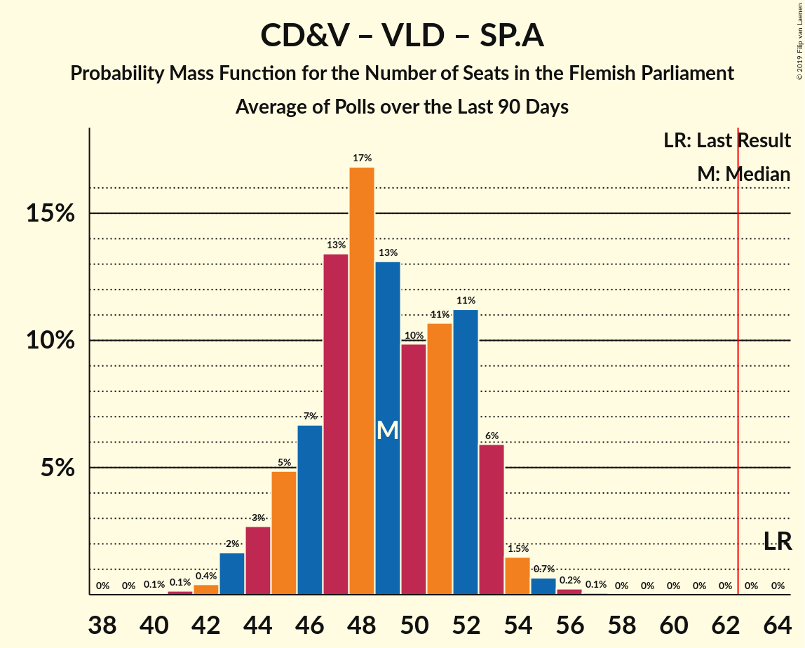

| Number of Seats | Probability | Accumulated | Special Marks |
|:---------------:|:-----------:|:-----------:|:-------------:|
| 41 | 0.1% | 100% |  |
| 42 | 0.2% | 99.9% |  |
| 43 | 0.8% | 99.7% |  |
| 44 | 1.4% | 98.9% |  |
| 45 | 3% | 97% |  |
| 46 | 4% | 95% |  |
| 47 | 8% | 91% |  |
| 48 | 11% | 83% |  |
| 49 | 11% | 73% |  |
| 50 | 8% | 62% |  |
| 51 | 12% | 54% | Median |
| 52 | 10% | 42% |  |
| 53 | 9% | 32% |  |
| 54 | 11% | 23% |  |
| 55 | 5% | 11% |  |
| 56 | 3% | 7% |  |
| 57 | 2% | 4% |  |
| 58 | 2% | 2% |  |
| 59 | 0.3% | 0.4% |  |
| 60 | 0.1% | 0.1% |  |
| 61 | 0% | 0% |  |
| 62 | 0% | 0% |  |
| 63 | 0% | 0% | Majority |
| 64 | 0% | 0% | Last Result |

### N-VA – Vlaams Belang

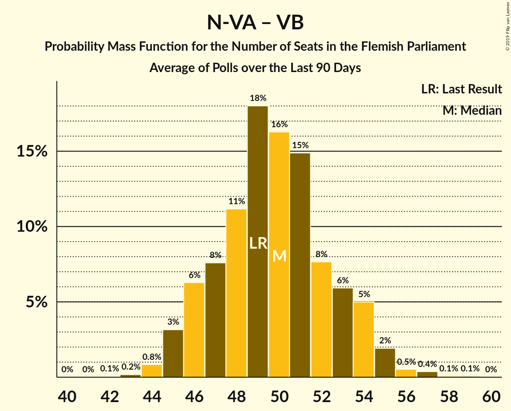

| Number of Seats | Probability | Accumulated | Special Marks |
|:---------------:|:-----------:|:-----------:|:-------------:|
| 40 | 0.1% | 100% |  |
| 41 | 0.3% | 99.9% |  |
| 42 | 0.8% | 99.7% |  |
| 43 | 2% | 98.8% |  |
| 44 | 3% | 97% |  |
| 45 | 6% | 95% |  |
| 46 | 15% | 89% |  |
| 47 | 11% | 74% |  |
| 48 | 15% | 63% |  |
| 49 | 13% | 48% | Last Result, Median |
| 50 | 11% | 35% |  |
| 51 | 11% | 24% |  |
| 52 | 5% | 13% |  |
| 53 | 4% | 8% |  |
| 54 | 3% | 4% |  |
| 55 | 1.0% | 2% |  |
| 56 | 0.3% | 0.5% |  |
| 57 | 0.2% | 0.3% |  |
| 58 | 0% | 0.1% |  |
| 59 | 0% | 0% |  |

### CD&V – Open Vld

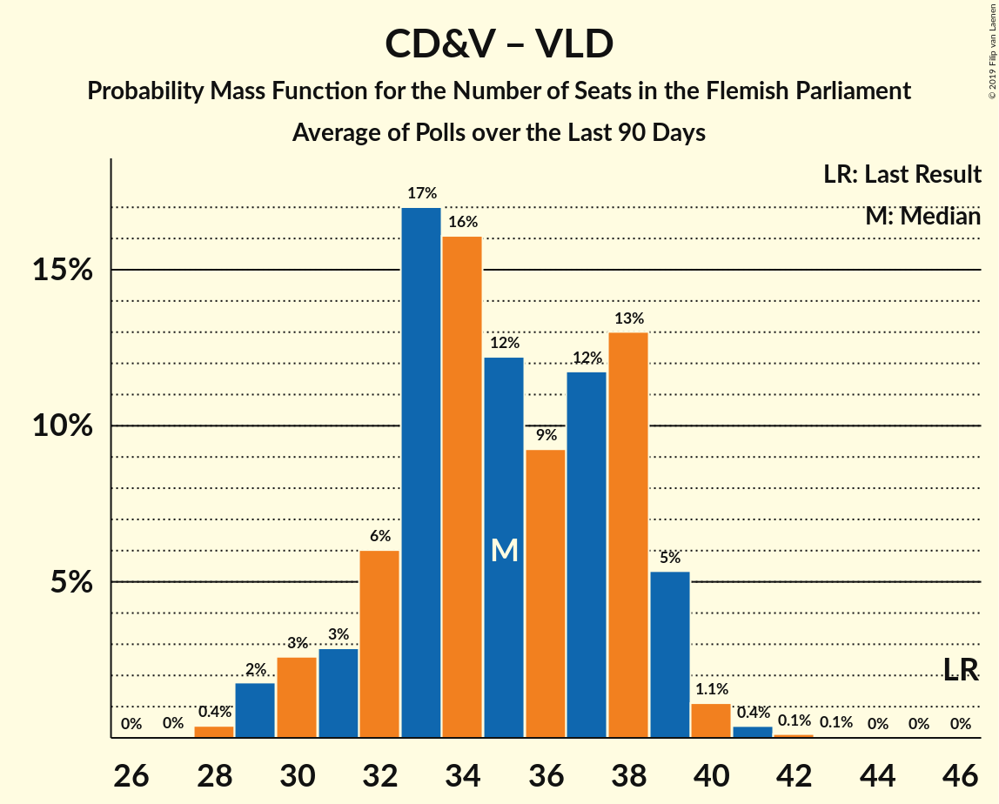

| Number of Seats | Probability | Accumulated | Special Marks |
|:---------------:|:-----------:|:-----------:|:-------------:|
| 28 | 0.2% | 100% |  |
| 29 | 0.9% | 99.8% |  |
| 30 | 1.4% | 98.9% |  |
| 31 | 2% | 97% |  |
| 32 | 5% | 96% |  |
| 33 | 14% | 91% |  |
| 34 | 14% | 77% |  |
| 35 | 13% | 63% |  |
| 36 | 9% | 50% |  |
| 37 | 10% | 41% | Median |
| 38 | 11% | 32% |  |
| 39 | 13% | 20% |  |
| 40 | 6% | 8% |  |
| 41 | 1.2% | 2% |  |
| 42 | 0.6% | 1.0% |  |
| 43 | 0.3% | 0.4% |  |
| 44 | 0.1% | 0.1% |  |
| 45 | 0% | 0% |  |
| 46 | 0% | 0% | Last Result |

### Open Vld – sp.a

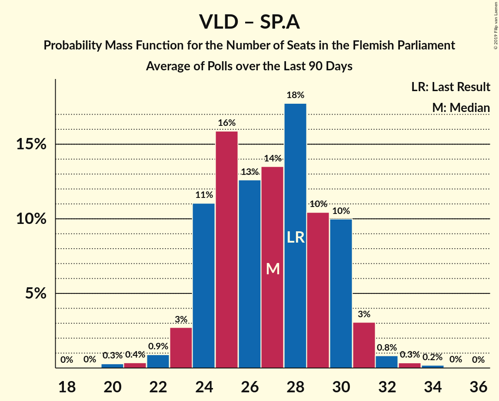

| Number of Seats | Probability | Accumulated | Special Marks |
|:---------------:|:-----------:|:-----------:|:-------------:|
| 23 | 0.1% | 100% |  |
| 24 | 0.1% | 99.9% |  |
| 25 | 0.4% | 99.8% |  |
| 26 | 2% | 99.4% |  |
| 27 | 4% | 98% |  |
| 28 | 6% | 94% |  |
| 29 | 6% | 87% |  |
| 30 | 8% | 82% |  |
| 31 | 12% | 74% |  |
| 32 | 12% | 62% | Median |
| 33 | 11% | 50% |  |
| 34 | 14% | 39% |  |
| 35 | 7% | 25% |  |
| 36 | 6% | 18% |  |
| 37 | 6% | 13% | Last Result |
| 38 | 4% | 7% |  |
| 39 | 2% | 3% |  |
| 40 | 0.6% | 0.9% |  |
| 41 | 0.2% | 0.3% |  |
| 42 | 0.1% | 0.2% |  |
| 43 | 0% | 0% |  |

### CD&V – sp.a

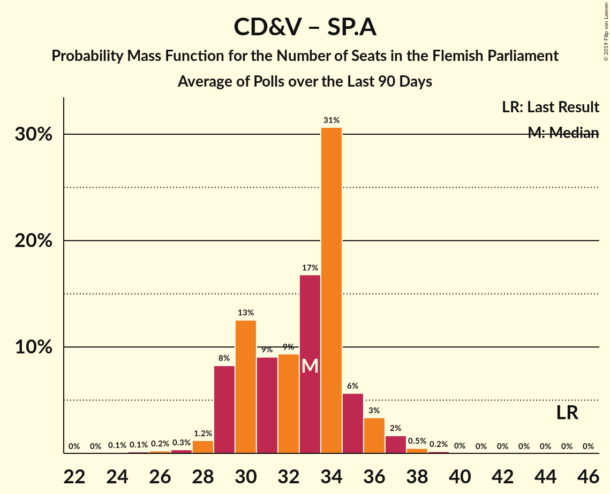

| Number of Seats | Probability | Accumulated | Special Marks |
|:---------------:|:-----------:|:-----------:|:-------------:|
| 25 | 0.1% | 100% |  |
| 26 | 0.1% | 99.9% |  |
| 27 | 0.2% | 99.8% |  |
| 28 | 0.7% | 99.6% |  |
| 29 | 6% | 98.9% |  |
| 30 | 10% | 93% |  |
| 31 | 8% | 82% |  |
| 32 | 8% | 74% |  |
| 33 | 13% | 66% | Median |
| 34 | 28% | 54% |  |
| 35 | 12% | 25% |  |
| 36 | 7% | 14% |  |
| 37 | 3% | 7% |  |
| 38 | 2% | 4% |  |
| 39 | 2% | 2% |  |
| 40 | 0.1% | 0.1% |  |
| 41 | 0% | 0% |  |
| 42 | 0% | 0% |  |
| 43 | 0% | 0% |  |
| 44 | 0% | 0% |  |
| 45 | 0% | 0% | Last Result |

## Technical Information

+ **Number of polls included in this average:** 2
+ **Lowest number of simulations done in a poll included in this average:** 262,144
+ **Total number of simulations done in the polls included in this average:** 1,310,720
+ **Error estimate:** 1.94%
