# Poll Average

<a href="#voting-intentions">Voting Intentions</a> | <a href="#seats">Seats</a> | <a href="#coalitions">Coalitions</a> | <a href="#technical-information">Technical Information</a>

## Summary

The table below lists the polls on which the average is based. They are the most recent polls (less than 90 days old) registered and analyzed so far.

| Period     | Polling firm/Commissioner(s) | N-VA | VB | VOORUIT | CD&V | VLD | PVDA | GROEN | TFA |
|:----------:|:----------------------------:|:--:|:--:|:--:|:--:|:--:|:--:|:--:|:--:|
| 9 June 2024 | General Election | 23.9%   31 | 22.7%   31 | 13.8%   18 | 13.0%   16 | 8.3%   9 | 8.3%   9 | 7.3%   9 | 0.3%   1 |
| N/A | Poll Average | 22–27%   29–37 | 21–26%   27–35 | 13–18%   16–23 | 11–16%   12–19 | 6–9%   3–11 | 6–10%   6–11 | 6–9%   5–11 | 0–1%   0–4 |
| [18–21 November 2024](2024-11-21-Ipsos.html) | Ipsos   Het Laatste Nieuws, Le Soir, RTL TVi and VTM | 22–27%   29–37 | 21–26%   27–35 | 13–18%   16–23 | 11–16%   12–19 | 6–9%   3–11 | 6–10%   6–11 | 5–9%   5–11 | 0–1%   0–4 |
| 9 June 2024 | General Election | 23.9%   31 | 22.7%   31 | 13.8%   18 | 13.0%   16 | 8.3%   9 | 8.3%   9 | 7.3%   9 | 0.3%   1 |

Only polls for which at least the sample size has been published are included in the table above.

**Legend:**
+ **Top half of each row:** Voting intentions (95% confidence interval)
+ **Bottom half of each row:** Seat projections for the Flemish Parliament (95% confidence interval)
+ **N-VA:** Nieuw-Vlaamse Alliantie
+ **VB:** Vlaams Belang
+ **VOORUIT:** Vooruit
+ **CD&V:** Christen-Democratisch en Vlaams
+ **VLD:** Open Vlaamse Liberalen en Democraten
+ **PVDA:** Partij van de Arbeid van België
+ **GROEN:** Groen
+ **TFA:** Team Fouad Ahidar
+ **N/A (single party):** Party not included the published results
+ **N/A (entire row):** Calculation for this opinion poll not started yet

## Voting Intentions

### Confidence Intervals

| Party | Last Result | Median | 80% Confidence Interval | 90% Confidence Interval | 95% Confidence Interval | 99% Confidence Interval |
|:-----:|:-----------:|:------:|:-----------------------:|:-----------------------:|:-----------------------:|:-----------------------:|
| <a href="#nieuw-vlaamse-alliantie">Nieuw-Vlaamse Alliantie</a> | 23.9% | 24.6% | 22.9–26.4% |22.4–26.9% | 22.0–27.4% | 21.2–28.3% |
| <a href="#vlaams-belang">Vlaams Belang</a> | 22.7% | 23.5% | 21.8–25.3% |21.4–25.8% | 21.0–26.2% | 20.2–27.1% |
| <a href="#vooruit">Vooruit</a> | 13.8% | 15.5% | 14.1–17.0% |13.7–17.5% | 13.4–17.9% | 12.7–18.6% |
| <a href="#christen-democratisch-en-vlaams">Christen-Democratisch en Vlaams</a> | 13.0% | 13.3% | 12.0–14.8% |11.7–15.2% | 11.3–15.6% | 10.7–16.3% |
| <a href="#open-vlaamse-liberalen-en-democraten">Open Vlaamse Liberalen en Democraten</a> | 8.3% | 7.3% | 6.3–8.4% |6.0–8.7% | 5.8–9.0% | 5.3–9.6% |
| <a href="#partij-van-de-arbeid-van-belgië">Partij van de Arbeid van België</a> | 8.3% | 7.9% | 6.9–9.1% |6.6–9.4% | 6.4–9.7% | 5.9–10.3% |
| <a href="#groen">Groen</a> | 7.3% | 7.0% | 6.0–8.0% |5.7–8.4% | 5.5–8.6% | 5.1–9.2% |
| <a href="#team-fouad-ahidar">Team Fouad Ahidar</a> | 0.3% | 0.4% | 0.2–0.7% |0.1–0.8% | 0.1–0.9% | 0.1–1.1% |

### Nieuw-Vlaamse Alliantie

*For a full overview of the results for this party, see the [Nieuw-Vlaamse Alliantie](party-nieuw-vlaamsealliantie.html) page.*

| Voting Intentions | Probability | Accumulated | Special Marks |
|:-----------------:|:-----------:|:-----------:|:-------------:|
| 18.5–19.5% | 0% | 100% |  |
| 19.5–20.5% | 0.1% | 100% |  |
| 20.5–21.5% | 0.9% | 99.9% |  |
| 21.5–22.5% | 5% | 99.0% |  |
| 22.5–23.5% | 15% | 94% |  |
| 23.5–24.5% | 27% | 79% | Last Result |
| 24.5–25.5% | 27% | 52% | Median |
| 25.5–26.5% | 17% | 25% |  |
| 26.5–27.5% | 6% | 8% |  |
| 27.5–28.5% | 2% | 2% |  |
| 28.5–29.5% | 0.2% | 0.3% |  |
| 29.5–30.5% | 0% | 0% |  |

### Vlaams Belang

*For a full overview of the results for this party, see the [Vlaams Belang](party-vlaamsbelang.html) page.*

| Voting Intentions | Probability | Accumulated | Special Marks |
|:-----------------:|:-----------:|:-----------:|:-------------:|
| 17.5–18.5% | 0% | 100% |  |
| 18.5–19.5% | 0.1% | 100% |  |
| 19.5–20.5% | 1.0% | 99.9% |  |
| 20.5–21.5% | 5% | 98.9% |  |
| 21.5–22.5% | 17% | 93% |  |
| 22.5–23.5% | 27% | 77% | Last Result |
| 23.5–24.5% | 27% | 50% | Median |
| 24.5–25.5% | 16% | 23% |  |
| 25.5–26.5% | 6% | 7% |  |
| 26.5–27.5% | 1.2% | 1.4% |  |
| 27.5–28.5% | 0.2% | 0.2% |  |
| 28.5–29.5% | 0% | 0% |  |

### Vooruit

*For a full overview of the results for this party, see the [Vooruit](party-vooruit.html) page.*

| Voting Intentions | Probability | Accumulated | Special Marks |
|:-----------------:|:-----------:|:-----------:|:-------------:|
| 10.5–11.5% | 0% | 100% |  |
| 11.5–12.5% | 0.3% | 100% |  |
| 12.5–13.5% | 3% | 99.7% |  |
| 13.5–14.5% | 15% | 96% | Last Result |
| 14.5–15.5% | 31% | 81% |  |
| 15.5–16.5% | 31% | 50% | Median |
| 16.5–17.5% | 15% | 19% |  |
| 17.5–18.5% | 4% | 5% |  |
| 18.5–19.5% | 0.6% | 0.6% |  |
| 19.5–20.5% | 0% | 0% |  |
| 20.5–21.5% | 0% | 0% |  |

### Christen-Democratisch en Vlaams

*For a full overview of the results for this party, see the [Christen-Democratisch en Vlaams](party-christen-democratischenvlaams.html) page.*

| Voting Intentions | Probability | Accumulated | Special Marks |
|:-----------------:|:-----------:|:-----------:|:-------------:|
| 8.5–9.5% | 0% | 100% |  |
| 9.5–10.5% | 0.3% | 100% |  |
| 10.5–11.5% | 4% | 99.7% |  |
| 11.5–12.5% | 18% | 96% |  |
| 12.5–13.5% | 35% | 78% | Last Result, Median |
| 13.5–14.5% | 29% | 43% |  |
| 14.5–15.5% | 11% | 14% |  |
| 15.5–16.5% | 2% | 3% |  |
| 16.5–17.5% | 0.2% | 0.3% |  |
| 17.5–18.5% | 0% | 0% |  |

### Open Vlaamse Liberalen en Democraten

*For a full overview of the results for this party, see the [Open Vlaamse Liberalen en Democraten](party-openvlaamseliberalenendemocraten.html) page.*

| Voting Intentions | Probability | Accumulated | Special Marks |
|:-----------------:|:-----------:|:-----------:|:-------------:|
| 3.5–4.5% | 0% | 100% |  |
| 4.5–5.5% | 1.2% | 100% |  |
| 5.5–6.5% | 18% | 98.8% |  |
| 6.5–7.5% | 45% | 81% | Median |
| 7.5–8.5% | 30% | 36% | Last Result |
| 8.5–9.5% | 6% | 7% |  |
| 9.5–10.5% | 0.5% | 0.5% |  |
| 10.5–11.5% | 0% | 0% |  |

### Partij van de Arbeid van België

*For a full overview of the results for this party, see the [Partij van de Arbeid van België](party-partijvandearbeidvanbelgië.html) page.*

| Voting Intentions | Probability | Accumulated | Special Marks |
|:-----------------:|:-----------:|:-----------:|:-------------:|
| 3.5–4.5% | 0% | 100% |  |
| 4.5–5.5% | 0.1% | 100% |  |
| 5.5–6.5% | 4% | 99.9% |  |
| 6.5–7.5% | 27% | 96% |  |
| 7.5–8.5% | 44% | 69% | Last Result, Median |
| 8.5–9.5% | 21% | 25% |  |
| 9.5–10.5% | 4% | 4% |  |
| 10.5–11.5% | 0.3% | 0.3% |  |
| 11.5–12.5% | 0% | 0% |  |

### Groen

*For a full overview of the results for this party, see the [Groen](party-groen.html) page.*

| Voting Intentions | Probability | Accumulated | Special Marks |
|:-----------------:|:-----------:|:-----------:|:-------------:|
| 3.5–4.5% | 0% | 100% |  |
| 4.5–5.5% | 3% | 100% |  |
| 5.5–6.5% | 27% | 97% |  |
| 6.5–7.5% | 46% | 70% | Last Result, Median |
| 7.5–8.5% | 21% | 24% |  |
| 8.5–9.5% | 3% | 3% |  |
| 9.5–10.5% | 0.2% | 0.2% |  |
| 10.5–11.5% | 0% | 0% |  |

### Team Fouad Ahidar

*For a full overview of the results for this party, see the [Team Fouad Ahidar](party-teamfouadahidar.html) page.*

| Voting Intentions | Probability | Accumulated | Special Marks |
|:-----------------:|:-----------:|:-----------:|:-------------:|
| 0.0–0.5% | 80% | 100% | Last Result, Median |
| 0.5–1.5% | 20% | 20% |  |
| 1.5–2.5% | 0% | 0% |  |

## Seats

### Confidence Intervals

| Party | Last Result | Median | 80% Confidence Interval | 90% Confidence Interval | 95% Confidence Interval | 99% Confidence Interval |
|:-----:|:-----------:|:------:|:-----------------------:|:-----------------------:|:-----------------------:|:-----------------------:|
| <a href="#nieuw-vlaamse-alliantie">Nieuw-Vlaamse Alliantie</a> | 31 | 32 | 30–35 |29–36 | 29–37 | 27–38 |
| <a href="#vlaams-belang">Vlaams Belang</a> | 31 | 31 | 28–34 |27–34 | 27–35 | 25–36 |
| <a href="#vooruit">Vooruit</a> | 18 | 19 | 17–22 |17–23 | 16–23 | 16–24 |
| <a href="#christen-democratisch-en-vlaams">Christen-Democratisch en Vlaams</a> | 16 | 16 | 15–18 |14–19 | 12–19 | 12–20 |
| <a href="#open-vlaamse-liberalen-en-democraten">Open Vlaamse Liberalen en Democraten</a> | 9 | 6 | 5–9 |5–10 | 3–11 | 2–12 |
| <a href="#partij-van-de-arbeid-van-belgië">Partij van de Arbeid van België</a> | 9 | 8 | 6–10 |6–10 | 6–11 | 5–12 |
| <a href="#groen">Groen</a> | 9 | 8 | 6–11 |5–11 | 5–11 | 4–12 |
| <a href="#team-fouad-ahidar">Team Fouad Ahidar</a> | 1 | 1 | 1–3 |0–3 | 0–4 | 0–4 |

### Nieuw-Vlaamse Alliantie

*For a full overview of the results for this party, see the [Nieuw-Vlaamse Alliantie](party-nieuw-vlaamsealliantie.html) page.*

| Number of Seats | Probability | Accumulated | Special Marks |
|:---------------:|:-----------:|:-----------:|:-------------:|
| 25 | 0.2% | 100% |  |
| 26 | 0.1% | 99.8% |  |
| 27 | 0.8% | 99.7% |  |
| 28 | 1.0% | 99.0% |  |
| 29 | 6% | 98% |  |
| 30 | 12% | 92% |  |
| 31 | 15% | 81% | Last Result |
| 32 | 17% | 65% | Median |
| 33 | 16% | 48% |  |
| 34 | 11% | 32% |  |
| 35 | 13% | 20% |  |
| 36 | 5% | 8% |  |
| 37 | 2% | 3% |  |
| 38 | 0.7% | 0.9% |  |
| 39 | 0.2% | 0.2% |  |
| 40 | 0% | 0% |  |

### Vlaams Belang

*For a full overview of the results for this party, see the [Vlaams Belang](party-vlaamsbelang.html) page.*

| Number of Seats | Probability | Accumulated | Special Marks |
|:---------------:|:-----------:|:-----------:|:-------------:|
| 24 | 0.1% | 100% |  |
| 25 | 0.7% | 99.9% |  |
| 26 | 2% | 99.2% |  |
| 27 | 4% | 98% |  |
| 28 | 5% | 93% |  |
| 29 | 11% | 88% |  |
| 30 | 18% | 77% |  |
| 31 | 18% | 60% | Last Result, Median |
| 32 | 19% | 42% |  |
| 33 | 7% | 22% |  |
| 34 | 11% | 15% |  |
| 35 | 3% | 5% |  |
| 36 | 1.3% | 2% |  |
| 37 | 0.3% | 0.3% |  |
| 38 | 0.1% | 0.1% |  |
| 39 | 0% | 0% |  |

### Vooruit

*For a full overview of the results for this party, see the [Vooruit](party-vooruit.html) page.*

| Number of Seats | Probability | Accumulated | Special Marks |
|:---------------:|:-----------:|:-----------:|:-------------:|
| 14 | 0.1% | 100% |  |
| 15 | 0.2% | 99.9% |  |
| 16 | 4% | 99.7% |  |
| 17 | 11% | 96% |  |
| 18 | 22% | 85% | Last Result |
| 19 | 15% | 63% | Median |
| 20 | 23% | 47% |  |
| 21 | 10% | 24% |  |
| 22 | 5% | 14% |  |
| 23 | 7% | 9% |  |
| 24 | 1.2% | 2% |  |
| 25 | 0.3% | 0.4% |  |
| 26 | 0% | 0% |  |

### Christen-Democratisch en Vlaams

*For a full overview of the results for this party, see the [Christen-Democratisch en Vlaams](party-christen-democratischenvlaams.html) page.*

| Number of Seats | Probability | Accumulated | Special Marks |
|:---------------:|:-----------:|:-----------:|:-------------:|
| 11 | 0.4% | 100% |  |
| 12 | 2% | 99.6% |  |
| 13 | 2% | 97% |  |
| 14 | 5% | 96% |  |
| 15 | 5% | 90% |  |
| 16 | 41% | 85% | Last Result, Median |
| 17 | 27% | 44% |  |
| 18 | 9% | 17% |  |
| 19 | 6% | 8% |  |
| 20 | 2% | 2% |  |
| 21 | 0.3% | 0.4% |  |
| 22 | 0.1% | 0.1% |  |
| 23 | 0% | 0% |  |

### Open Vlaamse Liberalen en Democraten

*For a full overview of the results for this party, see the [Open Vlaamse Liberalen en Democraten](party-openvlaamseliberalenendemocraten.html) page.*

| Number of Seats | Probability | Accumulated | Special Marks |
|:---------------:|:-----------:|:-----------:|:-------------:|
| 2 | 0.6% | 100% |  |
| 3 | 2% | 99.4% |  |
| 4 | 0.7% | 97% |  |
| 5 | 13% | 97% |  |
| 6 | 34% | 83% | Median |
| 7 | 21% | 49% |  |
| 8 | 9% | 28% |  |
| 9 | 10% | 19% | Last Result |
| 10 | 4% | 9% |  |
| 11 | 2% | 5% |  |
| 12 | 2% | 2% |  |
| 13 | 0% | 0% |  |

### Partij van de Arbeid van België

*For a full overview of the results for this party, see the [Partij van de Arbeid van België](party-partijvandearbeidvanbelgië.html) page.*

| Number of Seats | Probability | Accumulated | Special Marks |
|:---------------:|:-----------:|:-----------:|:-------------:|
| 4 | 0.1% | 100% |  |
| 5 | 2% | 99.9% |  |
| 6 | 16% | 98% |  |
| 7 | 32% | 82% |  |
| 8 | 10% | 51% | Median |
| 9 | 8% | 40% | Last Result |
| 10 | 28% | 32% |  |
| 11 | 3% | 4% |  |
| 12 | 0.5% | 0.8% |  |
| 13 | 0.2% | 0.3% |  |
| 14 | 0.1% | 0.1% |  |
| 15 | 0% | 0% |  |

### Groen

*For a full overview of the results for this party, see the [Groen](party-groen.html) page.*

| Number of Seats | Probability | Accumulated | Special Marks |
|:---------------:|:-----------:|:-----------:|:-------------:|
| 2 | 0% | 100% |  |
| 3 | 0.2% | 99.9% |  |
| 4 | 0.7% | 99.8% |  |
| 5 | 7% | 99.1% |  |
| 6 | 17% | 92% |  |
| 7 | 11% | 75% |  |
| 8 | 19% | 64% | Median |
| 9 | 22% | 45% | Last Result |
| 10 | 9% | 23% |  |
| 11 | 13% | 14% |  |
| 12 | 0.8% | 0.9% |  |
| 13 | 0.1% | 0.1% |  |
| 14 | 0% | 0% |  |

### Team Fouad Ahidar

*For a full overview of the results for this party, see the [Team Fouad Ahidar](party-teamfouadahidar.html) page.*

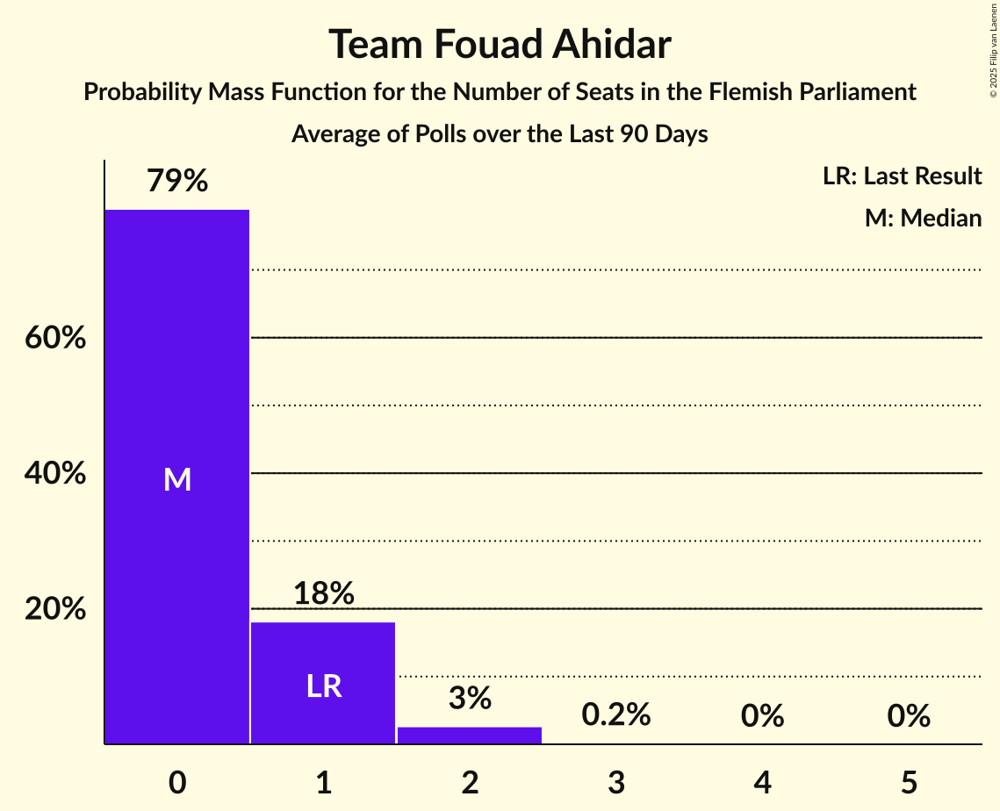

| Number of Seats | Probability | Accumulated | Special Marks |
|:---------------:|:-----------:|:-----------:|:-------------:|
| 0 | 7% | 100% |  |
| 1 | 46% | 93% | Last Result, Median |
| 2 | 28% | 48% |  |
| 3 | 17% | 20% |  |
| 4 | 3% | 3% |  |
| 5 | 0.3% | 0.3% |  |
| 6 | 0% | 0% |  |

## Coalitions

### Confidence Intervals

| Coalition | Last Result | Median | Majority? | 80% Confidence Interval | 90% Confidence Interval | 95% Confidence Interval | 99% Confidence Interval |
|:---------:|:-----------:|:------:|:---------:|:-----------------------:|:-----------------------:|:-----------------------:|:-----------------------:|
| Nieuw-Vlaamse Alliantie – Vlaams Belang – Christen-Democratisch en Vlaams | 78 | 80 | 100% | 76–84 | 75–84 | 74–85 | 72–86 |
| Nieuw-Vlaamse Alliantie – Vooruit – Christen-Democratisch en Vlaams – Open Vlaamse Liberalen en Democraten | 74 | 75 | 100% | 72–79 | 71–80 | 70–81 | 69–82 |
| Nieuw-Vlaamse Alliantie – Vooruit – Christen-Democratisch en Vlaams | 65 | 68 | 98.7% | 65–72 | 64–72 | 63–73 | 61–75 |
| Nieuw-Vlaamse Alliantie – Vlaams Belang | 62 | 63 | 65% | 60–67 | 59–68 | 58–69 | 56–71 |
| Nieuw-Vlaamse Alliantie – Vooruit – Open Vlaamse Liberalen en Democraten | 58 | 58 | 10% | 56–62 | 55–63 | 54–65 | 53–67 |
| Nieuw-Vlaamse Alliantie – Christen-Democratisch en Vlaams – Open Vlaamse Liberalen en Democraten | 56 | 56 | 1.1% | 52–59 | 52–60 | 50–61 | 49–63 |
| Vooruit – Christen-Democratisch en Vlaams – Partij van de Arbeid van België – Groen | 52 | 52 | 0% | 49–56 | 47–57 | 46–58 | 45–59 |
| Vooruit – Christen-Democratisch en Vlaams – Open Vlaamse Liberalen en Democraten – Groen | 52 | 50 | 0% | 47–54 | 47–56 | 45–56 | 44–58 |
| Nieuw-Vlaamse Alliantie – Christen-Democratisch en Vlaams | 47 | 49 | 0% | 46–52 | 45–53 | 44–53 | 42–55 |
| Vooruit – Christen-Democratisch en Vlaams – Groen | 43 | 44 | 0% | 41–47 | 39–48 | 38–50 | 37–50 |
| Vooruit – Christen-Democratisch en Vlaams – Open Vlaamse Liberalen en Democraten | 43 | 43 | 0% | 39–46 | 39–47 | 38–48 | 36–50 |
| Nieuw-Vlaamse Alliantie – Open Vlaamse Liberalen en Democraten | 40 | 39 | 0% | 36–43 | 36–44 | 35–45 | 33–47 |
| Vooruit – Christen-Democratisch en Vlaams | 34 | 36 | 0% | 33–39 | 32–40 | 32–40 | 30–41 |
| Vooruit – Open Vlaamse Liberalen en Democraten – Groen | 36 | 34 | 0% | 31–38 | 30–39 | 29–40 | 28–42 |
| Christen-Democratisch en Vlaams – Open Vlaamse Liberalen en Democraten – Groen | 34 | 31 | 0% | 28–34 | 27–36 | 27–36 | 25–38 |
| Vooruit – Open Vlaamse Liberalen en Democraten | 27 | 26 | 0% | 23–30 | 23–31 | 22–31 | 21–33 |
| Christen-Democratisch en Vlaams – Open Vlaamse Liberalen en Democraten | 25 | 23 | 0% | 21–26 | 20–27 | 19–28 | 18–29 |

### Nieuw-Vlaamse Alliantie – Vlaams Belang – Christen-Democratisch en Vlaams

| Number of Seats | Probability | Accumulated | Special Marks |
|:---------------:|:-----------:|:-----------:|:-------------:|
| 71 | 0.2% | 100% |  |
| 72 | 0.4% | 99.8% |  |
| 73 | 1.1% | 99.4% |  |
| 74 | 2% | 98% |  |
| 75 | 3% | 97% |  |
| 76 | 8% | 94% |  |
| 77 | 10% | 86% |  |
| 78 | 8% | 77% | Last Result |
| 79 | 15% | 69% | Median |
| 80 | 11% | 54% |  |
| 81 | 12% | 43% |  |
| 82 | 12% | 31% |  |
| 83 | 5% | 20% |  |
| 84 | 11% | 15% |  |
| 85 | 2% | 4% |  |
| 86 | 0.9% | 1.3% |  |
| 87 | 0.2% | 0.4% |  |
| 88 | 0.2% | 0.2% |  |
| 89 | 0% | 0% |  |

### Nieuw-Vlaamse Alliantie – Vooruit – Christen-Democratisch en Vlaams – Open Vlaamse Liberalen en Democraten

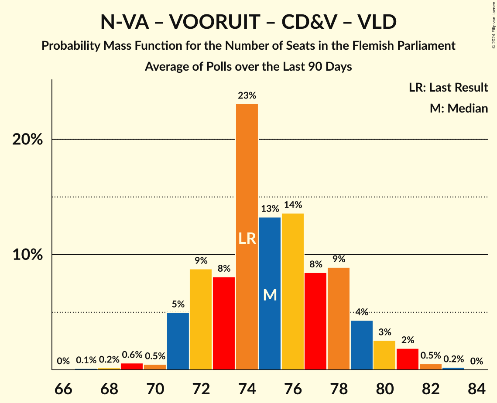

| Number of Seats | Probability | Accumulated | Special Marks |
|:---------------:|:-----------:|:-----------:|:-------------:|
| 67 | 0.1% | 100% |  |
| 68 | 0.2% | 99.8% |  |
| 69 | 0.7% | 99.7% |  |
| 70 | 2% | 99.0% |  |
| 71 | 5% | 97% |  |
| 72 | 10% | 92% |  |
| 73 | 8% | 82% | Median |
| 74 | 17% | 75% | Last Result |
| 75 | 14% | 57% |  |
| 76 | 14% | 43% |  |
| 77 | 10% | 29% |  |
| 78 | 8% | 19% |  |
| 79 | 5% | 11% |  |
| 80 | 3% | 6% |  |
| 81 | 2% | 3% |  |
| 82 | 0.7% | 1.1% |  |
| 83 | 0.3% | 0.4% |  |
| 84 | 0.1% | 0.1% |  |
| 85 | 0% | 0% |  |

### Nieuw-Vlaamse Alliantie – Vooruit – Christen-Democratisch en Vlaams

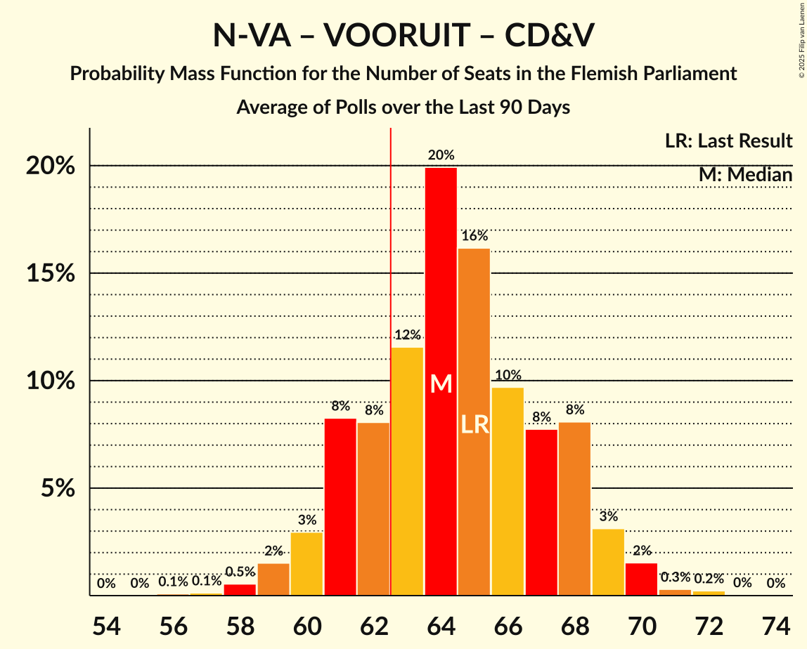

| Number of Seats | Probability | Accumulated | Special Marks |
|:---------------:|:-----------:|:-----------:|:-------------:|
| 60 | 0.2% | 100% |  |
| 61 | 0.3% | 99.8% |  |
| 62 | 0.7% | 99.5% |  |
| 63 | 2% | 98.7% | Majority |
| 64 | 3% | 97% |  |
| 65 | 10% | 94% | Last Result |
| 66 | 14% | 84% |  |
| 67 | 6% | 71% | Median |
| 68 | 18% | 65% |  |
| 69 | 14% | 46% |  |
| 70 | 13% | 33% |  |
| 71 | 9% | 20% |  |
| 72 | 6% | 11% |  |
| 73 | 3% | 5% |  |
| 74 | 1.3% | 2% |  |
| 75 | 0.4% | 0.7% |  |
| 76 | 0.2% | 0.3% |  |
| 77 | 0.1% | 0.1% |  |
| 78 | 0% | 0% |  |

### Nieuw-Vlaamse Alliantie – Vlaams Belang

| Number of Seats | Probability | Accumulated | Special Marks |
|:---------------:|:-----------:|:-----------:|:-------------:|
| 55 | 0.1% | 100% |  |
| 56 | 0.8% | 99.9% |  |
| 57 | 0.8% | 99.0% |  |
| 58 | 3% | 98% |  |
| 59 | 3% | 95% |  |
| 60 | 8% | 92% |  |
| 61 | 8% | 84% |  |
| 62 | 12% | 77% | Last Result |
| 63 | 15% | 65% | Median, Majority |
| 64 | 15% | 50% |  |
| 65 | 9% | 35% |  |
| 66 | 8% | 25% |  |
| 67 | 11% | 17% |  |
| 68 | 2% | 5% |  |
| 69 | 3% | 3% |  |
| 70 | 0.3% | 0.9% |  |
| 71 | 0.5% | 0.6% |  |
| 72 | 0.1% | 0.1% |  |
| 73 | 0% | 0% |  |

### Nieuw-Vlaamse Alliantie – Vooruit – Open Vlaamse Liberalen en Democraten

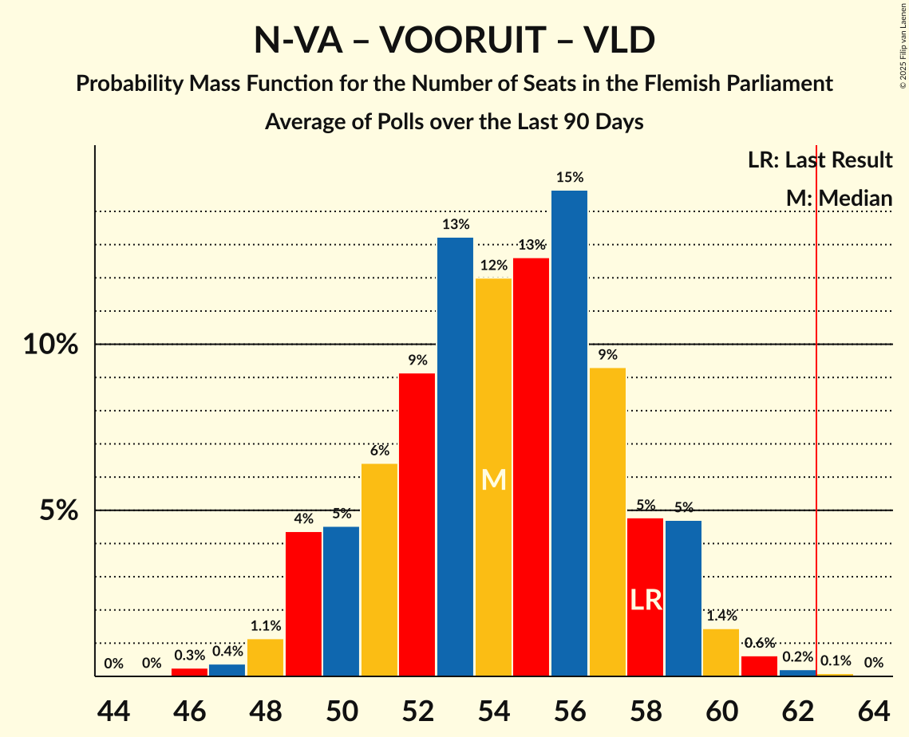

| Number of Seats | Probability | Accumulated | Special Marks |
|:---------------:|:-----------:|:-----------:|:-------------:|
| 51 | 0.1% | 100% |  |
| 52 | 0.3% | 99.9% |  |
| 53 | 0.6% | 99.6% |  |
| 54 | 3% | 99.0% |  |
| 55 | 6% | 96% |  |
| 56 | 10% | 91% |  |
| 57 | 17% | 81% | Median |
| 58 | 15% | 64% | Last Result |
| 59 | 15% | 49% |  |
| 60 | 9% | 34% |  |
| 61 | 10% | 25% |  |
| 62 | 5% | 15% |  |
| 63 | 5% | 10% | Majority |
| 64 | 2% | 5% |  |
| 65 | 2% | 3% |  |
| 66 | 0.7% | 1.3% |  |
| 67 | 0.3% | 0.6% |  |
| 68 | 0.2% | 0.2% |  |
| 69 | 0.1% | 0.1% |  |
| 70 | 0% | 0% |  |

### Nieuw-Vlaamse Alliantie – Christen-Democratisch en Vlaams – Open Vlaamse Liberalen en Democraten

| Number of Seats | Probability | Accumulated | Special Marks |
|:---------------:|:-----------:|:-----------:|:-------------:|
| 47 | 0.1% | 100% |  |
| 48 | 0.1% | 99.9% |  |
| 49 | 0.6% | 99.8% |  |
| 50 | 2% | 99.2% |  |
| 51 | 2% | 97% |  |
| 52 | 7% | 95% |  |
| 53 | 9% | 88% |  |
| 54 | 10% | 79% | Median |
| 55 | 15% | 69% |  |
| 56 | 17% | 54% | Last Result |
| 57 | 13% | 38% |  |
| 58 | 10% | 25% |  |
| 59 | 7% | 15% |  |
| 60 | 4% | 8% |  |
| 61 | 2% | 4% |  |
| 62 | 0.9% | 2% |  |
| 63 | 0.8% | 1.1% | Majority |
| 64 | 0.3% | 0.3% |  |
| 65 | 0% | 0.1% |  |
| 66 | 0% | 0% |  |

### Vooruit – Christen-Democratisch en Vlaams – Partij van de Arbeid van België – Groen

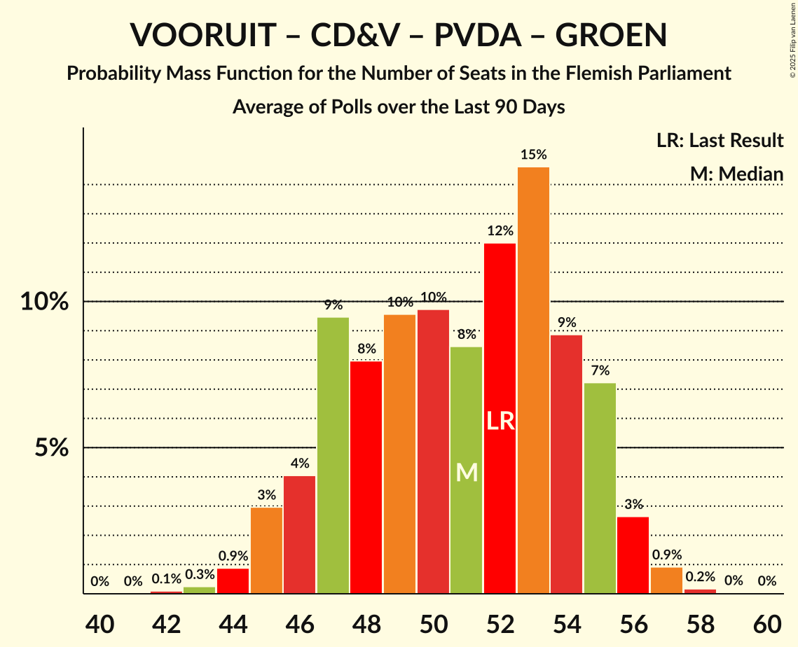

| Number of Seats | Probability | Accumulated | Special Marks |
|:---------------:|:-----------:|:-----------:|:-------------:|
| 43 | 0.1% | 100% |  |
| 44 | 0.2% | 99.9% |  |
| 45 | 0.7% | 99.7% |  |
| 46 | 2% | 99.0% |  |
| 47 | 3% | 97% |  |
| 48 | 4% | 94% |  |
| 49 | 6% | 90% |  |
| 50 | 15% | 85% |  |
| 51 | 13% | 69% | Median |
| 52 | 13% | 56% | Last Result |
| 53 | 13% | 43% |  |
| 54 | 13% | 30% |  |
| 55 | 5% | 17% |  |
| 56 | 6% | 12% |  |
| 57 | 3% | 6% |  |
| 58 | 2% | 3% |  |
| 59 | 0.7% | 0.9% |  |
| 60 | 0.2% | 0.2% |  |
| 61 | 0% | 0% |  |

### Vooruit – Christen-Democratisch en Vlaams – Open Vlaamse Liberalen en Democraten – Groen

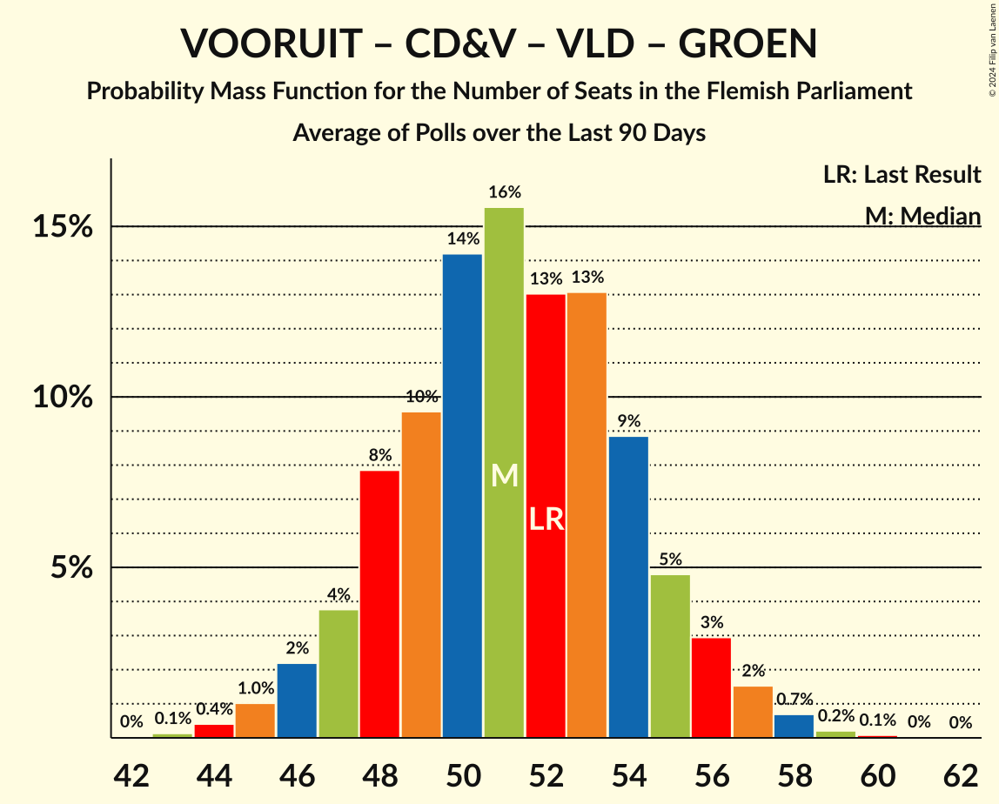

| Number of Seats | Probability | Accumulated | Special Marks |
|:---------------:|:-----------:|:-----------:|:-------------:|
| 42 | 0.1% | 100% |  |
| 43 | 0.3% | 99.9% |  |
| 44 | 0.9% | 99.6% |  |
| 45 | 1.2% | 98.7% |  |
| 46 | 2% | 97% |  |
| 47 | 6% | 95% |  |
| 48 | 7% | 89% |  |
| 49 | 15% | 82% | Median |
| 50 | 18% | 68% |  |
| 51 | 11% | 50% |  |
| 52 | 14% | 39% | Last Result |
| 53 | 10% | 25% |  |
| 54 | 6% | 16% |  |
| 55 | 3% | 10% |  |
| 56 | 4% | 7% |  |
| 57 | 1.2% | 2% |  |
| 58 | 0.9% | 1.1% |  |
| 59 | 0.1% | 0.2% |  |
| 60 | 0.1% | 0.1% |  |
| 61 | 0% | 0% |  |

### Nieuw-Vlaamse Alliantie – Christen-Democratisch en Vlaams

| Number of Seats | Probability | Accumulated | Special Marks |
|:---------------:|:-----------:|:-----------:|:-------------:|
| 40 | 0% | 100% |  |
| 41 | 0.3% | 99.9% |  |
| 42 | 0.4% | 99.7% |  |
| 43 | 1.1% | 99.3% |  |
| 44 | 1.4% | 98% |  |
| 45 | 5% | 97% |  |
| 46 | 11% | 92% |  |
| 47 | 13% | 81% | Last Result |
| 48 | 13% | 68% | Median |
| 49 | 11% | 55% |  |
| 50 | 18% | 45% |  |
| 51 | 12% | 27% |  |
| 52 | 8% | 15% |  |
| 53 | 4% | 6% |  |
| 54 | 1.5% | 2% |  |
| 55 | 0.4% | 0.8% |  |
| 56 | 0.3% | 0.4% |  |
| 57 | 0.1% | 0.1% |  |
| 58 | 0% | 0% |  |

### Vooruit – Christen-Democratisch en Vlaams – Groen

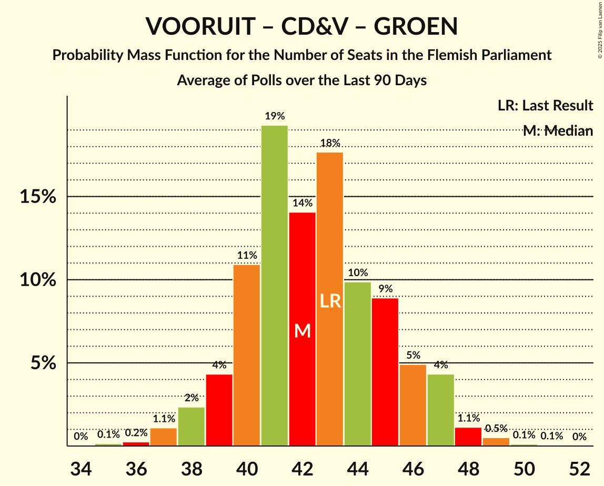

| Number of Seats | Probability | Accumulated | Special Marks |
|:---------------:|:-----------:|:-----------:|:-------------:|
| 35 | 0% | 100% |  |
| 36 | 0.3% | 99.9% |  |
| 37 | 0.5% | 99.7% |  |
| 38 | 2% | 99.2% |  |
| 39 | 3% | 97% |  |
| 40 | 3% | 95% |  |
| 41 | 8% | 91% |  |
| 42 | 11% | 84% |  |
| 43 | 18% | 72% | Last Result, Median |
| 44 | 15% | 55% |  |
| 45 | 11% | 40% |  |
| 46 | 13% | 28% |  |
| 47 | 7% | 15% |  |
| 48 | 3% | 8% |  |
| 49 | 2% | 5% |  |
| 50 | 2% | 3% |  |
| 51 | 0.3% | 0.4% |  |
| 52 | 0.2% | 0.2% |  |
| 53 | 0% | 0% |  |

### Vooruit – Christen-Democratisch en Vlaams – Open Vlaamse Liberalen en Democraten

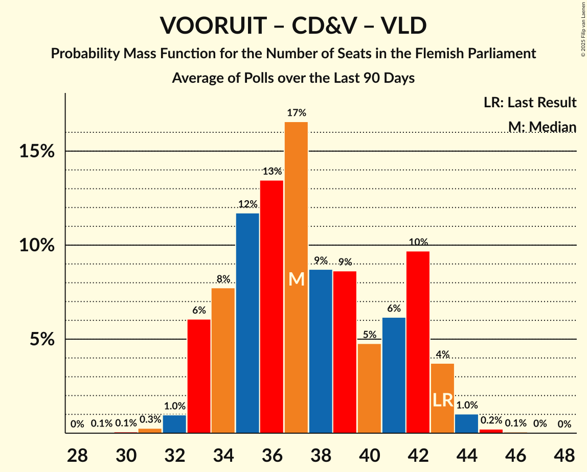

| Number of Seats | Probability | Accumulated | Special Marks |
|:---------------:|:-----------:|:-----------:|:-------------:|
| 35 | 0.2% | 100% |  |
| 36 | 0.4% | 99.8% |  |
| 37 | 0.8% | 99.4% |  |
| 38 | 3% | 98.6% |  |
| 39 | 8% | 96% |  |
| 40 | 6% | 88% |  |
| 41 | 18% | 82% | Median |
| 42 | 14% | 65% |  |
| 43 | 14% | 51% | Last Result |
| 44 | 13% | 36% |  |
| 45 | 11% | 24% |  |
| 46 | 5% | 13% |  |
| 47 | 5% | 8% |  |
| 48 | 2% | 3% |  |
| 49 | 0.8% | 2% |  |
| 50 | 0.4% | 0.7% |  |
| 51 | 0.2% | 0.3% |  |
| 52 | 0.1% | 0.1% |  |
| 53 | 0% | 0% |  |

### Nieuw-Vlaamse Alliantie – Open Vlaamse Liberalen en Democraten

| Number of Seats | Probability | Accumulated | Special Marks |
|:---------------:|:-----------:|:-----------:|:-------------:|
| 32 | 0.1% | 100% |  |
| 33 | 0.3% | 99.8% |  |
| 34 | 2% | 99.5% |  |
| 35 | 1.4% | 98% |  |
| 36 | 8% | 96% |  |
| 37 | 13% | 88% |  |
| 38 | 11% | 75% | Median |
| 39 | 25% | 64% |  |
| 40 | 11% | 40% | Last Result |
| 41 | 10% | 29% |  |
| 42 | 7% | 19% |  |
| 43 | 4% | 12% |  |
| 44 | 4% | 7% |  |
| 45 | 2% | 3% |  |
| 46 | 1.0% | 2% |  |
| 47 | 0.4% | 0.6% |  |
| 48 | 0.2% | 0.3% |  |
| 49 | 0% | 0% |  |

### Vooruit – Christen-Democratisch en Vlaams

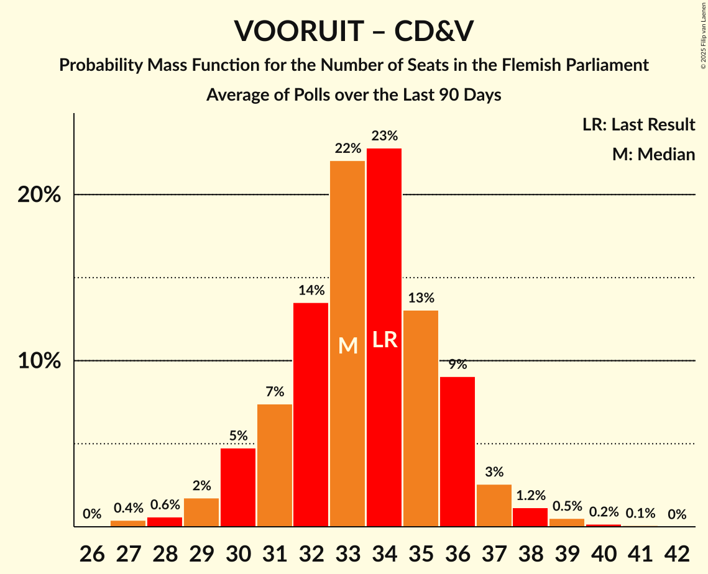

| Number of Seats | Probability | Accumulated | Special Marks |
|:---------------:|:-----------:|:-----------:|:-------------:|
| 29 | 0.3% | 100% |  |
| 30 | 0.5% | 99.7% |  |
| 31 | 1.4% | 99.1% |  |
| 32 | 4% | 98% |  |
| 33 | 9% | 94% |  |
| 34 | 10% | 85% | Last Result |
| 35 | 20% | 75% | Median |
| 36 | 23% | 55% |  |
| 37 | 13% | 33% |  |
| 38 | 8% | 20% |  |
| 39 | 7% | 12% |  |
| 40 | 3% | 6% |  |
| 41 | 2% | 2% |  |
| 42 | 0.3% | 0.5% |  |
| 43 | 0.1% | 0.2% |  |
| 44 | 0% | 0% |  |

### Vooruit – Open Vlaamse Liberalen en Democraten – Groen

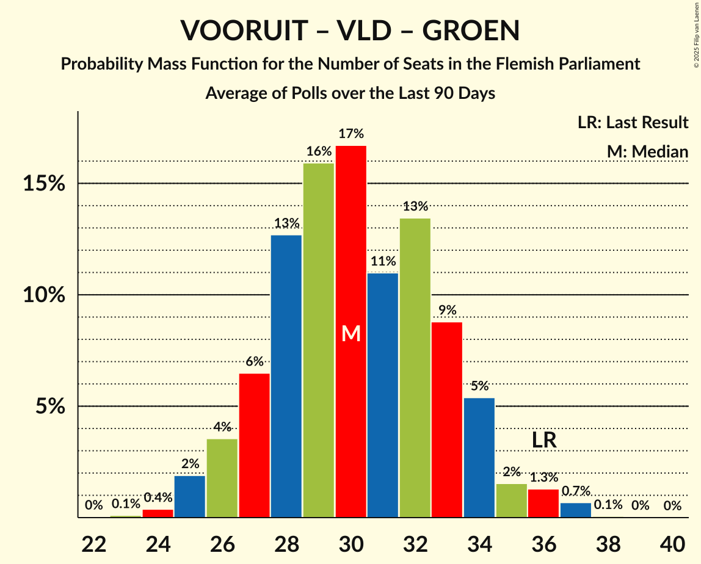

| Number of Seats | Probability | Accumulated | Special Marks |
|:---------------:|:-----------:|:-----------:|:-------------:|
| 26 | 0% | 100% |  |
| 27 | 0.3% | 99.9% |  |
| 28 | 0.9% | 99.6% |  |
| 29 | 2% | 98.7% |  |
| 30 | 3% | 97% |  |
| 31 | 6% | 94% |  |
| 32 | 17% | 88% |  |
| 33 | 10% | 72% | Median |
| 34 | 20% | 62% |  |
| 35 | 9% | 42% |  |
| 36 | 12% | 34% | Last Result |
| 37 | 9% | 22% |  |
| 38 | 4% | 13% |  |
| 39 | 5% | 9% |  |
| 40 | 3% | 5% |  |
| 41 | 1.0% | 2% |  |
| 42 | 0.4% | 0.6% |  |
| 43 | 0.1% | 0.2% |  |
| 44 | 0.1% | 0.1% |  |
| 45 | 0% | 0% |  |

### Christen-Democratisch en Vlaams – Open Vlaamse Liberalen en Democraten – Groen

| Number of Seats | Probability | Accumulated | Special Marks |
|:---------------:|:-----------:|:-----------:|:-------------:|
| 23 | 0.1% | 100% |  |
| 24 | 0.4% | 99.9% |  |
| 25 | 0.5% | 99.5% |  |
| 26 | 1.5% | 99.0% |  |
| 27 | 5% | 98% |  |
| 28 | 5% | 93% |  |
| 29 | 10% | 87% |  |
| 30 | 10% | 77% | Median |
| 31 | 22% | 67% |  |
| 32 | 11% | 45% |  |
| 33 | 13% | 34% |  |
| 34 | 12% | 22% | Last Result |
| 35 | 4% | 10% |  |
| 36 | 4% | 6% |  |
| 37 | 1.1% | 2% |  |
| 38 | 0.8% | 1.2% |  |
| 39 | 0.3% | 0.4% |  |
| 40 | 0.1% | 0.1% |  |
| 41 | 0% | 0% |  |

### Vooruit – Open Vlaamse Liberalen en Democraten

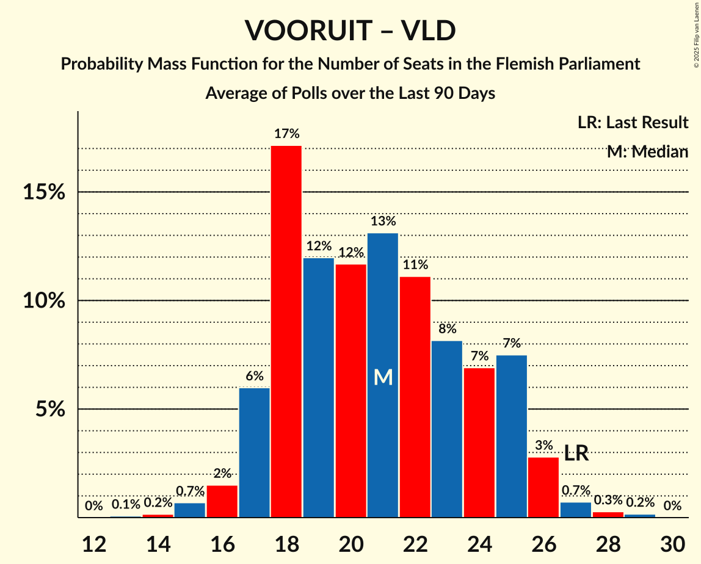

| Number of Seats | Probability | Accumulated | Special Marks |
|:---------------:|:-----------:|:-----------:|:-------------:|
| 20 | 0.2% | 100% |  |
| 21 | 0.7% | 99.7% |  |
| 22 | 3% | 99.0% |  |
| 23 | 9% | 96% |  |
| 24 | 15% | 87% |  |
| 25 | 13% | 73% | Median |
| 26 | 13% | 59% |  |
| 27 | 16% | 46% | Last Result |
| 28 | 13% | 30% |  |
| 29 | 7% | 17% |  |
| 30 | 5% | 10% |  |
| 31 | 3% | 5% |  |
| 32 | 1.3% | 2% |  |
| 33 | 0.5% | 0.9% |  |
| 34 | 0.4% | 0.5% |  |
| 35 | 0.1% | 0.1% |  |
| 36 | 0% | 0% |  |

### Christen-Democratisch en Vlaams – Open Vlaamse Liberalen en Democraten

| Number of Seats | Probability | Accumulated | Special Marks |
|:---------------:|:-----------:|:-----------:|:-------------:|
| 17 | 0.3% | 100% |  |
| 18 | 1.2% | 99.6% |  |
| 19 | 3% | 98% |  |
| 20 | 4% | 95% |  |
| 21 | 9% | 91% |  |
| 22 | 16% | 82% | Median |
| 23 | 25% | 66% |  |
| 24 | 14% | 41% |  |
| 25 | 13% | 27% | Last Result |
| 26 | 4% | 13% |  |
| 27 | 4% | 9% |  |
| 28 | 3% | 4% |  |
| 29 | 1.1% | 1.4% |  |
| 30 | 0.1% | 0.3% |  |
| 31 | 0.1% | 0.1% |  |
| 32 | 0.1% | 0.1% |  |
| 33 | 0% | 0% |  |

## Technical Information

+ **Number of polls included in this average:** 1
+ **Lowest number of simulations done in a poll included in this average:** 1,048,576
+ **Total number of simulations done in the polls included in this average:** 1,048,576
+ **Error estimate:** 1.59%
