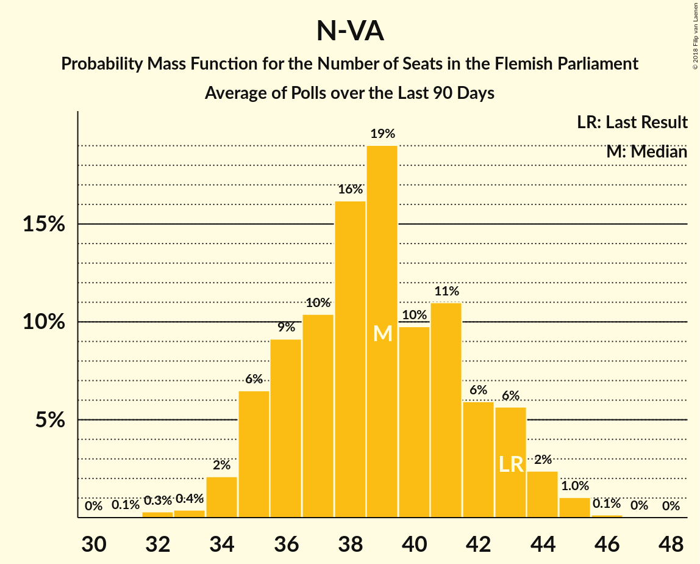
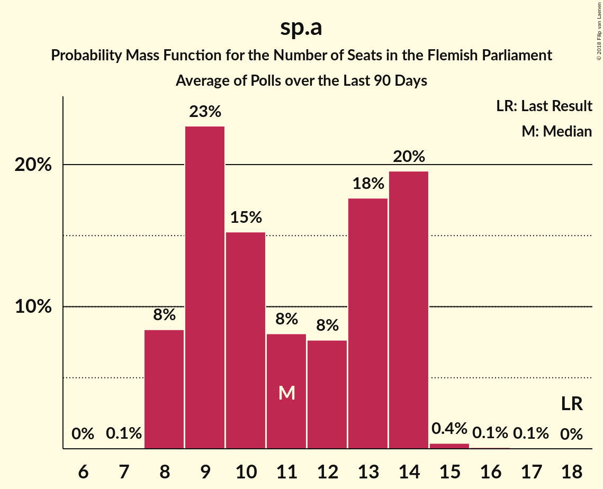
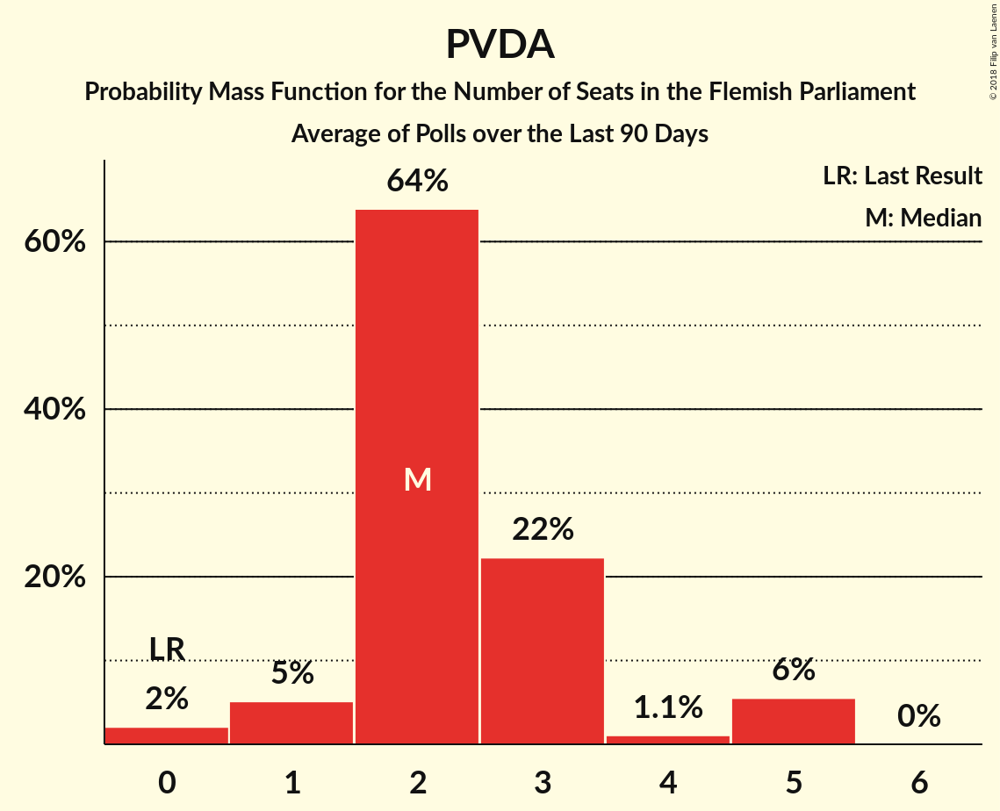

# Poll Average

<a href="#voting-intentions">Voting Intentions</a> | <a href="#seats">Seats</a> | <a href="#coalitions">Coalitions</a> | <a href="#technical-information">Technical Information</a>

## Summary

The table below lists the polls on which the average is based. They are the most recent polls (less than 90 days old) registered and analyzed so far.

| Period     | Polling firm/Commissioner(s) | N-VA | VB | CD&V | VLD | SP.A | GROEN | PVDA | PIRAAT | LDD |
|:----------:|:----------------------------:|:--:|:--:|:--:|:--:|:--:|:--:|:--:|:--:|:--:|
| 26 May 2019 | General Election | 24.8%   35 | 18.5%   23 | 15.4%   19 | 13.1%   16 | 10.1%   12 | 10.1%   14 | 5.3%   4 | 0.2%   0 | 0.0%   0 |
| N/A | Poll Average | 20–25%   27–34 | 22–28%   30–37 | 10–14%   12–16 | 11–16%   15–21 | 7–10%   7–13 | 9–13%   11–18 | 5–8%   3–9 | N/A   N/A | N/A   N/A |
| [2–10 September 2019](2019-09-10-Ipsos.html) | Ipsos   Het Laatste Nieuws, Le Soir, RTL TVi and VTM | 20–25%   27–34 | 22–28%   30–37 | 10–14%   12–16 | 11–16%   15–21 | 7–10%   7–13 | 9–13%   11–18 | 5–8%   3–9 | N/A   N/A | N/A   N/A |
| 26 May 2019 | General Election | 24.8%   35 | 18.5%   23 | 15.4%   19 | 13.1%   16 | 10.1%   12 | 10.1%   14 | 5.3%   4 | 0.2%   0 | 0.0%   0 |

Only polls for which at least the sample size has been published are included in the table above.

**Legend:**
+ **Top half of each row:** Voting intentions (95% confidence interval)
+ **Bottom half of each row:** Seat projections for the Flemish Parliament (95% confidence interval)
+ **N-VA:** N-VA
+ **VB:** Vlaams Belang
+ **CD&V:** CD&V
+ **VLD:** Open Vld
+ **SP.A:** sp.a
+ **GROEN:** Groen
+ **PVDA:** PVDA
+ **PIRAAT:** Piratenpartij
+ **LDD:** Lijst Dedecker
+ **N/A (single party):** Party not included the published results
+ **N/A (entire row):** Calculation for this opinion poll not started yet

## Voting Intentions

### Confidence Intervals

| Party | Last Result | Median | 80% Confidence Interval | 90% Confidence Interval | 95% Confidence Interval | 99% Confidence Interval |
|:-----:|:-----------:|:------:|:-----------------------:|:-----------------------:|:-----------------------:|:-----------------------:|
| <a href="#n-va">N-VA</a> | 24.8% | 22.7% | 21.1–24.5% |20.6–25.0% | 20.2–25.4% | 19.5–26.3% |
| <a href="#vlaams-belang">Vlaams Belang</a> | 18.5% | 24.9% | 23.2–26.7% |22.7–27.2% | 22.3–27.7% | 21.5–28.6% |
| <a href="#cd&v">CD&V</a> | 15.4% | 11.7% | 10.5–13.1% |10.1–13.5% | 9.9–13.8% | 9.3–14.5% |
| <a href="#open-vld">Open Vld</a> | 13.1% | 13.3% | 12.0–14.8% |11.7–15.2% | 11.3–15.6% | 10.7–16.3% |
| <a href="#sp.a">sp.a</a> | 10.1% | 8.5% | 7.4–9.6% |7.1–10.0% | 6.8–10.3% | 6.4–10.9% |
| <a href="#groen">Groen</a> | 10.1% | 11.1% | 9.8–12.4% |9.5–12.7% | 9.2–13.1% | 8.7–13.8% |
| <a href="#pvda">PVDA</a> | 5.3% | 6.3% | 5.3–7.3% |5.1–7.6% | 4.9–7.9% | 4.5–8.4% |
| <a href="#piratenpartij">Piratenpartij</a> | 0.2% | N/A | N/A |N/A | N/A | N/A |
| <a href="#lijst-dedecker">Lijst Dedecker</a> | 0.0% | N/A | N/A |N/A | N/A | N/A |

### N-VA

*For a full overview of the results for this party, see the [N-VA](party-n-va.html) page.*

| Voting Intentions | Probability | Accumulated | Special Marks |
|:-----------------:|:-----------:|:-----------:|:-------------:|
| 17.5–18.5% | 0% | 100% |  |
| 18.5–19.5% | 0.6% | 100% |  |
| 19.5–20.5% | 4% | 99.4% |  |
| 20.5–21.5% | 14% | 95% |  |
| 21.5–22.5% | 26% | 82% |  |
| 22.5–23.5% | 28% | 55% | Median |
| 23.5–24.5% | 18% | 27% |  |
| 24.5–25.5% | 7% | 9% | Last Result |
| 25.5–26.5% | 2% | 2% |  |
| 26.5–27.5% | 0.2% | 0.3% |  |
| 27.5–28.5% | 0% | 0% |  |

### Vlaams Belang

*For a full overview of the results for this party, see the [Vlaams Belang](party-vlaamsbelang.html) page.*

| Voting Intentions | Probability | Accumulated | Special Marks |
|:-----------------:|:-----------:|:-----------:|:-------------:|
| 18.5–19.5% | 0% | 100% | Last Result |
| 19.5–20.5% | 0% | 100% |  |
| 20.5–21.5% | 0.5% | 100% |  |
| 21.5–22.5% | 3% | 99.5% |  |
| 22.5–23.5% | 11% | 96% |  |
| 23.5–24.5% | 24% | 85% |  |
| 24.5–25.5% | 28% | 61% | Median |
| 25.5–26.5% | 21% | 33% |  |
| 26.5–27.5% | 9% | 12% |  |
| 27.5–28.5% | 3% | 3% |  |
| 28.5–29.5% | 0.5% | 0.5% |  |
| 29.5–30.5% | 0.1% | 0.1% |  |
| 30.5–31.5% | 0% | 0% |  |

### CD&V

*For a full overview of the results for this party, see the [CD&V](party-cdv.html) page.*

| Voting Intentions | Probability | Accumulated | Special Marks |
|:-----------------:|:-----------:|:-----------:|:-------------:|
| 7.5–8.5% | 0% | 100% |  |
| 8.5–9.5% | 1.1% | 100% |  |
| 9.5–10.5% | 10% | 98.9% |  |
| 10.5–11.5% | 31% | 89% |  |
| 11.5–12.5% | 36% | 58% | Median |
| 12.5–13.5% | 18% | 22% |  |
| 13.5–14.5% | 4% | 4% |  |
| 14.5–15.5% | 0.4% | 0.5% | Last Result |
| 15.5–16.5% | 0% | 0% |  |

### Open Vld

*For a full overview of the results for this party, see the [Open Vld](party-openvld.html) page.*

| Voting Intentions | Probability | Accumulated | Special Marks |
|:-----------------:|:-----------:|:-----------:|:-------------:|
| 8.5–9.5% | 0% | 100% |  |
| 9.5–10.5% | 0.3% | 100% |  |
| 10.5–11.5% | 4% | 99.7% |  |
| 11.5–12.5% | 18% | 96% |  |
| 12.5–13.5% | 35% | 78% | Last Result, Median |
| 13.5–14.5% | 29% | 43% |  |
| 14.5–15.5% | 11% | 14% |  |
| 15.5–16.5% | 2% | 3% |  |
| 16.5–17.5% | 0.2% | 0.3% |  |
| 17.5–18.5% | 0% | 0% |  |

### sp.a

*For a full overview of the results for this party, see the [sp.a](party-spa.html) page.*

| Voting Intentions | Probability | Accumulated | Special Marks |
|:-----------------:|:-----------:|:-----------:|:-------------:|
| 4.5–5.5% | 0% | 100% |  |
| 5.5–6.5% | 1.0% | 100% |  |
| 6.5–7.5% | 13% | 99.0% |  |
| 7.5–8.5% | 40% | 86% | Median |
| 8.5–9.5% | 34% | 46% |  |
| 9.5–10.5% | 10% | 11% | Last Result |
| 10.5–11.5% | 1.2% | 1.3% |  |
| 11.5–12.5% | 0.1% | 0.1% |  |
| 12.5–13.5% | 0% | 0% |  |

### Groen

*For a full overview of the results for this party, see the [Groen](party-groen.html) page.*

| Voting Intentions | Probability | Accumulated | Special Marks |
|:-----------------:|:-----------:|:-----------:|:-------------:|
| 6.5–7.5% | 0% | 100% |  |
| 7.5–8.5% | 0.3% | 100% |  |
| 8.5–9.5% | 5% | 99.7% |  |
| 9.5–10.5% | 25% | 94% | Last Result |
| 10.5–11.5% | 39% | 70% | Median |
| 11.5–12.5% | 24% | 31% |  |
| 12.5–13.5% | 6% | 7% |  |
| 13.5–14.5% | 0.8% | 0.9% |  |
| 14.5–15.5% | 0.1% | 0.1% |  |
| 15.5–16.5% | 0% | 0% |  |

### PVDA

*For a full overview of the results for this party, see the [PVDA](party-pvda.html) page.*

| Voting Intentions | Probability | Accumulated | Special Marks |
|:-----------------:|:-----------:|:-----------:|:-------------:|
| 2.5–3.5% | 0% | 100% |  |
| 3.5–4.5% | 0.7% | 100% |  |
| 4.5–5.5% | 16% | 99.3% | Last Result |
| 5.5–6.5% | 48% | 83% | Median |
| 6.5–7.5% | 30% | 35% |  |
| 7.5–8.5% | 5% | 6% |  |
| 8.5–9.5% | 0.3% | 0.3% |  |
| 9.5–10.5% | 0% | 0% |  |

## Seats

### Confidence Intervals

| Party | Last Result | Median | 80% Confidence Interval | 90% Confidence Interval | 95% Confidence Interval | 99% Confidence Interval |
|:-----:|:-----------:|:------:|:-----------------------:|:-----------------------:|:-----------------------:|:-----------------------:|
| <a href="#n-va">N-VA</a> | 35 | 30 | 28–32 |27–33 | 27–34 | 25–35 |
| <a href="#vlaams-belang">Vlaams Belang</a> | 23 | 33 | 30–35 |30–36 | 30–37 | 29–38 |
| <a href="#cd&v">CD&V</a> | 19 | 14 | 12–15 |12–16 | 12–16 | 11–17 |
| <a href="#open-vld">Open Vld</a> | 16 | 18 | 16–20 |15–20 | 15–21 | 13–22 |
| <a href="#sp.a">sp.a</a> | 12 | 9 | 8–12 |7–12 | 7–13 | 5–14 |
| <a href="#groen">Groen</a> | 14 | 15 | 12–15 |11–17 | 11–18 | 11–18 |
| <a href="#pvda">PVDA</a> | 4 | 5 | 3–7 |3–9 | 3–9 | 2–9 |
| <a href="#piratenpartij">Piratenpartij</a> | 0 | N/A | N/A |N/A | N/A | N/A |
| <a href="#lijst-dedecker">Lijst Dedecker</a> | 0 | N/A | N/A |N/A | N/A | N/A |

### N-VA

*For a full overview of the results for this party, see the [N-VA](party-n-va.html) page.*

| Number of Seats | Probability | Accumulated | Special Marks |
|:---------------:|:-----------:|:-----------:|:-------------:|
| 23 | 0.1% | 100% |  |
| 24 | 0.2% | 99.9% |  |
| 25 | 0.6% | 99.7% |  |
| 26 | 2% | 99.1% |  |
| 27 | 3% | 98% |  |
| 28 | 7% | 95% |  |
| 29 | 22% | 88% |  |
| 30 | 19% | 66% | Median |
| 31 | 25% | 47% |  |
| 32 | 15% | 22% |  |
| 33 | 4% | 7% |  |
| 34 | 2% | 3% |  |
| 35 | 0.9% | 1.1% | Last Result |
| 36 | 0.2% | 0.2% |  |
| 37 | 0% | 0% |  |

### Vlaams Belang

*For a full overview of the results for this party, see the [Vlaams Belang](party-vlaamsbelang.html) page.*

| Number of Seats | Probability | Accumulated | Special Marks |
|:---------------:|:-----------:|:-----------:|:-------------:|
| 23 | 0% | 100% | Last Result |
| 24 | 0% | 100% |  |
| 25 | 0% | 100% |  |
| 26 | 0.1% | 100% |  |
| 27 | 0.1% | 99.9% |  |
| 28 | 0.2% | 99.8% |  |
| 29 | 1.3% | 99.6% |  |
| 30 | 20% | 98% |  |
| 31 | 14% | 78% |  |
| 32 | 10% | 64% |  |
| 33 | 11% | 54% | Median |
| 34 | 19% | 42% |  |
| 35 | 14% | 24% |  |
| 36 | 7% | 9% |  |
| 37 | 2% | 3% |  |
| 38 | 0.7% | 0.8% |  |
| 39 | 0.1% | 0.1% |  |
| 40 | 0% | 0% |  |

### CD&V

*For a full overview of the results for this party, see the [CD&V](party-cdv.html) page.*

| Number of Seats | Probability | Accumulated | Special Marks |
|:---------------:|:-----------:|:-----------:|:-------------:|
| 9 | 0.1% | 100% |  |
| 10 | 0.2% | 99.9% |  |
| 11 | 1.0% | 99.7% |  |
| 12 | 28% | 98.7% |  |
| 13 | 16% | 71% |  |
| 14 | 20% | 55% | Median |
| 15 | 31% | 36% |  |
| 16 | 4% | 5% |  |
| 17 | 0.6% | 0.8% |  |
| 18 | 0.1% | 0.2% |  |
| 19 | 0% | 0.1% | Last Result |
| 20 | 0.1% | 0.1% |  |
| 21 | 0% | 0% |  |

### Open Vld

*For a full overview of the results for this party, see the [Open Vld](party-openvld.html) page.*

| Number of Seats | Probability | Accumulated | Special Marks |
|:---------------:|:-----------:|:-----------:|:-------------:|
| 12 | 0.3% | 100% |  |
| 13 | 0.9% | 99.7% |  |
| 14 | 1.1% | 98.8% |  |
| 15 | 3% | 98% |  |
| 16 | 20% | 95% | Last Result |
| 17 | 21% | 75% |  |
| 18 | 22% | 55% | Median |
| 19 | 18% | 32% |  |
| 20 | 10% | 14% |  |
| 21 | 4% | 4% |  |
| 22 | 0.4% | 0.5% |  |
| 23 | 0.1% | 0.1% |  |
| 24 | 0% | 0% |  |

### sp.a

*For a full overview of the results for this party, see the [sp.a](party-spa.html) page.*

| Number of Seats | Probability | Accumulated | Special Marks |
|:---------------:|:-----------:|:-----------:|:-------------:|
| 4 | 0.2% | 100% |  |
| 5 | 0.5% | 99.8% |  |
| 6 | 0.5% | 99.3% |  |
| 7 | 5% | 98.7% |  |
| 8 | 31% | 94% |  |
| 9 | 34% | 62% | Median |
| 10 | 9% | 28% |  |
| 11 | 6% | 19% |  |
| 12 | 8% | 13% | Last Result |
| 13 | 4% | 5% |  |
| 14 | 0.6% | 0.6% |  |
| 15 | 0% | 0% |  |

### Groen

*For a full overview of the results for this party, see the [Groen](party-groen.html) page.*

| Number of Seats | Probability | Accumulated | Special Marks |
|:---------------:|:-----------:|:-----------:|:-------------:|
| 10 | 0.5% | 100% |  |
| 11 | 5% | 99.5% |  |
| 12 | 5% | 94% |  |
| 13 | 9% | 89% |  |
| 14 | 27% | 80% | Last Result |
| 15 | 45% | 53% | Median |
| 16 | 3% | 8% |  |
| 17 | 2% | 5% |  |
| 18 | 3% | 3% |  |
| 19 | 0.1% | 0.2% |  |
| 20 | 0% | 0% |  |

### PVDA

*For a full overview of the results for this party, see the [PVDA](party-pvda.html) page.*

| Number of Seats | Probability | Accumulated | Special Marks |
|:---------------:|:-----------:|:-----------:|:-------------:|
| 2 | 0.9% | 100% |  |
| 3 | 14% | 99.1% |  |
| 4 | 4% | 85% | Last Result |
| 5 | 65% | 82% | Median |
| 6 | 4% | 17% |  |
| 7 | 3% | 12% |  |
| 8 | 3% | 10% |  |
| 9 | 6% | 6% |  |
| 10 | 0% | 0% |  |

## Coalitions

### Confidence Intervals

| Coalition | Last Result | Median | Majority? | 80% Confidence Interval | 90% Confidence Interval | 95% Confidence Interval | 99% Confidence Interval |
|:---------:|:-----------:|:------:|:---------:|:-----------------------:|:-----------------------:|:-----------------------:|:-----------------------:|
| N-VA – Vlaams Belang | 58 | 63 | 55% | 60–66 | 59–67 | 58–68 | 57–69 |
| N-VA – CD&V – Open Vld | 70 | 62 | 36% | 59–65 | 58–66 | 57–66 | 55–67 |
| N-VA – Open Vld – sp.a | 63 | 57 | 0.7% | 54–60 | 53–61 | 52–62 | 51–63 |
| CD&V – Open Vld – sp.a – Groen | 61 | 55 | 0.1% | 52–58 | 51–59 | 50–60 | 48–61 |
| N-VA – CD&V – sp.a | 66 | 53 | 0% | 50–56 | 49–57 | 48–58 | 47–59 |
| N-VA – Open Vld | 51 | 48 | 0% | 46–50 | 45–51 | 44–51 | 42–52 |
| CD&V – Open Vld – Groen | 49 | 46 | 0% | 43–49 | 42–50 | 41–50 | 40–52 |
| N-VA – CD&V | 54 | 44 | 0% | 41–47 | 40–48 | 39–48 | 38–50 |
| CD&V – sp.a – Groen – PVDA | 49 | 42 | 0% | 39–45 | 38–46 | 38–47 | 36–49 |
| Open Vld – sp.a – Groen | 42 | 41 | 0% | 38–44 | 38–45 | 37–46 | 35–47 |
| CD&V – Open Vld – sp.a | 47 | 41 | 0% | 37–44 | 36–45 | 36–45 | 34–46 |
| CD&V – sp.a – Groen | 45 | 37 | 0% | 34–40 | 34–40 | 33–41 | 32–43 |
| CD&V – Open Vld | 35 | 31 | 0% | 28–34 | 28–35 | 27–36 | 25–37 |
| Open Vld – sp.a | 28 | 27 | 0% | 24–30 | 24–30 | 23–31 | 21–33 |
| CD&V – sp.a | 31 | 23 | 0% | 20–25 | 20–26 | 20–26 | 19–28 |

### N-VA – Vlaams Belang

| Number of Seats | Probability | Accumulated | Special Marks |
|:---------------:|:-----------:|:-----------:|:-------------:|
| 55 | 0.1% | 100% |  |
| 56 | 0.4% | 99.9% |  |
| 57 | 0.8% | 99.5% |  |
| 58 | 3% | 98.7% | Last Result |
| 59 | 5% | 96% |  |
| 60 | 8% | 91% |  |
| 61 | 13% | 83% |  |
| 62 | 14% | 70% |  |
| 63 | 14% | 55% | Median, Majority |
| 64 | 12% | 42% |  |
| 65 | 9% | 29% |  |
| 66 | 10% | 20% |  |
| 67 | 6% | 9% |  |
| 68 | 2% | 3% |  |
| 69 | 1.0% | 1.3% |  |
| 70 | 0.3% | 0.4% |  |
| 71 | 0.1% | 0.1% |  |
| 72 | 0% | 0% |  |

### N-VA – CD&V – Open Vld

| Number of Seats | Probability | Accumulated | Special Marks |
|:---------------:|:-----------:|:-----------:|:-------------:|
| 54 | 0.1% | 100% |  |
| 55 | 0.4% | 99.9% |  |
| 56 | 1.2% | 99.5% |  |
| 57 | 3% | 98% |  |
| 58 | 3% | 95% |  |
| 59 | 6% | 92% |  |
| 60 | 20% | 86% |  |
| 61 | 14% | 66% |  |
| 62 | 16% | 52% | Median |
| 63 | 14% | 36% | Majority |
| 64 | 11% | 21% |  |
| 65 | 6% | 11% |  |
| 66 | 3% | 5% |  |
| 67 | 2% | 2% |  |
| 68 | 0.4% | 0.5% |  |
| 69 | 0.1% | 0.1% |  |
| 70 | 0% | 0% | Last Result |

### N-VA – Open Vld – sp.a

| Number of Seats | Probability | Accumulated | Special Marks |
|:---------------:|:-----------:|:-----------:|:-------------:|
| 49 | 0% | 100% |  |
| 50 | 0.2% | 99.9% |  |
| 51 | 0.4% | 99.7% |  |
| 52 | 2% | 99.3% |  |
| 53 | 5% | 97% |  |
| 54 | 7% | 92% |  |
| 55 | 12% | 86% |  |
| 56 | 10% | 74% |  |
| 57 | 17% | 63% | Median |
| 58 | 14% | 46% |  |
| 59 | 16% | 32% |  |
| 60 | 7% | 16% |  |
| 61 | 5% | 8% |  |
| 62 | 3% | 3% |  |
| 63 | 0.5% | 0.7% | Last Result, Majority |
| 64 | 0.2% | 0.2% |  |
| 65 | 0% | 0.1% |  |
| 66 | 0% | 0% |  |

### CD&V – Open Vld – sp.a – Groen

| Number of Seats | Probability | Accumulated | Special Marks |
|:---------------:|:-----------:|:-----------:|:-------------:|
| 47 | 0.1% | 100% |  |
| 48 | 0.5% | 99.9% |  |
| 49 | 1.1% | 99.4% |  |
| 50 | 3% | 98% |  |
| 51 | 5% | 96% |  |
| 52 | 9% | 90% |  |
| 53 | 10% | 81% |  |
| 54 | 15% | 71% |  |
| 55 | 14% | 55% |  |
| 56 | 13% | 42% | Median |
| 57 | 13% | 29% |  |
| 58 | 8% | 16% |  |
| 59 | 4% | 8% |  |
| 60 | 2% | 3% |  |
| 61 | 0.4% | 0.7% | Last Result |
| 62 | 0.2% | 0.3% |  |
| 63 | 0% | 0.1% | Majority |
| 64 | 0% | 0% |  |

### N-VA – CD&V – sp.a

| Number of Seats | Probability | Accumulated | Special Marks |
|:---------------:|:-----------:|:-----------:|:-------------:|
| 45 | 0.1% | 100% |  |
| 46 | 0.3% | 99.8% |  |
| 47 | 1.0% | 99.6% |  |
| 48 | 2% | 98.5% |  |
| 49 | 3% | 96% |  |
| 50 | 5% | 94% |  |
| 51 | 13% | 88% |  |
| 52 | 18% | 75% |  |
| 53 | 16% | 57% | Median |
| 54 | 13% | 41% |  |
| 55 | 9% | 28% |  |
| 56 | 10% | 20% |  |
| 57 | 7% | 10% |  |
| 58 | 2% | 3% |  |
| 59 | 0.5% | 0.9% |  |
| 60 | 0.2% | 0.3% |  |
| 61 | 0.1% | 0.1% |  |
| 62 | 0% | 0% |  |
| 63 | 0% | 0% | Majority |
| 64 | 0% | 0% |  |
| 65 | 0% | 0% |  |
| 66 | 0% | 0% | Last Result |

### N-VA – Open Vld

| Number of Seats | Probability | Accumulated | Special Marks |
|:---------------:|:-----------:|:-----------:|:-------------:|
| 39 | 0% | 100% |  |
| 40 | 0.1% | 99.9% |  |
| 41 | 0.2% | 99.8% |  |
| 42 | 0.2% | 99.7% |  |
| 43 | 0.6% | 99.5% |  |
| 44 | 3% | 98.9% |  |
| 45 | 5% | 96% |  |
| 46 | 10% | 91% |  |
| 47 | 16% | 81% |  |
| 48 | 26% | 64% | Median |
| 49 | 17% | 38% |  |
| 50 | 15% | 21% |  |
| 51 | 5% | 6% | Last Result |
| 52 | 1.3% | 2% |  |
| 53 | 0.4% | 0.5% |  |
| 54 | 0.1% | 0.1% |  |
| 55 | 0% | 0% |  |

### CD&V – Open Vld – Groen

| Number of Seats | Probability | Accumulated | Special Marks |
|:---------------:|:-----------:|:-----------:|:-------------:|
| 37 | 0.1% | 100% |  |
| 38 | 0.1% | 99.9% |  |
| 39 | 0.3% | 99.8% |  |
| 40 | 1.0% | 99.6% |  |
| 41 | 2% | 98.6% |  |
| 42 | 4% | 96% |  |
| 43 | 9% | 92% |  |
| 44 | 13% | 83% |  |
| 45 | 17% | 69% |  |
| 46 | 18% | 52% |  |
| 47 | 9% | 34% | Median |
| 48 | 11% | 25% |  |
| 49 | 9% | 14% | Last Result |
| 50 | 3% | 5% |  |
| 51 | 1.2% | 2% |  |
| 52 | 0.6% | 0.8% |  |
| 53 | 0.2% | 0.2% |  |
| 54 | 0% | 0% |  |

### N-VA – CD&V

| Number of Seats | Probability | Accumulated | Special Marks |
|:---------------:|:-----------:|:-----------:|:-------------:|
| 36 | 0.1% | 100% |  |
| 37 | 0.2% | 99.9% |  |
| 38 | 0.5% | 99.7% |  |
| 39 | 2% | 99.2% |  |
| 40 | 4% | 97% |  |
| 41 | 6% | 94% |  |
| 42 | 9% | 88% |  |
| 43 | 16% | 78% |  |
| 44 | 27% | 62% | Median |
| 45 | 17% | 35% |  |
| 46 | 7% | 18% |  |
| 47 | 6% | 12% |  |
| 48 | 4% | 6% |  |
| 49 | 1.3% | 2% |  |
| 50 | 0.4% | 0.5% |  |
| 51 | 0.1% | 0.1% |  |
| 52 | 0% | 0% |  |
| 53 | 0% | 0% |  |
| 54 | 0% | 0% | Last Result |

### CD&V – sp.a – Groen – PVDA

| Number of Seats | Probability | Accumulated | Special Marks |
|:---------------:|:-----------:|:-----------:|:-------------:|
| 35 | 0.3% | 100% |  |
| 36 | 0.4% | 99.7% |  |
| 37 | 2% | 99.3% |  |
| 38 | 4% | 98% |  |
| 39 | 8% | 94% |  |
| 40 | 10% | 86% |  |
| 41 | 13% | 76% |  |
| 42 | 13% | 63% |  |
| 43 | 17% | 49% | Median |
| 44 | 15% | 32% |  |
| 45 | 8% | 17% |  |
| 46 | 4% | 9% |  |
| 47 | 3% | 5% |  |
| 48 | 2% | 2% |  |
| 49 | 0.4% | 0.5% | Last Result |
| 50 | 0.1% | 0.2% |  |
| 51 | 0.1% | 0.1% |  |
| 52 | 0% | 0% |  |

### Open Vld – sp.a – Groen

| Number of Seats | Probability | Accumulated | Special Marks |
|:---------------:|:-----------:|:-----------:|:-------------:|
| 33 | 0% | 100% |  |
| 34 | 0.2% | 99.9% |  |
| 35 | 0.4% | 99.8% |  |
| 36 | 1.1% | 99.3% |  |
| 37 | 3% | 98% |  |
| 38 | 8% | 95% |  |
| 39 | 11% | 87% |  |
| 40 | 15% | 76% |  |
| 41 | 13% | 61% |  |
| 42 | 16% | 48% | Last Result, Median |
| 43 | 15% | 32% |  |
| 44 | 10% | 16% |  |
| 45 | 4% | 7% |  |
| 46 | 1.3% | 3% |  |
| 47 | 1.0% | 1.5% |  |
| 48 | 0.4% | 0.5% |  |
| 49 | 0.1% | 0.1% |  |
| 50 | 0% | 0% |  |

### CD&V – Open Vld – sp.a

| Number of Seats | Probability | Accumulated | Special Marks |
|:---------------:|:-----------:|:-----------:|:-------------:|
| 33 | 0.2% | 100% |  |
| 34 | 0.5% | 99.8% |  |
| 35 | 1.0% | 99.3% |  |
| 36 | 3% | 98% |  |
| 37 | 8% | 95% |  |
| 38 | 8% | 87% |  |
| 39 | 15% | 79% |  |
| 40 | 12% | 64% |  |
| 41 | 12% | 52% | Median |
| 42 | 16% | 40% |  |
| 43 | 12% | 24% |  |
| 44 | 6% | 12% |  |
| 45 | 4% | 6% |  |
| 46 | 1.4% | 2% |  |
| 47 | 0.3% | 0.5% | Last Result |
| 48 | 0.1% | 0.2% |  |
| 49 | 0% | 0% |  |

### CD&V – sp.a – Groen

| Number of Seats | Probability | Accumulated | Special Marks |
|:---------------:|:-----------:|:-----------:|:-------------:|
| 31 | 0.2% | 100% |  |
| 32 | 1.5% | 99.8% |  |
| 33 | 3% | 98% |  |
| 34 | 6% | 95% |  |
| 35 | 12% | 90% |  |
| 36 | 16% | 78% |  |
| 37 | 14% | 61% |  |
| 38 | 18% | 47% | Median |
| 39 | 17% | 29% |  |
| 40 | 8% | 12% |  |
| 41 | 2% | 4% |  |
| 42 | 1.3% | 2% |  |
| 43 | 0.5% | 0.7% |  |
| 44 | 0.1% | 0.2% |  |
| 45 | 0% | 0.1% | Last Result |
| 46 | 0% | 0% |  |

### CD&V – Open Vld

| Number of Seats | Probability | Accumulated | Special Marks |
|:---------------:|:-----------:|:-----------:|:-------------:|
| 24 | 0.1% | 100% |  |
| 25 | 0.5% | 99.9% |  |
| 26 | 0.6% | 99.4% |  |
| 27 | 2% | 98.8% |  |
| 28 | 8% | 97% |  |
| 29 | 7% | 90% |  |
| 30 | 19% | 82% |  |
| 31 | 20% | 64% |  |
| 32 | 12% | 44% | Median |
| 33 | 13% | 32% |  |
| 34 | 9% | 19% |  |
| 35 | 7% | 10% | Last Result |
| 36 | 3% | 3% |  |
| 37 | 0.4% | 0.5% |  |
| 38 | 0.1% | 0.1% |  |
| 39 | 0% | 0% |  |

### Open Vld – sp.a

| Number of Seats | Probability | Accumulated | Special Marks |
|:---------------:|:-----------:|:-----------:|:-------------:|
| 20 | 0.3% | 100% |  |
| 21 | 0.4% | 99.7% |  |
| 22 | 0.9% | 99.3% |  |
| 23 | 3% | 98% |  |
| 24 | 11% | 96% |  |
| 25 | 16% | 85% |  |
| 26 | 13% | 69% |  |
| 27 | 14% | 56% | Median |
| 28 | 18% | 43% | Last Result |
| 29 | 10% | 25% |  |
| 30 | 10% | 14% |  |
| 31 | 3% | 4% |  |
| 32 | 0.8% | 1.4% |  |
| 33 | 0.3% | 0.6% |  |
| 34 | 0.2% | 0.2% |  |
| 35 | 0% | 0.1% |  |
| 36 | 0% | 0% |  |

### CD&V – sp.a

| Number of Seats | Probability | Accumulated | Special Marks |
|:---------------:|:-----------:|:-----------:|:-------------:|
| 18 | 0.2% | 100% |  |
| 19 | 1.1% | 99.8% |  |
| 20 | 9% | 98.7% |  |
| 21 | 18% | 89% |  |
| 22 | 13% | 72% |  |
| 23 | 20% | 59% | Median |
| 24 | 21% | 39% |  |
| 25 | 12% | 18% |  |
| 26 | 4% | 6% |  |
| 27 | 2% | 2% |  |
| 28 | 0.6% | 0.8% |  |
| 29 | 0.1% | 0.2% |  |
| 30 | 0% | 0.1% |  |
| 31 | 0% | 0% | Last Result |

## Technical Information

+ **Number of polls included in this average:** 1
+ **Lowest number of simulations done in a poll included in this average:** 524,288
+ **Total number of simulations done in the polls included in this average:** 524,288
+ **Error estimate:** 0.73%
