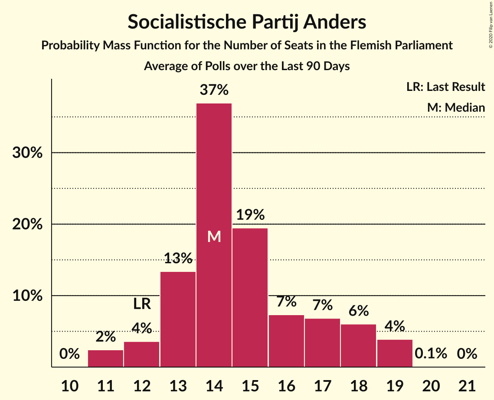
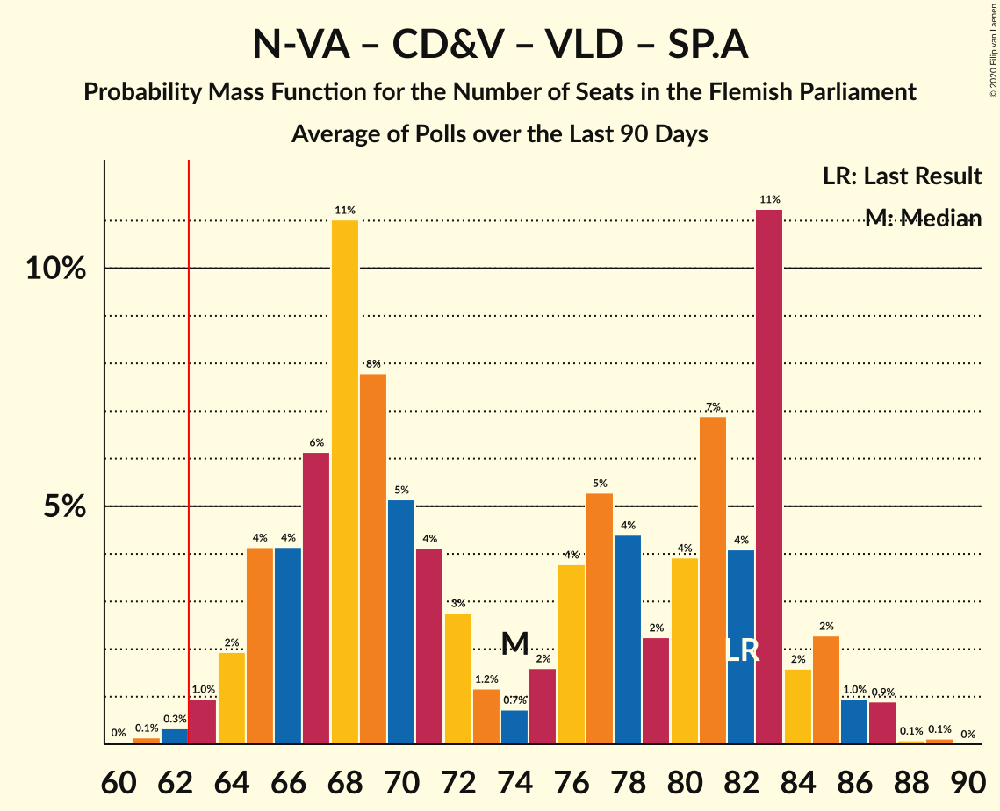
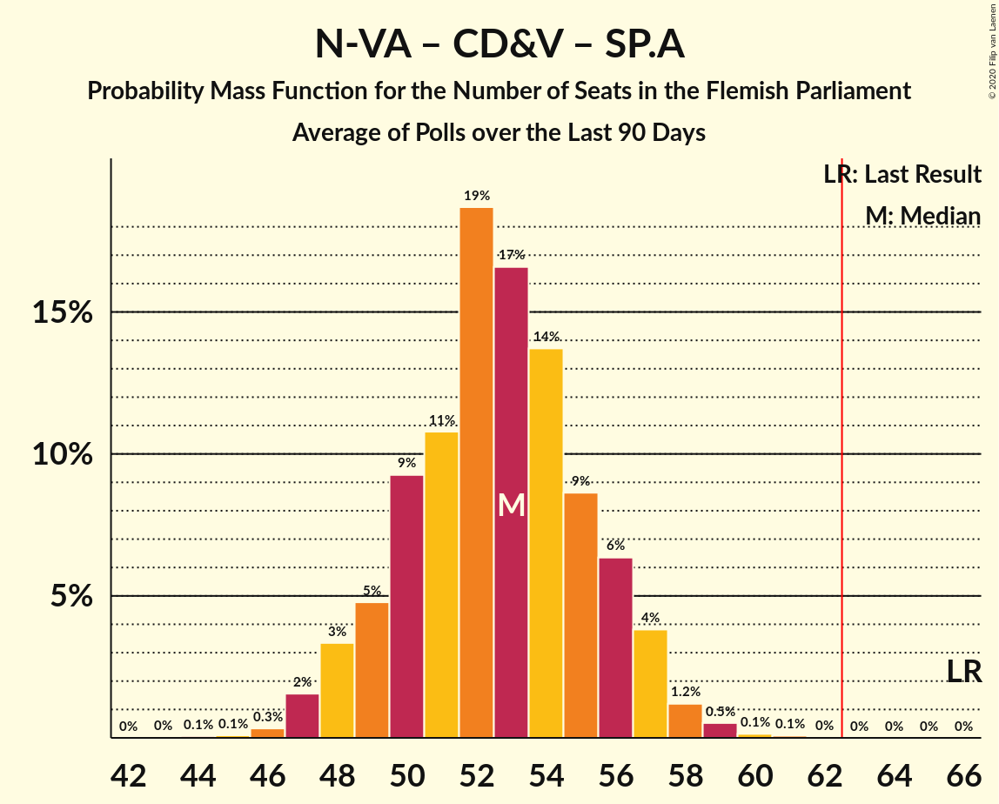
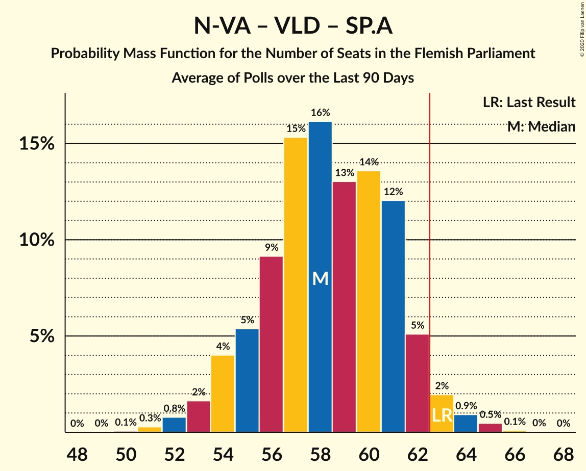
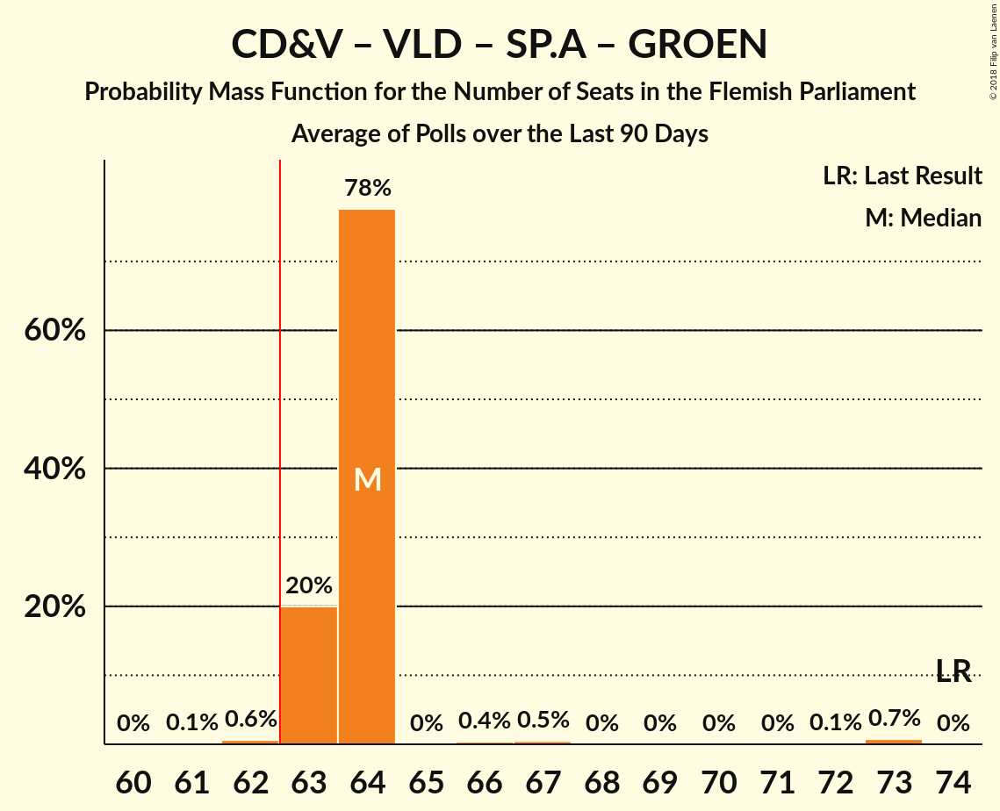
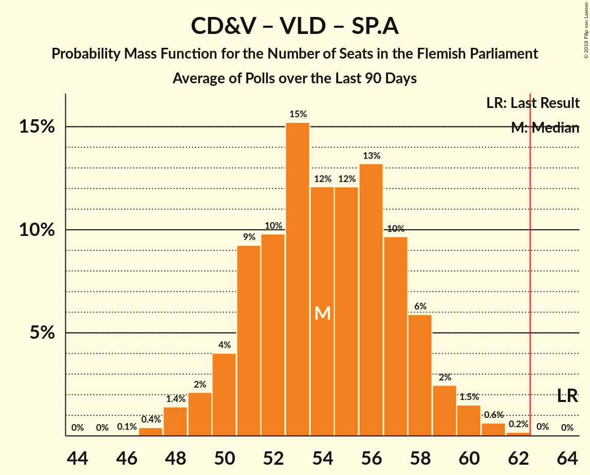
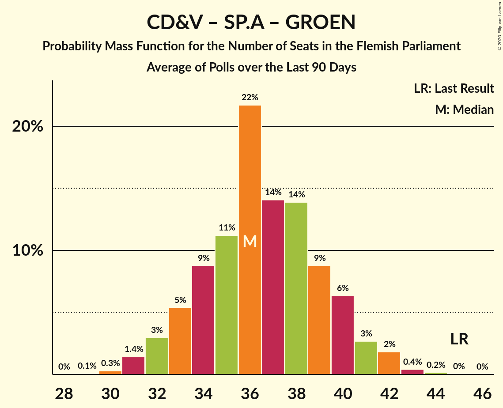
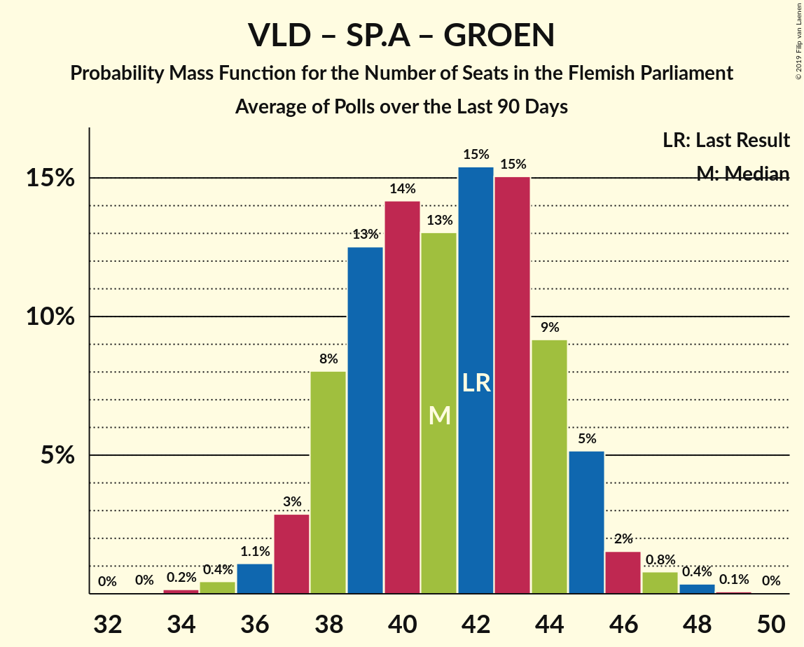
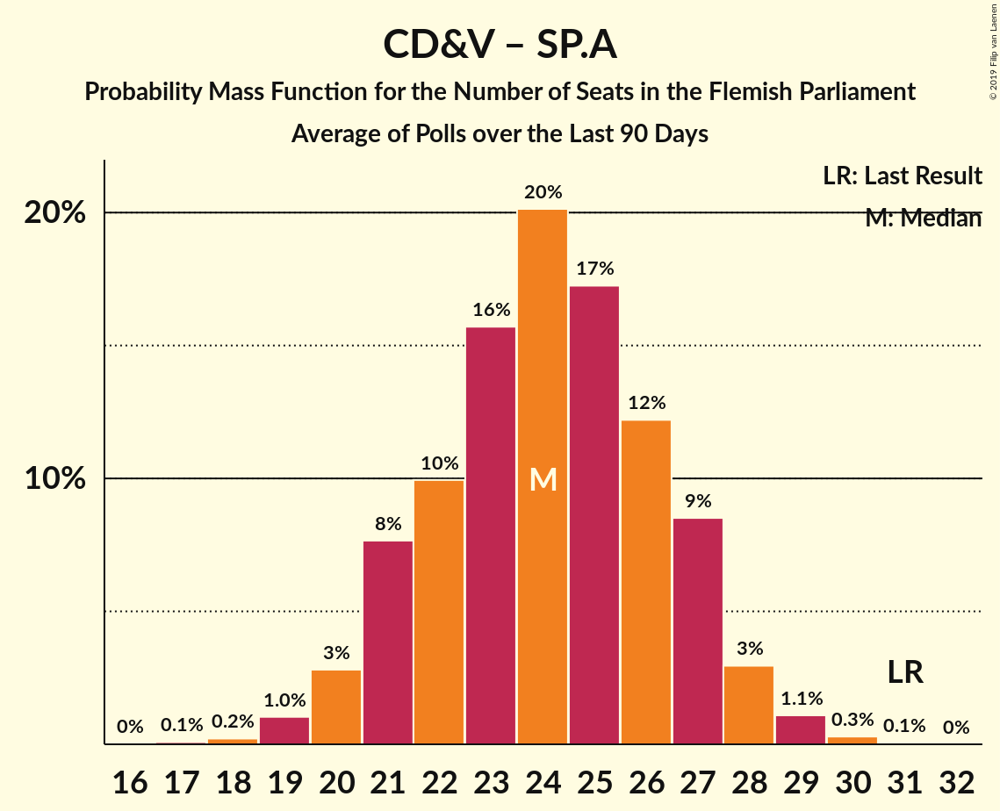
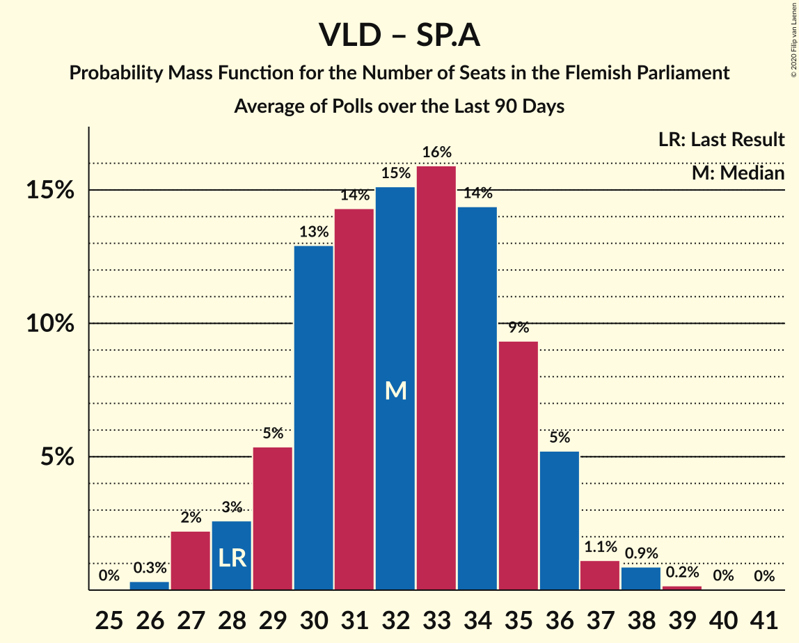

# Poll Average

<a href="#voting-intentions">Voting Intentions</a> | <a href="#seats">Seats</a> | <a href="#coalitions">Coalitions</a> | <a href="#technical-information">Technical Information</a>

## Summary

The table below lists the polls on which the average is based. They are the most recent polls (less than 90 days old) registered and analyzed so far.

| Period     | Polling firm/Commissioner(s) | N-VA | VB | CD&V | VLD | SP.A | GROEN | PVDA |
|:----------:|:----------------------------:|:--:|:--:|:--:|:--:|:--:|:--:|:--:|
| 26 May 2019 | General Election | 24.8%   35 | 18.5%   23 | 15.4%   19 | 13.1%   16 | 10.1%   12 | 10.1%   14 | 5.3%   4 |
| N/A | Poll Average | 18–22%   22–30 | 24–29%   30–39 | 10–15%   12–18 | 10–14%   12–19 | 12–16%   14–20 | 7–10%   7–14 | 5–8%   4–8 |
| [2–8 December 2020](2020-12-08-Ipsos.html) | Ipsos   Het Laatste Nieuws, Le Soir, RTL TVi and VTM | 18–22%   22–30 | 24–29%   30–39 | 11–15%   12–18 | 10–14%   12–19 | 12–16%   14–20 | 7–10%   7–14 | 5–8%   4–8 |
| 26 May 2019 | General Election | 24.8%   35 | 18.5%   23 | 15.4%   19 | 13.1%   16 | 10.1%   12 | 10.1%   14 | 5.3%   4 |

Only polls for which at least the sample size has been published are included in the table above.

**Legend:**
+ **Top half of each row:** Voting intentions (95% confidence interval)
+ **Bottom half of each row:** Seat projections for the Flemish Parliament (95% confidence interval)
+ **N-VA:** Nieuw-Vlaamse Alliantie
+ **VB:** Vlaams Belang
+ **CD&V:** Christen-Democratisch en Vlaams
+ **VLD:** Open Vlaamse Liberalen en Democraten
+ **SP.A:** Socialistische Partij Anders
+ **GROEN:** Groen
+ **PVDA:** Partij van de Arbeid van België
+ **N/A (single party):** Party not included the published results
+ **N/A (entire row):** Calculation for this opinion poll not started yet

## Voting Intentions

### Confidence Intervals

| Party | Last Result | Median | 80% Confidence Interval | 90% Confidence Interval | 95% Confidence Interval | 99% Confidence Interval |
|:-----:|:-----------:|:------:|:-----------------------:|:-----------------------:|:-----------------------:|:-----------------------:|
| <a href="#nieuw-vlaamse-alliantie">Nieuw-Vlaamse Alliantie</a> | 24.8% | 19.9% | 18.3–21.5% |17.9–22.0% | 17.5–22.4% | 16.8–23.3% |
| <a href="#vlaams-belang">Vlaams Belang</a> | 18.5% | 26.3% | 24.6–28.1% |24.1–28.7% | 23.7–29.1% | 22.9–30.0% |
| <a href="#christen-democratisch-en-vlaams">Christen-Democratisch en Vlaams</a> | 15.4% | 12.5% | 11.2–13.8% |10.8–14.2% | 10.5–14.6% | 9.9–15.3% |
| <a href="#open-vlaamse-liberalen-en-democraten">Open Vlaamse Liberalen en Democraten</a> | 13.1% | 12.1% | 10.8–13.4% |10.4–13.8% | 10.2–14.2% | 9.6–14.9% |
| <a href="#socialistische-partij-anders">Socialistische Partij Anders</a> | 10.1% | 13.6% | 12.3–15.1% |11.9–15.5% | 11.6–15.9% | 11.0–16.6% |
| <a href="#groen">Groen</a> | 10.1% | 8.2% | 7.1–9.4% |6.9–9.7% | 6.6–10.0% | 6.1–10.6% |
| <a href="#partij-van-de-arbeid-van-belgië">Partij van de Arbeid van België</a> | 5.3% | 6.6% | 5.7–7.7% |5.4–8.0% | 5.2–8.3% | 4.8–8.8% |

### Nieuw-Vlaamse Alliantie

*For a full overview of the results for this party, see the [Nieuw-Vlaamse Alliantie](party-nieuw-vlaamsealliantie.html) page.*

| Voting Intentions | Probability | Accumulated | Special Marks |
|:-----------------:|:-----------:|:-----------:|:-------------:|
| 14.5–15.5% | 0% | 100% |  |
| 15.5–16.5% | 0.3% | 100% |  |
| 16.5–17.5% | 2% | 99.7% |  |
| 17.5–18.5% | 11% | 97% |  |
| 18.5–19.5% | 25% | 86% |  |
| 19.5–20.5% | 30% | 61% | Median |
| 20.5–21.5% | 21% | 31% |  |
| 21.5–22.5% | 8% | 10% |  |
| 22.5–23.5% | 2% | 2% |  |
| 23.5–24.5% | 0.2% | 0.3% |  |
| 24.5–25.5% | 0% | 0% | Last Result |

### Vlaams Belang

*For a full overview of the results for this party, see the [Vlaams Belang](party-vlaamsbelang.html) page.*

| Voting Intentions | Probability | Accumulated | Special Marks |
|:-----------------:|:-----------:|:-----------:|:-------------:|
| 18.5–19.5% | 0% | 100% | Last Result |
| 19.5–20.5% | 0% | 100% |  |
| 20.5–21.5% | 0% | 100% |  |
| 21.5–22.5% | 0.2% | 100% |  |
| 22.5–23.5% | 2% | 99.8% |  |
| 23.5–24.5% | 8% | 98% |  |
| 24.5–25.5% | 19% | 91% |  |
| 25.5–26.5% | 28% | 72% | Median |
| 26.5–27.5% | 25% | 44% |  |
| 27.5–28.5% | 13% | 19% |  |
| 28.5–29.5% | 5% | 6% |  |
| 29.5–30.5% | 1.0% | 1.2% |  |
| 30.5–31.5% | 0.2% | 0.2% |  |
| 31.5–32.5% | 0% | 0% |  |

### Christen-Democratisch en Vlaams

*For a full overview of the results for this party, see the [Christen-Democratisch en Vlaams](party-christen-democratischenvlaams.html) page.*

| Voting Intentions | Probability | Accumulated | Special Marks |
|:-----------------:|:-----------:|:-----------:|:-------------:|
| 7.5–8.5% | 0% | 100% |  |
| 8.5–9.5% | 0.1% | 100% |  |
| 9.5–10.5% | 3% | 99.9% |  |
| 10.5–11.5% | 16% | 97% |  |
| 11.5–12.5% | 35% | 81% | Median |
| 12.5–13.5% | 32% | 47% |  |
| 13.5–14.5% | 13% | 15% |  |
| 14.5–15.5% | 2% | 3% | Last Result |
| 15.5–16.5% | 0.3% | 0.3% |  |
| 16.5–17.5% | 0% | 0% |  |

### Open Vlaamse Liberalen en Democraten

*For a full overview of the results for this party, see the [Open Vlaamse Liberalen en Democraten](party-openvlaamseliberalenendemocraten.html) page.*

| Voting Intentions | Probability | Accumulated | Special Marks |
|:-----------------:|:-----------:|:-----------:|:-------------:|
| 7.5–8.5% | 0% | 100% |  |
| 8.5–9.5% | 0.4% | 100% |  |
| 9.5–10.5% | 6% | 99.6% |  |
| 10.5–11.5% | 24% | 94% |  |
| 11.5–12.5% | 37% | 69% | Median |
| 12.5–13.5% | 24% | 32% | Last Result |
| 13.5–14.5% | 7% | 8% |  |
| 14.5–15.5% | 1.0% | 1.1% |  |
| 15.5–16.5% | 0.1% | 0.1% |  |
| 16.5–17.5% | 0% | 0% |  |

### Socialistische Partij Anders

*For a full overview of the results for this party, see the [Socialistische Partij Anders](party-socialistischepartijanders.html) page.*

| Voting Intentions | Probability | Accumulated | Special Marks |
|:-----------------:|:-----------:|:-----------:|:-------------:|
| 8.5–9.5% | 0% | 100% |  |
| 9.5–10.5% | 0.1% | 100% | Last Result |
| 10.5–11.5% | 2% | 99.9% |  |
| 11.5–12.5% | 13% | 98% |  |
| 12.5–13.5% | 32% | 85% |  |
| 13.5–14.5% | 33% | 54% | Median |
| 14.5–15.5% | 16% | 21% |  |
| 15.5–16.5% | 4% | 5% |  |
| 16.5–17.5% | 0.5% | 0.6% |  |
| 17.5–18.5% | 0% | 0% |  |

### Groen

*For a full overview of the results for this party, see the [Groen](party-groen.html) page.*

| Voting Intentions | Probability | Accumulated | Special Marks |
|:-----------------:|:-----------:|:-----------:|:-------------:|
| 4.5–5.5% | 0% | 100% |  |
| 5.5–6.5% | 2% | 100% |  |
| 6.5–7.5% | 20% | 98% |  |
| 7.5–8.5% | 44% | 78% | Median |
| 8.5–9.5% | 28% | 34% |  |
| 9.5–10.5% | 6% | 7% | Last Result |
| 10.5–11.5% | 0.6% | 0.6% |  |
| 11.5–12.5% | 0% | 0% |  |

### Partij van de Arbeid van België

*For a full overview of the results for this party, see the [Partij van de Arbeid van België](party-partijvandearbeidvanbelgië.html) page.*

| Voting Intentions | Probability | Accumulated | Special Marks |
|:-----------------:|:-----------:|:-----------:|:-------------:|
| 2.5–3.5% | 0% | 100% |  |
| 3.5–4.5% | 0.2% | 100% |  |
| 4.5–5.5% | 7% | 99.8% | Last Result |
| 5.5–6.5% | 39% | 92% |  |
| 6.5–7.5% | 40% | 53% | Median |
| 7.5–8.5% | 12% | 13% |  |
| 8.5–9.5% | 1.1% | 1.1% |  |
| 9.5–10.5% | 0% | 0% |  |
| 10.5–11.5% | 0% | 0% |  |

## Seats

### Confidence Intervals

| Party | Last Result | Median | 80% Confidence Interval | 90% Confidence Interval | 95% Confidence Interval | 99% Confidence Interval |
|:-----:|:-----------:|:------:|:-----------------------:|:-----------------------:|:-----------------------:|:-----------------------:|
| <a href="#nieuw-vlaamse-alliantie">Nieuw-Vlaamse Alliantie</a> | 35 | 27 | 23–28 |22–29 | 22–30 | 22–30 |
| <a href="#vlaams-belang">Vlaams Belang</a> | 23 | 34 | 32–38 |32–38 | 30–39 | 30–41 |
| <a href="#christen-democratisch-en-vlaams">Christen-Democratisch en Vlaams</a> | 19 | 14 | 12–16 |12–17 | 12–18 | 11–19 |
| <a href="#open-vlaamse-liberalen-en-democraten">Open Vlaamse Liberalen en Democraten</a> | 16 | 15 | 13–17 |12–18 | 12–19 | 11–19 |
| <a href="#socialistische-partij-anders">Socialistische Partij Anders</a> | 12 | 18 | 14–19 |14–19 | 14–20 | 14–22 |
| <a href="#groen">Groen</a> | 14 | 11 | 8–11 |8–11 | 7–14 | 5–14 |
| <a href="#partij-van-de-arbeid-van-belgië">Partij van de Arbeid van België</a> | 4 | 7 | 4–7 |4–7 | 4–8 | 2–9 |

### Nieuw-Vlaamse Alliantie

*For a full overview of the results for this party, see the [Nieuw-Vlaamse Alliantie](party-nieuw-vlaamsealliantie.html) page.*

| Number of Seats | Probability | Accumulated | Special Marks |
|:---------------:|:-----------:|:-----------:|:-------------:|
| 21 | 0.3% | 100% |  |
| 22 | 7% | 99.7% |  |
| 23 | 8% | 93% |  |
| 24 | 5% | 85% |  |
| 25 | 5% | 81% |  |
| 26 | 13% | 76% |  |
| 27 | 37% | 63% | Median |
| 28 | 19% | 26% |  |
| 29 | 3% | 6% |  |
| 30 | 2% | 3% |  |
| 31 | 0.3% | 0.5% |  |
| 32 | 0.1% | 0.2% |  |
| 33 | 0.1% | 0.1% |  |
| 34 | 0% | 0% |  |
| 35 | 0% | 0% | Last Result |

### Vlaams Belang

*For a full overview of the results for this party, see the [Vlaams Belang](party-vlaamsbelang.html) page.*

| Number of Seats | Probability | Accumulated | Special Marks |
|:---------------:|:-----------:|:-----------:|:-------------:|
| 23 | 0% | 100% | Last Result |
| 24 | 0% | 100% |  |
| 25 | 0% | 100% |  |
| 26 | 0% | 100% |  |
| 27 | 0% | 100% |  |
| 28 | 0% | 100% |  |
| 29 | 0.4% | 100% |  |
| 30 | 2% | 99.6% |  |
| 31 | 2% | 97% |  |
| 32 | 10% | 96% |  |
| 33 | 16% | 85% |  |
| 34 | 28% | 70% | Median |
| 35 | 10% | 42% |  |
| 36 | 12% | 33% |  |
| 37 | 9% | 21% |  |
| 38 | 7% | 11% |  |
| 39 | 3% | 4% |  |
| 40 | 0.5% | 2% |  |
| 41 | 1.2% | 1.2% |  |
| 42 | 0% | 0% |  |

### Christen-Democratisch en Vlaams

*For a full overview of the results for this party, see the [Christen-Democratisch en Vlaams](party-christen-democratischenvlaams.html) page.*

| Number of Seats | Probability | Accumulated | Special Marks |
|:---------------:|:-----------:|:-----------:|:-------------:|
| 10 | 0.1% | 100% |  |
| 11 | 0.5% | 99.9% |  |
| 12 | 9% | 99.4% |  |
| 13 | 13% | 90% |  |
| 14 | 30% | 77% | Median |
| 15 | 18% | 47% |  |
| 16 | 22% | 29% |  |
| 17 | 4% | 7% |  |
| 18 | 2% | 3% |  |
| 19 | 0.8% | 1.2% | Last Result |
| 20 | 0.4% | 0.4% |  |
| 21 | 0% | 0% |  |

### Open Vlaamse Liberalen en Democraten

*For a full overview of the results for this party, see the [Open Vlaamse Liberalen en Democraten](party-openvlaamseliberalenendemocraten.html) page.*

| Number of Seats | Probability | Accumulated | Special Marks |
|:---------------:|:-----------:|:-----------:|:-------------:|
| 11 | 2% | 100% |  |
| 12 | 3% | 98% |  |
| 13 | 8% | 94% |  |
| 14 | 34% | 86% |  |
| 15 | 16% | 52% | Median |
| 16 | 20% | 36% | Last Result |
| 17 | 8% | 16% |  |
| 18 | 4% | 8% |  |
| 19 | 3% | 3% |  |
| 20 | 0.1% | 0.1% |  |
| 21 | 0% | 0% |  |

### Socialistische Partij Anders

*For a full overview of the results for this party, see the [Socialistische Partij Anders](party-socialistischepartijanders.html) page.*

| Number of Seats | Probability | Accumulated | Special Marks |
|:---------------:|:-----------:|:-----------:|:-------------:|
| 12 | 0% | 100% | Last Result |
| 13 | 0.2% | 100% |  |
| 14 | 17% | 99.8% |  |
| 15 | 7% | 83% |  |
| 16 | 12% | 75% |  |
| 17 | 11% | 64% |  |
| 18 | 16% | 52% | Median |
| 19 | 33% | 36% |  |
| 20 | 3% | 4% |  |
| 21 | 0.5% | 1.1% |  |
| 22 | 0.2% | 0.5% |  |
| 23 | 0.1% | 0.3% |  |
| 24 | 0.2% | 0.2% |  |
| 25 | 0% | 0% |  |

### Groen

*For a full overview of the results for this party, see the [Groen](party-groen.html) page.*

| Number of Seats | Probability | Accumulated | Special Marks |
|:---------------:|:-----------:|:-----------:|:-------------:|
| 5 | 1.2% | 100% |  |
| 6 | 1.0% | 98.8% |  |
| 7 | 2% | 98% |  |
| 8 | 7% | 96% |  |
| 9 | 4% | 88% |  |
| 10 | 16% | 84% |  |
| 11 | 64% | 68% | Median |
| 12 | 0.4% | 5% |  |
| 13 | 0.7% | 4% |  |
| 14 | 3% | 4% | Last Result |
| 15 | 0.2% | 0.2% |  |
| 16 | 0% | 0% |  |

### Partij van de Arbeid van België

*For a full overview of the results for this party, see the [Partij van de Arbeid van België](party-partijvandearbeidvanbelgië.html) page.*

| Number of Seats | Probability | Accumulated | Special Marks |
|:---------------:|:-----------:|:-----------:|:-------------:|
| 2 | 1.0% | 100% |  |
| 3 | 1.4% | 98.9% |  |
| 4 | 14% | 98% | Last Result |
| 5 | 25% | 83% |  |
| 6 | 6% | 58% |  |
| 7 | 47% | 52% | Median |
| 8 | 3% | 5% |  |
| 9 | 0.7% | 1.2% |  |
| 10 | 0.4% | 0.5% |  |
| 11 | 0.1% | 0.1% |  |
| 12 | 0% | 0% |  |

## Coalitions

### Confidence Intervals

| Coalition | Last Result | Median | Majority? | 80% Confidence Interval | 90% Confidence Interval | 95% Confidence Interval | 99% Confidence Interval |
|:---------:|:-----------:|:------:|:---------:|:-----------------------:|:-----------------------:|:-----------------------:|:-----------------------:|
| Nieuw-Vlaamse Alliantie – Vlaams Belang – Christen-Democratisch en Vlaams | 77 | 76 | 100% | 72–79 | 71–79 | 70–80 | 69–81 |
| Nieuw-Vlaamse Alliantie – Christen-Democratisch en Vlaams – Open Vlaamse Liberalen en Democraten – Socialistische Partij Anders | 82 | 73 | 100% | 70–76 | 69–77 | 68–78 | 67–80 |
| Nieuw-Vlaamse Alliantie – Vlaams Belang | 58 | 61 | 26% | 58–64 | 56–65 | 56–65 | 54–66 |
| Nieuw-Vlaamse Alliantie – Christen-Democratisch en Vlaams – Socialistische Partij Anders | 66 | 58 | 3% | 55–61 | 54–62 | 53–63 | 52–64 |
| Nieuw-Vlaamse Alliantie – Open Vlaamse Liberalen en Democraten – Socialistische Partij Anders | 63 | 58 | 4% | 55–62 | 54–62 | 53–63 | 52–65 |
| Christen-Democratisch en Vlaams – Open Vlaamse Liberalen en Democraten – Socialistische Partij Anders – Groen | 61 | 57 | 2% | 54–60 | 53–61 | 53–62 | 51–63 |
| Nieuw-Vlaamse Alliantie – Christen-Democratisch en Vlaams – Open Vlaamse Liberalen en Democraten | 70 | 56 | 0.4% | 52–59 | 52–60 | 51–60 | 50–62 |
| Christen-Democratisch en Vlaams – Socialistische Partij Anders – Groen – Partij van de Arbeid van België | 49 | 48 | 0% | 44–51 | 44–52 | 43–53 | 42–54 |
| Christen-Democratisch en Vlaams – Open Vlaamse Liberalen en Democraten – Socialistische Partij Anders | 47 | 47 | 0% | 44–50 | 43–51 | 42–52 | 41–54 |
| Christen-Democratisch en Vlaams – Socialistische Partij Anders – Groen | 45 | 42 | 0% | 39–45 | 38–46 | 38–47 | 36–49 |
| Open Vlaamse Liberalen en Democraten – Socialistische Partij Anders – Groen | 42 | 43 | 0% | 39–46 | 39–47 | 38–47 | 37–49 |
| Nieuw-Vlaamse Alliantie – Open Vlaamse Liberalen en Democraten | 51 | 41 | 0% | 38–44 | 37–45 | 37–46 | 36–47 |
| Nieuw-Vlaamse Alliantie – Christen-Democratisch en Vlaams | 54 | 41 | 0% | 38–43 | 37–44 | 36–45 | 35–46 |
| Christen-Democratisch en Vlaams – Open Vlaamse Liberalen en Democraten – Groen | 49 | 40 | 0% | 37–43 | 36–43 | 35–44 | 34–46 |
| Christen-Democratisch en Vlaams – Socialistische Partij Anders | 31 | 31 | 0% | 29–35 | 28–35 | 28–36 | 27–38 |
| Open Vlaamse Liberalen en Democraten – Socialistische Partij Anders | 28 | 32 | 0% | 29–35 | 28–36 | 28–36 | 27–38 |
| Christen-Democratisch en Vlaams – Open Vlaamse Liberalen en Democraten | 35 | 29 | 0% | 27–32 | 26–33 | 26–34 | 25–35 |

### Nieuw-Vlaamse Alliantie – Vlaams Belang – Christen-Democratisch en Vlaams

| Number of Seats | Probability | Accumulated | Special Marks |
|:---------------:|:-----------:|:-----------:|:-------------:|
| 67 | 0% | 100% |  |
| 68 | 0.2% | 99.9% |  |
| 69 | 0.5% | 99.7% |  |
| 70 | 3% | 99.3% |  |
| 71 | 3% | 96% |  |
| 72 | 4% | 93% |  |
| 73 | 8% | 89% |  |
| 74 | 17% | 81% |  |
| 75 | 13% | 64% | Median |
| 76 | 17% | 51% |  |
| 77 | 12% | 34% | Last Result |
| 78 | 11% | 22% |  |
| 79 | 7% | 11% |  |
| 80 | 3% | 4% |  |
| 81 | 0.8% | 1.2% |  |
| 82 | 0.3% | 0.4% |  |
| 83 | 0% | 0.1% |  |
| 84 | 0.1% | 0.1% |  |
| 85 | 0% | 0% |  |

### Nieuw-Vlaamse Alliantie – Christen-Democratisch en Vlaams – Open Vlaamse Liberalen en Democraten – Socialistische Partij Anders

| Number of Seats | Probability | Accumulated | Special Marks |
|:---------------:|:-----------:|:-----------:|:-------------:|
| 65 | 0% | 100% |  |
| 66 | 0.2% | 99.9% |  |
| 67 | 0.9% | 99.7% |  |
| 68 | 3% | 98.8% |  |
| 69 | 3% | 96% |  |
| 70 | 8% | 92% |  |
| 71 | 9% | 85% |  |
| 72 | 19% | 76% |  |
| 73 | 17% | 57% |  |
| 74 | 15% | 40% | Median |
| 75 | 10% | 24% |  |
| 76 | 8% | 15% |  |
| 77 | 2% | 7% |  |
| 78 | 3% | 5% |  |
| 79 | 0.7% | 1.3% |  |
| 80 | 0.5% | 0.7% |  |
| 81 | 0% | 0.1% |  |
| 82 | 0.1% | 0.1% | Last Result |
| 83 | 0% | 0% |  |

### Nieuw-Vlaamse Alliantie – Vlaams Belang

| Number of Seats | Probability | Accumulated | Special Marks |
|:---------------:|:-----------:|:-----------:|:-------------:|
| 52 | 0.1% | 100% |  |
| 53 | 0.2% | 99.9% |  |
| 54 | 0.4% | 99.7% |  |
| 55 | 1.3% | 99.3% |  |
| 56 | 3% | 98% |  |
| 57 | 4% | 95% |  |
| 58 | 6% | 90% | Last Result |
| 59 | 13% | 84% |  |
| 60 | 13% | 71% |  |
| 61 | 10% | 58% | Median |
| 62 | 21% | 48% |  |
| 63 | 9% | 26% | Majority |
| 64 | 12% | 18% |  |
| 65 | 4% | 5% |  |
| 66 | 1.3% | 2% |  |
| 67 | 0.2% | 0.3% |  |
| 68 | 0.1% | 0.1% |  |
| 69 | 0% | 0% |  |

### Nieuw-Vlaamse Alliantie – Christen-Democratisch en Vlaams – Socialistische Partij Anders

| Number of Seats | Probability | Accumulated | Special Marks |
|:---------------:|:-----------:|:-----------:|:-------------:|
| 50 | 0.1% | 100% |  |
| 51 | 0.2% | 99.9% |  |
| 52 | 1.3% | 99.7% |  |
| 53 | 2% | 98% |  |
| 54 | 4% | 97% |  |
| 55 | 9% | 93% |  |
| 56 | 8% | 83% |  |
| 57 | 20% | 75% |  |
| 58 | 12% | 55% |  |
| 59 | 12% | 43% | Median |
| 60 | 16% | 31% |  |
| 61 | 7% | 15% |  |
| 62 | 5% | 8% |  |
| 63 | 2% | 3% | Majority |
| 64 | 0.6% | 1.1% |  |
| 65 | 0.3% | 0.5% |  |
| 66 | 0.1% | 0.1% | Last Result |
| 67 | 0% | 0% |  |

### Nieuw-Vlaamse Alliantie – Open Vlaamse Liberalen en Democraten – Socialistische Partij Anders

| Number of Seats | Probability | Accumulated | Special Marks |
|:---------------:|:-----------:|:-----------:|:-------------:|
| 50 | 0.1% | 100% |  |
| 51 | 0.2% | 99.9% |  |
| 52 | 0.7% | 99.7% |  |
| 53 | 2% | 99.0% |  |
| 54 | 3% | 97% |  |
| 55 | 6% | 94% |  |
| 56 | 6% | 87% |  |
| 57 | 15% | 81% |  |
| 58 | 19% | 66% |  |
| 59 | 14% | 47% |  |
| 60 | 15% | 34% | Median |
| 61 | 6% | 19% |  |
| 62 | 9% | 13% |  |
| 63 | 2% | 4% | Last Result, Majority |
| 64 | 1.0% | 2% |  |
| 65 | 0.6% | 0.8% |  |
| 66 | 0.2% | 0.2% |  |
| 67 | 0% | 0% |  |

### Christen-Democratisch en Vlaams – Open Vlaamse Liberalen en Democraten – Socialistische Partij Anders – Groen

| Number of Seats | Probability | Accumulated | Special Marks |
|:---------------:|:-----------:|:-----------:|:-------------:|
| 49 | 0% | 100% |  |
| 50 | 0.1% | 99.9% |  |
| 51 | 0.7% | 99.8% |  |
| 52 | 1.3% | 99.1% |  |
| 53 | 3% | 98% |  |
| 54 | 7% | 95% |  |
| 55 | 16% | 88% |  |
| 56 | 16% | 71% |  |
| 57 | 13% | 55% |  |
| 58 | 14% | 42% | Median |
| 59 | 10% | 28% |  |
| 60 | 9% | 18% |  |
| 61 | 6% | 9% | Last Result |
| 62 | 2% | 3% |  |
| 63 | 1.5% | 2% | Majority |
| 64 | 0.3% | 0.5% |  |
| 65 | 0.1% | 0.2% |  |
| 66 | 0.1% | 0.1% |  |
| 67 | 0% | 0% |  |

### Nieuw-Vlaamse Alliantie – Christen-Democratisch en Vlaams – Open Vlaamse Liberalen en Democraten

| Number of Seats | Probability | Accumulated | Special Marks |
|:---------------:|:-----------:|:-----------:|:-------------:|
| 48 | 0.1% | 100% |  |
| 49 | 0.2% | 99.8% |  |
| 50 | 1.2% | 99.6% |  |
| 51 | 2% | 98% |  |
| 52 | 6% | 96% |  |
| 53 | 9% | 90% |  |
| 54 | 11% | 81% |  |
| 55 | 16% | 70% |  |
| 56 | 8% | 54% | Median |
| 57 | 21% | 46% |  |
| 58 | 13% | 24% |  |
| 59 | 4% | 11% |  |
| 60 | 5% | 7% |  |
| 61 | 2% | 2% |  |
| 62 | 0.5% | 0.9% |  |
| 63 | 0.3% | 0.4% | Majority |
| 64 | 0% | 0% |  |
| 65 | 0% | 0% |  |
| 66 | 0% | 0% |  |
| 67 | 0% | 0% |  |
| 68 | 0% | 0% |  |
| 69 | 0% | 0% |  |
| 70 | 0% | 0% | Last Result |

### Christen-Democratisch en Vlaams – Socialistische Partij Anders – Groen – Partij van de Arbeid van België

| Number of Seats | Probability | Accumulated | Special Marks |
|:---------------:|:-----------:|:-----------:|:-------------:|
| 41 | 0.1% | 100% |  |
| 42 | 0.5% | 99.9% |  |
| 43 | 3% | 99.4% |  |
| 44 | 7% | 96% |  |
| 45 | 9% | 89% |  |
| 46 | 7% | 80% |  |
| 47 | 8% | 74% |  |
| 48 | 20% | 65% |  |
| 49 | 15% | 46% | Last Result |
| 50 | 12% | 30% | Median |
| 51 | 11% | 18% |  |
| 52 | 3% | 7% |  |
| 53 | 2% | 4% |  |
| 54 | 1.1% | 2% |  |
| 55 | 0.3% | 0.5% |  |
| 56 | 0.2% | 0.2% |  |
| 57 | 0% | 0.1% |  |
| 58 | 0% | 0% |  |

### Christen-Democratisch en Vlaams – Open Vlaamse Liberalen en Democraten – Socialistische Partij Anders

| Number of Seats | Probability | Accumulated | Special Marks |
|:---------------:|:-----------:|:-----------:|:-------------:|
| 40 | 0.1% | 100% |  |
| 41 | 0.5% | 99.9% |  |
| 42 | 3% | 99.4% |  |
| 43 | 5% | 97% |  |
| 44 | 13% | 91% |  |
| 45 | 18% | 78% |  |
| 46 | 10% | 60% |  |
| 47 | 11% | 50% | Last Result, Median |
| 48 | 17% | 39% |  |
| 49 | 9% | 23% |  |
| 50 | 7% | 13% |  |
| 51 | 4% | 7% |  |
| 52 | 2% | 3% |  |
| 53 | 0.6% | 1.2% |  |
| 54 | 0.4% | 0.6% |  |
| 55 | 0.1% | 0.2% |  |
| 56 | 0% | 0% |  |

### Christen-Democratisch en Vlaams – Socialistische Partij Anders – Groen

| Number of Seats | Probability | Accumulated | Special Marks |
|:---------------:|:-----------:|:-----------:|:-------------:|
| 35 | 0.4% | 100% |  |
| 36 | 0.4% | 99.6% |  |
| 37 | 1.5% | 99.2% |  |
| 38 | 3% | 98% |  |
| 39 | 10% | 94% |  |
| 40 | 8% | 84% |  |
| 41 | 14% | 76% |  |
| 42 | 16% | 61% |  |
| 43 | 13% | 46% | Median |
| 44 | 22% | 33% |  |
| 45 | 3% | 11% | Last Result |
| 46 | 4% | 8% |  |
| 47 | 3% | 4% |  |
| 48 | 0.6% | 1.1% |  |
| 49 | 0.4% | 0.5% |  |
| 50 | 0.1% | 0.2% |  |
| 51 | 0% | 0% |  |

### Open Vlaamse Liberalen en Democraten – Socialistische Partij Anders – Groen

| Number of Seats | Probability | Accumulated | Special Marks |
|:---------------:|:-----------:|:-----------:|:-------------:|
| 35 | 0.1% | 100% |  |
| 36 | 0.2% | 99.9% |  |
| 37 | 1.5% | 99.7% |  |
| 38 | 3% | 98% |  |
| 39 | 8% | 95% |  |
| 40 | 6% | 87% |  |
| 41 | 15% | 81% |  |
| 42 | 11% | 66% | Last Result |
| 43 | 22% | 56% |  |
| 44 | 15% | 34% | Median |
| 45 | 8% | 19% |  |
| 46 | 7% | 12% |  |
| 47 | 4% | 5% |  |
| 48 | 0.6% | 1.1% |  |
| 49 | 0.5% | 0.6% |  |
| 50 | 0% | 0.1% |  |
| 51 | 0% | 0% |  |

### Nieuw-Vlaamse Alliantie – Open Vlaamse Liberalen en Democraten

| Number of Seats | Probability | Accumulated | Special Marks |
|:---------------:|:-----------:|:-----------:|:-------------:|
| 34 | 0.2% | 100% |  |
| 35 | 0.3% | 99.8% |  |
| 36 | 2% | 99.5% |  |
| 37 | 7% | 98% |  |
| 38 | 7% | 91% |  |
| 39 | 6% | 85% |  |
| 40 | 6% | 79% |  |
| 41 | 27% | 72% |  |
| 42 | 17% | 46% | Median |
| 43 | 14% | 29% |  |
| 44 | 8% | 15% |  |
| 45 | 2% | 7% |  |
| 46 | 4% | 5% |  |
| 47 | 0.7% | 0.8% |  |
| 48 | 0.1% | 0.1% |  |
| 49 | 0% | 0.1% |  |
| 50 | 0% | 0% |  |
| 51 | 0% | 0% | Last Result |

### Nieuw-Vlaamse Alliantie – Christen-Democratisch en Vlaams

| Number of Seats | Probability | Accumulated | Special Marks |
|:---------------:|:-----------:|:-----------:|:-------------:|
| 34 | 0.1% | 100% |  |
| 35 | 1.3% | 99.8% |  |
| 36 | 3% | 98.5% |  |
| 37 | 3% | 95% |  |
| 38 | 10% | 92% |  |
| 39 | 8% | 82% |  |
| 40 | 13% | 74% |  |
| 41 | 22% | 62% | Median |
| 42 | 12% | 40% |  |
| 43 | 18% | 27% |  |
| 44 | 5% | 9% |  |
| 45 | 3% | 4% |  |
| 46 | 0.9% | 1.2% |  |
| 47 | 0.2% | 0.3% |  |
| 48 | 0.1% | 0.1% |  |
| 49 | 0% | 0% |  |
| 50 | 0% | 0% |  |
| 51 | 0% | 0% |  |
| 52 | 0% | 0% |  |
| 53 | 0% | 0% |  |
| 54 | 0% | 0% | Last Result |

### Christen-Democratisch en Vlaams – Open Vlaamse Liberalen en Democraten – Groen

| Number of Seats | Probability | Accumulated | Special Marks |
|:---------------:|:-----------:|:-----------:|:-------------:|
| 32 | 0.1% | 100% |  |
| 33 | 0.2% | 99.9% |  |
| 34 | 0.4% | 99.6% |  |
| 35 | 2% | 99.2% |  |
| 36 | 3% | 97% |  |
| 37 | 8% | 94% |  |
| 38 | 15% | 86% |  |
| 39 | 13% | 71% |  |
| 40 | 15% | 58% | Median |
| 41 | 21% | 43% |  |
| 42 | 9% | 22% |  |
| 43 | 9% | 14% |  |
| 44 | 2% | 5% |  |
| 45 | 1.3% | 2% |  |
| 46 | 1.0% | 1.2% |  |
| 47 | 0.2% | 0.2% |  |
| 48 | 0.1% | 0.1% |  |
| 49 | 0% | 0% | Last Result |

### Christen-Democratisch en Vlaams – Socialistische Partij Anders

| Number of Seats | Probability | Accumulated | Special Marks |
|:---------------:|:-----------:|:-----------:|:-------------:|
| 26 | 0.4% | 100% |  |
| 27 | 2% | 99.6% |  |
| 28 | 7% | 98% |  |
| 29 | 8% | 90% |  |
| 30 | 13% | 83% |  |
| 31 | 20% | 70% | Last Result |
| 32 | 10% | 50% | Median |
| 33 | 20% | 40% |  |
| 34 | 8% | 20% |  |
| 35 | 7% | 12% |  |
| 36 | 3% | 5% |  |
| 37 | 0.9% | 2% |  |
| 38 | 0.6% | 0.9% |  |
| 39 | 0.2% | 0.2% |  |
| 40 | 0% | 0.1% |  |
| 41 | 0% | 0% |  |

### Open Vlaamse Liberalen en Democraten – Socialistische Partij Anders

| Number of Seats | Probability | Accumulated | Special Marks |
|:---------------:|:-----------:|:-----------:|:-------------:|
| 26 | 0.3% | 100% |  |
| 27 | 2% | 99.7% |  |
| 28 | 6% | 98% | Last Result |
| 29 | 6% | 92% |  |
| 30 | 12% | 86% |  |
| 31 | 10% | 74% |  |
| 32 | 22% | 64% |  |
| 33 | 15% | 42% | Median |
| 34 | 10% | 27% |  |
| 35 | 9% | 17% |  |
| 36 | 5% | 8% |  |
| 37 | 2% | 2% |  |
| 38 | 0.7% | 0.9% |  |
| 39 | 0.2% | 0.2% |  |
| 40 | 0% | 0.1% |  |
| 41 | 0% | 0% |  |

### Christen-Democratisch en Vlaams – Open Vlaamse Liberalen en Democraten

| Number of Seats | Probability | Accumulated | Special Marks |
|:---------------:|:-----------:|:-----------:|:-------------:|
| 23 | 0.1% | 100% |  |
| 24 | 0.2% | 99.9% |  |
| 25 | 2% | 99.7% |  |
| 26 | 6% | 98% |  |
| 27 | 10% | 92% |  |
| 28 | 12% | 82% |  |
| 29 | 20% | 69% | Median |
| 30 | 22% | 50% |  |
| 31 | 11% | 28% |  |
| 32 | 10% | 17% |  |
| 33 | 4% | 7% |  |
| 34 | 2% | 3% |  |
| 35 | 1.5% | 2% | Last Result |
| 36 | 0.2% | 0.3% |  |
| 37 | 0.1% | 0.1% |  |
| 38 | 0% | 0% |  |

## Technical Information

+ **Number of polls included in this average:** 1
+ **Lowest number of simulations done in a poll included in this average:** 131,072
+ **Total number of simulations done in the polls included in this average:** 131,072
+ **Error estimate:** 2.53%
