# Poll Average

<a href="#voting-intentions">Voting Intentions</a> | <a href="#seats">Seats</a> | <a href="#coalitions">Coalitions</a> | <a href="#technical-information">Technical Information</a>

## Summary

The table below lists the polls on which the average is based. They are the most recent polls (less than 90 days old) registered and analyzed so far.

| Period     | Polling firm/Commissioner(s) | N-VA | VB | CD&V | VLD | VOORUIT | GROEN | PVDA |
|:----------:|:----------------------------:|:--:|:--:|:--:|:--:|:--:|:--:|:--:|
| 26 May 2019 | General Election | 24.8%   35 | 18.5%   23 | 15.4%   19 | 13.1%   16 | 10.1%   12 | 10.1%   14 | 5.3%   4 |
| N/A | Poll Average | 18–24%   22–32 | 24–30%   32–39 | 10–15%   11–17 | 7–12%   7–15 | 10–15%   12–19 | 5–9%   5–12 | 8–14%   8–18 |
| [8–18 April 2024](2024-04-18-Kantar.html) | Kantar   La Libre Belgique and RTBf | 18–23%   24–31 | 23–29%   30–38 | 10–14%   11–17 | 9–12%   11–16 | 10–14%   11–18 | 5–8%   3–9 | 10–14%   13–19 |
| [11–18 March 2024](2024-03-18-Ipsos.html) | Ipsos   Het Laatste Nieuws, Le Soir, RTL TVi and VTM | 18–23%   23–30 | 25–30%   32–41 | 11–15%   13–19 | 7–10%   7–12 | 10–14%   11–17 | 6–10%   6–13 | 8–11%   8–14 |
| [9–22 January 2024](2024-01-22-iVOX.html) | iVOX   Vlaams & Neutraal Ziekenfonds | 21–25%   27–33 | 25–29%   32–38 | 11–14%   12–17 | 7–9%   6–11 | 11–14%   14–19 | 6–9%   6–11 | 8–11%   8–13 |
| [8–22 January 2024](2024-01-22-KantarandUniversiteitAntwerpen.html) | Kantar and Universiteit Antwerpen   De Standaard and VRT | 17–21%   21–27 | 26–30%   33–39 | 10–13%   11–14 | 8–10%   8–12 | 12–15%   15–19 | 7–10%   7–12 | 10–12%   11–14 |
| 26 May 2019 | General Election | 24.8%   35 | 18.5%   23 | 15.4%   19 | 13.1%   16 | 10.1%   12 | 10.1%   14 | 5.3%   4 |

Only polls for which at least the sample size has been published are included in the table above.

**Legend:**
+ **Top half of each row:** Voting intentions (95% confidence interval)
+ **Bottom half of each row:** Seat projections for the Flemish Parliament (95% confidence interval)
+ **N-VA:** Nieuw-Vlaamse Alliantie
+ **VB:** Vlaams Belang
+ **CD&V:** Christen-Democratisch en Vlaams
+ **VLD:** Open Vlaamse Liberalen en Democraten
+ **VOORUIT:** Vooruit
+ **GROEN:** Groen
+ **PVDA:** Partij van de Arbeid van België
+ **N/A (single party):** Party not included the published results
+ **N/A (entire row):** Calculation for this opinion poll not started yet

## Voting Intentions

### Confidence Intervals

| Party | Last Result | Median | 80% Confidence Interval | 90% Confidence Interval | 95% Confidence Interval | 99% Confidence Interval |
|:-----:|:-----------:|:------:|:-----------------------:|:-----------------------:|:-----------------------:|:-----------------------:|
| <a href="#nieuw-vlaamse-alliantie">Nieuw-Vlaamse Alliantie</a> | 24.8% | 20.7% | 18.5–23.1% |18.1–23.6% | 17.7–24.0% | 17.1–24.7% |
| <a href="#vlaams-belang">Vlaams Belang</a> | 18.5% | 27.0% | 25.2–28.8% |24.6–29.3% | 24.2–29.7% | 23.2–30.6% |
| <a href="#christen-democratisch-en-vlaams">Christen-Democratisch en Vlaams</a> | 15.4% | 12.1% | 10.7–13.6% |10.4–14.1% | 10.1–14.6% | 9.6–15.4% |
| <a href="#open-vlaamse-liberalen-en-democraten">Open Vlaamse Liberalen en Democraten</a> | 13.1% | 8.8% | 7.3–10.8% |7.0–11.3% | 6.8–11.8% | 6.4–12.6% |
| <a href="#vooruit">Vooruit</a> | 10.1% | 12.5% | 10.7–14.1% |10.3–14.5% | 9.9–14.8% | 9.3–15.5% |
| <a href="#groen">Groen</a> | 10.1% | 7.5% | 5.9–8.7% |5.4–9.0% | 5.1–9.3% | 4.6–9.9% |
| <a href="#partij-van-de-arbeid-van-belgië">Partij van de Arbeid van België</a> | 5.3% | 10.4% | 8.8–12.6% |8.5–13.1% | 8.2–13.6% | 7.7–14.5% |

### Nieuw-Vlaamse Alliantie

*For a full overview of the results for this party, see the [Nieuw-Vlaamse Alliantie](party-nieuw-vlaamsealliantie.html) page.*

| Voting Intentions | Probability | Accumulated | Special Marks |
|:-----------------:|:-----------:|:-----------:|:-------------:|
| 14.5–15.5% | 0% | 100% |  |
| 15.5–16.5% | 0.1% | 100% |  |
| 16.5–17.5% | 2% | 99.9% |  |
| 17.5–18.5% | 9% | 98% |  |
| 18.5–19.5% | 18% | 89% |  |
| 19.5–20.5% | 19% | 72% |  |
| 20.5–21.5% | 18% | 53% | Median |
| 21.5–22.5% | 17% | 35% |  |
| 22.5–23.5% | 13% | 18% |  |
| 23.5–24.5% | 5% | 6% |  |
| 24.5–25.5% | 0.7% | 0.8% | Last Result |
| 25.5–26.5% | 0% | 0% |  |
| 26.5–27.5% | 0% | 0% |  |

### Vlaams Belang

*For a full overview of the results for this party, see the [Vlaams Belang](party-vlaamsbelang.html) page.*

| Voting Intentions | Probability | Accumulated | Special Marks |
|:-----------------:|:-----------:|:-----------:|:-------------:|
| 18.5–19.5% | 0% | 100% | Last Result |
| 19.5–20.5% | 0% | 100% |  |
| 20.5–21.5% | 0% | 100% |  |
| 21.5–22.5% | 0.1% | 100% |  |
| 22.5–23.5% | 0.8% | 99.9% |  |
| 23.5–24.5% | 4% | 99.1% |  |
| 24.5–25.5% | 11% | 96% |  |
| 25.5–26.5% | 22% | 85% |  |
| 26.5–27.5% | 28% | 63% | Median |
| 27.5–28.5% | 21% | 34% |  |
| 28.5–29.5% | 10% | 13% |  |
| 29.5–30.5% | 3% | 3% |  |
| 30.5–31.5% | 0.5% | 0.5% |  |
| 31.5–32.5% | 0.1% | 0.1% |  |
| 32.5–33.5% | 0% | 0% |  |

### Christen-Democratisch en Vlaams

*For a full overview of the results for this party, see the [Christen-Democratisch en Vlaams](party-christen-democratischenvlaams.html) page.*

| Voting Intentions | Probability | Accumulated | Special Marks |
|:-----------------:|:-----------:|:-----------:|:-------------:|
| 7.5–8.5% | 0% | 100% |  |
| 8.5–9.5% | 0.5% | 100% |  |
| 9.5–10.5% | 7% | 99.5% |  |
| 10.5–11.5% | 25% | 93% |  |
| 11.5–12.5% | 34% | 68% | Median |
| 12.5–13.5% | 23% | 34% |  |
| 13.5–14.5% | 8% | 11% |  |
| 14.5–15.5% | 2% | 3% | Last Result |
| 15.5–16.5% | 0.4% | 0.4% |  |
| 16.5–17.5% | 0% | 0% |  |

### Open Vlaamse Liberalen en Democraten

*For a full overview of the results for this party, see the [Open Vlaamse Liberalen en Democraten](party-openvlaamseliberalenendemocraten.html) page.*

| Voting Intentions | Probability | Accumulated | Special Marks |
|:-----------------:|:-----------:|:-----------:|:-------------:|
| 4.5–5.5% | 0% | 100% |  |
| 5.5–6.5% | 1.1% | 100% |  |
| 6.5–7.5% | 15% | 98.9% |  |
| 7.5–8.5% | 29% | 84% |  |
| 8.5–9.5% | 27% | 56% | Median |
| 9.5–10.5% | 16% | 29% |  |
| 10.5–11.5% | 9% | 12% |  |
| 11.5–12.5% | 3% | 4% |  |
| 12.5–13.5% | 0.5% | 0.5% | Last Result |
| 13.5–14.5% | 0% | 0% |  |

### Vooruit

*For a full overview of the results for this party, see the [Vooruit](party-vooruit.html) page.*

| Voting Intentions | Probability | Accumulated | Special Marks |
|:-----------------:|:-----------:|:-----------:|:-------------:|
| 7.5–8.5% | 0% | 100% |  |
| 8.5–9.5% | 1.0% | 100% |  |
| 9.5–10.5% | 7% | 99.0% | Last Result |
| 10.5–11.5% | 19% | 92% |  |
| 11.5–12.5% | 26% | 73% | Median |
| 12.5–13.5% | 27% | 48% |  |
| 13.5–14.5% | 16% | 20% |  |
| 14.5–15.5% | 4% | 4% |  |
| 15.5–16.5% | 0.4% | 0.4% |  |
| 16.5–17.5% | 0% | 0% |  |

### Groen

*For a full overview of the results for this party, see the [Groen](party-groen.html) page.*

| Voting Intentions | Probability | Accumulated | Special Marks |
|:-----------------:|:-----------:|:-----------:|:-------------:|
| 2.5–3.5% | 0% | 100% |  |
| 3.5–4.5% | 0.4% | 100% |  |
| 4.5–5.5% | 6% | 99.6% |  |
| 5.5–6.5% | 15% | 94% |  |
| 6.5–7.5% | 30% | 79% |  |
| 7.5–8.5% | 35% | 49% | Median |
| 8.5–9.5% | 12% | 14% |  |
| 9.5–10.5% | 1.3% | 1.3% | Last Result |
| 10.5–11.5% | 0.1% | 0.1% |  |
| 11.5–12.5% | 0% | 0% |  |

### Partij van de Arbeid van België

*For a full overview of the results for this party, see the [Partij van de Arbeid van België](party-partijvandearbeidvanbelgië.html) page.*

| Voting Intentions | Probability | Accumulated | Special Marks |
|:-----------------:|:-----------:|:-----------:|:-------------:|
| 4.5–5.5% | 0% | 100% | Last Result |
| 5.5–6.5% | 0% | 100% |  |
| 6.5–7.5% | 0.3% | 100% |  |
| 7.5–8.5% | 6% | 99.7% |  |
| 8.5–9.5% | 23% | 94% |  |
| 9.5–10.5% | 25% | 71% | Median |
| 10.5–11.5% | 22% | 46% |  |
| 11.5–12.5% | 14% | 24% |  |
| 12.5–13.5% | 7% | 10% |  |
| 13.5–14.5% | 2% | 3% |  |
| 14.5–15.5% | 0.4% | 0.4% |  |
| 15.5–16.5% | 0% | 0% |  |

## Seats

### Confidence Intervals

| Party | Last Result | Median | 80% Confidence Interval | 90% Confidence Interval | 95% Confidence Interval | 99% Confidence Interval |
|:-----:|:-----------:|:------:|:-----------------------:|:-----------------------:|:-----------------------:|:-----------------------:|
| <a href="#nieuw-vlaamse-alliantie">Nieuw-Vlaamse Alliantie</a> | 35 | 27 | 24–30 |23–31 | 22–32 | 21–33 |
| <a href="#vlaams-belang">Vlaams Belang</a> | 23 | 36 | 33–38 |32–38 | 32–39 | 30–41 |
| <a href="#christen-democratisch-en-vlaams">Christen-Democratisch en Vlaams</a> | 19 | 14 | 12–17 |11–17 | 11–17 | 11–19 |
| <a href="#open-vlaamse-liberalen-en-democraten">Open Vlaamse Liberalen en Democraten</a> | 16 | 10 | 8–13 |7–14 | 7–15 | 5–16 |
| <a href="#vooruit">Vooruit</a> | 12 | 16 | 13–18 |13–19 | 12–19 | 11–19 |
| <a href="#groen">Groen</a> | 14 | 9 | 5–11 |5–11 | 5–12 | 2–13 |
| <a href="#partij-van-de-arbeid-van-belgië">Partij van de Arbeid van België</a> | 4 | 13 | 10–15 |9–17 | 8–18 | 7–19 |

### Nieuw-Vlaamse Alliantie

*For a full overview of the results for this party, see the [Nieuw-Vlaamse Alliantie](party-nieuw-vlaamsealliantie.html) page.*

| Number of Seats | Probability | Accumulated | Special Marks |
|:---------------:|:-----------:|:-----------:|:-------------:|
| 21 | 0.7% | 100% |  |
| 22 | 3% | 99.3% |  |
| 23 | 5% | 97% |  |
| 24 | 6% | 92% |  |
| 25 | 10% | 86% |  |
| 26 | 18% | 76% |  |
| 27 | 16% | 58% | Median |
| 28 | 10% | 42% |  |
| 29 | 7% | 32% |  |
| 30 | 15% | 24% |  |
| 31 | 6% | 9% |  |
| 32 | 2% | 3% |  |
| 33 | 0.5% | 0.8% |  |
| 34 | 0.2% | 0.3% |  |
| 35 | 0.1% | 0.1% | Last Result |
| 36 | 0% | 0% |  |

### Vlaams Belang

*For a full overview of the results for this party, see the [Vlaams Belang](party-vlaamsbelang.html) page.*

| Number of Seats | Probability | Accumulated | Special Marks |
|:---------------:|:-----------:|:-----------:|:-------------:|
| 23 | 0% | 100% | Last Result |
| 24 | 0% | 100% |  |
| 25 | 0% | 100% |  |
| 26 | 0% | 100% |  |
| 27 | 0% | 100% |  |
| 28 | 0% | 100% |  |
| 29 | 0.1% | 100% |  |
| 30 | 0.7% | 99.8% |  |
| 31 | 2% | 99.2% |  |
| 32 | 5% | 98% |  |
| 33 | 8% | 93% |  |
| 34 | 12% | 85% |  |
| 35 | 17% | 72% |  |
| 36 | 21% | 55% | Median |
| 37 | 22% | 34% |  |
| 38 | 7% | 11% |  |
| 39 | 2% | 4% |  |
| 40 | 1.0% | 2% |  |
| 41 | 0.7% | 1.0% |  |
| 42 | 0.3% | 0.3% |  |
| 43 | 0% | 0% |  |

### Christen-Democratisch en Vlaams

*For a full overview of the results for this party, see the [Christen-Democratisch en Vlaams](party-christen-democratischenvlaams.html) page.*

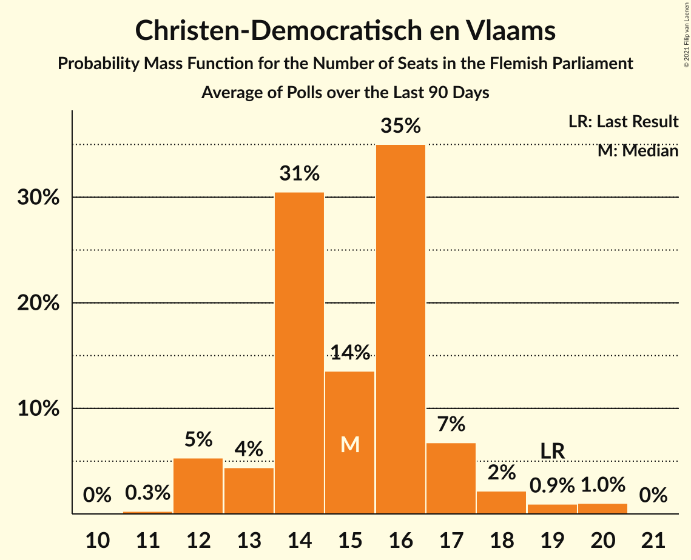

| Number of Seats | Probability | Accumulated | Special Marks |
|:---------------:|:-----------:|:-----------:|:-------------:|
| 10 | 0% | 100% |  |
| 11 | 7% | 99.9% |  |
| 12 | 13% | 93% |  |
| 13 | 10% | 80% |  |
| 14 | 33% | 70% | Median |
| 15 | 15% | 36% |  |
| 16 | 8% | 21% |  |
| 17 | 11% | 14% |  |
| 18 | 1.3% | 2% |  |
| 19 | 1.0% | 1.2% | Last Result |
| 20 | 0.2% | 0.2% |  |
| 21 | 0% | 0% |  |

### Open Vlaamse Liberalen en Democraten

*For a full overview of the results for this party, see the [Open Vlaamse Liberalen en Democraten](party-openvlaamseliberalenendemocraten.html) page.*

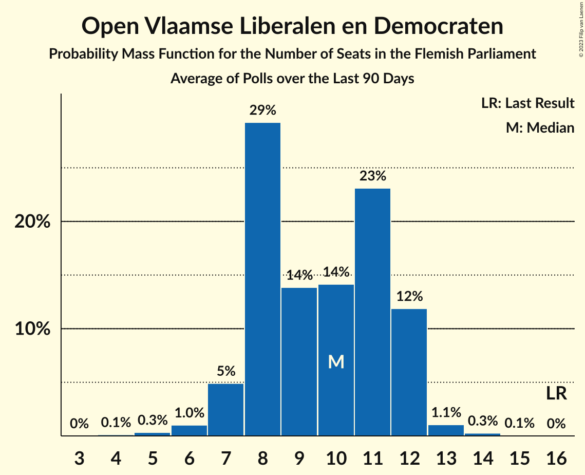

| Number of Seats | Probability | Accumulated | Special Marks |
|:---------------:|:-----------:|:-----------:|:-------------:|
| 5 | 0.5% | 100% |  |
| 6 | 1.2% | 99.5% |  |
| 7 | 4% | 98% |  |
| 8 | 25% | 95% |  |
| 9 | 10% | 69% |  |
| 10 | 13% | 59% | Median |
| 11 | 16% | 46% |  |
| 12 | 18% | 30% |  |
| 13 | 4% | 12% |  |
| 14 | 4% | 8% |  |
| 15 | 3% | 4% |  |
| 16 | 0.5% | 1.0% | Last Result |
| 17 | 0.4% | 0.4% |  |
| 18 | 0% | 0% |  |

### Vooruit

*For a full overview of the results for this party, see the [Vooruit](party-vooruit.html) page.*

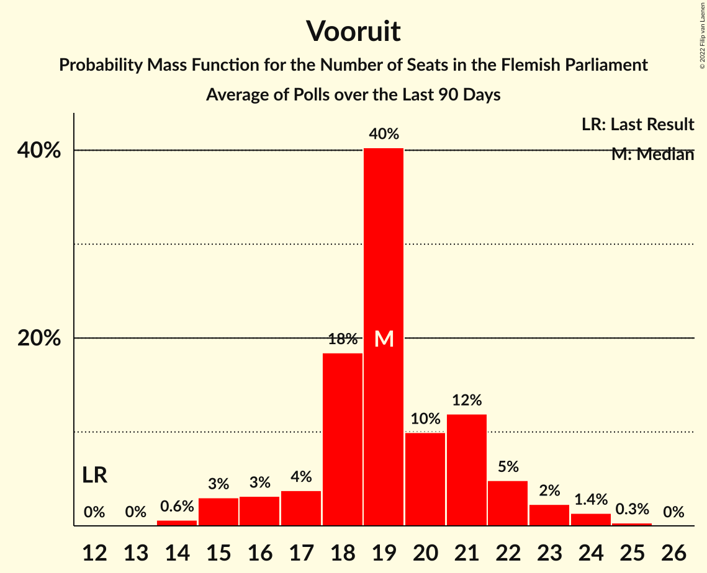

| Number of Seats | Probability | Accumulated | Special Marks |
|:---------------:|:-----------:|:-----------:|:-------------:|
| 11 | 2% | 100% |  |
| 12 | 2% | 98% | Last Result |
| 13 | 7% | 95% |  |
| 14 | 21% | 88% |  |
| 15 | 14% | 67% |  |
| 16 | 27% | 53% | Median |
| 17 | 10% | 26% |  |
| 18 | 9% | 16% |  |
| 19 | 6% | 7% |  |
| 20 | 0.2% | 0.2% |  |
| 21 | 0% | 0% |  |

### Groen

*For a full overview of the results for this party, see the [Groen](party-groen.html) page.*

| Number of Seats | Probability | Accumulated | Special Marks |
|:---------------:|:-----------:|:-----------:|:-------------:|
| 2 | 0.5% | 100% |  |
| 3 | 0.8% | 99.5% |  |
| 4 | 0.3% | 98.7% |  |
| 5 | 12% | 98% |  |
| 6 | 4% | 86% |  |
| 7 | 15% | 82% |  |
| 8 | 10% | 67% |  |
| 9 | 15% | 57% | Median |
| 10 | 17% | 42% |  |
| 11 | 22% | 25% |  |
| 12 | 2% | 3% |  |
| 13 | 0.9% | 1.3% |  |
| 14 | 0.5% | 0.5% | Last Result |
| 15 | 0% | 0% |  |

### Partij van de Arbeid van België

*For a full overview of the results for this party, see the [Partij van de Arbeid van België](party-partijvandearbeidvanbelgië.html) page.*

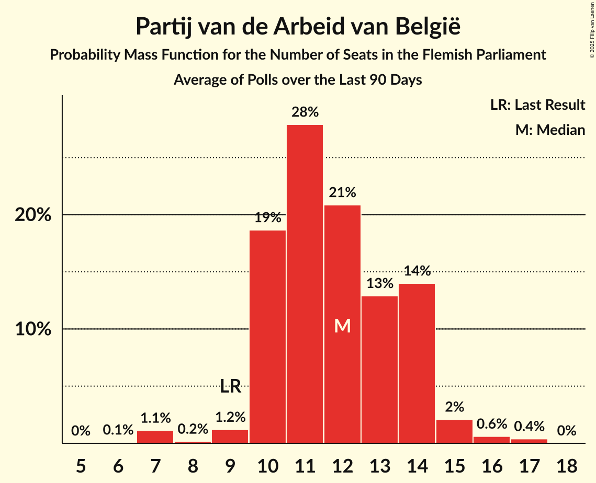

| Number of Seats | Probability | Accumulated | Special Marks |
|:---------------:|:-----------:|:-----------:|:-------------:|
| 4 | 0% | 100% | Last Result |
| 5 | 0% | 100% |  |
| 6 | 0% | 100% |  |
| 7 | 0.7% | 100% |  |
| 8 | 2% | 99.3% |  |
| 9 | 5% | 97% |  |
| 10 | 6% | 92% |  |
| 11 | 14% | 87% |  |
| 12 | 12% | 73% |  |
| 13 | 25% | 61% | Median |
| 14 | 23% | 36% |  |
| 15 | 4% | 13% |  |
| 16 | 3% | 9% |  |
| 17 | 2% | 6% |  |
| 18 | 4% | 4% |  |
| 19 | 0.7% | 0.8% |  |
| 20 | 0% | 0% |  |

## Coalitions

### Confidence Intervals

| Coalition | Last Result | Median | Majority? | 80% Confidence Interval | 90% Confidence Interval | 95% Confidence Interval | 99% Confidence Interval |
|:---------:|:-----------:|:------:|:---------:|:-----------------------:|:-----------------------:|:-----------------------:|:-----------------------:|
| Nieuw-Vlaamse Alliantie – Vlaams Belang – Christen-Democratisch en Vlaams | 77 | 77 | 100% | 72–81 | 72–82 | 71–83 | 69–84 |
| Nieuw-Vlaamse Alliantie – Christen-Democratisch en Vlaams – Open Vlaamse Liberalen en Democraten – Vooruit | 82 | 67 | 96% | 63–71 | 63–72 | 62–72 | 60–74 |
| Nieuw-Vlaamse Alliantie – Vlaams Belang | 58 | 63 | 53% | 59–66 | 59–67 | 58–68 | 56–69 |
| Nieuw-Vlaamse Alliantie – Christen-Democratisch en Vlaams – Vooruit | 66 | 57 | 3% | 53–61 | 52–62 | 52–63 | 50–64 |
| Nieuw-Vlaamse Alliantie – Open Vlaamse Liberalen en Democraten – Vooruit | 63 | 53 | 0% | 49–57 | 48–57 | 47–58 | 46–60 |
| Nieuw-Vlaamse Alliantie – Christen-Democratisch en Vlaams – Open Vlaamse Liberalen en Democraten | 70 | 52 | 0% | 47–56 | 46–57 | 45–57 | 44–59 |
| Christen-Democratisch en Vlaams – Vooruit – Groen – Partij van de Arbeid van België | 49 | 51 | 0% | 48–54 | 47–55 | 46–56 | 44–57 |
| Christen-Democratisch en Vlaams – Open Vlaamse Liberalen en Democraten – Vooruit – Groen | 61 | 48 | 0% | 45–52 | 44–52 | 44–53 | 42–55 |
| Nieuw-Vlaamse Alliantie – Christen-Democratisch en Vlaams | 54 | 42 | 0% | 37–45 | 36–46 | 35–47 | 33–48 |
| Christen-Democratisch en Vlaams – Open Vlaamse Liberalen en Democraten – Vooruit | 47 | 40 | 0% | 37–43 | 36–44 | 36–44 | 34–46 |
| Christen-Democratisch en Vlaams – Vooruit – Groen | 45 | 39 | 0% | 33–42 | 32–43 | 31–44 | 29–45 |
| Nieuw-Vlaamse Alliantie – Open Vlaamse Liberalen en Democraten | 51 | 38 | 0% | 34–41 | 33–42 | 32–43 | 31–45 |
| Open Vlaamse Liberalen en Democraten – Vooruit – Groen | 42 | 34 | 0% | 31–38 | 30–39 | 30–40 | 28–41 |
| Christen-Democratisch en Vlaams – Open Vlaamse Liberalen en Democraten – Groen | 49 | 33 | 0% | 30–36 | 29–37 | 29–38 | 28–40 |
| Christen-Democratisch en Vlaams – Vooruit | 31 | 30 | 0% | 27–32 | 26–33 | 25–33 | 24–35 |
| Open Vlaamse Liberalen en Democraten – Vooruit | 28 | 26 | 0% | 22–29 | 22–30 | 21–30 | 20–31 |
| Christen-Democratisch en Vlaams – Open Vlaamse Liberalen en Democraten | 35 | 24 | 0% | 22–28 | 21–29 | 20–29 | 19–31 |

### Nieuw-Vlaamse Alliantie – Vlaams Belang – Christen-Democratisch en Vlaams

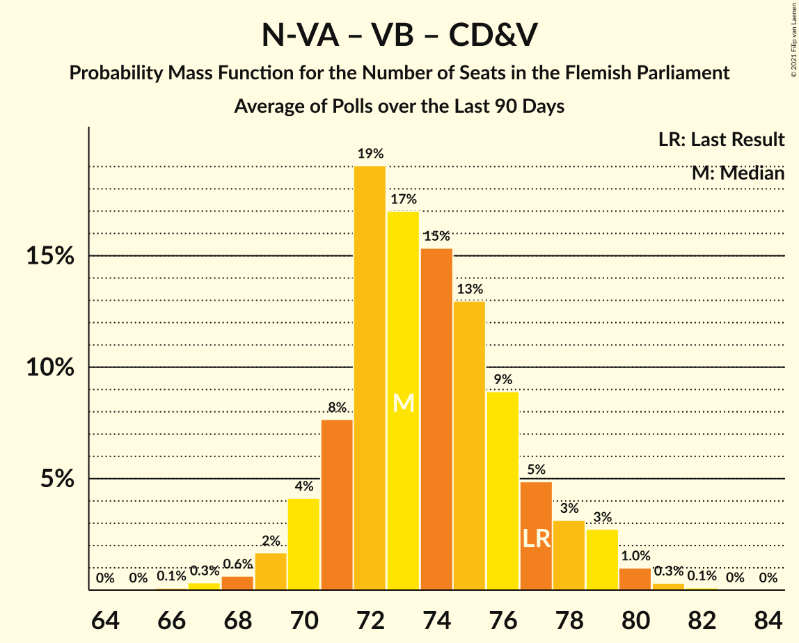

| Number of Seats | Probability | Accumulated | Special Marks |
|:---------------:|:-----------:|:-----------:|:-------------:|
| 68 | 0.1% | 100% |  |
| 69 | 0.4% | 99.9% |  |
| 70 | 2% | 99.4% |  |
| 71 | 3% | 98% |  |
| 72 | 5% | 95% |  |
| 73 | 7% | 90% |  |
| 74 | 9% | 83% |  |
| 75 | 11% | 75% |  |
| 76 | 8% | 64% |  |
| 77 | 10% | 55% | Last Result, Median |
| 78 | 10% | 46% |  |
| 79 | 12% | 36% |  |
| 80 | 10% | 23% |  |
| 81 | 7% | 14% |  |
| 82 | 4% | 7% |  |
| 83 | 2% | 3% |  |
| 84 | 0.8% | 1.2% |  |
| 85 | 0.3% | 0.4% |  |
| 86 | 0.1% | 0.1% |  |
| 87 | 0% | 0% |  |

### Nieuw-Vlaamse Alliantie – Christen-Democratisch en Vlaams – Open Vlaamse Liberalen en Democraten – Vooruit

| Number of Seats | Probability | Accumulated | Special Marks |
|:---------------:|:-----------:|:-----------:|:-------------:|
| 59 | 0.1% | 100% |  |
| 60 | 0.4% | 99.9% |  |
| 61 | 0.9% | 99.5% |  |
| 62 | 3% | 98.5% |  |
| 63 | 6% | 96% | Majority |
| 64 | 9% | 90% |  |
| 65 | 12% | 81% |  |
| 66 | 11% | 68% |  |
| 67 | 12% | 57% | Median |
| 68 | 13% | 45% |  |
| 69 | 13% | 32% |  |
| 70 | 9% | 20% |  |
| 71 | 6% | 11% |  |
| 72 | 3% | 5% |  |
| 73 | 1.3% | 2% |  |
| 74 | 0.6% | 0.8% |  |
| 75 | 0.2% | 0.3% |  |
| 76 | 0.1% | 0.1% |  |
| 77 | 0% | 0% |  |
| 78 | 0% | 0% |  |
| 79 | 0% | 0% |  |
| 80 | 0% | 0% |  |
| 81 | 0% | 0% |  |
| 82 | 0% | 0% | Last Result |

### Nieuw-Vlaamse Alliantie – Vlaams Belang

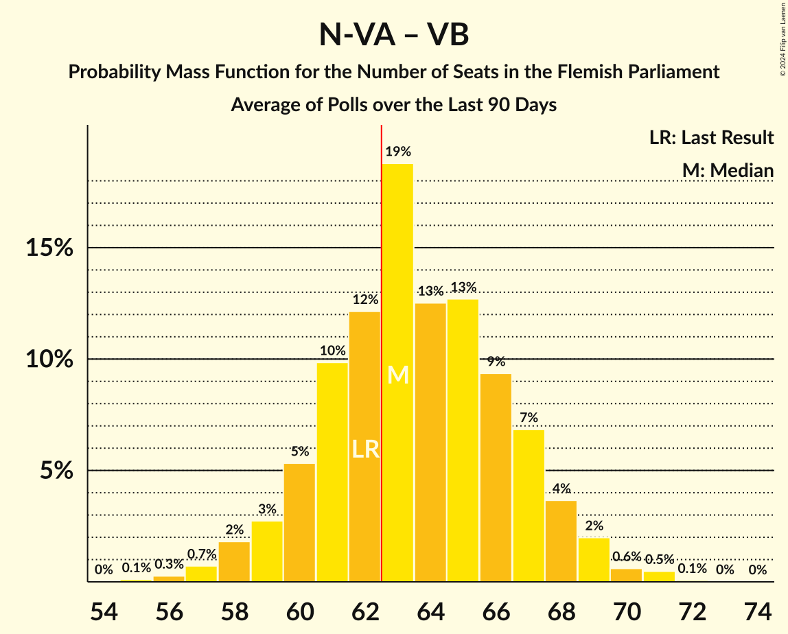

| Number of Seats | Probability | Accumulated | Special Marks |
|:---------------:|:-----------:|:-----------:|:-------------:|
| 55 | 0.2% | 100% |  |
| 56 | 0.6% | 99.8% |  |
| 57 | 1.2% | 99.2% |  |
| 58 | 3% | 98% | Last Result |
| 59 | 6% | 95% |  |
| 60 | 9% | 89% |  |
| 61 | 13% | 80% |  |
| 62 | 14% | 67% |  |
| 63 | 15% | 53% | Median, Majority |
| 64 | 13% | 39% |  |
| 65 | 10% | 25% |  |
| 66 | 7% | 15% |  |
| 67 | 4% | 7% |  |
| 68 | 2% | 3% |  |
| 69 | 0.9% | 1.2% |  |
| 70 | 0.2% | 0.3% |  |
| 71 | 0.1% | 0.1% |  |
| 72 | 0% | 0% |  |

### Nieuw-Vlaamse Alliantie – Christen-Democratisch en Vlaams – Vooruit

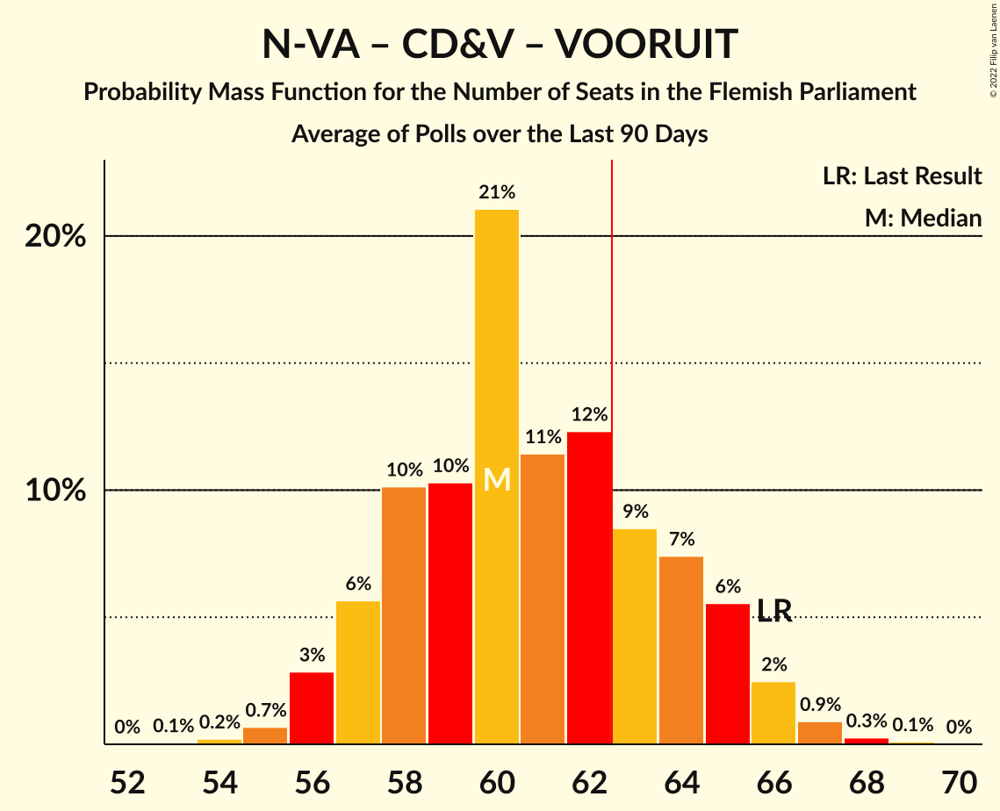

| Number of Seats | Probability | Accumulated | Special Marks |
|:---------------:|:-----------:|:-----------:|:-------------:|
| 49 | 0.2% | 100% |  |
| 50 | 0.5% | 99.8% |  |
| 51 | 2% | 99.3% |  |
| 52 | 5% | 98% |  |
| 53 | 7% | 93% |  |
| 54 | 10% | 85% |  |
| 55 | 10% | 75% |  |
| 56 | 13% | 66% |  |
| 57 | 14% | 52% | Median |
| 58 | 9% | 38% |  |
| 59 | 7% | 29% |  |
| 60 | 7% | 22% |  |
| 61 | 7% | 15% |  |
| 62 | 4% | 8% |  |
| 63 | 2% | 3% | Majority |
| 64 | 0.9% | 1.3% |  |
| 65 | 0.2% | 0.4% |  |
| 66 | 0.1% | 0.1% | Last Result |
| 67 | 0% | 0% |  |

### Nieuw-Vlaamse Alliantie – Open Vlaamse Liberalen en Democraten – Vooruit

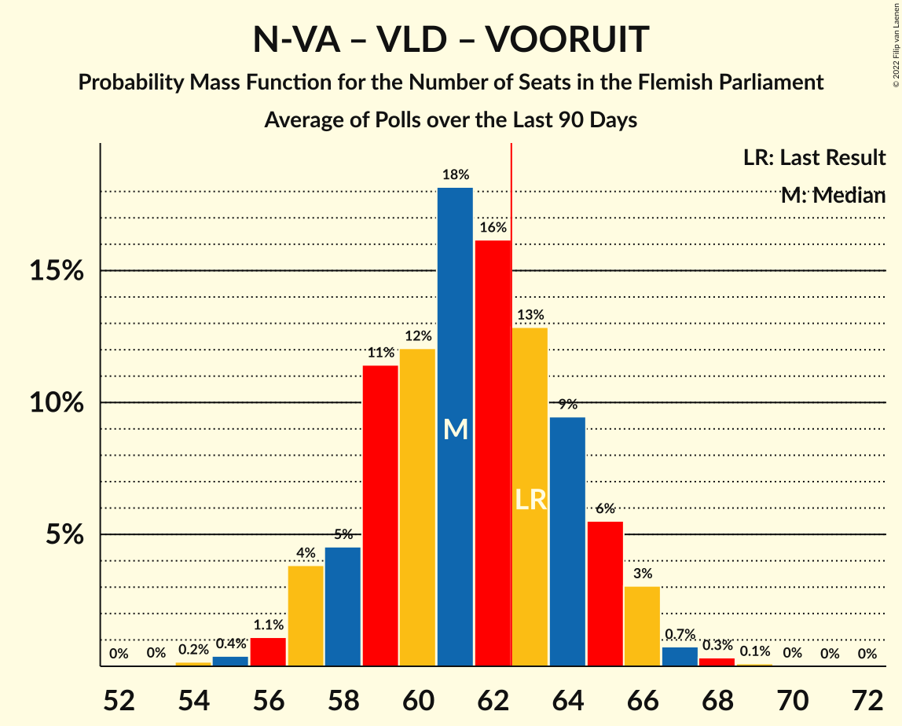

| Number of Seats | Probability | Accumulated | Special Marks |
|:---------------:|:-----------:|:-----------:|:-------------:|
| 44 | 0.1% | 100% |  |
| 45 | 0.2% | 99.9% |  |
| 46 | 0.5% | 99.7% |  |
| 47 | 2% | 99.1% |  |
| 48 | 3% | 97% |  |
| 49 | 5% | 94% |  |
| 50 | 8% | 89% |  |
| 51 | 11% | 81% |  |
| 52 | 14% | 70% |  |
| 53 | 15% | 56% | Median |
| 54 | 13% | 41% |  |
| 55 | 10% | 28% |  |
| 56 | 8% | 18% |  |
| 57 | 6% | 10% |  |
| 58 | 3% | 4% |  |
| 59 | 1.1% | 2% |  |
| 60 | 0.5% | 0.7% |  |
| 61 | 0.2% | 0.2% |  |
| 62 | 0% | 0.1% |  |
| 63 | 0% | 0% | Last Result, Majority |

### Nieuw-Vlaamse Alliantie – Christen-Democratisch en Vlaams – Open Vlaamse Liberalen en Democraten

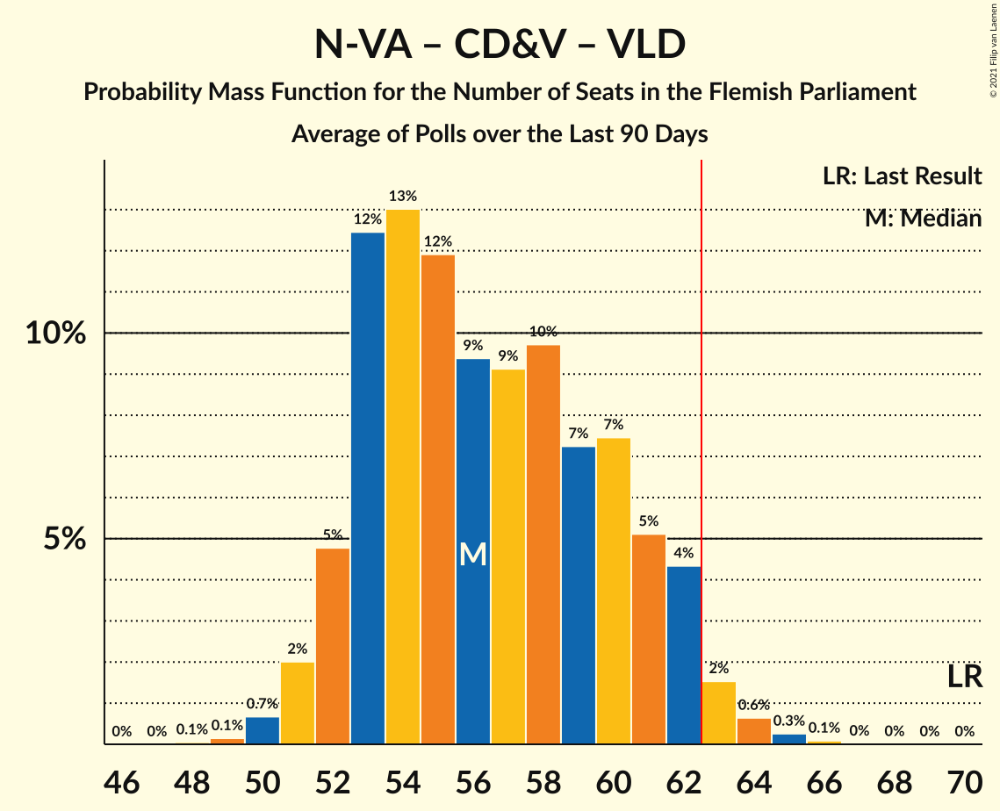

| Number of Seats | Probability | Accumulated | Special Marks |
|:---------------:|:-----------:|:-----------:|:-------------:|
| 42 | 0.1% | 100% |  |
| 43 | 0.4% | 99.9% |  |
| 44 | 1.4% | 99.5% |  |
| 45 | 2% | 98% |  |
| 46 | 4% | 96% |  |
| 47 | 4% | 91% |  |
| 48 | 6% | 87% |  |
| 49 | 8% | 81% |  |
| 50 | 8% | 73% |  |
| 51 | 9% | 65% | Median |
| 52 | 12% | 55% |  |
| 53 | 14% | 44% |  |
| 54 | 10% | 30% |  |
| 55 | 8% | 19% |  |
| 56 | 6% | 11% |  |
| 57 | 3% | 5% |  |
| 58 | 1.2% | 2% |  |
| 59 | 0.6% | 1.0% |  |
| 60 | 0.2% | 0.4% |  |
| 61 | 0.1% | 0.1% |  |
| 62 | 0% | 0% |  |
| 63 | 0% | 0% | Majority |
| 64 | 0% | 0% |  |
| 65 | 0% | 0% |  |
| 66 | 0% | 0% |  |
| 67 | 0% | 0% |  |
| 68 | 0% | 0% |  |
| 69 | 0% | 0% |  |
| 70 | 0% | 0% | Last Result |

### Christen-Democratisch en Vlaams – Vooruit – Groen – Partij van de Arbeid van België

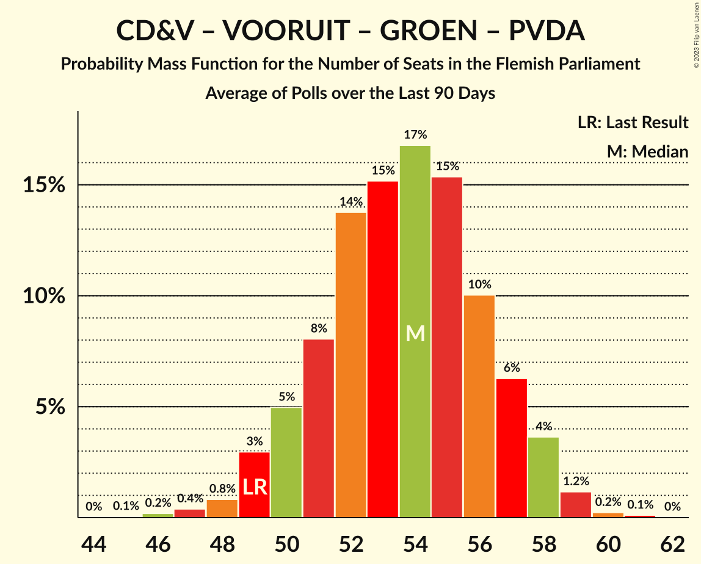

| Number of Seats | Probability | Accumulated | Special Marks |
|:---------------:|:-----------:|:-----------:|:-------------:|
| 42 | 0% | 100% |  |
| 43 | 0.2% | 99.9% |  |
| 44 | 0.5% | 99.8% |  |
| 45 | 1.2% | 99.2% |  |
| 46 | 3% | 98% |  |
| 47 | 5% | 95% |  |
| 48 | 7% | 90% |  |
| 49 | 10% | 83% | Last Result |
| 50 | 13% | 73% |  |
| 51 | 14% | 60% |  |
| 52 | 16% | 46% | Median |
| 53 | 12% | 30% |  |
| 54 | 9% | 17% |  |
| 55 | 5% | 9% |  |
| 56 | 2% | 4% |  |
| 57 | 1.1% | 2% |  |
| 58 | 0.3% | 0.4% |  |
| 59 | 0.1% | 0.1% |  |
| 60 | 0% | 0% |  |

### Christen-Democratisch en Vlaams – Open Vlaamse Liberalen en Democraten – Vooruit – Groen

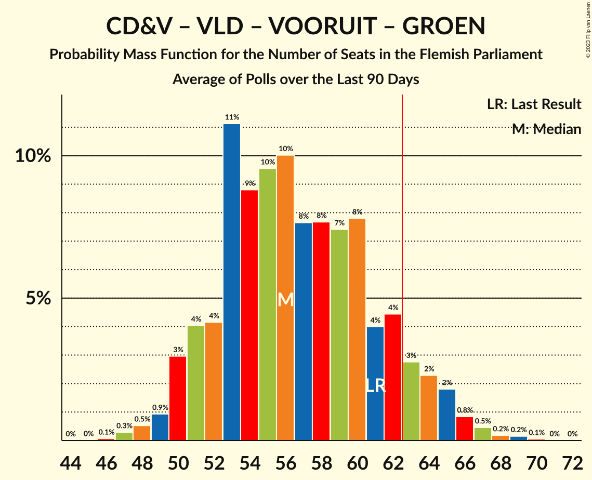

| Number of Seats | Probability | Accumulated | Special Marks |
|:---------------:|:-----------:|:-----------:|:-------------:|
| 40 | 0.1% | 100% |  |
| 41 | 0.2% | 99.9% |  |
| 42 | 0.8% | 99.7% |  |
| 43 | 1.4% | 98.9% |  |
| 44 | 3% | 98% |  |
| 45 | 5% | 94% |  |
| 46 | 9% | 90% |  |
| 47 | 15% | 81% |  |
| 48 | 16% | 65% |  |
| 49 | 14% | 49% | Median |
| 50 | 14% | 35% |  |
| 51 | 10% | 21% |  |
| 52 | 6% | 11% |  |
| 53 | 2% | 4% |  |
| 54 | 1.2% | 2% |  |
| 55 | 0.5% | 0.8% |  |
| 56 | 0.2% | 0.3% |  |
| 57 | 0.1% | 0.1% |  |
| 58 | 0% | 0% |  |
| 59 | 0% | 0% |  |
| 60 | 0% | 0% |  |
| 61 | 0% | 0% | Last Result |

### Nieuw-Vlaamse Alliantie – Christen-Democratisch en Vlaams

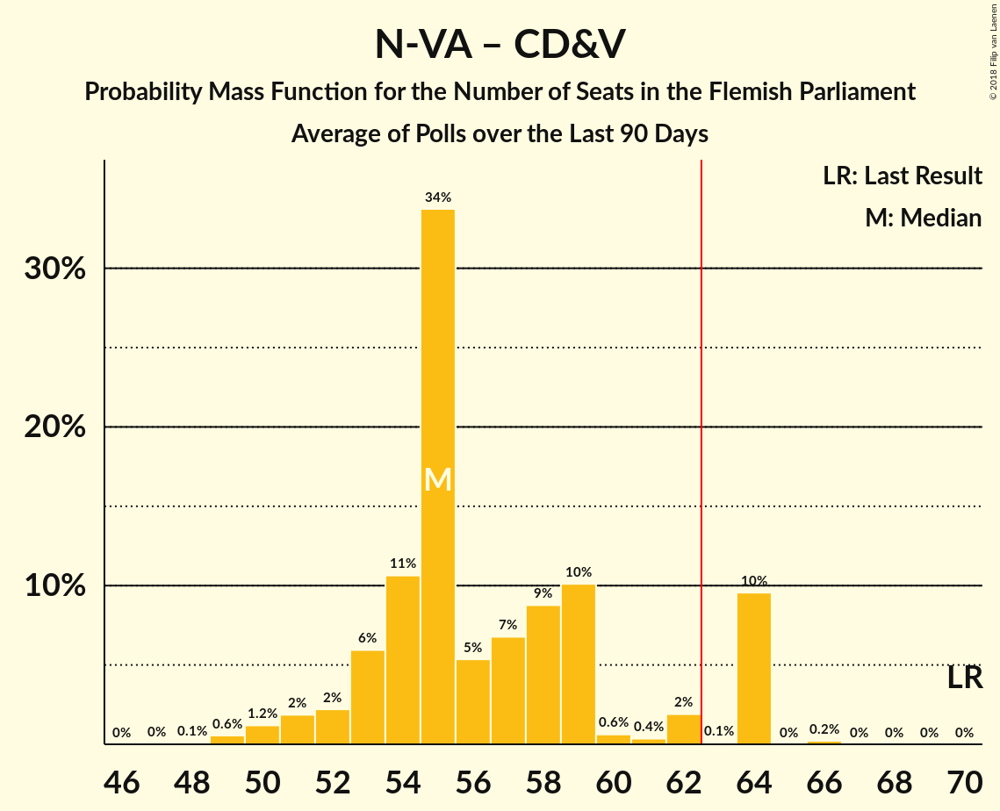

| Number of Seats | Probability | Accumulated | Special Marks |
|:---------------:|:-----------:|:-----------:|:-------------:|
| 32 | 0.1% | 100% |  |
| 33 | 0.6% | 99.9% |  |
| 34 | 1.4% | 99.3% |  |
| 35 | 2% | 98% |  |
| 36 | 4% | 96% |  |
| 37 | 5% | 92% |  |
| 38 | 11% | 87% |  |
| 39 | 6% | 76% |  |
| 40 | 7% | 69% |  |
| 41 | 10% | 62% | Median |
| 42 | 10% | 53% |  |
| 43 | 12% | 42% |  |
| 44 | 11% | 30% |  |
| 45 | 10% | 19% |  |
| 46 | 5% | 9% |  |
| 47 | 3% | 4% |  |
| 48 | 0.8% | 1.1% |  |
| 49 | 0.2% | 0.3% |  |
| 50 | 0.1% | 0.1% |  |
| 51 | 0% | 0% |  |
| 52 | 0% | 0% |  |
| 53 | 0% | 0% |  |
| 54 | 0% | 0% | Last Result |

### Christen-Democratisch en Vlaams – Open Vlaamse Liberalen en Democraten – Vooruit

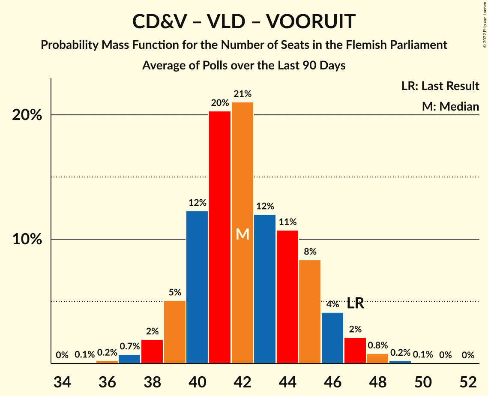

| Number of Seats | Probability | Accumulated | Special Marks |
|:---------------:|:-----------:|:-----------:|:-------------:|
| 33 | 0.1% | 100% |  |
| 34 | 0.5% | 99.8% |  |
| 35 | 2% | 99.4% |  |
| 36 | 4% | 98% |  |
| 37 | 8% | 94% |  |
| 38 | 13% | 86% |  |
| 39 | 15% | 73% |  |
| 40 | 19% | 58% | Median |
| 41 | 18% | 39% |  |
| 42 | 11% | 22% |  |
| 43 | 5% | 11% |  |
| 44 | 3% | 5% |  |
| 45 | 2% | 2% |  |
| 46 | 0.5% | 0.8% |  |
| 47 | 0.2% | 0.3% | Last Result |
| 48 | 0% | 0% |  |

### Christen-Democratisch en Vlaams – Vooruit – Groen

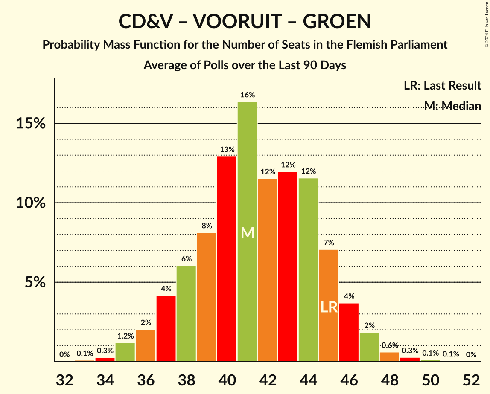

| Number of Seats | Probability | Accumulated | Special Marks |
|:---------------:|:-----------:|:-----------:|:-------------:|
| 27 | 0.1% | 100% |  |
| 28 | 0.1% | 99.9% |  |
| 29 | 0.5% | 99.8% |  |
| 30 | 1.1% | 99.3% |  |
| 31 | 2% | 98% |  |
| 32 | 3% | 96% |  |
| 33 | 4% | 94% |  |
| 34 | 5% | 89% |  |
| 35 | 5% | 85% |  |
| 36 | 6% | 79% |  |
| 37 | 7% | 73% |  |
| 38 | 11% | 66% |  |
| 39 | 14% | 55% | Median |
| 40 | 14% | 41% |  |
| 41 | 13% | 27% |  |
| 42 | 8% | 14% |  |
| 43 | 4% | 6% |  |
| 44 | 2% | 3% |  |
| 45 | 0.5% | 0.7% | Last Result |
| 46 | 0.1% | 0.2% |  |
| 47 | 0% | 0% |  |

### Nieuw-Vlaamse Alliantie – Open Vlaamse Liberalen en Democraten

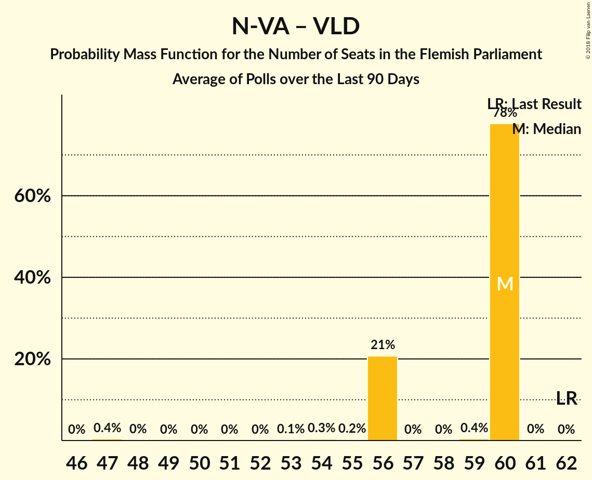

| Number of Seats | Probability | Accumulated | Special Marks |
|:---------------:|:-----------:|:-----------:|:-------------:|
| 29 | 0.1% | 100% |  |
| 30 | 0.3% | 99.9% |  |
| 31 | 1.0% | 99.6% |  |
| 32 | 2% | 98.7% |  |
| 33 | 5% | 96% |  |
| 34 | 8% | 91% |  |
| 35 | 10% | 83% |  |
| 36 | 10% | 72% |  |
| 37 | 12% | 62% | Median |
| 38 | 16% | 50% |  |
| 39 | 12% | 34% |  |
| 40 | 7% | 22% |  |
| 41 | 6% | 15% |  |
| 42 | 4% | 9% |  |
| 43 | 3% | 5% |  |
| 44 | 1.3% | 2% |  |
| 45 | 0.5% | 0.7% |  |
| 46 | 0.2% | 0.3% |  |
| 47 | 0.1% | 0.1% |  |
| 48 | 0% | 0% |  |
| 49 | 0% | 0% |  |
| 50 | 0% | 0% |  |
| 51 | 0% | 0% | Last Result |

### Open Vlaamse Liberalen en Democraten – Vooruit – Groen

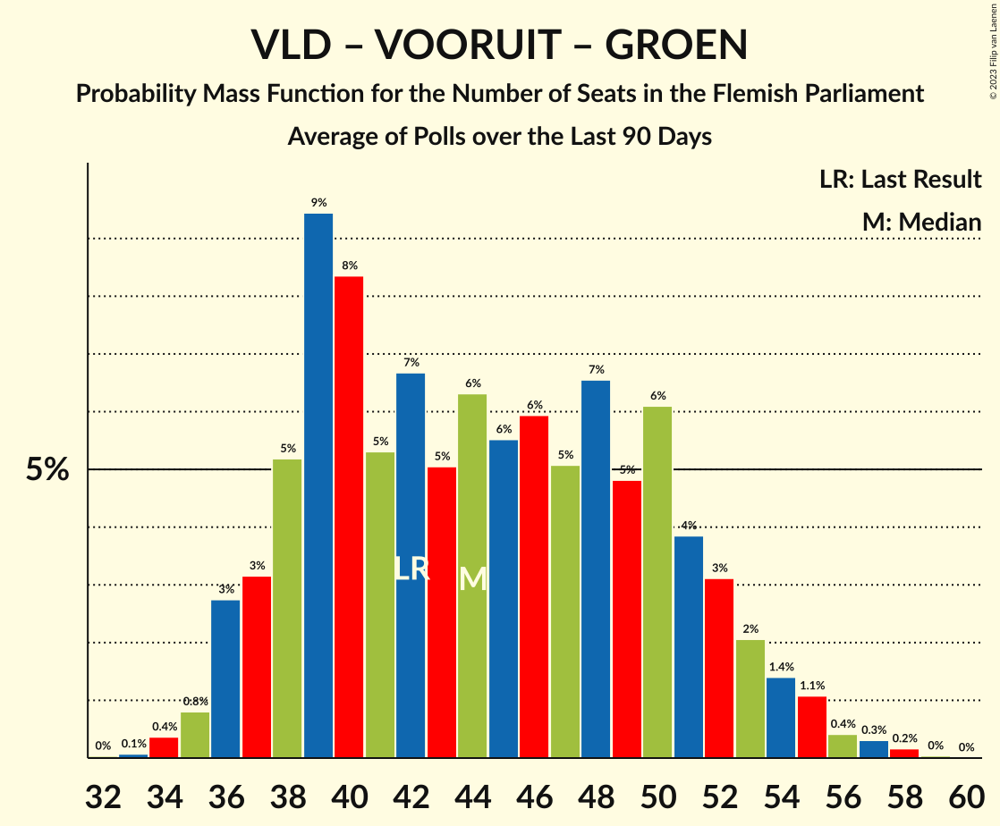

| Number of Seats | Probability | Accumulated | Special Marks |
|:---------------:|:-----------:|:-----------:|:-------------:|
| 27 | 0.2% | 100% |  |
| 28 | 0.7% | 99.8% |  |
| 29 | 2% | 99.1% |  |
| 30 | 4% | 98% |  |
| 31 | 8% | 93% |  |
| 32 | 12% | 86% |  |
| 33 | 15% | 74% |  |
| 34 | 14% | 59% |  |
| 35 | 12% | 45% | Median |
| 36 | 13% | 33% |  |
| 37 | 8% | 21% |  |
| 38 | 6% | 12% |  |
| 39 | 3% | 7% |  |
| 40 | 2% | 3% |  |
| 41 | 0.7% | 1.0% |  |
| 42 | 0.2% | 0.3% | Last Result |
| 43 | 0% | 0% |  |

### Christen-Democratisch en Vlaams – Open Vlaamse Liberalen en Democraten – Groen

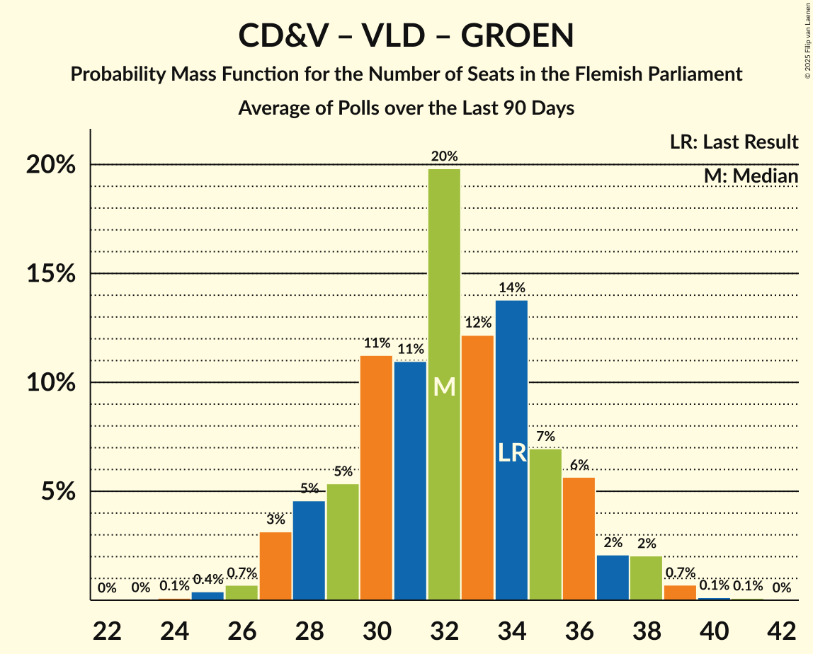

| Number of Seats | Probability | Accumulated | Special Marks |
|:---------------:|:-----------:|:-----------:|:-------------:|
| 26 | 0.1% | 100% |  |
| 27 | 0.3% | 99.9% |  |
| 28 | 2% | 99.5% |  |
| 29 | 3% | 98% |  |
| 30 | 7% | 95% |  |
| 31 | 15% | 88% |  |
| 32 | 19% | 73% |  |
| 33 | 17% | 54% | Median |
| 34 | 12% | 37% |  |
| 35 | 9% | 25% |  |
| 36 | 8% | 16% |  |
| 37 | 4% | 8% |  |
| 38 | 2% | 4% |  |
| 39 | 1.0% | 2% |  |
| 40 | 0.4% | 0.8% |  |
| 41 | 0.3% | 0.4% |  |
| 42 | 0.1% | 0.1% |  |
| 43 | 0% | 0% |  |
| 44 | 0% | 0% |  |
| 45 | 0% | 0% |  |
| 46 | 0% | 0% |  |
| 47 | 0% | 0% |  |
| 48 | 0% | 0% |  |
| 49 | 0% | 0% | Last Result |

### Christen-Democratisch en Vlaams – Vooruit

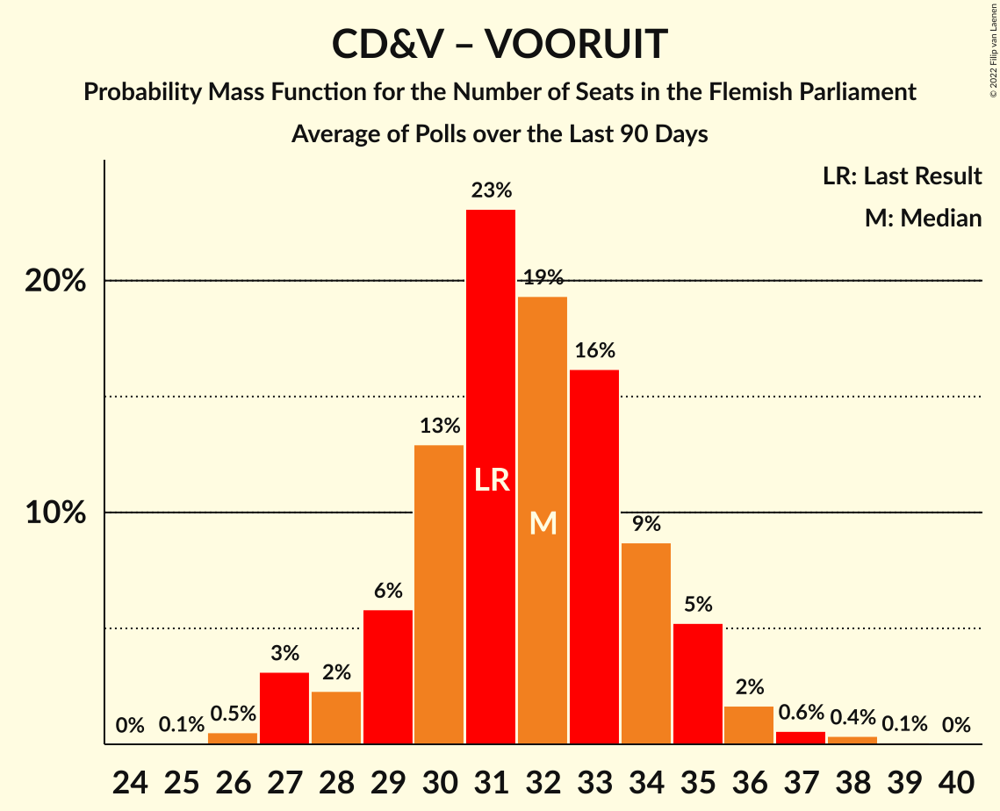

| Number of Seats | Probability | Accumulated | Special Marks |
|:---------------:|:-----------:|:-----------:|:-------------:|
| 23 | 0.2% | 100% |  |
| 24 | 0.6% | 99.8% |  |
| 25 | 2% | 99.1% |  |
| 26 | 4% | 97% |  |
| 27 | 7% | 93% |  |
| 28 | 11% | 86% |  |
| 29 | 17% | 75% |  |
| 30 | 24% | 58% | Median |
| 31 | 17% | 33% | Last Result |
| 32 | 9% | 16% |  |
| 33 | 5% | 7% |  |
| 34 | 2% | 2% |  |
| 35 | 0.5% | 0.7% |  |
| 36 | 0.2% | 0.2% |  |
| 37 | 0% | 0% |  |

### Open Vlaamse Liberalen en Democraten – Vooruit

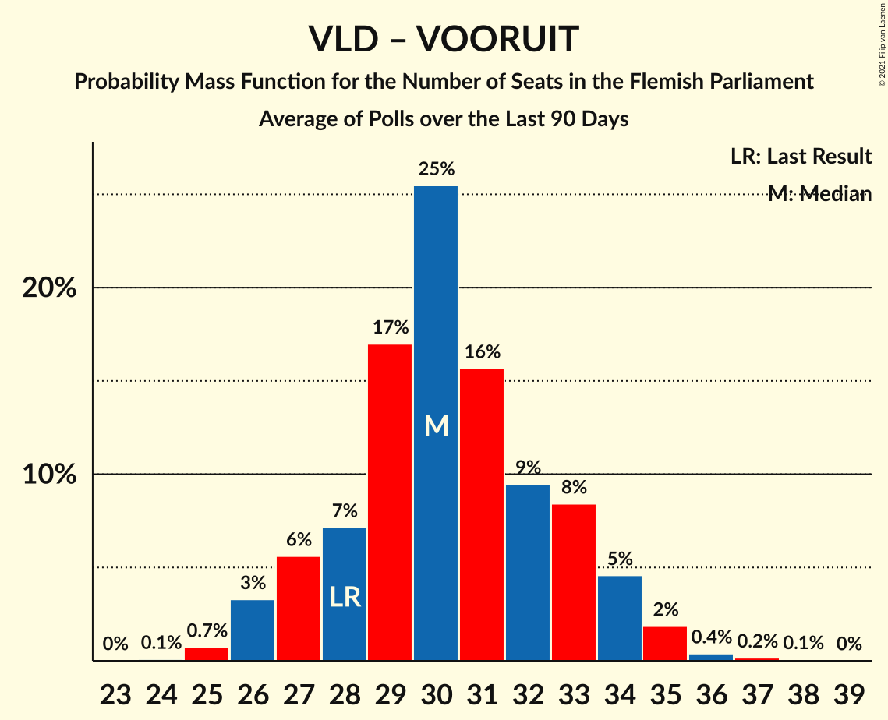

| Number of Seats | Probability | Accumulated | Special Marks |
|:---------------:|:-----------:|:-----------:|:-------------:|
| 18 | 0.1% | 100% |  |
| 19 | 0.3% | 99.9% |  |
| 20 | 1.1% | 99.6% |  |
| 21 | 3% | 98.6% |  |
| 22 | 7% | 96% |  |
| 23 | 9% | 89% |  |
| 24 | 12% | 80% |  |
| 25 | 12% | 68% |  |
| 26 | 17% | 56% | Median |
| 27 | 16% | 39% |  |
| 28 | 10% | 23% | Last Result |
| 29 | 6% | 13% |  |
| 30 | 5% | 7% |  |
| 31 | 2% | 2% |  |
| 32 | 0.3% | 0.4% |  |
| 33 | 0.1% | 0.1% |  |
| 34 | 0% | 0% |  |

### Christen-Democratisch en Vlaams – Open Vlaamse Liberalen en Democraten

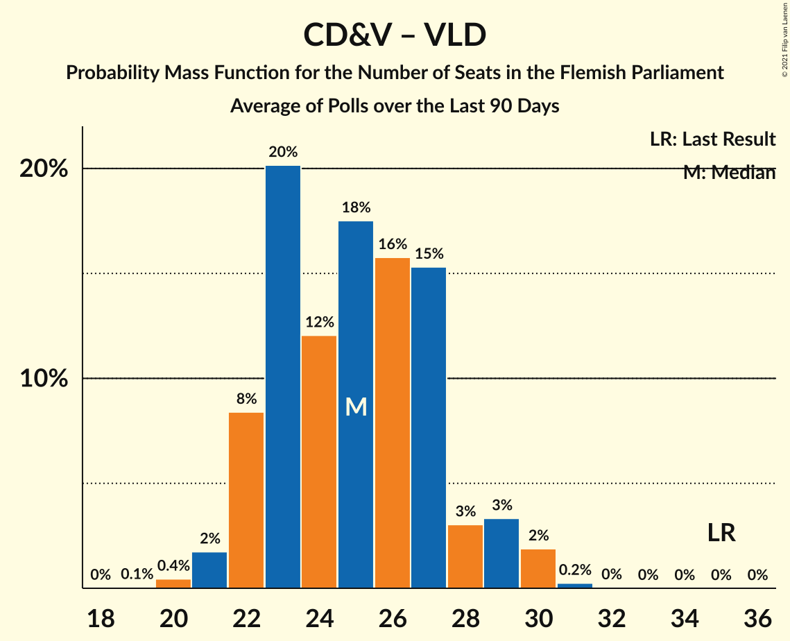

| Number of Seats | Probability | Accumulated | Special Marks |
|:---------------:|:-----------:|:-----------:|:-------------:|
| 18 | 0.1% | 100% |  |
| 19 | 0.7% | 99.9% |  |
| 20 | 3% | 99.2% |  |
| 21 | 6% | 97% |  |
| 22 | 17% | 90% |  |
| 23 | 13% | 73% |  |
| 24 | 13% | 60% | Median |
| 25 | 13% | 47% |  |
| 26 | 13% | 34% |  |
| 27 | 10% | 21% |  |
| 28 | 5% | 11% |  |
| 29 | 3% | 6% |  |
| 30 | 1.5% | 2% |  |
| 31 | 0.8% | 1.0% |  |
| 32 | 0.2% | 0.2% |  |
| 33 | 0% | 0.1% |  |
| 34 | 0% | 0% |  |
| 35 | 0% | 0% | Last Result |

## Technical Information

+ **Number of polls included in this average:** 4
+ **Lowest number of simulations done in a poll included in this average:** 2,097,152
+ **Total number of simulations done in the polls included in this average:** 8,388,608
+ **Error estimate:** 0.90%
