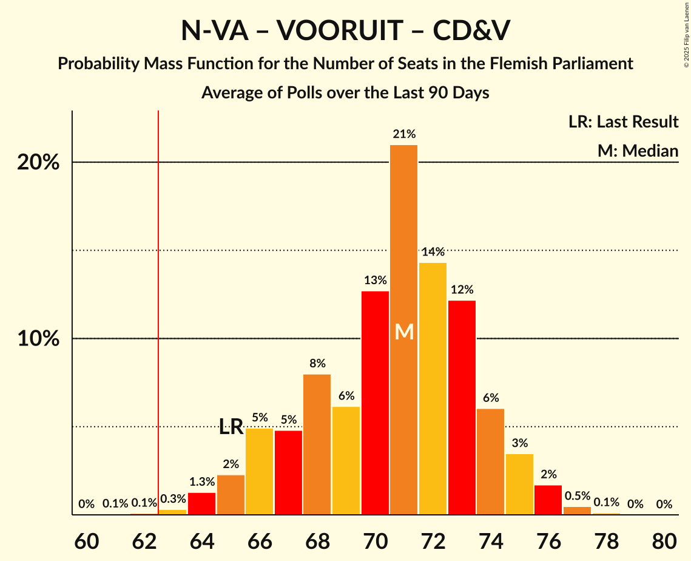

# Poll Average

<a href="#voting-intentions">Voting Intentions</a> | <a href="#seats">Seats</a> | <a href="#coalitions">Coalitions</a> | <a href="#technical-information">Technical Information</a>

## Summary

The table below lists the polls on which the average is based. They are the most recent polls (less than 90 days old) registered and analyzed so far.

| Period     | Polling firm/Commissioner(s) | N-VA | VB | VOORUIT | CD&V | VLD | PVDA | GROEN | TFA |
|:----------:|:----------------------------:|:--:|:--:|:--:|:--:|:--:|:--:|:--:|:--:|
| 9 June 2024 | General Election | 23.9%   31 | 22.7%   31 | 13.8%   18 | 13.0%   16 | 8.3%   9 | 8.3%   9 | 7.3%   9 | 0.3%   1 |
| N/A | Poll Average | 24–29%   31–39 | 19–25%   25–33 | 12–16%   14–21 | 12–16%   15–21 | 5–8%   2–8 | 8–11%   7–13 | 6–9%   6–12 | 0%   0–2 |
| [27 May–3 June 2025](2025-06-03-Ipsos.html) | Ipsos   Het Laatste Nieuws, Le Soir, RTL TVi and VTM | 24–29%   31–39 | 20–26%   26–33 | 11–16%   13–20 | 12–17%   15–21 | 5–8%   2–8 | 7–11%   7–14 | 6–9%   6–12 | 0–1%   0–3 |
| [3–24 March 2025](2025-03-24-BpactandUniversiteitAntwerpenULB.html) | Bpact and Universiteit Antwerpen & ULB   De Standaard, RTBF and VRT | 25–29%   34–39 | 19–22%   25–31 | 13–16%   17–21 | 12–15%   15–19 | 5–7%   2–7 | 8–10%   7–13 | 6–9%   7–12 | 0%   0–1 |
| 9 June 2024 | General Election | 23.9%   31 | 22.7%   31 | 13.8%   18 | 13.0%   16 | 8.3%   9 | 8.3%   9 | 7.3%   9 | 0.3%   1 |

Only polls for which at least the sample size has been published are included in the table above.

**Legend:**
+ **Top half of each row:** Voting intentions (95% confidence interval)
+ **Bottom half of each row:** Seat projections for the Flemish Parliament (95% confidence interval)
+ **N-VA:** Nieuw-Vlaamse Alliantie
+ **VB:** Vlaams Belang
+ **VOORUIT:** Vooruit
+ **CD&V:** Christen-Democratisch en Vlaams
+ **VLD:** Open Vlaamse Liberalen en Democraten
+ **PVDA:** Partij van de Arbeid van België
+ **GROEN:** Groen
+ **TFA:** Team Fouad Ahidar
+ **N/A (single party):** Party not included the published results
+ **N/A (entire row):** Calculation for this opinion poll not started yet

## Voting Intentions

### Confidence Intervals

| Party | Last Result | Median | 80% Confidence Interval | 90% Confidence Interval | 95% Confidence Interval | 99% Confidence Interval |
|:-----:|:-----------:|:------:|:-----------------------:|:-----------------------:|:-----------------------:|:-----------------------:|
| <a href="#nieuw-vlaamse-alliantie">Nieuw-Vlaamse Alliantie</a> | 23.9% | 26.7% | 25.1–28.1% |24.5–28.6% | 24.1–29.0% | 23.2–29.8% |
| <a href="#vlaams-belang">Vlaams Belang</a> | 22.7% | 21.5% | 19.8–24.0% |19.4–24.6% | 19.2–25.1% | 18.6–26.0% |
| <a href="#vooruit">Vooruit</a> | 13.8% | 14.2% | 12.6–15.5% |12.1–15.8% | 11.7–16.1% | 11.1–16.7% |
| <a href="#christen-democratisch-en-vlaams">Christen-Democratisch en Vlaams</a> | 13.0% | 14.0% | 12.9–15.5% |12.6–16.0% | 12.4–16.4% | 11.9–17.3% |
| <a href="#open-vlaamse-liberalen-en-democraten">Open Vlaamse Liberalen en Democraten</a> | 8.3% | 5.9% | 5.2–6.9% |5.0–7.2% | 4.8–7.5% | 4.5–8.1% |
| <a href="#partij-van-de-arbeid-van-belgië">Partij van de Arbeid van België</a> | 8.3% | 9.0% | 8.0–9.9% |7.8–10.3% | 7.5–10.6% | 7.0–11.2% |
| <a href="#groen">Groen</a> | 7.3% | 7.4% | 6.6–8.3% |6.3–8.6% | 6.1–8.9% | 5.7–9.5% |
| <a href="#team-fouad-ahidar">Team Fouad Ahidar</a> | 0.3% | 0.1% | 0.1–0.3% |0.0–0.4% | 0.0–0.5% | 0.0–0.7% |

### Nieuw-Vlaamse Alliantie

*For a full overview of the results for this party, see the [Nieuw-Vlaamse Alliantie](party-nieuw-vlaamsealliantie.html) page.*

| Voting Intentions | Probability | Accumulated | Special Marks |
|:-----------------:|:-----------:|:-----------:|:-------------:|
| 20.5–21.5% | 0% | 100% |  |
| 21.5–22.5% | 0.1% | 100% |  |
| 22.5–23.5% | 0.9% | 99.9% |  |
| 23.5–24.5% | 4% | 99.0% | Last Result |
| 24.5–25.5% | 13% | 95% |  |
| 25.5–26.5% | 28% | 82% |  |
| 26.5–27.5% | 32% | 55% | Median |
| 27.5–28.5% | 17% | 22% |  |
| 28.5–29.5% | 4% | 5% |  |
| 29.5–30.5% | 0.7% | 0.8% |  |
| 30.5–31.5% | 0.1% | 0.1% |  |
| 31.5–32.5% | 0% | 0% |  |

### Vlaams Belang

*For a full overview of the results for this party, see the [Vlaams Belang](party-vlaamsbelang.html) page.*

| Voting Intentions | Probability | Accumulated | Special Marks |
|:-----------------:|:-----------:|:-----------:|:-------------:|
| 16.5–17.5% | 0% | 100% |  |
| 17.5–18.5% | 0.4% | 100% |  |
| 18.5–19.5% | 6% | 99.6% |  |
| 19.5–20.5% | 20% | 94% |  |
| 20.5–21.5% | 25% | 73% | Median |
| 21.5–22.5% | 18% | 48% |  |
| 22.5–23.5% | 15% | 30% | Last Result |
| 23.5–24.5% | 10% | 15% |  |
| 24.5–25.5% | 4% | 5% |  |
| 25.5–26.5% | 1.0% | 1.2% |  |
| 26.5–27.5% | 0.2% | 0.2% |  |
| 27.5–28.5% | 0% | 0% |  |

### Vooruit

*For a full overview of the results for this party, see the [Vooruit](party-vooruit.html) page.*

| Voting Intentions | Probability | Accumulated | Special Marks |
|:-----------------:|:-----------:|:-----------:|:-------------:|
| 8.5–9.5% | 0% | 100% |  |
| 9.5–10.5% | 0.1% | 100% |  |
| 10.5–11.5% | 2% | 99.9% |  |
| 11.5–12.5% | 8% | 98% |  |
| 12.5–13.5% | 19% | 90% |  |
| 13.5–14.5% | 32% | 71% | Last Result, Median |
| 14.5–15.5% | 29% | 39% |  |
| 15.5–16.5% | 9% | 9% |  |
| 16.5–17.5% | 0.7% | 0.7% |  |
| 17.5–18.5% | 0% | 0% |  |

### Christen-Democratisch en Vlaams

*For a full overview of the results for this party, see the [Christen-Democratisch en Vlaams](party-christen-democratischenvlaams.html) page.*

| Voting Intentions | Probability | Accumulated | Special Marks |
|:-----------------:|:-----------:|:-----------:|:-------------:|
| 9.5–10.5% | 0% | 100% |  |
| 10.5–11.5% | 0.2% | 100% |  |
| 11.5–12.5% | 4% | 99.8% |  |
| 12.5–13.5% | 26% | 96% | Last Result |
| 13.5–14.5% | 39% | 70% | Median |
| 14.5–15.5% | 21% | 31% |  |
| 15.5–16.5% | 8% | 10% |  |
| 16.5–17.5% | 2% | 2% |  |
| 17.5–18.5% | 0.2% | 0.3% |  |
| 18.5–19.5% | 0% | 0% |  |

### Open Vlaamse Liberalen en Democraten

*For a full overview of the results for this party, see the [Open Vlaamse Liberalen en Democraten](party-openvlaamseliberalenendemocraten.html) page.*

| Voting Intentions | Probability | Accumulated | Special Marks |
|:-----------------:|:-----------:|:-----------:|:-------------:|
| 2.5–3.5% | 0% | 100% |  |
| 3.5–4.5% | 0.8% | 100% |  |
| 4.5–5.5% | 28% | 99.2% |  |
| 5.5–6.5% | 54% | 72% | Median |
| 6.5–7.5% | 16% | 18% |  |
| 7.5–8.5% | 2% | 2% | Last Result |
| 8.5–9.5% | 0.1% | 0.1% |  |
| 9.5–10.5% | 0% | 0% |  |

### Partij van de Arbeid van België

*For a full overview of the results for this party, see the [Partij van de Arbeid van België](party-partijvandearbeidvanbelgië.html) page.*

| Voting Intentions | Probability | Accumulated | Special Marks |
|:-----------------:|:-----------:|:-----------:|:-------------:|
| 4.5–5.5% | 0% | 100% |  |
| 5.5–6.5% | 0.1% | 100% |  |
| 6.5–7.5% | 3% | 99.9% |  |
| 7.5–8.5% | 26% | 97% | Last Result |
| 8.5–9.5% | 50% | 71% | Median |
| 9.5–10.5% | 18% | 21% |  |
| 10.5–11.5% | 2% | 3% |  |
| 11.5–12.5% | 0.2% | 0.2% |  |
| 12.5–13.5% | 0% | 0% |  |

### Groen

*For a full overview of the results for this party, see the [Groen](party-groen.html) page.*

| Voting Intentions | Probability | Accumulated | Special Marks |
|:-----------------:|:-----------:|:-----------:|:-------------:|
| 3.5–4.5% | 0% | 100% |  |
| 4.5–5.5% | 0.3% | 100% |  |
| 5.5–6.5% | 10% | 99.7% |  |
| 6.5–7.5% | 49% | 90% | Last Result, Median |
| 7.5–8.5% | 35% | 41% |  |
| 8.5–9.5% | 6% | 6% |  |
| 9.5–10.5% | 0.5% | 0.5% |  |
| 10.5–11.5% | 0% | 0% |  |

### Team Fouad Ahidar

*For a full overview of the results for this party, see the [Team Fouad Ahidar](party-teamfouadahidar.html) page.*

| Voting Intentions | Probability | Accumulated | Special Marks |
|:-----------------:|:-----------:|:-----------:|:-------------:|
| 0.0–0.5% | 98.7% | 100% | Last Result, Median |
| 0.5–1.5% | 1.3% | 1.3% |  |
| 1.5–2.5% | 0% | 0% |  |

## Seats

### Confidence Intervals

| Party | Last Result | Median | 80% Confidence Interval | 90% Confidence Interval | 95% Confidence Interval | 99% Confidence Interval |
|:-----:|:-----------:|:------:|:-----------------------:|:-----------------------:|:-----------------------:|:-----------------------:|
| <a href="#nieuw-vlaamse-alliantie">Nieuw-Vlaamse Alliantie</a> | 31 | 36 | 33–38 |32–39 | 31–39 | 30–41 |
| <a href="#vlaams-belang">Vlaams Belang</a> | 31 | 29 | 26–32 |26–32 | 25–33 | 24–34 |
| <a href="#vooruit">Vooruit</a> | 18 | 18 | 16–20 |15–21 | 14–21 | 12–22 |
| <a href="#christen-democratisch-en-vlaams">Christen-Democratisch en Vlaams</a> | 16 | 17 | 16–19 |16–20 | 15–21 | 14–22 |
| <a href="#open-vlaamse-liberalen-en-democraten">Open Vlaamse Liberalen en Democraten</a> | 9 | 5 | 2–7 |2–7 | 2–8 | 2–9 |
| <a href="#partij-van-de-arbeid-van-belgië">Partij van de Arbeid van België</a> | 9 | 11 | 8–12 |7–12 | 7–13 | 6–14 |
| <a href="#groen">Groen</a> | 9 | 9 | 7–11 |7–12 | 6–12 | 5–13 |
| <a href="#team-fouad-ahidar">Team Fouad Ahidar</a> | 1 | 0 | 0–1 |0–2 | 0–2 | 0–3 |

### Nieuw-Vlaamse Alliantie

*For a full overview of the results for this party, see the [Nieuw-Vlaamse Alliantie](party-nieuw-vlaamsealliantie.html) page.*

| Number of Seats | Probability | Accumulated | Special Marks |
|:---------------:|:-----------:|:-----------:|:-------------:|
| 29 | 0.1% | 100% |  |
| 30 | 0.7% | 99.9% |  |
| 31 | 3% | 99.2% | Last Result |
| 32 | 6% | 96% |  |
| 33 | 7% | 90% |  |
| 34 | 8% | 84% |  |
| 35 | 25% | 76% |  |
| 36 | 19% | 51% | Median |
| 37 | 16% | 32% |  |
| 38 | 10% | 16% |  |
| 39 | 4% | 6% |  |
| 40 | 0.9% | 2% |  |
| 41 | 0.5% | 0.6% |  |
| 42 | 0.1% | 0.1% |  |
| 43 | 0% | 0% |  |

### Vlaams Belang

*For a full overview of the results for this party, see the [Vlaams Belang](party-vlaamsbelang.html) page.*

| Number of Seats | Probability | Accumulated | Special Marks |
|:---------------:|:-----------:|:-----------:|:-------------:|
| 22 | 0.1% | 100% |  |
| 23 | 0.1% | 99.9% |  |
| 24 | 0.5% | 99.8% |  |
| 25 | 3% | 99.3% |  |
| 26 | 20% | 96% |  |
| 27 | 12% | 76% |  |
| 28 | 11% | 63% |  |
| 29 | 12% | 53% | Median |
| 30 | 12% | 41% |  |
| 31 | 10% | 29% | Last Result |
| 32 | 14% | 18% |  |
| 33 | 3% | 4% |  |
| 34 | 0.6% | 1.0% |  |
| 35 | 0.3% | 0.4% |  |
| 36 | 0.1% | 0.1% |  |
| 37 | 0% | 0% |  |

### Vooruit

*For a full overview of the results for this party, see the [Vooruit](party-vooruit.html) page.*

| Number of Seats | Probability | Accumulated | Special Marks |
|:---------------:|:-----------:|:-----------:|:-------------:|
| 11 | 0.3% | 100% |  |
| 12 | 0.6% | 99.7% |  |
| 13 | 0.7% | 99.1% |  |
| 14 | 2% | 98% |  |
| 15 | 4% | 96% |  |
| 16 | 8% | 92% |  |
| 17 | 24% | 85% |  |
| 18 | 35% | 61% | Last Result, Median |
| 19 | 9% | 26% |  |
| 20 | 10% | 17% |  |
| 21 | 6% | 7% |  |
| 22 | 0.8% | 1.3% |  |
| 23 | 0.4% | 0.4% |  |
| 24 | 0% | 0% |  |

### Christen-Democratisch en Vlaams

*For a full overview of the results for this party, see the [Christen-Democratisch en Vlaams](party-christen-democratischenvlaams.html) page.*

| Number of Seats | Probability | Accumulated | Special Marks |
|:---------------:|:-----------:|:-----------:|:-------------:|
| 12 | 0% | 100% |  |
| 13 | 0.2% | 99.9% |  |
| 14 | 0.7% | 99.8% |  |
| 15 | 3% | 99.1% |  |
| 16 | 30% | 96% | Last Result |
| 17 | 33% | 66% | Median |
| 18 | 11% | 34% |  |
| 19 | 16% | 23% |  |
| 20 | 4% | 7% |  |
| 21 | 2% | 3% |  |
| 22 | 0.9% | 1.3% |  |
| 23 | 0.2% | 0.3% |  |
| 24 | 0.1% | 0.1% |  |
| 25 | 0% | 0% |  |

### Open Vlaamse Liberalen en Democraten

*For a full overview of the results for this party, see the [Open Vlaamse Liberalen en Democraten](party-openvlaamseliberalenendemocraten.html) page.*

| Number of Seats | Probability | Accumulated | Special Marks |
|:---------------:|:-----------:|:-----------:|:-------------:|
| 1 | 0.2% | 100% |  |
| 2 | 18% | 99.8% |  |
| 3 | 11% | 82% |  |
| 4 | 5% | 71% |  |
| 5 | 39% | 66% | Median |
| 6 | 16% | 27% |  |
| 7 | 7% | 11% |  |
| 8 | 2% | 3% |  |
| 9 | 0.7% | 1.1% | Last Result |
| 10 | 0.4% | 0.5% |  |
| 11 | 0.1% | 0.1% |  |
| 12 | 0% | 0% |  |

### Partij van de Arbeid van België

*For a full overview of the results for this party, see the [Partij van de Arbeid van België](party-partijvandearbeidvanbelgië.html) page.*

| Number of Seats | Probability | Accumulated | Special Marks |
|:---------------:|:-----------:|:-----------:|:-------------:|
| 6 | 1.1% | 100% |  |
| 7 | 8% | 98.9% |  |
| 8 | 4% | 90% |  |
| 9 | 4% | 87% | Last Result |
| 10 | 32% | 83% |  |
| 11 | 30% | 50% | Median |
| 12 | 16% | 20% |  |
| 13 | 3% | 5% |  |
| 14 | 2% | 2% |  |
| 15 | 0% | 0% |  |

### Groen

*For a full overview of the results for this party, see the [Groen](party-groen.html) page.*

| Number of Seats | Probability | Accumulated | Special Marks |
|:---------------:|:-----------:|:-----------:|:-------------:|
| 4 | 0% | 100% |  |
| 5 | 0.9% | 99.9% |  |
| 6 | 3% | 99.1% |  |
| 7 | 9% | 96% |  |
| 8 | 23% | 87% |  |
| 9 | 34% | 64% | Last Result, Median |
| 10 | 11% | 31% |  |
| 11 | 14% | 20% |  |
| 12 | 5% | 6% |  |
| 13 | 0.8% | 0.9% |  |
| 14 | 0% | 0% |  |

### Team Fouad Ahidar

*For a full overview of the results for this party, see the [Team Fouad Ahidar](party-teamfouadahidar.html) page.*

| Number of Seats | Probability | Accumulated | Special Marks |
|:---------------:|:-----------:|:-----------:|:-------------:|
| 0 | 55% | 100% | Median |
| 1 | 37% | 45% | Last Result |
| 2 | 7% | 8% |  |
| 3 | 1.1% | 1.3% |  |
| 4 | 0.1% | 0.1% |  |
| 5 | 0% | 0% |  |

## Coalitions

### Confidence Intervals

| Coalition | Last Result | Median | Majority? | 80% Confidence Interval | 90% Confidence Interval | 95% Confidence Interval | 99% Confidence Interval |
|:---------:|:-----------:|:------:|:---------:|:-----------------------:|:-----------------------:|:-----------------------:|:-----------------------:|
| Nieuw-Vlaamse Alliantie – Vlaams Belang – Christen-Democratisch en Vlaams | 78 | 82 | 100% | 79–85 | 78–86 | 77–87 | 76–88 |
| Nieuw-Vlaamse Alliantie – Vooruit – Christen-Democratisch en Vlaams – Open Vlaamse Liberalen en Democraten | 74 | 76 | 100% | 72–78 | 71–79 | 70–80 | 68–81 |
| Nieuw-Vlaamse Alliantie – Vooruit – Christen-Democratisch en Vlaams | 65 | 71 | 99.8% | 67–74 | 66–75 | 65–75 | 64–77 |
| Nieuw-Vlaamse Alliantie – Vlaams Belang | 62 | 64 | 79% | 61–67 | 61–68 | 60–69 | 59–70 |
| Nieuw-Vlaamse Alliantie – Vooruit – Open Vlaamse Liberalen en Democraten | 58 | 58 | 3% | 54–61 | 53–62 | 52–63 | 51–64 |
| Nieuw-Vlaamse Alliantie – Christen-Democratisch en Vlaams – Open Vlaamse Liberalen en Democraten | 56 | 57 | 2% | 55–60 | 54–61 | 53–62 | 51–63 |
| Vooruit – Christen-Democratisch en Vlaams – Partij van de Arbeid van België – Groen | 52 | 55 | 0% | 51–58 | 50–58 | 49–59 | 48–60 |
| Nieuw-Vlaamse Alliantie – Christen-Democratisch en Vlaams | 47 | 53 | 0% | 50–55 | 49–56 | 48–57 | 47–58 |
| Vooruit – Christen-Democratisch en Vlaams – Open Vlaamse Liberalen en Democraten – Groen | 52 | 49 | 0% | 46–52 | 45–52 | 44–53 | 43–54 |
| Vooruit – Christen-Democratisch en Vlaams – Groen | 43 | 44 | 0% | 41–47 | 41–48 | 40–48 | 38–50 |
| Vooruit – Christen-Democratisch en Vlaams – Open Vlaamse Liberalen en Democraten | 43 | 40 | 0% | 37–42 | 36–43 | 35–44 | 34–45 |
| Nieuw-Vlaamse Alliantie – Open Vlaamse Liberalen en Democraten | 40 | 40 | 0% | 37–43 | 36–44 | 35–44 | 34–46 |
| Vooruit – Christen-Democratisch en Vlaams | 34 | 35 | 0% | 33–37 | 32–38 | 31–39 | 29–40 |
| Christen-Democratisch en Vlaams – Open Vlaamse Liberalen en Democraten – Groen | 34 | 31 | 0% | 28–34 | 27–35 | 27–36 | 26–38 |
| Vooruit – Open Vlaamse Liberalen en Democraten – Groen | 36 | 31 | 0% | 28–34 | 27–35 | 27–36 | 25–37 |
| Christen-Democratisch en Vlaams – Open Vlaamse Liberalen en Democraten | 25 | 22 | 0% | 19–25 | 18–26 | 18–27 | 18–28 |
| Vooruit – Open Vlaamse Liberalen en Democraten | 27 | 23 | 0% | 20–25 | 19–26 | 18–26 | 17–27 |

### Nieuw-Vlaamse Alliantie – Vlaams Belang – Christen-Democratisch en Vlaams

| Number of Seats | Probability | Accumulated | Special Marks |
|:---------------:|:-----------:|:-----------:|:-------------:|
| 74 | 0.1% | 100% |  |
| 75 | 0.2% | 99.9% |  |
| 76 | 0.8% | 99.7% |  |
| 77 | 3% | 98.9% |  |
| 78 | 6% | 96% | Last Result |
| 79 | 12% | 90% |  |
| 80 | 13% | 79% |  |
| 81 | 14% | 65% |  |
| 82 | 14% | 52% | Median |
| 83 | 17% | 37% |  |
| 84 | 8% | 20% |  |
| 85 | 5% | 12% |  |
| 86 | 3% | 7% |  |
| 87 | 2% | 3% |  |
| 88 | 0.4% | 0.9% |  |
| 89 | 0.4% | 0.5% |  |
| 90 | 0.1% | 0.1% |  |
| 91 | 0% | 0% |  |

### Nieuw-Vlaamse Alliantie – Vooruit – Christen-Democratisch en Vlaams – Open Vlaamse Liberalen en Democraten

| Number of Seats | Probability | Accumulated | Special Marks |
|:---------------:|:-----------:|:-----------:|:-------------:|
| 66 | 0.1% | 100% |  |
| 67 | 0.1% | 99.9% |  |
| 68 | 0.3% | 99.8% |  |
| 69 | 1.2% | 99.5% |  |
| 70 | 2% | 98% |  |
| 71 | 4% | 96% |  |
| 72 | 7% | 92% |  |
| 73 | 11% | 85% |  |
| 74 | 9% | 74% | Last Result |
| 75 | 11% | 65% |  |
| 76 | 21% | 53% | Median |
| 77 | 15% | 33% |  |
| 78 | 11% | 18% |  |
| 79 | 4% | 6% |  |
| 80 | 2% | 3% |  |
| 81 | 0.6% | 0.9% |  |
| 82 | 0.3% | 0.3% |  |
| 83 | 0% | 0% |  |

### Nieuw-Vlaamse Alliantie – Vooruit – Christen-Democratisch en Vlaams

| Number of Seats | Probability | Accumulated | Special Marks |
|:---------------:|:-----------:|:-----------:|:-------------:|
| 61 | 0.1% | 100% |  |
| 62 | 0.1% | 99.9% |  |
| 63 | 0.3% | 99.8% | Majority |
| 64 | 1.3% | 99.5% |  |
| 65 | 2% | 98% | Last Result |
| 66 | 5% | 96% |  |
| 67 | 5% | 91% |  |
| 68 | 8% | 86% |  |
| 69 | 6% | 78% |  |
| 70 | 13% | 72% |  |
| 71 | 21% | 59% | Median |
| 72 | 14% | 38% |  |
| 73 | 12% | 24% |  |
| 74 | 6% | 12% |  |
| 75 | 3% | 6% |  |
| 76 | 2% | 2% |  |
| 77 | 0.5% | 0.6% |  |
| 78 | 0.1% | 0.1% |  |
| 79 | 0% | 0% |  |

### Nieuw-Vlaamse Alliantie – Vlaams Belang

| Number of Seats | Probability | Accumulated | Special Marks |
|:---------------:|:-----------:|:-----------:|:-------------:|
| 57 | 0.1% | 100% |  |
| 58 | 0.3% | 99.9% |  |
| 59 | 0.7% | 99.6% |  |
| 60 | 2% | 98.9% |  |
| 61 | 7% | 97% |  |
| 62 | 11% | 90% | Last Result |
| 63 | 16% | 79% | Majority |
| 64 | 18% | 63% |  |
| 65 | 17% | 45% | Median |
| 66 | 13% | 29% |  |
| 67 | 8% | 16% |  |
| 68 | 4% | 8% |  |
| 69 | 2% | 4% |  |
| 70 | 0.9% | 1.4% |  |
| 71 | 0.3% | 0.4% |  |
| 72 | 0.1% | 0.1% |  |
| 73 | 0% | 0% |  |

### Nieuw-Vlaamse Alliantie – Vooruit – Open Vlaamse Liberalen en Democraten

| Number of Seats | Probability | Accumulated | Special Marks |
|:---------------:|:-----------:|:-----------:|:-------------:|
| 49 | 0.1% | 100% |  |
| 50 | 0.4% | 99.9% |  |
| 51 | 0.8% | 99.5% |  |
| 52 | 2% | 98.7% |  |
| 53 | 4% | 97% |  |
| 54 | 5% | 93% |  |
| 55 | 6% | 87% |  |
| 56 | 12% | 81% |  |
| 57 | 12% | 69% |  |
| 58 | 11% | 58% | Last Result |
| 59 | 13% | 47% | Median |
| 60 | 14% | 34% |  |
| 61 | 13% | 20% |  |
| 62 | 4% | 7% |  |
| 63 | 2% | 3% | Majority |
| 64 | 0.7% | 1.1% |  |
| 65 | 0.3% | 0.4% |  |
| 66 | 0% | 0% |  |

### Nieuw-Vlaamse Alliantie – Christen-Democratisch en Vlaams – Open Vlaamse Liberalen en Democraten

| Number of Seats | Probability | Accumulated | Special Marks |
|:---------------:|:-----------:|:-----------:|:-------------:|
| 50 | 0.2% | 100% |  |
| 51 | 0.3% | 99.7% |  |
| 52 | 0.8% | 99.5% |  |
| 53 | 2% | 98.6% |  |
| 54 | 5% | 96% |  |
| 55 | 10% | 91% |  |
| 56 | 17% | 81% | Last Result |
| 57 | 17% | 65% |  |
| 58 | 17% | 48% | Median |
| 59 | 14% | 31% |  |
| 60 | 9% | 17% |  |
| 61 | 4% | 8% |  |
| 62 | 2% | 4% |  |
| 63 | 1.1% | 2% | Majority |
| 64 | 0.3% | 0.5% |  |
| 65 | 0.1% | 0.2% |  |
| 66 | 0% | 0% |  |

### Vooruit – Christen-Democratisch en Vlaams – Partij van de Arbeid van België – Groen

| Number of Seats | Probability | Accumulated | Special Marks |
|:---------------:|:-----------:|:-----------:|:-------------:|
| 45 | 0.1% | 100% |  |
| 46 | 0.1% | 99.9% |  |
| 47 | 0.3% | 99.8% |  |
| 48 | 1.0% | 99.6% |  |
| 49 | 1.5% | 98.6% |  |
| 50 | 3% | 97% |  |
| 51 | 7% | 94% |  |
| 52 | 8% | 87% | Last Result |
| 53 | 13% | 79% |  |
| 54 | 15% | 67% |  |
| 55 | 14% | 52% | Median |
| 56 | 15% | 38% |  |
| 57 | 13% | 24% |  |
| 58 | 6% | 10% |  |
| 59 | 3% | 4% |  |
| 60 | 1.0% | 1.3% |  |
| 61 | 0.2% | 0.3% |  |
| 62 | 0.1% | 0.1% |  |
| 63 | 0% | 0% | Majority |

### Nieuw-Vlaamse Alliantie – Christen-Democratisch en Vlaams

| Number of Seats | Probability | Accumulated | Special Marks |
|:---------------:|:-----------:|:-----------:|:-------------:|
| 45 | 0% | 100% |  |
| 46 | 0.1% | 99.9% |  |
| 47 | 1.0% | 99.8% | Last Result |
| 48 | 2% | 98.8% |  |
| 49 | 3% | 97% |  |
| 50 | 7% | 94% |  |
| 51 | 13% | 87% |  |
| 52 | 17% | 75% |  |
| 53 | 21% | 58% | Median |
| 54 | 18% | 37% |  |
| 55 | 11% | 19% |  |
| 56 | 4% | 9% |  |
| 57 | 3% | 4% |  |
| 58 | 1.3% | 2% |  |
| 59 | 0.3% | 0.4% |  |
| 60 | 0.1% | 0.1% |  |
| 61 | 0% | 0% |  |

### Vooruit – Christen-Democratisch en Vlaams – Open Vlaamse Liberalen en Democraten – Groen

| Number of Seats | Probability | Accumulated | Special Marks |
|:---------------:|:-----------:|:-----------:|:-------------:|
| 41 | 0.1% | 100% |  |
| 42 | 0.3% | 99.8% |  |
| 43 | 0.9% | 99.5% |  |
| 44 | 2% | 98.6% |  |
| 45 | 4% | 97% |  |
| 46 | 9% | 93% |  |
| 47 | 15% | 84% |  |
| 48 | 14% | 69% |  |
| 49 | 16% | 55% | Median |
| 50 | 15% | 39% |  |
| 51 | 12% | 23% |  |
| 52 | 7% | 12% | Last Result |
| 53 | 3% | 5% |  |
| 54 | 1.2% | 2% |  |
| 55 | 0.3% | 0.4% |  |
| 56 | 0.1% | 0.2% |  |
| 57 | 0.1% | 0.1% |  |
| 58 | 0% | 0% |  |

### Vooruit – Christen-Democratisch en Vlaams – Groen

| Number of Seats | Probability | Accumulated | Special Marks |
|:---------------:|:-----------:|:-----------:|:-------------:|
| 36 | 0.1% | 100% |  |
| 37 | 0.3% | 99.9% |  |
| 38 | 0.5% | 99.6% |  |
| 39 | 0.9% | 99.0% |  |
| 40 | 2% | 98% |  |
| 41 | 8% | 96% |  |
| 42 | 10% | 88% |  |
| 43 | 14% | 78% | Last Result |
| 44 | 20% | 64% | Median |
| 45 | 16% | 44% |  |
| 46 | 13% | 28% |  |
| 47 | 9% | 14% |  |
| 48 | 4% | 6% |  |
| 49 | 1.2% | 2% |  |
| 50 | 0.5% | 0.7% |  |
| 51 | 0.2% | 0.2% |  |
| 52 | 0% | 0.1% |  |
| 53 | 0% | 0% |  |

### Vooruit – Christen-Democratisch en Vlaams – Open Vlaamse Liberalen en Democraten

| Number of Seats | Probability | Accumulated | Special Marks |
|:---------------:|:-----------:|:-----------:|:-------------:|
| 31 | 0% | 100% |  |
| 32 | 0.1% | 99.9% |  |
| 33 | 0.1% | 99.8% |  |
| 34 | 0.7% | 99.7% |  |
| 35 | 2% | 99.0% |  |
| 36 | 4% | 97% |  |
| 37 | 9% | 93% |  |
| 38 | 12% | 85% |  |
| 39 | 16% | 72% |  |
| 40 | 20% | 56% | Median |
| 41 | 15% | 36% |  |
| 42 | 11% | 21% |  |
| 43 | 6% | 10% | Last Result |
| 44 | 3% | 4% |  |
| 45 | 0.5% | 1.0% |  |
| 46 | 0.3% | 0.5% |  |
| 47 | 0.1% | 0.2% |  |
| 48 | 0% | 0% |  |

### Nieuw-Vlaamse Alliantie – Open Vlaamse Liberalen en Democraten

| Number of Seats | Probability | Accumulated | Special Marks |
|:---------------:|:-----------:|:-----------:|:-------------:|
| 32 | 0.1% | 100% |  |
| 33 | 0.1% | 99.9% |  |
| 34 | 0.5% | 99.8% |  |
| 35 | 2% | 99.3% |  |
| 36 | 4% | 97% |  |
| 37 | 5% | 93% |  |
| 38 | 11% | 89% |  |
| 39 | 14% | 77% |  |
| 40 | 20% | 64% | Last Result |
| 41 | 16% | 43% | Median |
| 42 | 14% | 27% |  |
| 43 | 8% | 13% |  |
| 44 | 4% | 6% |  |
| 45 | 1.3% | 2% |  |
| 46 | 0.5% | 0.7% |  |
| 47 | 0.1% | 0.2% |  |
| 48 | 0% | 0% |  |

### Vooruit – Christen-Democratisch en Vlaams

| Number of Seats | Probability | Accumulated | Special Marks |
|:---------------:|:-----------:|:-----------:|:-------------:|
| 27 | 0% | 100% |  |
| 28 | 0.2% | 99.9% |  |
| 29 | 0.4% | 99.7% |  |
| 30 | 0.9% | 99.3% |  |
| 31 | 2% | 98% |  |
| 32 | 5% | 97% |  |
| 33 | 9% | 92% |  |
| 34 | 16% | 82% | Last Result |
| 35 | 23% | 66% | Median |
| 36 | 22% | 43% |  |
| 37 | 12% | 21% |  |
| 38 | 6% | 9% |  |
| 39 | 2% | 3% |  |
| 40 | 0.8% | 1.2% |  |
| 41 | 0.3% | 0.4% |  |
| 42 | 0.1% | 0.1% |  |
| 43 | 0% | 0% |  |

### Christen-Democratisch en Vlaams – Open Vlaamse Liberalen en Democraten – Groen

| Number of Seats | Probability | Accumulated | Special Marks |
|:---------------:|:-----------:|:-----------:|:-------------:|
| 24 | 0% | 100% |  |
| 25 | 0.3% | 99.9% |  |
| 26 | 1.1% | 99.6% |  |
| 27 | 5% | 98% |  |
| 28 | 9% | 93% |  |
| 29 | 11% | 84% |  |
| 30 | 19% | 74% |  |
| 31 | 15% | 55% | Median |
| 32 | 15% | 39% |  |
| 33 | 10% | 24% |  |
| 34 | 7% | 14% | Last Result |
| 35 | 5% | 7% |  |
| 36 | 2% | 3% |  |
| 37 | 0.6% | 1.3% |  |
| 38 | 0.5% | 0.6% |  |
| 39 | 0.1% | 0.1% |  |
| 40 | 0% | 0% |  |

### Vooruit – Open Vlaamse Liberalen en Democraten – Groen

| Number of Seats | Probability | Accumulated | Special Marks |
|:---------------:|:-----------:|:-----------:|:-------------:|
| 23 | 0% | 100% |  |
| 24 | 0.3% | 99.9% |  |
| 25 | 0.3% | 99.7% |  |
| 26 | 1.0% | 99.4% |  |
| 27 | 3% | 98% |  |
| 28 | 5% | 95% |  |
| 29 | 10% | 90% |  |
| 30 | 15% | 80% |  |
| 31 | 15% | 65% |  |
| 32 | 16% | 50% | Median |
| 33 | 12% | 34% |  |
| 34 | 12% | 22% |  |
| 35 | 6% | 10% |  |
| 36 | 2% | 4% | Last Result |
| 37 | 1.3% | 2% |  |
| 38 | 0.2% | 0.3% |  |
| 39 | 0.1% | 0.1% |  |
| 40 | 0% | 0% |  |

### Christen-Democratisch en Vlaams – Open Vlaamse Liberalen en Democraten

| Number of Seats | Probability | Accumulated | Special Marks |
|:---------------:|:-----------:|:-----------:|:-------------:|
| 17 | 0.3% | 100% |  |
| 18 | 7% | 99.6% |  |
| 19 | 7% | 92% |  |
| 20 | 8% | 86% |  |
| 21 | 19% | 78% |  |
| 22 | 25% | 58% | Median |
| 23 | 13% | 34% |  |
| 24 | 8% | 20% |  |
| 25 | 7% | 12% | Last Result |
| 26 | 2% | 5% |  |
| 27 | 2% | 3% |  |
| 28 | 0.7% | 1.1% |  |
| 29 | 0.3% | 0.4% |  |
| 30 | 0.1% | 0.1% |  |
| 31 | 0% | 0% |  |

### Vooruit – Open Vlaamse Liberalen en Democraten

| Number of Seats | Probability | Accumulated | Special Marks |
|:---------------:|:-----------:|:-----------:|:-------------:|
| 15 | 0.1% | 100% |  |
| 16 | 0.3% | 99.8% |  |
| 17 | 0.7% | 99.5% |  |
| 18 | 2% | 98.8% |  |
| 19 | 5% | 97% |  |
| 20 | 11% | 92% |  |
| 21 | 13% | 81% |  |
| 22 | 15% | 68% |  |
| 23 | 25% | 53% | Median |
| 24 | 12% | 29% |  |
| 25 | 9% | 17% |  |
| 26 | 6% | 8% |  |
| 27 | 1.0% | 1.5% | Last Result |
| 28 | 0.3% | 0.5% |  |
| 29 | 0.1% | 0.1% |  |
| 30 | 0% | 0% |  |

## Technical Information

+ **Number of polls included in this average:** 2
+ **Lowest number of simulations done in a poll included in this average:** 2,097,152
+ **Total number of simulations done in the polls included in this average:** 4,194,304
+ **Error estimate:** 1.81%
